

In this section, you will:
* Identify power functions.
* Identify end behavior of power functions.
* Identify polynomial functions.
* Identify the degree and leading coefficient of polynomial functions.

 "){: #CNX_Precalc_Figure_03_03_001.jpg}

Suppose a certain species of bird thrives on a small island. Its population over the last few years is shown in [\[link\]](#Table_03_03_01).

| **Year** | <math xmlns="http://www.w3.org/1998/Math/MathML" display="block"> <mrow> <mn>2009</mn> </mrow> </math>

 | <math xmlns="http://www.w3.org/1998/Math/MathML" display="block"> <mrow> <mn>2010</mn> </mrow> </math>

 | <math xmlns="http://www.w3.org/1998/Math/MathML" display="block"> <mrow> <mn>2011</mn> </mrow> </math>

 | <math xmlns="http://www.w3.org/1998/Math/MathML" display="block"> <mrow> <mn>2012</mn> </mrow> </math>

 | <math xmlns="http://www.w3.org/1998/Math/MathML" display="block"> <mrow> <mn>2013</mn> </mrow> </math>

 |
| **Bird Population** | <math xmlns="http://www.w3.org/1998/Math/MathML" display="block"> <mrow> <mn>800</mn> </mrow> </math>

 | <math xmlns="http://www.w3.org/1998/Math/MathML" display="block"> <mrow> <mn>897</mn> </mrow> </math>

 | <math xmlns="http://www.w3.org/1998/Math/MathML" display="block"> <mrow> <mn>992</mn> </mrow> </math>

 | <math xmlns="http://www.w3.org/1998/Math/MathML" display="block"> <mrow> <mn>1</mn><mo>,</mo><mn>083</mn> </mrow> </math>

 | <math xmlns="http://www.w3.org/1998/Math/MathML" display="block"> <mrow> <mn>1</mn><mo>,</mo><mn>169</mn> </mrow> </math>

 |
{: #Table_03_03_01 summary=".."}

The population can be estimated using the function<math xmlns="http://www.w3.org/1998/Math/MathML"> <mrow> <mtext> </mtext><mi>P</mi><mo stretchy="false">(</mo><mi>t</mi><mo stretchy="false">)</mo><mo>=</mo><mo>−</mo><mn>0.3</mn><msup> <mi>t</mi> <mn>3</mn> </msup> <mo>+</mo><mn>97</mn><mi>t</mi><mo>+</mo><mn>800</mn><mo>,</mo><mtext> </mtext> </mrow> </math>

where<math xmlns="http://www.w3.org/1998/Math/MathML"> <mrow> <mtext> </mtext><mi>P</mi><mo stretchy="false">(</mo><mi>t</mi><mo stretchy="false">)</mo><mtext> </mtext> </mrow> </math>

represents the bird population on the island<math xmlns="http://www.w3.org/1998/Math/MathML"> <mrow> <mtext> </mtext><mi>t</mi><mtext> </mtext> </mrow> </math>

years after 2009. We can use this model to estimate the maximum bird population and when it will occur. We can also use this model to predict when the bird population will disappear from the island. In this section, we will examine functions that we can use to estimate and predict these types of changes.

### Identifying Power Functions

Before we can understand the bird problem, it will be helpful to understand a different type of function. A <strong>power function </strong>is a function with a single term that is the product of a real number, a **coefficient,** and a variable raised to a fixed real number.

As an example, consider functions for area or volume. The function for the **area of a circle**{: data-type="term" .no-emphasis} with radius<math xmlns="http://www.w3.org/1998/Math/MathML"> <mrow> <mtext> </mtext><mi>r</mi><mtext> </mtext> </mrow> </math>

 is

<math xmlns="http://www.w3.org/1998/Math/MathML" display="block"> <mrow> <mi>A</mi><mo stretchy="false">(</mo><mi>r</mi><mo stretchy="false">)</mo><mo>=</mo><mi>π</mi><msup> <mi>r</mi> <mn>2</mn> </msup> </mrow> </math>

and the function for the **volume of a sphere**{: data-type="term" .no-emphasis} with radius<math xmlns="http://www.w3.org/1998/Math/MathML"> <mrow> <mtext> </mtext><mi>r</mi><mtext> </mtext> </mrow> </math>

 is

<math xmlns="http://www.w3.org/1998/Math/MathML" display="block"> <mrow> <mi>V</mi><mo stretchy="false">(</mo><mi>r</mi><mo stretchy="false">)</mo><mo>=</mo><mfrac> <mn>4</mn> <mn>3</mn> </mfrac> <mi>π</mi><msup> <mi>r</mi> <mn>3</mn> </msup> </mrow> </math>

Both of these are examples of power functions because they consist of a coefficient,<math xmlns="http://www.w3.org/1998/Math/MathML"> <mrow> <mtext> </mtext><mi>π</mi><mtext> </mtext> </mrow> </math>

or<math xmlns="http://www.w3.org/1998/Math/MathML"> <mrow> <mtext> </mtext><mfrac> <mn>4</mn> <mn>3</mn> </mfrac> <mi>π</mi><mo>,</mo><mtext> </mtext> </mrow> </math>

multiplied by a variable<math xmlns="http://www.w3.org/1998/Math/MathML"> <mrow> <mtext> </mtext><mi>r</mi><mtext> </mtext> </mrow> </math>

raised to a power.

Power Function

A **power function**{: data-type="term"} is a function that can be represented in the form

<math xmlns="http://www.w3.org/1998/Math/MathML" display="block"> <mrow> <mi>f</mi><mo stretchy="false">(</mo><mi>x</mi><mo stretchy="false">)</mo><mo>=</mo><mi>k</mi><msup> <mi>x</mi> <mi>p</mi> </msup> </mrow> </math>

where<math xmlns="http://www.w3.org/1998/Math/MathML"> <mrow> <mtext> </mtext><mi>k</mi><mtext> </mtext> </mrow> </math>

 and<math xmlns="http://www.w3.org/1998/Math/MathML"> <mrow> <mtext> </mtext><mi>p</mi><mtext> </mtext> </mrow> </math>

are real numbers, and<math xmlns="http://www.w3.org/1998/Math/MathML"> <mrow> <mtext> </mtext><mi>k</mi><mtext> </mtext> </mrow> </math>

 is known as the **coefficient**{: data-type="term"}.

**Is<math xmlns="http://www.w3.org/1998/Math/MathML"> <mrow> <mtext> </mtext><mi>f</mi><mo stretchy="false">(</mo><mi>x</mi><mo stretchy="false">)</mo><mo>=</mo><msup> <mn>2</mn> <mi>x</mi> </msup> <mtext> </mtext> </mrow> </math>

a power function?**

*No. A power function contains a variable base raised to a fixed power. This function has a constant base raised to a variable power. This is called an exponential function, not a power function.*

Identifying Power Functions

Which of the following functions are power functions?

<math xmlns="http://www.w3.org/1998/Math/MathML" display="block"> <mrow> <mtable> <mtr> <mtd columnalign="right"><mrow><mi>f</mi><mo stretchy="false">(</mo><mi>x</mi><mo stretchy="false">)</mo></mrow></mtd> <mtd><mo>=</mo></mtd> <mtd columnalign="left"><mn>1</mn></mtd> <mtd columnalign="left"><mrow><mspace width="2em" /><mtext>Constant function</mtext></mrow></mtd> </mtr> <mtr> <mtd columnalign="right"><mrow><mi>f</mi><mo stretchy="false">(</mo><mi>x</mi><mo stretchy="false">)</mo></mrow></mtd> <mtd><mo>=</mo></mtd> <mtd columnalign="left"><mi>x</mi></mtd> <mtd columnalign="left"><mrow><mspace width="2em" /><mtext>Identify function</mtext></mrow></mtd> </mtr> <mtr> <mtd columnalign="right"><mrow><mi>f</mi><mo stretchy="false">(</mo><mi>x</mi><mo stretchy="false">)</mo></mrow></mtd> <mtd><mo>=</mo></mtd> <mtd columnalign="left"><mrow><msup><mi>x</mi><mn>2</mn></msup></mrow></mtd> <mtd columnalign="left"><mrow><mspace width="2em" /><mtext>Quadratic function</mtext></mrow></mtd> </mtr> <mtr> <mtd columnalign="right"><mrow><mi>f</mi><mo stretchy="false">(</mo><mi>x</mi><mo stretchy="false">)</mo></mrow></mtd> <mtd><mo>=</mo></mtd> <mtd columnalign="left"><mrow><msup><mi>x</mi><mn>3</mn></msup></mrow></mtd> <mtd columnalign="left"><mrow><mspace width="2em" /><mtext>Cubic function</mtext></mrow></mtd> </mtr> <mtr> <mtd columnalign="right"><mrow><mi>f</mi><mo stretchy="false">(</mo><mi>x</mi><mo stretchy="false">)</mo></mrow></mtd> <mtd><mo>=</mo></mtd> <mtd columnalign="left"><mrow><mfrac><mn>1</mn><mi>x</mi></mfrac></mrow></mtd> <mtd columnalign="left"><mrow><mspace width="2em" /><mtext>Reciprocal function</mtext></mrow></mtd> </mtr> <mtr> <mtd columnalign="right"><mrow><mi>f</mi><mo stretchy="false">(</mo><mi>x</mi><mo stretchy="false">)</mo></mrow></mtd> <mtd><mo>=</mo></mtd> <mtd columnalign="left"><mrow><mfrac><mn>1</mn><mrow><msup><mi>x</mi><mn>2</mn></msup></mrow></mfrac></mrow></mtd> <mtd columnalign="left"><mrow><mspace width="2em" /><mtext>Reciprocal squared function</mtext></mrow></mtd> </mtr> <mtr> <mtd columnalign="right"><mrow><mi>f</mi><mo stretchy="false">(</mo><mi>x</mi><mo stretchy="false">)</mo></mrow></mtd> <mtd><mo>=</mo></mtd> <mtd columnalign="left"><mrow><msqrt><mi>x</mi></msqrt></mrow></mtd> <mtd columnalign="left"><mrow><mspace width="2em" /><mtext>Square root function</mtext></mrow></mtd> </mtr> <mtr> <mtd columnalign="right"><mrow><mi>f</mi><mo stretchy="false">(</mo><mi>x</mi><mo stretchy="false">)</mo></mrow></mtd> <mtd><mo>=</mo></mtd> <mtd columnalign="left"><mrow><mroot><mi>x</mi><mn>3</mn></mroot></mrow></mtd> <mtd columnalign="left"><mrow><mspace width="2em" /><mtext>Cube root function</mtext></mrow></mtd> </mtr> </mtable></mrow> </math>

All of the listed functions are power functions.

The constant and identity functions are power functions because they can be written as<math xmlns="http://www.w3.org/1998/Math/MathML"> <mrow> <mtext> </mtext><mi>f</mi><mo stretchy="false">(</mo><mi>x</mi><mo stretchy="false">)</mo><mo>=</mo><msup> <mi>x</mi> <mn>0</mn> </msup> <mtext> </mtext> </mrow> </math>

and<math xmlns="http://www.w3.org/1998/Math/MathML"> <mrow> <mtext> </mtext><mi>f</mi><mo stretchy="false">(</mo><mi>x</mi><mo stretchy="false">)</mo><mo>=</mo><msup> <mi>x</mi> <mn>1</mn> </msup> <mtext> </mtext> </mrow> </math>

respectively.

The quadratic and cubic functions are power functions with whole number powers<math xmlns="http://www.w3.org/1998/Math/MathML"> <mrow> <mtext> </mtext><mi>f</mi><mo stretchy="false">(</mo><mi>x</mi><mo stretchy="false">)</mo><mo>=</mo><msup> <mi>x</mi> <mn>2</mn> </msup> <mtext> </mtext> </mrow> </math>

and<math xmlns="http://www.w3.org/1998/Math/MathML"> <mrow> <mtext> </mtext><mi>f</mi><mo stretchy="false">(</mo><mi>x</mi><mo stretchy="false">)</mo><mo>=</mo><msup> <mi>x</mi> <mn>3</mn> </msup> <mo>.</mo> </mrow> </math>

The **reciprocal**{: data-type="term" .no-emphasis} and reciprocal squared functions are power functions with negative whole number powers because they can be written as<math xmlns="http://www.w3.org/1998/Math/MathML"> <mrow> <mtext> </mtext><mi>f</mi><mo stretchy="false">(</mo><mi>x</mi><mo stretchy="false">)</mo><mo>=</mo><msup> <mi>x</mi> <mrow> <mo>−</mo><mn>1</mn> </mrow> </msup> <mtext> </mtext> </mrow> </math>

and<math xmlns="http://www.w3.org/1998/Math/MathML"> <mrow> <mtext> </mtext><mi>f</mi><mo stretchy="false">(</mo><mi>x</mi><mo stretchy="false">)</mo><mo>=</mo><msup> <mi>x</mi> <mrow> <mo>−</mo><mn>2</mn> </mrow> </msup> <mo>.</mo> </mrow> </math>

The square and **cube root**{: data-type="term" .no-emphasis} functions are power functions with fractional powers because they can be written as<math xmlns="http://www.w3.org/1998/Math/MathML"> <mrow> <mtext> </mtext><mi>f</mi><mo stretchy="false">(</mo><mi>x</mi><mo stretchy="false">)</mo><mo>=</mo><msup> <mi>x</mi> <mrow> <mfrac> <mn>1</mn> <mn>2</mn> </mfrac> </mrow> </msup> <mtext> </mtext> </mrow> </math>

or<math xmlns="http://www.w3.org/1998/Math/MathML"> <mrow> <mtext> </mtext><mi>f</mi><mo stretchy="false">(</mo><mi>x</mi><mo stretchy="false">)</mo><mo>=</mo><msup> <mi>x</mi> <mrow> <mfrac> <mn>1</mn> <mn>3</mn> </mfrac> </mrow> </msup> <mo>.</mo> </mrow> </math>

Which functions are power functions?* * *
{: data-type="newline" data-count="1"}

<math xmlns="http://www.w3.org/1998/Math/MathML"> <mrow> <mtable> <mtr> <mtd columnalign="right"> <mrow> <mi>f</mi><mo stretchy="false">(</mo><mi>x</mi><mo stretchy="false">)</mo></mrow> </mtd> <mtd> <mo>=</mo> </mtd> <mtd columnalign="left"> <mrow> <mn>2</mn><mi>x</mi><mo>⋅</mo><mn>4</mn><msup> <mi>x</mi> <mn>3</mn> </msup> </mrow> </mtd> </mtr> <mtr> <mtd columnalign="right"> <mrow> <mi>g</mi><mo stretchy="false">(</mo><mi>x</mi><mo stretchy="false">)</mo></mrow> </mtd> <mtd> <mo>=</mo> </mtd> <mtd columnalign="left"> <mrow> <mo>−</mo><msup> <mi>x</mi> <mn>5</mn> </msup> <mo>+</mo><mn>5</mn><msup> <mi>x</mi> <mn>3</mn> </msup> </mrow> </mtd> </mtr> <mtr> <mtd columnalign="right"> <mrow> <mi>h</mi><mo stretchy="false">(</mo><mi>x</mi><mo stretchy="false">)</mo></mrow> </mtd> <mtd> <mo>=</mo> </mtd> <mtd columnalign="left"> <mrow> <mfrac> <mrow> <mn>2</mn><msup> <mi>x</mi> <mn>5</mn> </msup> <mo>−</mo><mn>1</mn></mrow> <mrow> <mn>3</mn><msup> <mi>x</mi> <mn>2</mn> </msup> <mo>+</mo><mn>4</mn></mrow> </mfrac> </mrow> </mtd> </mtr> </mtable></mrow> </math>

<math xmlns="http://www.w3.org/1998/Math/MathML"> <mrow> <mi>f</mi><mo stretchy="false">(</mo><mi>x</mi><mo stretchy="false">)</mo><mtext> </mtext> </mrow> </math>

 is a power function because it can be written as<math xmlns="http://www.w3.org/1998/Math/MathML"> <mrow> <mtext> </mtext><mi>f</mi><mo stretchy="false">(</mo><mi>x</mi><mo stretchy="false">)</mo><mo>=</mo><mn>8</mn><msup> <mi>x</mi> <mn>5</mn> </msup> <mo>.</mo><mtext> </mtext> </mrow> </math>

 The other functions are not power functions.

### Identifying End Behavior of Power Functions

[\[link\]](#Figure_03_03_002) shows the graphs of<math xmlns="http://www.w3.org/1998/Math/MathML"> <mrow> <mtext> </mtext><mi>f</mi><mo stretchy="false">(</mo><mi>x</mi><mo stretchy="false">)</mo><mo>=</mo><msup> <mi>x</mi> <mn>2</mn> </msup> <mo>,</mo><mtext> </mtext><mi>g</mi><mo stretchy="false">(</mo><mi>x</mi><mo stretchy="false">)</mo><mo>=</mo><msup> <mi>x</mi> <mn>4</mn> </msup> <mtext> </mtext> </mrow> </math>

and<math xmlns="http://www.w3.org/1998/Math/MathML"> <mrow> <mtext> </mtext><mi>h</mi><mo stretchy="false">(</mo><mi>x</mi><mo stretchy="false">)</mo><mo>=</mo><msup> <mi>x</mi> <mn>6</mn> </msup> <mo>,</mo><mtext> </mtext> </mrow> </math>

which are all power functions with even, whole-number powers. Notice that these graphs have similar shapes, very much like that of the quadratic function in the toolkit. However, as the power increases, the graphs flatten somewhat near the origin and become steeper away from the origin.

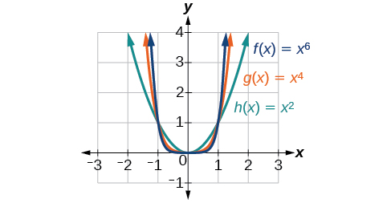{: #Figure_03_03_002}

To describe the behavior as numbers become larger and larger, we use the idea of infinity. We use the symbol<math xmlns="http://www.w3.org/1998/Math/MathML"> <mrow> <mtext> </mtext><mi>∞</mi><mtext> </mtext> </mrow> </math>

for positive infinity and<math xmlns="http://www.w3.org/1998/Math/MathML"> <mrow> <mtext> </mtext><mi>−∞</mi><mtext> </mtext> </mrow> </math>

for negative infinity. When we say that “<math xmlns="http://www.w3.org/1998/Math/MathML"> <mrow> <mi>x</mi><mtext> </mtext> </mrow> </math>

approaches infinity,” which can be symbolically written as<math xmlns="http://www.w3.org/1998/Math/MathML"> <mrow> <mtext> </mtext><mi>x</mi><mo stretchy="false">→</mo><mi>∞</mi><mo>,</mo><mtext> </mtext> </mrow> </math>

we are describing a behavior; we are saying that<math xmlns="http://www.w3.org/1998/Math/MathML"> <mrow> <mtext> </mtext><mi>x</mi><mtext> </mtext> </mrow> </math>

is increasing without bound.

With the positive even-power function, as the input increases or decreases without bound, the output values become very large, positive numbers. Equivalently, we could describe this behavior by saying that as<math xmlns="http://www.w3.org/1998/Math/MathML"> <mrow> <mtext> </mtext><mi>x</mi><mtext> </mtext> </mrow> </math>

approaches positive or negative infinity, the<math xmlns="http://www.w3.org/1998/Math/MathML"> <mrow> <mtext> </mtext><mi>f</mi><mrow><mo>(</mo> <mi>x</mi> <mo>)</mo></mrow><mtext> </mtext> </mrow> </math>

values increase without bound. In symbolic form, we could write

<math xmlns="http://www.w3.org/1998/Math/MathML" display="block"> <mrow> <mtext>as </mtext><mi>x</mi><mo stretchy="false">→</mo><mo>±</mo><mi>∞</mi><mo>,</mo><mo> </mo><mi>f</mi><mo stretchy="false">(</mo><mi>x</mi><mo stretchy="false">)</mo><mo stretchy="false">→</mo><mi>∞</mi> </mrow> </math>

[\[link\]](#Figure_03_03_003) shows the graphs of<math xmlns="http://www.w3.org/1998/Math/MathML"> <mrow> <mtext> </mtext><mi>f</mi><mo stretchy="false">(</mo><mi>x</mi><mo stretchy="false">)</mo><mo>=</mo><msup> <mi>x</mi> <mn>3</mn> </msup> <mo>,</mo><mtext> </mtext><mi>g</mi><mo stretchy="false">(</mo><mi>x</mi><mo stretchy="false">)</mo><mo>=</mo><msup> <mi>x</mi> <mn>5</mn> </msup> <mo>,</mo> </mrow> </math>

and<math xmlns="http://www.w3.org/1998/Math/MathML"> <mrow> <mtext> </mtext><mi>h</mi><mo stretchy="false">(</mo><mi>x</mi><mo stretchy="false">)</mo><mo>=</mo><msup> <mi>x</mi> <mn>7</mn> </msup> <mo>,</mo> </mrow> </math>

which are all power functions with odd, whole-number powers. Notice that these graphs look similar to the cubic function in the toolkit. Again, as the power increases, the graphs flatten near the origin and become steeper away from the origin.

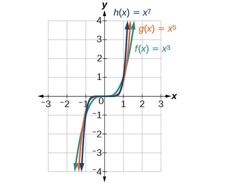{: #Figure_03_03_003}

These examples illustrate that functions of the form<math xmlns="http://www.w3.org/1998/Math/MathML"> <mrow> <mtext> </mtext><mi>f</mi><mrow><mo>(</mo> <mi>x</mi> <mo>)</mo></mrow><mo>=</mo><msup> <mi>x</mi> <mi>n</mi> </msup> <mtext> </mtext> </mrow> </math>

reveal symmetry of one kind or another. First, in [\[link\]](#Figure_03_03_002) we see that even functions of the form<math xmlns="http://www.w3.org/1998/Math/MathML"> <mrow> <mtext> </mtext><mi>f</mi><mrow><mo>(</mo> <mi>x</mi> <mo>)</mo></mrow><mo>=</mo><msup> <mi>x</mi> <mi>n</mi> </msup> <mtext>, </mtext><mi>n</mi><mtext> </mtext> </mrow> </math>

even, are symmetric about the<math xmlns="http://www.w3.org/1998/Math/MathML"> <mrow> <mtext> </mtext><mi>y</mi><mtext>-</mtext> </mrow> </math>

axis. In [\[link\]](#Figure_03_03_003) we see that odd functions of the form<math xmlns="http://www.w3.org/1998/Math/MathML"> <mrow> <mtext> </mtext><mi>f</mi><mrow><mo>(</mo> <mi>x</mi> <mo>)</mo></mrow><mo>=</mo><msup> <mi>x</mi> <mi>n</mi> </msup> <mtext>, </mtext><mi>n</mi><mtext> </mtext> </mrow> </math>

 odd, are symmetric about the origin.

For these odd power functions, as<math xmlns="http://www.w3.org/1998/Math/MathML"> <mrow> <mtext> </mtext><mi>x</mi><mtext> </mtext> </mrow> </math>

 approaches negative infinity,<math xmlns="http://www.w3.org/1998/Math/MathML"> <mrow> <mtext> </mtext><mi>f</mi><mrow><mo>(</mo> <mi>x</mi> <mo>)</mo></mrow><mtext> </mtext> </mrow> </math>

 decreases without bound. As<math xmlns="http://www.w3.org/1998/Math/MathML"> <mrow> <mtext> </mtext><mi>x</mi><mtext> </mtext> </mrow> </math>

 approaches positive infinity,<math xmlns="http://www.w3.org/1998/Math/MathML"> <mrow> <mtext> </mtext><mi>f</mi><mrow><mo>(</mo> <mi>x</mi> <mo>)</mo></mrow><mtext> </mtext> </mrow> </math>

 increases without bound. In symbolic form we write

<math xmlns="http://www.w3.org/1998/Math/MathML" display="block"> <mtable columnalign="left"> <mtr> <mtd> <mtext>as</mtext><mo> </mo><mi>x</mi><mo stretchy="false">→</mo><mo>−</mo><mi>∞</mi><mo>,</mo><mo> </mo><mi>f</mi><mo stretchy="false">(</mo><mi>x</mi><mo stretchy="false">)</mo><mo stretchy="false">→</mo><mo>−</mo><mi>∞</mi><mo> </mo> </mtd> </mtr> <mtr> <mtd> <mtext>as</mtext><mo> </mo><mi>x</mi><mo stretchy="false">→</mo><mi>∞</mi><mo>,</mo><mo> </mo><mi>f</mi><mo stretchy="false">(</mo><mi>x</mi><mo stretchy="false">)</mo><mo stretchy="false">→</mo><mi>∞</mi></mtd> </mtr> </mtable> </math>

The behavior of the graph of a function as the input values get very small (<math xmlns="http://www.w3.org/1998/Math/MathML"> <mrow> <mtext> </mtext><mi>x</mi><mo stretchy="false">→</mo><mi>−</mi><mi>∞</mi><mtext> </mtext> </mrow> </math>

) and get very large (<math xmlns="http://www.w3.org/1998/Math/MathML"> <mrow> <mtext> </mtext><mi>x</mi><mo stretchy="false">→</mo><mi>∞</mi><mtext> </mtext> </mrow> </math>

) is referred to as the **end behavior**{: data-type="term"} of the function. We can use words or symbols to describe end behavior.

[\[link\]](#Figure_03_03_004abcd) shows the end behavior of power functions in the form<math xmlns="http://www.w3.org/1998/Math/MathML"> <mrow> <mtext> </mtext><mi>f</mi><mo stretchy="false">(</mo><mi>x</mi><mo stretchy="false">)</mo><mo>=</mo><mi>k</mi><msup> <mi>x</mi> <mi>n</mi> </msup> <mtext> </mtext> </mrow> </math>

where<math xmlns="http://www.w3.org/1998/Math/MathML"> <mrow> <mtext> </mtext><mi>n</mi><mtext> </mtext> </mrow> </math>

is a non-negative integer depending on the power and the constant.

 ![Graph of an even-powered function with a positive constant. As x goes to negative infinity, the function goes to positive infinity; as x goes to positive infinity, the function goes to positive infinity. Graph of an odd-powered function with a positive constant. As x goes to negative infinity, the function goes to positive infinity; as x goes to positive infinity, the function goes to negative infinity. Graph of an even-powered function with a negative constant. As x goes to negative infinity, the function goes to negative infinity; as x goes to positive infinity, the function goes to negative infinity. Graph of an odd-powered function with a negative constant. As x goes to negative infinity, the function goes to negative infinity; as x goes to positive infinity, the function goes to negative infinity.](../resources/CNX_Precalc_Figure_03_03_004abcd.jpg){: #Figure_03_03_004abcd}

**Given a power function<math xmlns="http://www.w3.org/1998/Math/MathML"> <mrow> <mtext> </mtext><mi>f</mi><mo stretchy="false">(</mo><mi>x</mi><mo stretchy="false">)</mo><mo>=</mo><mi>k</mi><msup> <mi>x</mi> <mi>n</mi> </msup> <mtext> </mtext> </mrow> </math>

where**<math xmlns="http://www.w3.org/1998/Math/MathML"> <mrow> <mtext> </mtext><mi>n</mi><mtext> </mtext> </mrow> </math>

**is a non-negative integer, identify the end behavior.**

1.  Determine whether the power is even or odd.
2.  Determine whether the constant is positive or negative.
3.  Use [\[link\]](#Figure_03_03_004abcd) to identify the end behavior.
{: type="1"}

Identifying the End Behavior of a Power Function

Describe the end behavior of the graph of<math xmlns="http://www.w3.org/1998/Math/MathML"> <mrow> <mtext> </mtext><mi>f</mi><mo stretchy="false">(</mo><mi>x</mi><mo stretchy="false">)</mo><mo>=</mo><msup> <mi>x</mi> <mn>8</mn> </msup> <mo>.</mo> </mrow> </math>

The coefficient is 1 (positive) and the exponent of the power function is 8 (an even number). As<math xmlns="http://www.w3.org/1998/Math/MathML"> <mrow> <mtext> </mtext><mi>x</mi><mtext> </mtext> </mrow> </math>

approaches infinity, the output (value of<math xmlns="http://www.w3.org/1998/Math/MathML"> <mrow> <mtext> </mtext><mi>f</mi><mo stretchy="false">(</mo><mi>x</mi><mo stretchy="false">)</mo><mtext> </mtext> </mrow> </math>

) increases without bound. We write as<math xmlns="http://www.w3.org/1998/Math/MathML"> <mrow> <mtext> </mtext><mi>x</mi><mo stretchy="false">→</mo><mi>∞</mi><mo>,</mo><mi>f</mi><mo stretchy="false">(</mo><mi>x</mi><mo stretchy="false">)</mo><mo stretchy="false">→</mo><mi>∞</mi><mo>.</mo><mtext> </mtext> </mrow> </math>

As<math xmlns="http://www.w3.org/1998/Math/MathML"> <mrow> <mtext> </mtext><mi>x</mi><mtext> </mtext> </mrow> </math>

approaches negative infinity, the output increases without bound. In symbolic form, as<math xmlns="http://www.w3.org/1998/Math/MathML"> <mrow> <mi>x</mi><mo stretchy="false">→</mo><mi>−</mi><mi>∞</mi><mo>,</mo><mo> </mo><mi>f</mi><mo stretchy="false">(</mo><mi>x</mi><mo stretchy="false">)</mo><mo stretchy="false">→</mo><mi>∞</mi><mo>.</mo> </mrow> </math>

 We can graphically represent the function as shown in [[link]](#Figure_03_03_008).

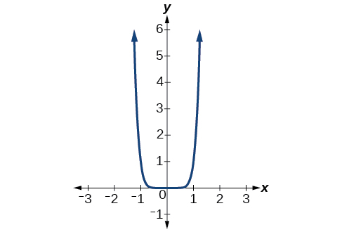{: #Figure_03_03_008}

Identifying the End Behavior of a Power Function.

Describe the end behavior of the graph of<math xmlns="http://www.w3.org/1998/Math/MathML"> <mrow> <mtext> </mtext><mi>f</mi><mo stretchy="false">(</mo><mi>x</mi><mo stretchy="false">)</mo><mo>=</mo><mo>−</mo><msup> <mi>x</mi> <mn>9</mn> </msup> <mo>.</mo> </mrow> </math>

The exponent of the power function is 9 (an odd number). Because the coefficient is<math xmlns="http://www.w3.org/1998/Math/MathML"> <mrow> <mtext> </mtext><mn>–1</mn><mtext> </mtext> </mrow> </math>

(negative), the graph is the reflection about the<math xmlns="http://www.w3.org/1998/Math/MathML"> <mrow> <mtext> </mtext><mi>x</mi><mtext>-</mtext> </mrow> </math>

axis of the graph of<math xmlns="http://www.w3.org/1998/Math/MathML"> <mrow> <mtext> </mtext><mi>f</mi><mo stretchy="false">(</mo><mi>x</mi><mo stretchy="false">)</mo><mo>=</mo><msup> <mi>x</mi> <mn>9</mn> </msup> <mo>.</mo><mtext> </mtext> </mrow> </math>

[[link]](#Figure_03_03_009) shows that as<math xmlns="http://www.w3.org/1998/Math/MathML"> <mrow> <mtext> </mtext><mi>x</mi><mtext> </mtext> </mrow> </math>

approaches infinity, the output decreases without bound. As<math xmlns="http://www.w3.org/1998/Math/MathML"> <mrow> <mtext> </mtext><mi>x</mi><mtext> </mtext> </mrow> </math>

approaches negative infinity, the output increases without bound. In symbolic form, we would write

<math xmlns="http://www.w3.org/1998/Math/MathML" display="block"> <mtable columnalign="left"> <mtr> <mtd> <mtext>as</mtext><mo> </mo><mi>x</mi><mo stretchy="false">→</mo><mi>−</mi><mi>∞</mi><mo>,</mo><mo> </mo><mi>f</mi><mo stretchy="false">(</mo><mi>x</mi><mo stretchy="false">)</mo><mo stretchy="false">→</mo><mi>∞</mi><mo> </mo> </mtd> </mtr> <mtr> <mtd> <mtext>as</mtext><mo> </mo><mi>x</mi><mo stretchy="false">→</mo><mi>∞</mi><mo>,</mo><mo> </mo><mi>f</mi><mo stretchy="false">(</mo><mi>x</mi><mo stretchy="false">)</mo><mo stretchy="false">→</mo><mi>−</mi><mi>∞</mi></mtd> </mtr> </mtable> </math>

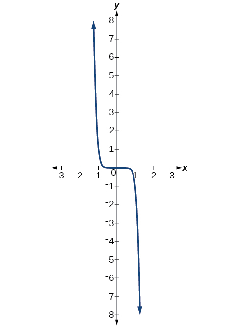{: #Figure_03_03_009}

Analysis

We can check our work by using the table feature on a graphing utility.

| <math xmlns="http://www.w3.org/1998/Math/MathML"> <mi>x</mi> </math>

 | <math xmlns="http://www.w3.org/1998/Math/MathML"> <mrow> <mi>f</mi><mrow><mo>(</mo> <mi>x</mi> <mo>)</mo></mrow> </mrow> </math>

 |
|----------
| –10 | 1,000,000,000 |
| –5 | 1,953,125 |
| 0 | 0 |
| 5 | –1,953,125 |
| 10 | –1,000,000,000 |
{: #Table_03_03_03 summary=".."}

We can see from [[link]](#Table_03_03_03) that, when we substitute very small values for<math xmlns="http://www.w3.org/1998/Math/MathML"> <mrow> <mtext> </mtext><mi>x</mi><mo>,</mo><mtext> </mtext> </mrow> </math>

the output is very large, and when we substitute very large values for<math xmlns="http://www.w3.org/1998/Math/MathML"> <mrow> <mtext> </mtext><mi>x</mi><mo>,</mo><mtext> </mtext> </mrow> </math>

the output is very small (meaning that it is a very large negative value).

Describe in words and symbols the end behavior of<math xmlns="http://www.w3.org/1998/Math/MathML"> <mrow> <mtext> </mtext><mi>f</mi><mo stretchy="false">(</mo><mi>x</mi><mo stretchy="false">)</mo><mo>=</mo><mo>−</mo><mn>5</mn><msup> <mi>x</mi> <mn>4</mn> </msup> <mo>.</mo> </mrow> </math>

As<math xmlns="http://www.w3.org/1998/Math/MathML"> <mrow> <mtext> </mtext><mi>x</mi><mtext> </mtext> </mrow> </math>

approaches positive or negative infinity,<math xmlns="http://www.w3.org/1998/Math/MathML"> <mrow> <mtext> </mtext><mi>f</mi><mrow><mo>(</mo> <mi>x</mi> <mo>)</mo></mrow><mtext> </mtext> </mrow> </math>

decreases without bound: as<math xmlns="http://www.w3.org/1998/Math/MathML"> <mrow> <mtext> </mtext><mi>x</mi><mo stretchy="false">→</mo><mo>±</mo><mi>∞</mi><mo>,</mo><mo> </mo><mi>f</mi><mo stretchy="false">(</mo><mi>x</mi><mo stretchy="false">)</mo><mo stretchy="false">→</mo><mo>−</mo><mi>∞</mi><mtext> </mtext> </mrow> </math>

because of the negative coefficient.

### Identifying Polynomial Functions

An oil pipeline bursts in the Gulf of Mexico, causing an oil slick in a roughly circular shape. The slick is currently 24 miles in radius, but that radius is increasing by 8 miles each week. We want to write a formula for the area covered by the oil slick by combining two functions. The radius<math xmlns="http://www.w3.org/1998/Math/MathML"> <mrow> <mtext> </mtext><mi>r</mi><mtext> </mtext> </mrow> </math>

 of the spill depends on the number of weeks<math xmlns="http://www.w3.org/1998/Math/MathML"> <mrow> <mtext> </mtext><mi>w</mi><mtext> </mtext> </mrow> </math>

 that have passed. This relationship is linear.

<math xmlns="http://www.w3.org/1998/Math/MathML" display="block"> <mrow> <mi>r</mi><mo stretchy="false">(</mo><mi>w</mi><mo stretchy="false">)</mo><mo>=</mo><mn>24</mn><mo>+</mo><mn>8</mn><mi>w</mi> </mrow> </math>

We can combine this with the formula for the area<math xmlns="http://www.w3.org/1998/Math/MathML"> <mrow> <mtext> </mtext><mi>A</mi><mtext> </mtext> </mrow> </math>

 of a circle.

<math xmlns="http://www.w3.org/1998/Math/MathML" display="block"> <mrow> <mi>A</mi><mo stretchy="false">(</mo><mi>r</mi><mo stretchy="false">)</mo><mo>=</mo><mi>π</mi><msup> <mi>r</mi> <mn>2</mn> </msup> </mrow> </math>

Composing these functions gives a formula for the area in terms of weeks.

<math xmlns="http://www.w3.org/1998/Math/MathML" display="block"> <mrow> <mtable> <mtr rowalign="center"> <mtd columnalign="right" rowalign="center"> <mrow> <mi>A</mi><mo stretchy="false">(</mo><mi>w</mi><mo stretchy="false">)</mo></mrow> </mtd> <mtd rowalign="center"><mo>=</mo></mtd> <mtd columnalign="left" rowalign="center"> <mrow> <mi>A</mi><mo stretchy="false">(</mo><mi>r</mi><mo stretchy="false">(</mo><mi>w</mi><mo stretchy="false">)</mo><mo stretchy="false">)</mo></mrow> </mtd> </mtr> <mtr rowalign="center"> <mtd rowalign="center" /> <mtd rowalign="center"><mo>=</mo></mtd> <mtd columnalign="left" rowalign="center"> <mrow> <mi>A</mi><mo stretchy="false">(</mo><mn>24</mn><mo>+</mo><mn>8</mn><mi>w</mi><mo stretchy="false">)</mo></mrow> </mtd> </mtr> <mtr rowalign="center"> <mtd rowalign="center" /> <mtd rowalign="center"><mo>=</mo></mtd> <mtd columnalign="left" rowalign="center"> <mrow> <mi>π</mi><msup> <mrow> <mo stretchy="false">(</mo><mn>24</mn><mo>+</mo><mn>8</mn><mi>w</mi><mo stretchy="false">)</mo></mrow> <mn>2</mn> </msup> </mrow> </mtd> </mtr> </mtable></mrow> </math>

Multiplying gives the formula.

<math xmlns="http://www.w3.org/1998/Math/MathML" display="block"> <mrow> <mi>A</mi><mo stretchy="false">(</mo><mi>w</mi><mo stretchy="false">)</mo><mo>=</mo><mn>576</mn><mi>π</mi><mo>+</mo><mn>384</mn><mi>π</mi><mi>w</mi><mo>+</mo><mn>64</mn><mi>π</mi><msup> <mi>w</mi> <mn>2</mn> </msup> </mrow> </math>

This formula is an example of a **polynomial function**. A polynomial function consists of either zero or the sum of a finite number of non-zero terms, each of which is a product of a number, called the coefficient of the term, and a variable raised to a non-negative integer power.

Polynomial Functions

Let<math xmlns="http://www.w3.org/1998/Math/MathML"> <mrow> <mtext> </mtext><mi>n</mi><mtext> </mtext> </mrow> </math>

 be a non-negative integer. A **polynomial function**{: data-type="term"} is a function that can be written in the form

<math xmlns="http://www.w3.org/1998/Math/MathML" display="block"> <mrow> <mi>f</mi><mo stretchy="false">(</mo><mi>x</mi><mo stretchy="false">)</mo><mo>=</mo><msub> <mi>a</mi> <mi>n</mi> </msub> <msup> <mi>x</mi> <mi>n</mi> </msup> <mo>+</mo> <mn>...</mn> <mo>+</mo><msub> <mi>a</mi> <mn>2</mn> </msub> <msup> <mi>x</mi> <mn>2</mn> </msup> <mo>+</mo><msub> <mi>a</mi> <mn>1</mn> </msub> <mi>x</mi><mo>+</mo><msub> <mi>a</mi> <mn>0</mn> </msub> </mrow> </math>

This is called the general form of a polynomial function. Each<math xmlns="http://www.w3.org/1998/Math/MathML"> <mrow> <mtext> </mtext><msub> <mi>a</mi> <mi>i</mi> </msub> <mtext> </mtext> </mrow> </math>

 is a coefficient and can be any real number, but <math xmlns="http://www.w3.org/1998/Math/MathML"> <mrow> <mtext> </mtext><msub> <mi>a</mi> <mi>n</mi> </msub> <mtext> </mtext> </mrow> </math>

cannot = 0. Each expression<math xmlns="http://www.w3.org/1998/Math/MathML"> <mrow> <mtext> </mtext><msub> <mi>a</mi> <mi>i</mi> </msub> <msup> <mi>x</mi> <mi>i</mi> </msup> <mtext> </mtext> </mrow> </math>

 is a **term of a polynomial function**{: data-type="term"}.

Identifying Polynomial Functions

Which of the following are polynomial functions?* * *
{: data-type="newline" data-count="1"}

<math xmlns="http://www.w3.org/1998/Math/MathML" display="block"> <mrow> <mtable> <mtr> <mtd columnalign="right"> <mrow> <mi>f</mi><mo stretchy="false">(</mo><mi>x</mi><mo stretchy="false">)</mo></mrow> </mtd> <mtd> <mo>=</mo> </mtd> <mtd columnalign="left"> <mrow> <mn>2</mn><msup> <mi>x</mi> <mn>3</mn> </msup> <mo>⋅</mo><mn>3</mn><mi>x</mi><mo>+</mo><mn>4</mn></mrow> </mtd> </mtr> <mtr> <mtd columnalign="right"> <mrow> <mi>g</mi><mo stretchy="false">(</mo><mi>x</mi><mo stretchy="false">)</mo></mrow> </mtd> <mtd> <mo>=</mo> </mtd> <mtd columnalign="left"> <mrow> <mo>−</mo><mi>x</mi><mo stretchy="false">(</mo><msup> <mi>x</mi> <mn>2</mn> </msup> <mo>−</mo><mn>4</mn><mo stretchy="false">)</mo></mrow> </mtd> </mtr> <mtr> <mtd columnalign="right"> <mrow> <mi>h</mi><mo stretchy="false">(</mo><mi>x</mi><mo stretchy="false">)</mo></mrow> </mtd> <mtd> <mo>=</mo> </mtd> <mtd columnalign="left"> <mrow> <mn>5</mn><msqrt> <mrow> <mi>x</mi><mo>+</mo><mn>2</mn></mrow> </msqrt> </mrow> </mtd> </mtr> </mtable></mrow> </math>

The first two functions are examples of polynomial functions because they can be written in the form<math xmlns="http://www.w3.org/1998/Math/MathML"> <mrow> <mtext> </mtext><mi>f</mi><mo stretchy="false">(</mo><mi>x</mi><mo stretchy="false">)</mo><mo>=</mo><msub> <mi>a</mi> <mi>n</mi> </msub> <msup> <mi>x</mi> <mi>n</mi> </msup> <mo>+</mo><mn>...</mn><mo>+</mo><msub> <mi>a</mi> <mn>2</mn> </msub> <msup> <mi>x</mi> <mn>2</mn> </msup> <mo>+</mo><msub> <mi>a</mi> <mn>1</mn> </msub> <mi>x</mi><mo>+</mo><msub> <mi>a</mi> <mn>0</mn> </msub> <mo>,</mo><mtext> </mtext> </mrow> </math>

 where the powers are non-negative integers and the coefficients are real numbers.

* <math xmlns="http://www.w3.org/1998/Math/MathML"> <mrow> <mi>f</mi><mo stretchy="false">(</mo><mi>x</mi><mo stretchy="false">)</mo><mtext> </mtext> </mrow> </math>
  
  can be written as
  <math xmlns="http://www.w3.org/1998/Math/MathML"> <mrow> <mtext> </mtext><mi>f</mi><mo stretchy="false">(</mo><mi>x</mi><mo stretchy="false">)</mo><mo>=</mo><mn>6</mn><msup> <mi>x</mi> <mn>4</mn> </msup> <mo>+</mo><mn>4.</mn> </mrow> </math>

* <math xmlns="http://www.w3.org/1998/Math/MathML"> <mrow> <mi>g</mi><mo stretchy="false">(</mo><mi>x</mi><mo stretchy="false">)</mo><mtext> </mtext> </mrow> </math>
  
  can be written as
  <math xmlns="http://www.w3.org/1998/Math/MathML"> <mrow> <mtext> </mtext><mi>g</mi><mo stretchy="false">(</mo><mi>x</mi><mo stretchy="false">)</mo><mo>=</mo><mo>−</mo><msup> <mi>x</mi> <mn>3</mn> </msup> <mo>+</mo><mn>4</mn><mi>x</mi><mo>.</mo> </mrow> </math>

* <math xmlns="http://www.w3.org/1998/Math/MathML"> <mrow> <mi>h</mi><mo stretchy="false">(</mo><mi>x</mi><mo stretchy="false">)</mo><mtext> </mtext> </mrow> </math>
  
  cannot be written in this form and is therefore not a polynomial function.

### Identifying the Degree and Leading Coefficient of a Polynomial Function

Because of the form of a polynomial function, we can see an infinite variety in the number of terms and the power of the variable. Although the order of the terms in the polynomial function is not important for performing operations, we typically arrange the terms in descending order of power, or in general form. The **degree**{: data-type="term"} of the polynomial is the highest power of the variable that occurs in the polynomial; it is the power of the first variable if the function is in general form. The **leading term**{: data-type="term"} is the term containing the highest power of the variable, or the term with the highest degree. The **leading coefficient**{: data-type="term"} is the coefficient of the leading term.

Terminology of Polynomial Functions

We often rearrange polynomials so that the powers are descending.

  
When a polynomial is written in this way, we say that it is in general form.

**Given a polynomial function, identify the degree and leading coefficient.**

1.  Find the highest power of
    <math xmlns="http://www.w3.org/1998/Math/MathML"> <mrow> <mtext> </mtext><mi>x</mi><mtext> </mtext> </mrow> </math>
    
    to determine the degree function.
2.  Identify the term containing the highest power of
    <math xmlns="http://www.w3.org/1998/Math/MathML"> <mrow> <mtext> </mtext><mi>x</mi><mtext> </mtext> </mrow> </math>
    
    to find the leading term.
3.  Identify the coefficient of the leading term.
{: type="1"}

Identifying the Degree and Leading Coefficient of a Polynomial Function

Identify the degree, leading term, and leading coefficient of the following polynomial functions.

<math xmlns="http://www.w3.org/1998/Math/MathML" display="block"> <mrow> <mtable> <mtr> <mtd columnalign="right"> <mrow> <mi>f</mi><mo stretchy="false">(</mo><mi>x</mi><mo stretchy="false">)</mo></mrow> </mtd> <mtd> <mo>=</mo> </mtd> <mtd columnalign="left"> <mrow> <mn>3</mn><mo>+</mo><mn>2</mn><msup> <mi>x</mi> <mn>2</mn> </msup> <mo>−</mo><mn>4</mn><msup> <mi>x</mi> <mn>3</mn> </msup> </mrow> </mtd> </mtr> <mtr> <mtd columnalign="right"> <mrow> <mi>g</mi><mo stretchy="false">(</mo><mi>t</mi><mo stretchy="false">)</mo></mrow> </mtd> <mtd> <mo>=</mo> </mtd> <mtd columnalign="left"> <mrow> <mn>5</mn><msup> <mi>t</mi> <mn>5</mn> </msup> <mo>−</mo><mn>2</mn><msup> <mi>t</mi> <mn>3</mn> </msup> <mo>+</mo><mn>7</mn><mi>t</mi></mrow> </mtd> </mtr> <mtr> <mtd columnalign="left"> <mrow> <mi>h</mi><mo stretchy="false">(</mo><mi>p</mi><mo stretchy="false">)</mo></mrow> </mtd> <mtd> <mo>=</mo> </mtd> <mtd columnalign="left"> <mrow> <mn>6</mn><mi>p</mi><mo>−</mo><msup> <mi>p</mi> <mn>3</mn> </msup> <mo>−</mo><mn>2</mn></mrow> </mtd> </mtr> </mtable></mrow> </math>

For the function<math xmlns="http://www.w3.org/1998/Math/MathML"> <mrow> <mtext> </mtext><mi>f</mi><mrow><mo>(</mo> <mi>x</mi> <mo>)</mo></mrow><mo>,</mo><mtext> </mtext> </mrow> </math>

the highest power of<math xmlns="http://www.w3.org/1998/Math/MathML"> <mrow> <mtext> </mtext><mi>x</mi><mtext> </mtext> </mrow> </math>

is 3, so the degree is 3. The leading term is the term containing that degree,<math xmlns="http://www.w3.org/1998/Math/MathML"> <mrow> <mtext> </mtext><mn>−4</mn><msup> <mi>x</mi> <mn>3</mn> </msup> <mo>.</mo><mtext> </mtext> </mrow> </math>

The leading coefficient is the coefficient of that term,<math xmlns="http://www.w3.org/1998/Math/MathML"> <mrow> <mtext> </mtext><mn>−4.</mn> </mrow> </math>

For the function<math xmlns="http://www.w3.org/1998/Math/MathML"> <mrow> <mtext> </mtext><mi>g</mi><mrow><mo>(</mo> <mi>t</mi> <mo>)</mo></mrow><mo>,</mo><mtext> </mtext> </mrow> </math>

the highest power of<math xmlns="http://www.w3.org/1998/Math/MathML"> <mrow> <mtext> </mtext><mi>t</mi><mtext> </mtext> </mrow> </math>

is<math xmlns="http://www.w3.org/1998/Math/MathML"> <mrow> <mtext> </mtext><mn>5</mn><mo>,</mo><mtext> </mtext> </mrow> </math>

so the degree is<math xmlns="http://www.w3.org/1998/Math/MathML"> <mrow> <mtext> </mtext><mn>5.</mn><mtext> </mtext> </mrow> </math>

The leading term is the term containing that degree,<math xmlns="http://www.w3.org/1998/Math/MathML"> <mrow> <mtext> </mtext><mn>5</mn><msup> <mi>t</mi> <mn>5</mn> </msup> <mo>.</mo><mtext> </mtext> </mrow> </math>

The leading coefficient is the coefficient of that term,<math xmlns="http://www.w3.org/1998/Math/MathML"> <mrow> <mtext> </mtext><mn>5.</mn> </mrow> </math>

For the function<math xmlns="http://www.w3.org/1998/Math/MathML"> <mrow> <mtext> </mtext><mi>h</mi><mrow><mo>(</mo> <mi>p</mi> <mo>)</mo></mrow><mo>,</mo><mtext> </mtext> </mrow> </math>

the highest power of<math xmlns="http://www.w3.org/1998/Math/MathML"> <mrow> <mtext> </mtext><mi>p</mi><mtext> </mtext> </mrow> </math>

is<math xmlns="http://www.w3.org/1998/Math/MathML"> <mrow> <mtext> </mtext><mn>3</mn><mo>,</mo><mtext> </mtext> </mrow> </math>

so the degree is<math xmlns="http://www.w3.org/1998/Math/MathML"> <mrow> <mtext> </mtext><mn>3.</mn><mtext> </mtext> </mrow> </math>

The leading term is the term containing that degree,<math xmlns="http://www.w3.org/1998/Math/MathML"> <mrow> <mtext> </mtext><mi>−</mi><msup><mi>p</mi> <mn>3</mn> </msup> <mo>.</mo><mtext> </mtext> </mrow> </math>

The leading coefficient is the coefficient of that term,<math xmlns="http://www.w3.org/1998/Math/MathML"> <mrow> <mtext> </mtext><mn>−1.</mn> </mrow> </math>

Identify the degree, leading term, and leading coefficient of the polynomial<math xmlns="http://www.w3.org/1998/Math/MathML"> <mrow> <mtext> </mtext><mi>f</mi><mo stretchy="false">(</mo><mi>x</mi><mo stretchy="false">)</mo><mo>=</mo><mn>4</mn><msup> <mi>x</mi> <mn>2</mn> </msup> <mo>−</mo><msup> <mi>x</mi> <mn>6</mn> </msup> <mo>+</mo><mn>2</mn><mi>x</mi><mo>−</mo><mn>6.</mn> </mrow> </math>

The degree is 6. The leading term is<math xmlns="http://www.w3.org/1998/Math/MathML"> <mrow> <mtext> </mtext><mo>−</mo><msup> <mi>x</mi> <mn>6</mn> </msup> <mo>.</mo><mtext> </mtext> </mrow> </math>

The leading coefficient is<math xmlns="http://www.w3.org/1998/Math/MathML"> <mrow> <mtext> </mtext><mo>−</mo><mn>1.</mn> </mrow> </math>

#### Identifying End Behavior of Polynomial Functions

Knowing the degree of a polynomial function is useful in helping us predict its end behavior. To determine its end behavior, look at the leading term of the polynomial function. Because the power of the leading term is the highest, that term will grow significantly faster than the other terms as<math xmlns="http://www.w3.org/1998/Math/MathML"> <mrow> <mtext> </mtext><mi>x</mi><mtext> </mtext> </mrow> </math>

 gets very large or very small, so its behavior will dominate the graph. For any polynomial, the end behavior of the polynomial will match the end behavior of the power function consisting of the leading term. See [\[link\]](#Table_03_03_04).

<table id="Table_03_03_04" summary=".."><colgroup><col data-align="center" /><col /><col /></colgroup><thead>
  <tr>
   <th data-align="center">Polynomial Function</th>
   <th data-align="center">Leading Term</th>
   <th data-align="center">Graph of Polynomial Function</th>
  </tr>
 </thead><tbody>
  <tr>
   <td data-valign="top"><math xmlns="http://www.w3.org/1998/Math/MathML">
    <mrow>
     <mi>f</mi><mo stretchy="false">(</mo><mi>x</mi><mo stretchy="false">)</mo><mo>=</mo><mn>5</mn><msup>
      <mi>x</mi>
      <mn>4</mn>
     </msup>
     <mo>+</mo><mn>2</mn><msup>
      <mi>x</mi>
      <mn>3</mn>
     </msup>
     <mo>−</mo><mi>x</mi><mo>−</mo><mn>4</mn>
    </mrow>
   </math>
   </td>
   <td><math xmlns="http://www.w3.org/1998/Math/MathML">
    <mrow>
     <mn>5</mn><msup>
      <mi>x</mi>
      <mn>4</mn>
     </msup>
     
    </mrow>
   </math>
   </td>
   <td>
    
     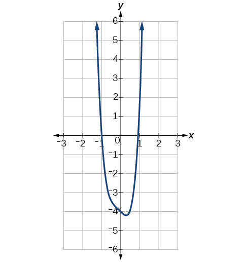
    
</td>
  </tr>
  <tr>
   <td data-valign="top"><math xmlns="http://www.w3.org/1998/Math/MathML">
    <mrow>
     <mi>f</mi><mo stretchy="false">(</mo><mi>x</mi><mo stretchy="false">)</mo><mo>=</mo><mo>−</mo><mn>2</mn><msup>
      <mi>x</mi>
      <mn>6</mn>
     </msup>
     <mo>−</mo><msup>
      <mi>x</mi>
      <mn>5</mn>
     </msup>
     <mo>+</mo><mn>3</mn><msup>
      <mi>x</mi>
      <mn>4</mn>
     </msup>
     <mo>+</mo><msup>
      <mi>x</mi>
      <mn>3</mn>
     </msup>
     
    </mrow>
   </math>
   </td>
   <td><math xmlns="http://www.w3.org/1998/Math/MathML">
    <mrow>
     <mo>−</mo><mn>2</mn><msup>
      <mi>x</mi>
      <mn>6</mn>
     </msup>
     
    </mrow>
   </math>
   </td>
   <td data-valign="top">
    
     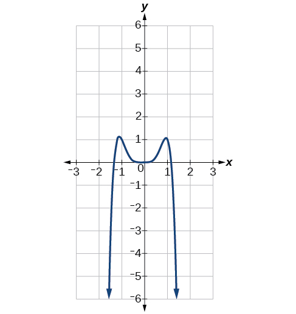
    
</td>
  </tr>
  <tr>
   <td data-valign="top"><math xmlns="http://www.w3.org/1998/Math/MathML">
    <mrow>
     <mi>f</mi><mo stretchy="false">(</mo><mi>x</mi><mo stretchy="false">)</mo><mo>=</mo><mn>3</mn><msup>
      <mi>x</mi>
      <mn>5</mn>
     </msup>
     <mo>−</mo><mn>4</mn><msup>
      <mi>x</mi>
      <mn>4</mn>
     </msup>
     <mo>+</mo><mn>2</mn><msup>
      <mi>x</mi>
      <mn>2</mn>
     </msup>
     <mo>+</mo><mn>1</mn>
    </mrow>
   </math>
   </td>
   <td><math xmlns="http://www.w3.org/1998/Math/MathML">
    <mrow>
     <mn>3</mn><msup>
      <mi>x</mi>
      <mn>5</mn>
     </msup>
     
    </mrow>
   </math>
   </td>
   <td>
    
     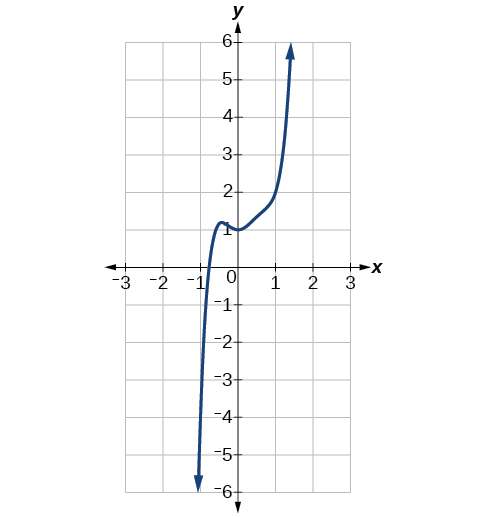
    
</td>
  </tr>
  <tr>
   <td data-valign="top"><math xmlns="http://www.w3.org/1998/Math/MathML">
    <mrow>
     <mi>f</mi><mo stretchy="false">(</mo><mi>x</mi><mo stretchy="false">)</mo><mo>=</mo><mo>−</mo><mn>6</mn><msup>
      <mi>x</mi>
      <mn>3</mn>
     </msup>
     <mo>+</mo><mn>7</mn><msup>
      <mi>x</mi>
      <mn>2</mn>
     </msup>
     <mo>+</mo><mn>3</mn><mi>x</mi><mo>+</mo><mn>1</mn>
    </mrow>
   </math>
   </td>
   <td><math xmlns="http://www.w3.org/1998/Math/MathML">
    <mrow>
     <mo>−</mo><mn>6</mn><msup>
      <mi>x</mi>
      <mn>3</mn>
     </msup>
     
    </mrow>
   </math>
   </td>
   <td>
    
     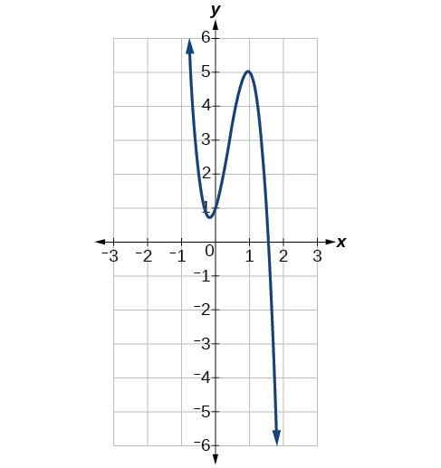
    
</td>
  </tr>
 </tbody></table>

Identifying End Behavior and Degree of a Polynomial Function

Describe the end behavior and determine a possible degree of the polynomial function in [[link]](#Figure_03_03_015).

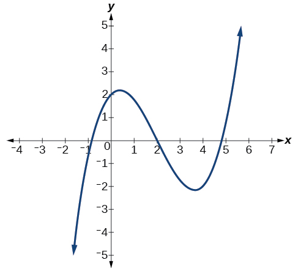{: #Figure_03_03_015}

As the input values<math xmlns="http://www.w3.org/1998/Math/MathML"> <mrow> <mtext> </mtext><mi>x</mi><mtext> </mtext> </mrow> </math>

 get very large, the output values<math xmlns="http://www.w3.org/1998/Math/MathML"> <mrow> <mtext> </mtext><mi>f</mi><mo stretchy="false">(</mo><mi>x</mi><mo stretchy="false">)</mo><mtext> </mtext> </mrow> </math>

increase without bound. As the input values<math xmlns="http://www.w3.org/1998/Math/MathML"> <mrow> <mtext> </mtext><mi>x</mi><mtext> </mtext> </mrow> </math>

 get very small, the output values<math xmlns="http://www.w3.org/1998/Math/MathML"> <mrow> <mtext> </mtext><mi>f</mi><mo stretchy="false">(</mo><mi>x</mi><mo stretchy="false">)</mo><mtext> </mtext> </mrow> </math>

decrease without bound. We can describe the end behavior symbolically by writing

<math xmlns="http://www.w3.org/1998/Math/MathML" display="block"> <mtable columnalign="left"> <mtr> <mtd> <mtext>as</mtext><mo> </mo><mi>x</mi><mo stretchy="false">→</mo><mi>−</mi><mi>∞</mi><mo>,</mo><mo> </mo><mi>f</mi><mo stretchy="false">(</mo><mi>x</mi><mo stretchy="false">)</mo><mo stretchy="false">→</mo><mi>−</mi><mi>∞</mi><mo> </mo> </mtd> </mtr> <mtr> <mtd> <mtext>as</mtext><mo> </mo><mi>x</mi><mo stretchy="false">→</mo><mi>∞</mi><mo>,</mo><mo> </mo><mi>f</mi><mo stretchy="false">(</mo><mi>x</mi><mo stretchy="false">)</mo><mo stretchy="false">→</mo><mi>∞</mi> </mtd> </mtr> </mtable> </math>

In words, we could say that as<math xmlns="http://www.w3.org/1998/Math/MathML"> <mrow> <mtext> </mtext><mi>x</mi><mtext> </mtext> </mrow> </math>

values approach infinity, the function values approach infinity, and as<math xmlns="http://www.w3.org/1998/Math/MathML"> <mrow> <mtext> </mtext><mi>x</mi><mtext> </mtext> </mrow> </math>

values approach negative infinity, the function values approach negative infinity.

We can tell this graph has the shape of an odd degree power function that has not been reflected, so the degree of the polynomial creating this graph must be odd and the leading coefficient must be positive.

Describe the end behavior, and determine a possible degree of the polynomial function in [[link]](#Figure_03_03_016).

{: #Figure_03_03_016}

As<math xmlns="http://www.w3.org/1998/Math/MathML"> <mrow> <mtext> </mtext><mi>x</mi><mo stretchy="false">→</mo><mi>∞</mi><mo>,</mo><mo> </mo><mi>f</mi><mo stretchy="false">(</mo><mi>x</mi><mo stretchy="false">)</mo><mo stretchy="false">→</mo><mo>−</mo><mi>∞</mi><mo>;</mo><mo> </mo><mi>a</mi><mi>s</mi><mo> </mo><mi>x</mi><mo stretchy="false">→</mo><mo>−</mo><mi>∞</mi><mo>,</mo><mo> </mo><mi>f</mi><mo stretchy="false">(</mo><mi>x</mi><mo stretchy="false">)</mo><mo stretchy="false">→</mo><mo>−</mo><mi>∞</mi><mo>.</mo><mtext> </mtext> </mrow> </math>

It has the shape of an even degree power function with a negative coefficient.

Identifying End Behavior and Degree of a Polynomial Function

Given the function<math xmlns="http://www.w3.org/1998/Math/MathML"> <mrow> <mtext> </mtext><mi>f</mi><mo stretchy="false">(</mo><mi>x</mi><mo stretchy="false">)</mo><mo>=</mo><mo>−</mo><mn>3</mn><msup> <mi>x</mi> <mn>2</mn> </msup> <mo stretchy="false">(</mo><mi>x</mi><mo>−</mo><mn>1</mn><mo stretchy="false">)</mo><mo stretchy="false">(</mo><mi>x</mi><mo>+</mo><mn>4</mn><mo stretchy="false">)</mo><mo>,</mo><mtext> </mtext> </mrow> </math>

express the function as a polynomial in general form, and determine the leading term, degree, and end behavior of the function.

Obtain the general form by expanding the given expression for<math xmlns="http://www.w3.org/1998/Math/MathML"> <mrow> <mtext> </mtext><mi>f</mi><mrow><mo>(</mo> <mi>x</mi> <mo>)</mo></mrow><mo>.</mo> </mrow> </math>

<math xmlns="http://www.w3.org/1998/Math/MathML" display="block"> <mrow> <mtable> <mtr rowalign="center"> <mtd rowalign="center" columnalign="right"> <mrow> <mi>f</mi><mo stretchy="false">(</mo><mi>x</mi><mo stretchy="false">)</mo></mrow> </mtd> <mtd rowalign="center"> <mo>=</mo> </mtd> <mtd rowalign="center" columnalign="left"> <mrow> <mn>−3</mn><msup> <mi>x</mi> <mn>2</mn> </msup> <mo stretchy="false">(</mo><mi>x</mi><mo>−</mo><mn>1</mn><mo stretchy="false">)</mo><mo stretchy="false">(</mo><mi>x</mi><mo>+</mo><mn>4</mn><mo stretchy="false">)</mo></mrow> </mtd> </mtr> <mtr> <mtd rowalign="center" /> <mtd rowalign="center"><mo>=</mo></mtd> <mtd rowalign="center" columnalign="left"> <mrow> <mn>−3</mn><msup> <mi>x</mi> <mn>2</mn> </msup> <mrow><mo>(</mo> <mrow> <msup> <mi>x</mi> <mn>2</mn> </msup> <mo>+</mo><mn>3</mn><mi>x</mi><mo>−</mo><mn>4</mn></mrow> <mo>)</mo></mrow></mrow> </mtd> </mtr> <mtr rowalign="center"> <mtd rowalign="center" /> <mtd rowalign="center"><mo>=</mo></mtd> <mtd rowalign="center" columnalign="left"> <mrow> <mn>−3</mn><msup> <mi>x</mi> <mn>4</mn> </msup> <mo>−</mo><mn>9</mn><msup> <mi>x</mi> <mn>3</mn> </msup> <mo>+</mo><mn>12</mn><msup> <mi>x</mi> <mn>2</mn> </msup> </mrow> </mtd> </mtr> </mtable></mrow> </math>

The general form is<math xmlns="http://www.w3.org/1998/Math/MathML"> <mrow> <mtext> </mtext><mi>f</mi><mrow><mo>(</mo> <mi>x</mi> <mo>)</mo></mrow><mo>=</mo><mn>−3</mn><msup> <mi>x</mi> <mn>4</mn> </msup> <mo>−</mo><mn>9</mn><msup> <mi>x</mi> <mn>3</mn> </msup> <mo>+</mo><mn>12</mn><msup> <mi>x</mi> <mn>2</mn> </msup> <mo>.</mo><mtext> </mtext> </mrow> </math>

 The leading term is<math xmlns="http://www.w3.org/1998/Math/MathML"> <mrow> <mtext> </mtext><mn>−3</mn><msup> <mi>x</mi> <mn>4</mn> </msup> <mo>;</mo><mtext> </mtext> </mrow> </math>

 therefore, the degree of the polynomial is 4. The degree is even (4) and the leading coefficient is negative (–3), so the end behavior is

<math xmlns="http://www.w3.org/1998/Math/MathML" display="block"> <mtable columnalign="left"> <mtr> <mtd> <mtext>as</mtext><mo> </mo><mi>x</mi><mo stretchy="false">→</mo><mo>−</mo><mi>∞</mi><mo>,</mo><mo> </mo><mi>f</mi><mo stretchy="false">(</mo><mi>x</mi><mo stretchy="false">)</mo><mo stretchy="false">→</mo><mo>−</mo><mi>∞</mi><mo> </mo> </mtd> </mtr> <mtr> <mtd> <mtext>as</mtext><mo> </mo><mi>x</mi><mo stretchy="false">→</mo><mi>∞</mi><mo>,</mo><mo> </mo><mi>f</mi><mo stretchy="false">(</mo><mi>x</mi><mo stretchy="false">)</mo><mo stretchy="false">→</mo><mo>−</mo><mi>∞</mi> </mtd> </mtr> </mtable> </math>

Given the function<math xmlns="http://www.w3.org/1998/Math/MathML"> <mrow> <mtext> </mtext><mi>f</mi><mo stretchy="false">(</mo><mi>x</mi><mo stretchy="false">)</mo><mo>=</mo><mn>0.2</mn><mo stretchy="false">(</mo><mi>x</mi><mo>−</mo><mn>2</mn><mo stretchy="false">)</mo><mo stretchy="false">(</mo><mi>x</mi><mo>+</mo><mn>1</mn><mo stretchy="false">)</mo><mo stretchy="false">(</mo><mi>x</mi><mo>−</mo><mn>5</mn><mo stretchy="false">)</mo><mo>,</mo><mtext> </mtext> </mrow> </math>

express the function as a polynomial in general form and determine the leading term, degree, and end behavior of the function.

The leading term is<math xmlns="http://www.w3.org/1998/Math/MathML"> <mrow> <mtext> </mtext><mn>0.2</mn><msup> <mi>x</mi> <mn>3</mn> </msup> <mo>,</mo><mtext> </mtext> </mrow> </math>

so it is a degree 3 polynomial. As<math xmlns="http://www.w3.org/1998/Math/MathML"> <mrow> <mtext> </mtext><mi>x</mi><mtext> </mtext> </mrow> </math>

approaches positive infinity,<math xmlns="http://www.w3.org/1998/Math/MathML"> <mrow> <mtext> </mtext><mi>f</mi><mrow><mo>(</mo> <mi>x</mi> <mo>)</mo></mrow><mtext> </mtext> </mrow> </math>

increases without bound; as<math xmlns="http://www.w3.org/1998/Math/MathML"> <mrow> <mtext> </mtext><mi>x</mi><mtext> </mtext> </mrow> </math>

approaches negative infinity,<math xmlns="http://www.w3.org/1998/Math/MathML"> <mrow> <mtext> </mtext><mi>f</mi><mrow><mo>(</mo> <mi>x</mi> <mo>)</mo></mrow><mtext> </mtext> </mrow> </math>

decreases without bound.

#### Identifying Local Behavior of Polynomial Functions

In addition to the end behavior of polynomial functions, we are also interested in what happens in the “middle” of the function. In particular, we are interested in locations where graph behavior changes. A <strong>turning point </strong>is a point at which the function values change from increasing to decreasing or decreasing to increasing.

We are also interested in the intercepts. As with all functions, the *y-*intercept is the point at which the graph intersects the vertical axis. The point corresponds to the coordinate pair in which the input value is zero. Because a polynomial is a function, only one output value corresponds to each input value so there can be only one *y-*intercept<math xmlns="http://www.w3.org/1998/Math/MathML"> <mrow> <mtext> </mtext><mo>(</mo><mn>0</mn><mo>,</mo><msub> <mi>a</mi> <mn>0</mn> </msub> <mo>)</mo><mo>.</mo><mtext> </mtext> </mrow> </math>

The *x-*intercepts occur at the input values that correspond to an output value of zero. It is possible to have more than one *x-*intercept. See [\[link\]](#Figure_03_03_017)**.**

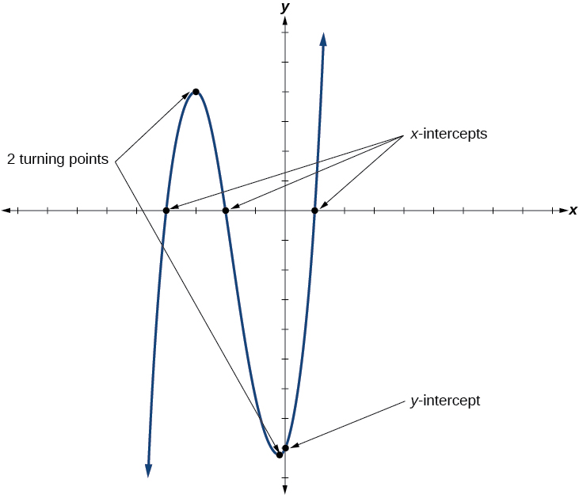{: #Figure_03_03_017}

Intercepts and Turning Points of Polynomial Functions

A **turning point**{: data-type="term"} of a graph is a point at which the graph changes direction from increasing to decreasing or decreasing to increasing. The *y-*intercept is the point at which the function has an input value of zero. The *x*-intercepts are the points at which the output value is zero.

**Given a polynomial function, determine the intercepts.**

1.  Determine the *y-*intercept by setting
    <math xmlns="http://www.w3.org/1998/Math/MathML"> <mrow> <mtext> </mtext><mi>x</mi><mo>=</mo><mn>0</mn><mtext> </mtext> </mrow> </math>
    
    and finding the corresponding output value.
2.  Determine the *x*-intercepts by solving for the input values that yield an output value of zero.
{: type="1"}

Determining the Intercepts of a Polynomial Function

Given the polynomial function<math xmlns="http://www.w3.org/1998/Math/MathML"> <mrow> <mtext> </mtext><mi>f</mi><mo stretchy="false">(</mo><mi>x</mi><mo stretchy="false">)</mo><mo>=</mo><mo stretchy="false">(</mo><mi>x</mi><mo>−</mo><mn>2</mn><mo stretchy="false">)</mo><mo stretchy="false">(</mo><mi>x</mi><mo>+</mo><mn>1</mn><mo stretchy="false">)</mo><mo stretchy="false">(</mo><mi>x</mi><mo>−</mo><mn>4</mn><mo stretchy="false">)</mo><mo>,</mo><mtext> </mtext> </mrow> </math>

written in factored form for your convenience, determine the *y*- and *x*-intercepts.

The *y-*intercept occurs when the input is zero so substitute 0 for<math xmlns="http://www.w3.org/1998/Math/MathML"> <mrow> <mtext> </mtext><mi>x</mi><mo>.</mo> </mrow> </math>

<math xmlns="http://www.w3.org/1998/Math/MathML" display="block"> <mrow> <mtable> <mtr rowalign="center"> <mtd rowalign="center" columnalign="right"> <mrow> <mi>f</mi><mo stretchy="false">(</mo><mn>0</mn><mo stretchy="false">)</mo></mrow> </mtd> <mtd rowalign="center"><mo>=</mo></mtd> <mtd rowalign="center" columnalign="left"> <mrow> <msup> <mrow> <mo stretchy="false">(</mo><mn>0</mn><mo stretchy="false">)</mo></mrow> <mn>4</mn> </msup> <mo>−</mo><mn>4</mn><msup> <mrow> <mo stretchy="false">(</mo><mn>0</mn><mo stretchy="false">)</mo></mrow> <mn>2</mn> </msup> <mo>−</mo><mn>45</mn></mrow> </mtd> </mtr> <mtr rowalign="center"> <mtd rowalign="center" /> <mtd rowalign="center"><mo>=</mo></mtd> <mtd rowalign="center" columnalign="left"> <mrow><mn>−45</mn></mrow> </mtd> </mtr> </mtable></mrow> </math>

The *y-*intercept is (0, 8).

The *x*-intercepts occur when the output is zero.

<math xmlns="http://www.w3.org/1998/Math/MathML" display="block"> <mrow> <mn>0</mn><mo>=</mo><mo stretchy="false">(</mo><mi>x</mi><mo>−</mo><mn>2</mn><mo stretchy="false">)</mo><mo stretchy="false">(</mo><mi>x</mi><mo>+</mo><mn>1</mn><mo stretchy="false">)</mo><mo stretchy="false">(</mo><mi>x</mi><mo>−</mo><mn>4</mn><mo stretchy="false">)</mo></mrow> </math>

<math xmlns="http://www.w3.org/1998/Math/MathML" display="block"> <mrow> <mtable> <mtr rowalign="center"> <mtd rowalign="center" columnalign="right"><mrow><mi>x</mi><mo>−</mo><mn>2</mn></mrow></mtd> <mtd rowalign="center"><mo>=</mo></mtd> <mtd columnalign="left" rowalign="center"><mn>0</mn></mtd> <mtd rowalign="center"><mrow><mspace width="2em" /><mtext>or</mtext><mspace width="2em" /></mrow></mtd> <mtd rowalign="center" columnalign="right"><mrow><mi>x</mi><mo>+</mo><mn>1</mn></mrow></mtd> <mtd rowalign="center"><mo>=</mo></mtd> <mtd columnalign="left" rowalign="center"><mn>0</mn></mtd> <mtd rowalign="center"><mrow><mspace width="2em" /><mtext>or</mtext><mspace width="2em" /></mrow></mtd> <mtd columnalign="right" rowalign="center"><mrow><mi>x</mi><mo>−</mo><mn>4</mn></mrow></mtd> <mtd rowalign="center"><mo>=</mo></mtd> <mtd columnalign="left"><mn>0</mn></mtd> </mtr> <mtr> <mtd rowalign="center" columnalign="right"><mi>x</mi></mtd> <mtd rowalign="center"><mo>=</mo></mtd> <mtd columnalign="left" rowalign="center"><mn>2</mn></mtd> <mtd rowalign="center"><mrow><mspace width="2em" /><mtext>or</mtext><mspace width="2em" /></mrow></mtd> <mtd columnalign="right" rowalign="center"><mi>x</mi></mtd> <mtd rowalign="center"><mo>=</mo></mtd> <mtd columnalign="left" rowalign="center"><mrow><mn>−1</mn></mrow></mtd> <mtd rowalign="center"><mrow><mspace width="2em" /><mtext>or</mtext><mspace width="2em" /></mrow></mtd> <mtd rowalign="center" columnalign="right"><mi>x</mi></mtd> <mtd rowalign="center"><mo>=</mo></mtd> <mtd columnalign="left" rowalign="center"><mn>4</mn></mtd> </mtr> </mtable></mrow> </math>

The *x*-intercepts are<math xmlns="http://www.w3.org/1998/Math/MathML"> <mrow> <mtext> </mtext><mo stretchy="false">(</mo><mn>2</mn><mo>,</mo><mn>0</mn><mo stretchy="false">)</mo><mo>,</mo><mo stretchy="false">(</mo><mo>–</mo><mn>1</mn><mo>,</mo><mn>0</mn><mo stretchy="false">)</mo><mo>,</mo><mtext> </mtext> </mrow> </math>

and<math xmlns="http://www.w3.org/1998/Math/MathML"> <mrow> <mtext> </mtext><mo stretchy="false">(</mo><mn>4</mn><mo>,</mo><mn>0</mn><mo stretchy="false">)</mo><mo>.</mo> </mrow> </math>

We can see these intercepts on the graph of the function shown in [[link]](#Figure_03_03_018).

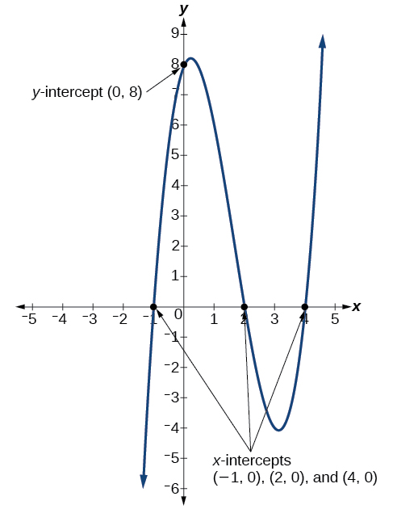{: #Figure_03_03_018}

Determining the Intercepts of a Polynomial Function with Factoring

Given the polynomial function<math xmlns="http://www.w3.org/1998/Math/MathML"> <mrow> <mtext> </mtext><mi>f</mi><mo stretchy="false">(</mo><mi>x</mi><mo stretchy="false">)</mo><mo>=</mo><msup> <mi>x</mi> <mn>4</mn> </msup> <mo>−</mo><mn>4</mn><msup> <mi>x</mi> <mn>2</mn> </msup> <mo>−</mo><mn>45</mn><mo>,</mo><mtext> </mtext> </mrow> </math>

determine the *y*- and *x*-intercepts.

The *y-*intercept occurs when the input is zero.

<math xmlns="http://www.w3.org/1998/Math/MathML" display="block"> <mrow> <mtable> <mtr rowalign="center"> <mtd columnalign="right" rowalign="center"> <mrow> <mi>f</mi><mo stretchy="false">(</mo><mn>0</mn><mo stretchy="false">)</mo></mrow> </mtd> <mtd rowalign="center"><mo>=</mo></mtd> <mtd columnalign="left" rowalign="center"> <mrow> <msup> <mrow> <mo stretchy="false">(</mo><mn>0</mn><mo stretchy="false">)</mo></mrow> <mn>4</mn> </msup> <mo>−</mo><mn>4</mn><msup> <mrow> <mo stretchy="false">(</mo><mn>0</mn><mo stretchy="false">)</mo></mrow> <mn>2</mn> </msup> <mo>−</mo><mn>45</mn></mrow> </mtd> </mtr> <mtr rowalign="center"> <mtd rowalign="center" /> <mtd rowalign="center"><mo>=</mo></mtd> <mtd columnalign="left" rowalign="center"><mrow><mn>−45</mn></mrow></mtd> </mtr> </mtable></mrow> </math>

The *y-*intercept is<math xmlns="http://www.w3.org/1998/Math/MathML"> <mrow> <mtext> </mtext><mo stretchy="false">(</mo><mn>0</mn><mo>,</mo><mn>−45</mn><mo stretchy="false">)</mo><mo>.</mo> </mrow> </math>

The *x*-intercepts occur when the output is zero. To determine when the output is zero, we will need to factor the polynomial.

<math xmlns="http://www.w3.org/1998/Math/MathML" display="block"> <mrow> <mtable> <mtr rowalign="center"> <mtd rowalign="center" columnalign="right"> <mrow> <mi>f</mi><mo stretchy="false">(</mo><mi>x</mi><mo stretchy="false">)</mo></mrow> </mtd> <mtd rowalign="center"><mo>=</mo></mtd> <mtd rowalign="center" columnalign="left"> <mrow> <msup> <mi>x</mi> <mn>4</mn> </msup> <mo>−</mo><mn>4</mn><msup> <mi>x</mi> <mn>2</mn> </msup> <mo>−</mo><mn>45</mn></mrow> </mtd> </mtr> <mtr rowalign="center"> <mtd rowalign="center" /> <mtd rowalign="center"><mo>=</mo></mtd> <mtd rowalign="center" columnalign="left"> <mrow> <mrow><mo>(</mo> <mrow> <msup> <mi>x</mi> <mn>2</mn> </msup> <mo>−</mo><mn>9</mn></mrow> <mo>)</mo></mrow><mrow><mo>(</mo> <mrow> <msup> <mi>x</mi> <mn>2</mn> </msup> <mo>+</mo><mn>5</mn></mrow> <mo>)</mo></mrow></mrow> </mtd> </mtr> <mtr rowalign="center"> <mtd rowalign="center" /> <mtd rowalign="center"><mo>=</mo></mtd> <mtd rowalign="center" columnalign="left"> <mrow> <mo stretchy="false">(</mo><mi>x</mi><mo>−</mo><mn>3</mn><mo stretchy="false">)</mo><mo stretchy="false">(</mo><mi>x</mi><mo>+</mo><mn>3</mn><mo stretchy="false">)</mo><mrow><mo>(</mo> <mrow> <msup> <mi>x</mi> <mn>2</mn> </msup> <mo>+</mo><mn>5</mn></mrow> <mo>)</mo></mrow></mrow> </mtd> </mtr> </mtable></mrow> </math>

<math xmlns="http://www.w3.org/1998/Math/MathML" display="block"> <mspace width="2em" /> <mrow> <mn>0</mn><mo>=</mo><mo stretchy="false">(</mo><mi>x</mi><mo>−</mo><mn>3</mn><mo stretchy="false">)</mo><mo stretchy="false">(</mo><mi>x</mi><mo>+</mo><mn>3</mn><mo stretchy="false">)</mo><mrow><mo>(</mo> <mrow> <msup> <mi>x</mi> <mn>2</mn> </msup> <mo>+</mo><mn>5</mn></mrow> <mo>)</mo></mrow></mrow> </math>

<math xmlns="http://www.w3.org/1998/Math/MathML" display="block"> <mrow> <mtable> <mtr> <mtd columnalign="right"> <mrow> <mi>x</mi><mo>−</mo><mn>3</mn></mrow> </mtd> <mtd> <mo>=</mo> </mtd> <mtd columnalign="left"> <mn>0</mn> </mtd> <mtd> <mrow> <mspace width="2em" /><mtext>or</mtext><mspace width="2em" /></mrow> </mtd> <mtd columnalign="right"> <mrow> <mi>x</mi><mo>+</mo><mn>3</mn></mrow> </mtd> <mtd> <mo>=</mo> </mtd> <mtd columnalign="left"> <mn>0</mn> </mtd> <mtd> <mrow> <mspace width="2em" /><mtext>or</mtext><mspace width="2em" /></mrow> </mtd> <mtd> <mrow> <msup> <mi>x</mi> <mn>2</mn> </msup> <mo>+</mo><mn>5</mn><mo>=</mo><mn>0</mn></mrow> </mtd> </mtr> <mtr> <mtd columnalign="right"> <mi>x</mi> </mtd> <mtd> <mo>=</mo> </mtd> <mtd columnalign="left"> <mn>3</mn> </mtd> <mtd> <mrow> <mspace width="2em" /><mtext>or</mtext><mspace width="2em" /></mrow> </mtd> <mtd columnalign="right"> <mi>x</mi> </mtd> <mtd> <mo>=</mo> </mtd> <mtd columnalign="left"> <mrow> <mo>−</mo><mn>3</mn></mrow> </mtd> <mtd> <mrow> <mspace width="2em" /><mtext>or</mtext><mspace width="2em" /></mrow> </mtd> <mtd> <mrow> <mo stretchy="false">(</mo><mtext>no real solution)</mtext></mrow> </mtd> </mtr> </mtable></mrow> </math>

The *x*-intercepts are<math xmlns="http://www.w3.org/1998/Math/MathML"> <mrow> <mtext> </mtext><mo stretchy="false">(</mo><mn>3</mn><mo>,</mo><mn>0</mn><mo stretchy="false">)</mo><mtext> </mtext> </mrow> </math>

and<math xmlns="http://www.w3.org/1998/Math/MathML"> <mrow> <mtext> </mtext><mo stretchy="false">(</mo><mn>–3</mn><mo>,</mo><mn>0</mn><mo stretchy="false">)</mo><mo>.</mo> </mrow> </math>

We can see these intercepts on the graph of the function shown in [[link]](#Figure_03_03_019). We can see that the function is even because<math xmlns="http://www.w3.org/1998/Math/MathML"> <mrow> <mtext> </mtext><mi>f</mi><mrow><mo>(</mo> <mi>x</mi> <mo>)</mo></mrow><mo>=</mo><mi>f</mi><mrow><mo>(</mo> <mrow> <mo>−</mo><mi>x</mi> </mrow> <mo>)</mo></mrow><mo>.</mo> </mrow> </math>

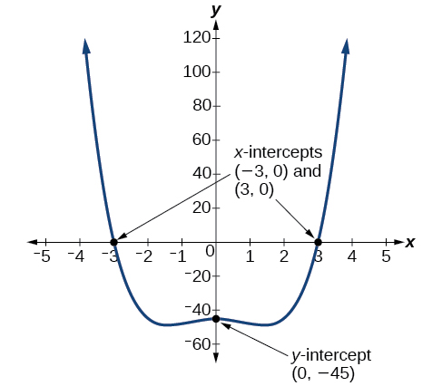{: #Figure_03_03_019}

Given the polynomial function<math xmlns="http://www.w3.org/1998/Math/MathML"> <mrow> <mtext> </mtext><mi>f</mi><mo stretchy="false">(</mo><mi>x</mi><mo stretchy="false">)</mo><mo>=</mo><mn>2</mn><msup> <mi>x</mi> <mn>3</mn> </msup> <mo>−</mo><mn>6</mn><msup> <mi>x</mi> <mn>2</mn> </msup> <mo>−</mo><mn>20</mn><mi>x</mi><mo>,</mo><mtext> </mtext> </mrow> </math>

determine the *y*- and *x*-intercepts.

*y*-intercept<math xmlns="http://www.w3.org/1998/Math/MathML"> <mrow> <mtext> </mtext><mo stretchy="false">(</mo><mn>0</mn><mo>,</mo><mn>0</mn><mo stretchy="false">)</mo><mo>;</mo><mtext> </mtext> </mrow> </math>

*x*-intercepts<math xmlns="http://www.w3.org/1998/Math/MathML"> <mrow> <mtext> </mtext><mo stretchy="false">(</mo><mn>0</mn><mo>,</mo><mn>0</mn><mo stretchy="false">)</mo><mo>,</mo><mo stretchy="false">(</mo><mo>–</mo><mn>2</mn><mo>,</mo><mn>0</mn><mo stretchy="false">)</mo><mo>,</mo><mtext> </mtext> </mrow> </math>

and<math xmlns="http://www.w3.org/1998/Math/MathML"> <mrow> <mo stretchy="false">(</mo><mn>5</mn><mo>,</mo><mn>0</mn><mo stretchy="false">)</mo> </mrow> </math>

#### Comparing Smooth and Continuous Graphs

The degree of a polynomial function helps us to determine the number of *x*-intercepts and the number of turning points. A polynomial function of<math xmlns="http://www.w3.org/1998/Math/MathML"> <mrow> <mtext> </mtext><mi>n</mi><mtext>th</mtext><mtext> </mtext> </mrow> </math>

degree is the product of<math xmlns="http://www.w3.org/1998/Math/MathML"> <mrow> <mtext> </mtext><mi>n</mi><mtext> </mtext> </mrow> </math>

factors, so it will have at most<math xmlns="http://www.w3.org/1998/Math/MathML"> <mrow> <mtext> </mtext><mi>n</mi><mtext> </mtext> </mrow> </math>

roots or zeros, or *x*-intercepts. The graph of the polynomial function of degree<math xmlns="http://www.w3.org/1998/Math/MathML"> <mrow> <mtext> </mtext><mi>n</mi><mtext> </mtext> </mrow> </math>

must have at most<math xmlns="http://www.w3.org/1998/Math/MathML"> <mrow> <mtext> </mtext><mi>n</mi><mo>–</mo><mn>1</mn><mtext> </mtext> </mrow> </math>

turning points. This means the graph has at most one fewer turning point than the degree of the polynomial or one fewer than the number of factors.

A **continuous function**{: data-type="term"} has no breaks in its graph: the graph can be drawn without lifting the pen from the paper. A **smooth curve**{: data-type="term"} is a graph that has no sharp corners. The turning points of a smooth graph must always occur at rounded curves. The graphs of polynomial functions are both continuous and smooth.

Intercepts and Turning Points of Polynomials

A polynomial of degree<math xmlns="http://www.w3.org/1998/Math/MathML"> <mrow> <mtext> </mtext><mi>n</mi><mtext> </mtext> </mrow> </math>

will have, at most,<math xmlns="http://www.w3.org/1998/Math/MathML"> <mrow> <mtext> </mtext><mi>n</mi><mtext> </mtext> </mrow> </math>

*x*-intercepts and<math xmlns="http://www.w3.org/1998/Math/MathML"> <mrow> <mtext> </mtext><mi>n</mi><mo>−</mo><mn>1</mn><mtext> </mtext> </mrow> </math>

turning points.

Determining the Number of Intercepts and Turning Points of a Polynomial

Without graphing the function, determine the local behavior of the function by finding the maximum number of *x*-intercepts and turning points for<math xmlns="http://www.w3.org/1998/Math/MathML"> <mrow> <mtext> </mtext><mi>f</mi><mo stretchy="false">(</mo><mi>x</mi><mo stretchy="false">)</mo><mo>=</mo><mo>−</mo><mn>3</mn><msup> <mi>x</mi> <mrow> <mn>10</mn> </mrow> </msup> <mo>+</mo><mn>4</mn><msup> <mi>x</mi> <mn>7</mn> </msup> <mo>−</mo><msup> <mi>x</mi> <mn>4</mn> </msup> <mo>+</mo><mn>2</mn><msup> <mi>x</mi> <mn>3</mn> </msup> <mo>.</mo> </mrow> </math>

The polynomial has a degree of<math xmlns="http://www.w3.org/1998/Math/MathML"> <mrow> <mtext> </mtext><mn>10</mn><mo>,</mo><mtext> </mtext> </mrow> </math>

so there are at most 10 *x*-intercepts and at most 9 turning points.

Without graphing the function, determine the maximum number of *x*-intercepts and turning points for<math xmlns="http://www.w3.org/1998/Math/MathML"> <mrow> <mtext> </mtext><mi>f</mi><mo stretchy="false">(</mo><mi>x</mi><mo stretchy="false">)</mo><mo>=</mo><mn>108</mn><mo>−</mo><mn>13</mn><msup> <mi>x</mi> <mn>9</mn> </msup> <mo>−</mo><mn>8</mn><msup> <mi>x</mi> <mn>4</mn> </msup> <mo>+</mo><mn>14</mn><msup> <mi>x</mi> <mrow> <mn>12</mn> </mrow> </msup> <mo>+</mo><mn>2</mn><msup> <mi>x</mi> <mn>3</mn> </msup> <mo>.</mo> </mrow> </math>

There are at most 12<math xmlns="http://www.w3.org/1998/Math/MathML"> <mrow> <mtext> </mtext><mi>x</mi><mtext>-</mtext> </mrow> </math>

intercepts and at most 11 turning points.

Drawing Conclusions about a Polynomial Function from the Graph

What can we conclude about the polynomial represented by the graph shown in [[link]](#Figure_03_03_020) based on its intercepts and turning points?

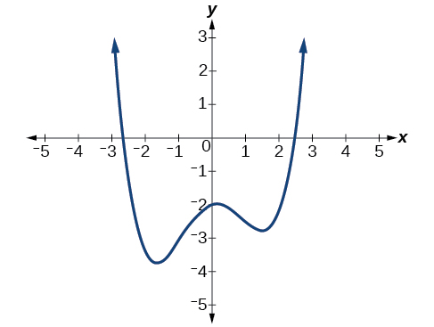{: #Figure_03_03_020}

The end behavior of the graph tells us this is the graph of an even-degree polynomial. See [[link]](#Figure_03_03_021).

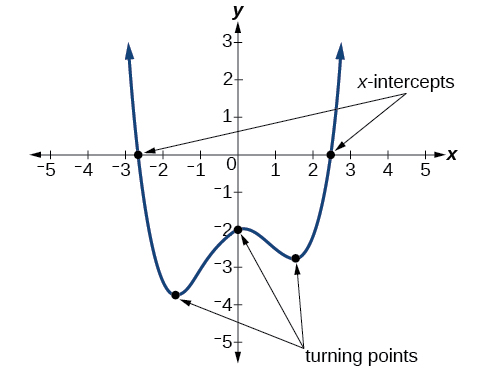{: #Figure_03_03_021}

The graph has 2 *x*-intercepts, suggesting a degree of 2 or greater, and 3 turning points, suggesting a degree of 4 or greater. Based on this, it would be reasonable to conclude that the degree is even and at least 4.

What can we conclude about the polynomial represented by the graph shown in [[link]](#Figure_03_03_022) based on its intercepts and turning points?

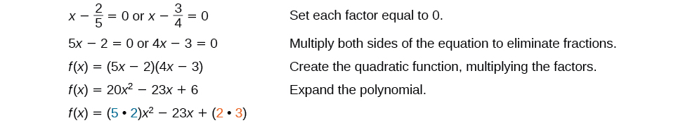{: #Figure_03_03_022}

The end behavior indicates an odd-degree polynomial function; there are 3<math xmlns="http://www.w3.org/1998/Math/MathML"> <mrow> <mtext> </mtext><mi>x</mi><mtext>-</mtext> </mrow> </math>

intercepts and 2 turning points, so the degree is odd and at least 3. Because of the end behavior, we know that the lead coefficient must be negative.

Drawing Conclusions about a Polynomial Function from the Factors

Given the function<math xmlns="http://www.w3.org/1998/Math/MathML"> <mrow> <mtext> </mtext><mi>f</mi><mo stretchy="false">(</mo><mi>x</mi><mo stretchy="false">)</mo><mo>=</mo><mo>−</mo><mn>4</mn><mi>x</mi><mrow><mo>(</mo> <mrow> <mi>x</mi><mo>+</mo><mn>3</mn> </mrow> <mo>)</mo></mrow><mrow><mo>(</mo> <mrow> <mi>x</mi><mo>−</mo><mn>4</mn> </mrow> <mo>)</mo></mrow><mo>,</mo><mtext> </mtext> </mrow> </math>

 determine the local behavior.

The *y*-intercept is found by evaluating<math xmlns="http://www.w3.org/1998/Math/MathML"> <mrow> <mtext> </mtext><mi>f</mi><mo stretchy="false">(</mo><mn>0</mn><mo stretchy="false">)</mo><mo>.</mo> </mrow> </math>

<math xmlns="http://www.w3.org/1998/Math/MathML" display="block"> <mrow> <mtable> <mtr rowalign="center"> <mtd rowalign="center" columnalign="right"> <mrow> <mi>f</mi><mo stretchy="false">(</mo><mn>0</mn><mo stretchy="false">)</mo></mrow> </mtd> <mtd rowalign="center"> <mo>=</mo> </mtd> <mtd rowalign="center"> <mrow> <mo>−</mo><mn>4</mn><mo stretchy="false">(</mo><mn>0</mn><mo stretchy="false">)</mo><mo stretchy="false">(</mo><mn>0</mn><mo>+</mo><mn>3</mn><mo stretchy="false">)</mo><mo stretchy="false">(</mo><mn>0</mn><mo>−</mo><mn>4</mn></mrow> </mtd> </mtr> <mtr rowalign="center"> <mtd rowalign="center" /> <mtd rowalign="center"><mo>=</mo></mtd> <mtd rowalign="center" columnalign="left"><mn>0</mn></mtd> </mtr> </mtable></mrow> </math>

The *y*-intercept is<math xmlns="http://www.w3.org/1998/Math/MathML"> <mrow> <mtext> </mtext><mo stretchy="false">(</mo><mn>0</mn><mo>,</mo><mn>0</mn><mo stretchy="false">)</mo><mo>.</mo> </mrow> </math>

The *x*-intercepts are found by determining the zeros of the function.

<math xmlns="http://www.w3.org/1998/Math/MathML" display="block"> <mrow> <mn>0</mn><mo>=</mo><mn>−4</mn><mi>x</mi><mo stretchy="false">(</mo><mi>x</mi><mo>+</mo><mn>3</mn><mo stretchy="false">)</mo><mo stretchy="false">(</mo><mi>x</mi><mo>−</mo><mn>4</mn><mo stretchy="false">)</mo></mrow> </math>

<math xmlns="http://www.w3.org/1998/Math/MathML" display="block"> <mrow> <mtable> <mtr> <mtd columnalign="right"><mi>x</mi></mtd> <mtd><mo>=</mo></mtd> <mtd columnalign="left"><mn>0</mn></mtd> <mtd><mrow><mspace width="2em" /><mtext>or</mtext><mspace width="2em" /></mrow></mtd> <mtd columnalign="right"><mrow><mi>x</mi><mo>+</mo><mn>3</mn></mrow></mtd> <mtd><mo>=</mo></mtd> <mtd columnalign="left"><mn>0</mn></mtd> <mtd><mrow><mspace width="2em" /><mtext>or</mtext><mspace width="2em" /></mrow></mtd> <mtd columnalign="right"><mrow><mi>x</mi><mo>−</mo><mn>4</mn></mrow></mtd> <mtd><mo>=</mo></mtd> <mtd columnalign="left"><mn>0</mn></mtd> </mtr> <mtr> <mtd><mi>x</mi></mtd> <mtd><mo>=</mo></mtd> <mtd><mn>0</mn></mtd> <mtd><mrow><mspace width="2em" /><mtext>or</mtext><mspace width="2em" /></mrow></mtd> <mtd><mi>x</mi></mtd> <mtd><mo>=</mo></mtd> <mtd><mrow><mo>−</mo><mn>3</mn></mrow></mtd> <mtd><mrow><mspace width="2em" /><mtext>or</mtext><mspace width="2em" /></mrow></mtd> <mtd><mi>x</mi></mtd> <mtd><mo>=</mo></mtd> <mtd><mn>4</mn></mtd> </mtr> </mtable></mrow> </math>

The *x*-intercepts are<math xmlns="http://www.w3.org/1998/Math/MathML"> <mrow> <mtext> </mtext><mo stretchy="false">(</mo><mn>0</mn><mo>,</mo><mn>0</mn><mo stretchy="false">)</mo><mo>,</mo><mo stretchy="false">(</mo><mn>–3</mn><mo>,</mo><mn>0</mn><mo stretchy="false">)</mo><mo>,</mo><mtext> </mtext> </mrow> </math>

and<math xmlns="http://www.w3.org/1998/Math/MathML"> <mrow> <mtext> </mtext><mo stretchy="false">(</mo><mn>4</mn><mo>,</mo><mn>0</mn><mo stretchy="false">)</mo><mo>.</mo> </mrow> </math>

The degree is 3 so the graph has at most 2 turning points.

Given the function<math xmlns="http://www.w3.org/1998/Math/MathML"> <mrow> <mtext> </mtext><mi>f</mi><mo stretchy="false">(</mo><mi>x</mi><mo stretchy="false">)</mo><mo>=</mo><mn>0.2</mn><mo stretchy="false">(</mo><mi>x</mi><mo>−</mo><mn>2</mn><mo stretchy="false">)</mo><mo stretchy="false">(</mo><mi>x</mi><mo>+</mo><mn>1</mn><mo stretchy="false">)</mo><mo stretchy="false">(</mo><mi>x</mi><mo>−</mo><mn>5</mn><mo stretchy="false">)</mo><mo>,</mo><mtext> </mtext> </mrow> </math>

determine the local behavior.

The<math xmlns="http://www.w3.org/1998/Math/MathML"> <mrow> <mtext> </mtext><mi>x</mi><mtext>-</mtext> </mrow> </math>

intercepts are<math xmlns="http://www.w3.org/1998/Math/MathML"> <mrow> <mtext> </mtext><mo stretchy="false">(</mo><mn>2</mn><mo>,</mo><mn>0</mn><mo stretchy="false">)</mo><mo>,</mo><mo stretchy="false">(</mo><mo>−</mo><mn>1</mn><mo>,</mo><mn>0</mn><mo stretchy="false">)</mo><mo>,</mo> </mrow> </math>

and<math xmlns="http://www.w3.org/1998/Math/MathML"> <mrow> <mtext> </mtext><mo stretchy="false">(</mo><mn>5</mn><mo>,</mo><mn>0</mn><mo stretchy="false">)</mo><mo>,</mo><mtext> </mtext> </mrow> </math>

the *y-*intercept is<math xmlns="http://www.w3.org/1998/Math/MathML"> <mrow> <mtext> </mtext><mo stretchy="false">(</mo><mn>0</mn><mo>,</mo><mtext>2</mtext><mo stretchy="false">)</mo><mo>,</mo><mtext> </mtext> </mrow> </math>

and the graph has at most 2 turning points.

Access these online resources for additional instruction and practice with power and polinomial functions.

* [Find Key Information about a Given Polynomial Function][1]
* [End Behavior of a Polynomial Function][2]
* [Turning Points and<math xmlns="http://www.w3.org/1998/Math/MathML"> <mrow> <mtext> </mtext><mi>x</mi><mtext>-</mtext> </mrow> </math>
  
  intercepts of Polynomial Functions][3]
* [Least Possible Degree of a Polynomial Function][4]

### Key Equations

| general form of a polynomial function | <math xmlns="http://www.w3.org/1998/Math/MathML" display="block"> <mrow> <mi>f</mi><mo stretchy="false">(</mo><mi>x</mi><mo stretchy="false">)</mo><mo>=</mo><msub> <mi>a</mi> <mi>n</mi> </msub> <msup> <mi>x</mi> <mi>n</mi> </msup> <mo>+</mo><mn>...</mn><mo>+</mo><msub> <mi>a</mi> <mn>2</mn> </msub> <msup> <mi>x</mi> <mn>2</mn> </msup> <mo>+</mo><msub> <mi>a</mi> <mn>1</mn> </msub> <mi>x</mi><mo>+</mo><msub> <mi>a</mi> <mn>0</mn> </msub> </mrow> </math>

 |
{: #eip-id1165134063974 summary=".."}

### Key Concepts

* A power function is a variable base raised to a number power. See [\[link\]](#Example_03_03_01).
* The behavior of a graph as the input decreases beyond bound and increases beyond bound is called the end behavior.
* The end behavior depends on whether the power is even or odd. See [\[link\]](#Example_03_03_02) and [\[link\]](#Example_03_03_03).
* A polynomial function is the sum of terms, each of which consists of a transformed power function with positive whole number power. See [\[link\]](#Example_03_03_04).
* The degree of a polynomial function is the highest power of the variable that occurs in a polynomial. The term containing the highest power of the variable is called the leading term. The coefficient of the leading term is called the leading coefficient. See [\[link\]](#Example_03_03_05).
* The end behavior of a polynomial function is the same as the end behavior of the power function represented by the leading term of the function. See [\[link\]](#Example_03_03_06) and [\[link\]](#Example_03_03_07).
* A polynomial of degree
  <math xmlns="http://www.w3.org/1998/Math/MathML"> <mrow> <mtext> </mtext><mi>n</mi><mtext> </mtext> </mrow> </math>
  
  will have at most
  <math xmlns="http://www.w3.org/1998/Math/MathML"> <mrow> <mtext> </mtext><mi>n</mi><mtext> </mtext> </mrow> </math>
  
  *x-*intercepts and at most
  <math xmlns="http://www.w3.org/1998/Math/MathML"> <mrow> <mtext> </mtext><mi>n</mi><mo>−</mo><mn>1</mn><mtext> </mtext> </mrow> </math>
  
  turning points. See [\[link\]](#Example_03_03_08), [\[link\]](#Example_03_03_09), [\[link\]](#Example_03_03_10), [\[link\]](#Example_03_03_11), and [\[link\]](#Example_03_03_12).

### Section Exercises

#### Verbal

Explain the difference between the coefficient of a power function and its degree.

The coefficient of the power function is the real number that is multiplied by the variable raised to a power. The degree is the highest power appearing in the function.

If a polynomial function is in factored form, what would be a good first step in order to determine the degree of the function?

In general, explain the end behavior of a power function with odd degree if the leading coefficient is positive.

As<math xmlns="http://www.w3.org/1998/Math/MathML"> <mrow> <mtext> </mtext><mi>x</mi><mtext> </mtext> </mrow> </math>

 decreases without bound, so does<math xmlns="http://www.w3.org/1998/Math/MathML"> <mrow> <mtext> </mtext><mi>f</mi><mrow><mo>(</mo> <mi>x</mi> <mo>)</mo></mrow><mo>.</mo><mtext> </mtext> </mrow> </math>

 As<math xmlns="http://www.w3.org/1998/Math/MathML"> <mrow> <mtext> </mtext><mi>x</mi><mtext> </mtext> </mrow> </math>

 increases without bound, so does<math xmlns="http://www.w3.org/1998/Math/MathML"> <mrow> <mtext> </mtext><mi>f</mi><mrow><mo>(</mo> <mi>x</mi> <mo>)</mo></mrow><mo>.</mo> </mrow> </math>

What is the relationship between the degree of a polynomial function and the maximum number of turning points in its graph?

What can we conclude if, in general, the graph of a polynomial function exhibits the following end behavior? As<math xmlns="http://www.w3.org/1998/Math/MathML"> <mrow> <mtext> </mtext><mi>x</mi><mo stretchy="false">→</mo><mo>−</mo><mi>∞</mi><mo>,</mo><mtext> </mtext><mi>f</mi><mo stretchy="false">(</mo><mi>x</mi><mo stretchy="false">)</mo><mo stretchy="false">→</mo><mo>−</mo><mi>∞</mi><mtext> </mtext> </mrow> </math>

 and as<math xmlns="http://www.w3.org/1998/Math/MathML"> <mrow> <mtext> </mtext><mi>x</mi><mo stretchy="false">→</mo><mi>∞</mi><mo>,</mo><mtext> </mtext><mi>f</mi><mo stretchy="false">(</mo><mi>x</mi><mo stretchy="false">)</mo><mo stretchy="false">→</mo><mo>−</mo><mi>∞</mi><mo>.</mo><mtext> </mtext> </mrow> </math>

The polynomial function is of even degree and leading coefficient is negative.

#### Algebraic

For the following exercises, identify the function as a power function, a polynomial function, or neither.

<math xmlns="http://www.w3.org/1998/Math/MathML"> <mrow> <mi>f</mi><mo stretchy="false">(</mo><mi>x</mi><mo stretchy="false">)</mo><mo>=</mo><msup> <mi>x</mi> <mn>5</mn> </msup> </mrow> </math>

<math xmlns="http://www.w3.org/1998/Math/MathML"> <mrow> <mi>f</mi><mo stretchy="false">(</mo><mi>x</mi><mo stretchy="false">)</mo><mo>=</mo><msup> <mrow> <mrow><mo>(</mo> <mrow> <msup> <mi>x</mi> <mn>2</mn> </msup> </mrow> <mo>)</mo></mrow> </mrow> <mn>3</mn> </msup> </mrow> </math>

Power function

<math xmlns="http://www.w3.org/1998/Math/MathML"> <mrow> <mi>f</mi><mo stretchy="false">(</mo><mi>x</mi><mo stretchy="false">)</mo><mo>=</mo><mi>x</mi><mo>−</mo><msup> <mi>x</mi> <mn>4</mn> </msup> </mrow> </math>

<math xmlns="http://www.w3.org/1998/Math/MathML"> <mrow> <mi>f</mi><mo stretchy="false">(</mo><mi>x</mi><mo stretchy="false">)</mo><mo>=</mo><mfrac> <mrow> <msup> <mi>x</mi> <mn>2</mn> </msup> </mrow> <mrow> <msup> <mi>x</mi> <mn>2</mn> </msup> <mo>−</mo><mn>1</mn> </mrow> </mfrac> </mrow> </math>

Neither

<math xmlns="http://www.w3.org/1998/Math/MathML"> <mrow> <mi>f</mi><mo stretchy="false">(</mo><mi>x</mi><mo stretchy="false">)</mo><mo>=</mo><mn>2</mn><mi>x</mi><mrow><mo>(</mo> <mrow> <mi>x</mi><mo>+</mo><mn>2</mn> </mrow> <mo>)</mo></mrow><msup> <mrow> <mrow><mo>(</mo> <mrow> <mi>x</mi><mo>−</mo><mn>1</mn> </mrow> <mo>)</mo></mrow> </mrow> <mn>2</mn> </msup> </mrow> </math>

<math xmlns="http://www.w3.org/1998/Math/MathML"> <mrow> <mi>f</mi><mo stretchy="false">(</mo><mi>x</mi><mo stretchy="false">)</mo><mo>=</mo><msup> <mn>3</mn> <mrow> <mi>x</mi><mo>+</mo><mn>1</mn> </mrow> </msup> </mrow> </math>

Neither

For the following exercises, find the degree and leading coefficient for the given polynomial.

<math xmlns="http://www.w3.org/1998/Math/MathML"> <mrow> <mo>−</mo><mn>3</mn><mi>x</mi><mmultiscripts> <mrow /> <mprescripts /> <none /> <mn>4</mn> </mmultiscripts> </mrow> </math>

<math xmlns="http://www.w3.org/1998/Math/MathML"> <mrow> <mn>7</mn><mo>−</mo><mn>2</mn><msup> <mi>x</mi> <mn>2</mn> </msup> </mrow> </math>

Degree = 2, Coefficient = –2

<math xmlns="http://www.w3.org/1998/Math/MathML"> <mrow> <mo>−</mo><mn>2</mn><msup> <mi>x</mi> <mn>2</mn> </msup> <mo>−</mo><mn>3</mn><msup> <mi>x</mi> <mn>5</mn> </msup> <mo>+</mo><mi>x</mi><mo>−</mo><mn>6</mn><mo> </mo> </mrow> </math>

<math xmlns="http://www.w3.org/1998/Math/MathML"> <mrow> <mi>x</mi><mrow><mo>(</mo> <mrow> <mn>4</mn><mo>−</mo><msup> <mi>x</mi> <mn>2</mn> </msup> </mrow> <mo>)</mo></mrow><mo stretchy="false">(</mo><mn>2</mn><mi>x</mi><mo>+</mo><mn>1</mn><mo stretchy="false">)</mo> </mrow> </math>

Degree =4, Coefficient = –2

<math xmlns="http://www.w3.org/1998/Math/MathML"> <mrow> <msup> <mi>x</mi> <mn>2</mn> </msup> <msup> <mrow> <mrow><mo>(</mo> <mrow> <mn>2</mn><mi>x</mi><mo>−</mo><mn>3</mn> </mrow> <mo>)</mo></mrow> </mrow> <mn>2</mn> </msup> </mrow> </math>

For the following exercises, determine the end behavior of the functions.

<math xmlns="http://www.w3.org/1998/Math/MathML"> <mrow> <mi>f</mi><mrow><mo>(</mo> <mi>x</mi> <mo>)</mo></mrow><mo>=</mo><msup> <mi>x</mi> <mn>4</mn> </msup> </mrow> </math>

<math xmlns="http://www.w3.org/1998/Math/MathML"> <mrow> <mtext>As</mtext><mtext> </mtext><mi>x</mi><mo stretchy="false">→</mo><mi>∞</mi><mo>,</mo><mtext> </mtext><mtext> </mtext><mi>f</mi><mo stretchy="false">(</mo><mi>x</mi><mo stretchy="false">)</mo><mo stretchy="false">→</mo><mi>∞</mi><mo>,</mo><mtext> </mtext><mtext>as</mtext><mtext> </mtext><mi>x</mi><mo stretchy="false">→</mo><mo>−</mo><mi>∞</mi><mo>,</mo><mtext> </mtext><mi>f</mi><mo stretchy="false">(</mo><mi>x</mi><mo stretchy="false">)</mo><mo stretchy="false">→</mo><mi>∞</mi> </mrow> </math>

<math xmlns="http://www.w3.org/1998/Math/MathML"> <mrow> <mi>f</mi><mrow><mo>(</mo> <mi>x</mi> <mo>)</mo></mrow><mo>=</mo><msup> <mi>x</mi> <mn>3</mn> </msup> </mrow> </math>

<math xmlns="http://www.w3.org/1998/Math/MathML"> <mrow> <mi>f</mi><mrow><mo>(</mo> <mi>x</mi> <mo>)</mo></mrow><mo>=</mo><mo>−</mo><msup> <mi>x</mi> <mn>4</mn> </msup> </mrow> </math>

<math xmlns="http://www.w3.org/1998/Math/MathML"> <mrow> <mtext>As</mtext><mtext> </mtext><mi>x</mi><mo stretchy="false">→</mo><mo>−</mo><mi>∞</mi><mo>,</mo><mtext> </mtext><mtext> </mtext><mi>f</mi><mo stretchy="false">(</mo><mi>x</mi><mo stretchy="false">)</mo><mo stretchy="false">→</mo><mo>−</mo><mi>∞</mi><mo>,</mo><mtext> </mtext><mtext>as</mtext><mtext> </mtext><mi>x</mi><mo stretchy="false">→</mo><mi>∞</mi><mo>,</mo><mtext> </mtext><mi>f</mi><mo stretchy="false">(</mo><mi>x</mi><mo stretchy="false">)</mo><mo stretchy="false">→</mo><mo>−</mo><mi>∞</mi> </mrow> </math>

<math xmlns="http://www.w3.org/1998/Math/MathML"> <mrow> <mi>f</mi><mrow><mo>(</mo> <mi>x</mi> <mo>)</mo></mrow><mo>=</mo><mo>−</mo><msup> <mi>x</mi> <mn>9</mn> </msup> </mrow> </math>

<math xmlns="http://www.w3.org/1998/Math/MathML"> <mrow> <mi>f</mi><mo stretchy="false">(</mo><mi>x</mi><mo stretchy="false">)</mo><mo>=</mo><mo>−</mo><mn>2</mn><msup> <mi>x</mi> <mn>4</mn> </msup> <mo>−</mo><mn>3</mn><msup> <mi>x</mi> <mn>2</mn> </msup> <mo>+</mo><mi>x</mi><mo>−</mo><mn>1</mn><mo> </mo> </mrow> </math>

<math xmlns="http://www.w3.org/1998/Math/MathML"> <mrow> <mtext>As</mtext><mtext> </mtext><mi>x</mi><mo stretchy="false">→</mo><mo>−</mo><mi>∞</mi><mo>,</mo><mtext> </mtext><mtext> </mtext><mi>f</mi><mo stretchy="false">(</mo><mi>x</mi><mo stretchy="false">)</mo><mo stretchy="false">→</mo><mo>−</mo><mi>∞</mi><mo>,</mo><mtext> </mtext><mtext>as</mtext><mtext> </mtext><mi>x</mi><mo stretchy="false">→</mo><mi>∞</mi><mo>,</mo><mtext> </mtext><mi>f</mi><mo stretchy="false">(</mo><mi>x</mi><mo stretchy="false">)</mo><mo stretchy="false">→</mo><mo>−</mo><mi>∞</mi> </mrow> </math>

<math xmlns="http://www.w3.org/1998/Math/MathML"> <mrow> <mi>f</mi><mo stretchy="false">(</mo><mi>x</mi><mo stretchy="false">)</mo><mo>=</mo><mn>3</mn><msup> <mi>x</mi> <mn>2</mn> </msup> <mo>+</mo><mi>x</mi><mo>−</mo><mn>2</mn> </mrow> </math>

<math xmlns="http://www.w3.org/1998/Math/MathML"> <mrow> <mi>f</mi><mo stretchy="false">(</mo><mi>x</mi><mo stretchy="false">)</mo><mo>=</mo><msup> <mi>x</mi> <mn>2</mn> </msup> <mrow><mo>(</mo> <mrow> <mn>2</mn><msup> <mi>x</mi> <mn>3</mn> </msup> <mo>−</mo><mi>x</mi><mo>+</mo><mn>1</mn></mrow> <mo>)</mo></mrow></mrow> </math>

<math xmlns="http://www.w3.org/1998/Math/MathML"> <mrow> <mtext>As</mtext><mtext> </mtext><mi>x</mi><mo stretchy="false">→</mo><mi>∞</mi><mo>,</mo><mtext> </mtext><mtext> </mtext><mi>f</mi><mo stretchy="false">(</mo><mi>x</mi><mo stretchy="false">)</mo><mo stretchy="false">→</mo><mi>∞</mi><mo>,</mo><mtext> </mtext><mtext>as</mtext><mtext> </mtext><mi>x</mi><mo stretchy="false">→</mo><mo>−</mo><mi>∞</mi><mo>,</mo><mtext> </mtext><mi>f</mi><mo stretchy="false">(</mo><mi>x</mi><mo stretchy="false">)</mo><mo stretchy="false">→</mo><mo>−</mo><mi>∞</mi> </mrow> </math>

<math xmlns="http://www.w3.org/1998/Math/MathML"> <mrow> <mi>f</mi><mo stretchy="false">(</mo><mi>x</mi><mo stretchy="false">)</mo><mo>=</mo><msup> <mrow> <mo stretchy="false">(</mo><mn>2</mn><mo>−</mo><mi>x</mi><mo stretchy="false">)</mo> </mrow> <mn>7</mn> </msup> </mrow> </math>

For the following exercises, find the intercepts of the functions.

<math xmlns="http://www.w3.org/1998/Math/MathML"> <mrow> <mi>f</mi><mrow><mo>(</mo> <mi>t</mi> <mo>)</mo></mrow><mo>=</mo><mn>2</mn><mrow><mo>(</mo> <mrow> <mi>t</mi><mo>−</mo><mn>1</mn> </mrow> <mo>)</mo></mrow><mrow><mo>(</mo> <mrow> <mi>t</mi><mo>+</mo><mn>2</mn> </mrow> <mo>)</mo></mrow><mo stretchy="false">(</mo><mi>t</mi><mo>−</mo><mn>3</mn><mo stretchy="false">)</mo> </mrow> </math>

*y*-intercept is<math xmlns="http://www.w3.org/1998/Math/MathML"> <mrow> <mtext> </mtext><mo stretchy="false">(</mo><mn>0</mn><mo>,</mo><mn>12</mn><mo stretchy="false">)</mo><mo>,</mo><mtext> </mtext> </mrow> </math>

*t*-intercepts are<math xmlns="http://www.w3.org/1998/Math/MathML"> <mrow> <mtext> </mtext><mo stretchy="false">(</mo><mn>1</mn><mo>,</mo><mn>0</mn><mo stretchy="false">)</mo><mo>;</mo><mo stretchy="false">(</mo><mo>–</mo><mn>2</mn><mo>,</mo><mn>0</mn><mo stretchy="false">)</mo><mo>;</mo><mtext>and </mtext><mo stretchy="false">(</mo><mn>3</mn><mo>,</mo><mn>0</mn><mo stretchy="false">)</mo><mo>.</mo> </mrow> </math>

<math xmlns="http://www.w3.org/1998/Math/MathML"> <mrow> <mi>g</mi><mrow><mo>(</mo> <mi>n</mi> <mo>)</mo></mrow><mo>=</mo><mn>−2</mn><mrow><mo>(</mo> <mrow> <mn>3</mn><mi>n</mi><mo>−</mo><mn>1</mn> </mrow> <mo>)</mo></mrow><mo stretchy="false">(</mo><mn>2</mn><mi>n</mi><mo>+</mo><mn>1</mn><mo stretchy="false">)</mo> </mrow> </math>

<math xmlns="http://www.w3.org/1998/Math/MathML"> <mrow> <mi>f</mi><mo stretchy="false">(</mo><mi>x</mi><mo stretchy="false">)</mo><mo>=</mo><msup> <mi>x</mi> <mn>4</mn> </msup> <mo>−</mo><mn>16</mn> </mrow> </math>

*y*-intercept is<math xmlns="http://www.w3.org/1998/Math/MathML"> <mrow> <mtext> </mtext><mo stretchy="false">(</mo><mn>0</mn><mo>,</mo><mo>−</mo><mn>16</mn><mo stretchy="false">)</mo><mo>.</mo><mtext> </mtext> </mrow> </math>

*x*-intercepts are<math xmlns="http://www.w3.org/1998/Math/MathML"> <mrow> <mtext> </mtext><mo stretchy="false">(</mo><mn>2</mn><mo>,</mo><mn>0</mn><mo stretchy="false">)</mo><mtext> </mtext> </mrow> </math>

and<math xmlns="http://www.w3.org/1998/Math/MathML"> <mrow> <mtext> </mtext><mo stretchy="false">(</mo><mo>−</mo><mn>2</mn><mo>,</mo><mn>0</mn><mo stretchy="false">)</mo><mo>.</mo> </mrow> </math>

<math xmlns="http://www.w3.org/1998/Math/MathML"> <mrow> <mi>f</mi><mo stretchy="false">(</mo><mi>x</mi><mo stretchy="false">)</mo><mo>=</mo><msup> <mi>x</mi> <mn>3</mn> </msup> <mo>+</mo><mn>27</mn> </mrow> </math>

<math xmlns="http://www.w3.org/1998/Math/MathML"> <mrow> <mi>f</mi><mo stretchy="false">(</mo><mi>x</mi><mo stretchy="false">)</mo><mo>=</mo><mi>x</mi><mrow><mo>(</mo> <mrow> <msup> <mi>x</mi> <mn>2</mn> </msup> <mo>−</mo><mn>2</mn><mi>x</mi><mo>−</mo><mn>8</mn> </mrow> <mo>)</mo></mrow> </mrow> </math>

*y*-intercept is<math xmlns="http://www.w3.org/1998/Math/MathML"> <mrow> <mtext> </mtext><mo stretchy="false">(</mo><mn>0</mn><mo>,</mo><mn>0</mn><mo stretchy="false">)</mo><mo>.</mo><mtext> </mtext> </mrow> </math>

*x*-intercepts are<math xmlns="http://www.w3.org/1998/Math/MathML"> <mrow> <mtext> </mtext><mo stretchy="false">(</mo><mn>0</mn><mo>,</mo><mn>0</mn><mo stretchy="false">)</mo><mo>,</mo><mo stretchy="false">(</mo><mn>4</mn><mo>,</mo><mn>0</mn><mo stretchy="false">)</mo><mo>,</mo><mtext> </mtext> </mrow> </math>

and<math xmlns="http://www.w3.org/1998/Math/MathML"> <mrow> <mtext> </mtext><mrow><mo>(</mo> <mrow> <mo>−</mo><mn>2</mn><mo>,</mo><mo> </mo><mn>0</mn> </mrow> <mo>)</mo></mrow><mo>.</mo> </mrow> </math>

<math xmlns="http://www.w3.org/1998/Math/MathML"> <mrow> <mi>f</mi><mo stretchy="false">(</mo><mi>x</mi><mo stretchy="false">)</mo><mo>=</mo><mo stretchy="false">(</mo><mi>x</mi><mo>+</mo><mn>3</mn><mo stretchy="false">)</mo><mrow><mo>(</mo> <mrow> <mn>4</mn><msup> <mi>x</mi> <mn>2</mn> </msup> <mo>−</mo><mn>1</mn></mrow> <mo>)</mo></mrow></mrow> </math>

#### Graphical

For the following exercises, determine the least possible degree of the polynomial function shown.

 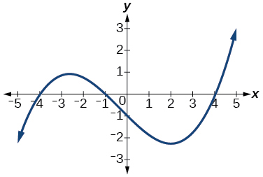 

3

 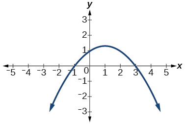 

 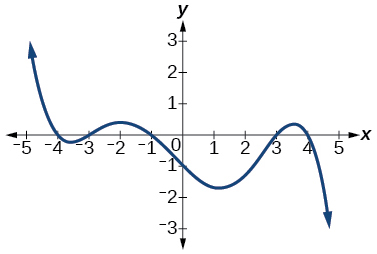 

5

 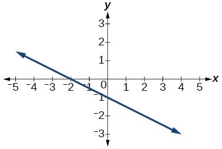 

 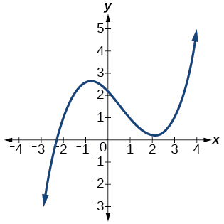 

3

 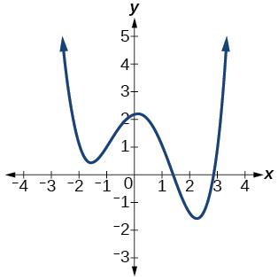 

 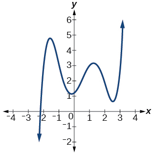 

5

 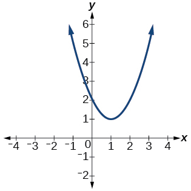 

For the following exercises, determine whether the graph of the function provided is a graph of a polynomial function. If so, determine the number of turning points and the least possible degree for the function.

  

Yes. Number of turning points is 2. Least possible degree is 3.

 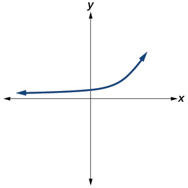 

 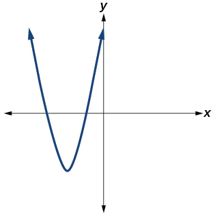 

Yes. Number of turning points is 1. Least possible degree is 2.

 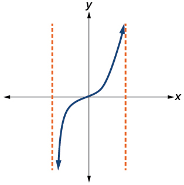 

 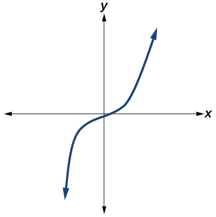 

Yes. Number of turning points is 0. Least possible degree is 1.

 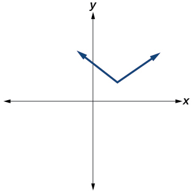 

No.

  

Yes. Number of turning points is 0. Least possible degree is 1.

#### Numeric

For the following exercises, make a table to confirm the end behavior of the function.

<math xmlns="http://www.w3.org/1998/Math/MathML"> <mrow> <mi>f</mi><mo stretchy="false">(</mo><mi>x</mi><mo stretchy="false">)</mo><mo>=</mo><mo>−</mo><msup> <mi>x</mi> <mn>3</mn> </msup> </mrow> </math>

<math xmlns="http://www.w3.org/1998/Math/MathML"> <mrow> <mi>f</mi><mo stretchy="false">(</mo><mi>x</mi><mo stretchy="false">)</mo><mo>=</mo><msup> <mi>x</mi> <mn>4</mn> </msup> <mo>−</mo><mn>5</mn><msup> <mi>x</mi> <mn>2</mn> </msup> </mrow> </math>

<table class="unnumbered" summary=".." data-label=""><caption></caption><thead>
<tr>
<th><math xmlns="http://www.w3.org/1998/Math/MathML">
 <mi>x</mi>
</math>
</th>
<th><math xmlns="http://www.w3.org/1998/Math/MathML">
 <mrow>
  <mi>f</mi><mrow><mo>(</mo>
   <mi>x</mi>
  <mo>)</mo></mrow>
 </mrow>
</math>
</th>
</tr>
</thead><tbody>
<tr>
<td>10</td>
<td>9,500</td>
</tr>
<tr>
<td>100</td>
<td>99,950,000</td>
</tr>
<tr>
<td>–10</td>
<td>9,500</td>
</tr>
<tr>
<td>–100</td>
<td>99,950,000</td>
</tr>
</tbody></table>
<math xmlns="http://www.w3.org/1998/Math/MathML"> <mrow> <mtext>as</mtext><mtext> </mtext><mi>x</mi><mo stretchy="false">→</mo><mo>−</mo><mi>∞</mi><mo>,</mo><mtext> </mtext><mtext> </mtext><mi>f</mi><mo stretchy="false">(</mo><mi>x</mi><mo stretchy="false">)</mo><mo stretchy="false">→</mo><mi>∞</mi><mo>,</mo><mtext> </mtext><mtext>as</mtext><mtext> </mtext><mi>x</mi><mo stretchy="false">→</mo><mi>∞</mi><mo>,</mo><mtext> </mtext><mi>f</mi><mo stretchy="false">(</mo><mi>x</mi><mo stretchy="false">)</mo><mo stretchy="false">→</mo><mi>∞</mi> </mrow> </math>

<math xmlns="http://www.w3.org/1998/Math/MathML"> <mrow> <mi>f</mi><mo stretchy="false">(</mo><mi>x</mi><mo stretchy="false">)</mo><mo>=</mo><msup> <mi>x</mi> <mn>2</mn> </msup> <msup> <mrow> <mrow><mo>(</mo> <mrow> <mn>1</mn><mo>−</mo><mi>x</mi> </mrow> <mo>)</mo></mrow> </mrow> <mn>2</mn> </msup> </mrow> </math>

<math xmlns="http://www.w3.org/1998/Math/MathML"> <mrow> <mi>f</mi><mo stretchy="false">(</mo><mi>x</mi><mo stretchy="false">)</mo><mo>=</mo><mo stretchy="false">(</mo><mi>x</mi><mo>−</mo><mn>1</mn><mo stretchy="false">)</mo><mo stretchy="false">(</mo><mi>x</mi><mo>−</mo><mn>2</mn><mo stretchy="false">)</mo><mo stretchy="false">(</mo><mn>3</mn><mo>−</mo><mi>x</mi><mo stretchy="false">)</mo> </mrow> </math>

<table class="unnumbered" summary=".." data-label=""><caption></caption><thead>
<tr>
<th><math xmlns="http://www.w3.org/1998/Math/MathML">
 <mi>x</mi>
</math>
</th>
<th><math xmlns="http://www.w3.org/1998/Math/MathML">
 <mrow>
  <mi>f</mi><mrow><mo>(</mo>
   <mi>x</mi>
  <mo>)</mo></mrow>
 </mrow>
</math>
</th>
</tr>
</thead><tbody>
<tr>
<td>10</td>
<td>–504</td>
</tr>
<tr>
<td>100</td>
<td>–941,094</td>
</tr>
<tr>
<td>–10</td>
<td>1,716</td>
</tr>
<tr>
<td>–100</td>
<td>1,061,106</td>
</tr>
</tbody></table>
<math xmlns="http://www.w3.org/1998/Math/MathML"> <mrow> <mtext>as</mtext><mtext> </mtext><mi>x</mi><mo stretchy="false">→</mo><mo>−</mo><mi>∞</mi><mo>,</mo><mtext> </mtext><mtext> </mtext><mi>f</mi><mo stretchy="false">(</mo><mi>x</mi><mo stretchy="false">)</mo><mo stretchy="false">→</mo><mi>∞</mi><mo>,</mo><mtext> </mtext><mtext>as</mtext><mtext> </mtext><mi>x</mi><mo stretchy="false">→</mo><mi>∞</mi><mo>,</mo><mtext> </mtext><mi>f</mi><mo stretchy="false">(</mo><mi>x</mi><mo stretchy="false">)</mo><mo stretchy="false">→</mo><mo>−</mo><mi>∞</mi> </mrow> </math>

<math xmlns="http://www.w3.org/1998/Math/MathML"> <mrow> <mi>f</mi><mo stretchy="false">(</mo><mi>x</mi><mo stretchy="false">)</mo><mo>=</mo><mfrac> <mrow> <msup> <mi>x</mi> <mn>5</mn> </msup> </mrow> <mrow> <mn>10</mn> </mrow> </mfrac> <mo>−</mo><msup> <mi>x</mi> <mn>4</mn> </msup> </mrow> </math>

#### Technology

For the following exercises, graph the polynomial functions using a calculator. Based on the graph, determine the intercepts and the end behavior.

<math xmlns="http://www.w3.org/1998/Math/MathML"> <mrow> <mi>f</mi><mo stretchy="false">(</mo><mi>x</mi><mo stretchy="false">)</mo><mo>=</mo><msup> <mi>x</mi> <mn>3</mn> </msup> <mo stretchy="false">(</mo><mi>x</mi><mo>−</mo><mn>2</mn><mo stretchy="false">)</mo> </mrow> </math>

 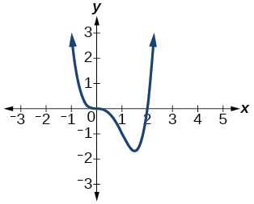 
The<math xmlns="http://www.w3.org/1998/Math/MathML"> <mrow> <mtext> </mtext><mi>y</mi><mtext>-</mtext> </mrow> </math>

intercept is<math xmlns="http://www.w3.org/1998/Math/MathML"> <mrow> <mtext> </mtext><mrow><mo>(</mo> <mrow> <mn>0</mn><mo>,</mo><mo> </mo><mn>0</mn> </mrow> <mo>)</mo></mrow><mo>.</mo><mtext> </mtext> </mrow> </math>

 The<math xmlns="http://www.w3.org/1998/Math/MathML"> <mrow> <mtext> </mtext><mi>x</mi><mtext>-</mtext> </mrow> </math>

intercepts are<math xmlns="http://www.w3.org/1998/Math/MathML"> <mrow> <mtext> </mtext><mrow><mo>(</mo> <mrow> <mn>0</mn><mo>,</mo><mo> </mo><mn>0</mn> </mrow> <mo>)</mo></mrow><mo>,</mo><mtext> </mtext><mrow><mo>(</mo> <mrow> <mn>2</mn><mo>,</mo><mo> </mo><mn>0</mn> </mrow> <mo>)</mo></mrow><mo>.</mo><mtext> </mtext> </mrow> </math>

 <math xmlns="http://www.w3.org/1998/Math/MathML"> <mrow> <mtext>As</mtext><mtext> </mtext><mi>x</mi><mo stretchy="false">→</mo><mo>−</mo><mi>∞</mi><mo>,</mo><mtext> </mtext><mtext> </mtext><mi>f</mi><mo stretchy="false">(</mo><mi>x</mi><mo stretchy="false">)</mo><mo stretchy="false">→</mo><mi>∞</mi><mo>,</mo><mtext> </mtext><mtext>as</mtext><mtext> </mtext><mi>x</mi><mo stretchy="false">→</mo><mi>∞</mi><mo>,</mo><mtext> </mtext><mi>f</mi><mo stretchy="false">(</mo><mi>x</mi><mo stretchy="false">)</mo><mo stretchy="false">→</mo><mi>∞</mi> </mrow> </math>

<math xmlns="http://www.w3.org/1998/Math/MathML"> <mrow> <mi>f</mi><mo stretchy="false">(</mo><mi>x</mi><mo stretchy="false">)</mo><mo>=</mo><mi>x</mi><mo stretchy="false">(</mo><mi>x</mi><mo>−</mo><mn>3</mn><mo stretchy="false">)</mo><mo stretchy="false">(</mo><mi>x</mi><mo>+</mo><mn>3</mn><mo stretchy="false">)</mo> </mrow> </math>

<math xmlns="http://www.w3.org/1998/Math/MathML"> <mrow> <mi>f</mi><mo stretchy="false">(</mo><mi>x</mi><mo stretchy="false">)</mo><mo>=</mo><mi>x</mi><mo stretchy="false">(</mo><mn>14</mn><mo>−</mo><mn>2</mn><mi>x</mi><mo stretchy="false">)</mo><mo stretchy="false">(</mo><mn>10</mn><mo>−</mo><mn>2</mn><mi>x</mi><mo stretchy="false">)</mo> </mrow> </math>

 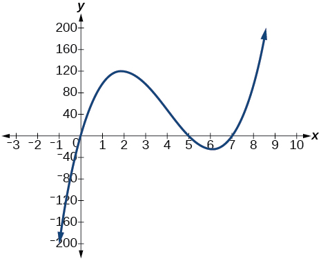 
The<math xmlns="http://www.w3.org/1998/Math/MathML"> <mrow> <mtext> </mtext><mi>y</mi><mtext>-</mtext> </mrow> </math>

intercept is<math xmlns="http://www.w3.org/1998/Math/MathML"> <mrow> <mtext> </mtext><mrow><mo>(</mo> <mrow> <mn>0</mn><mo>,</mo><mn>0</mn> </mrow> <mo>)</mo></mrow> </mrow> </math>

 . The<math xmlns="http://www.w3.org/1998/Math/MathML"> <mrow> <mtext> </mtext><mi>x</mi><mtext>-</mtext> </mrow> </math>

intercepts are<math xmlns="http://www.w3.org/1998/Math/MathML"> <mrow> <mtext> </mtext><mrow><mo>(</mo> <mrow> <mn>0</mn><mo>,</mo><mo> </mo><mn>0</mn> </mrow> <mo>)</mo></mrow><mo>,</mo><mtext> </mtext><mrow><mo>(</mo> <mrow> <mn>5</mn><mo>,</mo><mo> </mo><mn>0</mn> </mrow> <mo>)</mo></mrow><mo>,</mo><mtext> </mtext><mrow><mo>(</mo> <mrow> <mn>7</mn><mo>,</mo><mo> </mo><mn>0</mn> </mrow> <mo>)</mo></mrow><mo>.</mo><mtext> </mtext> </mrow> </math>

 <math xmlns="http://www.w3.org/1998/Math/MathML"> <mrow> <mtext>As</mtext><mtext> </mtext><mi>x</mi><mo stretchy="false">→</mo><mo>−</mo><mi>∞</mi><mo>,</mo><mtext> </mtext><mtext> </mtext><mi>f</mi><mo stretchy="false">(</mo><mi>x</mi><mo stretchy="false">)</mo><mo stretchy="false">→</mo><mo>−</mo><mi>∞</mi><mo>,</mo><mtext> </mtext><mtext>as</mtext><mtext> </mtext><mi>x</mi><mo stretchy="false">→</mo><mi>∞</mi><mo>,</mo><mtext> </mtext><mi>f</mi><mo stretchy="false">(</mo><mi>x</mi><mo stretchy="false">)</mo><mo stretchy="false">→</mo><mi>∞</mi> </mrow> </math>

<math xmlns="http://www.w3.org/1998/Math/MathML"> <mrow> <mi>f</mi><mo stretchy="false">(</mo><mi>x</mi><mo stretchy="false">)</mo><mo>=</mo><mi>x</mi><mo stretchy="false">(</mo><mn>14</mn><mo>−</mo><mn>2</mn><mi>x</mi><mo stretchy="false">)</mo><msup> <mrow> <mo stretchy="false">(</mo><mn>10</mn><mo>−</mo><mn>2</mn><mi>x</mi><mo stretchy="false">)</mo> </mrow> <mn>2</mn> </msup> </mrow> </math>

<math xmlns="http://www.w3.org/1998/Math/MathML"> <mrow> <mi>f</mi><mo stretchy="false">(</mo><mi>x</mi><mo stretchy="false">)</mo><mo>=</mo><msup> <mi>x</mi> <mn>3</mn> </msup> <mo>−</mo><mn>16</mn><mi>x</mi> </mrow> </math>

 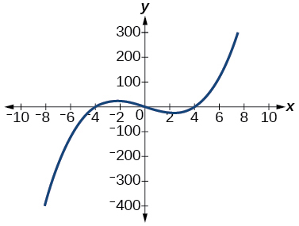 
The<math xmlns="http://www.w3.org/1998/Math/MathML"> <mrow> <mtext> </mtext><mi>y</mi><mtext>-</mtext> </mrow> </math>

intercept is<math xmlns="http://www.w3.org/1998/Math/MathML"> <mrow> <mtext> </mtext><mrow><mo>(</mo> <mrow> <mn>0</mn><mo>,</mo><mo> </mo><mn>0</mn> </mrow> <mo>)</mo></mrow><mo>.</mo><mtext> </mtext> </mrow> </math>

 The<math xmlns="http://www.w3.org/1998/Math/MathML"> <mrow> <mtext> </mtext><mi>x</mi><mtext>-</mtext> </mrow> </math>

intercept is<math xmlns="http://www.w3.org/1998/Math/MathML"> <mrow> <mtext> </mtext><mrow><mo>(</mo> <mrow> <mo>−</mo><mn>4</mn><mo>,</mo><mo> </mo><mn>0</mn> </mrow> <mo>)</mo></mrow><mo>,</mo><mtext> </mtext><mrow><mo>(</mo> <mrow> <mn>0</mn><mo>,</mo><mo> </mo><mn>0</mn> </mrow> <mo>)</mo></mrow><mo>,</mo><mtext> </mtext><mrow><mo>(</mo> <mrow> <mn>4</mn><mo>,</mo><mo> </mo><mn>0</mn> </mrow> <mo>)</mo></mrow><mo>.</mo><mtext> </mtext> </mrow> </math>

 <math xmlns="http://www.w3.org/1998/Math/MathML"> <mrow> <mi>A</mi><mi>s</mi><mtext> </mtext><mi>x</mi><mo stretchy="false">→</mo><mo>−</mo><mi>∞</mi><mo>,</mo><mtext> </mtext><mtext> </mtext><mi>f</mi><mo stretchy="false">(</mo><mi>x</mi><mo stretchy="false">)</mo><mo stretchy="false">→</mo><mo>−</mo><mi>∞</mi><mo>,</mo><mtext> </mtext><mtext>as</mtext><mtext> </mtext><mi>x</mi><mo stretchy="false">→</mo><mi>∞</mi><mo>,</mo><mtext> </mtext><mi>f</mi><mo stretchy="false">(</mo><mi>x</mi><mo stretchy="false">)</mo><mo stretchy="false">→</mo><mi>∞</mi> </mrow> </math>

<math xmlns="http://www.w3.org/1998/Math/MathML"> <mrow> <mi>f</mi><mo stretchy="false">(</mo><mi>x</mi><mo stretchy="false">)</mo><mo>=</mo><msup> <mi>x</mi> <mn>3</mn> </msup> <mo>−</mo><mn>27</mn> </mrow> </math>

<math xmlns="http://www.w3.org/1998/Math/MathML"> <mrow> <mi>f</mi><mo stretchy="false">(</mo><mi>x</mi><mo stretchy="false">)</mo><mo>=</mo><msup> <mi>x</mi> <mn>4</mn> </msup> <mo>−</mo><mn>81</mn> </mrow> </math>

 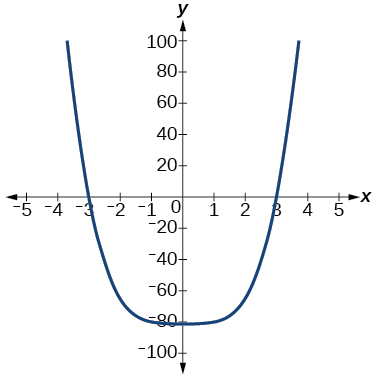 
The<math xmlns="http://www.w3.org/1998/Math/MathML"> <mrow> <mtext> </mtext><mi>y</mi><mtext>-</mtext> </mrow> </math>

intercept is<math xmlns="http://www.w3.org/1998/Math/MathML"> <mrow> <mtext> </mtext><mrow><mo>(</mo> <mrow> <mn>0</mn><mo>,</mo><mo> </mo><mo>−</mo><mn>81</mn> </mrow> <mo>)</mo></mrow><mo>.</mo><mtext> </mtext> </mrow> </math>

 The<math xmlns="http://www.w3.org/1998/Math/MathML"> <mrow> <mtext> </mtext><mi>x</mi><mtext>-</mtext> </mrow> </math>

intercept are<math xmlns="http://www.w3.org/1998/Math/MathML"> <mrow> <mtext> </mtext><mrow><mo>(</mo> <mrow> <mn>3</mn><mo>,</mo><mo> </mo><mn>0</mn> </mrow> <mo>)</mo></mrow><mo>,</mo><mtext> </mtext><mrow><mo>(</mo> <mrow> <mo>−</mo><mn>3</mn><mo>,</mo><mo> </mo><mn>0</mn> </mrow> <mo>)</mo></mrow><mo>.</mo><mtext> </mtext> </mrow> </math>

 <math xmlns="http://www.w3.org/1998/Math/MathML"> <mrow> <mtext>As</mtext><mtext> </mtext><mi>x</mi><mo stretchy="false">→</mo><mo>−</mo><mi>∞</mi><mo>,</mo><mtext> </mtext><mtext> </mtext><mi>f</mi><mo stretchy="false">(</mo><mi>x</mi><mo stretchy="false">)</mo><mo stretchy="false">→</mo><mi>∞</mi><mo>,</mo><mtext> </mtext><mtext>as</mtext><mtext> </mtext><mi>x</mi><mo stretchy="false">→</mo><mi>∞</mi><mo>,</mo><mtext> </mtext><mi>f</mi><mo stretchy="false">(</mo><mi>x</mi><mo stretchy="false">)</mo><mo stretchy="false">→</mo><mi>∞</mi> </mrow> </math>

<math xmlns="http://www.w3.org/1998/Math/MathML"> <mrow> <mi>f</mi><mo stretchy="false">(</mo><mi>x</mi><mo stretchy="false">)</mo><mo>=</mo><mo>−</mo><msup> <mi>x</mi> <mn>3</mn> </msup> <mo>+</mo><msup> <mi>x</mi> <mn>2</mn> </msup> <mo>+</mo><mn>2</mn><mi>x</mi> </mrow> </math>

<math xmlns="http://www.w3.org/1998/Math/MathML"> <mrow> <mi>f</mi><mo stretchy="false">(</mo><mi>x</mi><mo stretchy="false">)</mo><mo>=</mo><msup> <mi>x</mi> <mn>3</mn> </msup> <mo>−</mo><mn>2</mn><msup> <mi>x</mi> <mn>2</mn> </msup> <mo>−</mo><mn>15</mn><mi>x</mi> </mrow> </math>

 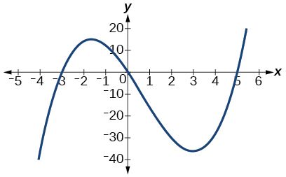 
The<math xmlns="http://www.w3.org/1998/Math/MathML"> <mrow> <mtext> </mtext><mi>y</mi><mtext>-</mtext> </mrow> </math>

intercept is<math xmlns="http://www.w3.org/1998/Math/MathML"> <mrow> <mtext> </mtext><mrow><mo>(</mo> <mrow> <mn>0</mn><mo>,</mo><mo> </mo><mn>0</mn> </mrow> <mo>)</mo></mrow><mo>.</mo><mtext> </mtext> </mrow> </math>

 The<math xmlns="http://www.w3.org/1998/Math/MathML"> <mrow> <mtext> </mtext><mi>x</mi><mtext>-</mtext> </mrow> </math>

intercepts are<math xmlns="http://www.w3.org/1998/Math/MathML"> <mrow> <mtext> </mtext><mrow><mo>(</mo> <mrow> <mo>−</mo><mn>3</mn><mo>,</mo><mo> </mo><mn>0</mn> </mrow> <mo>)</mo></mrow><mo>,</mo><mtext> </mtext><mrow><mo>(</mo> <mrow> <mn>0</mn><mo>,</mo><mo> </mo><mn>0</mn> </mrow> <mo>)</mo></mrow><mo>,</mo><mtext> </mtext><mrow><mo>(</mo> <mrow> <mn>5</mn><mo>,</mo><mo> </mo><mn>0</mn> </mrow> <mo>)</mo></mrow><mo>.</mo><mtext> </mtext> </mrow> </math>

 <math xmlns="http://www.w3.org/1998/Math/MathML"> <mrow> <mtext>As</mtext><mtext> </mtext><mi>x</mi><mo stretchy="false">→</mo><mo>−</mo><mi>∞</mi><mo>,</mo><mtext> </mtext><mtext> </mtext><mi>f</mi><mo stretchy="false">(</mo><mi>x</mi><mo stretchy="false">)</mo><mo stretchy="false">→</mo><mo>−</mo><mi>∞</mi><mo>,</mo><mtext> </mtext><mtext>as</mtext><mtext> </mtext><mi>x</mi><mo stretchy="false">→</mo><mi>∞</mi><mo>,</mo><mtext> </mtext><mi>f</mi><mo stretchy="false">(</mo><mi>x</mi><mo stretchy="false">)</mo><mo stretchy="false">→</mo><mi>∞</mi> </mrow> </math>

<math xmlns="http://www.w3.org/1998/Math/MathML"> <mrow> <mi>f</mi><mo stretchy="false">(</mo><mi>x</mi><mo stretchy="false">)</mo><mo>=</mo><msup> <mi>x</mi> <mn>3</mn> </msup> <mo>−</mo><mn>0.01</mn><mi>x</mi> </mrow> </math>

#### Extensions

For the following exercises, use the information about the graph of a polynomial function to determine the function. Assume the leading coefficient is 1 or –1. There may be more than one correct answer.

The<math xmlns="http://www.w3.org/1998/Math/MathML"> <mrow> <mtext> </mtext><mi>y</mi><mi>-</mi> </mrow> </math>

intercept is<math xmlns="http://www.w3.org/1998/Math/MathML"> <mrow> <mtext> </mtext><mo stretchy="false">(</mo><mn>0</mn><mo>,</mo><mo>−</mo><mn>4</mn><mo stretchy="false">)</mo><mo>.</mo><mtext> </mtext> </mrow> </math>

The<math xmlns="http://www.w3.org/1998/Math/MathML"> <mrow> <mtext> </mtext><mi>x</mi><mi>-</mi> </mrow> </math>

intercepts are<math xmlns="http://www.w3.org/1998/Math/MathML"> <mrow> <mtext> </mtext><mo stretchy="false">(</mo><mo>−</mo><mn>2</mn><mo>,</mo><mn>0</mn><mo stretchy="false">)</mo><mo>,</mo><mtext> </mtext><mo stretchy="false">(</mo><mn>2</mn><mo>,</mo><mn>0</mn><mo stretchy="false">)</mo><mo>.</mo><mtext> </mtext></mrow> </math>

Degree is 2.

End behavior:<math xmlns="http://www.w3.org/1998/Math/MathML"> <mrow> <mtext> </mtext><mtext>as</mtext><mtext> </mtext><mi>x</mi><mo stretchy="false">→</mo><mo>−</mo><mi>∞</mi><mo>,</mo><mtext> </mtext><mtext> </mtext><mi>f</mi><mo stretchy="false">(</mo><mi>x</mi><mo stretchy="false">)</mo><mo stretchy="false">→</mo><mi>∞</mi><mo>,</mo><mtext> </mtext><mtext>as</mtext><mtext> </mtext><mi>x</mi><mo stretchy="false">→</mo><mi>∞</mi><mo>,</mo><mtext> </mtext><mi>f</mi><mo stretchy="false">(</mo><mi>x</mi><mo stretchy="false">)</mo><mo stretchy="false">→</mo><mi>∞</mi><mo>.</mo> </mrow> </math>

<math xmlns="http://www.w3.org/1998/Math/MathML"> <mrow> <mi>f</mi><mo stretchy="false">(</mo><mi>x</mi><mo stretchy="false">)</mo><mo>=</mo><msup> <mi>x</mi> <mn>2</mn> </msup> <mo>−</mo><mn>4</mn> </mrow> </math>

The<math xmlns="http://www.w3.org/1998/Math/MathML"> <mrow> <mtext> </mtext><mi>y</mi><mi>-</mi> </mrow> </math>

intercept is<math xmlns="http://www.w3.org/1998/Math/MathML"> <mrow> <mtext> </mtext><mo stretchy="false">(</mo><mn>0</mn><mo>,</mo><mn>9</mn><mo stretchy="false">)</mo><mo>.</mo><mtext> </mtext> </mrow> </math>

The<math xmlns="http://www.w3.org/1998/Math/MathML"> <mrow> <mtext> </mtext><mi>x</mi><mtext>-</mtext> </mrow> </math>

intercepts are<math xmlns="http://www.w3.org/1998/Math/MathML"> <mrow> <mtext> </mtext><mo stretchy="false">(</mo><mo>−</mo><mn>3</mn><mo>,</mo><mn>0</mn><mo stretchy="false">)</mo><mo>,</mo><mtext> </mtext><mo stretchy="false">(</mo><mn>3</mn><mo>,</mo><mn>0</mn><mo stretchy="false">)</mo><mo>.</mo><mtext> </mtext></mrow> </math>

Degree is 2.

End behavior:<math xmlns="http://www.w3.org/1998/Math/MathML"> <mrow> <mtext> </mtext><mtext>as</mtext><mtext> </mtext><mi>x</mi><mo stretchy="false">→</mo><mo>−</mo><mi>∞</mi><mo>,</mo><mtext> </mtext><mtext> </mtext><mi>f</mi><mo stretchy="false">(</mo><mi>x</mi><mo stretchy="false">)</mo><mo stretchy="false">→</mo><mo>−</mo><mi>∞</mi><mo>,</mo><mtext> </mtext><mtext>as</mtext><mtext> </mtext><mi>x</mi><mo stretchy="false">→</mo><mi>∞</mi><mo>,</mo><mtext> </mtext><mi>f</mi><mo stretchy="false">(</mo><mi>x</mi><mo stretchy="false">)</mo><mo stretchy="false">→</mo><mo>−</mo><mi>∞</mi><mo>.</mo> </mrow> </math>

The<math xmlns="http://www.w3.org/1998/Math/MathML"> <mrow> <mtext> </mtext><mi>y</mi><mi>-</mi> </mrow> </math>

intercept is<math xmlns="http://www.w3.org/1998/Math/MathML"> <mrow> <mtext> </mtext><mo stretchy="false">(</mo><mn>0</mn><mo>,</mo><mn>0</mn><mo stretchy="false">)</mo><mo>.</mo><mtext> </mtext> </mrow> </math>

The<math xmlns="http://www.w3.org/1998/Math/MathML"> <mrow> <mtext> </mtext><mi>x</mi><mi>-</mi> </mrow> </math>

intercepts are<math xmlns="http://www.w3.org/1998/Math/MathML"> <mrow> <mtext> </mtext><mo stretchy="false">(</mo><mn>0</mn><mo>,</mo><mn>0</mn><mo stretchy="false">)</mo><mo>,</mo><mtext> </mtext><mo stretchy="false">(</mo><mn>2</mn><mo>,</mo><mn>0</mn><mo stretchy="false">)</mo><mo>.</mo><mtext> </mtext></mrow> </math>

Degree is 3.

End behavior:<math xmlns="http://www.w3.org/1998/Math/MathML"> <mrow> <mtext> </mtext><mtext>as</mtext><mtext> </mtext><mi>x</mi><mo stretchy="false">→</mo><mo>−</mo><mi>∞</mi><mo>,</mo><mtext> </mtext><mtext> </mtext><mi>f</mi><mo stretchy="false">(</mo><mi>x</mi><mo stretchy="false">)</mo><mo stretchy="false">→</mo><mo>−</mo><mi>∞</mi><mo>,</mo><mtext> </mtext><mtext>as</mtext><mtext> </mtext><mi>x</mi><mo stretchy="false">→</mo><mi>∞</mi><mo>,</mo><mtext> </mtext><mi>f</mi><mo stretchy="false">(</mo><mi>x</mi><mo stretchy="false">)</mo><mo stretchy="false">→</mo><mi>∞</mi><mo>.</mo> </mrow> </math>

<math xmlns="http://www.w3.org/1998/Math/MathML"> <mrow> <mi>f</mi><mo stretchy="false">(</mo><mi>x</mi><mo stretchy="false">)</mo><mo>=</mo><msup> <mi>x</mi> <mn>3</mn> </msup> <mo>−</mo><mn>4</mn><msup> <mi>x</mi> <mn>2</mn> </msup> <mo>+</mo><mn>4</mn><mi>x</mi> </mrow> </math>

The<math xmlns="http://www.w3.org/1998/Math/MathML"> <mrow> <mtext> </mtext><mi>y</mi><mi>-</mi> </mrow> </math>

intercept is<math xmlns="http://www.w3.org/1998/Math/MathML"> <mrow> <mtext> </mtext><mo stretchy="false">(</mo><mn>0</mn><mo>,</mo><mn>1</mn><mo stretchy="false">)</mo><mo>.</mo><mtext> </mtext> </mrow> </math>

The<math xmlns="http://www.w3.org/1998/Math/MathML"> <mrow> <mtext> </mtext><mi>x</mi><mi>-</mi> </mrow> </math>

intercept is<math xmlns="http://www.w3.org/1998/Math/MathML"> <mrow> <mtext> </mtext><mo stretchy="false">(</mo><mn>1</mn><mo>,</mo><mn>0</mn><mo stretchy="false">)</mo><mo>.</mo><mtext> </mtext> </mrow> </math>

Degree is 3.

End behavior:<math xmlns="http://www.w3.org/1998/Math/MathML"> <mrow> <mtext> </mtext><mtext>as</mtext><mtext> </mtext><mi>x</mi><mo stretchy="false">→</mo><mo>−</mo><mi>∞</mi><mo>,</mo><mtext> </mtext><mtext> </mtext><mi>f</mi><mo stretchy="false">(</mo><mi>x</mi><mo stretchy="false">)</mo><mo stretchy="false">→</mo><mi>∞</mi><mo>,</mo><mtext> </mtext><mtext>as</mtext><mtext> </mtext><mi>x</mi><mo stretchy="false">→</mo><mi>∞</mi><mo>,</mo><mtext> </mtext><mi>f</mi><mo stretchy="false">(</mo><mi>x</mi><mo stretchy="false">)</mo><mo stretchy="false">→</mo><mo>−</mo><mi>∞</mi><mo>.</mo> </mrow> </math>

The<math xmlns="http://www.w3.org/1998/Math/MathML"> <mrow> <mtext> </mtext><mi>y</mi><mi>-</mi> </mrow> </math>

intercept is<math xmlns="http://www.w3.org/1998/Math/MathML"> <mrow> <mtext> </mtext><mo stretchy="false">(</mo><mn>0</mn><mo>,</mo><mn>1</mn><mo stretchy="false">)</mo><mo>.</mo><mtext> </mtext> </mrow> </math>

There is no<math xmlns="http://www.w3.org/1998/Math/MathML"> <mrow> <mtext> </mtext><mi>x</mi><mi>-</mi> </mrow> </math>

intercept. Degree is 4.

End behavior:<math xmlns="http://www.w3.org/1998/Math/MathML"> <mrow> <mtext> </mtext><mtext>as</mtext><mtext> </mtext><mi>x</mi><mo stretchy="false">→</mo><mo>−</mo><mi>∞</mi><mo>,</mo><mtext> </mtext><mtext> </mtext><mi>f</mi><mo stretchy="false">(</mo><mi>x</mi><mo stretchy="false">)</mo><mo stretchy="false">→</mo><mi>∞</mi><mo>,</mo><mtext> </mtext><mtext>as</mtext><mtext> </mtext><mi>x</mi><mo stretchy="false">→</mo><mi>∞</mi><mo>,</mo><mtext> </mtext><mi>f</mi><mo stretchy="false">(</mo><mi>x</mi><mo stretchy="false">)</mo><mo stretchy="false">→</mo><mi>∞</mi><mo>.</mo> </mrow> </math>

<math xmlns="http://www.w3.org/1998/Math/MathML"> <mrow> <mi>f</mi><mo stretchy="false">(</mo><mi>x</mi><mo stretchy="false">)</mo><mo>=</mo><msup> <mi>x</mi> <mn>4</mn> </msup> <mo>+</mo><mn>1</mn> </mrow> </math>

#### Real-World Applications

For the following exercises, use the written statements to construct a polynomial function that represents the required information.

An oil slick is expanding as a circle. The radius of the circle is increasing at the rate of 20 meters per day. Express the area of the circle as a function of<math xmlns="http://www.w3.org/1998/Math/MathML"> <mrow> <mtext> </mtext><mi>d</mi><mo>,</mo><mtext> </mtext> </mrow> </math>

the number of days elapsed.

A cube has an edge of 3 feet. The edge is increasing at the rate of 2 feet per minute. Express the volume of the cube as a function of<math xmlns="http://www.w3.org/1998/Math/MathML"> <mrow> <mtext> </mtext><mi>m</mi><mo>,</mo><mtext> </mtext> </mrow> </math>

the number of minutes elapsed.

<math xmlns="http://www.w3.org/1998/Math/MathML"> <mrow> <mi>V</mi><mo stretchy="false">(</mo><mi>m</mi><mo stretchy="false">)</mo><mo>=</mo><mn>8</mn><msup> <mi>m</mi> <mn>3</mn> </msup> <mo>+</mo><mn>36</mn><msup> <mi>m</mi> <mn>2</mn> </msup> <mo>+</mo><mn>54</mn><mi>m</mi><mo>+</mo><mn>27</mn> </mrow> </math>

A rectangle has a length of 10 inches and a width of 6 inches. If the length is increased by<math xmlns="http://www.w3.org/1998/Math/MathML"> <mrow> <mtext> </mtext><mi>x</mi><mtext> </mtext> </mrow> </math>

inches and the width increased by twice that amount, express the area of the rectangle as a function of<math xmlns="http://www.w3.org/1998/Math/MathML"> <mrow> <mtext> </mtext><mi>x</mi><mo>.</mo> </mrow> </math>

An open box is to be constructed by cutting out square corners of <math xmlns="http://www.w3.org/1998/Math/MathML"> <mrow> <mtext> </mtext><mi>x</mi><mi>-</mi> </mrow> </math>

inch sides from a piece of cardboard 8 inches by 8 inches and then folding up the sides. Express the volume of the box as a function of<math xmlns="http://www.w3.org/1998/Math/MathML"> <mrow> <mtext> </mtext><mi>x</mi><mo>.</mo> </mrow> </math>

<math xmlns="http://www.w3.org/1998/Math/MathML"> <mrow> <mi>V</mi><mo stretchy="false">(</mo><mi>x</mi><mo stretchy="false">)</mo><mo>=</mo><mn>4</mn><msup> <mi>x</mi> <mn>3</mn> </msup> <mo>−</mo><mn>32</mn><msup> <mi>x</mi> <mn>2</mn> </msup> <mo>+</mo><mn>64</mn><mi>x</mi> </mrow> </math>

A rectangle is twice as long as it is wide. Squares of side 2 feet are cut out from each corner. Then the sides are folded up to make an open box. Express the volume of the box as a function of the width (<math xmlns="http://www.w3.org/1998/Math/MathML"> <mi>x</mi> </math>

).

### Glossary
{: data-type="glossary-title"}

coefficient
: a nonzero real number multiplied by a variable raised to an exponent
^

continuous function
: a function whose graph can be drawn without lifting the pen from the paper because there are no breaks in the graph
^

degree
: the highest power of the variable that occurs in a polynomial
^

end behavior
: the behavior of the graph of a function as the input decreases without bound and increases without bound
^

leading coefficient
: the coefficient of the leading term
^

leading term
: the term containing the highest power of the variable
^

polynomial function
: a function that consists of either zero or the sum of a finite number of non-zero terms, each of which is a product of a number, called the coefficient of the term, and a variable raised to a non-negative integer power.
^

power function
: a function that can be represented in the form
  <math xmlns="http://www.w3.org/1998/Math/MathML"> <mrow> <mtext> </mtext><mi>f</mi><mo stretchy="false">(</mo><mi>x</mi><mo stretchy="false">)</mo><mo>=</mo><mi>k</mi><msup> <mi>x</mi> <mi>p</mi> </msup> <mtext> </mtext> </mrow> </math>
  
  where
  <math xmlns="http://www.w3.org/1998/Math/MathML"> <mrow> <mtext> </mtext><mi>k</mi><mtext> </mtext> </mrow> </math>
  
  is a constant, the base is a variable, and the exponent,
  <math xmlns="http://www.w3.org/1998/Math/MathML"> <mrow> <mtext> </mtext><mi>p</mi></mrow> </math>
  
  , is a constant
^

smooth curve
: a graph with no sharp corners
^

term of a polynomial function
: any
  <math xmlns="http://www.w3.org/1998/Math/MathML"> <mrow> <mtext> </mtext><msub> <mi>a</mi> <mi>i</mi> </msub> <msup> <mi>x</mi> <mi>i</mi> </msup> <mtext> </mtext> </mrow> </math>
  
  of a polynomial function in the form
  <math xmlns="http://www.w3.org/1998/Math/MathML"> <mrow> <mtext> </mtext><mi>f</mi><mo stretchy="false">(</mo><mi>x</mi><mo stretchy="false">)</mo><mo>=</mo><msub> <mi>a</mi> <mi>n</mi> </msub> <msup> <mi>x</mi> <mi>n</mi> </msup> <mo>+</mo><mn>...</mn><mo>+</mo><msub> <mi>a</mi> <mn>2</mn> </msub> <msup> <mi>x</mi> <mn>2</mn> </msup> <mo>+</mo><msub> <mi>a</mi> <mn>1</mn> </msub> <mi>x</mi><mo>+</mo><msub> <mi>a</mi> <mn>0</mn> </msub> </mrow> </math>
^

turning point
: the location at which the graph of a function changes direction

[1]: http://openstax.org/l/keyinfopoly
[2]: http://openstax.org/l/endbehavior
[3]: http://openstax.org/l/turningpoints
[4]: http://openstax.org/l/leastposdegree
