

In this section, you will:
* Recognize characteristics of graphs of polynomial functions.
* Use factoring to find zeros of polynomial functions.
* Identify zeros and their multiplicities.
* Determine end behavior.
* Understand the relationship between degree and turning points.
* Graph polynomial functions.
* Use the Intermediate Value Theorem.

The revenue in millions of dollars for a fictional cable company from 2006 through 2013 is shown in [\[link\]](#Table_03_04_01)**.**

| **Year** | 2006 | 2007 | 2008 | 2009 | 2010 | 2011 | 2012 | 2013 |
| **Revenues** | 52.4 | 52.8 | 51.2 | 49.5 | 48.6 | 48.6 | 48.7 | 47.1 |
{: #Table_03_04_01 summary="Two rows and nine columns. The first row is labeled, &#x201C;Year&#x201D;, and the second row is labeled, &#x201C;Revenues&#x201D;. Reading the rows from left to right as ordered pairs, we have the following values: (2006, 52.4), (2007, 52.8), (2008, 51.2), (2009, 49.5), (2010, 48.6), (2011, 48.6), (2012, 48.7), and (2013, 47.1)."}

The revenue can be modeled by the polynomial function

<math xmlns="http://www.w3.org/1998/Math/MathML" display="block"> <mrow> <mi>R</mi><mo stretchy="false">(</mo><mi>t</mi><mo stretchy="false">)</mo><mo>=</mo><mo>−</mo><mn>0.037</mn><msup> <mi>t</mi> <mn>4</mn> </msup> <mo>+</mo><mn>1.414</mn><msup> <mi>t</mi> <mn>3</mn> </msup> <mo>−</mo><mn>19.777</mn><msup> <mi>t</mi> <mn>2</mn> </msup> <mo>+</mo><mn>118.696</mn><mi>t</mi><mo>−</mo><mn>205.332</mn> </mrow> </math>

where<math xmlns="http://www.w3.org/1998/Math/MathML"> <mrow> <mtext> </mtext><mi>R</mi><mtext> </mtext> </mrow> </math>

represents the revenue in millions of dollars and<math xmlns="http://www.w3.org/1998/Math/MathML"> <mrow> <mtext> </mtext><mi>t</mi><mtext> </mtext> </mrow> </math>

represents the year, with<math xmlns="http://www.w3.org/1998/Math/MathML"> <mrow> <mtext> </mtext><mi>t</mi><mo>=</mo><mn>6</mn><mtext> </mtext> </mrow> </math>

corresponding to 2006. Over which intervals is the revenue for the company increasing? Over which intervals is the revenue for the company decreasing? These questions, along with many others, can be answered by examining the graph of the polynomial function. We have already explored the local behavior of quadratics, a special case of polynomials. In this section we will explore the local behavior of polynomials in general.

### Recognizing Characteristics of Graphs of Polynomial Functions

Polynomial functions of degree 2 or more have graphs that do not have sharp corners; recall that these types of graphs are called smooth curves. Polynomial functions also display graphs that have no breaks. Curves with no breaks are called continuous. [\[link\]](#Figure_03_04_001) shows a graph that represents a **polynomial function**{: data-type="term" .no-emphasis} and a graph that represents a function that is not a polynomial.

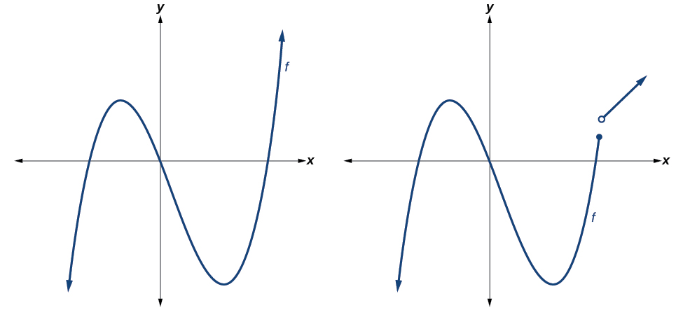{: #Figure_03_04_001}

Recognizing Polynomial Functions

Which of the graphs in [[link]](#Figure_03_04_002) represents a polynomial function?

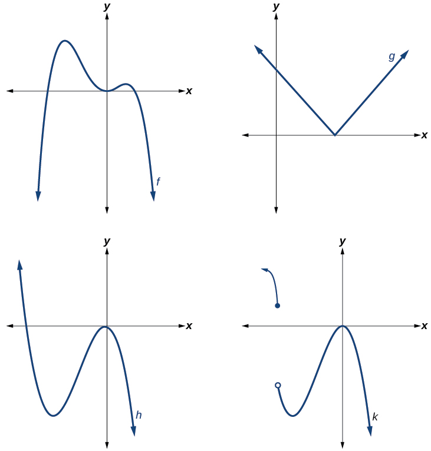{: #Figure_03_04_002}

The graphs of<math xmlns="http://www.w3.org/1998/Math/MathML"> <mrow> <mtext> </mtext><mi>f</mi><mtext> </mtext> </mrow> </math>

and<math xmlns="http://www.w3.org/1998/Math/MathML"> <mrow> <mtext> </mtext><mi>h</mi><mtext> </mtext> </mrow> </math>

are graphs of polynomial functions. They are smooth and **continuous**{: data-type="term" .no-emphasis}.

The graphs of<math xmlns="http://www.w3.org/1998/Math/MathML"> <mrow> <mtext> </mtext><mi>g</mi><mtext> </mtext> </mrow> </math>

and<math xmlns="http://www.w3.org/1998/Math/MathML"> <mrow> <mtext> </mtext><mi>k</mi><mtext> </mtext> </mrow> </math>

are graphs of functions that are not polynomials. The graph of function<math xmlns="http://www.w3.org/1998/Math/MathML"> <mrow> <mtext> </mtext><mi>g</mi><mtext> </mtext> </mrow> </math>

has a sharp corner. The graph of function<math xmlns="http://www.w3.org/1998/Math/MathML"> <mrow> <mtext> </mtext><mi>k</mi><mtext> </mtext> </mrow> </math>

is not continuous.

**Do all polynomial functions have as their domain all real numbers?**

*Yes. Any real number is a valid input for a polynomial function.*

###  Using Factoring to Find Zeros of Polynomial Functions

Recall that if<math xmlns="http://www.w3.org/1998/Math/MathML"> <mrow> <mtext> </mtext><mi>f</mi><mtext> </mtext> </mrow> </math>

is a polynomial function, the values of<math xmlns="http://www.w3.org/1998/Math/MathML"> <mrow> <mtext> </mtext><mi>x</mi><mtext> </mtext> </mrow> </math>

for which<math xmlns="http://www.w3.org/1998/Math/MathML"> <mrow> <mtext> </mtext><mi>f</mi><mrow><mo>(</mo> <mi>x</mi> <mo>)</mo></mrow><mo>=</mo><mn>0</mn><mtext> </mtext> </mrow> </math>

are called **zeros**{: data-type="term" .no-emphasis} of<math xmlns="http://www.w3.org/1998/Math/MathML"> <mrow> <mtext> </mtext><mi>f</mi><mo>.</mo><mtext> </mtext> </mrow> </math>

If the equation of the polynomial function can be factored, we can set each factor equal to zero and solve for the zeros**.**

We can use this method to find<math xmlns="http://www.w3.org/1998/Math/MathML"> <mrow> <mtext> </mtext><mi>x</mi><mtext>-</mtext> </mrow> </math>

intercepts because at the<math xmlns="http://www.w3.org/1998/Math/MathML"> <mrow> <mtext> </mtext><mi>x</mi><mtext>-</mtext> </mrow> </math>

intercepts we find the input values when the output value is zero. For general polynomials, this can be a challenging prospect. While quadratics can be solved using the relatively simple quadratic formula, the corresponding formulas for cubic and fourth-degree polynomials are not simple enough to remember, and formulas do not exist for general higher-degree polynomials. Consequently, we will limit ourselves to three cases:

1.  The polynomial can be factored using known methods: greatest common factor and trinomial factoring.
2.  The polynomial is given in factored form.
3.  Technology is used to determine the intercepts.
{: data-number-style="arabic"}

**Given a polynomial function<math xmlns="http://www.w3.org/1998/Math/MathML"> <mrow> <mtext> </mtext><mi>f</mi><mo>,</mo><mtext> </mtext> </mrow> </math>

find the *x*-intercepts by factoring.**

1.  Set
    <math xmlns="http://www.w3.org/1998/Math/MathML"> <mrow> <mtext> </mtext><mi>f</mi><mrow><mo>(</mo> <mi>x</mi> <mo>)</mo></mrow><mo>=</mo><mn>0.</mn><mtext> </mtext> </mrow> </math>

2.  If the polynomial function is not given in factored form:
    1.  Factor out any common monomial factors.
    2.  Factor any factorable binomials or trinomials.
    {: data-number-style="lower-alpha"}

3.  Set each factor equal to zero and solve to find the
    <math xmlns="http://www.w3.org/1998/Math/MathML"> <mrow> <mtext> </mtext><mi>x</mi><mtext>-</mtext> </mrow> </math>
    
    intercepts.
{: data-number-style="arabic"}

Finding the *x*-Intercepts of a Polynomial Function by Factoring

Find the *x*-intercepts of<math xmlns="http://www.w3.org/1998/Math/MathML"> <mrow> <mtext> </mtext><mi>f</mi><mo stretchy="false">(</mo><mi>x</mi><mo stretchy="false">)</mo><mo>=</mo><msup> <mi>x</mi> <mn>6</mn> </msup> <mo>−</mo><mn>3</mn><msup> <mi>x</mi> <mn>4</mn> </msup> <mo>+</mo><mn>2</mn><msup> <mi>x</mi> <mn>2</mn> </msup> <mo>.</mo> </mrow> </math>

We can attempt to factor this polynomial to find solutions for <math xmlns="http://www.w3.org/1998/Math/MathML"> <mrow> <mtext> </mtext><mi>f</mi><mrow><mo>(</mo> <mi>x</mi> <mo>)</mo></mrow><mo>=</mo><mn>0.</mn> </mrow> </math>

* * *
{: data-type="newline" data-count="2"}

<math xmlns="http://www.w3.org/1998/Math/MathML" display="block"> <mrow> <mtable> <mtr> <mtd columnalign="right"><mrow><msup><mi>x</mi><mn>6</mn></msup><mo>−</mo><mn>3</mn><msup><mi>x</mi><mn>4</mn></msup><mo>+</mo><mn>2</mn><msup><mi>x</mi><mn>2</mn></msup></mrow></mtd> <mtd><mo>=</mo></mtd> <mtd columnalign="left"><mn>0</mn></mtd> <mtd columnalign="left"><mspace width="2em" /> <mtable> <mtr> <mtd columnalign="left"><mtext>Factor out the greatest</mtext></mtd> </mtr> <mtr> <mtd columnalign="left"><mtext>common factor</mtext><mtext>.</mtext></mtd> </mtr> </mtable> </mtd> </mtr> <mtr> <mtd columnalign="right"> <mrow> <msup> <mi>x</mi> <mn>2</mn> </msup> <mo>(</mo><msup> <mi>x</mi> <mn>4</mn> </msup> <mo>−</mo><mn>3</mn><msup> <mi>x</mi> <mn>2</mn> </msup> <mo>+</mo><mn>2</mn><mo>)</mo></mrow> </mtd> <mtd><mo>=</mo></mtd> <mtd columnalign="left"><mn>0</mn></mtd> <mtd columnalign="left"><mrow><mspace width="2em" /><mtext>Factor the trinomial</mtext><mtext>.</mtext></mrow></mtd> </mtr> <mtr> <mtd columnalign="right"> <mrow> <msup> <mi>x</mi> <mn>2</mn> </msup> <mo>(</mo><msup> <mi>x</mi> <mn>2</mn> </msup> <mo>−</mo><mn>1</mn><mo>)</mo><mo>(</mo><msup> <mi>x</mi> <mn>2</mn> </msup> <mo>−</mo><mn>2</mn><mo>)</mo></mrow> </mtd> <mtd><mo>=</mo></mtd> <mtd columnalign="left"><mn>0</mn></mtd> <mtd><mrow><mspace width="2em" /><mtext>Set each factor equal to zero</mtext><mtext>.</mtext></mrow></mtd> </mtr> </mtable></mrow> </math>

<math xmlns="http://www.w3.org/1998/Math/MathML" display="block"> <mrow> <mtable> <mtr> <mtd /> <mtd /> <mtd /> <mtd /> <mtd columnalign="right"><mrow><mo>(</mo><msup><mi>x</mi><mn>2</mn></msup><mo>−</mo><mn>1</mn><mo>)</mo></mrow></mtd> <mtd><mo>=</mo></mtd> <mtd columnalign="left"><mn>0</mn></mtd> <mtd /> <mtd columnalign="right"><mrow><mo>(</mo><msup><mi>x</mi><mn>2</mn></msup><mo>−</mo><mn>2</mn><mo>)</mo></mrow></mtd> <mtd><mo>=</mo></mtd> <mtd columnalign="left"><mn>0</mn></mtd> </mtr> <mtr> <mtd columnalign="right"><mrow><msup><mi>x</mi><mn>2</mn></msup></mrow></mtd> <mtd><mo>=</mo></mtd> <mtd columnalign="left"><mn>0</mn></mtd> <mtd><mrow><mspace width="2em" /><mtext>or</mtext></mrow></mtd> <mtd columnalign="right"><mrow><msup><mi>x</mi><mn>2</mn></msup></mrow></mtd> <mtd><mo>=</mo></mtd> <mtd columnalign="left"><mn>1</mn></mtd> <mtd><mrow><mspace width="2em" /><mtext>or</mtext></mrow></mtd> <mtd columnalign="right"><mrow><msup><mi>x</mi><mn>2</mn></msup></mrow></mtd> <mtd><mo>=</mo></mtd> <mtd columnalign="left"><mn>2</mn></mtd> </mtr> <mtr> <mtd columnalign="right"><mi>x</mi></mtd> <mtd><mo>=</mo></mtd> <mtd columnalign="left"><mn>0</mn></mtd> <mtd /> <mtd columnalign="right"><mi>x</mi></mtd> <mtd><mo>=</mo></mtd> <mtd columnalign="left"><mrow><mn>±1</mn></mrow></mtd> <mtd /> <mtd columnalign="right"><mi>x</mi></mtd> <mtd><mo>=</mo></mtd> <mtd columnalign="left"><mrow><mo>±</mo><msqrt><mn>2</mn></msqrt></mrow></mtd> </mtr> </mtable></mrow> </math>

This gives us five *x*-intercepts:<math xmlns="http://www.w3.org/1998/Math/MathML"> <mrow> <mtext> </mtext><mo stretchy="false">(</mo><mn>0</mn><mo>,</mo><mn>0</mn><mo stretchy="false">)</mo><mo>,</mo><mo stretchy="false">(</mo><mn>1</mn><mo>,</mo><mn>0</mn><mo stretchy="false">)</mo><mo>,</mo><mo stretchy="false">(</mo><mn>−1</mn><mo>,</mo><mn>0</mn><mo stretchy="false">)</mo><mo>,</mo><mo stretchy="false">(</mo><msqrt> <mn>2</mn> </msqrt> <mo>,</mo><mn>0</mn><mo stretchy="false">)</mo><mo>,</mo><mtext> </mtext> </mrow> </math>

and<math xmlns="http://www.w3.org/1998/Math/MathML"> <mrow> <mtext> </mtext><mo stretchy="false">(</mo><mo>−</mo><msqrt> <mn>2</mn> </msqrt> <mo>,</mo><mn>0</mn><mo stretchy="false">)</mo><mo>.</mo><mtext> </mtext> </mrow> </math>

See [[link]](#Figure_03_04_003). We can see that this is an even function because it is symmetric about the *y*-axis.

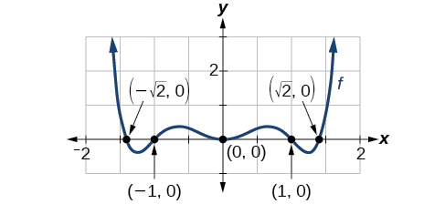{: #Figure_03_04_003}

Finding the *x*-Intercepts of a Polynomial Function by Factoring

Find the *x*-intercepts of<math xmlns="http://www.w3.org/1998/Math/MathML"> <mrow> <mtext> </mtext><mi>f</mi><mo stretchy="false">(</mo><mi>x</mi><mo stretchy="false">)</mo><mo>=</mo><msup> <mi>x</mi> <mn>3</mn> </msup> <mo>−</mo><mn>5</mn><msup> <mi>x</mi> <mn>2</mn> </msup> <mo>−</mo><mi>x</mi><mo>+</mo><mn>5.</mn> </mrow> </math>

Find solutions for<math xmlns="http://www.w3.org/1998/Math/MathML"> <mrow> <mtext> </mtext><mi>f</mi><mo stretchy="false">(</mo><mi>x</mi><mo stretchy="false">)</mo><mo>=</mo><mn>0</mn><mtext> </mtext> </mrow> </math>

 by factoring.* * *
{: data-type="newline" data-count="1"}

<math xmlns="http://www.w3.org/1998/Math/MathML" display="block"> <mrow> <mtable> <mtr> <mtd columnalign="right"><mrow><msup><mi>x</mi><mn>3</mn></msup><mo>−</mo><mn>5</mn><msup><mi>x</mi><mn>2</mn></msup><mo>−</mo><mi>x</mi><mo>+</mo><mn>5</mn></mrow></mtd> <mtd><mo>=</mo></mtd> <mtd columnalign="left"><mn>0</mn></mtd> <mtd columnalign="left"><mrow><mspace width="2em" /><mtext>Factor by grouping</mtext><mtext>.</mtext></mrow></mtd> </mtr> <mtr> <mtd columnalign="right"><mrow><msup><mi>x</mi><mn>2</mn></msup><mo stretchy="false">(</mo><mi>x</mi><mo>−</mo><mn>5</mn><mo stretchy="false">)</mo><mo>−</mo><mo stretchy="false">(</mo><mi>x</mi><mo>−</mo><mn>5</mn><mo stretchy="false">)</mo></mrow></mtd> <mtd><mo>=</mo></mtd> <mtd columnalign="left"><mn>0</mn></mtd> <mtd columnalign="left"><mrow><mspace width="2em" /><mtext>Factor out the common factor</mtext><mtext>.</mtext></mrow></mtd> </mtr> <mtr> <mtd columnalign="right"><mrow><mo>(</mo><msup><mi>x</mi><mn>2</mn></msup><mo>−</mo><mn>1</mn><mo>)</mo><mo stretchy="false">(</mo><mi>x</mi><mo>−</mo><mn>5</mn><mo stretchy="false">)</mo></mrow></mtd> <mtd><mo>=</mo></mtd> <mtd columnalign="left"><mn>0</mn></mtd> <mtd columnalign="left"><mrow><mspace width="2em" /><mtext>Factor the difference of squares</mtext><mtext>.</mtext></mrow></mtd> </mtr> <mtr> <mtd columnalign="right"><mrow><mo stretchy="false">(</mo><mi>x</mi><mo>+</mo><mn>1</mn><mo stretchy="false">)</mo><mo stretchy="false">(</mo><mi>x</mi><mo>−</mo><mn>1</mn><mo stretchy="false">)</mo><mo stretchy="false">(</mo><mi>x</mi><mo>−</mo><mn>5</mn><mo stretchy="false">)</mo></mrow></mtd> <mtd><mo>=</mo></mtd> <mtd columnalign="left"><mn>0</mn></mtd> <mtd columnalign="left"><mrow><mspace width="2em" /><mtext>Set each factor equal to zero</mtext><mtext>.</mtext></mrow></mtd> </mtr> </mtable></mrow> </math>

<math xmlns="http://www.w3.org/1998/Math/MathML" display="block"> <mrow> <mtable> <mtr> <mtd columnalign="right"><mrow><mi>x</mi><mo>+</mo><mn>1</mn></mrow></mtd> <mtd><mo>=</mo></mtd> <mtd columnalign="left"><mn>0</mn></mtd> <mtd><mrow><mspace width="2em" /><mtext>or</mtext><mspace width="2em" /></mrow></mtd> <mtd columnalign="right"><mrow><mi>x</mi><mo>−</mo><mn>1</mn></mrow></mtd> <mtd><mo>=</mo></mtd> <mtd columnalign="left"><mn>0</mn></mtd> <mtd><mrow><mspace width="2em" /><mtext>or</mtext><mspace width="2em" /></mrow></mtd> <mtd columnalign="right"><mrow><mi>x</mi><mo>−</mo><mn>5</mn></mrow></mtd> <mtd><mo>=</mo></mtd> <mtd columnalign="left"><mn>0</mn></mtd> </mtr> <mtr> <mtd columnalign="right"><mi>x</mi></mtd> <mtd><mo>=</mo></mtd> <mtd columnalign="left"><mrow><mn>−1</mn></mrow></mtd> <mtd /> <mtd columnalign="right"><mi>x</mi></mtd> <mtd><mo>=</mo></mtd> <mtd columnalign="left"><mn>1</mn></mtd> <mtd /> <mtd columnalign="right"><mi>x</mi></mtd> <mtd><mo>=</mo></mtd> <mtd columnalign="left"><mn>5</mn></mtd> </mtr> </mtable></mrow> </math>

There are three *x*-intercepts:<math xmlns="http://www.w3.org/1998/Math/MathML"> <mrow> <mtext> </mtext><mo stretchy="false">(</mo><mn>−1</mn><mo>,</mo><mn>0</mn><mo stretchy="false">)</mo><mo>,</mo><mo stretchy="false">(</mo><mn>1</mn><mo>,</mo><mn>0</mn><mo stretchy="false">)</mo><mo>,</mo><mtext> </mtext> </mrow> </math>

and<math xmlns="http://www.w3.org/1998/Math/MathML"> <mrow> <mtext> </mtext><mrow><mo>(</mo> <mrow> <mn>5</mn><mo>,</mo><mn>0</mn> </mrow> <mo>)</mo></mrow><mo>.</mo><mtext> </mtext> </mrow> </math>

See [[link]](#Figure_03_04_004).

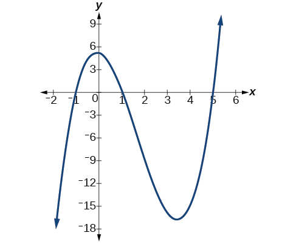{: #Figure_03_04_004}

Finding the *y*- and *x*-Intercepts of a Polynomial in Factored Form

Find the *y*- and *x*-intercepts of<math xmlns="http://www.w3.org/1998/Math/MathML"> <mrow> <mtext> </mtext><mi>g</mi><mo stretchy="false">(</mo><mi>x</mi><mo stretchy="false">)</mo><mo>=</mo><msup> <mrow> <mo stretchy="false">(</mo><mi>x</mi><mo>−</mo><mn>2</mn><mo stretchy="false">)</mo> </mrow> <mn>2</mn> </msup> <mo stretchy="false">(</mo><mn>2</mn><mi>x</mi><mo>+</mo><mn>3</mn><mo stretchy="false">)</mo><mo>.</mo> </mrow> </math>

The *y*-intercept can be found by evaluating<math xmlns="http://www.w3.org/1998/Math/MathML"> <mrow> <mtext> </mtext><mi>g</mi><mrow><mo>(</mo> <mn>0</mn> <mo>)</mo></mrow><mo>.</mo> </mrow> </math>

<math xmlns="http://www.w3.org/1998/Math/MathML" display="block"> <mrow> <mtable> <mtr> <mtd rowalign="center" columnalign="right"><mrow><mi>g</mi><mo stretchy="false">(</mo><mn>0</mn><mo stretchy="false">)</mo></mrow></mtd> <mtd rowalign="center"><mo>=</mo></mtd> <mtd columnalign="left" rowalign="center"> <mrow> <msup> <mrow> <mo stretchy="false">(</mo><mn>0</mn><mo>−</mo><mn>2</mn><mo stretchy="false">)</mo></mrow> <mn>2</mn> </msup> <mo stretchy="false">(</mo><mn>2</mn><mo stretchy="false">(</mo><mn>0</mn><mo stretchy="false">)</mo><mo>+</mo><mn>3</mn><mo stretchy="false">)</mo></mrow> </mtd> </mtr> <mtr> <mtd rowalign="center" /> <mtd rowalign="center"><mo>=</mo></mtd> <mtd rowalign="center" columnalign="left"><mrow><mn>12</mn></mrow></mtd> </mtr> </mtable></mrow> </math>

So the *y*-intercept is<math xmlns="http://www.w3.org/1998/Math/MathML"> <mrow> <mtext> </mtext><mo stretchy="false">(</mo><mn>0</mn><mo>,</mo><mn>12</mn><mo stretchy="false">)</mo><mo>.</mo> </mrow> </math>

The *x*-intercepts can be found by solving<math xmlns="http://www.w3.org/1998/Math/MathML"> <mrow> <mtext> </mtext><mi>g</mi><mrow><mo>(</mo> <mi>x</mi> <mo>)</mo></mrow><mo>=</mo><mn>0.</mn> </mrow> </math>

<math xmlns="http://www.w3.org/1998/Math/MathML" display="block"> <mrow> <msup> <mrow> <mo stretchy="false">(</mo><mi>x</mi><mo>−</mo><mn>2</mn><mo stretchy="false">)</mo> </mrow> <mn>2</mn> </msup> <mo stretchy="false">(</mo><mn>2</mn><mi>x</mi><mo>+</mo><mn>3</mn><mo stretchy="false">)</mo><mo>=</mo><mn>0</mn> </mrow> </math>

<math xmlns="http://www.w3.org/1998/Math/MathML" display="block"> <mrow> <mtable> <mtr> <mtd columnalign="right"> <mrow> <msup> <mrow> <mo stretchy="false">(</mo><mi>x</mi><mo>−</mo><mn>2</mn><mo stretchy="false">)</mo></mrow> <mn>2</mn> </msup> </mrow> </mtd> <mtd><mo>=</mo></mtd> <mtd columnalign="left"><mn>0</mn></mtd> <mtd /> <mtd columnalign="right"><mrow><mo stretchy="false">(</mo><mn>2</mn><mi>x</mi><mo>+</mo><mn>3</mn><mo stretchy="false">)</mo></mrow></mtd> <mtd><mo>=</mo></mtd> <mtd columnalign="left"><mn>0</mn></mtd> </mtr> <mtr> <mtd columnalign="right"><mrow><mi>x</mi><mo>−</mo><mn>2</mn></mrow></mtd> <mtd><mo>=</mo></mtd> <mtd columnalign="left"><mn>0</mn></mtd> <mtd><mrow><mspace width="2em" /><mtext>or</mtext><mspace width="2em" /></mrow></mtd> <mtd columnalign="right"><mi>x</mi></mtd> <mtd><mo>=</mo></mtd> <mtd columnalign="left"><mrow><mo>−</mo><mfrac><mn>3</mn><mn>2</mn></mfrac></mrow></mtd> </mtr> <mtr> <mtd columnalign="right"><mi>x</mi></mtd> <mtd><mo>=</mo></mtd> <mtd columnalign="left"><mn>2</mn></mtd> <mtd><mrow /></mtd> <mtd><mrow /></mtd> <mtd><mrow /></mtd> <mtd><mrow /></mtd> </mtr> </mtable></mrow> </math>

So the *x*-intercepts are<math xmlns="http://www.w3.org/1998/Math/MathML"> <mrow> <mtext> </mtext><mo stretchy="false">(</mo><mn>2</mn><mo>,</mo><mn>0</mn><mo stretchy="false">)</mo><mtext> </mtext> </mrow> </math>

and<math xmlns="http://www.w3.org/1998/Math/MathML"> <mrow> <mtext> </mtext><mrow><mo>(</mo> <mrow> <mo>−</mo><mfrac> <mn>3</mn> <mn>2</mn> </mfrac> <mo>,</mo><mn>0</mn> </mrow> <mo>)</mo></mrow><mo>.</mo> </mrow> </math>

Analysis

We can always check that our answers are reasonable by using a graphing calculator to graph the polynomial as shown in [[link]](#Figure_03_04_005).

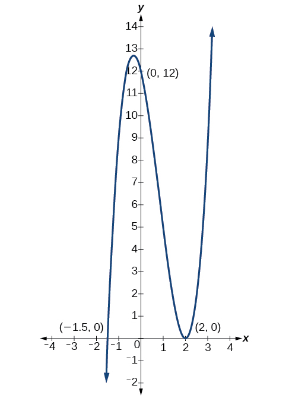{: #Figure_03_04_005 .small}

Finding the *x*-Intercepts of a Polynomial Function Using a Graph

Find the *x*-intercepts of<math xmlns="http://www.w3.org/1998/Math/MathML"> <mrow> <mtext> </mtext><mi>h</mi><mo stretchy="false">(</mo><mi>x</mi><mo stretchy="false">)</mo><mo>=</mo><msup> <mi>x</mi> <mn>3</mn> </msup> <mo>+</mo><mn>4</mn><msup> <mi>x</mi> <mn>2</mn> </msup> <mo>+</mo><mi>x</mi><mo>−</mo><mn>6.</mn> </mrow> </math>

This polynomial is not in factored form, has no common factors, and does not appear to be factorable using techniques previously discussed. Fortunately, we can use technology to find the intercepts. Keep in mind that some values make graphing difficult by hand. In these cases, we can take advantage of graphing utilities.

Looking at the graph of this function, as shown in [[link]](#Figure_03_04_006), it appears that there are *x*-intercepts at<math xmlns="http://www.w3.org/1998/Math/MathML"> <mrow> <mtext> </mtext><mi>x</mi><mo>=</mo><mn>−3</mn><mo>,</mo><mn>−2</mn><mo>,</mo><mtext> </mtext> </mrow> </math>

and<math xmlns="http://www.w3.org/1998/Math/MathML"> <mrow> <mtext> </mtext><mn>1.</mn> </mrow> </math>

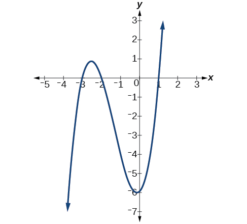{: #Figure_03_04_006}

We can check whether these are correct by substituting these values for<math xmlns="http://www.w3.org/1998/Math/MathML"> <mrow> <mtext> </mtext><mi>x</mi><mtext> </mtext> </mrow> </math>

and verifying that

<math xmlns="http://www.w3.org/1998/Math/MathML" display="block"> <mrow> <mi>h</mi><mo stretchy="false">(</mo><mo>−</mo><mn>3</mn><mo stretchy="false">)</mo><mo>=</mo><mi>h</mi><mo stretchy="false">(</mo><mo>−</mo><mn>2</mn><mo stretchy="false">)</mo><mo>=</mo><mi>h</mi><mo stretchy="false">(</mo><mn>1</mn><mo stretchy="false">)</mo><mo>=</mo><mn>0</mn> </mrow> </math>

Since<math xmlns="http://www.w3.org/1998/Math/MathML"> <mrow> <mtext> </mtext><mi>h</mi><mo stretchy="false">(</mo><mi>x</mi><mo stretchy="false">)</mo><mo>=</mo><msup> <mi>x</mi> <mn>3</mn> </msup> <mo>+</mo><mn>4</mn><msup> <mi>x</mi> <mn>2</mn> </msup> <mo>+</mo><mi>x</mi><mo>−</mo><mn>6</mn><mo>,</mo><mtext> </mtext> </mrow> </math>

we have:

<math xmlns="http://www.w3.org/1998/Math/MathML" display="block"> <mrow> <mtable> <mtr> <mtd columnalign="right"><mrow><mi>h</mi><mo stretchy="false">(</mo><mn>−3</mn><mo stretchy="false">)</mo></mrow></mtd> <mtd><mo>=</mo></mtd> <mtd columnalign="left"> <mrow> <msup> <mrow> <mo stretchy="false">(</mo><mn>−3</mn><mo stretchy="false">)</mo></mrow> <mn>3</mn> </msup> <mo>+</mo><mn>4</mn><msup> <mrow> <mo stretchy="false">(</mo><mn>−3</mn><mo stretchy="false">)</mo></mrow> <mn>2</mn> </msup> <mo>+</mo><mo stretchy="false">(</mo><mn>−3</mn><mo stretchy="false">)</mo><mo>−</mo><mn>6</mn><mo>=</mo><mn>−27</mn><mo>+</mo><mn>36</mn><mo>−</mo><mn>3</mn><mo>−</mo><mn>6</mn><mo>=</mo><mn>0</mn></mrow> </mtd> </mtr> <mtr> <mtd columnalign="right"><mrow><mi>h</mi><mo stretchy="false">(</mo><mn>−2</mn><mo stretchy="false">)</mo></mrow></mtd> <mtd><mo>=</mo></mtd> <mtd columnalign="left"> <mrow> <msup> <mrow> <mo stretchy="false">(</mo><mn>−2</mn><mo stretchy="false">)</mo></mrow> <mn>3</mn> </msup> <mo>+</mo><mn>4</mn><msup> <mrow> <mo stretchy="false">(</mo><mn>−2</mn><mo stretchy="false">)</mo></mrow> <mn>2</mn> </msup> <mo>+</mo><mo stretchy="false">(</mo><mn>−2</mn><mo stretchy="false">)</mo><mo>−</mo><mn>6</mn><mo>=</mo><mn>−8</mn><mo>+</mo><mn>16</mn><mo>−</mo><mn>2</mn><mo>−</mo><mn>6</mn><mo>=</mo><mn>0</mn></mrow> </mtd> </mtr> <mtr> <mtd columnalign="right"><mrow><mi>h</mi><mo stretchy="false">(</mo><mn>1</mn><mo stretchy="false">)</mo></mrow></mtd> <mtd><mo>=</mo></mtd> <mtd columnalign="left"> <mrow> <msup> <mrow> <mo stretchy="false">(</mo><mn>1</mn><mo stretchy="false">)</mo></mrow> <mn>3</mn> </msup> <mo>+</mo><mn>4</mn><msup> <mrow> <mo stretchy="false">(</mo><mn>1</mn><mo stretchy="false">)</mo></mrow> <mn>2</mn> </msup> <mo>+</mo><mo stretchy="false">(</mo><mn>1</mn><mo stretchy="false">)</mo><mo>−</mo><mn>6</mn><mo>=</mo><mn>1</mn><mo>+</mo><mn>4</mn><mo>+</mo><mn>1</mn><mo>−</mo><mn>6</mn><mo>=</mo><mn>0</mn></mrow> </mtd> </mtr> </mtable></mrow> </math>

Each *x*-intercept corresponds to a zero of the polynomial function and each zero yields a factor, so we can now write the polynomial in factored form.

<math xmlns="http://www.w3.org/1998/Math/MathML" display="block"> <mrow> <mtable> <mtr rowalign="center"> <mtd columnalign="right" rowalign="center"><mrow><mi>h</mi><mo stretchy="false">(</mo><mi>x</mi><mo stretchy="false">)</mo></mrow></mtd> <mtd rowalign="center"><mo>=</mo></mtd> <mtd columnalign="left" rowalign="center"> <mrow> <msup> <mi>x</mi> <mn>3</mn> </msup> <mo>+</mo><mn>4</mn><msup> <mi>x</mi> <mn>2</mn> </msup> <mo>+</mo><mi>x</mi><mo>−</mo><mn>6</mn></mrow> </mtd> </mtr> <mtr rowalign="center"> <mtd rowalign="center" /> <mtd rowalign="center"><mo>=</mo></mtd> <mtd columnalign="left" rowalign="center"><mrow><mo stretchy="false">(</mo><mi>x</mi><mo>+</mo><mn>3</mn><mo stretchy="false">)</mo><mo stretchy="false">(</mo><mi>x</mi><mo>+</mo><mn>2</mn><mo stretchy="false">)</mo><mo stretchy="false">(</mo><mi>x</mi><mo>−</mo><mn>1</mn><mo stretchy="false">)</mo></mrow></mtd> </mtr> </mtable></mrow> </math>

Find the *y*- and *x*-intercepts of the function<math xmlns="http://www.w3.org/1998/Math/MathML"> <mrow> <mtext> </mtext><mi>f</mi><mo stretchy="false">(</mo><mi>x</mi><mo stretchy="false">)</mo><mo>=</mo><msup> <mi>x</mi> <mn>4</mn> </msup> <mo>−</mo><mn>19</mn><msup> <mi>x</mi> <mn>2</mn> </msup> <mo>+</mo><mn>30</mn><mi>x</mi><mo>.</mo> </mrow> </math>

*y*-intercept<math xmlns="http://www.w3.org/1998/Math/MathML"> <mrow> <mtext> </mtext><mo stretchy="false">(</mo><mn>0</mn><mo>,</mo><mn>0</mn><mo stretchy="false">)</mo><mo>;</mo><mtext> </mtext> </mrow> </math>

*x*-intercepts<math xmlns="http://www.w3.org/1998/Math/MathML"> <mrow> <mtext> </mtext><mo stretchy="false">(</mo><mn>0</mn><mo>,</mo><mn>0</mn><mo stretchy="false">)</mo><mo>,</mo><mo stretchy="false">(</mo><mo>–</mo><mn>5</mn><mo>,</mo><mn>0</mn><mo stretchy="false">)</mo><mo>,</mo><mo stretchy="false">(</mo><mn>2</mn><mo>,</mo><mn>0</mn><mo stretchy="false">)</mo><mo>,</mo><mtext> </mtext> </mrow> </math>

and<math xmlns="http://www.w3.org/1998/Math/MathML"> <mrow> <mtext> </mtext><mo stretchy="false">(</mo><mn>3</mn><mo>,</mo><mn>0</mn><mo stretchy="false">)</mo> </mrow> </math>

### Identifying Zeros and Their Multiplicities

Graphs behave differently at various *x*-intercepts. Sometimes, the graph will cross over the horizontal axis at an intercept. Other times, the graph will touch the horizontal axis and \"bounce\" off.

Suppose, for example, we graph the function shown.

<math xmlns="http://www.w3.org/1998/Math/MathML" display="block"> <mrow> <mi>f</mi><mo stretchy="false">(</mo><mi>x</mi><mo stretchy="false">)</mo><mo>=</mo><mo stretchy="false">(</mo><mi>x</mi><mo>+</mo><mn>3</mn><mo stretchy="false">)</mo><msup> <mrow> <mo stretchy="false">(</mo><mi>x</mi><mo>−</mo><mn>2</mn><mo stretchy="false">)</mo> </mrow> <mn>2</mn> </msup> <msup> <mrow> <mo stretchy="false">(</mo><mi>x</mi><mo>+</mo><mn>1</mn><mo stretchy="false">)</mo> </mrow> <mn>3</mn> </msup> </mrow> </math>

Notice in [\[link\]](#Figure_03_04_007) that the behavior of the function at each of the *x*-intercepts is different.

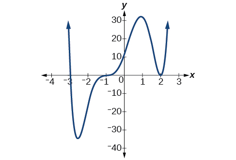{: #Figure_03_04_007}

The *x*-intercept<math xmlns="http://www.w3.org/1998/Math/MathML"> <mrow> <mtext> </mtext><mi>x</mi><mo>=</mo><mn>−3</mn><mtext> </mtext> </mrow> </math>

 is the solution of equation<math xmlns="http://www.w3.org/1998/Math/MathML"> <mrow> <mtext> </mtext><mo stretchy="false">(</mo><mi>x</mi><mo>+</mo><mn>3</mn><mo stretchy="false">)</mo><mo>=</mo><mn>0.</mn><mtext> </mtext> </mrow> </math>

The graph passes directly through the *x*-intercept at<math xmlns="http://www.w3.org/1998/Math/MathML"> <mrow> <mtext> </mtext><mi>x</mi><mo>=</mo><mn>−3.</mn><mtext> </mtext> </mrow> </math>

The factor is linear (has a degree of 1), so the behavior near the intercept is like that of a line—it passes directly through the intercept. We call this a single zero because the zero corresponds to a single factor of the function.

The *x*-intercept<math xmlns="http://www.w3.org/1998/Math/MathML"> <mrow> <mtext> </mtext><mi>x</mi><mo>=</mo><mn>2</mn><mtext> </mtext> </mrow> </math>

is the repeated solution of equation<math xmlns="http://www.w3.org/1998/Math/MathML"> <mrow> <mtext> </mtext><msup> <mrow> <mo stretchy="false">(</mo><mi>x</mi><mo>−</mo><mn>2</mn><mo stretchy="false">)</mo> </mrow> <mn>2</mn> </msup> <mo>=</mo><mn>0.</mn><mtext> </mtext> </mrow> </math>

The graph touches the axis at the intercept and changes direction. The factor is quadratic (degree 2), so the behavior near the intercept is like that of a quadratic—it bounces off of the horizontal axis at the intercept.

<math xmlns="http://www.w3.org/1998/Math/MathML" display="block"> <mrow> <msup> <mrow> <mo stretchy="false">(</mo><mi>x</mi><mo>−</mo><mn>2</mn><mo stretchy="false">)</mo> </mrow> <mn>2</mn> </msup> <mo>=</mo><mo stretchy="false">(</mo><mi>x</mi><mo>−</mo><mn>2</mn><mo stretchy="false">)</mo><mo stretchy="false">(</mo><mi>x</mi><mo>−</mo><mn>2</mn><mo stretchy="false">)</mo> </mrow> </math>

The factor is repeated, that is, the factor<math xmlns="http://www.w3.org/1998/Math/MathML"> <mrow> <mtext> </mtext><mrow><mo>(</mo> <mrow> <mi>x</mi><mo>−</mo><mn>2</mn> </mrow> <mo>)</mo></mrow><mtext> </mtext> </mrow> </math>

appears twice. The number of times a given factor appears in the factored form of the equation of a polynomial is called the **multiplicity**{: data-type="term"}. The zero associated with this factor,<math xmlns="http://www.w3.org/1998/Math/MathML"> <mrow> <mtext> </mtext><mi>x</mi><mo>=</mo><mn>2</mn><mo>,</mo><mtext> </mtext> </mrow> </math>

has multiplicity 2 because the factor<math xmlns="http://www.w3.org/1998/Math/MathML"> <mrow> <mtext> </mtext><mrow><mo>(</mo> <mrow> <mi>x</mi><mo>−</mo><mn>2</mn> </mrow> <mo>)</mo></mrow><mtext> </mtext> </mrow> </math>

occurs twice.

The *x*-intercept<math xmlns="http://www.w3.org/1998/Math/MathML"> <mrow> <mtext> </mtext><mi>x</mi><mo>=</mo><mo>−</mo><mn>1</mn><mtext> </mtext> </mrow> </math>

is the repeated solution of factor<math xmlns="http://www.w3.org/1998/Math/MathML"> <mrow> <mtext> </mtext><msup> <mrow> <mo stretchy="false">(</mo><mi>x</mi><mo>+</mo><mn>1</mn><mo stretchy="false">)</mo> </mrow> <mn>3</mn> </msup> <mo>=</mo><mn>0.</mn><mtext> </mtext> </mrow> </math>

The graph passes through the axis at the intercept, but flattens out a bit first. This factor is cubic (degree 3), so the behavior near the intercept is like that of a cubic—with the same S-shape near the intercept as the toolkit function<math xmlns="http://www.w3.org/1998/Math/MathML"> <mrow> <mtext> </mtext><mi>f</mi><mrow><mo>(</mo> <mi>x</mi> <mo>)</mo></mrow><mo>=</mo><msup> <mi>x</mi> <mn>3</mn> </msup> <mo>.</mo><mtext> </mtext> </mrow> </math>

We call this a triple zero, or a zero with multiplicity 3.

For **zeros**{: data-type="term" .no-emphasis} with even multiplicities, the graphs *touch* or are tangent to the *x*-axis. For zeros with odd multiplicities, the graphs *cross* or intersect the *x*-axis. See [\[link\]](#Figure_03_04_008) for examples of graphs of polynomial functions with multiplicity 1, 2, and 3.

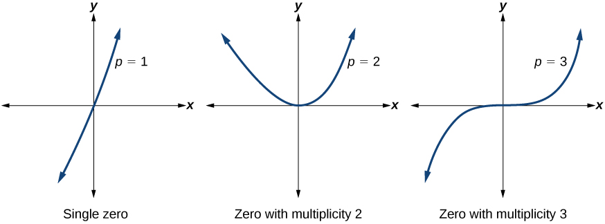{: #Figure_03_04_008 .small}

For higher even powers, such as 4, 6, and 8, the graph will still touch and bounce off of the horizontal axis but, for each increasing even power, the graph will appear flatter as it approaches and leaves the *x*-axis.

For higher odd powers, such as 5, 7, and 9, the graph will still cross through the horizontal axis, but for each increasing odd power, the graph will appear flatter as it approaches and leaves the *x*-axis.

Graphical Behavior of Polynomials at *x*-Intercepts

If a polynomial contains a factor of the form<math xmlns="http://www.w3.org/1998/Math/MathML"> <mrow> <mtext> </mtext><msup> <mrow> <mo stretchy="false">(</mo><mi>x</mi><mo>−</mo><mi>h</mi><mo stretchy="false">)</mo> </mrow> <mi>p</mi> </msup> <mo>,</mo><mtext> </mtext> </mrow> </math>

the behavior near the<math xmlns="http://www.w3.org/1998/Math/MathML"> <mrow> <mtext> </mtext><mi>x</mi><mtext>-</mtext> </mrow> </math>

intercept<math xmlns="http://www.w3.org/1998/Math/MathML"> <mrow> <mtext> </mtext><mi>h</mi><mtext> </mtext> </mrow> </math>

is determined by the power<math xmlns="http://www.w3.org/1998/Math/MathML"> <mrow> <mtext> </mtext><mi>p</mi><mo>.</mo><mtext> </mtext> </mrow> </math>

We say that<math xmlns="http://www.w3.org/1998/Math/MathML"> <mrow> <mtext> </mtext><mi>x</mi><mo>=</mo><mi>h</mi><mtext> </mtext> </mrow> </math>

is a zero of **multiplicity**{: data-type="term"}<math xmlns="http://www.w3.org/1998/Math/MathML"> <mrow> <mtext> </mtext><mi>p</mi><mo>.</mo> </mrow> </math>

The graph of a polynomial function will touch the *x*-axis at zeros with even multiplicities. The graph will cross the *x*-axis at zeros with odd multiplicities.

The sum of the multiplicities is the degree of the polynomial function.

**Given a graph of a polynomial function of degree**<math xmlns="http://www.w3.org/1998/Math/MathML"> <mrow> <mtext> </mtext><mi>n</mi><mo>,</mo><mtext> </mtext> </mrow> </math>

**identify the zeros and their multiplicities.**

1.  If the graph crosses the *x*-axis and appears almost linear at the intercept, it is a single zero.
2.  If the graph touches the *x*-axis and bounces off of the axis, it is a zero with even multiplicity.
3.  If the graph crosses the *x*-axis at a zero, it is a zero with odd multiplicity.
4.  The sum of the multiplicities is
    <math xmlns="http://www.w3.org/1998/Math/MathML"> <mrow> <mtext> </mtext><mi>n</mi><mo>.</mo> </mrow> </math>
{: data-number-style="arabic"}

Identifying Zeros and Their Multiplicities

Use the graph of the function of degree 6 in [[link]](#Figure_03_04_009) to identify the zeros of the function and their possible multiplicities.

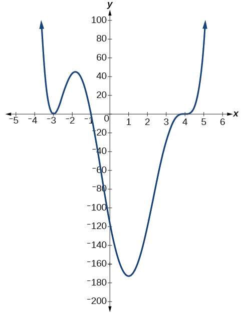{: #Figure_03_04_009}

The polynomial function is of degree 6. The sum of the multiplicities must be 6.

Starting from the left, the first zero occurs at<math xmlns="http://www.w3.org/1998/Math/MathML"> <mrow> <mtext> </mtext><mi>x</mi><mo>=</mo><mn>−3.</mn><mtext> </mtext> </mrow> </math>

The graph touches the *x*-axis, so the multiplicity of the zero must be even. The zero of<math xmlns="http://www.w3.org/1998/Math/MathML"> <mrow> <mtext> </mtext><mn>−3</mn><mtext> </mtext> </mrow> </math>

most likely has multiplicity<math xmlns="http://www.w3.org/1998/Math/MathML"> <mrow> <mtext> </mtext><mn>2.</mn> </mrow> </math>

The next zero occurs at<math xmlns="http://www.w3.org/1998/Math/MathML"> <mrow> <mtext> </mtext><mi>x</mi><mo>=</mo><mn>−1.</mn><mtext> </mtext> </mrow> </math>

The graph looks almost linear at this point. This is a single zero of multiplicity 1.

The last zero occurs at<math xmlns="http://www.w3.org/1998/Math/MathML"> <mrow> <mtext> </mtext><mi>x</mi><mo>=</mo><mn>4.</mn><mtext> </mtext> </mrow> </math>

The graph crosses the<em> x</em>-axis, so the multiplicity of the zero must be odd. We know that the multiplicity is likely 3 and that the sum of the multiplicities is 6.

Use the graph of the function of degree 5 in [[link]](#Figure_03_04_010) to identify the zeros of the function and their multiplicities.

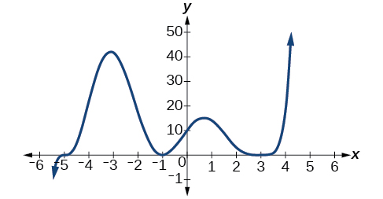{: #Figure_03_04_010 .small}

The graph has a zero of –5 with multiplicity 3, a zero of -1 with multiplicity 2, and a zero of 3 with multiplicity 4.

### Determining End Behavior

As we have already learned, the behavior of a graph of a **polynomial function**{: data-type="term" .no-emphasis} of the form

<math xmlns="http://www.w3.org/1998/Math/MathML" display="block"> <mrow> <mi>f</mi><mo stretchy="false">(</mo><mi>x</mi><mo stretchy="false">)</mo><mo>=</mo><msub> <mi>a</mi> <mi>n</mi> </msub> <msup> <mi>x</mi> <mi>n</mi> </msup> <mo>+</mo><msub> <mi>a</mi> <mrow> <mi>n</mi><mo>−</mo><mn>1</mn> </mrow> </msub> <msup> <mi>x</mi> <mrow> <mi>n</mi><mo>−</mo><mn>1</mn> </mrow> </msup> <mo>+</mo><mn>...</mn><mo>+</mo><msub> <mi>a</mi> <mn>1</mn> </msub> <mi>x</mi><mo>+</mo><msub> <mi>a</mi> <mn>0</mn> </msub> </mrow> </math>

will either ultimately rise or fall as<math xmlns="http://www.w3.org/1998/Math/MathML"> <mrow> <mtext> </mtext><mi>x</mi><mtext> </mtext> </mrow> </math>

 increases without bound and will either rise or fall as<math xmlns="http://www.w3.org/1998/Math/MathML"> <mrow> <mtext> </mtext><mi>x</mi><mtext> </mtext> </mrow> </math>

 decreases without bound. This is because for very large inputs, say 100 or 1,000, the leading term dominates the size of the output. The same is true for very small inputs, say –100 or –1,000.

Recall that we call this behavior the *end behavior* of a function. As we pointed out when discussing quadratic equations, when the leading term of a polynomial function,<math xmlns="http://www.w3.org/1998/Math/MathML"> <mrow> <mtext> </mtext><msub> <mi>a</mi> <mi>n</mi> </msub> <msup> <mi>x</mi> <mi>n</mi> </msup> <mo>,</mo><mtext> </mtext> </mrow> </math>

is an even power function, as<math xmlns="http://www.w3.org/1998/Math/MathML"> <mrow> <mtext> </mtext><mi>x</mi><mtext> </mtext> </mrow> </math>

increases or decreases without bound,<math xmlns="http://www.w3.org/1998/Math/MathML"> <mrow> <mtext> </mtext><mi>f</mi><mo stretchy="false">(</mo><mi>x</mi><mo stretchy="false">)</mo><mtext> </mtext> </mrow> </math>

increases without bound. When the leading term is an odd power function, as<math xmlns="http://www.w3.org/1998/Math/MathML"> <mrow> <mtext> </mtext><mi>x</mi><mtext> </mtext> </mrow> </math>

decreases without bound,<math xmlns="http://www.w3.org/1998/Math/MathML"> <mrow> <mtext> </mtext><mi>f</mi><mo stretchy="false">(</mo><mi>x</mi><mo stretchy="false">)</mo><mtext> </mtext> </mrow> </math>

also decreases without bound; as<math xmlns="http://www.w3.org/1998/Math/MathML"> <mrow> <mtext> </mtext><mi>x</mi><mtext> </mtext> </mrow> </math>

increases without bound,<math xmlns="http://www.w3.org/1998/Math/MathML"> <mrow> <mtext> </mtext><mi>f</mi><mo stretchy="false">(</mo><mi>x</mi><mo stretchy="false">)</mo><mtext> </mtext> </mrow> </math>

also increases without bound. If the leading term is negative, it will change the direction of the end behavior. [\[link\]](#Figure_03_04_011abcd) summarizes all four cases.

 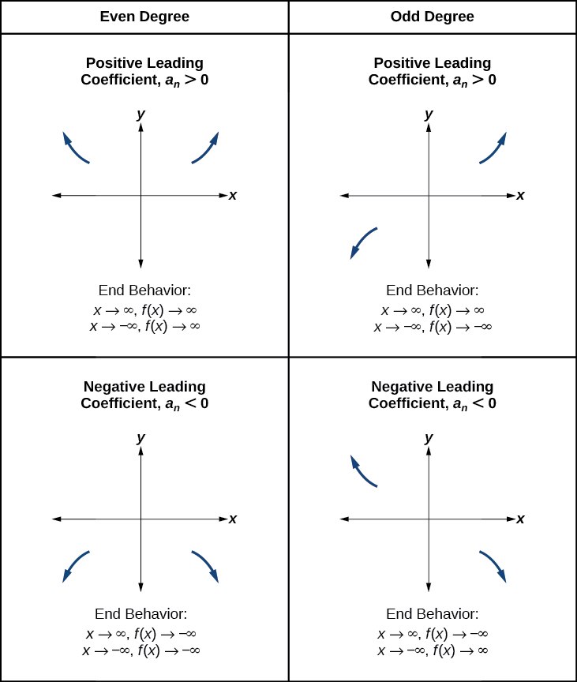{: #Figure_03_04_011abcd}

###  Understanding the Relationship between Degree and Turning Points

In addition to the end behavior, recall that we can analyze a polynomial function’s local behavior. It may have a turning point where the graph changes from increasing to decreasing (rising to falling) or decreasing to increasing (falling to rising). Look at the graph of the polynomial function<math xmlns="http://www.w3.org/1998/Math/MathML"> <mrow> <mtext> </mtext><mi>f</mi><mo stretchy="false">(</mo><mi>x</mi><mo stretchy="false">)</mo><mo>=</mo><msup> <mi>x</mi> <mn>4</mn> </msup> <mo>−</mo><msup> <mi>x</mi> <mn>3</mn> </msup> <mo>−</mo><mn>4</mn><msup> <mi>x</mi> <mn>2</mn> </msup> <mo>+</mo><mn>4</mn><mi>x</mi><mtext> </mtext> </mrow> </math>

in [\[link\]](#Figure_03_04_015). The graph has three turning points.

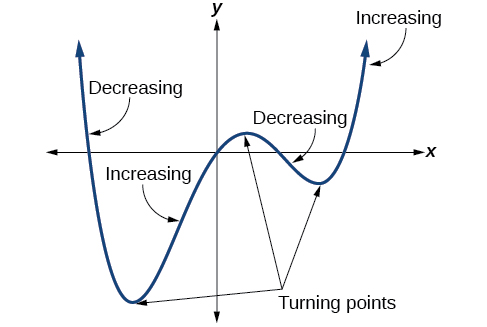{: #Figure_03_04_015}

This function<math xmlns="http://www.w3.org/1998/Math/MathML"> <mrow> <mtext> </mtext><mi>f</mi><mtext> </mtext> </mrow> </math>

 is a 4th degree polynomial function and has 3 turning points. The maximum number of turning points of a polynomial function is always one less than the degree of the function.

Interpreting Turning Points

A **turning point**{: data-type="term" .no-emphasis} is a point of the graph where the graph changes from increasing to decreasing (rising to falling) or decreasing to increasing (falling to rising).

A polynomial of degree<math xmlns="http://www.w3.org/1998/Math/MathML"> <mrow> <mtext> </mtext><mi>n</mi><mtext> </mtext> </mrow> </math>

will have at most<math xmlns="http://www.w3.org/1998/Math/MathML"> <mrow> <mtext> </mtext><mi>n</mi><mo>−</mo><mn>1</mn><mtext> </mtext> </mrow> </math>

turning points.

Finding the Maximum Number of Turning Points Using the Degree of a Polynomial Function

Find the maximum number of turning points of each polynomial function.

1.  <math xmlns="http://www.w3.org/1998/Math/MathML"> <mrow> <mtext> </mtext><mi>f</mi><mo stretchy="false">(</mo><mi>x</mi><mo stretchy="false">)</mo><mo>=</mo><mo>−</mo><msup> <mi>x</mi> <mn>3</mn> </msup> <mo>+</mo><mn>4</mn><msup> <mi>x</mi> <mn>5</mn> </msup> <mo>−</mo><mn>3</mn><msup> <mi>x</mi> <mn>2</mn> </msup> <mo>+</mo><mn>1</mn> </mrow> </math>

2.  <math xmlns="http://www.w3.org/1998/Math/MathML"> <mrow> <mtext> </mtext><mi>f</mi><mo stretchy="false">(</mo><mi>x</mi><mo stretchy="false">)</mo><mo>=</mo><mo>−</mo><msup> <mrow> <mrow><mo>(</mo> <mrow> <mi>x</mi><mo>−</mo><mn>1</mn> </mrow> <mo>)</mo></mrow> </mrow> <mn>2</mn> </msup> <mrow><mo>(</mo> <mrow> <mn>1</mn><mo>+</mo><mn>2</mn><msup> <mi>x</mi> <mn>2</mn> </msup> </mrow> <mo>)</mo></mrow> </mrow> </math>
{: data-number-style="lower-alpha"}

1.  First, rewrite the polynomial function in descending order:<math xmlns="http://www.w3.org/1998/Math/MathML"> <mrow> <mtext> </mtext><mi>f</mi><mo stretchy="false">(</mo><mi>x</mi><mo stretchy="false">)</mo><mo>=</mo><mn>4</mn><msup> <mi>x</mi> <mn>5</mn> </msup> <mo>−</mo><msup> <mi>x</mi> <mn>3</mn> </msup> <mo>−</mo><mn>3</mn><msup> <mi>x</mi> <mn>2</mn> </msup> <mo>+</mo><mn>1</mn> </mrow> </math>
    
    Identify the degree of the polynomial function. This polynomial function is of degree 5.
    
    The maximum number of turning points is<math xmlns="http://www.w3.org/1998/Math/MathML"> <mrow> <mtext> </mtext><mn>5</mn><mo>−</mo><mn>1</mn><mo>=</mo><mn>4.</mn> </mrow> </math>

2.  First, identify the leading term of the polynomial function if the function were expanded.
    
    

    
    

    
    Then, identify the degree of the polynomial function. This polynomial function is of degree 4.
    
    The maximum number of turning points is<math xmlns="http://www.w3.org/1998/Math/MathML"> <mrow> <mtext> </mtext><mn>4</mn><mo>−</mo><mn>1</mn><mo>=</mo><mn>3.</mn> </mrow> </math>
{: data-number-style="lower-alpha"}

### Graphing Polynomial Functions

We can use what we have learned about multiplicities, end behavior, and turning points to sketch graphs of polynomial functions. Let us put this all together and look at the steps required to graph polynomial functions.

**Given a polynomial function, sketch the graph.**

1.  Find the intercepts.
2.  Check for symmetry. If the function is an even function, its graph is symmetrical about the
    <math xmlns="http://www.w3.org/1998/Math/MathML"> <mrow> <mtext> </mtext><mi>y</mi><mtext>-</mtext> </mrow> </math>
    
    axis, that is,
    <math xmlns="http://www.w3.org/1998/Math/MathML"> <mrow> <mtext> </mtext><mi>f</mi><mrow><mo>(</mo> <mrow> <mo>−</mo><mi>x</mi> </mrow> <mo>)</mo></mrow><mo>=</mo><mi>f</mi><mrow><mo>(</mo> <mi>x</mi> <mo>)</mo></mrow><mo>.</mo><mtext> </mtext> </mrow> </math>
    
    If a function is an odd function, its graph is symmetrical about the origin, that is,
    <math xmlns="http://www.w3.org/1998/Math/MathML"> <mrow> <mtext> </mtext><mi>f</mi><mrow><mo>(</mo> <mrow> <mo>−</mo><mi>x</mi> </mrow> <mo>)</mo></mrow><mo>=</mo><mo>−</mo><mi>f</mi><mrow><mo>(</mo> <mi>x</mi> <mo>)</mo></mrow><mo>.</mo> </mrow> </math>

3.  Use the multiplicities of the zeros to determine the behavior of the polynomial at the
    <math xmlns="http://www.w3.org/1998/Math/MathML"> <mrow> <mtext> </mtext><mi>x</mi><mtext>-</mtext> </mrow> </math>
    
    intercepts.
4.  Determine the end behavior by examining the leading term.
5.  Use the end behavior and the behavior at the intercepts to sketch a graph.
6.  Ensure that the number of turning points does not exceed one less than the degree of the polynomial.
7.  Optionally, use technology to check the graph.
{: data-number-style="arabic"}

Sketching the Graph of a Polynomial Function

Sketch a graph of<math xmlns="http://www.w3.org/1998/Math/MathML"> <mrow> <mtext> </mtext><mi>f</mi><mo stretchy="false">(</mo><mi>x</mi><mo stretchy="false">)</mo><mo>=</mo><mn>−2</mn><msup> <mrow> <mo stretchy="false">(</mo><mi>x</mi><mo>+</mo><mn>3</mn><mo stretchy="false">)</mo> </mrow> <mn>2</mn> </msup> <mo stretchy="false">(</mo><mi>x</mi><mo>−</mo><mn>5</mn><mo stretchy="false">)</mo><mo>.</mo> </mrow> </math>

This graph has two *x*-intercepts. At<math xmlns="http://www.w3.org/1998/Math/MathML"> <mrow> <mtext> </mtext><mi>x</mi><mo>=</mo><mn>−3</mn><mo>,</mo><mtext> </mtext> </mrow> </math>

the factor is squared, indicating a multiplicity of 2. The graph will bounce at this *x*-intercept. At<math xmlns="http://www.w3.org/1998/Math/MathML"> <mrow> <mtext> </mtext><mi>x</mi><mo>=</mo><mn>5</mn><mo>,</mo><mtext> </mtext> </mrow> </math>

the function has a multiplicity of one, indicating the graph will cross through the axis at this intercept.

The *y*-intercept is found by evaluating<math xmlns="http://www.w3.org/1998/Math/MathML"> <mrow> <mtext> </mtext><mi>f</mi><mo stretchy="false">(</mo><mn>0</mn><mo stretchy="false">)</mo><mo>.</mo> </mrow> </math>

<math xmlns="http://www.w3.org/1998/Math/MathML" display="block"> <mrow> <mtable> <mtr rowalign="center"> <mtd rowalign="center" columnalign="right"><mrow><mi>f</mi><mo stretchy="false">(</mo><mn>0</mn><mo stretchy="false">)</mo></mrow></mtd> <mtd rowalign="center"><mo>=</mo></mtd> <mtd rowalign="center" columnalign="left"> <mrow> <mn>−2</mn><msup> <mrow> <mo stretchy="false">(</mo><mn>0</mn><mo>+</mo><mn>3</mn><mo stretchy="false">)</mo></mrow> <mn>2</mn> </msup> <mo stretchy="false">(</mo><mn>0</mn><mo>−</mo><mn>5</mn><mo stretchy="false">)</mo></mrow> </mtd> </mtr> <mtr rowalign="center"> <mtd rowalign="center" /> <mtd rowalign="center"><mo>=</mo></mtd> <mtd rowalign="center" columnalign="left"><mrow><mn>−2</mn><mo>⋅</mo><mn>9</mn><mo>⋅</mo><mo stretchy="false">(</mo><mn>−5</mn><mo stretchy="false">)</mo></mrow></mtd> </mtr> <mtr> <mtd rowalign="center" /> <mtd rowalign="center"><mo>=</mo></mtd> <mtd rowalign="center" columnalign="left"><mrow><mn>90</mn></mrow></mtd> </mtr> </mtable></mrow> </math>

The *y*-intercept is<math xmlns="http://www.w3.org/1998/Math/MathML"> <mrow> <mtext> </mtext><mo stretchy="false">(</mo><mn>0</mn><mo>,</mo><mn>90</mn><mo stretchy="false">)</mo><mo>.</mo> </mrow> </math>

Additionally, we can see the leading term, if this polynomial were multiplied out, would be<math xmlns="http://www.w3.org/1998/Math/MathML"> <mrow> <mtext> </mtext><mo>−</mo><mn>2</mn><msup> <mi>x</mi> <mn>3</mn> </msup> <mo>,</mo><mtext> </mtext> </mrow> </math>

 so the end behavior is that of a vertically reflected cubic, with the outputs decreasing as the inputs approach infinity, and the outputs increasing as the inputs approach negative infinity. See [[link]](#Figure_03_04_017).

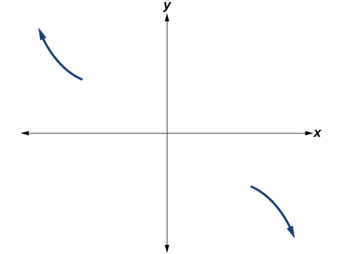{: #Figure_03_04_017}

To sketch this, we consider that:

* As
  <math xmlns="http://www.w3.org/1998/Math/MathML"> <mrow> <mtext> </mtext><mi>x</mi><mo stretchy="false">→</mo><mo>−</mo><mi>∞</mi><mtext> </mtext> </mrow> </math>
  
  the function
  <math xmlns="http://www.w3.org/1998/Math/MathML"> <mrow> <mtext> </mtext><mi>f</mi><mo stretchy="false">(</mo><mi>x</mi><mo stretchy="false">)</mo><mo stretchy="false">→</mo><mi>∞</mi><mo>,</mo><mtext> </mtext> </mrow> </math>
  
  so we know the graph starts in the second quadrant and is decreasing toward the
  <math xmlns="http://www.w3.org/1998/Math/MathML"> <mrow> <mtext> </mtext><mi>x</mi><mtext>-</mtext> </mrow> </math>
  
  axis.
* Since
  <math xmlns="http://www.w3.org/1998/Math/MathML"> <mrow> <mtext> </mtext><mi>f</mi><mrow><mo>(</mo> <mrow> <mo>−</mo><mi>x</mi> </mrow> <mo>)</mo></mrow><mo>=</mo><mn>−2</mn><msup> <mrow> <mrow><mo>(</mo> <mrow> <mo>−</mo><mi>x</mi><mo>+</mo><mn>3</mn> </mrow> <mo>)</mo></mrow> </mrow> <mn>2</mn> </msup> <mrow><mo>(</mo> <mrow> <mo>−</mo><mi>x</mi><mo>–</mo><mn>5</mn> </mrow> <mo>)</mo></mrow><mtext> </mtext> </mrow> </math>
  
  is not equal to
  <math xmlns="http://www.w3.org/1998/Math/MathML"> <mrow> <mtext> </mtext><mi>f</mi><mrow><mo>(</mo> <mi>x</mi> <mo>)</mo></mrow><mo>,</mo><mtext> </mtext> </mrow> </math>
  
  the graph does not display symmetry.
* At
  <math xmlns="http://www.w3.org/1998/Math/MathML"> <mrow> <mtext> </mtext><mrow><mo>(</mo> <mrow> <mo>−</mo><mn>3</mn><mo>,</mo><mn>0</mn> </mrow> <mo>)</mo></mrow><mo>,</mo><mtext> </mtext> </mrow> </math>
  
  the graph bounces off of the *x*-axis, so the function must start increasing.
  At<math xmlns="http://www.w3.org/1998/Math/MathML"> <mrow> <mtext> </mtext><mrow><mo>(</mo> <mrow> <mn>0</mn><mo>,</mo><mn>90</mn> </mrow> <mo>)</mo></mrow><mo>,</mo><mtext> </mtext> </mrow> </math>
  
  the graph crosses the *y*-axis at the *y*-intercept. See [[link]](#Figure_03_04_018).

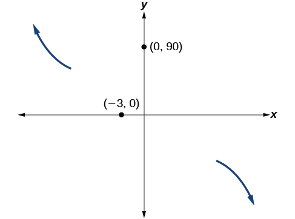{: #Figure_03_04_018}

Somewhere after this point, the graph must turn back down or start decreasing toward the horizontal axis because the graph passes through the next intercept at<math xmlns="http://www.w3.org/1998/Math/MathML"> <mrow> <mtext> </mtext><mrow><mo>(</mo> <mrow> <mn>5</mn><mo>,</mo><mn>0</mn> </mrow> <mo>)</mo></mrow><mo>.</mo><mtext> </mtext> </mrow> </math>

See [[link]](#Figure_03_04_019).

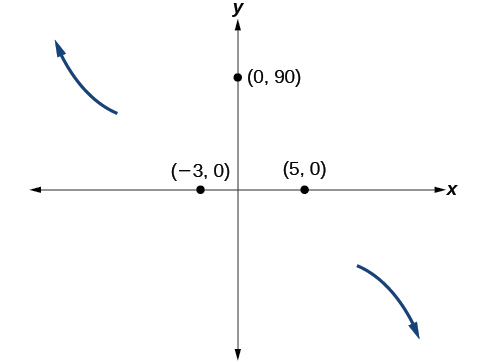{: #Figure_03_04_019}

As<math xmlns="http://www.w3.org/1998/Math/MathML"> <mrow> <mtext> </mtext><mi>x</mi><mo stretchy="false">→</mo><mi>∞</mi><mtext> </mtext> </mrow> </math>

the function<math xmlns="http://www.w3.org/1998/Math/MathML"> <mrow> <mtext> </mtext><mi>f</mi><mo stretchy="false">(</mo><mi>x</mi><mo stretchy="false">)</mo><mo stretchy="false">→</mo><mi>−∞</mi><mo>,</mo><mtext> </mtext> </mrow> </math>

so we know the graph continues to decrease, and we can stop drawing the graph in the fourth quadrant.

Using technology, we can create the graph for the polynomial function, shown in [[link]](#Figure_03_04_020), and verify that the resulting graph looks like our sketch in [[link]](#Figure_03_04_019).

=&#x2212;2&#10;   &#10;    (x+3)&#10;   &#10;   2&#10;  &#10;  (x&#x2212;5)&#10; &#10;"){: #Figure_03_04_020}

Sketch a graph of<math xmlns="http://www.w3.org/1998/Math/MathML"> <mrow> <mtext> </mtext><mi>f</mi><mo stretchy="false">(</mo><mi>x</mi><mo stretchy="false">)</mo><mo>=</mo><mfrac> <mn>1</mn> <mn>4</mn> </mfrac> <mi>x</mi><msup> <mrow> <mo stretchy="false">(</mo><mi>x</mi><mo>−</mo><mn>1</mn><mo stretchy="false">)</mo> </mrow> <mn>4</mn> </msup> <msup> <mrow> <mo stretchy="false">(</mo><mi>x</mi><mo>+</mo><mn>3</mn><mo stretchy="false">)</mo> </mrow> <mn>3</mn> </msup> <mo>.</mo> </mrow> </math>

 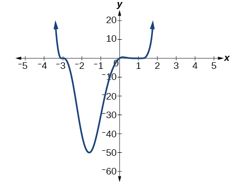 

### Using the Intermediate Value Theorem

In some situations, we may know two points on a graph but not the zeros. If those two points are on opposite sides of the *x*-axis, we can confirm that there is a zero between them. Consider a polynomial function<math xmlns="http://www.w3.org/1998/Math/MathML"> <mrow> <mtext> </mtext><mi>f</mi><mtext> </mtext> </mrow> </math>

whose graph is smooth and continuous. The **Intermediate Value Theorem**{: data-type="term"} states that for two numbers<math xmlns="http://www.w3.org/1998/Math/MathML"> <mrow> <mtext> </mtext><mi>a</mi><mtext> </mtext> </mrow> </math>

and<math xmlns="http://www.w3.org/1998/Math/MathML"> <mrow> <mtext> </mtext><mi>b</mi><mtext> </mtext> </mrow> </math>

in the domain of<math xmlns="http://www.w3.org/1998/Math/MathML"> <mrow> <mtext> </mtext><mi>f</mi><mo>,</mo> </mrow> </math>

if<math xmlns="http://www.w3.org/1998/Math/MathML"> <mrow> <mtext> </mtext><mi>a</mi><mo>&lt;</mo><mi>b</mi><mtext> </mtext> </mrow> </math>

and<math xmlns="http://www.w3.org/1998/Math/MathML"> <mrow> <mi>f</mi><mrow><mo>(</mo> <mi>a</mi> <mo>)</mo></mrow><mo>≠</mo><mi>f</mi><mrow><mo>(</mo> <mi>b</mi> <mo>)</mo></mrow><mo>,</mo> </mrow> </math>

then the function<math xmlns="http://www.w3.org/1998/Math/MathML"> <mrow> <mtext> </mtext><mi>f</mi><mtext> </mtext> </mrow> </math>

takes on every value between<math xmlns="http://www.w3.org/1998/Math/MathML"> <mrow> <mtext> </mtext><mi>f</mi><mrow><mo>(</mo> <mi>a</mi> <mo>)</mo></mrow><mtext> </mtext> </mrow> </math>

and<math xmlns="http://www.w3.org/1998/Math/MathML"> <mrow> <mtext> </mtext><mi>f</mi><mrow><mo>(</mo> <mi>b</mi> <mo>)</mo></mrow><mo>.</mo><mtext> </mtext> </mrow> </math>

(While the theorem is intuitive, the proof is actually quite complicated and requires higher mathematics.) We can apply this theorem to a special case that is useful in graphing polynomial functions. If a point on the graph of a continuous function<math xmlns="http://www.w3.org/1998/Math/MathML"> <mrow> <mtext> </mtext><mi>f</mi><mtext> </mtext> </mrow> </math>

at<math xmlns="http://www.w3.org/1998/Math/MathML"> <mrow> <mtext> </mtext><mi>x</mi><mo>=</mo><mi>a</mi><mtext> </mtext> </mrow> </math>

lies above the<math xmlns="http://www.w3.org/1998/Math/MathML"> <mrow> <mtext> </mtext><mi>x</mi><mtext>-</mtext> </mrow> </math>

axis and another point at<math xmlns="http://www.w3.org/1998/Math/MathML"> <mrow> <mtext> </mtext><mi>x</mi><mo>=</mo><mi>b</mi><mtext> </mtext> </mrow> </math>

lies below the<math xmlns="http://www.w3.org/1998/Math/MathML"> <mrow> <mtext> </mtext><mi>x</mi><mtext>-</mtext> </mrow> </math>

axis, there must exist a third point between<math xmlns="http://www.w3.org/1998/Math/MathML"> <mrow> <mtext> </mtext><mi>x</mi><mo>=</mo><mi>a</mi><mtext> </mtext> </mrow> </math>

and<math xmlns="http://www.w3.org/1998/Math/MathML"> <mrow> <mtext> </mtext><mi>x</mi><mo>=</mo><mi>b</mi><mtext> </mtext> </mrow> </math>

where the graph crosses the<math xmlns="http://www.w3.org/1998/Math/MathML"> <mrow> <mtext> </mtext><mi>x</mi><mtext>-</mtext> </mrow> </math>

axis. Call this point<math xmlns="http://www.w3.org/1998/Math/MathML"> <mrow> <mtext> </mtext><mrow><mo>(</mo> <mrow> <mi>c</mi><mo>,</mo><mtext> </mtext><mi>f</mi><mrow><mo>(</mo> <mi>c</mi> <mo>)</mo></mrow> </mrow> <mo>)</mo></mrow><mo>.</mo><mtext> </mtext> </mrow> </math>

This means that we are assured there is a solution<math xmlns="http://www.w3.org/1998/Math/MathML"> <mrow> <mtext> </mtext><mi>c</mi><mtext> </mtext> </mrow> </math>

where<math xmlns="http://www.w3.org/1998/Math/MathML"> <mrow> <mi>f</mi><mrow><mo>(</mo> <mi>c</mi> <mo>)</mo></mrow><mo>=</mo><mn>0.</mn> </mrow> </math>

In other words, the Intermediate Value Theorem tells us that when a polynomial function changes from a negative value to a positive value, the function must cross the<math xmlns="http://www.w3.org/1998/Math/MathML"> <mrow> <mtext> </mtext><mi>x</mi><mtext>-</mtext> </mrow> </math>

axis. [\[link\]](#Figure_03_04_022) shows that there is a zero between<math xmlns="http://www.w3.org/1998/Math/MathML"> <mrow> <mtext> </mtext><mi>a</mi><mtext> </mtext> </mrow> </math>

 and<math xmlns="http://www.w3.org/1998/Math/MathML"> <mrow> <mtext> </mtext><mi>b</mi><mo>.</mo><mtext> </mtext> </mrow> </math>

 {: #Figure_03_04_022}

Intermediate Value Theorem

Let<math xmlns="http://www.w3.org/1998/Math/MathML"> <mrow> <mtext> </mtext><mi>f</mi><mtext> </mtext> </mrow> </math>

 be a polynomial function. The **Intermediate Value Theorem**{: data-type="term"} states that if<math xmlns="http://www.w3.org/1998/Math/MathML"> <mrow> <mtext> </mtext><mi>f</mi><mrow><mo>(</mo> <mi>a</mi> <mo>)</mo></mrow><mtext> </mtext> </mrow> </math>

 and<math xmlns="http://www.w3.org/1998/Math/MathML"> <mrow> <mtext> </mtext><mi>f</mi><mrow><mo>(</mo> <mi>b</mi> <mo>)</mo></mrow><mtext> </mtext> </mrow> </math>

 have opposite signs, then there exists at least one value<math xmlns="http://www.w3.org/1998/Math/MathML"> <mrow> <mtext> </mtext><mi>c</mi><mtext> </mtext> </mrow> </math>

 between<math xmlns="http://www.w3.org/1998/Math/MathML"> <mrow> <mtext> </mtext><mi>a</mi><mtext> </mtext> </mrow> </math>

 and<math xmlns="http://www.w3.org/1998/Math/MathML"> <mrow> <mtext> </mtext><mi>b</mi><mtext> </mtext> </mrow> </math>

 for which<math xmlns="http://www.w3.org/1998/Math/MathML"> <mrow> <mtext> </mtext><mi>f</mi><mrow><mo>(</mo> <mi>c</mi> <mo>)</mo></mrow><mo>=</mo><mn>0.</mn> </mrow> </math>

Using the Intermediate Value Theorem

Show that the function<math xmlns="http://www.w3.org/1998/Math/MathML"> <mrow> <mtext> </mtext><mi>f</mi><mo stretchy="false">(</mo><mi>x</mi><mo stretchy="false">)</mo><mo>=</mo><msup> <mi>x</mi> <mn>3</mn> </msup> <mo>−</mo><mn>5</mn><msup> <mi>x</mi> <mn>2</mn> </msup> <mo>+</mo><mn>3</mn><mi>x</mi><mo>+</mo><mn>6</mn><mtext> </mtext> </mrow> </math>

 has at least two real zeros between<math xmlns="http://www.w3.org/1998/Math/MathML"> <mrow> <mtext> </mtext><mi>x</mi><mo>=</mo><mn>1</mn><mtext> </mtext> </mrow> </math>

 and<math xmlns="http://www.w3.org/1998/Math/MathML"> <mrow> <mtext> </mtext><mi>x</mi><mo>=</mo><mn>4.</mn> </mrow> </math>

As a start, evaluate<math xmlns="http://www.w3.org/1998/Math/MathML"> <mrow> <mtext> </mtext><mi>f</mi><mo stretchy="false">(</mo><mi>x</mi><mo stretchy="false">)</mo><mtext> </mtext> </mrow> </math>

 at the integer values<math xmlns="http://www.w3.org/1998/Math/MathML"> <mrow> <mtext> </mtext><mi>x</mi><mo>=</mo><mn>1</mn><mo>,</mo><mn>2</mn><mo>,</mo><mn>3</mn><mo>,</mo> </mrow> </math>

and <math xmlns="http://www.w3.org/1998/Math/MathML"> <mrow> <mn>4.</mn><mtext> </mtext> </mrow> </math>

See [[link]](#Table_03_04_03).

<table id="Table_03_04_03" summary=".."><colgroup><col align="center" /><col /><col /><col /><col /></colgroup><tbody>
<tr>
<td><strong><math xmlns="http://www.w3.org/1998/Math/MathML">
 <mi>x</mi>
</math></strong></td>
<td>1</td>
<td>2</td>
<td>3</td>
<td>4</td>

</tr>

<tr>
<td><strong><math xmlns="http://www.w3.org/1998/Math/MathML">
 <mrow>
  <mi>f</mi><mo stretchy="false">(</mo><mi>x</mi><mo stretchy="false">)</mo>
 </mrow>
</math></strong></td>
<td>5</td>
<td>0</td>
<td>–3</td>
<td>2</td>
</tr>
</tbody></table>
We see that one zero occurs at<math xmlns="http://www.w3.org/1998/Math/MathML"> <mrow> <mtext> </mtext><mi>x</mi><mo>=</mo><mn>2.</mn><mtext> </mtext> </mrow> </math>

Also, since<math xmlns="http://www.w3.org/1998/Math/MathML"> <mrow> <mtext> </mtext><mi>f</mi><mo stretchy="false">(</mo><mn>3</mn><mo stretchy="false">)</mo><mtext> </mtext> </mrow> </math>

is negative and<math xmlns="http://www.w3.org/1998/Math/MathML"> <mrow> <mtext> </mtext><mi>f</mi><mo stretchy="false">(</mo><mn>4</mn><mo stretchy="false">)</mo><mtext> </mtext> </mrow> </math>

is positive, by the Intermediate Value Theorem, there must be at least one real zero between 3 and 4.

We have shown that there are at least two real zeros between<math xmlns="http://www.w3.org/1998/Math/MathML"> <mrow> <mtext> </mtext><mi>x</mi><mo>=</mo><mn>1</mn><mtext> </mtext> </mrow> </math>

 and<math xmlns="http://www.w3.org/1998/Math/MathML"> <mrow> <mtext> </mtext><mi>x</mi><mo>=</mo><mn>4.</mn> </mrow> </math>

Analysis

We can also see on the graph of the function in [[link]](#Figure_03_04_023) that there are two real zeros between<math xmlns="http://www.w3.org/1998/Math/MathML"> <mrow> <mtext> </mtext><mi>x</mi><mo>=</mo><mn>1</mn><mtext> </mtext> </mrow> </math>

 and<math xmlns="http://www.w3.org/1998/Math/MathML"> <mrow> <mtext> </mtext><mi>x</mi><mo>=</mo><mn>4.</mn> </mrow> </math>

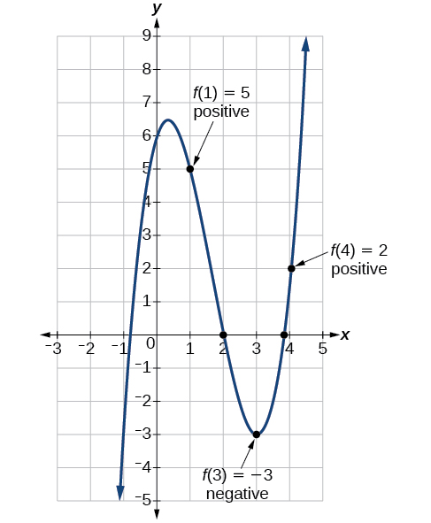{: #Figure_03_04_023}

Show that the function<math xmlns="http://www.w3.org/1998/Math/MathML"> <mrow> <mtext> </mtext><mi>f</mi><mo stretchy="false">(</mo><mi>x</mi><mo stretchy="false">)</mo><mo>=</mo><mn>7</mn><msup> <mi>x</mi> <mn>5</mn> </msup> <mo>−</mo><mn>9</mn><msup> <mi>x</mi> <mn>4</mn> </msup> <mo>−</mo><msup> <mi>x</mi> <mn>2</mn> </msup> <mtext> </mtext> </mrow> </math>

has at least one real zero between<math xmlns="http://www.w3.org/1998/Math/MathML"> <mrow> <mtext> </mtext><mi>x</mi><mo>=</mo><mn>1</mn><mtext> </mtext> </mrow> </math>

and<math xmlns="http://www.w3.org/1998/Math/MathML"> <mrow> <mtext> </mtext><mi>x</mi><mo>=</mo><mn>2.</mn> </mrow> </math>

Because<math xmlns="http://www.w3.org/1998/Math/MathML"> <mrow> <mtext> </mtext><mi>f</mi><mtext> </mtext> </mrow> </math>

is a polynomial function and since<math xmlns="http://www.w3.org/1998/Math/MathML"> <mrow> <mtext> </mtext><mi>f</mi><mo stretchy="false">(</mo><mn>1</mn><mo stretchy="false">)</mo><mtext> </mtext><mtext> </mtext> </mrow> </math>

is negative and<math xmlns="http://www.w3.org/1998/Math/MathML"> <mrow> <mtext> </mtext><mi>f</mi><mo stretchy="false">(</mo><mn>2</mn><mo stretchy="false">)</mo><mtext> </mtext> </mrow> </math>

is positive, there is at least one real zero between<math xmlns="http://www.w3.org/1998/Math/MathML"> <mrow> <mtext> </mtext><mi>x</mi><mo>=</mo><mn>1</mn><mtext> </mtext> </mrow> </math>

and<math xmlns="http://www.w3.org/1998/Math/MathML"> <mrow> <mtext> </mtext><mi>x</mi><mo>=</mo><mn>2.</mn><mtext> </mtext> </mrow> </math>

####  Writing Formulas for Polynomial Functions

Now that we know how to find zeros of polynomial functions, we can use them to write formulas based on graphs. Because a **polynomial function**{: data-type="term" .no-emphasis} written in factored form will have an *x*-intercept where each factor is equal to zero, we can form a function that will pass through a set of *x*-intercepts by introducing a corresponding set of factors.

Factored Form of Polynomials

If a polynomial of lowest degree<math xmlns="http://www.w3.org/1998/Math/MathML"> <mrow> <mtext> </mtext><mi>p</mi><mtext> </mtext> </mrow> </math>

 has horizontal intercepts at<math xmlns="http://www.w3.org/1998/Math/MathML"> <mrow> <mtext> </mtext><mi>x</mi><mo>=</mo><msub> <mi>x</mi> <mn>1</mn> </msub> <mo>,</mo><msub> <mi>x</mi> <mn>2</mn> </msub> <mo>,</mo><mo>…</mo><mo>,</mo><msub> <mi>x</mi> <mi>n</mi> </msub> <mo>,</mo><mtext> </mtext> </mrow> </math>

 then the polynomial can be written in the factored form:<math xmlns="http://www.w3.org/1998/Math/MathML"> <mrow> <mtext> </mtext><mi>f</mi><mo stretchy="false">(</mo><mi>x</mi><mo stretchy="false">)</mo><mo>=</mo><mi>a</mi><msup> <mrow> <mo stretchy="false">(</mo><mi>x</mi><mo>−</mo><msub> <mi>x</mi> <mn>1</mn> </msub> <mo stretchy="false">)</mo> </mrow> <mrow> <msub> <mi>p</mi> <mn>1</mn> </msub> </mrow> </msup> <msup> <mrow> <mo stretchy="false">(</mo><mi>x</mi><mo>−</mo><msub> <mi>x</mi> <mn>2</mn> </msub> <mo stretchy="false">)</mo> </mrow> <mrow> <msub> <mi>p</mi> <mn>2</mn> </msub> </mrow> </msup> <mo>⋯</mo><msup> <mrow> <mo stretchy="false">(</mo><mi>x</mi><mo>−</mo><msub> <mi>x</mi> <mi>n</mi> </msub> <mo stretchy="false">)</mo> </mrow> <mrow> <msub> <mi>p</mi> <mi>n</mi> </msub> </mrow> </msup> <mtext> </mtext> </mrow> </math>

 where the powers<math xmlns="http://www.w3.org/1998/Math/MathML"> <mrow> <mtext> </mtext><msub> <mi>p</mi> <mi>i</mi> </msub> <mtext> </mtext> </mrow> </math>

 on each factor can be determined by the behavior of the graph at the corresponding intercept, and the stretch factor<math xmlns="http://www.w3.org/1998/Math/MathML"> <mrow> <mtext> </mtext><mi>a</mi><mtext> </mtext> </mrow> </math>

 can be determined given a value of the function other than the *x*-intercept.

**Given a graph of a polynomial function, write a formula for the function.**

1.  Identify the *x*-intercepts of the graph to find the factors of the polynomial.
2.  Examine the behavior of the graph at the *x*-intercepts to determine the multiplicity of each factor.
3.  Find the polynomial of least degree containing all the factors found in the previous step.
4.  Use any other point on the graph (the *y*-intercept may be easiest) to determine the stretch factor.
{: data-number-style="arabic"}

Writing a Formula for a Polynomial Function from the Graph

Write a formula for the polynomial function shown in [[link]](#Figure_03_04_024).

{: #Figure_03_04_024}

This graph has three *x*-intercepts:<math xmlns="http://www.w3.org/1998/Math/MathML"> <mrow> <mtext> </mtext><mi>x</mi><mo>=</mo><mn>−3</mn><mo>,</mo><mn>2</mn><mo>,</mo><mtext> </mtext> </mrow> </math>

and<math xmlns="http://www.w3.org/1998/Math/MathML"> <mrow> <mtext> </mtext><mn>5.</mn><mtext> </mtext> </mrow> </math>

The *y*-intercept is located at<math xmlns="http://www.w3.org/1998/Math/MathML"> <mrow> <mtext> </mtext><mo stretchy="false">(</mo><mn>0</mn><mo>,</mo><mn>2</mn><mo stretchy="false">)</mo><mo>.</mo><mtext> </mtext> </mrow> </math>

At<math xmlns="http://www.w3.org/1998/Math/MathML"> <mrow> <mtext> </mtext><mi>x</mi><mo>=</mo><mn>−3</mn><mtext> </mtext> </mrow> </math>

and<math xmlns="http://www.w3.org/1998/Math/MathML"> <mrow> <mtext> </mtext><mi>x</mi><mo>=</mo><mn>5</mn><mo>,</mo><mtext> </mtext> </mrow> </math>

 the graph passes through the axis linearly, suggesting the corresponding factors of the polynomial will be linear. At<math xmlns="http://www.w3.org/1998/Math/MathML"> <mrow> <mtext> </mtext><mi>x</mi><mo>=</mo><mn>2</mn><mo>,</mo><mtext> </mtext> </mrow> </math>

the graph bounces at the intercept, suggesting the corresponding factor of the polynomial will be second degree (quadratic). Together, this gives us

<math xmlns="http://www.w3.org/1998/Math/MathML" display="block"> <mrow> <mi>f</mi><mo stretchy="false">(</mo><mi>x</mi><mo stretchy="false">)</mo><mo>=</mo><mi>a</mi><mo stretchy="false">(</mo><mi>x</mi><mo>+</mo><mn>3</mn><mo stretchy="false">)</mo><msup> <mrow> <mo stretchy="false">(</mo><mi>x</mi><mo>−</mo><mn>2</mn><mo stretchy="false">)</mo> </mrow> <mn>2</mn> </msup> <mo stretchy="false">(</mo><mi>x</mi><mo>−</mo><mn>5</mn><mo stretchy="false">)</mo> </mrow> </math>

To determine the stretch factor, we utilize another point on the graph. We will use the<math xmlns="http://www.w3.org/1998/Math/MathML"> <mrow> <mtext> </mtext><mi>y</mi><mtext>-</mtext> </mrow> </math>

intercept<math xmlns="http://www.w3.org/1998/Math/MathML"> <mrow> <mtext> </mtext><mo stretchy="false">(</mo><mn>0</mn><mo>,</mo><mo>–</mo><mn>2</mn><mo stretchy="false">)</mo><mo>,</mo><mtext> </mtext> </mrow> </math>

to solve for<math xmlns="http://www.w3.org/1998/Math/MathML"> <mrow> <mtext> </mtext><mi>a</mi><mo>.</mo> </mrow> </math>

<math xmlns="http://www.w3.org/1998/Math/MathML" display="block"> <mrow> <mtable> <mtr> <mtd columnalign="right"><mrow><mi>f</mi><mo stretchy="false">(</mo><mn>0</mn><mo stretchy="false">)</mo></mrow></mtd> <mtd><mo>=</mo></mtd> <mtd columnalign="left"> <mrow> <mi>a</mi><mo stretchy="false">(</mo><mn>0</mn><mo>+</mo><mn>3</mn><mo stretchy="false">)</mo><msup> <mrow> <mo stretchy="false">(</mo><mn>0</mn><mo>−</mo><mn>2</mn><mo stretchy="false">)</mo></mrow> <mn>2</mn> </msup> <mo stretchy="false">(</mo><mn>0</mn><mo>−</mo><mn>5</mn><mo stretchy="false">)</mo></mrow> </mtd> </mtr> <mtr> <mtd columnalign="right"><mrow><mn>−2</mn></mrow></mtd> <mtd><mo>=</mo></mtd> <mtd columnalign="left"> <mrow> <mi>a</mi><mo stretchy="false">(</mo><mn>0</mn><mo>+</mo><mn>3</mn><mo stretchy="false">)</mo><msup> <mrow> <mo stretchy="false">(</mo><mn>0</mn><mo>−</mo><mn>2</mn><mo stretchy="false">)</mo></mrow> <mn>2</mn> </msup> <mo stretchy="false">(</mo><mn>0</mn><mo>−</mo><mn>5</mn><mo stretchy="false">)</mo></mrow> </mtd> </mtr> <mtr> <mtd columnalign="right"><mrow><mn>−2</mn></mrow></mtd> <mtd><mo>=</mo></mtd> <mtd columnalign="left"><mrow><mo>−</mo><mn>60</mn><mi>a</mi></mrow></mtd> </mtr> <mtr> <mtd columnalign="right"><mi>a</mi></mtd> <mtd><mo>=</mo></mtd> <mtd columnalign="left"> <mrow> <mfrac> <mn>1</mn> <mrow> <mn>30</mn></mrow> </mfrac> </mrow> </mtd> </mtr> </mtable></mrow> </math>

The graphed polynomial appears to represent the function<math xmlns="http://www.w3.org/1998/Math/MathML"> <mrow> <mtext> </mtext><mi>f</mi><mo stretchy="false">(</mo><mi>x</mi><mo stretchy="false">)</mo><mo>=</mo><mfrac> <mn>1</mn> <mrow> <mn>30</mn> </mrow> </mfrac> <mo stretchy="false">(</mo><mi>x</mi><mo>+</mo><mn>3</mn><mo stretchy="false">)</mo><msup> <mrow> <mo stretchy="false">(</mo><mi>x</mi><mo>−</mo><mn>2</mn><mo stretchy="false">)</mo> </mrow> <mn>2</mn> </msup> <mo stretchy="false">(</mo><mi>x</mi><mo>−</mo><mn>5</mn><mo stretchy="false">)</mo><mo>.</mo> </mrow> </math>

Given the graph shown in [[link]](#Figure_03_04_025), write a formula for the function shown.

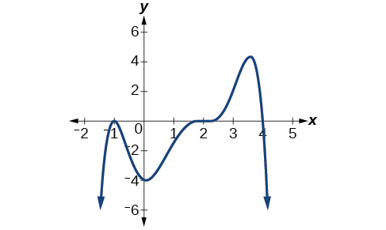{: #Figure_03_04_025}

<math xmlns="http://www.w3.org/1998/Math/MathML"> <mrow> <mi>f</mi><mo stretchy="false">(</mo><mi>x</mi><mo stretchy="false">)</mo><mo>=</mo><mo>−</mo><mfrac> <mn>1</mn> <mn>8</mn> </mfrac> <msup> <mrow> <mo stretchy="false">(</mo><mi>x</mi><mo>−</mo><mn>2</mn><mo stretchy="false">)</mo> </mrow> <mn>3</mn> </msup> <msup> <mrow> <mo stretchy="false">(</mo><mi>x</mi><mo>+</mo><mn>1</mn><mo stretchy="false">)</mo> </mrow> <mn>2</mn> </msup> <mo stretchy="false">(</mo><mi>x</mi><mo>−</mo><mn>4</mn><mo stretchy="false">)</mo> </mrow> </math>

#### Using Local and Global Extrema

With quadratics, we were able to algebraically find the maximum or minimum value of the function by finding the vertex. For general polynomials, finding these turning points is not possible without more advanced techniques from calculus. Even then, finding where extrema occur can still be algebraically challenging. For now, we will estimate the locations of turning points using technology to generate a graph.

Each turning point represents a local minimum or maximum. Sometimes, a turning point is the highest or lowest point on the entire graph. In these cases, we say that the turning point is a **global maximum**{: data-type="term"} or a **global minimum**{: data-type="term"}. These are also referred to as the absolute maximum and absolute minimum values of the function.

Local and Global Extrema

A **local maximum**{: data-type="term" .no-emphasis} or **local minimum**{: data-type="term" .no-emphasis} at<math xmlns="http://www.w3.org/1998/Math/MathML"> <mrow> <mtext> </mtext><mi>x</mi><mo>=</mo><mi>a</mi><mtext> </mtext> </mrow> </math>

(sometimes called the relative maximum or minimum, respectively) is the output at the highest or lowest point on the graph in an open interval around<math xmlns="http://www.w3.org/1998/Math/MathML"> <mrow> <mtext> </mtext><mi>x</mi><mo>=</mo><mi>a</mi><mo>.</mo><mtext> </mtext> </mrow> </math>

If a function has a local maximum at<math xmlns="http://www.w3.org/1998/Math/MathML"> <mrow> <mtext> </mtext><mi>a</mi><mo>,</mo><mtext> </mtext> </mrow> </math>

then<math xmlns="http://www.w3.org/1998/Math/MathML"> <mrow> <mtext> </mtext><mi>f</mi><mo stretchy="false">(</mo><mi>a</mi><mo stretchy="false">)</mo><mo>≥</mo><mi>f</mi><mo stretchy="false">(</mo><mi>x</mi><mo stretchy="false">)</mo><mtext> </mtext> </mrow> </math>

for all<math xmlns="http://www.w3.org/1998/Math/MathML"> <mrow> <mtext> </mtext><mi>x</mi><mtext> </mtext> </mrow> </math>

in an open interval around<math xmlns="http://www.w3.org/1998/Math/MathML"> <mrow> <mtext> </mtext><mi>x</mi><mo>=</mo><mi>a</mi><mo>.</mo><mtext> </mtext> </mrow> </math>

If a function has a local minimum at<math xmlns="http://www.w3.org/1998/Math/MathML"> <mrow> <mtext> </mtext><mi>a</mi><mo>,</mo><mtext> </mtext> </mrow> </math>

then<math xmlns="http://www.w3.org/1998/Math/MathML"> <mrow> <mtext> </mtext><mi>f</mi><mo stretchy="false">(</mo><mi>a</mi><mo stretchy="false">)</mo><mo>≤</mo><mi>f</mi><mo stretchy="false">(</mo><mi>x</mi><mo stretchy="false">)</mo><mtext> </mtext> </mrow> </math>

for all<math xmlns="http://www.w3.org/1998/Math/MathML"> <mrow> <mtext> </mtext><mi>x</mi><mtext> </mtext> </mrow> </math>

in an open interval around<math xmlns="http://www.w3.org/1998/Math/MathML"> <mrow> <mtext> </mtext><mi>x</mi><mo>=</mo><mi>a</mi><mo>.</mo> </mrow> </math>

A **global maximum**{: data-type="term"} or **global minimum**{: data-type="term"} is the output at the highest or lowest point of the function. If a function has a global maximum at <math xmlns="http://www.w3.org/1998/Math/MathML"> <mrow> <mtext> </mtext><mi>a</mi><mo>,</mo><mtext> </mtext> </mrow> </math>

then<math xmlns="http://www.w3.org/1998/Math/MathML"> <mrow> <mtext> </mtext><mi>f</mi><mo stretchy="false">(</mo><mi>a</mi><mo stretchy="false">)</mo><mo>≥</mo><mi>f</mi><mo stretchy="false">(</mo><mi>x</mi><mo stretchy="false">)</mo><mtext> </mtext> </mrow> </math>

for all<math xmlns="http://www.w3.org/1998/Math/MathML"> <mrow> <mtext> </mtext><mi>x</mi><mo>.</mo><mtext> </mtext> </mrow> </math>

If a function has a global minimum at<math xmlns="http://www.w3.org/1998/Math/MathML"> <mrow> <mtext> </mtext><mi>a</mi><mo>,</mo><mtext> </mtext> </mrow> </math>

then<math xmlns="http://www.w3.org/1998/Math/MathML"> <mrow> <mtext> </mtext><mi>f</mi><mo stretchy="false">(</mo><mi>a</mi><mo stretchy="false">)</mo><mo>≤</mo><mi>f</mi><mo stretchy="false">(</mo><mi>x</mi><mo stretchy="false">)</mo><mtext> </mtext> </mrow> </math>

for all<math xmlns="http://www.w3.org/1998/Math/MathML"> <mrow> <mtext> </mtext><mi>x</mi><mo>.</mo> </mrow> </math>

We can see the difference between local and global extrema in [\[link\]](#Figure_03_04_026).

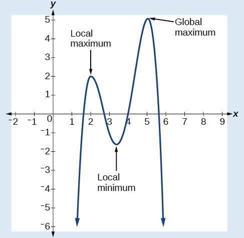{: #Figure_03_04_026}

**Do all polynomial functions have a global minimum or maximum?**

*No. Only polynomial functions of even degree have a global minimum or maximum. For example,<math xmlns="http://www.w3.org/1998/Math/MathML"> <mrow> <mtext> </mtext><mi>f</mi><mrow><mo>(</mo> <mi>x</mi> <mo>)</mo></mrow><mo>=</mo><mi>x</mi><mtext> </mtext> </mrow> </math>

has neither a global maximum nor a global minimum.*

Using Local Extrema to Solve Applications

An open-top box is to be constructed by cutting out squares from each corner of a 14 cm by 20 cm sheet of plastic and then folding up the sides. Find the size of squares that should be cut out to maximize the volume enclosed by the box.

We will start this problem by drawing a picture like that in [[link]](#Figure_03_04_027), labeling the width of the cut-out squares with a variable,<math xmlns="http://www.w3.org/1998/Math/MathML"> <mrow> <mtext> </mtext><mi>w</mi><mo>.</mo> </mrow> </math>

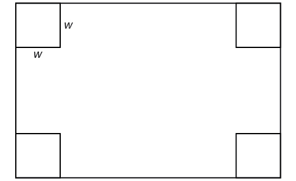{: #Figure_03_04_027}

Notice that after a square is cut out from each end, it leaves a<math xmlns="http://www.w3.org/1998/Math/MathML"> <mrow> <mtext> </mtext><mrow><mo>(</mo> <mrow> <mn>14</mn><mo>−</mo><mn>2</mn><mi>w</mi> </mrow> <mo>)</mo></mrow><mtext> </mtext> </mrow> </math>

cm by<math xmlns="http://www.w3.org/1998/Math/MathML"> <mrow> <mtext> </mtext><mrow><mo>(</mo> <mrow> <mn>20</mn><mo>−</mo><mn>2</mn><mi>w</mi> </mrow> <mo>)</mo></mrow><mtext> </mtext> </mrow> </math>

cm rectangle for the base of the box, and the box will be<math xmlns="http://www.w3.org/1998/Math/MathML"> <mrow> <mtext> </mtext><mi>w</mi><mtext> </mtext> </mrow> </math>

cm tall. This gives the volume

<math xmlns="http://www.w3.org/1998/Math/MathML" display="block"> <mrow> <mtable> <mtr rowalign="center"> <mtd rowalign="center" columnalign="right"><mrow><mi>V</mi><mo stretchy="false">(</mo><mi>w</mi><mo stretchy="false">)</mo></mrow></mtd> <mtd rowalign="center"><mo>=</mo></mtd> <mtd rowalign="center" columnalign="left"><mrow><mo stretchy="false">(</mo><mn>20</mn><mo>−</mo><mn>2</mn><mi>w</mi><mo stretchy="false">)</mo><mo stretchy="false">(</mo><mn>14</mn><mo>−</mo><mn>2</mn><mi>w</mi><mo stretchy="false">)</mo><mi>w</mi></mrow></mtd> </mtr> <mtr> <mtd rowalign="center" /> <mtd rowalign="center"><mo>=</mo></mtd> <mtd columnalign="left" rowalign="center"> <mrow> <mn>280</mn><mi>w</mi><mo>−</mo><mn>68</mn><msup> <mi>w</mi> <mn>2</mn> </msup> <mo>+</mo><mn>4</mn><msup> <mi>w</mi> <mn>3</mn> </msup> </mrow> </mtd> </mtr> </mtable></mrow> </math>

Notice, since the factors are<math xmlns="http://www.w3.org/1998/Math/MathML"> <mrow> <mtext> </mtext><mi>w</mi><mo>,</mo><mtext> </mtext> </mrow> </math>

<math xmlns="http://www.w3.org/1998/Math/MathML"> <mrow> <mtext> </mtext><mn>20</mn><mo>–</mo><mn>2</mn><mi>w</mi><mtext> </mtext> </mrow> </math>

and<math xmlns="http://www.w3.org/1998/Math/MathML"> <mrow> <mtext> </mtext><mn>14</mn><mo>–</mo><mn>2</mn><mi>w</mi><mo>,</mo><mtext> </mtext> </mrow> </math>

the three zeros are 10, 7, and 0, respectively. Because a height of 0 cm is not reasonable, we consider the only the zeros 10 and 7. The shortest side is 14 and we are cutting off two squares, so values<math xmlns="http://www.w3.org/1998/Math/MathML"> <mrow> <mtext> </mtext><mi>w</mi><mtext> </mtext> </mrow> </math>

may take on are greater than zero or less than 7. This means we will restrict the domain of this function to<math xmlns="http://www.w3.org/1998/Math/MathML"> <mrow> <mtext> </mtext><mn>0</mn><mo>&lt;</mo><mi>w</mi><mo>&lt;</mo><mn>7.</mn><mtext> </mtext> </mrow> </math>

Using technology to sketch the graph of<math xmlns="http://www.w3.org/1998/Math/MathML"> <mrow> <mtext> </mtext><mi>V</mi><mrow><mo>(</mo> <mi>w</mi> <mo>)</mo></mrow><mtext> </mtext> </mrow> </math>

on this reasonable domain, we get a graph like that in [[link]](#Figure_03_04_028). We can use this graph to estimate the maximum value for the volume, restricted to values for<math xmlns="http://www.w3.org/1998/Math/MathML"> <mrow> <mtext> </mtext><mi>w</mi><mtext> </mtext> </mrow> </math>

that are reasonable for this problem—values from 0 to 7.

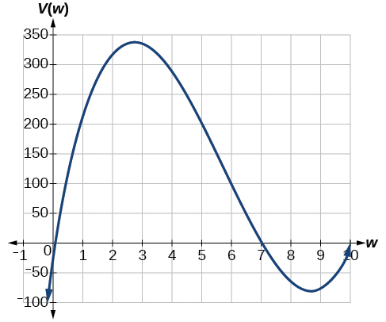{: #Figure_03_04_028}

From this graph, we turn our focus to only the portion on the reasonable domain,<math xmlns="http://www.w3.org/1998/Math/MathML"> <mrow> <mtext> </mtext><mrow><mo>[</mo> <mrow> <mn>0</mn><mo>,</mo><mtext> </mtext><mn>7</mn> </mrow> <mo>]</mo></mrow><mo>.</mo><mtext> </mtext> </mrow> </math>

We can estimate the maximum value to be around 340 cubic cm, which occurs when the squares are about 2.75 cm on each side. To improve this estimate, we could use advanced features of our technology, if available, or simply change our window to zoom in on our graph to produce [[link]](#Figure_03_04_029).

![Graph of V(w)=(20-2w)(14-2w)w where the x-axis is labeled w and the y-axis is labeled V(w) on the domain \[2.4, 3\].](../resources/CNX_Precalc_Figure_03_04_029.jpg){: #Figure_03_04_029}

From this zoomed-in view, we can refine our estimate for the maximum volume to about 339 cubic cm, when the squares measure approximately 2.7 cm on each side.

Use technology to find the maximum and minimum values on the interval<math xmlns="http://www.w3.org/1998/Math/MathML"> <mrow> <mtext> </mtext><mo stretchy="false">[</mo><mn>−1</mn><mo>,</mo><mn>4</mn><mo stretchy="false">]</mo><mtext> </mtext> </mrow> </math>

of the function<math xmlns="http://www.w3.org/1998/Math/MathML"> <mrow> <mtext> </mtext><mi>f</mi><mo stretchy="false">(</mo><mi>x</mi><mo stretchy="false">)</mo><mo>=</mo><mo>−</mo><mn>0.2</mn><msup> <mrow> <mo stretchy="false">(</mo><mi>x</mi><mo>−</mo><mn>2</mn><mo stretchy="false">)</mo> </mrow> <mn>3</mn> </msup> <msup> <mrow> <mo stretchy="false">(</mo><mi>x</mi><mo>+</mo><mn>1</mn><mo stretchy="false">)</mo> </mrow> <mn>2</mn> </msup> <mo stretchy="false">(</mo><mi>x</mi><mo>−</mo><mn>4</mn><mo stretchy="false">)</mo><mo>.</mo> </mrow> </math>

The minimum occurs at approximately the point<math xmlns="http://www.w3.org/1998/Math/MathML"> <mrow> <mtext> </mtext><mo stretchy="false">(</mo><mn>0</mn><mo>,</mo><mo>−</mo><mn>6.5</mn><mo stretchy="false">)</mo><mo>,</mo><mtext> </mtext> </mrow> </math>

and the maximum occurs at approximately the point<math xmlns="http://www.w3.org/1998/Math/MathML"> <mrow> <mtext> </mtext><mo stretchy="false">(</mo><mn>3.5</mn><mo>,</mo><mn>7</mn><mo stretchy="false">)</mo><mo>.</mo> </mrow> </math>

Access the following online resource for additional instruction and practice with graphing polynomial functions.

* [Intermediate Value Theorem][1]

### Key Concepts

* Polynomial functions of degree 2 or more are smooth, continuous functions. See [\[link\]](#Example_03_04_01).
* To find the zeros of a polynomial function, if it can be factored, factor the function and set each factor equal to zero. See [\[link\]](#Example_03_04_02)<strong>, </strong>[\[link\]](#Example_03_04_03)<strong>, </strong>and [\[link\]](#Example_03_04_04).
* Another way to find the
  <math xmlns="http://www.w3.org/1998/Math/MathML"> <mrow> <mtext> </mtext><mi>x</mi><mtext>-</mtext> </mrow> </math>
  
  intercepts of a polynomial function is to graph the function and identify the points at which the graph crosses the
  <math xmlns="http://www.w3.org/1998/Math/MathML"> <mrow> <mtext> </mtext><mi>x</mi><mtext>-</mtext> </mrow> </math>
  
  axis. See [\[link\]](#Example_03_04_05)**.**
* The multiplicity of a zero determines how the graph behaves at the
  <math xmlns="http://www.w3.org/1998/Math/MathML"> <mrow> <mtext> </mtext><mi>x</mi><mtext>-</mtext> </mrow> </math>
  
  intercepts. See [\[link\]](#Example_03_04_06)**.**
* The graph of a polynomial will cross the horizontal axis at a zero with odd multiplicity.
* The graph of a polynomial will touch the horizontal axis at a zero with even multiplicity.
* The end behavior of a polynomial function depends on the leading term.
* The graph of a polynomial function changes direction at its turning points.
* A polynomial function of degree
  <math xmlns="http://www.w3.org/1998/Math/MathML"> <mrow> <mtext> </mtext><mi>n</mi><mtext> </mtext> </mrow> </math>
  
  has at most
  <math xmlns="http://www.w3.org/1998/Math/MathML"> <mrow> <mtext> </mtext><mi>n</mi><mo>−</mo><mn>1</mn><mtext> </mtext> </mrow> </math>
  
  turning points. See [\[link\]](#Example_03_04_07)**.**
* To graph polynomial functions, find the zeros and their multiplicities, determine the end behavior, and ensure that the final graph has at most
  <math xmlns="http://www.w3.org/1998/Math/MathML"> <mrow> <mtext> </mtext><mi>n</mi><mo>−</mo><mn>1</mn><mtext> </mtext> </mrow> </math>
  
  turning points. See [\[link\]](#Example_03_04_08) and [\[link\]](#Example_03_04_10)**.**
* Graphing a polynomial function helps to estimate local and global extremas. See [\[link\]](#Example_03_04_11)**.**
* The Intermediate Value Theorem tells us that if
  <math xmlns="http://www.w3.org/1998/Math/MathML"> <mrow> <mtext> </mtext><mi>f</mi><mo stretchy="false">(</mo><mi>a</mi><mo stretchy="false">)</mo><mo> </mo><mtext>and</mtext><mo> </mo><mi>f</mi><mo stretchy="false">(</mo><mi>b</mi><mo stretchy="false">)</mo><mtext> </mtext> </mrow> </math>
  
  have opposite signs, then there exists at least one value
  <math xmlns="http://www.w3.org/1998/Math/MathML"> <mrow> <mtext> </mtext><mi>c</mi><mtext> </mtext> </mrow> </math>
  
  between
  <math xmlns="http://www.w3.org/1998/Math/MathML"> <mrow> <mtext> </mtext><mi>a</mi><mtext> </mtext> </mrow> </math>
  
  and
  <math xmlns="http://www.w3.org/1998/Math/MathML"> <mrow> <mtext> </mtext><mi>b</mi><mtext> </mtext> </mrow> </math>
  
  for which
  <math xmlns="http://www.w3.org/1998/Math/MathML"> <mrow> <mtext> </mtext><mi>f</mi><mrow><mo>(</mo> <mi>c</mi> <mo>)</mo></mrow><mo>=</mo><mn>0.</mn><mtext> </mtext> </mrow> </math>
  
  See [\[link\]](#Example_03_04_09)**.**

### Section Exercises

#### Verbal

What is the difference between an<math xmlns="http://www.w3.org/1998/Math/MathML"> <mrow> <mtext> </mtext><mi>x</mi><mtext>-</mtext> </mrow> </math>

intercept and a zero of a polynomial function<math xmlns="http://www.w3.org/1998/Math/MathML"> <mrow> <mtext> </mtext><mi>f</mi><mo>?</mo><mtext> </mtext> </mrow> </math>

The<math xmlns="http://www.w3.org/1998/Math/MathML"> <mrow> <mtext> </mtext><mi>x</mi><mtext>-</mtext> </mrow> </math>

intercept is where the graph of the function crosses the<math xmlns="http://www.w3.org/1998/Math/MathML"> <mrow> <mtext> </mtext><mi>x</mi><mtext>-</mtext> </mrow> </math>

axis, and the zero of the function is the input value for which<math xmlns="http://www.w3.org/1998/Math/MathML"> <mrow> <mtext> </mtext><mi>f</mi><mo stretchy="false">(</mo><mi>x</mi><mo stretchy="false">)</mo><mo>=</mo><mn>0.</mn> </mrow> </math>

If a polynomial function of degree<math xmlns="http://www.w3.org/1998/Math/MathML"> <mrow> <mtext> </mtext><mi>n</mi><mtext> </mtext> </mrow> </math>

 has<math xmlns="http://www.w3.org/1998/Math/MathML"> <mrow> <mtext> </mtext><mi>n</mi><mtext> </mtext> </mrow> </math>

 distinct zeros, what do you know about the graph of the function?

Explain how the Intermediate Value Theorem can assist us in finding a zero of a function.

If we evaluate the function at<math xmlns="http://www.w3.org/1998/Math/MathML"> <mrow> <mtext> </mtext><mi>a</mi><mtext> </mtext> </mrow> </math>

 and at<math xmlns="http://www.w3.org/1998/Math/MathML"> <mrow> <mtext> </mtext><mi>b</mi><mtext> </mtext> </mrow> </math>

 and the sign of the function value changes, then we know a zero exists between<math xmlns="http://www.w3.org/1998/Math/MathML"> <mrow> <mtext> </mtext><mi>a</mi><mtext> </mtext> </mrow> </math>

 and<math xmlns="http://www.w3.org/1998/Math/MathML"> <mrow> <mtext> </mtext><mi>b</mi><mo>.</mo> </mrow> </math>

Explain how the factored form of the polynomial helps us in graphing it.

If the graph of a polynomial just touches the *x*-axis and then changes direction, what can we conclude about the factored form of the polynomial?

There will be a factor raised to an even power.

#### Algebraic

For the following exercises, find the<math xmlns="http://www.w3.org/1998/Math/MathML"> <mrow> <mtext> </mtext><mi>x</mi><mtext>-</mtext> </mrow> </math>

 or *t*-intercepts of the polynomial functions.

<math xmlns="http://www.w3.org/1998/Math/MathML"> <mrow> <mtext> </mtext><mi>C</mi><mrow><mo>(</mo> <mi>t</mi> <mo>)</mo></mrow><mo>=</mo><mn>2</mn><mrow><mo>(</mo> <mrow> <mi>t</mi><mo>−</mo><mn>4</mn> </mrow> <mo>)</mo></mrow><mrow><mo>(</mo> <mrow> <mi>t</mi><mo>+</mo><mn>1</mn> </mrow> <mo>)</mo></mrow><mo stretchy="false">(</mo><mi>t</mi><mo>−</mo><mn>6</mn><mo stretchy="false">)</mo> </mrow> </math>

<math xmlns="http://www.w3.org/1998/Math/MathML"> <mrow> <mtext> </mtext><mi>C</mi><mrow><mo>(</mo> <mi>t</mi> <mo>)</mo></mrow><mo>=</mo><mn>3</mn><mrow><mo>(</mo> <mrow> <mi>t</mi><mo>+</mo><mn>2</mn> </mrow> <mo>)</mo></mrow><mrow><mo>(</mo> <mrow> <mi>t</mi><mo>−</mo><mn>3</mn> </mrow> <mo>)</mo></mrow><mo stretchy="false">(</mo><mi>t</mi><mo>+</mo><mn>5</mn><mo stretchy="false">)</mo> </mrow> </math>

<math xmlns="http://www.w3.org/1998/Math/MathML"> <mrow> <mo stretchy="false">(</mo><mo>−</mo><mn>2</mn><mo>,</mo><mn>0</mn><mo stretchy="false">)</mo><mo>,</mo><mo stretchy="false">(</mo><mn>3</mn><mo>,</mo><mn>0</mn><mo stretchy="false">)</mo><mo>,</mo><mo stretchy="false">(</mo><mo>−</mo><mn>5</mn><mo>,</mo><mn>0</mn><mo stretchy="false">)</mo> </mrow> </math>

<math xmlns="http://www.w3.org/1998/Math/MathML"> <mrow> <mtext> </mtext><mi>C</mi><mrow><mo>(</mo> <mi>t</mi> <mo>)</mo></mrow><mo>=</mo><mn>4</mn><mi>t</mi><msup> <mrow> <mrow><mo>(</mo> <mrow> <mi>t</mi><mo>−</mo><mn>2</mn> </mrow> <mo>)</mo></mrow> </mrow> <mn>2</mn> </msup> <mo stretchy="false">(</mo><mi>t</mi><mo>+</mo><mn>1</mn><mo stretchy="false">)</mo> </mrow> </math>

<math xmlns="http://www.w3.org/1998/Math/MathML"> <mrow> <mtext> </mtext><mi>C</mi><mrow><mo>(</mo> <mi>t</mi> <mo>)</mo></mrow><mo>=</mo><mn>2</mn><mi>t</mi><mrow><mo>(</mo> <mrow> <mi>t</mi><mo>−</mo><mn>3</mn> </mrow> <mo>)</mo></mrow><msup> <mrow> <mrow><mo>(</mo> <mrow> <mi>t</mi><mo>+</mo><mn>1</mn> </mrow> <mo>)</mo></mrow> </mrow> <mn>2</mn> </msup> </mrow> </math>

<math xmlns="http://www.w3.org/1998/Math/MathML"> <mrow> <mtext> </mtext><mo stretchy="false">(</mo><mn>3</mn><mo>,</mo><mn>0</mn><mo stretchy="false">)</mo><mo>,</mo><mo stretchy="false">(</mo><mo>−</mo><mn>1</mn><mo>,</mo><mn>0</mn><mo stretchy="false">)</mo><mo>,</mo><mo stretchy="false">(</mo><mn>0</mn><mo>,</mo><mn>0</mn><mo stretchy="false">)</mo> </mrow> </math>

<math xmlns="http://www.w3.org/1998/Math/MathML"> <mrow> <mtext> </mtext><mi>C</mi><mrow><mo>(</mo> <mi>t</mi> <mo>)</mo></mrow><mo>=</mo><mn>2</mn><msup> <mi>t</mi> <mn>4</mn> </msup> <mo>−</mo><mn>8</mn><msup> <mi>t</mi> <mn>3</mn> </msup> <mo>+</mo><mn>6</mn><msup> <mi>t</mi> <mn>2</mn> </msup> </mrow> </math>

<math xmlns="http://www.w3.org/1998/Math/MathML"> <mrow> <mtext> </mtext><mi>C</mi><mrow><mo>(</mo> <mi>t</mi> <mo>)</mo></mrow><mo>=</mo><mn>4</mn><msup> <mi>t</mi> <mn>4</mn> </msup> <mo>+</mo><mn>12</mn><msup> <mi>t</mi> <mn>3</mn> </msup> <mo>−</mo><mn>40</mn><msup> <mi>t</mi> <mn>2</mn> </msup> </mrow> </math>

<math xmlns="http://www.w3.org/1998/Math/MathML"> <mrow> <mrow><mo>(</mo> <mrow> <mn>0</mn><mo>,</mo><mn>0</mn> </mrow> <mo>)</mo></mrow><mo>,</mo><mtext> </mtext><mrow><mo>(</mo> <mrow> <mo>−</mo><mn>5</mn><mo>,</mo><mn>0</mn> </mrow> <mo>)</mo></mrow><mo>,</mo><mtext> </mtext><mrow><mo>(</mo> <mrow> <mn>2</mn><mo>,</mo><mn>0</mn> </mrow> <mo>)</mo></mrow> </mrow> </math>

<math xmlns="http://www.w3.org/1998/Math/MathML"> <mrow> <mtext> </mtext><mi>f</mi><mo stretchy="false">(</mo><mi>x</mi><mo stretchy="false">)</mo><mo>=</mo><msup> <mi>x</mi> <mn>4</mn> </msup> <mo>−</mo><msup> <mi>x</mi> <mn>2</mn> </msup> </mrow> </math>

<math xmlns="http://www.w3.org/1998/Math/MathML"> <mrow> <mtext> </mtext><mi>f</mi><mo stretchy="false">(</mo><mi>x</mi><mo stretchy="false">)</mo><mo>=</mo><msup> <mi>x</mi> <mn>3</mn> </msup> <mo>+</mo><msup> <mi>x</mi> <mn>2</mn> </msup> <mo>−</mo><mn>20</mn><mi>x</mi> </mrow> </math>

<math xmlns="http://www.w3.org/1998/Math/MathML"> <mrow> <mrow><mo>(</mo> <mrow> <mn>0</mn><mo>,</mo><mn>0</mn> </mrow> <mo>)</mo></mrow><mo>,</mo><mtext> </mtext><mrow><mo>(</mo> <mrow> <mo>−</mo><mn>5</mn><mo>,</mo><mn>0</mn> </mrow> <mo>)</mo></mrow><mo>,</mo><mtext> </mtext><mrow><mo>(</mo> <mrow> <mn>4</mn><mo>,</mo><mn>0</mn> </mrow> <mo>)</mo></mrow> </mrow> </math>

<math xmlns="http://www.w3.org/1998/Math/MathML"> <mrow> <mi>f</mi><mo stretchy="false">(</mo><mi>x</mi><mo stretchy="false">)</mo><mo>=</mo><msup> <mi>x</mi> <mn>3</mn> </msup> <mo>+</mo><mn>6</mn><msup> <mi>x</mi> <mn>2</mn> </msup> <mo>−</mo><mn>7</mn><mi>x</mi> </mrow> </math>

<math xmlns="http://www.w3.org/1998/Math/MathML"> <mrow> <mi>f</mi><mo stretchy="false">(</mo><mi>x</mi><mo stretchy="false">)</mo><mo>=</mo><msup> <mi>x</mi> <mn>3</mn> </msup> <mo>+</mo><msup> <mi>x</mi> <mn>2</mn> </msup> <mo>−</mo><mn>4</mn><mi>x</mi><mo>−</mo><mn>4</mn> </mrow> </math>

<math xmlns="http://www.w3.org/1998/Math/MathML"> <mrow> <mrow><mo>(</mo> <mrow> <mn>2</mn><mo>,</mo><mn>0</mn> </mrow> <mo>)</mo></mrow><mo>,</mo><mtext> </mtext><mrow><mo>(</mo> <mrow> <mo>−</mo><mn>2</mn><mo>,</mo><mn>0</mn> </mrow> <mo>)</mo></mrow><mo>,</mo><mtext> </mtext><mrow><mo>(</mo> <mrow> <mo>−</mo><mn>1</mn><mo>,</mo><mn>0</mn> </mrow> <mo>)</mo></mrow> </mrow> </math>

<math xmlns="http://www.w3.org/1998/Math/MathML"> <mrow> <mi>f</mi><mo stretchy="false">(</mo><mi>x</mi><mo stretchy="false">)</mo><mo>=</mo><msup> <mi>x</mi> <mn>3</mn> </msup> <mo>+</mo><mn>2</mn><msup> <mi>x</mi> <mn>2</mn> </msup> <mo>−</mo><mn>9</mn><mi>x</mi><mo>−</mo><mn>18</mn> </mrow> </math>

<math xmlns="http://www.w3.org/1998/Math/MathML"> <mrow> <mi>f</mi><mo stretchy="false">(</mo><mi>x</mi><mo stretchy="false">)</mo><mo>=</mo><mn>2</mn><msup> <mi>x</mi> <mn>3</mn> </msup> <mo>−</mo><msup> <mi>x</mi> <mn>2</mn> </msup> <mo>−</mo><mn>8</mn><mi>x</mi><mo>+</mo><mn>4</mn> </mrow> </math>

<math xmlns="http://www.w3.org/1998/Math/MathML"> <mrow> <mo stretchy="false">(</mo><mo>−</mo><mn>2</mn><mo>,</mo><mn>0</mn><mo stretchy="false">)</mo><mo>,</mo><mtext> </mtext><mo stretchy="false">(</mo><mn>2</mn><mo>,</mo><mn>0</mn><mo stretchy="false">)</mo><mo>,</mo><mtext> </mtext><mrow><mo>(</mo> <mrow> <mfrac> <mn>1</mn> <mn>2</mn> </mfrac> <mo>,</mo><mn>0</mn> </mrow> <mo>)</mo></mrow> </mrow> </math>

<math xmlns="http://www.w3.org/1998/Math/MathML"> <mrow> <mi>f</mi><mo stretchy="false">(</mo><mi>x</mi><mo stretchy="false">)</mo><mo>=</mo><msup> <mi>x</mi> <mn>6</mn> </msup> <mo>−</mo><mn>7</mn><msup> <mi>x</mi> <mn>3</mn> </msup> <mo>−</mo><mn>8</mn> </mrow> </math>

<math xmlns="http://www.w3.org/1998/Math/MathML"> <mrow> <mi>f</mi><mo stretchy="false">(</mo><mi>x</mi><mo stretchy="false">)</mo><mo>=</mo><mn>2</mn><msup> <mi>x</mi> <mn>4</mn> </msup> <mo>+</mo><mn>6</mn><msup> <mi>x</mi> <mn>2</mn> </msup> <mo>−</mo><mn>8</mn> </mrow> </math>

<math xmlns="http://www.w3.org/1998/Math/MathML"> <mrow> <mrow><mo>(</mo> <mrow> <mn>1</mn><mo>,</mo><mn>0</mn> </mrow> <mo>)</mo></mrow><mo>,</mo><mtext> </mtext><mrow><mo>(</mo> <mrow> <mo>−</mo><mn>1</mn><mo>,</mo><mn>0</mn> </mrow> <mo>)</mo></mrow> </mrow> </math>

<math xmlns="http://www.w3.org/1998/Math/MathML"> <mrow> <mi>f</mi><mo stretchy="false">(</mo><mi>x</mi><mo stretchy="false">)</mo><mo>=</mo><msup> <mi>x</mi> <mn>3</mn> </msup> <mo>−</mo><mn>3</mn><msup> <mi>x</mi> <mn>2</mn> </msup> <mo>−</mo><mi>x</mi><mo>+</mo><mn>3</mn> </mrow> </math>

<math xmlns="http://www.w3.org/1998/Math/MathML"> <mrow> <mi>f</mi><mo stretchy="false">(</mo><mi>x</mi><mo stretchy="false">)</mo><mo>=</mo><msup> <mi>x</mi> <mn>6</mn> </msup> <mo>−</mo><mn>2</mn><msup> <mi>x</mi> <mn>4</mn> </msup> <mo>−</mo><mn>3</mn><msup> <mi>x</mi> <mn>2</mn> </msup> </mrow> </math>

<math xmlns="http://www.w3.org/1998/Math/MathML"> <mrow> <mo stretchy="false">(</mo><mn>0</mn><mo>,</mo><mn>0</mn><mo stretchy="false">)</mo><mo>,</mo><mtext> </mtext><mo stretchy="false">(</mo><msqrt> <mn>3</mn> </msqrt> <mo>,</mo><mn>0</mn><mo stretchy="false">)</mo><mo>,</mo><mtext> </mtext><mo stretchy="false">(</mo><mo>−</mo><msqrt> <mn>3</mn> </msqrt> <mo>,</mo><mn>0</mn><mo stretchy="false">)</mo> </mrow> </math>

<math xmlns="http://www.w3.org/1998/Math/MathML"> <mrow> <mi>f</mi><mo stretchy="false">(</mo><mi>x</mi><mo stretchy="false">)</mo><mo>=</mo><msup> <mi>x</mi> <mn>6</mn> </msup> <mo>−</mo><mn>3</mn><msup> <mi>x</mi> <mn>4</mn> </msup> <mo>−</mo><mn>4</mn><msup> <mi>x</mi> <mn>2</mn> </msup> </mrow> </math>

<math xmlns="http://www.w3.org/1998/Math/MathML"> <mrow> <mi>f</mi><mo stretchy="false">(</mo><mi>x</mi><mo stretchy="false">)</mo><mo>=</mo><msup> <mi>x</mi> <mn>5</mn> </msup> <mo>−</mo><mn>5</mn><msup> <mi>x</mi> <mn>3</mn> </msup> <mo>+</mo><mn>4</mn><mi>x</mi> </mrow> </math>

<math xmlns="http://www.w3.org/1998/Math/MathML"> <mrow> <mrow><mo>(</mo> <mrow> <mn>0</mn><mo>,</mo><mn>0</mn> </mrow> <mo>)</mo></mrow><mo>,</mo><mtext> </mtext><mrow><mo>(</mo> <mrow> <mn>1</mn><mo>,</mo><mn>0</mn> </mrow> <mo>)</mo></mrow><mtext>, </mtext><mrow><mo>(</mo> <mrow> <mo>−</mo><mn>1</mn><mo>,</mo><mn>0</mn> </mrow> <mo>)</mo></mrow><mo>,</mo><mtext> </mtext><mrow><mo>(</mo> <mrow> <mn>2</mn><mo>,</mo><mn>0</mn> </mrow> <mo>)</mo></mrow><mo>,</mo><mtext> </mtext><mrow><mo>(</mo> <mrow> <mo>−</mo><mn>2</mn><mo>,</mo><mn>0</mn> </mrow> <mo>)</mo></mrow> </mrow> </math>

For the following exercises, use the Intermediate Value Theorem to confirm that the given polynomial has at least one zero within the given interval.

<math xmlns="http://www.w3.org/1998/Math/MathML"> <mrow> <mi>f</mi><mo stretchy="false">(</mo><mi>x</mi><mo stretchy="false">)</mo><mo>=</mo><msup> <mi>x</mi> <mn>3</mn> </msup> <mo>−</mo><mn>9</mn><mi>x</mi><mo>,</mo><mtext> </mtext> </mrow> </math>

 between<math xmlns="http://www.w3.org/1998/Math/MathML"> <mrow> <mtext> </mtext><mi>x</mi><mo>=</mo><mn>−4</mn><mtext> </mtext> </mrow> </math>

 and<math xmlns="http://www.w3.org/1998/Math/MathML"> <mrow> <mtext> </mtext><mi>x</mi><mo>=</mo><mn>−2.</mn> </mrow> </math>

<math xmlns="http://www.w3.org/1998/Math/MathML"> <mrow> <mi>f</mi><mo stretchy="false">(</mo><mi>x</mi><mo stretchy="false">)</mo><mo>=</mo><msup> <mi>x</mi> <mn>3</mn> </msup> <mo>−</mo><mn>9</mn><mi>x</mi><mo>,</mo><mtext> </mtext> </mrow> </math>

 between<math xmlns="http://www.w3.org/1998/Math/MathML"> <mrow> <mtext> </mtext><mi>x</mi><mo>=</mo><mn>2</mn><mtext> </mtext> </mrow> </math>

 and<math xmlns="http://www.w3.org/1998/Math/MathML"> <mrow> <mtext> </mtext><mi>x</mi><mo>=</mo><mn>4.</mn> </mrow> </math>

<math xmlns="http://www.w3.org/1998/Math/MathML"> <mrow> <mi>f</mi><mrow><mo>(</mo> <mn>2</mn> <mo>)</mo></mrow><mo>=</mo><mo>–</mo><mn>10</mn><mtext> </mtext> </mrow> </math>

 and<math xmlns="http://www.w3.org/1998/Math/MathML"> <mrow> <mtext> </mtext><mi>f</mi><mrow><mo>(</mo> <mn>4</mn> <mo>)</mo></mrow><mo>=</mo><mn>28.</mn> </mrow> </math>

 Sign change confirms.

<math xmlns="http://www.w3.org/1998/Math/MathML"> <mrow> <mi>f</mi><mo stretchy="false">(</mo><mi>x</mi><mo stretchy="false">)</mo><mo>=</mo><msup> <mi>x</mi> <mn>5</mn> </msup> <mo>−</mo><mn>2</mn><mi>x</mi><mo>,</mo><mtext> </mtext> </mrow> </math>

 between<math xmlns="http://www.w3.org/1998/Math/MathML"> <mrow> <mtext> </mtext><mi>x</mi><mo>=</mo><mn>1</mn><mtext> </mtext> </mrow> </math>

 and<math xmlns="http://www.w3.org/1998/Math/MathML"> <mrow> <mtext> </mtext><mi>x</mi><mo>=</mo><mn>2.</mn> </mrow> </math>

<math xmlns="http://www.w3.org/1998/Math/MathML"> <mrow> <mi>f</mi><mo stretchy="false">(</mo><mi>x</mi><mo stretchy="false">)</mo><mo>=</mo><mo>−</mo><msup> <mi>x</mi> <mn>4</mn> </msup> <mo>+</mo><mn>4</mn><mo>,</mo><mtext> </mtext> </mrow> </math>

 between<math xmlns="http://www.w3.org/1998/Math/MathML"> <mrow> <mtext> </mtext><mi>x</mi><mo>=</mo><mn>1</mn><mtext> </mtext> </mrow> </math>

 and<math xmlns="http://www.w3.org/1998/Math/MathML"> <mrow> <mtext> </mtext><mi>x</mi><mo>=</mo><mn>3</mn> </mrow> </math>

 .

<math xmlns="http://www.w3.org/1998/Math/MathML"> <mrow> <mi>f</mi><mrow><mo>(</mo> <mn>1</mn> <mo>)</mo></mrow><mo>=</mo><mn>3</mn><mtext> </mtext> </mrow> </math>

 and<math xmlns="http://www.w3.org/1998/Math/MathML"> <mrow> <mtext> </mtext><mi>f</mi><mrow><mo>(</mo> <mn>3</mn> <mo>)</mo></mrow><mo>=</mo><mo>–</mo><mn>77.</mn><mtext> </mtext> </mrow> </math>

 Sign change confirms.

<math xmlns="http://www.w3.org/1998/Math/MathML"> <mrow> <mi>f</mi><mo stretchy="false">(</mo><mi>x</mi><mo stretchy="false">)</mo><mo>=</mo><mn>−2</mn><msup> <mi>x</mi> <mn>3</mn> </msup> <mo>−</mo><mi>x</mi><mo>,</mo><mtext> </mtext> </mrow> </math>

 between<math xmlns="http://www.w3.org/1998/Math/MathML"> <mrow> <mtext> </mtext><mi>x</mi><mo>=</mo><mn>–1</mn><mtext> </mtext> </mrow> </math>

 and<math xmlns="http://www.w3.org/1998/Math/MathML"> <mrow> <mtext> </mtext><mi>x</mi><mo>=</mo><mn>1.</mn> </mrow> </math>

<math xmlns="http://www.w3.org/1998/Math/MathML"> <mrow> <mi>f</mi><mo stretchy="false">(</mo><mi>x</mi><mo stretchy="false">)</mo><mo>=</mo><msup> <mi>x</mi> <mn>3</mn> </msup> <mo>−</mo><mn>100</mn><mi>x</mi><mo>+</mo><mn>2</mn><mo>,</mo><mtext> </mtext> </mrow> </math>

 between<math xmlns="http://www.w3.org/1998/Math/MathML"> <mrow> <mtext> </mtext><mi>x</mi><mo>=</mo><mn>0.01</mn><mtext> </mtext> </mrow> </math>

 and<math xmlns="http://www.w3.org/1998/Math/MathML"> <mrow> <mtext> </mtext><mi>x</mi><mo>=</mo><mn>0.1</mn> </mrow> </math>

<math xmlns="http://www.w3.org/1998/Math/MathML"> <mrow> <mi>f</mi><mrow><mo>(</mo> <mrow> <mn>0.01</mn> </mrow> <mo>)</mo></mrow><mo>=</mo><mn>1.000001</mn><mtext> </mtext> </mrow> </math>

 and<math xmlns="http://www.w3.org/1998/Math/MathML"> <mrow> <mtext> </mtext><mi>f</mi><mrow><mo>(</mo> <mrow> <mn>0.1</mn> </mrow> <mo>)</mo></mrow><mo>=</mo><mo>–</mo><mn>7.999.</mn><mtext> </mtext> </mrow> </math>

 Sign change confirms.

For the following exercises, find the zeros and give the multiplicity of each.

<math xmlns="http://www.w3.org/1998/Math/MathML"> <mrow> <mi>f</mi><mo stretchy="false">(</mo><mi>x</mi><mo stretchy="false">)</mo><mo>=</mo><msup> <mrow> <mrow><mo>(</mo> <mrow> <mi>x</mi><mo>+</mo><mn>2</mn> </mrow> <mo>)</mo></mrow> </mrow> <mn>3</mn> </msup> <msup> <mrow> <mrow><mo>(</mo> <mrow> <mi>x</mi><mo>−</mo><mn>3</mn> </mrow> <mo>)</mo></mrow> </mrow> <mn>2</mn> </msup> </mrow> </math>

<math xmlns="http://www.w3.org/1998/Math/MathML"> <mrow> <mi>f</mi><mo stretchy="false">(</mo><mi>x</mi><mo stretchy="false">)</mo><mo>=</mo><msup> <mi>x</mi> <mn>2</mn> </msup> <msup> <mrow> <mrow><mo>(</mo> <mrow> <mn>2</mn><mi>x</mi><mo>+</mo><mn>3</mn> </mrow> <mo>)</mo></mrow> </mrow> <mn>5</mn> </msup> <msup> <mrow> <mrow><mo>(</mo> <mrow> <mi>x</mi><mo>−</mo><mn>4</mn> </mrow> <mo>)</mo></mrow> </mrow> <mn>2</mn> </msup> </mrow> </math>

0 with multiplicity 2,<math xmlns="http://www.w3.org/1998/Math/MathML"> <mrow> <mtext> </mtext><mo>−</mo><mfrac> <mn>3</mn> <mn>2</mn> </mfrac> <mtext> </mtext> </mrow> </math>

 with multiplicity 5, 4 with multiplicity 2

<math xmlns="http://www.w3.org/1998/Math/MathML"> <mrow> <mi>f</mi><mo stretchy="false">(</mo><mi>x</mi><mo stretchy="false">)</mo><mo>=</mo><msup> <mi>x</mi> <mn>3</mn> </msup> <msup> <mrow> <mrow><mo>(</mo> <mrow> <mi>x</mi><mo>−</mo><mn>1</mn> </mrow> <mo>)</mo></mrow> </mrow> <mn>3</mn> </msup> <mrow><mo>(</mo> <mrow> <mi>x</mi><mo>+</mo><mn>2</mn> </mrow> <mo>)</mo></mrow> </mrow> </math>

<math xmlns="http://www.w3.org/1998/Math/MathML"> <mrow> <mi>f</mi><mo stretchy="false">(</mo><mi>x</mi><mo stretchy="false">)</mo><mo>=</mo><msup> <mi>x</mi> <mn>2</mn> </msup> <mrow><mo>(</mo> <mrow> <msup> <mi>x</mi> <mn>2</mn> </msup> <mo>+</mo><mn>4</mn><mi>x</mi><mo>+</mo><mn>4</mn> </mrow> <mo>)</mo></mrow> </mrow> </math>

0 with multiplicity 2, –2 with multiplicity 2

<math xmlns="http://www.w3.org/1998/Math/MathML"> <mrow> <mi>f</mi><mo stretchy="false">(</mo><mi>x</mi><mo stretchy="false">)</mo><mo>=</mo><msup> <mrow> <mrow><mo>(</mo> <mrow> <mn>2</mn><mi>x</mi><mo>+</mo><mn>1</mn> </mrow> <mo>)</mo></mrow> </mrow> <mn>3</mn> </msup> <mrow><mo>(</mo> <mrow> <mn>9</mn><msup> <mi>x</mi> <mn>2</mn> </msup> <mo>−</mo><mn>6</mn><mi>x</mi><mo>+</mo><mn>1</mn> </mrow> <mo>)</mo></mrow> </mrow> </math>

<math xmlns="http://www.w3.org/1998/Math/MathML"> <mrow> <mi>f</mi><mo stretchy="false">(</mo><mi>x</mi><mo stretchy="false">)</mo><mo>=</mo><msup> <mrow> <mrow><mo>(</mo> <mrow> <mn>3</mn><mi>x</mi><mo>+</mo><mn>2</mn> </mrow> <mo>)</mo></mrow> </mrow> <mn>5</mn> </msup> <mrow><mo>(</mo> <mrow> <msup> <mi>x</mi> <mn>2</mn> </msup> <mo>−</mo><mn>10</mn><mi>x</mi><mo>+</mo><mn>25</mn> </mrow> <mo>)</mo></mrow> </mrow> </math>

<math xmlns="http://www.w3.org/1998/Math/MathML"> <mrow> <mo>−</mo><mfrac> <mn>2</mn> <mn>3</mn> </mfrac> <mtext> </mtext><mtext>with</mtext><mtext> </mtext><mtext>multiplicity</mtext><mtext> </mtext><mn>5</mn><mtext>,</mtext><mtext> </mtext><mn>5</mn><mtext> </mtext><mtext>with</mtext><mtext> </mtext><mtext>multiplicity</mtext><mtext> </mtext><mtext>2</mtext> </mrow> </math>

<math xmlns="http://www.w3.org/1998/Math/MathML"> <mrow> <mi>f</mi><mo stretchy="false">(</mo><mi>x</mi><mo stretchy="false">)</mo><mo>=</mo><mi>x</mi><mrow><mo>(</mo> <mrow> <mn>4</mn><msup> <mi>x</mi> <mn>2</mn> </msup> <mo>−</mo><mn>12</mn><mi>x</mi><mo>+</mo><mn>9</mn> </mrow> <mo>)</mo></mrow><mrow><mo>(</mo> <mrow> <msup> <mi>x</mi> <mn>2</mn> </msup> <mo>+</mo><mn>8</mn><mi>x</mi><mo>+</mo><mn>16</mn> </mrow> <mo>)</mo></mrow> </mrow> </math>

<math xmlns="http://www.w3.org/1998/Math/MathML"> <mrow> <mi>f</mi><mo stretchy="false">(</mo><mi>x</mi><mo stretchy="false">)</mo><mo>=</mo><msup> <mi>x</mi> <mn>6</mn> </msup> <mo>−</mo><msup> <mi>x</mi> <mn>5</mn> </msup> <mo>−</mo><mn>2</mn><msup> <mi>x</mi> <mn>4</mn> </msup> </mrow> </math>

<math xmlns="http://www.w3.org/1998/Math/MathML"> <mrow> <mtext>0</mtext><mtext> </mtext><mtext>with</mtext><mtext> </mtext><mtext>multiplicity</mtext><mtext> </mtext><mn>4</mn><mtext>,</mtext><mtext> </mtext><mn>2</mn><mtext> </mtext><mtext>with</mtext><mtext> </mtext><mtext>multiplicity</mtext><mtext> </mtext><mn>1</mn><mtext>,</mtext><mtext> </mtext><mo>–</mo><mtext>1</mtext><mtext> </mtext><mtext>with</mtext><mtext> </mtext><mtext>multiplicity</mtext><mtext> </mtext><mn>1</mn> </mrow> </math>

<math xmlns="http://www.w3.org/1998/Math/MathML"> <mrow> <mi>f</mi><mo stretchy="false">(</mo><mi>x</mi><mo stretchy="false">)</mo><mo>=</mo><mn>3</mn><msup> <mi>x</mi> <mn>4</mn> </msup> <mo>+</mo><mn>6</mn><msup> <mi>x</mi> <mn>3</mn> </msup> <mo>+</mo><mn>3</mn><msup> <mi>x</mi> <mn>2</mn> </msup> </mrow> </math>

<math xmlns="http://www.w3.org/1998/Math/MathML"> <mrow> <mi>f</mi><mo stretchy="false">(</mo><mi>x</mi><mo stretchy="false">)</mo><mo>=</mo><mn>4</mn><msup> <mi>x</mi> <mn>5</mn> </msup> <mo>−</mo><mn>12</mn><msup> <mi>x</mi> <mn>4</mn> </msup> <mo>+</mo><mn>9</mn><msup> <mi>x</mi> <mn>3</mn> </msup> </mrow> </math>

<math xmlns="http://www.w3.org/1998/Math/MathML"> <mrow> <mfrac> <mn>3</mn> <mn>2</mn> </mfrac> <mtext> </mtext> </mrow> </math>

 with multiplicity 2, 0 with multiplicity 3

<math xmlns="http://www.w3.org/1998/Math/MathML"> <mrow> <mi>f</mi><mo stretchy="false">(</mo><mi>x</mi><mo stretchy="false">)</mo><mo>=</mo><mn>2</mn><msup> <mi>x</mi> <mn>4</mn> </msup> <mrow><mo>(</mo> <mrow> <msup> <mi>x</mi> <mn>3</mn> </msup> <mo>−</mo><mn>4</mn><msup> <mi>x</mi> <mn>2</mn> </msup> <mo>+</mo><mn>4</mn><mi>x</mi> </mrow> <mo>)</mo></mrow> </mrow> </math>

<math xmlns="http://www.w3.org/1998/Math/MathML"> <mrow> <mi>f</mi><mo stretchy="false">(</mo><mi>x</mi><mo stretchy="false">)</mo><mo>=</mo><mn>4</mn><msup> <mi>x</mi> <mn>4</mn> </msup> <mrow><mo>(</mo> <mrow> <mn>9</mn><msup> <mi>x</mi> <mn>4</mn> </msup> <mo>−</mo><mn>12</mn><msup> <mi>x</mi> <mn>3</mn> </msup> <mo>+</mo><mn>4</mn><msup> <mi>x</mi> <mn>2</mn> </msup> </mrow> <mo>)</mo></mrow> </mrow> </math>

<math xmlns="http://www.w3.org/1998/Math/MathML"> <mrow> <mtext>0</mtext><mtext> </mtext><mtext>with</mtext><mtext> </mtext><mtext>multiplicity</mtext><mtext> </mtext><mn>6</mn><mtext>,</mtext><mtext> </mtext><mfrac> <mn>2</mn> <mn>3</mn> </mfrac> <mtext> </mtext><mtext>with</mtext><mtext> </mtext><mtext>multiplicity</mtext><mtext> </mtext><mn>2</mn> </mrow> </math>

#### Graphical

For the following exercises, graph the polynomial functions. Note<math xmlns="http://www.w3.org/1998/Math/MathML"> <mrow> <mtext> </mtext><mi>x</mi><mtext>-</mtext> </mrow> </math>

 and<math xmlns="http://www.w3.org/1998/Math/MathML"> <mrow> <mtext> </mtext><mi>y</mi><mtext>-</mtext> </mrow> </math>

intercepts, multiplicity, and end behavior.

<math xmlns="http://www.w3.org/1998/Math/MathML"> <mrow> <mi>f</mi><mrow><mo>(</mo> <mi>x</mi> <mo>)</mo></mrow><mo>=</mo><msup> <mrow> <mrow><mo>(</mo> <mrow> <mi>x</mi><mo>+</mo><mn>3</mn> </mrow> <mo>)</mo></mrow> </mrow> <mn>2</mn> </msup> <mo stretchy="false">(</mo><mi>x</mi><mo>−</mo><mn>2</mn><mo stretchy="false">)</mo> </mrow> </math>

<math xmlns="http://www.w3.org/1998/Math/MathML"> <mrow> <mi>g</mi><mrow><mo>(</mo> <mi>x</mi> <mo>)</mo></mrow><mo>=</mo><mrow><mo>(</mo> <mrow> <mi>x</mi><mo>+</mo><mn>4</mn> </mrow> <mo>)</mo></mrow><msup> <mrow> <mrow><mo>(</mo> <mrow> <mi>x</mi><mo>−</mo><mn>1</mn> </mrow> <mo>)</mo></mrow> </mrow> <mn>2</mn> </msup> </mrow> </math>

*x*-intercepts, <math xmlns="http://www.w3.org/1998/Math/MathML"> <mrow> <mrow><mo>(</mo> <mrow> <mn>1, 0</mn> </mrow> <mo>)</mo></mrow> </mrow> </math>

 with multiplicity 2, <math xmlns="http://www.w3.org/1998/Math/MathML"> <mrow> <mrow><mo>(</mo> <mrow> <mo>–</mo><mn>4</mn><mo>,</mo><mo> </mo><mn>0</mn> </mrow> <mo>)</mo></mrow><mtext> </mtext> </mrow> </math>

 with multiplicity 1, <math xmlns="http://www.w3.org/1998/Math/MathML"> <mrow> <mi>y</mi><mtext>-</mtext> </mrow> </math>

intercept <math xmlns="http://www.w3.org/1998/Math/MathML"> <mrow> <mrow><mo>(</mo> <mrow> <mn>0</mn><mo>,</mo><mo> </mo><mn>4</mn> </mrow> <mo>).</mo></mrow> </mrow> </math>

 As <math xmlns="http://www.w3.org/1998/Math/MathML"> <mrow> <mspace width="0.2em" /><mi>x</mi><mo stretchy="false">→</mo><mo>−</mo><mi>∞</mi><mo>,</mo><mspace width="0.2em" /><mi>f</mi><mo stretchy="false">(</mo><mi>x</mi><mo stretchy="false">)</mo><mo stretchy="false">→</mo><mo>−</mo><mi>∞</mi><mo>,</mo><mtext> </mtext><mtext>as</mtext><mspace width="0.2em" /><mi>x</mi><mo stretchy="false">→</mo><mi>∞</mi><mo>,</mo><mspace width="0.2em" /><mi>f</mi><mo stretchy="false">(</mo><mi>x</mi><mo stretchy="false">)</mo><mo stretchy="false">→</mo><mi>∞</mi><mo>.</mo> </mrow> </math>

<math xmlns="http://www.w3.org/1998/Math/MathML"> <mrow> <mi>h</mi><mrow><mo>(</mo> <mi>x</mi> <mo>)</mo></mrow><mo>=</mo><msup> <mrow> <mrow><mo>(</mo> <mrow> <mi>x</mi><mo>−</mo><mn>1</mn> </mrow> <mo>)</mo></mrow> </mrow> <mn>3</mn> </msup> <msup> <mrow> <mrow><mo>(</mo> <mrow> <mi>x</mi><mo>+</mo><mn>3</mn> </mrow> <mo>)</mo></mrow> </mrow> <mn>2</mn> </msup> </mrow> </math>

<math xmlns="http://www.w3.org/1998/Math/MathML"> <mrow> <mi>k</mi><mrow><mo>(</mo> <mi>x</mi> <mo>)</mo></mrow><mo>=</mo><msup> <mrow> <mrow><mo>(</mo> <mrow> <mi>x</mi><mo>−</mo><mn>3</mn> </mrow> <mo>)</mo></mrow> </mrow> <mn>3</mn> </msup> <msup> <mrow> <mrow><mo>(</mo> <mrow> <mi>x</mi><mo>−</mo><mn>2</mn> </mrow> <mo>)</mo></mrow> </mrow> <mn>2</mn> </msup> </mrow> </math>

*x*-intercepts<math xmlns="http://www.w3.org/1998/Math/MathML"> <mrow> <mtext> </mtext><mo stretchy="false">(</mo><mn>3</mn><mo>,</mo><mn>0</mn><mo stretchy="false">)</mo><mtext> </mtext> </mrow> </math>

with multiplicity 3,<math xmlns="http://www.w3.org/1998/Math/MathML"> <mrow> <mtext> </mtext><mo stretchy="false">(</mo><mn>2</mn><mo>,</mo><mn>0</mn><mo stretchy="false">)</mo><mtext> </mtext> </mrow> </math>

with multiplicity 2,<math xmlns="http://www.w3.org/1998/Math/MathML"> <mrow> <mtext> </mtext><mi>y</mi><mtext>-</mtext> </mrow> </math>

intercept<math xmlns="http://www.w3.org/1998/Math/MathML"> <mrow> <mtext> </mtext><mo stretchy="false">(</mo><mn>0</mn><mo>,</mo><mo>–</mo><mn>108</mn><mo stretchy="false">)</mo><mo>.</mo><mtext> </mtext> </mrow> </math>

 As <math xmlns="http://www.w3.org/1998/Math/MathML"> <mrow> <mi>x</mi><mo stretchy="false">→</mo><mo>−</mo><mi>∞</mi><mo>,</mo><mspace width="0.2em" /><mi>f</mi><mo stretchy="false">(</mo><mi>x</mi><mo stretchy="false">)</mo><mo stretchy="false">→</mo><mo>−</mo><mi>∞</mi><mo>,</mo><mspace width="0.2em" /><mtext>as</mtext><mspace width="0.2em" /><mi>x</mi><mo stretchy="false">→</mo><mi>∞</mi><mo>,</mo><mspace width="0.2em" /><mi>f</mi><mo stretchy="false">(</mo><mi>x</mi><mo stretchy="false">)</mo><mo stretchy="false">→</mo><mi>∞</mi><mo>.</mo> </mrow> </math>

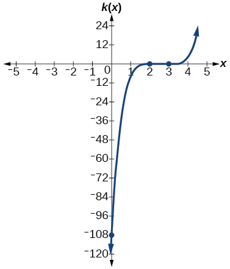

<math xmlns="http://www.w3.org/1998/Math/MathML"> <mrow> <mi>m</mi><mrow><mo>(</mo> <mi>x</mi> <mo>)</mo></mrow><mo>=</mo><mo>−</mo><mn>2</mn><mi>x</mi><mrow><mo>(</mo> <mrow> <mi>x</mi><mo>−</mo><mn>1</mn> </mrow> <mo>)</mo></mrow><mo stretchy="false">(</mo><mi>x</mi><mo>+</mo><mn>3</mn><mo stretchy="false">)</mo> </mrow> </math>

<math xmlns="http://www.w3.org/1998/Math/MathML"> <mrow> <mi>n</mi><mrow><mo>(</mo> <mi>x</mi> <mo>)</mo></mrow><mo>=</mo><mo>−</mo><mn>3</mn><mi>x</mi><mrow><mo>(</mo> <mrow> <mi>x</mi><mo>+</mo><mn>2</mn> </mrow> <mo>)</mo></mrow><mo stretchy="false">(</mo><mi>x</mi><mo>−</mo><mn>4</mn><mo stretchy="false">)</mo> </mrow> </math>

*x*-intercepts<math xmlns="http://www.w3.org/1998/Math/MathML"> <mrow> <mtext> </mtext><mrow><mo>(</mo> <mrow> <mn>0</mn><mo>,</mo><mo> </mo><mn>0</mn> </mrow> <mo>)</mo></mrow><mo>,</mo><mtext> </mtext><mrow><mo>(</mo> <mrow> <mo>–</mo><mn>2</mn><mo>,</mo><mo> </mo><mn>0</mn> </mrow> <mo>)</mo></mrow><mo>,</mo><mtext> </mtext><mrow><mo>(</mo> <mrow> <mn>4</mn><mo>,</mo><mn>0</mn> </mrow> <mo>)</mo></mrow><mtext> </mtext> </mrow> </math>

 with multiplicity 1,<math xmlns="http://www.w3.org/1998/Math/MathML"> <mrow> <mtext> </mtext><mi>y</mi><mtext>-</mtext> </mrow> </math>

intercept<math xmlns="http://www.w3.org/1998/Math/MathML"> <mrow> <mtext> </mtext><mo stretchy="false">(</mo><mn>0</mn><mo>,</mo><mo> </mo><mn>0</mn><mo stretchy="false">)</mo><mo>.</mo> </mrow> </math>

 As <math xmlns="http://www.w3.org/1998/Math/MathML"> <mrow> <mi>x</mi><mo stretchy="false">→</mo><mo>−</mo><mi>∞</mi><mo>,</mo><mspace width="0.2em" /><mi>f</mi><mo stretchy="false">(</mo><mi>x</mi><mo stretchy="false">)</mo><mo stretchy="false">→</mo><mi>∞</mi><mo>,</mo><mspace width="0.2em" /><mtext>as</mtext><mspace width="0.2em" /><mi>x</mi><mo stretchy="false">→</mo><mi>∞</mi><mo>,</mo><mspace width="0.2em" /><mi>f</mi><mo stretchy="false">(</mo><mi>x</mi><mo stretchy="false">)</mo><mo stretchy="false">→</mo><mo>−</mo><mi>∞</mi><mo>.</mo> </mrow> </math>

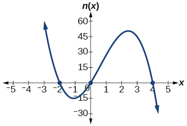

For the following exercises, use the graphs to write the formula for a polynomial function of least degree.

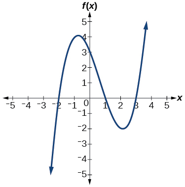

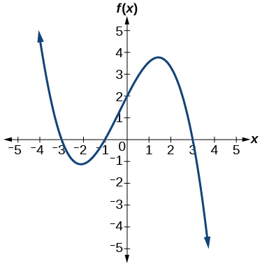

<math xmlns="http://www.w3.org/1998/Math/MathML"> <mrow> <mi>f</mi><mo stretchy="false">(</mo><mi>x</mi><mo stretchy="false">)</mo><mo>=</mo><mo>−</mo><mfrac> <mn>2</mn> <mn>9</mn> </mfrac> <mo stretchy="false">(</mo><mi>x</mi><mo>−</mo><mn>3</mn><mo stretchy="false">)</mo><mo stretchy="false">(</mo><mi>x</mi><mo>+</mo><mn>1</mn><mo stretchy="false">)</mo><mo stretchy="false">(</mo><mi>x</mi><mo>+</mo><mn>3</mn><mo stretchy="false">)</mo> </mrow> </math>

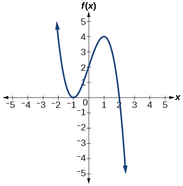

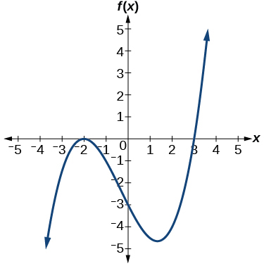

<math xmlns="http://www.w3.org/1998/Math/MathML"> <mrow> <mi>f</mi><mo stretchy="false">(</mo><mi>x</mi><mo stretchy="false">)</mo><mo>=</mo><mfrac> <mn>1</mn> <mn>4</mn> </mfrac> <msup> <mrow> <mo stretchy="false">(</mo><mi>x</mi><mo>+</mo><mn>2</mn><mo stretchy="false">)</mo> </mrow> <mn>2</mn> </msup> <mo stretchy="false">(</mo><mi>x</mi><mo>−</mo><mn>3</mn><mo stretchy="false">)</mo> </mrow> </math>

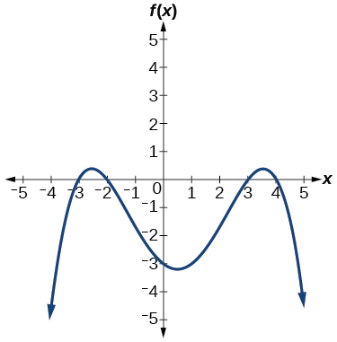

For the following exercises, use the graph to identify zeros and multiplicity.

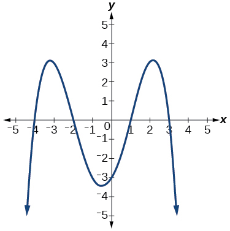

–4, –2, 1, 3 with multiplicity 1

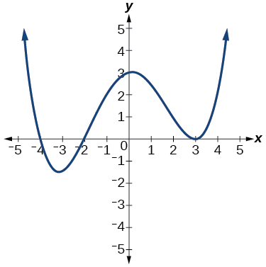

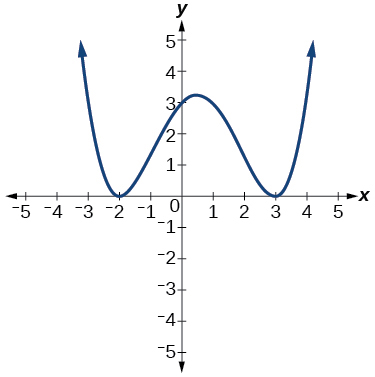

–2, 3 each with multiplicity 2

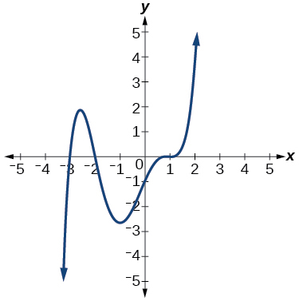

For the following exercises, use the given information about the polynomial graph to write the equation.

Degree 3. Zeros at<math xmlns="http://www.w3.org/1998/Math/MathML"> <mrow> <mtext> </mtext><mi>x</mi><mo>=</mo><mn>–2,</mn></mrow> </math>

 <math xmlns="http://www.w3.org/1998/Math/MathML"> <mrow> <mtext> </mtext><mi>x</mi><mo>=</mo><mn>1,</mn><mtext> </mtext> </mrow> </math>

and<math xmlns="http://www.w3.org/1998/Math/MathML"> <mrow> <mtext> </mtext><mi>x</mi><mo>=</mo><mn>3.</mn><mtext> </mtext> </mrow> </math>

*y*-intercept at<math xmlns="http://www.w3.org/1998/Math/MathML"> <mrow> <mtext> </mtext><mo stretchy="false">(</mo><mn>0</mn><mo>,</mo><mn>–4</mn><mo stretchy="false">)</mo><mo>.</mo> </mrow> </math>

<math xmlns="http://www.w3.org/1998/Math/MathML"> <mrow> <mi>f</mi><mo stretchy="false">(</mo><mi>x</mi><mo stretchy="false">)</mo><mo>=</mo><mo>−</mo><mfrac> <mn>2</mn> <mn>3</mn> </mfrac> <mo stretchy="false">(</mo><mi>x</mi><mo>+</mo><mn>2</mn><mo stretchy="false">)</mo><mo stretchy="false">(</mo><mi>x</mi><mo>−</mo><mn>1</mn><mo stretchy="false">)</mo><mo stretchy="false">(</mo><mi>x</mi><mo>−</mo><mn>3</mn><mo stretchy="false">)</mo> </mrow> </math>

Degree 3. Zeros at<math xmlns="http://www.w3.org/1998/Math/MathML"> <mrow> <mtext> </mtext><mi>x</mi><mo>=</mo><mtext>–5,</mtext> </mrow> </math>

 <math xmlns="http://www.w3.org/1998/Math/MathML"> <mrow> <mtext> </mtext><mi>x</mi><mo>=</mo><mn>–2</mn><mo>,</mo> </mrow> </math>

and<math xmlns="http://www.w3.org/1998/Math/MathML"> <mrow> <mtext> </mtext><mi>x</mi><mo>=</mo><mn>1.</mn><mtext> </mtext> </mrow> </math>

*y*-intercept at<math xmlns="http://www.w3.org/1998/Math/MathML"> <mrow> <mtext> </mtext><mo stretchy="false">(</mo><mn>0</mn><mo>,</mo><mn>6</mn><mo stretchy="false">)</mo> </mrow> </math>

Degree 5. Roots of multiplicity 2 at<math xmlns="http://www.w3.org/1998/Math/MathML"> <mrow> <mtext> </mtext><mi>x</mi><mo>=</mo><mn>3</mn><mtext> </mtext> </mrow> </math>

 and<math xmlns="http://www.w3.org/1998/Math/MathML"> <mrow> <mtext> </mtext><mi>x</mi><mo>=</mo><mn>1</mn><mtext> </mtext> </mrow> </math>

 , and a root of multiplicity 1 at<math xmlns="http://www.w3.org/1998/Math/MathML"> <mrow> <mtext> </mtext><mi>x</mi><mo>=</mo><mn>–3.</mn><mtext> </mtext> </mrow> </math>

 *y*-intercept at<math xmlns="http://www.w3.org/1998/Math/MathML"> <mrow> <mtext> </mtext><mo stretchy="false">(</mo><mn>0</mn><mo>,</mo><mn>9</mn><mo stretchy="false">)</mo> </mrow> </math>

<math xmlns="http://www.w3.org/1998/Math/MathML"> <mrow> <mi>f</mi><mo stretchy="false">(</mo><mi>x</mi><mo stretchy="false">)</mo><mo>=</mo><mfrac> <mn>1</mn> <mn>3</mn> </mfrac> <msup> <mrow> <mo stretchy="false">(</mo><mi>x</mi><mo>−</mo><mn>3</mn><mo stretchy="false">)</mo> </mrow> <mn>2</mn> </msup> <msup> <mrow> <mo stretchy="false">(</mo><mi>x</mi><mo>−</mo><mn>1</mn><mo stretchy="false">)</mo> </mrow> <mn>2</mn> </msup> <mo stretchy="false">(</mo><mi>x</mi><mo>+</mo><mn>3</mn><mo stretchy="false">)</mo> </mrow> </math>

Degree 4. Root of multiplicity 2 at<math xmlns="http://www.w3.org/1998/Math/MathML"> <mrow> <mtext> </mtext><mi>x</mi><mo>=</mo><mn>4,</mn><mtext> </mtext> </mrow> </math>

and a roots of multiplicity 1 at<math xmlns="http://www.w3.org/1998/Math/MathML"> <mrow> <mtext> </mtext><mi>x</mi><mo>=</mo><mn>1</mn><mtext> </mtext> </mrow> </math>

and<math xmlns="http://www.w3.org/1998/Math/MathML"> <mrow> <mtext> </mtext><mi>x</mi><mo>=</mo><mn>–2.</mn><mtext> </mtext> </mrow> </math>

*y*-intercept at<math xmlns="http://www.w3.org/1998/Math/MathML"> <mrow> <mtext> </mtext><mo stretchy="false">(</mo><mn>0</mn><mo>,</mo><mtext>–</mtext><mn>3</mn><mo stretchy="false">)</mo><mo>.</mo> </mrow> </math>

Degree 5. Double zero at<math xmlns="http://www.w3.org/1998/Math/MathML"> <mrow> <mtext> </mtext><mi>x</mi><mo>=</mo><mn>1</mn><mo>,</mo><mtext> </mtext> </mrow> </math>

and triple zero at<math xmlns="http://www.w3.org/1998/Math/MathML"> <mrow> <mtext> </mtext><mi>x</mi><mo>=</mo><mn>3.</mn><mtext> </mtext> </mrow> </math>

 Passes through the point<math xmlns="http://www.w3.org/1998/Math/MathML"> <mrow> <mtext> </mtext><mo stretchy="false">(</mo><mn>2</mn><mo>,</mo><mn>15</mn><mo stretchy="false">)</mo><mo>.</mo> </mrow> </math>

<math xmlns="http://www.w3.org/1998/Math/MathML"> <mrow> <mi>f</mi><mo stretchy="false">(</mo><mi>x</mi><mo stretchy="false">)</mo><mo>=</mo><mn>−15</mn><msup> <mrow> <mo stretchy="false">(</mo><mi>x</mi><mo>−</mo><mn>1</mn><mo stretchy="false">)</mo> </mrow> <mn>2</mn> </msup> <msup> <mrow> <mo stretchy="false">(</mo><mi>x</mi><mo>−</mo><mn>3</mn><mo stretchy="false">)</mo> </mrow> <mn>3</mn> </msup> </mrow> </math>

Degree 3. Zeros at<math xmlns="http://www.w3.org/1998/Math/MathML"> <mrow> <mtext> </mtext><mi>x</mi><mo>=</mo><mn>4</mn><mo>,</mo> </mrow> </math>

<math xmlns="http://www.w3.org/1998/Math/MathML"> <mrow> <mtext> </mtext><mi>x</mi><mo>=</mo><mn>3</mn><mo>,</mo> </mrow> </math>

and<math xmlns="http://www.w3.org/1998/Math/MathML"> <mrow> <mtext> </mtext><mi>x</mi><mo>=</mo><mn>2.</mn><mtext> </mtext> </mrow> </math>

*y*-intercept at<math xmlns="http://www.w3.org/1998/Math/MathML"> <mrow> <mtext> </mtext><mrow><mo>(</mo> <mrow> <mn>0</mn><mo>,</mo><mn>−24</mn> </mrow> <mo>)</mo></mrow><mo>.</mo> </mrow> </math>

Degree 3. Zeros at<math xmlns="http://www.w3.org/1998/Math/MathML"> <mrow> <mtext> </mtext><mi>x</mi><mo>=</mo><mn>−3</mn><mo>,</mo> </mrow> </math>

 <math xmlns="http://www.w3.org/1998/Math/MathML"> <mrow> <mtext> </mtext><mi>x</mi><mo>=</mo><mn>−2</mn><mtext> </mtext> </mrow> </math>

 and<math xmlns="http://www.w3.org/1998/Math/MathML"> <mrow> <mtext> </mtext><mi>x</mi><mo>=</mo><mn>1.</mn><mtext> </mtext> </mrow> </math>

 *y*-intercept at<math xmlns="http://www.w3.org/1998/Math/MathML"> <mrow> <mtext> </mtext><mo stretchy="false">(</mo><mn>0</mn><mo>,</mo><mn>12</mn><mo stretchy="false">)</mo><mo>.</mo> </mrow> </math>

<math xmlns="http://www.w3.org/1998/Math/MathML"> <mrow> <mi>f</mi><mo stretchy="false">(</mo><mi>x</mi><mo stretchy="false">)</mo><mo>=</mo><mo>−</mo><mn>2</mn><mrow><mo>(</mo> <mrow> <mi>x</mi><mo>+</mo><mn>3</mn> </mrow> <mo>)</mo></mrow><mrow><mo>(</mo> <mrow> <mi>x</mi><mo>+</mo><mn>2</mn> </mrow> <mo>)</mo></mrow><mrow><mo>(</mo> <mrow> <mi>x</mi><mo>−</mo><mn>1</mn> </mrow> <mo>)</mo></mrow> </mrow> </math>

Degree 5. Roots of multiplicity 2 at<math xmlns="http://www.w3.org/1998/Math/MathML"> <mrow> <mtext> </mtext><mi>x</mi><mo>=</mo><mn>−3</mn><mtext> </mtext> </mrow> </math>

 and<math xmlns="http://www.w3.org/1998/Math/MathML"> <mrow> <mtext> </mtext><mi>x</mi><mo>=</mo><mn>2</mn><mtext> </mtext> </mrow> </math>

 and a root of multiplicity 1 at<math xmlns="http://www.w3.org/1998/Math/MathML"> <mrow> <mtext> </mtext><mi>x</mi><mo>=</mo><mn>−2.</mn> </mrow> </math>

*y*-intercept at<math xmlns="http://www.w3.org/1998/Math/MathML"> <mrow> <mtext> </mtext><mrow><mo>(</mo> <mrow> <mn>0</mn><mo>,</mo><mo> </mo><mn>4</mn> </mrow> <mo>)</mo></mrow><mo>.</mo> </mrow> </math>

Degree 4. Roots of multiplicity 2 at<math xmlns="http://www.w3.org/1998/Math/MathML"> <mrow> <mtext> </mtext><mi>x</mi><mo>=</mo><mfrac> <mn>1</mn> <mn>2</mn> </mfrac> <mtext> </mtext> </mrow> </math>

and roots of multiplicity 1 at<math xmlns="http://www.w3.org/1998/Math/MathML"> <mrow> <mtext> </mtext><mi>x</mi><mo>=</mo><mn>6</mn><mtext> </mtext> </mrow> </math>

and<math xmlns="http://www.w3.org/1998/Math/MathML"> <mrow> <mtext> </mtext><mi>x</mi><mo>=</mo><mn>−2.</mn> </mrow> </math>

*y*-intercept at<math xmlns="http://www.w3.org/1998/Math/MathML"> <mrow> <mtext> </mtext><mrow><mo>(</mo> <mrow> <mn>0,</mn><mn>18</mn> </mrow> <mo>)</mo></mrow><mo>.</mo> </mrow> </math>

<math xmlns="http://www.w3.org/1998/Math/MathML"> <mrow> <mi>f</mi><mo stretchy="false">(</mo><mi>x</mi><mo stretchy="false">)</mo><mo>=</mo><mo>−</mo><mfrac> <mn>3</mn> <mn>2</mn> </mfrac> <msup> <mrow> <mrow><mo>(</mo> <mrow> <mn>2</mn><mi>x</mi><mo>−</mo><mn>1</mn> </mrow> <mo>)</mo></mrow> </mrow> <mn>2</mn> </msup> <mrow><mo>(</mo> <mrow> <mi>x</mi><mo>−</mo><mn>6</mn> </mrow> <mo>)</mo></mrow><mrow><mo>(</mo> <mrow> <mi>x</mi><mo>+</mo><mn>2</mn> </mrow> <mo>)</mo></mrow> </mrow> </math>

Double zero at<math xmlns="http://www.w3.org/1998/Math/MathML"> <mrow> <mtext> </mtext><mi>x</mi><mo>=</mo><mn>−3</mn><mtext> </mtext> </mrow> </math>

 and triple zero at<math xmlns="http://www.w3.org/1998/Math/MathML"> <mrow> <mtext> </mtext><mi>x</mi><mo>=</mo><mn>0.</mn><mtext> </mtext> </mrow> </math>

 Passes through the point<math xmlns="http://www.w3.org/1998/Math/MathML"> <mrow> <mtext> </mtext><mo stretchy="false">(</mo><mn>1</mn><mo>,</mo><mn>32</mn><mo stretchy="false">)</mo><mo>.</mo> </mrow> </math>

#### Technology

For the following exercises, use a calculator to approximate local minima and maxima or the global minimum and maximum.

<math xmlns="http://www.w3.org/1998/Math/MathML"> <mrow> <mi>f</mi><mo stretchy="false">(</mo><mi>x</mi><mo stretchy="false">)</mo><mo>=</mo><msup> <mi>x</mi> <mn>3</mn> </msup> <mo>−</mo><mi>x</mi><mo>−</mo><mn>1</mn> </mrow> </math>

local max<math xmlns="http://www.w3.org/1998/Math/MathML"> <mrow> <mtext> </mtext><mrow><mo>(</mo> <mrow> <mo>–</mo><mtext>.58, –</mtext><mn>.62</mn> </mrow> <mo>)</mo></mrow><mo>,</mo><mtext> </mtext> </mrow> </math>

 local min<math xmlns="http://www.w3.org/1998/Math/MathML"> <mrow> <mtext> </mtext><mrow><mo>(</mo> <mrow> <mtext>.58, –1</mtext><mtext>.38</mtext> </mrow> <mo>)</mo></mrow><mtext> </mtext> </mrow> </math>

<math xmlns="http://www.w3.org/1998/Math/MathML"> <mrow> <mi>f</mi><mo stretchy="false">(</mo><mi>x</mi><mo stretchy="false">)</mo><mo>=</mo><mn>2</mn><msup> <mi>x</mi> <mn>3</mn> </msup> <mo>−</mo><mn>3</mn><mi>x</mi><mo>−</mo><mn>1</mn> </mrow> </math>

<math xmlns="http://www.w3.org/1998/Math/MathML"> <mrow> <mi>f</mi><mo stretchy="false">(</mo><mi>x</mi><mo stretchy="false">)</mo><mo>=</mo><msup> <mi>x</mi> <mn>4</mn> </msup> <mo>+</mo><mi>x</mi> </mrow> </math>

global min<math xmlns="http://www.w3.org/1998/Math/MathML"> <mrow> <mtext> </mtext><mrow><mo>(</mo> <mrow> <mo>–</mo><mtext>.63, –</mtext><mtext>.47</mtext> </mrow> <mo>)</mo></mrow><mtext> </mtext> </mrow> </math>

<math xmlns="http://www.w3.org/1998/Math/MathML"> <mrow> <mi>f</mi><mo stretchy="false">(</mo><mi>x</mi><mo stretchy="false">)</mo><mo>=</mo><mo>−</mo><msup> <mi>x</mi> <mn>4</mn> </msup> <mo>+</mo><mn>3</mn><mi>x</mi><mo>−</mo><mn>2</mn> </mrow> </math>

<math xmlns="http://www.w3.org/1998/Math/MathML"> <mrow> <mi>f</mi><mo stretchy="false">(</mo><mi>x</mi><mo stretchy="false">)</mo><mo>=</mo><msup> <mi>x</mi> <mn>4</mn> </msup> <mo>−</mo><msup> <mi>x</mi> <mn>3</mn> </msup> <mo>+</mo><mn>1</mn> </mrow> </math>

global min<math xmlns="http://www.w3.org/1998/Math/MathML"> <mrow> <mtext> </mtext><mtext>(</mtext><mtext>.75, </mtext><mtext>.89)</mtext> </mrow> </math>

#### Extensions

For the following exercises, use the graphs to write a polynomial function of least degree.

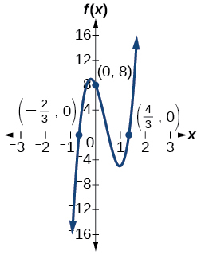

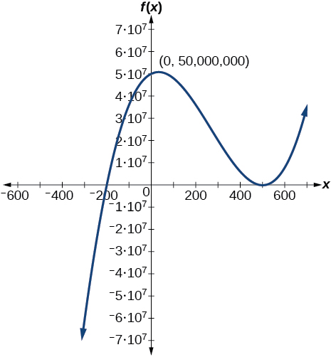

<math xmlns="http://www.w3.org/1998/Math/MathML"> <mrow> <mi>f</mi><mo stretchy="false">(</mo><mi>x</mi><mo stretchy="false">)</mo><mo>=</mo><msup> <mrow> <mo stretchy="false">(</mo><mi>x</mi><mo>−</mo><mn>500</mn><mo stretchy="false">)</mo> </mrow> <mn>2</mn> </msup> <mo stretchy="false">(</mo><mi>x</mi><mo>+</mo><mn>200</mn><mo stretchy="false">)</mo> </mrow> </math>

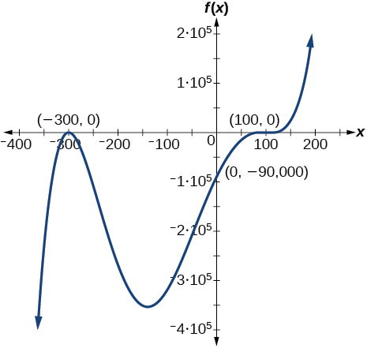

#### Real-World Applications

For the following exercises, write the polynomial function that models the given situation.

A rectangle has a length of 10 units and a width of 8 units. Squares of<math xmlns="http://www.w3.org/1998/Math/MathML"> <mrow> <mtext> </mtext><mi>x</mi><mtext> </mtext> </mrow> </math>

 by<math xmlns="http://www.w3.org/1998/Math/MathML"> <mrow> <mtext> </mtext><mi>x</mi><mtext> </mtext> </mrow> </math>

 units are cut out of each corner, and then the sides are folded up to create an open box. Express the volume of the box as a polynomial function in terms of<math xmlns="http://www.w3.org/1998/Math/MathML"> <mrow> <mtext> </mtext><mi>x</mi><mo>.</mo> </mrow> </math>

<math xmlns="http://www.w3.org/1998/Math/MathML"> <mrow> <mi>f</mi><mo stretchy="false">(</mo><mi>x</mi><mo stretchy="false">)</mo><mo>=</mo><mn>4</mn><msup> <mi>x</mi> <mn>3</mn> </msup> <mo>−</mo><mn>36</mn><msup> <mi>x</mi> <mn>2</mn> </msup> <mo>+</mo><mn>80</mn><mi>x</mi> </mrow> </math>

Consider the same rectangle of the preceding problem. Squares of<math xmlns="http://www.w3.org/1998/Math/MathML"> <mrow> <mtext> </mtext><mn>2</mn><mi>x</mi><mtext> </mtext> </mrow> </math>

 by<math xmlns="http://www.w3.org/1998/Math/MathML"> <mrow> <mtext> </mtext><mn>2</mn><mi>x</mi><mtext> </mtext> </mrow> </math>

 units are cut out of each corner. Express the volume of the box as a polynomial in terms of<math xmlns="http://www.w3.org/1998/Math/MathML"> <mrow> <mtext> </mtext><mi>x</mi><mo>.</mo> </mrow> </math>

A square has sides of 12 units. Squares<math xmlns="http://www.w3.org/1998/Math/MathML"> <mrow> <mtext> </mtext><mi>x</mi><mtext> </mtext><mo>+</mo><mn>1</mn><mtext> </mtext> </mrow> </math>

 by<math xmlns="http://www.w3.org/1998/Math/MathML"> <mrow> <mtext> </mtext><mi>x</mi><mtext> </mtext><mo>+</mo><mn>1</mn><mtext> </mtext> </mrow> </math>

 units are cut out of each corner, and then the sides are folded up to create an open box. Express the volume of the box as a function in terms of<math xmlns="http://www.w3.org/1998/Math/MathML"> <mrow> <mtext> </mtext><mi>x</mi><mo>.</mo> </mrow> </math>

<math xmlns="http://www.w3.org/1998/Math/MathML"> <mrow> <mi>f</mi><mo stretchy="false">(</mo><mi>x</mi><mo stretchy="false">)</mo><mo>=</mo><mn>4</mn><msup> <mi>x</mi> <mn>3</mn> </msup> <mo>−</mo><mn>36</mn><msup> <mi>x</mi> <mn>2</mn> </msup> <mo>+</mo><mn>60</mn><mi>x</mi><mo>+</mo><mn>100</mn> </mrow> </math>

A cylinder has a radius of<math xmlns="http://www.w3.org/1998/Math/MathML"> <mrow> <mtext> </mtext><mi>x</mi><mo>+</mo><mn>2</mn><mtext> </mtext> </mrow> </math>

 units and a height of 3 units greater. Express the volume of the cylinder as a polynomial function.

A right circular cone has a radius of<math xmlns="http://www.w3.org/1998/Math/MathML"> <mrow> <mtext> </mtext><mn>3</mn><mi>x</mi><mo>+</mo><mn>6</mn><mtext> </mtext> </mrow> </math>

 and a height 3 units less. Express the volume of the cone as a polynomial function. The volume of a cone is<math xmlns="http://www.w3.org/1998/Math/MathML"> <mrow> <mtext> </mtext><mi>V</mi><mo>=</mo><mfrac> <mn>1</mn> <mn>3</mn> </mfrac> <mi>π</mi><msup> <mi>r</mi> <mn>2</mn> </msup> <mi>h</mi><mtext> </mtext> </mrow> </math>

 for radius<math xmlns="http://www.w3.org/1998/Math/MathML"> <mrow> <mtext> </mtext><mi>r</mi><mtext> </mtext> </mrow> </math>

 and height<math xmlns="http://www.w3.org/1998/Math/MathML"> <mrow> <mtext> </mtext><mi>h</mi><mo>.</mo> </mrow> </math>

<math xmlns="http://www.w3.org/1998/Math/MathML"> <mrow> <mi>f</mi><mo stretchy="false">(</mo><mi>x</mi><mo stretchy="false">)</mo><mo>=</mo><mi>π</mi><mo stretchy="false">(</mo><mn>9</mn><msup> <mi>x</mi> <mn>3</mn> </msup> <mo>+</mo><mn>45</mn><msup> <mi>x</mi> <mn>2</mn> </msup> <mo>+</mo><mn>72</mn><mi>x</mi><mo>+</mo><mn>36</mn><mo stretchy="false">)</mo> </mrow> </math>

### Glossary
{: data-type="glossary-title"}

global maximum
: highest turning point on a graph;
  <math xmlns="http://www.w3.org/1998/Math/MathML"> <mrow> <mtext> </mtext><mi>f</mi><mo stretchy="false">(</mo><mi>a</mi><mo stretchy="false">)</mo><mtext> </mtext> </mrow> </math>
  
  where
  <math xmlns="http://www.w3.org/1998/Math/MathML"> <mrow> <mtext> </mtext><mi>f</mi><mo stretchy="false">(</mo><mi>a</mi><mo stretchy="false">)</mo><mo>≥</mo><mi>f</mi><mo stretchy="false">(</mo><mi>x</mi><mo stretchy="false">)</mo><mtext> </mtext> </mrow> </math>
  
  for all
  <math xmlns="http://www.w3.org/1998/Math/MathML"> <mrow> <mtext> </mtext><mi>x</mi><mo>.</mo> </mrow> </math>
^

global minimum
: lowest turning point on a graph;
  <math xmlns="http://www.w3.org/1998/Math/MathML"> <mrow> <mtext> </mtext><mi>f</mi><mo stretchy="false">(</mo><mi>a</mi><mo stretchy="false">)</mo><mtext> </mtext> </mrow> </math>
  
  where
  <math xmlns="http://www.w3.org/1998/Math/MathML"> <mrow> <mtext> </mtext><mi>f</mi><mo stretchy="false">(</mo><mi>a</mi><mo stretchy="false">)</mo><mo>≤</mo><mi>f</mi><mo stretchy="false">(</mo><mi>x</mi><mo stretchy="false">)</mo><mtext> </mtext> </mrow> </math>
  
  for all
  <math xmlns="http://www.w3.org/1998/Math/MathML"> <mrow> <mtext> </mtext><mi>x</mi><mo>.</mo> </mrow> </math>
^

Intermediate Value Theorem
: for two numbers
  <math xmlns="http://www.w3.org/1998/Math/MathML"> <mrow> <mtext> </mtext><mi>a</mi><mtext> </mtext> </mrow> </math>
  
  and
  <math xmlns="http://www.w3.org/1998/Math/MathML"> <mrow> <mtext> </mtext><mi>b</mi><mtext> </mtext> </mrow> </math>
  
  in the domain of
  <math xmlns="http://www.w3.org/1998/Math/MathML"> <mrow> <mtext> </mtext><mi>f</mi><mo>,</mo><mtext> </mtext> </mrow> </math>
  
  if
  <math xmlns="http://www.w3.org/1998/Math/MathML"> <mrow> <mtext> </mtext><mi>a</mi><mo>&lt;</mo><mi>b</mi><mtext> </mtext> </mrow> </math>
  
  and
  <math xmlns="http://www.w3.org/1998/Math/MathML"> <mrow> <mtext> </mtext><mi>f</mi><mrow><mo>(</mo> <mi>a</mi> <mo>)</mo></mrow><mo>≠</mo><mi>f</mi><mrow><mo>(</mo> <mi>b</mi> <mo>)</mo></mrow><mo>,</mo><mtext> </mtext> </mrow> </math>
  
  then the function
  <math xmlns="http://www.w3.org/1998/Math/MathML"> <mrow> <mtext> </mtext><mi>f</mi><mtext> </mtext> </mrow> </math>
  
  takes on every value between
  <math xmlns="http://www.w3.org/1998/Math/MathML"> <mrow> <mtext> </mtext><mi>f</mi><mrow><mo>(</mo> <mi>a</mi> <mo>)</mo></mrow><mtext> </mtext> </mrow> </math>
  
  and
  <math xmlns="http://www.w3.org/1998/Math/MathML"> <mrow> <mtext> </mtext><mi>f</mi><mrow><mo>(</mo> <mi>b</mi> <mo>)</mo></mrow></mrow> </math>
  
  ; specifically, when a polynomial function changes from a negative value to a positive value, the function must cross the
  <math xmlns="http://www.w3.org/1998/Math/MathML"> <mrow> <mtext> </mtext><mi>x</mi><mtext>-</mtext> </mrow> </math>
  
  axis
^

multiplicity
: the number of times a given factor appears in the factored form of the equation of a polynomial; if a polynomial contains a factor of the form
  <math xmlns="http://www.w3.org/1998/Math/MathML"> <mrow> <mtext> </mtext><msup> <mrow> <mo stretchy="false">(</mo><mi>x</mi><mo>−</mo><mi>h</mi><mo stretchy="false">)</mo></mrow> <mi>p</mi> </msup> </mrow> </math>
  
  ,
  <math xmlns="http://www.w3.org/1998/Math/MathML"> <mrow> <mtext> </mtext><mi>x</mi><mo>=</mo><mi>h</mi><mtext> </mtext> </mrow> </math>
  
  is a zero of multiplicity
  <math xmlns="http://www.w3.org/1998/Math/MathML"> <mrow> <mtext> </mtext><mi>p</mi><mo>.</mo> </mrow> </math>

[1]: http://openstaxcollege.org/l/ivt
