

In this section, you will:
* Use long division to divide polynomials.
* Use synthetic division to divide polynomials.

 "){: #Figure_03_05_001}

The exterior of the Lincoln Memorial in Washington, D.C., is a large rectangular solid with length 61.5 meters (m), width 40 m, and height 30 m.[1](#footnote1){: data-type="footnote-link"} We can easily find the volume using elementary geometry.

<math xmlns="http://www.w3.org/1998/Math/MathML" display="block"> <mrow> <mtable> <mtr rowalign="center"> <mtd columnalign="right" rowalign="center"><mi>V</mi></mtd> <mtd rowalign="center"><mo>=</mo></mtd> <mtd columnalign="left"><mrow><mi>l</mi><mo>⋅</mo><mi>w</mi><mo>⋅</mo><mi>h</mi></mrow></mtd> </mtr> <mtr> <mtd rowalign="center" /> <mtd rowalign="center"><mo>=</mo></mtd> <mtd rowalign="center" columnalign="left"><mrow><mn>61.5</mn><mo>⋅</mo><mn>40</mn><mo>⋅</mo><mn>30</mn></mrow></mtd> </mtr> <mtr> <mtd rowalign="center" /> <mtd rowalign="center"><mo>=</mo></mtd> <mtd rowalign="center" columnalign="left"><mrow><mn>73,800</mn></mrow></mtd> </mtr> </mtable></mrow> </math>

So the volume is 73,800 cubic meters<math xmlns="http://www.w3.org/1998/Math/MathML"> <mrow> <mtext> </mtext><mrow><mo>(</mo> <mrow> <mtext>m</mtext><mo>³</mo> </mrow> <mo>)</mo></mrow><mo>.</mo><mtext> </mtext> </mrow> </math>

 Suppose we knew the volume, length, and width. We could divide to find the height.

<math xmlns="http://www.w3.org/1998/Math/MathML" display="block"> <mrow> <mtable> <mtr rowalign="center"> <mtd rowalign="center" columnalign="right"><mi>h</mi></mtd> <mtd rowalign="center"><mo>=</mo></mtd> <mtd columnalign="left" rowalign="center"><mrow><mfrac><mi>V</mi><mrow><mi>l</mi><mo>⋅</mo><mi>w</mi></mrow></mfrac></mrow></mtd> </mtr> <mtr rowalign="center"> <mtd rowalign="center" /> <mtd rowalign="center"><mo>=</mo></mtd> <mtd rowalign="center" columnalign="left"><mrow><mfrac><mrow><mn>73,800</mn></mrow><mrow><mn>61.5</mn><mo>⋅</mo><mn>40</mn></mrow></mfrac></mrow></mtd> </mtr> <mtr rowalign="center"> <mtd rowalign="center" /> <mtd rowalign="center"><mo>=</mo></mtd> <mtd columnalign="left" rowalign="center"><mrow><mn>30</mn></mrow></mtd> </mtr> </mtable></mrow> </math>

As we can confirm from the dimensions above, the height is 30 m. We can use similar methods to find any of the missing dimensions. We can also use the same method if any, or all, of the measurements contain variable expressions. For example, suppose the volume of a rectangular solid is given by the polynomial<math xmlns="http://www.w3.org/1998/Math/MathML"> <mrow> <mtext> </mtext><mn>3</mn><msup> <mi>x</mi> <mn>4</mn> </msup> <mo>−</mo><mn>3</mn><msup> <mi>x</mi> <mn>3</mn> </msup> <mo>−</mo><mn>33</mn><msup> <mi>x</mi> <mn>2</mn> </msup> <mo>+</mo><mn>54</mn><mi>x</mi><mo>.</mo><mtext> </mtext> </mrow> </math>

 The length of the solid is given by<math xmlns="http://www.w3.org/1998/Math/MathML"> <mrow> <mtext> </mtext><mn>3</mn><mi>x</mi><mo>;</mo><mtext> </mtext> </mrow> </math>

 the width is given by<math xmlns="http://www.w3.org/1998/Math/MathML"> <mrow> <mtext> </mtext><mi>x</mi><mo>−</mo><mn>2.</mn><mtext> </mtext> </mrow> </math>

 To find the height of the solid, we can use polynomial division, which is the focus of this section.

### Using Long Division to Divide Polynomials

We are familiar with the **long division**{: data-type="term" .no-emphasis} algorithm for ordinary arithmetic. We begin by dividing into the digits of the dividend that have the greatest place value. We divide, multiply, subtract, include the digit in the next place value position, and repeat. For example, let’s divide 178 by 3 using long division.

  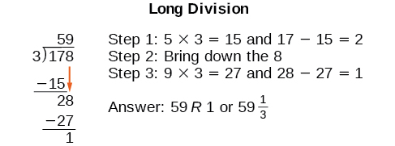  Another way to look at the solution is as a sum of parts. This should look familiar, since it is the same method used to check division in elementary arithmetic.

<math xmlns="http://www.w3.org/1998/Math/MathML" display="block"> <mrow> <mtable> <mtr rowalign="center"> <mtd rowalign="center" columnalign="right"><mrow><mtext>dividend</mtext></mrow></mtd> <mtd rowalign="center"><mo>=</mo></mtd> <mtd rowalign="center" columnalign="left"><mrow><mo stretchy="false">(</mo><mtext>divisor</mtext><mo>⋅</mo><mtext>quotient) + remainder</mtext></mrow></mtd> </mtr> <mtr rowalign="center"> <mtd rowalign="center" columnalign="right"><mrow><mn>178</mn></mrow></mtd> <mtd rowalign="center"><mo>=</mo></mtd> <mtd rowalign="center" columnalign="left"><mrow><mo stretchy="false">(</mo><mn>3</mn><mo>⋅</mo><mn>59</mn><mo stretchy="false">)</mo><mo>+</mo><mn>1</mn></mrow></mtd> </mtr> <mtr rowalign="center"> <mtd rowalign="center" /> <mtd rowalign="center"><mo>=</mo></mtd> <mtd columnalign="left" rowalign="center"><mrow><mn>177</mn><mo>+</mo><mn>1</mn></mrow></mtd> </mtr> <mtr rowalign="center"> <mtd rowalign="center" /> <mtd rowalign="center"><mo>=</mo></mtd> <mtd rowalign="center" columnalign="left"><mrow><mn>178</mn></mrow></mtd> </mtr> </mtable></mrow> </math>

We call this the <strong>Division Algorithm </strong>and will discuss it more formally after looking at an example.

Division of polynomials that contain more than one term has similarities to long division of whole numbers. We can write a polynomial dividend as the product of the divisor and the quotient added to the remainder. The terms of the polynomial division correspond to the digits (and place values) of the whole number division. This method allows us to divide two polynomials. For example, if we were to divide<math xmlns="http://www.w3.org/1998/Math/MathML"> <mrow> <mtext> </mtext><mn>2</mn><msup> <mi>x</mi> <mn>3</mn> </msup> <mo>−</mo><mn>3</mn><msup> <mi>x</mi> <mn>2</mn> </msup> <mo>+</mo><mn>4</mn><mi>x</mi><mo>+</mo><mn>5</mn><mtext> </mtext> </mrow> </math>

 by<math xmlns="http://www.w3.org/1998/Math/MathML"> <mrow> <mtext> </mtext><mi>x</mi><mo>+</mo><mn>2</mn><mtext> </mtext> </mrow> </math>

 using the long division algorithm, it would look like this:

  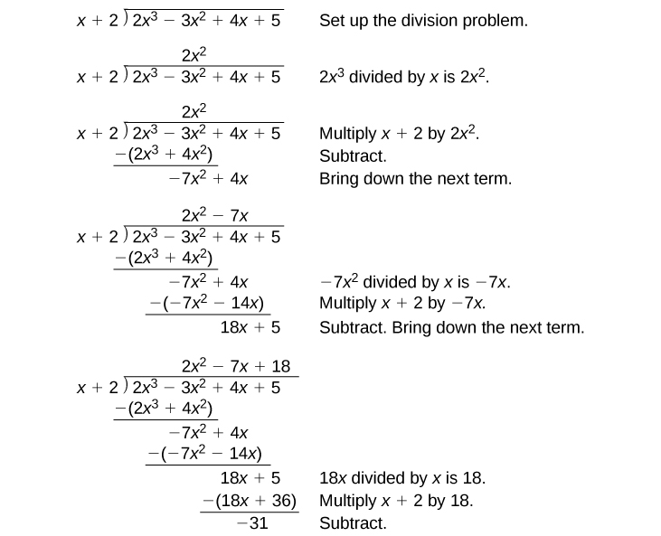  We have found

<math xmlns="http://www.w3.org/1998/Math/MathML" display="block"> <mrow> <mfrac> <mrow> <mn>2</mn><msup> <mi>x</mi> <mn>3</mn> </msup> <mo>−</mo><mn>3</mn><msup> <mi>x</mi> <mn>2</mn> </msup> <mo>+</mo><mn>4</mn><mi>x</mi><mo>+</mo><mn>5</mn> </mrow> <mrow> <mi>x</mi><mo>+</mo><mn>2</mn> </mrow> </mfrac> <mo>=</mo><mn>2</mn><msup> <mi>x</mi> <mn>2</mn> </msup> <mo>−</mo><mn>7</mn><mi>x</mi><mo>+</mo><mn>18</mn><mo>−</mo><mfrac> <mrow> <mn>31</mn> </mrow> <mrow> <mi>x</mi><mo>+</mo><mn>2</mn> </mrow> </mfrac> </mrow> </math>

or

<math xmlns="http://www.w3.org/1998/Math/MathML"> <mrow> <mfrac> <mrow> <mn>2</mn><msup> <mi>x</mi> <mn>3</mn> </msup> <mo>−</mo><mn>3</mn><msup> <mi>x</mi> <mn>2</mn> </msup> <mo>+</mo><mn>4</mn><mi>x</mi><mo>+</mo><mn>5</mn> </mrow> <mrow> <mi>x</mi><mo>+</mo><mn>2</mn> </mrow> </mfrac> <mo>=</mo><mo stretchy="false">(</mo><mi>x</mi><mo>+</mo><mn>2</mn><mo stretchy="false">)</mo><mo stretchy="false">(</mo><mn>2</mn><msup> <mi>x</mi> <mn>2</mn> </msup> <mo>−</mo><mn>7</mn><mi>x</mi><mo>+</mo><mn>18</mn><mo stretchy="false">)</mo><mo>−</mo><mn>31</mn> </mrow> </math>

We can identify the **dividend**{: data-type="term" .no-emphasis}, the **divisor**{: data-type="term" .no-emphasis}, the **quotient**{: data-type="term" .no-emphasis}, and the **remainder**{: data-type="term" .no-emphasis}.

  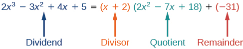  Writing the result in this manner illustrates the Division Algorithm.

The Division Algorithm

The **Division Algorithm**{: data-type="term"} states that, given a polynomial dividend<math xmlns="http://www.w3.org/1998/Math/MathML"> <mrow> <mtext> </mtext><mi>f</mi><mo stretchy="false">(</mo><mi>x</mi><mo stretchy="false">)</mo><mtext> </mtext> </mrow> </math>

 and a non-zero polynomial divisor<math xmlns="http://www.w3.org/1998/Math/MathML"> <mrow> <mtext> </mtext><mi>d</mi><mo stretchy="false">(</mo><mi>x</mi><mo stretchy="false">)</mo><mtext> </mtext> </mrow> </math>

 where the degree of<math xmlns="http://www.w3.org/1998/Math/MathML"> <mrow> <mtext> </mtext><mi>d</mi><mo stretchy="false">(</mo><mi>x</mi><mo stretchy="false">)</mo><mtext> </mtext> </mrow> </math>

 is less than or equal to the degree of<math xmlns="http://www.w3.org/1998/Math/MathML"> <mrow> <mtext> </mtext><mi>f</mi><mo stretchy="false">(</mo><mi>x</mi><mo stretchy="false">)</mo></mrow> </math>

, there exist unique polynomials<math xmlns="http://www.w3.org/1998/Math/MathML"> <mrow> <mtext> </mtext><mi>q</mi><mo stretchy="false">(</mo><mi>x</mi><mo stretchy="false">)</mo><mtext> </mtext> </mrow> </math>

 and<math xmlns="http://www.w3.org/1998/Math/MathML"> <mrow> <mtext> </mtext><mi>r</mi><mo stretchy="false">(</mo><mi>x</mi><mo stretchy="false">)</mo><mtext> </mtext> </mrow> </math>

 such that

<math xmlns="http://www.w3.org/1998/Math/MathML"> <mrow> <mi>f</mi><mo stretchy="false">(</mo><mi>x</mi><mo stretchy="false">)</mo><mo>=</mo><mi>d</mi><mo stretchy="false">(</mo><mi>x</mi><mo stretchy="false">)</mo><mi>q</mi><mo stretchy="false">(</mo><mi>x</mi><mo stretchy="false">)</mo><mo>+</mo><mi>r</mi><mo stretchy="false">(</mo><mi>x</mi><mo stretchy="false">)</mo> </mrow> </math>

<math xmlns="http://www.w3.org/1998/Math/MathML"> <mrow> <mi>q</mi><mo stretchy="false">(</mo><mi>x</mi><mo stretchy="false">)</mo><mtext> </mtext> </mrow> </math>

 is the quotient and<math xmlns="http://www.w3.org/1998/Math/MathML"> <mrow> <mtext> </mtext><mi>r</mi><mo stretchy="false">(</mo><mi>x</mi><mo stretchy="false">)</mo><mtext> </mtext> </mrow> </math>

 is the remainder. The remainder is either equal to zero or has degree strictly less than<math xmlns="http://www.w3.org/1998/Math/MathML"> <mrow> <mtext> </mtext><mi>d</mi><mo stretchy="false">(</mo><mi>x</mi><mo stretchy="false">)</mo><mo>.</mo><mtext> </mtext> </mrow> </math>

If<math xmlns="http://www.w3.org/1998/Math/MathML"> <mrow> <mtext> </mtext><mi>r</mi><mo stretchy="false">(</mo><mi>x</mi><mo stretchy="false">)</mo><mo>=</mo><mn>0</mn><mo>,</mo><mtext> </mtext> </mrow> </math>

 then<math xmlns="http://www.w3.org/1998/Math/MathML"> <mrow> <mtext> </mtext><mi>d</mi><mo stretchy="false">(</mo><mi>x</mi><mo stretchy="false">)</mo><mtext> </mtext> </mrow> </math>

 divides evenly into<math xmlns="http://www.w3.org/1998/Math/MathML"> <mrow> <mtext> </mtext><mi>f</mi><mo stretchy="false">(</mo><mi>x</mi><mo stretchy="false">)</mo><mo>.</mo><mtext> </mtext> </mrow> </math>

 This means that, in this case, both<math xmlns="http://www.w3.org/1998/Math/MathML"> <mrow> <mtext> </mtext><mi>d</mi><mo stretchy="false">(</mo><mi>x</mi><mo stretchy="false">)</mo><mtext> </mtext> </mrow> </math>

 and<math xmlns="http://www.w3.org/1998/Math/MathML"> <mrow> <mtext> </mtext><mi>q</mi><mo stretchy="false">(</mo><mi>x</mi><mo stretchy="false">)</mo><mtext> </mtext> </mrow> </math>

 are factors of<math xmlns="http://www.w3.org/1998/Math/MathML"> <mrow> <mtext> </mtext><mi>f</mi><mo stretchy="false">(</mo><mi>x</mi><mo stretchy="false">)</mo><mo>.</mo><mtext> </mtext> </mrow> </math>

**Given a polynomial and a binomial, use long division to divide the polynomial by the binomial.**

1.  Set up the division problem.
2.  Determine the first term of the quotient by dividing the leading term of the dividend by the leading term of the divisor.
3.  Multiply the answer by the divisor and write it below the like terms of the dividend.
4.  Subtract the bottom **binomial**{: data-type="term" .no-emphasis} from the top binomial.
5.  Bring down the next term of the dividend.
6.  Repeat steps 2–5 until reaching the last term of the dividend.
7.  If the remainder is non-zero, express as a fraction using the divisor as the denominator.
{: type="1"}

Using Long Division to Divide a Second-Degree Polynomial

Divide<math xmlns="http://www.w3.org/1998/Math/MathML"> <mrow> <mtext> </mtext><mn>5</mn><msup> <mi>x</mi> <mn>2</mn> </msup> <mo>+</mo><mn>3</mn><mi>x</mi><mo>−</mo><mn>2</mn><mtext> </mtext> </mrow> </math>

 by<math xmlns="http://www.w3.org/1998/Math/MathML"> <mrow> <mtext> </mtext><mi>x</mi><mo>+</mo><mn>1.</mn> </mrow> </math>

  
The quotient is<math xmlns="http://www.w3.org/1998/Math/MathML"> <mrow> <mtext> </mtext><mn>5</mn><mi>x</mi><mo>−</mo><mn>2.</mn><mtext> </mtext> </mrow> </math>

 The remainder is 0. We write the result as

<math xmlns="http://www.w3.org/1998/Math/MathML"> <mrow> <mfrac> <mrow> <mn>5</mn><msup> <mi>x</mi> <mn>2</mn> </msup> <mo>+</mo><mn>3</mn><mi>x</mi><mo>−</mo><mn>2</mn> </mrow> <mrow> <mi>x</mi><mo>+</mo><mn>1</mn> </mrow> </mfrac> <mo>=</mo><mn>5</mn><mi>x</mi><mo>−</mo><mn>2</mn> </mrow> </math>

or

<math xmlns="http://www.w3.org/1998/Math/MathML"> <mrow> <mn>5</mn><msup> <mi>x</mi> <mn>2</mn> </msup> <mo>+</mo><mn>3</mn><mi>x</mi><mo>−</mo><mn>2</mn><mo>=</mo><mrow><mo>(</mo> <mrow> <mi>x</mi><mo>+</mo><mn>1</mn> </mrow> <mo>)</mo></mrow><mrow><mo>(</mo> <mrow> <mn>5</mn><mi>x</mi><mo>−</mo><mn>2</mn> </mrow> <mo>)</mo></mrow> </mrow> </math>

Analysis

This division problem had a remainder of 0. This tells us that the dividend is divided evenly by the divisor, and that the divisor is a factor of the dividend.

Using Long Division to Divide a Third-Degree Polynomial

Divide<math xmlns="http://www.w3.org/1998/Math/MathML"> <mrow> <mtext> </mtext><mn>6</mn><msup> <mi>x</mi> <mn>3</mn> </msup> <mo>+</mo><mn>11</mn><msup> <mi>x</mi> <mn>2</mn> </msup> <mo>−</mo><mn>31</mn><mi>x</mi><mo>+</mo><mn>15</mn><mtext> </mtext> </mrow> </math>

 by<math xmlns="http://www.w3.org/1998/Math/MathML"> <mrow> <mtext> </mtext><mn>3</mn><mi>x</mi><mo>−</mo><mn>2.</mn><mtext> </mtext> </mrow> </math>

 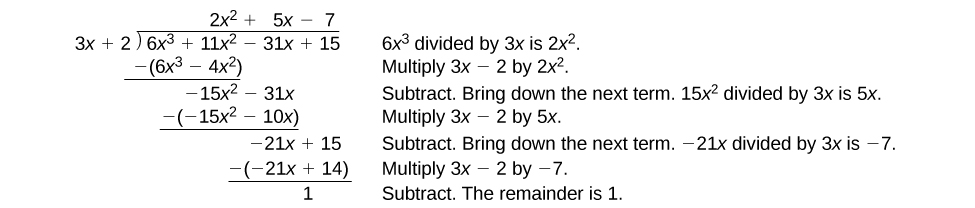 
There is a remainder of 1. We can express the result as:

<math xmlns="http://www.w3.org/1998/Math/MathML" display="block"> <mrow> <mfrac> <mrow> <mn>6</mn><msup> <mi>x</mi> <mn>3</mn> </msup> <mo>+</mo><mn>11</mn><msup> <mi>x</mi> <mn>2</mn> </msup> <mo>−</mo><mn>31</mn><mi>x</mi><mo>+</mo><mn>15</mn> </mrow> <mrow> <mn>3</mn><mi>x</mi><mo>−</mo><mn>2</mn> </mrow> </mfrac> <mo>=</mo><mn>2</mn><msup> <mi>x</mi> <mn>2</mn> </msup> <mo>+</mo><mn>5</mn><mi>x</mi><mo>−</mo><mn>7</mn><mo>+</mo><mfrac> <mn>1</mn> <mrow> <mn>3</mn><mi>x</mi><mo>−</mo><mn>2</mn> </mrow> </mfrac> </mrow> </math>

Analysis

We can check our work by using the Division Algorithm to rewrite the solution. Then multiply.

<math xmlns="http://www.w3.org/1998/Math/MathML"> <mrow> <mo stretchy="false">(</mo><mn>3</mn><mi>x</mi><mo>−</mo><mn>2</mn><mo stretchy="false">)</mo><mo stretchy="false">(</mo><mn>2</mn><msup> <mi>x</mi> <mn>2</mn> </msup> <mo>+</mo><mn>5</mn><mi>x</mi><mo>−</mo><mn>7</mn><mo stretchy="false">)</mo><mo>+</mo><mn>1</mn><mo>=</mo><mn>6</mn><msup> <mi>x</mi> <mn>3</mn> </msup> <mo>+</mo><mn>11</mn><msup> <mi>x</mi> <mn>2</mn> </msup> <mo>−</mo><mn>31</mn><mi>x</mi><mo>+</mo><mn>15</mn> </mrow> </math>

Notice, as we write our result,

* the dividend is
  <math xmlns="http://www.w3.org/1998/Math/MathML"> <mrow> <mtext> </mtext><mn>6</mn><msup> <mi>x</mi> <mn>3</mn> </msup> <mo>+</mo><mn>11</mn><msup> <mi>x</mi> <mn>2</mn> </msup> <mo>−</mo><mn>31</mn><mi>x</mi><mo>+</mo><mn>15</mn><mtext> </mtext> </mrow> </math>

* the divisor is
  <math xmlns="http://www.w3.org/1998/Math/MathML"> <mrow> <mtext> </mtext><mn>3</mn><mi>x</mi><mo>−</mo><mn>2</mn><mtext> </mtext> </mrow> </math>

* the quotient is
  <math xmlns="http://www.w3.org/1998/Math/MathML"> <mrow> <mtext> </mtext><mn>2</mn><msup> <mi>x</mi> <mn>2</mn> </msup> <mo>+</mo><mn>5</mn><mi>x</mi><mo>−</mo><mn>7</mn><mtext> </mtext> </mrow> </math>

* the remainder is
  <math xmlns="http://www.w3.org/1998/Math/MathML"> <mrow> <mtext> </mtext><mn>1</mn><mtext> </mtext> </mrow> </math>

Divide<math xmlns="http://www.w3.org/1998/Math/MathML"> <mrow> <mtext> </mtext><mn>16</mn><msup> <mi>x</mi> <mn>3</mn> </msup> <mo>−</mo><mn>12</mn><msup> <mi>x</mi> <mn>2</mn> </msup> <mo>+</mo><mn>20</mn><mi>x</mi><mo>−</mo><mn>3</mn><mtext> </mtext> </mrow> </math>

 by<math xmlns="http://www.w3.org/1998/Math/MathML"> <mrow> <mtext> </mtext><mn>4</mn><mi>x</mi><mo>+</mo><mn>5.</mn><mtext> </mtext> </mrow> </math>

<math xmlns="http://www.w3.org/1998/Math/MathML"> <mrow> <mn>4</mn><msup> <mi>x</mi> <mn>2</mn> </msup> <mo>−</mo><mn>8</mn><mi>x</mi><mo>+</mo><mn>15</mn><mo>−</mo><mfrac> <mrow> <mn>78</mn> </mrow> <mrow> <mn>4</mn><mi>x</mi><mo>+</mo><mn>5</mn> </mrow> </mfrac> </mrow> </math>

### Using Synthetic Division to Divide Polynomials

As we’ve seen, long division of polynomials can involve many steps and be quite cumbersome. **Synthetic division** is a shorthand method of dividing polynomials for the special case of dividing by a linear factor whose leading coefficient is 1.

To illustrate the process, recall the example at the beginning of the section.

Divide<math xmlns="http://www.w3.org/1998/Math/MathML"> <mrow> <mtext> </mtext><mn>2</mn><msup> <mi>x</mi> <mn>3</mn> </msup> <mo>−</mo><mn>3</mn><msup> <mi>x</mi> <mn>2</mn> </msup> <mo>+</mo><mn>4</mn><mi>x</mi><mo>+</mo><mn>5</mn><mtext> </mtext> </mrow> </math>

 by<math xmlns="http://www.w3.org/1998/Math/MathML"> <mrow> <mtext> </mtext><mi>x</mi><mo>+</mo><mn>2</mn><mtext> </mtext> </mrow> </math>

 using the long division algorithm.

The final form of the process looked like this:

  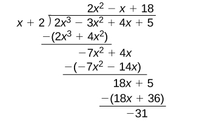  There is a lot of repetition in the table. If we don’t write the variables but, instead, line up their coefficients in columns under the division sign and also eliminate the partial products, we already have a simpler version of the entire problem.

    Synthetic division carries this simplification even a few more steps. Collapse the table by moving each of the rows up to fill any vacant spots. Also, instead of dividing by 2, as we would in division of whole numbers, then multiplying and subtracting the middle product, we change the sign of the “divisor” to –2, multiply and add. The process starts by bringing down the leading coefficient.

    We then multiply it by the “divisor” and add, repeating this process column by column, until there are no entries left. The bottom row represents the coefficients of the quotient; the last entry of the bottom row is the remainder. In this case, the quotient is<math xmlns="http://www.w3.org/1998/Math/MathML"> <mrow> <mtext> </mtext><mn>2</mn><msup> <mi>x</mi> <mn>2</mn> </msup> <mo>–</mo><mn>7</mn><mi>x</mi><mo>+</mo><mn>18</mn><mtext> </mtext></mrow> </math>

and the remainder is<math xmlns="http://www.w3.org/1998/Math/MathML"> <mrow> <mtext> </mtext><mn>–31.</mn><mtext> </mtext> </mrow> </math>

 The process will be made more clear in [\[link\]](#Example_03_05_03).

Synthetic Division

Synthetic division is a shortcut that can be used when the divisor is a binomial in the form<math xmlns="http://www.w3.org/1998/Math/MathML"> <mrow> <mtext> </mtext><mi>x</mi><mo>−</mo><mi>k</mi><mtext> </mtext> </mrow> </math>

where<math xmlns="http://www.w3.org/1998/Math/MathML"> <mrow> <mtext> </mtext><mi>k</mi><mtext> </mtext> </mrow> </math>

is a real number. In **synthetic division**{: data-type="term"}, only the coefficients are used in the division process.

**Given two polynomials, use synthetic division to divide.**

1.  Write
    <math xmlns="http://www.w3.org/1998/Math/MathML"> <mrow> <mtext> </mtext><mi>k</mi><mtext> </mtext> </mrow> </math>
    
    for the divisor.
2.  Write the coefficients of the dividend.
3.  Bring the lead coefficient down.
4.  Multiply the lead coefficient by
    <math xmlns="http://www.w3.org/1998/Math/MathML"> <mrow> <mtext> </mtext><mi>k</mi><mo>.</mo><mtext> </mtext> </mrow> </math>
    
    Write the product in the next column.
5.  Add the terms of the second column.
6.  Multiply the result by
    <math xmlns="http://www.w3.org/1998/Math/MathML"> <mrow> <mtext> </mtext><mi>k</mi><mo>.</mo><mtext> </mtext> </mrow> </math>
    
    Write the product in the next column.
7.  Repeat steps 5 and 6 for the remaining columns.
8.  Use the bottom numbers to write the quotient. The number in the last column is the remainder and has degree 0, the next number from the right has degree 1, the next number from the right has degree 2, and so on.
{: type="1"}

Using Synthetic Division to Divide a Second-Degree Polynomial

Use synthetic division to divide<math xmlns="http://www.w3.org/1998/Math/MathML"> <mrow> <mtext> </mtext><mn>5</mn><msup> <mi>x</mi> <mn>2</mn> </msup> <mo>−</mo><mn>3</mn><mi>x</mi><mo>−</mo><mn>36</mn><mtext> </mtext> </mrow> </math>

 by<math xmlns="http://www.w3.org/1998/Math/MathML"> <mrow> <mtext> </mtext><mi>x</mi><mo>−</mo><mn>3.</mn><mtext> </mtext> </mrow> </math>

Begin by setting up the synthetic division. Write<math xmlns="http://www.w3.org/1998/Math/MathML"> <mrow> <mtext> </mtext><mi>k</mi><mtext> </mtext> </mrow> </math>

 and the coefficients.

  
Bring down the lead coefficient. Multiply the lead coefficient by<math xmlns="http://www.w3.org/1998/Math/MathML"> <mrow> <mtext> </mtext><mi>k</mi><mo>.</mo><mtext> </mtext> </mrow> </math>

  
Continue by adding the numbers in the second column. Multiply the resulting number by<math xmlns="http://www.w3.org/1998/Math/MathML"> <mrow> <mtext> </mtext><mi>k</mi><mo>.</mo><mtext> </mtext> </mrow> </math>

 Write the result in the next column. Then add the numbers in the third column.

  
The result is<math xmlns="http://www.w3.org/1998/Math/MathML"> <mrow> <mtext> </mtext><mn>5</mn><mi>x</mi><mo>+</mo><mn>12.</mn><mtext> </mtext> </mrow> </math>

 The remainder is 0. So<math xmlns="http://www.w3.org/1998/Math/MathML"> <mrow> <mtext> </mtext><mi>x</mi><mo>−</mo><mn>3</mn><mtext> </mtext> </mrow> </math>

 is a factor of the original polynomial.

Analysis

Just as with long division, we can check our work by multiplying the quotient by the divisor and adding the remainder.

<math xmlns="http://www.w3.org/1998/Math/MathML" display="block"> <mrow> <mo stretchy="false">(</mo><mi>x</mi><mo>−</mo><mn>3</mn><mo stretchy="false">)</mo><mo stretchy="false">(</mo><mn>5</mn><mi>x</mi><mo>+</mo><mn>12</mn><mo stretchy="false">)</mo><mo>+</mo><mn>0</mn><mo>=</mo><mn>5</mn><msup> <mi>x</mi> <mn>2</mn> </msup> <mo>−</mo><mn>3</mn><mi>x</mi><mo>−</mo><mn>36</mn> </mrow> </math>

Using Synthetic Division to Divide a Third-Degree Polynomial

Use synthetic division to divide<math xmlns="http://www.w3.org/1998/Math/MathML"> <mrow> <mtext> </mtext><mn>4</mn><msup> <mi>x</mi> <mn>3</mn> </msup> <mo>+</mo><mn>10</mn><msup> <mi>x</mi> <mn>2</mn> </msup> <mo>−</mo><mn>6</mn><mi>x</mi><mo>−</mo><mn>20</mn><mtext> </mtext> </mrow> </math>

 by<math xmlns="http://www.w3.org/1998/Math/MathML"> <mrow> <mtext> </mtext><mi>x</mi><mo>+</mo><mn>2.</mn><mtext> </mtext> </mrow> </math>

The binomial divisor is<math xmlns="http://www.w3.org/1998/Math/MathML"> <mrow> <mtext> </mtext><mi>x</mi><mo>+</mo><mn>2</mn><mtext> </mtext> </mrow> </math>

 so<math xmlns="http://www.w3.org/1998/Math/MathML"> <mrow> <mtext> </mtext><mi>k</mi><mo>=</mo><mn>−2.</mn><mtext> </mtext> </mrow> </math>

 Add each column, multiply the result by –2, and repeat until the last column is reached.

  
The result is<math xmlns="http://www.w3.org/1998/Math/MathML"> <mrow> <mtext> </mtext><mn>4</mn><msup> <mi>x</mi> <mn>2</mn> </msup> <mo>+</mo><mn>2</mn><mi>x</mi><mo>−</mo><mn>10.</mn><mtext> </mtext> </mrow> </math>

 The remainder is 0. Thus,<math xmlns="http://www.w3.org/1998/Math/MathML"> <mrow> <mtext> </mtext><mi>x</mi><mo>+</mo><mn>2</mn><mtext> </mtext> </mrow> </math>

 is a factor of<math xmlns="http://www.w3.org/1998/Math/MathML"> <mrow> <mtext> </mtext><mn>4</mn><msup> <mi>x</mi> <mn>3</mn> </msup> <mo>+</mo><mn>10</mn><msup> <mi>x</mi> <mn>2</mn> </msup> <mo>−</mo><mn>6</mn><mi>x</mi><mo>−</mo><mn>20.</mn><mtext> </mtext> </mrow> </math>

Analysis

The graph of the polynomial function<math xmlns="http://www.w3.org/1998/Math/MathML"> <mrow> <mtext> </mtext><mi>f</mi><mo stretchy="false">(</mo><mi>x</mi><mo stretchy="false">)</mo><mo>=</mo><mn>4</mn><msup> <mi>x</mi> <mn>3</mn> </msup> <mo>+</mo><mn>10</mn><msup> <mi>x</mi> <mn>2</mn> </msup> <mo>−</mo><mn>6</mn><mi>x</mi><mo>−</mo><mn>20</mn><mtext> </mtext> </mrow> </math>

 in [[link]](#Figure_03_05_009) shows a zero at<math xmlns="http://www.w3.org/1998/Math/MathML"> <mrow> <mtext> </mtext><mi>x</mi><mo>=</mo><mi>k</mi><mo>=</mo><mn>−2.</mn><mtext> </mtext> </mrow> </math>

 This confirms that<math xmlns="http://www.w3.org/1998/Math/MathML"> <mrow> <mtext> </mtext><mi>x</mi><mo>+</mo><mn>2</mn><mtext> </mtext> </mrow> </math>

 is a factor of<math xmlns="http://www.w3.org/1998/Math/MathML"> <mrow> <mtext> </mtext><mn>4</mn><msup> <mi>x</mi> <mn>3</mn> </msup> <mo>+</mo><mn>10</mn><msup> <mi>x</mi> <mn>2</mn> </msup> <mo>−</mo><mn>6</mn><mi>x</mi><mo>−</mo><mn>20.</mn><mtext> </mtext> </mrow> </math>

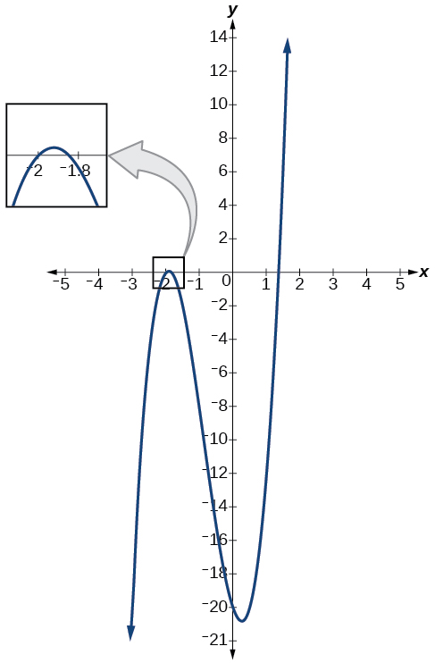{: #Figure_03_05_009}

Using Synthetic Division to Divide a Fourth-Degree Polynomial

Use synthetic division to divide<math xmlns="http://www.w3.org/1998/Math/MathML"> <mrow> <mtext> </mtext><mo>−</mo><mn>9</mn><msup> <mi>x</mi> <mn>4</mn> </msup> <mo>+</mo><mn>10</mn><msup> <mi>x</mi> <mn>3</mn> </msup> <mo>+</mo><mn>7</mn><msup> <mi>x</mi> <mn>2</mn> </msup> <mo>−</mo><mn>6</mn><mtext> </mtext> </mrow> </math>

 by<math xmlns="http://www.w3.org/1998/Math/MathML"> <mrow> <mtext> </mtext><mi>x</mi><mo>−</mo><mn>1.</mn><mtext> </mtext> </mrow> </math>

Notice there is no *x*-term. We will use a zero as the coefficient for that term.* * *
{: data-type="newline" data-count="2"}

  
The result is<math xmlns="http://www.w3.org/1998/Math/MathML"> <mrow> <mtext> </mtext><mo>−</mo><mn>9</mn><msup> <mi>x</mi> <mn>3</mn> </msup> <mo>+</mo><msup> <mi>x</mi> <mn>2</mn> </msup> <mo>+</mo><mn>8</mn><mi>x</mi><mo>+</mo><mn>8</mn><mo>+</mo><mfrac> <mn>2</mn> <mrow> <mi>x</mi><mo>−</mo><mn>1</mn> </mrow> </mfrac> <mo>.</mo> </mrow> </math>

Use synthetic division to divide<math xmlns="http://www.w3.org/1998/Math/MathML"> <mrow> <mtext> </mtext><mn>3</mn><msup> <mi>x</mi> <mn>4</mn> </msup> <mo>+</mo><mn>18</mn><msup> <mi>x</mi> <mn>3</mn> </msup> <mo>−</mo><mn>3</mn><mi>x</mi><mo>+</mo><mn>40</mn><mtext> </mtext> </mrow> </math>

 by<math xmlns="http://www.w3.org/1998/Math/MathML"> <mrow> <mtext> </mtext><mi>x</mi><mo>+</mo><mn>7.</mn> </mrow> </math>

<math xmlns="http://www.w3.org/1998/Math/MathML"> <mrow> <mn>3</mn><msup> <mi>x</mi> <mn>3</mn> </msup> <mo>−</mo><mn>3</mn><msup> <mi>x</mi> <mn>2</mn> </msup> <mo>+</mo><mn>21</mn><mi>x</mi><mo>−</mo><mn>150</mn><mo>+</mo><mfrac> <mrow> <mn>1</mn><mo>,</mo><mn>090</mn> </mrow> <mrow> <mi>x</mi><mo>+</mo><mn>7</mn> </mrow> </mfrac> </mrow> </math>

### Using Polynomial Division to Solve Application Problems

Polynomial division can be used to solve a variety of application problems involving expressions for area and volume. We looked at an application at the beginning of this section. Now we will solve that problem in the following example.

Using Polynomial Division in an Application Problem

The volume of a rectangular solid is given by the polynomial<math xmlns="http://www.w3.org/1998/Math/MathML"> <mrow> <mtext> </mtext><mn>3</mn><msup> <mi>x</mi> <mn>4</mn> </msup> <mo>−</mo><mn>3</mn><msup> <mi>x</mi> <mn>3</mn> </msup> <mo>−</mo><mn>33</mn><msup> <mi>x</mi> <mn>2</mn> </msup> <mo>+</mo><mn>54</mn><mi>x</mi><mo>.</mo><mtext> </mtext> </mrow> </math>

 The length of the solid is given by<math xmlns="http://www.w3.org/1998/Math/MathML"> <mrow> <mtext> </mtext><mn>3</mn><mi>x</mi><mtext> </mtext> </mrow> </math>

 and the width is given by<math xmlns="http://www.w3.org/1998/Math/MathML"> <mrow> <mtext> </mtext><mi>x</mi><mo>−</mo><mn>2.</mn><mtext> </mtext> </mrow> </math>

 Find the height,<math xmlns="http://www.w3.org/1998/Math/MathML"> <mrow> <mtext> </mtext><mi>h</mi><mo>,</mo> </mrow> </math>

of the solid.

There are a few ways to approach this problem. We need to divide the expression for the volume of the solid by the expressions for the length and width. Let us create a sketch as in [[link]](#Figure_03_05_010).

{: #Figure_03_05_010}

We can now write an equation by substituting the known values into the formula for the volume of a rectangular solid.

<math xmlns="http://www.w3.org/1998/Math/MathML" display="block"> <mrow> <mtable> <mtr rowalign="center"> <mtd rowalign="center" columnalign="right"> <mi>V</mi> </mtd> <mtd rowalign="center"> <mo>=</mo> </mtd> <mtd rowalign="center" columnalign="left"> <mrow> <mi>l</mi><mo>⋅</mo><mi>w</mi><mo>⋅</mo><mi>h</mi></mrow> </mtd> </mtr> <mtr rowalign="center"> <mtd rowalign="center" columnalign="right"> <mrow> <mn>3</mn><msup> <mi>x</mi> <mn>4</mn> </msup> <mo>−</mo><mn>3</mn><msup> <mi>x</mi> <mn>3</mn> </msup> <mo>−</mo><mn>33</mn><msup> <mi>x</mi> <mn>2</mn> </msup> <mo>+</mo><mn>54</mn><mi>x</mi></mrow> </mtd> <mtd rowalign="center"> <mo>=</mo> </mtd> <mtd rowalign="center" columnalign="left"> <mrow> <mn>3</mn><mi>x</mi><mo>⋅</mo><mo stretchy="false">(</mo><mi>x</mi><mo>−</mo><mn>2</mn><mo stretchy="false">)</mo><mo>⋅</mo><mi>h</mi></mrow> </mtd> </mtr> </mtable></mrow> </math>

To solve for<math xmlns="http://www.w3.org/1998/Math/MathML"> <mrow> <mtext> </mtext><mi>h</mi><mo>,</mo><mtext> </mtext> </mrow> </math>

first divide both sides by<math xmlns="http://www.w3.org/1998/Math/MathML"> <mrow> <mtext> </mtext><mn>3</mn><mi>x</mi><mo>.</mo> </mrow> </math>

<math xmlns="http://www.w3.org/1998/Math/MathML" display="block"> <mrow> <mtable> <mtr> <mtd columnalign="right"> <mrow> <mfrac> <mrow> <mn>3</mn><mi>x</mi><mo>⋅</mo><mo stretchy="false">(</mo><mi>x</mi><mo>−</mo><mn>2</mn><mo stretchy="false">)</mo><mo>⋅</mo><mi>h</mi></mrow> <mrow> <mn>3</mn><mi>x</mi></mrow> </mfrac> </mrow> </mtd> <mtd> <mo>=</mo> </mtd> <mtd columnalign="left"> <mrow> <mfrac> <mrow> <mn>3</mn><msup> <mi>x</mi> <mn>4</mn> </msup> <mo>−</mo><mn>3</mn><msup> <mi>x</mi> <mn>3</mn> </msup> <mo>−</mo><mn>33</mn><msup> <mi>x</mi> <mn>2</mn> </msup> <mo>+</mo><mn>54</mn><mi>x</mi></mrow> <mrow> <mn>3</mn><mi>x</mi></mrow> </mfrac> </mrow> </mtd> </mtr> <mtr> <mtd columnalign="right"> <mrow> <mo stretchy="false">(</mo><mi>x</mi><mo>−</mo><mn>2</mn><mo stretchy="false">)</mo><mi>h</mi></mrow> </mtd> <mtd> <mo>=</mo> </mtd> <mtd columnalign="left"> <mrow> <msup> <mi>x</mi> <mn>3</mn> </msup> <mo>−</mo><msup> <mi>x</mi> <mn>2</mn> </msup> <mo>−</mo><mn>11</mn><mi>x</mi><mo>+</mo><mn>18</mn></mrow> </mtd> </mtr> </mtable></mrow> </math>

Now solve for<math xmlns="http://www.w3.org/1998/Math/MathML"> <mrow> <mtext> </mtext><mi>h</mi><mtext> </mtext> </mrow> </math>

 using synthetic division.

<math xmlns="http://www.w3.org/1998/Math/MathML" display="block"> <mrow> <mi>h</mi><mo>=</mo><mfrac> <mrow> <msup> <mi>x</mi> <mn>3</mn> </msup> <mo>−</mo><msup> <mi>x</mi> <mn>2</mn> </msup> <mo>−</mo><mn>11</mn><mi>x</mi><mo>+</mo><mn>18</mn> </mrow> <mrow> <mi>x</mi><mo>−</mo><mn>2</mn> </mrow> </mfrac> </mrow> </math>

  
The quotient is<math xmlns="http://www.w3.org/1998/Math/MathML"> <mrow> <mtext> </mtext><msup> <mi>x</mi> <mn>2</mn> </msup> <mo>+</mo><mi>x</mi><mo>−</mo><mn>9</mn><mtext> </mtext> </mrow> </math>

 and the remainder is 0. The height of the solid is<math xmlns="http://www.w3.org/1998/Math/MathML"> <mrow> <mtext> </mtext><msup> <mi>x</mi> <mn>2</mn> </msup> <mo>+</mo><mi>x</mi><mo>−</mo><mn>9.</mn> </mrow> </math>

The area of a rectangle is given by<math xmlns="http://www.w3.org/1998/Math/MathML"> <mrow> <mtext> </mtext><mn>3</mn><msup> <mi>x</mi> <mn>3</mn> </msup> <mo>+</mo><mn>14</mn><msup> <mi>x</mi> <mn>2</mn> </msup> <mo>−</mo><mn>23</mn><mi>x</mi><mo>+</mo><mn>6.</mn><mtext> </mtext> </mrow> </math>

 The width of the rectangle is given by<math xmlns="http://www.w3.org/1998/Math/MathML"> <mrow> <mtext> </mtext><mi>x</mi><mo>+</mo><mn>6.</mn><mtext> </mtext> </mrow> </math>

 Find an expression for the length of the rectangle.

<math xmlns="http://www.w3.org/1998/Math/MathML"> <mrow> <mn>3</mn><msup> <mi>x</mi> <mn>2</mn> </msup> <mo>−</mo><mn>4</mn><mi>x</mi><mo>+</mo><mn>1</mn> </mrow> </math>

Access these online resources for additional instruction and practice with polynomial division.

* [Dividing a Trinomial by a Binomial Using Long Division][1]
* [Dividing a Polynomial by a Binomial Using Long Division ][2]
* [Ex 2: Dividing a Polynomial by a Binomial Using Synthetic Division][3]
* [Ex 4: Dividing a Polynomial by a Binomial Using Synthetic Division][4]

### Key Equations

| Division Algorithm | <math xmlns="http://www.w3.org/1998/Math/MathML" display="block"> <mrow> <mi>f</mi><mo stretchy="false">(</mo><mi>x</mi><mo stretchy="false">)</mo><mo>=</mo><mi>d</mi><mo stretchy="false">(</mo><mi>x</mi><mo stretchy="false">)</mo><mi>q</mi><mo stretchy="false">(</mo><mi>x</mi><mo stretchy="false">)</mo><mo>+</mo><mi>r</mi><mo stretchy="false">(</mo><mi>x</mi><mo stretchy="false">)</mo><mtext> where </mtext><mi>q</mi><mo stretchy="false">(</mo><mi>x</mi><mo stretchy="false">)</mo><mo>≠</mo><mn>0</mn></mrow> </math>

 |
{: #eip-id1165133432926 summary=".."}

### Key Concepts

* Polynomial long division can be used to divide a polynomial by any polynomial with equal or lower degree. See [\[link\]](#Example_03_05_01) and [\[link\]](#Example_03_05_02)**.**
* The Division Algorithm tells us that a polynomial dividend can be written as the product of the divisor and the quotient added to the remainder.
* Synthetic division is a shortcut that can be used to divide a polynomial by a binomial in the form
  <math xmlns="http://www.w3.org/1998/Math/MathML"> <mrow> <mtext> </mtext><mi>x</mi><mo>−</mo><mi>k</mi><mo>.</mo><mtext> </mtext> </mrow> </math>
  
  See [\[link\]](#Example_03_05_03)<strong>, </strong>[\[link\]](#Example_03_05_04)<strong>, </strong>and [\[link\]](#Example_03_05_05)**.**
* Polynomial division can be used to solve application problems, including area and volume. See [\[link\]](#Example_03_05_06)**.**

### Section Exercises

#### Verbal

If division of a polynomial by a binomial results in a remainder of zero, what can be conclude?

The binomial is a factor of the polynomial.

If a polynomial of degree<math xmlns="http://www.w3.org/1998/Math/MathML"> <mrow> <mtext> </mtext><mi>n</mi><mtext> </mtext> </mrow> </math>

 is divided by a binomial of degree 1, what is the degree of the quotient?

#### Algebraic 

For the following exercises, use long division to divide. Specify the quotient and the remainder.

<math xmlns="http://www.w3.org/1998/Math/MathML"> <mrow> <mrow><mo>(</mo> <mrow> <msup> <mi>x</mi> <mn>2</mn> </msup> <mo>+</mo><mn>5</mn><mi>x</mi><mo>−</mo><mn>1</mn> </mrow> <mo>)</mo></mrow><mo>÷</mo><mrow><mo>(</mo> <mrow> <mi>x</mi><mo>−</mo><mn>1</mn> </mrow> <mo>)</mo></mrow> </mrow> </math>

<math xmlns="http://www.w3.org/1998/Math/MathML"> <mrow> <mi>x</mi><mo>+</mo><mn>6</mn><mo>+</mo><mfrac> <mn>5</mn> <mrow> <mi>x</mi><mo>-</mo><mn>1</mn> </mrow> </mfrac> <mtext>,</mtext><mtext> </mtext><mtext>quotient:</mtext><mtext> </mtext><mi>x</mi><mo>+</mo><mn>6</mn><mtext>,</mtext><mtext> </mtext><mtext>remainder:</mtext><mtext> </mtext><mtext>5</mtext> </mrow> </math>

<math xmlns="http://www.w3.org/1998/Math/MathML"> <mrow> <mrow><mo>(</mo> <mrow> <mn>2</mn><msup> <mi>x</mi> <mn>2</mn> </msup> <mo>−</mo><mn>9</mn><mi>x</mi><mo>−</mo><mn>5</mn> </mrow> <mo>)</mo></mrow><mo>÷</mo><mrow><mo>(</mo> <mrow> <mi>x</mi><mo>−</mo><mn>5</mn> </mrow> <mo>)</mo></mrow> </mrow> </math>

<math xmlns="http://www.w3.org/1998/Math/MathML"> <mrow> <mrow><mo>(</mo> <mrow> <mn>3</mn><msup> <mi>x</mi> <mn>2</mn> </msup> <mo>+</mo><mn>23</mn><mi>x</mi><mo>+</mo><mn>14</mn> </mrow> <mo>)</mo></mrow><mo>÷</mo><mrow><mo>(</mo> <mrow> <mi>x</mi><mo>+</mo><mn>7</mn> </mrow> <mo>)</mo></mrow> </mrow> </math>

<math xmlns="http://www.w3.org/1998/Math/MathML"> <mrow> <mn>3</mn><mi>x</mi><mo>+</mo><mn>2</mn><mtext>,</mtext><mtext> </mtext><mtext>quotient: </mtext><mn>3</mn><mi>x</mi><mo>+</mo><mn>2</mn><mtext>,</mtext><mtext> </mtext><mtext>remainder: 0</mtext> </mrow> </math>

<math xmlns="http://www.w3.org/1998/Math/MathML"> <mrow> <mrow><mo>(</mo> <mrow> <mn>4</mn><msup> <mi>x</mi> <mn>2</mn> </msup> <mo>−</mo><mn>10</mn><mi>x</mi><mo>+</mo><mn>6</mn> </mrow> <mo>)</mo></mrow><mo>÷</mo><mrow><mo>(</mo> <mrow> <mn>4</mn><mi>x</mi><mo>+</mo><mn>2</mn> </mrow> <mo>)</mo></mrow> </mrow> </math>

<math xmlns="http://www.w3.org/1998/Math/MathML"> <mrow> <mrow><mo>(</mo> <mrow> <mn>6</mn><msup> <mi>x</mi> <mn>2</mn> </msup> <mo>−</mo><mn>25</mn><mi>x</mi><mo>−</mo><mn>25</mn> </mrow> <mo>)</mo></mrow><mo>÷</mo><mrow><mo>(</mo> <mrow> <mn>6</mn><mi>x</mi><mo>+</mo><mn>5</mn> </mrow> <mo>)</mo></mrow> </mrow> </math>

<math xmlns="http://www.w3.org/1998/Math/MathML"> <mrow> <mi>x</mi><mo>−</mo><mn>5</mn><mtext>,</mtext><mtext> </mtext><mtext>quotient:</mtext><mtext> </mtext><mi>x</mi><mo>−</mo><mn>5</mn><mtext>,</mtext><mtext> </mtext><mtext>remainder:</mtext><mtext> </mtext><mtext>0</mtext> </mrow> </math>

<math xmlns="http://www.w3.org/1998/Math/MathML"> <mrow> <mrow><mo>(</mo> <mrow> <mo>−</mo><msup> <mi>x</mi> <mn>2</mn> </msup> <mo>−</mo><mn>1</mn> </mrow> <mo>)</mo></mrow><mo>÷</mo><mrow><mo>(</mo> <mrow> <mi>x</mi><mo>+</mo><mn>1</mn> </mrow> <mo>)</mo></mrow> </mrow> </math>

<math xmlns="http://www.w3.org/1998/Math/MathML"> <mrow> <mrow><mo>(</mo> <mrow> <mn>2</mn><msup> <mi>x</mi> <mn>2</mn> </msup> <mo>−</mo><mn>3</mn><mi>x</mi><mo>+</mo><mn>2</mn> </mrow> <mo>)</mo></mrow><mo>÷</mo><mrow><mo>(</mo> <mrow> <mi>x</mi><mo>+</mo><mn>2</mn> </mrow> <mo>)</mo></mrow> </mrow> </math>

<math xmlns="http://www.w3.org/1998/Math/MathML"> <mrow> <mn>2</mn><mi>x</mi><mo>−</mo><mn>7</mn><mo>+</mo><mfrac> <mrow> <mn>16</mn> </mrow> <mrow> <mi>x</mi><mo>+</mo><mn>2</mn> </mrow> </mfrac> <mtext>,</mtext><mtext> </mtext><mtext>quotient:</mtext><mtext>​</mtext><mtext> </mtext><mn>2</mn><mi>x</mi><mo>−</mo><mn>7</mn><mtext>,</mtext><mtext> </mtext><mtext>remainder:</mtext><mtext> </mtext><mtext>16</mtext> </mrow> </math>

<math xmlns="http://www.w3.org/1998/Math/MathML"> <mrow> <mrow><mo>(</mo> <mrow> <msup> <mi>x</mi> <mn>3</mn> </msup> <mo>−</mo><mn>126</mn> </mrow> <mo>)</mo></mrow><mo>÷</mo><mrow><mo>(</mo> <mrow> <mi>x</mi><mo>−</mo><mn>5</mn> </mrow> <mo>)</mo></mrow> </mrow> </math>

<math xmlns="http://www.w3.org/1998/Math/MathML"> <mrow> <mrow><mo>(</mo> <mrow> <mn>3</mn><msup> <mi>x</mi> <mn>2</mn> </msup> <mo>−</mo><mn>5</mn><mi>x</mi><mo>+</mo><mn>4</mn> </mrow> <mo>)</mo></mrow><mo>÷</mo><mrow><mo>(</mo> <mrow> <mn>3</mn><mi>x</mi><mo>+</mo><mn>1</mn> </mrow> <mo>)</mo></mrow> </mrow> </math>

<math xmlns="http://www.w3.org/1998/Math/MathML"> <mrow> <mi>x</mi><mo>−</mo><mn>2</mn><mo>+</mo><mfrac> <mn>6</mn> <mrow> <mn>3</mn><mi>x</mi><mo>+</mo><mn>1</mn> </mrow> </mfrac> <mtext>,</mtext><mtext> </mtext><mtext>quotient:</mtext><mtext> </mtext><mi>x</mi><mo>−</mo><mn>2</mn><mtext>,</mtext><mtext> </mtext><mtext>remainder:</mtext><mtext> </mtext><mtext>6</mtext> </mrow> </math>

<math xmlns="http://www.w3.org/1998/Math/MathML"> <mrow> <mrow><mo>(</mo> <mrow> <msup> <mi>x</mi> <mn>3</mn> </msup> <mo>−</mo><mn>3</mn><msup> <mi>x</mi> <mn>2</mn> </msup> <mo>+</mo><mn>5</mn><mi>x</mi><mo>−</mo><mn>6</mn> </mrow> <mo>)</mo></mrow><mo>÷</mo><mrow><mo>(</mo> <mrow> <mi>x</mi><mo>−</mo><mn>2</mn> </mrow> <mo>)</mo></mrow> </mrow> </math>

<math xmlns="http://www.w3.org/1998/Math/MathML"> <mrow> <mrow><mo>(</mo> <mrow> <mn>2</mn><msup> <mi>x</mi> <mn>3</mn> </msup> <mo>+</mo><mn>3</mn><msup> <mi>x</mi> <mn>2</mn> </msup> <mo>−</mo><mn>4</mn><mi>x</mi><mo>+</mo><mn>15</mn> </mrow> <mo>)</mo></mrow><mo>÷</mo><mrow><mo>(</mo> <mrow> <mi>x</mi><mo>+</mo><mn>3</mn> </mrow> <mo>)</mo></mrow> </mrow> </math>

<math xmlns="http://www.w3.org/1998/Math/MathML"> <mrow> <mn>2</mn><msup> <mi>x</mi> <mn>2</mn> </msup> <mo>−</mo><mn>3</mn><mi>x</mi><mo>+</mo><mn>5</mn><mtext>,</mtext><mtext> </mtext><mtext>quotient:</mtext><mtext> </mtext><mn>2</mn><msup> <mi>x</mi> <mn>2</mn> </msup> <mo>−</mo><mn>3</mn><mi>x</mi><mo>+</mo><mn>5</mn><mtext>,</mtext><mtext> </mtext><mtext>remainder:</mtext><mtext> </mtext><mtext>0</mtext> </mrow> </math>

For the following exercises, use synthetic division to find the quotient. Ensure the equation is in the form required by synthetic division. (Hint: divide the dividend and divisor by the coefficient of the linear term in the divisor.)

<math xmlns="http://www.w3.org/1998/Math/MathML"> <mrow> <mrow><mo>(</mo> <mrow> <mn>3</mn><msup> <mi>x</mi> <mn>3</mn> </msup> <mo>−</mo><mn>2</mn><msup> <mi>x</mi> <mn>2</mn> </msup> <mo>+</mo><mi>x</mi><mo>−</mo><mn>4</mn> </mrow> <mo>)</mo></mrow><mo>÷</mo><mrow><mo>(</mo> <mrow> <mi>x</mi><mo>+</mo><mn>3</mn> </mrow> <mo>)</mo></mrow> </mrow> </math>

<math xmlns="http://www.w3.org/1998/Math/MathML"> <mrow> <mrow><mo>(</mo> <mrow> <mn>2</mn><msup> <mi>x</mi> <mn>3</mn> </msup> <mo>−</mo><mn>6</mn><msup> <mi>x</mi> <mn>2</mn> </msup> <mo>−</mo><mn>7</mn><mi>x</mi><mo>+</mo><mn>6</mn> </mrow> <mo>)</mo></mrow><mo>÷</mo><mo stretchy="false">(</mo><mi>x</mi><mo>−</mo><mn>4</mn><mo stretchy="false">)</mo> </mrow> </math>

<math xmlns="http://www.w3.org/1998/Math/MathML"> <mrow> <mn>2</mn><msup> <mi>x</mi> <mn>2</mn> </msup> <mo>+</mo><mn>2</mn><mi>x</mi><mo>+</mo><mn>1</mn><mo>+</mo><mfrac> <mrow> <mn>10</mn> </mrow> <mrow> <mi>x</mi><mo>−</mo><mn>4</mn> </mrow> </mfrac> </mrow> </math>

<math xmlns="http://www.w3.org/1998/Math/MathML"> <mrow> <mrow><mo>(</mo> <mrow> <mn>6</mn><msup> <mi>x</mi> <mn>3</mn> </msup> <mo>−</mo><mn>10</mn><msup> <mi>x</mi> <mn>2</mn> </msup> <mo>−</mo><mn>7</mn><mi>x</mi><mo>−</mo><mn>15</mn> </mrow> <mo>)</mo></mrow><mo>÷</mo><mo stretchy="false">(</mo><mi>x</mi><mo>+</mo><mn>1</mn><mo stretchy="false">)</mo> </mrow> </math>

<math xmlns="http://www.w3.org/1998/Math/MathML"> <mrow> <mrow><mo>(</mo> <mrow> <mn>4</mn><msup> <mi>x</mi> <mn>3</mn> </msup> <mo>−</mo><mn>12</mn><msup> <mi>x</mi> <mn>2</mn> </msup> <mo>−</mo><mn>5</mn><mi>x</mi><mo>−</mo><mn>1</mn> </mrow> <mo>)</mo></mrow><mo>÷</mo><mo stretchy="false">(</mo><mn>2</mn><mi>x</mi><mo>+</mo><mn>1</mn><mo stretchy="false">)</mo> </mrow> </math>

<math xmlns="http://www.w3.org/1998/Math/MathML"> <mrow> <mn>2</mn><msup> <mi>x</mi> <mn>2</mn> </msup> <mo>−</mo><mn>7</mn><mi>x</mi><mo>+</mo><mn>1</mn><mo>−</mo><mfrac> <mn>2</mn> <mrow> <mn>2</mn><mi>x</mi><mo>+</mo><mn>1</mn> </mrow> </mfrac> </mrow> </math>

<math xmlns="http://www.w3.org/1998/Math/MathML"> <mrow> <mrow><mo>(</mo> <mrow> <mn>9</mn><msup> <mi>x</mi> <mn>3</mn> </msup> <mo>−</mo><mn>9</mn><msup> <mi>x</mi> <mn>2</mn> </msup> <mo>+</mo><mn>18</mn><mi>x</mi><mo>+</mo><mn>5</mn> </mrow> <mo>)</mo></mrow><mo>÷</mo><mo stretchy="false">(</mo><mn>3</mn><mi>x</mi><mo>−</mo><mn>1</mn><mo stretchy="false">)</mo> </mrow> </math>

<math xmlns="http://www.w3.org/1998/Math/MathML"> <mrow> <mrow><mo>(</mo> <mrow> <mn>3</mn><msup> <mi>x</mi> <mn>3</mn> </msup> <mo>−</mo><mn>2</mn><msup> <mi>x</mi> <mn>2</mn> </msup> <mo>+</mo><mi>x</mi><mo>−</mo><mn>4</mn> </mrow> <mo>)</mo></mrow><mo>÷</mo><mrow><mo>(</mo> <mrow> <mi>x</mi><mo>+</mo><mn>3</mn> </mrow> <mo>)</mo></mrow> </mrow> </math>

<math xmlns="http://www.w3.org/1998/Math/MathML"> <mrow> <mn>3</mn><msup> <mi>x</mi> <mn>2</mn> </msup> <mo>−</mo><mn>11</mn><mi>x</mi><mo>+</mo><mn>34</mn><mo>−</mo><mfrac> <mrow> <mn>106</mn> </mrow> <mrow> <mi>x</mi><mo>+</mo><mn>3</mn> </mrow> </mfrac> </mrow> </math>

<math xmlns="http://www.w3.org/1998/Math/MathML"> <mrow> <mrow><mo>(</mo> <mrow> <mo>−</mo><mn>6</mn><msup> <mi>x</mi> <mn>3</mn> </msup> <mo>+</mo><msup> <mi>x</mi> <mn>2</mn> </msup> <mo>−</mo><mn>4</mn> </mrow> <mo>)</mo></mrow><mo>÷</mo><mrow><mo>(</mo> <mrow> <mn>2</mn><mi>x</mi><mo>−</mo><mn>3</mn> </mrow> <mo>)</mo></mrow> </mrow> </math>

<math xmlns="http://www.w3.org/1998/Math/MathML"> <mrow> <mrow><mo>(</mo> <mrow> <mn>2</mn><msup> <mi>x</mi> <mn>3</mn> </msup> <mo>+</mo><mn>7</mn><msup> <mi>x</mi> <mn>2</mn> </msup> <mo>−</mo><mn>13</mn><mi>x</mi><mo>−</mo><mn>3</mn> </mrow> <mo>)</mo></mrow><mo>÷</mo><mrow><mo>(</mo> <mrow> <mn>2</mn><mi>x</mi><mo>−</mo><mn>3</mn> </mrow> <mo>)</mo></mrow> </mrow> </math>

<math xmlns="http://www.w3.org/1998/Math/MathML"> <mrow> <msup> <mi>x</mi> <mn>2</mn> </msup> <mo>+</mo><mn>5</mn><mi>x</mi><mo>+</mo><mn>1</mn> </mrow> </math>

<math xmlns="http://www.w3.org/1998/Math/MathML"> <mrow> <mrow><mo>(</mo> <mrow> <mn>3</mn><msup> <mi>x</mi> <mn>3</mn> </msup> <mo>−</mo><mn>5</mn><msup> <mi>x</mi> <mn>2</mn> </msup> <mo>+</mo><mn>2</mn><mi>x</mi><mo>+</mo><mn>3</mn> </mrow> <mo>)</mo></mrow><mo>÷</mo><mo stretchy="false">(</mo><mi>x</mi><mo>+</mo><mn>2</mn><mo stretchy="false">)</mo> </mrow> </math>

<math xmlns="http://www.w3.org/1998/Math/MathML"> <mrow> <mrow><mo>(</mo> <mrow> <mn>4</mn><msup> <mi>x</mi> <mn>3</mn> </msup> <mo>−</mo><mn>5</mn><msup> <mi>x</mi> <mn>2</mn> </msup> <mo>+</mo><mn>13</mn> </mrow> <mo>)</mo></mrow><mo>÷</mo><mo stretchy="false">(</mo><mi>x</mi><mo>+</mo><mn>4</mn><mo stretchy="false">)</mo> </mrow> </math>

<math xmlns="http://www.w3.org/1998/Math/MathML"> <mrow> <mn>4</mn><msup> <mi>x</mi> <mn>2</mn> </msup> <mo>−</mo><mn>21</mn><mi>x</mi><mo>+</mo><mn>84</mn><mo>−</mo><mfrac> <mrow> <mn>323</mn> </mrow> <mrow> <mi>x</mi><mo>+</mo><mn>4</mn> </mrow> </mfrac> </mrow> </math>

<math xmlns="http://www.w3.org/1998/Math/MathML"> <mrow> <mrow><mo>(</mo> <mrow> <msup> <mi>x</mi> <mn>3</mn> </msup> <mo>−</mo><mn>3</mn><mi>x</mi><mo>+</mo><mn>2</mn> </mrow> <mo>)</mo></mrow><mo>÷</mo><mrow><mo>(</mo> <mrow> <mi>x</mi><mo>+</mo><mn>2</mn> </mrow> <mo>)</mo></mrow> </mrow> </math>

<math xmlns="http://www.w3.org/1998/Math/MathML"> <mrow> <mrow><mo>(</mo> <mrow> <msup> <mi>x</mi> <mn>3</mn> </msup> <mo>−</mo><mn>21</mn><msup> <mi>x</mi> <mn>2</mn> </msup> <mo>+</mo><mn>147</mn><mi>x</mi><mo>−</mo><mn>343</mn> </mrow> <mo>)</mo></mrow><mo>÷</mo><mrow><mo>(</mo> <mrow> <mi>x</mi><mo>−</mo><mn>7</mn> </mrow> <mo>)</mo></mrow> </mrow> </math>

<math xmlns="http://www.w3.org/1998/Math/MathML"> <mrow> <msup> <mi>x</mi> <mn>2</mn> </msup> <mo>−</mo><mn>14</mn><mi>x</mi><mo>+</mo><mn>49</mn> </mrow> </math>

<math xmlns="http://www.w3.org/1998/Math/MathML"> <mrow> <mrow><mo>(</mo> <mrow> <msup> <mi>x</mi> <mn>3</mn> </msup> <mo>−</mo><mn>15</mn><msup> <mi>x</mi> <mn>2</mn> </msup> <mo>+</mo><mn>75</mn><mi>x</mi><mo>−</mo><mn>125</mn> </mrow> <mo>)</mo></mrow><mo>÷</mo><mrow><mo>(</mo> <mrow> <mi>x</mi><mo>−</mo><mn>5</mn> </mrow> <mo>)</mo></mrow> </mrow> </math>

<math xmlns="http://www.w3.org/1998/Math/MathML"> <mrow> <mrow><mo>(</mo> <mrow> <mn>9</mn><msup> <mi>x</mi> <mn>3</mn> </msup> <mo>−</mo><mi>x</mi><mo>+</mo><mn>2</mn> </mrow> <mo>)</mo></mrow><mo>÷</mo><mrow><mo>(</mo> <mrow> <mn>3</mn><mi>x</mi><mo>−</mo><mn>1</mn> </mrow> <mo>)</mo></mrow> </mrow> </math>

<math xmlns="http://www.w3.org/1998/Math/MathML"> <mrow> <mn>3</mn><msup> <mi>x</mi> <mn>2</mn> </msup> <mo>+</mo><mi>x</mi><mo>+</mo><mfrac> <mn>2</mn> <mrow> <mn>3</mn><mi>x</mi><mo>−</mo><mn>1</mn> </mrow> </mfrac> </mrow> </math>

<math xmlns="http://www.w3.org/1998/Math/MathML"> <mrow> <mrow><mo>(</mo> <mrow> <mn>6</mn><msup> <mi>x</mi> <mn>3</mn> </msup> <mo>−</mo><msup> <mi>x</mi> <mn>2</mn> </msup> <mo>+</mo><mn>5</mn><mi>x</mi><mo>+</mo><mn>2</mn> </mrow> <mo>)</mo></mrow><mo>÷</mo><mrow><mo>(</mo> <mrow> <mn>3</mn><mi>x</mi><mo>+</mo><mn>1</mn> </mrow> <mo>)</mo></mrow> </mrow> </math>

<math xmlns="http://www.w3.org/1998/Math/MathML"> <mrow> <mrow><mo>(</mo> <mrow> <msup> <mi>x</mi> <mn>4</mn> </msup> <mo>+</mo><msup> <mi>x</mi> <mn>3</mn> </msup> <mo>−</mo><mn>3</mn><msup> <mi>x</mi> <mn>2</mn> </msup> <mo>−</mo><mn>2</mn><mi>x</mi><mo>+</mo><mn>1</mn> </mrow> <mo>)</mo></mrow><mo>÷</mo><mrow><mo>(</mo> <mrow> <mi>x</mi><mo>+</mo><mn>1</mn> </mrow> <mo>)</mo></mrow> </mrow> </math>

<math xmlns="http://www.w3.org/1998/Math/MathML"> <mrow> <msup> <mi>x</mi> <mn>3</mn> </msup> <mo>−</mo><mn>3</mn><mi>x</mi><mo>+</mo><mn>1</mn> </mrow> </math>

<math xmlns="http://www.w3.org/1998/Math/MathML"> <mrow> <mrow><mo>(</mo> <mrow> <msup> <mi>x</mi> <mn>4</mn> </msup> <mo>−</mo><mn>3</mn><msup> <mi>x</mi> <mn>2</mn> </msup> <mo>+</mo><mn>1</mn> </mrow> <mo>)</mo></mrow><mo>÷</mo><mrow><mo>(</mo> <mrow> <mi>x</mi><mo>−</mo><mn>1</mn> </mrow> <mo>)</mo></mrow> </mrow> </math>

<math xmlns="http://www.w3.org/1998/Math/MathML"> <mrow> <mrow><mo>(</mo> <mrow> <msup> <mi>x</mi> <mn>4</mn> </msup> <mo>+</mo><mn>2</mn><msup> <mi>x</mi> <mn>3</mn> </msup> <mo>−</mo><mn>3</mn><msup> <mi>x</mi> <mn>2</mn> </msup> <mo>+</mo><mn>2</mn><mi>x</mi><mo>+</mo><mn>6</mn> </mrow> <mo>)</mo></mrow><mo>÷</mo><mrow><mo>(</mo> <mrow> <mi>x</mi><mo>+</mo><mn>3</mn> </mrow> <mo>)</mo></mrow> </mrow> </math>

<math xmlns="http://www.w3.org/1998/Math/MathML"> <mrow> <msup> <mi>x</mi> <mn>3</mn> </msup> <mo>−</mo><msup> <mi>x</mi> <mn>2</mn> </msup> <mo>+</mo><mn>2</mn> </mrow> </math>

<math xmlns="http://www.w3.org/1998/Math/MathML"> <mrow> <mrow><mo>(</mo> <mrow> <msup> <mi>x</mi> <mn>4</mn> </msup> <mo>−</mo><mn>10</mn><msup> <mi>x</mi> <mn>3</mn> </msup> <mo>+</mo><mn>37</mn><msup> <mi>x</mi> <mn>2</mn> </msup> <mo>−</mo><mn>60</mn><mi>x</mi><mo>+</mo><mn>36</mn> </mrow> <mo>)</mo></mrow><mo>÷</mo><mrow><mo>(</mo> <mrow> <mi>x</mi><mo>−</mo><mn>2</mn> </mrow> <mo>)</mo></mrow> </mrow> </math>

<math xmlns="http://www.w3.org/1998/Math/MathML"> <mrow> <mrow><mo>(</mo> <mrow> <msup> <mi>x</mi> <mn>4</mn> </msup> <mo>−</mo><mn>8</mn><msup> <mi>x</mi> <mn>3</mn> </msup> <mo>+</mo><mn>24</mn><msup> <mi>x</mi> <mn>2</mn> </msup> <mo>−</mo><mn>32</mn><mi>x</mi><mo>+</mo><mn>16</mn> </mrow> <mo>)</mo></mrow><mo>÷</mo><mrow><mo>(</mo> <mrow> <mi>x</mi><mo>−</mo><mn>2</mn> </mrow> <mo>)</mo></mrow> </mrow> </math>

<math xmlns="http://www.w3.org/1998/Math/MathML"> <mrow> <msup> <mi>x</mi> <mn>3</mn> </msup> <mo>−</mo><mn>6</mn><msup> <mi>x</mi> <mn>2</mn> </msup> <mo>+</mo><mn>12</mn><mi>x</mi><mo>−</mo><mn>8</mn> </mrow> </math>

<math xmlns="http://www.w3.org/1998/Math/MathML"> <mrow> <mrow><mo>(</mo> <mrow> <msup> <mi>x</mi> <mn>4</mn> </msup> <mo>+</mo><mn>5</mn><msup> <mi>x</mi> <mn>3</mn> </msup> <mo>−</mo><mn>3</mn><msup> <mi>x</mi> <mn>2</mn> </msup> <mo>−</mo><mn>13</mn><mi>x</mi><mo>+</mo><mn>10</mn> </mrow> <mo>)</mo></mrow><mo>÷</mo><mrow><mo>(</mo> <mrow> <mi>x</mi><mo>+</mo><mn>5</mn> </mrow> <mo>)</mo></mrow> </mrow> </math>

<math xmlns="http://www.w3.org/1998/Math/MathML"> <mrow> <mrow><mo>(</mo> <mrow> <msup> <mi>x</mi> <mn>4</mn> </msup> <mo>−</mo><mn>12</mn><msup> <mi>x</mi> <mn>3</mn> </msup> <mo>+</mo><mn>54</mn><msup> <mi>x</mi> <mn>2</mn> </msup> <mo>−</mo><mn>108</mn><mi>x</mi><mo>+</mo><mn>81</mn> </mrow> <mo>)</mo></mrow><mo>÷</mo><mrow><mo>(</mo> <mrow> <mi>x</mi><mo>−</mo><mn>3</mn> </mrow> <mo>)</mo></mrow> </mrow> </math>

<math xmlns="http://www.w3.org/1998/Math/MathML"> <mrow> <msup> <mi>x</mi> <mn>3</mn> </msup> <mo>−</mo><mn>9</mn><msup> <mi>x</mi> <mn>2</mn> </msup> <mo>+</mo><mn>27</mn><mi>x</mi><mo>−</mo><mn>27</mn> </mrow> </math>

<math xmlns="http://www.w3.org/1998/Math/MathML"> <mrow> <mrow><mo>(</mo> <mrow> <mn>4</mn><msup> <mi>x</mi> <mn>4</mn> </msup> <mo>−</mo><mn>2</mn><msup> <mi>x</mi> <mn>3</mn> </msup> <mo>−</mo><mn>4</mn><mi>x</mi><mo>+</mo><mn>2</mn> </mrow> <mo>)</mo></mrow><mo>÷</mo><mrow><mo>(</mo> <mrow> <mn>2</mn><mi>x</mi><mo>−</mo><mn>1</mn> </mrow> <mo>)</mo></mrow> </mrow> </math>

<math xmlns="http://www.w3.org/1998/Math/MathML"> <mrow> <mrow><mo>(</mo> <mrow> <mn>4</mn><msup> <mi>x</mi> <mn>4</mn> </msup> <mo>+</mo><mn>2</mn><msup> <mi>x</mi> <mn>3</mn> </msup> <mo>−</mo><mn>4</mn><msup> <mi>x</mi> <mn>2</mn> </msup> <mo>+</mo><mn>2</mn><mi>x</mi><mo>+</mo><mn>2</mn> </mrow> <mo>)</mo></mrow><mo>÷</mo><mrow><mo>(</mo> <mrow> <mn>2</mn><mi>x</mi><mo>+</mo><mn>1</mn> </mrow> <mo>)</mo></mrow> </mrow> </math>

<math xmlns="http://www.w3.org/1998/Math/MathML"> <mrow> <mn>2</mn><msup> <mi>x</mi> <mn>3</mn> </msup> <mo>−</mo><mn>2</mn><mi>x</mi><mo>+</mo><mn>2</mn> </mrow> </math>

For the following exercises, use synthetic division to determine whether the first expression is a factor of the second. If it is, indicate the factorization.

<math xmlns="http://www.w3.org/1998/Math/MathML"> <mrow> <mi>x</mi><mo>−</mo><mn>2</mn><mo>,</mo><mtext> </mtext><mn>4</mn><msup> <mi>x</mi> <mn>3</mn> </msup> <mo>−</mo><mn>3</mn><msup> <mi>x</mi> <mn>2</mn> </msup> <mo>−</mo><mn>8</mn><mi>x</mi><mo>+</mo><mn>4</mn> </mrow> </math>

<math xmlns="http://www.w3.org/1998/Math/MathML"> <mrow> <mi>x</mi><mo>−</mo><mn>2</mn><mo>,</mo><mtext> </mtext><mn>3</mn><msup> <mi>x</mi> <mn>4</mn> </msup> <mo>−</mo><mn>6</mn><msup> <mi>x</mi> <mn>3</mn> </msup> <mo>−</mo><mn>5</mn><mi>x</mi><mo>+</mo><mn>10</mn> </mrow> </math>

Yes<math xmlns="http://www.w3.org/1998/Math/MathML"> <mrow> <mtext> </mtext><mrow><mo>(</mo> <mrow> <mi>x</mi><mo>−</mo><mn>2</mn> </mrow> <mo>)</mo></mrow><mo stretchy="false">(</mo><mn>3</mn><msup> <mi>x</mi> <mn>3</mn> </msup> <mo>−</mo><mn>5</mn><mo stretchy="false">)</mo> </mrow> </math>

<math xmlns="http://www.w3.org/1998/Math/MathML"> <mrow> <mi>x</mi><mo>+</mo><mn>3</mn><mo>,</mo><mtext> </mtext><mo>−</mo><mn>4</mn><msup> <mi>x</mi> <mn>3</mn> </msup> <mo>+</mo><mn>5</mn><msup> <mi>x</mi> <mn>2</mn> </msup> <mo>+</mo><mn>8</mn> </mrow> </math>

<math xmlns="http://www.w3.org/1998/Math/MathML"> <mrow> <mi>x</mi><mo>−</mo><mn>2</mn><mo>,</mo><mtext> </mtext><mn>4</mn><msup> <mi>x</mi> <mn>4</mn> </msup> <mo>−</mo><mn>15</mn><msup> <mi>x</mi> <mn>2</mn> </msup> <mo>−</mo><mn>4</mn> </mrow> </math>

Yes<math xmlns="http://www.w3.org/1998/Math/MathML"> <mrow> <mtext> </mtext><mrow><mo>(</mo> <mrow> <mi>x</mi><mo>−</mo><mn>2</mn> </mrow> <mo>)</mo></mrow><mo stretchy="false">(</mo><mn>4</mn><msup> <mi>x</mi> <mn>3</mn> </msup> <mo>+</mo><mn>8</mn><msup> <mi>x</mi> <mn>2</mn> </msup> <mo>+</mo><mi>x</mi><mo>+</mo><mn>2</mn><mo stretchy="false">)</mo> </mrow> </math>

<math xmlns="http://www.w3.org/1998/Math/MathML"> <mrow> <mi>x</mi><mo>−</mo><mfrac> <mn>1</mn> <mn>2</mn> </mfrac> <mo>,</mo><mtext> </mtext><mn>2</mn><msup> <mi>x</mi> <mn>4</mn> </msup> <mo>−</mo><msup> <mi>x</mi> <mn>3</mn> </msup> <mo>+</mo><mn>2</mn><mi>x</mi><mo>−</mo><mn>1</mn> </mrow> </math>

<math xmlns="http://www.w3.org/1998/Math/MathML"> <mrow> <mi>x</mi><mo>+</mo><mfrac> <mn>1</mn> <mn>3</mn> </mfrac> <mo>,</mo><mtext> </mtext><mn>3</mn><msup> <mi>x</mi> <mn>4</mn> </msup> <mo>+</mo><msup> <mi>x</mi> <mn>3</mn> </msup> <mo>−</mo><mn>3</mn><mi>x</mi><mo>+</mo><mn>1</mn> </mrow> </math>

No

#### Graphical

For the following exercises, use the graph of the third-degree polynomial and one factor to write the factored form of the polynomial suggested by the graph. The leading coefficient is one.

Factor is<math xmlns="http://www.w3.org/1998/Math/MathML"> <mrow> <mtext> </mtext><msup> <mi>x</mi> <mn>2</mn> </msup> <mo>−</mo><mi>x</mi><mo>+</mo><mn>3</mn> </mrow> </math>

 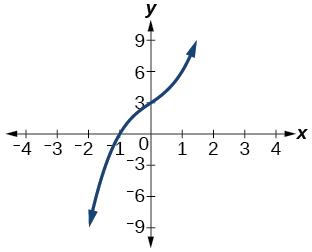 

Factor is<math xmlns="http://www.w3.org/1998/Math/MathML"> <mrow> <mtext> </mtext><mo stretchy="false">(</mo><msup> <mi>x</mi> <mn>2</mn> </msup> <mo>+</mo><mn>2</mn><mi>x</mi><mo>+</mo><mn>4</mn><mo stretchy="false">)</mo> </mrow> </math>

 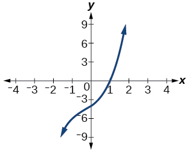 

<math xmlns="http://www.w3.org/1998/Math/MathML"> <mrow> <mo stretchy="false">(</mo><mi>x</mi><mo>−</mo><mn>1</mn><mo stretchy="false">)</mo><mo stretchy="false">(</mo><msup> <mi>x</mi> <mn>2</mn> </msup> <mo>+</mo><mn>2</mn><mi>x</mi><mo>+</mo><mn>4</mn><mo stretchy="false">)</mo> </mrow> </math>

Factor is<math xmlns="http://www.w3.org/1998/Math/MathML"> <mrow> <mtext> </mtext><msup> <mi>x</mi> <mn>2</mn> </msup> <mo>+</mo><mn>2</mn><mi>x</mi><mo>+</mo><mn>5</mn> </mrow> </math>

 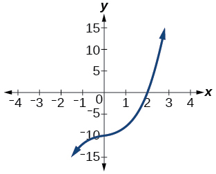 

Factor is<math xmlns="http://www.w3.org/1998/Math/MathML"> <mrow> <mtext> </mtext><msup> <mi>x</mi> <mn>2</mn> </msup> <mo>+</mo><mi>x</mi><mo>+</mo><mn>1</mn> </mrow> </math>

 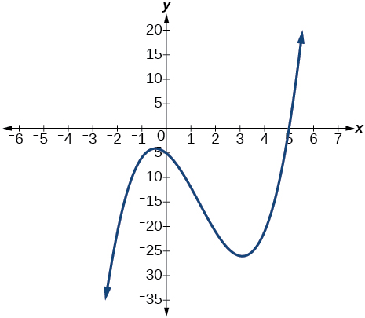 

<math xmlns="http://www.w3.org/1998/Math/MathML"> <mrow> <mo stretchy="false">(</mo><mi>x</mi><mo>−</mo><mn>5</mn><mo stretchy="false">)</mo><mo stretchy="false">(</mo><msup> <mi>x</mi> <mn>2</mn> </msup> <mo>+</mo><mi>x</mi><mo>+</mo><mn>1</mn><mo stretchy="false">)</mo> </mrow> </math>

Factor is<math xmlns="http://www.w3.org/1998/Math/MathML"> <mrow> <msup> <mi>x</mi> <mn>2</mn> </msup> <mo>+</mo><mn>2</mn><mi>x</mi><mo>+</mo><mn>2</mn> </mrow> </math>

 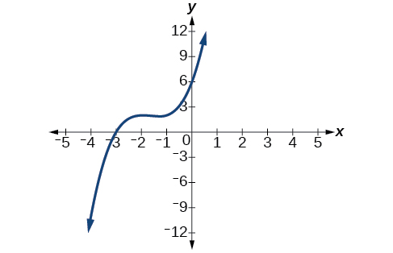 

For the following exercises, use synthetic division to find the quotient and remainder.

<math xmlns="http://www.w3.org/1998/Math/MathML"> <mrow> <mfrac> <mrow> <mn>4</mn><msup> <mi>x</mi> <mn>3</mn> </msup> <mo>−</mo><mn>33</mn> </mrow> <mrow> <mi>x</mi><mo>−</mo><mn>2</mn> </mrow> </mfrac> </mrow> </math>

<math xmlns="http://www.w3.org/1998/Math/MathML"> <mrow> <mtext>Quotient:</mtext><mtext> </mtext><mn>4</mn><msup> <mi>x</mi> <mn>2</mn> </msup> <mo>+</mo><mn>8</mn><mi>x</mi><mo>+</mo><mn>16</mn><mtext>,</mtext><mtext> </mtext><mtext>remainder:</mtext><mtext> </mtext><mo>−</mo><mn>1</mn> </mrow> </math>

<math xmlns="http://www.w3.org/1998/Math/MathML"> <mrow> <mfrac> <mrow> <mn>2</mn><msup> <mi>x</mi> <mn>3</mn> </msup> <mo>+</mo><mn>25</mn> </mrow> <mrow> <mi>x</mi><mo>+</mo><mn>3</mn> </mrow> </mfrac> </mrow> </math>

<math xmlns="http://www.w3.org/1998/Math/MathML"> <mrow> <mfrac> <mrow> <mn>3</mn><msup> <mi>x</mi> <mn>3</mn> </msup> <mo>+</mo><mn>2</mn><mi>x</mi><mo>−</mo><mn>5</mn> </mrow> <mrow> <mi>x</mi><mo>−</mo><mn>1</mn> </mrow> </mfrac> </mrow> </math>

<math xmlns="http://www.w3.org/1998/Math/MathML"> <mrow> <mtext>Quotient:</mtext><mtext> </mtext><mn>3</mn><msup> <mi>x</mi> <mn>2</mn> </msup> <mo>+</mo><mn>3</mn><mi>x</mi><mo>+</mo><mn>5</mn><mtext>,</mtext><mtext> </mtext><mtext>remainder:</mtext><mtext> </mtext><mn>0</mn> </mrow> </math>

<math xmlns="http://www.w3.org/1998/Math/MathML"> <mrow> <mfrac> <mrow> <mo>−</mo><mn>4</mn><msup> <mi>x</mi> <mn>3</mn> </msup> <mo>−</mo><msup> <mi>x</mi> <mn>2</mn> </msup> <mo>−</mo><mn>12</mn> </mrow> <mrow> <mi>x</mi><mo>+</mo><mn>4</mn> </mrow> </mfrac> </mrow> </math>

<math xmlns="http://www.w3.org/1998/Math/MathML"> <mrow> <mfrac> <mrow> <msup> <mi>x</mi> <mn>4</mn> </msup> <mo>−</mo><mn>22</mn> </mrow> <mrow> <mi>x</mi><mo>+</mo><mn>2</mn> </mrow> </mfrac> </mrow> </math>

<math xmlns="http://www.w3.org/1998/Math/MathML"> <mrow> <mtext>Quotient:</mtext><mtext> </mtext><msup> <mi>x</mi> <mn>3</mn> </msup> <mo>−</mo><mn>2</mn><msup> <mi>x</mi> <mn>2</mn> </msup> <mo>+</mo><mn>4</mn><mi>x</mi><mo>−</mo><mn>8</mn><mtext>,</mtext><mtext> </mtext><mtext>remainder:</mtext><mtext> </mtext><mo>−</mo><mn>6</mn> </mrow> </math>

#### Technology

For the following exercises, use a calculator with CAS to answer the questions.

Consider<math xmlns="http://www.w3.org/1998/Math/MathML"> <mrow> <mtext> </mtext><mfrac> <mrow> <msup> <mi>x</mi> <mi>k</mi> </msup> <mo>−</mo><mn>1</mn> </mrow> <mrow> <mi>x</mi><mo>−</mo><mn>1</mn> </mrow> </mfrac> <mtext> </mtext> </mrow> </math>

with<math xmlns="http://www.w3.org/1998/Math/MathML"> <mrow> <mtext> </mtext><mi>k</mi><mo>=</mo><mn>1</mn><mo>,</mo><mo> </mo><mn>2</mn><mo>,</mo><mo> </mo><mn>3.</mn><mtext> </mtext> </mrow> </math>

What do you expect the result to be if<math xmlns="http://www.w3.org/1998/Math/MathML"> <mrow> <mtext> </mtext><mi>k</mi><mo>=</mo><mn>4</mn><mo>?</mo> </mrow> </math>

Consider<math xmlns="http://www.w3.org/1998/Math/MathML"> <mrow> <mtext> </mtext><mfrac> <mrow> <msup> <mi>x</mi> <mi>k</mi> </msup> <mo>+</mo><mn>1</mn> </mrow> <mrow> <mi>x</mi><mo>+</mo><mn>1</mn> </mrow> </mfrac> <mtext> </mtext> </mrow> </math>

for<math xmlns="http://www.w3.org/1998/Math/MathML"> <mrow> <mtext> </mtext><mi>k</mi><mo>=</mo><mn>1</mn><mo>,</mo><mo> </mo><mn>3</mn><mo>,</mo><mo> </mo><mn>5.</mn><mtext> </mtext> </mrow> </math>

What do you expect the result to be if<math xmlns="http://www.w3.org/1998/Math/MathML"> <mrow> <mtext> </mtext><mi>k</mi><mo>=</mo><mn>7</mn><mo>?</mo> </mrow> </math>

<math xmlns="http://www.w3.org/1998/Math/MathML"> <mrow> <msup> <mi>x</mi> <mn>6</mn> </msup> <mo>−</mo><msup> <mi>x</mi> <mn>5</mn> </msup> <mo>+</mo><msup> <mi>x</mi> <mn>4</mn> </msup> <mo>−</mo><msup> <mi>x</mi> <mn>3</mn> </msup> <mo>+</mo><msup> <mi>x</mi> <mn>2</mn> </msup> <mo>−</mo><mi>x</mi><mo>+</mo><mn>1</mn> </mrow> </math>

Consider<math xmlns="http://www.w3.org/1998/Math/MathML"> <mrow> <mtext> </mtext><mfrac> <mrow> <msup> <mi>x</mi> <mn>4</mn> </msup> <mo>−</mo><msup> <mi>k</mi> <mn>4</mn> </msup> </mrow> <mrow> <mi>x</mi><mo>−</mo><mi>k</mi> </mrow> </mfrac> <mtext> </mtext> </mrow> </math>

for<math xmlns="http://www.w3.org/1998/Math/MathML"> <mrow> <mtext> </mtext><mi>k</mi><mo>=</mo><mn>1</mn><mo>,</mo><mo> </mo><mn>2</mn><mo>,</mo><mo> </mo><mn>3.</mn><mtext> </mtext> </mrow> </math>

What do you expect the result to be if<math xmlns="http://www.w3.org/1998/Math/MathML"> <mrow> <mtext> </mtext><mi>k</mi><mo>=</mo><mn>4</mn><mo>?</mo> </mrow> </math>

Consider<math xmlns="http://www.w3.org/1998/Math/MathML"> <mrow> <mtext> </mtext><mfrac> <mrow> <msup> <mi>x</mi> <mi>k</mi> </msup> </mrow> <mrow> <mi>x</mi><mo>+</mo><mn>1</mn> </mrow> </mfrac> <mtext> </mtext> </mrow> </math>

with<math xmlns="http://www.w3.org/1998/Math/MathML"> <mrow> <mtext> </mtext><mi>k</mi><mo>=</mo><mn>1</mn><mo>,</mo><mo> </mo><mn>2</mn><mo>,</mo><mo> </mo><mn>3.</mn><mtext> </mtext> </mrow> </math>

What do you expect the result to be if<math xmlns="http://www.w3.org/1998/Math/MathML"> <mrow> <mtext> </mtext><mi>k</mi><mo>=</mo><mn>4</mn><mo>?</mo> </mrow> </math>

<math xmlns="http://www.w3.org/1998/Math/MathML"> <mrow> <msup> <mi>x</mi> <mn>3</mn> </msup> <mo>−</mo><msup> <mi>x</mi> <mn>2</mn> </msup> <mo>+</mo><mi>x</mi><mo>−</mo><mn>1</mn><mo>+</mo><mfrac> <mn>1</mn> <mrow> <mi>x</mi><mo>+</mo><mn>1</mn> </mrow> </mfrac> </mrow> </math>

Consider<math xmlns="http://www.w3.org/1998/Math/MathML"> <mrow> <mtext> </mtext><mfrac> <mrow> <msup> <mi>x</mi> <mi>k</mi> </msup> </mrow> <mrow> <mi>x</mi><mo>−</mo><mn>1</mn> </mrow> </mfrac> <mtext> </mtext> </mrow> </math>

with<math xmlns="http://www.w3.org/1998/Math/MathML"> <mrow> <mtext> </mtext><mi>k</mi><mo>=</mo><mn>1</mn><mo>,</mo><mo> </mo><mn>2</mn><mo>,</mo><mo> </mo><mn>3.</mn><mtext> </mtext> </mrow> </math>

What do you expect the result to be if<math xmlns="http://www.w3.org/1998/Math/MathML"> <mrow> <mtext> </mtext><mi>k</mi><mo>=</mo><mn>4</mn><mo>?</mo> </mrow> </math>

#### Extensions

For the following exercises, use synthetic division to determine the quotient involving a complex number.

<math xmlns="http://www.w3.org/1998/Math/MathML"> <mrow> <mfrac> <mrow> <mi>x</mi><mo>+</mo><mn>1</mn> </mrow> <mrow> <mi>x</mi><mo>−</mo><mi>i</mi> </mrow> </mfrac> </mrow> </math>

<math xmlns="http://www.w3.org/1998/Math/MathML"> <mrow> <mn>1</mn><mo>+</mo><mfrac> <mrow> <mn>1</mn><mo>+</mo><mi>i</mi> </mrow> <mrow> <mi>x</mi><mo>−</mo><mi>i</mi> </mrow> </mfrac> </mrow> </math>

<math xmlns="http://www.w3.org/1998/Math/MathML"> <mrow> <mfrac> <mrow> <msup> <mi>x</mi> <mn>2</mn> </msup> <mo>+</mo><mn>1</mn> </mrow> <mrow> <mi>x</mi><mo>−</mo><mi>i</mi> </mrow> </mfrac> </mrow> </math>

<math xmlns="http://www.w3.org/1998/Math/MathML"> <mrow> <mfrac> <mrow> <mi>x</mi><mo>+</mo><mn>1</mn> </mrow> <mrow> <mi>x</mi><mo>+</mo><mi>i</mi> </mrow> </mfrac> </mrow> </math>

<math xmlns="http://www.w3.org/1998/Math/MathML"> <mrow> <mn>1</mn><mo>+</mo><mfrac> <mrow> <mn>1</mn><mo>−</mo><mi>i</mi> </mrow> <mrow> <mi>x</mi><mo>+</mo><mi>i</mi> </mrow> </mfrac> </mrow> </math>

<math xmlns="http://www.w3.org/1998/Math/MathML"> <mrow> <mfrac> <mrow> <msup> <mi>x</mi> <mn>2</mn> </msup> <mo>+</mo><mn>1</mn> </mrow> <mrow> <mi>x</mi><mo>+</mo><mi>i</mi> </mrow> </mfrac> </mrow> </math>

<math xmlns="http://www.w3.org/1998/Math/MathML"> <mrow> <mfrac> <mrow> <msup> <mi>x</mi> <mn>3</mn> </msup> <mo>+</mo><mn>1</mn> </mrow> <mrow> <mi>x</mi><mo>−</mo><mi>i</mi> </mrow> </mfrac> </mrow> </math>

<math xmlns="http://www.w3.org/1998/Math/MathML"> <mrow> <msup> <mi>x</mi> <mn>2</mn> </msup> <mo>−</mo><mi>i</mi><mi>x</mi><mo>−</mo><mn>1</mn><mo>+</mo><mfrac> <mrow> <mn>1</mn><mo>−</mo><mi>i</mi> </mrow> <mrow> <mi>x</mi><mo>−</mo><mi>i</mi> </mrow> </mfrac> </mrow> </math>

#### Real-World Applications

For the following exercises, use the given length and area of a rectangle to express the width algebraically.

Length is<math xmlns="http://www.w3.org/1998/Math/MathML"> <mrow> <mtext> </mtext><mi>x</mi><mo>+</mo><mn>5</mn><mo>,</mo><mtext> </mtext> </mrow> </math>

area is<math xmlns="http://www.w3.org/1998/Math/MathML"> <mrow> <mtext> </mtext><mn>2</mn><msup> <mi>x</mi> <mn>2</mn> </msup> <mo>+</mo><mn>9</mn><mi>x</mi><mo>−</mo><mn>5.</mn> </mrow> </math>

Length is<math xmlns="http://www.w3.org/1998/Math/MathML"> <mrow> <mtext> </mtext><mn>2</mn><mi>x</mi><mtext> </mtext><mo>+</mo><mtext> </mtext><mn>5</mn><mo>,</mo><mtext> </mtext> </mrow> </math>

area is<math xmlns="http://www.w3.org/1998/Math/MathML"> <mrow> <mtext> </mtext><mn>4</mn><msup> <mi>x</mi> <mn>3</mn> </msup> <mo>+</mo><mn>10</mn><msup> <mi>x</mi> <mn>2</mn> </msup> <mo>+</mo><mn>6</mn><mi>x</mi><mo>+</mo><mn>15</mn> </mrow> </math>

<math xmlns="http://www.w3.org/1998/Math/MathML"> <mrow> <mn>2</mn><msup> <mi>x</mi> <mn>2</mn> </msup> <mo>+</mo><mn>3</mn> </mrow> </math>

Length is<math xmlns="http://www.w3.org/1998/Math/MathML"> <mrow> <mtext> </mtext><mn>3</mn><mi>x</mi><mo>–</mo><mn>4</mn><mo>,</mo><mtext> </mtext> </mrow> </math>

area is<math xmlns="http://www.w3.org/1998/Math/MathML"> <mrow> <mtext> </mtext><mn>6</mn><msup> <mi>x</mi> <mn>4</mn> </msup> <mo>−</mo><mn>8</mn><msup> <mi>x</mi> <mn>3</mn> </msup> <mo>+</mo><mn>9</mn><msup> <mi>x</mi> <mn>2</mn> </msup> <mo>−</mo><mn>9</mn><mi>x</mi><mo>−</mo><mn>4</mn> </mrow> </math>

For the following exercises, use the given volume of a box and its length and width to express the height of the box algebraically.

Volume is<math xmlns="http://www.w3.org/1998/Math/MathML"> <mrow> <mtext> </mtext><mn>12</mn><msup> <mi>x</mi> <mn>3</mn> </msup> <mo>+</mo><mn>20</mn><msup> <mi>x</mi> <mn>2</mn> </msup> <mo>−</mo><mn>21</mn><mi>x</mi><mo>−</mo><mn>36</mn><mo>,</mo><mtext> </mtext> </mrow> </math>

length is<math xmlns="http://www.w3.org/1998/Math/MathML"> <mrow> <mtext> </mtext><mn>2</mn><mi>x</mi><mo>+</mo><mn>3</mn><mo>,</mo><mtext> </mtext> </mrow> </math>

width is<math xmlns="http://www.w3.org/1998/Math/MathML"> <mrow> <mtext> </mtext><mn>3</mn><mi>x</mi><mo>−</mo><mn>4.</mn> </mrow> </math>

<math xmlns="http://www.w3.org/1998/Math/MathML"> <mrow> <mn>2</mn><mi>x</mi><mo>+</mo><mn>3</mn> </mrow> </math>

Volume is<math xmlns="http://www.w3.org/1998/Math/MathML"> <mrow> <mtext> </mtext><mn>18</mn><msup> <mi>x</mi> <mn>3</mn> </msup> <mo>−</mo><mn>21</mn><msup> <mi>x</mi> <mn>2</mn> </msup> <mo>−</mo><mn>40</mn><mi>x</mi><mo>+</mo><mn>48</mn><mo>,</mo><mtext> </mtext> </mrow> </math>

length is<math xmlns="http://www.w3.org/1998/Math/MathML"> <mrow> <mtext> </mtext><mn>3</mn><mi>x</mi><mo>–</mo><mn>4</mn><mo>,</mo><mtext> </mtext> </mrow> </math>

 width is<math xmlns="http://www.w3.org/1998/Math/MathML"> <mrow> <mtext> </mtext><mn>3</mn><mi>x</mi><mo>–</mo><mn>4.</mn> </mrow> </math>

Volume is<math xmlns="http://www.w3.org/1998/Math/MathML"> <mrow> <mtext> </mtext><mn>10</mn><msup> <mi>x</mi> <mn>3</mn> </msup> <mo>+</mo><mn>27</mn><msup> <mi>x</mi> <mn>2</mn> </msup> <mo>+</mo><mn>2</mn><mi>x</mi><mo>−</mo><mn>24</mn><mo>,</mo><mtext> </mtext> </mrow> </math>

length is<math xmlns="http://www.w3.org/1998/Math/MathML"> <mrow> <mtext> </mtext><mn>5</mn><mi>x</mi><mo>–</mo><mn>4</mn><mo>,</mo><mtext> </mtext> </mrow> </math>

 width is<math xmlns="http://www.w3.org/1998/Math/MathML"> <mrow> <mtext> </mtext><mn>2</mn><mi>x</mi><mo>+</mo><mn>3.</mn> </mrow> </math>

<math xmlns="http://www.w3.org/1998/Math/MathML"> <mrow> <mi>x</mi><mo>+</mo><mn>2</mn> </mrow> </math>

Volume is<math xmlns="http://www.w3.org/1998/Math/MathML"> <mrow> <mtext> </mtext><mn>10</mn><msup> <mi>x</mi> <mn>3</mn> </msup> <mo>+</mo><mn>30</mn><msup> <mi>x</mi> <mn>2</mn> </msup> <mo>−</mo><mn>8</mn><mi>x</mi><mo>−</mo><mn>24</mn><mo>,</mo><mtext> </mtext> </mrow> </math>

length is<math xmlns="http://www.w3.org/1998/Math/MathML"> <mrow> <mtext> </mtext><mn>2</mn><mo>,</mo><mtext> </mtext> </mrow> </math>

width is<math xmlns="http://www.w3.org/1998/Math/MathML"> <mrow> <mtext> </mtext><mi>x</mi><mo>+</mo><mn>3.</mn> </mrow> </math>

For the following exercises, use the given volume and radius of a cylinder to express the height of the cylinder algebraically.

Volume is<math xmlns="http://www.w3.org/1998/Math/MathML"> <mrow> <mtext> </mtext><mi>π</mi><mo>(</mo><mn>25</mn><msup> <mi>x</mi> <mn>3</mn> </msup> <mo>−</mo><mn>65</mn><msup> <mi>x</mi> <mn>2</mn> </msup> <mo>−</mo><mn>29</mn><mi>x</mi><mo>−</mo><mn>3</mn><mo>)</mo><mo>,</mo><mtext> </mtext> </mrow> </math>

radius is<math xmlns="http://www.w3.org/1998/Math/MathML"> <mrow> <mtext> </mtext><mn>5</mn><mi>x</mi><mo>+</mo><mn>1.</mn> </mrow> </math>

<math xmlns="http://www.w3.org/1998/Math/MathML"> <mrow> <mi>x</mi><mo>−</mo><mn>3</mn> </mrow> </math>

Volume is<math xmlns="http://www.w3.org/1998/Math/MathML"> <mrow> <mtext> </mtext><mi>π</mi><mo>(</mo><mn>4</mn><msup> <mi>x</mi> <mn>3</mn> </msup> <mo>+</mo><mn>12</mn><msup> <mi>x</mi> <mn>2</mn> </msup> <mo>−</mo><mn>15</mn><mi>x</mi><mo>−</mo><mn>50</mn><mo>)</mo><mo>,</mo><mtext> </mtext> </mrow> </math>

radius is<math xmlns="http://www.w3.org/1998/Math/MathML"> <mrow> <mtext> </mtext><mn>2</mn><mi>x</mi><mo>+</mo><mn>5.</mn> </mrow> </math>

Volume is<math xmlns="http://www.w3.org/1998/Math/MathML"> <mrow> <mtext> </mtext><mi>π</mi><mo>(</mo><mn>3</mn><msup> <mi>x</mi> <mn>4</mn> </msup> <mo>+</mo><mn>24</mn><msup> <mi>x</mi> <mn>3</mn> </msup> <mo>+</mo><mn>46</mn><msup> <mi>x</mi> <mn>2</mn> </msup> <mo>−</mo><mn>16</mn><mi>x</mi><mo>−</mo><mn>32</mn><mo>)</mo><mo>,</mo><mtext> </mtext> </mrow> </math>

radius is<math xmlns="http://www.w3.org/1998/Math/MathML"> <mrow> <mtext> </mtext><mi>x</mi><mo>+</mo><mn>4.</mn> </mrow> </math>

<math xmlns="http://www.w3.org/1998/Math/MathML"> <mrow> <mn>3</mn><msup> <mi>x</mi> <mn>2</mn> </msup> <mo>−</mo><mn>2</mn> </mrow> </math>

### Footnotes
{: data-type="footnote-refs-title"}

* {: data-type="footnote-ref" #footnote1} [1](#footnote-ref1){: data-type="footnote-ref-link"} National Park Service. \"Lincoln Memorial Building Statistics.\" http://www.nps.gov/linc/historyculture/lincoln-memorial-building-statistics.htm. Accessed 4/3/2014
{: data-list-type="bulleted" data-bullet-style="none"}

### Glossary
{: data-type="glossary-title"}

Division Algorithm
: given a polynomial dividend
  <math xmlns="http://www.w3.org/1998/Math/MathML"> <mrow> <mtext> </mtext><mi>f</mi><mo stretchy="false">(</mo><mi>x</mi><mo stretchy="false">)</mo><mtext> </mtext> </mrow> </math>
  
  and a non-zero polynomial divisor
  <math xmlns="http://www.w3.org/1998/Math/MathML"> <mrow> <mtext> </mtext><mi>d</mi><mo stretchy="false">(</mo><mi>x</mi><mo stretchy="false">)</mo><mtext> </mtext> </mrow> </math>
  
  where the degree of
  <math xmlns="http://www.w3.org/1998/Math/MathML"> <mrow> <mtext> </mtext><mi>d</mi><mo stretchy="false">(</mo><mi>x</mi><mo stretchy="false">)</mo><mtext> </mtext> </mrow> </math>
  
  is less than or equal to the degree of
  <math xmlns="http://www.w3.org/1998/Math/MathML"> <mrow> <mtext> </mtext><mi>f</mi><mo stretchy="false">(</mo><mi>x</mi><mo stretchy="false">)</mo></mrow> </math>
  
  , there exist unique polynomials
  <math xmlns="http://www.w3.org/1998/Math/MathML"> <mrow> <mtext> </mtext><mi>q</mi><mo stretchy="false">(</mo><mi>x</mi><mo stretchy="false">)</mo><mtext> </mtext> </mrow> </math>
  
  and
  <math xmlns="http://www.w3.org/1998/Math/MathML"> <mrow> <mtext> </mtext><mi>r</mi><mo stretchy="false">(</mo><mi>x</mi><mo stretchy="false">)</mo><mtext> </mtext> </mrow> </math>
  
  such that
  <math xmlns="http://www.w3.org/1998/Math/MathML"> <mrow> <mtext> </mtext><mi>f</mi><mo stretchy="false">(</mo><mi>x</mi><mo stretchy="false">)</mo><mo>=</mo><mi>d</mi><mo stretchy="false">(</mo><mi>x</mi><mo stretchy="false">)</mo><mi>q</mi><mo stretchy="false">(</mo><mi>x</mi><mo stretchy="false">)</mo><mo>+</mo><mi>r</mi><mo stretchy="false">(</mo><mi>x</mi><mo stretchy="false">)</mo><mtext> </mtext> </mrow> </math>
  
  where
  <math xmlns="http://www.w3.org/1998/Math/MathML"> <mrow> <mtext> </mtext><mi>q</mi><mo stretchy="false">(</mo><mi>x</mi><mo stretchy="false">)</mo><mtext> </mtext> </mrow> </math>
  
  is the quotient and
  <math xmlns="http://www.w3.org/1998/Math/MathML"> <mrow> <mtext> </mtext><mi>r</mi><mo stretchy="false">(</mo><mi>x</mi><mo stretchy="false">)</mo><mtext> </mtext> </mrow> </math>
  
  is the remainder. The remainder is either equal to zero or has degree strictly less than
  <math xmlns="http://www.w3.org/1998/Math/MathML"> <mrow> <mtext> </mtext><mi>d</mi><mo stretchy="false">(</mo><mi>x</mi><mo stretchy="false">)</mo><mo>.</mo><mtext> </mtext> </mrow> </math>
^

synthetic division
: a shortcut method that can be used to divide a polynomial by a binomial of the form
  <math xmlns="http://www.w3.org/1998/Math/MathML"> <mrow> <mtext> </mtext><mi>x</mi><mo>−</mo><mi>k</mi><mtext> </mtext> </mrow> </math>

[1]: http://openstaxcollege.org/l/dividetribild
[2]: http://openstaxcollege.org/l/dividepolybild
[3]: http://openstaxcollege.org/l/dividepolybisd2
[4]: http://openstaxcollege.org/l/dividepolybisd4
