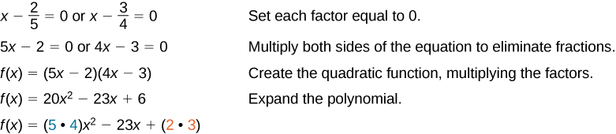
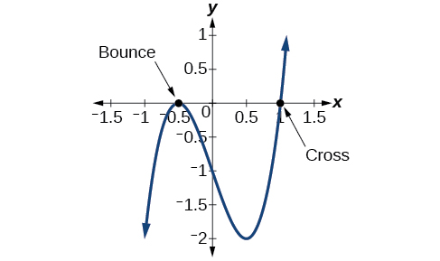
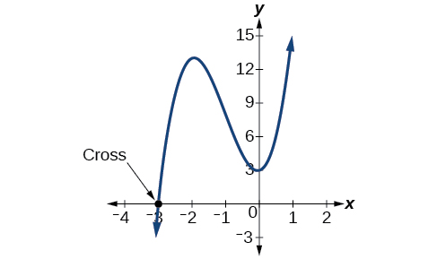
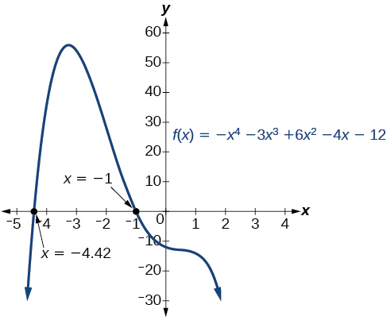
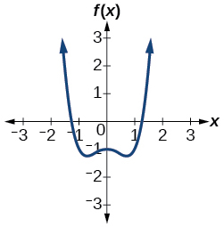
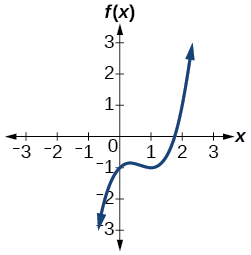
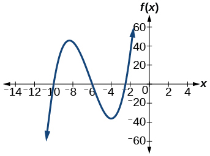
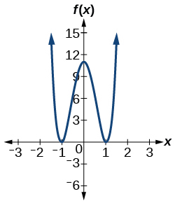
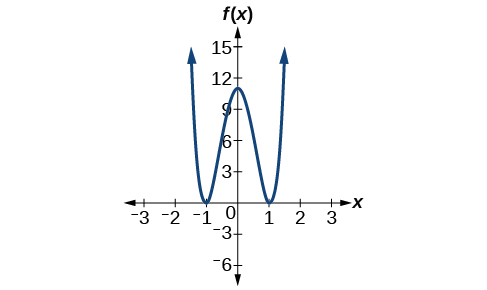

In this section, you will:
* Evaluate a polynomial using the Remainder Theorem.
* Use the Factor Theorem to solve a polynomial equation.
* Use the Rational Zero Theorem to find rational zeros.
* Find zeros of a polynomial function.
* Use the Linear Factorization Theorem to find polynomials with given zeros.
* Use Descartes’ Rule of Signs.
* Solve real-world applications of polynomial equations

A new bakery offers decorated sheet cakes for children’s birthday parties and other special occasions. The bakery wants the volume of a small cake to be 351 cubic inches. The cake is in the shape of a rectangular solid. They want the length of the cake to be four inches longer than the width of the cake and the height of the cake to be one-third of the width. What should the dimensions of the cake pan be?

This problem can be solved by writing a cubic function and solving a cubic equation for the volume of the cake. In this section, we will discuss a variety of tools for writing polynomial functions and solving polynomial equations.

### Evaluating a Polynomial Using the Remainder Theorem

In the last section, we learned how to divide polynomials. We can now use polynomial division to evaluate polynomials using the **Remainder Theorem**{: data-type="term"}. If the polynomial is divided by<math xmlns="http://www.w3.org/1998/Math/MathML"> <mrow> <mtext> </mtext><mi>x</mi><mo>–</mo><mi>k</mi><mo>,</mo><mtext> </mtext></mrow> </math>

the remainder may be found quickly by evaluating the polynomial function at<math xmlns="http://www.w3.org/1998/Math/MathML"> <mrow> <mtext> </mtext><mi>k</mi><mo>,</mo><mtext> </mtext></mrow> </math>

that is,<math xmlns="http://www.w3.org/1998/Math/MathML"> <mrow> <mtext> </mtext><mi>f</mi><mrow><mo>(</mo> <mi>k</mi> <mo>)</mo></mrow><mtext> </mtext></mrow> </math>

Let’s walk through the proof of the theorem.

Recall that the **Division Algorithm**{: data-type="term" .no-emphasis} states that, given a polynomial dividend<math xmlns="http://www.w3.org/1998/Math/MathML"> <mrow> <mtext> </mtext><mi>f</mi><mo stretchy="false">(</mo><mi>x</mi><mo stretchy="false">)</mo><mtext> </mtext></mrow> </math>

and a non-zero polynomial divisor<math xmlns="http://www.w3.org/1998/Math/MathML"> <mrow> <mtext> </mtext><mi>d</mi><mo stretchy="false">(</mo><mi>x</mi><mo stretchy="false">)</mo><mtext> </mtext></mrow> </math>

where the degree of<math xmlns="http://www.w3.org/1998/Math/MathML"> <mrow> <mtext> </mtext><mtext> </mtext><mi>d</mi><mo stretchy="false">(</mo><mi>x</mi><mo stretchy="false">)</mo><mtext> </mtext></mrow> </math>

is less than or equal to the degree of<math xmlns="http://www.w3.org/1998/Math/MathML"> <mrow> <mtext> </mtext><mi>f</mi><mo stretchy="false">(</mo><mi>x</mi><mo stretchy="false">)</mo></mrow> </math>

, there exist unique polynomials<math xmlns="http://www.w3.org/1998/Math/MathML"> <mrow> <mtext> </mtext><mi>q</mi><mo stretchy="false">(</mo><mi>x</mi><mo stretchy="false">)</mo><mtext> </mtext></mrow> </math>

and<math xmlns="http://www.w3.org/1998/Math/MathML"> <mrow> <mtext> </mtext><mi>r</mi><mo stretchy="false">(</mo><mi>x</mi><mo stretchy="false">)</mo><mtext> </mtext></mrow> </math>

such that

<math xmlns="http://www.w3.org/1998/Math/MathML" display="block"> <mrow> <mtext> </mtext><mi>f</mi><mo stretchy="false">(</mo><mi>x</mi><mo stretchy="false">)</mo><mo>=</mo><mi>d</mi><mo stretchy="false">(</mo><mi>x</mi><mo stretchy="false">)</mo><mi>q</mi><mo stretchy="false">(</mo><mi>x</mi><mo stretchy="false">)</mo><mo>+</mo><mi>r</mi><mo stretchy="false">(</mo><mi>x</mi><mo stretchy="false">)</mo></mrow> </math>

If the divisor,<math xmlns="http://www.w3.org/1998/Math/MathML"> <mrow> <mtext> </mtext><mi>d</mi><mo stretchy="false">(</mo><mi>x</mi><mo stretchy="false">)</mo><mo>,</mo><mtext> </mtext></mrow> </math>

is<math xmlns="http://www.w3.org/1998/Math/MathML"> <mrow> <mtext> </mtext><mi>x</mi><mo>−</mo><mi>k</mi><mo>,</mo><mtext> </mtext></mrow> </math>

this takes the form

<math xmlns="http://www.w3.org/1998/Math/MathML" display="block"> <mrow> <mi>f</mi><mo stretchy="false">(</mo><mi>x</mi><mo stretchy="false">)</mo><mo>=</mo><mo stretchy="false">(</mo><mi>x</mi><mo>−</mo><mi>k</mi><mo stretchy="false">)</mo><mi>q</mi><mo stretchy="false">(</mo><mi>x</mi><mo stretchy="false">)</mo><mo>+</mo><mi>r</mi></mrow> </math>

Since the divisor<math xmlns="http://www.w3.org/1998/Math/MathML"> <mrow> <mtext> </mtext><mi>x</mi><mo>−</mo><mi>k</mi><mtext> </mtext></mrow> </math>

is linear, the remainder will be a constant,<math xmlns="http://www.w3.org/1998/Math/MathML"> <mrow> <mtext> </mtext><mi>r</mi><mo>.</mo><mtext> </mtext></mrow> </math>

And, if we evaluate this for<math xmlns="http://www.w3.org/1998/Math/MathML"> <mrow> <mtext> </mtext><mi>x</mi><mo>=</mo><mi>k</mi><mo>,</mo><mtext> </mtext></mrow> </math>

we have

<math xmlns="http://www.w3.org/1998/Math/MathML" display="block"> <mrow> <mtable> <mtr rowalign="center"> <mtd columnalign="right" rowalign="center"><mrow><mi>f</mi><mo stretchy="false">(</mo><mi>k</mi><mo stretchy="false">)</mo></mrow></mtd> <mtd rowalign="center"><mo>=</mo></mtd> <mtd columnalign="left"><mrow><mo stretchy="false">(</mo><mi>k</mi><mo>−</mo><mi>k</mi><mo stretchy="false">)</mo><mi>q</mi><mo stretchy="false">(</mo><mi>k</mi><mo stretchy="false">)</mo><mo>+</mo><mi>r</mi></mrow></mtd> </mtr> <mtr rowalign="center"> <mtd rowalign="center" /> <mtd rowalign="center"><mo>=</mo></mtd> <mtd rowalign="center" columnalign="left"><mrow><mn>0</mn><mo>⋅</mo><mi>q</mi><mo stretchy="false">(</mo><mi>k</mi><mo stretchy="false">)</mo><mo>+</mo><mi>r</mi></mrow></mtd> </mtr> <mtr rowalign="center"> <mtd rowalign="center" /> <mtd rowalign="center"><mo>=</mo></mtd> <mtd rowalign="center" columnalign="left"><mi>r</mi></mtd> </mtr> </mtable></mrow> </math>

In other words,<math xmlns="http://www.w3.org/1998/Math/MathML"> <mrow> <mtext> </mtext><mi>f</mi><mo stretchy="false">(</mo><mi>k</mi><mo stretchy="false">)</mo><mtext> </mtext></mrow> </math>

is the remainder obtained by dividing<math xmlns="http://www.w3.org/1998/Math/MathML"> <mrow> <mtext> </mtext><mi>f</mi><mo stretchy="false">(</mo><mi>x</mi><mo stretchy="false">)</mo><mtext> </mtext></mrow> </math>

by<math xmlns="http://www.w3.org/1998/Math/MathML"> <mrow> <mtext> </mtext><mi>x</mi><mo>−</mo><mi>k</mi><mo>.</mo><mtext> </mtext></mrow> </math>

The Remainder Theorem

If a polynomial<math xmlns="http://www.w3.org/1998/Math/MathML"> <mrow> <mtext> </mtext><mi>f</mi><mo stretchy="false">(</mo><mi>x</mi><mo stretchy="false">)</mo><mtext> </mtext></mrow> </math>

is divided by<math xmlns="http://www.w3.org/1998/Math/MathML"> <mrow> <mtext> </mtext><mi>x</mi><mo>−</mo><mi>k</mi><mo>,</mo><mtext> </mtext></mrow> </math>

then the remainder is the value<math xmlns="http://www.w3.org/1998/Math/MathML"> <mrow> <mtext> </mtext><mi>f</mi><mo stretchy="false">(</mo><mi>k</mi><mo stretchy="false">)</mo><mo>.</mo><mtext> </mtext></mrow> </math>

**Given a polynomial function<math xmlns="http://www.w3.org/1998/Math/MathML"> <mrow> <mtext> </mtext><mi>f</mi><mo>,</mo></mrow> </math>

evaluate<math xmlns="http://www.w3.org/1998/Math/MathML"> <mrow> <mtext> </mtext><mi>f</mi><mrow><mo>(</mo> <mi>x</mi> <mo>)</mo></mrow><mtext> </mtext></mrow> </math>

at<math xmlns="http://www.w3.org/1998/Math/MathML"> <mrow> <mtext> </mtext><mi>x</mi><mo>=</mo><mi>k</mi><mtext> </mtext></mrow> </math>

using the Remainder Theorem.**

1.  Use synthetic division to divide the polynomial by
    <math xmlns="http://www.w3.org/1998/Math/MathML"> <mrow> <mtext> </mtext><mi>x</mi><mo>−</mo><mi>k</mi><mo>.</mo><mtext> </mtext></mrow> </math>

2.  The remainder is the value
    <math xmlns="http://www.w3.org/1998/Math/MathML"> <mrow> <mtext> </mtext><mi>f</mi><mo stretchy="false">(</mo><mi>k</mi><mo stretchy="false">)</mo><mo>.</mo><mtext> </mtext></mrow> </math>
{: type="1"}

Using the Remainder Theorem to Evaluate a Polynomial

Use the Remainder Theorem to evaluate<math xmlns="http://www.w3.org/1998/Math/MathML"> <mrow> <mtext> </mtext><mi>f</mi><mo stretchy="false">(</mo><mi>x</mi><mo stretchy="false">)</mo><mo>=</mo><mn>6</mn><msup> <mi>x</mi> <mn>4</mn> </msup> <mo>−</mo><msup> <mi>x</mi> <mn>3</mn> </msup> <mo>−</mo><mn>15</mn><msup> <mi>x</mi> <mn>2</mn> </msup> <mo>+</mo><mn>2</mn><mi>x</mi><mo>−</mo><mn>7</mn><mtext> </mtext></mrow> </math>

 at<math xmlns="http://www.w3.org/1998/Math/MathML"> <mrow> <mtext> </mtext><mi>x</mi><mo>=</mo><mn>2.</mn><mtext> </mtext></mrow> </math>

To find the remainder using the Remainder Theorem, use synthetic division to divide the polynomial by<math xmlns="http://www.w3.org/1998/Math/MathML"> <mrow> <mtext> </mtext><mi>x</mi><mo>−</mo><mn>2.</mn><mtext> </mtext></mrow> </math>

  
The remainder is 25. Therefore,<math xmlns="http://www.w3.org/1998/Math/MathML"> <mrow> <mtext> </mtext><mi>f</mi><mo stretchy="false">(</mo><mn>2</mn><mo stretchy="false">)</mo><mo>=</mo><mn>25.</mn><mtext> </mtext></mrow> </math>

Analysis

We can check our answer by evaluating<math xmlns="http://www.w3.org/1998/Math/MathML"> <mrow> <mtext> </mtext><mi>f</mi><mo stretchy="false">(</mo><mn>2</mn><mo stretchy="false">)</mo><mo>.</mo><mtext> </mtext></mrow> </math>

<math xmlns="http://www.w3.org/1998/Math/MathML" display="block"> <mrow> <mtable> <mtr rowalign="center"> <mtd columnalign="right" rowalign="center"><mrow><mi>f</mi><mo stretchy="false">(</mo><mi>x</mi><mo stretchy="false">)</mo></mrow></mtd> <mtd rowalign="center"><mo>=</mo></mtd> <mtd columnalign="left" rowalign="center"> <mrow> <mn>6</mn><msup> <mi>x</mi> <mn>4</mn> </msup> <mo>−</mo><msup> <mi>x</mi> <mn>3</mn> </msup> <mo>−</mo><mn>15</mn><msup> <mi>x</mi> <mn>2</mn> </msup> <mo>+</mo><mn>2</mn><mi>x</mi><mo>−</mo><mn>7</mn></mrow> </mtd> </mtr> <mtr rowalign="center"> <mtd rowalign="center" columnalign="right"><mrow><mi>f</mi><mo stretchy="false">(</mo><mn>2</mn><mo stretchy="false">)</mo></mrow></mtd> <mtd rowalign="center"><mo>=</mo></mtd> <mtd columnalign="left" rowalign="center"> <mrow> <mn>6</mn><msup> <mrow> <mo stretchy="false">(</mo><mn>2</mn><mo stretchy="false">)</mo></mrow> <mn>4</mn> </msup> <mo>−</mo><msup> <mrow> <mo stretchy="false">(</mo><mn>2</mn><mo stretchy="false">)</mo></mrow> <mn>3</mn> </msup> <mo>−</mo><mn>15</mn><msup> <mrow> <mo stretchy="false">(</mo><mn>2</mn><mo stretchy="false">)</mo></mrow> <mn>2</mn> </msup> <mo>+</mo><mn>2</mn><mo stretchy="false">(</mo><mn>2</mn><mo stretchy="false">)</mo><mo>−</mo><mn>7</mn></mrow> </mtd> </mtr> <mtr rowalign="center"> <mtd rowalign="center" /> <mtd rowalign="center"><mo>=</mo></mtd> <mtd rowalign="center" columnalign="left"><mrow><mn>25</mn></mrow></mtd> </mtr> </mtable></mrow> </math>

Use the Remainder Theorem to evaluate<math xmlns="http://www.w3.org/1998/Math/MathML"> <mrow> <mtext> </mtext><mi>f</mi><mo stretchy="false">(</mo><mi>x</mi><mo stretchy="false">)</mo><mo>=</mo><mn>2</mn><msup> <mi>x</mi> <mn>5</mn> </msup> <mo>−</mo><mn>3</mn><msup> <mi>x</mi> <mn>4</mn> </msup> <mo>−</mo><mn>9</mn><msup> <mi>x</mi> <mn>3</mn> </msup> <mo>+</mo><mn>8</mn><msup> <mi>x</mi> <mn>2</mn> </msup> <mo>+</mo><mn>2</mn><mtext> </mtext></mrow> </math>

 at<math xmlns="http://www.w3.org/1998/Math/MathML"> <mrow> <mtext> </mtext><mi>x</mi><mo>=</mo><mo>−</mo><mn>3.</mn><mtext> </mtext></mrow> </math>

<math xmlns="http://www.w3.org/1998/Math/MathML"> <mrow> <mtext> </mtext><mi>f</mi><mo stretchy="false">(</mo><mo>−</mo><mn>3</mn><mo stretchy="false">)</mo><mo>=</mo><mo>−</mo><mn>412</mn><mtext> </mtext></mrow> </math>

### Using the Factor Theorem to Solve a Polynomial Equation

The <strong>Factor Theorem </strong>is another theorem that helps us analyze polynomial equations. It tells us how the zeros of a polynomial are related to the factors. Recall that the Division Algorithm.

<math xmlns="http://www.w3.org/1998/Math/MathML" display="block"> <mrow> <mi>f</mi><mo stretchy="false">(</mo><mi>x</mi><mo stretchy="false">)</mo><mo>=</mo><mo stretchy="false">(</mo><mi>x</mi><mo>−</mo><mi>k</mi><mo stretchy="false">)</mo><mi>q</mi><mo stretchy="false">(</mo><mi>x</mi><mo stretchy="false">)</mo><mo>+</mo><mi>r</mi></mrow> </math>

If<math xmlns="http://www.w3.org/1998/Math/MathML"> <mrow> <mtext> </mtext><mi>k</mi><mtext> </mtext></mrow> </math>

 is a zero, then the remainder<math xmlns="http://www.w3.org/1998/Math/MathML"> <mrow> <mtext> </mtext><mi>r</mi><mtext> </mtext></mrow> </math>

 is<math xmlns="http://www.w3.org/1998/Math/MathML"> <mrow> <mtext> </mtext><mi>f</mi><mo stretchy="false">(</mo><mi>k</mi><mo stretchy="false">)</mo><mo>=</mo><mn>0</mn><mtext> </mtext></mrow> </math>

 and<math xmlns="http://www.w3.org/1998/Math/MathML"> <mrow> <mtext> </mtext><mi>f</mi><mo stretchy="false">(</mo><mi>x</mi><mo stretchy="false">)</mo><mo>=</mo><mo stretchy="false">(</mo><mi>x</mi><mo>−</mo><mi>k</mi><mo stretchy="false">)</mo><mi>q</mi><mo stretchy="false">(</mo><mi>x</mi><mo stretchy="false">)</mo><mo>+</mo><mn>0</mn><mtext> </mtext></mrow> </math>

 or<math xmlns="http://www.w3.org/1998/Math/MathML"> <mrow> <mtext> </mtext><mi>f</mi><mo stretchy="false">(</mo><mi>x</mi><mo stretchy="false">)</mo><mo>=</mo><mo stretchy="false">(</mo><mi>x</mi><mo>−</mo><mi>k</mi><mo stretchy="false">)</mo><mi>q</mi><mo stretchy="false">(</mo><mi>x</mi><mo stretchy="false">)</mo><mo>.</mo><mtext> </mtext></mrow> </math>

Notice, written in this form,<math xmlns="http://www.w3.org/1998/Math/MathML"> <mrow> <mtext> </mtext><mi>x</mi><mo>−</mo><mi>k</mi><mtext> </mtext></mrow> </math>

is a factor of<math xmlns="http://www.w3.org/1998/Math/MathML"> <mrow> <mtext> </mtext><mi>f</mi><mo stretchy="false">(</mo><mi>x</mi><mo stretchy="false">)</mo><mo>.</mo><mtext> </mtext></mrow> </math>

We can conclude if<math xmlns="http://www.w3.org/1998/Math/MathML"> <mrow> <mtext> </mtext><mi>k</mi><mtext> </mtext></mrow> </math>

 is a zero of<math xmlns="http://www.w3.org/1998/Math/MathML"> <mrow> <mtext> </mtext><mi>f</mi><mo stretchy="false">(</mo><mi>x</mi><mo stretchy="false">)</mo><mo>,</mo><mtext> </mtext></mrow> </math>

then<math xmlns="http://www.w3.org/1998/Math/MathML"> <mrow> <mtext> </mtext><mi>x</mi><mo>−</mo><mi>k</mi><mtext> </mtext></mrow> </math>

is a factor of<math xmlns="http://www.w3.org/1998/Math/MathML"> <mrow> <mi>f</mi><mo stretchy="false">(</mo><mi>x</mi><mo stretchy="false">)</mo><mo>.</mo><mtext> </mtext></mrow> </math>

Similarly, if<math xmlns="http://www.w3.org/1998/Math/MathML"> <mrow> <mtext> </mtext><mi>x</mi><mo>−</mo><mi>k</mi><mtext> </mtext></mrow> </math>

 is a factor of<math xmlns="http://www.w3.org/1998/Math/MathML"> <mrow> <mtext> </mtext><mi>f</mi><mo stretchy="false">(</mo><mi>x</mi><mo stretchy="false">)</mo><mo>,</mo><mtext> </mtext></mrow> </math>

 then the remainder of the Division Algorithm<math xmlns="http://www.w3.org/1998/Math/MathML"> <mrow> <mtext> </mtext><mi>f</mi><mo stretchy="false">(</mo><mi>x</mi><mo stretchy="false">)</mo><mo>=</mo><mo stretchy="false">(</mo><mi>x</mi><mo>−</mo><mi>k</mi><mo stretchy="false">)</mo><mi>q</mi><mo stretchy="false">(</mo><mi>x</mi><mo stretchy="false">)</mo><mo>+</mo><mi>r</mi><mtext> </mtext></mrow> </math>

 is 0. This tells us that<math xmlns="http://www.w3.org/1998/Math/MathML"> <mrow> <mtext> </mtext><mi>k</mi><mtext> </mtext></mrow> </math>

 is a zero.

This pair of implications is the Factor Theorem. As we will soon see, a polynomial of degree<math xmlns="http://www.w3.org/1998/Math/MathML"> <mrow> <mtext> </mtext><mi>n</mi><mtext> </mtext></mrow> </math>

 in the complex number system will have<math xmlns="http://www.w3.org/1998/Math/MathML"> <mrow> <mtext> </mtext><mi>n</mi><mtext> </mtext></mrow> </math>

 zeros. We can use the Factor Theorem to completely factor a polynomial into the product of<math xmlns="http://www.w3.org/1998/Math/MathML"> <mrow> <mtext> </mtext><mi>n</mi><mtext> </mtext></mrow> </math>

 factors. Once the polynomial has been completely factored, we can easily determine the zeros of the polynomial.

The Factor Theorem

According to the **Factor Theorem**{: data-type="term"},<math xmlns="http://www.w3.org/1998/Math/MathML"> <mrow> <mtext> </mtext><mi>k</mi><mtext> </mtext></mrow> </math>

 is a zero of<math xmlns="http://www.w3.org/1998/Math/MathML"> <mrow> <mtext> </mtext><mi>f</mi><mo stretchy="false">(</mo><mi>x</mi><mo stretchy="false">)</mo><mtext> </mtext></mrow> </math>

 if and only if<math xmlns="http://www.w3.org/1998/Math/MathML"> <mrow> <mtext> </mtext><mo stretchy="false">(</mo><mi>x</mi><mo>−</mo><mi>k</mi><mo stretchy="false">)</mo><mtext> </mtext></mrow> </math>

 is a factor of<math xmlns="http://www.w3.org/1998/Math/MathML"> <mrow> <mtext> </mtext><mi>f</mi><mo stretchy="false">(</mo><mi>x</mi><mo stretchy="false">)</mo><mo>.</mo><mtext> </mtext></mrow> </math>

<strong>Given a factor and a third-degree polynomial, use the Factor Theorem to factor the polynomial. </strong>

1.  Use synthetic division to divide the polynomial by
    <math xmlns="http://www.w3.org/1998/Math/MathML"> <mrow> <mtext> </mtext><mo stretchy="false">(</mo><mi>x</mi><mo>−</mo><mi>k</mi><mo stretchy="false">)</mo><mo>.</mo><mtext> </mtext></mrow> </math>

2.  Confirm that the remainder is 0.
3.  Write the polynomial as the product of
    <math xmlns="http://www.w3.org/1998/Math/MathML"> <mrow> <mtext> </mtext><mo stretchy="false">(</mo><mi>x</mi><mo>−</mo><mi>k</mi><mo stretchy="false">)</mo><mtext> </mtext></mrow> </math>
    
    and the quadratic quotient.
4.  If possible, factor the quadratic.
5.  Write the polynomial as the product of factors.
{: type="1"}

Using the Factor Theorem to Find the Zeros of a Polynomial Expression

Show that<math xmlns="http://www.w3.org/1998/Math/MathML"> <mrow> <mtext> </mtext><mo stretchy="false">(</mo><mi>x</mi><mo>+</mo><mn>2</mn><mo stretchy="false">)</mo><mtext> </mtext></mrow> </math>

 is a factor of<math xmlns="http://www.w3.org/1998/Math/MathML"> <mrow> <mtext> </mtext><msup> <mi>x</mi> <mn>3</mn> </msup> <mo>−</mo><mn>6</mn><msup> <mi>x</mi> <mn>2</mn> </msup> <mo>−</mo><mi>x</mi><mo>+</mo><mn>30.</mn><mtext> </mtext></mrow> </math>

Find the remaining factors. Use the factors to determine the zeros of the **polynomial**{: data-type="term" .no-emphasis}.

We can use synthetic division to show that<math xmlns="http://www.w3.org/1998/Math/MathML"> <mrow> <mtext> </mtext><mo stretchy="false">(</mo><mi>x</mi><mo>+</mo><mn>2</mn><mo stretchy="false">)</mo><mtext> </mtext></mrow> </math>

is a factor of the polynomial.* * *
{: data-type="newline" data-count="1"}

  
The remainder is zero, so<math xmlns="http://www.w3.org/1998/Math/MathML"> <mrow> <mtext> </mtext><mo stretchy="false">(</mo><mi>x</mi><mo>+</mo><mn>2</mn><mo stretchy="false">)</mo><mtext> </mtext></mrow> </math>

is a factor of the polynomial. We can use the Division Algorithm to write the polynomial as the product of the divisor and the quotient:

<math xmlns="http://www.w3.org/1998/Math/MathML" display="block"> <mrow> <mo stretchy="false">(</mo><mi>x</mi><mo>+</mo><mn>2</mn><mo stretchy="false">)</mo><mo>(</mo><msup> <mi>x</mi> <mn>2</mn> </msup> <mo>−</mo><mn>8</mn><mi>x</mi><mo>+</mo><mn>15</mn><mo>)</mo></mrow> </math>

We can factor the quadratic factor to write the polynomial as

<math xmlns="http://www.w3.org/1998/Math/MathML" display="block"> <mrow> <mo stretchy="false">(</mo><mi>x</mi><mo>+</mo><mn>2</mn><mo stretchy="false">)</mo><mo stretchy="false">(</mo><mi>x</mi><mo>−</mo><mn>3</mn><mo stretchy="false">)</mo><mo stretchy="false">(</mo><mi>x</mi><mo>−</mo><mn>5</mn><mo stretchy="false">)</mo></mrow> </math>

By the Factor Theorem, the zeros of<math xmlns="http://www.w3.org/1998/Math/MathML"> <mrow> <mtext> </mtext><msup> <mi>x</mi> <mn>3</mn> </msup> <mo>−</mo><mn>6</mn><msup> <mi>x</mi> <mn>2</mn> </msup> <mo>−</mo><mi>x</mi><mo>+</mo><mn>30</mn><mtext> </mtext></mrow> </math>

are –2, 3, and 5.

Use the Factor Theorem to find the zeros of<math xmlns="http://www.w3.org/1998/Math/MathML"> <mrow> <mtext> </mtext><mi>f</mi><mo stretchy="false">(</mo><mi>x</mi><mo stretchy="false">)</mo><mo>=</mo><msup> <mi>x</mi> <mn>3</mn> </msup> <mo>+</mo><mn>4</mn><msup> <mi>x</mi> <mn>2</mn> </msup> <mo>−</mo><mn>4</mn><mi>x</mi><mo>−</mo><mn>16</mn><mtext> </mtext></mrow> </math>

 given that<math xmlns="http://www.w3.org/1998/Math/MathML"> <mrow> <mo stretchy="false">(</mo><mi>x</mi><mo>−</mo><mn>2</mn><mo stretchy="false">)</mo></mrow> </math>

 is a factor of the polynomial.

The zeros are 2, –2, and –4.

### Using the Rational Zero Theorem to Find Rational Zeros

Another use for the Remainder Theorem is to test whether a rational number is a zero for a given polynomial. But first we need a pool of rational numbers to test. The **Rational Zero Theorem**{: data-type="term"} helps us to narrow down the number of possible rational zeros using the ratio of the factors of the constant term and factors of the leading **coefficient**{: data-type="term" .no-emphasis} of the polynomial

Consider a quadratic function with two zeros,<math xmlns="http://www.w3.org/1998/Math/MathML"> <mrow> <mtext> </mtext><mi>x</mi><mo>=</mo><mfrac> <mn>2</mn> <mn>5</mn> </mfrac> <mtext> </mtext></mrow> </math>

 and<math xmlns="http://www.w3.org/1998/Math/MathML"> <mrow> <mtext> </mtext><mi>x</mi><mo>=</mo><mfrac> <mn>3</mn> <mn>4</mn> </mfrac> <mtext> </mtext><mo>.</mo><mtext> </mtext></mrow> </math>

 By the Factor Theorem, these zeros have factors associated with them. Let us set each factor equal to 0, and then construct the original quadratic function absent its stretching factor.

   Notice that two of the factors of the constant term, 6, are the two numerators from the original rational roots: 2 and 3. Similarly, two of the factors from the leading coefficient, 20, are the two denominators from the original rational roots: 5 and 4.

We can infer that the numerators of the rational roots will always be factors of the constant term and the denominators will be factors of the leading coefficient. This is the essence of the Rational Zero Theorem; it is a means to give us a pool of possible rational zeros.

The Rational Zero Theorem

The **Rational Zero Theorem**{: data-type="term"} states that, if the polynomial<math xmlns="http://www.w3.org/1998/Math/MathML"> <mrow> <mtext> </mtext><mi>f</mi><mo stretchy="false">(</mo><mi>x</mi><mo stretchy="false">)</mo><mo>=</mo><msub> <mi>a</mi> <mi>n</mi> </msub> <msup> <mi>x</mi> <mi>n</mi> </msup> <mo>+</mo><msub> <mi>a</mi> <mrow> <mi>n</mi><mo>−</mo><mn>1</mn></mrow> </msub> <msup> <mi>x</mi> <mrow> <mi>n</mi><mo>−</mo><mn>1</mn></mrow> </msup> <mo>+</mo><mn>...</mn><mo>+</mo><msub> <mi>a</mi> <mn>1</mn> </msub> <mi>x</mi><mo>+</mo><msub> <mi>a</mi> <mn>0</mn> </msub> <mtext> </mtext></mrow> </math>

has integer coefficients, then every rational zero of<math xmlns="http://www.w3.org/1998/Math/MathML"> <mrow> <mtext> </mtext><mi>f</mi><mo stretchy="false">(</mo><mi>x</mi><mo stretchy="false">)</mo><mtext> </mtext></mrow> </math>

 has the form<math xmlns="http://www.w3.org/1998/Math/MathML"> <mrow> <mtext> </mtext><mfrac> <mi>p</mi> <mi>q</mi> </mfrac> <mtext> </mtext></mrow> </math>

where<math xmlns="http://www.w3.org/1998/Math/MathML"> <mrow> <mtext> </mtext><mi>p</mi><mtext> </mtext></mrow> </math>

is a factor of the constant term<math xmlns="http://www.w3.org/1998/Math/MathML"> <mrow> <mtext> </mtext><msub> <mi>a</mi> <mn>0</mn> </msub> <mtext> </mtext></mrow> </math>

and<math xmlns="http://www.w3.org/1998/Math/MathML"> <mrow> <mtext> </mtext><mi>q</mi><mtext> </mtext></mrow> </math>

is a factor of the leading coefficient<math xmlns="http://www.w3.org/1998/Math/MathML"> <mrow> <mtext> </mtext><msub> <mi>a</mi> <mi>n</mi> </msub> <mo>.</mo><mtext> </mtext></mrow> </math>

When the leading coefficient is 1, the possible rational zeros are the factors of the constant term.

**Given a polynomial function<math xmlns="http://www.w3.org/1998/Math/MathML"> <mrow> <mtext> </mtext><mi>f</mi><mo stretchy="false">(</mo><mi>x</mi><mo stretchy="false">)</mo><mo>,</mo></mrow> </math>

use the Rational Zero Theorem to find rational zeros.**

1.  Determine all factors of the constant term and all factors of the leading coefficient.
2.  Determine all possible values of
    <math xmlns="http://www.w3.org/1998/Math/MathML"> <mrow> <mtext> </mtext><mfrac> <mi>p</mi> <mi>q</mi> </mfrac> <mo>,</mo><mtext> </mtext></mrow> </math>
    
    where
    <math xmlns="http://www.w3.org/1998/Math/MathML"> <mrow> <mtext> </mtext><mi>p</mi><mtext> </mtext></mrow> </math>
    
    is a factor of the constant term and
    <math xmlns="http://www.w3.org/1998/Math/MathML"> <mrow> <mtext> </mtext><mi>q</mi><mtext> </mtext></mrow> </math>
    
    is a factor of the leading coefficient. Be sure to include both positive and negative candidates.
3.  Determine which possible zeros are actual zeros by evaluating each case of
    <math xmlns="http://www.w3.org/1998/Math/MathML"> <mrow> <mtext> </mtext><mi>f</mi><mo stretchy="false">(</mo><mstyle scriptlevel="+1"> <mfrac> <mi>p</mi> <mi>q</mi> </mfrac> </mstyle> <mo stretchy="false">)</mo><mo>.</mo><mtext> </mtext></mrow> </math>
{: type="1"}

Listing All Possible Rational Zeros

List all possible rational zeros of<math xmlns="http://www.w3.org/1998/Math/MathML"> <mrow> <mtext> </mtext><mi>f</mi><mo stretchy="false">(</mo><mi>x</mi><mo stretchy="false">)</mo><mo>=</mo><mn>2</mn><msup> <mi>x</mi> <mn>4</mn> </msup> <mo>−</mo><mn>5</mn><msup> <mi>x</mi> <mn>3</mn> </msup> <mo>+</mo><msup> <mi>x</mi> <mn>2</mn> </msup> <mo>−</mo><mn>4.</mn></mrow> </math>

The only possible rational zeros of<math xmlns="http://www.w3.org/1998/Math/MathML"> <mrow> <mtext> </mtext><mi>f</mi><mo stretchy="false">(</mo><mi>x</mi><mo stretchy="false">)</mo><mtext> </mtext></mrow> </math>

 are the quotients of the factors of the last term, –4, and the factors of the leading coefficient, 2.

The constant term is –4; the factors of –4 are<math xmlns="http://www.w3.org/1998/Math/MathML"> <mrow> <mtext> </mtext><mi>p</mi><mo>=</mo><mn>±1</mn><mo>,</mo><mn>±2</mn><mo>,</mo><mn>±4.</mn></mrow> </math>

The leading coefficient is 2; the factors of 2 are<math xmlns="http://www.w3.org/1998/Math/MathML"> <mrow> <mtext> </mtext><mi>q</mi><mo>=</mo><mn>±1</mn><mo>,</mo><mn>±2.</mn></mrow> </math>

If any of the four real zeros are rational zeros, then they will be of one of the following factors of –4 divided by one of the factors of 2.

<math xmlns="http://www.w3.org/1998/Math/MathML" display="block"> <mrow> <mtable> <mtr> <mtd> <mrow> <mfrac> <mi>p</mi> <mi>q</mi> </mfrac> <mo>=</mo><mo>±</mo><mtext> </mtext><mfrac> <mn>1</mn> <mn>1</mn> </mfrac> <mo>,</mo><mtext> </mtext><mtext> </mtext><mo>±</mo><mtext> </mtext><mfrac> <mn>1</mn> <mn>2</mn> </mfrac> <mtext>    </mtext></mrow> </mtd> <mtd> <mrow> <mfrac> <mi>p</mi> <mi>q</mi> </mfrac> <mo>=</mo><mo>±</mo><mtext> </mtext><mfrac> <mn>2</mn> <mn>1</mn> </mfrac> <mo>,</mo><mo>±</mo><mtext> </mtext><mfrac> <mn>2</mn> <mn>2</mn> </mfrac> <mtext>    </mtext></mrow> </mtd> <mtd> <mrow> <mfrac> <mi>p</mi> <mi>q</mi> </mfrac> <mo>=</mo><mtext> </mtext><mo>±</mo><mtext> </mtext><mfrac> <mn>4</mn> <mn>1</mn> </mfrac> <mo>,</mo><mo>±</mo><mtext> </mtext><mfrac> <mn>4</mn> <mn>2</mn> </mfrac> </mrow> </mtd> </mtr> </mtable></mrow> </math>

Note that<math xmlns="http://www.w3.org/1998/Math/MathML"> <mrow> <mtext> </mtext><mfrac> <mn>2</mn> <mn>2</mn> </mfrac> <mo>=</mo><mn>1</mn><mtext> </mtext></mrow> </math>

 and<math xmlns="http://www.w3.org/1998/Math/MathML"> <mrow> <mtext> </mtext><mfrac> <mn>4</mn> <mn>2</mn> </mfrac> <mo>=</mo><mn>2</mn><mo>,</mo><mtext> </mtext></mrow> </math>

which have already been listed. So we can shorten our list.

<math xmlns="http://www.w3.org/1998/Math/MathML" display="block"> <mrow> <mfrac> <mi>p</mi> <mi>q</mi> </mfrac> <mo>=</mo><mfrac> <mrow> <mtext>Factors of the last</mtext></mrow> <mrow> <mtext>Factors of the first</mtext></mrow> </mfrac> <mo>=</mo><mn>±1</mn><mo>,</mo><mn>±2</mn><mo>,</mo><mn>±4</mn><mo>,</mo><mo>±</mo><mfrac> <mn>1</mn> <mn>2</mn> </mfrac> </mrow> </math>

Using the Rational Zero Theorem to Find Rational Zeros

Use the Rational Zero Theorem to find the rational zeros of<math xmlns="http://www.w3.org/1998/Math/MathML"> <mrow> <mtext> </mtext><mi>f</mi><mo stretchy="false">(</mo><mi>x</mi><mo stretchy="false">)</mo><mo>=</mo><mn>2</mn><msup> <mi>x</mi> <mn>3</mn> </msup> <mo>+</mo><msup> <mi>x</mi> <mn>2</mn> </msup> <mo>−</mo><mn>4</mn><mi>x</mi><mo>+</mo><mn>1.</mn><mtext> </mtext></mrow> </math>

The Rational Zero Theorem tells us that if<math xmlns="http://www.w3.org/1998/Math/MathML"> <mrow> <mtext> </mtext><mfrac> <mi>p</mi> <mi>q</mi> </mfrac> <mtext> </mtext></mrow> </math>

is a zero of<math xmlns="http://www.w3.org/1998/Math/MathML"> <mrow> <mtext> </mtext><mi>f</mi><mo stretchy="false">(</mo><mi>x</mi><mo stretchy="false">)</mo><mo>,</mo><mtext> </mtext></mrow> </math>

 then<math xmlns="http://www.w3.org/1998/Math/MathML"> <mrow> <mtext> </mtext><mi>p</mi><mtext> </mtext></mrow> </math>

is a factor of 1 and<math xmlns="http://www.w3.org/1998/Math/MathML"> <mrow> <mtext> </mtext><mi>q</mi><mtext> </mtext></mrow> </math>

is a factor of 2.

<math xmlns="http://www.w3.org/1998/Math/MathML" display="block"> <mrow> <mtable> <mtr rowalign="center"> <mtd rowalign="center" columnalign="right"><mrow><mfrac><mi>p</mi><mi>q</mi></mfrac></mrow></mtd> <mtd rowalign="center"><mo>=</mo></mtd> <mtd rowalign="center" columnalign="left"><mrow><mfrac><mrow><mtext>factor of constant term</mtext></mrow><mrow> <mtext>factor of leading coefficient</mtext></mrow></mfrac></mrow> </mtd> </mtr> <mtr rowalign="center"> <mtd rowalign="center" /> <mtd rowalign="center"><mo>=</mo></mtd> <mtd rowalign="center" columnalign="left"><mrow><mfrac><mrow><mtext>factor of 1</mtext></mrow><mrow><mtext>factor of 2</mtext></mrow></mfrac></mrow></mtd> </mtr> </mtable></mrow> </math>

The factors of 1 are<math xmlns="http://www.w3.org/1998/Math/MathML"> <mrow> <mn>±1</mn><mtext> </mtext></mrow> </math>

and the factors of 2 are<math xmlns="http://www.w3.org/1998/Math/MathML"> <mrow> <mn>±1</mn><mtext> </mtext></mrow> </math>

and<math xmlns="http://www.w3.org/1998/Math/MathML"> <mrow> <mn>±2.</mn><mtext> </mtext></mrow> </math>

The possible values for<math xmlns="http://www.w3.org/1998/Math/MathML"> <mrow> <mtext> </mtext><mfrac> <mi>p</mi> <mi>q</mi> </mfrac> <mtext> </mtext></mrow> </math>

are<math xmlns="http://www.w3.org/1998/Math/MathML"> <mrow> <mn>±1</mn><mtext> </mtext></mrow> </math>

and<math xmlns="http://www.w3.org/1998/Math/MathML"> <mrow> <mtext> </mtext><mo>±</mo><mfrac> <mn>1</mn> <mn>2</mn> </mfrac> <mo>.</mo><mtext> </mtext></mrow> </math>

These are the possible rational zeros for the function. We can determine which of the possible zeros are actual zeros by substituting these values for<math xmlns="http://www.w3.org/1998/Math/MathML"> <mrow> <mtext> </mtext><mi>x</mi><mtext> </mtext></mrow> </math>

in<math xmlns="http://www.w3.org/1998/Math/MathML"> <mrow> <mtext> </mtext><mi>f</mi><mo stretchy="false">(</mo><mi>x</mi><mo stretchy="false">)</mo><mo>.</mo><mtext> </mtext></mrow> </math>

<math xmlns="http://www.w3.org/1998/Math/MathML" display="block"> <mrow> <mtable> <mtr> <mtd columnalign="right"><mrow><mi>f</mi><mo stretchy="false">(</mo><mn>−1</mn><mo stretchy="false">)</mo></mrow></mtd> <mtd><mo>=</mo></mtd> <mtd columnalign="left"><mrow><mn>2</mn><msup> <mrow> <mo stretchy="false">(</mo><mn>−1</mn><mo stretchy="false">)</mo></mrow> <mn>3</mn> </msup> <mo>+</mo><msup> <mrow> <mo stretchy="false">(</mo><mn>−1</mn><mo stretchy="false">)</mo></mrow> <mn>2</mn> </msup> <mo>−</mo><mn>4</mn><mo stretchy="false">(</mo><mn>−1</mn><mo stretchy="false">)</mo><mo>+</mo><mn>1</mn><mo>=</mo><mn>4</mn></mrow> </mtd> </mtr> <mtr> <mtd columnalign="right"><mrow><mi>f</mi><mo stretchy="false">(</mo><mn>1</mn><mo stretchy="false">)</mo></mrow></mtd> <mtd><mo>=</mo></mtd> <mtd columnalign="left"><mrow><mn>2</mn><msup> <mrow> <mo stretchy="false">(</mo><mn>1</mn><mo stretchy="false">)</mo></mrow> <mn>3</mn> </msup> <mo>+</mo><msup> <mrow> <mo stretchy="false">(</mo><mn>1</mn><mo stretchy="false">)</mo></mrow> <mn>2</mn> </msup> <mo>−</mo><mn>4</mn><mo stretchy="false">(</mo><mn>1</mn><mo stretchy="false">)</mo><mo>+</mo><mn>1</mn><mo>=</mo><mn>0</mn></mrow> </mtd> </mtr> <mtr> <mtd columnalign="left"> <mrow> <mi>f</mi><mrow><mo>(</mo> <mrow> <mo>−</mo><mfrac> <mn>1</mn> <mn>2</mn> </mfrac> </mrow> <mo>)</mo></mrow></mrow> </mtd> <mtd><mo>=</mo></mtd> <mtd columnalign="left"> <mrow> <mn>2</mn><msup> <mrow> <mrow><mo>(</mo> <mrow> <mo>−</mo><mfrac> <mn>1</mn> <mn>2</mn> </mfrac> </mrow> <mo>)</mo></mrow></mrow> <mn>3</mn> </msup> <mo>+</mo><msup> <mrow> <mrow><mo>(</mo> <mrow> <mo>−</mo><mfrac> <mn>1</mn> <mn>2</mn> </mfrac> </mrow> <mo>)</mo></mrow></mrow> <mn>2</mn> </msup> <mo>−</mo><mn>4</mn><mrow><mo>(</mo> <mrow> <mo>−</mo><mfrac> <mn>1</mn> <mn>2</mn> </mfrac> </mrow> <mo>)</mo></mrow><mo>+</mo><mn>1</mn><mo>=</mo><mn>3</mn></mrow> </mtd> </mtr> <mtr> <mtd columnalign="right"> <mrow> <mi>f</mi><mrow><mo>(</mo> <mrow> <mfrac> <mn>1</mn> <mn>2</mn> </mfrac> </mrow> <mo>)</mo></mrow></mrow> </mtd> <mtd><mo>=</mo></mtd> <mtd columnalign="left"> <mrow> <mn>2</mn><msup> <mrow> <mrow><mo>(</mo> <mrow> <mfrac> <mn>1</mn> <mn>2</mn> </mfrac> </mrow> <mo>)</mo></mrow></mrow> <mn>3</mn> </msup> <mo>+</mo><msup> <mrow> <mrow><mo>(</mo> <mrow> <mfrac> <mn>1</mn> <mn>2</mn> </mfrac> </mrow> <mo>)</mo></mrow></mrow> <mn>2</mn> </msup> <mo>−</mo><mn>4</mn><mrow><mo>(</mo> <mrow> <mfrac> <mn>1</mn> <mn>2</mn> </mfrac> </mrow> <mo>)</mo></mrow><mo>+</mo><mn>1</mn><mo>=</mo><mo>−</mo><mfrac> <mn>1</mn> <mn>2</mn> </mfrac> </mrow> </mtd> </mtr> </mtable></mrow> </math>

Of those, <math xmlns="http://www.w3.org/1998/Math/MathML"> <mrow> <mn>−1,</mn><mo>−</mo><mfrac> <mn>1</mn> <mn>2</mn> </mfrac> <mo>,</mo><mtext> and </mtext><mfrac> <mn>1</mn> <mn>2</mn> </mfrac> <mtext> </mtext></mrow> </math>

are not zeros of<math xmlns="http://www.w3.org/1998/Math/MathML"> <mrow> <mtext> </mtext><mi>f</mi><mo stretchy="false">(</mo><mi>x</mi><mo stretchy="false">)</mo><mo>.</mo><mtext> </mtext></mrow> </math>

1 is the only rational zero of<math xmlns="http://www.w3.org/1998/Math/MathML"> <mrow> <mtext> </mtext><mi>f</mi><mo stretchy="false">(</mo><mi>x</mi><mo stretchy="false">)</mo><mo>.</mo><mtext> </mtext></mrow> </math>

Use the Rational Zero Theorem to find the rational zeros of<math xmlns="http://www.w3.org/1998/Math/MathML"> <mrow> <mtext> </mtext><mi>f</mi><mo stretchy="false">(</mo><mi>x</mi><mo stretchy="false">)</mo><mo>=</mo><msup> <mi>x</mi> <mn>3</mn> </msup> <mo>−</mo><mn>5</mn><msup> <mi>x</mi> <mn>2</mn> </msup> <mo>+</mo><mn>2</mn><mi>x</mi><mo>+</mo><mn>1.</mn><mtext> </mtext></mrow> </math>

There are no rational zeros.

### Finding the Zeros of Polynomial Functions

The Rational Zero Theorem helps us to narrow down the list of possible rational zeros for a polynomial function. Once we have done this, we can use **synthetic division**{: data-type="term" .no-emphasis} repeatedly to determine all of the **zeros**{: data-type="term"} of a polynomial function.

**Given a polynomial function<math xmlns="http://www.w3.org/1998/Math/MathML"> <mrow> <mtext> </mtext><mi>f</mi><mo>,</mo></mrow> </math>

use synthetic division to find its zeros.**

1.  Use the Rational Zero Theorem to list all possible rational zeros of the function.
2.  Use synthetic division to evaluate a given possible zero by synthetically dividing the candidate into the polynomial. If the remainder is 0, the candidate is a zero. If the remainder is not zero, discard the candidate.
3.  Repeat step two using the quotient found with synthetic division. If possible, continue until the quotient is a quadratic.
4.  Find the zeros of the quadratic function. Two possible methods for solving quadratics are factoring and using the quadratic formula.
{: type="1"}

Finding the Zeros of a Polynomial Function with Repeated Real Zeros

Find the zeros of<math xmlns="http://www.w3.org/1998/Math/MathML"> <mrow> <mtext> </mtext><mi>f</mi><mo stretchy="false">(</mo><mi>x</mi><mo stretchy="false">)</mo><mo>=</mo><mn>4</mn><msup> <mi>x</mi> <mn>3</mn> </msup> <mo>−</mo><mn>3</mn><mi>x</mi><mo>−</mo><mn>1.</mn><mtext> </mtext></mrow> </math>

The Rational Zero Theorem tells us that if<math xmlns="http://www.w3.org/1998/Math/MathML"> <mrow> <mtext> </mtext><mfrac> <mi>p</mi> <mi>q</mi> </mfrac> <mtext> </mtext></mrow> </math>

is a zero of<math xmlns="http://www.w3.org/1998/Math/MathML"> <mrow> <mtext> </mtext><mi>f</mi><mo stretchy="false">(</mo><mi>x</mi><mo stretchy="false">)</mo><mo>,</mo><mtext> </mtext></mrow> </math>

then<math xmlns="http://www.w3.org/1998/Math/MathML"> <mrow> <mtext> </mtext><mi>p</mi><mtext> </mtext></mrow> </math>

 is a factor of –1 and<math xmlns="http://www.w3.org/1998/Math/MathML"> <mrow> <mtext> </mtext><mi>q</mi><mtext> </mtext></mrow> </math>

is a factor of 4.

<math xmlns="http://www.w3.org/1998/Math/MathML" display="block"> <mrow> <mtable> <mtr rowalign="center"> <mtd rowalign="center" columnalign="right"> <mrow> <mfrac> <mi>p</mi> <mi>q</mi> </mfrac> </mrow> </mtd> <mtd rowalign="center"> <mo>=</mo> </mtd> <mtd rowalign="center" columnalign="left"> <mrow> <mfrac> <mrow> <mtext>factor of constant term</mtext></mrow> <mrow> <mtext>factor of leading coefficient</mtext></mrow> </mfrac> </mrow> </mtd> </mtr> <mtr rowalign="center"> <mtd rowalign="center" /> <mtd rowalign="center"><mo>=</mo></mtd> <mtd rowalign="center" columnalign="left"> <mrow> <mfrac> <mrow> <mtext>factor of –1</mtext></mrow> <mrow> <mtext>factor of 4</mtext></mrow> </mfrac> </mrow> </mtd> </mtr> </mtable></mrow> </math>

The factors of<math xmlns="http://www.w3.org/1998/Math/MathML"> <mrow> <mtext> </mtext><mn>–1</mn><mtext> </mtext></mrow> </math>

 are<math xmlns="http://www.w3.org/1998/Math/MathML"> <mrow> <mn>±1</mn><mtext> </mtext></mrow> </math>

 and the factors of<math xmlns="http://www.w3.org/1998/Math/MathML"> <mrow> <mtext> </mtext><mn>4</mn><mtext> </mtext></mrow> </math>

 are<math xmlns="http://www.w3.org/1998/Math/MathML"> <mrow> <mn>±1</mn><mo>,</mo><mn>±2</mn><mo>,</mo><mtext> </mtext></mrow> </math>

and<math xmlns="http://www.w3.org/1998/Math/MathML"> <mrow> <mtext> </mtext><mn>±4.</mn><mtext> </mtext></mrow> </math>

The possible values for<math xmlns="http://www.w3.org/1998/Math/MathML"> <mrow> <mtext> </mtext><mfrac> <mi>p</mi> <mi>q</mi> </mfrac> <mtext> </mtext></mrow> </math>

are<math xmlns="http://www.w3.org/1998/Math/MathML"> <mrow> <mn>±1</mn><mo>,</mo><mtext> </mtext><mo>±</mo><mfrac> <mn>1</mn> <mn>2</mn> </mfrac> <mo>,</mo><mtext> </mtext></mrow> </math>

and<math xmlns="http://www.w3.org/1998/Math/MathML"> <mrow> <mtext> </mtext><mo>±</mo><mfrac> <mn>1</mn> <mn>4</mn> </mfrac> <mo>.</mo><mtext> </mtext></mrow> </math>

 These are the possible rational zeros for the function. We will use synthetic division to evaluate each possible zero until we find one that gives a remainder of 0. Let’s begin with 1.

  
Dividing by<math xmlns="http://www.w3.org/1998/Math/MathML"> <mrow> <mtext> </mtext><mo stretchy="false">(</mo><mi>x</mi><mo>−</mo><mn>1</mn><mo stretchy="false">)</mo><mtext> </mtext></mrow> </math>

 gives a remainder of 0, so 1 is a zero of the function. The polynomial can be written as

<math xmlns="http://www.w3.org/1998/Math/MathML" display="block"> <mrow> <mo stretchy="false">(</mo><mi>x</mi><mo>−</mo><mn>1</mn><mo stretchy="false">)</mo><mo stretchy="false">(</mo><mn>4</mn><msup> <mi>x</mi> <mn>2</mn> </msup> <mo>+</mo><mn>4</mn><mi>x</mi><mo>+</mo><mn>1</mn><mo stretchy="false">)</mo></mrow> </math>

The quadratic is a perfect square.<math xmlns="http://www.w3.org/1998/Math/MathML"> <mrow> <mtext> </mtext><mi>f</mi><mo stretchy="false">(</mo><mi>x</mi><mo stretchy="false">)</mo><mtext> </mtext></mrow> </math>

 can be written as

<math xmlns="http://www.w3.org/1998/Math/MathML" display="block"> <mrow> <mo stretchy="false">(</mo><mi>x</mi><mo>−</mo><mn>1</mn><mo stretchy="false">)</mo><msup> <mrow> <mo stretchy="false">(</mo><mn>2</mn><mi>x</mi><mo>+</mo><mn>1</mn><mo stretchy="false">)</mo></mrow> <mn>2</mn> </msup> </mrow> </math>

We already know that 1 is a zero. The other zero will have a multiplicity of 2 because the factor is squared. To find the other zero, we can set the factor equal to 0.

<math xmlns="http://www.w3.org/1998/Math/MathML" display="block"> <mrow> <mtable> <mtr> <mtd columnalign="right"><mrow><mn>2</mn><mi>x</mi><mo>+</mo><mn>1</mn></mrow></mtd> <mtd><mo>=</mo></mtd> <mtd columnalign="left"><mn>0</mn></mtd> </mtr> <mtr> <mtd columnalign="right"><mi>x</mi></mtd> <mtd><mo>=</mo></mtd> <mtd columnalign="left"><mrow><mo>−</mo><mfrac><mn>1</mn><mn>2</mn></mfrac></mrow></mtd> </mtr> </mtable></mrow> </math>

The zeros of the function are 1 and<math xmlns="http://www.w3.org/1998/Math/MathML"> <mrow> <mtext> </mtext><mo>−</mo><mfrac> <mn>1</mn> <mn>2</mn> </mfrac> <mtext> </mtext></mrow> </math>

with multiplicity 2.

Analysis

Look at the graph of the function<math xmlns="http://www.w3.org/1998/Math/MathML"> <mrow> <mtext> </mtext><mi>f</mi><mtext> </mtext></mrow> </math>

in [[link]](#Figure_03_06_001). Notice, at<math xmlns="http://www.w3.org/1998/Math/MathML"> <mrow> <mtext> </mtext><mi>x</mi><mo>=</mo><mo>−</mo><mn>0.5</mn><mo>,</mo><mtext> </mtext></mrow> </math>

the graph bounces off the *x*-axis, indicating the even multiplicity (2,4,6…) for the zero<math xmlns="http://www.w3.org/1998/Math/MathML"> <mrow> <mtext> </mtext><mo>−</mo><mn>0.5.</mn><mtext> </mtext></mrow> </math>

 At<math xmlns="http://www.w3.org/1998/Math/MathML"> <mrow> <mtext> </mtext><mi>x</mi><mo>=</mo><mn>1</mn><mo>,</mo><mtext> </mtext></mrow> </math>

the graph crosses the *x*-axis, indicating the odd multiplicity (1,3,5…) for the zero<math xmlns="http://www.w3.org/1998/Math/MathML"> <mrow> <mtext> </mtext><mi>x</mi><mo>=</mo><mn>1.</mn><mtext> </mtext></mrow> </math>

{: #Figure_03_06_001}

### Using the Fundamental Theorem of Algebra

Now that we can find rational zeros for a polynomial function, we will look at a theorem that discusses the number of complex zeros of a polynomial function. The <strong>Fundamental Theorem of Algebra </strong>tells us that every polynomial function has at least one complex zero. This theorem forms the foundation for solving polynomial equations.

Suppose<math xmlns="http://www.w3.org/1998/Math/MathML"> <mrow> <mtext> </mtext><mi>f</mi><mtext> </mtext></mrow> </math>

is a polynomial function of degree four, and<math xmlns="http://www.w3.org/1998/Math/MathML"> <mrow> <mtext> </mtext><mi>f</mi><mo stretchy="false">(</mo><mi>x</mi><mo stretchy="false">)</mo><mo>=</mo><mn>0.</mn><mtext> </mtext></mrow> </math>

The Fundamental Theorem of Algebra states that there is at least one complex solution, call it<math xmlns="http://www.w3.org/1998/Math/MathML"> <mrow> <mtext> </mtext><msub> <mi>c</mi> <mn>1</mn> </msub> <mo>.</mo><mtext> </mtext></mrow> </math>

By the Factor Theorem, we can write<math xmlns="http://www.w3.org/1998/Math/MathML"> <mrow> <mtext> </mtext><mi>f</mi><mo stretchy="false">(</mo><mi>x</mi><mo stretchy="false">)</mo><mtext> </mtext></mrow> </math>

as a product of<math xmlns="http://www.w3.org/1998/Math/MathML"> <mrow> <mtext> </mtext><mi>x</mi><mo>−</mo><msub> <mi>c</mi> <mtext>1</mtext> </msub> <mtext> </mtext></mrow> </math>

and a polynomial quotient. Since<math xmlns="http://www.w3.org/1998/Math/MathML"> <mrow> <mtext> </mtext><mi>x</mi><mo>−</mo><msub> <mi>c</mi> <mtext>1</mtext> </msub> <mtext> </mtext></mrow> </math>

is linear, the polynomial quotient will be of degree three. Now we apply the Fundamental Theorem of Algebra to the third-degree polynomial quotient. It will have at least one complex zero, call it<math xmlns="http://www.w3.org/1998/Math/MathML"> <mrow> <mtext> </mtext><msub> <mi>c</mi> <mtext>2</mtext> </msub> <mo>.</mo><mtext> </mtext></mrow> </math>

So we can write the polynomial quotient as a product of<math xmlns="http://www.w3.org/1998/Math/MathML"> <mrow> <mtext> </mtext><mi>x</mi><mo>−</mo><msub> <mi>c</mi> <mtext>2</mtext> </msub> <mtext> </mtext></mrow> </math>

and a new polynomial quotient of degree two. Continue to apply the Fundamental Theorem of Algebra until all of the zeros are found. There will be four of them and each one will yield a factor of<math xmlns="http://www.w3.org/1998/Math/MathML"> <mrow> <mtext> </mtext><mi>f</mi><mo stretchy="false">(</mo><mi>x</mi><mo stretchy="false">)</mo><mo>.</mo><mtext> </mtext></mrow> </math>

The Fundamental Theorem of Algebra

The **Fundamental Theorem of Algebra**{: data-type="term"} states that, if<math xmlns="http://www.w3.org/1998/Math/MathML"> <mrow> <mtext> </mtext><mi>f</mi><mo stretchy="false">(</mo><mi>x</mi><mo stretchy="false">)</mo><mtext> </mtext></mrow> </math>

is a polynomial of degree *n &gt; 0*, then<math xmlns="http://www.w3.org/1998/Math/MathML"> <mrow> <mtext> </mtext><mi>f</mi><mo stretchy="false">(</mo><mi>x</mi><mo stretchy="false">)</mo><mtext> </mtext></mrow> </math>

has at least one complex zero.

We can use this theorem to argue that, if<math xmlns="http://www.w3.org/1998/Math/MathML"> <mrow> <mtext> </mtext><mi>f</mi><mo stretchy="false">(</mo><mi>x</mi><mo stretchy="false">)</mo><mtext> </mtext></mrow> </math>

is a polynomial of degree<math xmlns="http://www.w3.org/1998/Math/MathML"> <mrow> <mtext> </mtext><mi>n</mi><mo>&gt;</mo><mn>0</mn><mo>,</mo><mtext> </mtext></mrow> </math>

and<math xmlns="http://www.w3.org/1998/Math/MathML"> <mrow> <mtext> </mtext><mi>a</mi><mtext> </mtext></mrow> </math>

 is a non-zero real number, then<math xmlns="http://www.w3.org/1998/Math/MathML"> <mrow> <mtext> </mtext><mi>f</mi><mo stretchy="false">(</mo><mi>x</mi><mo stretchy="false">)</mo><mtext> </mtext></mrow> </math>

has exactly<math xmlns="http://www.w3.org/1998/Math/MathML"> <mrow> <mtext> </mtext><mi>n</mi><mtext> </mtext></mrow> </math>

 linear factors

<math xmlns="http://www.w3.org/1998/Math/MathML" display="block"> <mrow> <mi>f</mi><mo stretchy="false">(</mo><mi>x</mi><mo stretchy="false">)</mo><mo>=</mo><mi>a</mi><mo stretchy="false">(</mo><mi>x</mi><mo>−</mo><msub> <mi>c</mi> <mn>1</mn> </msub> <mo stretchy="false">)</mo><mo stretchy="false">(</mo><mi>x</mi><mo>−</mo><msub> <mi>c</mi> <mn>2</mn> </msub> <mo stretchy="false">)</mo><mn>...</mn><mo stretchy="false">(</mo><mi>x</mi><mo>−</mo><msub> <mi>c</mi> <mi>n</mi> </msub> <mo stretchy="false">)</mo></mrow> </math>

where<math xmlns="http://www.w3.org/1998/Math/MathML"> <mrow> <mtext> </mtext><msub> <mi>c</mi> <mn>1</mn> </msub> <mo>,</mo><msub> <mi>c</mi> <mn>2</mn> </msub> <mo>,</mo><mn>...</mn><mo>,</mo><msub> <mi>c</mi> <mi>n</mi> </msub> <mtext> </mtext></mrow> </math>

are complex numbers. Therefore,<math xmlns="http://www.w3.org/1998/Math/MathML"> <mrow> <mtext> </mtext><mi>f</mi><mo stretchy="false">(</mo><mi>x</mi><mo stretchy="false">)</mo><mtext> </mtext></mrow> </math>

has<math xmlns="http://www.w3.org/1998/Math/MathML"> <mrow> <mtext> </mtext><mi>n</mi><mtext> </mtext></mrow> </math>

roots if we allow for multiplicities.

**Does every polynomial have at least one imaginary zero?**

*No. Real numbers are a subset of complex numbers, but not the other way around. A complex number is not necessarily imaginary. Real numbers are also complex numbers.*

Finding the Zeros of a Polynomial Function with Complex Zeros

Find the zeros of<math xmlns="http://www.w3.org/1998/Math/MathML"> <mrow> <mtext> </mtext><mi>f</mi><mo stretchy="false">(</mo><mi>x</mi><mo stretchy="false">)</mo><mo>=</mo><mn>3</mn><msup> <mi>x</mi> <mn>3</mn> </msup> <mo>+</mo><mn>9</mn><msup> <mi>x</mi> <mn>2</mn> </msup> <mo>+</mo><mi>x</mi><mo>+</mo><mn>3.</mn><mtext> </mtext></mrow> </math>

The Rational Zero Theorem tells us that if<math xmlns="http://www.w3.org/1998/Math/MathML"> <mrow> <mtext> </mtext><mfrac> <mi>p</mi> <mi>q</mi> </mfrac> <mtext> </mtext></mrow> </math>

is a zero of<math xmlns="http://www.w3.org/1998/Math/MathML"> <mrow> <mtext> </mtext><mi>f</mi><mo stretchy="false">(</mo><mi>x</mi><mo stretchy="false">)</mo><mo>,</mo><mtext> </mtext></mrow> </math>

then<math xmlns="http://www.w3.org/1998/Math/MathML"> <mrow> <mtext> </mtext><mi>p</mi><mtext> </mtext></mrow> </math>

is a factor of 3 and<math xmlns="http://www.w3.org/1998/Math/MathML"> <mrow> <mtext> </mtext><mi>q</mi><mtext> </mtext></mrow> </math>

is a factor of 3.

<math xmlns="http://www.w3.org/1998/Math/MathML" display="block"> <mrow> <mtable> <mtr rowalign="center"> <mtd columnalign="right" rowalign="center"><mrow><mfrac><mi>p</mi><mi>q</mi></mfrac></mrow></mtd> <mtd rowalign="center"><mo>=</mo></mtd> <mtd rowalign="center" columnalign="left"> <mrow> <mfrac> <mrow> <mtext>factor of constant term</mtext></mrow> <mrow> <mtext>factor of leading coefficient</mtext></mrow> </mfrac> </mrow> </mtd> </mtr> <mtr rowalign="center"> <mtd rowalign="center" /> <mtd rowalign="center"><mo>=</mo></mtd> <mtd rowalign="center" columnalign="left"> <mrow> <mfrac> <mrow> <mtext>factor of 3</mtext></mrow> <mrow> <mtext>factor of 3</mtext></mrow> </mfrac> </mrow> </mtd> </mtr> </mtable></mrow> </math>

The factors of 3 are<math xmlns="http://www.w3.org/1998/Math/MathML"> <mrow> <mn>±1</mn><mtext> </mtext></mrow> </math>

and <math xmlns="http://www.w3.org/1998/Math/MathML"> <mrow> <mn>±3.</mn><mtext> </mtext></mrow> </math>

The possible values for<math xmlns="http://www.w3.org/1998/Math/MathML"> <mrow> <mtext> </mtext><mfrac> <mi>p</mi> <mi>q</mi> </mfrac> <mo>,</mo><mtext> </mtext></mrow> </math>

and therefore the possible rational zeros for the function, are <math xmlns="http://www.w3.org/1998/Math/MathML"> <mrow> <mn>±3</mn><mo>,</mo><mtext>±1, and </mtext><mo>±</mo><mfrac> <mn>1</mn> <mn>3</mn> </mfrac> <mo>.</mo><mtext> </mtext></mrow> </math>

We will use synthetic division to evaluate each possible zero until we find one that gives a remainder of 0. Let’s begin with –3.

  
Dividing by<math xmlns="http://www.w3.org/1998/Math/MathML"> <mrow> <mtext> </mtext><mo stretchy="false">(</mo><mi>x</mi><mo>+</mo><mn>3</mn><mo stretchy="false">)</mo><mtext> </mtext></mrow> </math>

gives a remainder of 0, so –3 is a zero of the function. The polynomial can be written as

<math xmlns="http://www.w3.org/1998/Math/MathML" display="block"> <mrow> <mo stretchy="false">(</mo><mi>x</mi><mo>+</mo><mn>3</mn><mo stretchy="false">)</mo><mo>(</mo><mn>3</mn><msup> <mi>x</mi> <mn>2</mn> </msup> <mo>+</mo><mn>1</mn><mo>)</mo></mrow> </math>

We can then set the quadratic equal to 0 and solve to find the other zeros of the function.

<math xmlns="http://www.w3.org/1998/Math/MathML" display="block"> <mrow> <mtable> <mtr> <mtd columnalign="right"> <mrow> <mn>3</mn><msup> <mi>x</mi> <mn>2</mn> </msup> <mo>+</mo><mn>1</mn></mrow> </mtd> <mtd><mo>=</mo></mtd> <mtd columnalign="left"><mn>0</mn></mtd> </mtr> <mtr> <mtd columnalign="right"> <mrow> <msup> <mi>x</mi> <mn>2</mn> </msup> </mrow> </mtd> <mtd><mo>=</mo></mtd> <mtd columnalign="left"> <mrow> <mo>−</mo><mfrac> <mn>1</mn> <mn>3</mn> </mfrac> </mrow> </mtd> </mtr> <mtr> <mtd columnalign="right"> <mi>x</mi> </mtd> <mtd><mo>=</mo></mtd> <mtd columnalign="left"> <mrow> <mo>±</mo><msqrt> <mrow> <mo>−</mo><mfrac> <mn>1</mn> <mn>3</mn> </mfrac> </mrow> </msqrt> <mo>=</mo><mo>±</mo><mfrac> <mrow> <mi>i</mi><msqrt> <mn>3</mn> </msqrt> </mrow> <mn>3</mn> </mfrac> </mrow> </mtd> </mtr> </mtable></mrow> </math>

The zeros of<math xmlns="http://www.w3.org/1998/Math/MathML"> <mrow> <mi>f</mi><mo stretchy="false">(</mo><mi>x</mi><mo stretchy="false">)</mo></mrow> </math>

 are –3 and<math xmlns="http://www.w3.org/1998/Math/MathML"> <mrow> <mtext> </mtext><mo>±</mo><mfrac> <mrow> <mi>i</mi><msqrt> <mn>3</mn> </msqrt> </mrow> <mn>3</mn> </mfrac> <mo>.</mo></mrow> </math>

Analysis

Look at the graph of the function<math xmlns="http://www.w3.org/1998/Math/MathML"> <mrow> <mtext> </mtext><mi>f</mi><mtext> </mtext></mrow> </math>

in [[link]](#Figure_03_06_002). Notice that, at<math xmlns="http://www.w3.org/1998/Math/MathML"> <mrow> <mtext> </mtext><mi>x</mi><mo>=</mo><mn>−3</mn><mo>,</mo><mtext> </mtext> </mrow> </math>

the graph crosses the *x*-axis, indicating an odd multiplicity (1) for the zero<math xmlns="http://www.w3.org/1998/Math/MathML"> <mrow> <mtext> </mtext><mi>x</mi><mo>=</mo><mn>–3.</mn><mtext> </mtext></mrow> </math>

Also note the presence of the two turning points. This means that, since there is a 3rd degree polynomial, we are looking at the maximum number of turning points. So, the end behavior of increasing without bound to the right and decreasing without bound to the left will continue. Thus, all the *x*-intercepts for the function are shown. So either the multiplicity of<math xmlns="http://www.w3.org/1998/Math/MathML"> <mrow> <mtext> </mtext><mi>x</mi><mo>=</mo><mn>−3</mn><mtext> </mtext></mrow> </math>

is 1 and there are two complex solutions, which is what we found, or the multiplicity at<math xmlns="http://www.w3.org/1998/Math/MathML"> <mrow> <mtext> </mtext><mi>x</mi><mo>=</mo><mn>−3</mn><mtext> </mtext></mrow> </math>

is three. Either way, our result is correct.

{: #Figure_03_06_002}

Find the zeros of<math xmlns="http://www.w3.org/1998/Math/MathML"> <mrow> <mtext> </mtext><mi>f</mi><mo stretchy="false">(</mo><mi>x</mi><mo stretchy="false">)</mo><mo>=</mo><mn>2</mn><msup> <mi>x</mi> <mn>3</mn> </msup> <mo>+</mo><mn>5</mn><msup> <mi>x</mi> <mn>2</mn> </msup> <mo>−</mo><mn>11</mn><mi>x</mi><mo>+</mo><mn>4.</mn></mrow> </math>

The zeros are<math xmlns="http://www.w3.org/1998/Math/MathML"> <mrow> <mtext> </mtext><mtext>–4, </mtext><mfrac> <mn>1</mn> <mn>2</mn> </mfrac> <mo>,</mo><mtext> and 1</mtext><mtext>.</mtext></mrow> </math>

### Using the Linear Factorization Theorem to Find Polynomials with Given Zeros

A vital implication of the **Fundamental Theorem of Algebra**{: data-type="term" .no-emphasis}, as we stated above, is that a polynomial function of degree<math xmlns="http://www.w3.org/1998/Math/MathML"> <mrow> <mtext> </mtext><mi>n</mi><mtext> </mtext></mrow> </math>

 will have<math xmlns="http://www.w3.org/1998/Math/MathML"> <mrow> <mtext> </mtext><mi>n</mi><mtext> </mtext></mrow> </math>

zeros in the set of complex numbers, if we allow for multiplicities. This means that we can factor the polynomial function into<math xmlns="http://www.w3.org/1998/Math/MathML"> <mrow> <mtext> </mtext><mi>n</mi><mtext> </mtext></mrow> </math>

 factors. The **Linear Factorization Theorem**{: data-type="term"} tells us that a polynomial function will have the same number of factors as its degree, and that each factor will be in the form<math xmlns="http://www.w3.org/1998/Math/MathML"> <mrow> <mtext> </mtext><mo stretchy="false">(</mo><mi>x</mi><mo>−</mo><mi>c</mi><mo stretchy="false">)</mo><mo>,</mo><mtext> </mtext></mrow> </math>

where<math xmlns="http://www.w3.org/1998/Math/MathML"> <mrow> <mtext> </mtext><mi>c</mi><mtext> </mtext></mrow> </math>

is a complex number.

Let<math xmlns="http://www.w3.org/1998/Math/MathML"> <mrow> <mtext> </mtext><mi>f</mi><mtext> </mtext></mrow> </math>

 be a polynomial function with real coefficients, and suppose<math xmlns="http://www.w3.org/1998/Math/MathML"> <mrow> <mtext> </mtext><mi>a</mi><mo>+</mo><mi>b</mi><mi>i</mi><mtext>, </mtext><mi>b</mi><mo>≠</mo><mn>0</mn><mo>,</mo><mtext> </mtext></mrow> </math>

 is a zero of<math xmlns="http://www.w3.org/1998/Math/MathML"> <mrow> <mtext> </mtext><mi>f</mi><mo stretchy="false">(</mo><mi>x</mi><mo stretchy="false">)</mo><mo>.</mo><mtext> </mtext></mrow> </math>

 Then, by the Factor Theorem,<math xmlns="http://www.w3.org/1998/Math/MathML"> <mrow> <mtext> </mtext><mi>x</mi><mo>−</mo><mo stretchy="false">(</mo><mi>a</mi><mo>+</mo><mi>b</mi><mi>i</mi><mo stretchy="false">)</mo><mtext> </mtext></mrow> </math>

 is a factor of<math xmlns="http://www.w3.org/1998/Math/MathML"> <mrow> <mtext> </mtext><mi>f</mi><mo stretchy="false">(</mo><mi>x</mi><mo stretchy="false">)</mo><mo>.</mo><mtext> </mtext></mrow> </math>

 For<math xmlns="http://www.w3.org/1998/Math/MathML"> <mrow> <mtext> </mtext><mi>f</mi><mtext> </mtext></mrow> </math>

 to have real coefficients,<math xmlns="http://www.w3.org/1998/Math/MathML"> <mrow> <mtext> </mtext><mi>x</mi><mo>−</mo><mo stretchy="false">(</mo><mi>a</mi><mo>−</mo><mi>b</mi><mi>i</mi><mo stretchy="false">)</mo><mtext> </mtext></mrow> </math>

 must also be a factor of<math xmlns="http://www.w3.org/1998/Math/MathML"> <mrow> <mtext> </mtext><mi>f</mi><mo stretchy="false">(</mo><mi>x</mi><mo stretchy="false">)</mo><mo>.</mo><mtext> </mtext></mrow> </math>

 This is true because any factor other than<math xmlns="http://www.w3.org/1998/Math/MathML"> <mrow> <mtext> </mtext><mi>x</mi><mo>−</mo><mo stretchy="false">(</mo><mi>a</mi><mo>−</mo><mi>b</mi><mi>i</mi><mo stretchy="false">)</mo><mo>,</mo><mtext> </mtext></mrow> </math>

 when multiplied by<math xmlns="http://www.w3.org/1998/Math/MathML"> <mrow> <mtext> </mtext><mi>x</mi><mo>−</mo><mo stretchy="false">(</mo><mi>a</mi><mo>+</mo><mi>b</mi><mi>i</mi><mo stretchy="false">)</mo><mo>,</mo><mtext> </mtext></mrow> </math>

 will leave imaginary components in the product. Only multiplication with conjugate pairs will eliminate the imaginary parts and result in real coefficients. In other words, if a polynomial function<math xmlns="http://www.w3.org/1998/Math/MathML"> <mrow> <mtext> </mtext><mi>f</mi><mtext> </mtext></mrow> </math>

 with real coefficients has a complex zero<math xmlns="http://www.w3.org/1998/Math/MathML"> <mrow> <mtext> </mtext><mi>a</mi><mo>+</mo><mi>b</mi><mi>i</mi><mo>,</mo><mtext> </mtext></mrow> </math>

 then the complex conjugate<math xmlns="http://www.w3.org/1998/Math/MathML"> <mrow> <mtext> </mtext><mi>a</mi><mo>−</mo><mi>b</mi><mi>i</mi><mtext> </mtext></mrow> </math>

 must also be a zero of<math xmlns="http://www.w3.org/1998/Math/MathML"> <mrow> <mtext> </mtext><mi>f</mi><mo stretchy="false">(</mo><mi>x</mi><mo stretchy="false">)</mo><mo>.</mo><mtext> </mtext></mrow> </math>

This is called the **Complex Conjugate Theorem**{: data-type="term" .no-emphasis}.

Complex Conjugate Theorem

According to the **Linear Factorization Theorem**{: data-type="term"}**,** a polynomial function will have the same number of factors as its degree, and each factor will be in the form<math xmlns="http://www.w3.org/1998/Math/MathML"> <mrow> <mtext> </mtext><mo stretchy="false">(</mo><mi>x</mi><mo>−</mo><mi>c</mi><mo stretchy="false">)</mo></mrow> </math>

, where<math xmlns="http://www.w3.org/1998/Math/MathML"> <mrow> <mtext> </mtext><mi>c</mi><mtext> </mtext></mrow> </math>

 is a complex number.

If the polynomial function<math xmlns="http://www.w3.org/1998/Math/MathML"> <mrow> <mtext> </mtext><mi>f</mi><mtext> </mtext></mrow> </math>

 has real coefficients and a complex zero in the form<math xmlns="http://www.w3.org/1998/Math/MathML"> <mrow> <mtext> </mtext><mi>a</mi><mo>+</mo><mi>b</mi><mi>i</mi><mo>,</mo><mtext> </mtext></mrow> </math>

 then the complex conjugate of the zero,<math xmlns="http://www.w3.org/1998/Math/MathML"> <mrow> <mtext> </mtext><mi>a</mi><mo>−</mo><mi>b</mi><mi>i</mi><mo>,</mo><mtext> </mtext></mrow> </math>

 is also a zero.

**Given the zeros of a polynomial function<math xmlns="http://www.w3.org/1998/Math/MathML"> <mrow> <mtext> </mtext><mi>f</mi><mtext> </mtext></mrow> </math>

and a point (*c*, *f*(*c*)) on the graph of<math xmlns="http://www.w3.org/1998/Math/MathML"> <mrow> <mtext> </mtext><mi>f</mi><mo>,</mo><mtext> </mtext></mrow> </math>

use the Linear Factorization Theorem to find the polynomial function.**

1.  Use the zeros to construct the linear factors of the polynomial.
2.  Multiply the linear factors to expand the polynomial.
3.  Substitute
    <math xmlns="http://www.w3.org/1998/Math/MathML"> <mrow> <mtext> </mtext><mrow><mo>(</mo> <mrow> <mi>c</mi><mo>,</mo><mi>f</mi><mrow><mo>(</mo> <mi>c</mi> <mo>)</mo></mrow></mrow> <mo>)</mo></mrow><mtext> </mtext></mrow> </math>
    
    into the function to determine the leading coefficient.
4.  Simplify.
{: type="1"}

Using the Linear Factorization Theorem to Find a Polynomial with Given Zeros

Find a fourth degree polynomial with real coefficients that has zeros of –3, 2,<math xmlns="http://www.w3.org/1998/Math/MathML"> <mrow> <mtext> </mtext><mi>i</mi><mo>,</mo><mtext> </mtext></mrow> </math>

such that<math xmlns="http://www.w3.org/1998/Math/MathML"> <mrow> <mtext> </mtext><mi>f</mi><mo stretchy="false">(</mo><mn>−2</mn><mo stretchy="false">)</mo><mo>=</mo><mn>100.</mn><mtext> </mtext></mrow> </math>

Because<math xmlns="http://www.w3.org/1998/Math/MathML"> <mrow> <mtext> </mtext><mi>x</mi><mo>=</mo><mi>i</mi><mtext> </mtext></mrow> </math>

 is a zero, by the Complex Conjugate Theorem<math xmlns="http://www.w3.org/1998/Math/MathML"> <mrow> <mtext> </mtext><mi>x</mi><mo>=</mo><mo>–</mo><mi>i</mi><mtext> </mtext></mrow> </math>

 is also a zero. The polynomial must have factors of<math xmlns="http://www.w3.org/1998/Math/MathML"> <mrow> <mtext> </mtext><mo stretchy="false">(</mo><mi>x</mi><mo>+</mo><mn>3</mn><mo stretchy="false">)</mo><mo>,</mo><mtext> </mtext><mo stretchy="false">(</mo><mi>x</mi><mo>−</mo><mn>2</mn><mo stretchy="false">)</mo><mo>,</mo><mtext> </mtext><mo stretchy="false">(</mo><mi>x</mi><mo>−</mo><mi>i</mi><mo stretchy="false">)</mo><mo>,</mo><mtext> </mtext></mrow> </math>

and<math xmlns="http://www.w3.org/1998/Math/MathML"> <mrow> <mtext> </mtext><mo stretchy="false">(</mo><mi>x</mi><mo>+</mo><mi>i</mi><mo stretchy="false">)</mo><mo>.</mo><mtext> </mtext></mrow> </math>

Since we are looking for a degree 4 polynomial, and now have four zeros, we have all four factors. Let’s begin by multiplying these factors.

<math xmlns="http://www.w3.org/1998/Math/MathML" display="block"> <mrow> <mtable> <mtr> <mtd columnalign="right"> <mrow> <mi>f</mi><mo stretchy="false">(</mo><mi>x</mi><mo stretchy="false">)</mo></mrow> </mtd> <mtd> <mo>=</mo> </mtd> <mtd columnalign="left"> <mrow> <mi>a</mi><mo stretchy="false">(</mo><mi>x</mi><mo>+</mo><mn>3</mn><mo stretchy="false">)</mo><mo stretchy="false">(</mo><mi>x</mi><mo>−</mo><mn>2</mn><mo stretchy="false">)</mo><mo stretchy="false">(</mo><mi>x</mi><mo>−</mo><mi>i</mi><mo stretchy="false">)</mo><mo stretchy="false">(</mo><mi>x</mi><mo>+</mo><mi>i</mi><mo stretchy="false">)</mo></mrow> </mtd> </mtr> <mtr> <mtd columnalign="right"> <mrow> <mi>f</mi><mo stretchy="false">(</mo><mi>x</mi><mo stretchy="false">)</mo></mrow> </mtd> <mtd> <mo>=</mo> </mtd> <mtd columnalign="left"> <mrow> <mi>a</mi><mo>(</mo><msup> <mi>x</mi> <mn>2</mn> </msup> <mo>+</mo><mi>x</mi><mo>−</mo><mn>6</mn><mo>)</mo><mo>(</mo><msup> <mi>x</mi> <mn>2</mn> </msup> <mo>+</mo><mn>1</mn><mo>)</mo></mrow> </mtd> </mtr> <mtr> <mtd columnalign="right"> <mrow> <mi>f</mi><mo stretchy="false">(</mo><mi>x</mi><mo stretchy="false">)</mo></mrow> </mtd> <mtd> <mo>=</mo> </mtd> <mtd columnalign="left"> <mrow> <mi>a</mi><mo>(</mo><msup> <mi>x</mi> <mn>4</mn> </msup> <mo>+</mo><msup> <mi>x</mi> <mn>3</mn> </msup> <mo>−</mo><mn>5</mn><msup> <mi>x</mi> <mn>2</mn> </msup> <mo>+</mo><mi>x</mi><mo>−</mo><mn>6</mn><mo>)</mo></mrow> </mtd> </mtr> </mtable></mrow> </math>

We need to find *a* to ensure<math xmlns="http://www.w3.org/1998/Math/MathML"> <mrow> <mtext> </mtext><mi>f</mi><mo stretchy="false">(</mo><mo>–</mo><mn>2</mn><mo stretchy="false">)</mo><mo>=</mo><mn>100.</mn><mtext> </mtext></mrow> </math>

Substitute<math xmlns="http://www.w3.org/1998/Math/MathML"> <mrow> <mtext> </mtext><mi>x</mi><mo>=</mo><mo>–</mo><mn>2</mn><mo> </mo><mtext> </mtext></mrow> </math>

and<math xmlns="http://www.w3.org/1998/Math/MathML"> <mrow> <mtext> </mtext><mi>f</mi><mo stretchy="false">(</mo><mn>2</mn><mo stretchy="false">)</mo><mo>=</mo><mn>100</mn><mtext> </mtext></mrow> </math>

 into<math xmlns="http://www.w3.org/1998/Math/MathML"> <mrow> <mtext> </mtext><mi>f</mi><mo stretchy="false">(</mo><mi>x</mi><mo stretchy="false">)</mo><mo>.</mo><mtext> </mtext></mrow> </math>

<math xmlns="http://www.w3.org/1998/Math/MathML" display="block"> <mrow> <mtable> <mtr> <mtd columnalign="right"><mrow><mn>100</mn></mrow></mtd> <mtd><mo>=</mo></mtd> <mtd columnalign="left"> <mrow> <mi>a</mi><mo stretchy="false">(</mo><msup> <mrow> <mo stretchy="false">(</mo><mn>−2</mn><mo stretchy="false">)</mo></mrow> <mn>4</mn> </msup> <mo>+</mo><msup> <mrow> <mo stretchy="false">(</mo><mn>−2</mn><mo stretchy="false">)</mo></mrow> <mn>3</mn> </msup> <mo>−</mo><mn>5</mn><msup> <mrow> <mo stretchy="false">(</mo><mn>−2</mn><mo stretchy="false">)</mo></mrow> <mn>2</mn> </msup> <mo>+</mo><mo stretchy="false">(</mo><mn>−2</mn><mo stretchy="false">)</mo><mo>−</mo><mn>6</mn><mo stretchy="false">)</mo></mrow> </mtd> </mtr> <mtr> <mtd columnalign="right"><mrow><mn>100</mn></mrow></mtd> <mtd><mo>=</mo></mtd> <mtd columnalign="left"><mrow><mi>a</mi><mo stretchy="false">(</mo><mn>−20</mn><mo stretchy="false">)</mo></mrow></mtd> </mtr> <mtr> <mtd columnalign="right"> <mrow> <mn>−5</mn></mrow> </mtd> <mtd> <mo>=</mo> </mtd> <mtd columnalign="left"> <mi>a</mi> </mtd> </mtr> </mtable></mrow> </math>

So the polynomial function is

<math xmlns="http://www.w3.org/1998/Math/MathML" display="block"> <mrow> <mi>f</mi><mo stretchy="false">(</mo><mi>x</mi><mo stretchy="false">)</mo><mo>=</mo><mn>−5</mn><mo>(</mo><msup> <mi>x</mi> <mn>4</mn> </msup> <mo>+</mo><msup> <mi>x</mi> <mn>3</mn> </msup> <mo>−</mo><mn>5</mn><msup> <mi>x</mi> <mn>2</mn> </msup> <mo>+</mo><mi>x</mi><mo>−</mo><mn>6</mn><mo>)</mo></mrow> </math>

or

<math xmlns="http://www.w3.org/1998/Math/MathML" display="block"> <mrow> <mi>f</mi><mo stretchy="false">(</mo><mi>x</mi><mo stretchy="false">)</mo><mo>=</mo><mo>−</mo><mn>5</mn><msup> <mi>x</mi> <mn>4</mn> </msup> <mo>−</mo><mn>5</mn><msup> <mi>x</mi> <mn>3</mn> </msup> <mo>+</mo><mn>25</mn><msup> <mi>x</mi> <mn>2</mn> </msup> <mo>−</mo><mn>5</mn><mi>x</mi><mo>+</mo><mn>30</mn></mrow> </math>

Analysis

We found that both<math xmlns="http://www.w3.org/1998/Math/MathML"> <mrow> <mtext> </mtext><mi>i</mi><mtext> </mtext></mrow> </math>

and<math xmlns="http://www.w3.org/1998/Math/MathML"> <mrow> <mtext> </mtext><mo>−</mo><mi>i</mi><mtext> </mtext></mrow> </math>

were zeros, but only one of these zeros needed to be given. If<math xmlns="http://www.w3.org/1998/Math/MathML"> <mrow> <mtext> </mtext><mi>i</mi><mtext> </mtext></mrow> </math>

is a zero of a polynomial with real coefficients, then<math xmlns="http://www.w3.org/1998/Math/MathML"> <mrow> <mtext> </mtext><mo>−</mo><mi>i</mi><mtext> </mtext></mrow> </math>

must also be a zero of the polynomial because<math xmlns="http://www.w3.org/1998/Math/MathML"> <mrow> <mtext> </mtext><mo>−</mo><mi>i</mi><mtext> </mtext></mrow> </math>

is the complex conjugate of<math xmlns="http://www.w3.org/1998/Math/MathML"> <mrow> <mtext> </mtext><mi>i</mi><mo>.</mo><mtext> </mtext></mrow> </math>

**If<math xmlns="http://www.w3.org/1998/Math/MathML"> <mrow> <mtext> </mtext><mn>2</mn><mo>+</mo><mn>3</mn><mi>i</mi><mtext> </mtext></mrow> </math>

 were given as a zero of a polynomial with real coefficients, would <math xmlns="http://www.w3.org/1998/Math/MathML"> <mrow> <mtext> </mtext><mn>2</mn><mo>−</mo><mn>3</mn><mi>i</mi><mtext> </mtext></mrow> </math>

 also need to be a zero?**

*Yes. When any complex number with an imaginary component is given as a zero of a polynomial with real coefficients, the conjugate must also be a zero of the polynomial.*

Find a third degree polynomial with real coefficients that has zeros of 5 and<math xmlns="http://www.w3.org/1998/Math/MathML"> <mrow> <mtext> </mtext><mo>−</mo><mn>2</mn><mi>i</mi><mtext> </mtext></mrow> </math>

such that<math xmlns="http://www.w3.org/1998/Math/MathML"> <mrow> <mtext> </mtext><mi>f</mi><mo stretchy="false">(</mo><mn>1</mn><mo stretchy="false">)</mo><mo>=</mo><mn>10.</mn><mtext> </mtext></mrow> </math>

<math xmlns="http://www.w3.org/1998/Math/MathML"> <mrow> <mi>f</mi><mo stretchy="false">(</mo><mi>x</mi><mo stretchy="false">)</mo><mo>=</mo><mo>−</mo><mfrac> <mn>1</mn> <mn>2</mn> </mfrac> <msup> <mi>x</mi> <mn>3</mn> </msup> <mo>+</mo><mfrac> <mn>5</mn> <mn>2</mn> </mfrac> <msup> <mi>x</mi> <mn>2</mn> </msup> <mo>−</mo><mn>2</mn><mi>x</mi><mo>+</mo><mn>10</mn></mrow> </math>

### Using Descartes’ Rule of Signs

There is a straightforward way to determine the possible numbers of positive and negative real zeros for any polynomial function. If the polynomial is written in descending order,<strong> Descartes’ Rule of Signs</strong> tells us of a relationship between the number of sign changes in<math xmlns="http://www.w3.org/1998/Math/MathML"> <mrow> <mtext> </mtext><mi>f</mi><mo stretchy="false">(</mo><mi>x</mi><mo stretchy="false">)</mo><mtext> </mtext></mrow> </math>

and the number of positive real zeros. For example, the polynomial function below has one sign change.

    This tells us that the function must have 1 positive real zero.

There is a similar relationship between the number of sign changes in<math xmlns="http://www.w3.org/1998/Math/MathML"> <mrow> <mtext> </mtext><mi>f</mi><mo stretchy="false">(</mo><mi>−</mi><mi>x</mi><mo stretchy="false">)</mo><mtext> </mtext></mrow> </math>

and the number of negative real zeros.

   In this case,<math xmlns="http://www.w3.org/1998/Math/MathML"> <mrow> <mtext> </mtext><mi>f</mi><mo stretchy="false">(</mo><mi>−</mi><mi>x</mi><mo stretchy="false">)</mo><mtext> </mtext></mrow> </math>

has 3 sign changes. This tells us that<math xmlns="http://www.w3.org/1998/Math/MathML"> <mrow> <mtext> </mtext><mi>f</mi><mo stretchy="false">(</mo><mi>x</mi><mo stretchy="false">)</mo><mtext> </mtext></mrow> </math>

could have 3 or 1 negative real zeros.

Descartes’ Rule of Signs

According to **Descartes’ Rule of Signs**{: data-type="term"}, if we let <math xmlns="http://www.w3.org/1998/Math/MathML"> <mrow> <mtext> </mtext><mi>f</mi><mo stretchy="false">(</mo><mi>x</mi><mo stretchy="false">)</mo><mo>=</mo><msub> <mi>a</mi> <mi>n</mi> </msub> <msup> <mi>x</mi> <mi>n</mi> </msup> <mo>+</mo><msub> <mi>a</mi> <mrow> <mi>n</mi><mo>−</mo><mn>1</mn></mrow> </msub> <msup> <mi>x</mi> <mrow> <mi>n</mi><mo>−</mo><mn>1</mn></mrow> </msup> <mo>+</mo><mn>...</mn><mo>+</mo><msub> <mi>a</mi> <mn>1</mn> </msub> <mi>x</mi><mo>+</mo><msub> <mi>a</mi> <mn>0</mn> </msub> <mtext> </mtext></mrow> </math>

 be a polynomial function with real coefficients:

* The number of positive real zeros is either equal to the number of sign changes of
  <math xmlns="http://www.w3.org/1998/Math/MathML"> <mrow> <mtext> </mtext><mi>f</mi><mo stretchy="false">(</mo><mi>x</mi><mo stretchy="false">)</mo><mtext> </mtext></mrow> </math>
  
  or is less than the number of sign changes by an even integer.
* The number of negative real zeros is either equal to the number of sign changes of
  <math xmlns="http://www.w3.org/1998/Math/MathML"> <mrow> <mtext> </mtext><mi>f</mi><mo stretchy="false">(</mo><mi>−</mi><mi>x</mi><mo stretchy="false">)</mo><mtext> </mtext></mrow> </math>
  
  or is less than the number of sign changes by an even integer.

Using Descartes’ Rule of Signs

Use Descartes’ Rule of Signs to determine the possible numbers of positive and negative real zeros for<math xmlns="http://www.w3.org/1998/Math/MathML"> <mrow> <mtext> </mtext><mi>f</mi><mo stretchy="false">(</mo><mi>x</mi><mo stretchy="false">)</mo><mo>=</mo><mo>−</mo><msup> <mi>x</mi> <mn>4</mn> </msup> <mo>−</mo><mn>3</mn><msup> <mi>x</mi> <mn>3</mn> </msup> <mo>+</mo><mn>6</mn><msup> <mi>x</mi> <mn>2</mn> </msup> <mo>−</mo><mn>4</mn><mi>x</mi><mo>−</mo><mn>12.</mn></mrow> </math>

Begin by determining the number of sign changes.

  
There are two sign changes, so there are either 2 or 0 positive real roots. Next, we examine<math xmlns="http://www.w3.org/1998/Math/MathML"> <mrow> <mtext> </mtext><mi>f</mi><mo stretchy="false">(</mo><mo>−</mo><mi>x</mi><mo stretchy="false">)</mo><mtext> </mtext></mrow> </math>

to determine the number of negative real roots.

<math xmlns="http://www.w3.org/1998/Math/MathML" display="block"> <mrow> <mtable> <mtr> <mtd columnalign="right"> <mrow> <mi>f</mi><mo stretchy="false">(</mo><mo>−</mo><mi>x</mi><mo stretchy="false">)</mo></mrow> </mtd> <mtd> <mo>=</mo> </mtd> <mtd columnalign="left"> <mrow> <mo>−</mo><msup> <mrow> <mo stretchy="false">(</mo><mo>−</mo><mi>x</mi><mo stretchy="false">)</mo></mrow> <mn>4</mn> </msup> <mo>−</mo><mn>3</mn><msup> <mrow> <mo stretchy="false">(</mo><mo>−</mo><mi>x</mi><mo stretchy="false">)</mo></mrow> <mn>3</mn> </msup> <mo>+</mo><mn>6</mn><msup> <mrow> <mo stretchy="false">(</mo><mo>−</mo><mi>x</mi><mo stretchy="false">)</mo></mrow> <mn>2</mn> </msup> <mo>−</mo><mn>4</mn><mo stretchy="false">(</mo><mo>−</mo><mi>x</mi><mo stretchy="false">)</mo><mo>−</mo><mn>12</mn></mrow> </mtd> </mtr> <mtr> <mtd columnalign="right"> <mrow> <mi>f</mi><mo stretchy="false">(</mo><mo>−</mo><mi>x</mi><mo stretchy="false">)</mo></mrow> </mtd> <mtd> <mo>=</mo> </mtd> <mtd columnalign="left"> <mrow> <mo>−</mo><msup> <mi>x</mi> <mn>4</mn> </msup> <mo>+</mo><mn>3</mn><msup> <mi>x</mi> <mn>3</mn> </msup> <mo>+</mo><mn>6</mn><msup> <mi>x</mi> <mn>2</mn> </msup> <mo>+</mo><mn>4</mn><mi>x</mi><mo>−</mo><mn>12</mn></mrow> </mtd> </mtr> </mtable></mrow> </math>

  
Again, there are two sign changes, so there are either 2 or 0 negative real roots.

There are four possibilities, as we can see in [[link]](#Table_03_06_01).

<table id="Table_03_06_01" summary=".."><caption></caption><colgroup><col data-align="center" /><col data-align="center" /><col data-align="center" /><col data-align="center" /></colgroup><thead>
       <tr>
        <th>Positive Real
         Zeros</th>
        <th>Negative Real
         Zeros</th>
        <th>Complex
         Zeros</th>
        <th>Total
         Zeros</th>
       </tr>
      </thead><tbody>
       <tr>
        <td>2</td>
        <td>2</td>
        <td>0</td>
        <td>4</td>
       </tr>
       <tr>
        <td>2</td>
        <td>0</td>
        <td>2</td>
        <td>4</td>
       </tr>
       <tr>
        <td>0</td>
        <td>2</td>
        <td>2</td>
        <td>4</td>
       </tr>
       <tr>
        <td>0</td>
        <td>0</td>
        <td>4</td>
        <td>4</td>
       </tr>
      </tbody></table>

Analysis

We can confirm the numbers of positive and negative real roots by examining a graph of the function. See [[link]](#Figure_03_06_007). We can see from the graph that the function has 0 positive real roots and 2 negative real roots.

{: #Figure_03_06_007}

Use Descartes’ Rule of Signs to determine the maximum possible numbers of positive and negative real zeros for<math xmlns="http://www.w3.org/1998/Math/MathML"> <mrow> <mtext> </mtext><mi>f</mi><mo stretchy="false">(</mo><mi>x</mi><mo stretchy="false">)</mo><mo>=</mo><mn>2</mn><msup> <mi>x</mi> <mn>4</mn> </msup> <mo>−</mo><mn>10</mn><msup> <mi>x</mi> <mn>3</mn> </msup> <mo>+</mo><mn>11</mn><msup> <mi>x</mi> <mn>2</mn> </msup> <mo>−</mo><mn>15</mn><mi>x</mi><mo>+</mo><mn>12.</mn><mtext> </mtext></mrow> </math>

 Use a graph to verify the numbers of positive and negative real zeros for the function.

There must be 4, 2, or 0 positive real roots and 0 negative real roots. The graph shows that there are 2 positive real zeros and 0 negative real zeros.

### Solving Real-World Applications 

We have now introduced a variety of tools for solving polynomial equations. Let’s use these tools to solve the bakery problem from the beginning of the section.

Solving Polynomial Equations

A new bakery offers decorated sheet cakes for children’s birthday parties and other special occasions. The bakery wants the volume of a small cake to be 351 cubic inches. The cake is in the shape of a rectangular solid. They want the length of the cake to be four inches longer than the width of the cake and the height of the cake to be one-third of the width. What should the dimensions of the cake pan be?

Begin by writing an equation for the volume of the cake. The volume of a rectangular solid is given by<math xmlns="http://www.w3.org/1998/Math/MathML"> <mrow> <mtext> </mtext><mi>V</mi><mo>=</mo><mi>l</mi><mi>w</mi><mi>h</mi><mo>.</mo><mtext> </mtext></mrow> </math>

We were given that the length must be four inches longer than the width, so we can express the length of the cake as<math xmlns="http://www.w3.org/1998/Math/MathML"> <mrow> <mtext> </mtext><mi>l</mi><mo>=</mo><mi>w</mi><mo>+</mo><mn>4.</mn><mtext> </mtext></mrow> </math>

We were given that the height of the cake is one-third of the width, so we can express the height of the cake as<math xmlns="http://www.w3.org/1998/Math/MathML"> <mrow> <mtext> </mtext><mi>h</mi><mo>=</mo><mfrac> <mn>1</mn> <mn>3</mn> </mfrac> <mi>w</mi><mo>.</mo><mtext> </mtext></mrow> </math>

Let’s write the volume of the cake in terms of width of the cake.

<math xmlns="http://www.w3.org/1998/Math/MathML" display="block"> <mrow> <mtable> <mtr> <mtd columnalign="right"> <mi>V</mi> </mtd> <mtd> <mo>=</mo> </mtd> <mtd columnalign="left"> <mrow> <mo stretchy="false">(</mo><mi>w</mi><mo>+</mo><mn>4</mn><mo stretchy="false">)</mo><mo stretchy="false">(</mo><mi>w</mi><mo stretchy="false">)</mo><mrow><mo>(</mo> <mrow> <mfrac> <mn>1</mn> <mn>3</mn> </mfrac> <mi>w</mi></mrow> <mo>)</mo></mrow></mrow> </mtd> </mtr> <mtr> <mtd columnalign="right"> <mi>V</mi> </mtd> <mtd> <mo>=</mo> </mtd> <mtd columnalign="left"> <mrow> <mfrac> <mn>1</mn> <mn>3</mn> </mfrac> <msup> <mi>w</mi> <mn>3</mn> </msup> <mo>+</mo><mfrac> <mn>4</mn> <mn>3</mn> </mfrac> <msup> <mi>w</mi> <mn>2</mn> </msup> </mrow> </mtd> </mtr> </mtable></mrow> </math>

Substitute the given volume into this equation.

<math xmlns="http://www.w3.org/1998/Math/MathML" display="block"> <mrow> <mtable> <mtr> <mtd columnalign="right"> <mrow> <mn>351</mn></mrow> </mtd> <mtd> <mo>=</mo> </mtd> <mtd columnalign="left"> <mrow> <mfrac> <mn>1</mn> <mn>3</mn> </mfrac> <msup> <mi>w</mi> <mn>3</mn> </msup> <mo>+</mo><mfrac> <mn>4</mn> <mn>3</mn> </mfrac> <msup> <mi>w</mi> <mn>2</mn> </msup> </mrow> </mtd> <mtd columnalign="left"> <mrow> <mspace width="2em" /><mtext>Substitute 351 for </mtext><mi>V</mi><mo>.</mo></mrow> </mtd> </mtr> <mtr> <mtd columnalign="right"> <mrow> <mn>1053</mn></mrow> </mtd> <mtd> <mo>=</mo> </mtd> <mtd columnalign="left"> <mrow> <msup> <mi>w</mi> <mn>3</mn> </msup> <mo>+</mo><mn>4</mn><msup> <mi>w</mi> <mn>2</mn> </msup> </mrow> </mtd> <mtd columnalign="left"> <mrow> <mspace width="2em" /><mtext>Multiply both sides by 3</mtext><mo>.</mo></mrow> </mtd> </mtr> <mtr> <mtd columnalign="right"> <mn>0</mn> </mtd> <mtd> <mo>=</mo> </mtd> <mtd columnalign="left"> <mrow> <msup> <mi>w</mi> <mn>3</mn> </msup> <mo>+</mo><mn>7</mn><msup> <mi>w</mi> <mn>2</mn> </msup> <mo>−</mo><mn>1053</mn></mrow> </mtd> <mtd columnalign="left"> <mrow> <mspace width="2em" /><mtext>Subtract 1053 from both sides</mtext><mo>.</mo></mrow> </mtd> </mtr> </mtable></mrow> </math>

Descartes' rule of signs tells us there is one positive solution. The Rational Zero Theorem tells us that the possible rational zeros are <math xmlns="http://www.w3.org/1998/Math/MathML"> <mrow> <mtext> </mtext><mo>±</mo><mn>1</mn><mo>,</mo><mtext> </mtext><mo>±</mo><mn>3</mn><mo>,</mo><mtext> </mtext><mo>±</mo><mn>9</mn><mo>,</mo><mtext> </mtext><mo>±</mo><mn>13</mn><mo>,</mo><mtext> </mtext><mo>±</mo><mn>27</mn><mo>,</mo><mtext> </mtext><mo>±</mo><mn>39</mn><mo>,</mo><mtext> </mtext><mo>±</mo><mn>81</mn><mo>,</mo><mtext> </mtext><mo>±</mo><mn>117</mn><mo>,</mo><mtext> </mtext><mo>±</mo><mn>351</mn><mo>,</mo><mtext> </mtext></mrow> </math>

 and<math xmlns="http://www.w3.org/1998/Math/MathML"> <mrow> <mtext> </mtext><mo>±</mo><mn>1053.</mn><mtext> </mtext></mrow> </math>

 We can use synthetic division to test these possible zeros. Only positive numbers make sense as dimensions for a cake, so we need not test any negative values. Let’s begin by testing values that make the most sense as dimensions for a small sheet cake. Use synthetic division to check<math xmlns="http://www.w3.org/1998/Math/MathML"> <mrow> <mtext> </mtext><mi>x</mi><mo>=</mo><mn>1.</mn></mrow> </math>

  
Since 1 is not a solution, we will check<math xmlns="http://www.w3.org/1998/Math/MathML"> <mrow> <mtext> </mtext><mi>x</mi><mo>=</mo><mn>3.</mn></mrow> </math>

  
Since 3 is not a solution either, we will test<math xmlns="http://www.w3.org/1998/Math/MathML"> <mrow> <mtext> </mtext><mi>x</mi><mo>=</mo><mn>9.</mn><mtext> </mtext></mrow> </math>

  
Synthetic division gives a remainder of 0, so 9 is a solution to the equation. We can use the relationships between the width and the other dimensions to determine the length and height of the sheet cake pan.

<math xmlns="http://www.w3.org/1998/Math/MathML"> <mrow> <mi>l</mi><mo>=</mo><mi>w</mi><mo>+</mo><mn>4</mn><mo>=</mo><mn>9</mn><mo>+</mo><mn>4</mn><mo>=</mo><mn>13</mn><mtext> and </mtext><mi>h</mi><mo>=</mo><mfrac> <mn>1</mn> <mn>3</mn> </mfrac> <mi>w</mi><mo>=</mo><mfrac> <mn>1</mn> <mn>3</mn> </mfrac> <mo stretchy="false">(</mo><mn>9</mn><mo stretchy="false">)</mo><mo>=</mo><mn>3</mn> </mrow> </math>

The sheet cake pan should have dimensions 13 inches by 9 inches by 3 inches.

A shipping container in the shape of a rectangular solid must have a volume of 84 cubic meters. The client tells the manufacturer that, because of the contents, the length of the container must be one meter longer than the width, and the height must be one meter greater than twice the width. What should the dimensions of the container be?

3 meters by 4 meters by 7 meters

Access these online resources for additional instruction and practice with zeros of polynomial functions.

* [Real Zeros, Factors, and Graphs of Polynomial Functions][1]
* [Complex Factorization Theorem][2]
* [Find the Zeros of a Polynomial Function][3]
* [Find the Zeros of a Polynomial Function 2][4]
* [Find the Zeros of a Polynomial Function 3][5]

### Key Concepts

* To find
  <math xmlns="http://www.w3.org/1998/Math/MathML"> <mrow> <mtext> </mtext><mi>f</mi><mo stretchy="false">(</mo><mi>k</mi><mo stretchy="false">)</mo><mo>,</mo><mtext> </mtext></mrow> </math>
  
  determine the remainder of the polynomial
  <math xmlns="http://www.w3.org/1998/Math/MathML"> <mrow> <mtext> </mtext><mi>f</mi><mo stretchy="false">(</mo><mi>x</mi><mo stretchy="false">)</mo><mtext> </mtext></mrow> </math>
  
  when it is divided by
  <math xmlns="http://www.w3.org/1998/Math/MathML"> <mrow> <mtext> </mtext><mi>x</mi><mo>−</mo><mi>k</mi><mo>.</mo><mtext> </mtext></mrow> </math>
  
  This is known as the Remainder Theorem. See [\[link\]](#Example_03_06_01).
* According to the Factor Theorem,
  <math xmlns="http://www.w3.org/1998/Math/MathML"> <mrow> <mtext> </mtext><mi>k</mi><mtext> </mtext></mrow> </math>
  
  is a zero of
  <math xmlns="http://www.w3.org/1998/Math/MathML"> <mrow> <mtext> </mtext><mi>f</mi><mo stretchy="false">(</mo><mi>x</mi><mo stretchy="false">)</mo><mtext> </mtext></mrow> </math>
  
  if and only if
  <math xmlns="http://www.w3.org/1998/Math/MathML"> <mrow> <mtext> </mtext><mo stretchy="false">(</mo><mi>x</mi><mo>−</mo><mi>k</mi><mo stretchy="false">)</mo><mtext> </mtext></mrow> </math>
  
  is a factor of
  <math xmlns="http://www.w3.org/1998/Math/MathML"> <mrow> <mtext> </mtext><mi>f</mi><mo stretchy="false">(</mo><mi>x</mi><mo stretchy="false">)</mo><mo>.</mo></mrow> </math>
  
  See [\[link\]](#Example_03_06_02).
* According to the Rational Zero Theorem, each rational zero of a polynomial function with integer coefficients will be equal to a factor of the constant term divided by a factor of the leading coefficient. See [\[link\]](#Example_03_06_03) and [\[link\]](#Example_03_06_04).
* When the leading coefficient is 1, the possible rational zeros are the factors of the constant term.
* Synthetic division can be used to find the zeros of a polynomial function. See [\[link\]](#Example_03_06_05).
* According to the Fundamental Theorem, every polynomial function has at least one complex zero. See [\[link\]](#Example_03_06_06).
* Every polynomial function with degree greater than 0 has at least one complex zero.
* Allowing for multiplicities, a polynomial function will have the same number of factors as its degree. Each factor will be in the form
  <math xmlns="http://www.w3.org/1998/Math/MathML"> <mrow> <mtext> </mtext><mo stretchy="false">(</mo><mi>x</mi><mo>−</mo><mi>c</mi><mo stretchy="false">)</mo><mo>,</mo><mtext> </mtext></mrow> </math>
  
  where
  <math xmlns="http://www.w3.org/1998/Math/MathML"> <mrow> <mtext> </mtext><mi>c</mi><mtext> </mtext></mrow> </math>
  
  is a complex number. See [\[link\]](#Example_03_06_07).
* The number of positive real zeros of a polynomial function is either the number of sign changes of the function or less than the number of sign changes by an even integer.
* The number of negative real zeros of a polynomial function is either the number of sign changes of
  <math xmlns="http://www.w3.org/1998/Math/MathML"> <mrow> <mtext> </mtext><mi>f</mi><mo stretchy="false">(</mo><mo>−</mo><mi>x</mi><mo stretchy="false">)</mo><mtext> </mtext></mrow> </math>
  
  or less than the number of sign changes by an even integer. See [\[link\]](#Example_03_06_08).
* Polynomial equations model many real-world scenarios. Solving the equations is easiest done by synthetic division. See [\[link\]](#Example_03_06_09).

### Section Exercises

#### Verbal

Describe a use for the Remainder Theorem.

The theorem can be used to evaluate a polynomial.

Explain why the Rational Zero Theorem does not guarantee finding zeros of a polynomial function.

What is the difference between rational and real zeros?

Rational zeros can be expressed as fractions whereas real zeros include irrational numbers.

If Descartes’ Rule of Signs reveals a no change of signs or one sign of changes, what specific conclusion can be drawn?

If synthetic division reveals a zero, why should we try that value again as a possible solution?

Polynomial functions can have repeated zeros, so the fact that number is a zero doesn’t preclude it being a zero again.

#### Algebraic

For the following exercises, use the Remainder Theorem to find the remainder.

<math xmlns="http://www.w3.org/1998/Math/MathML"> <mrow> <mrow><mo>(</mo> <mrow> <msup> <mi>x</mi> <mn>4</mn> </msup> <mo>−</mo><mn>9</mn><msup> <mi>x</mi> <mn>2</mn> </msup> <mo>+</mo><mn>14</mn></mrow> <mo>)</mo></mrow><mo>÷</mo><mrow><mo>(</mo> <mrow> <mi>x</mi><mo>−</mo><mn>2</mn></mrow> <mo>)</mo></mrow></mrow> </math>

<math xmlns="http://www.w3.org/1998/Math/MathML"> <mrow> <mrow><mo>(</mo> <mrow> <mn>3</mn><msup> <mi>x</mi> <mn>3</mn> </msup> <mo>−</mo><mn>2</mn><msup> <mi>x</mi> <mn>2</mn> </msup> <mo>+</mo><mi>x</mi><mo>−</mo><mn>4</mn></mrow> <mo>)</mo></mrow><mo>÷</mo><mrow><mo>(</mo> <mrow> <mi>x</mi><mo>+</mo><mn>3</mn></mrow> <mo>)</mo></mrow></mrow> </math>

<math xmlns="http://www.w3.org/1998/Math/MathML"> <mrow> <mo>−</mo><mn>106</mn></mrow> </math>

<math xmlns="http://www.w3.org/1998/Math/MathML"> <mrow> <mrow><mo>(</mo> <mrow> <msup> <mi>x</mi> <mn>4</mn> </msup> <mo>+</mo><mn>5</mn><msup> <mi>x</mi> <mn>3</mn> </msup> <mo>−</mo><mn>4</mn><mi>x</mi><mo>−</mo><mn>17</mn></mrow> <mo>)</mo></mrow><mo>÷</mo><mrow><mo>(</mo> <mrow> <mi>x</mi><mo>+</mo><mn>1</mn></mrow> <mo>)</mo></mrow></mrow> </math>

<math xmlns="http://www.w3.org/1998/Math/MathML"> <mrow> <mrow><mo>(</mo> <mrow> <mo>−</mo><mn>3</mn><msup> <mi>x</mi> <mn>2</mn> </msup> <mo>+</mo><mn>6</mn><mi>x</mi><mo>+</mo><mn>24</mn></mrow> <mo>)</mo></mrow><mo>÷</mo><mrow><mo>(</mo> <mrow> <mi>x</mi><mo>−</mo><mn>4</mn></mrow> <mo>)</mo></mrow></mrow> </math>

<math xmlns="http://www.w3.org/1998/Math/MathML"> <mrow> <mtext> </mtext><mn>0</mn><mtext> </mtext></mrow> </math>

<math xmlns="http://www.w3.org/1998/Math/MathML"> <mrow> <mrow><mo>(</mo> <mrow> <mn>5</mn><msup> <mi>x</mi> <mn>5</mn> </msup> <mo>−</mo><mn>4</mn><msup> <mi>x</mi> <mn>4</mn> </msup> <mo>+</mo><mn>3</mn><msup> <mi>x</mi> <mn>3</mn> </msup> <mo>−</mo><mn>2</mn><msup> <mi>x</mi> <mn>2</mn> </msup> <mo>+</mo><mi>x</mi><mo>−</mo><mn>1</mn></mrow> <mo>)</mo></mrow><mo>÷</mo><mrow><mo>(</mo> <mrow> <mi>x</mi><mo>+</mo><mn>6</mn></mrow> <mo>)</mo></mrow></mrow> </math>

<math xmlns="http://www.w3.org/1998/Math/MathML"> <mrow> <mrow><mo>(</mo> <mrow> <msup> <mi>x</mi> <mn>4</mn> </msup> <mo>−</mo><mn>1</mn></mrow> <mo>)</mo></mrow><mo>÷</mo><mrow><mo>(</mo> <mrow> <mi>x</mi><mo>−</mo><mn>4</mn></mrow> <mo>)</mo></mrow></mrow> </math>

<math xmlns="http://www.w3.org/1998/Math/MathML"> <mrow> <mn>255</mn></mrow> </math>

<math xmlns="http://www.w3.org/1998/Math/MathML"> <mrow> <mrow><mo>(</mo> <mrow> <mn>3</mn><msup> <mi>x</mi> <mn>3</mn> </msup> <mo>+</mo><mn>4</mn><msup> <mi>x</mi> <mn>2</mn> </msup> <mo>−</mo><mn>8</mn><mi>x</mi><mo>+</mo><mn>2</mn></mrow> <mo>)</mo></mrow><mo>÷</mo><mrow><mo>(</mo> <mrow> <mi>x</mi><mo>−</mo><mn>3</mn></mrow> <mo>)</mo></mrow></mrow> </math>

<math xmlns="http://www.w3.org/1998/Math/MathML"> <mrow> <mrow><mo>(</mo> <mrow> <mn>4</mn><msup> <mi>x</mi> <mn>3</mn> </msup> <mo>+</mo><mn>5</mn><msup> <mi>x</mi> <mn>2</mn> </msup> <mo>−</mo><mn>2</mn><mi>x</mi><mo>+</mo><mn>7</mn></mrow> <mo>)</mo></mrow><mo>÷</mo><mrow><mo>(</mo> <mrow> <mi>x</mi><mo>+</mo><mn>2</mn></mrow> <mo>)</mo></mrow></mrow> </math>

<math xmlns="http://www.w3.org/1998/Math/MathML"> <mrow> <mo>−</mo><mn>1</mn></mrow> </math>

For the following exercises, use the Factor Theorem to find all real zeros for the given polynomial function and one factor.

<math xmlns="http://www.w3.org/1998/Math/MathML"> <mrow> <mi>f</mi><mo stretchy="false">(</mo><mi>x</mi><mo stretchy="false">)</mo><mo>=</mo><mn>2</mn><msup> <mi>x</mi> <mn>3</mn> </msup> <mo>−</mo><mn>9</mn><msup> <mi>x</mi> <mn>2</mn> </msup> <mo>+</mo><mn>13</mn><mi>x</mi><mo>−</mo><mn>6</mn><mo>;</mo><mtext> </mtext><mi>x</mi><mo>−</mo><mn>1</mn></mrow> </math>

<math xmlns="http://www.w3.org/1998/Math/MathML"> <mrow> <mi>f</mi><mo stretchy="false">(</mo><mi>x</mi><mo stretchy="false">)</mo><mo>=</mo><mn>2</mn><msup> <mi>x</mi> <mn>3</mn> </msup> <mo>+</mo><msup> <mi>x</mi> <mn>2</mn> </msup> <mo>−</mo><mn>5</mn><mi>x</mi><mo>+</mo><mn>2</mn><mo>;</mo><mtext> </mtext><mi>x</mi><mo>+</mo><mn>2</mn></mrow> </math>

<math xmlns="http://www.w3.org/1998/Math/MathML"> <mrow> <mo>−</mo><mn>2</mn><mo>,</mo><mo> </mo><mn>1</mn><mo>,</mo><mo> </mo><mfrac> <mn>1</mn> <mn>2</mn> </mfrac> </mrow> </math>

<math xmlns="http://www.w3.org/1998/Math/MathML"> <mrow> <mi>f</mi><mo stretchy="false">(</mo><mi>x</mi><mo stretchy="false">)</mo><mo>=</mo><mn>3</mn><msup> <mi>x</mi> <mn>3</mn> </msup> <mo>+</mo><msup> <mi>x</mi> <mn>2</mn> </msup> <mo>−</mo><mn>20</mn><mi>x</mi><mo>+</mo><mn>12</mn><mo>;</mo><mtext> </mtext><mi>x</mi><mo>+</mo><mn>3</mn></mrow> </math>

<math xmlns="http://www.w3.org/1998/Math/MathML"> <mrow> <mi>f</mi><mo stretchy="false">(</mo><mi>x</mi><mo stretchy="false">)</mo><mo>=</mo><mn>2</mn><msup> <mi>x</mi> <mn>3</mn> </msup> <mo>+</mo><mn>3</mn><msup> <mi>x</mi> <mn>2</mn> </msup> <mo>+</mo><mi>x</mi><mo>+</mo><mn>6</mn><mo>;</mo><mtext> </mtext><mtext> </mtext><mtext> </mtext><mtext> </mtext><mi>x</mi><mo>+</mo><mn>2</mn></mrow> </math>

<math xmlns="http://www.w3.org/1998/Math/MathML"> <mrow> <mo>−</mo><mn>2</mn></mrow> </math>

<math xmlns="http://www.w3.org/1998/Math/MathML"> <mrow> <mi>f</mi><mo stretchy="false">(</mo><mi>x</mi><mo stretchy="false">)</mo><mo>=</mo><mo>−</mo><mn>5</mn><msup> <mi>x</mi> <mn>3</mn> </msup> <mo>+</mo><mn>16</mn><msup> <mi>x</mi> <mn>2</mn> </msup> <mo>−</mo><mn>9</mn><mo>;</mo><mtext> </mtext><mtext> </mtext><mtext> </mtext><mtext> </mtext><mi>x</mi><mo>−</mo><mn>3</mn></mrow> </math>

<math xmlns="http://www.w3.org/1998/Math/MathML"> <mrow> <msup> <mi>x</mi> <mn>3</mn> </msup> <mo>+</mo><mn>3</mn><msup> <mi>x</mi> <mn>2</mn> </msup> <mo>+</mo><mn>4</mn><mi>x</mi><mo>+</mo><mn>12</mn><mo>;</mo><mtext> </mtext><mi>x</mi><mo>+</mo><mn>3</mn></mrow> </math>

<math xmlns="http://www.w3.org/1998/Math/MathML"> <mrow> <mo>−</mo><mn>3</mn></mrow> </math>

<math xmlns="http://www.w3.org/1998/Math/MathML"> <mrow> <mn>4</mn><msup> <mi>x</mi> <mn>3</mn> </msup> <mo>−</mo><mn>7</mn><mi>x</mi><mo>+</mo><mn>3</mn><mo>;</mo><mtext> </mtext><mi>x</mi><mo>−</mo><mn>1</mn></mrow> </math>

<math xmlns="http://www.w3.org/1998/Math/MathML"> <mrow> <mn>2</mn><msup> <mi>x</mi> <mn>3</mn> </msup> <mo>+</mo><mn>5</mn><msup> <mi>x</mi> <mn>2</mn> </msup> <mo>−</mo><mn>12</mn><mi>x</mi><mo>−</mo><mn>30</mn><mo>,</mo><mtext>​</mtext><mtext> </mtext><mn>2</mn><mi>x</mi><mo>+</mo><mn>5</mn></mrow> </math>

<math xmlns="http://www.w3.org/1998/Math/MathML"> <mrow> <mo>−</mo><mfrac> <mn>5</mn> <mn>2</mn> </mfrac> <mo>,</mo><mo> </mo><msqrt> <mn>6</mn> </msqrt> <mo>,</mo><mo> </mo><mo>−</mo><msqrt> <mn>6</mn> </msqrt> </mrow> </math>

For the following exercises, use the Rational Zero Theorem to find the real solution(s) to each equation.

<math xmlns="http://www.w3.org/1998/Math/MathML"> <mrow> <msup> <mi>x</mi> <mn>3</mn> </msup> <mo>−</mo><mn>3</mn><msup> <mi>x</mi> <mn>2</mn> </msup> <mo>−</mo><mn>10</mn><mi>x</mi><mo>+</mo><mn>24</mn><mo>=</mo><mn>0</mn></mrow> </math>

<math xmlns="http://www.w3.org/1998/Math/MathML"> <mrow> <mn>2</mn><msup> <mi>x</mi> <mn>3</mn> </msup> <mo>+</mo><mn>7</mn><msup> <mi>x</mi> <mn>2</mn> </msup> <mo>−</mo><mn>10</mn><mi>x</mi><mo>−</mo><mn>24</mn><mo>=</mo><mn>0</mn></mrow> </math>

<math xmlns="http://www.w3.org/1998/Math/MathML"> <mrow> <mn>2</mn><mo>,</mo><mo> </mo><mo>−</mo><mn>4</mn><mo>,</mo><mo> </mo><mo>−</mo><mfrac> <mn>3</mn> <mn>2</mn> </mfrac> </mrow> </math>

<math xmlns="http://www.w3.org/1998/Math/MathML"> <mrow> <msup> <mi>x</mi> <mn>3</mn> </msup> <mo>+</mo><mn>2</mn><msup> <mi>x</mi> <mn>2</mn> </msup> <mo>−</mo><mn>9</mn><mi>x</mi><mo>−</mo><mn>18</mn><mo>=</mo><mn>0</mn></mrow> </math>

<math xmlns="http://www.w3.org/1998/Math/MathML"> <mrow> <msup> <mi>x</mi> <mn>3</mn> </msup> <mo>+</mo><mn>5</mn><msup> <mi>x</mi> <mn>2</mn> </msup> <mo>−</mo><mn>16</mn><mi>x</mi><mo>−</mo><mn>80</mn><mo>=</mo><mn>0</mn></mrow> </math>

<math xmlns="http://www.w3.org/1998/Math/MathML"> <mrow> <mn>4</mn><mo>,</mo><mo> </mo><mo>−</mo><mn>4</mn><mo>,</mo><mo> </mo><mo>−</mo><mn>5</mn></mrow> </math>

<math xmlns="http://www.w3.org/1998/Math/MathML"> <mrow> <msup> <mi>x</mi> <mn>3</mn> </msup> <mo>−</mo><mn>3</mn><msup> <mi>x</mi> <mn>2</mn> </msup> <mo>−</mo><mn>25</mn><mi>x</mi><mo>+</mo><mn>75</mn><mo>=</mo><mn>0</mn></mrow> </math>

<math xmlns="http://www.w3.org/1998/Math/MathML"> <mrow> <mn>2</mn><msup> <mi>x</mi> <mn>3</mn> </msup> <mo>−</mo><mn>3</mn><msup> <mi>x</mi> <mn>2</mn> </msup> <mo>−</mo><mn>32</mn><mi>x</mi><mo>−</mo><mn>15</mn><mo>=</mo><mn>0</mn></mrow> </math>

<math xmlns="http://www.w3.org/1998/Math/MathML"> <mrow> <mn>5</mn><mo>,</mo><mo> </mo><mo>−</mo><mn>3</mn><mo>,</mo><mo> </mo><mo>−</mo><mfrac> <mn>1</mn> <mn>2</mn> </mfrac> </mrow> </math>

<math xmlns="http://www.w3.org/1998/Math/MathML"> <mrow> <mn>2</mn><msup> <mi>x</mi> <mn>3</mn> </msup> <mo>+</mo><msup> <mi>x</mi> <mn>2</mn> </msup> <mo>−</mo><mn>7</mn><mi>x</mi><mo>−</mo><mn>6</mn><mo>=</mo><mn>0</mn></mrow> </math>

<math xmlns="http://www.w3.org/1998/Math/MathML"> <mrow> <mn>2</mn><msup> <mi>x</mi> <mn>3</mn> </msup> <mo>−</mo><mn>3</mn><msup> <mi>x</mi> <mn>2</mn> </msup> <mo>−</mo><mi>x</mi><mo>+</mo><mn>1</mn><mo>=</mo><mn>0</mn></mrow> </math>

<math xmlns="http://www.w3.org/1998/Math/MathML"> <mrow> <mfrac> <mn>1</mn> <mn>2</mn> </mfrac> <mo>,</mo><mo> </mo><mfrac> <mrow> <mn>1</mn><mo>+</mo><msqrt> <mn>5</mn> </msqrt> </mrow> <mn>2</mn> </mfrac> <mo>,</mo><mo> </mo><mfrac> <mrow> <mn>1</mn><mo>−</mo><msqrt> <mn>5</mn> </msqrt> </mrow> <mn>2</mn> </mfrac> </mrow> </math>

<math xmlns="http://www.w3.org/1998/Math/MathML"> <mrow> <mn>3</mn><msup> <mi>x</mi> <mn>3</mn> </msup> <mo>−</mo><msup> <mi>x</mi> <mn>2</mn> </msup> <mo>−</mo><mn>11</mn><mi>x</mi><mo>−</mo><mn>6</mn><mo>=</mo><mn>0</mn></mrow> </math>

<math xmlns="http://www.w3.org/1998/Math/MathML"> <mrow> <mn>2</mn><msup> <mi>x</mi> <mn>3</mn> </msup> <mo>−</mo><mn>5</mn><msup> <mi>x</mi> <mn>2</mn> </msup> <mo>+</mo><mn>9</mn><mi>x</mi><mo>−</mo><mn>9</mn><mo>=</mo><mn>0</mn></mrow> </math>

<math xmlns="http://www.w3.org/1998/Math/MathML"> <mrow> <mfrac> <mn>3</mn> <mn>2</mn> </mfrac> </mrow> </math>

<math xmlns="http://www.w3.org/1998/Math/MathML"> <mrow> <mn>2</mn><msup> <mi>x</mi> <mn>3</mn> </msup> <mo>−</mo><mn>3</mn><msup> <mi>x</mi> <mn>2</mn> </msup> <mo>+</mo><mn>4</mn><mi>x</mi><mo>+</mo><mn>3</mn><mo>=</mo><mn>0</mn></mrow> </math>

<math xmlns="http://www.w3.org/1998/Math/MathML"> <mrow> <msup> <mi>x</mi> <mn>4</mn> </msup> <mo>−</mo><mn>2</mn><msup> <mi>x</mi> <mn>3</mn> </msup> <mo>−</mo><mn>7</mn><msup> <mi>x</mi> <mn>2</mn> </msup> <mo>+</mo><mn>8</mn><mi>x</mi><mo>+</mo><mn>12</mn><mo>=</mo><mn>0</mn></mrow> </math>

<math xmlns="http://www.w3.org/1998/Math/MathML"> <mrow> <mn>2</mn><mo>,</mo><mo> </mo><mn>3</mn><mo>,</mo><mo> </mo><mo>−</mo><mn>1</mn><mo>,</mo><mo> </mo><mo>−</mo><mn>2</mn></mrow> </math>

<math xmlns="http://www.w3.org/1998/Math/MathML"> <mrow> <msup> <mi>x</mi> <mn>4</mn> </msup> <mo>+</mo><mn>2</mn><msup> <mi>x</mi> <mn>3</mn> </msup> <mo>−</mo><mn>9</mn><msup> <mi>x</mi> <mn>2</mn> </msup> <mo>−</mo><mn>2</mn><mi>x</mi><mo>+</mo><mn>8</mn><mo>=</mo><mn>0</mn></mrow> </math>

<math xmlns="http://www.w3.org/1998/Math/MathML"> <mrow> <mn>4</mn><msup> <mi>x</mi> <mn>4</mn> </msup> <mo>+</mo><mn>4</mn><msup> <mi>x</mi> <mn>3</mn> </msup> <mo>−</mo><mn>25</mn><msup> <mi>x</mi> <mn>2</mn> </msup> <mo>−</mo><mi>x</mi><mo>+</mo><mn>6</mn><mo>=</mo><mn>0</mn></mrow> </math>

<math xmlns="http://www.w3.org/1998/Math/MathML"> <mrow> <mfrac> <mn>1</mn> <mn>2</mn> </mfrac> <mo>,</mo><mo> </mo><mo>−</mo><mfrac> <mn>1</mn> <mn>2</mn> </mfrac> <mo>,</mo><mo> </mo><mn>2</mn><mo>,</mo><mo> </mo><mo>−</mo><mn>3</mn></mrow> </math>

<math xmlns="http://www.w3.org/1998/Math/MathML"> <mrow> <mn>2</mn><msup> <mi>x</mi> <mn>4</mn> </msup> <mo>−</mo><mn>3</mn><msup> <mi>x</mi> <mn>3</mn> </msup> <mo>−</mo><mn>15</mn><msup> <mi>x</mi> <mn>2</mn> </msup> <mo>+</mo><mn>32</mn><mi>x</mi><mo>−</mo><mn>12</mn><mo>=</mo><mn>0</mn></mrow> </math>

<math xmlns="http://www.w3.org/1998/Math/MathML"> <mrow> <msup> <mi>x</mi> <mn>4</mn> </msup> <mo>+</mo><mn>2</mn><msup> <mi>x</mi> <mn>3</mn> </msup> <mo>−</mo><mn>4</mn><msup> <mi>x</mi> <mn>2</mn> </msup> <mo>−</mo><mn>10</mn><mi>x</mi><mo>−</mo><mn>5</mn><mo>=</mo><mn>0</mn></mrow> </math>

<math xmlns="http://www.w3.org/1998/Math/MathML"> <mrow> <mo>−</mo><mn>1</mn><mo>,</mo><mo> </mo><mo>−</mo><mn>1</mn><mo>,</mo><mo> </mo><msqrt> <mn>5</mn> </msqrt> <mo>,</mo><mo> </mo><mo>−</mo><msqrt> <mn>5</mn> </msqrt> </mrow> </math>

<math xmlns="http://www.w3.org/1998/Math/MathML"> <mrow> <mn>4</mn><msup> <mi>x</mi> <mn>3</mn> </msup> <mo>−</mo><mn>3</mn><mi>x</mi><mo>+</mo><mn>1</mn><mo>=</mo><mn>0</mn></mrow> </math>

<math xmlns="http://www.w3.org/1998/Math/MathML"> <mrow> <mn>8</mn><msup> <mi>x</mi> <mrow> <msup> <mrow /> <mn>4</mn> </msup> </mrow> </msup> <mo>+</mo><mn>26</mn><msup> <mi>x</mi> <mn>3</mn> </msup> <mo>+</mo><mn>39</mn><msup> <mi>x</mi> <mn>2</mn> </msup> <mo>+</mo><mn>26</mn><mi>x</mi><mo>+</mo><mn>6</mn></mrow> </math>

<math xmlns="http://www.w3.org/1998/Math/MathML"> <mrow> <mo>−</mo><mfrac> <mn>3</mn> <mn>4</mn> </mfrac> <mo>,</mo><mo> </mo><mo>−</mo><mfrac> <mn>1</mn> <mn>2</mn> </mfrac> </mrow> </math>

For the following exercises, find all complex solutions (real and non-real).

<math xmlns="http://www.w3.org/1998/Math/MathML"> <mrow> <msup> <mi>x</mi> <mn>3</mn> </msup> <mo>+</mo><msup> <mi>x</mi> <mn>2</mn> </msup> <mo>+</mo><mi>x</mi><mo>+</mo><mn>1</mn><mo>=</mo><mn>0</mn></mrow> </math>

<math xmlns="http://www.w3.org/1998/Math/MathML"> <mrow> <msup> <mi>x</mi> <mn>3</mn> </msup> <mo>−</mo><mn>8</mn><msup> <mi>x</mi> <mn>2</mn> </msup> <mo>+</mo><mn>25</mn><mi>x</mi><mo>−</mo><mn>26</mn><mo>=</mo><mn>0</mn></mrow> </math>

<math xmlns="http://www.w3.org/1998/Math/MathML"> <mrow> <mn>2</mn><mo>,</mo><mo> </mo><mn>3</mn><mo>+</mo><mn>2</mn><mi>i</mi><mo>,</mo><mo> </mo><mn>3</mn><mo>−</mo><mn>2</mn><mi>i</mi></mrow> </math>

<math xmlns="http://www.w3.org/1998/Math/MathML"> <mrow> <msup> <mi>x</mi> <mn>3</mn> </msup> <mo>+</mo><mn>13</mn><msup> <mi>x</mi> <mn>2</mn> </msup> <mo>+</mo><mn>57</mn><mi>x</mi><mo>+</mo><mn>85</mn><mo>=</mo><mn>0</mn></mrow> </math>

<math xmlns="http://www.w3.org/1998/Math/MathML"> <mrow> <mn>3</mn><msup> <mi>x</mi> <mn>3</mn> </msup> <mo>−</mo><mn>4</mn><msup> <mi>x</mi> <mn>2</mn> </msup> <mo>+</mo><mn>11</mn><mi>x</mi><mo>+</mo><mn>10</mn><mo>=</mo><mn>0</mn></mrow> </math>

<math xmlns="http://www.w3.org/1998/Math/MathML"> <mrow> <mo>−</mo><mfrac> <mn>2</mn> <mn>3</mn> </mfrac> <mo>,</mo><mo> </mo><mn>1</mn><mo>+</mo><mn>2</mn><mi>i</mi><mo>,</mo><mo> </mo><mn>1</mn><mo>−</mo><mn>2</mn><mi>i</mi></mrow> </math>

<math xmlns="http://www.w3.org/1998/Math/MathML"> <mrow> <msup> <mi>x</mi> <mn>4</mn> </msup> <mo>+</mo><mn>2</mn><msup> <mi>x</mi> <mn>3</mn> </msup> <mo>+</mo><mn>22</mn><msup> <mi>x</mi> <mn>2</mn> </msup> <mo>+</mo><mn>50</mn><mi>x</mi><mo>−</mo><mn>75</mn><mo>=</mo><mn>0</mn></mrow> </math>

<math xmlns="http://www.w3.org/1998/Math/MathML"> <mrow> <mn>2</mn><msup> <mi>x</mi> <mn>3</mn> </msup> <mo>−</mo><mn>3</mn><msup> <mi>x</mi> <mn>2</mn> </msup> <mo>+</mo><mn>32</mn><mi>x</mi><mo>+</mo><mn>17</mn><mo>=</mo><mn>0</mn></mrow> </math>

<math xmlns="http://www.w3.org/1998/Math/MathML"> <mrow> <mo>−</mo><mfrac> <mn>1</mn> <mn>2</mn> </mfrac> <mo>,</mo><mo> </mo><mn>1</mn><mo>+</mo><mn>4</mn><mi>i</mi><mo>,</mo><mo> </mo><mn>1</mn><mo>−</mo><mn>4</mn><mi>i</mi></mrow> </math>

#### Graphical

For the following exercises, use Descartes’ Rule to determine the possible number of positive and negative solutions. Confirm with the given graph.

<math xmlns="http://www.w3.org/1998/Math/MathML"> <mrow> <mi>f</mi><mo stretchy="false">(</mo><mi>x</mi><mo stretchy="false">)</mo><mo>=</mo><msup> <mi>x</mi> <mn>3</mn> </msup> <mo>−</mo><mn>1</mn></mrow> </math>

<math xmlns="http://www.w3.org/1998/Math/MathML"> <mrow> <mi>f</mi><mo stretchy="false">(</mo><mi>x</mi><mo stretchy="false">)</mo><mo>=</mo><msup> <mi>x</mi> <mn>4</mn> </msup> <mo>−</mo><msup> <mi>x</mi> <mn>2</mn> </msup> <mo>−</mo><mn>1</mn></mrow> </math>

1 positive, 1 negative

  

<math xmlns="http://www.w3.org/1998/Math/MathML"> <mrow> <mi>f</mi><mo stretchy="false">(</mo><mi>x</mi><mo stretchy="false">)</mo><mo>=</mo><msup> <mi>x</mi> <mn>3</mn> </msup> <mo>−</mo><mn>2</mn><msup> <mi>x</mi> <mn>2</mn> </msup> <mo>−</mo><mn>5</mn><mi>x</mi><mo>+</mo><mn>6</mn></mrow> </math>

<math xmlns="http://www.w3.org/1998/Math/MathML"> <mrow> <mi>f</mi><mo stretchy="false">(</mo><mi>x</mi><mo stretchy="false">)</mo><mo>=</mo><msup> <mi>x</mi> <mn>3</mn> </msup> <mo>−</mo><mn>2</mn><msup> <mi>x</mi> <mn>2</mn> </msup> <mo>+</mo><mi>x</mi><mo>−</mo><mn>1</mn></mrow> </math>

3 or 1 positive, 0 negative

  

<math xmlns="http://www.w3.org/1998/Math/MathML"> <mrow> <mi>f</mi><mo stretchy="false">(</mo><mi>x</mi><mo stretchy="false">)</mo><mo>=</mo><msup> <mi>x</mi> <mn>4</mn> </msup> <mo>+</mo><mn>2</mn><msup> <mi>x</mi> <mn>3</mn> </msup> <mo>−</mo><mn>12</mn><msup> <mi>x</mi> <mn>2</mn> </msup> <mo>+</mo><mn>14</mn><mi>x</mi><mo>−</mo><mn>5</mn></mrow> </math>

<math xmlns="http://www.w3.org/1998/Math/MathML"> <mrow> <mi>f</mi><mo stretchy="false">(</mo><mi>x</mi><mo stretchy="false">)</mo><mo>=</mo><mn>2</mn><msup> <mi>x</mi> <mn>3</mn> </msup> <mo>+</mo><mn>37</mn><msup> <mi>x</mi> <mn>2</mn> </msup> <mo>+</mo><mn>200</mn><mi>x</mi><mo>+</mo><mn>300</mn></mrow> </math>

0 positive, 3 or 1 negative

  

<math xmlns="http://www.w3.org/1998/Math/MathML"> <mrow> <mi>f</mi><mo stretchy="false">(</mo><mi>x</mi><mo stretchy="false">)</mo><mo>=</mo><msup> <mi>x</mi> <mn>3</mn> </msup> <mo>−</mo><mn>2</mn><msup> <mi>x</mi> <mn>2</mn> </msup> <mo>−</mo><mn>16</mn><mi>x</mi><mo>+</mo><mn>32</mn></mrow> </math>

<math xmlns="http://www.w3.org/1998/Math/MathML"> <mrow> <mi>f</mi><mo stretchy="false">(</mo><mi>x</mi><mo stretchy="false">)</mo><mo>=</mo><mn>2</mn><msup> <mi>x</mi> <mn>4</mn> </msup> <mo>−</mo><mn>5</mn><msup> <mi>x</mi> <mn>3</mn> </msup> <mo>−</mo><mn>5</mn><msup> <mi>x</mi> <mn>2</mn> </msup> <mo>+</mo><mn>5</mn><mi>x</mi><mo>+</mo><mn>3</mn></mrow> </math>

2 or 0 positive, 2 or 0 negative

  

<math xmlns="http://www.w3.org/1998/Math/MathML"> <mrow> <mi>f</mi><mo stretchy="false">(</mo><mi>x</mi><mo stretchy="false">)</mo><mo>=</mo><mn>2</mn><msup> <mi>x</mi> <mn>4</mn> </msup> <mo>−</mo><mn>5</mn><msup> <mi>x</mi> <mn>3</mn> </msup> <mo>−</mo><mn>14</mn><msup> <mi>x</mi> <mn>2</mn> </msup> <mo>+</mo><mn>20</mn><mi>x</mi><mo>+</mo><mn>8</mn></mrow> </math>

<math xmlns="http://www.w3.org/1998/Math/MathML"> <mrow> <mi>f</mi><mo stretchy="false">(</mo><mi>x</mi><mo stretchy="false">)</mo><mo>=</mo><mn>10</mn><msup> <mi>x</mi> <mn>4</mn> </msup> <mo>−</mo><mn>21</mn><msup> <mi>x</mi> <mn>2</mn> </msup> <mo>+</mo><mn>11</mn></mrow> </math>

2 or 0 positive, 2 or 0 negative

  

#### Numeric

For the following exercises, list all possible rational zeros for the functions.

<math xmlns="http://www.w3.org/1998/Math/MathML"> <mrow> <mi>f</mi><mo stretchy="false">(</mo><mi>x</mi><mo stretchy="false">)</mo><mo>=</mo><msup> <mi>x</mi> <mn>4</mn> </msup> <mo>+</mo><mn>3</mn><msup> <mi>x</mi> <mn>3</mn> </msup> <mo>−</mo><mn>4</mn><mi>x</mi><mo>+</mo><mn>4</mn></mrow> </math>

<math xmlns="http://www.w3.org/1998/Math/MathML"> <mrow> <mi>f</mi><mo stretchy="false">(</mo><mi>x</mi><mo stretchy="false">)</mo><mo>=</mo><mn>2</mn><msup> <mi>x</mi> <mrow> <msup> <mrow /> <mn>3</mn> </msup> </mrow> </msup> <mo>+</mo><mn>3</mn><msup> <mi>x</mi> <mn>2</mn> </msup> <mo>−</mo><mn>8</mn><mi>x</mi><mo>+</mo><mn>5</mn></mrow> </math>

<math xmlns="http://www.w3.org/1998/Math/MathML"> <mrow> <mo>±</mo><mn>5</mn><mo>,</mo><mo> </mo><mo>±</mo><mn>1</mn><mo>,</mo><mo> </mo><mo>±</mo><mfrac> <mn>5</mn> <mn>2</mn> </mfrac> </mrow> </math>

<math xmlns="http://www.w3.org/1998/Math/MathML"> <mrow> <mi>f</mi><mo stretchy="false">(</mo><mi>x</mi><mo stretchy="false">)</mo><mo>=</mo><mn>3</mn><msup> <mi>x</mi> <mrow> <msup> <mrow /> <mn>3</mn> </msup> </mrow> </msup> <mo>+</mo><mn>5</mn><msup> <mi>x</mi> <mn>2</mn> </msup> <mo>−</mo><mn>5</mn><mi>x</mi><mo>+</mo><mn>4</mn></mrow> </math>

<math xmlns="http://www.w3.org/1998/Math/MathML"> <mrow> <mi>f</mi><mo stretchy="false">(</mo><mi>x</mi><mo stretchy="false">)</mo><mo>=</mo><mn>6</mn><msup> <mi>x</mi> <mn>4</mn> </msup> <mo>−</mo><mn>10</mn><msup> <mi>x</mi> <mn>2</mn> </msup> <mo>+</mo><mn>13</mn><mi>x</mi><mo>+</mo><mn>1</mn></mrow> </math>

<math xmlns="http://www.w3.org/1998/Math/MathML"> <mrow> <mo>±</mo><mn>1</mn><mo>,</mo><mo> </mo><mo>±</mo><mfrac> <mn>1</mn> <mn>2</mn> </mfrac> <mo>,</mo><mo> </mo><mo>±</mo><mfrac> <mn>1</mn> <mn>3</mn> </mfrac> <mo>,</mo><mo> </mo><mo>±</mo><mfrac> <mn>1</mn> <mn>6</mn> </mfrac> </mrow> </math>

<math xmlns="http://www.w3.org/1998/Math/MathML"> <mrow> <mi>f</mi><mo stretchy="false">(</mo><mi>x</mi><mo stretchy="false">)</mo><mo>=</mo><mn>4</mn><msup> <mi>x</mi> <mn>5</mn> </msup> <mo>−</mo><mn>10</mn><msup> <mi>x</mi> <mn>4</mn> </msup> <mo>+</mo><mn>8</mn><msup> <mi>x</mi> <mn>3</mn> </msup> <mo>+</mo><msup> <mi>x</mi> <mn>2</mn> </msup> <mo>−</mo><mn>8</mn></mrow> </math>

#### Technology

For the following exercises, use your calculator to graph the polynomial function. Based on the graph, find the rational zeros. All real solutions are rational.

<math xmlns="http://www.w3.org/1998/Math/MathML"> <mrow> <mi>f</mi><mo stretchy="false">(</mo><mi>x</mi><mo stretchy="false">)</mo><mo>=</mo><mn>6</mn><msup> <mi>x</mi> <mn>3</mn> </msup> <mo>−</mo><mn>7</mn><msup> <mi>x</mi> <mn>2</mn> </msup> <mo>+</mo><mn>1</mn></mrow> </math>

<math xmlns="http://www.w3.org/1998/Math/MathML"> <mrow> <mn>1</mn><mo>,</mo><mo> </mo><mfrac> <mn>1</mn> <mn>2</mn> </mfrac> <mo>,</mo><mo> </mo><mo>−</mo><mfrac> <mn>1</mn> <mn>3</mn> </mfrac> </mrow> </math>

<math xmlns="http://www.w3.org/1998/Math/MathML"> <mrow> <mi>f</mi><mo stretchy="false">(</mo><mi>x</mi><mo stretchy="false">)</mo><mo>=</mo><mn>4</mn><msup> <mi>x</mi> <mn>3</mn> </msup> <mo>−</mo><mn>4</mn><msup> <mi>x</mi> <mn>2</mn> </msup> <mo>−</mo><mn>13</mn><mi>x</mi><mo>−</mo><mn>5</mn></mrow> </math>

<math xmlns="http://www.w3.org/1998/Math/MathML"> <mrow> <mi>f</mi><mo stretchy="false">(</mo><mi>x</mi><mo stretchy="false">)</mo><mo>=</mo><mn>8</mn><msup> <mi>x</mi> <mn>3</mn> </msup> <mo>−</mo><mn>6</mn><msup> <mi>x</mi> <mn>2</mn> </msup> <mo>−</mo><mn>23</mn><mi>x</mi><mo>+</mo><mn>6</mn></mrow> </math>

<math xmlns="http://www.w3.org/1998/Math/MathML"> <mrow> <mn>2</mn><mo>,</mo><mo> </mo><mfrac> <mn>1</mn> <mn>4</mn> </mfrac> <mo>,</mo><mo> </mo><mo>−</mo><mfrac> <mn>3</mn> <mn>2</mn> </mfrac> </mrow> </math>

<math xmlns="http://www.w3.org/1998/Math/MathML"> <mrow> <mi>f</mi><mo stretchy="false">(</mo><mi>x</mi><mo stretchy="false">)</mo><mo>=</mo><mn>12</mn><msup> <mi>x</mi> <mn>4</mn> </msup> <mo>+</mo><mn>55</mn><msup> <mi>x</mi> <mn>3</mn> </msup> <mo>+</mo><mn>12</mn><msup> <mi>x</mi> <mn>2</mn> </msup> <mo>−</mo><mn>117</mn><mi>x</mi><mo>+</mo><mn>54</mn></mrow> </math>

<math xmlns="http://www.w3.org/1998/Math/MathML"> <mrow> <mi>f</mi><mo stretchy="false">(</mo><mi>x</mi><mo stretchy="false">)</mo><mo>=</mo><mn>16</mn><msup> <mi>x</mi> <mn>4</mn> </msup> <mo>−</mo><mn>24</mn><msup> <mi>x</mi> <mn>3</mn> </msup> <mo>+</mo><msup> <mi>x</mi> <mn>2</mn> </msup> <mo>−</mo><mn>15</mn><mi>x</mi><mo>+</mo><mn>25</mn></mrow> </math>

<math xmlns="http://www.w3.org/1998/Math/MathML"> <mrow> <mfrac> <mn>5</mn> <mn>4</mn> </mfrac> </mrow> </math>

#### Extensions

For the following exercises, construct a polynomial function of least degree possible using the given information.

Real roots: –1, 1, 3 and<math xmlns="http://www.w3.org/1998/Math/MathML"> <mrow> <mtext> </mtext><mrow><mo>(</mo> <mrow> <mn>2</mn><mo>,</mo><mi>f</mi><mrow><mo>(</mo> <mn>2</mn> <mo>)</mo></mrow></mrow> <mo>)</mo></mrow><mo>=</mo><mrow><mo>(</mo> <mrow> <mn>2</mn><mo>,</mo><mn>4</mn></mrow> <mo>)</mo></mrow></mrow> </math>

Real roots: –1 (with multiplicity 2 and 1) and<math xmlns="http://www.w3.org/1998/Math/MathML"> <mrow> <mtext> </mtext><mrow><mo>(</mo> <mrow> <mn>2</mn><mo>,</mo><mi>f</mi><mrow><mo>(</mo> <mn>2</mn> <mo>)</mo></mrow></mrow> <mo>)</mo></mrow><mo>=</mo><mrow><mo>(</mo> <mrow> <mn>2</mn><mo>,</mo><mn>4</mn></mrow> <mo>)</mo></mrow></mrow> </math>

<math xmlns="http://www.w3.org/1998/Math/MathML"> <mrow> <mi>f</mi><mo stretchy="false">(</mo><mi>x</mi><mo stretchy="false">)</mo><mo>=</mo><mfrac> <mn>4</mn> <mn>9</mn> </mfrac> <mrow><mo>(</mo> <mrow> <msup> <mi>x</mi> <mn>3</mn> </msup> <mo>+</mo><msup> <mi>x</mi> <mn>2</mn> </msup> <mo>−</mo><mi>x</mi><mo>−</mo><mn>1</mn></mrow> <mo>)</mo></mrow></mrow> </math>

Real roots: –2,<math xmlns="http://www.w3.org/1998/Math/MathML"> <mrow> <mtext> </mtext><mfrac> <mn>1</mn> <mn>2</mn> </mfrac> <mtext> </mtext></mrow> </math>

 (with multiplicity 2) and<math xmlns="http://www.w3.org/1998/Math/MathML"> <mrow> <mtext> </mtext><mrow><mo>(</mo> <mrow> <mo>−</mo><mn>3</mn><mo>,</mo><mi>f</mi><mrow><mo>(</mo> <mrow> <mo>−</mo><mn>3</mn></mrow> <mo>)</mo></mrow></mrow> <mo>)</mo></mrow><mo>=</mo><mrow><mo>(</mo> <mrow> <mo>−</mo><mn>3</mn><mo>,</mo><mn>5</mn></mrow> <mo>)</mo></mrow></mrow> </math>

Real roots:<math xmlns="http://www.w3.org/1998/Math/MathML"> <mrow> <mtext> </mtext><mo>−</mo><mfrac> <mn>1</mn> <mn>2</mn> </mfrac></mrow> </math>

, 0,<math xmlns="http://www.w3.org/1998/Math/MathML"> <mrow> <mtext> </mtext><mfrac> <mn>1</mn> <mn>2</mn> </mfrac> <mtext> </mtext></mrow> </math>

 and<math xmlns="http://www.w3.org/1998/Math/MathML"> <mrow> <mtext> </mtext><mrow><mo>(</mo> <mrow> <mo>−</mo><mn>2</mn><mo>,</mo><mi>f</mi><mrow><mo>(</mo> <mrow> <mo>−</mo><mn>2</mn></mrow> <mo>)</mo></mrow></mrow> <mo>)</mo></mrow><mo>=</mo><mrow><mo>(</mo> <mrow> <mo>−</mo><mn>2</mn><mo>,</mo><mn>6</mn></mrow> <mo>)</mo></mrow></mrow> </math>

<math xmlns="http://www.w3.org/1998/Math/MathML"> <mrow> <mi>f</mi><mo stretchy="false">(</mo><mi>x</mi><mo stretchy="false">)</mo><mo>=</mo><mo>−</mo><mfrac> <mn>1</mn> <mn>5</mn> </mfrac> <mrow><mo>(</mo> <mrow> <mn>4</mn><msup> <mi>x</mi> <mn>3</mn> </msup> <mo>−</mo><mi>x</mi></mrow> <mo>)</mo></mrow></mrow> </math>

Real roots: –4, –1, 1, 4 and<math xmlns="http://www.w3.org/1998/Math/MathML"> <mrow> <mtext> </mtext><mrow><mo>(</mo> <mrow> <mo>−</mo><mn>2</mn><mo>,</mo><mi>f</mi><mrow><mo>(</mo> <mrow> <mo>−</mo><mn>2</mn></mrow> <mo>)</mo></mrow></mrow> <mo>)</mo></mrow><mo>=</mo><mrow><mo>(</mo> <mrow> <mo>−</mo><mn>2</mn><mo>,</mo><mn>10</mn></mrow> <mo>)</mo></mrow></mrow> </math>

#### Real-World Applications

For the following exercises, find the dimensions of the box described.

The length is twice as long as the width. The height is 2 inches greater than the width. The volume is 192 cubic inches.

8 by 4 by 6 inches

The length, width, and height are consecutive whole numbers. The volume is 120 cubic inches.

The length is one inch more than the width, which is one inch more than the height. The volume is 86.625 cubic inches.

5\.5 by 4.5 by 3.5 inches

The length is three times the height and the height is one inch less than the width. The volume is 108 cubic inches.

The length is 3 inches more than the width. The width is 2 inches more than the height. The volume is 120 cubic inches.

8 by 5 by 3 inches

For the following exercises, find the dimensions of the right circular cylinder described.

The radius is 3 inches more than the height. The volume is<math xmlns="http://www.w3.org/1998/Math/MathML"> <mrow> <mtext> </mtext><mn>16</mn><mi>π</mi><mtext> </mtext></mrow> </math>

cubic meters.

The height is one less than one half the radius. The volume is<math xmlns="http://www.w3.org/1998/Math/MathML"> <mrow> <mtext> </mtext><mn>72</mn><mi>π</mi><mtext> </mtext></mrow> </math>

cubic meters.

Radius = 6 meters, Height = 2 meters

The radius and height differ by one meter. The radius is larger and the volume is<math xmlns="http://www.w3.org/1998/Math/MathML"> <mrow> <mtext> </mtext><mn>48</mn><mi>π</mi><mtext> </mtext></mrow> </math>

cubic meters.

The radius and height differ by two meters. The height is greater and the volume is<math xmlns="http://www.w3.org/1998/Math/MathML"> <mrow> <mtext> </mtext><mn>28.125</mn><mi>π</mi><mtext> </mtext></mrow> </math>

 cubic meters.

Radius = 2.5 meters, Height = 4.5 meters

The radius is<math xmlns="http://www.w3.org/1998/Math/MathML"> <mrow> <mtext> </mtext><mfrac> <mn>1</mn> <mn>3</mn> </mfrac> <mtext> </mtext></mrow> </math>

meter greater than the height. The volume is<math xmlns="http://www.w3.org/1998/Math/MathML"> <mrow> <mtext> </mtext><mfrac> <mrow> <mn>98</mn></mrow> <mn>9</mn> </mfrac> <mi>π</mi><mtext> </mtext></mrow> </math>

 cubic meters.

### Glossary
{: data-type="glossary-title"}

Descartes’ Rule of Signs
: a rule that determines the maximum possible numbers of positive and negative real zeros based on the number of sign changes of
  <math xmlns="http://www.w3.org/1998/Math/MathML"> <mrow> <mtext> </mtext><mi>f</mi><mo stretchy="false">(</mo><mi>x</mi><mo stretchy="false">)</mo><mtext> </mtext></mrow> </math>
  
  and
  <math xmlns="http://www.w3.org/1998/Math/MathML"> <mrow> <mtext> </mtext><mi>f</mi><mo stretchy="false">(</mo><mo>−</mo><mi>x</mi><mo stretchy="false">)</mo><mtext> </mtext></mrow> </math>
^

Factor Theorem
: <math xmlns="http://www.w3.org/1998/Math/MathML"> <mrow> <mtext> </mtext><mi>k</mi><mtext> </mtext></mrow> </math>
  
  is a zero of polynomial function
  <math xmlns="http://www.w3.org/1998/Math/MathML"> <mrow> <mtext> </mtext><mi>f</mi><mo stretchy="false">(</mo><mi>x</mi><mo stretchy="false">)</mo><mtext> </mtext></mrow> </math>
  
  if and only if
  <math xmlns="http://www.w3.org/1998/Math/MathML"> <mrow> <mtext> </mtext><mo stretchy="false">(</mo><mi>x</mi><mo>−</mo><mi>k</mi><mo stretchy="false">)</mo><mtext> </mtext></mrow> </math>
  
  is a factor of
  <math xmlns="http://www.w3.org/1998/Math/MathML"> <mrow> <mtext> </mtext><mi>f</mi><mo stretchy="false">(</mo><mi>x</mi><mo stretchy="false">)</mo> </mrow> </math>
^

Fundamental Theorem of Algebra
: a polynomial function with degree greater than 0 has at least one complex zero
^

Linear Factorization Theorem
: allowing for multiplicities, a polynomial function will have the same number of factors as its degree, and each factor will be in the form
  <math xmlns="http://www.w3.org/1998/Math/MathML"> <mrow> <mtext> </mtext><mo stretchy="false">(</mo><mi>x</mi><mo>−</mo><mi>c</mi><mo stretchy="false">)</mo></mrow> </math>
  
  , where
  <math xmlns="http://www.w3.org/1998/Math/MathML"> <mrow> <mtext> </mtext><mi>c</mi><mtext> </mtext></mrow> </math>
  
  is a complex number
^

Rational Zero Theorem
: the possible rational zeros of a polynomial function have the form
  <math xmlns="http://www.w3.org/1998/Math/MathML"> <mrow> <mtext> </mtext><mfrac> <mi>p</mi> <mi>q</mi> </mfrac> <mtext> </mtext></mrow> </math>
  
  where
  <math xmlns="http://www.w3.org/1998/Math/MathML"> <mrow> <mtext> </mtext><mi>p</mi><mtext> </mtext></mrow> </math>
  
  is a factor of the constant term and
  <math xmlns="http://www.w3.org/1998/Math/MathML"> <mrow> <mtext> </mtext><mi>q</mi><mtext> </mtext></mrow> </math>
  
  is a factor of the leading coefficient.
^

Remainder Theorem
: if a polynomial
  <math xmlns="http://www.w3.org/1998/Math/MathML"> <mrow> <mtext> </mtext><mi>f</mi><mo stretchy="false">(</mo><mi>x</mi><mo stretchy="false">)</mo><mtext> </mtext></mrow> </math>
  
  is divided by
  <math xmlns="http://www.w3.org/1998/Math/MathML"> <mrow> <mtext> </mtext><mi>x</mi><mo>−</mo><mi>k</mi></mrow> </math>
  
  , then the remainder is equal to the value
  <math xmlns="http://www.w3.org/1998/Math/MathML"> <mrow> <mtext> </mtext><mi>f</mi><mo stretchy="false">(</mo><mi>k</mi><mo stretchy="false">)</mo><mtext> </mtext></mrow> </math>

[1]: http://openstaxcollege.org/l/realzeros
[2]: http://openstaxcollege.org/l/factortheorem
[3]: http://openstaxcollege.org/l/findthezeros
[4]: http://openstaxcollege.org/l/findthezeros2
[5]: http://openstaxcollege.org/l/findthezeros3
