

In this section, you will:
* Use arrow notation.
* Solve applied problems involving rational functions.
* Find the domains of rational functions.
* Identify vertical asymptotes.
* Identify horizontal asymptotes.
* Graph rational functions.

Suppose we know that the cost of making a product is dependent on the number of items,<math xmlns="http://www.w3.org/1998/Math/MathML"> <mrow> <mtext> </mtext><mi>x</mi><mo>,</mo><mtext> </mtext> </mrow> </math>

produced. This is given by the equation<math xmlns="http://www.w3.org/1998/Math/MathML"> <mrow> <mtext> </mtext><mi>C</mi><mo stretchy="false">(</mo><mi>x</mi><mo stretchy="false">)</mo><mo>=</mo><mn>15,000</mn><mi>x</mi><mo>−</mo><mn>0.1</mn><msup> <mi>x</mi> <mn>2</mn> </msup> <mo>+</mo><mn>1000.</mn><mtext> </mtext> </mrow> </math>

If we want to know the average cost for producing<math xmlns="http://www.w3.org/1998/Math/MathML"> <mrow> <mtext> </mtext><mi>x</mi><mtext> </mtext> </mrow> </math>

items, we would divide the cost function by the number of items,<math xmlns="http://www.w3.org/1998/Math/MathML"> <mrow> <mtext> </mtext><mi>x</mi><mo>.</mo> </mrow> </math>

The average cost function, which yields the average cost per item for<math xmlns="http://www.w3.org/1998/Math/MathML"> <mrow> <mtext> </mtext><mi>x</mi><mtext> </mtext> </mrow> </math>

items produced, is

<math xmlns="http://www.w3.org/1998/Math/MathML" display="block"> <mrow> <mi>f</mi><mo stretchy="false">(</mo><mi>x</mi><mo stretchy="false">)</mo><mo>=</mo><mfrac> <mrow> <mn>15,000</mn><mi>x</mi><mo>−</mo><mn>0.1</mn><msup> <mi>x</mi> <mn>2</mn> </msup> <mo>+</mo><mn>1000</mn> </mrow> <mi>x</mi> </mfrac> </mrow> </math>

Many other application problems require finding an average value in a similar way, giving us variables in the denominator. Written without a variable in the denominator, this function will contain a negative integer power.

In the last few sections, we have worked with polynomial functions, which are functions with non-negative integers for exponents. In this section, we explore rational functions, which have variables in the denominator.

# Using Arrow Notation 

We have seen the graphs of the basic **reciprocal function**{: data-type="term" .no-emphasis} and the squared reciprocal function from our study of toolkit functions. Examine these graphs, as shown in [\[link\]](#Figure_03_07_001), and notice some of their features.

 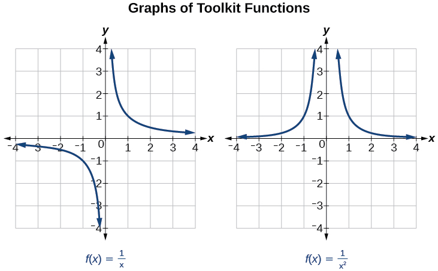{: #Figure_03_07_001}

Several things are apparent if we examine the graph of<math xmlns="http://www.w3.org/1998/Math/MathML"> <mrow> <mtext> </mtext><mi>f</mi><mo stretchy="false">(</mo><mi>x</mi><mo stretchy="false">)</mo><mo>=</mo><mfrac> <mn>1</mn> <mi>x</mi> </mfrac> <mo>.</mo> </mrow> </math>

1.  On the left branch of the graph, the curve approaches the *x*-axis
    <math xmlns="http://www.w3.org/1998/Math/MathML"> <mrow> <mtext> </mtext><mo stretchy="false">(</mo><mi>y</mi><mo>=</mo><mn>0</mn><mo stretchy="false">)</mo><mo> </mo><mtext>as</mtext><mo> </mo><mi>x</mi><mo stretchy="false">→</mo><mo>–</mo><mi>∞</mi><mo>.</mo> </mrow> </math>

2.  As the graph approaches
    <math xmlns="http://www.w3.org/1998/Math/MathML"> <mrow> <mtext> </mtext><mi>x</mi><mo>=</mo><mn>0</mn><mtext> </mtext> </mrow> </math>
    
    from the left, the curve drops, but as we approach zero from the right, the curve rises.
3.  Finally, on the right branch of the graph, the curves approaches the *x-*axis
    <math xmlns="http://www.w3.org/1998/Math/MathML"> <mrow> <mtext> </mtext><mo stretchy="false">(</mo><mi>y</mi><mo>=</mo><mn>0</mn><mo stretchy="false">)</mo><mo> </mo><mtext>as</mtext><mo> </mo><mi>x</mi><mo stretchy="false">→</mo><mi>∞</mi><mo>.</mo> </mrow> </math>
{: data-number-style="arabic"}

To summarize, we use **arrow notation**{: data-type="term"} to show that<math xmlns="http://www.w3.org/1998/Math/MathML"> <mrow> <mtext> </mtext><mi>x</mi><mtext> </mtext> </mrow> </math>

or<math xmlns="http://www.w3.org/1998/Math/MathML"> <mrow> <mtext> </mtext><mi>f</mi><mo stretchy="false">(</mo><mi>x</mi><mo stretchy="false">)</mo><mtext> </mtext> </mrow> </math>

is approaching a particular value. See [\[link\]](#Table_03_07_001).

| Symbol | Meaning |
|----------
| <math xmlns="http://www.w3.org/1998/Math/MathML"> <mrow> <mi>x</mi><mo stretchy="false">→</mo><msup> <mi>a</mi> <mo>−</mo> </msup> </mrow> </math>

 | <math xmlns="http://www.w3.org/1998/Math/MathML"> <mrow> <mi>x</mi><mtext> </mtext> </mrow> </math>

approaches<math xmlns="http://www.w3.org/1998/Math/MathML"> <mrow> <mtext> </mtext><mi>a</mi><mtext> </mtext> </mrow> </math>

from the left (<math xmlns="http://www.w3.org/1998/Math/MathML"> <mrow> <mi>x</mi><mo>&lt;</mo><mi>a</mi><mtext> </mtext> </mrow> </math>

but close to<math xmlns="http://www.w3.org/1998/Math/MathML"> <mrow> <mtext> </mtext><mi>a</mi> </mrow> </math>

) |
| <math xmlns="http://www.w3.org/1998/Math/MathML"> <mrow> <mi>x</mi><mo stretchy="false">→</mo><msup> <mi>a</mi> <mo>+</mo> </msup> </mrow> </math>

 | <math xmlns="http://www.w3.org/1998/Math/MathML"> <mrow> <mi>x</mi><mtext> </mtext> </mrow> </math>

approaches<math xmlns="http://www.w3.org/1998/Math/MathML"> <mrow> <mtext> </mtext><mi>a</mi><mtext> </mtext> </mrow> </math>

from the right (<math xmlns="http://www.w3.org/1998/Math/MathML"> <mrow> <mi>x</mi><mo>&gt;</mo><mi>a</mi><mtext> </mtext> </mrow> </math>

but close to<math xmlns="http://www.w3.org/1998/Math/MathML"> <mrow> <mtext> </mtext><mi>a</mi> </mrow> </math>

) |
| <math xmlns="http://www.w3.org/1998/Math/MathML"> <mrow> <mi>x</mi><mo stretchy="false">→</mo><mi>∞</mi> </mrow> </math>

 | <math xmlns="http://www.w3.org/1998/Math/MathML"> <mrow> <mi>x</mi><mtext> </mtext> </mrow> </math>

approaches infinity (<math xmlns="http://www.w3.org/1998/Math/MathML"> <mrow> <mi>x</mi><mtext> </mtext> </mrow> </math>

increases without bound) |
| <math xmlns="http://www.w3.org/1998/Math/MathML"> <mrow> <mi>x</mi><mo stretchy="false">→</mo><mo>−</mo><mi>∞</mi> </mrow> </math>

 | <math xmlns="http://www.w3.org/1998/Math/MathML"> <mrow> <mi>x</mi><mtext> </mtext> </mrow> </math>

approaches negative infinity (<math xmlns="http://www.w3.org/1998/Math/MathML"> <mrow> <mi>x</mi><mtext> </mtext> </mrow> </math>

decreases without bound) |
| <math xmlns="http://www.w3.org/1998/Math/MathML"> <mrow> <mi>f</mi><mo stretchy="false">(</mo><mi>x</mi><mo stretchy="false">)</mo><mo stretchy="false">→</mo><mi>∞</mi> </mrow> </math>

 | the output approaches infinity (the output increases without bound) |
| <math xmlns="http://www.w3.org/1998/Math/MathML"> <mrow> <mi>f</mi><mo stretchy="false">(</mo><mi>x</mi><mo stretchy="false">)</mo><mo stretchy="false">→</mo><mo>−</mo><mi>∞</mi> </mrow> </math>

 | the output approaches negative infinity (the output decreases without bound) |
| <math xmlns="http://www.w3.org/1998/Math/MathML"> <mrow> <mi>f</mi><mo stretchy="false">(</mo><mi>x</mi><mo stretchy="false">)</mo><mo stretchy="false">→</mo><mi>a</mi> </mrow> </math>

 | the output approaches<math xmlns="http://www.w3.org/1998/Math/MathML"> <mrow> <mtext> </mtext><mi>a</mi> </mrow> </math>

 |
{: #Table_03_07_001 summary=".."}

## Local Behavior of<math xmlns="http://www.w3.org/1998/Math/MathML"> <mrow> <mtext> </mtext><mi>f</mi><mo stretchy="false">(</mo><mi>x</mi><mo stretchy="false">)</mo><mo>=</mo><mfrac> <mn>1</mn> <mi>x</mi> </mfrac> </mrow> </math>

Let’s begin by looking at the reciprocal function,<math xmlns="http://www.w3.org/1998/Math/MathML"> <mrow> <mtext> </mtext><mi>f</mi><mo stretchy="false">(</mo><mi>x</mi><mo stretchy="false">)</mo><mo>=</mo><mfrac> <mn>1</mn> <mi>x</mi> </mfrac> <mo>.</mo><mtext> </mtext> </mrow> </math>

We cannot divide by zero, which means the function is undefined at<math xmlns="http://www.w3.org/1998/Math/MathML"> <mrow> <mtext> </mtext><mi>x</mi><mo>=</mo><mn>0</mn><mo>;</mo><mtext> </mtext> </mrow> </math>

so zero is not in the domain*.* As the input values approach zero from the left side (becoming very small, negative values), the function values decrease without bound (in other words, they approach negative infinity). We can see this behavior in [\[link\]](#Table_03_07_002).

| <strong><math xmlns="http://www.w3.org/1998/Math/MathML">
 <mi>x</mi>
</math></strong> | –0.1 | –0.01 | –0.001 | –0.0001 |
| <strong><math xmlns="http://www.w3.org/1998/Math/MathML">
 <mrow>
  <mi>f</mi><mo stretchy="false">(</mo><mi>x</mi><mo stretchy="false">)</mo><mo>=</mo><mfrac>
   <mn>1</mn>
   <mi>x</mi>
  </mfrac>
  
 </mrow>
</math></strong> | –10 | –100 | –1000 | –10,000 |
{: #Table_03_07_002 summary=".."}

We write in arrow notation

<math xmlns="http://www.w3.org/1998/Math/MathML" display="block"> <mrow> <mtext>as </mtext><mi>x</mi><mo stretchy="false">→</mo><msup> <mn>0</mn> <mo>−</mo> </msup> <mo>,</mo><mi>f</mi><mo stretchy="false">(</mo><mi>x</mi><mo stretchy="false">)</mo><mo stretchy="false">→</mo><mo>−</mo><mi>∞</mi> </mrow> </math>

As the input values approach zero from the right side (becoming very small, positive values), the function values increase without bound (approaching infinity). We can see this behavior in [\[link\]](#Table_03_07_003).

| <strong><math xmlns="http://www.w3.org/1998/Math/MathML">
 <mi>x</mi>
</math></strong> | 0.1 | 0.01 | 0.001 | 0.0001 |
| <strong><math xmlns="http://www.w3.org/1998/Math/MathML">
 <mrow>
  <mi>f</mi><mo stretchy="false">(</mo><mi>x</mi><mo stretchy="false">)</mo><mo>=</mo><mfrac>
   <mn>1</mn>
   <mi>x</mi>
  </mfrac>
  
 </mrow>
</math></strong> | 10 | 100 | 1000 | 10,000 |
{: #Table_03_07_003 summary=".."}

We write in arrow notation

<math xmlns="http://www.w3.org/1998/Math/MathML" display="block"> <mrow> <mtext>As </mtext><mi>x</mi><mo stretchy="false">→</mo><msup> <mn>0</mn> <mo>+</mo> </msup> <mo>,</mo><mo> </mo><mi>f</mi><mo stretchy="false">(</mo><mi>x</mi><mo stretchy="false">)</mo><mo stretchy="false">→</mo><mi>∞</mi><mo>.</mo> </mrow> </math>

See [\[link\]](#Figure_03_07_002).

 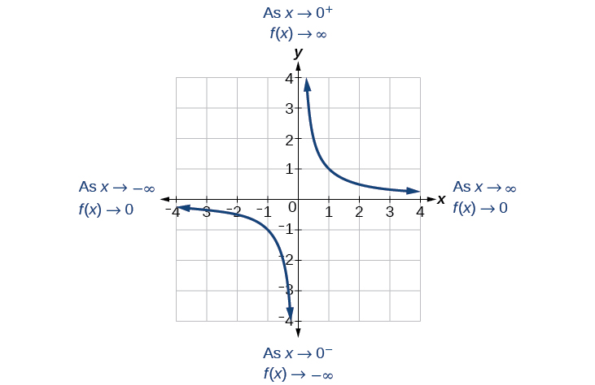{: #Figure_03_07_002}

This behavior creates a **vertical asymptote**, which is a vertical line that the graph approaches but never crosses. In this case, the graph is approaching the vertical line<math xmlns="http://www.w3.org/1998/Math/MathML"> <mrow> <mtext> </mtext><mi>x</mi><mo>=</mo><mn>0</mn><mtext> </mtext> </mrow> </math>

as the input becomes close to zero. See [\[link\]](#Figure_03_07_003).

 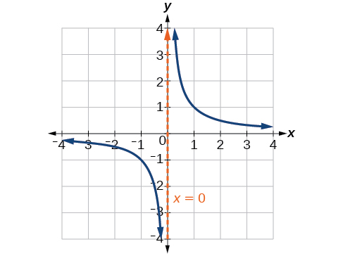{: #Figure_03_07_003}

Vertical Asymptote

A **vertical asymptote**{: data-type="term"} of a graph is a vertical line<math xmlns="http://www.w3.org/1998/Math/MathML"> <mrow> <mtext> </mtext><mi>x</mi><mo>=</mo><mi>a</mi><mtext> </mtext> </mrow> </math>

where the graph tends toward positive or negative infinity as the inputs approach<math xmlns="http://www.w3.org/1998/Math/MathML"> <mrow> <mtext> </mtext><mi>a</mi><mo>.</mo><mtext> </mtext> </mrow> </math>

We write

<math xmlns="http://www.w3.org/1998/Math/MathML" display="block"> <mrow> <mtext>As </mtext><mi>x</mi><mo stretchy="false">→</mo><mi>a</mi><mo>,</mo><mi>f</mi><mo stretchy="false">(</mo><mi>x</mi><mo stretchy="false">)</mo><mo stretchy="false">→</mo><mi>∞</mi><mo>,</mo><mo> </mo><mtext>or as </mtext><mi>x</mi><mo stretchy="false">→</mo><mi>a</mi><mo>,</mo><mi>f</mi><mo stretchy="false">(</mo><mi>x</mi><mo stretchy="false">)</mo><mo stretchy="false">→</mo><mo>−</mo><mi>∞</mi><mo>.</mo> </mrow> </math>

## End Behavior of<math xmlns="http://www.w3.org/1998/Math/MathML"> <mrow> <mtext> </mtext><mi>f</mi><mo stretchy="false">(</mo><mi>x</mi><mo stretchy="false">)</mo><mo>=</mo><mfrac> <mn>1</mn> <mi>x</mi> </mfrac> </mrow> </math>

As the values of<math xmlns="http://www.w3.org/1998/Math/MathML"> <mrow> <mtext> </mtext><mi>x</mi><mtext> </mtext> </mrow> </math>

approach infinity, the function values approach 0. As the values of<math xmlns="http://www.w3.org/1998/Math/MathML"> <mrow> <mtext> </mtext><mi>x</mi><mtext> </mtext> </mrow> </math>

approach negative infinity, the function values approach 0. See [\[link\]](#Figure_03_07_004). Symbolically, using arrow notation

<math xmlns="http://www.w3.org/1998/Math/MathML" display="block"> <mrow> <mtext>As </mtext><mi>x</mi><mo stretchy="false">→</mo><mi>∞</mi><mo>,</mo><mi>f</mi><mo stretchy="false">(</mo><mi>x</mi><mo stretchy="false">)</mo><mo stretchy="false">→</mo><mn>0</mn><mo>,</mo><mtext>and as </mtext><mi>x</mi><mo stretchy="false">→</mo><mo>−</mo><mi>∞</mi><mo>,</mo><mi>f</mi><mo stretchy="false">(</mo><mi>x</mi><mo stretchy="false">)</mo><mo stretchy="false">→</mo><mn>0.</mn> </mrow> </math>

 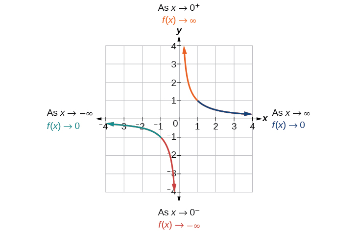{: #Figure_03_07_004}

Based on this overall behavior and the graph, we can see that the function approaches 0 but never actually reaches 0; it seems to level off as the inputs become large. This behavior creates a **horizontal asymptote**, a horizontal line that the graph approaches as the input increases or decreases without bound. In this case, the graph is approaching the horizontal line<math xmlns="http://www.w3.org/1998/Math/MathML"> <mrow> <mtext> </mtext><mi>y</mi><mo>=</mo><mn>0.</mn><mtext> </mtext> </mrow> </math>

See [\[link\]](#Figure_03_07_005)**.**

 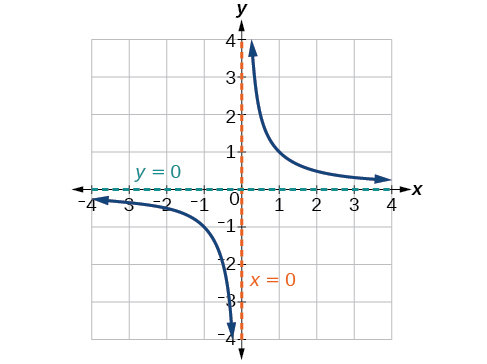{: #Figure_03_07_005}

Horizontal Asymptote

A **horizontal asymptote**{: data-type="term"} of a graph is a horizontal line<math xmlns="http://www.w3.org/1998/Math/MathML"> <mrow> <mtext> </mtext><mi>y</mi><mo>=</mo><mi>b</mi><mtext> </mtext> </mrow> </math>

where the graph approaches the line as the inputs increase or decrease without bound. We write

<math xmlns="http://www.w3.org/1998/Math/MathML"> <mrow> <mtext> </mtext><mtext>As </mtext><mi>x</mi><mo stretchy="false">→</mo><mi>∞</mi><mtext> or </mtext><mi>x</mi><mo stretchy="false">→</mo><mo>−</mo><mi>∞</mi><mo>,</mo><mtext> </mtext><mi>f</mi><mo stretchy="false">(</mo><mi>x</mi><mo stretchy="false">)</mo><mo stretchy="false">→</mo><mi>b</mi><mo>.</mo> </mrow> </math>

Using Arrow Notation

Use arrow notation to describe the end behavior and local behavior of the function graphed in [[link]](#Figure_03_07_006).

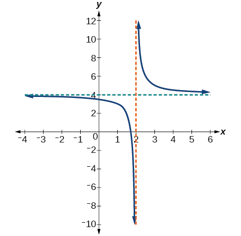{: #Figure_03_07_006}

Notice that the graph is showing a vertical asymptote at<math xmlns="http://www.w3.org/1998/Math/MathML"> <mrow> <mtext> </mtext><mi>x</mi><mo>=</mo><mn>2</mn><mo>,</mo><mtext> </mtext> </mrow> </math>

which tells us that the function is undefined at<math xmlns="http://www.w3.org/1998/Math/MathML"> <mrow> <mtext> </mtext><mi>x</mi><mo>=</mo><mn>2.</mn> </mrow> </math>

<math xmlns="http://www.w3.org/1998/Math/MathML" display="block"> <mrow> <mtext>As </mtext><mi>x</mi><mo stretchy="false">→</mo><msup> <mn>2</mn> <mo>−</mo> </msup> <mo>,</mo><mi>f</mi><mo stretchy="false">(</mo><mi>x</mi><mo stretchy="false">)</mo><mo stretchy="false">→</mo><mo>−</mo><mi>∞</mi><mo>,</mo><mtext> and as </mtext><mi>x</mi><mo stretchy="false">→</mo><msup> <mn>2</mn> <mo>+</mo> </msup> <mo>,</mo><mtext> </mtext><mi>f</mi><mo stretchy="false">(</mo><mi>x</mi><mo stretchy="false">)</mo><mo stretchy="false">→</mo><mi>∞</mi><mo>.</mo> </mrow> </math>

And as the inputs decrease without bound, the graph appears to be leveling off at output values of 4, indicating a horizontal asymptote at<math xmlns="http://www.w3.org/1998/Math/MathML"> <mrow> <mtext> </mtext><mi>y</mi><mo>=</mo><mn>4.</mn><mtext> </mtext> </mrow> </math>

As the inputs increase without bound, the graph levels off at 4.

<math xmlns="http://www.w3.org/1998/Math/MathML" display="block"> <mrow> <mtext>As </mtext><mi>x</mi><mo stretchy="false">→</mo><mi>∞</mi><mo>,</mo><mtext> </mtext><mi>f</mi><mo stretchy="false">(</mo><mi>x</mi><mo stretchy="false">)</mo><mo stretchy="false">→</mo><mn>4</mn><mtext> and as </mtext><mi>x</mi><mo stretchy="false">→</mo><mo>−</mo><mi>∞</mi><mo>,</mo><mtext> </mtext><mi>f</mi><mo stretchy="false">(</mo><mi>x</mi><mo stretchy="false">)</mo><mo stretchy="false">→</mo><mn>4.</mn> </mrow> </math>

Use arrow notation to describe the end behavior and local behavior for the reciprocal squared function.

End behavior: as<math xmlns="http://www.w3.org/1998/Math/MathML"> <mrow> <mtext> </mtext><mi>x</mi><mo stretchy="false">→</mo><mo>±</mo><mi>∞</mi><mo>,</mo><mo> </mo><mi>f</mi><mo stretchy="false">(</mo><mi>x</mi><mo stretchy="false">)</mo><mo stretchy="false">→</mo><mn>0</mn><mo>;</mo><mtext> </mtext> </mrow> </math>

Local behavior: as<math xmlns="http://www.w3.org/1998/Math/MathML"> <mrow> <mtext> </mtext><mi>x</mi><mo stretchy="false">→</mo><mn>0</mn><mo>,</mo><mo> </mo><mi>f</mi><mo stretchy="false">(</mo><mi>x</mi><mo stretchy="false">)</mo><mo stretchy="false">→</mo><mi>∞</mi><mtext> </mtext> </mrow> </math>

(there are no *x*- or *y*-intercepts)

Using Transformations to Graph a Rational Function

Sketch a graph of the reciprocal function shifted two units to the left and up three units. Identify the horizontal and vertical asymptotes of the graph, if any.

Shifting the graph left 2 and up 3 would result in the function

<math xmlns="http://www.w3.org/1998/Math/MathML" display="block"> <mrow> <mi>f</mi><mo stretchy="false">(</mo><mi>x</mi><mo stretchy="false">)</mo><mo>=</mo><mfrac> <mn>1</mn> <mrow> <mi>x</mi><mo>+</mo><mn>2</mn> </mrow> </mfrac> <mo>+</mo><mn>3</mn> </mrow> </math>

or equivalently, by giving the terms a common denominator,

<math xmlns="http://www.w3.org/1998/Math/MathML" display="block"> <mrow> <mi>f</mi><mo stretchy="false">(</mo><mi>x</mi><mo stretchy="false">)</mo><mo>=</mo><mfrac> <mrow> <mn>3</mn><mi>x</mi><mo>+</mo><mn>7</mn> </mrow> <mrow> <mi>x</mi><mo>+</mo><mn>2</mn> </mrow> </mfrac> </mrow> </math>

The graph of the shifted function is displayed in [[link]](#Figure_03_07_007).

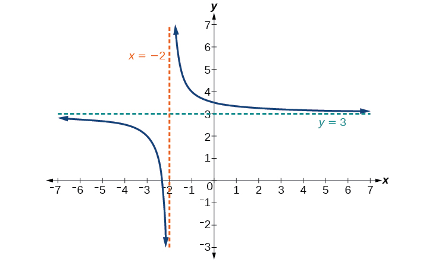{: #Figure_03_07_007}

Notice that this function is undefined at<math xmlns="http://www.w3.org/1998/Math/MathML"> <mrow> <mtext> </mtext><mi>x</mi><mo>=</mo><mn>−2</mn><mo>,</mo><mtext> </mtext> </mrow> </math>

and the graph also is showing a vertical asymptote at<math xmlns="http://www.w3.org/1998/Math/MathML"> <mrow> <mtext> </mtext><mi>x</mi><mo>=</mo><mn>−2.</mn> </mrow> </math>

<math xmlns="http://www.w3.org/1998/Math/MathML" display="block"> <mrow> <mtext>As </mtext><mi>x</mi><mo stretchy="false">→</mo><mo>−</mo><msup> <mn>2</mn> <mo>−</mo> </msup> <mo>,</mo><mo> </mo><mi>f</mi><mo stretchy="false">(</mo><mi>x</mi><mo stretchy="false">)</mo><mo stretchy="false">→</mo><mo>−</mo><mi>∞</mi><mo>,</mo><mtext>and as</mtext><mo> </mo><mi>x</mi><mo stretchy="false">→</mo><mo>−</mo><msup> <mn>2</mn> <mo>+</mo> </msup> <mo>,</mo><mo> </mo><mi>f</mi><mo stretchy="false">(</mo><mi>x</mi><mo stretchy="false">)</mo><mo stretchy="false">→</mo><mi>∞</mi><mo>.</mo> </mrow> </math>

As the inputs increase and decrease without bound, the graph appears to be leveling off at output values of 3, indicating a horizontal asymptote at<math xmlns="http://www.w3.org/1998/Math/MathML"> <mrow> <mtext> </mtext><mi>y</mi><mo>=</mo><mn>3.</mn> </mrow> </math>

<math xmlns="http://www.w3.org/1998/Math/MathML" display="block"> <mrow> <mtext>As </mtext><mi>x</mi><mo stretchy="false">→</mo><mo>±</mo><mi>∞</mi><mo>,</mo><mo> </mo><mi>f</mi><mo stretchy="false">(</mo><mi>x</mi><mo stretchy="false">)</mo><mo stretchy="false">→</mo><mn>3.</mn> </mrow> </math>

Analysis

Notice that horizontal and vertical asymptotes are shifted left 2 and up 3 along with the function.

Sketch the graph, and find the horizontal and vertical asymptotes of the reciprocal squared function that has been shifted right 3 units and down 4 units.

 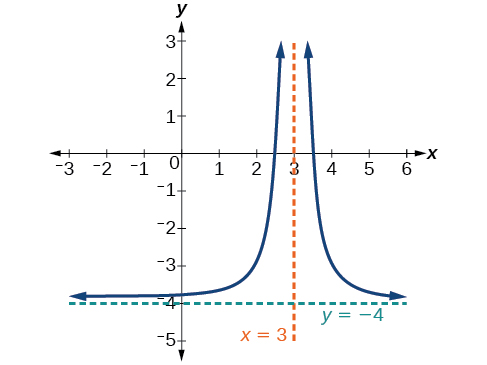 
The function and the asymptotes are shifted 3 units right and 4 units down. As<math xmlns="http://www.w3.org/1998/Math/MathML"> <mrow> <mtext> </mtext><mi>x</mi><mo stretchy="false">→</mo><mn>3</mn><mo>,</mo><mi>f</mi><mo stretchy="false">(</mo><mi>x</mi><mo stretchy="false">)</mo><mo stretchy="false">→</mo><mi>∞</mi><mo>,</mo><mtext> </mtext> </mrow> </math>

and as<math xmlns="http://www.w3.org/1998/Math/MathML"> <mrow> <mtext> </mtext><mi>x</mi><mo stretchy="false">→</mo><mo>±</mo><mi>∞</mi><mo>,</mo><mi>f</mi><mo stretchy="false">(</mo><mi>x</mi><mo stretchy="false">)</mo><mo stretchy="false">→</mo><mo>−</mo><mn>4.</mn> </mrow> </math>

The function is<math xmlns="http://www.w3.org/1998/Math/MathML"> <mrow> <mtext> </mtext><mi>f</mi><mo stretchy="false">(</mo><mi>x</mi><mo stretchy="false">)</mo><mo>=</mo><mfrac> <mn>1</mn> <mrow> <msup> <mrow> <mo stretchy="false">(</mo><mi>x</mi><mo>−</mo><mn>3</mn><mo stretchy="false">)</mo> </mrow> <mn>2</mn> </msup> </mrow> </mfrac> <mo>−</mo><mn>4.</mn> </mrow> </math>

# Solving Applied Problems Involving Rational Functions

In [\[link\]](#Example_03_07_02), we shifted a toolkit function in a way that resulted in the function<math xmlns="http://www.w3.org/1998/Math/MathML"> <mrow> <mtext> </mtext><mi>f</mi><mo stretchy="false">(</mo><mi>x</mi><mo stretchy="false">)</mo><mo>=</mo><mfrac> <mrow> <mn>3</mn><mi>x</mi><mo>+</mo><mn>7</mn> </mrow> <mrow> <mi>x</mi><mo>+</mo><mn>2</mn> </mrow> </mfrac> <mo>.</mo><mtext> </mtext> </mrow> </math>

This is an example of a rational function. A **rational function** is a function that can be written as the quotient of two polynomial functions. Many real-world problems require us to find the ratio of two polynomial functions. Problems involving rates and concentrations often involve rational functions.

Rational Function

A **rational function**{: data-type="term"} is a function that can be written as the quotient of two polynomial functions<math xmlns="http://www.w3.org/1998/Math/MathML"> <mrow> <mtext> </mtext><mi>P</mi><mo stretchy="false">(</mo><mi>x</mi><mo stretchy="false">)</mo><mo> </mo><mtext>and</mtext><mo> </mo><mi>Q</mi><mo stretchy="false">(</mo><mi>x</mi><mo stretchy="false">)</mo><mo>.</mo> </mrow> </math>

<math xmlns="http://www.w3.org/1998/Math/MathML" display="block"> <mrow> <mi>f</mi><mo stretchy="false">(</mo><mi>x</mi><mo stretchy="false">)</mo><mo>=</mo><mfrac> <mrow> <mi>P</mi><mo stretchy="false">(</mo><mi>x</mi><mo stretchy="false">)</mo> </mrow> <mrow> <mi>Q</mi><mo stretchy="false">(</mo><mi>x</mi><mo stretchy="false">)</mo> </mrow> </mfrac> <mo>=</mo><mfrac> <mrow> <msub> <mi>a</mi> <mi>p</mi> </msub> <msup> <mi>x</mi> <mi>p</mi> </msup> <mo>+</mo><msub> <mi>a</mi> <mrow> <mi>p</mi><mo>−</mo><mn>1</mn> </mrow> </msub> <msup> <mi>x</mi> <mrow> <mi>p</mi><mo>−</mo><mn>1</mn> </mrow> </msup> <mo>+</mo><mn>...</mn><mo>+</mo><msub> <mi>a</mi> <mn>1</mn> </msub> <mi>x</mi><mo>+</mo><msub> <mi>a</mi> <mn>0</mn> </msub> </mrow> <mrow> <msub> <mi>b</mi> <mi>q</mi> </msub> <msup> <mi>x</mi> <mi>q</mi> </msup> <mo>+</mo><msub> <mi>b</mi> <mrow> <mi>q</mi><mo>−</mo><mn>1</mn> </mrow> </msub> <msup> <mi>x</mi> <mrow> <mi>q</mi><mo>−</mo><mn>1</mn> </mrow> </msup> <mo>+</mo><mn>...</mn><mo>+</mo><msub> <mi>b</mi> <mn>1</mn> </msub> <mi>x</mi><mo>+</mo><msub> <mi>b</mi> <mn>0</mn> </msub> </mrow> </mfrac> <mo>,</mo><mi>Q</mi><mo stretchy="false">(</mo><mi>x</mi><mo stretchy="false">)</mo><mo>≠</mo><mn>0</mn> </mrow> </math>

Solving an Applied Problem Involving a Rational Function

A large mixing tank currently contains 100 gallons of water into which 5 pounds of sugar have been mixed. A tap will open pouring 10 gallons per minute of water into the tank at the same time sugar is poured into the tank at a rate of 1 pound per minute. Find the concentration (pounds per gallon) of sugar in the tank after 12 minutes. Is that a greater concentration than at the beginning?

Let<math xmlns="http://www.w3.org/1998/Math/MathML"> <mrow> <mtext> </mtext><mi>t</mi><mtext> </mtext> </mrow> </math>

be the number of minutes since the tap opened. Since the water increases at 10 gallons per minute, and the sugar increases at 1 pound per minute, these are constant rates of change. This tells us the amount of water in the tank is changing linearly, as is the amount of sugar in the tank. We can write an equation independently for each:

<math xmlns="http://www.w3.org/1998/Math/MathML" display="block"> <mrow> <mtable> <mtr> <mtd columnalign="right"> <mrow> <mtext>water: </mtext><mi>W</mi><mo stretchy="false">(</mo><mi>t</mi><mo stretchy="false">)</mo></mrow> </mtd> <mtd> <mo>=</mo> </mtd> <mtd columnalign="left"> <mrow> <mn>100</mn><mo>+</mo><mn>10</mn><mi>t</mi><mtext> in gallons</mtext></mrow> </mtd> </mtr> <mtr> <mtd columnalign="right"> <mrow> <mtext>sugar: </mtext><mi>S</mi><mo stretchy="false">(</mo><mi>t</mi><mo stretchy="false">)</mo></mrow> </mtd> <mtd> <mo>=</mo> </mtd> <mtd columnalign="left"> <mrow> <mn>5</mn><mo>+</mo><mn>1</mn><mi>t</mi><mtext> in pounds</mtext></mrow> </mtd> </mtr> </mtable></mrow> </math>

The concentration,<math xmlns="http://www.w3.org/1998/Math/MathML"> <mrow> <mtext> </mtext><mi>C</mi><mo>,</mo><mtext> </mtext> </mrow> </math>

will be the ratio of pounds of sugar to gallons of water

<math xmlns="http://www.w3.org/1998/Math/MathML" display="block"> <mrow> <mi>C</mi><mo stretchy="false">(</mo><mi>t</mi><mo stretchy="false">)</mo><mo>=</mo><mfrac> <mrow> <mn>5</mn><mo>+</mo><mi>t</mi> </mrow> <mrow> <mn>100</mn><mo>+</mo><mn>10</mn><mi>t</mi> </mrow> </mfrac> </mrow> </math>

The concentration after 12 minutes is given by evaluating<math xmlns="http://www.w3.org/1998/Math/MathML"> <mrow> <mtext> </mtext><mi>C</mi><mrow><mo>(</mo> <mi>t</mi> <mo>)</mo></mrow><mtext> </mtext> </mrow> </math>

at<math xmlns="http://www.w3.org/1998/Math/MathML"> <mrow> <mtext> </mtext><mi>t</mi><mo>=</mo><mtext> </mtext><mn>12.</mn> </mrow> </math>

<math xmlns="http://www.w3.org/1998/Math/MathML" display="block"> <mrow> <mtable> <mtr rowalign="center"> <mtd columnalign="right"> <mrow> <mi>C</mi><mo stretchy="false">(</mo><mn>12</mn><mo stretchy="false">)</mo></mrow> </mtd> <mtd rowalign="center"> <mo>=</mo> </mtd> <mtd columnalign="left" rowalign="center"> <mrow> <mfrac> <mrow> <mn>5</mn><mo>+</mo><mn>12</mn></mrow> <mrow> <mn>100</mn><mo>+</mo><mn>10</mn><mo stretchy="false">(</mo><mn>12</mn><mo stretchy="false">)</mo></mrow> </mfrac> </mrow> </mtd> </mtr> <mtr rowalign="center"> <mtd rowalign="center" /> <mtd rowalign="center"><mo>=</mo></mtd> <mtd columnalign="left" rowalign="center"> <mrow> <mfrac> <mrow> <mn>17</mn></mrow> <mrow> <mn>220</mn></mrow> </mfrac> </mrow> </mtd> </mtr> </mtable></mrow> </math>

This means the concentration is 17 pounds of sugar to 220 gallons of water.

At the beginning, the concentration is

<math xmlns="http://www.w3.org/1998/Math/MathML" display="block"> <mrow> <mtable> <mtr rowalign="center"> <mtd rowalign="center" columnalign="right"> <mrow> <mi>C</mi><mo stretchy="false">(</mo><mn>0</mn><mo stretchy="false">)</mo></mrow> </mtd> <mtd rowalign="center"> <mo>=</mo> </mtd> <mtd rowalign="center" columnalign="left"> <mrow> <mfrac> <mrow> <mn>5</mn><mo>+</mo><mn>0</mn></mrow> <mrow> <mn>100</mn><mo>+</mo><mn>10</mn><mo stretchy="false">(</mo><mn>0</mn><mo stretchy="false">)</mo></mrow> </mfrac> </mrow> </mtd> </mtr> <mtr rowalign="center"> <mtd rowalign="center" /> <mtd rowalign="center"><mo>=</mo></mtd> <mtd rowalign="center" columnalign="left"> <mrow> <mfrac> <mn>1</mn> <mrow> <mn>20</mn></mrow> </mfrac> </mrow> </mtd> </mtr> </mtable></mrow> </math>

Since<math xmlns="http://www.w3.org/1998/Math/MathML"> <mrow> <mtext> </mtext><mfrac> <mrow> <mn>17</mn> </mrow> <mrow> <mn>220</mn> </mrow> </mfrac> <mo>≈</mo><mn>0.08</mn><mo>&gt;</mo><mfrac> <mn>1</mn> <mrow> <mn>20</mn> </mrow> </mfrac> <mo>=</mo><mn>0.05</mn><mo>,</mo><mtext> </mtext> </mrow> </math>

the concentration is greater after 12 minutes than at the beginning.

There are 1,200 freshmen and 1,500 sophomores at a prep rally at noon. After 12 p.m., 20 freshmen arrive at the rally every five minutes while 15 sophomores leave the rally. Find the ratio of freshmen to sophomores at 1 p.m.

<math xmlns="http://www.w3.org/1998/Math/MathML"> <mrow> <mfrac> <mrow> <mn>12</mn> </mrow> <mrow> <mn>11</mn> </mrow> </mfrac> </mrow> </math>

# Finding the Domains of Rational Functions

A **vertical asymptote**{: data-type="term" .no-emphasis} represents a value at which a rational function is undefined, so that value is not in the domain of the function. A reciprocal function cannot have values in its domain that cause the denominator to equal zero. In general, to find the domain of a rational function, we need to determine which inputs would cause division by zero.

Domain of a Rational Function

The domain of a rational function includes all real numbers except those that cause the denominator to equal zero.

**Given a rational function, find the domain.**

1.  Set the denominator equal to zero.
2.  Solve to find the *x*-values that cause the denominator to equal zero.
3.  The domain is all real numbers except those found in Step 2.
{: data-number-style="arabic"}

Finding the Domain of a Rational Function

Find the domain of<math xmlns="http://www.w3.org/1998/Math/MathML"> <mrow> <mtext> </mtext><mi>f</mi><mo stretchy="false">(</mo><mi>x</mi><mo stretchy="false">)</mo><mo>=</mo><mfrac> <mrow> <mi>x</mi><mo>+</mo><mn>3</mn> </mrow> <mrow> <msup> <mi>x</mi> <mn>2</mn> </msup> <mo>−</mo><mn>9</mn> </mrow> </mfrac> <mo>.</mo> </mrow> </math>

Begin by setting the denominator equal to zero and solving.

<math xmlns="http://www.w3.org/1998/Math/MathML" display="block"> <mrow> <mtable> <mtr> <mtd columnalign="right"> <mrow> <msup> <mi>x</mi> <mn>2</mn> </msup> <mo>−</mo><mn>9</mn></mrow> </mtd> <mtd> <mo>=</mo> </mtd> <mtd columnalign="left"> <mn>0</mn> </mtd> </mtr> <mtr> <mtd columnalign="right"> <mrow> <msup> <mi>x</mi> <mn>2</mn> </msup> </mrow> </mtd> <mtd> <mo>=</mo> </mtd> <mtd columnalign="left"> <mn>9</mn> </mtd> </mtr> <mtr> <mtd columnalign="right"> <mi>x</mi> </mtd> <mtd> <mo>=</mo> </mtd> <mtd columnalign="left"> <mrow> <mn>±3</mn></mrow> </mtd> </mtr> </mtable></mrow> </math>

The denominator is equal to zero when<math xmlns="http://www.w3.org/1998/Math/MathML"> <mrow> <mtext> </mtext><mi>x</mi><mo>=</mo><mo>±</mo><mn>3.</mn><mtext> </mtext> </mrow> </math>

The domain of the function is all real numbers except<math xmlns="http://www.w3.org/1998/Math/MathML"> <mrow> <mtext> </mtext><mi>x</mi><mo>=</mo><mo>±</mo><mn>3.</mn> </mrow> </math>

Analysis

A graph of this function, as shown in [[link]](#Figure_03_07_009), confirms that the function is not defined when<math xmlns="http://www.w3.org/1998/Math/MathML"> <mrow> <mtext> </mtext><mi>x</mi><mo>=</mo><mo>±</mo><mn>3.</mn> </mrow> </math>

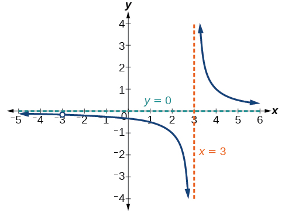{: #Figure_03_07_009}

There is a vertical asymptote at<math xmlns="http://www.w3.org/1998/Math/MathML"> <mrow> <mtext> </mtext><mi>x</mi><mo>=</mo><mn>3</mn><mtext> </mtext> </mrow> </math>

and a hole in the graph at<math xmlns="http://www.w3.org/1998/Math/MathML"> <mrow> <mtext> </mtext><mi>x</mi><mo>=</mo><mn>−3.</mn><mtext> </mtext> </mrow> </math>

We will discuss these types of holes in greater detail later in this section.

Find the domain of<math xmlns="http://www.w3.org/1998/Math/MathML"> <mrow> <mtext> </mtext><mi>f</mi><mo stretchy="false">(</mo><mi>x</mi><mo stretchy="false">)</mo><mo>=</mo><mfrac> <mrow> <mn>4</mn><mi>x</mi> </mrow> <mrow> <mn>5</mn><mo stretchy="false">(</mo><mi>x</mi><mo>−</mo><mn>1</mn><mo stretchy="false">)</mo><mo stretchy="false">(</mo><mi>x</mi><mo>−</mo><mn>5</mn><mo stretchy="false">)</mo> </mrow> </mfrac> <mo>.</mo> </mrow> </math>

The domain is all real numbers except<math xmlns="http://www.w3.org/1998/Math/MathML"> <mrow> <mtext> </mtext><mi>x</mi><mo>=</mo><mn>1</mn><mtext> </mtext> </mrow> </math>

and<math xmlns="http://www.w3.org/1998/Math/MathML"> <mrow> <mtext> </mtext><mi>x</mi><mo>=</mo><mn>5.</mn> </mrow> </math>

# Identifying Vertical Asymptotes of Rational Functions

By looking at the graph of a rational function, we can investigate its local behavior and easily see whether there are asymptotes. We may even be able to approximate their location. Even without the graph, however, we can still determine whether a given rational function has any asymptotes, and calculate their location.

## Vertical Asymptotes

The vertical asymptotes of a rational function may be found by examining the factors of the denominator that are not common to the factors in the numerator. Vertical asymptotes occur at the zeros of such factors.

**Given a rational function, identify any vertical asymptotes of its graph.**

1.  Factor the numerator and denominator.
2.  Note any restrictions in the domain of the function.
3.  Reduce the expression by canceling common factors in the numerator and the denominator.
4.  Note any values that cause the denominator to be zero in this simplified version. These are where the vertical asymptotes occur.
5.  Note any restrictions in the domain where asymptotes do not occur. These are removable discontinuities, or “holes.”
{: data-number-style="arabic"}

Identifying Vertical Asymptotes

Find the vertical asymptotes of the graph of<math xmlns="http://www.w3.org/1998/Math/MathML"> <mrow> <mtext> </mtext><mi>k</mi><mo stretchy="false">(</mo><mi>x</mi><mo stretchy="false">)</mo><mo>=</mo><mfrac> <mrow> <mn>5</mn><mo>+</mo><mn>2</mn><msup> <mi>x</mi> <mn>2</mn> </msup> </mrow> <mrow> <mn>2</mn><mo>−</mo><mi>x</mi><mo>−</mo><msup> <mi>x</mi> <mn>2</mn> </msup> </mrow> </mfrac> <mo>.</mo> </mrow> </math>

First, factor the numerator and denominator.

<math xmlns="http://www.w3.org/1998/Math/MathML" display="block"> <mrow> <mtable> <mtr rowalign="center"> <mtd rowalign="center" columnalign="right"> <mrow> <mi>k</mi><mo stretchy="false">(</mo><mi>x</mi><mo stretchy="false">)</mo></mrow> </mtd> <mtd rowalign="center"> <mo>=</mo> </mtd> <mtd rowalign="center" columnalign="left"> <mrow> <mfrac> <mrow> <mn>5</mn><mo>+</mo><mn>2</mn><msup> <mi>x</mi> <mn>2</mn> </msup> </mrow> <mrow> <mn>2</mn><mo>−</mo><mi>x</mi><mo>−</mo><msup> <mi>x</mi> <mn>2</mn> </msup> </mrow> </mfrac> </mrow> </mtd> </mtr> <mtr rowalign="center"> <mtd rowalign="center" /> <mtd rowalign="center"><mo>=</mo></mtd> <mtd rowalign="center" columnalign="left"> <mrow> <mfrac> <mrow> <mn>5</mn><mo>+</mo><mn>2</mn><msup> <mi>x</mi> <mn>2</mn> </msup> </mrow> <mrow> <mo stretchy="false">(</mo><mn>2</mn><mo>+</mo><mi>x</mi><mo stretchy="false">)</mo><mo stretchy="false">(</mo><mn>1</mn><mo>−</mo><mi>x</mi><mo stretchy="false">)</mo></mrow> </mfrac> </mrow> </mtd> </mtr> </mtable></mrow> </math>

To find the vertical asymptotes, we determine where this function will be undefined by setting the denominator equal to zero:

<math xmlns="http://www.w3.org/1998/Math/MathML" display="block"> <mrow> <mtable> <mtr> <mtd columnalign="right"> <mrow> <mo stretchy="false">(</mo><mn>2</mn><mo>+</mo><mi>x</mi><mo stretchy="false">)</mo><mo stretchy="false">(</mo><mn>1</mn><mo>−</mo><mi>x</mi><mo stretchy="false">)</mo></mrow> </mtd> <mtd> <mo>=</mo> </mtd> <mtd columnalign="left"> <mn>0</mn> </mtd> </mtr> <mtr> <mtd columnalign="right"> <mi>x</mi> </mtd> <mtd> <mo>=</mo> </mtd> <mtd columnalign="left"> <mrow> <mn>−2</mn><mo>,</mo><mn>1</mn></mrow> </mtd> </mtr> </mtable></mrow> </math>

Neither<math xmlns="http://www.w3.org/1998/Math/MathML"> <mrow> <mtext> </mtext><mi>x</mi><mo>=</mo><mn>–2</mn><mtext> </mtext> </mrow> </math>

nor<math xmlns="http://www.w3.org/1998/Math/MathML"> <mrow> <mtext> </mtext><mi>x</mi><mo>=</mo><mn>1</mn><mtext> </mtext> </mrow> </math>

are zeros of the numerator, so the two values indicate two vertical asymptotes. The graph in [[link]](#Figure_03_07_010) confirms the location of the two vertical asymptotes.

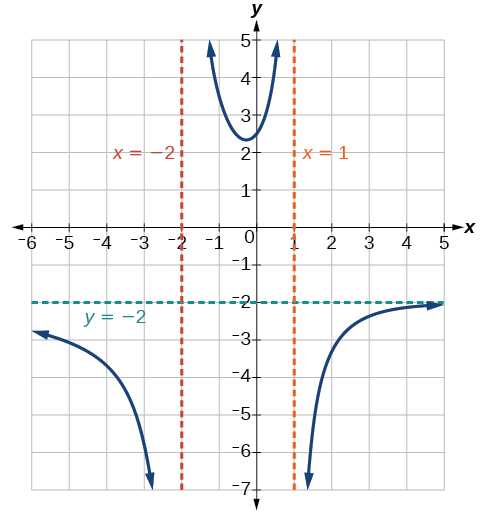{: #Figure_03_07_010}

## Removable Discontinuities

Occasionally, a graph will contain a hole: a single point where the graph is not defined, indicated by an open circle. We call such a hole a **removable discontinuity**{: data-type="term"}.

For example, the function<math xmlns="http://www.w3.org/1998/Math/MathML"> <mrow> <mtext> </mtext><mi>f</mi><mo stretchy="false">(</mo><mi>x</mi><mo stretchy="false">)</mo><mo>=</mo><mfrac> <mrow> <msup> <mi>x</mi> <mn>2</mn> </msup> <mo>−</mo><mn>1</mn> </mrow> <mrow> <msup> <mi>x</mi> <mn>2</mn> </msup> <mo>−</mo><mn>2</mn><mi>x</mi><mo>−</mo><mn>3</mn> </mrow> </mfrac> <mtext> </mtext> </mrow> </math>

may be re-written by factoring the numerator and the denominator.

<math xmlns="http://www.w3.org/1998/Math/MathML" display="block"> <mrow> <mi>f</mi><mo stretchy="false">(</mo><mi>x</mi><mo stretchy="false">)</mo><mo>=</mo><mfrac> <mrow> <mrow><mo>(</mo> <mrow> <mi>x</mi><mo>+</mo><mn>1</mn> </mrow> <mo>)</mo></mrow><mrow><mo>(</mo> <mrow> <mi>x</mi><mo>−</mo><mn>1</mn> </mrow> <mo>)</mo></mrow> </mrow> <mrow> <mrow><mo>(</mo> <mrow> <mi>x</mi><mo>+</mo><mn>1</mn> </mrow> <mo>)</mo></mrow><mrow><mo>(</mo> <mrow> <mi>x</mi><mo>−</mo><mn>3</mn> </mrow> <mo>)</mo></mrow> </mrow> </mfrac> </mrow> </math>

Notice that<math xmlns="http://www.w3.org/1998/Math/MathML"> <mrow> <mtext> </mtext><mi>x</mi><mo>+</mo><mn>1</mn><mtext> </mtext> </mrow> </math>

is a common factor to the numerator and the denominator. The zero of this factor,<math xmlns="http://www.w3.org/1998/Math/MathML"> <mrow> <mtext> </mtext><mi>x</mi><mo>=</mo><mn>−1</mn><mo>,</mo><mtext> </mtext> </mrow> </math>

is the location of the removable discontinuity. Notice also that<math xmlns="http://www.w3.org/1998/Math/MathML"> <mrow> <mtext> </mtext><mi>x</mi><mo>–</mo><mn>3</mn><mtext> </mtext> </mrow> </math>

is not a factor in both the numerator and denominator. The zero of this factor,<math xmlns="http://www.w3.org/1998/Math/MathML"> <mrow> <mtext> </mtext><mi>x</mi><mo>=</mo><mn>3</mn><mo>,</mo><mtext> </mtext> </mrow> </math>

is the vertical asymptote. See [\[link\]](#Figure_03_07_011). \[Note that removable discontinuities may not be visible when we use a graphing calculator, depending upon the window selected.\]

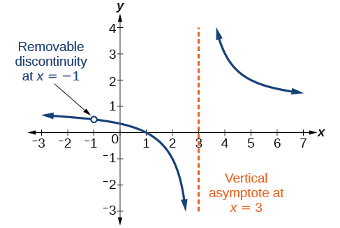{: #Figure_03_07_011}

Removable Discontinuities of Rational Functions

A **removable discontinuity**{: data-type="term"} occurs in the graph of a rational function at<math xmlns="http://www.w3.org/1998/Math/MathML"> <mrow> <mtext> </mtext><mi>x</mi><mo>=</mo><mi>a</mi><mtext> </mtext> </mrow> </math>

if<math xmlns="http://www.w3.org/1998/Math/MathML"> <mrow> <mtext> </mtext><mi>a</mi><mtext> </mtext> </mrow> </math>

is a zero for a factor in the denominator that is common with a factor in the numerator. We factor the numerator and denominator and check for common factors. If we find any, we set the common factor equal to 0 and solve. This is the location of the removable discontinuity. This is true if the multiplicity of this factor is greater than or equal to that in the denominator. If the multiplicity of this factor is greater in the denominator, then there is still an asymptote at that value.

Identifying Vertical Asymptotes and Removable Discontinuities for a Graph

Find the vertical asymptotes and removable discontinuities of the graph of<math xmlns="http://www.w3.org/1998/Math/MathML"> <mrow> <mtext> </mtext><mi>k</mi><mo stretchy="false">(</mo><mi>x</mi><mo stretchy="false">)</mo><mo>=</mo><mfrac> <mrow> <mi>x</mi><mo>−</mo><mn>2</mn> </mrow> <mrow> <msup> <mi>x</mi> <mn>2</mn> </msup> <mo>−</mo><mn>4</mn> </mrow> </mfrac> <mo>.</mo> </mrow> </math>

Factor the numerator and the denominator.

<math xmlns="http://www.w3.org/1998/Math/MathML" display="block"> <mrow> <mi>k</mi><mo stretchy="false">(</mo><mi>x</mi><mo stretchy="false">)</mo><mo>=</mo><mfrac> <mrow> <mi>x</mi><mo>−</mo><mn>2</mn> </mrow> <mrow> <mo stretchy="false">(</mo><mi>x</mi><mo>−</mo><mn>2</mn><mo stretchy="false">)</mo><mo stretchy="false">(</mo><mi>x</mi><mo>+</mo><mn>2</mn><mo stretchy="false">)</mo> </mrow> </mfrac> </mrow> </math>

Notice that there is a common factor in the numerator and the denominator,<math xmlns="http://www.w3.org/1998/Math/MathML"> <mrow> <mtext> </mtext><mi>x</mi><mo>–</mo><mn>2.</mn><mtext> </mtext> </mrow> </math>

The zero for this factor is<math xmlns="http://www.w3.org/1998/Math/MathML"> <mrow> <mtext> </mtext><mi>x</mi><mo>=</mo><mn>2.</mn><mtext> </mtext> </mrow> </math>

This is the location of the removable discontinuity.

Notice that there is a factor in the denominator that is not in the numerator,<math xmlns="http://www.w3.org/1998/Math/MathML"> <mrow> <mtext> </mtext><mi>x</mi><mo>+</mo><mn>2.</mn><mtext> </mtext> </mrow> </math>

The zero for this factor is<math xmlns="http://www.w3.org/1998/Math/MathML"> <mrow> <mtext> </mtext><mi>x</mi><mo>=</mo><mn>−2.</mn><mtext> </mtext> </mrow> </math>

The vertical asymptote is<math xmlns="http://www.w3.org/1998/Math/MathML"> <mrow> <mtext> </mtext><mi>x</mi><mo>=</mo><mn>−2.</mn><mtext> </mtext> </mrow> </math>

See [[link]](#Figure_03_07_012).

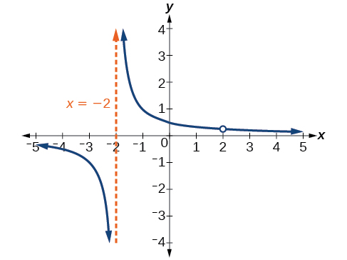{: #Figure_03_07_012}

The graph of this function will have the vertical asymptote at<math xmlns="http://www.w3.org/1998/Math/MathML"> <mrow> <mtext> </mtext><mi>x</mi><mo>=</mo><mn>−2</mn><mo>,</mo><mtext> </mtext> </mrow> </math>

but at<math xmlns="http://www.w3.org/1998/Math/MathML"> <mrow> <mtext> </mtext><mi>x</mi><mo>=</mo><mn>2</mn><mtext> </mtext> </mrow> </math>

the graph will have a hole.

Find the vertical asymptotes and removable discontinuities of the graph of<math xmlns="http://www.w3.org/1998/Math/MathML"> <mrow> <mtext> </mtext><mi>f</mi><mo stretchy="false">(</mo><mi>x</mi><mo stretchy="false">)</mo><mo>=</mo><mfrac> <mrow> <msup> <mi>x</mi> <mn>2</mn> </msup> <mo>−</mo><mn>25</mn> </mrow> <mrow> <msup> <mi>x</mi> <mn>3</mn> </msup> <mo>−</mo><mn>6</mn><msup> <mi>x</mi> <mn>2</mn> </msup> <mo>+</mo><mn>5</mn><mi>x</mi> </mrow> </mfrac> <mo>.</mo> </mrow> </math>

Removable discontinuity at<math xmlns="http://www.w3.org/1998/Math/MathML"> <mrow> <mtext> </mtext><mi>x</mi><mo>=</mo><mn>5.</mn><mtext> </mtext> </mrow> </math>

Vertical asymptotes:<math xmlns="http://www.w3.org/1998/Math/MathML"> <mrow> <mtext> </mtext><mi>x</mi><mo>=</mo><mn>0</mn><mo>,</mo><mtext> </mtext><mi>x</mi><mo>=</mo><mn>1.</mn> </mrow> </math>

# Identifying Horizontal Asymptotes of Rational Functions

While vertical asymptotes describe the behavior of a graph as the *output* gets very large or very small, horizontal asymptotes help describe the behavior of a graph as the *input* gets very large or very small. Recall that a polynomial’s end behavior will mirror that of the leading term. Likewise, a rational function’s end behavior will mirror that of the ratio of the function that is the ratio of the leading terms.

There are three distinct outcomes when checking for horizontal asymptotes:

**Case 1:** If the degree of the denominator &gt; degree of the numerator, there is a **horizontal asymptote**{: data-type="term" .no-emphasis} at<math xmlns="http://www.w3.org/1998/Math/MathML"> <mrow> <mtext> </mtext><mi>y</mi><mo>=</mo><mn>0.</mn> </mrow> </math>

<math xmlns="http://www.w3.org/1998/Math/MathML" display="block"> <mrow> <mtext>Example: </mtext><mi>f</mi><mo stretchy="false">(</mo><mi>x</mi><mo stretchy="false">)</mo><mo>=</mo><mfrac> <mrow> <mn>4</mn><mi>x</mi><mo>+</mo><mn>2</mn> </mrow> <mrow> <msup> <mi>x</mi> <mn>2</mn> </msup> <mo>+</mo><mn>4</mn><mi>x</mi><mo>−</mo><mn>5</mn> </mrow> </mfrac> </mrow> </math>

In this case, the end behavior is<math xmlns="http://www.w3.org/1998/Math/MathML"> <mrow> <mtext> </mtext><mi>f</mi><mo stretchy="false">(</mo><mi>x</mi><mo stretchy="false">)</mo><mo>≈</mo><mfrac> <mrow> <mn>4</mn><mi>x</mi> </mrow> <mrow> <msup> <mi>x</mi> <mn>2</mn> </msup> </mrow> </mfrac> <mo>=</mo><mfrac> <mn>4</mn> <mi>x</mi> </mfrac> <mo>.</mo><mtext> </mtext> </mrow> </math>

This tells us that, as the inputs increase or decrease without bound, this function will behave similarly to the function<math xmlns="http://www.w3.org/1998/Math/MathML"> <mrow> <mtext> </mtext><mi>g</mi><mo stretchy="false">(</mo><mi>x</mi><mo stretchy="false">)</mo><mo>=</mo><mfrac> <mn>4</mn> <mi>x</mi> </mfrac> <mo>,</mo><mtext> </mtext> </mrow> </math>

and the outputs will approach zero, resulting in a horizontal asymptote at<math xmlns="http://www.w3.org/1998/Math/MathML"> <mrow> <mtext> </mtext><mi>y</mi><mo>=</mo><mn>0.</mn><mtext> </mtext> </mrow> </math>

See [\[link\]](#Figure_03_07_013). Note that this graph crosses the horizontal asymptote.

 =&#10;   &#10;    p(x)&#10;   &#10;   &#10;    q(x)&#10;   &#10;  &#10;  ,&#x2009;q(x)&#x2260;0&#x2009;where&#xA0;degree&#xA0;of&#x2009;p&lt;degree&#xA0;of&#xA0;q.&#10; &#10;"){: #Figure_03_07_013}

**Case 2:** If the degree of the denominator &lt; degree of the numerator by one, we get a slant asymptote.

<math xmlns="http://www.w3.org/1998/Math/MathML" display="block"> <mrow> <mtext>Example: </mtext><mi>f</mi><mo stretchy="false">(</mo><mi>x</mi><mo stretchy="false">)</mo><mo>=</mo><mfrac> <mrow> <mn>3</mn><msup> <mi>x</mi> <mn>2</mn> </msup> <mo>−</mo><mn>2</mn><mi>x</mi><mo>+</mo><mn>1</mn> </mrow> <mrow> <mi>x</mi><mo>−</mo><mn>1</mn> </mrow> </mfrac> </mrow> </math>

In this case, the end behavior is<math xmlns="http://www.w3.org/1998/Math/MathML"> <mrow> <mtext> </mtext><mi>f</mi><mo stretchy="false">(</mo><mi>x</mi><mo stretchy="false">)</mo><mo>≈</mo><mfrac> <mrow> <mn>3</mn><msup> <mi>x</mi> <mn>2</mn> </msup> </mrow> <mi>x</mi> </mfrac> <mo>=</mo><mn>3</mn><mi>x</mi><mo>.</mo><mtext> </mtext> </mrow> </math>

This tells us that as the inputs increase or decrease without bound, this function will behave similarly to the function<math xmlns="http://www.w3.org/1998/Math/MathML"> <mrow> <mtext> </mtext><mi>g</mi><mo stretchy="false">(</mo><mi>x</mi><mo stretchy="false">)</mo><mo>=</mo><mn>3</mn><mi>x</mi><mo>.</mo><mtext> </mtext> </mrow> </math>

As the inputs grow large, the outputs will grow and not level off, so this graph has no horizontal asymptote. However, the graph of<math xmlns="http://www.w3.org/1998/Math/MathML"> <mrow> <mtext> </mtext><mi>g</mi><mo stretchy="false">(</mo><mi>x</mi><mo stretchy="false">)</mo><mo>=</mo><mn>3</mn><mi>x</mi><mtext> </mtext> </mrow> </math>

looks like a diagonal line, and since<math xmlns="http://www.w3.org/1998/Math/MathML"> <mrow> <mtext> </mtext><mi>f</mi><mtext> </mtext> </mrow> </math>

will behave similarly to<math xmlns="http://www.w3.org/1998/Math/MathML"> <mrow> <mtext> </mtext><mi>g</mi><mo>,</mo><mtext> </mtext> </mrow> </math>

it will approach a line close to<math xmlns="http://www.w3.org/1998/Math/MathML"> <mrow> <mtext> </mtext><mi>y</mi><mo>=</mo><mn>3</mn><mi>x</mi><mo>.</mo><mtext> </mtext> </mrow> </math>

This line is a slant asymptote.

To find the equation of the slant asymptote, divide<math xmlns="http://www.w3.org/1998/Math/MathML"> <mrow> <mtext> </mtext><mfrac> <mrow> <mn>3</mn><msup> <mi>x</mi> <mn>2</mn> </msup> <mo>−</mo><mn>2</mn><mi>x</mi><mo>+</mo><mn>1</mn> </mrow> <mrow> <mi>x</mi><mo>−</mo><mn>1</mn> </mrow> </mfrac> <mo>.</mo><mtext> </mtext> </mrow> </math>

The quotient is<math xmlns="http://www.w3.org/1998/Math/MathML"> <mrow> <mtext> </mtext><mn>3</mn><mi>x</mi><mo>+</mo><mn>1</mn><mo>,</mo><mtext> </mtext> </mrow> </math>

and the remainder is 2. The slant asymptote is the graph of the line<math xmlns="http://www.w3.org/1998/Math/MathML"> <mrow> <mtext> </mtext><mi>g</mi><mo stretchy="false">(</mo><mi>x</mi><mo stretchy="false">)</mo><mo>=</mo><mn>3</mn><mi>x</mi><mo>+</mo><mn>1.</mn><mtext> </mtext> </mrow> </math>

See [\[link\]](#Figure_03_07_014).

 =&#10;   &#10;    p(x)&#10;   &#10;   &#10;    q(x)&#10;   &#10;  &#10;  ,&#x2009;q(x)&#x2260;0&#x2009;&#10; &#10;where degree of&#10; &#10;  &#x2009;p&gt;degree&#xA0;of&#xA0;q&#x2009;by&#x2009;1.&#x2009;&#10; &#10;&#10;&#10;"){: #Figure_03_07_014}

**Case 3:** If the degree of the denominator = degree of the numerator, there is a horizontal asymptote at<math xmlns="http://www.w3.org/1998/Math/MathML"> <mrow> <mtext> </mtext><mi>y</mi><mo>=</mo><mfrac> <mrow> <msub> <mi>a</mi> <mi>n</mi> </msub> </mrow> <mrow> <msub> <mi>b</mi> <mi>n</mi> </msub> </mrow> </mfrac> <mo>,</mo><mtext> </mtext> </mrow> </math>

where<math xmlns="http://www.w3.org/1998/Math/MathML"> <mrow> <mtext> </mtext><msub> <mi>a</mi> <mi>n</mi> </msub> <mtext> </mtext> </mrow> </math>

and<math xmlns="http://www.w3.org/1998/Math/MathML"> <mrow> <mtext> </mtext><msub> <mi>b</mi> <mi>n</mi> </msub> <mtext> </mtext> </mrow> </math>

are the leading coefficients of<math xmlns="http://www.w3.org/1998/Math/MathML"> <mrow> <mtext> </mtext><mi>p</mi><mrow><mo>(</mo> <mi>x</mi> <mo>)</mo></mrow><mtext> </mtext> </mrow> </math>

and<math xmlns="http://www.w3.org/1998/Math/MathML"> <mrow> <mtext> </mtext><mi>q</mi><mrow><mo>(</mo> <mi>x</mi> <mo>)</mo></mrow><mtext> </mtext> </mrow> </math>

for<math xmlns="http://www.w3.org/1998/Math/MathML"> <mrow> <mtext> </mtext><mi>f</mi><mo stretchy="false">(</mo><mi>x</mi><mo stretchy="false">)</mo><mo>=</mo><mfrac> <mrow> <mi>p</mi><mo stretchy="false">(</mo><mi>x</mi><mo stretchy="false">)</mo> </mrow> <mrow> <mi>q</mi><mo stretchy="false">(</mo><mi>x</mi><mo stretchy="false">)</mo> </mrow> </mfrac> <mo>,</mo><mi>q</mi><mo stretchy="false">(</mo><mi>x</mi><mo stretchy="false">)</mo><mo>≠</mo><mn>0.</mn> </mrow> </math>

<math xmlns="http://www.w3.org/1998/Math/MathML" display="block"> <mrow> <mtext>Example: </mtext><mi>f</mi><mo stretchy="false">(</mo><mi>x</mi><mo stretchy="false">)</mo><mo>=</mo><mfrac> <mrow> <mn>3</mn><msup> <mi>x</mi> <mn>2</mn> </msup> <mo>+</mo><mn>2</mn> </mrow> <mrow> <msup> <mi>x</mi> <mn>2</mn> </msup> <mo>+</mo><mn>4</mn><mi>x</mi><mo>−</mo><mn>5</mn> </mrow> </mfrac> </mrow> </math>

In this case, the end behavior is<math xmlns="http://www.w3.org/1998/Math/MathML"> <mrow> <mtext> </mtext><mi>f</mi><mo stretchy="false">(</mo><mi>x</mi><mo stretchy="false">)</mo><mo>≈</mo><mfrac> <mrow> <mn>3</mn><msup> <mi>x</mi> <mn>2</mn> </msup> </mrow> <mrow> <msup> <mi>x</mi> <mn>2</mn> </msup> </mrow> </mfrac> <mo>=</mo><mn>3.</mn><mtext> </mtext> </mrow> </math>

This tells us that as the inputs grow large, this function will behave like the function<math xmlns="http://www.w3.org/1998/Math/MathML"> <mrow> <mtext> </mtext><mi>g</mi><mo stretchy="false">(</mo><mi>x</mi><mo stretchy="false">)</mo><mo>=</mo><mn>3</mn><mo>,</mo><mtext> </mtext> </mrow> </math>

which is a horizontal line. As<math xmlns="http://www.w3.org/1998/Math/MathML"> <mrow> <mtext> </mtext><mi>x</mi><mo stretchy="false">→</mo><mo>±</mo><mi>∞</mi><mo>,</mo><mi>f</mi><mo stretchy="false">(</mo><mi>x</mi><mo stretchy="false">)</mo><mo stretchy="false">→</mo><mn>3</mn><mo>,</mo><mtext> </mtext> </mrow> </math>

resulting in a horizontal asymptote at<math xmlns="http://www.w3.org/1998/Math/MathML"> <mrow> <mtext> </mtext><mi>y</mi><mo>=</mo><mn>3.</mn><mtext> </mtext> </mrow> </math>

See [\[link\]](#Figure_03_07_015). Note that this graph crosses the horizontal asymptote.

 =&#10;   &#10;    p(x)&#10;   &#10;   &#10;    q(x)&#10;   &#10;  &#10;  ,&#x2009;q(x)&#x2260;0&#x2009;where&#xA0;degree&#xA0;of&#xA0;p=degree&#xA0;of&#xA0;q.&#10; &#10;"){: #Figure_03_07_015}

Notice that, while the graph of a rational function will never cross a **vertical asymptote**{: data-type="term" .no-emphasis}, the graph may or may not cross a horizontal or slant asymptote. Also, although the graph of a rational function may have many vertical asymptotes, the graph will have at most one horizontal (or slant) asymptote.

It should be noted that, if the degree of the numerator is larger than the degree of the denominator by more than one, the **end behavior**{: data-type="term" .no-emphasis} of the graph will mimic the behavior of the reduced end behavior fraction. For instance, if we had the function

<math xmlns="http://www.w3.org/1998/Math/MathML" display="block"> <mrow> <mi>f</mi><mo stretchy="false">(</mo><mi>x</mi><mo stretchy="false">)</mo><mo>=</mo><mfrac> <mrow> <mn>3</mn><msup> <mi>x</mi> <mn>5</mn> </msup> <mo>−</mo><msup> <mi>x</mi> <mn>2</mn> </msup> </mrow> <mrow> <mi>x</mi><mo>+</mo><mn>3</mn> </mrow> </mfrac> </mrow> </math>

with end behavior

<math xmlns="http://www.w3.org/1998/Math/MathML" display="block"> <mrow> <mi>f</mi><mo stretchy="false">(</mo><mi>x</mi><mo stretchy="false">)</mo><mo>≈</mo><mfrac> <mrow> <mn>3</mn><msup> <mi>x</mi> <mn>5</mn> </msup> </mrow> <mi>x</mi> </mfrac> <mo>=</mo><mn>3</mn><msup> <mi>x</mi> <mn>4</mn> </msup> <mo>,</mo> </mrow> </math>

the end behavior of the graph would look similar to that of an even polynomial with a positive leading coefficient.

<math xmlns="http://www.w3.org/1998/Math/MathML" display="block"> <mrow> <mi>x</mi><mo stretchy="false">→</mo><mo>±</mo><mi>∞</mi><mo>,</mo><mo> </mo><mi>f</mi><mo stretchy="false">(</mo><mi>x</mi><mo stretchy="false">)</mo><mo stretchy="false">→</mo><mi>∞</mi> </mrow> </math>

Horizontal Asymptotes of Rational Functions

The **horizontal asymptote**{: data-type="term" .no-emphasis} of a rational function can be determined by looking at the degrees of the numerator and denominator.

* Degree of numerator *is less than* degree of denominator: horizontal asymptote at
  <math xmlns="http://www.w3.org/1998/Math/MathML"> <mrow> <mtext> </mtext><mi>y</mi><mo>=</mo><mn>0.</mn> </mrow> </math>

* Degree of numerator *is greater than degree of denominator by one*\: no horizontal asymptote; slant asymptote.
* Degree of numerator *is equal to* degree of denominator: horizontal asymptote at ratio of leading coefficients.

Identifying Horizontal and Slant Asymptotes

For the functions listed, identify the horizontal or slant asymptote.

1.  <math xmlns="http://www.w3.org/1998/Math/MathML"> <mrow> <mi>g</mi><mo stretchy="false">(</mo><mi>x</mi><mo stretchy="false">)</mo><mo>=</mo><mfrac> <mrow> <mn>6</mn><msup> <mi>x</mi> <mn>3</mn> </msup> <mo>−</mo><mn>10</mn><mi>x</mi> </mrow> <mrow> <mn>2</mn><msup> <mi>x</mi> <mn>3</mn> </msup> <mo>+</mo><mn>5</mn><msup> <mi>x</mi> <mn>2</mn> </msup> </mrow> </mfrac> </mrow> </math>

2.  <math xmlns="http://www.w3.org/1998/Math/MathML"> <mrow> <mi>h</mi><mo stretchy="false">(</mo><mi>x</mi><mo stretchy="false">)</mo><mo>=</mo><mfrac> <mrow> <msup> <mi>x</mi> <mn>2</mn> </msup> <mo>−</mo><mn>4</mn><mi>x</mi><mo>+</mo><mn>1</mn> </mrow> <mrow> <mi>x</mi><mo>+</mo><mn>2</mn> </mrow> </mfrac> </mrow> </math>

3.  <math xmlns="http://www.w3.org/1998/Math/MathML"> <mrow> <mi>k</mi><mo stretchy="false">(</mo><mi>x</mi><mo stretchy="false">)</mo><mo>=</mo><mfrac> <mrow> <msup> <mi>x</mi> <mn>2</mn> </msup> <mo>+</mo><mn>4</mn><mi>x</mi> </mrow> <mrow> <msup> <mi>x</mi> <mn>3</mn> </msup> <mo>−</mo><mn>8</mn> </mrow> </mfrac> </mrow> </math>
{: data-number-style="lower-alpha"}

For these solutions, we will use<math xmlns="http://www.w3.org/1998/Math/MathML"> <mrow> <mtext> </mtext><mi>f</mi><mo stretchy="false">(</mo><mi>x</mi><mo stretchy="false">)</mo><mo>=</mo><mfrac> <mrow> <mi>p</mi><mo stretchy="false">(</mo><mi>x</mi><mo stretchy="false">)</mo> </mrow> <mrow> <mi>q</mi><mo stretchy="false">(</mo><mi>x</mi><mo stretchy="false">)</mo> </mrow> </mfrac> <mo>,</mo><mo> </mo><mi>q</mi><mo stretchy="false">(</mo><mi>x</mi><mo stretchy="false">)</mo><mo>≠</mo><mn>0.</mn> </mrow> </math>

1.  <math xmlns="http://www.w3.org/1998/Math/MathML"> <mrow> <mi>g</mi><mo stretchy="false">(</mo><mi>x</mi><mo stretchy="false">)</mo><mo>=</mo><mfrac> <mrow> <mn>6</mn><msup> <mi>x</mi> <mn>3</mn> </msup> <mo>−</mo><mn>10</mn><mi>x</mi> </mrow> <mrow> <mn>2</mn><msup> <mi>x</mi> <mn>3</mn> </msup> <mo>+</mo><mn>5</mn><msup> <mi>x</mi> <mn>2</mn> </msup> </mrow> </mfrac> <mo>:</mo><mtext> </mtext> </mrow> </math>
    
    The degree of
    <math xmlns="http://www.w3.org/1998/Math/MathML"> <mrow> <mtext> </mtext><mi>p</mi><mo>=</mo><mtext>degree of</mtext><mo> </mo><mi>q</mi><mo>=</mo><mn>3</mn><mo>,</mo><mtext> </mtext> </mrow> </math>
    
    so we can find the horizontal asymptote by taking the ratio of the leading terms. There is a horizontal asymptote at
    <math xmlns="http://www.w3.org/1998/Math/MathML"> <mrow> <mtext> </mtext><mi>y</mi><mo>=</mo><mfrac> <mn>6</mn> <mn>2</mn> </mfrac> <mtext> </mtext> </mrow> </math>
    
    or
    <math xmlns="http://www.w3.org/1998/Math/MathML"> <mrow> <mtext> </mtext><mi>y</mi><mo>=</mo><mn>3.</mn> </mrow> </math>

2.  <math xmlns="http://www.w3.org/1998/Math/MathML"> <mrow> <mi>h</mi><mo stretchy="false">(</mo><mi>x</mi><mo stretchy="false">)</mo><mo>=</mo><mfrac> <mrow> <msup> <mi>x</mi> <mn>2</mn> </msup> <mo>−</mo><mn>4</mn><mi>x</mi><mo>+</mo><mn>1</mn> </mrow> <mrow> <mi>x</mi><mo>+</mo><mn>2</mn> </mrow> </mfrac> <mo>:</mo><mtext> </mtext> </mrow> </math>
    
    The degree of
    <math xmlns="http://www.w3.org/1998/Math/MathML"> <mrow> <mtext> </mtext><mi>p</mi><mo>=</mo><mn>2</mn><mtext> </mtext> </mrow> </math>
    
    and degree of
    <math xmlns="http://www.w3.org/1998/Math/MathML"> <mrow> <mtext> </mtext><mi>q</mi><mo>=</mo><mn>1.</mn><mtext> </mtext> </mrow> </math>
    
    Since
    <math xmlns="http://www.w3.org/1998/Math/MathML"> <mrow> <mtext> </mtext><mi>p</mi><mo>&gt;</mo><mi>q</mi><mtext> </mtext> </mrow> </math>
    
    by 1, there is a slant asymptote found at
    <math xmlns="http://www.w3.org/1998/Math/MathML"> <mrow> <mtext> </mtext><mfrac> <mrow> <msup> <mi>x</mi> <mn>2</mn> </msup> <mo>−</mo><mn>4</mn><mi>x</mi><mo>+</mo><mn>1</mn> </mrow> <mrow> <mi>x</mi><mo>+</mo><mn>2</mn> </mrow> </mfrac> <mo>.</mo> </mrow> </math>
    
      
    The quotient is<math xmlns="http://www.w3.org/1998/Math/MathML"> <mrow> <mtext> </mtext><mi>x</mi><mo>–</mo><mn>6</mn><mtext> </mtext> </mrow> </math>
    
    and the remainder is 13. There is a slant asymptote at<math xmlns="http://www.w3.org/1998/Math/MathML"> <mrow> <mtext> </mtext><mi>y</mi><mo>=</mo><mi>x</mi><mo>–</mo><mn>6.</mn> </mrow> </math>

3.  <math xmlns="http://www.w3.org/1998/Math/MathML"> <mrow> <mi>k</mi><mo stretchy="false">(</mo><mi>x</mi><mo stretchy="false">)</mo><mo>=</mo><mfrac> <mrow> <msup> <mi>x</mi> <mn>2</mn> </msup> <mo>+</mo><mn>4</mn><mi>x</mi> </mrow> <mrow> <msup> <mi>x</mi> <mn>3</mn> </msup> <mo>−</mo><mn>8</mn> </mrow> </mfrac> <mo>:</mo><mtext> </mtext> </mrow> </math>
    
    The degree of
    <math xmlns="http://www.w3.org/1998/Math/MathML"> <mrow> <mtext> </mtext><mi>p</mi><mo>=</mo><mn>2</mn><mtext> </mtext><mo>&lt;</mo><mtext> </mtext> </mrow> </math>
    
    degree of
    <math xmlns="http://www.w3.org/1998/Math/MathML"> <mrow> <mtext> </mtext><mi>q</mi><mo>=</mo><mn>3</mn><mo>,</mo><mtext> </mtext> </mrow> </math>
    
    so there is a horizontal asymptote
    <math xmlns="http://www.w3.org/1998/Math/MathML"> <mrow> <mtext> </mtext><mi>y</mi><mo>=</mo><mn>0.</mn> </mrow> </math>
{: data-number-style="lower-alpha"}

Identifying Horizontal Asymptotes

In the sugar concentration problem earlier, we created the equation<math xmlns="http://www.w3.org/1998/Math/MathML"> <mrow> <mtext> </mtext><mi>C</mi><mo stretchy="false">(</mo><mi>t</mi><mo stretchy="false">)</mo><mo>=</mo><mfrac> <mrow> <mn>5</mn><mo>+</mo><mi>t</mi> </mrow> <mrow> <mn>100</mn><mo>+</mo><mn>10</mn><mi>t</mi> </mrow> </mfrac> <mo>.</mo> </mrow> </math>

Find the horizontal asymptote and interpret it in context of the problem.

Both the numerator and denominator are linear (degree 1). Because the degrees are equal, there will be a horizontal asymptote at the ratio of the leading coefficients. In the numerator, the leading term is<math xmlns="http://www.w3.org/1998/Math/MathML"> <mrow> <mtext> </mtext><mi>t</mi><mo>,</mo><mtext> </mtext> </mrow> </math>

with coefficient 1. In the denominator, the leading term is<math xmlns="http://www.w3.org/1998/Math/MathML"> <mrow> <mtext> </mtext><mn>10</mn><mi>t</mi><mo>,</mo><mtext> </mtext> </mrow> </math>

with coefficient 10. The horizontal asymptote will be at the ratio of these values:

<math xmlns="http://www.w3.org/1998/Math/MathML" display="block"> <mrow> <mi>t</mi><mo stretchy="false">→</mo><mi>∞</mi><mo>,</mo><mo> </mo><mi>C</mi><mo stretchy="false">(</mo><mi>t</mi><mo stretchy="false">)</mo><mo stretchy="false">→</mo><mfrac> <mn>1</mn> <mrow> <mn>10</mn> </mrow> </mfrac> </mrow> </math>

This function will have a horizontal asymptote at<math xmlns="http://www.w3.org/1998/Math/MathML"> <mrow> <mtext> </mtext><mi>y</mi><mo>=</mo><mfrac> <mn>1</mn> <mrow> <mn>10</mn> </mrow> </mfrac> <mo>.</mo> </mrow> </math>

This tells us that as the values of *t* increase, the values of<math xmlns="http://www.w3.org/1998/Math/MathML"> <mrow> <mtext> </mtext><mi>C</mi><mtext> </mtext> </mrow> </math>

will approach<math xmlns="http://www.w3.org/1998/Math/MathML"> <mrow> <mtext> </mtext><mfrac> <mn>1</mn> <mrow> <mn>10</mn> </mrow> </mfrac> <mo>.</mo><mtext> </mtext> </mrow> </math>

In context, this means that, as more time goes by, the concentration of sugar in the tank will approach one-tenth of a pound of sugar per gallon of water or<math xmlns="http://www.w3.org/1998/Math/MathML"> <mrow> <mtext> </mtext><mfrac> <mn>1</mn> <mrow> <mn>10</mn> </mrow> </mfrac> <mtext> </mtext> </mrow> </math>

pounds per gallon.

Identifying Horizontal and Vertical Asymptotes

Find the horizontal and vertical asymptotes of the function

<math xmlns="http://www.w3.org/1998/Math/MathML" display="block"> <mrow> <mi>f</mi><mo stretchy="false">(</mo><mi>x</mi><mo stretchy="false">)</mo><mo>=</mo><mfrac> <mrow> <mo stretchy="false">(</mo><mi>x</mi><mo>−</mo><mn>2</mn><mo stretchy="false">)</mo><mo stretchy="false">(</mo><mi>x</mi><mo>+</mo><mn>3</mn><mo stretchy="false">)</mo> </mrow> <mrow> <mo stretchy="false">(</mo><mi>x</mi><mo>−</mo><mn>1</mn><mo stretchy="false">)</mo><mo stretchy="false">(</mo><mi>x</mi><mo>+</mo><mn>2</mn><mo stretchy="false">)</mo><mo stretchy="false">(</mo><mi>x</mi><mo>−</mo><mn>5</mn><mo stretchy="false">)</mo> </mrow> </mfrac> </mrow> </math>

First, note that this function has no common factors, so there are no potential removable discontinuities.

The function will have vertical asymptotes when the denominator is zero, causing the function to be undefined. The denominator will be zero at<math xmlns="http://www.w3.org/1998/Math/MathML"> <mrow> <mtext> </mtext><mi>x</mi><mo>=</mo><mn>1</mn><mo>,</mo><mo>–</mo><mn>2</mn><mo>,</mo><mtext>and </mtext><mn>5</mn><mo>,</mo><mtext> </mtext> </mrow> </math>

indicating vertical asymptotes at these values.

The numerator has degree 2, while the denominator has degree 3. Since the degree of the denominator is greater than the degree of the numerator, the denominator will grow faster than the numerator, causing the outputs to tend towards zero as the inputs get large, and so as<math xmlns="http://www.w3.org/1998/Math/MathML"> <mrow> <mtext> </mtext><mi>x</mi><mo stretchy="false">→</mo><mo>±</mo><mi>∞</mi><mo>,</mo><mo> </mo><mi>f</mi><mo stretchy="false">(</mo><mi>x</mi><mo stretchy="false">)</mo><mo stretchy="false">→</mo><mn>0.</mn><mtext> </mtext> </mrow> </math>

This function will have a horizontal asymptote at<math xmlns="http://www.w3.org/1998/Math/MathML"> <mrow> <mtext> </mtext><mi>y</mi><mo>=</mo><mn>0.</mn><mtext> </mtext> </mrow> </math>

See [[link]](#Figure_03_07_016).

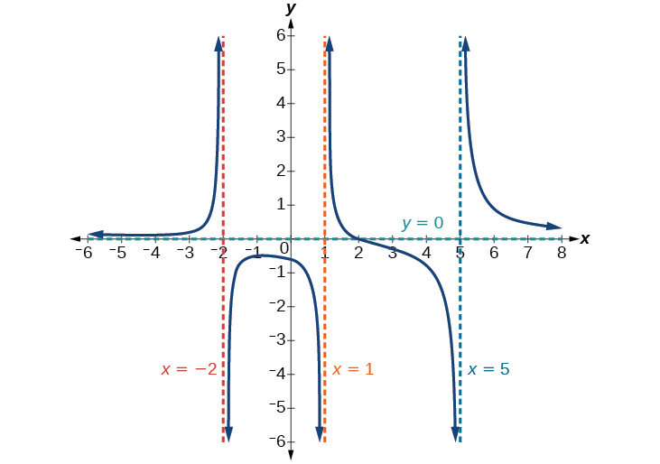{: #Figure_03_07_016}

Find the vertical and horizontal asymptotes of the function:

<math xmlns="http://www.w3.org/1998/Math/MathML"> <mrow> <mi>f</mi><mo stretchy="false">(</mo><mi>x</mi><mo stretchy="false">)</mo><mo>=</mo><mfrac> <mrow> <mo stretchy="false">(</mo><mn>2</mn><mi>x</mi><mo>−</mo><mn>1</mn><mo stretchy="false">)</mo><mo stretchy="false">(</mo><mn>2</mn><mi>x</mi><mo>+</mo><mn>1</mn><mo stretchy="false">)</mo> </mrow> <mrow> <mo stretchy="false">(</mo><mi>x</mi><mo>−</mo><mn>2</mn><mo stretchy="false">)</mo><mo stretchy="false">(</mo><mi>x</mi><mo>+</mo><mn>3</mn><mo stretchy="false">)</mo> </mrow> </mfrac> </mrow> </math>

Vertical asymptotes at<math xmlns="http://www.w3.org/1998/Math/MathML"> <mrow> <mtext> </mtext><mi>x</mi><mo>=</mo><mn>2</mn><mtext> </mtext> </mrow> </math>

and<math xmlns="http://www.w3.org/1998/Math/MathML"> <mrow> <mtext> </mtext><mi>x</mi><mo>=</mo><mo>–</mo><mn>3</mn><mo>;</mo><mtext> </mtext> </mrow> </math>

horizontal asymptote at<math xmlns="http://www.w3.org/1998/Math/MathML"> <mrow> <mtext> </mtext><mi>y</mi><mo>=</mo><mn>4.</mn> </mrow> </math>

Intercepts of Rational Functions

A **rational function**{: data-type="term" .no-emphasis} will have a *y*-intercept at<math xmlns="http://www.w3.org/1998/Math/MathML"> <mrow> <mtext> </mtext><mi>f</mi><mo stretchy="false">(</mo><mn>0</mn><mo stretchy="false">)</mo> </mrow> </math>

, if the function is defined at zero. A rational function will not have a *y*-intercept if the function is not defined at zero.

Likewise, a rational function will have *x*-intercepts at the inputs that cause the output to be zero. Since a fraction is only equal to zero when the numerator is zero, *x*-intercepts can only occur when the numerator of the rational function is equal to zero.

Finding the Intercepts of a Rational Function

Find the intercepts of<math xmlns="http://www.w3.org/1998/Math/MathML"> <mrow> <mtext> </mtext><mi>f</mi><mo stretchy="false">(</mo><mi>x</mi><mo stretchy="false">)</mo><mo>=</mo><mfrac> <mrow> <mo stretchy="false">(</mo><mi>x</mi><mo>−</mo><mn>2</mn><mo stretchy="false">)</mo><mo stretchy="false">(</mo><mi>x</mi><mo>+</mo><mn>3</mn><mo stretchy="false">)</mo> </mrow> <mrow> <mo stretchy="false">(</mo><mi>x</mi><mo>−</mo><mn>1</mn><mo stretchy="false">)</mo><mo stretchy="false">(</mo><mi>x</mi><mo>+</mo><mn>2</mn><mo stretchy="false">)</mo><mo stretchy="false">(</mo><mi>x</mi><mo>−</mo><mn>5</mn><mo stretchy="false">)</mo> </mrow> </mfrac> <mo>.</mo> </mrow> </math>

We can find the *y*-intercept by evaluating the function at zero

<math xmlns="http://www.w3.org/1998/Math/MathML" display="block"> <mrow> <mtable> <mtr rowalign="center"> <mtd columnalign="right" rowalign="center"> <mrow> <mi>f</mi><mo stretchy="false">(</mo><mn>0</mn><mo stretchy="false">)</mo></mrow> </mtd> <mtd rowalign="center"> <mo>=</mo> </mtd> <mtd rowalign="center" columnalign="left"> <mrow> <mfrac> <mrow> <mo stretchy="false">(</mo><mn>0</mn><mo>−</mo><mn>2</mn><mo stretchy="false">)</mo><mo stretchy="false">(</mo><mn>0</mn><mo>+</mo><mn>3</mn><mo stretchy="false">)</mo></mrow> <mrow> <mo stretchy="false">(</mo><mn>0</mn><mo>−</mo><mn>1</mn><mo stretchy="false">)</mo><mo stretchy="false">(</mo><mn>0</mn><mo>+</mo><mn>2</mn><mo stretchy="false">)</mo><mo stretchy="false">(</mo><mn>0</mn><mo>−</mo><mn>5</mn><mo stretchy="false">)</mo></mrow> </mfrac> </mrow> </mtd> </mtr> <mtr rowalign="center"> <mtd rowalign="center" /> <mtd rowalign="center"> <mo>=</mo> </mtd> <mtd columnalign="left" rowalign="center"> <mrow> <mfrac> <mrow> <mo>−</mo><mn>6</mn></mrow> <mrow> <mn>10</mn></mrow> </mfrac> </mrow> </mtd> </mtr> <mtr rowalign="center"> <mtd rowalign="center" /> <mtd rowalign="center"> <mo>=</mo> </mtd> <mtd rowalign="center" columnalign="left"> <mrow> <mo>−</mo><mfrac> <mn>3</mn> <mn>5</mn> </mfrac> </mrow> </mtd> </mtr> <mtr> <mtd rowalign="center" /> <mtd rowalign="center"> <mo>=</mo> </mtd> <mtd rowalign="center" columnalign="left"> <mrow> <mn>−0.6</mn></mrow> </mtd> </mtr> </mtable></mrow> </math>

The *x*-intercepts will occur when the function is equal to zero:

<math xmlns="http://www.w3.org/1998/Math/MathML" display="block"> <mrow> <mtable> <mtr> <mtd columnalign="right"> <mn>0</mn> </mtd> <mtd> <mo>=</mo> </mtd> <mtd columnalign="left"> <mrow> <mfrac> <mrow> <mo stretchy="false">(</mo><mi>x</mi><mo>−</mo><mn>2</mn><mo stretchy="false">)</mo><mo stretchy="false">(</mo><mi>x</mi><mo>+</mo><mn>3</mn><mo stretchy="false">)</mo></mrow> <mrow> <mo stretchy="false">(</mo><mi>x</mi><mo>−</mo><mn>1</mn><mo stretchy="false">)</mo><mo stretchy="false">(</mo><mi>x</mi><mo>+</mo><mn>2</mn><mo stretchy="false">)</mo><mo stretchy="false">(</mo><mi>x</mi><mo>−</mo><mn>5</mn><mo stretchy="false">)</mo></mrow> </mfrac> </mrow> </mtd> <mtd columnalign="left"> <mrow> <mspace width="2em" /><mtext>This is zero when the numerator is zero</mtext><mo>.</mo></mrow> </mtd> </mtr> <mtr> <mtd columnalign="right"> <mn>0</mn> </mtd> <mtd> <mo>=</mo> </mtd> <mtd columnalign="left"> <mrow> <mo stretchy="false">(</mo><mi>x</mi><mo>−</mo><mn>2</mn><mo stretchy="false">)</mo><mo stretchy="false">(</mo><mi>x</mi><mo>+</mo><mn>3</mn><mo stretchy="false">)</mo></mrow> </mtd> <mtd /> </mtr> <mtr> <mtd columnalign="right"> <mi>x</mi> </mtd> <mtd> <mo>=</mo> </mtd> <mtd columnalign="left"> <mrow> <mn>2</mn><mo>,</mo><mn>−3</mn></mrow> </mtd> <mtd /> </mtr> </mtable></mrow> </math>

The *y*-intercept is<math xmlns="http://www.w3.org/1998/Math/MathML"> <mrow> <mtext> </mtext><mo stretchy="false">(</mo><mn>0</mn><mo>,</mo><mn>–0.6</mn><mo stretchy="false">)</mo><mo>,</mo><mtext> </mtext> </mrow> </math>

the *x*-intercepts are<math xmlns="http://www.w3.org/1998/Math/MathML"> <mrow> <mtext> </mtext><mo stretchy="false">(</mo><mn>2</mn><mo>,</mo><mn>0</mn><mo stretchy="false">)</mo><mtext> </mtext> </mrow> </math>

and<math xmlns="http://www.w3.org/1998/Math/MathML"> <mrow> <mtext> </mtext><mo stretchy="false">(</mo><mn>–3</mn><mo>,</mo><mn>0</mn><mo stretchy="false">)</mo><mo>.</mo><mtext> </mtext> </mrow> </math>

See [[link]](#Figure_03_07_017).

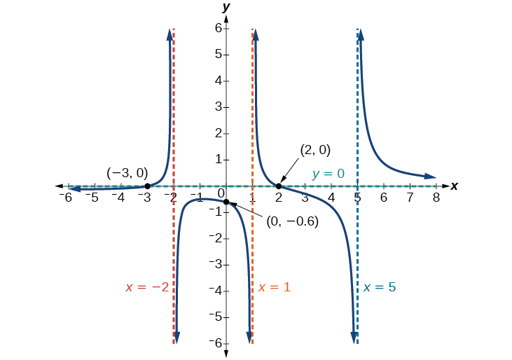{: #Figure_03_07_017}

Given the reciprocal squared function that is shifted right 3 units and down 4 units, write this as a rational function. Then, find the *x*- and *y*-intercepts and the horizontal and vertical asymptotes.

For the transformed reciprocal squared function, we find the rational form.<math xmlns="http://www.w3.org/1998/Math/MathML"> <mrow> <mtext> </mtext><mi>f</mi><mo stretchy="false">(</mo><mi>x</mi><mo stretchy="false">)</mo><mo>=</mo><mfrac> <mn>1</mn> <mrow> <msup> <mrow> <mo stretchy="false">(</mo><mi>x</mi><mo>−</mo><mn>3</mn><mo stretchy="false">)</mo> </mrow> <mn>2</mn> </msup> </mrow> </mfrac> <mo>−</mo><mn>4</mn><mo>=</mo><mfrac> <mrow> <mn>1</mn><mo>−</mo><mn>4</mn><msup> <mrow> <mo stretchy="false">(</mo><mi>x</mi><mo>−</mo><mn>3</mn><mo stretchy="false">)</mo> </mrow> <mn>2</mn> </msup> </mrow> <mrow> <msup> <mrow> <mo stretchy="false">(</mo><mi>x</mi><mo>−</mo><mn>3</mn><mo stretchy="false">)</mo> </mrow> <mn>2</mn> </msup> </mrow> </mfrac> <mo>=</mo><mfrac> <mrow> <mn>1</mn><mo>−</mo><mn>4</mn><mo stretchy="false">(</mo><msup> <mi>x</mi> <mn>2</mn> </msup> <mo>−</mo><mn>6</mn><mi>x</mi><mo>+</mo><mn>9</mn><mo stretchy="false">)</mo> </mrow> <mrow> <mo stretchy="false">(</mo><mi>x</mi><mo>−</mo><mn>3</mn><mo stretchy="false">)</mo><mo stretchy="false">(</mo><mi>x</mi><mo>−</mo><mn>3</mn><mo stretchy="false">)</mo> </mrow> </mfrac> <mo>=</mo><mfrac> <mrow> <mo>−</mo><mn>4</mn><msup> <mi>x</mi> <mn>2</mn> </msup> <mo>+</mo><mn>24</mn><mi>x</mi><mo>−</mo><mn>35</mn> </mrow> <mrow> <msup> <mi>x</mi> <mn>2</mn> </msup> <mo>−</mo><mn>6</mn><mi>x</mi><mo>+</mo><mn>9</mn> </mrow> </mfrac> </mrow> </math>

Because the numerator is the same degree as the denominator we know that as<math xmlns="http://www.w3.org/1998/Math/MathML"> <mrow> <mtext> </mtext><mi>x</mi><mo stretchy="false">→</mo><mo>±</mo><mi>∞</mi><mo>,</mo><mo> </mo><mi>f</mi><mo stretchy="false">(</mo><mi>x</mi><mo stretchy="false">)</mo><mo stretchy="false">→</mo><mo>−</mo><mn>4</mn><mo>;</mo><mo> </mo><mtext>so</mtext><mo> </mo><mi>y</mi><mo>=</mo><mo>–</mo><mn>4</mn><mtext> </mtext> </mrow> </math>

is the horizontal asymptote. Next, we set the denominator equal to zero, and find that the vertical asymptote is<math xmlns="http://www.w3.org/1998/Math/MathML"> <mrow> <mtext> </mtext><mi>x</mi><mo>=</mo><mn>3</mn><mo>,</mo><mtext> </mtext> </mrow> </math>

because as<math xmlns="http://www.w3.org/1998/Math/MathML"> <mrow> <mtext> </mtext><mi>x</mi><mo stretchy="false">→</mo><mn>3</mn><mo>,</mo><mi>f</mi><mo stretchy="false">(</mo><mi>x</mi><mo stretchy="false">)</mo><mo stretchy="false">→</mo><mi>∞</mi><mo>.</mo><mtext> </mtext> </mrow> </math>

We then set the numerator equal to 0 and find the *x*-intercepts are at<math xmlns="http://www.w3.org/1998/Math/MathML"> <mrow> <mtext> </mtext><mo stretchy="false">(</mo><mn>2.5</mn><mo>,</mo><mn>0</mn><mo stretchy="false">)</mo><mtext> </mtext> </mrow> </math>

and<math xmlns="http://www.w3.org/1998/Math/MathML"> <mrow> <mtext> </mtext><mo stretchy="false">(</mo><mn>3.5</mn><mo>,</mo><mn>0</mn><mo stretchy="false">)</mo><mo>.</mo><mtext> </mtext> </mrow> </math>

Finally, we evaluate the function at 0 and find the *y*-intercept to be at<math xmlns="http://www.w3.org/1998/Math/MathML"> <mrow> <mtext> </mtext><mrow><mo>(</mo> <mrow> <mn>0</mn><mo>,</mo><mfrac> <mrow> <mo>−</mo><mn>35</mn> </mrow> <mn>9</mn> </mfrac> </mrow> <mo>)</mo></mrow><mo>.</mo> </mrow> </math>

# Graphing Rational Functions

In [\[link\]](#Example_03_07_09), we see that the numerator of a rational function reveals the *x*-intercepts of the graph, whereas the denominator reveals the vertical asymptotes of the graph. As with polynomials, factors of the numerator may have integer powers greater than one. Fortunately, the effect on the shape of the graph at those intercepts is the same as we saw with polynomials.

The vertical asymptotes associated with the factors of the denominator will mirror one of the two toolkit reciprocal functions. When the degree of the factor in the denominator is odd, the distinguishing characteristic is that on one side of the vertical asymptote the graph heads towards positive infinity, and on the other side the graph heads towards negative infinity. See [\[link\]](#Figure_03_07_019).

 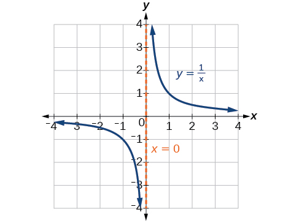{: #Figure_03_07_019}

When the degree of the factor in the denominator is even, the distinguishing characteristic is that the graph either heads toward positive infinity on both sides of the vertical asymptote or heads toward negative infinity on both sides. See [\[link\]](#Figure_03_07_018).

 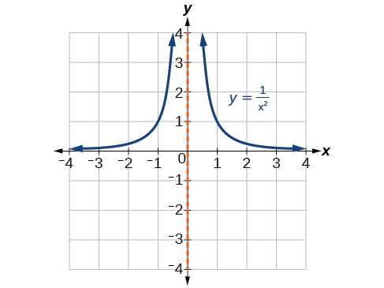{: #Figure_03_07_018}

For example, the graph of<math xmlns="http://www.w3.org/1998/Math/MathML"> <mrow> <mtext> </mtext><mi>f</mi><mo stretchy="false">(</mo><mi>x</mi><mo stretchy="false">)</mo><mo>=</mo><mfrac> <mrow> <msup> <mrow> <mo stretchy="false">(</mo><mi>x</mi><mo>+</mo><mn>1</mn><mo stretchy="false">)</mo> </mrow> <mn>2</mn> </msup> <mo stretchy="false">(</mo><mi>x</mi><mo>−</mo><mn>3</mn><mo stretchy="false">)</mo> </mrow> <mrow> <msup> <mrow> <mo stretchy="false">(</mo><mi>x</mi><mo>+</mo><mn>3</mn><mo stretchy="false">)</mo> </mrow> <mn>2</mn> </msup> <mo stretchy="false">(</mo><mi>x</mi><mo>−</mo><mn>2</mn><mo stretchy="false">)</mo> </mrow> </mfrac> <mtext> </mtext> </mrow> </math>

is shown in [\[link\]](#Figure_03_07_020).

 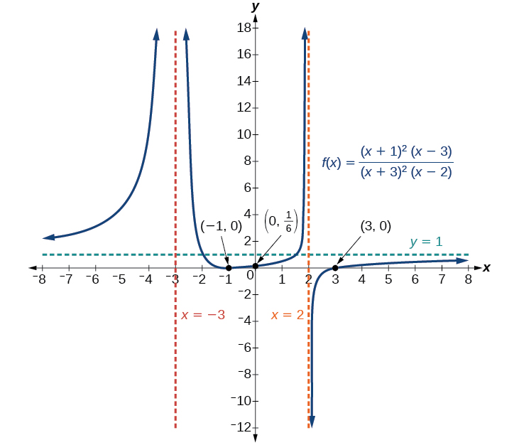{: #Figure_03_07_020}

* At the *x*-intercept
  <math xmlns="http://www.w3.org/1998/Math/MathML"> <mrow> <mtext> </mtext><mi>x</mi><mo>=</mo><mn>−1</mn><mtext> </mtext> </mrow> </math>
  
  corresponding to the
  <math xmlns="http://www.w3.org/1998/Math/MathML"> <mrow> <mtext> </mtext><msup> <mrow> <mo stretchy="false">(</mo><mi>x</mi><mo>+</mo><mn>1</mn><mo stretchy="false">)</mo> </mrow> <mn>2</mn> </msup> <mtext> </mtext> </mrow> </math>
  
  factor of the numerator, the graph \"bounces\", consistent with the quadratic nature of the factor.
* At the *x*-intercept
  <math xmlns="http://www.w3.org/1998/Math/MathML"> <mrow> <mtext> </mtext><mi>x</mi><mo>=</mo><mn>3</mn><mtext> </mtext> </mrow> </math>
  
  corresponding to the
  <math xmlns="http://www.w3.org/1998/Math/MathML"> <mrow> <mtext> </mtext><mo stretchy="false">(</mo><mi>x</mi><mo>−</mo><mn>3</mn><mo stretchy="false">)</mo><mtext> </mtext> </mrow> </math>
  
  factor of the numerator, the graph passes through the axis as we would expect from a linear factor.
* At the vertical asymptote
  <math xmlns="http://www.w3.org/1998/Math/MathML"> <mrow> <mtext> </mtext><mi>x</mi><mo>=</mo><mn>−3</mn><mtext> </mtext> </mrow> </math>
  
  corresponding to the
  <math xmlns="http://www.w3.org/1998/Math/MathML"> <mrow> <mtext> </mtext><msup> <mrow> <mo stretchy="false">(</mo><mi>x</mi><mo>+</mo><mn>3</mn><mo stretchy="false">)</mo> </mrow> <mn>2</mn> </msup> <mtext> </mtext> </mrow> </math>
  
  factor of the denominator, the graph heads towards positive infinity on both sides of the asymptote, consistent with the behavior of the function
  <math xmlns="http://www.w3.org/1998/Math/MathML"> <mrow> <mtext> </mtext><mi>f</mi><mo stretchy="false">(</mo><mi>x</mi><mo stretchy="false">)</mo><mo>=</mo><mfrac> <mn>1</mn> <mrow> <msup> <mi>x</mi> <mn>2</mn> </msup> </mrow> </mfrac> <mo>.</mo> </mrow> </math>

* At the vertical asymptote
  <math xmlns="http://www.w3.org/1998/Math/MathML"> <mrow> <mtext> </mtext><mi>x</mi><mo>=</mo><mn>2</mn><mo>,</mo><mtext> </mtext> </mrow> </math>
  
  corresponding to the
  <math xmlns="http://www.w3.org/1998/Math/MathML"> <mrow> <mtext> </mtext><mo stretchy="false">(</mo><mi>x</mi><mo>−</mo><mn>2</mn><mo stretchy="false">)</mo><mtext> </mtext> </mrow> </math>
  
  factor of the denominator, the graph heads towards positive infinity on the left side of the asymptote and towards negative infinity on the right side, consistent with the behavior of the function
  <math xmlns="http://www.w3.org/1998/Math/MathML"> <mrow> <mtext> </mtext><mi>f</mi><mo stretchy="false">(</mo><mi>x</mi><mo stretchy="false">)</mo><mo>=</mo><mfrac> <mn>1</mn> <mi>x</mi> </mfrac> <mo>.</mo> </mrow> </math>

**Given a rational function, sketch a graph.**

1.  Evaluate the function at 0 to find the *y*-intercept.
2.  Factor the numerator and denominator.
3.  For factors in the numerator not common to the denominator, determine where each factor of the numerator is zero to find the *x*-intercepts.
4.  Find the multiplicities of the *x*-intercepts to determine the behavior of the graph at those points.
5.  For factors in the denominator, note the multiplicities of the zeros to determine the local behavior. For those factors not common to the numerator, find the vertical asymptotes by setting those factors equal to zero and then solve.
6.  For factors in the denominator common to factors in the numerator, find the removable discontinuities by setting those factors equal to 0 and then solve.
7.  Compare the degrees of the numerator and the denominator to determine the horizontal or slant asymptotes.
8.  Sketch the graph.
{: data-number-style="arabic"}

Graphing a Rational Function

Sketch a graph of<math xmlns="http://www.w3.org/1998/Math/MathML"> <mrow> <mtext> </mtext><mi>f</mi><mo stretchy="false">(</mo><mi>x</mi><mo stretchy="false">)</mo><mo>=</mo><mfrac> <mrow> <mo stretchy="false">(</mo><mi>x</mi><mo>+</mo><mn>2</mn><mo stretchy="false">)</mo><mo stretchy="false">(</mo><mi>x</mi><mo>−</mo><mn>3</mn><mo stretchy="false">)</mo> </mrow> <mrow> <msup> <mrow> <mo stretchy="false">(</mo><mi>x</mi><mo>+</mo><mn>1</mn><mo stretchy="false">)</mo> </mrow> <mn>2</mn> </msup> <mo stretchy="false">(</mo><mi>x</mi><mo>−</mo><mn>2</mn><mo stretchy="false">)</mo> </mrow> </mfrac> <mo>.</mo> </mrow> </math>

We can start by noting that the function is already factored, saving us a step.

Next, we will find the intercepts. Evaluating the function at zero gives the *y*-intercept:

<math xmlns="http://www.w3.org/1998/Math/MathML" display="block"> <mrow> <mtable> <mtr rowalign="center"> <mtd columnalign="right" rowalign="center"> <mrow> <mi>f</mi><mo stretchy="false">(</mo><mn>0</mn><mo stretchy="false">)</mo></mrow> </mtd> <mtd rowalign="center"> <mo>=</mo> </mtd> <mtd rowalign="center" columnalign="left"> <mrow> <mfrac> <mrow> <mo stretchy="false">(</mo><mn>0</mn><mo>+</mo><mn>2</mn><mo stretchy="false">)</mo><mo stretchy="false">(</mo><mn>0</mn><mo>−</mo><mn>3</mn><mo stretchy="false">)</mo></mrow> <mrow> <msup> <mrow> <mo stretchy="false">(</mo><mn>0</mn><mo>+</mo><mn>1</mn><mo stretchy="false">)</mo></mrow> <mn>2</mn> </msup> <mo stretchy="false">(</mo><mn>0</mn><mo>−</mo><mn>2</mn><mo stretchy="false">)</mo></mrow> </mfrac> </mrow> </mtd> </mtr> <mtr rowalign="center"> <mtd rowalign="center" /> <mtd rowalign="center"> <mo>=</mo> </mtd> <mtd rowalign="center" columnalign="left"> <mn>3</mn> </mtd> </mtr> </mtable></mrow> </math>

To find the *x*-intercepts, we determine when the numerator of the function is zero. Setting each factor equal to zero, we find *x*-intercepts at<math xmlns="http://www.w3.org/1998/Math/MathML"> <mrow> <mtext> </mtext><mi>x</mi><mo>=</mo><mn>–2</mn><mtext> </mtext> </mrow> </math>

and<math xmlns="http://www.w3.org/1998/Math/MathML"> <mrow> <mtext> </mtext><mi>x</mi><mo>=</mo><mn>3.</mn><mtext> </mtext> </mrow> </math>

At each, the behavior will be linear (multiplicity 1), with the graph passing through the intercept.

We have a *y*-intercept at<math xmlns="http://www.w3.org/1998/Math/MathML"> <mrow> <mtext> </mtext><mo stretchy="false">(</mo><mn>0</mn><mo>,</mo><mn>3</mn><mo stretchy="false">)</mo><mtext> </mtext> </mrow> </math>

and *x*-intercepts at<math xmlns="http://www.w3.org/1998/Math/MathML"> <mrow> <mtext> </mtext><mo stretchy="false">(</mo><mn>–2</mn><mo>,</mo><mn>0</mn><mo stretchy="false">)</mo><mtext> </mtext> </mrow> </math>

and<math xmlns="http://www.w3.org/1998/Math/MathML"> <mrow> <mtext> </mtext><mo stretchy="false">(</mo><mn>3</mn><mo>,</mo><mn>0</mn><mo stretchy="false">)</mo><mo>.</mo> </mrow> </math>

To find the vertical asymptotes, we determine when the denominator is equal to zero. This occurs when<math xmlns="http://www.w3.org/1998/Math/MathML"> <mrow> <mtext> </mtext><mi>x</mi><mo>+</mo><mn>1</mn><mo>=</mo><mn>0</mn><mtext> </mtext> </mrow> </math>

and when<math xmlns="http://www.w3.org/1998/Math/MathML"> <mrow> <mtext> </mtext><mi>x</mi><mo>–</mo><mn>2</mn><mo>=</mo><mn>0</mn><mo>,</mo><mtext> </mtext> </mrow> </math>

giving us vertical asymptotes at<math xmlns="http://www.w3.org/1998/Math/MathML"> <mrow> <mtext> </mtext><mi>x</mi><mo>=</mo><mn>–1</mn><mtext> </mtext> </mrow> </math>

and<math xmlns="http://www.w3.org/1998/Math/MathML"> <mrow> <mtext> </mtext><mi>x</mi><mo>=</mo><mn>2.</mn> </mrow> </math>

There are no common factors in the numerator and denominator. This means there are no removable discontinuities.

Finally, the degree of denominator is larger than the degree of the numerator, telling us this graph has a horizontal asymptote at<math xmlns="http://www.w3.org/1998/Math/MathML"> <mrow> <mtext> </mtext><mi>y</mi><mo>=</mo><mn>0.</mn> </mrow> </math>

To sketch the graph, we might start by plotting the three intercepts. Since the graph has no *x*-intercepts between the vertical asymptotes, and the *y*-intercept is positive, we know the function must remain positive between the asymptotes, letting us fill in the middle portion of the graph as shown in [[link]](#Figure_03_07_021).

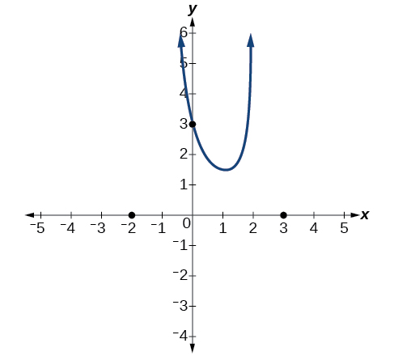{: #Figure_03_07_021}

The factor associated with the vertical asymptote at<math xmlns="http://www.w3.org/1998/Math/MathML"> <mrow> <mtext> </mtext><mi>x</mi><mo>=</mo><mn>−1</mn><mtext> </mtext> </mrow> </math>

was squared, so we know the behavior will be the same on both sides of the asymptote. The graph heads toward positive infinity as the inputs approach the asymptote on the right, so the graph will head toward positive infinity on the left as well.

For the vertical asymptote at<math xmlns="http://www.w3.org/1998/Math/MathML"> <mrow> <mtext> </mtext><mi>x</mi><mo>=</mo><mn>2</mn><mo>,</mo><mtext> </mtext> </mrow> </math>

the factor was not squared, so the graph will have opposite behavior on either side of the asymptote. See [[link]](#Figure_03_07_022). After passing through the *x*-intercepts, the graph will then level off toward an output of zero, as indicated by the horizontal asymptote.

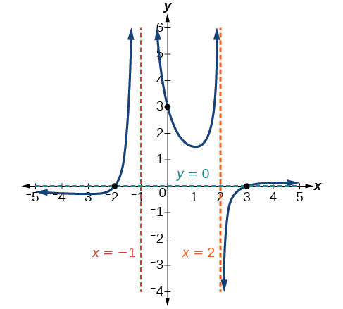{: #Figure_03_07_022}

Given the function<math xmlns="http://www.w3.org/1998/Math/MathML"> <mrow> <mtext> </mtext><mi>f</mi><mo stretchy="false">(</mo><mi>x</mi><mo stretchy="false">)</mo><mo>=</mo><mfrac> <mrow> <msup> <mrow> <mo stretchy="false">(</mo><mi>x</mi><mo>+</mo><mn>2</mn><mo stretchy="false">)</mo> </mrow> <mn>2</mn> </msup> <mo stretchy="false">(</mo><mi>x</mi><mo>−</mo><mn>2</mn><mo stretchy="false">)</mo> </mrow> <mrow> <mn>2</mn><msup> <mrow> <mo stretchy="false">(</mo><mi>x</mi><mo>−</mo><mn>1</mn><mo stretchy="false">)</mo> </mrow> <mn>2</mn> </msup> <mo stretchy="false">(</mo><mi>x</mi><mo>−</mo><mn>3</mn><mo stretchy="false">)</mo> </mrow> </mfrac> <mo>,</mo><mtext> </mtext> </mrow> </math>

use the characteristics of polynomials and rational functions to describe its behavior and sketch the function.

Horizontal asymptote at<math xmlns="http://www.w3.org/1998/Math/MathML"> <mrow> <mtext> </mtext><mi>y</mi><mo>=</mo><mfrac> <mn>1</mn> <mn>2</mn> </mfrac> <mo>.</mo><mtext> </mtext> </mrow> </math>

Vertical asymptotes at<math xmlns="http://www.w3.org/1998/Math/MathML"> <mrow> <mtext> </mtext><mi>x</mi><mo>=</mo><mn>1</mn><mo> </mo><mtext>and</mtext><mo> </mo><mi>x</mi><mo>=</mo><mn>3.</mn><mtext> </mtext> </mrow> </math>

*y*-intercept at<math xmlns="http://www.w3.org/1998/Math/MathML"> <mrow> <mtext> </mtext><mrow><mo>(</mo> <mrow> <mn>0</mn><mo>,</mo><mfrac> <mn>4</mn> <mn>3</mn> </mfrac> <mo>.</mo> </mrow> <mo>)</mo></mrow> </mrow> </math>

*x*-intercepts at<math xmlns="http://www.w3.org/1998/Math/MathML"> <mrow> <mtext> </mtext><mo stretchy="false">(</mo><mn>2</mn><mo>,</mo><mn>0</mn><mo stretchy="false">)</mo><mo> </mo><mtext> and </mtext><mo stretchy="false">(</mo><mo>–</mo><mn>2</mn><mo>,</mo><mn>0</mn><mo stretchy="false">)</mo><mo>.</mo><mtext> </mtext> </mrow> </math>

<math xmlns="http://www.w3.org/1998/Math/MathML"> <mrow> <mo stretchy="false">(</mo><mo>–</mo><mn>2</mn><mo>,</mo><mn>0</mn><mo stretchy="false">)</mo><mtext> </mtext> </mrow> </math>

is a zero with multiplicity 2, and the graph bounces off the *x*-axis at this point.<math xmlns="http://www.w3.org/1998/Math/MathML"> <mrow> <mtext> </mtext><mo stretchy="false">(</mo><mn>2</mn><mo>,</mo><mn>0</mn><mo stretchy="false">)</mo><mtext> </mtext> </mrow> </math>

is a single zero and the graph crosses the axis at this point.

 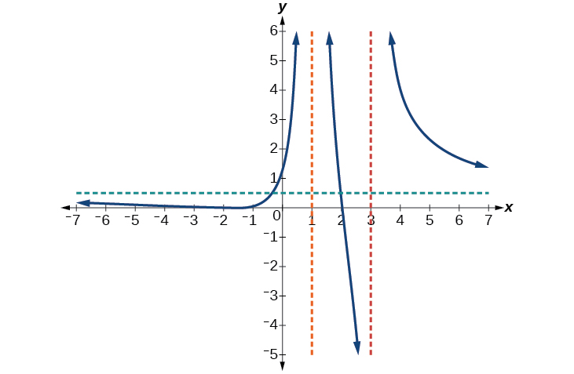 

# Writing Rational Functions

Now that we have analyzed the equations for rational functions and how they relate to a graph of the function, we can use information given by a graph to write the function. A rational function written in factored form will have an *x*-intercept where each factor of the numerator is equal to zero. (An exception occurs in the case of a removable discontinuity.) As a result, we can form a numerator of a function whose graph will pass through a set of *x*-intercepts by introducing a corresponding set of factors. Likewise, because the function will have a vertical asymptote where each factor of the denominator is equal to zero, we can form a denominator that will produce the vertical asymptotes by introducing a corresponding set of factors.

Writing Rational Functions from Intercepts and Asymptotes

If a **rational function**{: data-type="term" .no-emphasis} has *x*-intercepts at<math xmlns="http://www.w3.org/1998/Math/MathML"> <mrow> <mtext> </mtext><mi>x</mi><mo>=</mo><msub> <mi>x</mi> <mn>1</mn> </msub> <mo>,</mo><msub> <mi>x</mi> <mn>2</mn> </msub> <mo>,</mo><mn>...</mn><mo>,</mo><msub> <mi>x</mi> <mi>n</mi> </msub> <mo>,</mo><mtext> </mtext> </mrow> </math>

vertical asymptotes at<math xmlns="http://www.w3.org/1998/Math/MathML"> <mrow> <mtext> </mtext><mi>x</mi><mo>=</mo><msub> <mi>v</mi> <mn>1</mn> </msub> <mo>,</mo><msub> <mi>v</mi> <mn>2</mn> </msub> <mo>,</mo><mo>…</mo><mo>,</mo><msub> <mi>v</mi> <mi>m</mi> </msub> <mo>,</mo><mtext> </mtext> </mrow> </math>

and no<math xmlns="http://www.w3.org/1998/Math/MathML"> <mrow> <mtext> </mtext><msub> <mi>x</mi> <mi>i</mi> </msub> <mo>=</mo><mtext>any </mtext><msub> <mi>v</mi> <mi>j</mi> </msub> <mo>,</mo><mtext> </mtext> </mrow> </math>

then the function can be written in the form:

<math xmlns="http://www.w3.org/1998/Math/MathML" display="block"> <mrow> <mi>f</mi><mo stretchy="false">(</mo><mi>x</mi><mo stretchy="false">)</mo><mo>=</mo><mi>a</mi><mfrac> <mrow> <msup> <mrow> <mo stretchy="false">(</mo><mi>x</mi><mo>−</mo><msub> <mi>x</mi> <mn>1</mn> </msub> <mo stretchy="false">)</mo> </mrow> <mrow> <msub> <mi>p</mi> <mn>1</mn> </msub> </mrow> </msup> <msup> <mrow> <mo stretchy="false">(</mo><mi>x</mi><mo>−</mo><msub> <mi>x</mi> <mn>2</mn> </msub> <mo stretchy="false">)</mo> </mrow> <mrow> <msub> <mi>p</mi> <mn>2</mn> </msub> </mrow> </msup> <mo>⋯</mo><msup> <mrow> <mo stretchy="false">(</mo><mi>x</mi><mo>−</mo><msub> <mi>x</mi> <mi>n</mi> </msub> <mo stretchy="false">)</mo> </mrow> <mrow> <msub> <mi>p</mi> <mi>n</mi> </msub> </mrow> </msup> </mrow> <mrow> <msup> <mrow> <mo stretchy="false">(</mo><mi>x</mi><mo>−</mo><msub> <mi>v</mi> <mn>1</mn> </msub> <mo stretchy="false">)</mo> </mrow> <mrow> <msub> <mi>q</mi> <mn>1</mn> </msub> </mrow> </msup> <msup> <mrow> <mo stretchy="false">(</mo><mi>x</mi><mo>−</mo><msub> <mi>v</mi> <mn>2</mn> </msub> <mo stretchy="false">)</mo> </mrow> <mrow> <msub> <mi>q</mi> <mn>2</mn> </msub> </mrow> </msup> <mo>⋯</mo><msup> <mrow> <mo stretchy="false">(</mo><mi>x</mi><mo>−</mo><msub> <mi>v</mi> <mi>m</mi> </msub> <mo stretchy="false">)</mo> </mrow> <mrow> <msub> <mi>q</mi> <mi>n</mi> </msub> </mrow> </msup> </mrow> </mfrac> </mrow> </math>

where the powers<math xmlns="http://www.w3.org/1998/Math/MathML"> <mrow> <mtext> </mtext><msub> <mi>p</mi> <mi>i</mi> </msub> <mtext> </mtext> </mrow> </math>

or<math xmlns="http://www.w3.org/1998/Math/MathML"> <mrow> <mtext> </mtext><msub> <mi>q</mi> <mi>i</mi> </msub> <mtext> </mtext> </mrow> </math>

on each factor can be determined by the behavior of the graph at the corresponding intercept or asymptote, and the stretch factor<math xmlns="http://www.w3.org/1998/Math/MathML"> <mrow> <mtext> </mtext><mi>a</mi><mtext> </mtext> </mrow> </math>

can be determined given a value of the function other than the *x*-intercept or by the horizontal asymptote if it is nonzero.

**Given a graph of a rational function, write the function.**

1.  Determine the factors of the numerator. Examine the behavior of the graph at the *x*-intercepts to determine the zeroes and their multiplicities. (This is easy to do when finding the “simplest” function with small multiplicities—such as 1 or 3—but may be difficult for larger multiplicities—such as 5 or 7, for example.)
2.  Determine the factors of the denominator. Examine the behavior on both sides of each vertical asymptote to determine the factors and their powers.
3.  Use any clear point on the graph to find the stretch factor.
{: data-number-style="arabic"}

Writing a Rational Function from Intercepts and Asymptotes

Write an equation for the rational function shown in [[link]](#Figure_03_07_024).

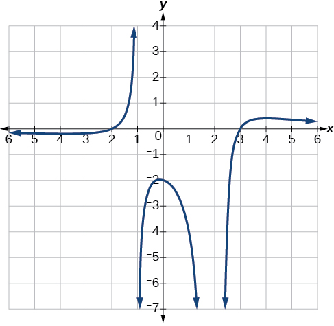{: #Figure_03_07_024}

The graph appears to have *x*-intercepts at<math xmlns="http://www.w3.org/1998/Math/MathML"> <mrow> <mtext> </mtext><mi>x</mi><mo>=</mo><mn>–2</mn><mtext> </mtext> </mrow> </math>

and<math xmlns="http://www.w3.org/1998/Math/MathML"> <mrow> <mtext> </mtext><mi>x</mi><mo>=</mo><mn>3.</mn><mtext> </mtext> </mrow> </math>

At both, the graph passes through the intercept, suggesting linear factors. The graph has two vertical asymptotes. The one at<math xmlns="http://www.w3.org/1998/Math/MathML"> <mrow> <mtext> </mtext><mi>x</mi><mo>=</mo><mn>–1</mn><mtext> </mtext> </mrow> </math>

seems to exhibit the basic behavior similar to<math xmlns="http://www.w3.org/1998/Math/MathML"> <mrow> <mtext> </mtext><mfrac> <mn>1</mn> <mi>x</mi> </mfrac> <mo>,</mo><mtext> </mtext> </mrow> </math>

with the graph heading toward positive infinity on one side and heading toward negative infinity on the other. The asymptote at<math xmlns="http://www.w3.org/1998/Math/MathML"> <mrow> <mtext> </mtext><mi>x</mi><mo>=</mo><mn>2</mn><mtext> </mtext> </mrow> </math>

is exhibiting a behavior similar to<math xmlns="http://www.w3.org/1998/Math/MathML"> <mrow> <mtext> </mtext><mfrac> <mn>1</mn> <mrow> <msup> <mi>x</mi> <mn>2</mn> </msup> </mrow> </mfrac> <mo>,</mo><mtext> </mtext> </mrow> </math>

with the graph heading toward negative infinity on both sides of the asymptote. See [[link]](#Figure_03_07_025).

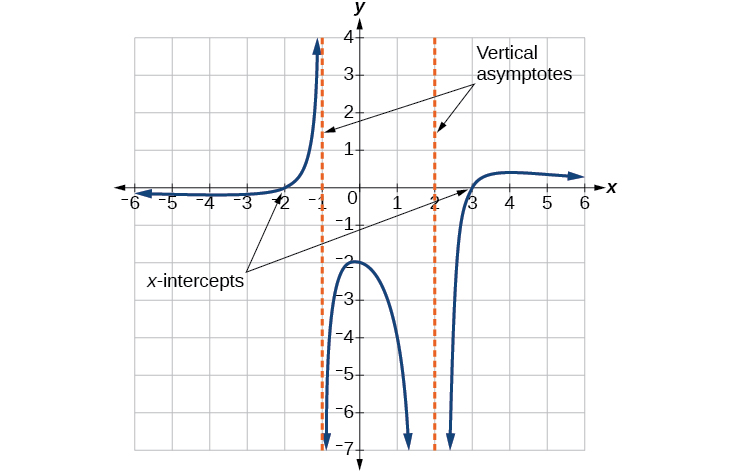{: #Figure_03_07_025}

We can use this information to write a function of the form

<math xmlns="http://www.w3.org/1998/Math/MathML" display="block"> <mrow> <mi>f</mi><mo stretchy="false">(</mo><mi>x</mi><mo stretchy="false">)</mo><mo>=</mo><mi>a</mi><mfrac> <mrow> <mo stretchy="false">(</mo><mi>x</mi><mo>+</mo><mn>2</mn><mo stretchy="false">)</mo><mo stretchy="false">(</mo><mi>x</mi><mo>−</mo><mn>3</mn><mo stretchy="false">)</mo> </mrow> <mrow> <mo stretchy="false">(</mo><mi>x</mi><mo>+</mo><mn>1</mn><mo stretchy="false">)</mo><msup> <mrow> <mo stretchy="false">(</mo><mi>x</mi><mo>−</mo><mn>2</mn><mo stretchy="false">)</mo> </mrow> <mn>2</mn> </msup> </mrow> </mfrac> </mrow> </math>

To find the stretch factor, we can use another clear point on the graph, such as the *y*-intercept<math xmlns="http://www.w3.org/1998/Math/MathML"> <mrow> <mtext> </mtext><mo stretchy="false">(</mo><mn>0</mn><mo>,</mo><mn>–2</mn><mo stretchy="false">)</mo><mo>.</mo> </mrow> </math>

<math xmlns="http://www.w3.org/1998/Math/MathML" display="block"> <mrow> <mtable> <mtr> <mtd columnalign="right"> <mrow> <mn>−2</mn></mrow> </mtd> <mtd> <mo>=</mo> </mtd> <mtd columnalign="left"> <mrow> <mi>a</mi><mfrac> <mrow> <mo stretchy="false">(</mo><mn>0</mn><mo>+</mo><mn>2</mn><mo stretchy="false">)</mo><mo stretchy="false">(</mo><mn>0</mn><mo>−</mo><mn>3</mn><mo stretchy="false">)</mo></mrow> <mrow> <mo stretchy="false">(</mo><mn>0</mn><mo>+</mo><mn>1</mn><mo stretchy="false">)</mo><msup> <mrow> <mo stretchy="false">(</mo><mn>0</mn><mo>−</mo><mn>2</mn><mo stretchy="false">)</mo></mrow> <mn>2</mn> </msup> </mrow> </mfrac> </mrow> </mtd> </mtr> <mtr> <mtd columnalign="right"> <mrow> <mn>−2</mn></mrow> </mtd> <mtd> <mo>=</mo> </mtd> <mtd columnalign="left"> <mrow> <mi>a</mi><mfrac> <mrow> <mo>−</mo><mn>6</mn></mrow> <mn>4</mn> </mfrac> </mrow> </mtd> </mtr> <mtr> <mtd columnalign="right"> <mi>a</mi> </mtd> <mtd> <mo>=</mo> </mtd> <mtd columnalign="left"> <mrow> <mfrac> <mrow> <mo>−</mo><mn>8</mn></mrow> <mrow> <mo>−</mo><mn>6</mn></mrow> </mfrac> <mo>=</mo><mfrac> <mn>4</mn> <mn>3</mn> </mfrac> </mrow> </mtd> </mtr> </mtable></mrow> </math>

This gives us a final function of<math xmlns="http://www.w3.org/1998/Math/MathML"> <mrow> <mtext> </mtext><mi>f</mi><mo stretchy="false">(</mo><mi>x</mi><mo stretchy="false">)</mo><mo>=</mo><mfrac> <mrow> <mn>4</mn><mo stretchy="false">(</mo><mi>x</mi><mo>+</mo><mn>2</mn><mo stretchy="false">)</mo><mo stretchy="false">(</mo><mi>x</mi><mo>−</mo><mn>3</mn><mo stretchy="false">)</mo> </mrow> <mrow> <mn>3</mn><mo stretchy="false">(</mo><mi>x</mi><mo>+</mo><mn>1</mn><mo stretchy="false">)</mo><msup> <mrow> <mo stretchy="false">(</mo><mi>x</mi><mo>−</mo><mn>2</mn><mo stretchy="false">)</mo> </mrow> <mn>2</mn> </msup> </mrow> </mfrac> <mo>.</mo> </mrow> </math>

Access these online resources for additional instruction and practice with rational functions.

* [Graphing Rational Functions][1]
* [Find the Equation of a Rational Function][2]
* [Determining Vertical and Horizontal Asymptotes][3]
* [Find the Intercepts, Asymptotes, and Hole of a Rational Function][4]

# Key Equations

| Rational Function | <math xmlns="http://www.w3.org/1998/Math/MathML"> <mrow> <mi>f</mi><mo stretchy="false">(</mo><mi>x</mi><mo stretchy="false">)</mo><mo>=</mo><mfrac> <mrow> <mi>P</mi><mo stretchy="false">(</mo><mi>x</mi><mo stretchy="false">)</mo> </mrow> <mrow> <mi>Q</mi><mo stretchy="false">(</mo><mi>x</mi><mo stretchy="false">)</mo> </mrow> </mfrac> <mo>=</mo><mfrac> <mrow> <msub> <mi>a</mi> <mi>p</mi> </msub> <msup> <mi>x</mi> <mi>p</mi> </msup> <mo>+</mo><msub> <mi>a</mi> <mrow> <mi>p</mi><mo>−</mo><mn>1</mn> </mrow> </msub> <msup> <mi>x</mi> <mrow> <mi>p</mi><mo>−</mo><mn>1</mn> </mrow> </msup> <mo>+</mo><mn>...</mn><mo>+</mo><msub> <mi>a</mi> <mn>1</mn> </msub> <mi>x</mi><mo>+</mo><msub> <mi>a</mi> <mn>0</mn> </msub> </mrow> <mrow> <msub> <mi>b</mi> <mi>q</mi> </msub> <msup> <mi>x</mi> <mi>q</mi> </msup> <mo>+</mo><msub> <mi>b</mi> <mrow> <mi>q</mi><mo>−</mo><mn>1</mn> </mrow> </msub> <msup> <mi>x</mi> <mrow> <mi>q</mi><mo>−</mo><mn>1</mn> </mrow> </msup> <mo>+</mo><mn>...</mn><mo>+</mo><msub> <mi>b</mi> <mn>1</mn> </msub> <mi>x</mi><mo>+</mo><msub> <mi>b</mi> <mn>0</mn> </msub> </mrow> </mfrac> <mo>,</mo><mo> </mo><mi>Q</mi><mo stretchy="false">(</mo><mi>x</mi><mo stretchy="false">)</mo><mo>≠</mo><mn>0</mn> </mrow> </math>

 |
{: #eip-id1362369 summary=".."}

# Key Concepts

* We can use arrow notation to describe local behavior and end behavior of the toolkit functions
  <math xmlns="http://www.w3.org/1998/Math/MathML"> <mrow> <mtext> </mtext><mi>f</mi><mo stretchy="false">(</mo><mi>x</mi><mo stretchy="false">)</mo><mo>=</mo><mfrac> <mn>1</mn> <mi>x</mi> </mfrac> <mtext> </mtext> </mrow> </math>
  
  and
  <math xmlns="http://www.w3.org/1998/Math/MathML"> <mrow> <mtext> </mtext><mi>f</mi><mo stretchy="false">(</mo><mi>x</mi><mo stretchy="false">)</mo><mo>=</mo><mfrac> <mn>1</mn> <mrow> <msup> <mi>x</mi> <mn>2</mn> </msup> </mrow> </mfrac> <mo>.</mo><mtext> </mtext> </mrow> </math>
  
  See [\[link\]](#Example_03_07_01).
* A function that levels off at a horizontal value has a horizontal asymptote. A function can have more than one vertical asymptote. See [\[link\]](#Example_03_07_02).
* Application problems involving rates and concentrations often involve rational functions. See [\[link\]](#Example_03_07_03).
* The domain of a rational function includes all real numbers except those that cause the denominator to equal zero. See [\[link\]](#Example_03_07_04).
* The vertical asymptotes of a rational function will occur where the denominator of the function is equal to zero and the numerator is not zero. See [\[link\]](#Example_03_07_05).
* A removable discontinuity might occur in the graph of a rational function if an input causes both numerator and denominator to be zero. See [\[link\]](#Example_03_07_06).
* A rational function’s end behavior will mirror that of the ratio of the leading terms of the numerator and denominator functions. See [\[link\]](#Example_03_07_07), [\[link\]](#Example_03_07_08), [\[link\]](#Example_03_07_09), and [\[link\]](#Example_03_07_10).
* Graph rational functions by finding the intercepts, behavior at the intercepts and asymptotes, and end behavior. See [\[link\]](#Example_03_07_11).
* If a rational function has *x*-intercepts at
  <math xmlns="http://www.w3.org/1998/Math/MathML"> <mrow> <mtext> </mtext><mi>x</mi><mo>=</mo><msub> <mi>x</mi> <mn>1</mn> </msub> <mo>,</mo><msub> <mi>x</mi> <mn>2</mn> </msub> <mo>,</mo><mo>…</mo><mo>,</mo><msub> <mi>x</mi> <mi>n</mi> </msub> <mo>,</mo><mtext> </mtext> </mrow> </math>
  
  vertical asymptotes at
  <math xmlns="http://www.w3.org/1998/Math/MathML"> <mrow> <mtext> </mtext><mi>x</mi><mo>=</mo><msub> <mi>v</mi> <mn>1</mn> </msub> <mo>,</mo><msub> <mi>v</mi> <mn>2</mn> </msub> <mo>,</mo><mo>…</mo><mo>,</mo><msub> <mi>v</mi> <mi>m</mi> </msub> <mo>,</mo><mtext> </mtext> </mrow> </math>
  
  and no
  <math xmlns="http://www.w3.org/1998/Math/MathML"> <mrow> <mtext> </mtext><msub> <mi>x</mi> <mi>i</mi> </msub> <mo>=</mo><mtext>any </mtext><msub> <mi>v</mi> <mi>j</mi> </msub> <mo>,</mo><mtext> </mtext> </mrow> </math>
  
  then the function can be written in the form

<math xmlns="http://www.w3.org/1998/Math/MathML"> <mrow> <mtable columnalign="left"> <mtr columnalign="left"> <mtd columnalign="left"> <mrow> <mtable columnalign="left"> <mtr columnalign="left"> <mtd columnalign="left"> <mrow /> </mtd> </mtr> <mtr columnalign="left"> <mtd columnalign="left"> <mrow> <mi>f</mi><mo stretchy="false">(</mo><mi>x</mi><mo stretchy="false">)</mo><mo>=</mo><mi>a</mi><mfrac> <mrow> <msup> <mrow> <mo stretchy="false">(</mo><mi>x</mi><mo>−</mo><msub> <mi>x</mi> <mn>1</mn> </msub> <mo stretchy="false">)</mo> </mrow> <mrow> <msub> <mi>p</mi> <mn>1</mn> </msub> </mrow> </msup> <msup> <mrow> <mo stretchy="false">(</mo><mi>x</mi><mo>−</mo><msub> <mi>x</mi> <mn>2</mn> </msub> <mo stretchy="false">)</mo> </mrow> <mrow> <msub> <mi>p</mi> <mn>2</mn> </msub> </mrow> </msup> <mo>⋯</mo><msup> <mrow> <mo stretchy="false">(</mo><mi>x</mi><mo>−</mo><msub> <mi>x</mi> <mi>n</mi> </msub> <mo stretchy="false">)</mo> </mrow> <mrow> <msub> <mi>p</mi> <mi>n</mi> </msub> </mrow> </msup> </mrow> <mrow> <msup> <mrow> <mo stretchy="false">(</mo><mi>x</mi><mo>−</mo><msub> <mi>v</mi> <mn>1</mn> </msub> <mo stretchy="false">)</mo> </mrow> <mrow> <msub> <mi>q</mi> <mn>1</mn> </msub> </mrow> </msup> <msup> <mrow> <mo stretchy="false">(</mo><mi>x</mi><mo>−</mo><msub> <mi>v</mi> <mn>2</mn> </msub> <mo stretchy="false">)</mo> </mrow> <mrow> <msub> <mi>q</mi> <mn>2</mn> </msub> </mrow> </msup> <mo>⋯</mo><msup> <mrow> <mo stretchy="false">(</mo><mi>x</mi><mo>−</mo><msub> <mi>v</mi> <mi>m</mi> </msub> <mo stretchy="false">)</mo> </mrow> <mrow> <msub> <mi>q</mi> <mi>n</mi> </msub> </mrow> </msup> </mrow> </mfrac> </mrow> </mtd> </mtr> </mtable> </mrow> </mtd> </mtr> </mtable> </mrow> </math>

See [\[link\]](#Example_03_07_12).

# Section Exercises

## Verbal

What is the fundamental difference in the algebraic representation of a polynomial function and a rational function?

The rational function will be represented by a quotient of polynomial functions.

What is the fundamental difference in the graphs of polynomial functions and rational functions?

If the graph of a rational function has a removable discontinuity, what must be true of the functional rule?

The numerator and denominator must have a common factor.

Can a graph of a rational function have no vertical asymptote? If so, how?

Can a graph of a rational function have no *x*-intercepts? If so, how?

Yes. The numerator of the formula of the functions would have only complex roots and/or factors common to both the numerator and denominator.

## Algebraic

For the following exercises, find the domain of the rational functions.

<math xmlns="http://www.w3.org/1998/Math/MathML"> <mrow> <mi>f</mi><mo stretchy="false">(</mo><mi>x</mi><mo stretchy="false">)</mo><mo>=</mo><mfrac> <mrow> <mi>x</mi><mo>−</mo><mn>1</mn> </mrow> <mrow> <mi>x</mi><mo>+</mo><mn>2</mn> </mrow> </mfrac> </mrow> </math>

<math xmlns="http://www.w3.org/1998/Math/MathML"> <mrow> <mi>f</mi><mo stretchy="false">(</mo><mi>x</mi><mo stretchy="false">)</mo><mo>=</mo><mfrac> <mrow> <mi>x</mi><mo>+</mo><mn>1</mn> </mrow> <mrow> <msup> <mi>x</mi> <mn>2</mn> </msup> <mo>−</mo><mn>1</mn> </mrow> </mfrac> </mrow> </math>

<math xmlns="http://www.w3.org/1998/Math/MathML"> <mrow> <mtext>All reals </mtext><mi>x</mi><mo>≠</mo><mo>–</mo><mn>1</mn><mo>,</mo><mo> </mo><mn>1</mn> </mrow> </math>

<math xmlns="http://www.w3.org/1998/Math/MathML"> <mrow> <mi>f</mi><mo stretchy="false">(</mo><mi>x</mi><mo stretchy="false">)</mo><mo>=</mo><mfrac> <mrow> <msup> <mi>x</mi> <mn>2</mn> </msup> <mo>+</mo><mn>4</mn> </mrow> <mrow> <msup> <mi>x</mi> <mn>2</mn> </msup> <mo>−</mo><mn>2</mn><mi>x</mi><mo>−</mo><mn>8</mn> </mrow> </mfrac> </mrow> </math>

<math xmlns="http://www.w3.org/1998/Math/MathML"> <mrow> <mi>f</mi><mo stretchy="false">(</mo><mi>x</mi><mo stretchy="false">)</mo><mo>=</mo><mfrac> <mrow> <msup> <mi>x</mi> <mn>2</mn> </msup> <mo>+</mo><mn>4</mn><mi>x</mi><mo>−</mo><mn>3</mn> </mrow> <mrow> <msup> <mi>x</mi> <mn>4</mn> </msup> <mo>−</mo><mn>5</mn><msup> <mi>x</mi> <mn>2</mn> </msup> <mo>+</mo><mn>4</mn> </mrow> </mfrac> </mrow> </math>

<math xmlns="http://www.w3.org/1998/Math/MathML"> <mrow> <mtext>All reals </mtext><mi>x</mi><mo>≠</mo><mo>–</mo><mn>1</mn><mo>,</mo><mo> </mo><mo>–</mo><mn>2</mn><mo>,</mo><mo> </mo><mn>1</mn><mo>,</mo><mo> </mo><mn>2</mn> </mrow> </math>

For the following exercises, find the domain, vertical asymptotes, and horizontal asymptotes of the functions.

<math xmlns="http://www.w3.org/1998/Math/MathML"> <mrow> <mi>f</mi><mo stretchy="false">(</mo><mi>x</mi><mo stretchy="false">)</mo><mo>=</mo><mfrac> <mn>4</mn> <mrow> <mi>x</mi><mo>−</mo><mn>1</mn> </mrow> </mfrac> </mrow> </math>

<math xmlns="http://www.w3.org/1998/Math/MathML"> <mrow> <mi>f</mi><mrow><mo>(</mo> <mi>x</mi> <mo>)</mo></mrow><mo>=</mo><mfrac> <mn>2</mn> <mrow> <mn>5</mn><mi>x</mi><mo>+</mo><mn>2</mn> </mrow> </mfrac> </mrow> </math>

V.A. at<math xmlns="http://www.w3.org/1998/Math/MathML"> <mrow> <mtext> </mtext><mi>x</mi><mo>=</mo><mo>–</mo><mfrac> <mn>2</mn> <mn>5</mn> </mfrac> <mo>;</mo><mtext> </mtext> </mrow> </math>

H.A. at<math xmlns="http://www.w3.org/1998/Math/MathML"> <mrow> <mtext> </mtext><mi>y</mi><mo>=</mo><mn>0</mn><mo>;</mo><mtext> </mtext> </mrow> </math>

Domain is all reals<math xmlns="http://www.w3.org/1998/Math/MathML"> <mrow> <mtext> </mtext><mi>x</mi><mo>≠</mo><mo>–</mo><mfrac> <mn>2</mn> <mn>5</mn> </mfrac> </mrow> </math>

<math xmlns="http://www.w3.org/1998/Math/MathML"> <mrow> <mi>f</mi><mo stretchy="false">(</mo><mi>x</mi><mo stretchy="false">)</mo><mo>=</mo><mfrac> <mi>x</mi> <mrow> <msup> <mi>x</mi> <mn>2</mn> </msup> <mo>−</mo><mn>9</mn> </mrow> </mfrac> </mrow> </math>

<math xmlns="http://www.w3.org/1998/Math/MathML"> <mrow> <mi>f</mi><mo stretchy="false">(</mo><mi>x</mi><mo stretchy="false">)</mo><mo>=</mo><mfrac> <mi>x</mi> <mrow> <msup> <mi>x</mi> <mn>2</mn> </msup> <mo>+</mo><mn>5</mn><mi>x</mi><mo>−</mo><mn>36</mn> </mrow> </mfrac> </mrow> </math>

V.A. at<math xmlns="http://www.w3.org/1998/Math/MathML"> <mrow> <mtext> </mtext><mi>x</mi><mo>=</mo><mn>4</mn><mo>,</mo><mo> </mo><mo>–</mo><mn>9</mn><mo>;</mo><mtext> </mtext> </mrow> </math>

H.A. at<math xmlns="http://www.w3.org/1998/Math/MathML"> <mrow> <mtext> </mtext><mi>y</mi><mo>=</mo><mn>0</mn><mo>;</mo><mtext> </mtext> </mrow> </math>

Domain is all reals<math xmlns="http://www.w3.org/1998/Math/MathML"> <mrow> <mtext> </mtext><mi>x</mi><mo>≠</mo><mn>4</mn><mo>,</mo><mo> </mo><mo>–</mo><mn>9</mn> </mrow> </math>

<math xmlns="http://www.w3.org/1998/Math/MathML"> <mrow> <mi>f</mi><mrow><mo>(</mo> <mi>x</mi> <mo>)</mo></mrow><mo>=</mo><mfrac> <mrow> <mn>3</mn><mo>+</mo><mi>x</mi> </mrow> <mrow> <msup> <mi>x</mi> <mn>3</mn> </msup> <mo>−</mo><mn>27</mn> </mrow> </mfrac> </mrow> </math>

<math xmlns="http://www.w3.org/1998/Math/MathML"> <mrow> <mi>f</mi><mo stretchy="false">(</mo><mi>x</mi><mo stretchy="false">)</mo><mo>=</mo><mfrac> <mrow> <mn>3</mn><mi>x</mi><mo>−</mo><mn>4</mn> </mrow> <mrow> <msup> <mi>x</mi> <mn>3</mn> </msup> <mo>−</mo><mn>16</mn><mi>x</mi> </mrow> </mfrac> </mrow> </math>

V.A. at<math xmlns="http://www.w3.org/1998/Math/MathML"> <mrow> <mtext> </mtext><mi>x</mi><mo>=</mo><mn>0</mn><mo>,</mo><mo> </mo><mn>4</mn><mo>,</mo><mo> </mo><mo>−</mo><mn>4</mn><mo>;</mo><mtext> </mtext> </mrow> </math>

H.A. at<math xmlns="http://www.w3.org/1998/Math/MathML"> <mrow> <mtext> </mtext><mi>y</mi><mo>=</mo><mn>0</mn><mo>;</mo> </mrow> </math>

Domain is all reals<math xmlns="http://www.w3.org/1998/Math/MathML"> <mrow> <mtext> </mtext><mi>x</mi><mo>≠</mo><mn>0</mn><mo>,</mo><mn>4</mn><mo>,</mo><mo> </mo><mo>–</mo><mn>4</mn> </mrow> </math>

<math xmlns="http://www.w3.org/1998/Math/MathML"> <mrow> <mi>f</mi><mo stretchy="false">(</mo><mi>x</mi><mo stretchy="false">)</mo><mo>=</mo><mfrac> <mrow> <msup> <mi>x</mi> <mn>2</mn> </msup> <mo>−</mo><mn>1</mn> </mrow> <mrow> <msup> <mi>x</mi> <mn>3</mn> </msup> <mo>+</mo><mn>9</mn><msup> <mi>x</mi> <mn>2</mn> </msup> <mo>+</mo><mn>14</mn><mi>x</mi> </mrow> </mfrac> </mrow> </math>

<math xmlns="http://www.w3.org/1998/Math/MathML"> <mrow> <mi>f</mi><mo stretchy="false">(</mo><mi>x</mi><mo stretchy="false">)</mo><mo>=</mo><mfrac> <mrow> <mi>x</mi><mo>+</mo><mn>5</mn> </mrow> <mrow> <msup> <mi>x</mi> <mn>2</mn> </msup> <mo>−</mo><mn>25</mn> </mrow> </mfrac> </mrow> </math>

V.A. at<math xmlns="http://www.w3.org/1998/Math/MathML"> <mrow> <mtext> </mtext><mi>x</mi><mo>=</mo><mo>−</mo><mn>5</mn><mo>;</mo><mtext> </mtext> </mrow> </math>

H.A. at<math xmlns="http://www.w3.org/1998/Math/MathML"> <mrow> <mtext> </mtext><mi>y</mi><mo>=</mo><mn>0</mn><mo>;</mo><mtext> </mtext> </mrow> </math>

Domain is all reals<math xmlns="http://www.w3.org/1998/Math/MathML"> <mrow> <mtext> </mtext><mi>x</mi><mo>≠</mo><mn>5</mn><mo>,</mo><mo>−</mo><mn>5</mn> </mrow> </math>

<math xmlns="http://www.w3.org/1998/Math/MathML"> <mrow> <mi>f</mi><mo stretchy="false">(</mo><mi>x</mi><mo stretchy="false">)</mo><mo>=</mo><mfrac> <mrow> <mi>x</mi><mo>−</mo><mn>4</mn> </mrow> <mrow> <mi>x</mi><mo>−</mo><mn>6</mn> </mrow> </mfrac> </mrow> </math>

<math xmlns="http://www.w3.org/1998/Math/MathML"> <mrow> <mi>f</mi><mrow><mo>(</mo> <mi>x</mi> <mo>)</mo></mrow><mo>=</mo><mfrac> <mrow> <mn>4</mn><mo>−</mo><mn>2</mn><mi>x</mi> </mrow> <mrow> <mn>3</mn><mi>x</mi><mo>−</mo><mn>1</mn> </mrow> </mfrac> </mrow> </math>

V.A. at<math xmlns="http://www.w3.org/1998/Math/MathML"> <mrow> <mtext> </mtext><mi>x</mi><mo>=</mo><mfrac> <mn>1</mn> <mn>3</mn> </mfrac> <mo>;</mo><mtext> </mtext> </mrow> </math>

H.A. at<math xmlns="http://www.w3.org/1998/Math/MathML"> <mrow> <mtext> </mtext><mi>y</mi><mo>=</mo><mo>−</mo><mfrac> <mn>2</mn> <mn>3</mn> </mfrac> <mo>;</mo><mtext> </mtext> </mrow> </math>

Domain is all reals<math xmlns="http://www.w3.org/1998/Math/MathML"> <mrow> <mtext> </mtext><mi>x</mi><mo>≠</mo><mfrac> <mn>1</mn> <mn>3</mn> </mfrac> <mo>.</mo> </mrow> </math>

For the following exercises, find the *x*- and *y*-intercepts for the functions.

<math xmlns="http://www.w3.org/1998/Math/MathML"> <mrow> <mi>f</mi><mo stretchy="false">(</mo><mi>x</mi><mo stretchy="false">)</mo><mo>=</mo><mfrac> <mrow> <mi>x</mi><mo>+</mo><mn>5</mn> </mrow> <mrow> <msup> <mi>x</mi> <mn>2</mn> </msup> <mo>+</mo><mn>4</mn> </mrow> </mfrac> </mrow> </math>

<math xmlns="http://www.w3.org/1998/Math/MathML"> <mrow> <mi>f</mi><mo stretchy="false">(</mo><mi>x</mi><mo stretchy="false">)</mo><mo>=</mo><mfrac> <mi>x</mi> <mrow> <msup> <mi>x</mi> <mn>2</mn> </msup> <mo>−</mo><mi>x</mi> </mrow> </mfrac> </mrow> </math>

none

<math xmlns="http://www.w3.org/1998/Math/MathML"> <mrow> <mi>f</mi><mo stretchy="false">(</mo><mi>x</mi><mo stretchy="false">)</mo><mo>=</mo><mfrac> <mrow> <msup> <mi>x</mi> <mn>2</mn> </msup> <mo>+</mo><mn>8</mn><mi>x</mi><mo>+</mo><mn>7</mn> </mrow> <mrow> <msup> <mi>x</mi> <mn>2</mn> </msup> <mo>+</mo><mn>11</mn><mi>x</mi><mo>+</mo><mn>30</mn> </mrow> </mfrac> </mrow> </math>

<math xmlns="http://www.w3.org/1998/Math/MathML"> <mrow> <mi>f</mi><mo stretchy="false">(</mo><mi>x</mi><mo stretchy="false">)</mo><mo>=</mo><mfrac> <mrow> <msup> <mi>x</mi> <mn>2</mn> </msup> <mo>+</mo><mi>x</mi><mo>+</mo><mn>6</mn> </mrow> <mrow> <msup> <mi>x</mi> <mn>2</mn> </msup> <mo>−</mo><mn>10</mn><mi>x</mi><mo>+</mo><mn>24</mn> </mrow> </mfrac> </mrow> </math>

<math xmlns="http://www.w3.org/1998/Math/MathML"> <mrow> <mi>x</mi><mtext>-intercepts none, </mtext><mi>y</mi><mtext>-intercept </mtext><mrow><mo>(</mo> <mrow> <mn>0</mn><mo>,</mo><mfrac> <mn>1</mn> <mn>4</mn> </mfrac> </mrow> <mo>)</mo></mrow> </mrow> </math>

<math xmlns="http://www.w3.org/1998/Math/MathML"> <mrow> <mi>f</mi><mo stretchy="false">(</mo><mi>x</mi><mo stretchy="false">)</mo><mo>=</mo><mfrac> <mrow> <mn>94</mn><mo>−</mo><mn>2</mn><msup> <mi>x</mi> <mn>2</mn> </msup> </mrow> <mrow> <mn>3</mn><msup> <mi>x</mi> <mn>2</mn> </msup> <mo>−</mo><mn>12</mn> </mrow> </mfrac> </mrow> </math>

For the following exercises, describe the local and end behavior of the functions.

<math xmlns="http://www.w3.org/1998/Math/MathML"> <mrow> <mi>f</mi><mrow><mo>(</mo> <mi>x</mi> <mo>)</mo></mrow><mo>=</mo><mfrac> <mi>x</mi> <mrow> <mn>2</mn><mi>x</mi><mo>+</mo><mn>1</mn> </mrow> </mfrac> </mrow> </math>

Local behavior:<math xmlns="http://www.w3.org/1998/Math/MathML"> <mrow> <mtext> </mtext><mi>x</mi><mo stretchy="false">→</mo><mo>−</mo><msup> <mrow> <mfrac> <mn>1</mn> <mn>2</mn> </mfrac> </mrow> <mo>+</mo> </msup> <mo>,</mo><mi>f</mi><mo stretchy="false">(</mo><mi>x</mi><mo stretchy="false">)</mo><mo stretchy="false">→</mo><mo>−</mo><mi>∞</mi><mo>,</mo><mi>x</mi><mo stretchy="false">→</mo><mo>−</mo><msup> <mrow> <mfrac> <mn>1</mn> <mn>2</mn> </mfrac> </mrow> <mo>−</mo> </msup> <mo>,</mo><mi>f</mi><mo stretchy="false">(</mo><mi>x</mi><mo stretchy="false">)</mo><mo stretchy="false">→</mo><mi>∞</mi><mtext> </mtext> </mrow> </math>

End behavior:<math xmlns="http://www.w3.org/1998/Math/MathML"> <mrow> <mtext> </mtext><mi>x</mi><mo stretchy="false">→</mo><mo>±</mo><mi>∞</mi><mo>,</mo><mi>f</mi><mo stretchy="false">(</mo><mi>x</mi><mo stretchy="false">)</mo><mo stretchy="false">→</mo><mfrac> <mn>1</mn> <mn>2</mn> </mfrac> </mrow> </math>

<math xmlns="http://www.w3.org/1998/Math/MathML"> <mrow> <mi>f</mi><mrow><mo>(</mo> <mi>x</mi> <mo>)</mo></mrow><mo>=</mo><mfrac> <mrow> <mn>2</mn><mi>x</mi> </mrow> <mrow> <mi>x</mi><mo>−</mo><mn>6</mn> </mrow> </mfrac> </mrow> </math>

<math xmlns="http://www.w3.org/1998/Math/MathML"> <mrow> <mi>f</mi><mrow><mo>(</mo> <mi>x</mi> <mo>)</mo></mrow><mo>=</mo><mfrac> <mrow> <mo>−</mo><mn>2</mn><mi>x</mi> </mrow> <mrow> <mi>x</mi><mo>−</mo><mn>6</mn> </mrow> </mfrac> </mrow> </math>

Local behavior:<math xmlns="http://www.w3.org/1998/Math/MathML"> <mrow> <mtext> </mtext><mi>x</mi><mo stretchy="false">→</mo><msup> <mn>6</mn> <mo>+</mo> </msup> <mo>,</mo><mi>f</mi><mo stretchy="false">(</mo><mi>x</mi><mo stretchy="false">)</mo><mo stretchy="false">→</mo><mo>−</mo><mi>∞</mi><mo>,</mo><mi>x</mi><mo stretchy="false">→</mo><msup> <mn>6</mn> <mo>−</mo> </msup> <mo>,</mo><mi>f</mi><mo stretchy="false">(</mo><mi>x</mi><mo stretchy="false">)</mo><mo stretchy="false">→</mo><mi>∞</mi><mo>,</mo><mtext> </mtext> </mrow> </math>

End behavior:<math xmlns="http://www.w3.org/1998/Math/MathML"> <mrow> <mtext> </mtext><mi>x</mi><mo stretchy="false">→</mo><mo>±</mo><mi>∞</mi><mo>,</mo><mi>f</mi><mo stretchy="false">(</mo><mi>x</mi><mo stretchy="false">)</mo><mo stretchy="false">→</mo><mo>−</mo><mn>2</mn> </mrow> </math>

<math xmlns="http://www.w3.org/1998/Math/MathML"> <mrow> <mi>f</mi><mrow><mo>(</mo> <mi>x</mi> <mo>)</mo></mrow><mo>=</mo><mfrac> <mrow> <msup> <mi>x</mi> <mn>2</mn> </msup> <mo>−</mo><mn>4</mn><mi>x</mi><mo>+</mo><mn>3</mn> </mrow> <mrow> <msup> <mi>x</mi> <mn>2</mn> </msup> <mo>−</mo><mn>4</mn><mi>x</mi><mo>−</mo><mn>5</mn> </mrow> </mfrac> </mrow> </math>

<math xmlns="http://www.w3.org/1998/Math/MathML"> <mrow> <mi>f</mi><mrow><mo>(</mo> <mi>x</mi> <mo>)</mo></mrow><mo>=</mo><mfrac> <mrow> <mn>2</mn><msup> <mi>x</mi> <mn>2</mn> </msup> <mo>−</mo><mn>32</mn> </mrow> <mrow> <mn>6</mn><msup> <mi>x</mi> <mn>2</mn> </msup> <mo>+</mo><mn>13</mn><mi>x</mi><mo>−</mo><mn>5</mn> </mrow> </mfrac> </mrow> </math>

Local behavior:<math xmlns="http://www.w3.org/1998/Math/MathML"> <mrow> <mtext> </mtext><mi>x</mi><mo stretchy="false">→</mo><mo>−</mo><msup> <mrow> <mfrac> <mn>1</mn> <mn>3</mn> </mfrac> </mrow> <mo>+</mo> </msup> <mo>,</mo><mi>f</mi><mo stretchy="false">(</mo><mi>x</mi><mo stretchy="false">)</mo><mo stretchy="false">→</mo><mi>∞</mi><mo>,</mo><mi>x</mi><mo stretchy="false">→</mo><mo>−</mo><msup> <mrow> <mfrac> <mn>1</mn> <mn>3</mn> </mfrac> </mrow> <mo>−</mo> </msup> <mo>,</mo><mtext> </mtext> </mrow> </math>

<math xmlns="http://www.w3.org/1998/Math/MathML"> <mrow> <mi>f</mi><mo stretchy="false">(</mo><mi>x</mi><mo stretchy="false">)</mo><mo stretchy="false">→</mo><mo>−</mo><mi>∞</mi><mo>,</mo><mi>x</mi><mo stretchy="false">→</mo><msup> <mrow> <mfrac> <mn>5</mn> <mn>2</mn> </mfrac> </mrow> <mo>−</mo> </msup> <mo>,</mo><mi>f</mi><mo stretchy="false">(</mo><mi>x</mi><mo stretchy="false">)</mo><mo stretchy="false">→</mo><mi>∞</mi><mo>,</mo><mi>x</mi><mo stretchy="false">→</mo><msup> <mrow> <mfrac> <mn>5</mn> <mn>2</mn> </mfrac> </mrow> <mo>+</mo> </msup> <mo>,</mo><mi>f</mi><mo stretchy="false">(</mo><mi>x</mi><mo stretchy="false">)</mo><mo stretchy="false">→</mo><mo>−</mo><mi>∞</mi> </mrow> </math>

End behavior: <math xmlns="http://www.w3.org/1998/Math/MathML"> <mrow> <mi>x</mi><mo stretchy="false">→</mo><mo>±</mo><mi>∞</mi><mo>,</mo><mspace width="0.2em" /><mi>f</mi><mo stretchy="false">(</mo><mi>x</mi><mo stretchy="false">)</mo><mo stretchy="false">→</mo><mfrac> <mn>1</mn> <mn>3</mn> </mfrac> </mrow> </math>

For the following exercises, find the slant asymptote of the functions.

<math xmlns="http://www.w3.org/1998/Math/MathML"> <mrow> <mi>f</mi><mo stretchy="false">(</mo><mi>x</mi><mo stretchy="false">)</mo><mo>=</mo><mfrac> <mrow> <mn>24</mn><msup> <mi>x</mi> <mn>2</mn> </msup> <mo>+</mo><mn>6</mn><mi>x</mi> </mrow> <mrow> <mn>2</mn><mi>x</mi><mo>+</mo><mn>1</mn> </mrow> </mfrac> </mrow> </math>

<math xmlns="http://www.w3.org/1998/Math/MathML"> <mrow> <mi>f</mi><mo stretchy="false">(</mo><mi>x</mi><mo stretchy="false">)</mo><mo>=</mo><mfrac> <mrow> <mn>4</mn><msup> <mi>x</mi> <mn>2</mn> </msup> <mo>−</mo><mn>10</mn> </mrow> <mrow> <mn>2</mn><mi>x</mi><mo>−</mo><mn>4</mn> </mrow> </mfrac> </mrow> </math>

<math xmlns="http://www.w3.org/1998/Math/MathML"> <mrow> <mi>y</mi><mo>=</mo><mn>2</mn><mi>x</mi><mo>+</mo><mn>4</mn> </mrow> </math>

<math xmlns="http://www.w3.org/1998/Math/MathML"> <mrow> <mi>f</mi><mo stretchy="false">(</mo><mi>x</mi><mo stretchy="false">)</mo><mo>=</mo><mfrac> <mrow> <mn>81</mn><msup> <mi>x</mi> <mn>2</mn> </msup> <mo>−</mo><mn>18</mn> </mrow> <mrow> <mn>3</mn><mi>x</mi><mo>−</mo><mn>2</mn> </mrow> </mfrac> </mrow> </math>

<math xmlns="http://www.w3.org/1998/Math/MathML"> <mrow> <mi>f</mi><mo stretchy="false">(</mo><mi>x</mi><mo stretchy="false">)</mo><mo>=</mo><mfrac> <mrow> <mn>6</mn><msup> <mi>x</mi> <mn>3</mn> </msup> <mo>−</mo><mn>5</mn><mi>x</mi> </mrow> <mrow> <mn>3</mn><msup> <mi>x</mi> <mn>2</mn> </msup> <mo>+</mo><mn>4</mn> </mrow> </mfrac> </mrow> </math>

<math xmlns="http://www.w3.org/1998/Math/MathML"> <mrow> <mi>y</mi><mo>=</mo><mn>2</mn><mi>x</mi> </mrow> </math>

<math xmlns="http://www.w3.org/1998/Math/MathML"> <mrow> <mi>f</mi><mo stretchy="false">(</mo><mi>x</mi><mo stretchy="false">)</mo><mo>=</mo><mfrac> <mrow> <msup> <mi>x</mi> <mn>2</mn> </msup> <mo>+</mo><mn>5</mn><mi>x</mi><mo>+</mo><mn>4</mn> </mrow> <mrow> <mi>x</mi><mo>−</mo><mn>1</mn> </mrow> </mfrac> </mrow> </math>

## Graphical

For the following exercises, use the given transformation to graph the function. Note the vertical and horizontal asymptotes.

The reciprocal function shifted up two units.

<math xmlns="http://www.w3.org/1998/Math/MathML"> <mrow> <mi>V</mi><mo>.</mo><mi>A</mi><mo>.</mo><mtext> </mtext><mi>x</mi><mo>=</mo><mn>0</mn><mo>,</mo><mi>H</mi><mo>.</mo><mi>A</mi><mo>.</mo><mtext> </mtext><mi>y</mi><mo>=</mo><mn>2</mn> </mrow> </math>

  

The reciprocal function shifted down one unit and left three units.

The reciprocal squared function shifted to the right 2 units.

<math xmlns="http://www.w3.org/1998/Math/MathML"> <mrow> <mi>V</mi><mo>.</mo><mi>A</mi><mo>.</mo><mtext> </mtext><mi>x</mi><mo>=</mo><mn>2</mn><mo>,</mo><mtext> </mtext><mi>H</mi><mo>.</mo><mi>A</mi><mo>.</mo><mtext> </mtext><mi>y</mi><mo>=</mo><mn>0</mn> </mrow> </math>

 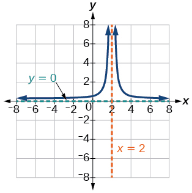 

The reciprocal squared function shifted down 2 units and right 1 unit.

For the following exercises, find the horizontal intercepts, the vertical intercept, the vertical asymptotes, and the horizontal or slant asymptote of the functions. Use that information to sketch a graph.

<math xmlns="http://www.w3.org/1998/Math/MathML"> <mrow> <mi>p</mi><mrow><mo>(</mo> <mi>x</mi> <mo>)</mo></mrow><mo>=</mo><mfrac> <mrow> <mn>2</mn><mi>x</mi><mo>−</mo><mn>3</mn> </mrow> <mrow> <mi>x</mi><mo>+</mo><mn>4</mn> </mrow> </mfrac> </mrow> </math>

<math xmlns="http://www.w3.org/1998/Math/MathML"> <mrow> <mi>V</mi><mo>.</mo><mi>A</mi><mo>.</mo><mtext> </mtext><mi>x</mi><mo>=</mo><mo>−</mo><mn>4</mn><mo>,</mo><mtext> </mtext><mi>H</mi><mo>.</mo><mi>A</mi><mo>.</mo><mtext> </mtext><mi>y</mi><mo>=</mo><mn>2</mn><mo>;</mo><mrow><mo>(</mo> <mrow> <mfrac> <mn>3</mn> <mn>2</mn> </mfrac> <mo>,</mo><mn>0</mn> </mrow> <mo>)</mo></mrow><mo>;</mo><mrow><mo>(</mo> <mrow> <mn>0</mn><mo>,</mo><mo>−</mo><mfrac> <mn>3</mn> <mn>4</mn> </mfrac> </mrow> <mo>)</mo></mrow> </mrow> </math>

 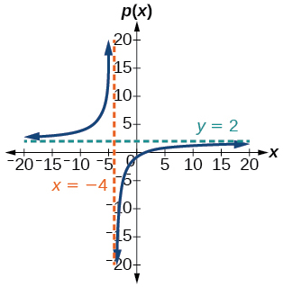 

<math xmlns="http://www.w3.org/1998/Math/MathML"> <mrow> <mi>q</mi><mrow><mo>(</mo> <mi>x</mi> <mo>)</mo></mrow><mo>=</mo><mfrac> <mrow> <mi>x</mi><mo>−</mo><mn>5</mn> </mrow> <mrow> <mn>3</mn><mi>x</mi><mo>−</mo><mn>1</mn> </mrow> </mfrac> </mrow> </math>

<math xmlns="http://www.w3.org/1998/Math/MathML"> <mrow> <mi>s</mi><mrow><mo>(</mo> <mi>x</mi> <mo>)</mo></mrow><mo>=</mo><mfrac> <mn>4</mn> <mrow> <msup> <mrow> <mrow><mo>(</mo> <mrow> <mi>x</mi><mo>−</mo><mn>2</mn> </mrow> <mo>)</mo></mrow> </mrow> <mn>2</mn> </msup> </mrow> </mfrac> </mrow> </math>

<math xmlns="http://www.w3.org/1998/Math/MathML"> <mrow> <mi>V</mi><mo>.</mo><mi>A</mi><mo>.</mo><mtext> </mtext><mi>x</mi><mo>=</mo><mn>2</mn><mo>,</mo><mtext> </mtext><mi>H</mi><mo>.</mo><mi>A</mi><mo>.</mo><mtext> </mtext><mi>y</mi><mo>=</mo><mn>0</mn><mo>,</mo><mtext> </mtext><mo stretchy="false">(</mo><mn>0</mn><mo>,</mo><mn>1</mn><mo stretchy="false">)</mo> </mrow> </math>

 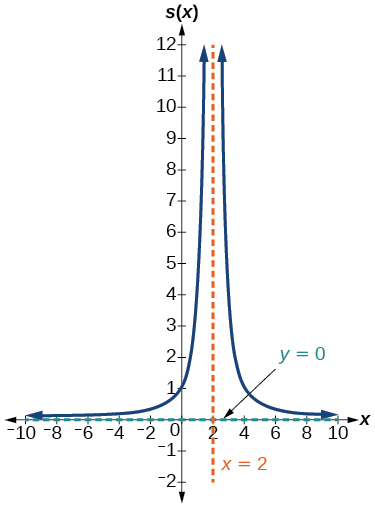 

<math xmlns="http://www.w3.org/1998/Math/MathML"> <mrow> <mi>r</mi><mrow><mo>(</mo> <mi>x</mi> <mo>)</mo></mrow><mo>=</mo><mfrac> <mn>5</mn> <mrow> <msup> <mrow> <mrow><mo>(</mo> <mrow> <mi>x</mi><mo>+</mo><mn>1</mn> </mrow> <mo>)</mo></mrow> </mrow> <mn>2</mn> </msup> </mrow> </mfrac> </mrow> </math>

<math xmlns="http://www.w3.org/1998/Math/MathML"> <mrow> <mi>f</mi><mrow><mo>(</mo> <mi>x</mi> <mo>)</mo></mrow><mo>=</mo><mfrac> <mrow> <mn>3</mn><msup> <mi>x</mi> <mn>2</mn> </msup> <mo>−</mo><mn>14</mn><mi>x</mi><mo>−</mo><mn>5</mn> </mrow> <mrow> <mn>3</mn><msup> <mi>x</mi> <mn>2</mn> </msup> <mo>+</mo><mn>8</mn><mi>x</mi><mo>−</mo><mn>16</mn> </mrow> </mfrac> </mrow> </math>

<math xmlns="http://www.w3.org/1998/Math/MathML"> <mrow> <mi>V</mi><mo>.</mo><mi>A</mi><mo>.</mo><mtext> </mtext><mi>x</mi><mo>=</mo><mo>−</mo><mn>4</mn><mo>,</mo><mtext> </mtext><mi>x</mi><mo>=</mo><mfrac> <mn>4</mn> <mn>3</mn> </mfrac> <mo>,</mo><mtext> </mtext><mi>H</mi><mo>.</mo><mi>A</mi><mo>.</mo><mtext> </mtext><mi>y</mi><mo>=</mo><mn>1</mn><mo>;</mo><mo stretchy="false">(</mo><mn>5</mn><mo>,</mo><mn>0</mn><mo stretchy="false">)</mo><mo>;</mo><mrow><mo>(</mo> <mrow> <mo>−</mo><mfrac> <mn>1</mn> <mn>3</mn> </mfrac> <mo>,</mo><mn>0</mn> </mrow> <mo>)</mo></mrow><mo>;</mo><mrow><mo>(</mo> <mrow> <mn>0</mn><mo>,</mo><mfrac> <mn>5</mn> <mrow> <mn>16</mn> </mrow> </mfrac> </mrow> <mo>)</mo></mrow> </mrow> </math>

 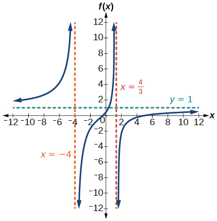 

<math xmlns="http://www.w3.org/1998/Math/MathML"> <mrow> <mi>g</mi><mrow><mo>(</mo> <mi>x</mi> <mo>)</mo></mrow><mo>=</mo><mfrac> <mrow> <mn>2</mn><msup> <mi>x</mi> <mn>2</mn> </msup> <mo>+</mo><mn>7</mn><mi>x</mi><mo>−</mo><mn>15</mn> </mrow> <mrow> <mn>3</mn><msup> <mi>x</mi> <mn>2</mn> </msup> <mo>−</mo><mn>14</mn><mo>+</mo><mn>15</mn> </mrow> </mfrac> </mrow> </math>

<math xmlns="http://www.w3.org/1998/Math/MathML"> <mrow> <mi>a</mi><mrow><mo>(</mo> <mi>x</mi> <mo>)</mo></mrow><mo>=</mo><mfrac> <mrow> <msup> <mi>x</mi> <mn>2</mn> </msup> <mo>+</mo><mn>2</mn><mi>x</mi><mo>−</mo><mn>3</mn> </mrow> <mrow> <msup> <mi>x</mi> <mn>2</mn> </msup> <mo>−</mo><mn>1</mn> </mrow> </mfrac> </mrow> </math>

<math xmlns="http://www.w3.org/1998/Math/MathML"> <mrow> <mi>V</mi><mo>.</mo><mi>A</mi><mo>.</mo><mtext> </mtext><mi>x</mi><mo>=</mo><mo>−</mo><mn>1</mn><mo>,</mo><mtext> </mtext><mi>H</mi><mo>.</mo><mi>A</mi><mo>.</mo><mtext> </mtext><mi>y</mi><mo>=</mo><mn>1</mn><mo>;</mo><mrow><mo>(</mo> <mrow> <mo>−</mo><mn>3</mn><mo>,</mo><mn>0</mn> </mrow> <mo>)</mo></mrow><mo>;</mo><mrow><mo>(</mo> <mrow> <mn>0</mn><mo>,</mo><mn>3</mn> </mrow> <mo>)</mo></mrow> </mrow> </math>

  

<math xmlns="http://www.w3.org/1998/Math/MathML"> <mrow> <mi>b</mi><mrow><mo>(</mo> <mi>x</mi> <mo>)</mo></mrow><mo>=</mo><mfrac> <mrow> <msup> <mi>x</mi> <mn>2</mn> </msup> <mo>−</mo><mi>x</mi><mo>−</mo><mn>6</mn> </mrow> <mrow> <msup> <mi>x</mi> <mn>2</mn> </msup> <mo>−</mo><mn>4</mn> </mrow> </mfrac> </mrow> </math>

<math xmlns="http://www.w3.org/1998/Math/MathML"> <mrow> <mi>h</mi><mrow><mo>(</mo> <mi>x</mi> <mo>)</mo></mrow><mo>=</mo><mfrac> <mrow> <mn>2</mn><msup> <mi>x</mi> <mn>2</mn> </msup> <mo>+</mo><mo> </mo><mi>x</mi><mo>−</mo><mn>1</mn> </mrow> <mrow> <mi>x</mi><mo>−</mo><mn>4</mn> </mrow> </mfrac> </mrow> </math>

<math xmlns="http://www.w3.org/1998/Math/MathML"> <mrow> <mi>V</mi><mo>.</mo><mi>A</mi><mo>.</mo><mtext> </mtext><mi>x</mi><mo>=</mo><mn>4</mn><mo>,</mo><mtext> </mtext><mi>S</mi><mo>.</mo><mi>A</mi><mo>.</mo><mtext> </mtext><mi>y</mi><mo>=</mo><mn>2</mn><mi>x</mi><mo>+</mo><mn>9</mn><mo>;</mo><mrow><mo>(</mo> <mrow> <mo>−</mo><mn>1</mn><mo>,</mo><mn>0</mn> </mrow> <mo>)</mo></mrow><mo>;</mo><mrow><mo>(</mo> <mrow> <mfrac> <mn>1</mn> <mn>2</mn> </mfrac> <mo>,</mo><mn>0</mn> </mrow> <mo>)</mo></mrow><mo>;</mo><mrow><mo>(</mo> <mrow> <mn>0</mn><mo>,</mo><mfrac> <mn>1</mn> <mn>4</mn> </mfrac> </mrow> <mo>)</mo></mrow> </mrow> </math>

 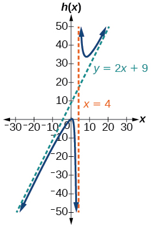 

<math xmlns="http://www.w3.org/1998/Math/MathML"> <mrow> <mi>k</mi><mrow><mo>(</mo> <mi>x</mi> <mo>)</mo></mrow><mo>=</mo><mfrac> <mrow> <mn>2</mn><msup> <mi>x</mi> <mn>2</mn> </msup> <mo>−</mo><mn>3</mn><mi>x</mi><mo>−</mo><mn>20</mn> </mrow> <mrow> <mi>x</mi><mo>−</mo><mn>5</mn> </mrow> </mfrac> </mrow> </math>

<math xmlns="http://www.w3.org/1998/Math/MathML"> <mrow> <mi>w</mi><mrow><mo>(</mo> <mi>x</mi> <mo>)</mo></mrow><mo>=</mo><mfrac> <mrow> <mrow><mo>(</mo> <mrow> <mi>x</mi><mo>−</mo><mn>1</mn> </mrow> <mo>)</mo></mrow><mrow><mo>(</mo> <mrow> <mi>x</mi><mo>+</mo><mn>3</mn> </mrow> <mo>)</mo></mrow><mrow><mo>(</mo> <mrow> <mi>x</mi><mo>−</mo><mn>5</mn> </mrow> <mo>)</mo></mrow> </mrow> <mrow> <msup> <mrow> <mrow><mo>(</mo> <mrow> <mi>x</mi><mo>+</mo><mn>2</mn> </mrow> <mo>)</mo></mrow> </mrow> <mn>2</mn> </msup> <mo stretchy="false">(</mo><mi>x</mi><mo>−</mo><mn>4</mn><mo stretchy="false">)</mo> </mrow> </mfrac> </mrow> </math>

<math xmlns="http://www.w3.org/1998/Math/MathML"> <mrow> <mi>V</mi><mo>.</mo><mi>A</mi><mo>.</mo><mtext> </mtext><mi>x</mi><mo>=</mo><mo>−</mo><mn>2</mn><mo>,</mo><mtext> </mtext><mi>x</mi><mo>=</mo><mn>4</mn><mo>,</mo><mtext> </mtext><mi>H</mi><mo>.</mo><mi>A</mi><mo>.</mo><mtext> </mtext><mi>y</mi><mo>=</mo><mn>1</mn><mo>,</mo><mrow><mo>(</mo> <mrow> <mn>1</mn><mo>,</mo><mn>0</mn> </mrow> <mo>)</mo></mrow><mo>;</mo><mrow><mo>(</mo> <mrow> <mn>5</mn><mo>,</mo><mn>0</mn> </mrow> <mo>)</mo></mrow><mo>;</mo><mrow><mo>(</mo> <mrow> <mo>−</mo><mn>3</mn><mo>,</mo><mn>0</mn> </mrow> <mo>)</mo></mrow><mo>;</mo><mrow><mo>(</mo> <mrow> <mn>0</mn><mo>,</mo><mo>−</mo><mfrac> <mrow> <mn>15</mn> </mrow> <mrow> <mn>16</mn> </mrow> </mfrac> </mrow> <mo>)</mo></mrow> </mrow> </math>

 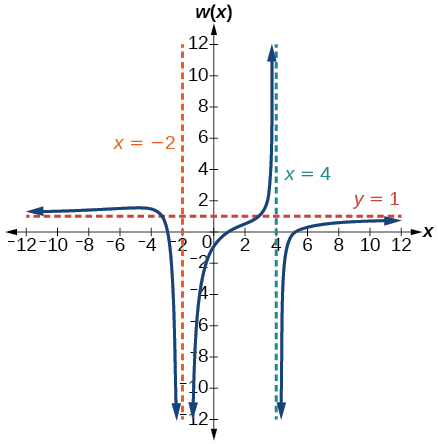 

<math xmlns="http://www.w3.org/1998/Math/MathML"> <mrow> <mi>z</mi><mrow><mo>(</mo> <mi>x</mi> <mo>)</mo></mrow><mo>=</mo><mfrac> <mrow> <msup> <mrow> <mrow><mo>(</mo> <mrow> <mi>x</mi><mo>+</mo><mn>2</mn> </mrow> <mo>)</mo></mrow> </mrow> <mn>2</mn> </msup> <mrow><mo>(</mo> <mrow> <mi>x</mi><mo>−</mo><mn>5</mn> </mrow> <mo>)</mo></mrow> </mrow> <mrow> <mrow><mo>(</mo> <mrow> <mi>x</mi><mo>−</mo><mn>3</mn> </mrow> <mo>)</mo></mrow><mrow><mo>(</mo> <mrow> <mi>x</mi><mo>+</mo><mn>1</mn> </mrow> <mo>)</mo></mrow><mrow><mo>(</mo> <mrow> <mi>x</mi><mo>+</mo><mn>4</mn> </mrow> <mo>)</mo></mrow> </mrow> </mfrac> </mrow> </math>

For the following exercises, write an equation for a rational function with the given characteristics.

Vertical asymptotes at<math xmlns="http://www.w3.org/1998/Math/MathML"> <mrow> <mtext> </mtext><mi>x</mi><mo>=</mo><mn>5</mn><mtext> </mtext> </mrow> </math>

and<math xmlns="http://www.w3.org/1998/Math/MathML"> <mrow> <mtext> </mtext><mi>x</mi><mo>=</mo><mn>−5</mn><mo>,</mo><mtext> </mtext> </mrow> </math>

*x*-intercepts at<math xmlns="http://www.w3.org/1998/Math/MathML"> <mrow> <mtext> </mtext><mo stretchy="false">(</mo><mn>2</mn><mo>,</mo><mn>0</mn><mo stretchy="false">)</mo><mtext> </mtext> </mrow> </math>

and<math xmlns="http://www.w3.org/1998/Math/MathML"> <mrow> <mtext> </mtext><mo stretchy="false">(</mo><mn>−1</mn><mo>,</mo><mn>0</mn><mo stretchy="false">)</mo><mo>,</mo><mtext> </mtext> </mrow> </math>

*y*-intercept at<math xmlns="http://www.w3.org/1998/Math/MathML"> <mrow> <mtext> </mtext><mrow><mo>(</mo> <mrow> <mn>0</mn><mo>,</mo><mn>4</mn> </mrow> <mo>)</mo></mrow> </mrow> </math>

<math xmlns="http://www.w3.org/1998/Math/MathML"> <mrow> <mi>y</mi><mo>=</mo><mn>50</mn><mfrac> <mrow> <msup> <mi>x</mi> <mn>2</mn> </msup> <mo>−</mo><mi>x</mi><mo>−</mo><mn>2</mn> </mrow> <mrow> <msup> <mi>x</mi> <mn>2</mn> </msup> <mo>−</mo><mn>25</mn> </mrow> </mfrac> </mrow> </math>

Vertical asymptotes at<math xmlns="http://www.w3.org/1998/Math/MathML"> <mrow> <mtext> </mtext><mi>x</mi><mo>=</mo><mn>−4</mn><mtext> </mtext> </mrow> </math>

and<math xmlns="http://www.w3.org/1998/Math/MathML"> <mrow> <mtext> </mtext><mi>x</mi><mo>=</mo><mn>−1</mn><mo>,</mo><mtext> </mtext> </mrow> </math>

*x-*intercepts at<math xmlns="http://www.w3.org/1998/Math/MathML"> <mrow> <mtext> </mtext><mrow><mo>(</mo> <mrow> <mn>1</mn><mo>,</mo><mn>0</mn> </mrow> <mo>)</mo></mrow><mtext> </mtext> </mrow> </math>

and<math xmlns="http://www.w3.org/1998/Math/MathML"> <mrow> <mtext> </mtext><mrow><mo>(</mo> <mrow> <mn>5</mn><mo>,</mo><mn>0</mn> </mrow> <mo>)</mo></mrow><mo>,</mo><mtext> </mtext> </mrow> </math>

*y-*intercept at<math xmlns="http://www.w3.org/1998/Math/MathML"> <mrow> <mtext> </mtext><mo stretchy="false">(</mo><mn>0</mn><mo>,</mo><mn>7</mn><mo stretchy="false">)</mo> </mrow> </math>

Vertical asymptotes at<math xmlns="http://www.w3.org/1998/Math/MathML"> <mrow> <mtext> </mtext><mi>x</mi><mo>=</mo><mn>−4</mn><mtext> </mtext> </mrow> </math>

and<math xmlns="http://www.w3.org/1998/Math/MathML"> <mrow> <mtext> </mtext><mi>x</mi><mo>=</mo><mn>−5</mn><mo>,</mo><mtext> </mtext> </mrow> </math>

*x*-intercepts at<math xmlns="http://www.w3.org/1998/Math/MathML"> <mrow> <mtext> </mtext><mrow><mo>(</mo> <mrow> <mn>4</mn><mo>,</mo><mn>0</mn> </mrow> <mo>)</mo></mrow><mtext> </mtext> </mrow> </math>

and<math xmlns="http://www.w3.org/1998/Math/MathML"> <mrow> <mtext> </mtext><mrow><mo>(</mo> <mrow> <mn>−6</mn><mo>,</mo><mn>0</mn> </mrow> <mo>)</mo></mrow><mo>,</mo><mtext> </mtext> </mrow> </math>

Horizontal asymptote at<math xmlns="http://www.w3.org/1998/Math/MathML"> <mrow> <mtext> </mtext><mi>y</mi><mo>=</mo><mn>7</mn> </mrow> </math>

<math xmlns="http://www.w3.org/1998/Math/MathML"> <mrow> <mi>y</mi><mo>=</mo><mn>7</mn><mfrac> <mrow> <msup> <mi>x</mi> <mn>2</mn> </msup> <mo>+</mo><mn>2</mn><mi>x</mi><mo>−</mo><mn>24</mn> </mrow> <mrow> <msup> <mi>x</mi> <mn>2</mn> </msup> <mo>+</mo><mn>9</mn><mi>x</mi><mo>+</mo><mn>20</mn> </mrow> </mfrac> </mrow> </math>

Vertical asymptotes at<math xmlns="http://www.w3.org/1998/Math/MathML"> <mrow> <mtext> </mtext><mi>x</mi><mo>=</mo><mn>−3</mn><mtext> </mtext> </mrow> </math>

and<math xmlns="http://www.w3.org/1998/Math/MathML"> <mrow> <mtext> </mtext><mi>x</mi><mo>=</mo><mn>6</mn><mo>,</mo><mtext> </mtext> </mrow> </math>

*x*-intercepts at<math xmlns="http://www.w3.org/1998/Math/MathML"> <mrow> <mtext> </mtext><mrow><mo>(</mo> <mrow> <mn>−2</mn><mo>,</mo><mn>0</mn> </mrow> <mo>)</mo></mrow><mtext> </mtext> </mrow> </math>

and<math xmlns="http://www.w3.org/1998/Math/MathML"> <mrow> <mtext> </mtext><mrow><mo>(</mo> <mrow> <mn>1</mn><mo>,</mo><mn>0</mn> </mrow> <mo>)</mo></mrow><mo>,</mo><mtext> </mtext> </mrow> </math>

Horizontal asymptote at<math xmlns="http://www.w3.org/1998/Math/MathML"> <mrow> <mtext> </mtext><mi>y</mi><mo>=</mo><mn>−2</mn> </mrow> </math>

Vertical asymptote at<math xmlns="http://www.w3.org/1998/Math/MathML"> <mrow> <mtext> </mtext><mi>x</mi><mo>=</mo><mn>−1</mn><mo>,</mo><mtext> </mtext> </mrow> </math>

Double zero at<math xmlns="http://www.w3.org/1998/Math/MathML"> <mrow> <mtext> </mtext><mi>x</mi><mo>=</mo><mn>2</mn><mo>,</mo><mtext> </mtext> </mrow> </math>

*y*-intercept at<math xmlns="http://www.w3.org/1998/Math/MathML"> <mrow> <mtext> </mtext><mo stretchy="false">(</mo><mn>0</mn><mo>,</mo><mn>2</mn><mo stretchy="false">)</mo> </mrow> </math>

<math xmlns="http://www.w3.org/1998/Math/MathML"> <mrow> <mi>y</mi><mo>=</mo><mfrac> <mn>1</mn> <mn>2</mn> </mfrac> <mfrac> <mrow> <msup> <mi>x</mi> <mn>2</mn> </msup> <mo>−</mo><mn>4</mn><mi>x</mi><mo>+</mo><mn>4</mn> </mrow> <mrow> <mi>x</mi><mo>+</mo><mn>1</mn> </mrow> </mfrac> </mrow> </math>

Vertical asymptote at<math xmlns="http://www.w3.org/1998/Math/MathML"> <mrow> <mtext> </mtext><mi>x</mi><mo>=</mo><mn>3</mn><mo>,</mo><mtext> </mtext> </mrow> </math>

Double zero at<math xmlns="http://www.w3.org/1998/Math/MathML"> <mrow> <mtext> </mtext><mi>x</mi><mo>=</mo><mn>1</mn><mo>,</mo><mtext> </mtext> </mrow> </math>

*y*-intercept at<math xmlns="http://www.w3.org/1998/Math/MathML"> <mrow> <mtext> </mtext><mo stretchy="false">(</mo><mn>0</mn><mo>,</mo><mn>4</mn><mo stretchy="false">)</mo> </mrow> </math>

For the following exercises, use the graphs to write an equation for the function.

 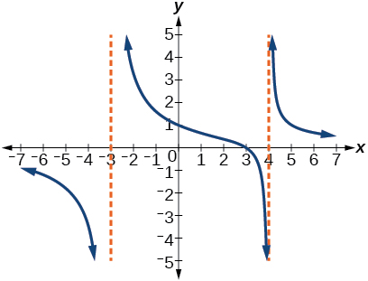 

<math xmlns="http://www.w3.org/1998/Math/MathML"> <mrow> <mi>y</mi><mo>=</mo><mn>4</mn><mfrac> <mrow> <mi>x</mi><mo>−</mo><mn>3</mn> </mrow> <mrow> <msup> <mi>x</mi> <mn>2</mn> </msup> <mo>−</mo><mi>x</mi><mo>−</mo><mn>12</mn> </mrow> </mfrac> </mrow> </math>

 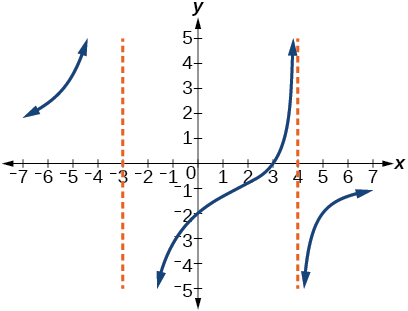 

 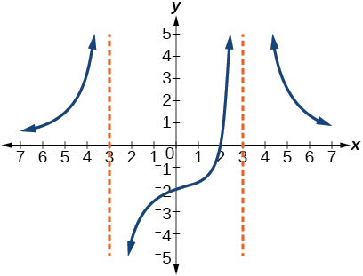 

<math xmlns="http://www.w3.org/1998/Math/MathML"> <mrow> <mi>y</mi><mo>=</mo><mo>−</mo><mn>9</mn><mfrac> <mrow> <mi>x</mi><mo>−</mo><mn>2</mn> </mrow> <mrow> <msup> <mi>x</mi> <mn>2</mn> </msup> <mo>−</mo><mn>9</mn> </mrow> </mfrac> </mrow> </math>

 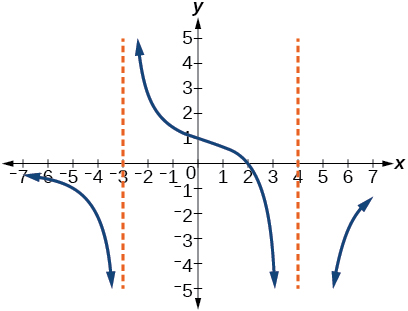 

 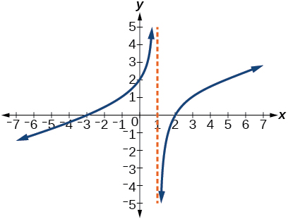 

<math xmlns="http://www.w3.org/1998/Math/MathML"> <mrow> <mi>y</mi><mo>=</mo><mfrac> <mn>1</mn> <mn>3</mn> </mfrac> <mfrac> <mrow> <msup> <mi>x</mi> <mn>2</mn> </msup> <mo>+</mo><mi>x</mi><mo>−</mo><mn>6</mn> </mrow> <mrow> <mi>x</mi><mo>−</mo><mn>1</mn> </mrow> </mfrac> </mrow> </math>

 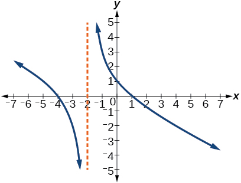 

 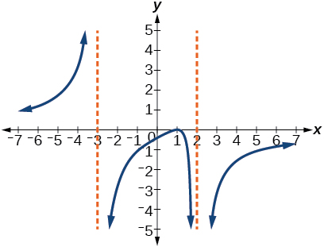 

<math xmlns="http://www.w3.org/1998/Math/MathML"> <mrow> <mi>y</mi><mo>=</mo><mo>−</mo><mn>6</mn><mfrac> <mrow> <msup> <mrow> <mo stretchy="false">(</mo><mi>x</mi><mo>−</mo><mn>1</mn><mo stretchy="false">)</mo> </mrow> <mn>2</mn> </msup> </mrow> <mrow> <mo stretchy="false">(</mo><mi>x</mi><mo>+</mo><mn>3</mn><mo stretchy="false">)</mo><msup> <mrow> <mo stretchy="false">(</mo><mi>x</mi><mo>−</mo><mn>2</mn><mo stretchy="false">)</mo> </mrow> <mn>2</mn> </msup> </mrow> </mfrac> </mrow> </math>

 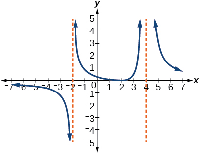 

## Numeric

For the following exercises, make tables to show the behavior of the function near the vertical asymptote and reflecting the horizontal asymptote

<math xmlns="http://www.w3.org/1998/Math/MathML"> <mrow> <mi>f</mi><mo stretchy="false">(</mo><mi>x</mi><mo stretchy="false">)</mo><mo>=</mo><mfrac> <mn>1</mn> <mrow> <mi>x</mi><mo>−</mo><mn>2</mn> </mrow> </mfrac> </mrow> </math>

<table class="unnumbered" summary=".." data-label=""><caption></caption><tbody>
<tr>
<td><math xmlns="http://www.w3.org/1998/Math/MathML">
 <mi>x</mi>
</math></td>
<td>2.01</td>
<td>2.001</td>
<td>2.0001</td>
<td>1.99</td>
<td>1.999</td>
</tr>
<tr>
<td><math xmlns="http://www.w3.org/1998/Math/MathML">
 <mi>y</mi>
</math></td>
<td>100</td>
<td>1,000</td>
<td>10,000</td>
<td>–100</td>
<td>–1,000</td>
</tr>
</tbody></table>
<table id="eip-id1165135481187" class="unnumbered" summary=".." data-label=""><caption></caption><thead>
<tr>
<th><math xmlns="http://www.w3.org/1998/Math/MathML">
 <mi>x</mi>
</math></th>
<th>10 </th>
<th>100</th>
<th>1,000</th>
<th>10,000</th>
<th>100,000</th>
</tr>
</thead><tbody>
<tr>
<td><math xmlns="http://www.w3.org/1998/Math/MathML">
 <mi>y</mi>
</math></td>
<td>.125</td>
<td>.0102</td>
<td>.001</td>
<td>.0001</td>
<td>.00001</td>
</tr>
</tbody></table>
Vertical asymptote<math xmlns="http://www.w3.org/1998/Math/MathML"> <mrow> <mtext> </mtext><mi>x</mi><mo>=</mo><mn>2</mn><mo>,</mo><mtext> </mtext> </mrow> </math>

Horizontal asymptote<math xmlns="http://www.w3.org/1998/Math/MathML"> <mrow> <mtext> </mtext><mi>y</mi><mo>=</mo><mn>0</mn> </mrow> </math>

<math xmlns="http://www.w3.org/1998/Math/MathML"> <mrow> <mi>f</mi><mo stretchy="false">(</mo><mi>x</mi><mo stretchy="false">)</mo><mo>=</mo><mfrac> <mi>x</mi> <mrow> <mi>x</mi><mo>−</mo><mn>3</mn> </mrow> </mfrac> </mrow> </math>

<math xmlns="http://www.w3.org/1998/Math/MathML"> <mrow> <mi>f</mi><mo stretchy="false">(</mo><mi>x</mi><mo stretchy="false">)</mo><mo>=</mo><mfrac> <mrow> <mn>2</mn><mi>x</mi> </mrow> <mrow> <mi>x</mi><mo>+</mo><mn>4</mn> </mrow> </mfrac> </mrow> </math>

<table class="unnumbered" summary=".." data-label=""><caption></caption><tbody>
<tr>
<td><math xmlns="http://www.w3.org/1998/Math/MathML">
 <mi>x</mi>
</math></td>
<td>–4.1</td>
<td>–4.01</td>
<td>–4.001</td>
<td>–3.99</td>
<td>–3.999</td>
</tr>
<tr>
<td><math xmlns="http://www.w3.org/1998/Math/MathML">
 <mi>y</mi>
</math></td>
<td>82</td>
<td>802</td>
<td>8,002</td>
<td>–798</td>
<td>–7998</td>
</tr>
</tbody></table>
<table class="unnumbered" summary=".." data-label=""><caption></caption><tbody>
<tr>
<td><math xmlns="http://www.w3.org/1998/Math/MathML">
 <mi>x</mi>
</math></td>
<td>10</td>
<td>100</td>
<td>1,000</td>
<td>10,000</td>
<td>100,000</td>
</tr>
<tr>
<td><math xmlns="http://www.w3.org/1998/Math/MathML">
 <mi>y</mi>
</math></td>
<td>1.4286</td>
<td>1.9331</td>
<td>1.992</td>
<td>1.9992</td>
<td>1.999992</td>
</tr>
</tbody></table>
Vertical asymptote<math xmlns="http://www.w3.org/1998/Math/MathML"> <mrow> <mtext> </mtext><mi>x</mi><mo>=</mo><mo>−</mo><mn>4</mn><mo>,</mo><mtext> </mtext> </mrow> </math>

Horizontal asymptote<math xmlns="http://www.w3.org/1998/Math/MathML"> <mrow> <mtext> </mtext><mi>y</mi><mo>=</mo><mn>2</mn> </mrow> </math>

<math xmlns="http://www.w3.org/1998/Math/MathML"> <mrow> <mi>f</mi><mo stretchy="false">(</mo><mi>x</mi><mo stretchy="false">)</mo><mo>=</mo><mfrac> <mrow> <mn>2</mn><mi>x</mi> </mrow> <mrow> <msup> <mrow> <mo stretchy="false">(</mo><mi>x</mi><mo>−</mo><mn>3</mn><mo stretchy="false">)</mo> </mrow> <mn>2</mn> </msup> </mrow> </mfrac> </mrow> </math>

<math xmlns="http://www.w3.org/1998/Math/MathML"> <mrow> <mi>f</mi><mo stretchy="false">(</mo><mi>x</mi><mo stretchy="false">)</mo><mo>=</mo><mfrac> <mrow> <msup> <mi>x</mi> <mn>2</mn> </msup> </mrow> <mrow> <msup> <mi>x</mi> <mn>2</mn> </msup> <mo>+</mo><mn>2</mn><mi>x</mi><mo>+</mo><mn>1</mn> </mrow> </mfrac> </mrow> </math>

<table class="unnumbered" summary=".." data-label=""><caption></caption><tbody>
<tr>
<td><math xmlns="http://www.w3.org/1998/Math/MathML">
 <mi>x</mi>
</math></td>
<td>–.9</td>
<td>–.99</td>
<td>–.999</td>
<td>–1.1</td>
<td>–1.01</td>
</tr>
<tr>
<td><math xmlns="http://www.w3.org/1998/Math/MathML">
 <mi>y</mi>
</math></td>
<td>81</td>
<td>9,801</td>
<td>998,001</td>
<td>121</td>
<td>10,201</td>
</tr>
</tbody></table>
<table class="unnumbered" summary=".." data-label=""><caption></caption><tbody>
<tr>
<td><math xmlns="http://www.w3.org/1998/Math/MathML">
 <mi>x</mi>
</math></td>
<td>10</td>
<td>100</td>
<td>1,000</td>
<td>10,000</td>
<td>100,000</td>
</tr>
<tr>
<td><math xmlns="http://www.w3.org/1998/Math/MathML">
 <mi>y</mi>
</math></td>
<td>.82645</td>
<td>.9803</td>
<td>.998</td>
<td>.9998</td>
<td />
</tr>
</tbody></table>
Vertical asymptote<math xmlns="http://www.w3.org/1998/Math/MathML"> <mrow> <mtext> </mtext><mi>x</mi><mo>=</mo><mo>−</mo><mn>1</mn><mo>,</mo><mtext> </mtext> </mrow> </math>

Horizontal asymptote<math xmlns="http://www.w3.org/1998/Math/MathML"> <mrow> <mtext> </mtext><mi>y</mi><mo>=</mo><mn>1</mn> </mrow> </math>

## Technology

For the following exercises, use a calculator to graph<math xmlns="http://www.w3.org/1998/Math/MathML"> <mrow> <mtext> </mtext><mi>f</mi><mrow><mo>(</mo> <mi>x</mi> <mo>)</mo></mrow><mo>.</mo><mtext> </mtext> </mrow> </math>

Use the graph to solve<math xmlns="http://www.w3.org/1998/Math/MathML"> <mrow> <mtext> </mtext><mi>f</mi><mrow><mo>(</mo> <mi>x</mi> <mo>)</mo></mrow><mo>&gt;</mo><mn>0.</mn> </mrow> </math>

<math xmlns="http://www.w3.org/1998/Math/MathML"> <mrow> <mi>f</mi><mo stretchy="false">(</mo><mi>x</mi><mo stretchy="false">)</mo><mo>=</mo><mfrac> <mn>2</mn> <mrow> <mi>x</mi><mo>+</mo><mn>1</mn> </mrow> </mfrac> </mrow> </math>

<math xmlns="http://www.w3.org/1998/Math/MathML"> <mrow> <mi>f</mi><mo stretchy="false">(</mo><mi>x</mi><mo stretchy="false">)</mo><mo>=</mo><mfrac> <mn>4</mn> <mrow> <mn>2</mn><mi>x</mi><mo>−</mo><mn>3</mn> </mrow> </mfrac> </mrow> </math>

<math xmlns="http://www.w3.org/1998/Math/MathML"> <mrow> <mrow><mo>(</mo> <mrow> <mfrac> <mn>3</mn> <mn>2</mn> </mfrac> <mo>,</mo><mi>∞</mi> </mrow> <mo>)</mo></mrow> </mrow> </math>

 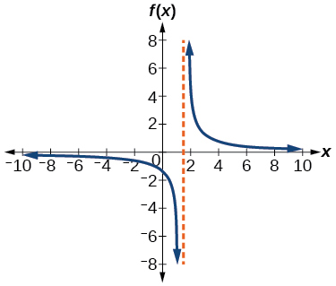 

<math xmlns="http://www.w3.org/1998/Math/MathML"> <mrow> <mi>f</mi><mo stretchy="false">(</mo><mi>x</mi><mo stretchy="false">)</mo><mo>=</mo><mfrac> <mn>2</mn> <mrow> <mrow><mo>(</mo> <mrow> <mi>x</mi><mo>−</mo><mn>1</mn> </mrow> <mo>)</mo></mrow><mrow><mo>(</mo> <mrow> <mi>x</mi><mo>+</mo><mn>2</mn> </mrow> <mo>)</mo></mrow> </mrow> </mfrac> </mrow> </math>

<math xmlns="http://www.w3.org/1998/Math/MathML"> <mrow> <mi>f</mi><mo stretchy="false">(</mo><mi>x</mi><mo stretchy="false">)</mo><mo>=</mo><mfrac> <mrow> <mi>x</mi><mo>+</mo><mn>2</mn> </mrow> <mrow> <mrow><mo>(</mo> <mrow> <mi>x</mi><mo>−</mo><mn>1</mn> </mrow> <mo>)</mo></mrow><mrow><mo>(</mo> <mrow> <mi>x</mi><mo>−</mo><mn>4</mn> </mrow> <mo>)</mo></mrow> </mrow> </mfrac> </mrow> </math>

<math xmlns="http://www.w3.org/1998/Math/MathML"> <mrow> <mo stretchy="false">(</mo><mo>−</mo><mn>2</mn><mo>,</mo><mn>1</mn><mo stretchy="false">)</mo><mo>∪</mo><mo stretchy="false">(</mo><mn>4</mn><mo>,</mo><mi>∞</mi><mo stretchy="false">)</mo> </mrow> </math>

 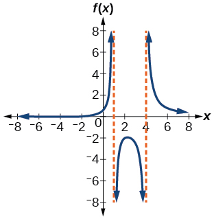 

<math xmlns="http://www.w3.org/1998/Math/MathML"> <mrow> <mi>f</mi><mo stretchy="false">(</mo><mi>x</mi><mo stretchy="false">)</mo><mo>=</mo><mfrac> <mrow> <msup> <mrow> <mo stretchy="false">(</mo><mi>x</mi><mo>+</mo><mn>3</mn><mo stretchy="false">)</mo> </mrow> <mn>2</mn> </msup> </mrow> <mrow> <msup> <mrow> <mrow><mo>(</mo> <mrow> <mi>x</mi><mo>−</mo><mn>1</mn> </mrow> <mo>)</mo></mrow> </mrow> <mn>2</mn> </msup> <mrow><mo>(</mo> <mrow> <mi>x</mi><mo>+</mo><mn>1</mn> </mrow> <mo>)</mo></mrow> </mrow> </mfrac> </mrow> </math>

## Extensions

For the following exercises, identify the removable discontinuity.

<math xmlns="http://www.w3.org/1998/Math/MathML"> <mrow> <mi>f</mi><mo stretchy="false">(</mo><mi>x</mi><mo stretchy="false">)</mo><mo>=</mo><mfrac> <mrow> <msup> <mi>x</mi> <mn>2</mn> </msup> <mo>−</mo><mn>4</mn> </mrow> <mrow> <mi>x</mi><mo>−</mo><mn>2</mn> </mrow> </mfrac> </mrow> </math>

<math xmlns="http://www.w3.org/1998/Math/MathML"> <mrow> <mrow><mo>(</mo> <mrow> <mn>2</mn><mo>,</mo><mn>4</mn> </mrow> <mo>)</mo></mrow> </mrow> </math>

<math xmlns="http://www.w3.org/1998/Math/MathML"> <mrow> <mi>f</mi><mo stretchy="false">(</mo><mi>x</mi><mo stretchy="false">)</mo><mo>=</mo><mfrac> <mrow> <msup> <mi>x</mi> <mn>3</mn> </msup> <mo>+</mo><mn>1</mn> </mrow> <mrow> <mi>x</mi><mo>+</mo><mn>1</mn> </mrow> </mfrac> </mrow> </math>

<math xmlns="http://www.w3.org/1998/Math/MathML"> <mrow> <mi>f</mi><mo stretchy="false">(</mo><mi>x</mi><mo stretchy="false">)</mo><mo>=</mo><mfrac> <mrow> <msup> <mi>x</mi> <mn>2</mn> </msup> <mo>+</mo><mi>x</mi><mo>−</mo><mn>6</mn> </mrow> <mrow> <mi>x</mi><mo>−</mo><mn>2</mn> </mrow> </mfrac> </mrow> </math>

<math xmlns="http://www.w3.org/1998/Math/MathML"> <mrow> <mrow><mo>(</mo> <mrow> <mn>2</mn><mo>,</mo><mn>5</mn> </mrow> <mo>)</mo></mrow> </mrow> </math>

<math xmlns="http://www.w3.org/1998/Math/MathML"> <mrow> <mi>f</mi><mo stretchy="false">(</mo><mi>x</mi><mo stretchy="false">)</mo><mo>=</mo><mfrac> <mrow> <mn>2</mn><msup> <mi>x</mi> <mn>2</mn> </msup> <mo>+</mo><mn>5</mn><mi>x</mi><mo>−</mo><mn>3</mn> </mrow> <mrow> <mi>x</mi><mo>+</mo><mn>3</mn> </mrow> </mfrac> </mrow> </math>

<math xmlns="http://www.w3.org/1998/Math/MathML"> <mrow> <mi>f</mi><mo stretchy="false">(</mo><mi>x</mi><mo stretchy="false">)</mo><mo>=</mo><mfrac> <mrow> <msup> <mi>x</mi> <mn>3</mn> </msup> <mo>+</mo><msup> <mi>x</mi> <mn>2</mn> </msup> </mrow> <mrow> <mi>x</mi><mo>+</mo><mn>1</mn> </mrow> </mfrac> </mrow> </math>

<math xmlns="http://www.w3.org/1998/Math/MathML"> <mrow> <mrow><mo>(</mo> <mrow> <mo>–</mo><mn>1</mn><mo>,</mo><mtext>1</mtext> </mrow> <mo>)</mo></mrow> </mrow> </math>

## Real-World Applications

For the following exercises, express a rational function that describes the situation.

A large mixing tank currently contains 200 gallons of water, into which 10 pounds of sugar have been mixed. A tap will open, pouring 10 gallons of water per minute into the tank at the same time sugar is poured into the tank at a rate of 3 pounds per minute. Find the concentration (pounds per gallon) of sugar in the tank after<math xmlns="http://www.w3.org/1998/Math/MathML"> <mrow> <mtext> </mtext><mi>t</mi><mtext> </mtext> </mrow> </math>

minutes.

A large mixing tank currently contains 300 gallons of water, into which 8 pounds of sugar have been mixed. A tap will open, pouring 20 gallons of water per minute into the tank at the same time sugar is poured into the tank at a rate of 2 pounds per minute. Find the concentration (pounds per gallon) of sugar in the tank after<math xmlns="http://www.w3.org/1998/Math/MathML"> <mrow> <mtext> </mtext><mi>t</mi><mtext> </mtext> </mrow> </math>

minutes.

<math xmlns="http://www.w3.org/1998/Math/MathML"> <mrow> <mi>C</mi><mo stretchy="false">(</mo><mi>t</mi><mo stretchy="false">)</mo><mo>=</mo><mfrac> <mrow> <mn>8</mn><mo>+</mo><mn>2</mn><mi>t</mi> </mrow> <mrow> <mn>300</mn><mo>+</mo><mn>20</mn><mi>t</mi> </mrow> </mfrac> </mrow> </math>

For the following exercises, use the given rational function to answer the question.

The concentration<math xmlns="http://www.w3.org/1998/Math/MathML"> <mrow> <mtext> </mtext><mi>C</mi><mtext> </mtext> </mrow> </math>

of a drug in a patient’s bloodstream<math xmlns="http://www.w3.org/1998/Math/MathML"> <mrow> <mtext> </mtext><mi>t</mi><mtext> </mtext> </mrow> </math>

hours after injection in given by<math xmlns="http://www.w3.org/1998/Math/MathML"> <mrow> <mtext> </mtext><mi>C</mi><mo stretchy="false">(</mo><mi>t</mi><mo stretchy="false">)</mo><mo>=</mo><mfrac> <mrow> <mn>2</mn><mi>t</mi> </mrow> <mrow> <mn>3</mn><mo>+</mo><msup> <mi>t</mi> <mn>2</mn> </msup> </mrow> </mfrac> <mo>.</mo><mtext> </mtext> </mrow> </math>

What happens to the concentration of the drug as<math xmlns="http://www.w3.org/1998/Math/MathML"> <mrow> <mtext> </mtext><mi>t</mi><mtext> </mtext> </mrow> </math>

increases?

The concentration<math xmlns="http://www.w3.org/1998/Math/MathML"> <mrow> <mtext> </mtext><mi>C</mi><mtext> </mtext> </mrow> </math>

of a drug in a patient’s bloodstream<math xmlns="http://www.w3.org/1998/Math/MathML"> <mrow> <mtext> </mtext><mi>t</mi><mtext> </mtext> </mrow> </math>
hours after injection is given by<math xmlns="http://www.w3.org/1998/Math/MathML"> <mrow> <mtext> </mtext><mi>C</mi><mo stretchy="false">(</mo><mi>t</mi><mo stretchy="false">)</mo><mo>=</mo><mfrac> <mrow> <mn>100</mn><mi>t</mi> </mrow> <mrow> <mn>2</mn><msup> <mi>t</mi> <mn>2</mn> </msup> <mo>+</mo><mn>75</mn> </mrow> </mfrac> <mo>.</mo><mtext> </mtext> </mrow> </math>

Use a calculator to approximate the time when the concentration is highest.

After about 6.12 hours.

For the following exercises, construct a rational function that will help solve the problem. Then, use a calculator to answer the question.

An open box with a square base is to have a volume of 108 cubic inches. Find the dimensions of the box that will have minimum surface area. Let<math xmlns="http://www.w3.org/1998/Math/MathML"> <mrow> <mtext> </mtext><mi>x</mi><mtext> </mtext> </mrow> </math>

= length of the side of the base.

A rectangular box with a square base is to have a volume of 20 cubic feet. The material for the base costs 30 cents/ square foot. The material for the sides costs 10 cents/square foot. The material for the top costs 20 cents/square foot. Determine the dimensions that will yield minimum cost. Let<math xmlns="http://www.w3.org/1998/Math/MathML"> <mrow> <mtext> </mtext><mi>x</mi><mtext> </mtext> </mrow> </math>

= length of the side of the base.

<math xmlns="http://www.w3.org/1998/Math/MathML"> <mrow> <mi>A</mi><mo stretchy="false">(</mo><mi>x</mi><mo stretchy="false">)</mo><mo>=</mo><mn>50</mn><msup> <mi>x</mi> <mn>2</mn> </msup> <mo>+</mo><mfrac> <mrow> <mn>800</mn> </mrow> <mi>x</mi> </mfrac> <mo>.</mo><mtext> </mtext> </mrow> </math>

2 by 2 by 5 feet.

A right circular cylinder has volume of 100 cubic inches. Find the radius and height that will yield minimum surface area. Let<math xmlns="http://www.w3.org/1998/Math/MathML"> <mrow> <mtext> </mtext><mi>x</mi><mtext> </mtext> </mrow> </math>

= radius.

A right circular cylinder with no top has a volume of 50 cubic meters. Find the radius that will yield minimum surface area. Let<math xmlns="http://www.w3.org/1998/Math/MathML"> <mrow> <mtext> </mtext><mi>x</mi><mtext> </mtext> </mrow> </math>

= radius.

<math xmlns="http://www.w3.org/1998/Math/MathML"> <mrow> <mi>A</mi><mo stretchy="false">(</mo><mi>x</mi><mo stretchy="false">)</mo><mo>=</mo><mi>π</mi><msup> <mi>x</mi> <mn>2</mn> </msup> <mo>+</mo><mfrac> <mrow> <mn>100</mn> </mrow> <mi>x</mi> </mfrac> <mo>.</mo><mtext> </mtext> </mrow> </math>

Radius = 2.52 meters.

A right circular cylinder is to have a volume of 40 cubic inches. It costs 4 cents/square inch to construct the top and bottom and 1 cent/square inch to construct the rest of the cylinder. Find the radius to yield minimum cost. Let<math xmlns="http://www.w3.org/1998/Math/MathML"> <mrow> <mtext> </mtext><mi>x</mi><mtext> </mtext> </mrow> </math>

= radius.

## Glossary
{: data-type="glossary-title"}

arrow notation
: a way to represent symbolically the local and end behavior of a function by using arrows to indicate that an input or output approaches a value
{: .definition}

horizontal asymptote
: a horizontal line
  <math xmlns="http://www.w3.org/1998/Math/MathML"> <mrow> <mtext> </mtext><mi>y</mi><mo>=</mo><mi>b</mi><mtext> </mtext> </mrow> </math>
  
  where the graph approaches the line as the inputs increase or decrease without bound.
{: .definition}

rational function
: a function that can be written as the ratio of two polynomials
{: .definition}

removable discontinuity
: a single point at which a function is undefined that, if filled in, would make the function continuous; it appears as a hole on the graph of a function
{: .definition}

vertical asymptote
: a vertical line
  <math xmlns="http://www.w3.org/1998/Math/MathML"> <mrow> <mtext> </mtext><mi>x</mi><mo>=</mo><mi>a</mi><mtext> </mtext> </mrow> </math>
  
  where the graph tends toward positive or negative infinity as the inputs approach
  <math xmlns="http://www.w3.org/1998/Math/MathML"> <mrow> <mtext> </mtext><mi>a</mi> </mrow> </math>
{: .definition}

[1]: http://openstaxcollege.org/l/graphrational
[2]: http://openstaxcollege.org/l/equatrational
[3]: http://openstaxcollege.org/l/asymptote
[4]: http://openstaxcollege.org/l/interasymptote
