

In this section, you will:
* Find the inverse of an invertible polynomial function.
* Restrict the domain to find the inverse of a polynomial function.

A mound of gravel is in the shape of a cone with the height equal to twice the radius.

 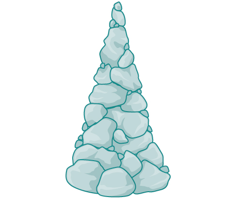{: #Figure_03_08_001}

The volume is found using a formula from elementary geometry.

<math xmlns="http://www.w3.org/1998/Math/MathML" display="block"> <mrow> <mtable> <mtr rowalign="center"> <mtd> <mi>V</mi> </mtd> <mtd columnalign="right" rowalign="center"> <mo>=</mo> </mtd> <mtd columnalign="left" rowalign="center"> <mrow> <mfrac> <mn>1</mn> <mn>3</mn> </mfrac> <mi>π</mi><msup> <mi>r</mi> <mn>2</mn> </msup> <mi>h</mi></mrow> </mtd> </mtr> <mtr rowalign="center"> <mtd rowalign="center" /> <mtd rowalign="center"><mo>=</mo></mtd> <mtd columnalign="left" rowalign="center"> <mrow> <mfrac> <mn>1</mn> <mn>3</mn> </mfrac> <mi>π</mi><msup> <mi>r</mi> <mn>2</mn> </msup> <mo stretchy="false">(</mo><mn>2</mn><mi>r</mi><mo stretchy="false">)</mo></mrow> </mtd> </mtr> <mtr rowalign="center"> <mtd rowalign="center" /> <mtd rowalign="center"><mo>=</mo></mtd> <mtd rowalign="center" columnalign="left"> <mrow> <mfrac> <mn>2</mn> <mn>3</mn> </mfrac> <mi>π</mi><msup> <mi>r</mi> <mn>3</mn> </msup> </mrow> </mtd> </mtr> </mtable></mrow> </math>

We have written the volume<math xmlns="http://www.w3.org/1998/Math/MathML"> <mrow> <mtext> </mtext><mi>V</mi><mtext> </mtext> </mrow> </math>

in terms of the radius<math xmlns="http://www.w3.org/1998/Math/MathML"> <mrow> <mtext> </mtext><mi>r</mi><mo>.</mo><mtext> </mtext> </mrow> </math>

However, in some cases, we may start out with the volume and want to find the radius. For example: A customer purchases 100 cubic feet of gravel to construct a cone shape mound with a height twice the radius. What are the radius and height of the new cone? To answer this question, we use the formula

<math xmlns="http://www.w3.org/1998/Math/MathML" display="block"> <mrow> <mi>r</mi><mo>=</mo><mroot> <mrow> <mfrac> <mrow> <mn>3</mn><mi>V</mi> </mrow> <mrow> <mn>2</mn><mi>π</mi> </mrow> </mfrac> </mrow> <mn>3</mn> </mroot> </mrow> </math>

This function is the inverse of the formula for<math xmlns="http://www.w3.org/1998/Math/MathML"> <mrow> <mtext> </mtext><mi>V</mi><mtext> </mtext> </mrow> </math>

in terms of<math xmlns="http://www.w3.org/1998/Math/MathML"> <mrow> <mtext> </mtext><mi>r</mi><mo>.</mo> </mrow> </math>

In this section, we will explore the inverses of polynomial and rational functions and in particular the radical functions we encounter in the process.

### Finding the Inverse of a Polynomial Function

Two functions<math xmlns="http://www.w3.org/1998/Math/MathML"> <mrow> <mtext> </mtext><mi>f</mi><mtext> </mtext> </mrow> </math>

and<math xmlns="http://www.w3.org/1998/Math/MathML"> <mrow> <mtext> </mtext><mi>g</mi><mtext> </mtext> </mrow> </math>

are inverse functions if for every coordinate pair in<math xmlns="http://www.w3.org/1998/Math/MathML"> <mrow> <mtext> </mtext><mi>f</mi><mo>,</mo><mo stretchy="false">(</mo><mi>a</mi><mo>,</mo><mi>b</mi><mo stretchy="false">)</mo><mo>,</mo><mtext> </mtext> </mrow> </math>

there exists a corresponding coordinate pair in the inverse function,<math xmlns="http://www.w3.org/1998/Math/MathML"> <mrow> <mtext> </mtext><mi>g</mi><mo>,</mo><mo stretchy="false">(</mo><mi>b</mi><mo>,</mo><mtext> </mtext><mi>a</mi><mo stretchy="false">)</mo><mo>.</mo><mtext> </mtext> </mrow> </math>

In other words, the coordinate pairs of the inverse functions have the input and output interchanged. Only one-to-one functions have inverses. Recall that a one-to-one function has a unique output value for each input value and passes the horizontal line test.

For example, suppose a water runoff collector is built in the shape of a parabolic trough as shown in [\[link\]](#Figure_03_08_002). We can use the information in the figure to find the surface area of the water in the trough as a function of the depth of the water.

 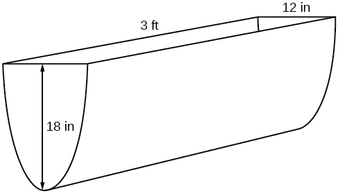{: #Figure_03_08_002}

Because it will be helpful to have an equation for the parabolic cross-sectional shape, we will impose a coordinate system at the cross section, with<math xmlns="http://www.w3.org/1998/Math/MathML"> <mrow> <mtext> </mtext><mi>x</mi><mtext> </mtext> </mrow> </math>

measured horizontally and<math xmlns="http://www.w3.org/1998/Math/MathML"> <mrow> <mtext> </mtext><mi>y</mi><mtext> </mtext> </mrow> </math>

measured vertically, with the origin at the vertex of the parabola. See [\[link\]](#Figure_03_08_003).

 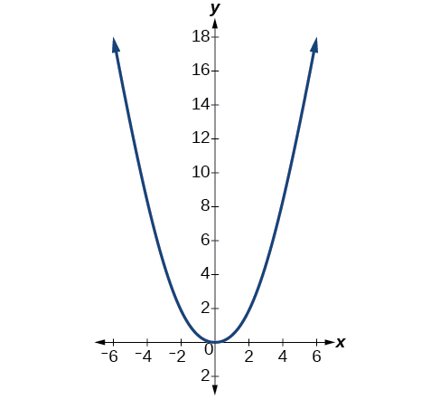{: #Figure_03_08_003}

From this we find an equation for the parabolic shape. We placed the origin at the vertex of the parabola, so we know the equation will have form<math xmlns="http://www.w3.org/1998/Math/MathML"> <mrow> <mtext> </mtext><mi>y</mi><mo stretchy="false">(</mo><mi>x</mi><mo stretchy="false">)</mo><mo>=</mo><mi>a</mi><msup> <mi>x</mi> <mn>2</mn> </msup> <mo>.</mo><mtext> </mtext> </mrow> </math>

Our equation will need to pass through the point (6, 18), from which we can solve for the stretch factor<math xmlns="http://www.w3.org/1998/Math/MathML"> <mrow> <mtext> </mtext><mi>a</mi><mo>.</mo> </mrow> </math>

<math xmlns="http://www.w3.org/1998/Math/MathML" display="block"> <mrow> <mtable> <mtr rowalign="center"> <mtd columnalign="right" rowalign="center"> <mrow> <mn>18</mn></mrow> </mtd> <mtd rowalign="center"> <mo>=</mo> </mtd> <mtd rowalign="center" columnalign="left"> <mrow> <mi>a</mi><msup> <mn>6</mn> <mn>2</mn> </msup> </mrow> </mtd> </mtr> <mtr rowalign="center"> <mtd rowalign="center" columnalign="right"> <mi>a</mi> </mtd> <mtd rowalign="center"> <mo>=</mo> </mtd> <mtd rowalign="center" columnalign="left"> <mrow> <mfrac> <mrow> <mn>18</mn></mrow> <mrow> <mn>36</mn></mrow> </mfrac> </mrow> </mtd> </mtr> <mtr rowalign="center"> <mtd rowalign="center" /> <mtd rowalign="center"> <mo>=</mo> </mtd> <mtd rowalign="center" columnalign="left"> <mrow> <mfrac> <mn>1</mn> <mn>2</mn> </mfrac> </mrow> </mtd> </mtr> </mtable></mrow> </math>

Our parabolic cross section has the equation

<math xmlns="http://www.w3.org/1998/Math/MathML" display="block"> <mrow> <mi>y</mi><mo stretchy="false">(</mo><mi>x</mi><mo stretchy="false">)</mo><mo>=</mo><mfrac> <mn>1</mn> <mn>2</mn> </mfrac> <msup> <mi>x</mi> <mn>2</mn> </msup> </mrow> </math>

We are interested in the **surface area**{: data-type="term" .no-emphasis} of the water, so we must determine the width at the top of the water as a function of the water depth. For any depth<math xmlns="http://www.w3.org/1998/Math/MathML"> <mrow> <mtext> </mtext><mi>y</mi><mo>,</mo><mtext> </mtext> </mrow> </math>

the width will be given by<math xmlns="http://www.w3.org/1998/Math/MathML"> <mrow> <mtext> </mtext><mn>2</mn><mi>x</mi><mo>,</mo><mtext> </mtext> </mrow> </math>

so we need to solve the equation above for<math xmlns="http://www.w3.org/1998/Math/MathML"> <mrow> <mtext> </mtext><mi>x</mi><mtext> </mtext> </mrow> </math>

and find the inverse function. However, notice that the original function is not one-to-one, and indeed, given any output there are two inputs that produce the same output, one positive and one negative.

To find an inverse, we can restrict our original function to a limited domain on which it *is* one-to-one. In this case, it makes sense to restrict ourselves to positive<math xmlns="http://www.w3.org/1998/Math/MathML"> <mrow> <mtext> </mtext><mi>x</mi><mtext> </mtext> </mrow> </math>

values. On this domain, we can find an inverse by solving for the input variable:

<math xmlns="http://www.w3.org/1998/Math/MathML" display="block"> <mrow> <mtable> <mtr> <mtd columnalign="right"> <mi>y</mi> </mtd> <mtd> <mo>=</mo> </mtd> <mtd columnalign="left"> <mrow> <mfrac> <mn>1</mn> <mn>2</mn> </mfrac> <msup> <mi>x</mi> <mn>2</mn> </msup> </mrow> </mtd> </mtr> <mtr> <mtd columnalign="right"> <mrow> <mn>2</mn><mi>y</mi></mrow> </mtd> <mtd> <mo>=</mo> </mtd> <mtd columnalign="left"> <mrow> <msup> <mi>x</mi> <mn>2</mn> </msup> </mrow> </mtd> </mtr> <mtr> <mtd columnalign="right"> <mi>x</mi> </mtd> <mtd> <mo>=</mo> </mtd> <mtd columnalign="left"> <mrow> <mo>±</mo><msqrt> <mrow> <mn>2</mn><mi>y</mi></mrow> </msqrt> </mrow> </mtd> </mtr> </mtable></mrow> </math>

This is not a function as written. We are limiting ourselves to positive<math xmlns="http://www.w3.org/1998/Math/MathML"> <mrow> <mtext> </mtext><mi>x</mi><mtext> </mtext> </mrow> </math>

values, so we eliminate the negative solution, giving us the inverse function we’re looking for.

<math xmlns="http://www.w3.org/1998/Math/MathML" display="block"> <mrow> <mi>y</mi><mo>=</mo><mfrac> <mrow> <msup> <mi>x</mi> <mn>2</mn> </msup> </mrow> <mn>2</mn> </mfrac> <mo>,</mo><mtext> </mtext><mi>x</mi><mo>&gt;</mo><mn>0</mn> </mrow> </math>

Because<math xmlns="http://www.w3.org/1998/Math/MathML"> <mrow> <mtext> </mtext><mi>x</mi><mtext> </mtext> </mrow> </math>

is the distance from the center of the parabola to either side, the entire width of the water at the top will be<math xmlns="http://www.w3.org/1998/Math/MathML"> <mrow> <mtext> </mtext><mn>2</mn><mi>x</mi><mo>.</mo><mtext> </mtext> </mrow> </math>

The trough is 3 feet (36 inches) long, so the surface area will then be:

<math xmlns="http://www.w3.org/1998/Math/MathML" display="block"> <mrow> <mtable> <mtr rowalign="center"> <mtd rowalign="center" columnalign="right"> <mrow> <mtext>Area</mtext></mrow> </mtd> <mtd rowalign="center"> <mo>=</mo> </mtd> <mtd rowalign="center" columnalign="left"> <mrow> <mi>l</mi><mo>⋅</mo><mi>w</mi></mrow> </mtd> </mtr> <mtr rowalign="center"> <mtd rowalign="center" /> <mtd rowalign="center"> <mo>=</mo> </mtd> <mtd rowalign="center" columnalign="left"> <mrow> <mn>36</mn><mo>⋅</mo><mn>2</mn><mi>x</mi></mrow> </mtd> </mtr> <mtr rowalign="center"> <mtd rowalign="center" /> <mtd rowalign="center"> <mo>=</mo> </mtd> <mtd rowalign="center" columnalign="left"> <mrow> <mn>72</mn><mi>x</mi></mrow> </mtd> </mtr> <mtr rowalign="center"> <mtd rowalign="center" /> <mtd rowalign="center"> <mo>=</mo> </mtd> <mtd rowalign="center" columnalign="left"> <mrow> <mn>72</mn><msqrt> <mrow> <mn>2</mn><mi>y</mi></mrow> </msqrt> </mrow> </mtd> </mtr> </mtable></mrow> </math>

This example illustrates two important points:

1.  When finding the inverse of a quadratic, we have to limit ourselves to a domain on which the function is one-to-one.
2.  The inverse of a quadratic function is a square root function. Both are toolkit functions and different types of power functions.
{: data-number-style="arabic"}

Functions involving roots are often called **radical functions**{: data-type="term" .no-emphasis}. While it is not possible to find an inverse of most polynomial functions, some basic polynomials do have inverses. Such functions are called **invertible functions**{: data-type="term"}, and we use the notation<math xmlns="http://www.w3.org/1998/Math/MathML"> <mrow> <mtext> </mtext><msup> <mi>f</mi> <mrow> <mo>−</mo><mn>1</mn> </mrow> </msup> <mo stretchy="false">(</mo><mi>x</mi><mo stretchy="false">)</mo><mo>.</mo> </mrow> </math>

Warning:<math xmlns="http://www.w3.org/1998/Math/MathML"> <mrow> <mtext> </mtext><msup> <mi>f</mi> <mrow> <mo>−</mo><mn>1</mn> </mrow> </msup> <mo stretchy="false">(</mo><mi>x</mi><mo stretchy="false">)</mo><mtext> </mtext> </mrow> </math>

is not the same as the reciprocal of the function<math xmlns="http://www.w3.org/1998/Math/MathML"> <mrow> <mtext> </mtext><mi>f</mi><mrow><mo>(</mo> <mi>x</mi> <mo>)</mo></mrow><mo>.</mo><mtext> </mtext> </mrow> </math>

This use of “–1” is reserved to denote inverse functions. To denote the reciprocal of a function<math xmlns="http://www.w3.org/1998/Math/MathML"> <mrow> <mtext> </mtext><mi>f</mi><mrow><mo>(</mo> <mi>x</mi> <mo>)</mo></mrow><mo>,</mo><mtext> </mtext> </mrow> </math>

we would need to write<math xmlns="http://www.w3.org/1998/Math/MathML"> <mrow> <mtext> </mtext><msup> <mrow> <mrow><mo>(</mo> <mrow> <mi>f</mi><mrow><mo>(</mo> <mi>x</mi> <mo>)</mo></mrow> </mrow> <mo>)</mo></mrow> </mrow> <mrow> <mo>−</mo><mn>1</mn> </mrow> </msup> <mo>=</mo><mfrac> <mn>1</mn> <mrow> <mi>f</mi><mrow><mo>(</mo> <mi>x</mi> <mo>)</mo></mrow> </mrow> </mfrac> <mo>.</mo> </mrow> </math>

An important relationship between inverse functions is that they “undo” each other. If<math xmlns="http://www.w3.org/1998/Math/MathML"> <mrow> <mtext> </mtext><msup> <mi>f</mi> <mrow> <mo>−</mo><mn>1</mn> </mrow> </msup> <mtext> </mtext> </mrow> </math>

is the inverse of a function<math xmlns="http://www.w3.org/1998/Math/MathML"> <mrow> <mtext> </mtext><mi>f</mi><mo>,</mo><mtext> </mtext> </mrow> </math>

 then<math xmlns="http://www.w3.org/1998/Math/MathML"> <mrow> <mtext> </mtext><mi>f</mi><mtext> </mtext> </mrow> </math>

is the inverse of the function<math xmlns="http://www.w3.org/1998/Math/MathML"> <mrow> <mtext> </mtext><msup> <mi>f</mi> <mrow> <mo>−</mo><mn>1</mn> </mrow> </msup> <mo>.</mo><mtext> </mtext> </mrow> </math>

In other words, whatever the function<math xmlns="http://www.w3.org/1998/Math/MathML"> <mrow> <mtext> </mtext><mi>f</mi><mtext> </mtext> </mrow> </math>

does to<math xmlns="http://www.w3.org/1998/Math/MathML"> <mrow> <mtext> </mtext><mi>x</mi><mo>,</mo> </mrow> </math>

 <math xmlns="http://www.w3.org/1998/Math/MathML"> <mrow> <mtext> </mtext><msup> <mi>f</mi> <mrow> <mo>−</mo><mn>1</mn> </mrow> </msup> <mtext> </mtext> </mrow> </math>

undoes it—and vice-versa.

<math xmlns="http://www.w3.org/1998/Math/MathML" display="block"> <mrow> <msup> <mi>f</mi> <mrow> <mo>−</mo><mn>1</mn> </mrow> </msup> <mrow><mo>(</mo> <mrow> <mi>f</mi><mrow><mo>(</mo> <mi>x</mi> <mo>)</mo></mrow> </mrow> <mo>)</mo></mrow><mo>=</mo><mi>x</mi><mo>,</mo><mtext> </mtext><mtext>for all </mtext><mi>x</mi><mtext> in the domain of </mtext><mi>f</mi> </mrow> </math>

and

<math xmlns="http://www.w3.org/1998/Math/MathML" display="block"> <mrow> <mi>f</mi><mrow><mo>(</mo> <mrow> <msup> <mi>f</mi> <mrow> <mo>−</mo><mn>1</mn> </mrow> </msup> <mrow><mo>(</mo> <mi>x</mi> <mo>)</mo></mrow> </mrow> <mo>)</mo></mrow><mo>=</mo><mi>x</mi><mo>,</mo><mtext> </mtext><mtext>for all </mtext><mi>x</mi><mtext> in the domain of </mtext><msup> <mi>f</mi> <mrow> <mo>−</mo><mn>1</mn> </mrow> </msup> </mrow> </math>

Note that the inverse switches the domain and range of the original function.

Verifying Two Functions Are Inverses of One Another

Two functions,<math xmlns="http://www.w3.org/1998/Math/MathML"> <mrow> <mtext> </mtext><mi>f</mi><mtext> </mtext> </mrow> </math>

 and<math xmlns="http://www.w3.org/1998/Math/MathML"> <mrow> <mtext> </mtext><mi>g</mi><mo>,</mo><mtext> </mtext> </mrow> </math>

are inverses of one another if for all<math xmlns="http://www.w3.org/1998/Math/MathML"> <mrow> <mtext> </mtext><mi>x</mi><mtext> </mtext> </mrow> </math>

in the domain of<math xmlns="http://www.w3.org/1998/Math/MathML"> <mrow> <mtext> </mtext><mi>f</mi><mtext> </mtext> </mrow> </math>

 and<math xmlns="http://www.w3.org/1998/Math/MathML"> <mrow> <mtext> </mtext><mi>g</mi><mo>.</mo> </mrow> </math>

<math xmlns="http://www.w3.org/1998/Math/MathML" display="block"> <mrow> <mi>g</mi><mrow><mo>(</mo> <mrow> <mi>f</mi><mrow><mo>(</mo> <mi>x</mi> <mo>)</mo></mrow> </mrow> <mo>)</mo></mrow><mo>=</mo><mi>f</mi><mrow><mo>(</mo> <mrow> <mi>g</mi><mrow><mo>(</mo> <mi>x</mi> <mo>)</mo></mrow> </mrow> <mo>)</mo></mrow><mo>=</mo><mi>x</mi> </mrow> </math>

**Given a polynomial function, find the inverse of the function by restricting the domain in such a way that the new function is one-to-one.**

1.  Replace
    <math xmlns="http://www.w3.org/1998/Math/MathML"> <mrow> <mtext> </mtext><mi>f</mi><mrow><mo>(</mo> <mi>x</mi> <mo>)</mo></mrow><mtext> </mtext> </mrow> </math>
    
    with
    <math xmlns="http://www.w3.org/1998/Math/MathML"> <mrow> <mtext> </mtext><mi>y</mi><mo>.</mo> </mrow> </math>

2.  Interchange
    <math xmlns="http://www.w3.org/1998/Math/MathML"> <mrow> <mtext> </mtext><mi>x</mi><mtext> </mtext> </mrow> </math>
    
    and
    <math xmlns="http://www.w3.org/1998/Math/MathML"> <mrow> <mtext> </mtext><mi>y</mi><mo>.</mo> </mrow> </math>

3.  Solve for
    <math xmlns="http://www.w3.org/1998/Math/MathML"> <mrow> <mtext> </mtext><mi>y</mi><mo>,</mo><mtext> </mtext> </mrow> </math>
    
    and rename the function
    <math xmlns="http://www.w3.org/1998/Math/MathML"> <mrow> <mtext> </mtext><msup> <mi>f</mi> <mrow> <mo>−</mo><mn>1</mn> </mrow> </msup> <mo stretchy="false">(</mo><mi>x</mi><mo stretchy="false">)</mo><mo>.</mo> </mrow> </math>
{: data-number-style="arabic"}

Verifying Inverse Functions

Show that<math xmlns="http://www.w3.org/1998/Math/MathML"> <mrow> <mtext> </mtext><mi>f</mi><mrow><mo>(</mo> <mi>x</mi> <mo>)</mo></mrow><mo>=</mo><mfrac> <mn>1</mn> <mrow> <mi>x</mi><mo>+</mo><mn>1</mn> </mrow> </mfrac> <mtext> </mtext> </mrow> </math>

and<math xmlns="http://www.w3.org/1998/Math/MathML"> <mrow> <mtext> </mtext><msup> <mi>f</mi> <mrow> <mo>−</mo><mn>1</mn> </mrow> </msup> <mrow><mo>(</mo> <mi>x</mi> <mo>)</mo></mrow><mo>=</mo><mfrac> <mn>1</mn> <mi>x</mi> </mfrac> <mo>−</mo><mn>1</mn><mtext> </mtext> </mrow> </math>

are inverses, for<math xmlns="http://www.w3.org/1998/Math/MathML"> <mrow> <mtext> </mtext><mi>x</mi><mo>≠</mo><mn>0</mn><mo>,</mo><mn>−1</mn> </mrow> </math>

.

We must show that<math xmlns="http://www.w3.org/1998/Math/MathML"> <mrow> <mtext> </mtext><msup> <mi>f</mi> <mrow> <mo>−</mo><mn>1</mn> </mrow> </msup> <mrow><mo>(</mo> <mrow> <mi>f</mi><mrow><mo>(</mo> <mi>x</mi> <mo>)</mo></mrow> </mrow> <mo>)</mo></mrow><mo>=</mo><mi>x</mi><mtext> </mtext> </mrow> </math>

and<math xmlns="http://www.w3.org/1998/Math/MathML"> <mrow> <mtext> </mtext><mi>f</mi><mrow><mo>(</mo> <mrow> <msup> <mi>f</mi> <mrow> <mo>−</mo><mn>1</mn> </mrow> </msup> <mrow><mo>(</mo> <mi>x</mi> <mo>)</mo></mrow> </mrow> <mo>)</mo></mrow><mo>=</mo><mi>x</mi><mo>.</mo> </mrow> </math>

<math xmlns="http://www.w3.org/1998/Math/MathML" display="block"> <mrow> <mtable> <mtr rowalign="center"> <mtd rowalign="center" columnalign="right"> <mrow> <msup> <mi>f</mi> <mrow> <mo>−</mo><mn>1</mn></mrow> </msup> <mo stretchy="false">(</mo><mi>f</mi><mo stretchy="false">(</mo><mi>x</mi><mo stretchy="false">)</mo><mo stretchy="false">)</mo></mrow> </mtd> <mtd rowalign="center"> <mo>=</mo> </mtd> <mtd rowalign="center" columnalign="left"> <mrow> <msup> <mi>f</mi> <mrow> <mo>−</mo><mn>1</mn></mrow> </msup> <mrow><mo>(</mo> <mrow> <mfrac> <mn>1</mn> <mrow> <mi>x</mi><mo>+</mo><mn>1</mn></mrow> </mfrac> </mrow> <mo>)</mo></mrow></mrow> </mtd> </mtr> <mtr rowalign="center"> <mtd rowalign="center" /> <mtd rowalign="center"><mo>=</mo></mtd> <mtd rowalign="center" columnalign="left"> <mrow> <mfrac> <mn>1</mn> <mrow> <mfrac> <mn>1</mn> <mrow> <mi>x</mi><mo>+</mo><mn>1</mn></mrow> </mfrac> </mrow> </mfrac> <mo>−</mo><mn>1</mn></mrow> </mtd> </mtr> <mtr rowalign="center"> <mtd rowalign="center" /> <mtd rowalign="center"><mo>=</mo></mtd> <mtd rowalign="center"> <mrow> <mo stretchy="false">(</mo><mi>x</mi><mo>+</mo><mn>1</mn><mo stretchy="false">)</mo><mo>−</mo><mn>1</mn></mrow> </mtd> </mtr> <mtr rowalign="center"> <mtd rowalign="center" /> <mtd rowalign="center"><mo>=</mo></mtd> <mtd rowalign="center" columnalign="left"> <mi>x</mi> </mtd> </mtr> <mtr rowalign="center"> <mtd rowalign="center" columnalign="right"> <mrow> <mi>f</mi><mo stretchy="false">(</mo><msup> <mi>f</mi> <mrow> <mn>−1</mn></mrow> </msup> <mo stretchy="false">(</mo><mi>x</mi><mo stretchy="false">)</mo><mo stretchy="false">)</mo></mrow> </mtd> <mtd rowalign="center"><mo>=</mo></mtd> <mtd rowalign="center" columnalign="left"> <mrow> <mi>f</mi><mrow><mo>(</mo> <mrow> <mfrac> <mn>1</mn> <mi>x</mi> </mfrac> <mo>−</mo><mn>1</mn></mrow> <mo>)</mo></mrow></mrow> </mtd> </mtr> <mtr rowalign="center"> <mtd rowalign="center" /> <mtd rowalign="center"> <mo>=</mo> </mtd> <mtd rowalign="center" columnalign="left"> <mrow> <mfrac> <mn>1</mn> <mrow> <mrow><mo>(</mo> <mrow> <mfrac> <mn>1</mn> <mi>x</mi> </mfrac> <mo>−</mo><mn>1</mn></mrow> <mo>)</mo></mrow><mo>+</mo><mn>1</mn></mrow> </mfrac> </mrow> </mtd> </mtr> <mtr rowalign="center"> <mtd rowalign="center" /> <mtd rowalign="center"><mo>=</mo></mtd> <mtd rowalign="center" columnalign="left"> <mrow> <mfrac> <mn>1</mn> <mrow> <mfrac> <mn>1</mn> <mi>x</mi> </mfrac> </mrow> </mfrac> </mrow> </mtd> </mtr> <mtr rowalign="center"> <mtd rowalign="center" /> <mtd rowalign="center"><mo>=</mo></mtd> <mtd rowalign="center" columnalign="left"> <mi>x</mi> </mtd> </mtr> </mtable></mrow> </math>

Therefore,<math xmlns="http://www.w3.org/1998/Math/MathML"> <mrow> <mtext> </mtext><mi>f</mi><mrow><mo>(</mo> <mi>x</mi> <mo>)</mo></mrow><mo>=</mo><mfrac> <mn>1</mn> <mrow> <mi>x</mi><mo>+</mo><mn>1</mn> </mrow> </mfrac> <mtext> </mtext> </mrow> </math>

 and<math xmlns="http://www.w3.org/1998/Math/MathML"> <mrow> <mtext> </mtext><msup> <mi>f</mi> <mrow> <mo>−</mo><mn>1</mn> </mrow> </msup> <mrow><mo>(</mo> <mi>x</mi> <mo>)</mo></mrow><mo>=</mo><mfrac> <mn>1</mn> <mi>x</mi> </mfrac> <mo>−</mo><mn>1</mn><mtext> </mtext> </mrow> </math>

are inverses.

Show that<math xmlns="http://www.w3.org/1998/Math/MathML"> <mrow> <mtext> </mtext><mi>f</mi><mrow><mo>(</mo> <mi>x</mi> <mo>)</mo></mrow><mo>=</mo><mfrac> <mrow> <mi>x</mi><mo>+</mo><mn>5</mn> </mrow> <mn>3</mn> </mfrac> <mtext> </mtext> </mrow> </math>

 and<math xmlns="http://www.w3.org/1998/Math/MathML"> <mrow> <mtext> </mtext><msup> <mi>f</mi> <mrow> <mo>−</mo><mn>1</mn> </mrow> </msup> <mrow><mo>(</mo> <mi>x</mi> <mo>)</mo></mrow><mo>=</mo><mn>3</mn><mi>x</mi><mo>−</mo><mn>5</mn><mtext> </mtext> </mrow> </math>

are inverses.

<math xmlns="http://www.w3.org/1998/Math/MathML"> <mrow> <msup> <mi>f</mi> <mrow> <mo>−</mo><mn>1</mn> </mrow> </msup> <mrow><mo>(</mo> <mrow> <mi>f</mi><mrow><mo>(</mo> <mi>x</mi> <mo>)</mo></mrow> </mrow> <mo>)</mo></mrow><mo>=</mo><msup> <mi>f</mi> <mrow> <mo>−</mo><mn>1</mn> </mrow> </msup> <mrow><mo>(</mo> <mrow> <mfrac> <mrow> <mi>x</mi><mo>+</mo><mn>5</mn> </mrow> <mn>3</mn> </mfrac> </mrow> <mo>)</mo></mrow><mo>=</mo><mn>3</mn><mrow><mo>(</mo> <mrow> <mfrac> <mrow> <mi>x</mi><mo>+</mo><mn>5</mn> </mrow> <mn>3</mn> </mfrac> </mrow> <mo>)</mo></mrow><mo>−</mo><mn>5</mn><mo>=</mo><mrow><mo>(</mo> <mrow> <mi>x</mi><mo>−</mo><mn>5</mn> </mrow> <mo>)</mo></mrow><mo>+</mo><mn>5</mn><mo>=</mo><mi>x</mi><mtext> </mtext> </mrow> </math>

and<math xmlns="http://www.w3.org/1998/Math/MathML"> <mrow> <mtext> </mtext><mi>f</mi><mrow><mo>(</mo> <mrow> <msup> <mi>f</mi> <mrow> <mo>−</mo><mn>1</mn> </mrow> </msup> <mrow><mo>(</mo> <mi>x</mi> <mo>)</mo></mrow> </mrow> <mo>)</mo></mrow><mo>=</mo><mi>f</mi><mrow><mo>(</mo> <mrow> <mn>3</mn><mi>x</mi><mo>−</mo><mn>5</mn> </mrow> <mo>)</mo></mrow><mo>=</mo><mfrac> <mrow> <mrow><mo>(</mo> <mrow> <mn>3</mn><mi>x</mi><mo>−</mo><mn>5</mn> </mrow> <mo>)</mo></mrow><mo>+</mo><mn>5</mn> </mrow> <mn>3</mn> </mfrac> <mo>=</mo><mfrac> <mrow> <mn>3</mn><mi>x</mi> </mrow> <mn>3</mn> </mfrac> <mo>=</mo><mi>x</mi> </mrow> </math>

Finding the Inverse of a Cubic Function

Find the inverse of the function<math xmlns="http://www.w3.org/1998/Math/MathML"> <mrow> <mtext> </mtext><mi>f</mi><mo stretchy="false">(</mo><mi>x</mi><mo stretchy="false">)</mo><mo>=</mo><mn>5</mn><msup> <mi>x</mi> <mn>3</mn> </msup> <mo>+</mo><mn>1.</mn> </mrow> </math>

This is a transformation of the basic cubic toolkit function, and based on our knowledge of that function, we know it is one-to-one. Solving for the inverse by solving for<math xmlns="http://www.w3.org/1998/Math/MathML"> <mrow> <mtext> </mtext><mi>x</mi><mo>.</mo> </mrow> </math>

<math xmlns="http://www.w3.org/1998/Math/MathML" display="block"> <mrow> <mtable> <mtr> <mtd columnalign="right"> <mi>y</mi> </mtd> <mtd> <mo>=</mo> </mtd> <mtd columnalign="left"> <mrow> <mn>5</mn><msup> <mi>x</mi> <mn>3</mn> </msup> <mo>+</mo><mn>1</mn></mrow> </mtd> </mtr> <mtr> <mtd columnalign="right"> <mi>x</mi> </mtd> <mtd> <mo>=</mo> </mtd> <mtd columnalign="left"> <mrow> <mn>5</mn><msup> <mi>y</mi> <mn>3</mn> </msup> <mo>+</mo><mn>1</mn></mrow> </mtd> </mtr> <mtr> <mtd columnalign="right"> <mrow> <mi>x</mi><mo>−</mo><mn>1</mn></mrow> </mtd> <mtd> <mo>=</mo> </mtd> <mtd columnalign="left"> <mrow> <mn>5</mn><msup> <mi>y</mi> <mn>3</mn> </msup> </mrow> </mtd> </mtr> <mtr> <mtd columnalign="right"> <mrow> <mfrac> <mrow> <mi>x</mi><mo>−</mo><mn>1</mn></mrow> <mn>5</mn> </mfrac> </mrow> </mtd> <mtd> <mo>=</mo> </mtd> <mtd columnalign="left"> <mrow> <msup> <mi>y</mi> <mn>3</mn> </msup> </mrow> </mtd> </mtr> <mtr> <mtd columnalign="right"> <mrow> <msup> <mi>f</mi> <mrow> <mo>−</mo><mn>1</mn></mrow> </msup> <mo stretchy="false">(</mo><mi>x</mi><mo stretchy="false">)</mo></mrow> </mtd> <mtd> <mo>=</mo> </mtd> <mtd columnalign="left"> <mrow> <mroot> <mrow> <mfrac> <mrow> <mi>x</mi><mo>−</mo><mn>1</mn></mrow> <mn>5</mn> </mfrac> </mrow> <mn>3</mn> </mroot> </mrow> </mtd> </mtr> </mtable></mrow> </math>

Analysis

Look at the graph of<math xmlns="http://www.w3.org/1998/Math/MathML"> <mrow> <mtext> </mtext><mi>f</mi><mtext> </mtext> </mrow> </math>

and<math xmlns="http://www.w3.org/1998/Math/MathML"> <mrow> <mtext> </mtext><msup> <mi>f</mi> <mrow> <mn>–1</mn> </mrow> </msup> <mo>.</mo><mtext> </mtext> </mrow> </math>

Notice that one graph is the reflection of the other about the line<math xmlns="http://www.w3.org/1998/Math/MathML"> <mrow> <mtext> </mtext><mi>y</mi><mo>=</mo><mi>x</mi><mo>.</mo><mtext> </mtext> </mrow> </math>

This is always the case when graphing a function and its inverse function.

Also, since the method involved interchanging<math xmlns="http://www.w3.org/1998/Math/MathML"> <mrow> <mtext> </mtext><mi>x</mi><mtext> </mtext> </mrow> </math>

and<math xmlns="http://www.w3.org/1998/Math/MathML"> <mrow> <mtext> </mtext><mi>y</mi><mo>,</mo><mtext> </mtext> </mrow> </math>

notice corresponding points. If<math xmlns="http://www.w3.org/1998/Math/MathML"> <mrow> <mtext> </mtext><mo stretchy="false">(</mo><mi>a</mi><mo>,</mo><mi>b</mi><mo stretchy="false">)</mo><mtext> </mtext> </mrow> </math>

is on the graph of<math xmlns="http://www.w3.org/1998/Math/MathML"> <mrow> <mtext> </mtext><mi>f</mi><mo>,</mo> </mrow> </math>

then<math xmlns="http://www.w3.org/1998/Math/MathML"> <mrow> <mtext> </mtext><mo stretchy="false">(</mo><mi>b</mi><mo>,</mo><mi>a</mi><mo stretchy="false">)</mo><mtext> </mtext> </mrow> </math>

is on the graph of<math xmlns="http://www.w3.org/1998/Math/MathML"> <mrow> <mtext> </mtext><msup> <mi>f</mi> <mrow> <mn>–1</mn> </mrow> </msup> <mo>.</mo><mtext> </mtext> </mrow> </math>

Since<math xmlns="http://www.w3.org/1998/Math/MathML"> <mrow> <mtext> </mtext><mo stretchy="false">(</mo><mn>0</mn><mo>,</mo><mn>1</mn><mo stretchy="false">)</mo><mtext> </mtext> </mrow> </math>

is on the graph of<math xmlns="http://www.w3.org/1998/Math/MathML"> <mrow> <mtext> </mtext><mi>f</mi><mo>,</mo><mtext> </mtext> </mrow> </math>

then<math xmlns="http://www.w3.org/1998/Math/MathML"> <mrow> <mtext> </mtext><mo stretchy="false">(</mo><mn>1</mn><mo>,</mo><mn>0</mn><mo stretchy="false">)</mo><mtext> </mtext> </mrow> </math>

is on the graph of<math xmlns="http://www.w3.org/1998/Math/MathML"> <mrow> <mtext> </mtext><msup> <mi>f</mi> <mrow> <mn>–1</mn> </mrow> </msup> <mo>.</mo><mtext> </mtext> </mrow> </math>

Similarly, since<math xmlns="http://www.w3.org/1998/Math/MathML"> <mrow> <mtext> </mtext><mo stretchy="false">(</mo><mn>1</mn><mo>,</mo><mn>6</mn><mo stretchy="false">)</mo><mtext> </mtext> </mrow> </math>

is on the graph of<math xmlns="http://www.w3.org/1998/Math/MathML"> <mrow> <mtext> </mtext><mi>f</mi><mo>,</mo> </mrow> </math>

then<math xmlns="http://www.w3.org/1998/Math/MathML"> <mrow> <mtext> </mtext><mo stretchy="false">(</mo><mn>6</mn><mo>,</mo><mn>1</mn><mo stretchy="false">)</mo><mtext> </mtext> </mrow> </math>

is on the graph of<math xmlns="http://www.w3.org/1998/Math/MathML"> <mrow> <mtext> </mtext><msup> <mi>f</mi> <mrow> <mn>–1</mn> </mrow> </msup> <mo>.</mo><mtext> </mtext> </mrow> </math>

See [[link]](#Figure_03_08_004).

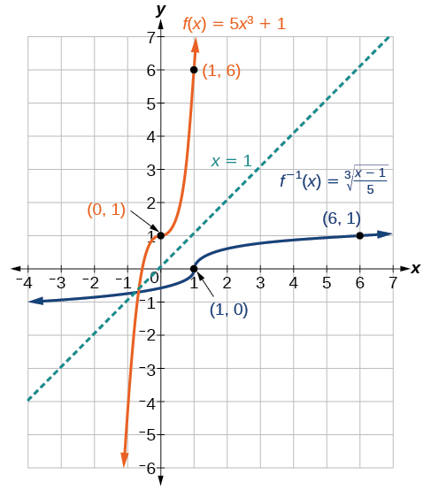{: #Figure_03_08_004}

Find the inverse function of<math xmlns="http://www.w3.org/1998/Math/MathML"> <mrow> <mtext> </mtext><mi>f</mi><mo stretchy="false">(</mo><mi>x</mi><mo stretchy="false">)</mo><mo>=</mo><mroot> <mrow> <mi>x</mi><mo>+</mo><mn>4</mn> </mrow> <mn>3</mn> </mroot> <mo>.</mo> </mrow> </math>

<math xmlns="http://www.w3.org/1998/Math/MathML"> <mrow> <msup> <mi>f</mi> <mrow> <mo>−</mo><mn>1</mn> </mrow> </msup> <mo stretchy="false">(</mo><mi>x</mi><mo stretchy="false">)</mo><mo>=</mo><msup> <mi>x</mi> <mn>3</mn> </msup> <mo>−</mo><mn>4</mn> </mrow> </math>

### Restricting the Domain to Find the Inverse of a Polynomial Function

So far, we have been able to find the inverse functions of **cubic functions**{: data-type="term" .no-emphasis} without having to restrict their domains. However, as we know, not all cubic polynomials are one-to-one. Some functions that are not one-to-one may have their domain restricted so that they are one-to-one, but only over that domain. The function over the restricted domain would then have an **inverse function**{: data-type="term" .no-emphasis}. Since quadratic functions are not one-to-one, we must restrict their domain in order to find their inverses.

Restricting the Domain

If a function is not one-to-one, it cannot have an inverse. If we restrict the domain of the function so that it becomes one-to-one, thus creating a new function, this new function will have an inverse.

**Given a polynomial function, restrict the domain of a function that is not one-to-one and then find the inverse.**

1.  Restrict the domain by determining a domain on which the original function is one-to-one.
2.  Replace
    <math xmlns="http://www.w3.org/1998/Math/MathML"> <mrow> <mtext> </mtext><mi>f</mi><mo stretchy="false">(</mo><mi>x</mi><mo stretchy="false">)</mo><mtext> </mtext></mrow> </math>
    
    with
    <math xmlns="http://www.w3.org/1998/Math/MathML"> <mrow> <mtext> </mtext><mi>y</mi><mo>.</mo></mrow> </math>

3.  Interchange
    <math xmlns="http://www.w3.org/1998/Math/MathML"> <mrow> <mtext> </mtext><mi>x</mi><mtext> </mtext></mrow> </math>
    
    and
    <math xmlns="http://www.w3.org/1998/Math/MathML"> <mrow> <mtext> </mtext><mi>y</mi><mo>.</mo></mrow> </math>

4.  Solve for
    <math xmlns="http://www.w3.org/1998/Math/MathML"> <mrow> <mtext> </mtext><mi>y</mi><mo>,</mo> </mrow> </math>
    
    and rename the function or pair of function
    <math xmlns="http://www.w3.org/1998/Math/MathML"> <mrow> <mtext> </mtext><msup> <mi>f</mi> <mrow> <mn>−1</mn> </mrow> </msup> <mo stretchy="false">(</mo><mi>x</mi><mo stretchy="false">)</mo><mo>.</mo> </mrow> </math>

5.  Revise the formula for
    <math xmlns="http://www.w3.org/1998/Math/MathML"> <mrow> <mtext> </mtext><msup> <mi>f</mi> <mrow> <mn>−1</mn> </mrow> </msup> <mo stretchy="false">(</mo><mi>x</mi><mo stretchy="false">)</mo><mtext> </mtext> </mrow> </math>
    
    by ensuring that the outputs of the inverse function correspond to the restricted domain of the original function.
{: data-number-style="arabic"}

Restricting the Domain to Find the Inverse of a Polynomial Function

Find the inverse function of<math xmlns="http://www.w3.org/1998/Math/MathML"> <mrow> <mtext> </mtext><mi>f</mi><mtext>:</mtext> </mrow> </math>

1.  <math xmlns="http://www.w3.org/1998/Math/MathML"> <mrow> <mi>f</mi><mo stretchy="false">(</mo><mi>x</mi><mo stretchy="false">)</mo><mo>=</mo><msup> <mrow> <mo stretchy="false">(</mo><mi>x</mi><mo>−</mo><mn>4</mn><mo stretchy="false">)</mo> </mrow> <mn>2</mn> </msup> <mo>,</mo><mo> </mo><mi>x</mi><mo>≥</mo><mn>4</mn> </mrow> </math>

2.  <math xmlns="http://www.w3.org/1998/Math/MathML"> <mrow> <mi>f</mi><mo stretchy="false">(</mo><mi>x</mi><mo stretchy="false">)</mo><mo>=</mo><msup> <mrow> <mo stretchy="false">(</mo><mi>x</mi><mo>−</mo><mn>4</mn><mo stretchy="false">)</mo> </mrow> <mn>2</mn> </msup> <mo>,</mo><mo> </mo><mi>x</mi><mo>≤</mo><mn>4</mn> </mrow> </math>
{: data-number-style="lower-alpha"}

The original function<math xmlns="http://www.w3.org/1998/Math/MathML"> <mrow> <mtext> </mtext><mi>f</mi><mo stretchy="false">(</mo><mi>x</mi><mo stretchy="false">)</mo><mo>=</mo><msup> <mrow> <mo stretchy="false">(</mo><mi>x</mi><mo>−</mo><mn>4</mn><mo stretchy="false">)</mo> </mrow> <mn>2</mn> </msup> <mtext> </mtext> </mrow> </math>

is not one-to-one, but the function is restricted to a domain of<math xmlns="http://www.w3.org/1998/Math/MathML"> <mrow> <mtext> </mtext><mi>x</mi><mo>≥</mo><mn>4</mn><mtext> </mtext> </mrow> </math>

or<math xmlns="http://www.w3.org/1998/Math/MathML"> <mrow> <mtext> </mtext><mi>x</mi><mo>≤</mo><mn>4</mn><mtext> </mtext> </mrow> </math>

on which it is one-to-one. See [[link]](#Figure_03_08_005).

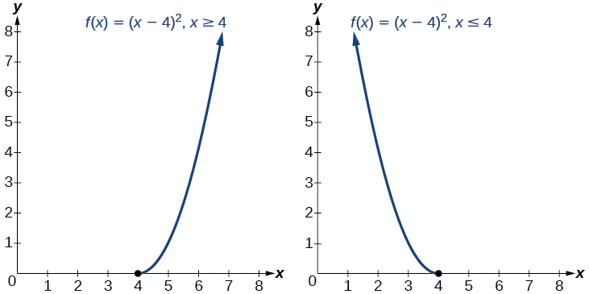{: #Figure_03_08_005}

To find the inverse, start by replacing<math xmlns="http://www.w3.org/1998/Math/MathML"> <mrow> <mtext> </mtext><mi>f</mi><mo stretchy="false">(</mo><mi>x</mi><mo stretchy="false">)</mo><mtext> </mtext> </mrow> </math>

with the simple variable<math xmlns="http://www.w3.org/1998/Math/MathML"> <mrow> <mtext> </mtext><mi>y</mi><mo>.</mo> </mrow> </math>

<math xmlns="http://www.w3.org/1998/Math/MathML" display="block"> <mrow> <mtable> <mtr rowalign="center"> <mtd columnalign="right" rowalign="center"> <mi>y</mi> </mtd> <mtd rowalign="center"> <mo>=</mo> </mtd> <mtd columnalign="left" rowalign="center"> <mrow> <msup> <mrow> <mo stretchy="false">(</mo><mi>x</mi><mo>−</mo><mn>4</mn><mo stretchy="false">)</mo></mrow> <mn>2</mn> </msup> </mrow> </mtd> <mtd rowalign="center" columnalign="left"> <mrow> <mspace width="2em" /><mtext>Interchange</mtext><mo /><mi>x</mi><mo /><mtext>and </mtext><mi>y</mi><mo>.</mo></mrow> </mtd> </mtr> <mtr rowalign="center"> <mtd rowalign="center" columnalign="right"> <mi>x</mi> </mtd> <mtd rowalign="center"> <mo>=</mo> </mtd> <mtd rowalign="center" columnalign="left"> <mrow> <msup> <mrow> <mo stretchy="false">(</mo><mi>y</mi><mo>−</mo><mn>4</mn><mo stretchy="false">)</mo></mrow> <mn>2</mn> </msup> </mrow> </mtd> <mtd rowalign="center" columnalign="left"> <mrow> <mspace width="2em" /><mtext>Take the square root</mtext><mo>.</mo></mrow> </mtd> </mtr> <mtr rowalign="center"> <mtd rowalign="center" columnalign="right"> <mrow> <mo>±</mo><msqrt> <mi>x</mi> </msqrt> </mrow> </mtd> <mtd rowalign="center"> <mo>=</mo> </mtd> <mtd rowalign="center" columnalign="left"> <mrow> <mi>y</mi><mo>−</mo><mn>4</mn></mrow> </mtd> <mtd rowalign="center" columnalign="left"> <mrow> <mspace width="2em" /><mtext>Add</mtext><mo> </mo><mn>4</mn><mo> </mo><mtext>to both sides</mtext><mo>.</mo></mrow> </mtd> </mtr> <mtr rowalign="center"> <mtd rowalign="center" columnalign="right"> <mrow> <mn>4</mn><mo>±</mo><msqrt> <mi>x</mi> </msqrt> </mrow> </mtd> <mtd rowalign="center"> <mo>=</mo> </mtd> <mtd rowalign="center" columnalign="left"> <mi>y</mi> </mtd> <mtd> <mrow /> </mtd> </mtr> </mtable></mrow> </math>

This is not a function as written. We need to examine the restrictions on the domain of the original function to determine the inverse. Since we reversed the roles of<math xmlns="http://www.w3.org/1998/Math/MathML"> <mrow> <mtext> </mtext><mi>x</mi><mtext> </mtext> </mrow> </math>

and<math xmlns="http://www.w3.org/1998/Math/MathML"> <mrow> <mtext> </mtext><mi>y</mi><mtext> </mtext> </mrow> </math>

for the original<math xmlns="http://www.w3.org/1998/Math/MathML"> <mrow> <mtext> </mtext><mi>f</mi><mo stretchy="false">(</mo><mi>x</mi><mo stretchy="false">)</mo><mo>,</mo><mtext> </mtext> </mrow> </math>

we looked at the domain: the values<math xmlns="http://www.w3.org/1998/Math/MathML"> <mrow> <mtext> </mtext><mi>x</mi><mtext> </mtext> </mrow> </math>

 could assume. When we reversed the roles of<math xmlns="http://www.w3.org/1998/Math/MathML"> <mrow> <mtext> </mtext><mi>x</mi><mtext> </mtext> </mrow> </math>

and<math xmlns="http://www.w3.org/1998/Math/MathML"> <mrow> <mtext> </mtext><mi>y</mi><mo>,</mo><mtext> </mtext> </mrow> </math>

 this gave us the values<math xmlns="http://www.w3.org/1998/Math/MathML"> <mrow> <mtext> </mtext><mi>y</mi><mtext> </mtext> </mrow> </math>

could assume. For this function,<math xmlns="http://www.w3.org/1998/Math/MathML"> <mrow> <mtext> </mtext><mi>x</mi><mo>≥</mo><mn>4</mn><mo>,</mo><mtext> </mtext> </mrow> </math>

so for the inverse, we should have<math xmlns="http://www.w3.org/1998/Math/MathML"> <mrow> <mtext> </mtext><mi>y</mi><mo>≥</mo><mn>4</mn><mo>,</mo><mtext> </mtext> </mrow> </math>

which is what our inverse function gives.

1.  The domain of the original function was restricted to
    <math xmlns="http://www.w3.org/1998/Math/MathML"> <mrow> <mtext> </mtext><mi>x</mi><mo>≥</mo><mn>4</mn><mo>,</mo><mtext> </mtext> </mrow> </math>
    
    so the outputs of the inverse need to be the same,
    <math xmlns="http://www.w3.org/1998/Math/MathML"> <mrow> <mtext> </mtext><mi>f</mi><mrow><mo>(</mo> <mi>x</mi> <mo>)</mo></mrow><mo>≥</mo><mn>4</mn><mo>,</mo><mtext> </mtext> </mrow> </math>
    
    and we must use the + case:
    

    <math xmlns="http://www.w3.org/1998/Math/MathML" display="block"> <mrow> <msup> <mi>f</mi> <mrow> <mo>−</mo><mn>1</mn> </mrow> </msup> <mo stretchy="false">(</mo><mi>x</mi><mo stretchy="false">)</mo><mo>=</mo><mn>4</mn><mo>+</mo><msqrt> <mi>x</mi> </msqrt> </mrow> </math>
    

2.  The domain of the original function was restricted to
    <math xmlns="http://www.w3.org/1998/Math/MathML"> <mrow> <mtext> </mtext><mi>x</mi><mo>≤</mo><mn>4</mn><mo>,</mo><mtext> </mtext> </mrow> </math>
    
    so the outputs of the inverse need to be the same,
    <math xmlns="http://www.w3.org/1998/Math/MathML"> <mrow> <mtext> </mtext><mi>f</mi><mrow><mo>(</mo> <mi>x</mi> <mo>)</mo></mrow><mo>≤</mo><mn>4</mn><mo>,</mo><mtext> </mtext> </mrow> </math>
    
    and we must use the – case:
    

    <math xmlns="http://www.w3.org/1998/Math/MathML" display="block"> <mrow> <msup> <mi>f</mi> <mrow> <mo>−</mo><mn>1</mn> </mrow> </msup> <mo stretchy="false">(</mo><mi>x</mi><mo stretchy="false">)</mo><mo>=</mo><mn>4</mn><mo>−</mo><msqrt> <mi>x</mi> </msqrt> </mrow> </math>
    

{: data-number-style="lower-alpha"}

Analysis

On the graphs in [[link]](#Figure_03_08_006), we see the original function graphed on the same set of axes as its inverse function. Notice that together the graphs show symmetry about the line<math xmlns="http://www.w3.org/1998/Math/MathML"> <mrow> <mtext> </mtext><mi>y</mi><mo>=</mo><mi>x</mi><mo>.</mo><mtext> </mtext> </mrow> </math>

The coordinate pair<math xmlns="http://www.w3.org/1998/Math/MathML"> <mrow> <mtext> </mtext><mo stretchy="false">(</mo><mn>4</mn><mo>,</mo><mo> </mo><mn>0</mn><mo stretchy="false">)</mo><mtext> </mtext> </mrow> </math>

is on the graph of<math xmlns="http://www.w3.org/1998/Math/MathML"> <mrow> <mtext> </mtext><mi>f</mi><mtext> </mtext> </mrow> </math>

and the coordinate pair<math xmlns="http://www.w3.org/1998/Math/MathML"> <mrow> <mtext> </mtext><mo stretchy="false">(</mo><mn>0</mn><mo>,</mo><mo> </mo><mn>4</mn><mo stretchy="false">)</mo><mtext> </mtext> </mrow> </math>

is on the graph of<math xmlns="http://www.w3.org/1998/Math/MathML"> <mrow> <mtext> </mtext><msup> <mi>f</mi> <mrow> <mo>−</mo><mn>1</mn> </mrow> </msup> <mo>.</mo><mtext> </mtext> </mrow> </math>

For any coordinate pair, if<math xmlns="http://www.w3.org/1998/Math/MathML"> <mrow> <mtext> </mtext><mrow><mo>(</mo> <mrow> <mi>a</mi><mo>,</mo><mtext> </mtext><mi>b</mi> </mrow> <mo>)</mo></mrow><mtext> </mtext> </mrow> </math>

is on the graph of<math xmlns="http://www.w3.org/1998/Math/MathML"> <mrow> <mtext> </mtext><mi>f</mi><mo>,</mo><mtext> </mtext> </mrow> </math>

then<math xmlns="http://www.w3.org/1998/Math/MathML"> <mrow> <mtext> </mtext><mrow><mo>(</mo> <mrow> <mi>b</mi><mo>,</mo><mtext> </mtext><mi>a</mi> </mrow> <mo>)</mo></mrow><mtext> </mtext> </mrow> </math>

is on the graph of<math xmlns="http://www.w3.org/1998/Math/MathML"> <mrow> <mtext> </mtext><msup> <mi>f</mi> <mrow> <mo>−</mo><mn>1</mn> </mrow> </msup> <mo>.</mo><mtext> </mtext> </mrow> </math>

Finally, observe that the graph of<math xmlns="http://www.w3.org/1998/Math/MathML"> <mrow> <mtext> </mtext><mi>f</mi><mtext> </mtext> </mrow> </math>

intersects the graph of<math xmlns="http://www.w3.org/1998/Math/MathML"> <mrow> <mtext> </mtext><msup> <mi>f</mi> <mrow> <mo>−</mo><mn>1</mn> </mrow> </msup> </mrow> </math>

on the line<math xmlns="http://www.w3.org/1998/Math/MathML"> <mrow> <mtext> </mtext><mi>y</mi><mo>=</mo><mi>x</mi><mo>.</mo><mtext> </mtext> </mrow> </math>

Points of intersection for the graphs of<math xmlns="http://www.w3.org/1998/Math/MathML"> <mrow> <mtext> </mtext><mi>f</mi><mtext> </mtext> </mrow> </math>

and<math xmlns="http://www.w3.org/1998/Math/MathML"> <mrow> <mtext> </mtext><msup> <mi>f</mi> <mrow> <mo>−</mo><mn>1</mn> </mrow> </msup> <mtext> </mtext> </mrow> </math>

will always lie on the line<math xmlns="http://www.w3.org/1998/Math/MathML"> <mrow> <mtext> </mtext><mi>y</mi><mo>=</mo><mi>x</mi><mo>.</mo> </mrow> </math>

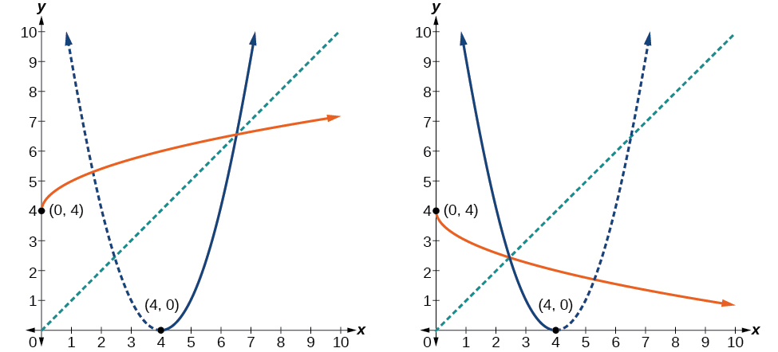{: #Figure_03_08_006}

Finding the Inverse of a Quadratic Function When the Restriction Is Not Specified

Restrict the domain and then find the inverse of

<math xmlns="http://www.w3.org/1998/Math/MathML" display="block"> <mrow> <mi>f</mi><mo stretchy="false">(</mo><mi>x</mi><mo stretchy="false">)</mo><mo>=</mo><msup> <mrow> <mo stretchy="false">(</mo><mi>x</mi><mo>−</mo><mn>2</mn><mo stretchy="false">)</mo> </mrow> <mn>2</mn> </msup> <mo>−</mo><mn>3.</mn> </mrow> </math>

We can see this is a parabola with vertex at<math xmlns="http://www.w3.org/1998/Math/MathML"> <mrow> <mtext> </mtext><mo stretchy="false">(</mo><mn>2</mn><mo>,</mo><mn>–3</mn><mo stretchy="false">)</mo><mtext> </mtext> </mrow> </math>

that opens upward. Because the graph will be decreasing on one side of the vertex and increasing on the other side, we can restrict this function to a domain on which it will be one-to-one by limiting the domain to<math xmlns="http://www.w3.org/1998/Math/MathML"> <mrow> <mtext> </mtext><mi>x</mi><mo>≥</mo><mn>2.</mn> </mrow> </math>

To find the inverse, we will use the vertex form of the quadratic. We start by replacing<math xmlns="http://www.w3.org/1998/Math/MathML"> <mrow> <mtext> </mtext><mi>f</mi><mo stretchy="false">(</mo><mi>x</mi><mo stretchy="false">)</mo><mtext> </mtext> </mrow> </math>

with a simple variable,<math xmlns="http://www.w3.org/1998/Math/MathML"> <mrow> <mtext> </mtext><mi>y</mi><mo>,</mo><mtext> </mtext> </mrow> </math>

then solve for<math xmlns="http://www.w3.org/1998/Math/MathML"> <mrow> <mtext> </mtext><mi>x</mi><mo>.</mo> </mrow> </math>

<math xmlns="http://www.w3.org/1998/Math/MathML" display="block"> <mrow> <mtable> <mtr rowalign="center"> <mtd columnalign="right" rowalign="center"> <mi>y</mi> </mtd> <mtd rowalign="center"> <mo>=</mo> </mtd> <mtd columnalign="left" rowalign="center"> <mrow> <msup> <mrow> <mo stretchy="false">(</mo><mi>x</mi><mo>−</mo><mn>2</mn><mo stretchy="false">)</mo> </mrow> <mn>2</mn> </msup> <mo>−</mo><mn>3</mn> </mrow> </mtd> <mtd columnalign="left" rowalign="center"> <mrow><mspace width="2em" /> <mtext>  </mtext><mtext>Interchange </mtext><mi>x</mi><mtext> and </mtext><mi>y</mi><mo>.</mo> </mrow> </mtd> </mtr> <mtr rowalign="center"> <mtd columnalign="right" rowalign="center"> <mi>x</mi> </mtd> <mtd rowalign="center"> <mo>=</mo> </mtd> <mtd columnalign="left" rowalign="center"> <mrow> <msup> <mrow> <mo stretchy="false">(</mo><mi>y</mi><mo>−</mo><mn>2</mn><mo stretchy="false">)</mo> </mrow> <mn>2</mn> </msup> <mo>−</mo><mn>3</mn> </mrow> </mtd> <mtd columnalign="left" rowalign="center"> <mrow><mspace width="2em" /> <mtext>  </mtext><mtext>Add 3 to both sides</mtext><mo>.</mo> </mrow> </mtd> </mtr> <mtr rowalign="center"> <mtd columnalign="right" rowalign="center"> <mrow> <mi>x</mi><mo>+</mo><mn>3</mn> </mrow> </mtd> <mtd rowalign="center"> <mo>=</mo> </mtd> <mtd columnalign="left" rowalign="center"> <mrow> <msup> <mrow> <mo stretchy="false">(</mo><mi>y</mi><mo>−</mo><mn>2</mn><mo stretchy="false">)</mo> </mrow> <mn>2</mn> </msup> </mrow> </mtd> <mtd columnalign="left" rowalign="center"> <mrow><mspace width="2em" /> <mtext>  </mtext><mtext>Take the square root</mtext><mo>.</mo> </mrow> </mtd> </mtr> <mtr rowalign="center"> <mtd columnalign="right" rowalign="center"> <mrow> <mo>±</mo><msqrt> <mrow> <mi>x</mi><mo>+</mo><mn>3</mn> </mrow> </msqrt> </mrow> </mtd> <mtd rowalign="center"> <mo>=</mo> </mtd> <mtd columnalign="left" rowalign="center"> <mrow> <mi>y</mi><mo>−</mo><mn>2</mn> </mrow> </mtd> <mtd columnalign="left" rowalign="center"> <mrow><mspace width="2em" /> <mtext>  </mtext><mtext>Add 2 to both sides</mtext><mo>.</mo> </mrow> </mtd> </mtr> <mtr rowalign="center"> <mtd columnalign="right" rowalign="center"> <mrow> <mn>2</mn><mo>±</mo><msqrt> <mrow> <mi>x</mi><mo>+</mo><mn>3</mn> </mrow> </msqrt> </mrow> </mtd> <mtd rowalign="center"> <mo>=</mo> </mtd> <mtd columnalign="left" rowalign="center"> <mi>y</mi> </mtd> <mtd columnalign="left" rowalign="center"> <mrow><mspace width="2em" /> <mtext>  </mtext><mtext>Rename the function</mtext><mo>.</mo> </mrow> </mtd> </mtr> <mtr rowalign="center"> <mtd columnalign="right" rowalign="center"> <mrow> <msup> <mi>f</mi> <mrow> <mo>−</mo><mn>1</mn> </mrow> </msup> <mo stretchy="false">(</mo><mi>x</mi><mo stretchy="false">)</mo> </mrow> </mtd> <mtd rowalign="center"> <mo>=</mo> </mtd> <mtd columnalign="left" rowalign="center"> <mrow> <mn>2</mn><mo>±</mo><msqrt> <mrow> <mi>x</mi><mo>+</mo><mn>3</mn> </mrow> </msqrt> </mrow> </mtd> <mtd rowalign="center" /> </mtr> </mtable> </mrow> </math>

Now we need to determine which case to use. Because we restricted our original function to a domain of<math xmlns="http://www.w3.org/1998/Math/MathML"> <mrow> <mtext> </mtext><mi>x</mi><mo>≥</mo><mn>2</mn><mo>,</mo><mtext> </mtext> </mrow> </math>

the outputs of the inverse should be the same, telling us to utilize the + case

<math xmlns="http://www.w3.org/1998/Math/MathML" display="block"> <mrow> <msup> <mi>f</mi> <mrow> <mo>−</mo><mn>1</mn> </mrow> </msup> <mo stretchy="false">(</mo><mi>x</mi><mo stretchy="false">)</mo><mo>=</mo><mn>2</mn><mo>+</mo><msqrt> <mrow> <mi>x</mi><mo>+</mo><mn>3</mn> </mrow> </msqrt> </mrow> </math>

If the quadratic had not been given in vertex form, rewriting it into vertex form would be the first step. This way we may easily observe the coordinates of the vertex to help us restrict the domain.

Analysis

Notice that we arbitrarily decided to restrict the domain on<math xmlns="http://www.w3.org/1998/Math/MathML"> <mrow> <mtext> </mtext><mi>x</mi><mo>≥</mo><mn>2.</mn><mtext> </mtext> </mrow> </math>

We could just have easily opted to restrict the domain on<math xmlns="http://www.w3.org/1998/Math/MathML"> <mrow> <mtext> </mtext><mi>x</mi><mo>≤</mo><mn>2</mn><mo>,</mo><mtext> </mtext> </mrow> </math>

in which case<math xmlns="http://www.w3.org/1998/Math/MathML"> <mrow> <mtext> </mtext><msup> <mi>f</mi> <mrow> <mo>−</mo><mn>1</mn> </mrow> </msup> <mo stretchy="false">(</mo><mi>x</mi><mo stretchy="false">)</mo><mo>=</mo><mn>2</mn><mo>−</mo><msqrt> <mrow> <mi>x</mi><mo>+</mo><mn>3</mn> </mrow> </msqrt> <mo>.</mo><mtext> </mtext> </mrow> </math>

Observe the original function graphed on the same set of axes as its inverse function in [[link]](#Figure_03_08_007). Notice that both graphs show symmetry about the line<math xmlns="http://www.w3.org/1998/Math/MathML"> <mrow> <mtext> </mtext><mi>y</mi><mo>=</mo><mi>x</mi><mo>.</mo><mtext> </mtext> </mrow> </math>

The coordinate pair<math xmlns="http://www.w3.org/1998/Math/MathML"> <mrow> <mtext> </mtext><mrow><mo>(</mo> <mrow> <mn>2</mn><mo>,</mo><mtext> </mtext><mo>−</mo><mn>3</mn> </mrow> <mo>)</mo></mrow><mtext> </mtext> </mrow> </math>

is on the graph of<math xmlns="http://www.w3.org/1998/Math/MathML"> <mrow> <mtext> </mtext><mi>f</mi><mtext> </mtext> </mrow> </math>

and the coordinate pair<math xmlns="http://www.w3.org/1998/Math/MathML"> <mrow> <mtext> </mtext><mrow><mo>(</mo> <mrow> <mo>−</mo><mn>3</mn><mo>,</mo><mtext> </mtext><mn>2</mn> </mrow> <mo>)</mo></mrow><mtext> </mtext> </mrow> </math>

is on the graph of<math xmlns="http://www.w3.org/1998/Math/MathML"> <mrow> <mtext> </mtext><msup> <mi>f</mi> <mrow> <mo>−</mo><mn>1</mn> </mrow> </msup> <mo>.</mo><mtext> </mtext> </mrow> </math>

Observe from the graph of both functions on the same set of axes that

<math xmlns="http://www.w3.org/1998/Math/MathML" display="block"> <mrow> <mtext>domain of </mtext><mi>f</mi><mo>=</mo><mtext>range of</mtext><mo> </mo><msup> <mi>f</mi> <mrow> <mo>–</mo><mn>1</mn> </mrow> </msup> <mo>=</mo><mrow><mo>[</mo> <mrow> <mn>2</mn><mo>,</mo><mi>∞</mi> </mrow> <mo>)</mo></mrow> </mrow> </math>

and

<math xmlns="http://www.w3.org/1998/Math/MathML" display="block"> <mrow> <mtext>domain of </mtext><msup> <mi>f</mi> <mrow> <mo>–</mo><mn>1</mn> </mrow> </msup> <mo>=</mo><mtext>range of</mtext><mo> </mo><mi>f</mi><mo>=</mo><mrow><mo>[</mo> <mrow> <mo>–</mo><mn>3</mn><mo>,</mo><mi>∞</mi> </mrow> <mo>)</mo></mrow><mo>.</mo> </mrow> </math>

Finally, observe that the graph of<math xmlns="http://www.w3.org/1998/Math/MathML"> <mrow> <mtext> </mtext><mi>f</mi><mtext> </mtext> </mrow> </math>

intersects the graph of<math xmlns="http://www.w3.org/1998/Math/MathML"> <mrow> <mtext> </mtext><msup> <mi>f</mi> <mrow> <mo>−</mo><mn>1</mn> </mrow> </msup> <mtext> </mtext> </mrow> </math>

along the line<math xmlns="http://www.w3.org/1998/Math/MathML"> <mrow> <mtext> </mtext><mi>y</mi><mo>=</mo><mi>x</mi><mo>.</mo> </mrow> </math>

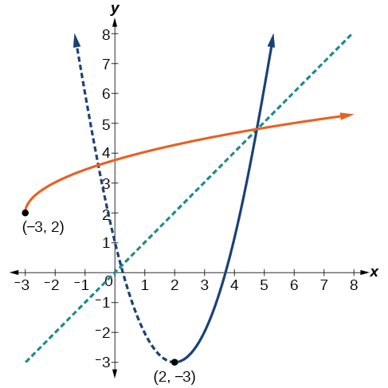{: #Figure_03_08_007}

Find the inverse of the function<math xmlns="http://www.w3.org/1998/Math/MathML"> <mrow> <mtext> </mtext><mi>f</mi><mo stretchy="false">(</mo><mi>x</mi><mo stretchy="false">)</mo><mo>=</mo><msup> <mi>x</mi> <mn>2</mn> </msup> <mo>+</mo><mn>1</mn><mo>,</mo><mtext> </mtext> </mrow> </math>

on the domain<math xmlns="http://www.w3.org/1998/Math/MathML"> <mrow> <mtext> </mtext><mi>x</mi><mo>≥</mo><mn>0.</mn> </mrow> </math>

<math xmlns="http://www.w3.org/1998/Math/MathML"> <mrow> <msup> <mi>f</mi> <mrow> <mo>−</mo><mn>1</mn> </mrow> </msup> <mo stretchy="false">(</mo><mi>x</mi><mo stretchy="false">)</mo><mo>=</mo><msqrt> <mrow> <mi>x</mi><mo>−</mo><mn>1</mn> </mrow> </msqrt> </mrow> </math>

#### Solving Applications of Radical Functions

Notice that the functions from previous examples were all polynomials, and their inverses were radical functions. If we want to find the **inverse of a radical function**{: data-type="term" .no-emphasis}, we will need to restrict the domain of the answer because the range of the original function is limited.

**Given a radical function, find the inverse.**

1.  Determine the range of the original function.
2.  Replace
    <math xmlns="http://www.w3.org/1998/Math/MathML"> <mrow> <mtext> </mtext><mi>f</mi><mrow><mo>(</mo> <mi>x</mi> <mo>)</mo></mrow><mtext> </mtext> </mrow> </math>
    
    with
    <math xmlns="http://www.w3.org/1998/Math/MathML"> <mrow> <mtext> </mtext><mi>y</mi><mo>,</mo><mtext> </mtext> </mrow> </math>
    
    then solve for
    <math xmlns="http://www.w3.org/1998/Math/MathML"> <mrow> <mtext> </mtext><mi>x</mi><mo>.</mo> </mrow> </math>

3.  If necessary, restrict the domain of the inverse function to the range of the original function.
{: data-number-style="arabic"}

Finding the Inverse of a Radical Function

Restrict the domain of the function<math xmlns="http://www.w3.org/1998/Math/MathML"> <mrow> <mtext> </mtext><mi>f</mi><mo stretchy="false">(</mo><mi>x</mi><mo stretchy="false">)</mo><mo>=</mo><msqrt> <mrow> <mi>x</mi><mo>−</mo><mn>4</mn> </mrow> </msqrt> <mtext> </mtext> </mrow> </math>

and then find the inverse.

Note that the original function has range<math xmlns="http://www.w3.org/1998/Math/MathML"> <mrow> <mtext> </mtext><mi>f</mi><mo stretchy="false">(</mo><mi>x</mi><mo stretchy="false">)</mo><mo>≥</mo><mn>0.</mn><mtext> </mtext> </mrow> </math>

Replace<math xmlns="http://www.w3.org/1998/Math/MathML"> <mrow> <mtext> </mtext><mi>f</mi><mo stretchy="false">(</mo><mi>x</mi><mo stretchy="false">)</mo><mtext> </mtext> </mrow> </math>

with<math xmlns="http://www.w3.org/1998/Math/MathML"> <mrow> <mtext> </mtext><mi>y</mi><mo>,</mo><mtext> </mtext> </mrow> </math>

then solve for<math xmlns="http://www.w3.org/1998/Math/MathML"> <mrow> <mtext> </mtext><mi>x</mi><mo>.</mo> </mrow> </math>

<math xmlns="http://www.w3.org/1998/Math/MathML" display="block"> <mrow> <mtable> <mtr rowalign="center"> <mtd rowalign="center" columnalign="right"> <mi>y</mi> </mtd> <mtd rowalign="center"> <mo>=</mo> </mtd> <mtd rowalign="center" columnalign="left"> <mrow> <msqrt> <mrow> <mi>x</mi><mo>−</mo><mn>4</mn></mrow> </msqrt> </mrow> </mtd> <mtd columnalign="left" rowalign="center"> <mrow> <mspace width="2em" /><mtext>Replace </mtext><mi>f</mi><mo stretchy="false">(</mo><mi>x</mi><mo stretchy="false">)</mo><mtext> with </mtext><mi>y</mi><mo>.</mo></mrow> </mtd> </mtr> <mtr rowalign="center"> <mtd rowalign="center" columnalign="right"> <mi>x</mi> </mtd> <mtd rowalign="center"><mo>=</mo></mtd> <mtd rowalign="center" columnalign="left"> <mrow> <msqrt> <mrow> <mi>y</mi><mo>−</mo><mn>4</mn></mrow> </msqrt> </mrow> </mtd> <mtd rowalign="center" columnalign="left"> <mrow> <mspace width="2em" /><mtext>Interchange </mtext><mi>x</mi><mtext> and </mtext><mi>y</mi><mo>.</mo></mrow> </mtd> </mtr> <mtr rowalign="center"> <mtd rowalign="center" columnalign="right"> <mi>x</mi> </mtd> <mtd rowalign="center"> <mo>=</mo> </mtd> <mtd rowalign="center" columnalign="left"> <mrow> <msqrt> <mrow> <mi>y</mi><mo>−</mo><mn>4</mn></mrow> </msqrt> </mrow> </mtd> <mtd rowalign="center" columnalign="left"> <mrow> <mspace width="2em" /><mtext>Square each side</mtext><mo>.</mo></mrow> </mtd> </mtr> <mtr rowalign="center"> <mtd rowalign="center" columnalign="right"> <mrow> <msup> <mi>x</mi> <mn>2</mn> </msup> </mrow> </mtd> <mtd rowalign="center"> <mo>=</mo> </mtd> <mtd columnalign="left" rowalign="center"> <mrow> <mi>y</mi><mo>−</mo><mn>4</mn></mrow> </mtd> <mtd rowalign="center" columnalign="left"> <mrow> <mspace width="2em" /><mtext>Add 4</mtext><mo>.</mo></mrow> </mtd> </mtr> <mtr rowalign="center"> <mtd rowalign="center" columnalign="right"> <mrow> <msup> <mi>x</mi> <mn>2</mn> </msup> <mo>+</mo><mn>4</mn></mrow> </mtd> <mtd rowalign="center"> <mo>=</mo> </mtd> <mtd rowalign="center" columnalign="left"> <mi>y</mi> </mtd> <mtd columnalign="left" rowalign="center"> <mrow> <mspace width="2em" /><mtext>Rename the function </mtext><msup> <mi>f</mi> <mrow> <mo>−</mo><mn>1</mn></mrow> </msup> <mo stretchy="false">(</mo><mi>x</mi><mo stretchy="false">)</mo><mo>.</mo></mrow> </mtd> </mtr> <mtr rowalign="center"> <mtd rowalign="center" columnalign="right"> <mrow> <msup> <mi>f</mi> <mrow> <mo>−</mo><mn>1</mn></mrow> </msup> <mo stretchy="false">(</mo><mi>x</mi><mo stretchy="false">)</mo></mrow> </mtd> <mtd rowalign="center"> <mo>=</mo> </mtd> <mtd rowalign="center" columnalign="left"> <mrow> <msup> <mi>x</mi> <mn>2</mn> </msup> <mo>+</mo><mn>4</mn></mrow> </mtd> <mtd rowalign="center" /> </mtr> </mtable></mrow> </math>

Recall that the domain of this function must be limited to the range of the original function.

<math xmlns="http://www.w3.org/1998/Math/MathML" display="block"> <mrow> <msup> <mi>f</mi> <mrow> <mo>−</mo><mn>1</mn> </mrow> </msup> <mo stretchy="false">(</mo><mi>x</mi><mo stretchy="false">)</mo><mo>=</mo><msup> <mi>x</mi> <mn>2</mn> </msup> <mo>+</mo><mn>4</mn><mo>,</mo><mi>x</mi><mo>≥</mo><mn>0</mn> </mrow> </math>

Analysis

Notice in [[link]](#Figure_03_08_008) that the inverse is a reflection of the original function over the line<math xmlns="http://www.w3.org/1998/Math/MathML"> <mrow> <mtext> </mtext><mi>y</mi><mo>=</mo><mi>x</mi><mo>.</mo><mtext> </mtext> </mrow> </math>

Because the original function has only positive outputs, the inverse function has only positive inputs.

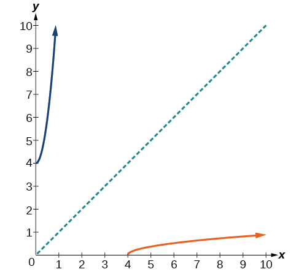{: #Figure_03_08_008}

Restrict the domain and then find the inverse of the function<math xmlns="http://www.w3.org/1998/Math/MathML"> <mrow> <mtext> </mtext><mi>f</mi><mo stretchy="false">(</mo><mi>x</mi><mo stretchy="false">)</mo><mo>=</mo><msqrt> <mrow> <mn>2</mn><mi>x</mi><mo>+</mo><mn>3</mn> </mrow> </msqrt> <mo>.</mo> </mrow> </math>

<math xmlns="http://www.w3.org/1998/Math/MathML"> <mrow> <msup> <mi>f</mi> <mrow> <mo>−</mo><mn>1</mn> </mrow> </msup> <mo stretchy="false">(</mo><mi>x</mi><mo stretchy="false">)</mo><mo>=</mo><mfrac> <mrow> <msup> <mi>x</mi> <mn>2</mn> </msup> <mo>−</mo><mn>3</mn> </mrow> <mn>2</mn> </mfrac> <mo>,</mo><mi>x</mi><mo>≥</mo><mn>0</mn> </mrow> </math>

#### Solving Applications of Radical Functions

Radical functions are common in physical models, as we saw in the section opener. We now have enough tools to be able to solve the problem posed at the start of the section.

Solving an Application with a Cubic Function

A mound of gravel is in the shape of a cone with the height equal to twice the radius. The volume of the cone in terms of the radius is given by

<math xmlns="http://www.w3.org/1998/Math/MathML" display="block"> <mrow> <mi>V</mi><mo>=</mo><mfrac> <mn>2</mn> <mn>3</mn> </mfrac> <mi>π</mi><msup> <mi>r</mi> <mn>3</mn> </msup> </mrow> </math>

Find the inverse of the function<math xmlns="http://www.w3.org/1998/Math/MathML"> <mrow> <mtext> </mtext><mi>V</mi><mo>=</mo><mfrac> <mn>2</mn> <mn>3</mn> </mfrac> <mi>π</mi><msup> <mi>r</mi> <mn>3</mn> </msup> <mtext> </mtext> </mrow> </math>

that determines the volume<math xmlns="http://www.w3.org/1998/Math/MathML"> <mrow> <mtext> </mtext><mi>V</mi><mtext> </mtext> </mrow> </math>

of a cone and is a function of the radius<math xmlns="http://www.w3.org/1998/Math/MathML"> <mrow> <mtext> </mtext><mi>r</mi><mo>.</mo><mtext> </mtext> </mrow> </math>

Then use the inverse function to calculate the radius of such a mound of gravel measuring 100 cubic feet. Use<math xmlns="http://www.w3.org/1998/Math/MathML"> <mrow> <mtext> </mtext><mi>π</mi><mo>=</mo><mn>3.14.</mn> </mrow> </math>

Start with the given function for<math xmlns="http://www.w3.org/1998/Math/MathML"> <mrow> <mtext> </mtext><mi>V</mi><mo>.</mo><mtext> </mtext> </mrow> </math>

Notice that the meaningful domain for the function is<math xmlns="http://www.w3.org/1998/Math/MathML"> <mrow> <mtext> </mtext><mi>r</mi><mo>&gt;</mo><mn>0</mn><mtext> </mtext> </mrow> </math>

since negative radii would not make sense in this context nor would a radius of 0. Also note the range of the function (hence, the domain of the inverse function) is<math xmlns="http://www.w3.org/1998/Math/MathML"> <mrow> <mtext> </mtext><mi>V</mi><mo>&gt;</mo><mn>0.</mn><mtext> </mtext> </mrow> </math>

Solve for<math xmlns="http://www.w3.org/1998/Math/MathML"> <mrow> <mtext> </mtext><mi>r</mi><mtext> </mtext> </mrow> </math>

in terms of<math xmlns="http://www.w3.org/1998/Math/MathML"> <mrow> <mtext> </mtext><mi>V</mi><mo>,</mo><mtext> </mtext> </mrow> </math>

using the method outlined previously. Note that in real-world applications, we do not swap the variables when finding inverses. Instead, we change which variable is considered to be the independent variable.

<math xmlns="http://www.w3.org/1998/Math/MathML" display="block"> <mrow> <mtable> <mtr rowalign="center"> <mtd rowalign="center" columnalign="right"><mi>V</mi></mtd> <mtd rowalign="center"><mo>=</mo></mtd> <mtd rowalign="center" columnalign="left"><mrow><mfrac><mn>2</mn><mn>3</mn></mfrac><mi>π</mi><msup><mi>r</mi><mn>3</mn></msup></mrow></mtd> <mtd rowalign="center" /> </mtr> <mtr rowalign="center"> <mtd rowalign="center" columnalign="right"> <mrow> <msup> <mi>r</mi> <mn>3</mn> </msup> </mrow> </mtd> <mtd rowalign="center"> <mo>=</mo> </mtd> <mtd rowalign="center" columnalign="left"> <mrow> <mfrac> <mrow> <mn>3</mn><mi>V</mi></mrow> <mrow> <mn>2</mn><mi>π</mi></mrow> </mfrac> </mrow> </mtd> <mtd columnalign="left" rowalign="center"> <mrow> <mspace width="2em" /><mtext>Solve for </mtext><msup> <mi>r</mi> <mn>3</mn> </msup> <mo>.</mo></mrow> </mtd> </mtr> <mtr rowalign="center"> <mtd rowalign="center" columnalign="right"> <mi>r</mi> </mtd> <mtd rowalign="center"> <mo>=</mo> </mtd> <mtd rowalign="center" columnalign="left"> <mrow> <mroot> <mrow> <mfrac> <mrow> <mn>3</mn><mi>V</mi></mrow> <mrow> <mn>2</mn><mi>π</mi></mrow> </mfrac> </mrow> <mn>3</mn> </mroot> </mrow> </mtd> <mtd rowalign="center" columnalign="left"> <mrow> <mspace width="2em" /><mtext>Solve for </mtext><mi>r</mi><mo>.</mo></mrow> </mtd> </mtr> </mtable></mrow> </math>

This is the result stated in the section opener. Now evaluate this for<math xmlns="http://www.w3.org/1998/Math/MathML"> <mrow> <mtext> </mtext><mi>V</mi><mo>=</mo><mn>100</mn><mtext> </mtext> </mrow> </math>

and<math xmlns="http://www.w3.org/1998/Math/MathML"> <mrow> <mtext> </mtext><mi>π</mi><mo>=</mo><mn>3.14.</mn> </mrow> </math>

<math xmlns="http://www.w3.org/1998/Math/MathML" display="block"> <mrow> <mtable> <mtr rowalign="center"> <mtd rowalign="center" columnalign="right"> <mi>r</mi> </mtd> <mtd rowalign="center"> <mo>=</mo> </mtd> <mtd rowalign="center" columnalign="left"> <mrow> <mroot> <mrow> <mfrac> <mrow> <mn>3</mn><mi>V</mi></mrow> <mrow> <mn>2</mn><mi>π</mi></mrow> </mfrac> </mrow> <mn>3</mn> </mroot> </mrow> </mtd> </mtr> <mtr rowalign="center"> <mtd rowalign="center" /> <mtd rowalign="center"><mo>=</mo></mtd> <mtd rowalign="center" columnalign="left"> <mrow> <mroot> <mrow> <mfrac> <mrow> <mn>3</mn><mo>⋅</mo><mn>100</mn></mrow> <mrow> <mn>2</mn><mo>⋅</mo><mn>3.14</mn></mrow> </mfrac> </mrow> <mn>3</mn> </mroot> </mrow> </mtd> </mtr> <mtr rowalign="center"> <mtd rowalign="center" /> <mtd rowalign="center"> <mo>≈</mo> </mtd> <mtd rowalign="center" columnalign="left"> <mrow> <mroot> <mrow> <mn>47.7707</mn></mrow> <mn>3</mn> </mroot> </mrow> </mtd> </mtr> <mtr rowalign="center"> <mtd rowalign="center" /> <mtd rowalign="center" columnalign="left"> <mo>≈</mo> </mtd> <mtd rowalign="center" columnalign="left"> <mrow> <mn>3.63</mn></mrow> </mtd> </mtr> </mtable></mrow> </math>

Therefore, the radius is about 3.63 ft.

#### Determining the Domain of a Radical Function Composed with Other Functions

When radical functions are composed with other functions, determining domain can become more complicated.

Finding the Domain of a Radical Function Composed with a Rational Function

Find the domain of the function<math xmlns="http://www.w3.org/1998/Math/MathML"> <mrow> <mtext> </mtext><mi>f</mi><mo stretchy="false">(</mo><mi>x</mi><mo stretchy="false">)</mo><mo>=</mo><msqrt> <mrow> <mfrac> <mrow> <mo stretchy="false">(</mo><mi>x</mi><mo>+</mo><mn>2</mn><mo stretchy="false">)</mo><mo stretchy="false">(</mo><mi>x</mi><mo>−</mo><mn>3</mn><mo stretchy="false">)</mo> </mrow> <mrow> <mo stretchy="false">(</mo><mi>x</mi><mo>−</mo><mn>1</mn><mo stretchy="false">)</mo> </mrow> </mfrac> </mrow> </msqrt> <mo>.</mo> </mrow> </math>

Because a square root is only defined when the quantity under the radical is non-negative, we need to determine where<math xmlns="http://www.w3.org/1998/Math/MathML"> <mrow> <mtext> </mtext><mfrac> <mrow> <mo stretchy="false">(</mo><mi>x</mi><mo>+</mo><mn>2</mn><mo stretchy="false">)</mo><mo stretchy="false">(</mo><mi>x</mi><mo>−</mo><mn>3</mn><mo stretchy="false">)</mo> </mrow> <mrow> <mo stretchy="false">(</mo><mi>x</mi><mo>−</mo><mn>1</mn><mo stretchy="false">)</mo> </mrow> </mfrac> <mo>≥</mo><mn>0.</mn><mtext> </mtext> </mrow> </math>

The output of a rational function can change signs (change from positive to negative or vice versa) at *x*-intercepts and at vertical asymptotes. For this equation, the graph could change signs at<math xmlns="http://www.w3.org/1998/Math/MathML"> <mrow> <mtext> </mtext><mi>x</mi><mo>=</mo><mo>–</mo><mn>2</mn><mo>,</mo><mo> </mo><mn>1</mn><mo>,</mo><mo> </mo><mtext>and</mtext><mo> </mo><mn>3.</mn> </mrow> </math>

To determine the intervals on which the rational expression is positive, we could test some values in the expression or sketch a graph. While both approaches work equally well, for this example we will use a graph as shown in [[link]](#Figure_03_08_009).

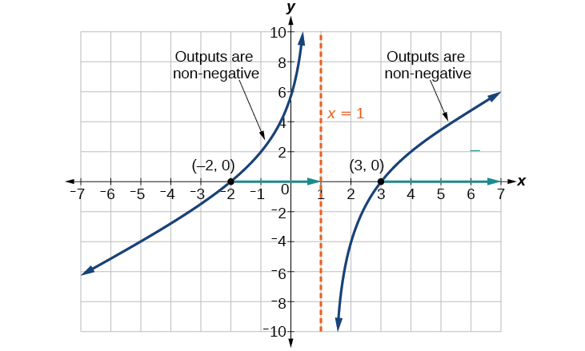{: #Figure_03_08_009}

This function has two *x*-intercepts, both of which exhibit linear behavior near the *x*-intercepts. There is one vertical asymptote, corresponding to a linear factor; this behavior is similar to the basic reciprocal toolkit function, and there is no horizontal asymptote because the degree of the numerator is larger than the degree of the denominator. There is a *y*-intercept at<math xmlns="http://www.w3.org/1998/Math/MathML"> <mrow> <mtext> </mtext><mo stretchy="false">(</mo><mn>0</mn><mo>,</mo><msqrt><mn>6</mn></msqrt><mo stretchy="false">)</mo><mo>.</mo> </mrow> </math>

From the *y*-intercept and *x*-intercept at<math xmlns="http://www.w3.org/1998/Math/MathML"> <mrow> <mtext> </mtext><mi>x</mi><mo>=</mo><mn>−2</mn><mo>,</mo><mtext> </mtext> </mrow> </math>

we can sketch the left side of the graph. From the behavior at the asymptote, we can sketch the right side of the graph.

From the graph, we can now tell on which intervals the outputs will be non-negative, so that we can be sure that the original function<math xmlns="http://www.w3.org/1998/Math/MathML"> <mrow> <mtext> </mtext><mi>f</mi><mrow><mo>(</mo> <mi>x</mi> <mo>)</mo></mrow><mtext> </mtext> </mrow> </math>

will be defined.<math xmlns="http://www.w3.org/1998/Math/MathML"> <mrow> <mtext> </mtext><mi>f</mi><mrow><mo>(</mo> <mi>x</mi> <mo>)</mo></mrow><mtext> </mtext> </mrow> </math>

has domain<math xmlns="http://www.w3.org/1998/Math/MathML"> <mrow> <mtext> </mtext><mn>−2</mn><mo>≤</mo><mi>x</mi><mo>&lt;</mo><mn>1</mn><mtext> </mtext><mtext>or</mtext><mtext> </mtext><mi>x</mi><mo>≥</mo><mn>3</mn><mo>,</mo><mtext> </mtext> </mrow> </math>

or in interval notation,<math xmlns="http://www.w3.org/1998/Math/MathML"> <mrow> <mtext> </mtext><mo stretchy="false">[</mo><mn>−2</mn><mo>,</mo><mn>1</mn><mo stretchy="false">)</mo><mo>∪</mo><mo stretchy="false">[</mo><mn>3</mn><mo>,</mo><mi>∞</mi><mo stretchy="false">)</mo><mo>.</mo> </mrow> </math>

#### Finding Inverses of Rational Functions

As with finding inverses of quadratic functions, it is sometimes desirable to find the **inverse of a rational function**{: data-type="term" .no-emphasis}, particularly of rational functions that are the ratio of linear functions, such as in concentration applications.

Finding the Inverse of a Rational Function

The function<math xmlns="http://www.w3.org/1998/Math/MathML"> <mrow> <mtext> </mtext><mi>C</mi><mo>=</mo><mfrac> <mrow> <mn>20</mn><mo>+</mo><mn>0.4</mn><mi>n</mi> </mrow> <mrow> <mn>100</mn><mo>+</mo><mi>n</mi> </mrow> </mfrac> <mtext> </mtext> </mrow> </math>

represents the concentration<math xmlns="http://www.w3.org/1998/Math/MathML"> <mrow> <mtext> </mtext><mi>C</mi><mtext> </mtext> </mrow> </math>

of an acid solution after<math xmlns="http://www.w3.org/1998/Math/MathML"> <mrow> <mtext> </mtext><mi>n</mi><mtext> </mtext> </mrow> </math>

mL of 40% solution has been added to 100 mL of a 20% solution. First, find the inverse of the function; that is, find an expression for<math xmlns="http://www.w3.org/1998/Math/MathML"> <mrow> <mtext> </mtext><mi>n</mi><mtext> </mtext> </mrow> </math>

in terms of<math xmlns="http://www.w3.org/1998/Math/MathML"> <mrow> <mtext> </mtext><mi>C</mi><mo>.</mo><mtext> </mtext> </mrow> </math>

Then use your result to determine how much of the 40% solution should be added so that the final mixture is a 35% solution.

We first want the inverse of the function in order to determine how many mL we need for a given concentration. We will solve for<math xmlns="http://www.w3.org/1998/Math/MathML"> <mrow> <mtext> </mtext><mi>n</mi><mtext> </mtext> </mrow> </math>

in terms of<math xmlns="http://www.w3.org/1998/Math/MathML"> <mrow> <mtext> </mtext><mi>C</mi><mo>.</mo> </mrow> </math>

<math xmlns="http://www.w3.org/1998/Math/MathML" display="block"> <mrow> <mtable> <mtr> <mtd columnalign="right"> <mi>C</mi> </mtd> <mtd> <mo>=</mo> </mtd> <mtd columnalign="left"> <mrow> <mfrac> <mrow> <mn>20</mn><mo>+</mo><mn>0.4</mn><mi>n</mi></mrow> <mrow> <mn>100</mn><mo>+</mo><mi>n</mi></mrow> </mfrac> </mrow> </mtd> </mtr> <mtr> <mtd columnalign="right"> <mrow> <mi>C</mi><mo stretchy="false">(</mo><mn>100</mn><mo>+</mo><mi>n</mi><mo stretchy="false">)</mo></mrow> </mtd> <mtd> <mo>=</mo> </mtd> <mtd columnalign="left"> <mrow> <mn>20</mn><mo>+</mo><mn>0.4</mn><mi>n</mi></mrow> </mtd> </mtr> <mtr> <mtd columnalign="right"> <mrow> <mn>100</mn><mi>C</mi><mo>+</mo><mi>C</mi><mi>n</mi></mrow> </mtd> <mtd> <mo>=</mo> </mtd> <mtd columnalign="left"> <mrow> <mn>20</mn><mo>+</mo><mn>0.4</mn><mi>n</mi></mrow> </mtd> </mtr> <mtr> <mtd columnalign="right"> <mrow> <mn>100</mn><mi>C</mi><mo>−</mo><mn>20</mn></mrow> </mtd> <mtd> <mo>=</mo> </mtd> <mtd columnalign="left"> <mrow> <mn>0.4</mn><mi>n</mi><mo>−</mo><mi>C</mi><mi>n</mi></mrow> </mtd> </mtr> <mtr> <mtd columnalign="right"> <mrow> <mn>100</mn><mi>C</mi><mo>−</mo><mn>20</mn></mrow> </mtd> <mtd> <mo>=</mo> </mtd> <mtd columnalign="left"> <mrow> <mo stretchy="false">(</mo><mn>0.4</mn><mi>n</mi><mo>−</mo><mi>C</mi><mo stretchy="false">)</mo><mi>n</mi></mrow> </mtd> </mtr> <mtr> <mtd columnalign="right"> <mi>n</mi> </mtd> <mtd> <mo>=</mo> </mtd> <mtd columnalign="left"> <mrow> <mfrac> <mrow> <mn>100</mn><mi>C</mi><mo>−</mo><mn>20</mn></mrow> <mrow> <mn>0.4</mn><mo>−</mo><mi>C</mi></mrow> </mfrac> </mrow> </mtd> </mtr> </mtable></mrow> </math>

Now evaluate this function at 35%, which is<math xmlns="http://www.w3.org/1998/Math/MathML"> <mrow> <mtext> </mtext><mi>C</mi><mo>=</mo><mn>0.35.</mn> </mrow> </math>

<math xmlns="http://www.w3.org/1998/Math/MathML" display="block"> <mrow> <mtable> <mtr rowalign="center"> <mtd rowalign="center" columnalign="right"> <mi>n</mi> </mtd> <mtd rowalign="center"> <mo>=</mo> </mtd> <mtd rowalign="center" columnalign="left"> <mrow> <mfrac> <mrow> <mn>100</mn><mo stretchy="false">(</mo><mn>0.35</mn><mo stretchy="false">)</mo><mo>−</mo><mn>20</mn></mrow> <mrow> <mn>0.4</mn><mo>−</mo><mn>0.35</mn></mrow> </mfrac> </mrow> </mtd> </mtr> <mtr rowalign="center"> <mtd rowalign="center" /> <mtd rowalign="center"><mo>=</mo></mtd> <mtd rowalign="center" columnalign="left"> <mrow> <mfrac> <mrow> <mn>15</mn></mrow> <mrow> <mn>0.05</mn></mrow> </mfrac> </mrow> </mtd> </mtr> <mtr rowalign="center"> <mtd rowalign="center" /> <mtd rowalign="center"><mo>=</mo></mtd> <mtd rowalign="center" columnalign="left"><mrow><mn>300</mn></mrow></mtd> </mtr> </mtable></mrow> </math>

We can conclude that 300 mL of the 40% solution should be added.

Find the inverse of the function<math xmlns="http://www.w3.org/1998/Math/MathML"> <mrow> <mtext> </mtext><mi>f</mi><mo stretchy="false">(</mo><mi>x</mi><mo stretchy="false">)</mo><mo>=</mo><mfrac> <mrow> <mi>x</mi><mo>+</mo><mn>3</mn> </mrow> <mrow> <mi>x</mi><mo>−</mo><mn>2</mn> </mrow> </mfrac> <mo>.</mo> </mrow> </math>

<math xmlns="http://www.w3.org/1998/Math/MathML"> <mrow> <msup> <mi>f</mi> <mrow> <mo>−</mo><mn>1</mn> </mrow> </msup> <mo stretchy="false">(</mo><mi>x</mi><mo stretchy="false">)</mo><mo>=</mo><mfrac> <mrow> <mn>2</mn><mi>x</mi><mo>+</mo><mn>3</mn> </mrow> <mrow> <mi>x</mi><mo>−</mo><mn>1</mn> </mrow> </mfrac> </mrow> </math>

Access these online resources for additional instruction and practice with inverses and radical functions.

* [Graphing the Basic Square Root Function][1]
* [Find the Inverse of a Square Root Function][2]
* [Find the Inverse of a Rational Function][3]
* [Find the Inverse of a Rational Function and an Inverse Function Value][4]
* [Inverse Functions][5]

### Key Concepts

* The inverse of a quadratic function is a square root function.
* If
  <math xmlns="http://www.w3.org/1998/Math/MathML"> <mrow> <mtext> </mtext><msup> <mi>f</mi> <mrow> <mo>−</mo><mn>1</mn> </mrow> </msup> <mtext> </mtext> </mrow> </math>
  
  is the inverse of a function
  <math xmlns="http://www.w3.org/1998/Math/MathML"> <mrow> <mtext> </mtext><mi>f</mi><mo>,</mo><mtext> </mtext> </mrow> </math>
  
  then
  <math xmlns="http://www.w3.org/1998/Math/MathML"> <mrow> <mtext> </mtext><mi>f</mi><mtext> </mtext> </mrow> </math>
  
  is the inverse of the function
  <math xmlns="http://www.w3.org/1998/Math/MathML"> <mrow> <mtext> </mtext><msup> <mi>f</mi> <mrow> <mo>−</mo><mn>1</mn> </mrow> </msup> <mo>.</mo><mtext> </mtext> </mrow> </math>
  
  See [\[link\]](#Example_03_08_01).
* While it is not possible to find an inverse of most polynomial functions, some basic polynomials are invertible. See [\[link\]](#Example_03_08_02).
* To find the inverse of certain functions, we must restrict the function to a domain on which it will be one-to-one. See [\[link\]](#Example_03_08_03) and [\[link\]](#Example_03_08_04).
* When finding the inverse of a radical function, we need a restriction on the domain of the answer. See [\[link\]](#Example_03_08_05) and [\[link\]](#Example_03_08_07).
* Inverse and radical and functions can be used to solve application problems. See [\[link\]](#Example_03_08_06) and [\[link\]](#Example_03_08_08).

### Section Exercises

#### Verbal

Explain why we cannot find inverse functions for all polynomial functions.

It can be too difficult or impossible to solve for<math xmlns="http://www.w3.org/1998/Math/MathML"> <mrow> <mtext> </mtext><mi>x</mi><mtext> </mtext> </mrow> </math>

in terms of<math xmlns="http://www.w3.org/1998/Math/MathML"> <mrow> <mtext> </mtext><mi>y</mi><mo>.</mo> </mrow> </math>

Why must we restrict the domain of a quadratic function when finding its inverse?

When finding the inverse of a radical function, what restriction will we need to make?

We will need a restriction on the domain of the answer.

The inverse of a quadratic function will always take what form?

#### Algebraic

For the following exercises, find the inverse of the function on the given domain.

<math xmlns="http://www.w3.org/1998/Math/MathML"> <mrow> <mi>f</mi><mrow><mo>(</mo> <mi>x</mi> <mo>)</mo></mrow><mo>=</mo><msup> <mrow> <mrow><mo>(</mo> <mrow> <mi>x</mi><mo>−</mo><mn>4</mn> </mrow> <mo>)</mo></mrow> </mrow> <mn>2</mn> </msup> <mo>,</mo><mo> </mo><mo stretchy="false">[</mo><mn>4</mn><mo>,</mo><mi>∞</mi><mo stretchy="false">)</mo> </mrow> </math>

<math xmlns="http://www.w3.org/1998/Math/MathML"> <mrow> <mtext> </mtext><mtext> </mtext><msup> <mi>f</mi> <mrow> <mo>−</mo><mn>1</mn> </mrow> </msup> <mo stretchy="false">(</mo><mi>x</mi><mo stretchy="false">)</mo><mo>=</mo><msqrt> <mi>x</mi> </msqrt> <mo>+</mo><mn>4</mn> </mrow> </math>

<math xmlns="http://www.w3.org/1998/Math/MathML"> <mrow> <mi>f</mi><mrow><mo>(</mo> <mi>x</mi> <mo>)</mo></mrow><mo>=</mo><msup> <mrow> <mrow><mo>(</mo> <mrow> <mi>x</mi><mo>+</mo><mn>2</mn> </mrow> <mo>)</mo></mrow> </mrow> <mn>2</mn> </msup> <mo>,</mo><mo> </mo><mo stretchy="false">[</mo><mn>−2</mn><mo>,</mo><mi>∞</mi><mo stretchy="false">)</mo> </mrow> </math>

<math xmlns="http://www.w3.org/1998/Math/MathML"> <mrow> <mi>f</mi><mo stretchy="false">(</mo><mi>x</mi><mo stretchy="false">)</mo><mo>=</mo><msup> <mrow> <mrow><mo>(</mo> <mrow> <mi>x</mi><mo>+</mo><mn>1</mn> </mrow> <mo>)</mo></mrow> </mrow> <mn>2</mn> </msup> <mo>−</mo><mn>3</mn><mo>,</mo><mo> </mo><mo stretchy="false">[</mo><mn>−1</mn><mo>,</mo><mi>∞</mi><mo stretchy="false">)</mo> </mrow> </math>

<math xmlns="http://www.w3.org/1998/Math/MathML"> <mrow> <mtext> </mtext><mtext> </mtext><msup> <mi>f</mi> <mrow> <mo>−</mo><mn>1</mn> </mrow> </msup> <mo stretchy="false">(</mo><mi>x</mi><mo stretchy="false">)</mo><mo>=</mo><msqrt> <mrow> <mi>x</mi><mo>+</mo><mn>3</mn> </mrow> </msqrt> <mo>−</mo><mn>1</mn> </mrow> </math>

<math xmlns="http://www.w3.org/1998/Math/MathML"> <mrow> <mi>f</mi><mo stretchy="false">(</mo><mi>x</mi><mo stretchy="false">)</mo><mo>=</mo><mn>3</mn><msup> <mi>x</mi> <mn>2</mn> </msup> <mo>+</mo><mn>5</mn><mo>,</mo><mtext> </mtext><mtext> </mtext><mrow><mo>(</mo> <mrow> <mi>∞</mi><mo>,</mo><mn>0</mn> </mrow> <mo>]</mo></mrow> </mrow> </math>

<math xmlns="http://www.w3.org/1998/Math/MathML"> <mrow> <msup> <mi>f</mi> <mrow> <mo>−</mo><mn>1</mn> </mrow> </msup> <mo stretchy="false">(</mo><mi>x</mi><mo stretchy="false">)</mo><mo>=</mo><mo>−</mo><msqrt> <mrow> <mfrac> <mrow> <mi>x</mi><mo>−</mo><mn>5</mn> </mrow> <mn>3</mn> </mfrac> </mrow> </msqrt> </mrow> </math>

<math xmlns="http://www.w3.org/1998/Math/MathML"> <mrow> <mi>f</mi><mrow><mo>(</mo> <mi>x</mi> <mo>)</mo></mrow><mo>=</mo><mn>12</mn><mo>−</mo><msup> <mi>x</mi> <mn>2</mn> </msup> <mo>,</mo><mo> </mo><mo stretchy="false">[</mo><mn>0</mn><mo>,</mo><mi>∞</mi><mo stretchy="false">)</mo> </mrow> </math>

<math xmlns="http://www.w3.org/1998/Math/MathML"> <mrow> <mi>f</mi><mrow><mo>(</mo> <mi>x</mi> <mo>)</mo></mrow><mo>=</mo><mn>9</mn><mo>−</mo><msup> <mi>x</mi> <mn>2</mn> </msup> <mo>,</mo><mo> </mo><mo stretchy="false">[</mo><mn>0</mn><mo>,</mo><mi>∞</mi><mo stretchy="false">)</mo> </mrow> </math>

<math xmlns="http://www.w3.org/1998/Math/MathML"> <mrow> <mi>f</mi><mo stretchy="false">(</mo><mi>x</mi><mo stretchy="false">)</mo><mo>=</mo><msqrt> <mrow> <mn>9</mn><mo>−</mo><mi>x</mi> </mrow> </msqrt> </mrow> </math>

<math xmlns="http://www.w3.org/1998/Math/MathML"> <mrow> <mi>f</mi><mo stretchy="false">(</mo><mi>x</mi><mo stretchy="false">)</mo><mo>=</mo><mn>2</mn><msup> <mi>x</mi> <mn>2</mn> </msup> <mo>+</mo><mn>4</mn><mo>,</mo><mo> </mo><mo stretchy="false">[</mo><mn>0</mn><mo>,</mo><mi>∞</mi><mo stretchy="false">)</mo> </mrow> </math>

For the following exercises, find the inverse of the functions.

<math xmlns="http://www.w3.org/1998/Math/MathML"> <mrow> <mi>f</mi><mo stretchy="false">(</mo><mi>x</mi><mo stretchy="false">)</mo><mo>=</mo><msup> <mi>x</mi> <mn>3</mn> </msup> <mo>+</mo><mn>5</mn> </mrow> </math>

<math xmlns="http://www.w3.org/1998/Math/MathML"> <mrow> <mtext> </mtext><mtext> </mtext><msup> <mi>f</mi> <mrow> <mn>−1</mn> </mrow> </msup> <mo stretchy="false">(</mo><mi>x</mi><mo stretchy="false">)</mo><mo>=</mo><mroot> <mrow> <mi>x</mi><mo>−</mo><mn>5</mn> </mrow> <mn>3</mn> </mroot> </mrow> </math>

<math xmlns="http://www.w3.org/1998/Math/MathML"> <mrow> <mi>f</mi><mrow><mo>(</mo> <mi>x</mi> <mo>)</mo></mrow><mo>=</mo><mn>3</mn><msup> <mi>x</mi> <mn>3</mn> </msup> <mo>+</mo><mn>1</mn> </mrow> </math>

<math xmlns="http://www.w3.org/1998/Math/MathML"> <mrow> <mi>f</mi><mo stretchy="false">(</mo><mi>x</mi><mo stretchy="false">)</mo><mo>=</mo><mn>4</mn><mo>−</mo><msup> <mi>x</mi> <mn>3</mn> </msup> </mrow> </math>

<math xmlns="http://www.w3.org/1998/Math/MathML"> <mrow> <mtext> </mtext><msup> <mi>f</mi> <mrow> <mo>−</mo><mn>1</mn> </mrow> </msup> <mo stretchy="false">(</mo><mi>x</mi><mo stretchy="false">)</mo><mo>=</mo><mroot> <mrow> <mn>4</mn><mo>−</mo><mi>x</mi> </mrow> <mn>3</mn> </mroot> </mrow> </math>

<math xmlns="http://www.w3.org/1998/Math/MathML"> <mrow> <mi>f</mi><mrow><mo>(</mo> <mi>x</mi> <mo>)</mo></mrow><mo>=</mo><mn>4</mn><mo>−</mo><mn>2</mn><msup> <mi>x</mi> <mn>3</mn> </msup> </mrow> </math>

For the following exercises, find the inverse of the functions.

<math xmlns="http://www.w3.org/1998/Math/MathML"> <mrow> <mi>f</mi><mo stretchy="false">(</mo><mi>x</mi><mo stretchy="false">)</mo><mo>=</mo><msqrt> <mrow> <mn>2</mn><mi>x</mi><mo>+</mo><mn>1</mn> </mrow> </msqrt> </mrow> </math>

<math xmlns="http://www.w3.org/1998/Math/MathML"> <mrow> <msup> <mi>f</mi> <mrow> <mn>−1</mn> </mrow> </msup> <mo stretchy="false">(</mo><mi>x</mi><mo stretchy="false">)</mo><mo>=</mo><mfrac> <mrow> <msup> <mi>x</mi> <mn>2</mn> </msup> <mo>−</mo><mn>1</mn> </mrow> <mn>2</mn> </mfrac> <mo>,</mo><mtext> </mtext><mtext> </mtext><mrow><mo>[</mo> <mrow> <mn>0</mn><mo>,</mo><mi>∞</mi> </mrow> <mo>)</mo></mrow> </mrow> </math>

<math xmlns="http://www.w3.org/1998/Math/MathML"> <mrow> <mi>f</mi><mo stretchy="false">(</mo><mi>x</mi><mo stretchy="false">)</mo><mo>=</mo><msqrt> <mrow> <mn>3</mn><mo>−</mo><mn>4</mn><mi>x</mi> </mrow> </msqrt> </mrow> </math>

<math xmlns="http://www.w3.org/1998/Math/MathML"> <mrow> <mi>f</mi><mrow><mo>(</mo> <mi>x</mi> <mo>)</mo></mrow><mo>=</mo><mn>9</mn><mo>+</mo><msqrt> <mrow> <mn>4</mn><mi>x</mi><mo>−</mo><mn>4</mn> </mrow> </msqrt> </mrow> </math>

<math xmlns="http://www.w3.org/1998/Math/MathML"> <mrow> <mtext> </mtext><msup> <mi>f</mi> <mrow> <mn>−1</mn> </mrow> </msup> <mo stretchy="false">(</mo><mi>x</mi><mo stretchy="false">)</mo><mo>=</mo><mfrac> <mrow> <msup> <mrow> <mrow><mo>(</mo> <mrow> <mi>x</mi><mo>−</mo><mn>9</mn> </mrow> <mo>)</mo></mrow> </mrow> <mn>2</mn> </msup> <mo>+</mo><mn>4</mn> </mrow> <mn>4</mn> </mfrac> <mo>,</mo><mtext> </mtext><mtext> </mtext><mrow><mo>[</mo> <mrow> <mn>9</mn><mo>,</mo><mi>∞</mi> </mrow> <mo>)</mo></mrow> </mrow> </math>

<math xmlns="http://www.w3.org/1998/Math/MathML"> <mrow> <mi>f</mi><mrow><mo>(</mo> <mi>x</mi> <mo>)</mo></mrow><mo>=</mo><msqrt> <mrow> <mn>6</mn><mi>x</mi><mo>−</mo><mn>8</mn> </mrow> </msqrt> <mo>+</mo><mn>5</mn> </mrow> </math>

<math xmlns="http://www.w3.org/1998/Math/MathML"> <mrow> <mi>f</mi><mrow><mo>(</mo> <mi>x</mi> <mo>)</mo></mrow><mo>=</mo><mn>9</mn><mo>+</mo><mn>2</mn><mroot> <mi>x</mi> <mn>3</mn> </mroot> </mrow> </math>

<math xmlns="http://www.w3.org/1998/Math/MathML"> <mrow> <msup> <mi>f</mi> <mrow> <mn>−1</mn> </mrow> </msup> <mo stretchy="false">(</mo><mi>x</mi><mo stretchy="false">)</mo><mo>=</mo><msup> <mrow> <mrow><mo>(</mo> <mrow> <mfrac> <mrow> <mi>x</mi><mo>−</mo><mn>9</mn> </mrow> <mn>2</mn> </mfrac> </mrow> <mo>)</mo></mrow> </mrow> <mn>3</mn> </msup> </mrow> </math>

<math xmlns="http://www.w3.org/1998/Math/MathML"> <mrow> <mi>f</mi><mrow><mo>(</mo> <mi>x</mi> <mo>)</mo></mrow><mo>=</mo><mn>3</mn><mo>−</mo><mroot> <mi>x</mi> <mn>3</mn> </mroot> </mrow> </math>

<math xmlns="http://www.w3.org/1998/Math/MathML"> <mrow> <mi>f</mi><mrow><mo>(</mo> <mi>x</mi> <mo>)</mo></mrow><mo>=</mo><mfrac> <mn>2</mn> <mrow> <mi>x</mi><mo>+</mo><mn>8</mn> </mrow> </mfrac> </mrow> </math>

<math xmlns="http://www.w3.org/1998/Math/MathML"> <mrow> <msup> <mi>f</mi> <mrow> <mn>−1</mn> </mrow> </msup> <mo stretchy="false">(</mo><mi>x</mi><mo stretchy="false">)</mo><mo>=</mo><msup> <mrow> <mfrac> <mrow> <mn>2</mn><mo>−</mo><mn>8</mn><mi>x</mi> </mrow> <mi>x</mi> </mfrac> </mrow> <mrow /> </msup> </mrow> </math>

<math xmlns="http://www.w3.org/1998/Math/MathML"> <mrow> <mi>f</mi><mrow><mo>(</mo> <mi>x</mi> <mo>)</mo></mrow><mo>=</mo><mfrac> <mn>3</mn> <mrow> <mi>x</mi><mo>−</mo><mn>4</mn> </mrow> </mfrac> </mrow> </math>

<math xmlns="http://www.w3.org/1998/Math/MathML"> <mrow> <mi>f</mi><mrow><mo>(</mo> <mi>x</mi> <mo>)</mo></mrow><mo>=</mo><mfrac> <mrow> <mi>x</mi><mo>+</mo><mn>3</mn> </mrow> <mrow> <mi>x</mi><mo>+</mo><mn>7</mn> </mrow> </mfrac> </mrow> </math>

<math xmlns="http://www.w3.org/1998/Math/MathML"> <mrow> <mtext> </mtext><msup> <mi>f</mi> <mrow> <mn>−1</mn> </mrow> </msup> <mo stretchy="false">(</mo><mi>x</mi><mo stretchy="false">)</mo><mo>=</mo><mfrac> <mrow> <mn>7</mn><mi>x</mi><mo>−</mo><mn>3</mn> </mrow> <mrow> <mn>1</mn><mo>−</mo><mi>x</mi> </mrow> </mfrac> </mrow> </math>

<math xmlns="http://www.w3.org/1998/Math/MathML"> <mrow> <mi>f</mi><mrow><mo>(</mo> <mi>x</mi> <mo>)</mo></mrow><mo>=</mo><mfrac> <mrow> <mi>x</mi><mo>−</mo><mn>2</mn> </mrow> <mrow> <mi>x</mi><mo>+</mo><mn>7</mn> </mrow> </mfrac> </mrow> </math>

<math xmlns="http://www.w3.org/1998/Math/MathML"> <mrow> <mi>f</mi><mrow><mo>(</mo> <mi>x</mi> <mo>)</mo></mrow><mo>=</mo><mfrac> <mrow> <mn>3</mn><mi>x</mi><mo>+</mo><mn>4</mn> </mrow> <mrow> <mn>5</mn><mo>−</mo><mn>4</mn><mi>x</mi> </mrow> </mfrac> </mrow> </math>

<math xmlns="http://www.w3.org/1998/Math/MathML"> <mrow> <mtext> </mtext><msup> <mi>f</mi> <mrow> <mn>−1</mn> </mrow> </msup> <mo stretchy="false">(</mo><mi>x</mi><mo stretchy="false">)</mo><mo>=</mo><mfrac> <mrow> <mn>5</mn><mi>x</mi><mo>−</mo><mn>4</mn> </mrow> <mrow> <mn>4</mn><mi>x</mi><mo>+</mo><mn>3</mn> </mrow> </mfrac> </mrow> </math>

<math xmlns="http://www.w3.org/1998/Math/MathML"> <mrow> <mi>f</mi><mrow><mo>(</mo> <mi>x</mi> <mo>)</mo></mrow><mo>=</mo><mfrac> <mrow> <mn>5</mn><mi>x</mi><mo>+</mo><mn>1</mn> </mrow> <mrow> <mn>2</mn><mo>−</mo><mn>5</mn><mi>x</mi> </mrow> </mfrac> </mrow> </math>

<math xmlns="http://www.w3.org/1998/Math/MathML"> <mrow> <mi>f</mi><mo stretchy="false">(</mo><mi>x</mi><mo stretchy="false">)</mo><mo>=</mo><msup> <mi>x</mi> <mn>2</mn> </msup> <mo>+</mo><mn>2</mn><mi>x</mi><mo>,</mo><mo> </mo><mo stretchy="false">[</mo><mn>−1</mn><mo>,</mo><mi>∞</mi><mo stretchy="false">)</mo> </mrow> </math>

<math xmlns="http://www.w3.org/1998/Math/MathML"> <mrow> <msup> <mi>f</mi> <mrow> <mn>−1</mn> </mrow> </msup> <mo stretchy="false">(</mo><mi>x</mi><mo stretchy="false">)</mo><mo>=</mo><msqrt> <mrow> <mi>x</mi><mo>+</mo><mn>1</mn> </mrow> </msqrt> <mo>−</mo><mn>1</mn> </mrow> </math>

<math xmlns="http://www.w3.org/1998/Math/MathML"> <mrow> <mi>f</mi><mo stretchy="false">(</mo><mi>x</mi><mo stretchy="false">)</mo><mo>=</mo><msup> <mi>x</mi> <mn>2</mn> </msup> <mo>+</mo><mn>4</mn><mi>x</mi><mo>+</mo><mn>1</mn><mo>,</mo><mo> </mo><mo stretchy="false">[</mo><mn>−2</mn><mo>,</mo><mi>∞</mi><mo stretchy="false">)</mo> </mrow> </math>

<math xmlns="http://www.w3.org/1998/Math/MathML"> <mrow> <mi>f</mi><mo stretchy="false">(</mo><mi>x</mi><mo stretchy="false">)</mo><mo>=</mo><msup> <mi>x</mi> <mn>2</mn> </msup> <mo>−</mo><mn>6</mn><mi>x</mi><mo>+</mo><mn>3</mn><mo>,</mo><mo> </mo><mo stretchy="false">[</mo><mn>3</mn><mo>,</mo><mi>∞</mi><mo stretchy="false">)</mo> </mrow> </math>

<math xmlns="http://www.w3.org/1998/Math/MathML"> <mrow> <msup> <mi>f</mi> <mrow> <mn>−1</mn> </mrow> </msup> <mo stretchy="false">(</mo><mi>x</mi><mo stretchy="false">)</mo><mo>=</mo><msqrt> <mrow> <mi>x</mi><mo>+</mo><mn>6</mn> </mrow> </msqrt> <mo>+</mo><mn>3</mn> </mrow> </math>

#### Graphical

For the following exercises, find the inverse of the function and graph both the function and its inverse.

<math xmlns="http://www.w3.org/1998/Math/MathML"> <mrow> <mi>f</mi><mo stretchy="false">(</mo><mi>x</mi><mo stretchy="false">)</mo><mo>=</mo><msup> <mi>x</mi> <mn>2</mn> </msup> <mo>+</mo><mn>2</mn><mo>,</mo><mtext> </mtext><mi>x</mi><mo>≥</mo><mn>0</mn> </mrow> </math>

<math xmlns="http://www.w3.org/1998/Math/MathML"> <mrow> <mi>f</mi><mo stretchy="false">(</mo><mi>x</mi><mo stretchy="false">)</mo><mo>=</mo><mn>4</mn><mo>−</mo><msup> <mi>x</mi> <mn>2</mn> </msup> <mo>,</mo><mtext> </mtext><mi>x</mi><mo>≥</mo><mn>0</mn> </mrow> </math>

<math xmlns="http://www.w3.org/1998/Math/MathML"> <mrow> <msup> <mi>f</mi> <mrow> <mo>−</mo><mn>1</mn> </mrow> </msup> <mo stretchy="false">(</mo><mi>x</mi><mo stretchy="false">)</mo><mo>=</mo><msqrt> <mrow> <mn>4</mn><mo>−</mo><mi>x</mi> </mrow> </msqrt> </mrow> </math>

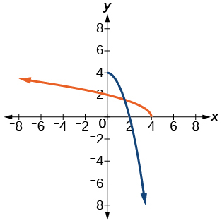

<math xmlns="http://www.w3.org/1998/Math/MathML"> <mrow> <mi>f</mi><mo stretchy="false">(</mo><mi>x</mi><mo stretchy="false">)</mo><mo>=</mo><msup> <mrow> <mrow><mo>(</mo> <mrow> <mi>x</mi><mo>+</mo><mn>3</mn> </mrow> <mo>)</mo></mrow> </mrow> <mn>2</mn> </msup> <mo>,</mo><mtext> </mtext><mi>x</mi><mo>≥</mo><mo>−</mo><mn>3</mn> </mrow> </math>

<math xmlns="http://www.w3.org/1998/Math/MathML"> <mrow> <mi>f</mi><mo stretchy="false">(</mo><mi>x</mi><mo stretchy="false">)</mo><mo>=</mo><msup> <mrow> <mrow><mo>(</mo> <mrow> <mi>x</mi><mo>−</mo><mn>4</mn> </mrow> <mo>)</mo></mrow> </mrow> <mn>2</mn> </msup> <mo>,</mo><mtext> </mtext><mi>x</mi><mo>≥</mo><mn>4</mn> </mrow> </math>

<math xmlns="http://www.w3.org/1998/Math/MathML"> <mrow> <msup> <mi>f</mi> <mrow> <mo>−</mo><mn>1</mn> </mrow> </msup> <mo stretchy="false">(</mo><mi>x</mi><mo stretchy="false">)</mo><mo>=</mo><msqrt> <mi>x</mi> </msqrt> <mo>+</mo><mn>4</mn> </mrow> </math>

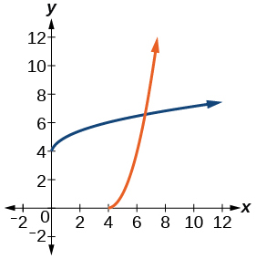

<math xmlns="http://www.w3.org/1998/Math/MathML"> <mrow> <mi>f</mi><mo stretchy="false">(</mo><mi>x</mi><mo stretchy="false">)</mo><mo>=</mo><msup> <mi>x</mi> <mn>3</mn> </msup> <mo>+</mo><mn>3</mn> </mrow> </math>

<math xmlns="http://www.w3.org/1998/Math/MathML"> <mrow> <mi>f</mi><mo stretchy="false">(</mo><mi>x</mi><mo stretchy="false">)</mo><mo>=</mo><mn>1</mn><mo>−</mo><msup> <mi>x</mi> <mn>3</mn> </msup> </mrow> </math>

<math xmlns="http://www.w3.org/1998/Math/MathML"> <mrow> <msup> <mi>f</mi> <mrow> <mo>−</mo><mn>1</mn> </mrow> </msup> <mo stretchy="false">(</mo><mi>x</mi><mo stretchy="false">)</mo><mo>=</mo><mroot> <mrow> <mn>1</mn><mo>−</mo><mi>x</mi> </mrow> <mn>3</mn> </mroot> </mrow> </math>

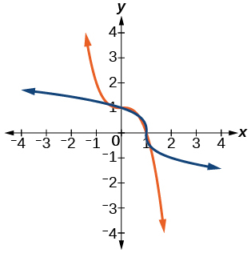

<math xmlns="http://www.w3.org/1998/Math/MathML"> <mrow> <mi>f</mi><mo stretchy="false">(</mo><mi>x</mi><mo stretchy="false">)</mo><mo>=</mo><msup> <mi>x</mi> <mn>2</mn> </msup> <mo>+</mo><mn>4</mn><mi>x</mi><mo>,</mo><mtext> </mtext><mi>x</mi><mo>≥</mo><mo>−</mo><mn>2</mn> </mrow> </math>

<math xmlns="http://www.w3.org/1998/Math/MathML"> <mrow> <mi>f</mi><mo stretchy="false">(</mo><mi>x</mi><mo stretchy="false">)</mo><mo>=</mo><msup> <mi>x</mi> <mn>2</mn> </msup> <mo>−</mo><mn>6</mn><mi>x</mi><mo>+</mo><mn>1</mn><mo>,</mo><mtext> </mtext><mi>x</mi><mo>≥</mo><mn>3</mn> </mrow> </math>

<math xmlns="http://www.w3.org/1998/Math/MathML"> <mrow> <msup> <mi>f</mi> <mrow> <mo>−</mo><mn>1</mn> </mrow> </msup> <mo stretchy="false">(</mo><mi>x</mi><mo stretchy="false">)</mo><mo>=</mo><msqrt> <mrow> <mi>x</mi><mo>+</mo><mn>8</mn> </mrow> </msqrt> <mo>+</mo><mn>3</mn> </mrow> </math>

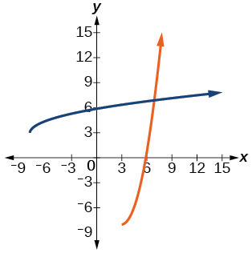

<math xmlns="http://www.w3.org/1998/Math/MathML"> <mrow> <mi>f</mi><mo stretchy="false">(</mo><mi>x</mi><mo stretchy="false">)</mo><mo>=</mo><mfrac> <mn>2</mn> <mi>x</mi> </mfrac> </mrow> </math>

<math xmlns="http://www.w3.org/1998/Math/MathML"> <mrow> <mi>f</mi><mo stretchy="false">(</mo><mi>x</mi><mo stretchy="false">)</mo><mo>=</mo><mfrac> <mn>1</mn> <mrow> <msup> <mi>x</mi> <mn>2</mn> </msup> </mrow> </mfrac> <mo>,</mo><mtext> </mtext><mi>x</mi><mo>≥</mo><mn>0</mn> </mrow> </math>

<math xmlns="http://www.w3.org/1998/Math/MathML"> <mrow> <msup> <mi>f</mi> <mrow> <mo>−</mo><mn>1</mn> </mrow> </msup> <mo stretchy="false">(</mo><mi>x</mi><mo stretchy="false">)</mo><mo>=</mo><msqrt> <mrow> <mfrac> <mn>1</mn> <mi>x</mi> </mfrac> </mrow> </msqrt> </mrow> </math>

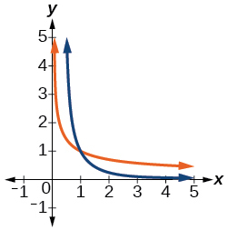

For the following exercises, use a graph to help determine the domain of the functions.

<math xmlns="http://www.w3.org/1998/Math/MathML"> <mrow> <mi>f</mi><mo stretchy="false">(</mo><mi>x</mi><mo stretchy="false">)</mo><mo>=</mo><msqrt> <mrow> <mfrac> <mrow> <mo stretchy="false">(</mo><mi>x</mi><mo>+</mo><mn>1</mn><mo stretchy="false">)</mo><mo stretchy="false">(</mo><mi>x</mi><mo>−</mo><mn>1</mn><mo stretchy="false">)</mo> </mrow> <mi>x</mi> </mfrac> </mrow> </msqrt> </mrow> </math>

<math xmlns="http://www.w3.org/1998/Math/MathML"> <mrow> <mi>f</mi><mo stretchy="false">(</mo><mi>x</mi><mo stretchy="false">)</mo><mo>=</mo><msqrt> <mrow> <mfrac> <mrow> <mo stretchy="false">(</mo><mi>x</mi><mo>+</mo><mn>2</mn><mo stretchy="false">)</mo><mo stretchy="false">(</mo><mi>x</mi><mo>−</mo><mn>3</mn><mo stretchy="false">)</mo> </mrow> <mrow> <mi>x</mi><mo>−</mo><mn>1</mn> </mrow> </mfrac> </mrow> </msqrt> </mrow> </math>

<math xmlns="http://www.w3.org/1998/Math/MathML"> <mrow> <mo stretchy="false">[</mo><mo>−</mo><mn>2</mn><mo>,</mo><mn>1</mn><mo stretchy="false">)</mo><mo>∪</mo><mo stretchy="false">[</mo><mn>3</mn><mo>,</mo><mi>∞</mi><mo stretchy="false">)</mo> </mrow> </math>

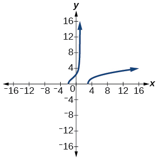

<math xmlns="http://www.w3.org/1998/Math/MathML"> <mrow> <mi>f</mi><mo stretchy="false">(</mo><mi>x</mi><mo stretchy="false">)</mo><mo>=</mo><msqrt> <mrow> <mfrac> <mrow> <mi>x</mi><mo stretchy="false">(</mo><mi>x</mi><mo>+</mo><mn>3</mn><mo stretchy="false">)</mo> </mrow> <mrow> <mi>x</mi><mo>−</mo><mn>4</mn> </mrow> </mfrac> </mrow> </msqrt> </mrow> </math>

<math xmlns="http://www.w3.org/1998/Math/MathML"> <mrow> <mi>f</mi><mo stretchy="false">(</mo><mi>x</mi><mo stretchy="false">)</mo><mo>=</mo><msqrt> <mrow> <mfrac> <mrow> <msup> <mi>x</mi> <mn>2</mn> </msup> <mo>−</mo><mi>x</mi><mo>−</mo><mn>20</mn> </mrow> <mrow> <mi>x</mi><mo>−</mo><mn>2</mn> </mrow> </mfrac> </mrow> </msqrt> </mrow> </math>

<math xmlns="http://www.w3.org/1998/Math/MathML"> <mrow> <mo stretchy="false">[</mo><mo>−</mo><mn>4</mn><mo>,</mo><mn>2</mn><mo stretchy="false">)</mo><mo>∪</mo><mo stretchy="false">[</mo><mn>5</mn><mo>,</mo><mi>∞</mi><mo stretchy="false">)</mo> </mrow> </math>

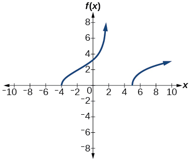

<math xmlns="http://www.w3.org/1998/Math/MathML"> <mrow> <mi>f</mi><mo stretchy="false">(</mo><mi>x</mi><mo stretchy="false">)</mo><mo>=</mo><msqrt> <mrow> <mfrac> <mrow> <mn>9</mn><mo>−</mo><msup> <mi>x</mi> <mn>2</mn> </msup> </mrow> <mrow> <mi>x</mi><mo>+</mo><mn>4</mn> </mrow> </mfrac> </mrow> </msqrt> </mrow> </math>

#### Technology

For the following exercises, use a calculator to graph the function. Then, using the graph, give three points on the graph of the inverse with *y*-coordinates given.

<math xmlns="http://www.w3.org/1998/Math/MathML"> <mrow> <mi>f</mi><mo stretchy="false">(</mo><mi>x</mi><mo stretchy="false">)</mo><mo>=</mo><msup> <mi>x</mi> <mn>3</mn> </msup> <mo>−</mo><mi>x</mi><mo>−</mo><mn>2</mn><mo>,</mo><mi>y</mi><mo>=</mo><mn>1</mn><mo>,</mo><mn>2</mn><mo>,</mo><mn>3</mn> </mrow> </math>

<math xmlns="http://www.w3.org/1998/Math/MathML"> <mrow> <mo stretchy="false">(</mo><mo>–</mo><mn>2</mn><mo>,</mo><mo> </mo><mn>0</mn><mo stretchy="false">)</mo><mo>;</mo><mo> </mo><mo stretchy="false">(</mo><mn>4</mn><mo>,</mo><mo> </mo><mn>2</mn><mo stretchy="false">)</mo><mo>;</mo><mo> </mo><mo stretchy="false">(</mo><mn>22</mn><mo>,</mo><mo> </mo><mn>3</mn><mo stretchy="false">)</mo> </mrow> </math>

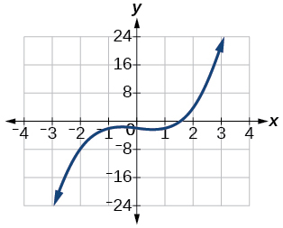

<math xmlns="http://www.w3.org/1998/Math/MathML"> <mrow> <mi>f</mi><mo stretchy="false">(</mo><mi>x</mi><mo stretchy="false">)</mo><mo>=</mo><msup> <mi>x</mi> <mn>3</mn> </msup> <mo>+</mo><mi>x</mi><mo>−</mo><mn>2</mn><mo>,</mo><mi>y</mi><mo>=</mo><mn>0</mn><mo>,</mo><mn>1</mn><mo>,</mo><mn>2</mn> </mrow> </math>

<math xmlns="http://www.w3.org/1998/Math/MathML"> <mrow> <mi>f</mi><mo stretchy="false">(</mo><mi>x</mi><mo stretchy="false">)</mo><mo>=</mo><msup> <mi>x</mi> <mn>3</mn> </msup> <mo>+</mo><mn>3</mn><mi>x</mi><mo>−</mo><mn>4</mn><mo>,</mo><mi>y</mi><mo>=</mo><mn>0</mn><mo>,</mo><mn>1</mn><mo>,</mo><mn>2</mn> </mrow> </math>

<math xmlns="http://www.w3.org/1998/Math/MathML"> <mrow> <mo stretchy="false">(</mo><mo>–</mo><mn>4</mn><mo>,</mo><mo> </mo><mn>0</mn><mo stretchy="false">)</mo><mo>;</mo><mo> </mo><mo stretchy="false">(</mo><mn>0</mn><mo>,</mo><mo> </mo><mn>1</mn><mo stretchy="false">)</mo><mo>;</mo><mo> </mo><mo stretchy="false">(</mo><mn>10</mn><mo>,</mo><mo> </mo><mn>2</mn><mo stretchy="false">)</mo> </mrow> </math>

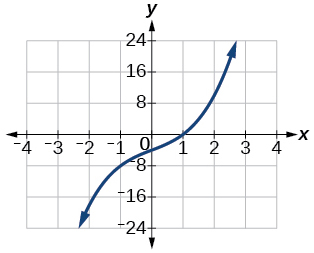

<math xmlns="http://www.w3.org/1998/Math/MathML"> <mrow> <mi>f</mi><mo stretchy="false">(</mo><mi>x</mi><mo stretchy="false">)</mo><mo>=</mo><msup> <mi>x</mi> <mn>3</mn> </msup> <mo>+</mo><mn>8</mn><mi>x</mi><mo>−</mo><mn>4</mn><mo>,</mo><mi>y</mi><mo>=</mo><mo>−</mo><mn>1</mn><mo>,</mo><mn>0</mn><mo>,</mo><mn>1</mn> </mrow> </math>

<math xmlns="http://www.w3.org/1998/Math/MathML"> <mrow> <mi>f</mi><mo stretchy="false">(</mo><mi>x</mi><mo stretchy="false">)</mo><mo>=</mo><msup> <mi>x</mi> <mn>4</mn> </msup> <mo>+</mo><mn>5</mn><mi>x</mi><mo>+</mo><mn>1</mn><mo>,</mo><mi>y</mi><mo>=</mo><mo>−</mo><mn>1</mn><mo>,</mo><mn>0</mn><mo>,</mo><mn>1</mn> </mrow> </math>

<math xmlns="http://www.w3.org/1998/Math/MathML"> <mrow> <mo stretchy="false">(</mo><mo>–</mo><mn>3</mn><mo>,</mo><mo> </mo><mo>−</mo><mn>1</mn><mo stretchy="false">)</mo><mo>;</mo><mo> </mo><mo stretchy="false">(</mo><mn>1</mn><mo>,</mo><mo> </mo><mn>0</mn><mo stretchy="false">)</mo><mo>;</mo><mo> </mo><mo stretchy="false">(</mo><mn>7</mn><mo>,</mo><mo> </mo><mn>1</mn><mo stretchy="false">)</mo> </mrow> </math>

####  Extensions

For the following exercises, find the inverse of the functions with<math xmlns="http://www.w3.org/1998/Math/MathML"> <mrow> <mtext> </mtext><mi>a</mi><mo>,</mo><mi>b</mi><mo>,</mo><mi>c</mi><mtext> </mtext> </mrow> </math>

positive real numbers.

<math xmlns="http://www.w3.org/1998/Math/MathML"> <mrow> <mi>f</mi><mo stretchy="false">(</mo><mi>x</mi><mo stretchy="false">)</mo><mo>=</mo><mi>a</mi><msup> <mi>x</mi> <mn>3</mn> </msup> <mo>+</mo><mi>b</mi> </mrow> </math>

<math xmlns="http://www.w3.org/1998/Math/MathML"> <mrow> <mi>f</mi><mo stretchy="false">(</mo><mi>x</mi><mo stretchy="false">)</mo><mo>=</mo><msup> <mi>x</mi> <mn>2</mn> </msup> <mo>+</mo><mi>b</mi><mi>x</mi> </mrow> </math>

<math xmlns="http://www.w3.org/1998/Math/MathML"> <mrow> <msup> <mi>f</mi> <mrow> <mo>−</mo><mn>1</mn> </mrow> </msup> <mo stretchy="false">(</mo><mi>x</mi><mo stretchy="false">)</mo><mo>=</mo><msqrt> <mrow> <mi>x</mi><mo>+</mo><mfrac> <mrow> <msup> <mi>b</mi> <mn>2</mn> </msup> </mrow> <mn>4</mn> </mfrac> </mrow> </msqrt> <mo>−</mo><mfrac> <mi>b</mi> <mn>2</mn> </mfrac> </mrow> </math>

<math xmlns="http://www.w3.org/1998/Math/MathML"> <mrow> <mi>f</mi><mo stretchy="false">(</mo><mi>x</mi><mo stretchy="false">)</mo><mo>=</mo><msqrt> <mrow> <mi>a</mi><msup> <mi>x</mi> <mn>2</mn> </msup> <mo>+</mo><mi>b</mi> </mrow> </msqrt> </mrow> </math>

<math xmlns="http://www.w3.org/1998/Math/MathML"> <mrow> <mi>f</mi><mo stretchy="false">(</mo><mi>x</mi><mo stretchy="false">)</mo><mo>=</mo><mroot> <mrow> <mi>a</mi><mi>x</mi><mo>+</mo><mi>b</mi> </mrow> <mn>3</mn> </mroot> </mrow> </math>

<math xmlns="http://www.w3.org/1998/Math/MathML"> <mrow> <msup> <mi>f</mi> <mrow> <mo>−</mo><mn>1</mn> </mrow> </msup> <mo stretchy="false">(</mo><mi>x</mi><mo stretchy="false">)</mo><mo>=</mo><mfrac> <mrow> <msup> <mi>x</mi> <mn>3</mn> </msup> <mo>−</mo><mi>b</mi> </mrow> <mi>a</mi> </mfrac> </mrow> </math>

<math xmlns="http://www.w3.org/1998/Math/MathML"> <mrow> <mi>f</mi><mo stretchy="false">(</mo><mi>x</mi><mo stretchy="false">)</mo><mo>=</mo><mfrac> <mrow> <mi>a</mi><mi>x</mi><mo>+</mo><mi>b</mi> </mrow> <mrow> <mi>x</mi><mo>+</mo><mi>c</mi> </mrow> </mfrac> </mrow> </math>

#### Real-World Applications

For the following exercises, determine the function described and then use it to answer the question.

An object dropped from a height of 200 meters has a height,<math xmlns="http://www.w3.org/1998/Math/MathML"> <mrow> <mtext> </mtext><mi>h</mi><mrow><mo>(</mo> <mi>t</mi> <mo>)</mo></mrow><mo>,</mo><mtext> </mtext> </mrow> </math>

in meters after<math xmlns="http://www.w3.org/1998/Math/MathML"> <mrow> <mtext> </mtext><mi>t</mi><mtext> </mtext> </mrow> </math>

seconds have lapsed, such that<math xmlns="http://www.w3.org/1998/Math/MathML"> <mrow> <mtext> </mtext><mi>h</mi><mo stretchy="false">(</mo><mi>t</mi><mo stretchy="false">)</mo><mo>=</mo><mn>200</mn><mo>−</mo><mn>4.9</mn><msup> <mi>t</mi> <mn>2</mn> </msup> <mo>.</mo><mtext> </mtext> </mrow> </math>

Express<math xmlns="http://www.w3.org/1998/Math/MathML"> <mrow> <mtext> </mtext><mi>t</mi><mtext> </mtext> </mrow> </math>

as a function of height,<math xmlns="http://www.w3.org/1998/Math/MathML"> <mrow> <mtext> </mtext><mi>h</mi><mo>,</mo><mtext> </mtext> </mrow> </math>

and find the time to reach a height of 50 meters.

<math xmlns="http://www.w3.org/1998/Math/MathML"> <mrow> <mi>t</mi><mo stretchy="false">(</mo><mi>h</mi><mo stretchy="false">)</mo><mo>=</mo><msqrt> <mrow> <mfrac> <mrow> <mn>200</mn><mo>−</mo><mi>h</mi> </mrow> <mrow> <mn>4.9</mn> </mrow> </mfrac> </mrow> </msqrt> <mo>,</mo><mtext> </mtext> </mrow> </math>

5.53 seconds

An object dropped from a height of 600 feet has a height,<math xmlns="http://www.w3.org/1998/Math/MathML"> <mrow> <mtext> </mtext><mi>h</mi><mrow><mo>(</mo> <mi>t</mi> <mo>)</mo></mrow><mo>,</mo><mtext> </mtext> </mrow> </math>

in feet after<math xmlns="http://www.w3.org/1998/Math/MathML"> <mrow> <mtext> </mtext><mi>t</mi><mtext> </mtext> </mrow> </math>

seconds have elapsed, such that<math xmlns="http://www.w3.org/1998/Math/MathML"> <mrow> <mtext> </mtext><mi>h</mi><mo stretchy="false">(</mo><mi>t</mi><mo stretchy="false">)</mo><mo>=</mo><mn>600</mn><mo>−</mo><mn>16</mn><msup> <mi>t</mi> <mn>2</mn> </msup> <mo>.</mo><mtext> </mtext> </mrow> </math>

Express<math xmlns="http://www.w3.org/1998/Math/MathML"> <mrow> <mtext> </mtext><mi>t</mi><mtext> </mtext> </mrow> </math>

 as a function of height<math xmlns="http://www.w3.org/1998/Math/MathML"> <mrow> <mtext> </mtext><mi>h</mi><mo>,</mo><mtext> </mtext> </mrow> </math>

and find the time to reach a height of 400 feet.

The volume,<math xmlns="http://www.w3.org/1998/Math/MathML"> <mrow> <mtext> </mtext><mi>V</mi><mo>,</mo><mtext> </mtext> </mrow> </math>

of a sphere in terms of its radius,<math xmlns="http://www.w3.org/1998/Math/MathML"> <mrow> <mtext> </mtext><mi>r</mi><mo>,</mo><mtext> </mtext> </mrow> </math>

is given by<math xmlns="http://www.w3.org/1998/Math/MathML"> <mrow> <mtext> </mtext><mi>V</mi><mo stretchy="false">(</mo><mi>r</mi><mo stretchy="false">)</mo><mo>=</mo><mfrac> <mn>4</mn> <mn>3</mn> </mfrac> <mi>π</mi><msup> <mi>r</mi> <mn>3</mn> </msup> <mo>.</mo><mtext> </mtext> </mrow> </math>

Express<math xmlns="http://www.w3.org/1998/Math/MathML"> <mrow> <mtext> </mtext><mi>r</mi><mtext> </mtext> </mrow> </math>

as a function of<math xmlns="http://www.w3.org/1998/Math/MathML"> <mrow> <mtext> </mtext><mi>V</mi><mo>,</mo><mtext> </mtext> </mrow> </math>

and find the radius of a sphere with volume of 200 cubic feet.

<math xmlns="http://www.w3.org/1998/Math/MathML"> <mrow> <mi>r</mi><mo stretchy="false">(</mo><mi>V</mi><mo stretchy="false">)</mo><mo>=</mo><mroot> <mrow> <mfrac> <mrow> <mn>3</mn><mi>V</mi> </mrow> <mrow> <mn>4</mn><mi>π</mi> </mrow> </mfrac> </mrow> <mn>3</mn> </mroot> <mo>,</mo><mtext> </mtext> </mrow> </math>

3.63 feet

The surface area,<math xmlns="http://www.w3.org/1998/Math/MathML"> <mrow> <mtext> </mtext><mi>A</mi><mo>,</mo><mtext> </mtext> </mrow> </math>

of a sphere in terms of its radius,<math xmlns="http://www.w3.org/1998/Math/MathML"> <mrow> <mtext> </mtext><mi>r</mi><mo>,</mo><mtext> </mtext> </mrow> </math>

is given by<math xmlns="http://www.w3.org/1998/Math/MathML"> <mrow> <mtext> </mtext><mi>A</mi><mo stretchy="false">(</mo><mi>r</mi><mo stretchy="false">)</mo><mo>=</mo><mn>4</mn><mi>π</mi><msup> <mi>r</mi> <mn>2</mn> </msup> <mo>.</mo><mtext> </mtext> </mrow> </math>

Express<math xmlns="http://www.w3.org/1998/Math/MathML"> <mrow> <mtext> </mtext><mi>r</mi><mtext> </mtext> </mrow> </math>

as a function of<math xmlns="http://www.w3.org/1998/Math/MathML"> <mrow> <mtext> </mtext><mi>V</mi><mo>,</mo><mtext> </mtext> </mrow> </math>

and find the radius of a sphere with a surface area of 1000 square inches.

A container holds 100 mL of a solution that is 25 mL acid. If<math xmlns="http://www.w3.org/1998/Math/MathML"> <mrow> <mtext> </mtext><mi>n</mi><mtext> </mtext> </mrow> </math>

mL of a solution that is 60% acid is added, the function<math xmlns="http://www.w3.org/1998/Math/MathML"> <mrow> <mtext> </mtext><mi>C</mi><mo stretchy="false">(</mo><mi>n</mi><mo stretchy="false">)</mo><mo>=</mo><mfrac> <mrow> <mn>25</mn><mo>+</mo><mn>.6</mn><mi>n</mi> </mrow> <mrow> <mn>100</mn><mo>+</mo><mi>n</mi> </mrow> </mfrac> <mtext> </mtext> </mrow> </math>

gives the concentration,<math xmlns="http://www.w3.org/1998/Math/MathML"> <mrow> <mtext> </mtext><mi>C</mi><mo>,</mo><mtext> </mtext> </mrow> </math>

as a function of the number of mL added,<math xmlns="http://www.w3.org/1998/Math/MathML"> <mrow> <mtext> </mtext><mi>n</mi><mo>.</mo><mtext> </mtext> </mrow> </math>

Express<math xmlns="http://www.w3.org/1998/Math/MathML"> <mrow> <mtext> </mtext><mi>n</mi><mtext> </mtext> </mrow> </math>

as a function of<math xmlns="http://www.w3.org/1998/Math/MathML"> <mrow> <mtext> </mtext><mi>C</mi><mtext> </mtext> </mrow> </math>

and determine the number of mL that need to be added to have a solution that is 50% acid.

<math xmlns="http://www.w3.org/1998/Math/MathML"> <mrow> <mi>n</mi><mo stretchy="false">(</mo><mi>C</mi><mo stretchy="false">)</mo><mo>=</mo><mfrac> <mrow> <mn>100</mn><mi>C</mi><mo>−</mo><mn>25</mn> </mrow> <mrow> <mn>.6</mn><mo>−</mo><mi>C</mi> </mrow> </mfrac> <mo>,</mo><mtext> </mtext> </mrow> </math>

250 mL

The period<math xmlns="http://www.w3.org/1998/Math/MathML"> <mrow> <mtext> </mtext><mi>T</mi><mo>,</mo><mtext> </mtext> </mrow> </math>

in seconds, of a simple pendulum as a function of its length<math xmlns="http://www.w3.org/1998/Math/MathML"> <mrow> <mtext> </mtext><mi>l</mi><mo>,</mo><mtext> </mtext> </mrow> </math>

in feet, is given by<math xmlns="http://www.w3.org/1998/Math/MathML"> <mrow> <mtext> </mtext><mi>T</mi><mo stretchy="false">(</mo><mi>l</mi><mo stretchy="false">)</mo><mo>=</mo><mn>2</mn><mi>π</mi><msqrt> <mrow> <mfrac> <mi>l</mi> <mrow> <mn>32.2</mn> </mrow> </mfrac> </mrow> </msqrt> <mtext> </mtext> </mrow> </math>

 . Express<math xmlns="http://www.w3.org/1998/Math/MathML"> <mrow> <mtext> </mtext><mi>l</mi><mtext> </mtext> </mrow> </math>

as a function of<math xmlns="http://www.w3.org/1998/Math/MathML"> <mrow> <mtext> </mtext><mi>T</mi><mtext> </mtext> </mrow> </math>

and determine the length of a pendulum with period of 2 seconds.

The volume of a cylinder ,<math xmlns="http://www.w3.org/1998/Math/MathML"> <mrow> <mtext> </mtext><mi>V</mi><mo>,</mo><mtext> </mtext> </mrow> </math>

in terms of radius,<math xmlns="http://www.w3.org/1998/Math/MathML"> <mrow> <mtext> </mtext><mi>r</mi><mo>,</mo><mtext> </mtext> </mrow> </math>

and height,<math xmlns="http://www.w3.org/1998/Math/MathML"> <mrow> <mtext> </mtext><mi>h</mi><mo>,</mo><mtext> </mtext> </mrow> </math>

is given by<math xmlns="http://www.w3.org/1998/Math/MathML"> <mrow> <mtext> </mtext><mi>V</mi><mo>=</mo><mi>π</mi><msup> <mi>r</mi> <mn>2</mn> </msup> <mi>h</mi><mo>.</mo><mtext> </mtext> </mrow> </math>

If a cylinder has a height of 6 meters, express the radius as a function of<math xmlns="http://www.w3.org/1998/Math/MathML"> <mrow> <mtext> </mtext><mi>V</mi><mtext> </mtext> </mrow> </math>

and find the radius of a cylinder with volume of 300 cubic meters.

<math xmlns="http://www.w3.org/1998/Math/MathML"> <mrow> <mi>r</mi><mo stretchy="false">(</mo><mi>V</mi><mo stretchy="false">)</mo><mo>=</mo><msqrt> <mrow> <mfrac> <mi>V</mi> <mrow> <mn>6</mn><mi>π</mi> </mrow> </mfrac> </mrow> </msqrt> <mo>,</mo><mtext> </mtext> </mrow> </math>

3.99 meters

The surface area,<math xmlns="http://www.w3.org/1998/Math/MathML"> <mrow> <mtext> </mtext><mi>A</mi><mo>,</mo><mtext> </mtext> </mrow> </math>

of a cylinder in terms of its radius,<math xmlns="http://www.w3.org/1998/Math/MathML"> <mrow> <mtext> </mtext><mi>r</mi><mo>,</mo><mtext> </mtext> </mrow> </math>

and height,<math xmlns="http://www.w3.org/1998/Math/MathML"> <mrow> <mtext> </mtext><mi>h</mi><mo>,</mo><mtext> </mtext> </mrow> </math>

is given by<math xmlns="http://www.w3.org/1998/Math/MathML"> <mrow> <mtext> </mtext><mi>A</mi><mo>=</mo><mn>2</mn><mi>π</mi><msup> <mi>r</mi> <mn>2</mn> </msup> <mo>+</mo><mn>2</mn><mi>π</mi><mi>r</mi><mi>h</mi><mo>.</mo><mtext> </mtext> </mrow> </math>

If the height of the cylinder is 4 feet, express the radius as a function of<math xmlns="http://www.w3.org/1998/Math/MathML"> <mrow> <mtext> </mtext><mi>V</mi><mtext> </mtext> </mrow> </math>

and find the radius if the surface area is 200 square feet.

The volume of a right circular cone,<math xmlns="http://www.w3.org/1998/Math/MathML"> <mrow> <mtext> </mtext><mi>V</mi><mo>,</mo><mtext> </mtext> </mrow> </math>

in terms of its radius,<math xmlns="http://www.w3.org/1998/Math/MathML"> <mrow> <mtext> </mtext><mi>r</mi><mo>,</mo><mtext> </mtext> </mrow> </math>

and its height,<math xmlns="http://www.w3.org/1998/Math/MathML"> <mrow> <mtext> </mtext><mi>h</mi><mo>,</mo><mtext> </mtext> </mrow> </math>

is given by<math xmlns="http://www.w3.org/1998/Math/MathML"> <mrow> <mtext> </mtext><mi>V</mi><mo>=</mo><mfrac> <mn>1</mn> <mn>3</mn> </mfrac> <mi>π</mi><msup> <mi>r</mi> <mn>2</mn> </msup> <mi>h</mi><mo>.</mo><mtext> </mtext> </mrow> </math>

Express<math xmlns="http://www.w3.org/1998/Math/MathML"> <mrow> <mtext> </mtext><mi>r</mi><mtext> </mtext> </mrow> </math>

in terms of<math xmlns="http://www.w3.org/1998/Math/MathML"> <mrow> <mtext> </mtext><mi>V</mi><mtext> </mtext> </mrow> </math>

if the height of the cone is 12 feet and find the radius of a cone with volume of 50 cubic inches.

<math xmlns="http://www.w3.org/1998/Math/MathML"> <mrow> <mi>r</mi><mo stretchy="false">(</mo><mi>V</mi><mo stretchy="false">)</mo><mo>=</mo><msqrt> <mrow> <mfrac> <mi>V</mi> <mrow> <mn>4</mn><mi>π</mi> </mrow> </mfrac> </mrow> </msqrt> <mo>,</mo><mtext> </mtext> </mrow> </math>

1.99 inches

Consider a cone with height of 30 feet. Express the radius,<math xmlns="http://www.w3.org/1998/Math/MathML"> <mrow> <mtext> </mtext><mi>r</mi><mo>,</mo><mtext> </mtext> </mrow> </math>

in terms of the volume,<math xmlns="http://www.w3.org/1998/Math/MathML"> <mrow> <mtext> </mtext><mi>V</mi><mo>,</mo><mtext> </mtext> </mrow> </math>

and find the radius of a cone with volume of 1000 cubic feet.

### Glossary
{: data-type="glossary-title"}

invertible function
: any function that has an inverse function

[1]: http://openstaxcollege.org/l/graphsquareroot
[2]: http://openstaxcollege.org/l/inversesquare
[3]: http://openstaxcollege.org/l/inverserational
[4]: http://openstaxcollege.org/l/rationalinverse
[5]: http://openstaxcollege.org/l/inversefunction
