

In this section, you will:
* Solve direct variation problems.
* Solve inverse variation problems.
* Solve problems involving joint variation.

A used-car company has just offered their best candidate, Nicole, a position in sales. The position offers 16% commission on her sales. Her earnings depend on the amount of her sales. For instance, if she sells a vehicle for $4,600, she will earn $736. She wants to evaluate the offer, but she is not sure how. In this section, we will look at relationships, such as this one, between earnings, sales, and commission rate.

### Solving Direct Variation Problems

In the example above, Nicole’s earnings can be found by multiplying her sales by her commission. The formula<math xmlns="http://www.w3.org/1998/Math/MathML"> <mrow> <mtext> </mtext><mi>e</mi><mo>=</mo><mn>0.16</mn><mi>s</mi><mtext> </mtext></mrow> </math>

tells us her earnings,<math xmlns="http://www.w3.org/1998/Math/MathML"> <mrow> <mtext> </mtext><mi>e</mi><mo>,</mo><mtext> </mtext></mrow> </math>

come from the product of 0.16, her commission, and the sale price of the vehicle. If we create a table, we observe that as the sales price increases, the earnings increase as well, which should be intuitive. See [\[link\]](#Table_03_09_01).

| <math xmlns="http://www.w3.org/1998/Math/MathML"> <mrow> <mtext> </mtext><mi>s</mi><mtext> </mtext></mrow> </math>

, sales price | <math xmlns="http://www.w3.org/1998/Math/MathML"> <mrow> <mi>e</mi><mo>=</mo><mn>0.16</mn><mi>s</mi></mrow> </math>

 | Interpretation |
|----------
| $4,600 | <math xmlns="http://www.w3.org/1998/Math/MathML"> <mrow> <mi>e</mi><mo>=</mo><mn>0.16</mn><mrow><mo>(</mo> <mrow> <mn>4,600</mn></mrow> <mo>)</mo></mrow><mo>=</mo><mn>736</mn></mrow> </math>

 | A sale of a $4,600 vehicle results in $736 earnings. |
| $9,200 | <math xmlns="http://www.w3.org/1998/Math/MathML"> <mrow> <mi>e</mi><mo>=</mo><mn>0.16</mn><mrow><mo>(</mo> <mrow> <mn>9,200</mn></mrow> <mo>)</mo></mrow><mo>=</mo><mn>1,472</mn></mrow> </math>

 | A sale of a $9,200 vehicle results in $1472 earnings. |
| $18,400 | <math xmlns="http://www.w3.org/1998/Math/MathML"> <mrow> <mi>e</mi><mo>=</mo><mn>0.16</mn><mrow><mo>(</mo> <mrow> <mn>18,400</mn></mrow> <mo>)</mo></mrow><mo>=</mo><mn>2,944</mn></mrow> </math>

 | A sale of a $18,400 vehicle results in $2944 earnings. |
{: #Table_03_09_01 summary=".."}

Notice that earnings are a multiple of sales. As sales increase, earnings increase in a predictable way. Double the sales of the vehicle from $4,600 to $9,200, and we double the earnings from $736 to $1,472. As the input increases, the output increases as a multiple of the input. A relationship in which one quantity is a constant multiplied by another quantity is called **direct variation**. Each variable in this type of relationship <strong>varies directly </strong>with the other.

[\[link\]](#Figure_03_09_001) represents the data for Nicole’s potential earnings. We say that earnings vary directly with the sales price of the car. The formula<math xmlns="http://www.w3.org/1998/Math/MathML"> <mrow> <mtext> </mtext><mi>y</mi><mo>=</mo><mi>k</mi><msup> <mi>x</mi> <mi>n</mi> </msup> <mtext> </mtext></mrow> </math>

is used for direct variation. The value<math xmlns="http://www.w3.org/1998/Math/MathML"> <mrow> <mtext> </mtext><mi>k</mi><mtext> </mtext></mrow> </math>

is a nonzero constant greater than zero and is called the **constant of variation**. In this case,<math xmlns="http://www.w3.org/1998/Math/MathML"> <mrow> <mtext> </mtext><mi>k</mi><mo>=</mo><mn>0.16</mn><mtext> </mtext></mrow> </math>

and<math xmlns="http://www.w3.org/1998/Math/MathML"> <mrow> <mtext> </mtext><mi>n</mi><mo>=</mo><mn>1.</mn><mtext> </mtext></mrow> </math>

We saw functions like this one when we discussed power functions.

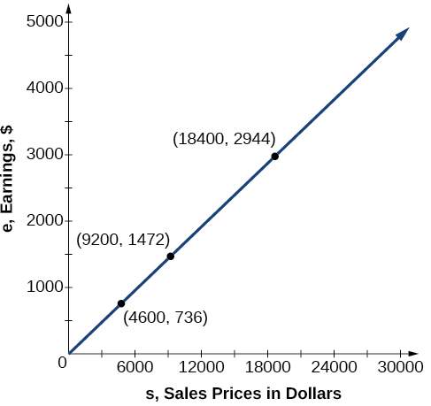{: #Figure_03_09_001}

Direct Variation

If<math xmlns="http://www.w3.org/1998/Math/MathML"> <mrow> <mtext> </mtext><mi>x</mi><mtext> </mtext><mtext>and</mtext><mtext> </mtext><mi>y</mi><mtext> </mtext> </mrow> </math>

are related by an equation of the form

<math xmlns="http://www.w3.org/1998/Math/MathML"> <mrow> <mtext> </mtext><mi>y</mi><mo>=</mo><mi>k</mi><msup> <mi>x</mi> <mi>n</mi> </msup> <mtext> </mtext></mrow> </math>

then we say that the relationship is **direct variation**{: data-type="term"} and <math xmlns="http://www.w3.org/1998/Math/MathML"> <mrow> <mtext> </mtext><mi>y</mi><mtext> </mtext></mrow> </math>

 **varies directly**{: data-type="term"} with, or is proportional to, the<math xmlns="http://www.w3.org/1998/Math/MathML"> <mrow> <mtext> </mtext><mi>n</mi><mtext>th</mtext><mtext> </mtext></mrow> </math>

power of<math xmlns="http://www.w3.org/1998/Math/MathML"> <mrow> <mtext> </mtext><mi>x</mi><mo>.</mo><mtext> </mtext> </mrow> </math>

In direct variation relationships, there is a nonzero constant ratio<math xmlns="http://www.w3.org/1998/Math/MathML"> <mrow> <mtext> </mtext><mi>k</mi><mo>=</mo><mfrac> <mi>y</mi> <mrow> <msup> <mi>x</mi> <mi>n</mi> </msup> </mrow> </mfrac> <mo>,</mo><mtext> </mtext></mrow> </math>

where<math xmlns="http://www.w3.org/1998/Math/MathML"> <mrow> <mtext> </mtext><mi>k</mi><mtext> </mtext></mrow> </math>

is called the **constant of variation**{: data-type="term"}, which help defines the relationship between the variables.

<strong>Given a description of a direct variation problem, solve for an unknown. </strong>

1.  Identify the input,
    <math xmlns="http://www.w3.org/1998/Math/MathML"> <mrow> <mtext> </mtext><mi>x</mi><mo>,</mo> </mrow> </math>
    
    and the output,
    <math xmlns="http://www.w3.org/1998/Math/MathML"> <mrow> <mtext> </mtext><mi>y</mi><mo>.</mo><mtext> </mtext></mrow> </math>

2.  Determine the constant of variation. You may need to divide
    <math xmlns="http://www.w3.org/1998/Math/MathML"> <mrow> <mtext> </mtext><mi>y</mi><mtext> </mtext></mrow> </math>
    
    by the specified power of
    <math xmlns="http://www.w3.org/1998/Math/MathML"> <mrow> <mtext> </mtext><mi>x</mi><mtext> </mtext></mrow> </math>
    
    to determine the constant of variation.
3.  Use the constant of variation to write an equation for the relationship.
4.  Substitute known values into the equation to find the unknown.
{: type="1"}

Solving a Direct Variation Problem

The quantity<math xmlns="http://www.w3.org/1998/Math/MathML"> <mrow> <mtext> </mtext><mi>y</mi><mtext> </mtext></mrow> </math>

varies directly with the cube of<math xmlns="http://www.w3.org/1998/Math/MathML"> <mrow> <mtext> </mtext><mi>x</mi><mo>.</mo><mtext> </mtext></mrow> </math>

If<math xmlns="http://www.w3.org/1998/Math/MathML"> <mrow> <mtext> </mtext><mi>y</mi><mo>=</mo><mn>25</mn><mtext> </mtext></mrow> </math>

when<math xmlns="http://www.w3.org/1998/Math/MathML"> <mrow> <mtext> </mtext><mi>x</mi><mo>=</mo><mn>2</mn><mo>,</mo><mtext> </mtext></mrow> </math>

find<math xmlns="http://www.w3.org/1998/Math/MathML"> <mrow> <mtext> </mtext><mi>y</mi><mtext> </mtext></mrow> </math>

when<math xmlns="http://www.w3.org/1998/Math/MathML"> <mrow> <mtext> </mtext><mi>x</mi><mtext> </mtext></mrow> </math>

is 6.

The general formula for direct variation with a cube is<math xmlns="http://www.w3.org/1998/Math/MathML"> <mrow> <mtext> </mtext><mi>y</mi><mo>=</mo><mi>k</mi><msup> <mi>x</mi> <mn>3</mn> </msup> <mo>.</mo><mtext> </mtext></mrow> </math>

The constant can be found by dividing<math xmlns="http://www.w3.org/1998/Math/MathML"> <mrow> <mtext> </mtext><mi>y</mi><mtext> </mtext></mrow> </math>

by the cube of<math xmlns="http://www.w3.org/1998/Math/MathML"> <mrow> <mtext> </mtext><mi>x</mi><mo>.</mo><mtext> </mtext></mrow> </math>

<math xmlns="http://www.w3.org/1998/Math/MathML" display="block"> <mrow> <mtable> <mtr rowalign="center"> <mtd columnalign="right" rowalign="center"> <mi>k</mi> </mtd> <mtd> <mo>=</mo> </mtd> <mtd columnalign="left" rowalign="center"> <mrow> <mfrac> <mi>y</mi> <mrow> <msup> <mi>x</mi> <mn>3</mn> </msup> </mrow> </mfrac> </mrow> </mtd> </mtr> <mtr rowalign="center"> <mtd rowalign="center" /> <mtd rowalign="center"> <mo>=</mo> </mtd> <mtd columnalign="left" rowalign="center"> <mrow> <mfrac> <mrow> <mn>25</mn> </mrow> <mrow> <msup> <mn>2</mn> <mn>3</mn> </msup> </mrow> </mfrac> </mrow> </mtd> </mtr> <mtr rowalign="center"> <mtd rowalign="center" /> <mtd rowalign="center"> <mo>=</mo> </mtd> <mtd columnalign="left" rowalign="center"> <mrow> <mfrac> <mrow> <mn>25</mn> </mrow> <mn>8</mn> </mfrac> </mrow> </mtd> </mtr> </mtable> </mrow> </math>

Now use the constant to write an equation that represents this relationship.

<math xmlns="http://www.w3.org/1998/Math/MathML" display="block"> <mrow> <mi>y</mi><mo>=</mo><mfrac> <mrow> <mn>25</mn> </mrow> <mn>8</mn> </mfrac> <msup> <mi>x</mi> <mn>3</mn> </msup> </mrow> </math>

Substitute<math xmlns="http://www.w3.org/1998/Math/MathML"> <mrow> <mtext> </mtext><mi>x</mi><mo>=</mo><mn>6</mn><mtext> </mtext></mrow> </math>

and solve for<math xmlns="http://www.w3.org/1998/Math/MathML"> <mrow> <mtext> </mtext><mi>y</mi><mo>.</mo></mrow> </math>

<math xmlns="http://www.w3.org/1998/Math/MathML" display="block"> <mrow> <mtable> <mtr rowalign="center"> <mtd columnalign="right" rowalign="center"> <mi>y</mi> </mtd> <mtd rowalign="center"> <mo>=</mo> </mtd> <mtd columnalign="left" rowalign="center"> <mrow> <mfrac> <mrow> <mn>25</mn> </mrow> <mn>8</mn> </mfrac> <msup> <mrow> <mo stretchy="false">(</mo><mn>6</mn><mo stretchy="false">)</mo> </mrow> <mn>3</mn> </msup> </mrow> </mtd> </mtr> <mtr rowalign="center"> <mtd rowalign="center" /> <mtd rowalign="center"> <mo>=</mo> </mtd> <mtd columnalign="left" rowalign="center"> <mrow> <mn>675</mn> </mrow> </mtd> </mtr> </mtable> </mrow> </math>

Analysis

The graph of this equation is a simple cubic, as shown in [[link]](#Figure_03_09_002).

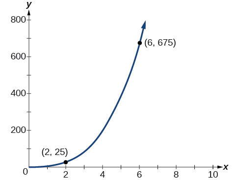{: #Figure_03_09_002}

**Do the graphs of all direct variation equations look like [\[link\]](#Example_03_09_01)?**

<em>No. Direct variation equations are power functions—they may be linear, quadratic, cubic, quartic, radical, etc. But all of the graphs pass through<math xmlns="http://www.w3.org/1998/Math/MathML">
    <mrow>
     <mtext> </mtext><mrow><mo>(</mo>
      <mrow>
       <mn>0,0</mn></mrow>
      <mo>)</mo></mrow><mo>.</mo></mrow>
   </math> </em>

The quantity<math xmlns="http://www.w3.org/1998/Math/MathML"> <mrow> <mtext> </mtext><mi>y</mi><mtext> </mtext></mrow> </math>

varies directly with the square of<math xmlns="http://www.w3.org/1998/Math/MathML"> <mrow> <mtext> </mtext><mi>x</mi><mo>.</mo><mtext> </mtext></mrow> </math>

If<math xmlns="http://www.w3.org/1998/Math/MathML"> <mrow> <mtext> </mtext><mi>y</mi><mo>=</mo><mn>24</mn><mtext> </mtext></mrow> </math>

when<math xmlns="http://www.w3.org/1998/Math/MathML"> <mrow> <mtext> </mtext><mi>x</mi><mo>=</mo><mn>3</mn><mo>,</mo><mtext> </mtext></mrow> </math>

find<math xmlns="http://www.w3.org/1998/Math/MathML"> <mrow> <mtext> </mtext><mi>y</mi><mtext> </mtext></mrow> </math>

when<math xmlns="http://www.w3.org/1998/Math/MathML"> <mrow> <mtext> </mtext><mi>x</mi><mtext> </mtext></mrow> </math>

is 4.

<math xmlns="http://www.w3.org/1998/Math/MathML"> <mrow> <mfrac> <mrow> <mn>128</mn></mrow> <mn>3</mn> </mfrac> </mrow> </math>

### Solving Inverse Variation Problems

Water temperature in an ocean varies inversely to the water’s depth. The formula<math xmlns="http://www.w3.org/1998/Math/MathML"> <mrow> <mtext> </mtext><mi>T</mi><mo>=</mo><mfrac> <mrow> <mn>14,000</mn></mrow> <mi>d</mi> </mfrac> <mtext> </mtext></mrow> </math>

gives us the temperature in degrees Fahrenheit at a depth in feet below Earth’s surface. Consider the Atlantic Ocean, which covers 22% of Earth’s surface. At a certain location, at the depth of 500 feet, the temperature may be 28°F.

If we create [\[link\]](#Table_03_09_02), we observe that, as the depth increases, the water temperature decreases.

| <math xmlns="http://www.w3.org/1998/Math/MathML"> <mrow> <mi>d</mi><mo>,</mo><mtext> </mtext> </mrow> </math>

depth | <math xmlns="http://www.w3.org/1998/Math/MathML"> <mrow> <mi>T</mi><mo>=</mo><mfrac> <mrow> <mtext>14,000</mtext> </mrow> <mi>d</mi> </mfrac> </mrow> </math>

 | Interpretation |
|----------
| 500 ft | <math xmlns="http://www.w3.org/1998/Math/MathML"> <mrow> <mfrac> <mrow> <mn>14,000</mn></mrow> <mrow> <mn>500</mn></mrow> </mfrac> <mo>=</mo><mn>28</mn></mrow> </math>

 | At a depth of 500 ft, the water temperature is 28° F. |
| 1000 ft | <math xmlns="http://www.w3.org/1998/Math/MathML"> <mrow> <mfrac> <mrow> <mn>14,000</mn></mrow> <mrow> <mn>1000</mn></mrow> </mfrac> <mo>=</mo><mn>14</mn></mrow> </math>

 | At a depth of 1,000 ft, the water temperature is 14° F. |
| 2000 ft | <math xmlns="http://www.w3.org/1998/Math/MathML"> <mrow> <mfrac> <mrow> <mn>14,000</mn></mrow> <mrow> <mn>2000</mn></mrow> </mfrac> <mo>=</mo><mn>7</mn></mrow> </math>

 | At a depth of 2,000 ft, the water temperature is 7° F. |
{: #Table_03_09_02 summary=".."}

We notice in the relationship between these variables that, as one quantity increases, the other decreases. The two quantities are said to be **inversely proportional** and each term **varies inversely** with the other. Inversely proportional relationships are also called **inverse variations**.

For our example, [\[link\]](#Figure_03_09_003) depicts the **inverse variation**{: data-type="term" .no-emphasis}. We say the water temperature varies inversely with the depth of the water because, as the depth increases, the temperature decreases. The formula<math xmlns="http://www.w3.org/1998/Math/MathML"> <mrow> <mtext> </mtext><mi>y</mi><mo>=</mo><mfrac> <mi>k</mi> <mi>x</mi> </mfrac> <mtext> </mtext></mrow> </math>

for inverse variation in this case uses<math xmlns="http://www.w3.org/1998/Math/MathML"> <mrow> <mtext> </mtext><mi>k</mi><mo>=</mo><mn>14,000.</mn><mtext> </mtext></mrow> </math>

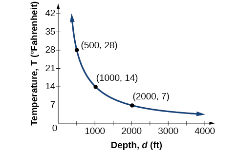{: #Figure_03_09_003}

Inverse Variation

If<math xmlns="http://www.w3.org/1998/Math/MathML"> <mrow> <mtext> </mtext><mi>x</mi><mtext> </mtext></mrow> </math>

and<math xmlns="http://www.w3.org/1998/Math/MathML"> <mrow> <mtext> </mtext><mi>y</mi><mtext> </mtext></mrow> </math>

are related by an equation of the form

<math xmlns="http://www.w3.org/1998/Math/MathML"> <mrow> <mi>y</mi><mo>=</mo><mfrac> <mi>k</mi> <mrow> <msup> <mi>x</mi> <mi>n</mi> </msup> </mrow> </mfrac> </mrow> </math>

where<math xmlns="http://www.w3.org/1998/Math/MathML"> <mrow> <mtext> </mtext><mi>k</mi><mtext> </mtext></mrow> </math>

is a nonzero constant, then we say that<math xmlns="http://www.w3.org/1998/Math/MathML"> <mrow> <mtext> </mtext><mi>y</mi> </mrow> </math>

**varies inversely**{: data-type="term"} with the<math xmlns="http://www.w3.org/1998/Math/MathML"> <mrow> <mtext> </mtext><mi>n</mi><mtext>th</mtext><mtext> </mtext></mrow> </math>

power of<math xmlns="http://www.w3.org/1998/Math/MathML"> <mrow> <mtext> </mtext><mi>x</mi><mo>.</mo><mtext> </mtext></mrow> </math>

In **inversely proportional**{: data-type="term"} relationships, or **inverse variations**{: data-type="term"}, there is a constant multiple<math xmlns="http://www.w3.org/1998/Math/MathML"> <mrow> <mtext> </mtext><mi>k</mi><mo>=</mo><msup> <mi>x</mi> <mi>n</mi> </msup> <mi>y</mi><mo>.</mo><mtext> </mtext></mrow> </math>

Writing a Formula for an Inversely Proportional Relationship

A tourist plans to drive 100 miles. Find a formula for the time the trip will take as a function of the speed the tourist drives.

Recall that multiplying speed by time gives distance. If we let<math xmlns="http://www.w3.org/1998/Math/MathML"> <mrow> <mtext> </mtext><mi>t</mi><mtext> </mtext></mrow> </math>

represent the drive time in hours, and<math xmlns="http://www.w3.org/1998/Math/MathML"> <mrow> <mtext> </mtext><mi>v</mi><mtext> </mtext></mrow> </math>

represent the velocity (speed or rate) at which the tourist drives, then<math xmlns="http://www.w3.org/1998/Math/MathML"> <mrow> <mtext> </mtext><mi>v</mi><mi>t</mi><mo>=</mo><mtext>distance</mtext><mtext>.</mtext><mtext> </mtext></mrow> </math>

Because the distance is fixed at 100 miles,<math xmlns="http://www.w3.org/1998/Math/MathML"> <mrow> <mtext> </mtext><mi>v</mi><mi>t</mi><mo>=</mo><mn>100</mn><mtext> </mtext></mrow> </math>

 so<math xmlns="http://www.w3.org/1998/Math/MathML"> <mrow> <mi>t</mi><mo>=</mo><mn>100/</mn><mi>v</mi><mo>.</mo><mtext> </mtext> </mrow> </math>

Because time is a function of velocity, we can write<math xmlns="http://www.w3.org/1998/Math/MathML"> <mrow> <mtext> </mtext><mi>t</mi><mo stretchy="false">(</mo><mi>v</mi><mo stretchy="false">)</mo><mo>.</mo> </mrow> </math>

<math xmlns="http://www.w3.org/1998/Math/MathML" display="block"> <mrow> <mtable> <mtr rowalign="center"> <mtd columnalign="right" rowalign="center"> <mrow> <mi>t</mi><mo stretchy="false">(</mo><mi>v</mi><mo stretchy="false">)</mo> </mrow> </mtd> <mtd rowalign="center"> <mo>=</mo> </mtd> <mtd columnalign="left" rowalign="center"> <mrow> <mfrac> <mrow> <mn>100</mn> </mrow> <mi>v</mi> </mfrac> </mrow> </mtd> </mtr> <mtr rowalign="center"> <mtd rowalign="center" /> <mtd rowalign="center"> <mo>=</mo> </mtd> <mtd columnalign="left" rowalign="center"> <mrow> <mn>100</mn><msup> <mi>v</mi> <mrow> <mn>−1</mn> </mrow> </msup> </mrow> </mtd> </mtr> </mtable> </mrow> </math>

We can see that the constant of variation is 100 and, although we can write the relationship using the negative exponent, it is more common to see it written as a fraction. We say that time varies inversely with velocity.

<strong>Given a description of an indirect variation problem, solve for an unknown. </strong>

1.  Identify the input,
    <math xmlns="http://www.w3.org/1998/Math/MathML"> <mrow> <mtext> </mtext><mi>x</mi><mo>,</mo><mtext> </mtext></mrow> </math>
    
    and the output,
    <math xmlns="http://www.w3.org/1998/Math/MathML"> <mrow> <mtext> </mtext><mi>y</mi><mo>.</mo></mrow> </math>

2.  Determine the constant of variation. You may need to multiply
    <math xmlns="http://www.w3.org/1998/Math/MathML"> <mrow> <mtext> </mtext><mi>y</mi><mtext> </mtext></mrow> </math>
    
    by the specified power of
    <math xmlns="http://www.w3.org/1998/Math/MathML"> <mrow> <mtext> </mtext><mi>x</mi><mtext> </mtext></mrow> </math>
    
    to determine the constant of variation.
3.  Use the constant of variation to write an equation for the relationship.
4.  Substitute known values into the equation to find the unknown.
{: type="1"}

Solving an Inverse Variation Problem

A quantity<math xmlns="http://www.w3.org/1998/Math/MathML"> <mrow> <mtext> </mtext><mi>y</mi><mtext> </mtext></mrow> </math>

varies inversely with the cube of<math xmlns="http://www.w3.org/1998/Math/MathML"> <mrow> <mtext> </mtext><mi>x</mi><mo>.</mo><mtext> </mtext></mrow> </math>

If<math xmlns="http://www.w3.org/1998/Math/MathML"> <mrow> <mtext> </mtext><mi>y</mi><mo>=</mo><mn>25</mn><mtext> </mtext></mrow> </math>

when<math xmlns="http://www.w3.org/1998/Math/MathML"> <mrow> <mtext> </mtext><mi>x</mi><mo>=</mo><mn>2</mn><mo>,</mo><mtext> </mtext></mrow> </math>

find<math xmlns="http://www.w3.org/1998/Math/MathML"> <mrow> <mtext> </mtext><mi>y</mi><mtext> </mtext></mrow> </math>

when<math xmlns="http://www.w3.org/1998/Math/MathML"> <mrow> <mtext> </mtext><mi>x</mi><mtext> </mtext></mrow> </math>

is 6.

The general formula for inverse variation with a cube is<math xmlns="http://www.w3.org/1998/Math/MathML"> <mrow> <mtext> </mtext><mi>y</mi><mo>=</mo><mfrac> <mi>k</mi> <mrow> <msup> <mi>x</mi> <mn>3</mn> </msup> </mrow> </mfrac> <mo>.</mo><mtext> </mtext></mrow> </math>

The constant can be found by multiplying<math xmlns="http://www.w3.org/1998/Math/MathML"> <mrow> <mtext> </mtext><mi>y</mi><mtext> </mtext></mrow> </math>

by the cube of<math xmlns="http://www.w3.org/1998/Math/MathML"> <mrow> <mtext> </mtext><mi>x</mi><mo>.</mo><mtext> </mtext></mrow> </math>

<math xmlns="http://www.w3.org/1998/Math/MathML" display="block"> <mrow> <mtable> <mtr rowalign="center"> <mtd columnalign="right" rowalign="center"> <mi>k</mi> </mtd> <mtd rowalign="center"> <mo>=</mo> </mtd> <mtd columnalign="left" rowalign="center"> <mrow> <msup> <mi>x</mi> <mn>3</mn> </msup> <mi>y</mi> </mrow> </mtd> </mtr> <mtr rowalign="center"> <mtd rowalign="center" /> <mtd rowalign="center"> <mo>=</mo> </mtd> <mtd columnalign="left" rowalign="center"> <mrow> <msup> <mn>2</mn> <mn>3</mn> </msup> <mo>⋅</mo><mn>25</mn> </mrow> </mtd> </mtr> <mtr rowalign="center"> <mtd rowalign="center" /> <mtd rowalign="center"> <mo>=</mo> </mtd> <mtd columnalign="left" rowalign="center"> <mrow> <mn>200</mn> </mrow> </mtd> </mtr> </mtable> </mrow> </math>

Now we use the constant to write an equation that represents this relationship.

<math xmlns="http://www.w3.org/1998/Math/MathML" display="block"> <mrow> <mtable> <mtr rowalign="center"> <mtd columnalign="right"> <mi>y</mi> </mtd> <mtd rowalign="center"> <mo>=</mo> </mtd> <mtd columnalign="left"> <mrow> <mfrac> <mi>k</mi> <mrow> <msup> <mi>x</mi> <mn>3</mn> </msup> </mrow> </mfrac> <mo>,</mo><mtext> </mtext><mtext> </mtext><mi>k</mi><mo>=</mo><mn>200</mn> </mrow> </mtd> </mtr> <mtr> <mtd columnalign="left"> <mi>y</mi> </mtd> <mtd rowalign="center"> <mo>=</mo> </mtd> <mtd columnalign="left"> <mrow> <mfrac> <mrow> <mn>200</mn> </mrow> <mrow> <msup> <mi>x</mi> <mn>3</mn> </msup> </mrow> </mfrac> </mrow> </mtd> </mtr> </mtable> </mrow> </math>

Substitute<math xmlns="http://www.w3.org/1998/Math/MathML"> <mrow> <mtext> </mtext><mi>x</mi><mo>=</mo><mn>6</mn><mtext> </mtext></mrow> </math>

and solve for<math xmlns="http://www.w3.org/1998/Math/MathML"> <mrow> <mtext> </mtext><mi>y</mi><mo>.</mo></mrow> </math>

<math xmlns="http://www.w3.org/1998/Math/MathML" display="block"> <mrow> <mtable> <mtr rowalign="center"> <mtd columnalign="right" rowalign="center"> <mi>y</mi> </mtd> <mtd rowalign="center"> <mo>=</mo> </mtd> <mtd columnalign="left" rowalign="center"> <mrow> <mfrac> <mrow> <mn>200</mn> </mrow> <mrow> <msup> <mn>6</mn> <mn>3</mn> </msup> </mrow> </mfrac> </mrow> </mtd> </mtr> <mtr rowalign="center"> <mtd rowalign="center" /> <mtd rowalign="center"> <mo>=</mo> </mtd> <mtd columnalign="left" rowalign="center"> <mrow> <mfrac> <mrow> <mn>25</mn> </mrow> <mrow> <mn>27</mn> </mrow> </mfrac> </mrow> </mtd> </mtr> </mtable> </mrow> </math>

Analysis

The graph of this equation is a rational function, as shown in [[link]](#Figure_03_09_004).

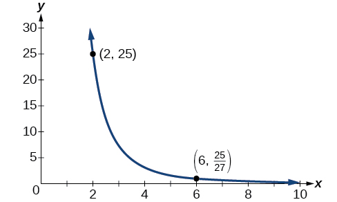{: #Figure_03_09_004}

A quantity<math xmlns="http://www.w3.org/1998/Math/MathML"> <mrow> <mtext> </mtext><mi>y</mi><mtext> </mtext></mrow> </math>

varies inversely with the square of<math xmlns="http://www.w3.org/1998/Math/MathML"> <mrow> <mtext> </mtext><mi>x</mi><mo>.</mo><mtext> </mtext></mrow> </math>

If<math xmlns="http://www.w3.org/1998/Math/MathML"> <mrow> <mtext> </mtext><mi>y</mi><mo>=</mo><mn>8</mn><mtext> </mtext></mrow> </math>

when<math xmlns="http://www.w3.org/1998/Math/MathML"> <mrow> <mtext> </mtext><mi>x</mi><mo>=</mo><mn>3</mn><mo>,</mo><mtext> </mtext></mrow> </math>

find<math xmlns="http://www.w3.org/1998/Math/MathML"> <mrow> <mtext> </mtext><mi>y</mi><mtext> </mtext></mrow> </math>

when<math xmlns="http://www.w3.org/1998/Math/MathML"> <mrow> <mtext> </mtext><mi>x</mi><mtext> </mtext></mrow> </math>

is 4.

<math xmlns="http://www.w3.org/1998/Math/MathML"> <mrow> <mtext> </mtext><mfrac> <mn>9</mn> <mn>2</mn> </mfrac> <mtext> </mtext></mrow> </math>

### Solving Problems Involving Joint Variation

Many situations are more complicated than a basic direct variation or inverse variation model. One variable often depends on multiple other variables. When a variable is dependent on the product or quotient of two or more variables, this is called **joint variation**{: data-type="term"}. For example, the cost of busing students for each school trip varies with the number of students attending and the distance from the school. The variable<math xmlns="http://www.w3.org/1998/Math/MathML"> <mrow> <mtext> </mtext><mi>c</mi><mo>,</mo> </mrow> </math>

cost, varies jointly with the number of students,<math xmlns="http://www.w3.org/1998/Math/MathML"> <mrow> <mtext> </mtext><mi>n</mi><mo>,</mo> </mrow> </math>

and the distance,<math xmlns="http://www.w3.org/1998/Math/MathML"> <mrow> <mtext> </mtext><mi>d</mi><mo>.</mo><mtext> </mtext></mrow> </math>

Joint Variation

Joint variation occurs when a variable varies directly or inversely with multiple variables.

For instance, if<math xmlns="http://www.w3.org/1998/Math/MathML"> <mrow> <mtext> </mtext><mi>x</mi><mtext> </mtext></mrow> </math>

varies directly with both<math xmlns="http://www.w3.org/1998/Math/MathML"> <mrow> <mtext> </mtext><mi>y</mi><mtext> </mtext></mrow> </math>

and<math xmlns="http://www.w3.org/1998/Math/MathML"> <mrow> <mtext> </mtext><mi>z</mi><mo>,</mo><mtext> </mtext></mrow> </math>

 we have<math xmlns="http://www.w3.org/1998/Math/MathML"> <mrow> <mtext> </mtext><mi>x</mi><mo>=</mo><mi>k</mi><mi>y</mi><mi>z</mi><mo>.</mo><mtext> </mtext></mrow> </math>

If<math xmlns="http://www.w3.org/1998/Math/MathML"> <mrow> <mtext> </mtext><mi>x</mi><mtext> </mtext></mrow> </math>

varies directly with<math xmlns="http://www.w3.org/1998/Math/MathML"> <mrow> <mtext> </mtext><mi>y</mi><mtext> </mtext></mrow> </math>

and inversely with<math xmlns="http://www.w3.org/1998/Math/MathML"> <mrow> <mi>z</mi><mo>,</mo></mrow> </math>

we have<math xmlns="http://www.w3.org/1998/Math/MathML"> <mrow> <mtext> </mtext><mi>x</mi><mo>=</mo><mfrac> <mrow> <mi>k</mi><mi>y</mi></mrow> <mi>z</mi> </mfrac> <mo>.</mo><mtext> </mtext></mrow> </math>

Notice that we only use one constant in a joint variation equation.

Solving Problems Involving Joint Variation

A quantity<math xmlns="http://www.w3.org/1998/Math/MathML"> <mrow> <mtext> </mtext><mi>x</mi><mtext> </mtext></mrow> </math>

varies directly with the square of<math xmlns="http://www.w3.org/1998/Math/MathML"> <mrow> <mtext> </mtext><mi>y</mi><mtext> </mtext></mrow> </math>

and inversely with the cube root of<math xmlns="http://www.w3.org/1998/Math/MathML"> <mrow> <mtext> </mtext><mi>z</mi><mo>.</mo><mtext> </mtext></mrow> </math>

If<math xmlns="http://www.w3.org/1998/Math/MathML"> <mrow> <mtext> </mtext><mi>x</mi><mo>=</mo><mn>6</mn><mtext> </mtext></mrow> </math>

when<math xmlns="http://www.w3.org/1998/Math/MathML"> <mrow> <mtext> </mtext><mi>y</mi><mo>=</mo><mn>2</mn><mtext> </mtext></mrow> </math>

 and<math xmlns="http://www.w3.org/1998/Math/MathML"> <mrow> <mtext> </mtext><mi>z</mi><mo>=</mo><mn>8</mn><mo>,</mo><mtext> </mtext></mrow> </math>

find<math xmlns="http://www.w3.org/1998/Math/MathML"> <mrow> <mtext> </mtext><mi>x</mi><mtext> </mtext></mrow> </math>

when<math xmlns="http://www.w3.org/1998/Math/MathML"> <mrow> <mtext> </mtext><mi>y</mi><mo>=</mo><mn>1</mn><mtext> </mtext></mrow> </math>

 and <math xmlns="http://www.w3.org/1998/Math/MathML"> <mrow> <mtext> </mtext><mi>z</mi><mo>=</mo><mn>27.</mn><mtext> </mtext></mrow> </math>

Begin by writing an equation to show the relationship between the variables.

<math xmlns="http://www.w3.org/1998/Math/MathML" display="block"> <mrow> <mi>x</mi><mo>=</mo><mfrac> <mrow> <mi>k</mi><msup> <mi>y</mi> <mn>2</mn> </msup> </mrow> <mrow> <mroot> <mi>z</mi> <mn>3</mn> </mroot> </mrow> </mfrac> </mrow> </math>

Substitute<math xmlns="http://www.w3.org/1998/Math/MathML"> <mrow> <mtext> </mtext><mi>x</mi><mo>=</mo><mn>6</mn><mo>,</mo><mtext> </mtext></mrow> </math>

<math xmlns="http://www.w3.org/1998/Math/MathML"> <mrow> <mi>y</mi><mo>=</mo><mn>2</mn><mo>,</mo><mtext> </mtext></mrow> </math>

and<math xmlns="http://www.w3.org/1998/Math/MathML"> <mrow> <mtext> </mtext><mi>z</mi><mo>=</mo><mn>8</mn><mtext> </mtext></mrow> </math>

to find the value of the constant<math xmlns="http://www.w3.org/1998/Math/MathML"> <mrow> <mtext> </mtext><mi>k</mi><mo>.</mo><mtext> </mtext></mrow> </math>

<math xmlns="http://www.w3.org/1998/Math/MathML" display="block"> <mrow> <mtable> <mtr> <mtd columnalign="right"> <mn>6</mn> </mtd> <mtd> <mo>=</mo> </mtd> <mtd columnalign="left"> <mrow> <mfrac> <mrow> <mi>k</mi><msup> <mn>2</mn> <mn>2</mn> </msup> </mrow> <mrow> <mroot> <mn>8</mn> <mn>3</mn> </mroot> </mrow> </mfrac> </mrow> </mtd> </mtr> <mtr> <mtd columnalign="right"> <mn>6</mn> </mtd> <mtd> <mo>=</mo> </mtd> <mtd columnalign="left"> <mrow> <mfrac> <mrow> <mn>4</mn><mi>k</mi> </mrow> <mn>2</mn> </mfrac> </mrow> </mtd> </mtr> <mtr> <mtd columnalign="right"> <mn>3</mn> </mtd> <mtd rowalign="center"> <mo>=</mo> </mtd> <mtd columnalign="left"> <mi>k</mi> </mtd> </mtr> </mtable> </mrow> </math>

Now we can substitute the value of the constant into the equation for the relationship.

<math xmlns="http://www.w3.org/1998/Math/MathML" display="block"> <mrow> <mi>x</mi><mo>=</mo><mfrac> <mrow> <mn>3</mn><msup> <mi>y</mi> <mn>2</mn> </msup> </mrow> <mrow> <mroot> <mi>z</mi> <mn>3</mn> </mroot> </mrow> </mfrac> </mrow> </math>

To find<math xmlns="http://www.w3.org/1998/Math/MathML"> <mrow> <mtext> </mtext><mi>x</mi><mtext> </mtext></mrow> </math>

when<math xmlns="http://www.w3.org/1998/Math/MathML"> <mrow> <mtext> </mtext><mi>y</mi><mo>=</mo><mn>1</mn><mtext> </mtext></mrow> </math>

and<math xmlns="http://www.w3.org/1998/Math/MathML"> <mrow> <mtext> </mtext><mi>z</mi><mo>=</mo><mn>27</mn><mo>,</mo><mtext> </mtext></mrow> </math>

we will substitute values for<math xmlns="http://www.w3.org/1998/Math/MathML"> <mrow> <mtext> </mtext><mi>y</mi><mtext> </mtext></mrow> </math>

and<math xmlns="http://www.w3.org/1998/Math/MathML"> <mrow> <mtext> </mtext><mi>z</mi><mtext> </mtext></mrow> </math>

into our equation.

<math xmlns="http://www.w3.org/1998/Math/MathML" display="block"> <mrow> <mtable> <mtr rowalign="center"> <mtd columnalign="right" rowalign="center"> <mi>x</mi> </mtd> <mtd rowalign="center"> <mo>=</mo> </mtd> <mtd columnalign="right" rowalign="center"> <mrow> <mfrac> <mrow> <mn>3</mn><msup> <mrow> <mo stretchy="false">(</mo><mn>1</mn><mo stretchy="false">)</mo> </mrow> <mn>2</mn> </msup> </mrow> <mrow> <mroot> <mrow> <mn>27</mn> </mrow> <mn>3</mn> </mroot> </mrow> </mfrac> </mrow> </mtd> </mtr> <mtr rowalign="center"> <mtd rowalign="center" /> <mtd rowalign="center"> <mo>=</mo> </mtd> <mtd columnalign="left" rowalign="center"> <mn>1</mn> </mtd> </mtr> </mtable> </mrow> </math>

A quantity<math xmlns="http://www.w3.org/1998/Math/MathML"> <mrow> <mtext> </mtext><mi>x</mi><mtext> </mtext></mrow> </math>

varies directly with the square of<math xmlns="http://www.w3.org/1998/Math/MathML"> <mrow> <mtext> </mtext><mi>y</mi><mtext> </mtext></mrow> </math>

and inversely with<math xmlns="http://www.w3.org/1998/Math/MathML"> <mrow> <mtext> </mtext><mi>z</mi><mo>.</mo><mtext> </mtext></mrow> </math>

If<math xmlns="http://www.w3.org/1998/Math/MathML"> <mrow> <mtext> </mtext><mi>x</mi><mo>=</mo><mn>40</mn><mtext> </mtext></mrow> </math>

when<math xmlns="http://www.w3.org/1998/Math/MathML"> <mrow> <mtext> </mtext><mi>y</mi><mo>=</mo><mn>4</mn><mtext> </mtext></mrow> </math>

and<math xmlns="http://www.w3.org/1998/Math/MathML"> <mrow> <mtext> </mtext><mi>z</mi><mo>=</mo><mn>2</mn><mo>,</mo><mtext> </mtext></mrow> </math>

find<math xmlns="http://www.w3.org/1998/Math/MathML"> <mrow> <mtext> </mtext><mi>x</mi><mtext> </mtext></mrow> </math>

when<math xmlns="http://www.w3.org/1998/Math/MathML"> <mrow> <mtext> </mtext><mi>y</mi><mo>=</mo><mn>10</mn><mtext> </mtext></mrow> </math>

 and<math xmlns="http://www.w3.org/1998/Math/MathML"> <mrow> <mtext> </mtext><mi>z</mi><mo>=</mo><mn>25.</mn></mrow> </math>

<math xmlns="http://www.w3.org/1998/Math/MathML"> <mrow> <mtext> </mtext><mi>x</mi><mo>=</mo><mn>20</mn><mtext> </mtext></mrow> </math>

Access these online resources for additional instruction and practice with direct and inverse variation.

* [Direct Variation][1]
* [Inverse Variation][2]
* [Direct and Inverse Variation][3]

Visit [this website][4] for additional practice questions from Learningpod.

### Key Equations

| Direct variation | <math xmlns="http://www.w3.org/1998/Math/MathML" display="block"> <mrow> <mi>y</mi><mo>=</mo><mi>k</mi><msup> <mi>x</mi> <mi>n</mi> </msup> <mo>,</mo><mi>k</mi><mtext> is a nonzero constant</mtext><mo>.</mo> </mrow> </math>

 |
| Inverse variation | <math xmlns="http://www.w3.org/1998/Math/MathML" display="block"> <mrow> <mi>y</mi><mo>=</mo><mfrac> <mi>k</mi> <mrow> <msup> <mi>x</mi> <mi>n</mi> </msup> </mrow> </mfrac> <mo>,</mo><mi>k</mi><mtext> is a nonzero constant</mtext><mo>.</mo> </mrow> </math>

 |
{: #eip-id1165133094986 summary=".."}

### Key Concepts

* A relationship where one quantity is a constant multiplied by another quantity is called direct variation. See [\[link\]](#Example_03_09_01).
* Two variables that are directly proportional to one another will have a constant ratio.
* A relationship where one quantity is a constant divided by another quantity is called inverse variation. See [\[link\]](#Example_03_09_02).
* Two variables that are inversely proportional to one another will have a constant multiple. See [\[link\]](#Example_03_09_03).
* In many problems, a variable varies directly or inversely with multiple variables. We call this type of relationship joint variation. See [\[link\]](#Example_03_09_04).

### Section Exercises

#### Verbal

What is true of the appearance of graphs that reflect a direct variation between two variables?

The graph will have the appearance of a power function.

If two variables vary inversely, what will an equation representing their relationship look like?

Is there a limit to the number of variables that can vary jointly? Explain.

No. Multiple variables may jointly vary.

#### Algebraic

For the following exercises, write an equation describing the relationship of the given variables.

<math xmlns="http://www.w3.org/1998/Math/MathML"> <mrow> <mtext> </mtext><mi>y</mi><mtext> </mtext></mrow> </math>

varies directly as<math xmlns="http://www.w3.org/1998/Math/MathML"> <mrow> <mtext> </mtext><mi>x</mi><mtext> </mtext></mrow> </math>

and when<math xmlns="http://www.w3.org/1998/Math/MathML"> <mrow> <mtext> </mtext><mi>x</mi><mo>=</mo><mn>6</mn><mo>,</mo><mo> </mo><mi>y</mi><mo>=</mo><mn>12.</mn></mrow> </math>

<math xmlns="http://www.w3.org/1998/Math/MathML"> <mrow> <mtext> </mtext><mi>y</mi><mtext> </mtext></mrow> </math>

varies directly as the square of<math xmlns="http://www.w3.org/1998/Math/MathML"> <mrow> <mtext> </mtext><mi>x</mi><mtext> </mtext></mrow> </math>

and when<math xmlns="http://www.w3.org/1998/Math/MathML"> <mrow> <mtext> </mtext><mi>x</mi><mo>=</mo><mn>4</mn><mo>,</mo><mtext> </mtext><mo> </mo><mi>y</mi><mo>=</mo><mn>80</mn><mtext>. </mtext></mrow> </math>

<math xmlns="http://www.w3.org/1998/Math/MathML"> <mrow> <mi>y</mi><mo>=</mo><mn>5</mn><msup> <mi>x</mi> <mn>2</mn> </msup> </mrow> </math>

<math xmlns="http://www.w3.org/1998/Math/MathML"> <mrow> <mtext> </mtext><mi>y</mi><mtext> </mtext></mrow> </math>

varies directly as the square root of<math xmlns="http://www.w3.org/1998/Math/MathML"> <mrow> <mtext> </mtext><mi>x</mi><mtext> </mtext></mrow> </math>

and when<math xmlns="http://www.w3.org/1998/Math/MathML"> <mrow> <mtext> </mtext><mi>x</mi><mo>=</mo><mn>36</mn><mo>,</mo><mo> </mo><mtext> </mtext><mi>y</mi><mo>=</mo><mn>24.</mn></mrow> </math>

<math xmlns="http://www.w3.org/1998/Math/MathML"> <mrow> <mtext> </mtext><mi>y</mi><mtext> </mtext></mrow> </math>

varies directly as the cube of<math xmlns="http://www.w3.org/1998/Math/MathML"> <mrow> <mtext> </mtext><mi>x</mi><mtext> </mtext></mrow> </math>

and when<math xmlns="http://www.w3.org/1998/Math/MathML"> <mrow> <mtext> </mtext><mi>x</mi><mo>=</mo><mn>36</mn><mo>,</mo><mtext> </mtext><mi>y</mi><mo>=</mo><mn>24.</mn> </mrow> </math>

<math xmlns="http://www.w3.org/1998/Math/MathML"> <mrow> <mi>y</mi><mo>=</mo><mn>10</mn><msup> <mi>x</mi> <mn>3</mn> </msup> </mrow> </math>

<math xmlns="http://www.w3.org/1998/Math/MathML"> <mrow> <mtext> </mtext><mi>y</mi><mtext> </mtext></mrow> </math>

varies directly as the cube root of<math xmlns="http://www.w3.org/1998/Math/MathML"> <mrow> <mtext> </mtext><mi>x</mi><mtext> </mtext></mrow> </math>

and when<math xmlns="http://www.w3.org/1998/Math/MathML"> <mrow> <mtext> </mtext><mi>x</mi><mo>=</mo><mn>27</mn><mo>,</mo><mtext> </mtext><mo> </mo><mi>y</mi><mo>=</mo><mn>15.</mn></mrow> </math>

<math xmlns="http://www.w3.org/1998/Math/MathML"> <mrow> <mtext> </mtext><mi>y</mi><mtext> </mtext></mrow> </math>

varies directly as the fourth power of<math xmlns="http://www.w3.org/1998/Math/MathML"> <mrow> <mtext> </mtext><mi>x</mi><mtext> </mtext></mrow> </math>

and when<math xmlns="http://www.w3.org/1998/Math/MathML"> <mrow> <mtext> </mtext><mi>x</mi><mo>=</mo><mn>1</mn><mo>,</mo><mtext> </mtext><mo> </mo><mi>y</mi><mo>=</mo><mn>6.</mn></mrow> </math>

<math xmlns="http://www.w3.org/1998/Math/MathML"> <mrow> <mi>y</mi><mo>=</mo><mn>6</mn><msup> <mi>x</mi> <mn>4</mn> </msup> </mrow> </math>

<math xmlns="http://www.w3.org/1998/Math/MathML"> <mrow> <mtext> </mtext><mi>y</mi><mtext> </mtext></mrow> </math>

varies inversely as<math xmlns="http://www.w3.org/1998/Math/MathML"> <mrow> <mtext> </mtext><mi>x</mi><mtext> </mtext></mrow> </math>

and when<math xmlns="http://www.w3.org/1998/Math/MathML"> <mrow> <mtext> </mtext><mi>x</mi><mo>=</mo><mn>4</mn><mo>,</mo><mtext> </mtext><mo> </mo><mi>y</mi><mo>=</mo><mn>2.</mn></mrow> </math>

<math xmlns="http://www.w3.org/1998/Math/MathML"> <mrow> <mtext> </mtext><mi>y</mi><mtext> </mtext></mrow> </math>

varies inversely as the square of<math xmlns="http://www.w3.org/1998/Math/MathML"> <mrow> <mtext> </mtext><mi>x</mi><mtext> </mtext></mrow> </math>

and when<math xmlns="http://www.w3.org/1998/Math/MathML"> <mrow> <mtext> </mtext><mi>x</mi><mo>=</mo><mn>3</mn><mo>,</mo><mtext> </mtext><mo> </mo><mi>y</mi><mo>=</mo><mn>2.</mn></mrow> </math>

<math xmlns="http://www.w3.org/1998/Math/MathML"> <mrow> <mi>y</mi><mo>=</mo><mfrac> <mrow> <mn>18</mn></mrow> <mrow> <msup> <mi>x</mi> <mn>2</mn> </msup> </mrow> </mfrac> </mrow> </math>

<math xmlns="http://www.w3.org/1998/Math/MathML"> <mrow> <mtext> </mtext><mi>y</mi><mtext> </mtext></mrow> </math>

varies inversely as the cube of<math xmlns="http://www.w3.org/1998/Math/MathML"> <mrow> <mtext> </mtext><mi>x</mi><mtext> </mtext></mrow> </math>

and when<math xmlns="http://www.w3.org/1998/Math/MathML"> <mrow> <mtext> </mtext><mi>x</mi><mo>=</mo><mn>2</mn><mo>,</mo><mtext> </mtext><mo> </mo><mi>y</mi><mo>=</mo><mn>5.</mn></mrow> </math>

<math xmlns="http://www.w3.org/1998/Math/MathML"> <mrow> <mtext> </mtext><mi>y</mi><mtext> </mtext></mrow> </math>

varies inversely as the fourth power of<math xmlns="http://www.w3.org/1998/Math/MathML"> <mrow> <mtext> </mtext><mi>x</mi><mtext> </mtext></mrow> </math>

and when<math xmlns="http://www.w3.org/1998/Math/MathML"> <mrow> <mtext> </mtext><mi>x</mi><mo>=</mo><mn>3</mn><mo>,</mo><mtext> </mtext><mo> </mo><mi>y</mi><mo>=</mo><mn>1.</mn><mtext> </mtext></mrow> </math>

<math xmlns="http://www.w3.org/1998/Math/MathML"> <mrow> <mi>y</mi><mo>=</mo><mfrac> <mrow> <mn>81</mn></mrow> <mrow> <msup> <mi>x</mi> <mn>4</mn> </msup> </mrow> </mfrac> </mrow> </math>

<math xmlns="http://www.w3.org/1998/Math/MathML"> <mrow> <mtext> </mtext><mi>y</mi><mtext> </mtext></mrow> </math>

varies inversely as the square root of<math xmlns="http://www.w3.org/1998/Math/MathML"> <mrow> <mtext> </mtext><mi>x</mi><mtext> </mtext></mrow> </math>

and when<math xmlns="http://www.w3.org/1998/Math/MathML"> <mrow> <mtext> </mtext><mi>x</mi><mo>=</mo><mn>25</mn><mo>,</mo><mo> </mo><mtext> </mtext><mi>y</mi><mo>=</mo><mn>3.</mn></mrow> </math>

<math xmlns="http://www.w3.org/1998/Math/MathML"> <mrow> <mtext> </mtext><mi>y</mi><mtext> </mtext></mrow> </math>

varies inversely as the cube root of<math xmlns="http://www.w3.org/1998/Math/MathML"> <mrow> <mtext> </mtext><mi>x</mi><mtext> </mtext></mrow> </math>

and when<math xmlns="http://www.w3.org/1998/Math/MathML"> <mrow> <mtext> </mtext><mi>x</mi><mo>=</mo><mn>64</mn><mo>,</mo><mo> </mo><mtext> </mtext><mi>y</mi><mo>=</mo><mn>5.</mn></mrow> </math>

<math xmlns="http://www.w3.org/1998/Math/MathML"> <mrow> <mi>y</mi><mo>=</mo><mfrac> <mrow> <mn>20</mn></mrow> <mrow> <mroot> <mi>x</mi> <mn>3</mn> </mroot> </mrow> </mfrac> </mrow> </math>

<math xmlns="http://www.w3.org/1998/Math/MathML"> <mrow> <mtext> </mtext><mi>y</mi><mtext> </mtext></mrow> </math>

varies jointly with<math xmlns="http://www.w3.org/1998/Math/MathML"> <mrow> <mtext> </mtext><mi>x</mi><mtext> </mtext></mrow> </math>

and<math xmlns="http://www.w3.org/1998/Math/MathML"> <mrow> <mtext> </mtext><mi>z</mi><mtext> </mtext></mrow> </math>

and when<math xmlns="http://www.w3.org/1998/Math/MathML"> <mrow> <mtext> </mtext><mi>x</mi><mo>=</mo><mn>2</mn><mtext> </mtext></mrow> </math>

and<math xmlns="http://www.w3.org/1998/Math/MathML"> <mrow> <mtext> </mtext><mi>z</mi><mo>=</mo><mn>3</mn><mo>,</mo><mtext> </mtext><mo> </mo><mi>y</mi><mo>=</mo><mn>36.</mn></mrow> </math>

<math xmlns="http://www.w3.org/1998/Math/MathML"> <mrow> <mtext> </mtext><mi>y</mi><mtext> </mtext></mrow> </math>

varies jointly as<math xmlns="http://www.w3.org/1998/Math/MathML"> <mrow> <mtext> </mtext><mi>x</mi><mo>,</mo><mo> </mo><mi>z</mi><mo>,</mo><mtext> </mtext></mrow> </math>

and<math xmlns="http://www.w3.org/1998/Math/MathML"> <mrow> <mtext> </mtext><mi>w</mi><mtext> </mtext></mrow> </math>

and when<math xmlns="http://www.w3.org/1998/Math/MathML"> <mrow> <mtext> </mtext><mi>x</mi><mo>=</mo><mn>1</mn><mo>,</mo><mtext> </mtext><mo> </mo><mi>z</mi><mo>=</mo><mn>2</mn><mo>,</mo><mtext> </mtext><mo> </mo><mi>w</mi><mo>=</mo><mn>5</mn><mo>,</mo><mtext> </mtext></mrow> </math>

then<math xmlns="http://www.w3.org/1998/Math/MathML"> <mrow> <mtext> </mtext><mi>y</mi><mo>=</mo><mn>100.</mn></mrow> </math>

<math xmlns="http://www.w3.org/1998/Math/MathML"> <mrow> <mi>y</mi><mo>=</mo><mn>10</mn><mi>x</mi><mi>z</mi><mi>w</mi></mrow> </math>

<math xmlns="http://www.w3.org/1998/Math/MathML"> <mrow> <mtext> </mtext><mi>y</mi><mtext> </mtext></mrow> </math>

varies jointly as the square of<math xmlns="http://www.w3.org/1998/Math/MathML"> <mrow> <mtext> </mtext><mi>x</mi><mtext> </mtext></mrow> </math>

and the square of<math xmlns="http://www.w3.org/1998/Math/MathML"> <mrow> <mtext> </mtext><mi>z</mi><mtext> </mtext></mrow> </math>

and when<math xmlns="http://www.w3.org/1998/Math/MathML"> <mrow> <mtext> </mtext><mi>x</mi><mo>=</mo><mn>3</mn><mtext> </mtext></mrow> </math>

and<math xmlns="http://www.w3.org/1998/Math/MathML"> <mrow> <mtext> </mtext><mi>z</mi><mo>=</mo><mn>4</mn><mo>,</mo><mtext> </mtext></mrow> </math>

then<math xmlns="http://www.w3.org/1998/Math/MathML"> <mrow> <mtext> </mtext><mi>y</mi><mo>=</mo><mn>72.</mn></mrow> </math>

<math xmlns="http://www.w3.org/1998/Math/MathML"> <mrow> <mtext> </mtext><mi>y</mi><mtext> </mtext></mrow> </math>

varies jointly as<math xmlns="http://www.w3.org/1998/Math/MathML"> <mrow> <mtext> </mtext><mi>x</mi><mtext> </mtext></mrow> </math>

and the square root of<math xmlns="http://www.w3.org/1998/Math/MathML"> <mrow> <mtext> </mtext><mi>z</mi><mtext> </mtext></mrow> </math>

and when<math xmlns="http://www.w3.org/1998/Math/MathML"> <mrow> <mtext> </mtext><mi>x</mi><mo>=</mo><mn>2</mn><mtext> </mtext></mrow> </math>

and<math xmlns="http://www.w3.org/1998/Math/MathML"> <mrow> <mtext> </mtext><mi>z</mi><mo>=</mo><mn>25</mn><mo>,</mo><mtext> </mtext></mrow> </math>

then<math xmlns="http://www.w3.org/1998/Math/MathML"> <mrow> <mtext> </mtext><mi>y</mi><mo>=</mo><mn>100.</mn></mrow> </math>

<math xmlns="http://www.w3.org/1998/Math/MathML"> <mrow> <mi>y</mi><mo>=</mo><mn>10</mn><mi>x</mi><msqrt> <mi>z</mi> </msqrt> </mrow> </math>

<math xmlns="http://www.w3.org/1998/Math/MathML"> <mrow> <mtext> </mtext><mi>y</mi></mrow> </math>

varies jointly as the square of<math xmlns="http://www.w3.org/1998/Math/MathML"> <mrow> <mtext> </mtext><mi>x</mi></mrow> </math>

the cube of<math xmlns="http://www.w3.org/1998/Math/MathML"> <mrow> <mtext> </mtext><mi>z</mi></mrow> </math>

and the square root of<math xmlns="http://www.w3.org/1998/Math/MathML"> <mrow> <mtext> </mtext><mi>W</mi><mo>.</mo><mtext> </mtext> </mrow> </math>

When<math xmlns="http://www.w3.org/1998/Math/MathML"> <mrow> <mtext> </mtext><mi>x</mi><mo>=</mo><mn>1</mn><mo>,</mo><mi>z</mi><mo>=</mo><mn>2</mn><mo>,</mo><mtext> </mtext></mrow> </math>

and<math xmlns="http://www.w3.org/1998/Math/MathML"> <mrow> <mtext> </mtext><mi>w</mi><mo>=</mo><mn>36</mn><mo>,</mo><mtext> </mtext></mrow> </math>

then<math xmlns="http://www.w3.org/1998/Math/MathML"> <mrow> <mtext> </mtext><mi>y</mi><mo>=</mo><mn>48.</mn></mrow> </math>

<math xmlns="http://www.w3.org/1998/Math/MathML"> <mrow> <mtext> </mtext><mi>y</mi><mtext> </mtext></mrow> </math>

 varies jointly as<math xmlns="http://www.w3.org/1998/Math/MathML"> <mrow> <mtext> </mtext><mi>x</mi><mo> </mo><mtext>and</mtext><mo> </mo><mi>z</mi><mtext> </mtext></mrow> </math>

and inversely as<math xmlns="http://www.w3.org/1998/Math/MathML"> <mrow> <mtext> </mtext><mi>w</mi><mo>.</mo><mtext> </mtext> </mrow> </math>

When<math xmlns="http://www.w3.org/1998/Math/MathML"> <mrow> <mtext> </mtext><mi>x</mi><mo>=</mo><mn>3</mn><mo>,</mo><mo> </mo><mtext> </mtext><mi>z</mi><mo>=</mo><mn>5</mn><mo>,</mo><mtext> </mtext></mrow> </math>

and<math xmlns="http://www.w3.org/1998/Math/MathML"> <mrow> <mtext> </mtext><mi>w</mi><mo>=</mo><mn>6</mn><mo>,</mo><mtext> </mtext></mrow> </math>

then<math xmlns="http://www.w3.org/1998/Math/MathML"> <mrow> <mtext> </mtext><mi>y</mi><mo>=</mo><mn>10.</mn></mrow> </math>

<math xmlns="http://www.w3.org/1998/Math/MathML"> <mrow> <mi>y</mi><mo>=</mo><mn>4</mn><mfrac> <mrow> <mi>x</mi><mi>z</mi></mrow> <mi>w</mi> </mfrac> </mrow> </math>

<math xmlns="http://www.w3.org/1998/Math/MathML"> <mrow> <mtext> </mtext><mi>y</mi><mtext> </mtext></mrow> </math>

varies jointly as the square of<math xmlns="http://www.w3.org/1998/Math/MathML"> <mrow> <mtext> </mtext><mi>x</mi><mtext> </mtext></mrow> </math>

and the square root of<math xmlns="http://www.w3.org/1998/Math/MathML"> <mrow> <mtext> </mtext><mi>z</mi><mtext> </mtext></mrow> </math>

and inversely as the cube of<math xmlns="http://www.w3.org/1998/Math/MathML"> <mrow> <mtext> </mtext><mi>w</mi><mtext>. </mtext></mrow> </math>

When<math xmlns="http://www.w3.org/1998/Math/MathML"> <mrow> <mtext> </mtext><mi>x</mi><mo>=</mo><mn>3</mn><mo>,</mo><mi>z</mi><mo>=</mo><mn>4</mn><mo>,</mo><mtext> </mtext></mrow> </math>

and<math xmlns="http://www.w3.org/1998/Math/MathML"> <mrow> <mtext> </mtext><mi>w</mi><mo>=</mo><mn>3</mn><mo>,</mo><mtext> </mtext></mrow> </math>

then<math xmlns="http://www.w3.org/1998/Math/MathML"> <mrow> <mtext> </mtext><mi>y</mi><mo>=</mo><mn>6.</mn></mrow> </math>

<math xmlns="http://www.w3.org/1998/Math/MathML"> <mrow> <mtext> </mtext><mi>y</mi><mtext> </mtext></mrow> </math>

varies jointly as<math xmlns="http://www.w3.org/1998/Math/MathML"> <mrow> <mtext> </mtext><mi>x</mi><mtext> </mtext></mrow> </math>

and<math xmlns="http://www.w3.org/1998/Math/MathML"> <mrow> <mtext> </mtext><mi>z</mi><mtext> </mtext></mrow> </math>

and inversely as the square root of<math xmlns="http://www.w3.org/1998/Math/MathML"> <mrow> <mtext> </mtext><mi>w</mi><mtext> </mtext></mrow> </math>

and the square of<math xmlns="http://www.w3.org/1998/Math/MathML"> <mrow> <mtext> </mtext><mi>t</mi><mtext> .</mtext></mrow> </math>

When<math xmlns="http://www.w3.org/1998/Math/MathML"> <mrow> <mtext> </mtext><mi>x</mi><mo>=</mo><mn>3</mn><mo>,</mo><mi>z</mi><mo>=</mo><mn>1</mn><mo>,</mo><mi>w</mi><mo>=</mo><mn>25</mn><mo>,</mo><mtext> </mtext></mrow> </math>

and<math xmlns="http://www.w3.org/1998/Math/MathML"> <mrow> <mtext> </mtext><mi>t</mi><mo>=</mo><mn>2</mn><mo>,</mo><mtext> </mtext></mrow> </math>

then<math xmlns="http://www.w3.org/1998/Math/MathML"> <mrow> <mtext> </mtext><mi>y</mi><mo>=</mo><mn>6.</mn></mrow> </math>

<math xmlns="http://www.w3.org/1998/Math/MathML"> <mrow> <mi>y</mi><mo>=</mo><mn>40</mn><mfrac> <mrow> <mi>x</mi><mi>z</mi></mrow> <mrow> <msqrt> <mi>w</mi> </msqrt> <msup> <mi>t</mi> <mn>2</mn> </msup> </mrow> </mfrac> </mrow> </math>

#### Numeric

For the following exercises, use the given information to find the unknown value.

<math xmlns="http://www.w3.org/1998/Math/MathML"> <mrow> <mtext> </mtext><mi>y</mi><mtext> </mtext></mrow> </math>

varies directly as<math xmlns="http://www.w3.org/1998/Math/MathML"> <mrow> <mtext> </mtext><mi>x</mi><mo>.</mo><mtext> </mtext> </mrow> </math>

When<math xmlns="http://www.w3.org/1998/Math/MathML"> <mrow> <mtext> </mtext><mi>x</mi><mo>=</mo><mn>3</mn><mo>,</mo><mtext> </mtext></mrow> </math>

then<math xmlns="http://www.w3.org/1998/Math/MathML"> <mrow> <mtext> </mtext><mi>y</mi><mo>=</mo><mn>12.</mn><mtext> </mtext></mrow> </math>

Find<math xmlns="http://www.w3.org/1998/Math/MathML"> <mrow> <mtext> </mtext><mi>y</mi><mtext> </mtext></mrow> </math>

wneh<math xmlns="http://www.w3.org/1998/Math/MathML"> <mrow> <mtext> </mtext><mi>x</mi><mo>=</mo><mn>20.</mn></mrow> </math>

<math xmlns="http://www.w3.org/1998/Math/MathML"> <mrow> <mtext> </mtext><mi>y</mi><mtext> </mtext></mrow> </math>

varies directly as the square of<math xmlns="http://www.w3.org/1998/Math/MathML"> <mrow> <mtext> </mtext><mi>x</mi><mo>.</mo><mtext> </mtext> </mrow> </math>

When<math xmlns="http://www.w3.org/1998/Math/MathML"> <mrow> <mtext> </mtext><mi>x</mi><mo>=</mo><mn>2</mn><mo>,</mo><mtext> </mtext></mrow> </math>

then<math xmlns="http://www.w3.org/1998/Math/MathML"> <mrow> <mtext> </mtext><mi>y</mi><mo>=</mo><mn>16.</mn><mtext> </mtext></mrow> </math>

Find<math xmlns="http://www.w3.org/1998/Math/MathML"> <mrow> <mtext> </mtext><mi>y</mi><mtext> </mtext></mrow> </math>

when<math xmlns="http://www.w3.org/1998/Math/MathML"> <mrow> <mi>x</mi><mo>=</mo><mn>8.</mn></mrow> </math>

<math xmlns="http://www.w3.org/1998/Math/MathML"> <mrow> <mi>y</mi><mo>=</mo><mn>256</mn></mrow> </math>

<math xmlns="http://www.w3.org/1998/Math/MathML"> <mrow> <mtext> </mtext><mi>y</mi><mtext> </mtext></mrow> </math>

varies directly as the cube of<math xmlns="http://www.w3.org/1998/Math/MathML"> <mrow> <mtext> </mtext><mi>x</mi><mo>.</mo><mtext> </mtext> </mrow> </math>

When<math xmlns="http://www.w3.org/1998/Math/MathML"> <mrow> <mtext> </mtext><mi>x</mi><mo>=</mo><mn>3</mn><mo>,</mo><mtext> </mtext></mrow> </math>

then<math xmlns="http://www.w3.org/1998/Math/MathML"> <mrow> <mtext> </mtext><mi>y</mi><mo>=</mo><mn>5.</mn><mo> </mo><mtext> </mtext></mrow> </math>

Find<math xmlns="http://www.w3.org/1998/Math/MathML"> <mrow> <mtext> </mtext><mi>y</mi><mtext> </mtext></mrow> </math>

when<math xmlns="http://www.w3.org/1998/Math/MathML"> <mrow> <mtext> </mtext><mi>x</mi><mo>=</mo><mn>4.</mn></mrow> </math>

<math xmlns="http://www.w3.org/1998/Math/MathML"> <mrow> <mtext> </mtext><mi>y</mi><mtext> </mtext></mrow> </math>

varies directly as the square root of<math xmlns="http://www.w3.org/1998/Math/MathML"> <mrow> <mtext> </mtext><mi>x</mi><mo>.</mo><mtext> </mtext> </mrow> </math>

When<math xmlns="http://www.w3.org/1998/Math/MathML"> <mrow> <mtext> </mtext><mi>x</mi><mo>=</mo><mn>16</mn><mo>,</mo><mtext> </mtext></mrow> </math>

then<math xmlns="http://www.w3.org/1998/Math/MathML"> <mrow> <mtext> </mtext><mi>y</mi><mo>=</mo><mn>4.</mn><mtext> </mtext></mrow> </math>

Find<math xmlns="http://www.w3.org/1998/Math/MathML"> <mrow> <mtext> </mtext><mi>y</mi><mtext> </mtext></mrow> </math>

when<math xmlns="http://www.w3.org/1998/Math/MathML"> <mrow> <mtext> </mtext><mi>x</mi><mo>=</mo><mn>36.</mn></mrow> </math>

<math xmlns="http://www.w3.org/1998/Math/MathML"> <mrow> <mi>y</mi><mo>=</mo><mn>6</mn></mrow> </math>

<math xmlns="http://www.w3.org/1998/Math/MathML"> <mrow> <mtext> </mtext><mi>y</mi><mtext> </mtext></mrow> </math>

varies directly as the cube root of<math xmlns="http://www.w3.org/1998/Math/MathML"> <mrow> <mtext> </mtext><mi>x</mi><mo>.</mo><mtext> </mtext> </mrow> </math>

When<math xmlns="http://www.w3.org/1998/Math/MathML"> <mrow> <mtext> </mtext><mi>x</mi><mo>=</mo><mn>125</mn><mo>,</mo><mtext> </mtext></mrow> </math>

then<math xmlns="http://www.w3.org/1998/Math/MathML"> <mrow> <mtext> </mtext><mi>y</mi><mo>=</mo><mn>15.</mn><mtext> </mtext></mrow> </math>

Find<math xmlns="http://www.w3.org/1998/Math/MathML"> <mrow> <mtext> </mtext><mi>y</mi><mtext> </mtext></mrow> </math>

when<math xmlns="http://www.w3.org/1998/Math/MathML"> <mrow> <mtext> </mtext><mi>x</mi><mo>=</mo><mn>1,000.</mn></mrow> </math>

<math xmlns="http://www.w3.org/1998/Math/MathML"> <mrow> <mtext> </mtext><mi>y</mi><mtext> </mtext></mrow> </math>

varies inversely with<math xmlns="http://www.w3.org/1998/Math/MathML"> <mrow> <mtext> </mtext><mi>x</mi><mo>.</mo><mtext> </mtext> </mrow> </math>

When<math xmlns="http://www.w3.org/1998/Math/MathML"> <mrow> <mtext> </mtext><mi>x</mi><mo>=</mo><mn>3</mn><mo>,</mo><mtext> </mtext></mrow> </math>

then<math xmlns="http://www.w3.org/1998/Math/MathML"> <mrow> <mtext> </mtext><mi>y</mi><mo>=</mo><mn>2.</mn><mtext> </mtext></mrow> </math>

Find<math xmlns="http://www.w3.org/1998/Math/MathML"> <mrow> <mtext> </mtext><mi>y</mi><mtext> </mtext></mrow> </math>

when<math xmlns="http://www.w3.org/1998/Math/MathML"> <mrow> <mtext> </mtext><mi>x</mi><mo>=</mo><mn>1.</mn></mrow> </math>

<math xmlns="http://www.w3.org/1998/Math/MathML"> <mrow> <mi>y</mi><mo>=</mo><mn>6</mn></mrow> </math>

<math xmlns="http://www.w3.org/1998/Math/MathML"> <mrow> <mtext> </mtext><mi>y</mi><mtext> </mtext></mrow> </math>

varies inversely with the square of<math xmlns="http://www.w3.org/1998/Math/MathML"> <mrow> <mtext> </mtext><mi>x</mi><mo>.</mo><mtext> </mtext> </mrow> </math>

When<math xmlns="http://www.w3.org/1998/Math/MathML"> <mrow> <mtext> </mtext><mi>x</mi><mo>=</mo><mn>4</mn><mo>,</mo><mtext> </mtext></mrow> </math>

then<math xmlns="http://www.w3.org/1998/Math/MathML"> <mrow> <mtext> </mtext><mi>y</mi><mo>=</mo><mn>3.</mn><mtext> </mtext></mrow> </math>

Find<math xmlns="http://www.w3.org/1998/Math/MathML"> <mrow> <mtext> </mtext><mi>y</mi><mtext> </mtext></mrow> </math>

when<math xmlns="http://www.w3.org/1998/Math/MathML"> <mrow> <mtext> </mtext><mi>x</mi><mo>=</mo><mn>2.</mn></mrow> </math>

<math xmlns="http://www.w3.org/1998/Math/MathML"> <mrow> <mtext> </mtext><mi>y</mi><mtext> </mtext></mrow> </math>

varies inversely with the cube of<math xmlns="http://www.w3.org/1998/Math/MathML"> <mrow> <mtext> </mtext><mi>x</mi><mo>.</mo><mtext> </mtext> </mrow> </math>

When<math xmlns="http://www.w3.org/1998/Math/MathML"> <mrow> <mtext> </mtext><mi>x</mi><mo>=</mo><mn>3</mn><mo>,</mo><mtext> </mtext></mrow> </math>

then<math xmlns="http://www.w3.org/1998/Math/MathML"> <mrow> <mtext> </mtext><mi>y</mi><mo>=</mo><mn>1.</mn><mtext> </mtext></mrow> </math>

Find<math xmlns="http://www.w3.org/1998/Math/MathML"> <mrow> <mtext> </mtext><mi>y</mi><mtext> </mtext></mrow> </math>

when<math xmlns="http://www.w3.org/1998/Math/MathML"> <mrow> <mtext> </mtext><mi>x</mi><mo>=</mo><mn>1.</mn></mrow> </math>

<math xmlns="http://www.w3.org/1998/Math/MathML"> <mrow> <mi>y</mi><mo>=</mo><mn>27</mn></mrow> </math>

<math xmlns="http://www.w3.org/1998/Math/MathML"> <mrow> <mtext> </mtext><mi>y</mi><mtext> </mtext></mrow> </math>

varies inversely with the square root of<math xmlns="http://www.w3.org/1998/Math/MathML"> <mrow> <mtext> </mtext><mi>x</mi><mo>.</mo><mtext> </mtext> </mrow> </math>

When<math xmlns="http://www.w3.org/1998/Math/MathML"> <mrow> <mtext> </mtext><mi>x</mi><mo>=</mo><mn>64</mn><mo>,</mo><mtext> </mtext></mrow> </math>

then<math xmlns="http://www.w3.org/1998/Math/MathML"> <mrow> <mtext> </mtext><mi>y</mi><mo>=</mo><mn>12.</mn><mtext> </mtext> </mrow> </math>

Find<math xmlns="http://www.w3.org/1998/Math/MathML"> <mrow> <mtext> </mtext><mi>y</mi><mtext> </mtext></mrow> </math>

when<math xmlns="http://www.w3.org/1998/Math/MathML"> <mrow> <mtext> </mtext><mi>x</mi><mo>=</mo><mn>36.</mn> </mrow> </math>

<math xmlns="http://www.w3.org/1998/Math/MathML"> <mrow> <mtext> </mtext><mi>y</mi><mtext> </mtext></mrow> </math>

varies inversely with the cube root of<math xmlns="http://www.w3.org/1998/Math/MathML"> <mrow> <mtext> </mtext><mi>x</mi><mo>.</mo><mtext> </mtext> </mrow> </math>

When<math xmlns="http://www.w3.org/1998/Math/MathML"> <mrow> <mtext> </mtext><mi>x</mi><mo>=</mo><mn>27</mn><mo>,</mo><mtext> </mtext></mrow> </math>

then<math xmlns="http://www.w3.org/1998/Math/MathML"> <mrow> <mtext> </mtext><mi>y</mi><mo>=</mo><mn>5.</mn><mtext> </mtext> </mrow> </math>

Find<math xmlns="http://www.w3.org/1998/Math/MathML"> <mrow> <mtext> </mtext><mi>y</mi><mtext> </mtext></mrow> </math>

when<math xmlns="http://www.w3.org/1998/Math/MathML"> <mrow> <mtext> </mtext><mi>x</mi><mo>=</mo><mn>125.</mn></mrow> </math>

<math xmlns="http://www.w3.org/1998/Math/MathML"> <mrow> <mi>y</mi><mo>=</mo><mn>3</mn></mrow> </math>

<math xmlns="http://www.w3.org/1998/Math/MathML"> <mrow> <mtext> </mtext><mi>y</mi><mtext> </mtext></mrow> </math>

varies jointly as<math xmlns="http://www.w3.org/1998/Math/MathML"> <mrow> <mtext> </mtext><mi>x</mi><mo> </mo><mtext>and</mtext><mo> </mo><mi>z</mi><mo>.</mo></mrow> </math>

When<math xmlns="http://www.w3.org/1998/Math/MathML"> <mrow> <mtext> </mtext><mi>x</mi><mo>=</mo><mn>4</mn><mtext> </mtext></mrow> </math>

and<math xmlns="http://www.w3.org/1998/Math/MathML"> <mrow> <mtext> </mtext><mi>z</mi><mo>=</mo><mn>2</mn><mo>,</mo><mtext> </mtext></mrow> </math>

then<math xmlns="http://www.w3.org/1998/Math/MathML"> <mrow> <mtext> </mtext><mi>y</mi><mo>=</mo><mn>16.</mn><mtext> </mtext></mrow> </math>

Find<math xmlns="http://www.w3.org/1998/Math/MathML"> <mrow> <mtext> </mtext><mi>y</mi><mtext> </mtext></mrow> </math>

when<math xmlns="http://www.w3.org/1998/Math/MathML"> <mrow> <mtext> </mtext><mi>x</mi><mo>=</mo><mn>3</mn><mtext> </mtext></mrow> </math>

and<math xmlns="http://www.w3.org/1998/Math/MathML"> <mrow> <mtext> </mtext><mi>z</mi><mo>=</mo><mn>3.</mn></mrow> </math>

<math xmlns="http://www.w3.org/1998/Math/MathML"> <mrow> <mtext> </mtext><mi>y</mi><mtext> </mtext></mrow> </math>

varies jointly as<math xmlns="http://www.w3.org/1998/Math/MathML"> <mrow> <mtext> </mtext><mi>x</mi><mo>,</mo><mo> </mo><mi>z</mi><mo>,</mo><mo> </mo><mtext>and</mtext><mo> </mo><mi>w</mi><mo>.</mo></mrow> </math>

When<math xmlns="http://www.w3.org/1998/Math/MathML"> <mrow> <mtext> </mtext><mi>x</mi><mo>=</mo><mn>2</mn><mo>,</mo><mtext> </mtext></mrow> </math>

<math xmlns="http://www.w3.org/1998/Math/MathML"> <mrow> <mi>z</mi><mo>=</mo><mn>1</mn><mo>,</mo><mtext> </mtext></mrow> </math>

and<math xmlns="http://www.w3.org/1998/Math/MathML"> <mrow> <mtext> </mtext><mi>w</mi><mo>=</mo><mn>12</mn><mo>,</mo><mtext> </mtext></mrow> </math>

then<math xmlns="http://www.w3.org/1998/Math/MathML"> <mrow> <mtext> </mtext><mi>y</mi><mo>=</mo><mn>72.</mn><mtext> </mtext></mrow> </math>

Find<math xmlns="http://www.w3.org/1998/Math/MathML"> <mrow> <mtext> </mtext><mi>y</mi><mtext> </mtext></mrow> </math>

when<math xmlns="http://www.w3.org/1998/Math/MathML"> <mrow> <mtext> </mtext><mi>x</mi><mo>=</mo><mn>1</mn><mo>,</mo><mtext> </mtext></mrow> </math>

<math xmlns="http://www.w3.org/1998/Math/MathML"> <mrow> <mi>z</mi><mo>=</mo><mn>2</mn><mo>,</mo><mtext> </mtext></mrow> </math>

 and<math xmlns="http://www.w3.org/1998/Math/MathML"> <mrow> <mtext> </mtext><mi>w</mi><mo>=</mo><mn>3.</mn></mrow> </math>

<math xmlns="http://www.w3.org/1998/Math/MathML"> <mrow> <mi>y</mi><mo>=</mo><mn>18</mn></mrow> </math>

<math xmlns="http://www.w3.org/1998/Math/MathML"> <mrow> <mtext> </mtext><mi>y</mi><mtext> </mtext></mrow> </math>

varies jointly as<math xmlns="http://www.w3.org/1998/Math/MathML"> <mrow> <mtext> </mtext><mi>x</mi><mtext> </mtext></mrow> </math>

and the square of<math xmlns="http://www.w3.org/1998/Math/MathML"> <mrow> <mtext> </mtext><mi>z.</mi><mtext> </mtext></mrow> </math>

When<math xmlns="http://www.w3.org/1998/Math/MathML"> <mrow> <mtext> </mtext><mi>x</mi><mo>=</mo><mn>2</mn><mtext> </mtext></mrow> </math>

and<math xmlns="http://www.w3.org/1998/Math/MathML"> <mrow> <mtext> </mtext><mi>z</mi><mo>=</mo><mn>4</mn><mo>,</mo><mtext> </mtext></mrow> </math>

then<math xmlns="http://www.w3.org/1998/Math/MathML"> <mrow> <mtext> </mtext><mi>y</mi><mo>=</mo><mn>144.</mn><mtext> </mtext></mrow> </math>

Find<math xmlns="http://www.w3.org/1998/Math/MathML"> <mrow> <mtext> </mtext><mi>y</mi><mtext> </mtext></mrow> </math>

when<math xmlns="http://www.w3.org/1998/Math/MathML"> <mrow> <mtext> </mtext><mi>x</mi><mo>=</mo><mn>4</mn><mtext> </mtext></mrow> </math>

and<math xmlns="http://www.w3.org/1998/Math/MathML"> <mrow> <mtext> </mtext><mi>z</mi><mo>=</mo><mn>5.</mn></mrow> </math>

<math xmlns="http://www.w3.org/1998/Math/MathML"> <mrow> <mtext> </mtext><mi>y</mi><mtext> </mtext></mrow> </math>

varies jointly as the square of<math xmlns="http://www.w3.org/1998/Math/MathML"> <mrow> <mtext> </mtext><mi>x</mi><mtext> </mtext></mrow> </math>

and the square root of<math xmlns="http://www.w3.org/1998/Math/MathML"> <mrow> <mtext> </mtext><mi>z</mi><mo>.</mo><mtext> </mtext> </mrow> </math>

When<math xmlns="http://www.w3.org/1998/Math/MathML"> <mrow> <mtext> </mtext><mi>x</mi><mo>=</mo><mn>2</mn><mtext> </mtext></mrow> </math>

and<math xmlns="http://www.w3.org/1998/Math/MathML"> <mrow> <mtext> </mtext><mi>z</mi><mo>=</mo><mn>9</mn><mo>,</mo><mtext> </mtext></mrow> </math>

then<math xmlns="http://www.w3.org/1998/Math/MathML"> <mrow> <mtext> </mtext><mi>y</mi><mo>=</mo><mn>24.</mn><mtext> </mtext></mrow> </math>

Find<math xmlns="http://www.w3.org/1998/Math/MathML"> <mrow> <mtext> </mtext><mi>y</mi><mtext> </mtext></mrow> </math>

when<math xmlns="http://www.w3.org/1998/Math/MathML"> <mrow> <mtext> </mtext><mi>x</mi><mo>=</mo><mn>3</mn><mtext> </mtext></mrow> </math>

and<math xmlns="http://www.w3.org/1998/Math/MathML"> <mrow> <mtext> </mtext><mi>z</mi><mo>=</mo><mn>25.</mn></mrow> </math>

<math xmlns="http://www.w3.org/1998/Math/MathML"> <mrow> <mi>y</mi><mo>=</mo><mn>90</mn></mrow> </math>

<math xmlns="http://www.w3.org/1998/Math/MathML"> <mrow> <mtext> </mtext><mi>y</mi><mtext> </mtext></mrow> </math>

varies jointly as<math xmlns="http://www.w3.org/1998/Math/MathML"> <mrow> <mtext> </mtext><mi>x</mi><mtext> </mtext></mrow> </math>

and<math xmlns="http://www.w3.org/1998/Math/MathML"> <mrow> <mtext> </mtext><mi>z</mi><mtext> </mtext></mrow> </math>

and inversely as<math xmlns="http://www.w3.org/1998/Math/MathML"> <mrow> <mtext> </mtext><mi>w</mi><mo>.</mo><mtext> </mtext> </mrow> </math>

When<math xmlns="http://www.w3.org/1998/Math/MathML"> <mrow> <mtext> </mtext><mi>x</mi><mo>=</mo><mn>5</mn><mo>,</mo><mtext> </mtext></mrow> </math>

<math xmlns="http://www.w3.org/1998/Math/MathML"> <mrow> <mi>z</mi><mo>=</mo><mn>2</mn><mo>,</mo><mo> </mo><mtext> </mtext></mrow> </math>

and<math xmlns="http://www.w3.org/1998/Math/MathML"> <mrow> <mo> </mo><mtext> </mtext><mi>w</mi><mo>=</mo><mn>20</mn><mo>,</mo><mtext> </mtext></mrow> </math>

then<math xmlns="http://www.w3.org/1998/Math/MathML"> <mrow> <mi>y</mi><mo>=</mo><mn>4.</mn><mtext> </mtext></mrow> </math>

Find<math xmlns="http://www.w3.org/1998/Math/MathML"> <mrow> <mtext> </mtext><mi>y</mi><mtext> </mtext></mrow> </math>

when<math xmlns="http://www.w3.org/1998/Math/MathML"> <mrow> <mtext> </mtext><mi>x</mi><mo>=</mo><mn>3</mn><mtext> </mtext></mrow> </math>

and<math xmlns="http://www.w3.org/1998/Math/MathML"> <mrow> <mtext> </mtext><mi>z</mi><mo>=</mo><mn>8</mn><mo>,</mo><mo> </mo><mtext> </mtext></mrow> </math>

and<math xmlns="http://www.w3.org/1998/Math/MathML"> <mrow> <mtext> </mtext><mo> </mo><mi>w</mi><mo>=</mo><mn>48.</mn></mrow> </math>

<math xmlns="http://www.w3.org/1998/Math/MathML"> <mrow> <mtext> </mtext><mi>y</mi><mtext> </mtext></mrow> </math>

varies jointly as the square of<math xmlns="http://www.w3.org/1998/Math/MathML"> <mrow> <mtext> </mtext><mi>x</mi><mtext> </mtext></mrow> </math>

and the cube of<math xmlns="http://www.w3.org/1998/Math/MathML"> <mrow> <mtext> </mtext><mi>z</mi><mtext> </mtext></mrow> </math>

and inversely as the square root of<math xmlns="http://www.w3.org/1998/Math/MathML"> <mrow> <mtext> </mtext><mi>w</mi><mtext>. </mtext></mrow> </math>

When<math xmlns="http://www.w3.org/1998/Math/MathML"> <mrow> <mtext> </mtext><mi>x</mi><mo>=</mo><mn>2</mn><mo>,</mo><mtext> </mtext></mrow> </math>

<math xmlns="http://www.w3.org/1998/Math/MathML"> <mrow> <mi>z</mi><mo>=</mo><mn>2</mn><mo>,</mo><mtext> </mtext></mrow> </math>

and<math xmlns="http://www.w3.org/1998/Math/MathML"> <mrow> <mtext> </mtext><mi>w</mi><mo>=</mo><mn>64</mn><mo>,</mo><mtext> </mtext></mrow> </math>

then<math xmlns="http://www.w3.org/1998/Math/MathML"> <mrow> <mtext> </mtext><mi>y</mi><mo>=</mo><mn>12.</mn><mtext> </mtext></mrow> </math>

Find<math xmlns="http://www.w3.org/1998/Math/MathML"> <mrow> <mtext> </mtext><mi>y</mi><mtext> </mtext></mrow> </math>

when<math xmlns="http://www.w3.org/1998/Math/MathML"> <mrow> <mtext> </mtext><mi>x</mi><mo>=</mo><mn>1</mn><mo>,</mo><mtext> </mtext></mrow> </math>

<math xmlns="http://www.w3.org/1998/Math/MathML"> <mrow> <mi>z</mi><mo>=</mo><mn>3</mn><mo>,</mo><mtext> </mtext></mrow> </math>

and<math xmlns="http://www.w3.org/1998/Math/MathML"> <mrow> <mo> </mo><mtext> </mtext><mi>w</mi><mo>=</mo><mn>4.</mn></mrow> </math>

<math xmlns="http://www.w3.org/1998/Math/MathML"> <mrow> <mi>y</mi><mo>=</mo><mfrac> <mrow> <mn>81</mn></mrow> <mn>2</mn> </mfrac> </mrow> </math>

<math xmlns="http://www.w3.org/1998/Math/MathML"> <mrow> <mtext> </mtext><mi>y</mi><mtext> </mtext></mrow> </math>

varies jointly as the square of<math xmlns="http://www.w3.org/1998/Math/MathML"> <mrow> <mtext> </mtext><mi>x</mi><mtext> </mtext></mrow> </math>

and of<math xmlns="http://www.w3.org/1998/Math/MathML"> <mrow> <mtext> </mtext><mi>z</mi><mtext> </mtext></mrow> </math>

and inversely as the square root of<math xmlns="http://www.w3.org/1998/Math/MathML"> <mrow> <mtext> </mtext><mi>w</mi><mtext> </mtext></mrow> </math>

and of<math xmlns="http://www.w3.org/1998/Math/MathML"> <mrow> <mtext> </mtext><mi>t</mi><mtext> .</mtext></mrow> </math>

When<math xmlns="http://www.w3.org/1998/Math/MathML"> <mrow> <mtext> </mtext><mi>x</mi><mo>=</mo><mn>2</mn><mo>,</mo><mtext> </mtext></mrow> </math>

<math xmlns="http://www.w3.org/1998/Math/MathML"> <mrow> <mi>z</mi><mo>=</mo><mn>3</mn><mo>,</mo><mtext> </mtext></mrow> </math>

<math xmlns="http://www.w3.org/1998/Math/MathML"> <mrow> <mi>w</mi><mo>=</mo><mn>16</mn><mo>,</mo><mtext> </mtext></mrow> </math>

and<math xmlns="http://www.w3.org/1998/Math/MathML"> <mrow> <mtext> </mtext><mi>t</mi><mo>=</mo><mn>3</mn><mo>,</mo><mtext> </mtext></mrow> </math>

then<math xmlns="http://www.w3.org/1998/Math/MathML"> <mrow> <mtext> </mtext><mi>y</mi><mo>=</mo><mn>1.</mn><mtext> </mtext></mrow> </math>

Find<math xmlns="http://www.w3.org/1998/Math/MathML"> <mrow> <mtext> </mtext><mi>y</mi><mtext> </mtext></mrow> </math>

when<math xmlns="http://www.w3.org/1998/Math/MathML"> <mrow> <mtext> </mtext><mi>x</mi><mo>=</mo><mn>3</mn><mo>,</mo><mtext> </mtext></mrow> </math>

<math xmlns="http://www.w3.org/1998/Math/MathML"> <mrow> <mi>z</mi><mo>=</mo><mn>2</mn><mo>,</mo><mtext> </mtext></mrow> </math>

<math xmlns="http://www.w3.org/1998/Math/MathML"> <mrow> <mo> </mo><mi>w</mi><mo>=</mo><mn>36</mn><mo>,</mo><mtext> </mtext></mrow> </math>

and<math xmlns="http://www.w3.org/1998/Math/MathML"> <mrow> <mtext> </mtext><mi>t</mi><mo>=</mo><mn>5.</mn></mrow> </math>

#### Technology

For the following exercises, use a calculator to graph the equation implied by the given variation.

<math xmlns="http://www.w3.org/1998/Math/MathML"> <mrow> <mtext> </mtext><mi>y</mi><mtext> </mtext></mrow> </math>

varies directly with the square of<math xmlns="http://www.w3.org/1998/Math/MathML"> <mrow> <mtext> </mtext><mi>x</mi><mtext> </mtext></mrow> </math>

and when<math xmlns="http://www.w3.org/1998/Math/MathML"> <mrow> <mtext> </mtext><mi>x</mi><mo>=</mo><mn>2</mn><mo>,</mo><mo> </mo><mi>y</mi><mo>=</mo><mn>3.</mn></mrow> </math>

<math xmlns="http://www.w3.org/1998/Math/MathML"> <mrow> <mi>y</mi><mo>=</mo><mfrac> <mn>3</mn> <mn>4</mn> </mfrac> <msup> <mi>x</mi> <mn>2</mn> </msup> </mrow> </math>

 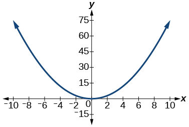 

<math xmlns="http://www.w3.org/1998/Math/MathML"> <mrow> <mtext> </mtext><mi>y</mi><mtext> </mtext></mrow> </math>

varies directly as the cube of<math xmlns="http://www.w3.org/1998/Math/MathML"> <mrow> <mtext> </mtext><mi>x</mi><mtext> </mtext></mrow> </math>

and when<math xmlns="http://www.w3.org/1998/Math/MathML"> <mrow> <mtext> </mtext><mi>x</mi><mo>=</mo><mn>2</mn><mo>,</mo><mo> </mo><mi>y</mi><mo>=</mo><mn>4.</mn></mrow> </math>

<math xmlns="http://www.w3.org/1998/Math/MathML"> <mrow> <mtext> </mtext><mi>y</mi><mtext> </mtext></mrow> </math>

varies directly as the square root of<math xmlns="http://www.w3.org/1998/Math/MathML"> <mrow> <mtext> </mtext><mi>x</mi><mtext> </mtext></mrow> </math>

and when<math xmlns="http://www.w3.org/1998/Math/MathML"> <mrow> <mtext> </mtext><mi>x</mi><mo>=</mo><mn>36</mn><mo>,</mo><mo> </mo><mi>y</mi><mo>=</mo><mn>2.</mn></mrow> </math>

<math xmlns="http://www.w3.org/1998/Math/MathML"> <mrow> <mi>y</mi><mo>=</mo><mfrac> <mn>1</mn> <mn>3</mn> </mfrac> <msqrt> <mi>x</mi> </msqrt> </mrow> </math>

 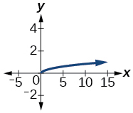 

<math xmlns="http://www.w3.org/1998/Math/MathML"> <mrow> <mtext> </mtext><mi>y</mi><mtext> </mtext></mrow> </math>

varies inversely with<math xmlns="http://www.w3.org/1998/Math/MathML"> <mrow> <mtext> </mtext><mi>x</mi><mtext> </mtext></mrow> </math>

and when<math xmlns="http://www.w3.org/1998/Math/MathML"> <mrow> <mtext> </mtext><mi>x</mi><mo>=</mo><mn>6</mn><mo>,</mo><mo> </mo><mi>y</mi><mo>=</mo><mn>2.</mn></mrow> </math>

<math xmlns="http://www.w3.org/1998/Math/MathML"> <mrow> <mtext> </mtext><mi>y</mi><mtext> </mtext></mrow> </math>

varies inversely as the square of<math xmlns="http://www.w3.org/1998/Math/MathML"> <mrow> <mtext> </mtext><mi>x</mi><mtext> </mtext></mrow> </math>

and when<math xmlns="http://www.w3.org/1998/Math/MathML"> <mrow> <mtext> </mtext><mi>x</mi><mo>=</mo><mn>1</mn><mo>,</mo><mo> </mo><mi>y</mi><mo>=</mo><mn>4.</mn></mrow> </math>

<math xmlns="http://www.w3.org/1998/Math/MathML"> <mrow> <mi>y</mi><mo>=</mo><mfrac> <mn>4</mn> <mrow> <msup> <mi>x</mi> <mn>2</mn> </msup> </mrow> </mfrac> </mrow> </math>

 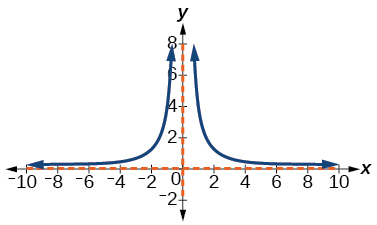 

####  Extensions

For the following exercises, use Kepler’s Law, which states that the square of the time,<math xmlns="http://www.w3.org/1998/Math/MathML"> <mrow> <mtext> </mtext><mi>T</mi><mo>,</mo><mtext> </mtext></mrow> </math>

required for a planet to orbit the Sun varies directly with the cube of the mean distance,<math xmlns="http://www.w3.org/1998/Math/MathML"> <mrow> <mtext> </mtext><mi>a</mi><mo>,</mo><mtext> </mtext></mrow> </math>

that the planet is from the Sun.

Using Earth’s time of 1 year and mean distance of 93 million miles, find the equation relating <math xmlns="http://www.w3.org/1998/Math/MathML"> <mrow> <mtext> </mtext><mi>T</mi><mtext> </mtext></mrow> </math>

 and <math xmlns="http://www.w3.org/1998/Math/MathML"> <mrow> <mtext> </mtext><mi>a</mi><mo>.</mo><mtext> </mtext> </mrow> </math>

Use the result from the previous exercise to determine the time required for Mars to orbit the Sun if its mean distance is 142 million miles.

1\.89 years

Using Earth’s distance of 150 million kilometers, find the equation relating<math xmlns="http://www.w3.org/1998/Math/MathML"> <mrow> <mtext> </mtext><mi>T</mi><mtext> </mtext></mrow> </math>

and<math xmlns="http://www.w3.org/1998/Math/MathML"> <mrow> <mtext> </mtext><mi>a</mi><mo>.</mo> </mrow> </math>

Use the result from the previous exercise to determine the time required for Venus to orbit the Sun if its mean distance is 108 million kilometers.

0\.61 years

Using Earth’s distance of 1 astronomical unit (A.U.), determine the time for Saturn to orbit the Sun if its mean distance is 9.54 A.U.

####  Real-World Applications

For the following exercises, use the given information to answer the questions.

The distance<math xmlns="http://www.w3.org/1998/Math/MathML"> <mrow> <mtext> </mtext><mi>s</mi><mtext> </mtext></mrow> </math>

that an object falls varies directly with the square of the time,<math xmlns="http://www.w3.org/1998/Math/MathML"> <mrow> <mtext> </mtext><mi>t</mi><mo>,</mo><mtext> </mtext> </mrow> </math>

of the fall. If an object falls 16 feet in one se**c**ond, how long for it to fall 144 feet?

3 seconds

The velocity<math xmlns="http://www.w3.org/1998/Math/MathML"> <mrow> <mtext> </mtext><mi>v</mi><mtext> </mtext></mrow> </math>

of a falling object varies directly to the time,<math xmlns="http://www.w3.org/1998/Math/MathML"> <mrow> <mtext> </mtext><mi>t</mi><mo>,</mo><mtext> </mtext> </mrow> </math>

of the fall. If after 2 seconds, the velocity of the object is 64 feet per second, what is the velocity after 5 seconds?

The rate of vibration of a string under constant tension varies inversely with the length of the string. If a string is 24 inches long and vibrates 128 times per second, what is the length of a string that vibrates 64 times per second?

48 inches

The volume of a gas held at constant temperature varies indirectly as the pressure of the gas. If the volume of a gas is 1200 cubic centimeters when the pressure is 200 millimeters of mercury, what is the volume when the pressure is 300 millimeters of mercury?

The weight of an object above the surface of Earth varies inversely with the square of the distance from the center of Earth. If a body weighs 50 pounds when it is 3960 miles from Earth’s center, what would it weigh it were 3970 miles from Earth’s center?

49\.75 pounds

The intensity of light measured in foot-candles varies inversely with the square of the distance from the light source. Suppose the intensity of a light bulb is 0.08 foot-candles at a distance of 3 meters. Find the intensity level at 8 meters.

The current in a circuit varies inversely with its resistance measured in ohms. When the current in a circuit is 40 amperes, the resistance is 10 ohms. Find the current if the resistance is 12 ohms.

33\.33 amperes

The force exerted by the wind on a plane surface varies jointly with the square of the velocity of the wind and with the area of the plane surface. If the area of the surface is 40 square feet surface and the wind velocity is 20 miles per hour, the resulting force is 15 pounds. Find the force on a surface of 65 square feet with a velocity of 30 miles per hour.

The horsepower (hp) that a shaft can safely transmit varies jointly with its speed (in revolutions per minute (rpm) and the cube of the diameter. If the shaft of a certain material 3 inches in diameter can transmit 45 hp at 100 rpm, what must the diameter be in order to transmit 60 hp at 150 rpm?

2\.88 inches

The kinetic energy<math xmlns="http://www.w3.org/1998/Math/MathML"> <mrow> <mtext> </mtext><mi>K</mi><mtext> </mtext></mrow> </math>

of a moving object varies jointly with its mass<math xmlns="http://www.w3.org/1998/Math/MathML"> <mrow> <mtext> </mtext><mi>m</mi><mtext> </mtext></mrow> </math>

and the square of its velocity<math xmlns="http://www.w3.org/1998/Math/MathML"> <mrow> <mtext> </mtext><mi>v</mi><mo>.</mo><mtext> </mtext> </mrow> </math>

If an object weighing 40 kilograms with a velocity of 15 meters per second has a kinetic energy of 1000 joules, find the kinetic energy if the velocity is increased to 20 meters per second.

### Chapter Review Exercises

#### [Quadratic Functions](/m51274){: .target-chapter}

For the following exercises, write the quadratic function in standard form. Then give the vertex and axes intercepts. Finally, graph the function.

<math xmlns="http://www.w3.org/1998/Math/MathML"> <mrow> <mi>f</mi><mo stretchy="false">(</mo><mi>x</mi><mo stretchy="false">)</mo><mo>=</mo><msup> <mi>x</mi> <mn>2</mn> </msup> <mo>−</mo><mn>4</mn><mi>x</mi><mo>−</mo><mn>5</mn></mrow> </math>

<math xmlns="http://www.w3.org/1998/Math/MathML"> <mrow> <mi>f</mi><mo stretchy="false">(</mo><mi>x</mi><mo stretchy="false">)</mo><mo>=</mo><msup> <mrow> <mo stretchy="false">(</mo><mi>x</mi><mo>−</mo><mn>2</mn><mo stretchy="false">)</mo> </mrow> <mn>2</mn> </msup> <mo>−</mo><mn>9</mn><mtext> </mtext><mtext>vertex</mtext><mo> </mo><mo stretchy="false">(</mo><mn>2</mn><mo>,</mo><mn>–9</mn><mo stretchy="false">)</mo><mo>,</mo><mo> </mo><mtext>intercepts</mtext><mo> </mo><mo stretchy="false">(</mo><mn>5</mn><mo>,</mo><mn>0</mn><mo stretchy="false">)</mo><mo>;</mo><mo> </mo><mo stretchy="false">(</mo><mn>–1</mn><mo>,</mo><mn>0</mn><mo stretchy="false">)</mo><mo>;</mo><mo> </mo><mo stretchy="false">(</mo><mn>0</mn><mo>,</mo><mn>–5</mn><mo stretchy="false">)</mo> </mrow> </math>

 * * *
{: data-type="newline" data-count="1"}

 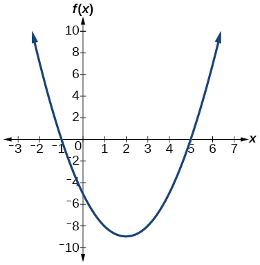 

<math xmlns="http://www.w3.org/1998/Math/MathML"> <mrow> <mi>f</mi><mo stretchy="false">(</mo><mi>x</mi><mo stretchy="false">)</mo><mo>=</mo><mo>−</mo><mn>2</mn><msup> <mi>x</mi> <mn>2</mn> </msup> <mo>−</mo><mn>4</mn><mi>x</mi></mrow> </math>

For the following exercises, find the equation of the quadratic function using the given information.

The vertex is<math xmlns="http://www.w3.org/1998/Math/MathML"> <mrow> <mo stretchy="false">(</mo><mo>–</mo><mn>2</mn><mo>,</mo><mn>3</mn><mo stretchy="false">)</mo> </mrow> </math>

and a point on the graph is<math xmlns="http://www.w3.org/1998/Math/MathML"> <mrow> <mtext> </mtext><mo stretchy="false">(</mo><mn>3</mn><mo>,</mo><mn>6</mn><mo stretchy="false">)</mo><mo>.</mo> </mrow> </math>

<math xmlns="http://www.w3.org/1998/Math/MathML"> <mrow> <mi>f</mi><mo stretchy="false">(</mo><mi>x</mi><mo stretchy="false">)</mo><mo>=</mo><mfrac> <mn>3</mn> <mrow> <mn>25</mn></mrow> </mfrac> <msup> <mrow> <mrow><mo>(</mo> <mrow> <mi>x</mi><mo>+</mo><mn>2</mn></mrow> <mo>)</mo></mrow></mrow> <mn>2</mn> </msup> <mo>+</mo><mn>3</mn></mrow> </math>

The vertex is<math xmlns="http://www.w3.org/1998/Math/MathML"> <mrow> <mtext> </mtext><mo stretchy="false">(</mo><mo>–</mo><mn>3</mn><mo>,</mo><mn>6.5</mn><mo stretchy="false">)</mo><mtext> </mtext> </mrow> </math>

and a point on the graph is<math xmlns="http://www.w3.org/1998/Math/MathML"> <mrow> <mtext> </mtext><mo stretchy="false">(</mo><mn>2</mn><mo>,</mo><mn>6</mn><mo stretchy="false">)</mo><mo>.</mo> </mrow> </math>

For the following exercises, complete the task.

A rectangular plot of land is to be enclosed by fencing. One side is along a river and so needs no fence. If the total fencing available is 600 meters, find the dimensions of the plot to have maximum area.

300 meters by 150 meters, the longer side parallel to river.

An object projected from the ground at a 45 degree angle with initial velocity of 120 feet per second has height,<math xmlns="http://www.w3.org/1998/Math/MathML"> <mrow> <mtext> </mtext><mi>h</mi><mo>,</mo><mtext> </mtext> </mrow> </math>

in terms of horizontal distance traveled,<math xmlns="http://www.w3.org/1998/Math/MathML"> <mrow> <mtext> </mtext><mi>x</mi><mo>,</mo><mtext> </mtext> </mrow> </math>

given by<math xmlns="http://www.w3.org/1998/Math/MathML"> <mrow> <mtext> </mtext><mi>h</mi><mo stretchy="false">(</mo><mi>x</mi><mo stretchy="false">)</mo><mo>=</mo><mfrac> <mrow> <mo>−</mo><mn>32</mn></mrow> <mrow> <msup> <mrow> <mo stretchy="false">(</mo><mn>120</mn><mo stretchy="false">)</mo></mrow> <mn>2</mn> </msup> </mrow> </mfrac> <msup> <mi>x</mi> <mn>2</mn> </msup> <mo>+</mo><mi>x</mi><mo>.</mo><mtext> </mtext></mrow> </math>

Find the maximum height the object attains.

#### [Power Functions and Polynomial Functions](/m51275){: .target-chapter}

For the following exercises, determine if the function is a polynomial function and, if so, give the degree and leading coefficient.

<math xmlns="http://www.w3.org/1998/Math/MathML"> <mrow> <mi>f</mi><mo stretchy="false">(</mo><mi>x</mi><mo stretchy="false">)</mo><mo>=</mo><mn>4</mn><msup> <mi>x</mi> <mn>5</mn> </msup> <mo>−</mo><mn>3</mn><msup> <mi>x</mi> <mn>3</mn> </msup> <mo>+</mo><mn>2</mn><mi>x</mi><mo>−</mo><mn>1</mn></mrow> </math>

Yes, degree = 5, leading coefficient = 4

<math xmlns="http://www.w3.org/1998/Math/MathML"> <mrow> <mi>f</mi><mo stretchy="false">(</mo><mi>x</mi><mo stretchy="false">)</mo><mo>=</mo><msup> <mn>5</mn> <mrow> <mi>x</mi><mo>+</mo><mn>1</mn></mrow> </msup> <mo>−</mo><msup> <mi>x</mi> <mn>2</mn> </msup> </mrow> </math>

<math xmlns="http://www.w3.org/1998/Math/MathML"> <mrow> <mi>f</mi><mo stretchy="false">(</mo><mi>x</mi><mo stretchy="false">)</mo><mo>=</mo><msup> <mi>x</mi> <mn>2</mn> </msup> <mrow><mo>(</mo> <mrow> <mn>3</mn><mo>−</mo><mn>6</mn><mi>x</mi><mo>+</mo><msup> <mi>x</mi> <mn>2</mn> </msup> </mrow> <mo>)</mo></mrow></mrow> </math>

Yes, degree = 4, leading coefficient = 1

For the following exercises, determine end behavior of the polynomial function.

<math xmlns="http://www.w3.org/1998/Math/MathML"> <mrow> <mi>f</mi><mo stretchy="false">(</mo><mi>x</mi><mo stretchy="false">)</mo><mo>=</mo><mn>2</mn><msup> <mi>x</mi> <mn>4</mn> </msup> <mo>+</mo><mn>3</mn><msup> <mi>x</mi> <mn>3</mn> </msup> <mo>−</mo><mn>5</mn><msup> <mi>x</mi> <mn>2</mn> </msup> <mo>+</mo><mn>7</mn></mrow> </math>

<math xmlns="http://www.w3.org/1998/Math/MathML"> <mrow> <mi>f</mi><mo stretchy="false">(</mo><mi>x</mi><mo stretchy="false">)</mo><mo>=</mo><mn>4</mn><msup> <mi>x</mi> <mn>3</mn> </msup> <mo>−</mo><mn>6</mn><msup> <mi>x</mi> <mn>2</mn> </msup> <mo>+</mo><mn>2</mn></mrow> </math>

<math xmlns="http://www.w3.org/1998/Math/MathML"> <mrow> <mtext>As</mtext><mtext> </mtext><mi>x</mi><mo stretchy="false">→</mo><mo>−</mo><mi>∞</mi><mo>,</mo><mtext> </mtext><mi>f</mi><mo stretchy="false">(</mo><mi>x</mi><mo stretchy="false">)</mo><mo stretchy="false">→</mo><mo>−</mo><mi>∞</mi><mo>,</mo><mtext> </mtext><mtext>as</mtext><mtext> </mtext><mi>x</mi><mo stretchy="false">→</mo><mi>∞</mi><mo>,</mo><mtext> </mtext><mi>f</mi><mo stretchy="false">(</mo><mi>x</mi><mo stretchy="false">)</mo><mo stretchy="false">→</mo><mi>∞</mi></mrow> </math>

<math xmlns="http://www.w3.org/1998/Math/MathML"> <mrow> <mi>f</mi><mo stretchy="false">(</mo><mi>x</mi><mo stretchy="false">)</mo><mo>=</mo><mn>2</mn><msup> <mi>x</mi> <mn>2</mn> </msup> <mo stretchy="false">(</mo><mn>1</mn><mo>+</mo><mn>3</mn><mi>x</mi><mo>−</mo><msup> <mi>x</mi> <mn>2</mn> </msup> <mo stretchy="false">)</mo></mrow> </math>

#### [Graphs of Polynomial Functions](/m51276){: .target-chapter}

For the following exercises, find all zeros of the polynomial function, noting multiplicities.

<math xmlns="http://www.w3.org/1998/Math/MathML"> <mrow> <mi>f</mi><mo stretchy="false">(</mo><mi>x</mi><mo stretchy="false">)</mo><mo>=</mo><msup> <mrow> <mo stretchy="false">(</mo><mi>x</mi><mo>+</mo><mn>3</mn><mo stretchy="false">)</mo></mrow> <mn>2</mn> </msup> <mo stretchy="false">(</mo><mn>2</mn><mi>x</mi><mo>−</mo><mn>1</mn><mo stretchy="false">)</mo><msup> <mrow> <mo stretchy="false">(</mo><mi>x</mi><mo>+</mo><mn>1</mn><mo stretchy="false">)</mo></mrow> <mn>3</mn> </msup> </mrow> </math>

–3 with multiplicity 2,<math xmlns="http://www.w3.org/1998/Math/MathML"> <mrow> <mo>−</mo><mfrac> <mn>1</mn> <mn>2</mn> </mfrac> </mrow> </math>

with multiplicity 1, –1 with multiplicity 3

<math xmlns="http://www.w3.org/1998/Math/MathML"> <mrow> <mi>f</mi><mo stretchy="false">(</mo><mi>x</mi><mo stretchy="false">)</mo><mo>=</mo><msup> <mi>x</mi> <mn>5</mn> </msup> <mo>+</mo><mn>4</mn><msup> <mi>x</mi> <mn>4</mn> </msup> <mo>+</mo><mn>4</mn><msup> <mi>x</mi> <mn>3</mn> </msup> </mrow> </math>

<math xmlns="http://www.w3.org/1998/Math/MathML"> <mrow> <mi>f</mi><mo stretchy="false">(</mo><mi>x</mi><mo stretchy="false">)</mo><mo>=</mo><msup> <mi>x</mi> <mn>3</mn> </msup> <mo>−</mo><mn>4</mn><msup> <mi>x</mi> <mn>2</mn> </msup> <mo>+</mo><mi>x</mi><mo>−</mo><mn>4</mn></mrow> </math>

4 with multiplicity 1

For the following exercises, based on the given graph, determine the zeros of the function and note multiplicity.

 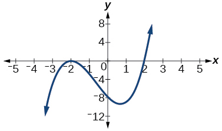 

 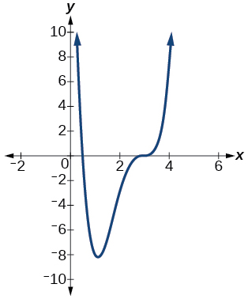 

<math xmlns="http://www.w3.org/1998/Math/MathML"> <mrow> <mfrac> <mn>1</mn> <mn>2</mn> </mfrac> <mtext> </mtext></mrow> </math>

with multiplicity 1, 3 with multiplicity 3

Use the Intermediate Value Theorem to show that at least one zero lies between 2 and 3 for the function<math xmlns="http://www.w3.org/1998/Math/MathML"> <mrow> <mtext> </mtext><mi>f</mi><mo stretchy="false">(</mo><mi>x</mi><mo stretchy="false">)</mo><mo>=</mo><msup> <mi>x</mi> <mn>3</mn> </msup> <mo>−</mo><mn>5</mn><mi>x</mi><mo>+</mo><mn>1</mn></mrow> </math>

#### [Dividing Polynomials](/m51277){: .target-chapter}

For the following exercises, use long division to find the quotient and remainder.

<math xmlns="http://www.w3.org/1998/Math/MathML"> <mrow> <mfrac> <mrow> <msup> <mi>x</mi> <mn>3</mn> </msup> <mo>−</mo><mn>2</mn><msup> <mi>x</mi> <mn>2</mn> </msup> <mo>+</mo><mn>4</mn><mi>x</mi><mo>+</mo><mn>4</mn></mrow> <mrow> <mi>x</mi><mo>−</mo><mn>2</mn></mrow> </mfrac> </mrow> </math>

<math xmlns="http://www.w3.org/1998/Math/MathML"> <mrow> <mtext> </mtext><msup> <mi>x</mi> <mn>2</mn> </msup> <mo>+</mo><mn>4</mn><mtext> </mtext></mrow> </math>

 with remainder 12

<math xmlns="http://www.w3.org/1998/Math/MathML"> <mrow> <mfrac> <mrow> <mn>3</mn><msup> <mi>x</mi> <mn>4</mn> </msup> <mo>−</mo><mn>4</mn><msup> <mi>x</mi> <mn>2</mn> </msup> <mo>+</mo><mn>4</mn><mi>x</mi><mo>+</mo><mn>8</mn></mrow> <mrow> <mi>x</mi><mo>+</mo><mn>1</mn></mrow> </mfrac> </mrow> </math>

For the following exercises, use synthetic division to find the quotient. If the divisor is a factor, then write the factored form.

<math xmlns="http://www.w3.org/1998/Math/MathML"> <mrow> <mfrac> <mrow> <msup> <mi>x</mi> <mn>3</mn> </msup> <mo>−</mo><mn>2</mn><msup> <mi>x</mi> <mn>2</mn> </msup> <mo>+</mo><mn>5</mn><mi>x</mi><mo>−</mo><mn>1</mn></mrow> <mrow> <mi>x</mi><mo>+</mo><mn>3</mn></mrow> </mfrac> </mrow> </math>

<math xmlns="http://www.w3.org/1998/Math/MathML"> <mrow> <msup> <mi>x</mi> <mn>2</mn> </msup> <mo>−</mo><mn>5</mn><mi>x</mi><mo>+</mo><mn>20</mn><mo>−</mo><mfrac> <mrow> <mn>61</mn></mrow> <mrow> <mi>x</mi><mo>+</mo><mn>3</mn></mrow> </mfrac> </mrow> </math>

<math xmlns="http://www.w3.org/1998/Math/MathML"> <mrow> <mfrac> <mrow> <msup> <mi>x</mi> <mn>3</mn> </msup> <mo>+</mo><mn>4</mn><mi>x</mi><mo>+</mo><mn>10</mn></mrow> <mrow> <mi>x</mi><mo>−</mo><mn>3</mn></mrow> </mfrac> </mrow> </math>

<math xmlns="http://www.w3.org/1998/Math/MathML"> <mrow> <mfrac> <mrow> <mn>2</mn><msup> <mi>x</mi> <mn>3</mn> </msup> <mo>+</mo><mn>6</mn><msup> <mi>x</mi> <mn>2</mn> </msup> <mo>−</mo><mn>11</mn><mi>x</mi><mo>−</mo><mn>12</mn></mrow> <mrow> <mi>x</mi><mo>+</mo><mn>4</mn></mrow> </mfrac> </mrow> </math>

<math xmlns="http://www.w3.org/1998/Math/MathML"> <mrow> <mn>2</mn><msup> <mi>x</mi> <mn>2</mn> </msup> <mo>−</mo><mn>2</mn><mi>x</mi><mo>−</mo><mn>3</mn></mrow> </math>

, so factored form is <math xmlns="http://www.w3.org/1998/Math/MathML"> <mrow> <mo stretchy="false">(</mo><mi>x</mi><mo>+</mo><mn>4</mn><mo stretchy="false">)</mo><mo stretchy="false">(</mo><mn>2</mn><msup> <mi>x</mi> <mn>2</mn> </msup> <mo>−</mo><mn>2</mn><mi>x</mi><mo>−</mo><mn>3</mn><mo stretchy="false">)</mo></mrow> </math>

<math xmlns="http://www.w3.org/1998/Math/MathML"> <mrow> <mfrac> <mrow> <mn>3</mn><msup> <mi>x</mi> <mn>4</mn> </msup> <mo>+</mo><mn>3</mn><msup> <mi>x</mi> <mn>3</mn> </msup> <mo>+</mo><mn>2</mn><mi>x</mi><mo>+</mo><mn>2</mn></mrow> <mrow> <mi>x</mi><mo>+</mo><mn>1</mn></mrow> </mfrac> </mrow> </math>

#### [Zeros of Polynomial Functions](/m51278){: .target-chapter}

For the following exercises, use the Rational Zero Theorem to help you solve the polynomial equation.

<math xmlns="http://www.w3.org/1998/Math/MathML"> <mrow> <mn>2</mn><msup> <mi>x</mi> <mn>3</mn> </msup> <mo>−</mo><mn>3</mn><msup> <mi>x</mi> <mn>2</mn> </msup> <mo>−</mo><mn>18</mn><mi>x</mi><mo>−</mo><mn>8</mn><mo>=</mo><mn>0</mn></mrow> </math>

<math xmlns="http://www.w3.org/1998/Math/MathML"> <mrow> <mrow><mo>{</mo> <mrow> <mo>−</mo><mn>2</mn><mo>,</mo><mo> </mo><mn>4</mn><mo>,</mo><mo> </mo><mo>−</mo><mfrac> <mn>1</mn> <mn>2</mn> </mfrac> </mrow> <mo>}</mo></mrow></mrow> </math>

<math xmlns="http://www.w3.org/1998/Math/MathML"> <mrow> <mn>3</mn><msup> <mi>x</mi> <mn>3</mn> </msup> <mo>+</mo><mn>11</mn><msup> <mi>x</mi> <mn>2</mn> </msup> <mo>+</mo><mn>8</mn><mi>x</mi><mo>−</mo><mn>4</mn><mo>=</mo><mn>0</mn></mrow> </math>

<math xmlns="http://www.w3.org/1998/Math/MathML"> <mrow> <mn>2</mn><msup> <mi>x</mi> <mn>4</mn> </msup> <mo>−</mo><mn>17</mn><msup> <mi>x</mi> <mn>3</mn> </msup> <mo>+</mo><mn>46</mn><msup> <mi>x</mi> <mn>2</mn> </msup> <mo>−</mo><mn>43</mn><mi>x</mi><mo>+</mo><mn>12</mn><mo>=</mo><mn>0</mn></mrow> </math>

<math xmlns="http://www.w3.org/1998/Math/MathML"> <mrow> <mrow><mo>{</mo> <mrow> <mn>1</mn><mo>,</mo><mo> </mo><mn>3</mn><mo>,</mo><mo> </mo><mn>4</mn><mo>,</mo><mo> </mo><mfrac> <mn>1</mn> <mn>2</mn> </mfrac> </mrow> <mo>}</mo></mrow></mrow> </math>

<math xmlns="http://www.w3.org/1998/Math/MathML"> <mrow> <mn>4</mn><msup> <mi>x</mi> <mn>4</mn> </msup> <mo>+</mo><mn>8</mn><msup> <mi>x</mi> <mn>3</mn> </msup> <mo>+</mo><mn>19</mn><msup> <mi>x</mi> <mn>2</mn> </msup> <mo>+</mo><mn>32</mn><mi>x</mi><mo>+</mo><mn>12</mn><mo>=</mo><mn>0</mn></mrow> </math>

For the following exercises, use Descartes’ Rule of Signs to find the possible number of positive and negative solutions.

<math xmlns="http://www.w3.org/1998/Math/MathML"> <mrow> <msup> <mi>x</mi> <mn>3</mn> </msup> <mo>−</mo><mn>3</mn><msup> <mi>x</mi> <mn>2</mn> </msup> <mo>−</mo><mn>2</mn><mi>x</mi><mo>+</mo><mn>4</mn><mo>=</mo><mn>0</mn></mrow> </math>

0 or 2 positive, 1 negative

<math xmlns="http://www.w3.org/1998/Math/MathML"> <mrow> <mn>2</mn><msup> <mi>x</mi> <mn>4</mn> </msup> <mo>−</mo><msup> <mi>x</mi> <mn>3</mn> </msup> <mo>+</mo><mn>4</mn><msup> <mi>x</mi> <mn>2</mn> </msup> <mo>−</mo><mn>5</mn><mi>x</mi><mo>+</mo><mn>1</mn><mo>=</mo><mn>0</mn></mrow> </math>

#### [Rational Functions](/m51279){: .target-chapter}

For the following exercises, find the intercepts and the vertical and horizontal asymptotes, and then use them to sketch a graph of the function.

<math xmlns="http://www.w3.org/1998/Math/MathML"> <mrow> <mi>f</mi><mo stretchy="false">(</mo><mi>x</mi><mo stretchy="false">)</mo><mo>=</mo><mfrac> <mrow> <mi>x</mi><mo>+</mo><mn>2</mn></mrow> <mrow> <mi>x</mi><mo>−</mo><mn>5</mn></mrow> </mfrac> </mrow> </math>

Intercepts <math xmlns="http://www.w3.org/1998/Math/MathML"> <mrow> <mo stretchy="false">(</mo><mn>–2</mn><mo>,</mo><mn>0</mn><mo stretchy="false">)</mo><mtext>and</mtext><mrow><mo>(</mo> <mrow> <mn>0</mn><mo>,</mo><mo>−</mo><mfrac> <mn>2</mn> <mn>5</mn> </mfrac> </mrow> <mo>)</mo></mrow></mrow> </math>

, Asymptotes<math xmlns="http://www.w3.org/1998/Math/MathML"> <mrow> <mtext> </mtext><mi>x</mi><mo>=</mo><mn>5</mn><mtext> </mtext></mrow> </math>

 and<math xmlns="http://www.w3.org/1998/Math/MathML"> <mrow> <mtext> </mtext><mi>y</mi><mo>=</mo><mn>1.</mn></mrow> </math>

 * * *
{: data-type="newline" data-count="1"}

 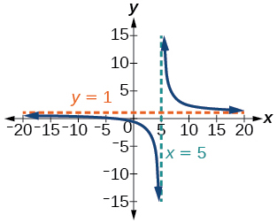 

<math xmlns="http://www.w3.org/1998/Math/MathML"> <mrow> <mi>f</mi><mo stretchy="false">(</mo><mi>x</mi><mo stretchy="false">)</mo><mo>=</mo><mfrac> <mrow> <msup> <mi>x</mi> <mn>2</mn> </msup> <mo>+</mo><mn>1</mn></mrow> <mrow> <msup> <mi>x</mi> <mn>2</mn> </msup> <mo>−</mo><mn>4</mn></mrow> </mfrac> </mrow> </math>

<math xmlns="http://www.w3.org/1998/Math/MathML"> <mrow> <mi>f</mi><mo stretchy="false">(</mo><mi>x</mi><mo stretchy="false">)</mo><mo>=</mo><mfrac> <mrow> <mn>3</mn><msup> <mi>x</mi> <mn>2</mn> </msup> <mo>−</mo><mn>27</mn></mrow> <mrow> <msup> <mi>x</mi> <mn>2</mn> </msup> <mo>+</mo><mi>x</mi><mo>−</mo><mn>2</mn></mrow> </mfrac> </mrow> </math>

Intercepts (3, 0), (-3, 0), and<math xmlns="http://www.w3.org/1998/Math/MathML"> <mrow> <mtext> </mtext><mrow><mo>(</mo> <mrow> <mn>0</mn><mo>,</mo><mfrac> <mrow> <mn>27</mn></mrow> <mn>2</mn> </mfrac> </mrow> <mo>)</mo></mrow><mtext> </mtext></mrow> </math>

, Asymptotes<math xmlns="http://www.w3.org/1998/Math/MathML"> <mrow> <mtext> </mtext><mi>x</mi><mo>=</mo><mn>1</mn><mo>,</mo><mo> </mo><mi>x</mi><mo>=</mo><mo>–</mo><mn>2</mn><mo>,</mo><mo> </mo><mi>y</mi><mo>=</mo><mn>3.</mn></mrow> </math>

 * * *
{: data-type="newline" data-count="1"}

 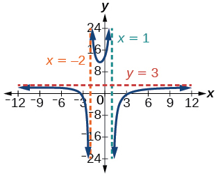 

<math xmlns="http://www.w3.org/1998/Math/MathML"> <mrow> <mi>f</mi><mo stretchy="false">(</mo><mi>x</mi><mo stretchy="false">)</mo><mo>=</mo><mfrac> <mrow> <mi>x</mi><mo>+</mo><mn>2</mn></mrow> <mrow> <msup> <mi>x</mi> <mn>2</mn> </msup> <mo>−</mo><mn>9</mn></mrow> </mfrac> </mrow> </math>

For the following exercises, find the slant asymptote.

<math xmlns="http://www.w3.org/1998/Math/MathML"> <mrow> <mi>f</mi><mo stretchy="false">(</mo><mi>x</mi><mo stretchy="false">)</mo><mo>=</mo><mfrac> <mrow> <msup> <mi>x</mi> <mn>2</mn> </msup> <mo>−</mo><mn>1</mn></mrow> <mrow> <mi>x</mi><mo>+</mo><mn>2</mn></mrow> </mfrac> </mrow> </math>

<math xmlns="http://www.w3.org/1998/Math/MathML"> <mrow> <mi>y</mi><mo>=</mo><mtext> </mtext><mi>x</mi><mo>−</mo><mn>2</mn></mrow> </math>

<math xmlns="http://www.w3.org/1998/Math/MathML"> <mrow> <mi>f</mi><mo stretchy="false">(</mo><mi>x</mi><mo stretchy="false">)</mo><mo>=</mo><mfrac> <mrow> <mn>2</mn><msup> <mi>x</mi> <mn>3</mn> </msup> <mo>−</mo><msup> <mi>x</mi> <mn>2</mn> </msup> <mo>+</mo><mn>4</mn></mrow> <mrow> <msup> <mi>x</mi> <mn>2</mn> </msup> <mo>+</mo><mn>1</mn></mrow> </mfrac> </mrow> </math>

#### [Inverses and Radical Functions](/m51280){: .target-chapter}

For the following exercises, find the inverse of the function with the domain given.

<math xmlns="http://www.w3.org/1998/Math/MathML"> <mrow> <mi>f</mi><mo stretchy="false">(</mo><mi>x</mi><mo stretchy="false">)</mo><mo>=</mo><msup> <mrow> <mo stretchy="false">(</mo><mi>x</mi><mo>−</mo><mn>2</mn><mo stretchy="false">)</mo></mrow> <mn>2</mn> </msup> <mo>,</mo><mtext> </mtext><mi>x</mi><mo>≥</mo><mn>2</mn></mrow> </math>

<math xmlns="http://www.w3.org/1998/Math/MathML"> <mrow> <msup> <mi>f</mi> <mrow> <mo>−</mo><mn>1</mn></mrow> </msup> <mo stretchy="false">(</mo><mi>x</mi><mo stretchy="false">)</mo><mo>=</mo><msqrt> <mi>x</mi> </msqrt> <mo>+</mo><mn>2</mn></mrow> </math>

<math xmlns="http://www.w3.org/1998/Math/MathML"> <mrow> <mi>f</mi><mo stretchy="false">(</mo><mi>x</mi><mo stretchy="false">)</mo><mo>=</mo><msup> <mrow> <mo stretchy="false">(</mo><mi>x</mi><mo>+</mo><mn>4</mn><mo stretchy="false">)</mo></mrow> <mn>2</mn> </msup> <mo>−</mo><mn>3</mn><mo>,</mo><mtext> </mtext><mi>x</mi><mo>≥</mo><mo>−</mo><mn>4</mn></mrow> </math>

<math xmlns="http://www.w3.org/1998/Math/MathML"> <mrow> <mi>f</mi><mo stretchy="false">(</mo><mi>x</mi><mo stretchy="false">)</mo><mo>=</mo><msup> <mi>x</mi> <mn>2</mn> </msup> <mo>+</mo><mn>6</mn><mi>x</mi><mo>−</mo><mn>2</mn><mo>,</mo><mtext> </mtext><mi>x</mi><mo>≥</mo><mo>−</mo><mn>3</mn></mrow> </math>

<math xmlns="http://www.w3.org/1998/Math/MathML"> <mrow> <msup> <mi>f</mi> <mrow> <mo>−</mo><mn>1</mn></mrow> </msup> <mo stretchy="false">(</mo><mi>x</mi><mo stretchy="false">)</mo><mo>=</mo><msqrt> <mrow> <mi>x</mi><mo>+</mo><mn>11</mn></mrow> </msqrt> <mo>−</mo><mn>3</mn></mrow> </math>

<math xmlns="http://www.w3.org/1998/Math/MathML"> <mrow> <mi>f</mi><mo stretchy="false">(</mo><mi>x</mi><mo stretchy="false">)</mo><mo>=</mo><mn>2</mn><msup> <mi>x</mi> <mn>3</mn> </msup> <mo>−</mo><mn>3</mn></mrow> </math>

<math xmlns="http://www.w3.org/1998/Math/MathML"> <mrow> <mi>f</mi><mo stretchy="false">(</mo><mi>x</mi><mo stretchy="false">)</mo><mo>=</mo><msqrt> <mrow> <mn>4</mn><mi>x</mi><mo>+</mo><mn>5</mn></mrow> </msqrt> <mo>−</mo><mn>3</mn></mrow> </math>

<math xmlns="http://www.w3.org/1998/Math/MathML"> <mrow> <msup> <mi>f</mi> <mrow> <mo>−</mo><mn>1</mn></mrow> </msup> <mo stretchy="false">(</mo><mi>x</mi><mo stretchy="false">)</mo><mo>=</mo><mfrac> <mrow> <msup> <mrow> <mo stretchy="false">(</mo><mi>x</mi><mo>+</mo><mn>3</mn><mo stretchy="false">)</mo></mrow> <mn>2</mn> </msup> <mo>−</mo><mn>5</mn></mrow> <mn>4</mn> </mfrac> <mo>,</mo><mtext> </mtext><mi>x</mi><mo>≥</mo><mo>−</mo><mn>3</mn></mrow> </math>

<math xmlns="http://www.w3.org/1998/Math/MathML"> <mrow> <mi>f</mi><mo stretchy="false">(</mo><mi>x</mi><mo stretchy="false">)</mo><mo>=</mo><mfrac> <mrow> <mi>x</mi><mo>−</mo><mn>3</mn></mrow> <mrow> <mn>2</mn><mi>x</mi><mo>+</mo><mn>1</mn></mrow> </mfrac> </mrow> </math>

#### [Modeling Using Variation](/m51281){: .target-chapter}

For the following exercises, find the unknown value.

<math xmlns="http://www.w3.org/1998/Math/MathML"> <mrow> <mtext> </mtext><mi>y</mi><mtext> </mtext></mrow> </math>

 varies directly as the square of<math xmlns="http://www.w3.org/1998/Math/MathML"> <mrow> <mtext> </mtext><mi>x</mi><mo>.</mo><mtext> </mtext></mrow> </math>

 If when<math xmlns="http://www.w3.org/1998/Math/MathML"> <mrow> <mtext> </mtext><mi>x</mi><mo>=</mo><mn>3</mn><mo>,</mo><mtext> </mtext><mi>y</mi><mo>=</mo><mn>36</mn><mo>,</mo><mtext> </mtext></mrow> </math>

find<math xmlns="http://www.w3.org/1998/Math/MathML"> <mrow> <mtext> </mtext><mi>y</mi><mtext> </mtext></mrow> </math>

if<math xmlns="http://www.w3.org/1998/Math/MathML"> <mrow> <mtext> </mtext><mi>x</mi><mo>=</mo><mn>4.</mn></mrow> </math>

<math xmlns="http://www.w3.org/1998/Math/MathML"> <mrow> <mi>y</mi><mo>=</mo><mn>64</mn></mrow> </math>

<math xmlns="http://www.w3.org/1998/Math/MathML"> <mrow> <mtext> </mtext><mi>y</mi><mtext> </mtext></mrow> </math>

 varies inversely as the square root of<math xmlns="http://www.w3.org/1998/Math/MathML"> <mrow> <mtext> </mtext><mi>x</mi><mtext> </mtext></mrow> </math>

 If when<math xmlns="http://www.w3.org/1998/Math/MathML"> <mrow> <mtext> </mtext><mi>x</mi><mo>=</mo><mn>25</mn><mo>,</mo><mtext> </mtext><mi>y</mi><mo>=</mo><mn>2</mn><mo>,</mo><mtext> </mtext></mrow> </math>

find<math xmlns="http://www.w3.org/1998/Math/MathML"> <mrow> <mtext> </mtext><mi>y</mi><mtext> </mtext></mrow> </math>

if<math xmlns="http://www.w3.org/1998/Math/MathML"> <mrow> <mtext> </mtext><mi>x</mi><mo>=</mo><mn>4.</mn></mrow> </math>

<math xmlns="http://www.w3.org/1998/Math/MathML"> <mrow> <mtext> </mtext><mi>y</mi><mtext> </mtext></mrow> </math>

varies jointly as the cube of<math xmlns="http://www.w3.org/1998/Math/MathML"> <mrow> <mtext> </mtext><mi>x</mi><mtext> </mtext></mrow> </math>

and as<math xmlns="http://www.w3.org/1998/Math/MathML"> <mrow> <mtext> </mtext><mi>z</mi><mo>.</mo><mtext> </mtext> </mrow> </math>

If when<math xmlns="http://www.w3.org/1998/Math/MathML"> <mrow> <mtext> </mtext><mi>x</mi><mo>=</mo><mn>1</mn><mtext> </mtext></mrow> </math>

and<math xmlns="http://www.w3.org/1998/Math/MathML"> <mrow> <mtext> </mtext><mi>z</mi><mo>=</mo><mn>2</mn><mo>,</mo><mtext> </mtext></mrow> </math>

<math xmlns="http://www.w3.org/1998/Math/MathML"> <mrow> <mi>y</mi><mo>=</mo><mn>6</mn><mo>,</mo><mtext> </mtext></mrow> </math>

find<math xmlns="http://www.w3.org/1998/Math/MathML"> <mrow> <mtext> </mtext><mi>y</mi><mtext> </mtext></mrow> </math>

if<math xmlns="http://www.w3.org/1998/Math/MathML"> <mrow> <mtext> </mtext><mi>x</mi><mo>=</mo><mn>2</mn><mtext> </mtext></mrow> </math>

and<math xmlns="http://www.w3.org/1998/Math/MathML"> <mrow> <mtext> </mtext><mi>z</mi><mo>=</mo><mn>3.</mn></mrow> </math>

<math xmlns="http://www.w3.org/1998/Math/MathML"> <mrow> <mi>y</mi><mtext> </mtext><mo>=</mo><mtext> </mtext><mn>72</mn></mrow> </math>

<math xmlns="http://www.w3.org/1998/Math/MathML"> <mrow> <mtext> </mtext><mi>y</mi><mtext> </mtext></mrow> </math>

varies jointly as<math xmlns="http://www.w3.org/1998/Math/MathML"> <mrow> <mtext> </mtext><mi>x</mi><mtext> </mtext></mrow> </math>

and the square of<math xmlns="http://www.w3.org/1998/Math/MathML"> <mrow> <mtext> </mtext><mi>z</mi><mtext> </mtext></mrow> </math>

and inversely as the cube of<math xmlns="http://www.w3.org/1998/Math/MathML"> <mrow> <mtext> </mtext><mi>w</mi><mo>.</mo><mtext> </mtext> </mrow> </math>

If when<math xmlns="http://www.w3.org/1998/Math/MathML"> <mrow> <mtext> </mtext><mi>x</mi><mo>=</mo><mn>3</mn><mo>,</mo><mtext> </mtext></mrow> </math>

<math xmlns="http://www.w3.org/1998/Math/MathML"> <mrow> <mi>z</mi><mo>=</mo><mn>4</mn><mo>,</mo><mtext> </mtext></mrow> </math>

and<math xmlns="http://www.w3.org/1998/Math/MathML"> <mrow> <mtext> </mtext><mi>w</mi><mo>=</mo><mn>2</mn><mo>,</mo><mtext> </mtext></mrow> </math>

<math xmlns="http://www.w3.org/1998/Math/MathML"> <mrow> <mi>y</mi><mo>=</mo><mn>48</mn><mo>,</mo><mtext> </mtext></mrow> </math>

find<math xmlns="http://www.w3.org/1998/Math/MathML"> <mrow> <mtext> </mtext><mi>y</mi><mtext> </mtext></mrow> </math>

if<math xmlns="http://www.w3.org/1998/Math/MathML"> <mrow> <mtext> </mtext><mi>x</mi><mo>=</mo><mn>4</mn><mo>,</mo><mtext> </mtext></mrow> </math>

<math xmlns="http://www.w3.org/1998/Math/MathML"> <mrow> <mi>z</mi><mo>=</mo><mn>5</mn><mo>,</mo><mtext> </mtext></mrow> </math>

and<math xmlns="http://www.w3.org/1998/Math/MathML"> <mrow> <mtext> </mtext><mi>w</mi><mo>=</mo><mn>3.</mn></mrow> </math>

For the following exercises, solve the application problem.

The weight of an object above the surface of the earth varies inversely with the distance from the center of the earth. If a person weighs 150 pounds when he is on the surface of the earth (3,960 miles from center), find the weight of the person if he is 20 miles above the surface.

148\.5 pounds

The volume<math xmlns="http://www.w3.org/1998/Math/MathML"> <mrow> <mtext> </mtext><mi>V</mi><mtext> </mtext></mrow> </math>

of an ideal gas varies directly with the temperature<math xmlns="http://www.w3.org/1998/Math/MathML"> <mrow> <mtext> </mtext><mi>T</mi><mtext> </mtext></mrow> </math>

and inversely with the pressure P. A cylinder contains oxygen at a temperature of 310 degrees K and a pressure of 18 atmospheres in a volume of 120 liters. Find the pressure if the volume is decreased to 100 liters and the temperature is increased to 320 degrees K.

### Chapter Test

Give the degree and leading coefficient of the following polynomial function.

<math xmlns="http://www.w3.org/1998/Math/MathML"> <mrow> <mi>f</mi><mo stretchy="false">(</mo><mi>x</mi><mo stretchy="false">)</mo><mo>=</mo><msup> <mi>x</mi> <mn>3</mn> </msup> <mrow><mo>(</mo> <mrow> <mn>3</mn><mo>−</mo><mn>6</mn><msup> <mi>x</mi> <mn>2</mn> </msup> <mo>−</mo><mn>2</mn><msup> <mi>x</mi> <mn>2</mn> </msup> </mrow> <mo>)</mo></mrow></mrow> </math>

Determine the end behavior of the polynomial function.

<math xmlns="http://www.w3.org/1998/Math/MathML"> <mrow> <mi>f</mi><mo stretchy="false">(</mo><mi>x</mi><mo stretchy="false">)</mo><mo>=</mo><mn>8</mn><msup> <mi>x</mi> <mn>3</mn> </msup> <mo>−</mo><mn>3</mn><msup> <mi>x</mi> <mn>2</mn> </msup> <mo>+</mo><mn>2</mn><mi>x</mi><mo>−</mo><mn>4</mn></mrow> </math>

<math xmlns="http://www.w3.org/1998/Math/MathML"> <mrow> <mi>A</mi><mi>s</mi><mtext> </mtext><mi>x</mi><mo stretchy="false">→</mo><mo>−</mo><mi>∞</mi><mo>,</mo><mtext> </mtext><mi>f</mi><mo stretchy="false">(</mo><mi>x</mi><mo stretchy="false">)</mo><mo stretchy="false">→</mo><mo>−</mo><mi>∞</mi><mo>,</mo><mtext> </mtext><mi>a</mi><mi>s</mi><mtext> </mtext><mi>x</mi><mo stretchy="false">→</mo><mi>∞</mi><mo>,</mo><mtext> </mtext><mi>f</mi><mo stretchy="false">(</mo><mi>x</mi><mo stretchy="false">)</mo><mo stretchy="false">→</mo><mi>∞</mi></mrow> </math>

<math xmlns="http://www.w3.org/1998/Math/MathML"> <mrow> <mi>f</mi><mo stretchy="false">(</mo><mi>x</mi><mo stretchy="false">)</mo><mo>=</mo><mo>−</mo><mn>2</mn><msup> <mi>x</mi> <mn>2</mn> </msup> <mo stretchy="false">(</mo><mn>4</mn><mo>−</mo><mn>3</mn><mi>x</mi><mo>−</mo><mn>5</mn><msup> <mi>x</mi> <mn>2</mn> </msup> <mo stretchy="false">)</mo></mrow> </math>

Write the quadratic function in standard form. Determine the vertex and axes intercepts and graph the function.

<math xmlns="http://www.w3.org/1998/Math/MathML"> <mrow> <mi>f</mi><mo stretchy="false">(</mo><mi>x</mi><mo stretchy="false">)</mo><mo>=</mo><msup> <mi>x</mi> <mn>2</mn> </msup> <mo>+</mo><mn>2</mn><mi>x</mi><mo>−</mo><mn>8</mn></mrow> </math>

<math xmlns="http://www.w3.org/1998/Math/MathML"> <mrow> <mi>f</mi><mo stretchy="false">(</mo><mi>x</mi><mo stretchy="false">)</mo><mo>=</mo><msup> <mrow> <mrow><mo>(</mo> <mrow> <mi>x</mi><mo>+</mo><mn>1</mn></mrow> <mo>)</mo></mrow></mrow> <mn>2</mn> </msup> <mo>−</mo><mn>9</mn></mrow> </math>

, vertex<math xmlns="http://www.w3.org/1998/Math/MathML"> <mrow> <mtext> </mtext><mrow><mo>(</mo> <mrow> <mn>−1</mn><mo>,</mo><mn>−9</mn></mrow> <mo>)</mo></mrow></mrow> </math>

, intercepts<math xmlns="http://www.w3.org/1998/Math/MathML"> <mrow> <mtext> </mtext><mrow><mo>(</mo> <mrow> <mn>2</mn><mo>,</mo><mn>0</mn></mrow> <mo>)</mo></mrow><mo>;</mo><mrow><mo>(</mo> <mrow> <mn>−4</mn><mo>,</mo><mn>0</mn></mrow> <mo>)</mo></mrow><mo>;</mo><mtext> </mtext><mrow><mo>(</mo> <mrow> <mn>0</mn><mo>,</mo><mn>−8</mn></mrow> <mo>)</mo></mrow></mrow> </math>

 * * *
{: data-type="newline" data-count="1"}

 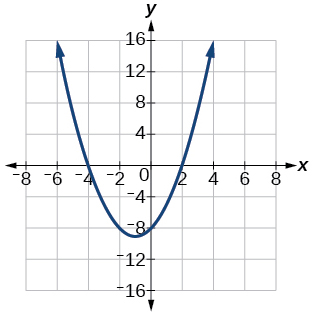 

Given information about the graph of a quadratic function, find its equation.

Vertex<math xmlns="http://www.w3.org/1998/Math/MathML"> <mrow> <mtext> </mtext><mo stretchy="false">(</mo><mn>2</mn><mo>,</mo><mn>0</mn><mo stretchy="false">)</mo><mtext> </mtext> </mrow> </math>

and point on graph<math xmlns="http://www.w3.org/1998/Math/MathML"> <mrow> <mtext> </mtext><mo stretchy="false">(</mo><mn>4</mn><mo>,</mo><mn>12</mn><mo stretchy="false">)</mo><mo>.</mo> </mrow> </math>

Solve the following application problem.

A rectangular field is to be enclosed by fencing. In addition to the enclosing fence, another fence is to divide the field into two parts, running parallel to two sides. If 1,200 feet of fencing is available, find the maximum area that can be enclosed.

60,000 square feet

Find all zeros of the following polynomial functions, noting multiplicities.

<math xmlns="http://www.w3.org/1998/Math/MathML"> <mrow> <mi>f</mi><mo stretchy="false">(</mo><mi>x</mi><mo stretchy="false">)</mo><mo>=</mo><msup> <mrow> <mo stretchy="false">(</mo><mi>x</mi><mo>−</mo><mn>3</mn><mo stretchy="false">)</mo></mrow> <mn>3</mn> </msup> <mo stretchy="false">(</mo><mn>3</mn><mi>x</mi><mo>−</mo><mn>1</mn><mo stretchy="false">)</mo><msup> <mrow> <mo stretchy="false">(</mo><mi>x</mi><mo>−</mo><mn>1</mn><mo stretchy="false">)</mo></mrow> <mn>2</mn> </msup> </mrow> </math>

<math xmlns="http://www.w3.org/1998/Math/MathML"> <mrow> <mi>f</mi><mo stretchy="false">(</mo><mi>x</mi><mo stretchy="false">)</mo><mo>=</mo><mn>2</mn><msup> <mi>x</mi> <mn>6</mn> </msup> <mo>−</mo><mn>12</mn><msup> <mi>x</mi> <mn>5</mn> </msup> <mo>+</mo><mn>18</mn><msup> <mi>x</mi> <mn>4</mn> </msup> </mrow> </math>

0 with multiplicity 4, 3 with multiplicity 2

Based on the graph, determine the zeros of the function and multiplicities.

 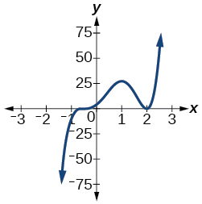 

Use long division to find the quotient.

<math xmlns="http://www.w3.org/1998/Math/MathML"> <mrow> <mfrac> <mrow> <mn>2</mn><msup> <mi>x</mi> <mn>3</mn> </msup> <mo>+</mo><mn>3</mn><mi>x</mi><mo>−</mo><mn>4</mn></mrow> <mrow> <mi>x</mi><mo>+</mo><mn>2</mn></mrow> </mfrac> </mrow> </math>

<math xmlns="http://www.w3.org/1998/Math/MathML"> <mrow> <mn>2</mn><msup> <mi>x</mi> <mn>2</mn> </msup> <mo>−</mo><mn>4</mn><mi>x</mi><mo>+</mo><mn>11</mn><mo>−</mo><mfrac> <mrow> <mn>26</mn></mrow> <mrow> <mi>x</mi><mo>+</mo><mn>2</mn></mrow> </mfrac> </mrow> </math>

Use synthetic division to find the quotient. If the divisor is a factor, write the factored form.

<math xmlns="http://www.w3.org/1998/Math/MathML"> <mrow> <mfrac> <mrow> <msup> <mi>x</mi> <mn>4</mn> </msup> <mo>+</mo><mn>3</mn><msup> <mi>x</mi> <mn>2</mn> </msup> <mo>−</mo><mn>4</mn></mrow> <mrow> <mi>x</mi><mo>−</mo><mn>2</mn></mrow> </mfrac> </mrow> </math>

<math xmlns="http://www.w3.org/1998/Math/MathML"> <mrow> <mfrac> <mrow> <mn>2</mn><msup> <mi>x</mi> <mn>3</mn> </msup> <mo>+</mo><mn>5</mn><msup> <mi>x</mi> <mn>2</mn> </msup> <mo>−</mo><mn>7</mn><mi>x</mi><mo>−</mo><mn>12</mn></mrow> <mrow> <mi>x</mi><mo>+</mo><mn>3</mn></mrow> </mfrac> </mrow> </math>

<math xmlns="http://www.w3.org/1998/Math/MathML"> <mrow> <mn>2</mn><msup> <mi>x</mi> <mn>2</mn> </msup> <mo>−</mo><mi>x</mi><mo>−</mo><mn>4</mn></mrow> </math>

. So factored form is<math xmlns="http://www.w3.org/1998/Math/MathML"> <mrow> <mtext> </mtext><mo stretchy="false">(</mo><mi>x</mi><mo>+</mo><mn>3</mn><mo stretchy="false">)</mo><mo stretchy="false">(</mo><mn>2</mn><msup> <mi>x</mi> <mn>2</mn> </msup> <mo>−</mo><mi>x</mi><mo>−</mo><mn>4</mn><mo stretchy="false">)</mo></mrow> </math>

Use the Rational Zero Theorem to help you find the zeros of the polynomial functions.

<math xmlns="http://www.w3.org/1998/Math/MathML"> <mrow> <mi>f</mi><mo stretchy="false">(</mo><mi>x</mi><mo stretchy="false">)</mo><mo>=</mo><mn>2</mn><msup> <mi>x</mi> <mn>3</mn> </msup> <mo>+</mo><mn>5</mn><msup> <mi>x</mi> <mn>2</mn> </msup> <mo>−</mo><mn>6</mn><mi>x</mi><mo>−</mo><mn>9</mn></mrow> </math>

<math xmlns="http://www.w3.org/1998/Math/MathML"> <mrow> <mi>f</mi><mo stretchy="false">(</mo><mi>x</mi><mo stretchy="false">)</mo><mo>=</mo><mn>4</mn><msup> <mi>x</mi> <mn>4</mn> </msup> <mo>+</mo><mn>8</mn><msup> <mi>x</mi> <mn>3</mn> </msup> <mo>+</mo><mn>21</mn><msup> <mi>x</mi> <mn>2</mn> </msup> <mo>+</mo><mn>17</mn><mi>x</mi><mo>+</mo><mn>4</mn></mrow> </math>

<math xmlns="http://www.w3.org/1998/Math/MathML"> <mrow> <mo>−</mo><mfrac> <mn>1</mn> <mn>2</mn> </mfrac> <mtext> </mtext></mrow> </math>

 (has multiplicity 2),<math xmlns="http://www.w3.org/1998/Math/MathML"> <mrow> <mtext> </mtext><mfrac> <mrow> <mo>−</mo><mn>1</mn><mo>±</mo><mi>i</mi><msqrt> <mrow> <mn>15</mn></mrow> </msqrt> </mrow> <mn>2</mn> </mfrac> <mtext> </mtext></mrow> </math>

<math xmlns="http://www.w3.org/1998/Math/MathML"> <mrow> <mi>f</mi><mo stretchy="false">(</mo><mi>x</mi><mo stretchy="false">)</mo><mo>=</mo><mn>4</mn><msup> <mi>x</mi> <mn>4</mn> </msup> <mo>+</mo><mn>16</mn><msup> <mi>x</mi> <mn>3</mn> </msup> <mo>+</mo><mn>13</mn><msup> <mi>x</mi> <mn>2</mn> </msup> <mo>−</mo><mn>15</mn><mi>x</mi><mo>−</mo><mn>18</mn></mrow> </math>

<math xmlns="http://www.w3.org/1998/Math/MathML"> <mrow> <mi>f</mi><mo stretchy="false">(</mo><mi>x</mi><mo stretchy="false">)</mo><mo>=</mo><msup> <mi>x</mi> <mn>5</mn> </msup> <mo>+</mo><mn>6</mn><msup> <mi>x</mi> <mn>4</mn> </msup> <mo>+</mo><mn>13</mn><msup> <mi>x</mi> <mn>3</mn> </msup> <mo>+</mo><mn>14</mn><msup> <mi>x</mi> <mn>2</mn> </msup> <mo>+</mo><mn>12</mn><mi>x</mi><mo>+</mo><mn>8</mn></mrow> </math>

<math xmlns="http://www.w3.org/1998/Math/MathML"> <mrow> <mtext> </mtext><mo>−</mo><mn>2</mn><mtext> </mtext></mrow> </math>

(has multiplicity 3),<math xmlns="http://www.w3.org/1998/Math/MathML"> <mrow> <mtext> </mtext><mo>±</mo><mi>i</mi></mrow> </math>

Given the following information about a polynomial function, find the function.

It has a double zero at<math xmlns="http://www.w3.org/1998/Math/MathML"> <mrow> <mtext> </mtext><mi>x</mi><mo>=</mo><mn>3</mn><mtext> </mtext></mrow> </math>

and zeros at<math xmlns="http://www.w3.org/1998/Math/MathML"> <mrow> <mtext> </mtext><mi>x</mi><mo>=</mo><mn>1</mn><mtext> </mtext></mrow> </math>

and<math xmlns="http://www.w3.org/1998/Math/MathML"> <mrow> <mtext> </mtext><mi>x</mi><mo>=</mo><mo>−</mo><mn>2</mn><mtext> </mtext></mrow> </math>

. Its *y*-intercept is<math xmlns="http://www.w3.org/1998/Math/MathML"> <mrow> <mtext> </mtext><mo stretchy="false">(</mo><mn>0</mn><mo>,</mo><mn>12</mn><mo stretchy="false">)</mo><mo>.</mo><mtext> </mtext> </mrow> </math>

It has a zero of multiplicity 3 at<math xmlns="http://www.w3.org/1998/Math/MathML"> <mrow> <mtext> </mtext><mi>x</mi><mo>=</mo><mfrac> <mn>1</mn> <mn>2</mn> </mfrac> <mtext> </mtext></mrow> </math>

and another zero at<math xmlns="http://www.w3.org/1998/Math/MathML"> <mrow> <mtext> </mtext><mi>x</mi><mo>=</mo><mo>−</mo><mn>3</mn><mtext> </mtext></mrow> </math>

. It contains the point<math xmlns="http://www.w3.org/1998/Math/MathML"> <mrow> <mtext> </mtext><mo stretchy="false">(</mo><mn>1</mn><mo>,</mo><mn>8</mn><mo stretchy="false">)</mo><mo>.</mo> </mrow> </math>

<math xmlns="http://www.w3.org/1998/Math/MathML"> <mrow> <mi>f</mi><mo stretchy="false">(</mo><mi>x</mi><mo stretchy="false">)</mo><mo>=</mo><mn>2</mn><msup> <mrow> <mrow><mo>(</mo> <mrow> <mn>2</mn><mi>x</mi><mo>−</mo><mn>1</mn></mrow> <mo>)</mo></mrow></mrow> <mn>3</mn> </msup> <mrow><mo>(</mo> <mrow> <mi>x</mi><mo>+</mo><mn>3</mn></mrow> <mo>)</mo></mrow></mrow> </math>

Use Descartes’ Rule of Signs to determine the possible number of positive and negative solutions.

<math xmlns="http://www.w3.org/1998/Math/MathML"> <mrow> <mn>8</mn><msup> <mi>x</mi> <mn>3</mn> </msup> <mo>−</mo><mn>21</mn><msup> <mi>x</mi> <mn>2</mn> </msup> <mo>+</mo><mn>6</mn><mo>=</mo><mn>0</mn></mrow> </math>

For the following rational functions, find the intercepts and horizontal and vertical asymptotes, and sketch a graph.

<math xmlns="http://www.w3.org/1998/Math/MathML"> <mrow> <mi>f</mi><mo stretchy="false">(</mo><mi>x</mi><mo stretchy="false">)</mo><mo>=</mo><mfrac> <mrow> <mi>x</mi><mo>+</mo><mn>4</mn></mrow> <mrow> <msup> <mi>x</mi> <mn>2</mn> </msup> <mo>−</mo><mn>2</mn><mi>x</mi><mo>−</mo><mn>3</mn></mrow> </mfrac> </mrow> </math>

Intercepts<math xmlns="http://www.w3.org/1998/Math/MathML"> <mrow> <mtext> </mtext><mo stretchy="false">(</mo><mo>−</mo><mn>4</mn><mo>,</mo><mn>0</mn><mo stretchy="false">)</mo><mo>,</mo><mtext> </mtext><mrow><mo>(</mo> <mrow> <mn>0</mn><mo>,</mo><mo>−</mo><mfrac> <mn>4</mn> <mn>3</mn> </mfrac> </mrow> <mo>)</mo></mrow><mtext> </mtext> </mrow> </math>

, Asymptotes<math xmlns="http://www.w3.org/1998/Math/MathML"> <mrow> <mtext> </mtext><mi>x</mi><mo>=</mo><mn>3</mn><mo>,</mo><mtext> </mtext><mi>x</mi><mtext> </mtext><mo>=</mo><mn>−1</mn><mo>,</mo><mtext> </mtext><mi>y</mi><mo>=</mo><mn>0</mn></mrow> </math>

. * * *
{: data-type="newline" data-count="1"}

 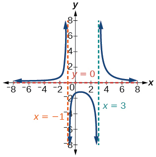 

<math xmlns="http://www.w3.org/1998/Math/MathML"> <mrow> <mi>f</mi><mo stretchy="false">(</mo><mi>x</mi><mo stretchy="false">)</mo><mo>=</mo><mfrac> <mrow> <msup> <mi>x</mi> <mn>2</mn> </msup> <mo>+</mo><mn>2</mn><mi>x</mi><mo>−</mo><mn>3</mn></mrow> <mrow> <msup> <mi>x</mi> <mn>2</mn> </msup> <mo>−</mo><mn>4</mn></mrow> </mfrac> </mrow> </math>

Find the slant asymptote of the rational function.

<math xmlns="http://www.w3.org/1998/Math/MathML"> <mrow> <mi>f</mi><mo stretchy="false">(</mo><mi>x</mi><mo stretchy="false">)</mo><mo>=</mo><mfrac> <mrow> <msup> <mi>x</mi> <mn>2</mn> </msup> <mo>+</mo><mn>3</mn><mi>x</mi><mo>−</mo><mn>3</mn></mrow> <mrow> <mi>x</mi><mo>−</mo><mn>1</mn></mrow> </mfrac> </mrow> </math>

<math xmlns="http://www.w3.org/1998/Math/MathML"> <mrow> <mi>y</mi><mo>=</mo><mi>x</mi><mo>+</mo><mn>4</mn></mrow> </math>

Find the inverse of the function.

<math xmlns="http://www.w3.org/1998/Math/MathML"> <mrow> <mi>f</mi><mo stretchy="false">(</mo><mi>x</mi><mo stretchy="false">)</mo><mo>=</mo><msqrt> <mrow> <mi>x</mi><mo>−</mo><mn>2</mn></mrow> </msqrt> <mo>+</mo><mn>4</mn></mrow> </math>

<math xmlns="http://www.w3.org/1998/Math/MathML"> <mrow> <mi>f</mi><mo stretchy="false">(</mo><mi>x</mi><mo stretchy="false">)</mo><mo>=</mo><mn>3</mn><msup> <mi>x</mi> <mn>3</mn> </msup> <mo>−</mo><mn>4</mn></mrow> </math>

<math xmlns="http://www.w3.org/1998/Math/MathML"> <mrow> <msup> <mi>f</mi> <mrow> <mo>−</mo><mn>1</mn></mrow> </msup> <mo stretchy="false">(</mo><mi>x</mi><mo stretchy="false">)</mo><mo>=</mo><mroot> <mrow> <mfrac> <mrow> <mi>x</mi><mo>+</mo><mn>4</mn></mrow> <mn>3</mn> </mfrac> </mrow> <mn>3</mn> </mroot> </mrow> </math>

<math xmlns="http://www.w3.org/1998/Math/MathML"> <mrow> <mi>f</mi><mo stretchy="false">(</mo><mi>x</mi><mo stretchy="false">)</mo><mo>=</mo><mfrac> <mrow> <mn>2</mn><mi>x</mi><mo>+</mo><mn>3</mn></mrow> <mrow> <mn>3</mn><mi>x</mi><mo>−</mo><mn>1</mn></mrow> </mfrac> </mrow> </math>

Find the unknown value.

<math xmlns="http://www.w3.org/1998/Math/MathML"> <mrow> <mtext> </mtext><mi>y</mi><mtext> </mtext></mrow> </math>

varies inversely as the square of<math xmlns="http://www.w3.org/1998/Math/MathML"> <mrow> <mtext> </mtext><mi>x</mi><mtext> </mtext></mrow> </math>

and when<math xmlns="http://www.w3.org/1998/Math/MathML"> <mrow> <mtext> </mtext><mi>x</mi><mo>=</mo><mn>3</mn><mo>,</mo><mtext> </mtext></mrow> </math>

<math xmlns="http://www.w3.org/1998/Math/MathML"> <mrow> <mi>y</mi><mo>=</mo><mn>2.</mn><mtext> </mtext></mrow> </math>

Find<math xmlns="http://www.w3.org/1998/Math/MathML"> <mrow> <mtext> </mtext><mi>y</mi><mtext> </mtext></mrow> </math>

if<math xmlns="http://www.w3.org/1998/Math/MathML"> <mrow> <mtext> </mtext><mi>x</mi><mo>=</mo><mn>1.</mn></mrow> </math>

<math xmlns="http://www.w3.org/1998/Math/MathML"> <mrow> <mi>y</mi><mo>=</mo><mn>18</mn></mrow> </math>

<math xmlns="http://www.w3.org/1998/Math/MathML"> <mrow> <mtext> </mtext><mi>y</mi><mtext> </mtext></mrow> </math>

varies jointly with<math xmlns="http://www.w3.org/1998/Math/MathML"> <mrow> <mtext> </mtext><mi>x</mi><mtext> </mtext></mrow> </math>

and the cube root of<math xmlns="http://www.w3.org/1998/Math/MathML"> <mrow> <mtext> </mtext><mi>z</mi><mo>.</mo><mtext> </mtext> </mrow> </math>

If when<math xmlns="http://www.w3.org/1998/Math/MathML"> <mrow> <mtext> </mtext><mi>x</mi><mo>=</mo><mn>2</mn><mtext> </mtext></mrow> </math>

and<math xmlns="http://www.w3.org/1998/Math/MathML"> <mrow> <mtext> </mtext><mi>z</mi><mo>=</mo><mn>27</mn><mo>,</mo><mtext> </mtext></mrow> </math>

<math xmlns="http://www.w3.org/1998/Math/MathML"> <mrow> <mi>y</mi><mo>=</mo><mn>12</mn><mo>,</mo><mtext> </mtext></mrow> </math>

find<math xmlns="http://www.w3.org/1998/Math/MathML"> <mrow> <mtext> </mtext><mi>y</mi><mtext> </mtext></mrow> </math>

if<math xmlns="http://www.w3.org/1998/Math/MathML"> <mrow> <mtext> </mtext><mi>x</mi><mo>=</mo><mn>5</mn><mtext> </mtext></mrow> </math>

and<math xmlns="http://www.w3.org/1998/Math/MathML"> <mrow> <mtext> </mtext><mi>z</mi><mo>=</mo><mn>8.</mn></mrow> </math>

Solve the following application problem.

The distance a body falls varies directly as the square of the time it falls. If an object falls 64 feet in 2 seconds, how long will it take to fall 256 feet?

4 seconds

### Glossary
{: data-type="glossary-title"}

constant of variation
: the non-zero value
  <math xmlns="http://www.w3.org/1998/Math/MathML"> <mrow> <mtext> </mtext><mi>k</mi><mtext> </mtext></mrow> </math>
  
  that helps define the relationship between variables in direct or inverse variation
^

direct variation
: the relationship between two variables that are a constant multiple of each other; as one quantity increases, so does the other
^

inverse variation
: the relationship between two variables in which the product of the variables is a constant
^

inversely proportional
: a relationship where one quantity is a constant divided by the other quantity; as one quantity increases, the other decreases
^

joint variation
: a relationship where a variable varies directly or inversely with multiple variables
^

varies directly
: a relationship where one quantity is a constant multiplied by the other quantity
^

varies inversely
: a relationship where one quantity is a constant divided by the other quantity

[1]: http://openstax.org/l/directvariation
[2]: http://openstax.org/l/inversevariatio
[3]: http://openstax.org/l/directinverse
[4]: http://openstax.org/l/PreCalcLPC03
