

In this section you will:
* Draw angles in standard position.
* Convert between degrees and radians.
* Find coterminal angles.
* Find the length of a circular arc.
* Use linear and angular speed to describe motion on a circular path.

A golfer swings to hit a ball over a sand trap and onto the green. An airline pilot maneuvers a plane toward a narrow runway. A dress designer creates the latest fashion. What do they all have in common? They all work with angles, and so do all of us at one time or another. Sometimes we need to measure angles exactly with instruments. Other times we estimate them or judge them by eye. Either way, the proper angle can make the difference between success and failure in many undertakings. In this section, we will examine properties of angles.

# Drawing Angles in Standard Position 

Properly defining an angle first requires that we define a ray. A **ray**{: data-type="term"} is a directed line segment. It consists of one point on a line and all points extending in one direction from that point. The first point is called the **endpoint**{: data-type="term" .no-emphasis} of the ray. We can refer to a specific ray by stating its endpoint and any other point on it. The ray in [\[link\]](#Figure_07_01_001) can be named as ray EF, or in symbol form<math xmlns="http://www.w3.org/1998/Math/MathML"> <mrow> <mtext> </mtext><mover accent="true"> <mrow> <mi>E</mi><mi>F</mi> </mrow> <mo stretchy="false">⟶</mo> </mover> <mo>.</mo> </mrow> </math>

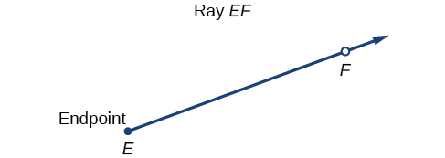{: #Figure_07_01_001}

An **angle**{: data-type="term"} is the union of two rays having a common endpoint. The endpoint is called the **vertex**{: data-type="term"} of the angle, and the two rays are the sides of the angle. The angle in [\[link\]](#Figure_07_01_002) is formed from<math xmlns="http://www.w3.org/1998/Math/MathML"> <mrow> <mtext> </mtext><mover accent="true"> <mrow> <mi>E</mi><mi>D</mi> </mrow> <mo stretchy="false">⟶</mo> </mover> <mtext> </mtext> </mrow> </math>

and<math xmlns="http://www.w3.org/1998/Math/MathML"> <mrow> <mtext> </mtext><mover accent="true"> <mrow> <mi>E</mi><mi>F</mi> </mrow> <mo stretchy="false">⟶</mo> </mover> <mtext> </mtext> </mrow> </math>

. Angles can be named using a point on each ray and the vertex, such as angle *DEF*, or in symbol form<math xmlns="http://www.w3.org/1998/Math/MathML"> <mrow> <mtext> </mtext><mo>∠</mo><mi>D</mi><mi>E</mi><mi>F</mi><mo>.</mo> </mrow> </math>

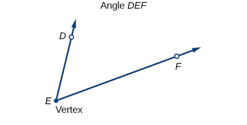{: #Figure_07_01_002}

Greek letters are often used as variables for the measure of an angle. [\[link\]](#Table_07_01_01) is a list of Greek letters commonly used to represent angles, and a sample angle is shown in [\[link\]](#Figure_07_01_003).

<table id="Table_07_01_01" summary="Two rows and five columns. The symbols in the first row are: &#x3B8;, &#x3C6; or &#x3D5;, &#x3B1;, &#x3B2;, &#x3B3;.  The second row labels each symbol as: theta, phi, alpha, beta, and gamma."><caption></caption><thead>
<tr>
<th><math xmlns="http://www.w3.org/1998/Math/MathML">
 <mi>θ</mi>
</math>
</th>
<th><math xmlns="http://www.w3.org/1998/Math/MathML">
 <mrow>
  <mi>φ</mi><mtext> </mtext>
 </mrow>
</math>or<math xmlns="http://www.w3.org/1998/Math/MathML">
 <mrow>
  <mtext> </mtext><mi>ϕ</mi>
 </mrow>
</math>
</th>
<th><math xmlns="http://www.w3.org/1998/Math/MathML">
 <mi>α</mi>
</math>
</th>
<th><math xmlns="http://www.w3.org/1998/Math/MathML">
 <mi>β</mi>
</math>
</th>
<th><math xmlns="http://www.w3.org/1998/Math/MathML">
 <mi>γ</mi>
</math>
</th>
</tr>
</thead><tbody>
<tr>
<td>theta</td>
<td>phi</td>
<td>alpha</td>
<td>beta</td>
<td>gamma</td>
</tr>
</tbody></table>

 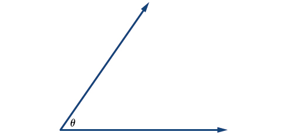{: #Figure_07_01_003}

Angle creation is a dynamic process. We start with two rays lying on top of one another. We leave one fixed in place, and rotate the other. The fixed ray is the **initial side**{: data-type="term"}<strong>, </strong>and the rotated ray is the **terminal side**{: data-type="term"}. In order to identify the different sides, we indicate the rotation with a small arrow close to the vertex as in [\[link\]](#Figure_07_01_004).

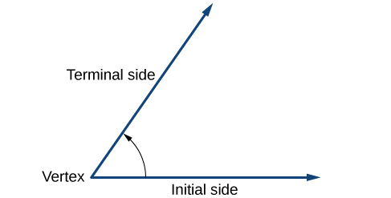{: #Figure_07_01_004}

As we discussed at the beginning of the section, there are many applications for angles, but in order to use them correctly, we must be able to measure them. The **measure of an angle**{: data-type="term"} is the amount of rotation from the initial side to the terminal side. Probably the most familiar unit of angle measurement is the degree. One **degree**{: data-type="term"} is<math xmlns="http://www.w3.org/1998/Math/MathML"> <mrow> <mtext> </mtext><mfrac> <mn>1</mn> <mrow> <mn>360</mn> </mrow> </mfrac> <mtext> </mtext> </mrow> </math>

of a circular rotation, so a complete circular rotation contains<math xmlns="http://www.w3.org/1998/Math/MathML"> <mrow> <mtext> </mtext><mn>360</mn><mtext> </mtext> </mrow> </math>

degrees. An angle measured in degrees should always include the unit “degrees” after the number, or include the degree symbol<math xmlns="http://www.w3.org/1998/Math/MathML"> <mrow> <mo>°</mo><mo>.</mo><mtext> </mtext></mrow> </math>

For example,<math xmlns="http://www.w3.org/1998/Math/MathML"> <mrow> <mtext> </mtext><mn>90</mn><mtext> degrees</mtext><mo>=</mo><mn>90°</mn><mo>.</mo> </mrow> </math>

To formalize our work, we will begin by drawing angles on an *x*-*y* coordinate plane. Angles can occur in any position on the coordinate plane, but for the purpose of comparison, the convention is to illustrate them in the same position whenever possible. An angle is in **standard position**{: data-type="term"} if its vertex is located at the origin, and its initial side extends along the positive *x*-axis. See [\[link\]](#Figure_07_01_005).

 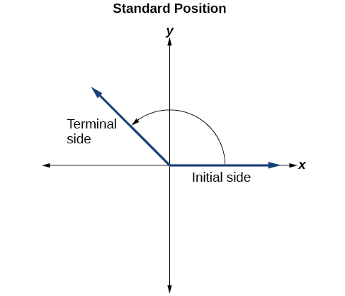{: #Figure_07_01_005}

If the angle is measured in a counterclockwise direction from the initial side to the terminal side, the angle is said to be a **positive angle**{: data-type="term"}. If the angle is measured in a clockwise direction, the angle is said to be a **negative angle**{: data-type="term"}.

Drawing an angle in standard position always starts the same way—draw the initial side along the positive *x*-axis. To place the terminal side of the angle, we must calculate the fraction of a full rotation the angle represents. We do that by dividing the angle measure in degrees by<math xmlns="http://www.w3.org/1998/Math/MathML"> <mrow> <mtext> </mtext><mn>360°</mn><mo>.</mo><mtext> </mtext> </mrow> </math>

For example, to draw a<math xmlns="http://www.w3.org/1998/Math/MathML"> <mrow> <mtext> </mtext><mn>90°</mn><mtext> </mtext> </mrow> </math>

angle, we calculate that<math xmlns="http://www.w3.org/1998/Math/MathML"> <mrow> <mtext> </mtext><mfrac> <mrow> <mn>90°</mn><mo /> </mrow> <mrow> <mn>360°</mn> </mrow> </mfrac> <mo>=</mo><mfrac> <mn>1</mn> <mn>4</mn> </mfrac> <mo>.</mo><mtext> </mtext> </mrow> </math>

So, the terminal side will be one-fourth of the way around the circle, moving counterclockwise from the positive *x*-axis. To draw a<math xmlns="http://www.w3.org/1998/Math/MathML"> <mrow> <mtext> </mtext><mn>360°</mn><mo /> </mrow> </math>

angle, we calculate that<math xmlns="http://www.w3.org/1998/Math/MathML"> <mrow> <mtext> </mtext><mfrac> <mrow> <mn>360°</mn> </mrow> <mrow> <mn>360°</mn> </mrow> </mfrac> <mo>=</mo><mn>1.</mn><mtext> </mtext> </mrow> </math>

So the terminal side will be 1 complete rotation around the circle, moving counterclockwise from the positive *x*-axis. In this case, the initial side and the terminal side overlap. See [\[link\]](#Figure_07_01_006).

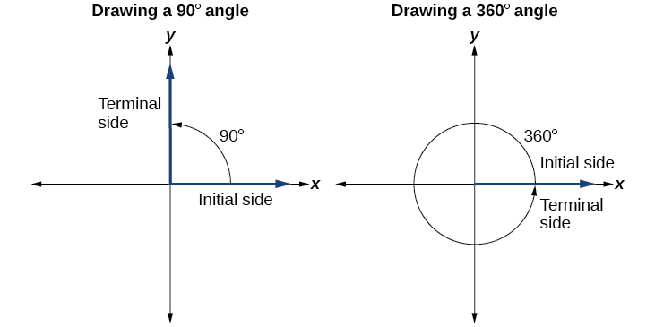{: #Figure_07_01_006}

Since we define an angle in **standard position**{: data-type="term" .no-emphasis} by its terminal side, we have a special type of angle whose terminal side lies on an axis, a **quadrantal angle**. This type of angle can have a measure of<math xmlns="http://www.w3.org/1998/Math/MathML"> <mrow> <mtext>0°,</mtext><mtext> </mtext><mtext>90°,</mtext><mtext> </mtext><mtext>180°,</mtext><mtext> </mtext><mtext>270°,</mtext></mrow> </math>

or<math xmlns="http://www.w3.org/1998/Math/MathML"> <mrow> <mtext> </mtext><mtext>360°</mtext><mo>.</mo><mtext> </mtext> </mrow> </math>

See [\[link\]](#Figure_07_01_018).

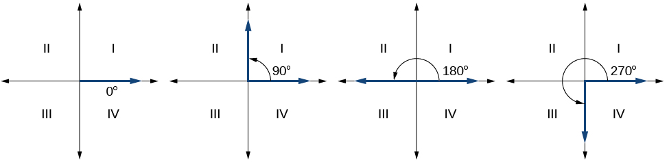{: #Figure_07_01_018}

Quadrantal Angles

An angle is a **quadrantal angle**{: data-type="term"} if its terminal side lies on an axis, including<math xmlns="http://www.w3.org/1998/Math/MathML"> <mrow> <mtext>0°,</mtext><mtext> </mtext><mtext>90°,</mtext><mtext> </mtext><mtext>180°,</mtext><mtext> </mtext><mtext>270°,</mtext></mrow> </math>

or<math xmlns="http://www.w3.org/1998/Math/MathML"> <mrow> <mtext> </mtext><mtext>360°</mtext><mo /><mo>.</mo> </mrow> </math>

**Given an angle measure in degrees, draw the angle in standard position.**

1.  Express the angle measure as a fraction of
    <math xmlns="http://www.w3.org/1998/Math/MathML"> <mrow> <mtext> </mtext><mtext>360°</mtext><mo>.</mo> </mrow> </math>

2.  Reduce the fraction to simplest form.
3.  Draw an angle that contains that same fraction of the circle, beginning on the positive *x*-axis and moving counterclockwise for positive angles and clockwise for negative angles.
{: data-number-style="arabic"}

Drawing an Angle in Standard Position Measured in Degrees

1.  Sketch an angle of
    <math xmlns="http://www.w3.org/1998/Math/MathML"> <mrow> <mtext> </mtext><mn>30°</mn><mtext> </mtext> </mrow> </math>
    
    in standard position.
2.  Sketch an angle of
    <math xmlns="http://www.w3.org/1998/Math/MathML"> <mrow> <mtext> </mtext><mn>−135°</mn><mtext> </mtext> </mrow> </math>
    
    in standard position.
{: data-number-style="lower-alpha"}

1.  Divide the angle measure by<math xmlns="http://www.w3.org/1998/Math/MathML"> <mrow> <mtext> </mtext><mn>360°</mn><mo>.</mo></mrow> </math>
    
    

    <math xmlns="http://www.w3.org/1998/Math/MathML"> <mrow> <mfrac> <mrow> <mn>30°</mn> </mrow> <mrow> <mn>360°</mn> </mrow> </mfrac> <mo>=</mo><mfrac> <mn>1</mn> <mrow> <mn>12</mn> </mrow> </mfrac> </mrow> </math>
    

    
    To rewrite the fraction in a more familiar fraction, we can recognize that
    
    

    <math xmlns="http://www.w3.org/1998/Math/MathML"> <mrow> <mfrac> <mn>1</mn> <mrow> <mn>12</mn> </mrow> </mfrac> <mo>=</mo><mfrac> <mn>1</mn> <mn>3</mn> </mfrac> <mrow><mo>(</mo> <mrow> <mfrac> <mn>1</mn> <mn>4</mn> </mfrac> </mrow> <mo>)</mo></mrow> </mrow> </math>
    

    
    One-twelfth equals one-third of a quarter, so by dividing a quarter rotation into thirds, we can sketch a line at<math xmlns="http://www.w3.org/1998/Math/MathML"> <mrow> <mtext> </mtext><mn>30°</mn><mo>,</mo> </mrow> </math>
    
    as in [[link]](#Figure_07_01_007).
    
    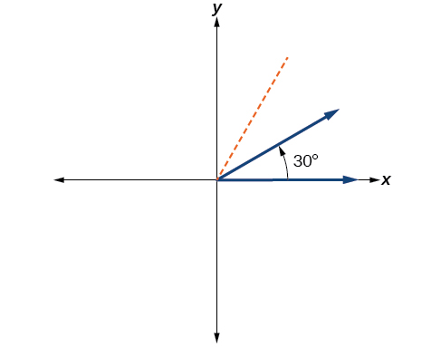{: #Figure_07_01_007}

2.  Divide the angle measure by<math xmlns="http://www.w3.org/1998/Math/MathML"> <mrow> <mtext> </mtext><mn>360°</mn><mo>.</mo></mrow> </math>
    
    

    <math xmlns="http://www.w3.org/1998/Math/MathML"> <mrow> <mfrac> <mrow> <mn>−135°</mn> </mrow> <mrow> <mn>360°</mn> </mrow> </mfrac> <mo>=</mo><mo>−</mo><mfrac> <mn>3</mn> <mn>8</mn> </mfrac> </mrow> </math>
    

    
    In this case, we can recognize that
    
    

    <math xmlns="http://www.w3.org/1998/Math/MathML"> <mrow> <mo>−</mo><mfrac> <mn>3</mn> <mn>8</mn> </mfrac> <mo>=</mo><mo>−</mo><mfrac> <mn>3</mn> <mn>2</mn> </mfrac> <mrow><mo>(</mo> <mrow> <mfrac> <mn>1</mn> <mn>4</mn> </mfrac> </mrow> <mo>)</mo></mrow> </mrow> </math>
    

    
    Negative three-eighths is one and one-half times a quarter, so we place a line by moving clockwise one full quarter and one-half of another quarter, as in [[link]](#Figure_07_01_008).
    
    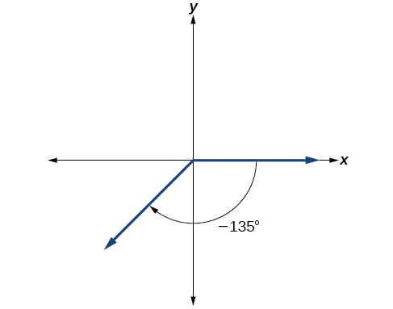{: #Figure_07_01_008}

{: data-number-style="lower-alpha"}

Show an angle of<math xmlns="http://www.w3.org/1998/Math/MathML"> <mrow> <mtext> </mtext><mn>240°</mn><mtext> </mtext> </mrow> </math>

on a circle in standard position.

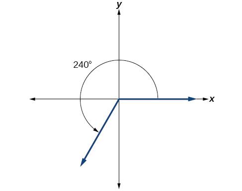{: #Figure_07_01_009}

# Converting Between Degrees and Radians

Dividing a circle into 360 parts is an arbitrary choice, although it creates the familiar degree measurement. We may choose other ways to divide a circle. To find another unit, think of the process of drawing a circle. Imagine that you stop before the circle is completed. The portion that you drew is referred to as an arc. An **arc**{: data-type="term" .no-emphasis} may be a portion of a full circle, a full circle, or more than a full circle, represented by more than one full rotation. The length of the arc around an entire circle is called the **circumference**{: data-type="term" .no-emphasis} of that circle.

The circumference of a circle is<math xmlns="http://www.w3.org/1998/Math/MathML"> <mrow> <mtext> </mtext><mi>C</mi><mo>=</mo><mn>2</mn><mi>π</mi><mi>r</mi><mo>.</mo><mtext> </mtext> </mrow> </math>

If we divide both sides of this equation by<math xmlns="http://www.w3.org/1998/Math/MathML"> <mrow> <mtext> </mtext><mi>r</mi><mo>,</mo> </mrow> </math>

we create the ratio of the circumference, which is always<math xmlns="http://www.w3.org/1998/Math/MathML"> <mrow> <mtext> </mtext><mn>2</mn><mi>π</mi><mo>,</mo> </mrow> </math>

to the radius, regardless of the length of the radius. So the circumference of any circle is<math xmlns="http://www.w3.org/1998/Math/MathML"> <mrow> <mtext> </mtext><mn>2</mn><mi>π</mi><mo>≈</mo><mn>6.28</mn><mtext> </mtext> </mrow> </math>

times the length of the radius. That means that if we took a string as long as the radius and used it to measure consecutive lengths around the circumference, there would be room for six full string-lengths and a little more than a quarter of a seventh, as shown in [\[link\]](#Figure_07_01_010).

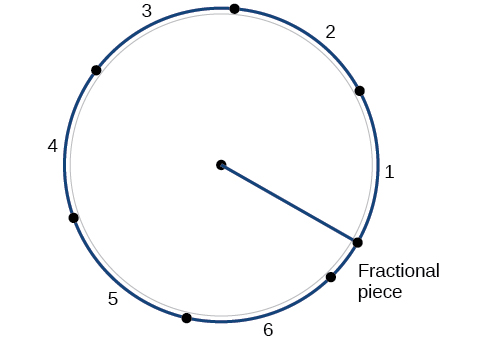{: #Figure_07_01_010}

This brings us to our new angle measure. One **radian**{: data-type="term"} is the measure of a central angle of a circle that intercepts an arc equal in length to the radius of that circle. A central angle is an angle formed at the center of a circle by two radii. Because the total circumference equals<math xmlns="http://www.w3.org/1998/Math/MathML"> <mrow> <mtext> </mtext><mn>2</mn><mi>π</mi><mtext> </mtext> </mrow> </math>

times the radius, a full circular rotation is<math xmlns="http://www.w3.org/1998/Math/MathML"> <mrow> <mtext> </mtext><mn>2</mn><mi>π</mi><mtext> </mtext> </mrow> </math>

radians.

<math xmlns="http://www.w3.org/1998/Math/MathML" display="block"> <mrow> <mtable> <mtr> <mtd columnalign="right"> <mrow> <mn>2</mn><mi>π</mi><mtext> radians</mtext></mrow> </mtd> <mtd> <mo>=</mo> </mtd> <mtd columnalign="left"> <mrow> <mn>360°</mn></mrow> </mtd> </mtr> <mtr> <mtd columnalign="right"> <mrow> <mi>π</mi><mtext> radians</mtext></mrow> </mtd> <mtd> <mo>=</mo> </mtd> <mtd columnalign="left"> <mrow> <mfrac> <mrow> <mn>360°</mn></mrow> <mn>2</mn> </mfrac> <mo>=</mo><mn>180°</mn></mrow> </mtd> </mtr> <mtr> <mtd columnalign="right"> <mrow> <mn>1</mn><mtext> radian</mtext></mrow> </mtd> <mtd> <mo>=</mo> </mtd> <mtd columnalign="left"> <mrow> <mfrac> <mrow> <mn>180°</mn></mrow> <mi>π</mi> </mfrac> <mo>≈</mo><mn>57.3°</mn></mrow> </mtd> </mtr> </mtable></mrow> </math>

See [\[link\]](#Figure_07_01_011). Note that when an angle is described without a specific unit, it refers to radian measure. For example, an angle measure of 3 indicates 3 radians. In fact, radian measure is dimensionless, since it is the quotient of a length (circumference) divided by a length (radius) and the length units cancel.

 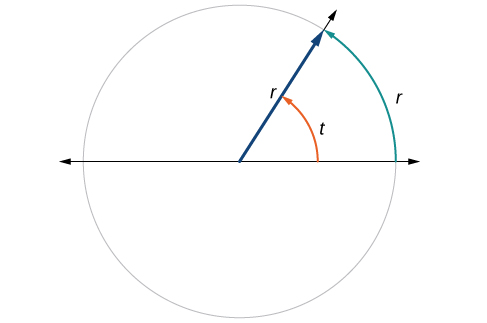{: #Figure_07_01_011}

## Relating Arc Lengths to Radius

An **arc length**{: data-type="term"}<math xmlns="http://www.w3.org/1998/Math/MathML"> <mrow> <mtext> </mtext><mi>s</mi><mtext> </mtext> </mrow> </math>

is the length of the curve along the arc. Just as the full circumference of a circle always has a constant ratio to the radius, the arc length produced by any given angle also has a constant relation to the radius, regardless of the length of the radius.

This ratio, called the radian measure, is the same regardless of the radius of the circle—it depends only on the angle. This property allows us to define a measure of any angle as the ratio of the arc length<math xmlns="http://www.w3.org/1998/Math/MathML"> <mrow> <mtext> </mtext><mi>s</mi><mtext> </mtext> </mrow> </math>

to the radius *r*. See [\[link\]](#Figure_07_01_013).

<math xmlns="http://www.w3.org/1998/Math/MathML" display="block"> <mrow> <mtable> <mtr> <mtd> <mi>s</mi> </mtd> <mtd> <mo>=</mo> </mtd> <mtd> <mrow> <mi>r</mi><mi>θ</mi></mrow> </mtd> </mtr> <mtr> <mtd> <mi>θ</mi> </mtd> <mtd> <mo>=</mo> </mtd> <mtd> <mrow> <mfrac> <mi>s</mi> <mi>r</mi> </mfrac> </mrow> </mtd> </mtr> </mtable></mrow> </math>

If<math xmlns="http://www.w3.org/1998/Math/MathML"> <mrow> <mtext> </mtext><mi>s</mi><mo>=</mo><mi>r</mi><mo>,</mo> </mrow> </math>

then<math xmlns="http://www.w3.org/1998/Math/MathML"> <mrow> <mtext> </mtext><mi>θ</mi><mo>=</mo><mfrac> <mi>r</mi> <mi>r</mi> </mfrac> <mo>=</mo><mtext> 1 radian</mtext><mtext>.</mtext> </mrow> </math>

  In an angle of 1 radian, the arc length&#10; &#10;  &#x2009;s&#x2009;&#10; &#10;equals the radius&#10; &#10;  &#x2009;r.&#x2009;&#10; &#10;(b) An angle of 2 radians has an arc length&#10; &#10;  &#x2009;s=2r.&#x2009;&#10; &#10;(c) A full revolution is&#10; &#10;  &#x2009;2&#x3C0;,&#10; &#10;or about 6.28 radians. "){: #Figure_07_01_013}

To elaborate on this idea, consider two circles, one with radius 2 and the other with radius 3. Recall the circumference of a circle is<math xmlns="http://www.w3.org/1998/Math/MathML"> <mrow> <mtext> </mtext><mi>C</mi><mo>=</mo><mn>2</mn><mi>π</mi><mi>r</mi><mo>,</mo> </mrow> </math>

where<math xmlns="http://www.w3.org/1998/Math/MathML"> <mrow> <mtext> </mtext><mi>r</mi><mtext> </mtext> </mrow> </math>

is the radius. The smaller circle then has circumference<math xmlns="http://www.w3.org/1998/Math/MathML"> <mrow> <mtext> </mtext><mn>2</mn><mi>π</mi><mo stretchy="false">(</mo><mn>2</mn><mo stretchy="false">)</mo><mo>=</mo><mn>4</mn><mi>π</mi><mtext> </mtext> </mrow> </math>

and the larger has circumference<math xmlns="http://www.w3.org/1998/Math/MathML"> <mrow> <mtext> </mtext><mn>2</mn><mi>π</mi><mo stretchy="false">(</mo><mn>3</mn><mo stretchy="false">)</mo><mo>=</mo><mn>6</mn><mi>π</mi><mo>.</mo><mtext> </mtext> </mrow> </math>

Now we draw a<math xmlns="http://www.w3.org/1998/Math/MathML"> <mrow> <mtext> </mtext><mn>45°</mn><mtext> </mtext> </mrow> </math>

angle on the two circles, as in [\[link\]](#Figure_07_01_012).

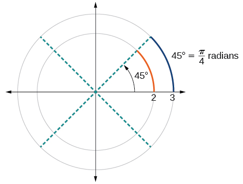{: #Figure_07_01_012}

Notice what happens if we find the ratio of the arc length divided by the radius of the circle.

<math xmlns="http://www.w3.org/1998/Math/MathML" display="block"> <mrow> <mtable> <mtr> <mtd> <mrow> <mtext>Smaller circle: </mtext><mfrac> <mrow> <mfrac> <mn>1</mn> <mn>2</mn> </mfrac> <mi>π</mi></mrow> <mn>2</mn> </mfrac> </mrow> </mtd> <mtd> <mo>=</mo> </mtd> <mtd> <mrow> <mfrac> <mn>1</mn> <mn>4</mn> </mfrac> <mi>π</mi></mrow> </mtd> </mtr> <mtr> <mtd> <mrow> <mtext>Larger circle: </mtext><mfrac> <mrow> <mfrac> <mn>3</mn> <mn>4</mn> </mfrac> <mi>π</mi></mrow> <mn>3</mn> </mfrac> </mrow> </mtd> <mtd> <mo>=</mo> </mtd> <mtd> <mrow> <mfrac> <mn>1</mn> <mn>4</mn> </mfrac> <mi>π</mi></mrow> </mtd> </mtr> </mtable></mrow> </math>

Since both ratios are<math xmlns="http://www.w3.org/1998/Math/MathML"> <mrow> <mtext> </mtext><mfrac> <mn>1</mn> <mn>4</mn> </mfrac> <mi>π</mi><mo>,</mo> </mrow> </math>

the angle measures of both circles are the same, even though the arc length and radius differ.

Radians

One **radian**{: data-type="term" .no-emphasis} is the measure of the central angle of a circle such that the length of the arc between the initial side and the terminal side is equal to the radius of the circle. A full revolution<math xmlns="http://www.w3.org/1998/Math/MathML"> <mrow> <mtext> </mtext><mo stretchy="false">(</mo><mn>360°</mn><mo stretchy="false">)</mo><mtext> </mtext> </mrow> </math>

equals<math xmlns="http://www.w3.org/1998/Math/MathML"> <mrow> <mtext> </mtext><mn>2</mn><mi>π</mi><mtext> </mtext> </mrow> </math>

radians. A half revolution<math xmlns="http://www.w3.org/1998/Math/MathML"> <mrow> <mtext> </mtext><mo stretchy="false">(</mo><mn>180°</mn><mo stretchy="false">)</mo><mtext> </mtext> </mrow> </math>

is equivalent to<math xmlns="http://www.w3.org/1998/Math/MathML"> <mrow> <mtext> </mtext><mi>π</mi><mtext> </mtext> </mrow> </math>

radians.

The **radian measure**{: data-type="term"} of an angle is the ratio of the length of the arc subtended by the angle to the radius of the circle. In other words, if<math xmlns="http://www.w3.org/1998/Math/MathML"> <mrow> <mtext> </mtext><mi>s</mi><mtext> </mtext> </mrow> </math>

is the length of an arc of a circle, and<math xmlns="http://www.w3.org/1998/Math/MathML"> <mrow> <mtext> </mtext><mi>r</mi><mtext> </mtext> </mrow> </math>

is the radius of the circle, then the central angle containing that arc measures<math xmlns="http://www.w3.org/1998/Math/MathML"> <mrow> <mtext> </mtext><mfrac> <mi>s</mi> <mi>r</mi> </mfrac> <mtext> </mtext> </mrow> </math>

radians. In a circle of radius 1, the radian measure corresponds to the length of the arc.

**A measure of 1 radian looks to be about<math xmlns="http://www.w3.org/1998/Math/MathML"> <mrow> <mtext> </mtext><mn>60°</mn><mo>.</mo><mtext> </mtext> </mrow> </math>

Is that correct?**

*Yes. It is approximately*<math xmlns="http://www.w3.org/1998/Math/MathML"> <mrow> <mtext> </mtext><mn>57.3°</mn><mo>.</mo><mtext> </mtext> </mrow> </math>

*Because*<math xmlns="http://www.w3.org/1998/Math/MathML"> <mrow> <mtext> </mtext><mn>2</mn><mi>π</mi><mtext> </mtext> </mrow> </math>

*radians equals*<math xmlns="http://www.w3.org/1998/Math/MathML"> <mrow> <mn>360°</mn><mo>,</mo><mn>1</mn> </mrow> </math>

*radian equals*<math xmlns="http://www.w3.org/1998/Math/MathML"> <mrow> <mtext> </mtext><mfrac> <mrow> <mn>360°</mn> </mrow> <mrow> <mn>2</mn><mi>π</mi> </mrow> </mfrac> <mo>≈</mo><mn>57.3°</mn><mo>.</mo> </mrow> </math>

## Using Radians

Because **radian**{: data-type="term" .no-emphasis} measure is the ratio of two lengths, it is a unitless measure. For example, in [\[link\]](#Figure_07_01_013), suppose the radius were 2 inches and the distance along the arc were also 2 inches. When we calculate the radian measure of the angle, the “inches” cancel, and we have a result without units. Therefore, it is not necessary to write the label “radians” after a radian measure, and if we see an angle that is not labeled with “degrees” or the degree symbol, we can assume that it is a radian measure.

Considering the most basic case, the **unit circle**{: data-type="term" .no-emphasis} (a circle with radius 1), we know that 1 rotation equals 360 degrees,<math xmlns="http://www.w3.org/1998/Math/MathML"> <mrow> <mtext> </mtext><mn>360°</mn><mo>.</mo> </mrow> </math>

We can also track one rotation around a circle by finding the circumference,<math xmlns="http://www.w3.org/1998/Math/MathML"> <mrow> <mtext> </mtext><mi>C</mi><mo>=</mo><mn>2</mn><mi>π</mi><mi>r</mi><mo>,</mo> </mrow> </math>

and for the unit circle<math xmlns="http://www.w3.org/1998/Math/MathML"> <mrow> <mtext> </mtext><mi>C</mi><mo>=</mo><mn>2</mn><mi>π</mi><mo>.</mo><mtext> </mtext> </mrow> </math>

These two different ways to rotate around a circle give us a way to convert from degrees to radians.

<math xmlns="http://www.w3.org/1998/Math/MathML" display="block"> <mrow> <mtable> <mtr> <mtd columnalign="right"> <mrow> <mtext>1 rotation</mtext></mrow> </mtd> <mtd> <mo>=</mo> </mtd> <mtd columnalign="left"> <mrow> <mn>360°</mn></mrow> </mtd> <mtd> <mo>=</mo> </mtd> <mtd columnalign="left"> <mrow> <mn>2</mn><mi>π</mi><mtext> radians</mtext></mrow> </mtd> </mtr> <mtr> <mtd columnalign="right"> <mrow> <mfrac> <mn>1</mn> <mn>2</mn> </mfrac> <mtext> rotation</mtext></mrow> </mtd> <mtd> <mo>=</mo> </mtd> <mtd columnalign="left"> <mrow> <mn>180°</mn></mrow> </mtd> <mtd> <mo>=</mo> </mtd> <mtd columnalign="left"> <mrow> <mi>π</mi><mtext> radians</mtext></mrow> </mtd> </mtr> <mtr> <mtd columnalign="right"> <mrow> <mfrac> <mn>1</mn> <mn>4</mn> </mfrac> <mtext> rotation</mtext></mrow> </mtd> <mtd> <mo>=</mo> </mtd> <mtd columnalign="left"> <mrow> <mn>90°</mn></mrow> </mtd> <mtd> <mo>=</mo> </mtd> <mtd columnalign="left"> <mrow> <mfrac> <mi>π</mi> <mn>2</mn> </mfrac> <mtext> radians</mtext></mrow> </mtd> </mtr> </mtable></mrow> </math>

## Identifying Special Angles Measured in Radians

In addition to knowing the measurements in degrees and radians of a quarter revolution, a half revolution, and a full revolution, there are other frequently encountered angles in one revolution of a circle with which we should be familiar. It is common to encounter multiples of 30, 45, 60, and 90 degrees. These values are shown in [\[link\]](#Figure_07_01_016). Memorizing these angles will be very useful as we study the properties associated with angles.

 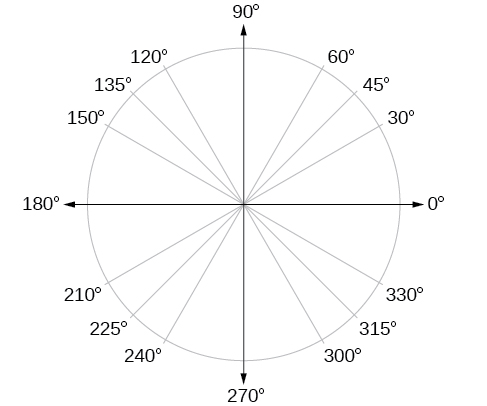{: #Figure_07_01_016}

Now, we can list the corresponding radian values for the common measures of a circle corresponding to those listed in [\[link\]](#Figure_07_01_016), which are shown in [\[link\]](#Figure_07_01_017). Be sure you can verify each of these measures.

 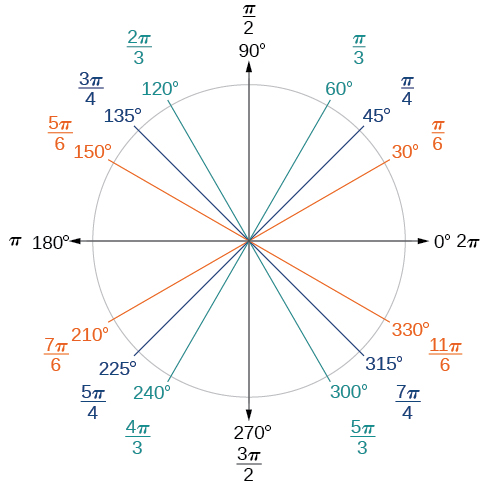{: #Figure_07_01_017}

Finding a Radian Measure

Find the radian measure of one-third of a full rotation.

For any circle, the arc length along such a rotation would be one-third of the circumference. We know that

<math xmlns="http://www.w3.org/1998/Math/MathML"> <mrow> <mn>1</mn><mtext> rotation</mtext><mo>=</mo><mn>2</mn><mi>π</mi><mi>r</mi> </mrow> </math>

So,

<math xmlns="http://www.w3.org/1998/Math/MathML" display="block"> <mrow> <mtable> <mtr rowalign="center"> <mtd columnalign="right"> <mi>s</mi> </mtd> <mtd rowalign="center"> <mo>=</mo> </mtd> <mtd columnalign="left"> <mrow> <mfrac> <mn>1</mn> <mn>3</mn> </mfrac> <mo stretchy="false">(</mo><mn>2</mn><mi>π</mi><mi>r</mi><mo stretchy="false">)</mo></mrow> </mtd> </mtr> <mtr rowalign="center"> <mtd rowalign="center" /> <mtd columnalign="left"> <mo>=</mo> </mtd> <mtd columnalign="left"> <mrow> <mfrac> <mrow> <mn>2</mn><mi>π</mi><mi>r</mi></mrow> <mn>3</mn> </mfrac> </mrow> </mtd> </mtr> </mtable></mrow> </math>

The radian measure would be the arc length divided by the radius.

<math xmlns="http://www.w3.org/1998/Math/MathML" display="block"> <mrow> <mtable> <mtr rowalign="center"> <mtd columnalign="right"> <mrow> <mtext>radian measure</mtext></mrow> </mtd> <mtd rowalign="center"> <mo>=</mo> </mtd> <mtd columnalign="left"> <mrow> <mfrac> <mrow> <mfrac> <mrow> <mn>2</mn><mi>π</mi><mi>r</mi></mrow> <mn>3</mn> </mfrac> </mrow> <mi>r</mi> </mfrac> </mrow> </mtd> </mtr> <mtr rowalign="center"> <mtd rowalign="center" /> <mtd rowalign="center"><mo>=</mo></mtd> <mtd rowalign="center" columnalign="left"> <mrow> <mfrac> <mrow> <mn>2</mn><mi>π</mi><mi>r</mi></mrow> <mrow> <mn>3</mn><mi>r</mi></mrow> </mfrac> </mrow> </mtd> </mtr> <mtr rowalign="center"> <mtd rowalign="center" /> <mtd rowalign="center"><mo>=</mo></mtd> <mtd rowalign="center"> <mrow> <mfrac> <mrow> <mn>2</mn><mi>π</mi></mrow> <mn>3</mn> </mfrac> </mrow> </mtd> </mtr> </mtable></mrow> </math>

Find the radian measure of three-fourths of a full rotation.

<math xmlns="http://www.w3.org/1998/Math/MathML"> <mrow> <mfrac> <mrow> <mn>3</mn><mi>π</mi> </mrow> <mn>2</mn> </mfrac> </mrow> </math>

## Converting Between Radians and Degrees

Because degrees and radians both measure angles, we need to be able to convert between them. We can easily do so using a proportion where<math xmlns="http://www.w3.org/1998/Math/MathML"> <mrow> <mtext> </mtext><mi>θ</mi><mtext> </mtext> </mrow> </math>

is the measure of the angle in degrees and<math xmlns="http://www.w3.org/1998/Math/MathML"> <mrow> <mtext> </mtext><msub> <mi>θ</mi> <mi>R</mi> </msub> <mtext> </mtext> </mrow> </math>

is the measure of the angle in radians.

<math xmlns="http://www.w3.org/1998/Math/MathML"> <mrow> <mfrac> <mi>θ</mi> <mrow> <mn>180</mn> </mrow> </mfrac> <mo>=</mo><mfrac> <mrow> <msub> <mi>θ</mi> <mrow> <msup> <mrow /> <mi>R</mi> </msup> </mrow> </msub> </mrow> <mi>π</mi> </mfrac> </mrow> </math>

This proportion shows that the measure of angle<math xmlns="http://www.w3.org/1998/Math/MathML"> <mrow> <mtext> </mtext><mi>θ</mi><mtext> </mtext> </mrow> </math>

in degrees divided by 180 equals the measure of angle<math xmlns="http://www.w3.org/1998/Math/MathML"> <mrow> <mtext> </mtext><mi>θ</mi><mtext> </mtext> </mrow> </math>

in radians divided by<math xmlns="http://www.w3.org/1998/Math/MathML"> <mrow> <mtext> </mtext><mi>π</mi><mo>.</mo><mtext> </mtext> </mrow> </math>

Or, phrased another way, degrees is to 180 as radians is to<math xmlns="http://www.w3.org/1998/Math/MathML"> <mrow> <mtext> </mtext><mi>π</mi><mo>.</mo> </mrow> </math>

<math xmlns="http://www.w3.org/1998/Math/MathML"> <mrow> <mfrac> <mrow> <mtext>Degrees</mtext> </mrow> <mrow> <mn>180</mn> </mrow> </mfrac> <mo>=</mo><mfrac> <mrow> <mtext>Radians</mtext> </mrow> <mi>π</mi> </mfrac> </mrow> </math>

Converting between Radians and Degrees

To convert between degrees and radians, use the proportion

<math xmlns="http://www.w3.org/1998/Math/MathML"> <mrow> <mfrac> <mi>θ</mi> <mrow> <mn>180</mn> </mrow> </mfrac> <mo>=</mo><mfrac> <mrow> <msub> <mi>θ</mi> <mi>R</mi> </msub> </mrow> <mi>π</mi> </mfrac> </mrow> </math>

Converting Radians to Degrees

Convert each radian measure to degrees.

1.  <math xmlns="http://www.w3.org/1998/Math/MathML"> <mrow> <mfrac> <mi>π</mi> <mn>6</mn> </mfrac> </mrow> </math>

2.  3
{: data-number-style="lower-alpha"}

Because we are given radians and we want degrees, we should set up a proportion and solve it.

1.  We use the proportion, substituting the given information.
    

    <math xmlns="http://www.w3.org/1998/Math/MathML" display="block"> <mrow> <mtable> <mtr> <mtd columnalign="right"> <mrow> <mfrac> <mi>θ</mi> <mrow> <mn>180</mn></mrow> </mfrac> </mrow> </mtd> <mtd> <mo>=</mo> </mtd> <mtd columnalign="left"> <mrow> <mfrac> <mrow> <msub> <mi>θ</mi> <mi>R</mi> </msub> </mrow> <mi>π</mi> </mfrac> </mrow> </mtd> </mtr> <mtr> <mtd columnalign="right"> <mrow> <mfrac> <mi>θ</mi> <mrow> <mn>180</mn></mrow> </mfrac> </mrow> </mtd> <mtd> <mo>=</mo> </mtd> <mtd columnalign="left"> <mrow> <mfrac> <mrow> <mfrac> <mi>π</mi> <mn>6</mn> </mfrac> </mrow> <mi>π</mi> </mfrac> </mrow> </mtd> </mtr> <mtr> <mtd columnalign="right"> <mi>θ</mi> </mtd> <mtd> <mo>=</mo> </mtd> <mtd columnalign="left"> <mrow> <mfrac> <mrow> <mn>180</mn></mrow> <mn>6</mn> </mfrac> </mrow> </mtd> </mtr> <mtr> <mtd columnalign="right"> <mi>θ</mi> </mtd> <mtd> <mo>=</mo> </mtd> <mtd columnalign="left"> <mrow> <mn>30°</mn></mrow> </mtd> </mtr> </mtable></mrow> </math>
    

2.  We use the proportion, substituting the given information.
    

    <math xmlns="http://www.w3.org/1998/Math/MathML" display="block"> <mrow> <mtable> <mtr> <mtd columnalign="right"> <mrow> <mfrac> <mi>θ</mi> <mrow> <mn>180</mn></mrow> </mfrac> </mrow> </mtd> <mtd> <mo>=</mo> </mtd> <mtd columnalign="left"> <mrow> <mfrac> <mrow> <msub> <mi>θ</mi> <mrow> <msup> <mrow /> <mi>R</mi> </msup> </mrow> </msub> </mrow> <mi>π</mi> </mfrac> </mrow> </mtd> </mtr> <mtr> <mtd columnalign="right"> <mrow> <mfrac> <mi>θ</mi> <mrow> <mn>180</mn></mrow> </mfrac> </mrow> </mtd> <mtd> <mo>=</mo> </mtd> <mtd columnalign="left"> <mrow> <mfrac> <mn>3</mn> <mi>π</mi> </mfrac> </mrow> </mtd> </mtr> <mtr> <mtd columnalign="right"> <mi>θ</mi> </mtd> <mtd> <mo>=</mo> </mtd> <mtd columnalign="left"> <mrow> <mfrac> <mrow> <mn>3</mn><mo stretchy="false">(</mo><mn>180</mn><mo stretchy="false">)</mo></mrow> <mi>π</mi> </mfrac> </mrow> </mtd> </mtr> <mtr> <mtd columnalign="right"> <mi>θ</mi> </mtd> <mtd> <mo>≈</mo> </mtd> <mtd columnalign="left"> <mrow> <mn>172°</mn></mrow> </mtd> </mtr> </mtable></mrow> </math>
    

{: data-number-style="lower-alpha"}

Convert<math xmlns="http://www.w3.org/1998/Math/MathML"> <mrow> <mtext> </mtext><mo>−</mo><mfrac> <mrow> <mn>3</mn><mi>π</mi> </mrow> <mn>4</mn> </mfrac> <mtext> </mtext> </mrow> </math>

radians to degrees.

<math xmlns="http://www.w3.org/1998/Math/MathML"> <mrow> <mn>−135</mn><mo>°</mo> </mrow> </math>

Converting Degrees to Radians

Convert<math xmlns="http://www.w3.org/1998/Math/MathML"> <mrow> <mtext> </mtext><mn>15</mn><mtext> </mtext> </mrow> </math>

degrees to radians.

In this example, we start with degrees and want radians, so we again set up a proportion, but we substitute the given information into a different part of the proportion.

<math xmlns="http://www.w3.org/1998/Math/MathML" display="block"> <mrow> <mtable> <mtr> <mtd columnalign="right"> <mrow> <mfrac> <mi>θ</mi> <mrow> <mn>180</mn></mrow> </mfrac> </mrow> </mtd> <mtd> <mo>=</mo> </mtd> <mtd columnalign="left"> <mrow> <mfrac> <mrow> <msup> <mi>θ</mi> <mi>R</mi> </msup> </mrow> <mi>π</mi> </mfrac> </mrow> </mtd> </mtr> <mtr> <mtd columnalign="right"> <mrow> <mfrac> <mrow> <mn>15</mn></mrow> <mrow> <mn>180</mn></mrow> </mfrac> </mrow> </mtd> <mtd> <mo>=</mo> </mtd> <mtd columnalign="left"> <mrow> <mfrac> <mrow> <msup> <mi>θ</mi> <mi>R</mi> </msup> </mrow> <mi>π</mi> </mfrac> </mrow> </mtd> </mtr> <mtr> <mtd columnalign="right"> <mrow> <mfrac> <mrow> <mn>15</mn><mi>π</mi></mrow> <mrow> <mn>180</mn></mrow> </mfrac> </mrow> </mtd> <mtd> <mo>=</mo> </mtd> <mtd columnalign="left"> <mrow> <msup> <mi>θ</mi> <mi>R</mi> </msup> </mrow> </mtd> </mtr> <mtr> <mtd columnalign="right"> <mrow> <mfrac> <mi>π</mi> <mrow> <mn>12</mn></mrow> </mfrac> </mrow> </mtd> <mtd> <mo>=</mo> </mtd> <mtd columnalign="left"> <mrow> <msup> <mi>θ</mi> <mi>R</mi> </msup> </mrow> </mtd> </mtr> </mtable></mrow> </math>

Analysis

Another way to think about this problem is by remembering that<math xmlns="http://www.w3.org/1998/Math/MathML"> <mrow> <mtext> </mtext><mn>30°</mn><mo>=</mo><mfrac> <mi>π</mi> <mn>6</mn> </mfrac> <mo>.</mo><mtext> </mtext></mrow> </math>

Because<math xmlns="http://www.w3.org/1998/Math/MathML"> <mrow> <mtext> </mtext><mn>15°</mn><mo>=</mo><mfrac> <mn>1</mn> <mn>2</mn> </mfrac> <mrow><mo>(</mo> <mrow> <mn>30°</mn></mrow> <mo>)</mo></mrow><mo>,</mo></mrow> </math>

we can find that<math xmlns="http://www.w3.org/1998/Math/MathML"> <mrow> <mtext> </mtext><mfrac> <mn>1</mn> <mn>2</mn> </mfrac> <mrow><mo>(</mo> <mrow> <mfrac> <mi>π</mi> <mn>6</mn> </mfrac> </mrow> <mo>)</mo></mrow><mtext> </mtext> </mrow> </math>

is<math xmlns="http://www.w3.org/1998/Math/MathML"> <mrow> <mtext> </mtext><mfrac> <mi>π</mi> <mrow> <mn>12</mn> </mrow> </mfrac> <mo>.</mo> </mrow> </math>

Convert<math xmlns="http://www.w3.org/1998/Math/MathML"> <mrow> <mtext> </mtext><mn>126°</mn><mtext> </mtext> </mrow> </math>

to radians.

<math xmlns="http://www.w3.org/1998/Math/MathML"> <mrow> <mfrac> <mrow> <mn>7</mn><mi>π</mi> </mrow> <mrow> <mn>10</mn> </mrow> </mfrac> </mrow> </math>

# Finding Coterminal Angles

Converting between degrees and radians can make working with angles easier in some applications. For other applications, we may need another type of conversion. Negative angles and angles greater than a full revolution are more awkward to work with than those in the range of<math xmlns="http://www.w3.org/1998/Math/MathML"> <mrow> <mtext> </mtext><mn>0°</mn><mtext> </mtext> </mrow> </math>

to<math xmlns="http://www.w3.org/1998/Math/MathML"> <mrow> <mtext> </mtext><mn>360°</mn><mo>,</mo> </mrow> </math>

or<math xmlns="http://www.w3.org/1998/Math/MathML"> <mrow> <mtext> </mtext><mn>0</mn><mtext> </mtext> </mrow> </math>

to<math xmlns="http://www.w3.org/1998/Math/MathML"> <mrow> <mtext> </mtext><mn>2</mn><mi>π</mi><mo>.</mo><mtext> </mtext> </mrow> </math>

It would be convenient to replace those out-of-range angles with a corresponding angle within the range of a single revolution.

It is possible for more than one angle to have the same terminal side. Look at [\[link\]](#Figure_07_01_020). The angle of<math xmlns="http://www.w3.org/1998/Math/MathML"> <mrow> <mtext> </mtext><mn>140°</mn><mtext> </mtext> </mrow> </math>

is a positive angle, measured counterclockwise. The angle of<math xmlns="http://www.w3.org/1998/Math/MathML"> <mrow> <mtext> </mtext><mn>–220°</mn><mtext> </mtext> </mrow> </math>

is a negative angle, measured clockwise. But both angles have the same terminal side. If two angles in standard position have the same terminal side, they are **coterminal angles**{: data-type="term" .no-emphasis}. Every angle greater than<math xmlns="http://www.w3.org/1998/Math/MathML"> <mrow> <mtext> </mtext><mn>360°</mn><mtext> </mtext> </mrow> </math>

or less than<math xmlns="http://www.w3.org/1998/Math/MathML"> <mrow> <mtext> </mtext><mn>0°</mn><mtext> </mtext> </mrow> </math>

is coterminal with an angle between<math xmlns="http://www.w3.org/1998/Math/MathML"> <mrow> <mtext> </mtext><mn>0°</mn><mtext> </mtext> </mrow> </math>

and<math xmlns="http://www.w3.org/1998/Math/MathML"> <mrow> <mtext> </mtext><mn>360°</mn><mo>,</mo> </mrow> </math>

and it is often more convenient to find the coterminal angle within the range of<math xmlns="http://www.w3.org/1998/Math/MathML"> <mrow> <mtext> </mtext><mn>0°</mn><mtext> </mtext> </mrow> </math>

to<math xmlns="http://www.w3.org/1998/Math/MathML"> <mrow> <mtext> </mtext><mn>360°</mn><mtext> </mtext> </mrow> </math>

than to work with an angle that is outside that range.

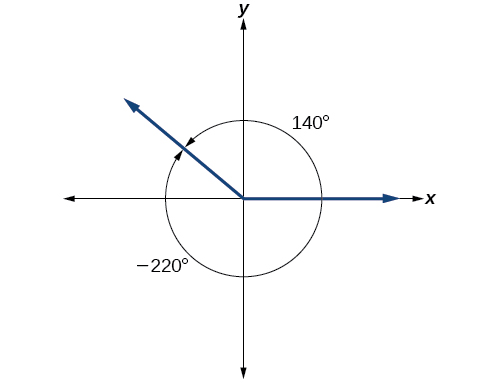{: #Figure_07_01_020}

Any angle has infinitely many coterminal angles because each time we add<math xmlns="http://www.w3.org/1998/Math/MathML"> <mrow> <mtext> </mtext><mn>360°</mn><mtext> </mtext> </mrow> </math>

to that angle—or subtract<math xmlns="http://www.w3.org/1998/Math/MathML"> <mrow> <mtext> </mtext><mn>360°</mn><mtext> </mtext> </mrow> </math>

from it—the resulting value has a terminal side in the same location. For example,<math xmlns="http://www.w3.org/1998/Math/MathML"> <mrow> <mtext> </mtext><mtext>100°</mtext><mtext> </mtext> </mrow> </math>

and<math xmlns="http://www.w3.org/1998/Math/MathML"> <mrow> <mtext> </mtext><mtext>460°</mtext><mtext> </mtext> </mrow> </math>

are coterminal for this reason, as is<math xmlns="http://www.w3.org/1998/Math/MathML"> <mrow> <mtext> </mtext><mn>−260°</mn><mo>.</mo><mtext> </mtext> </mrow> </math>

An angle’s reference angle is the measure of the smallest, positive, acute angle<math xmlns="http://www.w3.org/1998/Math/MathML"> <mrow> <mtext> </mtext><mi>t</mi><mtext> </mtext> </mrow> </math>

formed by the terminal side of the angle<math xmlns="http://www.w3.org/1998/Math/MathML"> <mrow> <mtext> </mtext><mi>t</mi><mtext> </mtext> </mrow> </math>

and the horizontal axis. Thus positive reference angles have terminal sides that lie in the first quadrant and can be used as models for angles in other quadrants. See [\[link\]](#Figure_05_01_019) for examples of reference angles for angles in different quadrants.

{: #Figure_05_01_019}

Coterminal and Reference Angles

**Coterminal angles** are two angles in standard position that have the same terminal side.

An angle’s **reference angle**{: data-type="term"} is the size of the smallest acute angle,<math xmlns="http://www.w3.org/1998/Math/MathML"> <mrow> <mtext> </mtext><msup> <mi>t</mi> <mo>′</mo> </msup> <mo>,</mo></mrow> </math>

formed by the terminal side of the angle<math xmlns="http://www.w3.org/1998/Math/MathML"> <mrow> <mtext> </mtext><mi>t</mi><mtext> </mtext> </mrow> </math>

and the horizontal axis.

<strong>Given an angle greater than<math xmlns="http://www.w3.org/1998/Math/MathML">
  <mrow>
   <mtext> </mtext><mn>360°</mn><mo>,</mo>
  </mrow>
 </math>find a coterminal angle between<math xmlns="http://www.w3.org/1998/Math/MathML">
  <mrow>
   <mtext> </mtext><mn>0°</mn><mtext> </mtext>
  </mrow>
 </math>and<math xmlns="http://www.w3.org/1998/Math/MathML">
  <mrow>
   <mtext> </mtext><mn>360°</mn><mo />
  </mrow>
 </math></strong>

1.  Subtract
    <math xmlns="http://www.w3.org/1998/Math/MathML"> <mrow> <mtext> </mtext><mn>360°</mn><mtext> </mtext> </mrow> </math>
    
    from the given angle.
2.  If the result is still greater than
    <math xmlns="http://www.w3.org/1998/Math/MathML"> <mrow> <mtext> </mtext><mn>360°</mn><mo /><mo>,</mo> </mrow> </math>
    
    subtract
    <math xmlns="http://www.w3.org/1998/Math/MathML"> <mrow> <mtext> </mtext><mn>360°</mn><mtext> </mtext> </mrow> </math>
    
    again till the result is between
    <math xmlns="http://www.w3.org/1998/Math/MathML"> <mrow> <mtext> </mtext><mn>0°</mn><mtext> </mtext> </mrow> </math>
    
    and
    <math xmlns="http://www.w3.org/1998/Math/MathML"> <mrow> <mtext> </mtext><mn>360°</mn><mo>.</mo> </mrow> </math>

3.  The resulting angle is coterminal with the original angle.
{: data-number-style="arabic"}

Finding an Angle Coterminal with an Angle of Measure Greater Than
<math xmlns="http://www.w3.org/1998/Math/MathML"> <mrow> <mtext> </mtext><mn>360°</mn> </mrow> </math>

Find the least positive angle<math xmlns="http://www.w3.org/1998/Math/MathML"> <mrow> <mtext> </mtext><mi>θ</mi><mtext> </mtext> </mrow> </math>

that is coterminal with an angle measuring<math xmlns="http://www.w3.org/1998/Math/MathML"> <mrow> <mtext> </mtext><mn>800°</mn><mo>,</mo> </mrow> </math>

where<math xmlns="http://www.w3.org/1998/Math/MathML"> <mrow> <mtext> </mtext><mn>0°</mn><mo>≤</mo><mi>θ</mi><mo>&lt;</mo><mn>360</mn><mo>°</mo><mo>.</mo> </mrow> </math>

An angle with measure<math xmlns="http://www.w3.org/1998/Math/MathML"> <mrow> <mtext> </mtext><mn>800°</mn><mtext> </mtext> </mrow> </math>

is coterminal with an angle with measure<math xmlns="http://www.w3.org/1998/Math/MathML"> <mrow> <mtext> </mtext><mn>800</mn><mo>−</mo><mn>360</mn><mo>=</mo><mn>440°</mn><mo>,</mo></mrow> </math>

but<math xmlns="http://www.w3.org/1998/Math/MathML"> <mrow> <mtext> </mtext><mn>440°</mn><mo /><mtext> </mtext> </mrow> </math>

is still greater than<math xmlns="http://www.w3.org/1998/Math/MathML"> <mrow> <mtext> </mtext><mn>360°</mn><mo>,</mo> </mrow> </math>

so we subtract<math xmlns="http://www.w3.org/1998/Math/MathML"> <mrow> <mtext> </mtext><mn>360°</mn><mtext> </mtext> </mrow> </math>

again to find another coterminal angle:<math xmlns="http://www.w3.org/1998/Math/MathML"> <mrow> <mtext> </mtext><mn>440</mn><mo>−</mo><mn>360</mn><mo>=</mo><mn>80°</mn><mo>.</mo></mrow> </math>

The angle<math xmlns="http://www.w3.org/1998/Math/MathML"> <mrow> <mtext> </mtext><mi>θ</mi><mo>=</mo><mn>80°</mn><mtext> </mtext> </mrow> </math>

is coterminal with<math xmlns="http://www.w3.org/1998/Math/MathML"> <mrow> <mtext> </mtext><mn>800°</mn><mo>.</mo><mtext> </mtext> </mrow> </math>

To put it another way,<math xmlns="http://www.w3.org/1998/Math/MathML"> <mrow> <mtext> </mtext><mn>800°</mn><mtext> </mtext> </mrow> </math>

equals<math xmlns="http://www.w3.org/1998/Math/MathML"> <mrow> <mtext> </mtext><mn>80°</mn><mtext> </mtext> </mrow> </math>

plus two full rotations, as shown in [[link]](#Figure_07_01_021).

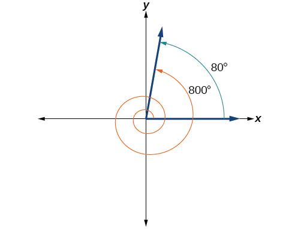{: #Figure_07_01_021}

Find an angle<math xmlns="http://www.w3.org/1998/Math/MathML"> <mrow> <mtext> </mtext><mi>α</mi><mtext> </mtext> </mrow> </math>

that is coterminal with an angle measuring <math xmlns="http://www.w3.org/1998/Math/MathML"> <mrow> <mtext> </mtext><mn>870°</mn><mo>,</mo> </mrow> </math>

where<math xmlns="http://www.w3.org/1998/Math/MathML"> <mrow> <mtext> </mtext><mn>0°</mn><mo>≤</mo><mi>α</mi><mo>&lt;</mo><mn>360°</mn><mo>.</mo> </mrow> </math>

<math xmlns="http://www.w3.org/1998/Math/MathML"> <mrow> <mi>α</mi><mo>=</mo><mn>150°</mn> </mrow> </math>

<strong>Given an angle with measure less than<math xmlns="http://www.w3.org/1998/Math/MathML">
  <mrow>
   <mtext> </mtext><mn>0°</mn><mo>,</mo>
  </mrow>
 </math>find a coterminal angle having a measure between<math xmlns="http://www.w3.org/1998/Math/MathML">
  <mrow>
   <mtext> </mtext><mn>0°</mn><mtext> </mtext>
  </mrow>
 </math>and<math xmlns="http://www.w3.org/1998/Math/MathML">
  <mrow>
   <mtext> </mtext><mn>360°</mn><mo>.</mo>
  </mrow>
 </math> </strong>

1.  Add
    <math xmlns="http://www.w3.org/1998/Math/MathML"> <mrow> <mtext> </mtext><mn>360°</mn><mtext> </mtext> </mrow> </math>
    
    to the given angle.
2.  If the result is still less than
    <math xmlns="http://www.w3.org/1998/Math/MathML"> <mrow> <mtext> </mtext><mn>0°</mn><mo>,</mo> </mrow> </math>
    
    add
    <math xmlns="http://www.w3.org/1998/Math/MathML"> <mrow> <mtext> </mtext><mn>360°</mn><mtext> </mtext> </mrow> </math>
    
    again until the result is between
    <math xmlns="http://www.w3.org/1998/Math/MathML"> <mrow> <mtext> </mtext><mn>0°</mn><mtext> </mtext> </mrow> </math>
    
    and
    <math xmlns="http://www.w3.org/1998/Math/MathML"> <mrow> <mtext> </mtext><mn>360°</mn><mo>.</mo> </mrow> </math>

3.  The resulting angle is coterminal with the original angle.
{: data-number-style="arabic"}

Finding an Angle Coterminal with an Angle Measuring Less Than
<math xmlns="http://www.w3.org/1998/Math/MathML"> <mrow> <mtext> </mtext><mn>0°</mn> </mrow> </math>

Show the angle with measure<math xmlns="http://www.w3.org/1998/Math/MathML"> <mrow> <mtext> </mtext><mn>−45°</mn><mtext> </mtext> </mrow> </math>

on a circle and find a positive coterminal angle<math xmlns="http://www.w3.org/1998/Math/MathML"> <mrow> <mtext> </mtext><mi>α</mi><mtext> </mtext> </mrow> </math>

such that<math xmlns="http://www.w3.org/1998/Math/MathML"> <mrow> <mtext> </mtext><mn>0°</mn><mo>≤</mo><mi>α</mi><mo>&lt;</mo><mn>360°</mn><mo>.</mo> </mrow> </math>

Since<math xmlns="http://www.w3.org/1998/Math/MathML"> <mrow> <mtext> </mtext><mn>45°</mn><mtext> </mtext> </mrow> </math>

is half of<math xmlns="http://www.w3.org/1998/Math/MathML"> <mrow> <mtext> </mtext><mn>90°</mn><mo>,</mo> </mrow> </math>

we can start at the positive horizontal axis and measure clockwise half of a<math xmlns="http://www.w3.org/1998/Math/MathML"> <mrow> <mtext> </mtext><mn>90°</mn><mtext> </mtext> </mrow> </math>

angle.

Because we can find coterminal angles by adding or subtracting a full rotation of<math xmlns="http://www.w3.org/1998/Math/MathML"> <mrow> <mtext> </mtext><mn>360°</mn><mo>,</mo> </mrow> </math>

we can find a positive coterminal angle here by adding<math xmlns="http://www.w3.org/1998/Math/MathML"> <mrow> <mtext> </mtext><mn>360°</mn><mo>.</mo> </mrow> </math>

<math xmlns="http://www.w3.org/1998/Math/MathML"> <mrow> <mn>−45°</mn><mo>+</mo><mn>360°</mn><mo>=</mo><mn>315°</mn> </mrow> </math>

We can then show the angle on a circle, as in [[link]](#Figure_07_01_022).

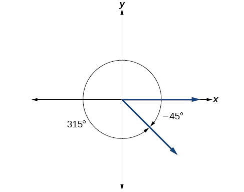{: #Figure_07_01_022}

Find an angle<math xmlns="http://www.w3.org/1998/Math/MathML"> <mrow> <mtext> </mtext><mi>β</mi><mtext> </mtext> </mrow> </math>

that is coterminal with an angle measuring<math xmlns="http://www.w3.org/1998/Math/MathML"> <mrow> <mtext> </mtext><mn>−300°</mn><mtext> </mtext> </mrow> </math>

such that<math xmlns="http://www.w3.org/1998/Math/MathML"> <mrow> <mtext> </mtext><mn>0°</mn><mo>≤</mo><mi>β</mi><mo>&lt;</mo><mn>360°</mn><mo>.</mo> </mrow> </math>

<math xmlns="http://www.w3.org/1998/Math/MathML"> <mrow> <mi>β</mi><mo>=</mo><mn>60°</mn> </mrow> </math>

## Finding Coterminal Angles Measured in Radians

We can find **coterminal angles**{: data-type="term" .no-emphasis} measured in radians in much the same way as we have found them using degrees. In both cases, we find coterminal angles by adding or subtracting one or more full rotations.

<strong>Given an angle greater than<math xmlns="http://www.w3.org/1998/Math/MathML">
  <mrow>
   <mtext> </mtext><mn>2</mn><mi>π</mi><mo>,</mo>
  </mrow>
 </math>find a coterminal angle between 0 and<math xmlns="http://www.w3.org/1998/Math/MathML">
  <mrow>
   <mtext> </mtext><mn>2</mn><mi>π</mi><mo>.</mo>
  </mrow>
 </math> </strong>

1.  Subtract
    <math xmlns="http://www.w3.org/1998/Math/MathML"> <mrow> <mtext> </mtext><mn>2</mn><mi>π</mi><mtext> </mtext> </mrow> </math>
    
    from the given angle.
2.  If the result is still greater than
    <math xmlns="http://www.w3.org/1998/Math/MathML"> <mrow> <mtext> </mtext><mn>2</mn><mi>π</mi><mo>,</mo> </mrow> </math>
    
    subtract
    <math xmlns="http://www.w3.org/1998/Math/MathML"> <mrow> <mtext> </mtext><mn>2</mn><mi>π</mi><mtext> </mtext> </mrow> </math>
    
    again until the result is between
    <math xmlns="http://www.w3.org/1998/Math/MathML"> <mrow> <mtext> </mtext><mn>0</mn><mtext> </mtext> </mrow> </math>
    
    and
    <math xmlns="http://www.w3.org/1998/Math/MathML"> <mrow> <mtext> </mtext><mn>2</mn><mi>π</mi><mo>.</mo> </mrow> </math>

3.  The resulting angle is coterminal with the original angle.
{: data-number-style="arabic"}

Finding Coterminal Angles Using Radians

Find an angle<math xmlns="http://www.w3.org/1998/Math/MathML"> <mrow> <mtext> </mtext><mi>β</mi><mtext> </mtext> </mrow> </math>

that is coterminal with<math xmlns="http://www.w3.org/1998/Math/MathML"> <mrow> <mtext> </mtext><mfrac> <mrow> <mn>19</mn><mi>π</mi> </mrow> <mn>4</mn> </mfrac> <mo>,</mo> </mrow> </math>

where<math xmlns="http://www.w3.org/1998/Math/MathML"> <mrow> <mtext> </mtext><mn>0</mn><mo>≤</mo><mi>β</mi><mo>&lt;</mo><mn>2</mn><mi>π</mi><mo>.</mo> </mrow> </math>

When working in degrees, we found coterminal angles by adding or subtracting 360 degrees, a full rotation. Likewise, in radians, we can find coterminal angles by adding or subtracting full rotations of<math xmlns="http://www.w3.org/1998/Math/MathML"> <mrow> <mtext> </mtext><mn>2</mn><mi>π</mi><mtext> </mtext> </mrow> </math>

radians:

<math xmlns="http://www.w3.org/1998/Math/MathML" display="block"> <mrow> <mtable> <mtr rowalign="center"> <mtd rowalign="center" columnalign="right"> <mrow> <mfrac> <mrow> <mn>19</mn><mi>π</mi></mrow> <mn>4</mn> </mfrac> <mo>−</mo><mn>2</mn><mi>π</mi></mrow> </mtd> <mtd rowalign="center"> <mo>=</mo> </mtd> <mtd rowalign="center" columnalign="left"> <mrow> <mfrac> <mrow> <mn>19</mn><mi>π</mi></mrow> <mn>4</mn> </mfrac> <mo>−</mo><mfrac> <mrow> <mn>8</mn><mi>π</mi></mrow> <mn>4</mn> </mfrac> </mrow> </mtd> </mtr> <mtr rowalign="center"> <mtd rowalign="center" /> <mtd rowalign="center"> <mo>=</mo> </mtd> <mtd rowalign="center" columnalign="left"> <mrow> <mfrac> <mrow> <mn>11</mn><mi>π</mi></mrow> <mn>4</mn> </mfrac> </mrow> </mtd> </mtr> </mtable></mrow> </math>

The angle<math xmlns="http://www.w3.org/1998/Math/MathML"> <mrow> <mtext> </mtext><mfrac> <mrow> <mn>11</mn><mi>π</mi> </mrow> <mn>4</mn> </mfrac> <mtext> </mtext> </mrow> </math>

is coterminal, but not less than<math xmlns="http://www.w3.org/1998/Math/MathML"> <mrow> <mtext> </mtext><mn>2</mn><mi>π</mi><mo>,</mo> </mrow> </math>

so we subtract another rotation.

<math xmlns="http://www.w3.org/1998/Math/MathML" display="block"> <mrow> <mtable> <mtr rowalign="center"> <mtd rowalign="center" columnalign="right"> <mrow> <mfrac> <mrow> <mn>11</mn><mi>π</mi></mrow> <mn>4</mn> </mfrac> <mo>−</mo><mn>2</mn><mi>π</mi></mrow> </mtd> <mtd rowalign="center"> <mo>=</mo> </mtd> <mtd rowalign="center" columnalign="left"> <mrow> <mfrac> <mrow> <mn>11</mn><mi>π</mi></mrow> <mn>4</mn> </mfrac> <mo>−</mo><mfrac> <mrow> <mn>8</mn><mi>π</mi></mrow> <mn>4</mn> </mfrac> </mrow> </mtd> </mtr> <mtr rowalign="center"> <mtd rowalign="center" /> <mtd rowalign="center"><mo>=</mo></mtd> <mtd rowalign="center" columnalign="left"> <mrow> <mfrac> <mrow> <mn>3</mn><mi>π</mi></mrow> <mn>4</mn> </mfrac> </mrow> </mtd> </mtr> </mtable></mrow> </math>

The angle<math xmlns="http://www.w3.org/1998/Math/MathML"> <mrow> <mtext> </mtext><mfrac> <mrow> <mn>3</mn><mi>π</mi> </mrow> <mn>4</mn> </mfrac> <mtext> </mtext> </mrow> </math>

is coterminal with<math xmlns="http://www.w3.org/1998/Math/MathML"> <mrow> <mtext> </mtext><mfrac> <mrow> <mn>19</mn><mi>π</mi> </mrow> <mn>4</mn> </mfrac> <mo>,</mo> </mrow> </math>

as shown in [[link]](#Figure_07_01_023).

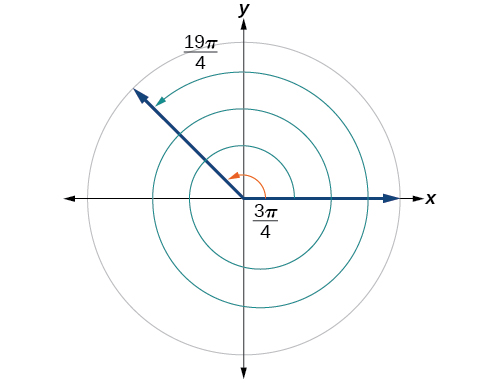{: #Figure_07_01_023}

Find an angle of measure<math xmlns="http://www.w3.org/1998/Math/MathML"> <mrow> <mtext> </mtext><mi>θ</mi><mtext> </mtext> </mrow> </math>

that is coterminal with an angle of measure<math xmlns="http://www.w3.org/1998/Math/MathML"> <mrow> <mtext> </mtext><mo>−</mo><mfrac> <mrow> <mn>17</mn><mi>π</mi> </mrow> <mn>6</mn> </mfrac> <mtext> </mtext> </mrow> </math>

where<math xmlns="http://www.w3.org/1998/Math/MathML"> <mrow> <mtext> </mtext><mn>0</mn><mo>≤</mo><mi>θ</mi><mo>&lt;</mo><mn>2</mn><mi>π</mi><mo>.</mo> </mrow> </math>

<math xmlns="http://www.w3.org/1998/Math/MathML"> <mrow> <mtext> </mtext><mfrac> <mrow> <mn>7</mn><mi>π</mi> </mrow> <mn>6</mn> </mfrac> <mtext> </mtext> </mrow> </math>

# Determining the Length of an Arc

Recall that the radian measure<math xmlns="http://www.w3.org/1998/Math/MathML"> <mrow> <mtext> </mtext><mi>θ</mi><mtext> </mtext> </mrow> </math>

of an angle was defined as the ratio of the **arc length**{: data-type="term" .no-emphasis}<math xmlns="http://www.w3.org/1998/Math/MathML"> <mrow> <mtext> </mtext><mi>s</mi><mtext> </mtext> </mrow> </math>

of a circular arc to the radius<math xmlns="http://www.w3.org/1998/Math/MathML"> <mrow> <mtext> </mtext><mi>r</mi><mtext> </mtext> </mrow> </math>

of the circle,<math xmlns="http://www.w3.org/1998/Math/MathML"> <mrow> <mtext> </mtext><mi>θ</mi><mo>=</mo><mfrac> <mi>s</mi> <mi>r</mi> </mfrac> <mo>.</mo><mtext> </mtext> </mrow> </math>

From this relationship, we can find arc length along a circle, given an angle.

Arc Length on a Circle

In a circle of radius *r*, the length of an arc<math xmlns="http://www.w3.org/1998/Math/MathML"> <mrow> <mtext> </mtext><mi>s</mi><mtext> </mtext> </mrow> </math>

subtended by an angle with measure<math xmlns="http://www.w3.org/1998/Math/MathML"> <mrow> <mtext> </mtext><mi>θ</mi><mtext> </mtext> </mrow> </math>

in radians, shown in [\[link\]](#Figure_07_01_024), is

<math xmlns="http://www.w3.org/1998/Math/MathML"> <mrow> <mi>s</mi><mo>=</mo><mi>r</mi><mi>θ</mi> </mrow> </math>

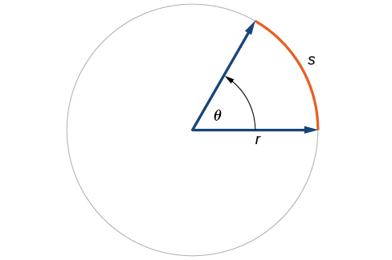{: #Figure_07_01_024}

<strong>Given a circle of radius<math xmlns="http://www.w3.org/1998/Math/MathML">
  <mrow>
   <mtext> </mtext><mi>r</mi><mo>,</mo>
  </mrow>
 </math>calculate the length<math xmlns="http://www.w3.org/1998/Math/MathML">
  <mrow>
   <mtext> </mtext><mi>s</mi><mtext> </mtext>
  </mrow>
 </math>of the arc subtended by a given angle of measure<math xmlns="http://www.w3.org/1998/Math/MathML">
  <mrow>
   <mtext> </mtext><mi>θ</mi><mo>.</mo>
  </mrow>
 </math> </strong>

1.  If necessary, convert
    <math xmlns="http://www.w3.org/1998/Math/MathML"> <mrow> <mtext> </mtext><mi>θ</mi><mtext> </mtext> </mrow> </math>
    
    to radians.
2.  Multiply the radius
    <math xmlns="http://www.w3.org/1998/Math/MathML"> <mrow> <mtext> </mtext><mi>r</mi><mtext> </mtext><mtext> </mtext><mi>θ</mi><mo>:</mo><mi>s</mi><mo>=</mo><mi>r</mi><mi>θ</mi><mo>.</mo> </mrow> </math>
{: data-number-style="arabic"}

Finding the Length of an Arc

Assume the orbit of Mercury around the sun is a perfect circle. Mercury is approximately 36 million miles from the sun.

1.  In one Earth day, Mercury completes 0.0114 of its total revolution. How many miles does it travel in one day?
2.  Use your answer from part (a) to determine the radian measure for Mercury’s movement in one Earth day.
{: data-number-style="lower-alpha"}

1.  Let’s begin by finding the circumference of Mercury’s orbit.
    

    <math xmlns="http://www.w3.org/1998/Math/MathML" display="block"> <mrow> <mtable> <mtr rowalign="center"> <mtd rowalign="center" columnalign="right"> <mi>C</mi> </mtd> <mtd rowalign="center"><mo>=</mo></mtd> <mtd rowalign="center" columnalign="left"> <mrow> <mn>2</mn><mi>π</mi><mi>r</mi></mrow> </mtd> </mtr> <mtr rowalign="center"> <mtd rowalign="center" /> <mtd rowalign="center"><mo>=</mo></mtd> <mtd rowalign="center" columnalign="left"> <mrow> <mn>2</mn><mi>π</mi><mo stretchy="false">(</mo><mtext>36 million miles</mtext><mo stretchy="false">)</mo></mrow> </mtd> </mtr> <mtr rowalign="center"> <mtd rowalign="center" /> <mtd rowalign="center"><mo>≈</mo></mtd> <mtd rowalign="center" columnalign="left"> <mrow> <mtext>226 million miles</mtext></mrow> </mtd> </mtr> </mtable></mrow> </math>
    

    
    Since Mercury completes 0.0114 of its total revolution in one Earth day, we can now find the distance traveled.
    
    

    <math xmlns="http://www.w3.org/1998/Math/MathML"> <mrow> <mrow><mo>(</mo> <mrow> <mn>0.0114</mn> </mrow> <mo>)</mo></mrow><mn>226</mn><mtext> million miles = 2</mtext><mtext>.58 million miles</mtext> </mrow> </math>
    

2.  Now, we convert to radians.
    

    <math xmlns="http://www.w3.org/1998/Math/MathML"> <mrow> <mtable> <mtr rowalign="center"> <mtd rowalign="center" columnalign="right"> <mrow> <mtext>radian</mtext></mrow> </mtd> <mtd rowalign="center"> <mo>=</mo> </mtd> <mtd rowalign="center" columnalign="left"> <mrow> <mfrac> <mrow> <mtext>arclength</mtext></mrow> <mrow> <mtext>radius</mtext></mrow> </mfrac> </mrow> </mtd> </mtr> <mtr rowalign="center"> <mtd rowalign="center" /> <mtd rowalign="center"><mo>=</mo></mtd> <mtd rowalign="center" columnalign="left"> <mrow> <mfrac> <mrow> <mn>2.</mn><mtext>58 million miles</mtext></mrow> <mrow> <mn>36</mn><mtext> million miles</mtext></mrow> </mfrac> </mrow> </mtd> </mtr> <mtr rowalign="center"> <mtd rowalign="center" /> <mtd rowalign="center"> <mo>=</mo> </mtd> <mtd rowalign="center" columnalign="left"> <mrow> <mn>0.0717</mn></mrow> </mtd> </mtr> </mtable></mrow> </math>
    

{: data-number-style="lower-alpha"}

Find the arc length along a circle of radius 10 units subtended by an angle of<math xmlns="http://www.w3.org/1998/Math/MathML"> <mrow> <mtext> </mtext><mn>215°</mn><mo>.</mo> </mrow> </math>

<math xmlns="http://www.w3.org/1998/Math/MathML"> <mrow> <mfrac> <mrow> <mn>215</mn><mi>π</mi> </mrow> <mrow> <mn>18</mn> </mrow> </mfrac> <mo>=</mo><mn>37.525</mn><mtext> units</mtext> </mrow> </math>

# Finding the Area of a Sector of a Circle

In addition to arc length, we can also use angles to find the area of a **sector of a circle**{: data-type="term" .no-emphasis}. A sector is a region of a circle bounded by two radii and the intercepted arc, like a slice of pizza or pie. Recall that the area of a circle with radius<math xmlns="http://www.w3.org/1998/Math/MathML"> <mrow> <mtext> </mtext><mi>r</mi><mtext> </mtext> </mrow> </math>

can be found using the formula<math xmlns="http://www.w3.org/1998/Math/MathML"> <mrow> <mtext> </mtext><mi>A</mi><mo>=</mo><mi>π</mi><msup> <mi>r</mi> <mn>2</mn> </msup> <mo>.</mo><mtext> </mtext> </mrow> </math>

If the two radii form an angle of<math xmlns="http://www.w3.org/1998/Math/MathML"> <mrow> <mtext> </mtext><mi>θ</mi><mo>,</mo> </mrow> </math>

measured in radians, then<math xmlns="http://www.w3.org/1998/Math/MathML"> <mrow> <mtext> </mtext><mfrac> <mi>θ</mi> <mrow> <mn>2</mn><mi>π</mi> </mrow> </mfrac> <mtext> </mtext> </mrow> </math>

is the ratio of the angle measure to the measure of a full rotation and is also, therefore, the ratio of the area of the sector to the area of the circle. Thus, the **area of a sector** is the fraction<math xmlns="http://www.w3.org/1998/Math/MathML"> <mrow> <mtext> </mtext><mfrac> <mi>θ</mi> <mrow> <mn>2</mn><mi>π</mi> </mrow> </mfrac> <mtext> </mtext> </mrow> </math>

multiplied by the entire area. (Always remember that this formula only applies if<math xmlns="http://www.w3.org/1998/Math/MathML"> <mrow> <mtext> </mtext><mi>θ</mi><mtext> </mtext> </mrow> </math>

is in radians.)

<math xmlns="http://www.w3.org/1998/Math/MathML"> <mrow> <mtable> <mtr rowalign="center"> <mtd rowalign="center" columnalign="right"> <mrow> <mtext>Area of sector</mtext></mrow> </mtd> <mtd rowalign="center"> <mo>=</mo> </mtd> <mtd rowalign="center" columnalign="left"> <mrow> <mrow><mo>(</mo> <mrow> <mfrac> <mi>θ</mi> <mrow> <mn>2</mn><mi>π</mi></mrow> </mfrac> </mrow> <mo>)</mo></mrow><mi>π</mi><msup> <mi>r</mi> <mn>2</mn> </msup> </mrow> </mtd> </mtr> <mtr rowalign="center"> <mtd rowalign="center" /> <mtd rowalign="center"><mo>=</mo></mtd> <mtd rowalign="center" columnalign="left"> <mrow> <mfrac> <mrow> <mi>θ</mi><mi>π</mi><msup> <mi>r</mi> <mn>2</mn> </msup> </mrow> <mrow> <mn>2</mn><mi>π</mi></mrow> </mfrac> </mrow> </mtd> </mtr> <mtr rowalign="center"> <mtd rowalign="center" /> <mtd rowalign="center"><mo>=</mo></mtd> <mtd rowalign="center" columnalign="left"> <mrow> <mfrac> <mn>1</mn> <mn>2</mn> </mfrac> <mi>θ</mi><msup> <mi>r</mi> <mn>2</mn> </msup> </mrow> </mtd> </mtr> </mtable></mrow> </math>

Area of a Sector

The **area of a sector**{: data-type="term"} of a circle with radius<math xmlns="http://www.w3.org/1998/Math/MathML"> <mrow> <mtext> </mtext><mi>r</mi><mtext> </mtext> </mrow> </math>

subtended by an angle<math xmlns="http://www.w3.org/1998/Math/MathML"> <mrow> <mtext> </mtext><mi>θ</mi><mo>,</mo> </mrow> </math>

measured in radians, is

<math xmlns="http://www.w3.org/1998/Math/MathML"> <mrow> <mi>A</mi><mo>=</mo><mfrac> <mn>1</mn> <mn>2</mn> </mfrac> <mi>θ</mi><msup> <mi>r</mi> <mn>2</mn> </msup> </mrow> </math>

See [\[link\]](#Figure_07_01_026).

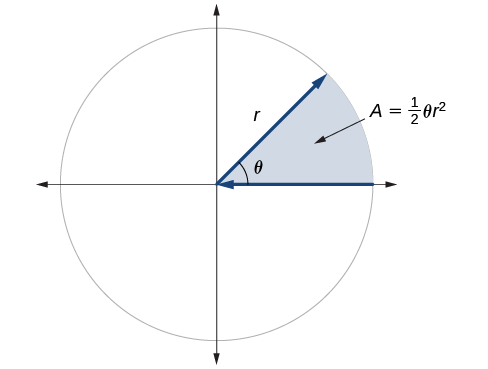{: #Figure_07_01_026}

<strong>Given a circle of radius<math xmlns="http://www.w3.org/1998/Math/MathML">
  <mrow>
   <mtext> </mtext><mi>r</mi><mo>,</mo>
  </mrow>
 </math>find the area of a sector defined by a given angle<math xmlns="http://www.w3.org/1998/Math/MathML">
  <mrow>
   <mtext> </mtext><mi>θ</mi><mo>.</mo>
  </mrow>
 </math> </strong>

1.  If necessary, convert
    <math xmlns="http://www.w3.org/1998/Math/MathML"> <mrow> <mtext> </mtext><mi>θ</mi><mtext> </mtext> </mrow> </math>
    
    to radians.
2.  Multiply half the radian measure of
    <math xmlns="http://www.w3.org/1998/Math/MathML"> <mrow> <mtext> </mtext><mi>θ</mi><mtext> </mtext> </mrow> </math>
    
    by the square of the radius
    <math xmlns="http://www.w3.org/1998/Math/MathML"> <mrow> <mtext> </mtext><mi>r</mi><mo>:</mo><mtext>​</mtext><mi>A</mi><mo>=</mo><mfrac> <mn>1</mn> <mn>2</mn> </mfrac> <mi>θ</mi><msup> <mi>r</mi> <mn>2</mn> </msup> <mo>.</mo> </mrow> </math>
{: data-number-style="arabic"}

Finding the Area of a Sector

An automatic lawn sprinkler sprays a distance of 20 feet while rotating 30 degrees, as shown in [[link]](#Figure_07_01_027). What is the area of the sector of grass the sprinkler waters?

{: #Figure_07_01_027}

First, we need to convert the angle measure into radians. Because 30 degrees is one of our special angles, we already know the equivalent radian measure, but we can also convert:

<math xmlns="http://www.w3.org/1998/Math/MathML"> <mrow> <mtable> <mtr rowalign="center"> <mtd rowalign="center" columnalign="right"> <mrow> <mn>30</mn><mtext> degrees</mtext></mrow> </mtd> <mtd rowalign="center"><mo>=</mo></mtd> <mtd rowalign="center" columnalign="left"> <mrow> <mn>30</mn><mo>⋅</mo><mfrac> <mi>π</mi> <mrow> <mn>180</mn></mrow> </mfrac> </mrow> </mtd> </mtr> <mtr rowalign="center"> <mtd rowalign="center" /> <mtd rowalign="center"><mo>=</mo></mtd> <mtd rowalign="center" columnalign="left"> <mrow> <mfrac> <mi>π</mi> <mn>6</mn> </mfrac> <mtext> radians</mtext></mrow> </mtd> </mtr> </mtable></mrow> </math>

The area of the sector is then

<math xmlns="http://www.w3.org/1998/Math/MathML"> <mrow> <mtable> <mtr rowalign="center"> <mtd columnalign="right" rowalign="center"> <mrow> <mtext>Area</mtext></mrow> </mtd> <mtd rowalign="center"><mo>=</mo></mtd> <mtd rowalign="center" columnalign="left"> <mrow> <mfrac> <mn>1</mn> <mn>2</mn> </mfrac> <mrow><mo>(</mo> <mrow> <mfrac> <mi>π</mi> <mn>6</mn> </mfrac> </mrow> <mo>)</mo></mrow><msup> <mrow> <mo stretchy="false">(</mo><mn>20</mn><mo stretchy="false">)</mo></mrow> <mn>2</mn> </msup> </mrow> </mtd> </mtr> <mtr rowalign="center"> <mtd rowalign="center" /> <mtd rowalign="center"><mo>≈</mo></mtd> <mtd rowalign="center" columnalign="left"><mrow><mn>104.72</mn></mrow></mtd> </mtr> </mtable></mrow> </math>

So the area is about<math xmlns="http://www.w3.org/1998/Math/MathML"> <mrow> <mtext> </mtext><mn>104.72</mn><msup> <mrow> <mtext> ft</mtext> </mrow> <mn>2</mn> </msup> <mo>.</mo> </mrow> </math>

In central pivot irrigation, a large irrigation pipe on wheels rotates around a center point. A farmer has a central pivot system with a radius of 400 meters. If water restrictions only allow her to water 150 thousand square meters a day, what angle should she set the system to cover? Write the answer in radian measure to two decimal places.

1\.88

# Use Linear and Angular Speed to Describe Motion on a Circular Path

In addition to finding the area of a sector, we can use angles to describe the speed of a moving object. An object traveling in a circular path has two types of speed.<strong> Linear speed</strong> is speed along a straight path and can be determined by the distance it moves along (its **displacement**{: data-type="term" .no-emphasis}) in a given time interval. For instance, if a wheel with radius 5 inches rotates once a second, a point on the edge of the wheel moves a distance equal to the circumference, or<math xmlns="http://www.w3.org/1998/Math/MathML"> <mrow> <mtext> </mtext><mn>10</mn><mi>π</mi><mtext> </mtext> </mrow> </math>

inches, every second. So the linear speed of the point is<math xmlns="http://www.w3.org/1998/Math/MathML"> <mrow> <mtext> </mtext><mn>10</mn><mi>π</mi><mtext> </mtext> </mrow> </math>

in./s. The equation for linear speed is as follows where<math xmlns="http://www.w3.org/1998/Math/MathML"> <mrow> <mtext> </mtext><mi>v</mi><mtext> </mtext> </mrow> </math>

is linear speed,<math xmlns="http://www.w3.org/1998/Math/MathML"> <mrow> <mtext> </mtext><mi>s</mi><mtext> </mtext> </mrow> </math>

is displacement, and<math xmlns="http://www.w3.org/1998/Math/MathML"> <mrow> <mtext> </mtext><mi>t</mi><mtext> </mtext> </mrow> </math>

is time.

<math xmlns="http://www.w3.org/1998/Math/MathML"> <mrow> <mi>v</mi><mo>=</mo><mfrac> <mi>s</mi> <mi>t</mi> </mfrac> </mrow> </math>

Angular speed results from circular motion and can be determined by the angle through which a point rotates in a given time interval. In other words, **angular speed**{: data-type="term"} is angular rotation per unit time. So, for instance, if a gear makes a full rotation every 4 seconds, we can calculate its angular speed as<math xmlns="http://www.w3.org/1998/Math/MathML"> <mrow> <mtext> </mtext><mfrac> <mrow> <mn>360</mn><mtext> degrees</mtext> </mrow> <mrow> <mn>4</mn><mtext> seconds</mtext> </mrow> </mfrac> <mo>=</mo> </mrow> </math>

90 degrees per second. Angular speed can be given in radians per second, rotations per minute, or degrees per hour for example. The equation for angular speed is as follows, where<math xmlns="http://www.w3.org/1998/Math/MathML"> <mrow> <mtext> </mtext><mi>ω</mi><mtext> </mtext> </mrow> </math>

(read as omega) is angular speed,<math xmlns="http://www.w3.org/1998/Math/MathML"> <mrow> <mtext> </mtext><mi>θ</mi><mtext> </mtext> </mrow> </math>

is the angle traversed, and<math xmlns="http://www.w3.org/1998/Math/MathML"> <mrow> <mtext> </mtext><mi>t</mi><mtext> </mtext> </mrow> </math>

is time.

<math xmlns="http://www.w3.org/1998/Math/MathML"> <mrow> <mi>ω</mi><mo>=</mo><mfrac> <mi>θ</mi> <mi>t</mi> </mfrac> </mrow> </math>

Combining the definition of angular speed with the arc length equation,<math xmlns="http://www.w3.org/1998/Math/MathML"> <mrow> <mtext> </mtext><mi>s</mi><mo>=</mo><mi>r</mi><mi>θ</mi><mo>,</mo> </mrow> </math>

we can find a relationship between angular and linear speeds. The angular speed equation can be solved for<math xmlns="http://www.w3.org/1998/Math/MathML"> <mrow> <mtext> </mtext><mi>θ</mi><mo>,</mo> </mrow> </math>

giving<math xmlns="http://www.w3.org/1998/Math/MathML"> <mrow> <mtext> </mtext><mi>θ</mi><mo>=</mo><mi>ω</mi><mi>t</mi><mo>.</mo> </mrow> </math>

Substituting this into the arc length equation gives:

<math xmlns="http://www.w3.org/1998/Math/MathML"> <mrow> <mtable> <mtr rowalign="center"> <mtd rowalign="center" columnalign="right"> <mi>s</mi> </mtd> <mtd rowalign="center"> <mo>=</mo> </mtd> <mtd rowalign="center" columnalign="left"> <mrow> <mi>r</mi><mi>θ</mi></mrow> </mtd> </mtr> <mtr rowalign="center"> <mtd rowalign="center" /> <mtd rowalign="center"><mo>=</mo></mtd> <mtd rowalign="center" columnalign="left"> <mrow> <mi>r</mi><mi>ω</mi><mi>t</mi></mrow> </mtd> </mtr> </mtable></mrow> </math>

Substituting this into the linear speed equation gives:

<math xmlns="http://www.w3.org/1998/Math/MathML" display="block"> <mrow> <mtable> <mtr rowalign="center"> <mtd rowalign="center" columnalign="right"><mi>v</mi></mtd> <mtd rowalign="center"><mo>=</mo></mtd> <mtd rowalign="center" columnalign="left"> <mrow> <mfrac> <mi>s</mi> <mi>t</mi> </mfrac> </mrow> </mtd> </mtr> <mtr rowalign="center"> <mtd rowalign="center" /> <mtd rowalign="center"><mo>=</mo></mtd> <mtd rowalign="center" columnalign="left"> <mrow> <mfrac> <mrow> <mi>r</mi><mi>ω</mi><mi>t</mi></mrow> <mi>t</mi> </mfrac> </mrow> </mtd> </mtr> <mtr rowalign="center"> <mtd rowalign="center" /> <mtd rowalign="center"><mo>=</mo></mtd> <mtd rowalign="center" columnalign="left"> <mrow> <mi>r</mi><mi>ω</mi></mrow> </mtd> </mtr> </mtable></mrow> </math>

Angular and Linear Speed

As a point moves along a circle of radius<math xmlns="http://www.w3.org/1998/Math/MathML"> <mrow> <mtext> </mtext><mi>r</mi><mo>,</mo> </mrow> </math>

its **angular speed**{: data-type="term"},<math xmlns="http://www.w3.org/1998/Math/MathML"> <mrow> <mtext> </mtext><mi>ω</mi><mo>,</mo> </mrow> </math>

is the angular rotation<math xmlns="http://www.w3.org/1998/Math/MathML"> <mrow> <mtext> </mtext><mi>θ</mi><mtext> </mtext> </mrow> </math>

per unit time,<math xmlns="http://www.w3.org/1998/Math/MathML"> <mrow> <mtext> </mtext><mi>t</mi><mo>.</mo> </mrow> </math>

<math xmlns="http://www.w3.org/1998/Math/MathML"> <mrow> <mi>ω</mi><mo>=</mo><mfrac> <mi>θ</mi> <mi>t</mi> </mfrac> </mrow> </math>

The **linear speed**{: data-type="term"}, <math xmlns="http://www.w3.org/1998/Math/MathML"> <mrow> <mtext> </mtext><mi>v</mi><mo>,</mo> </mrow> </math>

of the point can be found as the distance traveled, arc length<math xmlns="http://www.w3.org/1998/Math/MathML"> <mrow> <mtext> </mtext><mi>s</mi><mo>,</mo> </mrow> </math>

per unit time,<math xmlns="http://www.w3.org/1998/Math/MathML"> <mrow> <mtext> </mtext><mi>t</mi><mo>.</mo> </mrow> </math>

<math xmlns="http://www.w3.org/1998/Math/MathML"> <mrow> <mi>v</mi><mo>=</mo><mfrac> <mi>s</mi> <mi>t</mi> </mfrac> </mrow> </math>

When the angular speed is measured in radians per unit time, linear speed and angular speed are related by the equation

<math xmlns="http://www.w3.org/1998/Math/MathML"> <mrow> <mi>v</mi><mo>=</mo><mi>r</mi><mi>ω</mi> </mrow> </math>

This equation states that the angular speed in radians,<math xmlns="http://www.w3.org/1998/Math/MathML"> <mrow> <mtext> </mtext><mi>ω</mi><mo>,</mo> </mrow> </math>

representing the amount of rotation occurring in a unit of time, can be multiplied by the radius<math xmlns="http://www.w3.org/1998/Math/MathML"> <mrow> <mtext> </mtext><mi>r</mi><mtext> </mtext> </mrow> </math>

to calculate the total arc length traveled in a unit of time, which is the definition of linear speed.

<strong>Given the amount of angle rotation and the time elapsed, calculate the angular speed. </strong>

1.  If necessary, convert the angle measure to radians.
2.  Divide the angle in radians by the number of time units elapsed:
    <math xmlns="http://www.w3.org/1998/Math/MathML"> <mrow> <mtext> </mtext><mi>ω</mi><mo>=</mo><mfrac> <mi>θ</mi> <mi>t</mi> </mfrac> <mo>.</mo> </mrow> </math>

3.  The resulting speed will be in radians per time unit.
{: data-number-style="arabic"}

Finding Angular Speed

A water wheel, shown in [[link]](#Figure_07_01_028), completes 1 rotation every 5 seconds. Find the angular speed in radians per second.

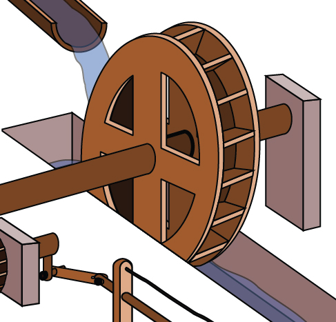{: #Figure_07_01_028}

The wheel completes 1 rotation, or passes through an angle of<math xmlns="http://www.w3.org/1998/Math/MathML"> <mrow> <mtext> </mtext><mn>2</mn><mi>π</mi><mtext> </mtext> </mrow> </math>

radians in 5 seconds, so the angular speed would be<math xmlns="http://www.w3.org/1998/Math/MathML"> <mrow> <mtext> </mtext><mi>ω</mi><mo>=</mo><mfrac> <mrow> <mn>2</mn><mi>π</mi> </mrow> <mn>5</mn> </mfrac> <mo>≈</mo><mn>1.257</mn><mtext> </mtext> </mrow> </math>

radians per second.

An old vinyl record is played on a turntable rotating clockwise at a rate of 45 rotations per minute. Find the angular speed in radians per second.

<math xmlns="http://www.w3.org/1998/Math/MathML"> <mrow> <mfrac> <mrow> <mo>−</mo><mn>3</mn><mi>π</mi> </mrow> <mn>2</mn> </mfrac> <mtext> </mtext> </mrow> </math>

rad/s

<strong>Given the radius of a circle, an angle of rotation, and a length of elapsed time, determine the linear speed. </strong>

1.  Convert the total rotation to radians if necessary.
2.  Divide the total rotation in radians by the elapsed time to find the angular speed: apply
    <math xmlns="http://www.w3.org/1998/Math/MathML"> <mrow> <mtext> </mtext><mi>ω</mi><mo>=</mo><mfrac> <mi>θ</mi> <mi>t</mi> </mfrac> <mo>.</mo> </mrow> </math>

3.  Multiply the angular speed by the length of the radius to find the linear speed, expressed in terms of the length unit used for the radius and the time unit used for the elapsed time: apply
    <math xmlns="http://www.w3.org/1998/Math/MathML"> <mrow> <mtext> </mtext><mi>v</mi><mo>=</mo><mi>r</mi><mi>ω</mi><mo>.</mo> </mrow> </math>
{: data-number-style="arabic"}

Finding a Linear Speed

A bicycle has wheels 28 inches in diameter. A tachometer determines the wheels are rotating at 180 RPM (revolutions per minute). Find the speed the bicycle is traveling down the road.

Here, we have an angular speed and need to find the corresponding linear speed, since the linear speed of the outside of the tires is the speed at which the bicycle travels down the road.

We begin by converting from rotations per minute to radians per minute. It can be helpful to utilize the units to make this conversion:

<math xmlns="http://www.w3.org/1998/Math/MathML"> <mrow> <mn>180</mn><mfrac> <mrow> <menclose notation="updiagonalstrike"> <mrow> <mtext>rotations</mtext> </mrow> </menclose> </mrow> <mrow> <mtext>minute</mtext> </mrow> </mfrac> <mo>⋅</mo><mfrac> <mrow> <mn>2</mn><mi>π</mi><mtext> </mtext><mtext>radians</mtext> </mrow> <mrow> <menclose notation="updiagonalstrike"> <mrow> <mtext>rotation</mtext> </mrow> </menclose> </mrow> </mfrac> <mo>=</mo><mn>360</mn><mi>π</mi><mfrac> <mrow> <mtext>radians</mtext> </mrow> <mrow> <mtext>minute</mtext> </mrow> </mfrac> </mrow> </math>

Using the formula from above along with the radius of the wheels, we can find the linear speed:

<math xmlns="http://www.w3.org/1998/Math/MathML" display="block"> <mrow> <mtable> <mtr rowalign="center"> <mtd rowalign="center" columnalign="right"> <mi>v</mi> </mtd> <mtd rowalign="center"> <mo>=</mo> </mtd> <mtd rowalign="center" columnalign="left"> <mrow> <mrow><mo>(</mo> <mrow> <mtext>14 inches</mtext></mrow> <mo>)</mo></mrow><mrow><mo>(</mo> <mrow> <mn>360</mn><mi>π</mi><mfrac> <mrow> <mtext>radians</mtext></mrow> <mrow> <mtext>minute</mtext></mrow> </mfrac> </mrow> <mo>)</mo></mrow></mrow> </mtd> </mtr> <mtr rowalign="center"> <mtd rowalign="center" /> <mtd rowalign="center"><mo>=</mo></mtd> <mtd rowalign="center" columnalign="left"> <mrow> <mn>5040</mn><mi>π</mi><mfrac> <mrow> <mtext>inches</mtext></mrow> <mrow> <mtext>minute</mtext></mrow> </mfrac> </mrow> </mtd> </mtr> </mtable></mrow> </math>

Remember that radians are a unitless measure, so it is not necessary to include them.

Finally, we may wish to convert this linear speed into a more familiar measurement, like miles per hour.

<math xmlns="http://www.w3.org/1998/Math/MathML"> <mrow> <mn>5040</mn><mi>π</mi><mfrac> <mrow> <menclose notation="updiagonalstrike"> <mrow> <mtext>inches</mtext> </mrow> </menclose> </mrow> <mrow> <menclose notation="updiagonalstrike"> <mrow> <mtext>minute</mtext> </mrow> </menclose> </mrow> </mfrac> <mo>⋅</mo><mfrac> <mrow> <mtext>1 </mtext><menclose notation="updiagonalstrike"> <mrow> <mtext>feet</mtext> </mrow> </menclose> </mrow> <mrow> <mtext>12 </mtext><menclose notation="updiagonalstrike"> <mrow> <mtext>inches</mtext> </mrow> </menclose> </mrow> </mfrac> <mo>⋅</mo><mfrac> <mrow> <mtext>1 mile</mtext> </mrow> <mrow> <mtext>5280 </mtext><menclose notation="updiagonalstrike"> <mrow> <mtext>feet</mtext> </mrow> </menclose> </mrow> </mfrac> <mo>⋅</mo><mfrac> <mrow> <mtext>60 </mtext><menclose notation="updiagonalstrike"> <mrow> <mtext>minutes</mtext> </mrow> </menclose> </mrow> <mrow> <mtext>1 hour</mtext> </mrow> </mfrac> <mo>=</mo><mn>14.99</mn><mtext> miles per hour (mph)</mtext> </mrow> </math>

A satellite is rotating around Earth at 0.25 radian per hour at an altitude of 242 km above Earth. If the radius of Earth is 6378 kilometers, find the linear speed of the satellite in kilometers per hour.

1655 kilometers per hour

Access these online resources for additional instruction and practice with angles, arc length, and areas of sectors.

* [Angles in Standard Position][1]
* [Angle of Rotation][2]
* [Coterminal Angles][3]
* [Determining Coterminal Angles][4]
* [Positive and Negative Coterminal Angles][5]
* [Radian Measure][6]
* [Coterminal Angles in Radians][7]
* [Arc Length and Area of a Sector][8]

# Key Equations

| arc length | <math xmlns="http://www.w3.org/1998/Math/MathML"> <mrow> <mi>s</mi><mo>=</mo><mi>r</mi><mi>θ</mi> </mrow> </math>

 |
| area of a sector | <math xmlns="http://www.w3.org/1998/Math/MathML"> <mrow> <mi>A</mi><mo>=</mo><mfrac> <mn>1</mn> <mn>2</mn> </mfrac> <mi>θ</mi><msup> <mi>r</mi> <mn>2</mn> </msup> </mrow> </math>

 |
| angular speed | <math xmlns="http://www.w3.org/1998/Math/MathML"> <mrow> <mi>ω</mi><mo>=</mo><mfrac> <mi>θ</mi> <mi>t</mi> </mfrac> </mrow> </math>

 |
| linear speed | <math xmlns="http://www.w3.org/1998/Math/MathML"> <mrow> <mi>v</mi><mo>=</mo><mfrac> <mi>s</mi> <mi>t</mi> </mfrac> </mrow> </math>

 |
| linear speed related to angular speed | <math xmlns="http://www.w3.org/1998/Math/MathML"> <mrow> <mi>v</mi><mo>=</mo><mi>r</mi><mi>ω</mi> </mrow> </math>

 |
{: summary=".."}

# Key Concepts

* An angle is formed from the union of two rays, by keeping the initial side fixed and rotating the terminal side. The amount of rotation determines the measure of the angle.
* An angle is in standard position if its vertex is at the origin and its initial side lies along the positive *x*-axis. A positive angle is measured counterclockwise from the initial side and a negative angle is measured clockwise.
* To draw an angle in standard position, draw the initial side along the positive *x*-axis and then place the terminal side according to the fraction of a full rotation the angle represents. See [\[link\]](#Example_07_01_01).
* In addition to degrees, the measure of an angle can be described in radians. See [\[link\]](#Example_07_01_02).
* To convert between degrees and radians, use the proportion
  <math xmlns="http://www.w3.org/1998/Math/MathML"> <mrow> <mtext> </mtext><mfrac> <mi>θ</mi> <mrow> <mn>180</mn> </mrow> </mfrac> <mo>=</mo><mfrac> <mrow> <msup> <mi>θ</mi> <mi>R</mi> </msup> </mrow> <mi>π</mi> </mfrac> <mo>.</mo><mtext> </mtext> </mrow> </math>
  
  See [\[link\]](#Example_07_01_03) and [\[link\]](#Example_07_01_04).
* Two angles that have the same terminal side are called coterminal angles.
* We can find coterminal angles by adding or subtracting
  <math xmlns="http://www.w3.org/1998/Math/MathML"> <mrow> <mtext> </mtext><mn>360°</mn><mtext> </mtext> </mrow> </math>
  
  or
  <math xmlns="http://www.w3.org/1998/Math/MathML"> <mrow> <mtext> </mtext><mn>2</mn><mi>π</mi><mo>.</mo><mtext> </mtext> </mrow> </math>
  
  See [\[link\]](#Example_07_01_05) and [\[link\]](#Example_07_01_06).
* Coterminal angles can be found using radians just as they are for degrees. See [\[link\]](#Example_07_01_07).
* The length of a circular arc is a fraction of the circumference of the entire circle. See [\[link\]](#Example_07_01_08).
* The area of sector is a fraction of the area of the entire circle. See [\[link\]](#Example_07_01_09).
* An object moving in a circular path has both linear and angular speed.
* The angular speed of an object traveling in a circular path is the measure of the angle through which it turns in a unit of time. See [\[link\]](#Example_07_01_10).
* The linear speed of an object traveling along a circular path is the distance it travels in a unit of time. See [\[link\]](#Example_07_01_11).

# Section Exercises

## Verbal

Draw an angle in standard position. Label the vertex, initial side, and terminal side.

* * *
{: data-type="newline"}

  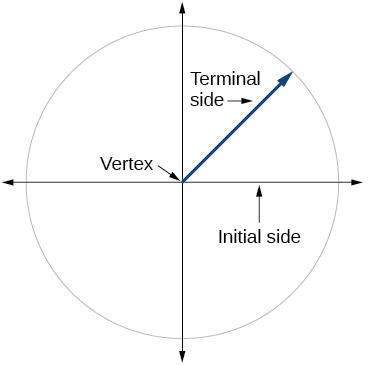 

Explain why there are an infinite number of angles that are coterminal to a certain angle.

State what a positive or negative angle signifies, and explain how to draw each.

Whether the angle is positive or negative determines the direction. A positive angle is drawn in the counterclockwise direction, and a negative angle is drawn in the clockwise direction.

How does radian measure of an angle compare to the degree measure? Include an explanation of 1 radian in your paragraph.

Explain the differences between linear speed and angular speed when describing motion along a circular path.

Linear speed is a measurement found by calculating distance of an arc compared to time. Angular speed is a measurement found by calculating the angle of an arc compared to time.

## Graphical

For the following exercises, draw an angle in standard position with the given measure.

<math xmlns="http://www.w3.org/1998/Math/MathML"> <mrow> <mn>30°</mn> </mrow> </math>

<math xmlns="http://www.w3.org/1998/Math/MathML"> <mrow> <mn>300°</mn> </mrow> </math>

* * *
{: data-type="newline"}

  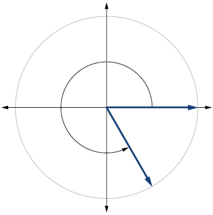 

<math xmlns="http://www.w3.org/1998/Math/MathML"> <mrow> <mn>−80°</mn> </mrow> </math>

<math xmlns="http://www.w3.org/1998/Math/MathML"> <mrow> <mn>135°</mn> </mrow> </math>

* * *
{: data-type="newline"}

  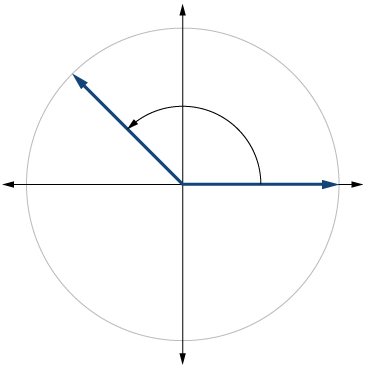 

<math xmlns="http://www.w3.org/1998/Math/MathML"> <mrow> <mn>−150°</mn> </mrow> </math>

<math xmlns="http://www.w3.org/1998/Math/MathML"> <mrow> <mfrac> <mrow> <mn>2</mn><mi>π</mi> </mrow> <mn>3</mn> </mfrac> </mrow> </math>

* * *
{: data-type="newline"}

  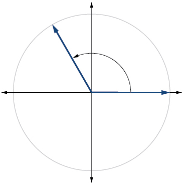 

<math xmlns="http://www.w3.org/1998/Math/MathML"> <mrow> <mfrac> <mrow> <mn>7</mn><mi>π</mi> </mrow> <mn>4</mn> </mfrac> </mrow> </math>

<math xmlns="http://www.w3.org/1998/Math/MathML"> <mrow> <mfrac> <mrow> <mn>5</mn><mi>π</mi> </mrow> <mn>6</mn> </mfrac> </mrow> </math>

* * *
{: data-type="newline"}

  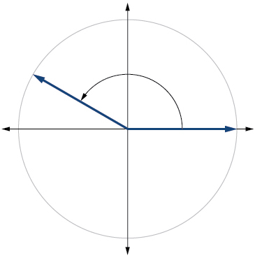 

<math xmlns="http://www.w3.org/1998/Math/MathML"> <mrow> <mfrac> <mi>π</mi> <mn>2</mn> </mfrac> </mrow> </math>

<math xmlns="http://www.w3.org/1998/Math/MathML"> <mrow> <mo>−</mo><mfrac> <mi>π</mi> <mrow> <mn>10</mn> </mrow> </mfrac> </mrow> </math>

* * *
{: data-type="newline"}

  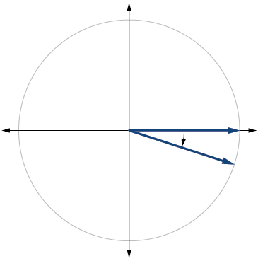 

<math xmlns="http://www.w3.org/1998/Math/MathML"> <mrow> <mn>415°</mn> </mrow> </math>

<math xmlns="http://www.w3.org/1998/Math/MathML"> <mrow> <mn>−120°</mn> </mrow> </math>

<math xmlns="http://www.w3.org/1998/Math/MathML"> <mrow> <mn>240°</mn> </mrow> </math>

* * *
{: data-type="newline"}

  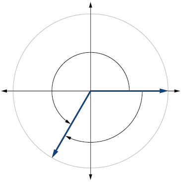 

<math xmlns="http://www.w3.org/1998/Math/MathML"> <mrow> <mn>−315°</mn> </mrow> </math>

<math xmlns="http://www.w3.org/1998/Math/MathML"> <mrow> <mfrac> <mrow> <mn>22</mn><mi>π</mi> </mrow> <mn>3</mn> </mfrac> </mrow> </math>

<math xmlns="http://www.w3.org/1998/Math/MathML"> <mrow> <mfrac> <mrow> <mn>4</mn><mi>π</mi> </mrow> <mn>3</mn> </mfrac> </mrow> </math>

* * *
{: data-type="newline"}

   

<math xmlns="http://www.w3.org/1998/Math/MathML"> <mrow> <mo>−</mo><mfrac> <mi>π</mi> <mn>6</mn> </mfrac> </mrow> </math>

<math xmlns="http://www.w3.org/1998/Math/MathML"> <mrow> <mo>−</mo><mfrac> <mrow> <mn>4</mn><mi>π</mi> </mrow> <mn>3</mn> </mfrac> </mrow> </math>

<math xmlns="http://www.w3.org/1998/Math/MathML"> <mrow> <mfrac> <mrow> <mn>2</mn><mi>π</mi> </mrow> <mn>3</mn> </mfrac> </mrow> </math>

* * *
{: data-type="newline"}

  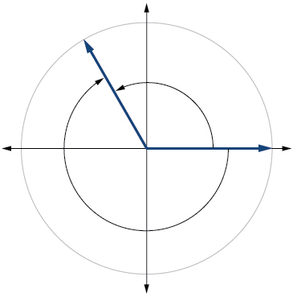 

For the following exercises, refer to [\[link\]](#Figure_07_01_218). Round to two decimal places.

 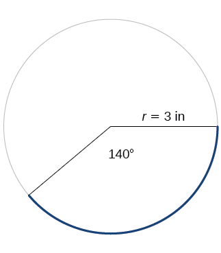{: #Figure_07_01_218}

Find the arc length.

Find the area of the sector.

<math xmlns="http://www.w3.org/1998/Math/MathML"> <mrow> <mfrac> <mrow> <mn>7</mn><mi>π</mi> </mrow> <mn>2</mn> </mfrac> <mo>≈</mo><mn>11.00</mn><msup> <mrow> <mtext> in</mtext> </mrow> <mn>2</mn> </msup> </mrow> </math>

For the following exercises, refer to [\[link\]](#Figure_07_01_219). Round to two decimal places.

 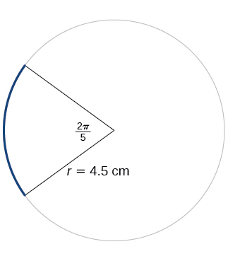{: #Figure_07_01_219}

Find the arc length.

Find the area of the sector.

<math xmlns="http://www.w3.org/1998/Math/MathML"> <mrow> <mfrac> <mrow> <mn>81</mn><mi>π</mi> </mrow> <mrow> <mn>20</mn> </mrow> </mfrac> <mo>≈</mo><mn>12.72</mn><msup> <mrow> <mtext> cm</mtext> </mrow> <mn>2</mn> </msup> </mrow> </math>

## Algebraic 

For the following exercises, convert angles in radians to degrees.

<math xmlns="http://www.w3.org/1998/Math/MathML"> <mrow> <mfrac> <mrow> <mn>3</mn><mi>π</mi> </mrow> <mn>4</mn> </mfrac> <mtext> </mtext> </mrow> </math>

radians

<math xmlns="http://www.w3.org/1998/Math/MathML"> <mrow> <mfrac> <mi>π</mi> <mn>9</mn> </mfrac> <mtext> </mtext> </mrow> </math>

radians

<math xmlns="http://www.w3.org/1998/Math/MathML"> <mrow> <mn>20°</mn> </mrow> </math>

<math xmlns="http://www.w3.org/1998/Math/MathML"> <mrow> <mo>−</mo><mi> </mi><mfrac> <mrow> <mn>5</mn><mi>π</mi> </mrow> <mn>4</mn> </mfrac> <mtext> </mtext> </mrow> </math>

radians

<math xmlns="http://www.w3.org/1998/Math/MathML"> <mrow> <mfrac> <mi>π</mi> <mn>3</mn> </mfrac> <mtext> </mtext> </mrow> </math>

radians

<math xmlns="http://www.w3.org/1998/Math/MathML"> <mrow> <mn>60°</mn> </mrow> </math>

<math xmlns="http://www.w3.org/1998/Math/MathML"> <mrow> <mo>−</mo><mfrac> <mrow> <mn>7</mn><mi>π</mi> </mrow> <mn>3</mn> </mfrac> <mtext> </mtext> </mrow> </math>

radians

<math xmlns="http://www.w3.org/1998/Math/MathML"> <mrow> <mo>−</mo><mfrac> <mrow> <mn>5</mn><mi>π</mi> </mrow> <mrow> <mn>12</mn> </mrow> </mfrac> <mtext> </mtext> </mrow> </math>

radians

<math xmlns="http://www.w3.org/1998/Math/MathML"> <mrow> <mn>−75°</mn> </mrow> </math>

<math xmlns="http://www.w3.org/1998/Math/MathML"> <mrow> <mfrac> <mrow> <mn>11</mn><mi>π</mi> </mrow> <mn>6</mn> </mfrac> <mtext> </mtext> </mrow> </math>

radians

For the following exercises, convert angles in degrees to radians.

<math xmlns="http://www.w3.org/1998/Math/MathML"> <mrow> <mn>90°</mn> </mrow> </math>

<math xmlns="http://www.w3.org/1998/Math/MathML"> <mrow> <mfrac> <mi>π</mi> <mn>2</mn> </mfrac> <mtext> </mtext> </mrow> </math>

radians

<math xmlns="http://www.w3.org/1998/Math/MathML"> <mrow> <mn>100°</mn> </mrow> </math>

<math xmlns="http://www.w3.org/1998/Math/MathML"> <mrow> <mn>−540°</mn> </mrow> </math>

<math xmlns="http://www.w3.org/1998/Math/MathML"> <mrow> <mn>−3</mn><mi>π</mi><mtext> </mtext> </mrow> </math>

radians

<math xmlns="http://www.w3.org/1998/Math/MathML"> <mrow> <mn>−120°</mn> </mrow> </math>

<math xmlns="http://www.w3.org/1998/Math/MathML"> <mrow> <mn>180°</mn> </mrow> </math>

<math xmlns="http://www.w3.org/1998/Math/MathML"> <mrow> <mi>π</mi><mtext> </mtext> </mrow> </math>

radians

<math xmlns="http://www.w3.org/1998/Math/MathML"> <mrow> <mn>−315°</mn> </mrow> </math>

<math xmlns="http://www.w3.org/1998/Math/MathML"> <mrow> <mn>150°</mn> </mrow> </math>

<math xmlns="http://www.w3.org/1998/Math/MathML"> <mrow> <mfrac> <mrow> <mn>5</mn><mi>π</mi> </mrow> <mn>6</mn> </mfrac> </mrow> </math>

radians

For the following exercises, use the given information to find the length of a circular arc. Round to two decimal places.

Find the length of the arc of a circle of radius 12 inches subtended by a central angle of<math xmlns="http://www.w3.org/1998/Math/MathML"> <mrow> <mtext> </mtext><mfrac> <mi>π</mi> <mn>4</mn> </mfrac> <mo>.</mo><mtext> </mtext> </mrow> </math>

radians.

Find the length of the arc of a circle of radius 5.02 miles subtended by the central angle of<math xmlns="http://www.w3.org/1998/Math/MathML"> <mrow> <mtext> </mtext><mfrac> <mi>π</mi> <mn>3</mn> </mfrac> <mo>.</mo> </mrow> </math>

<math xmlns="http://www.w3.org/1998/Math/MathML"> <mrow> <mfrac> <mrow> <mn>5.02</mn><mi>π</mi> </mrow> <mn>3</mn> </mfrac> <mo>≈</mo><mn>5.26</mn><mtext> </mtext> </mrow> </math>

miles

Find the length of the arc of a circle of diameter 14 meters subtended by the central angle of<math xmlns="http://www.w3.org/1998/Math/MathML"> <mrow> <mtext> </mtext><mfrac> <mrow> <mn>5</mn><mi>π</mi> </mrow> <mn>6</mn> </mfrac> <mo>.</mo> </mrow> </math>

Find the length of the arc of a circle of radius 10 centimeters subtended by the central angle of<math xmlns="http://www.w3.org/1998/Math/MathML"> <mrow> <mtext> </mtext><mn>50°.</mn> </mrow> </math>

<math xmlns="http://www.w3.org/1998/Math/MathML"> <mrow> <mfrac> <mrow> <mn>25</mn><mi>π</mi> </mrow> <mn>9</mn> </mfrac> <mo>≈</mo><mn>8.73</mn><mtext> </mtext> </mrow> </math>

centimeters

Find the length of the arc of a circle of radius 5 inches subtended by the central angle of<math xmlns="http://www.w3.org/1998/Math/MathML"> <mrow> <mtext> </mtext><mn>220°.</mn> </mrow> </math>

Find the length of the arc of a circle of diameter 12 meters subtended by the central angle is<math xmlns="http://www.w3.org/1998/Math/MathML"> <mrow> <mtext> </mtext><mn>63°.</mn> </mrow> </math>

<math xmlns="http://www.w3.org/1998/Math/MathML"> <mrow> <mfrac> <mrow> <mn>21</mn><mi>π</mi> </mrow> <mrow> <mn>10</mn> </mrow> </mfrac> <mo>≈</mo><mn>6.60</mn><mtext> </mtext> </mrow> </math>

meters

For the following exercises, use the given information to find the area of the sector. Round to four decimal places.

A sector of a circle has a central angle of<math xmlns="http://www.w3.org/1998/Math/MathML"> <mrow> <mtext> </mtext><mn>45°</mn><mtext> </mtext> </mrow> </math>

and a radius 6 cm.

A sector of a circle has a central angle of<math xmlns="http://www.w3.org/1998/Math/MathML"> <mrow> <mtext> </mtext><mn>30°</mn><mtext> </mtext> </mrow> </math>

and a radius of 20 cm.

104\.7198 cm2

A sector of a circle with diameter 10 feet and an angle of<math xmlns="http://www.w3.org/1998/Math/MathML"> <mrow> <mtext> </mtext><mfrac> <mi>π</mi> <mn>2</mn> </mfrac> <mtext> </mtext> </mrow> </math>

radians.

A sector of a circle with radius of 0.7 inches and an angle of<math xmlns="http://www.w3.org/1998/Math/MathML"> <mrow> <mtext> </mtext><mi>π</mi><mtext> </mtext> </mrow> </math>

radians.

0\.7697 in2

For the following exercises, find the angle between<math xmlns="http://www.w3.org/1998/Math/MathML"> <mrow> <mtext> </mtext><mn>0°</mn><mtext> </mtext> </mrow> </math>

and<math xmlns="http://www.w3.org/1998/Math/MathML"> <mrow> <mtext> </mtext><mn>360°</mn><mtext> </mtext> </mrow> </math>

that is coterminal to the given angle.

<math xmlns="http://www.w3.org/1998/Math/MathML"> <mrow> <mn>−40°</mn> </mrow> </math>

<math xmlns="http://www.w3.org/1998/Math/MathML"> <mrow> <mn>−110°</mn> </mrow> </math>

<math xmlns="http://www.w3.org/1998/Math/MathML"> <mrow> <mn>250°</mn> </mrow> </math>

<math xmlns="http://www.w3.org/1998/Math/MathML"> <mrow> <mn>700°</mn> </mrow> </math>

<math xmlns="http://www.w3.org/1998/Math/MathML"> <mrow> <mn>1400°</mn> </mrow> </math>

<math xmlns="http://www.w3.org/1998/Math/MathML"> <mrow> <mn>320°</mn> </mrow> </math>

For the following exercises, find the angle between 0 and<math xmlns="http://www.w3.org/1998/Math/MathML"> <mrow> <mtext> </mtext><mn>2</mn><mi>π</mi><mtext> </mtext> </mrow> </math>

in radians that is coterminal to the given angle.

<math xmlns="http://www.w3.org/1998/Math/MathML"> <mrow> <mo>−</mo><mfrac> <mi>π</mi> <mn>9</mn> </mfrac> </mrow> </math>

<math xmlns="http://www.w3.org/1998/Math/MathML"> <mrow> <mfrac> <mrow> <mn>10</mn><mi>π</mi> </mrow> <mn>3</mn> </mfrac> </mrow> </math>

<math xmlns="http://www.w3.org/1998/Math/MathML"> <mrow> <mfrac> <mrow> <mn>4</mn><mi>π</mi> </mrow> <mn>3</mn> </mfrac> </mrow> </math>

<math xmlns="http://www.w3.org/1998/Math/MathML"> <mrow> <mfrac> <mrow> <mn>13</mn><mi>π</mi> </mrow> <mn>6</mn> </mfrac> </mrow> </math>

<math xmlns="http://www.w3.org/1998/Math/MathML"> <mrow> <mfrac> <mrow> <mn>44</mn><mi>π</mi> </mrow> <mn>9</mn> </mfrac> </mrow> </math>

<math xmlns="http://www.w3.org/1998/Math/MathML"> <mrow> <mfrac> <mrow> <mn>8</mn><mi>π</mi> </mrow> <mn>9</mn> </mfrac> </mrow> </math>

## Real-World Applications 

A truck with 32-inch diameter wheels is traveling at 60 mi/h. Find the angular speed of the wheels in rad/min. How many revolutions per minute do the wheels make?

A bicycle with 24-inch diameter wheels is traveling at 15 mi/h. Find the angular speed of the wheels in rad/min. How many revolutions per minute do the wheels make?

<math xmlns="http://www.w3.org/1998/Math/MathML"> <mrow> <mn>1320</mn><mtext> </mtext> </mrow> </math>

rad/min<math xmlns="http://www.w3.org/1998/Math/MathML"> <mrow> <mtext> </mtext><mn>210.085</mn><mtext> </mtext> </mrow> </math>

 RPM

A wheel of radius 8 inches is rotating 15°/s. What is the linear speed<math xmlns="http://www.w3.org/1998/Math/MathML"> <mrow> <mtext> </mtext><mi>v</mi><mo>,</mo> </mrow> </math>

the angular speed in RPM, and the angular speed in rad/s?

A wheel of radius<math xmlns="http://www.w3.org/1998/Math/MathML"> <mrow> <mtext> </mtext><mn>14</mn><mtext> </mtext> </mrow> </math>

inches is rotating<math xmlns="http://www.w3.org/1998/Math/MathML"> <mrow> <mtext> </mtext><mn>0.5</mn><mtext> </mtext> </mrow> </math>

rad/s. What is the linear speed<math xmlns="http://www.w3.org/1998/Math/MathML"> <mrow> <mtext> </mtext><mi>v</mi><mo>,</mo> </mrow> </math>

the angular speed in RPM, and the angular speed in deg/s?

<math xmlns="http://www.w3.org/1998/Math/MathML"> <mrow> <mn>7</mn><mtext> </mtext> </mrow> </math>

in./s, 4.77 RPM ,<math xmlns="http://www.w3.org/1998/Math/MathML"> <mrow> <mtext> </mtext><mn>28.65</mn><mtext> </mtext> </mrow> </math>

deg/s

A CD has diameter of 120 millimeters. When playing audio, the angular speed varies to keep the linear speed constant where the disc is being read. When reading along the outer edge of the disc, the angular speed is about 200 RPM (revolutions per minute). Find the linear speed.

When being burned in a writable CD-R drive, the angular speed of a CD is often much faster than when playing audio, but the angular speed still varies to keep the linear speed constant where the disc is being written. When writing along the outer edge of the disc, the angular speed of one drive is about 4800 RPM (revolutions per minute). Find the linear speed if the CD has diameter of 120 millimeters.

<math xmlns="http://www.w3.org/1998/Math/MathML"> <mrow> <mn>1</mn><mo>,</mo><mn>809</mn><mo>,</mo><mn>557.37</mn><mtext> mm/min</mtext><mo>=</mo><mn>30.16</mn><mtext> m/s</mtext> </mrow> </math>

A person is standing on the equator of Earth (radius 3960 miles). What are his linear and angular speeds?

Find the distance along an arc on the surface of Earth that subtends a central angle of 5 minutes* * *
{: data-type="newline"}

<math xmlns="http://www.w3.org/1998/Math/MathML"> <mrow> <mrow><mo>(</mo> <mrow> <mn>1</mn><mtext> minute</mtext><mo>=</mo><mfrac> <mn>1</mn> <mrow> <mn>60</mn></mrow> </mfrac> <mtext> degree</mtext></mrow> <mo>)</mo></mrow></mrow> </math>

. The radius of Earth is 3960 miles.

<math xmlns="http://www.w3.org/1998/Math/MathML"> <mrow> <mn>5.76</mn><mtext> </mtext> </mrow> </math>

miles

Find the distance along an arc on the surface of Earth that subtends a central angle of 7 minutes* * *
{: data-type="newline"}

<math xmlns="http://www.w3.org/1998/Math/MathML"> <mrow> <mrow><mo>(</mo> <mrow> <mn>1</mn><mtext> minute</mtext><mo>=</mo><mfrac> <mn>1</mn> <mrow> <mn>60</mn></mrow> </mfrac> <mtext> degree</mtext></mrow> <mo>)</mo></mrow></mrow> </math>

. The radius of Earth is<math xmlns="http://www.w3.org/1998/Math/MathML"> <mrow> <mtext> </mtext><mn>3960</mn><mtext> </mtext> </mrow> </math>

miles.

Consider a clock with an hour hand and minute hand. What is the measure of the angle the minute hand traces in<math xmlns="http://www.w3.org/1998/Math/MathML"> <mrow> <mtext> </mtext><mn>20</mn><mtext> </mtext> </mrow> </math>

minutes?

<math xmlns="http://www.w3.org/1998/Math/MathML"> <mrow> <mn>120°</mn> </mrow> </math>

## Extensions

Two cities have the same longitude. The latitude of city A is 9.00 degrees north and the latitude of city B is 30.00 degree north. Assume the radius of the earth is 3960 miles. Find the distance between the two cities.

A city is located at 40 degrees north latitude. Assume the radius of the earth is 3960 miles and the earth rotates once every 24 hours. Find the linear speed of a person who resides in this city.

794 miles per hour

A city is located at 75 degrees north latitude. Assume the radius of the earth is 3960 miles and the earth rotates once every 24 hours. Find the linear speed of a person who resides in this city.

Find the linear speed of the moon if the average distance between the earth and moon is 239,000 miles, assuming the orbit of the moon is circular and requires about 28 days. Express answer in miles per hour.

2,234 miles per hour

A bicycle has wheels 28 inches in diameter. A tachometer determines that the wheels are rotating at 180 RPM (revolutions per minute). Find the speed the bicycle is travelling down the road.

A car travels 3 miles. Its tires make 2640 revolutions. What is the radius of a tire in inches?

11\.5 inches

A wheel on a tractor has a 24-inch diameter. How many revolutions does the wheel make if the tractor travels 4 miles?

3361 revolutions

[1]: http://openstaxcollege.org/l/standardpos
[2]: http://openstaxcollege.org/l/angleofrotation
[3]: http://openstaxcollege.org/l/coterminal
[4]: http://openstaxcollege.org/l/detcoterm
[5]: http://openstaxcollege.org/l/posnegcoterm
[6]: http://openstaxcollege.org/l/radianmeas
[7]: http://openstaxcollege.org/l/cotermrad
[8]: http://openstaxcollege.org/l/arclength
