

In this section you will:
* Use right triangles to evaluate trigonometric functions.
* Find function values for
  <math xmlns="http://www.w3.org/1998/Math/MathML"> <mrow> <mtext> </mtext><mn>30°</mn><mrow><mo>(</mo> <mrow> <mfrac> <mi>π</mi> <mn>6</mn> </mfrac> </mrow> <mo>)</mo></mrow><mo>,</mo><mn>45°</mn><mrow><mo>(</mo> <mrow> <mfrac> <mi>π</mi> <mn>4</mn> </mfrac> </mrow> <mo>)</mo></mrow><mo>,</mo> </mrow> </math>
  
  and
  <math xmlns="http://www.w3.org/1998/Math/MathML"> <mrow> <mtext> </mtext><mn>60°</mn><mrow><mo>(</mo> <mrow> <mfrac> <mi>π</mi> <mn>3</mn> </mfrac> </mrow> <mo>)</mo></mrow><mo>.</mo> </mrow> </math>

* Use equal cofunctions of complementary angles.
* Use the definitions of trigonometric functions of any angle.
* Use right-triangle trigonometry to solve applied problems.

Mt. Everest, which straddles the border between China and Nepal, is the tallest mountain in the world. Measuring its height is no easy task and, in fact, the actual measurement has been a source of controversy for hundreds of years. The measurement process involves the use of triangles and a branch of mathematics known as trigonometry. In this section, we will define a new group of functions known as trigonometric functions, and find out how they can be used to measure heights, such as those of the tallest mountains.

# Using Right Triangles to Evaluate Trigonometric Functions

[\[link\]](#Figure_07_02_001) shows a **right triangle**{: data-type="term" .no-emphasis} with a vertical side of length<math xmlns="http://www.w3.org/1998/Math/MathML"> <mrow> <mtext> </mtext><mi>y</mi><mtext> </mtext> </mrow> </math>

and a horizontal side has length<math xmlns="http://www.w3.org/1998/Math/MathML"> <mrow> <mtext> </mtext><mi>x</mi><mo>.</mo><mtext> </mtext> </mrow> </math>

Notice that the triangle is inscribed in a circle of radius 1. Such a circle, with a center at the origin and a radius of 1, is known as a **unit circle**{: data-type="term"}.

 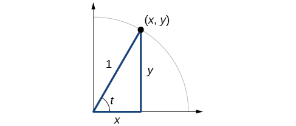{: #Figure_07_02_001}

We can define the trigonometric functions in terms an angle *t* and the lengths of the sides of the triangle. The **adjacent side**{: data-type="term"} is the side closest to the angle, *x*. (Adjacent means “next to.”) The **opposite side**{: data-type="term"} is the side across from the angle, *y*. The **hypotenuse**{: data-type="term"} is the side of the triangle opposite the right angle, 1. These sides are labeled in [\[link\]](#Figure_07_02_002).

 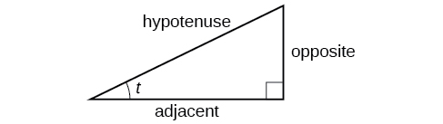{: #Figure_07_02_002}

Given a right triangle with an acute angle of<math xmlns="http://www.w3.org/1998/Math/MathML"> <mrow> <mtext> </mtext><mi>t</mi><mo>,</mo> </mrow> </math>

the first three trigonometric functions are listed.

<math xmlns="http://www.w3.org/1998/Math/MathML" display="block"> <mrow> <mtable> <mtr> <mtd columnalign="left"> <mrow> <mspace width="2.5em" /><mtext>Sine</mtext></mrow> </mtd> <mtd columnalign="left"> <mrow> <mspace width="1em" /><mtext>sin </mtext><mi>t</mi></mrow> </mtd> <mtd columnalign="left"> <mrow> <mo>=</mo><mfrac> <mrow> <mtext>opposite</mtext></mrow> <mrow> <mtext>hypotenuse</mtext></mrow> </mfrac> </mrow> </mtd> </mtr> </mtable></mrow> </math>

<math xmlns="http://www.w3.org/1998/Math/MathML" display="block"> <mrow> <mtable> <mtr> <mtd columnalign="left"> <mrow> <mspace width="1.5em" /><mtext>Cosine</mtext></mrow> </mtd> <mtd columnalign="left"> <mrow> <mspace width="1em" /><mtext>cos </mtext><mi>t</mi></mrow> </mtd> <mtd columnalign="left"> <mrow> <mo>=</mo><mfrac> <mrow> <mtext>adjacent</mtext></mrow> <mrow> <mtext>hypotenuse</mtext></mrow> </mfrac> </mrow> </mtd> </mtr> </mtable></mrow> </math>

<math xmlns="http://www.w3.org/1998/Math/MathML" display="block"> <mrow> <mtable> <mtr> <mtd columnalign="right"> <mrow> <mtext>Tangent</mtext></mrow> </mtd> <mtd columnalign="left"> <mrow> <mspace width="1em" /><mtext>tan </mtext><mi>t</mi></mrow> </mtd> <mtd columnalign="left"> <mrow> <mo>=</mo><mfrac> <mrow> <mtext>opposite</mtext></mrow> <mrow> <mtext>adjacent</mtext></mrow> </mfrac> </mrow> </mtd> </mtr> </mtable></mrow> </math>

A common mnemonic for remembering these relationships is SohCahToa, formed from the first letters of “<u data-effect="underline">**S**</u>ine is <u data-effect="underline">**o**</u>pposite over <u data-effect="underline">**h**</u>ypotenuse, <u data-effect="underline">**C**</u>osine is <u data-effect="underline">**a**</u>djacent over <u data-effect="underline">**h**</u>ypotenuse, <u data-effect="underline">**T**</u>angent is <u data-effect="underline">**o**</u>pposite over <u data-effect="underline">**a**</u>djacent.”

For the triangle shown in [\[link\]](#Figure_07_02_001), we have the following.

<math xmlns="http://www.w3.org/1998/Math/MathML" display="block"> <mrow> <mtable> <mtr> <mtd columnalign="right"> <mrow> <mtext>sin </mtext><mi>t</mi></mrow> </mtd> <mtd> <mo>=</mo> </mtd> <mtd columnalign="left"> <mrow> <mfrac> <mi>y</mi> <mn>1</mn> </mfrac> </mrow> </mtd> </mtr> <mtr> <mtd columnalign="right"> <mrow> <mtext>cos </mtext><mi>t</mi></mrow> </mtd> <mtd> <mo>=</mo> </mtd> <mtd columnalign="left"> <mrow> <mfrac> <mi>x</mi> <mn>1</mn> </mfrac> </mrow> </mtd> </mtr> <mtr> <mtd columnalign="right"> <mrow> <mtext>sec </mtext><mi>t</mi></mrow> </mtd> <mtd> <mo>=</mo> </mtd> <mtd columnalign="left"> <mrow> <mfrac> <mi>y</mi> <mi>x</mi> </mfrac> </mrow> </mtd> </mtr> </mtable></mrow> </math>

<strong>Given the side lengths of a right triangle and one of the acute angles, find the sine, cosine, and tangent of that angle. </strong>

1.  Find the sine as the ratio of the opposite side to the hypotenuse.
2.  Find the cosine as the ratio of the adjacent side to the hypotenuse.
3.  Find the tangent as the ratio of the opposite side to the adjacent side.
{: data-number-style="arabic"}

Evaluating a Trigonometric Function of a Right Triangle

Given the triangle shown in [[link]](#Figure_07_02_003), find the value of<math xmlns="http://www.w3.org/1998/Math/MathML"> <mrow> <mtext> </mtext><mi>cos</mi><mtext> </mtext><mi>α</mi><mo>.</mo> </mrow> </math>

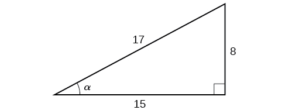{: #Figure_07_02_003}

The side adjacent to the angle is 15, and the hypotenuse of the triangle is 17.

<math xmlns="http://www.w3.org/1998/Math/MathML" display="block"> <mrow> <mtable> <mtr rowalign="center"> <mtd columnalign="right" rowalign="center"> <mrow> <mi>cos</mi><mo stretchy="false">(</mo><mi>α</mi><mo stretchy="false">)</mo></mrow> </mtd> <mtd rowalign="center"> <mo>=</mo> </mtd> <mtd rowalign="center" columnalign="left"> <mrow> <mfrac> <mrow> <mtext>adjacent</mtext></mrow> <mrow> <mtext>hypotenuse</mtext></mrow> </mfrac> </mrow> </mtd> </mtr> <mtr rowalign="center"> <mtd rowalign="center" /> <mtd rowalign="center"><mo>=</mo></mtd> <mtd rowalign="center" columnalign="left"> <mrow> <mfrac> <mrow> <mn>15</mn></mrow> <mrow> <mn>17</mn></mrow> </mfrac> </mrow> </mtd> </mtr> </mtable></mrow> </math>

Given the triangle shown in [[link]](#Figure_07_02_004), find the value of<math xmlns="http://www.w3.org/1998/Math/MathML"> <mrow> <mtext> </mtext><mtext>sin</mtext><mtext> </mtext><mi>t</mi><mo>.</mo></mrow> </math>

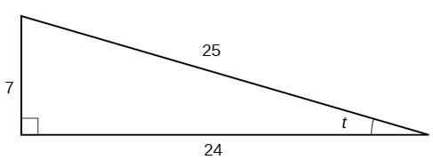{: #Figure_07_02_004}

<math xmlns="http://www.w3.org/1998/Math/MathML"> <mrow> <mfrac> <mn>7</mn> <mrow> <mn>25</mn> </mrow> </mfrac> </mrow> </math>

## Reciprocal Functions

In addition to sine, cosine, and tangent, there are three more functions. These too are defined in terms of the sides of the triangle.

<math xmlns="http://www.w3.org/1998/Math/MathML" display="block"> <mrow> <mtable> <mtr> <mtd columnalign="left"> <mrow> <mspace width="2em" /><mtext>Secant</mtext></mrow> </mtd> <mtd columnalign="left"> <mrow> <mspace width="1em" /><mtext>sec </mtext><mi>t</mi></mrow> </mtd> <mtd columnalign="left"> <mrow> <mo>=</mo><mfrac> <mrow> <mtext>hypotenuse</mtext></mrow> <mrow> <mtext>adjacent</mtext></mrow> </mfrac> </mrow> </mtd> </mtr> </mtable></mrow> </math>

<math xmlns="http://www.w3.org/1998/Math/MathML" display="block"> <mrow> <mtable> <mtr> <mtd columnalign="right"> <mrow> <mspace width="1.3em" /><mtext>Cosecant</mtext></mrow> </mtd> <mtd columnalign="right"> <mrow> <mspace width="1em" /><mtext>csc </mtext><mi>t</mi></mrow> </mtd> <mtd columnalign="left"> <mrow> <mo>=</mo><mfrac> <mrow> <mtext>hypotenuse</mtext></mrow> <mrow> <mtext>opposite</mtext></mrow> </mfrac> </mrow> </mtd> </mtr> </mtable></mrow> </math>

<math xmlns="http://www.w3.org/1998/Math/MathML" display="block"> <mrow> <mtable> <mtr> <mtd columnalign="right"> <mrow> <mtext>Cotangent</mtext></mrow> </mtd> <mtd> <mrow> <mspace width="1em" /><mtext>cot </mtext><mi>t</mi></mrow> </mtd> <mtd columnalign="left"> <mrow> <mo>=</mo><mfrac> <mrow> <mtext>adjacent</mtext></mrow> <mrow> <mtext>opposite</mtext></mrow> </mfrac> </mrow> </mtd> </mtr> </mtable></mrow> </math>

Take another look at these definitions. These functions are the reciprocals of the first three functions.

<math xmlns="http://www.w3.org/1998/Math/MathML" display="block"> <mrow> <mtable> <mtr> <mtd columnalign="right"> <mrow> <mtext>sin </mtext><mi>t</mi></mrow> </mtd> <mtd> <mo>=</mo> </mtd> <mtd columnalign="left"> <mrow> <mfrac> <mn>1</mn> <mrow> <mtext>csc </mtext><mi>t</mi></mrow> </mfrac> </mrow> </mtd> <mtd columnalign="right"> <mrow> <mspace width="2em" /><mtext>csc </mtext><mi>t</mi></mrow> </mtd> <mtd> <mo>=</mo> </mtd> <mtd columnalign="left"> <mrow> <mfrac> <mn>1</mn> <mrow> <mtext>sin </mtext><mi>t</mi></mrow> </mfrac> </mrow> </mtd> </mtr> <mtr> <mtd columnalign="right"> <mrow> <mtext>cos </mtext><mi>t</mi></mrow> </mtd> <mtd> <mo>=</mo> </mtd> <mtd columnalign="left"> <mrow> <mfrac> <mn>1</mn> <mrow> <mtext>sec </mtext><mi>t</mi></mrow> </mfrac> </mrow> </mtd> <mtd columnalign="right"> <mrow> <mspace width="2em" /><mtext>sec </mtext><mi>t</mi></mrow> </mtd> <mtd> <mo>=</mo> </mtd> <mtd columnalign="left"> <mrow> <mfrac> <mn>1</mn> <mrow> <mtext>cos </mtext><mi>t</mi></mrow> </mfrac> </mrow> </mtd> </mtr> <mtr> <mtd columnalign="right"> <mrow> <mtext>tan </mtext><mi>t</mi></mrow> </mtd> <mtd> <mo>=</mo> </mtd> <mtd columnalign="left"> <mrow> <mfrac> <mn>1</mn> <mrow> <mtext>cot </mtext><mi>t</mi></mrow> </mfrac> </mrow> </mtd> <mtd columnalign="right"> <mrow> <mspace width="2em" /><mtext>cot </mtext><mi>t</mi></mrow> </mtd> <mtd> <mo>=</mo> </mtd> <mtd columnalign="left"> <mrow> <mfrac> <mn>1</mn> <mrow> <mtext>tan </mtext><mi>t</mi></mrow> </mfrac> </mrow> </mtd> </mtr> </mtable></mrow> </math>

When working with right triangles, keep in mind that the same rules apply regardless of the orientation of the triangle. In fact, we can evaluate the six trigonometric functions of either of the two acute angles in the triangle in [\[link\]](#Figure_07_02_005). The side opposite one acute angle is the side adjacent to the other acute angle, and vice versa.

 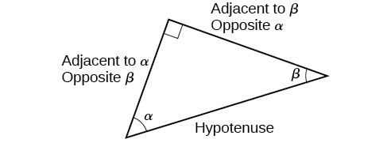{: #Figure_07_02_005}

Many problems ask for all six trigonometric functions for a given angle in a triangle. A possible strategy to use is to find the sine, cosine, and tangent of the angles first. Then, find the other trigonometric functions easily using the reciprocals.

<strong>Given the side lengths of a right triangle, evaluate the six trigonometric functions of one of the acute angles. </strong>

1.  If needed, draw the right triangle and label the angle provided.
2.  Identify the angle, the adjacent side, the side opposite the angle, and the hypotenuse of the right triangle.
3.  Find the required function:
    * sine as the ratio of the opposite side to the hypotenuse
    * cosine as the ratio of the adjacent side to the hypotenuse
    * tangent as the ratio of the opposite side to the adjacent side
    * secant as the ratio of the hypotenuse to the adjacent side
    * cosecant as the ratio of the hypotenuse to the opposite side
    * cotangent as the ratio of the adjacent side to the opposite side
{: data-number-style="arabic"}

Evaluating Trigonometric Functions of Angles Not in Standard Position

Using the triangle shown in [[link]](#Figure_07_02_006), evaluate<math xmlns="http://www.w3.org/1998/Math/MathML"> <mrow> <mtext> </mtext><mi>sin</mi><mtext> </mtext><mi>α</mi><mo>,</mo><mi>cos</mi><mtext> </mtext><mi>α</mi><mo>,</mo><mi>tan</mi><mtext> </mtext><mi>α</mi><mo>,</mo><mi>sec</mi><mtext> </mtext><mi>α</mi><mo>,</mo><mi>csc</mi><mtext> </mtext><mi>α</mi><mo>,</mo><mtext>and</mtext><mtext> </mtext><mi>cot</mi><mtext> </mtext><mi>α</mi><mo>.</mo> </mrow> </math>

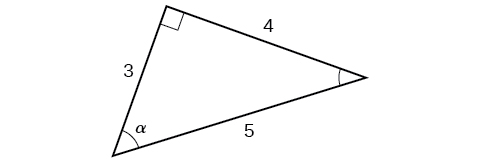{: #Figure_07_02_006}

<math xmlns="http://www.w3.org/1998/Math/MathML" display="block"> <mrow> <mtable> <mtr> <mtd columnalign="right"> <mrow> <mtext>sin </mtext><mi>α</mi></mrow> </mtd> <mtd columnalign="left"> <mrow> <mo>=</mo><mfrac> <mrow> <mtext>opposite </mtext><mi>α</mi></mrow> <mrow> <mtext>hypotenuse</mtext></mrow> </mfrac> </mrow> </mtd> <mtd columnalign="left"> <mrow> <mo>=</mo><mfrac> <mn>4</mn> <mn>5</mn> </mfrac> </mrow> </mtd> </mtr> <mtr> <mtd columnalign="right"> <mrow> <mtext>cos </mtext><mi>α</mi></mrow> </mtd> <mtd columnalign="left"> <mrow> <mo>=</mo><mfrac> <mrow> <mtext>adjacent to </mtext><mi>α</mi></mrow> <mrow> <mtext>hypotenuse</mtext></mrow> </mfrac> </mrow> </mtd> <mtd columnalign="left"> <mrow> <mo>=</mo><mfrac> <mn>3</mn> <mn>5</mn> </mfrac> </mrow> </mtd> </mtr> <mtr> <mtd columnalign="right"> <mrow> <mtext>tan </mtext><mi>α</mi></mrow> </mtd> <mtd columnalign="left"> <mrow> <mo>=</mo><mfrac> <mrow> <mtext>opposite </mtext><mi>α</mi></mrow> <mrow> <mtext>adjacent to </mtext><mi>α</mi></mrow> </mfrac> </mrow> </mtd> <mtd columnalign="left"> <mrow> <mo>=</mo><mfrac> <mn>4</mn> <mn>3</mn> </mfrac> </mrow> </mtd> </mtr> <mtr> <mtd columnalign="right"> <mrow> <mtext>sec </mtext><mi>α</mi></mrow> </mtd> <mtd columnalign="left"> <mrow> <mo>=</mo><mfrac> <mrow> <mtext>hypotenuse</mtext></mrow> <mrow> <mtext>adjacent to </mtext><mi>α</mi></mrow> </mfrac> </mrow> </mtd> <mtd columnalign="left"> <mrow> <mo>=</mo><mfrac> <mn>5</mn> <mn>3</mn> </mfrac> </mrow> </mtd> </mtr> <mtr> <mtd columnalign="right"> <mrow> <mtext>csc </mtext><mi>α</mi></mrow> </mtd> <mtd columnalign="left"> <mrow> <mo>=</mo><mfrac> <mrow> <mtext>hypotenuse</mtext></mrow> <mrow> <mtext>opposite </mtext><mi>α</mi></mrow> </mfrac> </mrow> </mtd> <mtd columnalign="left"> <mrow> <mo>=</mo><mfrac> <mn>5</mn> <mn>4</mn> </mfrac> </mrow> </mtd> </mtr> <mtr> <mtd columnalign="right"> <mrow> <mtext>cot </mtext><mi>α</mi></mrow> </mtd> <mtd columnalign="left"> <mrow> <mo>=</mo><mfrac> <mrow> <mtext>adjacent to </mtext><mi>α</mi></mrow> <mrow> <mtext>opposite </mtext><mi>α</mi></mrow> </mfrac> </mrow> </mtd> <mtd columnalign="left"> <mrow> <mo>=</mo><mfrac> <mn>3</mn> <mn>4</mn> </mfrac> </mrow> </mtd> </mtr> </mtable></mrow> </math>

Analysis

Another approach would have been to find sine, cosine, and tangent first. Then find their reciprocals to determine the other functions.

<math xmlns="http://www.w3.org/1998/Math/MathML" display="block"> <mrow> <mtext>sec </mtext><mi>α</mi><mo>=</mo><mfrac> <mn>1</mn> <mrow> <mtext>cos </mtext><mi>α</mi></mrow> </mfrac> <mo>=</mo><mfrac> <mn>1</mn> <mrow> <mfrac> <mn>3</mn> <mn>5</mn> </mfrac> </mrow> </mfrac> <mo>=</mo><mfrac> <mn>5</mn> <mn>3</mn> </mfrac> </mrow> </math>

<math xmlns="http://www.w3.org/1998/Math/MathML" display="block"> <mrow> <mtext>csc </mtext><mi>α</mi><mo>=</mo><mfrac> <mn>1</mn> <mrow> <mtext>csc </mtext><mi>α</mi></mrow> </mfrac> <mo>=</mo><mfrac> <mn>1</mn> <mrow> <mfrac> <mn>4</mn> <mn>5</mn> </mfrac> </mrow> </mfrac> <mo>=</mo><mfrac> <mn>5</mn> <mn>4</mn> </mfrac> </mrow> </math>

<math xmlns="http://www.w3.org/1998/Math/MathML" display="block"> <mrow> <mtext>cot </mtext><mi>α</mi><mo>=</mo><mfrac> <mn>1</mn> <mrow> <mtext>tan </mtext><mi>α</mi></mrow> </mfrac> <mo>=</mo><mfrac> <mn>1</mn> <mrow> <mfrac> <mn>4</mn> <mn>3</mn> </mfrac> </mrow> </mfrac> <mo>=</mo><mfrac> <mn>3</mn> <mn>4</mn> </mfrac> </mrow> </math>

Using the triangle shown in [[link]](#Figure_07_02_007),evaluate<math xmlns="http://www.w3.org/1998/Math/MathML"> <mrow> <mtext> </mtext><mtext>sin</mtext><mtext> </mtext><mi>t</mi><mo>,</mo><mtext>cos</mtext><mtext> </mtext><mi>t</mi><mo>,</mo><mtext>tan</mtext><mtext> </mtext><mi>t</mi><mo>,</mo><mtext>sec</mtext><mtext> </mtext><mi>t</mi><mo>,</mo><mtext>csc</mtext><mtext> </mtext><mi>t</mi><mo>,</mo><mtext>and</mtext><mtext> </mtext><mtext>cot</mtext><mtext> </mtext><mi>t</mi><mo>.</mo> </mrow> </math>

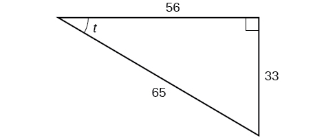{: #Figure_07_02_007}

<math xmlns="http://www.w3.org/1998/Math/MathML" display="block"> <mrow> <mtable> <mtr> <mtd columnalign="right"> <mrow> <mtext>sin </mtext><mi>t</mi></mrow> </mtd> <mtd> <mo>=</mo> </mtd> <mtd columnalign="left"> <mrow> <mfrac> <mrow> <mn>33</mn></mrow> <mrow> <mn>65</mn></mrow> </mfrac> <mo>,</mo></mrow> </mtd> <mtd columnalign="right"> <mrow> <mtext>cos </mtext><mi>t</mi></mrow> </mtd> <mtd> <mo>=</mo> </mtd> <mtd columnalign="left"> <mrow> <mfrac> <mrow> <mn>56</mn></mrow> <mrow> <mn>65</mn></mrow> </mfrac> <mo>,</mo></mrow> </mtd> <mtd columnalign="right"> <mrow> <mtext>tan </mtext><mi>t</mi></mrow> </mtd> <mtd> <mo>=</mo> </mtd> <mtd columnalign="left"> <mrow> <mfrac> <mrow> <mn>33</mn></mrow> <mrow> <mn>56</mn></mrow> </mfrac> <mo>,</mo></mrow> </mtd> </mtr> <mtr> <mtd columnalign="right"> <mrow> <mtext>sec </mtext><mi>t</mi></mrow> </mtd> <mtd> <mo>=</mo> </mtd> <mtd columnalign="left"> <mrow> <mfrac> <mrow> <mn>65</mn></mrow> <mrow> <mn>56</mn></mrow> </mfrac> <mo>,</mo></mrow> </mtd> <mtd columnalign="right"> <mrow> <mtext>csc </mtext><mi>t</mi></mrow> </mtd> <mtd> <mo>=</mo> </mtd> <mtd columnalign="left"> <mrow> <mfrac> <mrow> <mn>65</mn></mrow> <mrow> <mn>33</mn></mrow> </mfrac> <mo>,</mo></mrow> </mtd> <mtd columnalign="right"> <mrow> <mtext>cot </mtext><mi>t</mi></mrow> </mtd> <mtd> <mo>=</mo> </mtd> <mtd columnalign="left"> <mrow> <mfrac> <mrow> <mn>56</mn></mrow> <mrow> <mn>33</mn></mrow> </mfrac> </mrow> </mtd> </mtr> </mtable></mrow> </math>

## Finding Trigonometric Functions of Special Angles Using Side Lengths

It is helpful to evaluate the trigonometric functions as they relate to the special angles—multiples of<math xmlns="http://www.w3.org/1998/Math/MathML"> <mrow> <mtext> </mtext><mn>30°</mn><mo>,</mo><mn>60°</mn><mo>,</mo> </mrow> </math>

and<math xmlns="http://www.w3.org/1998/Math/MathML"> <mrow> <mtext> </mtext><mn>45°</mn><mo>.</mo><mtext> </mtext> </mrow> </math>

Remember, however, that when dealing with right triangles, we are limited to angles between<math xmlns="http://www.w3.org/1998/Math/MathML"> <mrow> <mtext> </mtext><mn>0°</mn><mtext> and 90°</mtext><mtext>.</mtext> </mrow> </math>

Suppose we have a<math xmlns="http://www.w3.org/1998/Math/MathML"> <mrow> <mtext> </mtext><mn>30°</mn><mo>,</mo><mn>60°</mn><mo>,</mo><mn>90°</mn><mtext> </mtext> </mrow> </math>

triangle, which can also be described as a<math xmlns="http://www.w3.org/1998/Math/MathML"> <mrow> <mtext> </mtext><mfrac> <mi>π</mi> <mn>6</mn> </mfrac> <mo>,</mo><mfrac> <mi>π</mi> <mn>3</mn> </mfrac> <mo>,</mo><mfrac> <mi>π</mi> <mn>2</mn> </mfrac> <mtext> </mtext> </mrow> </math>

triangle. The sides have lengths in the relation<math xmlns="http://www.w3.org/1998/Math/MathML"> <mrow> <mtext> </mtext><mi>s</mi><mo>,</mo><mtext>s</mtext><msqrt> <mn>3</mn> </msqrt> <mo>,</mo><mn>2</mn><mi>s</mi><mo>.</mo><mtext> </mtext> </mrow> </math>

The sides of a<math xmlns="http://www.w3.org/1998/Math/MathML"> <mrow> <mtext> </mtext><mn>45°</mn><mo>,</mo><mn>45°</mn><mo /><mo>,</mo><mn>90°</mn><mtext> </mtext> </mrow> </math>

triangle, which can also be described as a<math xmlns="http://www.w3.org/1998/Math/MathML"> <mrow> <mtext> </mtext><mfrac> <mi>π</mi> <mn>4</mn> </mfrac> <mo>,</mo><mfrac> <mi>π</mi> <mn>4</mn> </mfrac> <mo>,</mo><mfrac> <mi>π</mi> <mn>2</mn> </mfrac> <mtext> </mtext> </mrow> </math>

triangle, have lengths in the relation<math xmlns="http://www.w3.org/1998/Math/MathML"> <mrow> <mtext> </mtext><mi>s</mi><mo>,</mo><mi>s</mi><mo>,</mo><msqrt> <mn>2</mn> </msqrt> <mi>s</mi><mo>.</mo><mtext> </mtext> </mrow> </math>

These relations are shown in [\[link\]](#Figure_07_02_008).

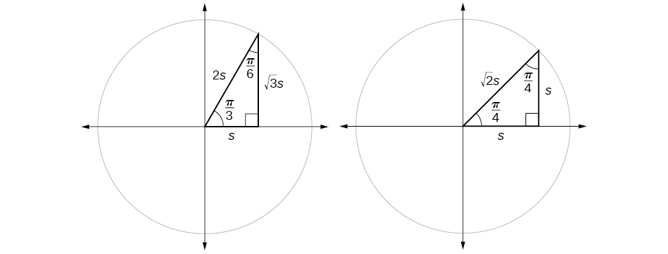{: #Figure_07_02_008}

We can then use the ratios of the side lengths to evaluate trigonometric functions of special angles.

<strong>Given trigonometric functions of a special angle, evaluate using side lengths. </strong>

1.  Use the side lengths shown in [\[link\]](#Figure_07_02_008) for the special angle you wish to evaluate.
2.  Use the ratio of side lengths appropriate to the function you wish to evaluate.
{: data-number-style="arabic"}

Evaluating Trigonometric Functions of Special Angles Using Side Lengths

Find the exact value of the trigonometric functions of<math xmlns="http://www.w3.org/1998/Math/MathML"> <mrow> <mtext> </mtext><mfrac> <mi>π</mi> <mn>3</mn> </mfrac> <mo>,</mo> </mrow> </math>

using side lengths.

<math xmlns="http://www.w3.org/1998/Math/MathML" display="block"> <mrow> <mtable> <mtr> <mtd columnalign="right"> <mrow> <mi>sin</mi><mrow><mo>(</mo> <mrow> <mfrac> <mi>π</mi> <mn>3</mn> </mfrac> </mrow> <mo>)</mo></mrow></mrow> </mtd> <mtd columnalign="left"> <mrow> <mo>=</mo><mfrac> <mrow> <mtext>opp</mtext></mrow> <mrow> <mtext>hyp</mtext></mrow> </mfrac> </mrow> </mtd> <mtd columnalign="left"> <mrow> <mo>=</mo><mfrac> <mrow> <msqrt> <mrow> <mn>3</mn><mi>s</mi></mrow> </msqrt> </mrow> <mrow> <mn>2</mn><mi>s</mi></mrow> </mfrac> </mrow> </mtd> <mtd columnalign="left"> <mrow> <mo>=</mo><mfrac> <mrow> <msqrt> <mn>3</mn> </msqrt> </mrow> <mn>2</mn> </mfrac> </mrow> </mtd> <mtd> <mrow /> </mtd> </mtr> <mtr> <mtd columnalign="right"> <mrow> <mi>cos</mi><mrow><mo>(</mo> <mrow> <mfrac> <mi>π</mi> <mn>3</mn> </mfrac> </mrow> <mo>)</mo></mrow></mrow> </mtd> <mtd columnalign="left"> <mrow> <mo>=</mo><mfrac> <mrow> <mtext>adj</mtext></mrow> <mrow> <mtext>hyp</mtext></mrow> </mfrac> </mrow> </mtd> <mtd columnalign="left"> <mrow> <mo>=</mo><mfrac> <mi>s</mi> <mrow> <mn>2</mn><mi>s</mi></mrow> </mfrac> </mrow> </mtd> <mtd columnalign="left"> <mrow> <mo>=</mo><mfrac> <mn>1</mn> <mn>2</mn> </mfrac> </mrow> </mtd> <mtd> <mrow /> </mtd> </mtr> <mtr> <mtd columnalign="right"> <mrow> <mi>tan</mi><mrow><mo>(</mo> <mrow> <mfrac> <mi>π</mi> <mn>3</mn> </mfrac> </mrow> <mo>)</mo></mrow></mrow> </mtd> <mtd columnalign="left"> <mrow> <mo>=</mo><mfrac> <mrow> <mtext>opp</mtext></mrow> <mrow> <mtext>adj</mtext></mrow> </mfrac> </mrow> </mtd> <mtd columnalign="left"> <mrow> <mo>=</mo><mfrac> <mrow> <msqrt> <mn>3</mn> </msqrt> <mi>s</mi></mrow> <mi>s</mi> </mfrac> </mrow> </mtd> <mtd columnalign="left"> <mrow> <mo>=</mo><msqrt> <mn>3</mn> </msqrt> </mrow> </mtd> <mtd> <mrow /> </mtd> </mtr> <mtr> <mtd columnalign="right"> <mrow> <mi>sec</mi><mrow><mo>(</mo> <mrow> <mfrac> <mi>π</mi> <mn>3</mn> </mfrac> </mrow> <mo>)</mo></mrow></mrow> </mtd> <mtd columnalign="left"> <mrow> <mo>=</mo><mfrac> <mrow> <mtext>hyp</mtext></mrow> <mrow> <mtext>adj</mtext></mrow> </mfrac> </mrow> </mtd> <mtd columnalign="left"> <mrow> <mo>=</mo><mfrac> <mrow> <mn>2</mn><mi>s</mi></mrow> <mi>s</mi> </mfrac> </mrow> </mtd> <mtd columnalign="left"> <mrow> <mo>=</mo><mn>2</mn></mrow> </mtd> <mtd> <mrow /> </mtd> </mtr> <mtr> <mtd columnalign="right"> <mrow> <mi>csc</mi><mrow><mo>(</mo> <mrow> <mfrac> <mi>π</mi> <mn>3</mn> </mfrac> </mrow> <mo>)</mo></mrow></mrow> </mtd> <mtd columnalign="left"> <mrow> <mo>=</mo><mfrac> <mrow> <mtext>hyp</mtext></mrow> <mrow> <mtext>opp</mtext></mrow> </mfrac> </mrow> </mtd> <mtd columnalign="left"> <mrow> <mo>=</mo><mfrac> <mrow> <mn>2</mn><mi>s</mi></mrow> <mrow> <msqrt> <mn>3</mn> </msqrt> <mi>s</mi></mrow> </mfrac> </mrow> </mtd> <mtd columnalign="left"> <mrow> <mo>=</mo><mfrac> <mn>2</mn> <mrow> <msqrt> <mn>3</mn> </msqrt> </mrow> </mfrac> </mrow> </mtd> <mtd columnalign="left"> <mrow> <mo>=</mo><mfrac> <mrow> <mn>2</mn><msqrt> <mn>3</mn> </msqrt> </mrow> <mn>3</mn> </mfrac> </mrow> </mtd> </mtr> <mtr> <mtd columnalign="right"> <mrow> <mi>cot</mi><mrow><mo>(</mo> <mrow> <mfrac> <mi>π</mi> <mn>3</mn> </mfrac> </mrow> <mo>)</mo></mrow></mrow> </mtd> <mtd columnalign="left"> <mrow> <mo>=</mo><mfrac> <mrow> <mtext>adj</mtext></mrow> <mrow> <mtext>opp</mtext></mrow> </mfrac> </mrow> </mtd> <mtd columnalign="left"> <mrow> <mo>=</mo><mfrac> <mi>s</mi> <mrow> <msqrt> <mn>3</mn> </msqrt> <mi>s</mi></mrow> </mfrac> </mrow> </mtd> <mtd columnalign="left"> <mrow> <mo>=</mo><mfrac> <mn>1</mn> <mrow> <msqrt> <mn>3</mn> </msqrt> </mrow> </mfrac> </mrow> </mtd> <mtd columnalign="left"> <mrow> <mo>=</mo><mfrac> <mrow> <msqrt> <mn>3</mn> </msqrt> </mrow> <mn>3</mn> </mfrac> </mrow> </mtd> </mtr> </mtable></mrow> </math>

Find the exact value of the trigonometric functions of<math xmlns="http://www.w3.org/1998/Math/MathML"> <mrow> <mtext> </mtext><mfrac> <mi>π</mi> <mn>4</mn> </mfrac> <mo>,</mo> </mrow> </math>

using side lengths.

<math xmlns="http://www.w3.org/1998/Math/MathML"> <mrow> <mtable> <mtr> <mtd columnalign="right"> <mrow> <mtext>sin</mtext><mrow><mo>(</mo> <mrow> <mfrac> <mi>θ</mi> <mn>4</mn> </mfrac> </mrow> <mo>)</mo></mrow></mrow> </mtd> <mtd> <mo>=</mo> </mtd> <mtd columnalign="left"> <mrow> <mfrac> <mrow> <msqrt> <mn>2</mn> </msqrt> </mrow> <mn>2</mn> </mfrac> <mo>,</mo><mtext>cos</mtext><mrow><mo>(</mo> <mrow> <mfrac> <mi>π</mi> <mn>4</mn> </mfrac> </mrow> <mo>)</mo></mrow><mo>=</mo><mfrac> <mrow> <msqrt> <mn>2</mn> </msqrt> </mrow> <mn>2</mn> </mfrac> <mo>,</mo><mi>tan</mi><mrow><mo>(</mo> <mrow> <mfrac> <mi>π</mi> <mn>4</mn> </mfrac> </mrow> <mo>)</mo></mrow><mo>=</mo><mn>1</mn><mo>,</mo></mrow> </mtd> </mtr> <mtr> <mtd columnalign="right"> <mrow> <mtext>sec</mtext><mrow><mo>(</mo> <mrow> <mfrac> <mi>π</mi> <mn>4</mn> </mfrac> </mrow> <mo>)</mo></mrow></mrow> </mtd> <mtd> <mo>=</mo> </mtd> <mtd columnalign="left"> <mrow> <msqrt> <mn>2</mn> </msqrt> <mo>,</mo><mtext>csc</mtext><mrow><mo>(</mo> <mrow> <mfrac> <mi>π</mi> <mn>4</mn> </mfrac> </mrow> <mo>)</mo></mrow><mo>=</mo><msqrt> <mn>2</mn> </msqrt> <mo>,</mo><mtext>cot</mtext><mrow><mo>(</mo> <mrow> <mfrac> <mi>π</mi> <mn>4</mn> </mfrac> </mrow> <mo>)</mo></mrow><mo>=</mo><mn>1</mn></mrow> </mtd> </mtr> </mtable></mrow> </math>

# Using Equal Cofunction of Complements 

If we look more closely at the relationship between the sine and cosine of the special angles, we notice a pattern. In a right triangle with angles of<math xmlns="http://www.w3.org/1998/Math/MathML"> <mrow> <mtext> </mtext><mfrac> <mi>π</mi> <mn>6</mn> </mfrac> <mtext> </mtext> </mrow> </math>

and<math xmlns="http://www.w3.org/1998/Math/MathML"> <mrow> <mtext> </mtext><mfrac> <mi>π</mi> <mn>3</mn> </mfrac> <mo>,</mo> </mrow> </math>

we see that the sine of<math xmlns="http://www.w3.org/1998/Math/MathML"> <mrow> <mtext> </mtext><mfrac> <mi>π</mi> <mn>3</mn> </mfrac> <mo>,</mo> </mrow> </math>

namely<math xmlns="http://www.w3.org/1998/Math/MathML"> <mrow> <mtext> </mtext><mfrac> <mrow> <msqrt> <mn>3</mn> </msqrt> </mrow> <mn>2</mn> </mfrac> <mo>,</mo> </mrow> </math>

is also the cosine of<math xmlns="http://www.w3.org/1998/Math/MathML"> <mrow> <mtext> </mtext><mfrac> <mi>π</mi> <mn>6</mn> </mfrac> <mo>,</mo> </mrow> </math>

while the sine of<math xmlns="http://www.w3.org/1998/Math/MathML"> <mrow> <mtext> </mtext><mfrac> <mi>π</mi> <mn>6</mn> </mfrac> <mo>,</mo> </mrow> </math>

namely<math xmlns="http://www.w3.org/1998/Math/MathML"> <mrow> <mtext> </mtext><mfrac> <mn>1</mn> <mn>2</mn> </mfrac> <mo>,</mo> </mrow> </math>

is also the cosine of<math xmlns="http://www.w3.org/1998/Math/MathML"> <mrow> <mtext> </mtext><mfrac> <mi>π</mi> <mn>3</mn> </mfrac> <mo>.</mo> </mrow> </math>

<math xmlns="http://www.w3.org/1998/Math/MathML" display="block"> <mrow> <mtable> <mtr> <mtd columnalign="right"> <mrow> <mi>sin</mi><mfrac> <mi>π</mi> <mn>3</mn> </mfrac> </mrow> </mtd> <mtd columnalign="left"> <mrow> <mo>=</mo><mi>cos</mi><mfrac> <mi>π</mi> <mn>6</mn> </mfrac> </mrow> </mtd> <mtd columnalign="left"> <mrow> <mo>=</mo><mfrac> <mrow> <msqrt> <mn>3</mn> </msqrt> <mi>s</mi></mrow> <mrow> <mn>2</mn><mi>s</mi></mrow> </mfrac> </mrow> </mtd> <mtd columnalign="left"> <mrow> <mo>=</mo><mfrac> <mrow> <msqrt> <mn>3</mn> </msqrt> </mrow> <mn>2</mn> </mfrac> </mrow> </mtd> </mtr> <mtr> <mtd columnalign="right"> <mrow> <mi>sin</mi><mfrac> <mi>π</mi> <mn>6</mn> </mfrac> </mrow> </mtd> <mtd columnalign="left"> <mrow> <mo>=</mo><mi>cos</mi><mfrac> <mi>π</mi> <mn>3</mn> </mfrac> </mrow> </mtd> <mtd columnalign="left"> <mrow> <mo>=</mo><mfrac> <mi>s</mi> <mrow> <mn>2</mn><mi>s</mi></mrow> </mfrac> </mrow> </mtd> <mtd columnalign="left"> <mrow> <mo>=</mo><mfrac> <mn>1</mn> <mn>2</mn> </mfrac> </mrow> </mtd> </mtr> </mtable></mrow> </math>

See [\[link\]](#Figure_07_02_009).

 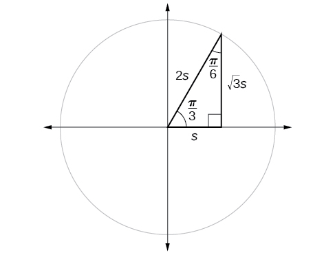{: #Figure_07_02_009}

This result should not be surprising because, as we see from [\[link\]](#Figure_07_02_009), the side opposite the angle of<math xmlns="http://www.w3.org/1998/Math/MathML"> <mrow> <mtext> </mtext><mfrac> <mi>π</mi> <mn>3</mn> </mfrac> <mtext> </mtext> </mrow> </math>

is also the side adjacent to<math xmlns="http://www.w3.org/1998/Math/MathML"> <mrow> <mtext> </mtext><mfrac> <mi>π</mi> <mn>6</mn> </mfrac> <mo>,</mo> </mrow> </math>

so<math xmlns="http://www.w3.org/1998/Math/MathML"> <mrow> <mtext> </mtext><mi>sin</mi><mrow><mo>(</mo> <mrow> <mfrac> <mi>π</mi> <mn>3</mn> </mfrac> </mrow> <mo>)</mo></mrow><mtext> </mtext> </mrow> </math>

and<math xmlns="http://www.w3.org/1998/Math/MathML"> <mrow> <mtext> </mtext><mi>cos</mi><mrow><mo>(</mo> <mrow> <mfrac> <mi>π</mi> <mn>6</mn> </mfrac> </mrow> <mo>)</mo></mrow><mtext> </mtext> </mrow> </math>

are exactly the same ratio of the same two sides,<math xmlns="http://www.w3.org/1998/Math/MathML"> <mrow> <mtext> </mtext><msqrt> <mn>3</mn> </msqrt> <mi>s</mi><mtext> </mtext> </mrow> </math>

and<math xmlns="http://www.w3.org/1998/Math/MathML"> <mrow> <mtext> </mtext><mn>2</mn><mi>s</mi><mo>.</mo><mtext> </mtext> </mrow> </math>

Similarly,<math xmlns="http://www.w3.org/1998/Math/MathML"> <mrow> <mtext> </mtext><mi>cos</mi><mrow><mo>(</mo> <mrow> <mfrac> <mi>π</mi> <mn>3</mn> </mfrac> </mrow> <mo>)</mo></mrow><mtext> </mtext> </mrow> </math>

and<math xmlns="http://www.w3.org/1998/Math/MathML"> <mrow> <mtext> </mtext><mi>sin</mi><mrow><mo>(</mo> <mrow> <mfrac> <mi>π</mi> <mn>6</mn> </mfrac> </mrow> <mo>)</mo></mrow><mtext> </mtext> </mrow> </math>

are also the same ratio using the same two sides,<math xmlns="http://www.w3.org/1998/Math/MathML"> <mrow> <mtext> </mtext><mi>s</mi><mtext> </mtext> </mrow> </math>

and<math xmlns="http://www.w3.org/1998/Math/MathML"> <mrow> <mtext> </mtext><mn>2</mn><mi>s</mi><mo>.</mo> </mrow> </math>

The interrelationship between the sines and cosines of<math xmlns="http://www.w3.org/1998/Math/MathML"> <mrow> <mtext> </mtext><mfrac> <mi>π</mi> <mn>6</mn> </mfrac> <mtext> </mtext> </mrow> </math>

and<math xmlns="http://www.w3.org/1998/Math/MathML"> <mrow> <mtext> </mtext><mfrac> <mi>π</mi> <mn>3</mn> </mfrac> <mtext> </mtext> </mrow> </math>

also holds for the two acute angles in any right triangle, since in every case, the ratio of the same two sides would constitute the sine of one angle and the cosine of the other. Since the three angles of a triangle add to<math xmlns="http://www.w3.org/1998/Math/MathML"> <mrow> <mtext> </mtext><mi>π</mi><mo>,</mo> </mrow> </math>

and the right angle is<math xmlns="http://www.w3.org/1998/Math/MathML"> <mrow> <mtext> </mtext><mfrac> <mi>π</mi> <mn>2</mn> </mfrac> <mo>,</mo> </mrow> </math>

the remaining two angles must also add up to<math xmlns="http://www.w3.org/1998/Math/MathML"> <mrow> <mtext> </mtext><mfrac> <mi>π</mi> <mn>2</mn> </mfrac> <mo>.</mo><mtext> </mtext> </mrow> </math>

That means that a right triangle can be formed with any two angles that add to<math xmlns="http://www.w3.org/1998/Math/MathML"> <mrow> <mtext> </mtext><mfrac> <mi>π</mi> <mn>2</mn> </mfrac> <mtext> </mtext> </mrow> </math>

—in other words, any two complementary angles. So we may state a *cofunction identity*\: If any two angles are complementary, the sine of one is the cosine of the other, and vice versa. This identity is illustrated in [\[link\]](#Figure_07_02_010).

 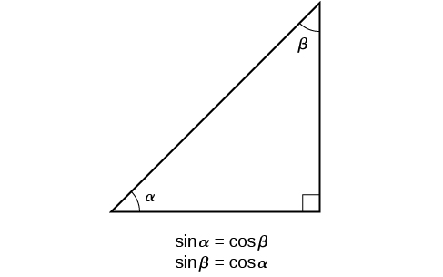{: #Figure_07_02_010}

Using this identity, we can state without calculating, for instance, that the sine of<math xmlns="http://www.w3.org/1998/Math/MathML"> <mrow> <mtext> </mtext><mfrac> <mi>π</mi> <mrow> <mn>12</mn> </mrow> </mfrac> <mtext> </mtext> </mrow> </math>

equals the cosine of<math xmlns="http://www.w3.org/1998/Math/MathML"> <mrow> <mtext> </mtext><mfrac> <mrow> <mn>5</mn><mi>π</mi> </mrow> <mrow> <mn>12</mn> </mrow> </mfrac> <mo>,</mo> </mrow> </math>

and that the sine of<math xmlns="http://www.w3.org/1998/Math/MathML"> <mrow> <mtext> </mtext><mfrac> <mrow> <mn>5</mn><mi>π</mi> </mrow> <mrow> <mn>12</mn> </mrow> </mfrac> <mtext> </mtext> </mrow> </math>

equals the cosine of<math xmlns="http://www.w3.org/1998/Math/MathML"> <mrow> <mtext> </mtext><mfrac> <mi>π</mi> <mrow> <mn>12</mn> </mrow> </mfrac> <mo>.</mo><mtext> </mtext> </mrow> </math>

We can also state that if, for a given angle<math xmlns="http://www.w3.org/1998/Math/MathML"> <mrow> <mtext> </mtext><mi>t</mi><mo>,</mo><mi>cos</mi><mtext> </mtext><mi>t</mi><mo>=</mo><mfrac> <mn>5</mn> <mrow> <mn>13</mn> </mrow> </mfrac> <mo>,</mo> </mrow> </math>

then<math xmlns="http://www.w3.org/1998/Math/MathML"> <mrow> <mtext> </mtext><mi>sin</mi><mrow><mo>(</mo> <mrow> <mfrac> <mi>π</mi> <mn>2</mn> </mfrac> <mo>−</mo><mi>t</mi> </mrow> <mo>)</mo></mrow><mo>=</mo><mfrac> <mn>5</mn> <mrow> <mn>13</mn> </mrow> </mfrac> <mtext> </mtext> </mrow> </math>

as well.

Cofunction Identities

The **cofunction identities**{: data-type="term"} in radians are listed in [\[link\]](#Table_07_02_01).

| <math xmlns="http://www.w3.org/1998/Math/MathML"> <mrow> <mi>cos</mi><mtext> </mtext><mi>t</mi><mo>=</mo><mi>sin</mi><mrow><mo>(</mo> <mrow> <mfrac> <mi>π</mi> <mn>2</mn> </mfrac> <mo>−</mo><mi>t</mi></mrow> <mo>)</mo></mrow></mrow> </math>

 | <math xmlns="http://www.w3.org/1998/Math/MathML"> <mrow> <mi>sin</mi><mtext> </mtext><mi>t</mi><mo>=</mo><mi>cos</mi><mrow><mo>(</mo> <mrow> <mfrac> <mi>π</mi> <mn>2</mn> </mfrac> <mo>−</mo><mi>t</mi></mrow> <mo>)</mo></mrow></mrow> </math>

 |
| <math xmlns="http://www.w3.org/1998/Math/MathML"> <mrow> <mi>tan</mi><mtext> </mtext><mi>t</mi><mo>=</mo><mi>cot</mi><mrow><mo>(</mo> <mrow> <mfrac> <mi>π</mi> <mn>2</mn> </mfrac> <mo>−</mo><mi>t</mi></mrow> <mo>)</mo></mrow></mrow> </math>

 | <math xmlns="http://www.w3.org/1998/Math/MathML"> <mrow> <mi>cot</mi><mtext> </mtext><mi>t</mi><mo>=</mo><mi>tan</mi><mrow><mo>(</mo> <mrow> <mfrac> <mi>π</mi> <mn>2</mn> </mfrac> <mo>−</mo><mi>t</mi></mrow> <mo>)</mo></mrow></mrow> </math>

 |
| <math xmlns="http://www.w3.org/1998/Math/MathML"> <mrow> <mi>sec</mi><mtext> </mtext><mi>t</mi><mo>=</mo><mi>csc</mi><mrow><mo>(</mo> <mrow> <mfrac> <mi>π</mi> <mn>2</mn> </mfrac> <mo>−</mo><mi>t</mi></mrow> <mo>)</mo></mrow></mrow> </math>

 | <math xmlns="http://www.w3.org/1998/Math/MathML"> <mrow> <mi>csc</mi><mtext> </mtext><mi>t</mi><mo>=</mo><mi>sec</mi><mrow><mo>(</mo> <mrow> <mfrac> <mi>π</mi> <mn>2</mn> </mfrac> <mo>−</mo><mi>t</mi></mrow> <mo>)</mo></mrow></mrow> </math>

 |
{: #Table_07_02_01 summary="This table has three rows, two columns. The table has ordered pairs of these row values: (sin(theta) = cos(pi/2 - theta), cos(theta) = sin(pi/2 - theta)), (tan(theta) = cot(pi/2 - theta), cot(theta) = tan(pi/2 - theta)), and (sec(theta) = csc(pi/2 - theta), csc(theta) = sec(pi/2 - theta))."}

<strong>Given the sine and cosine of an angle, find the sine or cosine of its complement. </strong>

1.  To find the sine of the complementary angle, find the cosine of the original angle.
2.  To find the cosine of the complementary angle, find the sine of the original angle.
{: data-number-style="arabic"}

Using Cofunction Identities

If<math xmlns="http://www.w3.org/1998/Math/MathML"> <mrow> <mtext> </mtext><mi>sin</mi><mtext> </mtext><mi>t</mi><mo>=</mo><mfrac> <mn>5</mn> <mrow> <mn>12</mn></mrow> </mfrac> <mo>,</mo></mrow> </math>

find<math xmlns="http://www.w3.org/1998/Math/MathML"> <mrow> <mtext> </mtext><mi>cos</mi><mrow><mo>(</mo> <mrow> <mfrac> <mi>π</mi> <mn>2</mn> </mfrac> <mo>−</mo><mi>t</mi> </mrow> <mo>)</mo></mrow><mo>.</mo> </mrow> </math>

According to the cofunction identities for sine and cosine, we have the following.

<math xmlns="http://www.w3.org/1998/Math/MathML" display="block"> <mrow> <mi>sin</mi><mtext> </mtext><mi>t</mi><mo>=</mo><mi>cos</mi><mtext> </mtext><mrow><mo>(</mo> <mrow> <mfrac> <mi>π</mi> <mn>2</mn> </mfrac> <mo>−</mo><mi>t</mi></mrow> <mo>)</mo></mrow></mrow> </math>

So

<math xmlns="http://www.w3.org/1998/Math/MathML"> <mrow> <mi>cos</mi><mtext> </mtext><mrow><mo>(</mo> <mrow> <mfrac> <mi>π</mi> <mn>2</mn> </mfrac> <mo>−</mo><mi>t</mi></mrow> <mo>)</mo></mrow><mo>=</mo><mfrac> <mn>5</mn> <mrow> <mn>12</mn></mrow> </mfrac> </mrow> </math>

If<math xmlns="http://www.w3.org/1998/Math/MathML"> <mrow> <mtext> </mtext><mi>csc</mi><mtext> </mtext><mrow><mo>(</mo> <mrow> <mfrac> <mi>π</mi> <mn>6</mn> </mfrac> </mrow> <mo>)</mo></mrow><mo>=</mo><mn>2</mn><mo>,</mo></mrow> </math>

find<math xmlns="http://www.w3.org/1998/Math/MathML"> <mrow> <mtext> </mtext><mi>sec</mi><mtext> </mtext><mrow><mo>(</mo> <mrow> <mfrac> <mi>π</mi> <mn>3</mn> </mfrac> </mrow> <mo>)</mo></mrow><mo>.</mo></mrow> </math>

2

# Using Trigonometric Functions

In previous examples, we evaluated the sine and cosine in triangles where we knew all three sides. But the real power of right-triangle trigonometry emerges when we look at triangles in which we know an angle but do not know all the sides.

<strong>Given a right triangle, the length of one side, and the measure of one acute angle, find the remaining sides. </strong>

1.  For each side, select the trigonometric function that has the unknown side as either the numerator or the denominator. The known side will in turn be the denominator or the numerator.
2.  Write an equation setting the function value of the known angle equal to the ratio of the corresponding sides.
3.  Using the value of the trigonometric function and the known side length, solve for the missing side length.
{: data-number-style="arabic"}

Finding Missing Side Lengths Using Trigonometric Ratios

Find the unknown sides of the triangle in [[link]](#Figure_07_02_011).

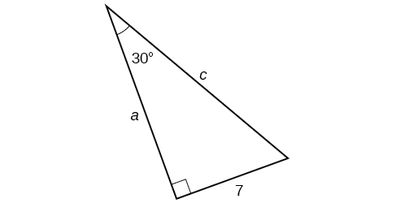{: #Figure_07_02_011}

We know the angle and the opposite side, so we can use the tangent to find the adjacent side.

<math xmlns="http://www.w3.org/1998/Math/MathML" display="block"> <mrow> <mi>tan</mi><mo stretchy="false">(</mo><mn>30°</mn><mo stretchy="false">)</mo><mo>=</mo><mfrac> <mn>7</mn> <mi>a</mi> </mfrac> </mrow> </math>

We rearrange to solve for<math xmlns="http://www.w3.org/1998/Math/MathML"> <mrow> <mtext> </mtext><mi>a</mi><mo>.</mo> </mrow> </math>

<math xmlns="http://www.w3.org/1998/Math/MathML"> <mrow> <mtable> <mtr rowalign="center"> <mtd rowalign="center" columnalign="right"> <mi>a</mi> </mtd> <mtd rowalign="center"> <mo>=</mo> </mtd> <mtd rowalign="center" columnalign="left"> <mrow> <mfrac> <mn>7</mn> <mrow> <mi>tan</mi><mo stretchy="false">(</mo><mn>30°</mn><mo stretchy="false">)</mo></mrow> </mfrac> </mrow> </mtd> </mtr> <mtr rowalign="center"> <mtd rowalign="center" /> <mtd rowalign="center"><mo>≈</mo></mtd> <mtd rowalign="center" columnalign="left"> <mrow> <mn>12.1</mn></mrow> </mtd> </mtr> </mtable></mrow> </math>

We can use the sine to find the hypotenuse.

<math xmlns="http://www.w3.org/1998/Math/MathML" display="block"> <mrow> <mi>sin</mi><mo stretchy="false">(</mo><mn>30°</mn><mo stretchy="false">)</mo><mo>=</mo><mfrac> <mn>7</mn> <mi>c</mi> </mfrac> </mrow> </math>

Again, we rearrange to solve for<math xmlns="http://www.w3.org/1998/Math/MathML"> <mrow> <mtext> </mtext><mi>c</mi><mo>.</mo> </mrow> </math>

<math xmlns="http://www.w3.org/1998/Math/MathML" display="block"> <mrow> <mtable> <mtr rowalign="center"> <mtd rowalign="center" columnalign="right"> <mi>c</mi> </mtd> <mtd rowalign="center"> <mo>=</mo> </mtd> <mtd rowalign="center" columnalign="left"> <mrow> <mfrac> <mn>7</mn> <mrow> <mi>sin</mi><mo stretchy="false">(</mo><mn>30°</mn><mo stretchy="false">)</mo></mrow> </mfrac> </mrow> </mtd> </mtr> <mtr rowalign="center"> <mtd rowalign="center" /> <mtd rowalign="center"><mo>≈</mo></mtd> <mtd rowalign="center" columnalign="left"> <mrow> <mn>14</mn></mrow> </mtd> </mtr> </mtable></mrow> </math>

A right triangle has one angle of<math xmlns="http://www.w3.org/1998/Math/MathML"> <mrow> <mtext> </mtext><mfrac> <mi>π</mi> <mn>3</mn> </mfrac> <mtext> </mtext> </mrow> </math>

and a hypotenuse of 20. Find the unknown sides and angle of the triangle.

<math xmlns="http://www.w3.org/1998/Math/MathML"> <mrow> <mtext>adjacent</mtext><mo>=</mo><mn>10</mn><mo>;</mo><mtext>opposite</mtext><mo>=</mo><mn>10</mn><msqrt> <mn>3</mn> </msqrt> <mo>;</mo> </mrow> </math>

missing angle is<math xmlns="http://www.w3.org/1998/Math/MathML"> <mrow> <mtext> </mtext><mfrac> <mi>π</mi> <mn>6</mn> </mfrac> </mrow> </math>

# Using Right Triangle Trigonometry to Solve Applied Problems

Right-triangle trigonometry has many practical applications. For example, the ability to compute the lengths of sides of a triangle makes it possible to find the height of a tall object without climbing to the top or having to extend a tape measure along its height. We do so by measuring a distance from the base of the object to a point on the ground some distance away, where we can look up to the top of the tall object at an angle. The **angle of elevation**{: data-type="term"} of an object above an observer relative to the observer is the angle between the horizontal and the line from the object to the observer\'s eye. The right triangle this position creates has sides that represent the unknown height, the measured distance from the base, and the angled line of sight from the ground to the top of the object. Knowing the measured distance to the base of the object and the angle of the line of sight, we can use trigonometric functions to calculate the unknown height.

Similarly, we can form a triangle from the top of a tall object by looking downward. The **angle of depression**{: data-type="term"} of an object below an observer relative to the observer is the angle between the horizontal and the line from the object to the observer\'s eye. See [\[link\]](#Figure_07_02_013).

 {: #Figure_07_02_013}

<strong>Given a tall object, measure its height indirectly. </strong>

1.  Make a sketch of the problem situation to keep track of known and unknown information.
2.  Lay out a measured distance from the base of the object to a point where the top of the object is clearly visible.
3.  At the other end of the measured distance, look up to the top of the object. Measure the angle the line of sight makes with the horizontal.
4.  Write an equation relating the unknown height, the measured distance, and the tangent of the angle of the line of sight.
5.  Solve the equation for the unknown height.
{: data-number-style="arabic"}

Measuring a Distance Indirectly

To find the height of a tree, a person walks to a point 30 feet from the base of the tree. She measures an angle of<math xmlns="http://www.w3.org/1998/Math/MathML"> <mrow> <mtext> </mtext><mn>57°</mn><mtext> </mtext> </mrow> </math>

between a line of sight to the top of the tree and the ground, as shown in [[link]](#Figure_07_02_012). Find the height of the tree.

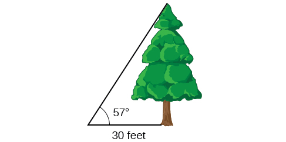{: #Figure_07_02_012}

We know that the angle of elevation is<math xmlns="http://www.w3.org/1998/Math/MathML"> <mrow> <mtext> </mtext><mn>57°</mn><mtext> </mtext> </mrow> </math>

and the adjacent side is 30 ft long. The opposite side is the unknown height.

The trigonometric function relating the side opposite to an angle and the side adjacent to the angle is the tangent. So we will state our information in terms of the tangent of<math xmlns="http://www.w3.org/1998/Math/MathML"> <mrow> <mtext> </mtext><mn>57°</mn><mo>,</mo> </mrow> </math>

letting<math xmlns="http://www.w3.org/1998/Math/MathML"> <mrow> <mtext> </mtext><mi>h</mi><mtext> </mtext> </mrow> </math>

be the unknown height.

<math xmlns="http://www.w3.org/1998/Math/MathML" display="block"> <mrow> <mtable> <mtr rowalign="center"> <mtd rowalign="center" columnalign="right"> <mrow> <mtext>tan </mtext><mi>θ</mi></mrow> </mtd> <mtd rowalign="center"><mo>=</mo></mtd> <mtd rowalign="center" columnalign="left"> <mrow> <mfrac> <mrow> <mtext>opposite</mtext></mrow> <mrow> <mtext>adjacent</mtext></mrow> </mfrac> </mrow> </mtd> <mtd rowalign="center" /> </mtr> <mtr> <mtd columnalign="right"> <mrow> <mtext>tan</mtext><mrow><mo>(</mo> <mrow> <mn>57°</mn></mrow> <mo>)</mo></mrow></mrow> </mtd> <mtd><mo>=</mo></mtd> <mtd columnalign="left"> <mrow> <mfrac> <mi>h</mi> <mrow> <mn>30</mn></mrow> </mfrac> </mrow> </mtd> <mtd columnalign="left"> <mrow> <mspace width="1em" /><mtext>Solve for </mtext><mi>h</mi><mo>.</mo></mrow> </mtd> </mtr> <mtr> <mtd columnalign="right"> <mi>h</mi> </mtd> <mtd> <mo>=</mo> </mtd> <mtd columnalign="left"> <mrow> <mtext>30tan</mtext><mrow><mo>(</mo> <mrow> <mtext>57°</mtext></mrow> <mo>)</mo></mrow></mrow> </mtd> <mtd columnalign="left"> <mrow> <mspace width="1em" /><mtext>Multiply</mtext><mtext>.</mtext></mrow> </mtd> </mtr> <mtr> <mtd columnalign="right"> <mi>h</mi> </mtd> <mtd> <mo>≈</mo> </mtd> <mtd columnalign="left"> <mrow> <mn>46.2</mn></mrow> </mtd> <mtd columnalign="left"> <mrow> <mspace width="1em" /><mtext>Use a calculator</mtext><mtext>.</mtext></mrow> </mtd> </mtr> </mtable></mrow> </math>

The tree is approximately 46 feet tall.

How long a ladder is needed to reach a windowsill 50 feet above the ground if the ladder rests against the building making an angle of<math xmlns="http://www.w3.org/1998/Math/MathML"> <mrow> <mtext> </mtext><mfrac> <mrow> <mn>5</mn><mi>π</mi> </mrow> <mrow> <mn>12</mn> </mrow> </mfrac> <mtext> </mtext> </mrow> </math>

with the ground? Round to the nearest foot.

About 52 ft

Access these online resources for additional instruction and practice with right triangle trigonometry.

* [Finding Trig Functions on Calculator][1]
* [Finding Trig Functions Using a Right Triangle][2]
* [Relate Trig Functions to Sides of a Right Triangle][3]
* [Determine Six Trig Functions from a Triangle][4]
* [Determine Length of Right Triangle Side][5]

# Key Equations

| Trigonometric Functions | <math xmlns="http://www.w3.org/1998/Math/MathML" display="block"> <mrow> <mtable> <mtr> <mtd columnalign="left"> <mrow> <mtext>Sine</mtext></mrow> </mtd> <mtd columnalign="left"> <mrow> <mspace width="1em" /><mtext>sin </mtext><mi>t</mi><mo>=</mo><mfrac> <mrow> <mtext>opposite</mtext></mrow> <mrow> <mtext>hypotenuse</mtext></mrow> </mfrac> </mrow> </mtd> </mtr> <mtr> <mtd columnalign="left"> <mrow> <mtext>Cosine</mtext></mrow> </mtd> <mtd columnalign="left"> <mrow> <mspace width="1em" /><mtext>cos </mtext><mi>t</mi><mo>=</mo><mfrac> <mrow> <mtext>adjacent</mtext></mrow> <mrow> <mtext>hypotenuse</mtext></mrow> </mfrac> </mrow> </mtd> </mtr> <mtr> <mtd columnalign="left"> <mrow> <mtext>Tangent</mtext></mrow> </mtd> <mtd columnalign="left"> <mrow> <mspace width="1em" /><mtext>tan </mtext><mi>t</mi><mo>=</mo><mfrac> <mrow> <mtext>opposite</mtext></mrow> <mrow> <mtext>adjacent</mtext></mrow> </mfrac> </mrow> </mtd> </mtr> <mtr> <mtd columnalign="left"> <mrow> <mtext>Secant</mtext></mrow> </mtd> <mtd columnalign="left"> <mrow> <mspace width="1em" /><mtext>sec </mtext><mi>t</mi><mo>=</mo><mfrac> <mrow> <mtext>hypotenuse</mtext></mrow> <mrow> <mtext>adjacent</mtext></mrow> </mfrac> </mrow> </mtd> </mtr> <mtr> <mtd columnalign="left"> <mrow> <mtext>Cosecant</mtext></mrow> </mtd> <mtd columnalign="left"> <mrow> <mspace width="1em" /><mtext>csc </mtext><mi>t</mi><mo>=</mo><mfrac> <mrow> <mtext>hypotenuse</mtext></mrow> <mrow> <mtext>opposite</mtext></mrow> </mfrac> </mrow> </mtd> </mtr> <mtr> <mtd columnalign="left"> <mrow> <mtext>Cotangent</mtext></mrow> </mtd> <mtd columnalign="left"> <mrow> <mspace width="1em" /><mtext>cot </mtext><mi>t</mi><mo>=</mo><mfrac> <mrow> <mtext>adjacent</mtext></mrow> <mrow> <mtext>opposite</mtext></mrow> </mfrac> </mrow> </mtd> </mtr> </mtable></mrow> </math>

 |
| Reciprocal Trigonometric Functions | <math xmlns="http://www.w3.org/1998/Math/MathML"> <mrow> <mtable> <mtr> <mtd columnalign="left"> <mrow> <mtext>sin </mtext><mi>t</mi><mo>=</mo><mfrac> <mn>1</mn> <mrow> <mtext>csc </mtext><mi>t</mi></mrow> </mfrac> </mrow> </mtd> <mtd columnalign="left"> <mrow> <mspace width="1em" /><mtext>csc </mtext><mi>t</mi><mo>=</mo><mfrac> <mn>1</mn> <mrow> <mtext>sin </mtext><mi>t</mi></mrow> </mfrac> </mrow> </mtd> </mtr> <mtr> <mtd columnalign="left"> <mrow> <mtext>cos </mtext><mi>t</mi><mo>=</mo><mfrac> <mn>1</mn> <mrow> <mtext>sec </mtext><mi>t</mi></mrow> </mfrac> </mrow> </mtd> <mtd columnalign="left"> <mrow> <mspace width="1em" /><mtext>sec </mtext><mi>t</mi><mo>=</mo><mfrac> <mn>1</mn> <mrow> <mtext>cos </mtext><mi>t</mi></mrow> </mfrac> </mrow> </mtd> </mtr> <mtr> <mtd columnalign="left"> <mrow> <mtext>tan </mtext><mi>t</mi><mo>=</mo><mfrac> <mn>1</mn> <mrow> <mtext>cot </mtext><mi>t</mi></mrow> </mfrac> </mrow> </mtd> <mtd columnalign="left"> <mrow> <mspace width="1em" /><mtext>cot </mtext><mi>t</mi><mo>=</mo><mfrac> <mn>1</mn> <mrow> <mtext>tan </mtext><mi>t</mi></mrow> </mfrac> </mrow> </mtd> </mtr> </mtable></mrow> </math>

 |
| Cofunction Identities | <math xmlns="http://www.w3.org/1998/Math/MathML"> <mrow> <mtable> <mtr> <mtd columnalign="left"> <mrow> <mtext>cos </mtext><mi>t</mi><mo>=</mo><mi>sin</mi><mrow><mo>(</mo> <mrow> <mfrac> <mi>π</mi> <mn>2</mn> </mfrac> <mo>−</mo><mi>t</mi></mrow> <mo>)</mo></mrow></mrow> </mtd> </mtr> <mtr> <mtd columnalign="left"> <mrow> <mtext>sin </mtext><mi>t</mi><mo>=</mo><mi>cos</mi><mrow><mo>(</mo> <mrow> <mfrac> <mi>π</mi> <mn>2</mn> </mfrac> <mo>−</mo><mi>t</mi></mrow> <mo>)</mo></mrow></mrow> </mtd> </mtr> <mtr> <mtd columnalign="left"> <mrow> <mtext>tan </mtext><mi>t</mi><mo>=</mo><mi>cot</mi><mrow><mo>(</mo> <mrow> <mfrac> <mi>π</mi> <mn>2</mn> </mfrac> <mo>−</mo><mi>t</mi></mrow> <mo>)</mo></mrow></mrow> </mtd> </mtr> <mtr> <mtd columnalign="left"> <mrow> <mtext>cot </mtext><mi>t</mi><mo>=</mo><mi>tan</mi><mrow><mo>(</mo> <mrow> <mfrac> <mi>π</mi> <mn>2</mn> </mfrac> <mo>−</mo><mi>t</mi></mrow> <mo>)</mo></mrow></mrow> </mtd> </mtr> <mtr> <mtd columnalign="left"> <mrow> <mtext>sec </mtext><mi>t</mi><mo>=</mo><mi>csc</mi><mrow><mo>(</mo> <mrow> <mfrac> <mi>π</mi> <mn>2</mn> </mfrac> <mo>−</mo><mi>t</mi></mrow> <mo>)</mo></mrow></mrow> </mtd> </mtr> </mtable></mrow> </math>

 |
{: summary=".." data-frame="none"}

# Key Concepts

* We can define trigonometric functions as ratios of the side lengths of a right triangle. See [\[link\]](#Example_07_02_01).
* The same side lengths can be used to evaluate the trigonometric functions of either acute angle in a right triangle. See [\[link\]](#Example_07_02_02).
* We can evaluate the trigonometric functions of special angles, knowing the side lengths of the triangles in which they occur. See [\[link\]](#Example_07_02_03).
* Any two complementary angles could be the two acute angles of a right triangle.
* If two angles are complementary, the cofunction identities state that the sine of one equals the cosine of the other and vice versa. See [\[link\]](#Example_07_02_04).
* We can use trigonometric functions of an angle to find unknown side lengths.
* Select the trigonometric function representing the ratio of the unknown side to the known side. See [\[link\]](#Example_07_02_05).
* Right-triangle trigonometry facilitates the measurement of inaccessible heights and distances.
* The unknown height or distance can be found by creating a right triangle in which the unknown height or distance is one of the sides, and another side and angle are known. See [\[link\]](#Example_07_02_06).

# Section Exercises

## Verbal

For the given right triangle, label the adjacent side, opposite side, and hypotenuse for the indicated angle.

* * *
{: data-type="newline"}

  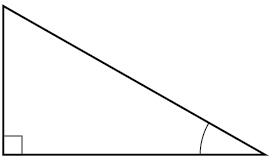 

* * *
{: data-type="newline"}

  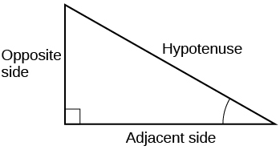 

When a right triangle with a hypotenuse of 1 is placed in a circle of radius 1, which sides of the triangle correspond to the *x*- and *y*-coordinates?

The tangent of an angle compares which sides of the right triangle?

The tangent of an angle is the ratio of the opposite side to the adjacent side.

What is the relationship between the two acute angles in a right triangle?

Explain the cofunction identity.

For example, the sine of an angle is equal to the cosine of its complement; the cosine of an angle is equal to the sine of its complement.

## Algebraic

For the following exercises, use cofunctions of complementary angles.

<math xmlns="http://www.w3.org/1998/Math/MathML"> <mrow> <mi>cos</mi><mrow><mo>(</mo> <mrow> <mn>34°</mn> </mrow> <mo>)</mo></mrow><mo>=</mo><mi>sin</mi><mrow><mo>(</mo> <mrow> <mo>\_\_\_°</mo> </mrow> <mo>)</mo></mrow> </mrow> </math>

<math xmlns="http://www.w3.org/1998/Math/MathML"> <mrow> <mi>cos</mi><mrow><mo>(</mo> <mrow> <mfrac> <mi>π</mi> <mn>3</mn> </mfrac> </mrow> <mo>)</mo></mrow><mo>=</mo><mi>sin</mi><mrow><mo>(</mo> <mrow> <mo>\_\_\_</mo> </mrow> <mo>)</mo></mrow> </mrow> </math>

<math xmlns="http://www.w3.org/1998/Math/MathML"> <mrow> <mfrac> <mi>π</mi> <mn>6</mn> </mfrac> </mrow> </math>

<math xmlns="http://www.w3.org/1998/Math/MathML"> <mrow> <mi>csc</mi><mrow><mo>(</mo> <mrow> <mn>21°</mn> </mrow> <mo>)</mo></mrow><mo>=</mo><mi>sec</mi><mrow><mo>(</mo> <mrow> <mo>\_\_\_°</mo> </mrow> <mo>)</mo></mrow> </mrow> </math>

<math xmlns="http://www.w3.org/1998/Math/MathML"> <mrow> <mi>tan</mi><mrow><mo>(</mo> <mrow> <mfrac> <mi>π</mi> <mn>4</mn> </mfrac> </mrow> <mo>)</mo></mrow><mo>=</mo><mi>cot</mi><mrow><mo>(</mo> <mrow> <mo>\_\_\_</mo> </mrow> <mo>)</mo></mrow> </mrow> </math>

<math xmlns="http://www.w3.org/1998/Math/MathML"> <mrow> <mfrac> <mi>π</mi> <mn>4</mn> </mfrac> </mrow> </math>

For the following exercises, find the lengths of the missing sides if side<math xmlns="http://www.w3.org/1998/Math/MathML"> <mrow> <mtext> </mtext><mi>a</mi><mtext> </mtext> </mrow> </math>

is opposite angle<math xmlns="http://www.w3.org/1998/Math/MathML"> <mrow> <mtext> </mtext><mi>A</mi><mo>,</mo> </mrow> </math>

side<math xmlns="http://www.w3.org/1998/Math/MathML"> <mrow> <mtext> </mtext><mi>b</mi><mtext> </mtext> </mrow> </math>

is opposite angle<math xmlns="http://www.w3.org/1998/Math/MathML"> <mrow> <mtext> </mtext><mi>B</mi><mo>,</mo> </mrow> </math>

and side<math xmlns="http://www.w3.org/1998/Math/MathML"> <mrow> <mtext> </mtext><mi>c</mi><mtext> </mtext> </mrow> </math>

is the hypotenuse.

<math xmlns="http://www.w3.org/1998/Math/MathML"> <mrow> <mi>cos</mi><mtext> </mtext><mi>B</mi><mo>=</mo><mfrac> <mn>4</mn> <mn>5</mn> </mfrac> <mo>,</mo><mi>a</mi><mo>=</mo><mn>10</mn></mrow> </math>

<math xmlns="http://www.w3.org/1998/Math/MathML"> <mrow> <mi>sin</mi><mtext> </mtext><mi>B</mi><mo>=</mo><mfrac> <mn>1</mn> <mn>2</mn> </mfrac> <mo>,</mo><mi>a</mi><mo>=</mo><mn>20</mn></mrow> </math>

<math xmlns="http://www.w3.org/1998/Math/MathML"> <mrow> <mi>b</mi><mo>=</mo><mfrac> <mrow> <mn>20</mn><msqrt> <mn>3</mn> </msqrt> </mrow> <mn>3</mn> </mfrac> <mo>,</mo><mi>c</mi><mo>=</mo><mfrac> <mrow> <mn>40</mn><msqrt> <mn>3</mn> </msqrt> </mrow> <mn>3</mn> </mfrac> </mrow> </math>

<math xmlns="http://www.w3.org/1998/Math/MathML"> <mrow> <mi>tan</mi><mtext> </mtext><mi>A</mi><mo>=</mo><mfrac> <mn>5</mn> <mrow> <mn>12</mn></mrow> </mfrac> <mo>,</mo><mi>b</mi><mo>=</mo><mn>6</mn></mrow> </math>

<math xmlns="http://www.w3.org/1998/Math/MathML"> <mrow> <mi>tan</mi><mtext> </mtext><mi>A</mi><mo>=</mo><mn>100</mn><mo>,</mo><mi>b</mi><mo>=</mo><mn>100</mn></mrow> </math>

<math xmlns="http://www.w3.org/1998/Math/MathML"> <mrow> <mi>a</mi><mo>=</mo><mn>10,000</mn><mo>,</mo><mi>c</mi><mo>=</mo><mn>10,00.5</mn> </mrow> </math>

<math xmlns="http://www.w3.org/1998/Math/MathML"> <mrow> <mi>sin</mi><mtext> </mtext><mi>B</mi><mo>=</mo><mfrac> <mn>1</mn> <mrow> <msqrt> <mn>3</mn> </msqrt> </mrow> </mfrac> <mo>,</mo><mi>a</mi><mo>=</mo><mn>2</mn></mrow> </math>

<math xmlns="http://www.w3.org/1998/Math/MathML"> <mrow> <mi>a</mi><mo>=</mo><mn>5</mn><mo>,</mo><mo>∡</mo><mtext> </mtext><mi>A</mi><mo>=</mo><mn>60°</mn></mrow> </math>

<math xmlns="http://www.w3.org/1998/Math/MathML"> <mrow> <mi>b</mi><mo>=</mo><mfrac> <mrow> <mn>5</mn><msqrt> <mn>3</mn> </msqrt> </mrow> <mn>3</mn> </mfrac> <mo>,</mo><mi>c</mi><mo>=</mo><mfrac> <mrow> <mn>10</mn><msqrt> <mn>3</mn> </msqrt> </mrow> <mn>3</mn> </mfrac> </mrow> </math>

<math xmlns="http://www.w3.org/1998/Math/MathML"> <mrow> <mi>c</mi><mo>=</mo><mn>12</mn><mo>,</mo><mo>∡</mo><mtext> </mtext><mi>A</mi><mo>=</mo><mn>45°</mn></mrow> </math>

## Graphical

For the following exercises, use [\[link\]](#Figure_07_04_203) to evaluate each trigonometric function of angle<math xmlns="http://www.w3.org/1998/Math/MathML"> <mrow> <mtext> </mtext><mi>A</mi><mo>.</mo> </mrow> </math>

 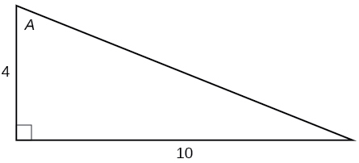{: #Figure_07_04_203}

<math xmlns="http://www.w3.org/1998/Math/MathML"> <mrow> <mi>sin</mi><mtext> </mtext><mi>A</mi> </mrow> </math>

<math xmlns="http://www.w3.org/1998/Math/MathML"> <mrow> <mfrac> <mrow> <mn>5</mn><msqrt> <mrow> <mn>29</mn> </mrow> </msqrt> </mrow> <mrow> <mn>29</mn> </mrow> </mfrac> </mrow> </math>

<math xmlns="http://www.w3.org/1998/Math/MathML"> <mrow> <mi>cos</mi><mtext> </mtext><mi>A</mi> </mrow> </math>

<math xmlns="http://www.w3.org/1998/Math/MathML"> <mrow> <mi>tan</mi><mtext> </mtext><mi>A</mi> </mrow> </math>

<math xmlns="http://www.w3.org/1998/Math/MathML"> <mrow> <mfrac> <mn>5</mn> <mn>2</mn> </mfrac> </mrow> </math>

<math xmlns="http://www.w3.org/1998/Math/MathML"> <mrow> <mi>csc</mi><mtext> </mtext><mi>A</mi> </mrow> </math>

<math xmlns="http://www.w3.org/1998/Math/MathML"> <mrow> <mi>sec</mi><mtext> </mtext><mi>A</mi> </mrow> </math>

<math xmlns="http://www.w3.org/1998/Math/MathML"> <mrow> <mfrac> <mrow> <msqrt> <mrow> <mn>29</mn> </mrow> </msqrt> </mrow> <mn>2</mn> </mfrac> </mrow> </math>

<math xmlns="http://www.w3.org/1998/Math/MathML"> <mrow> <mi>cot</mi><mtext> </mtext><mi>A</mi> </mrow> </math>

For the following exercises, use [\[link\]](#Figure_07_04_204) to evaluate each trigonometric function of angle<math xmlns="http://www.w3.org/1998/Math/MathML"> <mrow> <mtext> </mtext><mi>A</mi><mo>.</mo> </mrow> </math>

 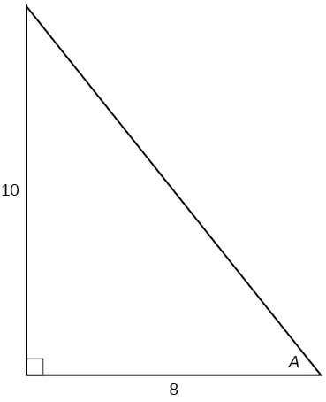{: #Figure_07_04_204}

<math xmlns="http://www.w3.org/1998/Math/MathML"> <mrow> <mi>sin</mi><mtext> </mtext><mi>A</mi> </mrow> </math>

<math xmlns="http://www.w3.org/1998/Math/MathML"> <mrow> <mfrac> <mrow> <mn>5</mn><msqrt> <mrow> <mn>41</mn> </mrow> </msqrt> </mrow> <mrow> <mn>41</mn> </mrow> </mfrac> </mrow> </math>

<math xmlns="http://www.w3.org/1998/Math/MathML"> <mrow> <mi>cos</mi><mtext> </mtext><mi>A</mi> </mrow> </math>

<math xmlns="http://www.w3.org/1998/Math/MathML"> <mrow> <mi>tan</mi><mtext> </mtext><mi>A</mi> </mrow> </math>

<math xmlns="http://www.w3.org/1998/Math/MathML"> <mrow> <mfrac> <mn>5</mn> <mn>4</mn> </mfrac> </mrow> </math>

<math xmlns="http://www.w3.org/1998/Math/MathML"> <mrow> <mi>csc</mi><mtext> </mtext><mi>A</mi> </mrow> </math>

<math xmlns="http://www.w3.org/1998/Math/MathML"> <mrow> <mi>sec</mi><mtext> </mtext><mi>A</mi> </mrow> </math>

<math xmlns="http://www.w3.org/1998/Math/MathML"> <mrow> <mfrac> <mrow> <msqrt> <mrow> <mn>41</mn> </mrow> </msqrt> </mrow> <mn>4</mn> </mfrac> </mrow> </math>

<math xmlns="http://www.w3.org/1998/Math/MathML"> <mrow> <mi>cot</mi><mtext> </mtext><mi>A</mi> </mrow> </math>

For the following exercises, solve for the unknown sides of the given triangle.

  

<math xmlns="http://www.w3.org/1998/Math/MathML"> <mrow> <mi>c</mi><mo>=</mo><mn>14</mn><mo>,</mo><mi>b</mi><mo>=</mo><mn>7</mn><msqrt> <mn>3</mn> </msqrt> </mrow> </math>

 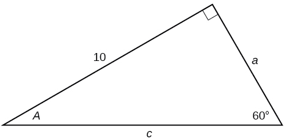 

 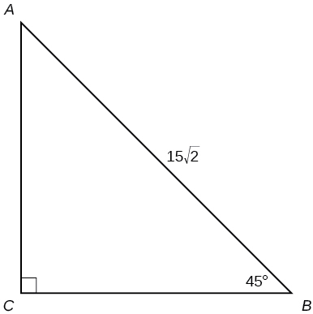 

<math xmlns="http://www.w3.org/1998/Math/MathML"> <mrow> <mi>a</mi><mo>=</mo><mn>15</mn><mo>,</mo><mi>b</mi><mo>=</mo><mn>15</mn> </mrow> </math>

## Technology

For the following exercises, use a calculator to find the length of each side to four decimal places.

 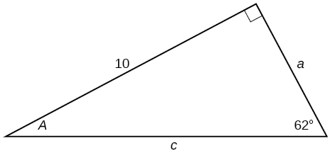 

 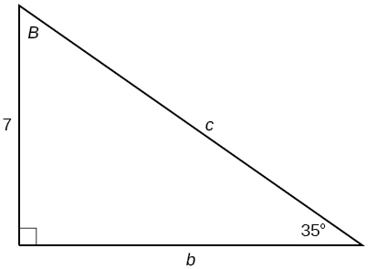 

<math xmlns="http://www.w3.org/1998/Math/MathML"> <mrow> <mi>b</mi><mo>=</mo><mn>9.9970</mn><mo>,</mo><mi>c</mi><mo>=</mo><mn>12.2041</mn> </mrow> </math>

 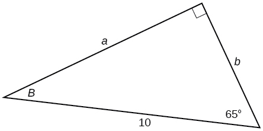 

 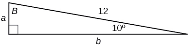 

<math xmlns="http://www.w3.org/1998/Math/MathML"> <mrow> <mi>a</mi><mo>=</mo><mn>2.0838</mn><mo>,</mo><mi>b</mi><mo>=</mo><mn>11.8177</mn> </mrow> </math>

 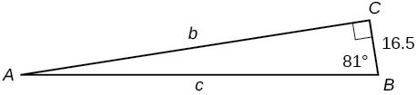 

<math xmlns="http://www.w3.org/1998/Math/MathML"> <mrow> <mi>b</mi><mo>=</mo><mn>15</mn><mo>,</mo><mo>∡</mo><mtext> </mtext><mi>B</mi><mo>=</mo><mn>15°</mn></mrow> </math>

<math xmlns="http://www.w3.org/1998/Math/MathML"> <mrow> <mi>a</mi><mo>=</mo><mn>55.9808</mn><mo>,</mo><mi>c</mi><mo>=</mo><mn>57.9555</mn> </mrow> </math>

<math xmlns="http://www.w3.org/1998/Math/MathML"> <mrow> <mi>c</mi><mo>=</mo><mn>200</mn><mo>,</mo><mo>∡</mo><mtext> </mtext><mi>B</mi><mo>=</mo><mn>5°</mn></mrow> </math>

<math xmlns="http://www.w3.org/1998/Math/MathML"> <mrow> <mi>c</mi><mo>=</mo><mn>50</mn><mo>,</mo><mo>∡</mo><mtext> </mtext><mi>B</mi><mo>=</mo><mn>21°</mn></mrow> </math>

<math xmlns="http://www.w3.org/1998/Math/MathML"> <mrow> <mi>a</mi><mo>=</mo><mn>46.6790</mn><mo>,</mo><mi>b</mi><mo>=</mo><mn>17.9184</mn> </mrow> </math>

<math xmlns="http://www.w3.org/1998/Math/MathML"> <mrow> <mi>a</mi><mo>=</mo><mn>30</mn><mo>,</mo><mo>∡</mo><mtext> </mtext><mi>A</mi><mo>=</mo><mn>27°</mn></mrow> </math>

<math xmlns="http://www.w3.org/1998/Math/MathML"> <mrow> <mi>b</mi><mo>=</mo><mn>3.5</mn><mo>,</mo><mo>∡</mo><mtext> </mtext><mi>A</mi><mo>=</mo><mn>78°</mn></mrow> </math>

<math xmlns="http://www.w3.org/1998/Math/MathML"> <mrow> <mi>a</mi><mo>=</mo><mn>16.4662</mn><mo>,</mo><mi>c</mi><mo>=</mo><mn>16.8341</mn> </mrow> </math>

## Extensions

Find<math xmlns="http://www.w3.org/1998/Math/MathML"> <mrow> <mtext> </mtext><mi>x</mi><mo>.</mo> </mrow> </math>

* * *
{: data-type="newline"}

  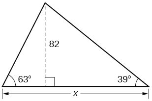 

Find<math xmlns="http://www.w3.org/1998/Math/MathML"> <mrow> <mtext> </mtext><mi>x</mi><mo>.</mo> </mrow> </math>

* * *
{: data-type="newline"}

  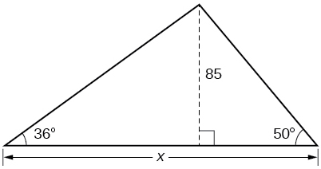 

188\.3159

Find<math xmlns="http://www.w3.org/1998/Math/MathML"> <mrow> <mtext> </mtext><mi>x</mi><mo>.</mo> </mrow> </math>

* * *
{: data-type="newline"}

  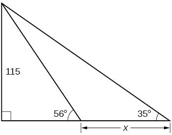 

Find<math xmlns="http://www.w3.org/1998/Math/MathML"> <mrow> <mtext> </mtext><mi>x</mi><mo>.</mo> </mrow> </math>

* * *
{: data-type="newline"}

  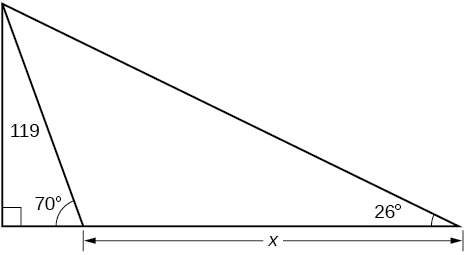 

200\.6737

A radio tower is located 400 feet from a building. From a window in the building, a person determines that the angle of elevation to the top of the tower is<math xmlns="http://www.w3.org/1998/Math/MathML"> <mrow> <mtext> </mtext><mn>36°</mn><mo>,</mo> </mrow> </math>

and that the angle of depression to the bottom of the tower is<math xmlns="http://www.w3.org/1998/Math/MathML"> <mrow> <mtext> </mtext><mn>23°</mn><mo>.</mo><mtext> </mtext> </mrow> </math>

How tall is the tower?

A radio tower is located 325 feet from a building. From a window in the building, a person determines that the angle of elevation to the top of the tower is<math xmlns="http://www.w3.org/1998/Math/MathML"> <mrow> <mtext> </mtext><mn>43°</mn><mo>,</mo> </mrow> </math>

and that the angle of depression to the bottom of the tower is<math xmlns="http://www.w3.org/1998/Math/MathML"> <mrow> <mtext> </mtext><mn>31°</mn><mo>.</mo><mtext> </mtext> </mrow> </math>

How tall is the tower?

498\.3471 ft

A 200-foot tall monument is located in the distance. From a window in a building, a person determines that the angle of elevation to the top of the monument is<math xmlns="http://www.w3.org/1998/Math/MathML"> <mrow> <mtext> </mtext><mn>15°</mn><mo /><mo>,</mo> </mrow> </math>

and that the angle of depression to the bottom of the tower is<math xmlns="http://www.w3.org/1998/Math/MathML"> <mrow> <mtext> </mtext><mn>2°</mn><mo>.</mo><mtext> </mtext> </mrow> </math>

How far is the person from the monument?

A 400-foot tall monument is located in the distance. From a window in a building, a person determines that the angle of elevation to the top of the monument is<math xmlns="http://www.w3.org/1998/Math/MathML"> <mrow> <mtext> </mtext><mn>18°</mn><mo>,</mo> </mrow> </math>

and that the angle of depression to the bottom of the tower is<math xmlns="http://www.w3.org/1998/Math/MathML"> <mrow> <mtext> </mtext><mn>3°</mn><mo>.</mo><mtext> </mtext> </mrow> </math>

How far is the person from the monument?

1060\.09 ft

There is an antenna on the top of a building. From a location 300 feet from the base of the building, the angle of elevation to the top of the building is measured to be<math xmlns="http://www.w3.org/1998/Math/MathML"> <mrow> <mtext> </mtext><mn>40°</mn><mo>.</mo><mtext> </mtext> </mrow> </math>

From the same location, the angle of elevation to the top of the antenna is measured to be<math xmlns="http://www.w3.org/1998/Math/MathML"> <mrow> <mtext> </mtext><mn>43°</mn><mo>.</mo><mtext> </mtext> </mrow> </math>

Find the height of the antenna.

There is lightning rod on the top of a building. From a location 500 feet from the base of the building, the angle of elevation to the top of the building is measured to be<math xmlns="http://www.w3.org/1998/Math/MathML"> <mrow> <mtext> </mtext><mn>36°</mn><mo>.</mo><mtext> </mtext> </mrow> </math>

From the same location, the angle of elevation to the top of the lightning rod is measured to be<math xmlns="http://www.w3.org/1998/Math/MathML"> <mrow> <mtext> </mtext><mn>38°</mn><mo>.</mo><mtext> </mtext> </mrow> </math>

Find the height of the lightning rod.

27\.372 ft

## Real-World Applications

A 33-ft ladder leans against a building so that the angle between the ground and the ladder is<math xmlns="http://www.w3.org/1998/Math/MathML"> <mrow> <mtext> </mtext><mn>80°</mn><mo>.</mo><mtext> </mtext> </mrow> </math>

How high does the ladder reach up the side of the building?

A 23-ft ladder leans against a building so that the angle between the ground and the ladder is<math xmlns="http://www.w3.org/1998/Math/MathML"> <mrow> <mtext> </mtext><mn>80°</mn><mo>.</mo><mtext> </mtext> </mrow> </math>

How high does the ladder reach up the side of the building?

22\.6506 ft  

The angle of elevation to the top of a building in New York is found to be 9 degrees from the ground at a distance of 1 mile from the base of the building. Using this information, find the height of the building.

The angle of elevation to the top of a building in Seattle is found to be 2 degrees from the ground at a distance of 2 miles from the base of the building. Using this information, find the height of the building.

368\.7633 ft

Assuming that a 370-foot tall giant redwood grows vertically, if I walk a certain distance from the tree and measure the angle of elevation to the top of the tree to be<math xmlns="http://www.w3.org/1998/Math/MathML"> <mrow> <mtext> </mtext><mn>60°</mn><mo>,</mo> </mrow> </math>

how far from the base of the tree am I?

[1]: http://openstaxcollege.org/l/findtrigcal
[2]: http://openstaxcollege.org/l/trigrttri
[3]: http://openstaxcollege.org/l/reltrigtri
[4]: http://openstaxcollege.org/l/sixtrigfunc
[5]: http://openstaxcollege.org/l/rttriside
