

In this section you will:
* Find function values for the sine and cosine of
  <math xmlns="http://www.w3.org/1998/Math/MathML" display="block"> <mrow> <mtext> </mtext><mn>30°</mn><mtext> or </mtext><mrow><mo>(</mo> <mrow> <mfrac> <mi>π</mi> <mn>6</mn> </mfrac> </mrow> <mo>)</mo></mrow><mo>,</mo><mn>45°</mn><mtext> or </mtext><mrow><mo>(</mo> <mrow> <mfrac> <mi>π</mi> <mn>4</mn> </mfrac> </mrow> <mo>)</mo></mrow><mo>,</mo> </mrow> </math>
  
  and
  <math xmlns="http://www.w3.org/1998/Math/MathML"> <mrow> <mtext> </mtext><msup> <mrow> <mn>60</mn> </mrow> <mo>∘</mo> </msup> <mtext> or </mtext><mrow><mo>(</mo> <mrow> <mfrac> <mi>π</mi> <mn>3</mn> </mfrac> </mrow> <mo>)</mo></mrow><mo>.</mo> </mrow> </math>

* Identify the domain and range of sine and cosine functions.
* Find reference angles.
* Use reference angles to evaluate trigonometric functions.

  "){: #Figure_07_03_001}

Looking for a thrill? Then consider a ride on the Singapore Flyer, the world’s tallest Ferris wheel. Located in Singapore, the Ferris wheel soars to a height of 541 feet—a little more than a tenth of a mile! Described as an observation wheel, riders enjoy spectacular views as they travel from the ground to the peak and down again in a repeating pattern. In this section, we will examine this type of revolving motion around a circle. To do so, we need to define the type of circle first, and then place that circle on a coordinate system. Then we can discuss circular motion in terms of the coordinate pairs.

### Finding Trigonometric Functions Using the Unit Circle

We have already defined the trigonometric functions in terms of right triangles. In this section, we will redefine them in terms of the unit circle. Recall that a unit circle is a circle centered at the origin with radius 1, as shown in [\[link\]](#Figure_07_03_002). The angle (in radians) that<math xmlns="http://www.w3.org/1998/Math/MathML"> <mrow> <mtext> </mtext><mi>t</mi><mtext> </mtext> </mrow> </math>

intercepts forms an arc of length<math xmlns="http://www.w3.org/1998/Math/MathML"> <mrow> <mtext> </mtext><mi>s</mi><mo>.</mo><mtext> </mtext> </mrow> </math>

Using the formula<math xmlns="http://www.w3.org/1998/Math/MathML"> <mrow> <mtext> </mtext><mi>s</mi><mo>=</mo><mi>r</mi><mi>t</mi><mo>,</mo> </mrow> </math>

and knowing that<math xmlns="http://www.w3.org/1998/Math/MathML"> <mrow> <mtext> </mtext><mi>r</mi><mo>=</mo><mn>1</mn><mo>,</mo> </mrow> </math>

we see that for a unit circle,<math xmlns="http://www.w3.org/1998/Math/MathML"> <mrow> <mtext> </mtext><mi>s</mi><mo>=</mo><mi>t</mi><mo>.</mo> </mrow> </math>

The *x-* and *y-*axes divide the coordinate plane into four quarters called quadrants. We label these quadrants to mimic the direction a positive angle would sweep. The four quadrants are labeled I, II, III, and IV.

For any angle<math xmlns="http://www.w3.org/1998/Math/MathML"> <mrow> <mtext> </mtext><mi>t</mi><mo>,</mo> </mrow> </math>

we can label the intersection of the terminal side and the unit circle as by its coordinates,<math xmlns="http://www.w3.org/1998/Math/MathML"> <mrow> <mtext> </mtext><mrow><mo>(</mo> <mrow> <mi>x</mi><mo>,</mo><mi>y</mi> </mrow> <mo>)</mo></mrow><mo>.</mo><mtext> </mtext> </mrow> </math>

The coordinates<math xmlns="http://www.w3.org/1998/Math/MathML"> <mrow> <mtext> </mtext><mi>x</mi><mtext> </mtext> </mrow> </math>

and<math xmlns="http://www.w3.org/1998/Math/MathML"> <mrow> <mtext> </mtext><mi>y</mi><mtext> </mtext> </mrow> </math>

will be the outputs of the trigonometric functions<math xmlns="http://www.w3.org/1998/Math/MathML"> <mrow> <mtext> </mtext><mi>f</mi><mo stretchy="false">(</mo><mi>t</mi><mo stretchy="false">)</mo><mo>=</mo><mi>cos</mi><mtext> </mtext><mi>t</mi><mtext> </mtext></mrow> </math>

and<math xmlns="http://www.w3.org/1998/Math/MathML"> <mrow> <mtext> </mtext><mi>f</mi><mo stretchy="false">(</mo><mi>t</mi><mo stretchy="false">)</mo><mo>=</mo><mi>sin</mi><mtext> </mtext><mi>t</mi><mo>,</mo></mrow> </math>

respectively. This means<math xmlns="http://www.w3.org/1998/Math/MathML"> <mrow> <mspace width="0.3em" /><mi>x</mi><mo>=</mo><mtext>cos </mtext><mi>t</mi><mspace width="0.3em" /></mrow> </math>

and<math xmlns="http://www.w3.org/1998/Math/MathML"> <mrow> <mspace width="0.3em" /><mi>y</mi><mo>=</mo><mtext>sin </mtext><mi>t</mi><mo>.</mo></mrow> </math>

{: #Figure_07_03_002}

Unit Circle

A **unit circle**{: data-type="term"} has a center at<math xmlns="http://www.w3.org/1998/Math/MathML"> <mrow> <mtext> </mtext><mo stretchy="false">(</mo><mn>0</mn><mo>,</mo><mn>0</mn><mo stretchy="false">)</mo><mtext> </mtext> </mrow> </math>

and radius<math xmlns="http://www.w3.org/1998/Math/MathML"> <mrow> <mtext> </mtext><mn>1.</mn><mtext> </mtext> </mrow> </math>

In a unit circle, the length of the intercepted arc is equal to the radian measure of the central angle<math xmlns="http://www.w3.org/1998/Math/MathML"> <mrow> <mtext> </mtext><mi>t</mi><mo>.</mo> </mrow> </math>

Let<math xmlns="http://www.w3.org/1998/Math/MathML"> <mrow> <mtext> </mtext><mrow><mo>(</mo> <mrow> <mi>x</mi><mo>,</mo><mi>y</mi> </mrow> <mo>)</mo></mrow><mtext> </mtext> </mrow> </math>

be the endpoint on the unit circle of an arc of **arc length**{: data-type="term" .no-emphasis}<math xmlns="http://www.w3.org/1998/Math/MathML"> <mrow> <mtext> </mtext><mi>s</mi><mo>.</mo><mtext> </mtext> </mrow> </math>

The<math xmlns="http://www.w3.org/1998/Math/MathML"> <mrow> <mtext> </mtext><mrow><mo>(</mo> <mrow> <mi>x</mi><mo>,</mo><mi>y</mi> </mrow> <mo>)</mo></mrow><mtext> </mtext> </mrow> </math>

coordinates of this point can be described as functions of the angle.

#### Defining Sine and Cosine Functions from the Unit Circle

The sine function relates a real number<math xmlns="http://www.w3.org/1998/Math/MathML"> <mrow> <mtext> </mtext><mi>t</mi><mtext> </mtext> </mrow> </math>

to the *y*-coordinate of the point where the corresponding angle intercepts the unit circle. More precisely, the sine of an angle<math xmlns="http://www.w3.org/1998/Math/MathML"> <mrow> <mtext> </mtext><mi>t</mi><mtext> </mtext> </mrow> </math>

equals the *y*-value of the endpoint on the unit circle of an arc of length<math xmlns="http://www.w3.org/1998/Math/MathML"> <mrow> <mtext> </mtext><mi>t</mi><mo>.</mo><mtext> </mtext> </mrow> </math>

In [\[link\]](#Figure_07_03_002), the sine is equal to<math xmlns="http://www.w3.org/1998/Math/MathML"> <mrow> <mtext> </mtext><mi>y</mi><mo>.</mo><mtext> </mtext> </mrow> </math>

Like all functions, the **sine function**{: data-type="term"} has an input and an output. Its input is the measure of the angle; its output is the *y*-coordinate of the corresponding point on the unit circle.

The **cosine function**{: data-type="term"} of an angle<math xmlns="http://www.w3.org/1998/Math/MathML"> <mrow> <mtext> </mtext><mi>t</mi><mtext> </mtext> </mrow> </math>

equals the *x*-value of the endpoint on the unit circle of an arc of length<math xmlns="http://www.w3.org/1998/Math/MathML"> <mrow> <mtext> </mtext><mi>t</mi><mo>.</mo><mtext> </mtext> </mrow> </math>

In [\[link\]](#Figure_07_03_003), the cosine is equal to<math xmlns="http://www.w3.org/1998/Math/MathML"> <mrow> <mtext> </mtext><mi>x</mi><mo>.</mo> </mrow> </math>

 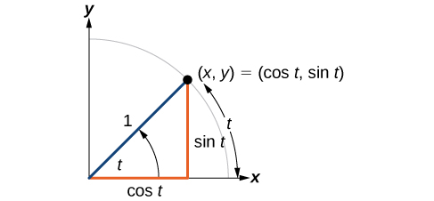{: #Figure_07_03_003}

Because it is understood that sine and cosine are functions, we do not always need to write them with parentheses:<math xmlns="http://www.w3.org/1998/Math/MathML"> <mrow> <mtext> </mtext><mi>sin</mi><mtext> </mtext><mi>t</mi><mtext> </mtext></mrow> </math>

is the same as<math xmlns="http://www.w3.org/1998/Math/MathML"> <mrow> <mtext> </mtext><mi>sin</mi><mo stretchy="false">(</mo><mi>t</mi><mo stretchy="false">)</mo><mtext> </mtext> </mrow> </math>

and<math xmlns="http://www.w3.org/1998/Math/MathML"> <mrow> <mtext> </mtext><mi>cos</mi><mi>t</mi><mtext> </mtext> </mrow> </math>

is the same as<math xmlns="http://www.w3.org/1998/Math/MathML"> <mrow> <mtext> </mtext><mi>cos</mi><mo stretchy="false">(</mo><mi>t</mi><mo stretchy="false">)</mo><mo>.</mo><mtext> </mtext> </mrow> </math>

Likewise,<math xmlns="http://www.w3.org/1998/Math/MathML"> <mrow> <mtext> </mtext><msup> <mrow> <mi>cos</mi> </mrow> <mn>2</mn> </msup> <mi>t</mi><mtext> </mtext> </mrow> </math>

is a commonly used shorthand notation for<math xmlns="http://www.w3.org/1998/Math/MathML"> <mrow> <mtext> </mtext><msup> <mrow> <mo stretchy="false">(</mo><mi>cos</mi><mo stretchy="false">(</mo><mi>t</mi><mo stretchy="false">)</mo><mo stretchy="false">)</mo> </mrow> <mn>2</mn> </msup> <mo>.</mo><mtext> </mtext> </mrow> </math>

Be aware that many calculators and computers do not recognize the shorthand notation. When in doubt, use the extra parentheses when entering calculations into a calculator or computer.

Sine and Cosine Functions

If<math xmlns="http://www.w3.org/1998/Math/MathML"> <mrow> <mtext> </mtext><mi>t</mi><mtext> </mtext> </mrow> </math>

is a real number and a point<math xmlns="http://www.w3.org/1998/Math/MathML"> <mrow> <mtext> </mtext><mrow><mo>(</mo> <mrow> <mi>x</mi><mo>,</mo><mi>y</mi> </mrow> <mo>)</mo></mrow><mtext> </mtext> </mrow> </math>

on the unit circle corresponds to a central angle<math xmlns="http://www.w3.org/1998/Math/MathML"> <mrow> <mtext> </mtext><mi>t</mi><mo>,</mo> </mrow> </math>

then

<math xmlns="http://www.w3.org/1998/Math/MathML"> <mrow> <mi>cos</mi><mtext> </mtext><mi>t</mi><mo>=</mo><mi>x</mi></mrow> </math>

<math xmlns="http://www.w3.org/1998/Math/MathML"> <mrow> <mi>sin</mi><mtext> </mtext><mi>t</mi><mo>=</mo><mi>y</mi></mrow> </math>

**Given a point *P*<math xmlns="http://www.w3.org/1998/Math/MathML"> <mrow> <mtext> </mtext><mo stretchy="false">(</mo><mi>x</mi><mo>,</mo><mi>y</mi><mo stretchy="false">)</mo><mtext> </mtext> </mrow> </math>

on the unit circle corresponding to an angle of<math xmlns="http://www.w3.org/1998/Math/MathML"> <mrow> <mtext> </mtext><mi>t</mi><mo>,</mo> </mrow> </math>

find the sine and cosine.**

1.  The sine of
    <math xmlns="http://www.w3.org/1998/Math/MathML"> <mrow> <mtext> </mtext><mi>t</mi><mtext> </mtext> </mrow> </math>
    
    is equal to the *y*-coordinate of point
    <math xmlns="http://www.w3.org/1998/Math/MathML"> <mrow> <mtext> </mtext><mi>P</mi><mo>:</mo><mtext>sin </mtext><mi>t</mi><mtext> = </mtext><mi>y</mi><mo>.</mo> </mrow> </math>

2.  The cosine of
    <math xmlns="http://www.w3.org/1998/Math/MathML"> <mrow> <mtext> </mtext><mi>t</mi><mtext> </mtext> </mrow> </math>
    
    is equal to the *x*-coordinate of point
    <math xmlns="http://www.w3.org/1998/Math/MathML"> <mrow> <mtext> </mtext><mi>P</mi><mo>:</mo><mtext>cos</mtext><mo> </mo><mi>t</mi><mo>=</mo><mi>x</mi><mo>.</mo></mrow> </math>
{: type="1"}

Finding Function Values for Sine and Cosine

Point<math xmlns="http://www.w3.org/1998/Math/MathML"> <mrow> <mtext> </mtext><mi>P</mi><mtext> </mtext> </mrow> </math>

is a point on the unit circle corresponding to an angle of<math xmlns="http://www.w3.org/1998/Math/MathML"> <mrow> <mtext> </mtext><mi>t</mi><mo>,</mo> </mrow> </math>

as shown in [[link]](#Figure_07_03_004). Find<math xmlns="http://www.w3.org/1998/Math/MathML"> <mrow> <mtext> </mtext><mi>cos</mi><mo stretchy="false">(</mo><mi>t</mi><mo stretchy="false">)</mo><mtext> </mtext> </mrow> </math>

and<math xmlns="http://www.w3.org/1998/Math/MathML"> <mrow> <mtext> </mtext><mtext>sin</mtext><mo stretchy="false">(</mo><mi>t</mi><mo stretchy="false">)</mo><mo>.</mo> </mrow> </math>

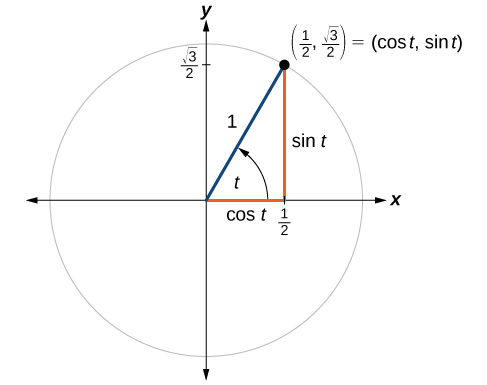{: #Figure_07_03_004}

We know that<math xmlns="http://www.w3.org/1998/Math/MathML"> <mrow> <mtext> </mtext><mi>cos</mi><mtext> </mtext><mi>t</mi><mtext> </mtext> </mrow> </math>

is the *x*-coordinate of the corresponding point on the unit circle and<math xmlns="http://www.w3.org/1998/Math/MathML"> <mrow> <mtext> </mtext><mi>sin</mi><mtext> </mtext><mi>t</mi><mtext> </mtext> </mrow> </math>

is the *y*-coordinate of the corresponding point on the unit circle. So:

<math xmlns="http://www.w3.org/1998/Math/MathML" display="block"> <mrow> <mtable> <mtr> <mtd columnalign="right"> <mi>x</mi> </mtd> <mtd columnalign="left"> <mrow> <mo>=</mo><mi>cos</mi><mtext> </mtext><mi>t</mi></mrow> </mtd> <mtd columnalign="left"> <mrow> <mo>=</mo><mfrac> <mn>1</mn> <mn>2</mn> </mfrac> </mrow> </mtd> </mtr> <mtr> <mtd columnalign="leftt"> <mi>y</mi> </mtd> <mtd columnalign="left"> <mrow> <mo>=</mo><mi>sin</mi><mtext> </mtext><mi>t</mi></mrow> </mtd> <mtd columnalign="left"> <mrow> <mo>=</mo><mfrac> <mrow> <msqrt> <mn>3</mn> </msqrt> </mrow> <mn>2</mn> </mfrac> </mrow> </mtd> </mtr> </mtable></mrow> </math>

A certain angle<math xmlns="http://www.w3.org/1998/Math/MathML"> <mrow> <mtext> </mtext><mi>t</mi><mtext> </mtext> </mrow> </math>

corresponds to a point on the unit circle at<math xmlns="http://www.w3.org/1998/Math/MathML"> <mrow> <mtext> </mtext><mrow><mo>(</mo> <mrow> <mo>−</mo><mfrac> <mrow> <msqrt> <mn>2</mn> </msqrt> </mrow> <mn>2</mn> </mfrac> <mo>,</mo><mfrac> <mrow> <msqrt> <mn>2</mn> </msqrt> </mrow> <mn>2</mn> </mfrac> </mrow> <mo>)</mo></mrow><mtext> </mtext> </mrow> </math>

as shown in [[link]](#Figure_07_03_005). Find<math xmlns="http://www.w3.org/1998/Math/MathML"> <mrow> <mtext> </mtext><mi>cos</mi><mtext> </mtext><mi>t</mi><mtext> </mtext></mrow> </math>

and<math xmlns="http://www.w3.org/1998/Math/MathML"> <mrow> <mtext> </mtext><mi>sin</mi><mtext> </mtext><mi>t</mi><mo>.</mo></mrow> </math>

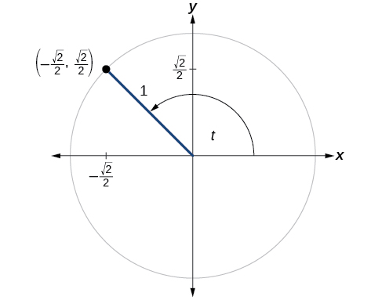{: #Figure_07_03_005}

<math xmlns="http://www.w3.org/1998/Math/MathML"> <mrow> <mi>cos</mi><mo stretchy="false">(</mo><mi>t</mi><mo stretchy="false">)</mo><mo>=</mo><mo>−</mo><mfrac> <mrow> <msqrt> <mn>2</mn> </msqrt> </mrow> <mn>2</mn> </mfrac> <mo>,</mo><mi>sin</mi><mo stretchy="false">(</mo><mi>t</mi><mo stretchy="false">)</mo><mo>=</mo><mfrac> <mrow> <msqrt> <mn>2</mn> </msqrt> </mrow> <mn>2</mn> </mfrac> </mrow> </math>

#### Finding Sines and Cosines of Angles on an Axis

For quadrantral angles, the corresponding point on the unit circle falls on the <em>x- </em>or *y*-axis. In that case, we can easily calculate cosine and sine from the values of<math xmlns="http://www.w3.org/1998/Math/MathML"> <mrow> <mtext> </mtext><mi>x</mi><mtext> </mtext> </mrow> </math>

and<math xmlns="http://www.w3.org/1998/Math/MathML"> <mrow> <mtext> </mtext><mi>y</mi><mo>.</mo> </mrow> </math>

Calculating Sines and Cosines along an Axis

Find<math xmlns="http://www.w3.org/1998/Math/MathML"> <mrow> <mtext> </mtext><mtext>cos</mtext><mo stretchy="false">(</mo><mn>90°</mn><mo stretchy="false">)</mo><mtext> </mtext> </mrow> </math>

and<math xmlns="http://www.w3.org/1998/Math/MathML"> <mrow> <mtext> </mtext><mtext>sin</mtext><mo stretchy="false">(</mo><mn>90°</mn><mo stretchy="false">)</mo><mo>.</mo> </mrow> </math>

Moving<math xmlns="http://www.w3.org/1998/Math/MathML"> <mrow> <mtext> </mtext><mn>90°</mn><mtext> </mtext> </mrow> </math>

counterclockwise around the unit circle from the positive *x*-axis brings us to the top of the circle, where the<math xmlns="http://www.w3.org/1998/Math/MathML"> <mrow> <mtext> </mtext><mo stretchy="false">(</mo><mi>x</mi><mo>,</mo><mi>y</mi><mo stretchy="false">)</mo><mtext> </mtext> </mrow> </math>

coordinates are<math xmlns="http://www.w3.org/1998/Math/MathML"> <mrow> <mtext> </mtext><mo stretchy="false">(</mo><mn>0</mn><mo>,</mo><mn>1</mn><mo stretchy="false">)</mo><mo>,</mo> </mrow> </math>

as shown in [[link]](#Figure_07_03_006).

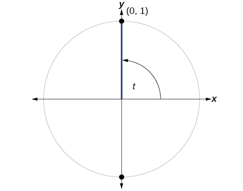{: #Figure_07_03_006}

We can then use our definitions of cosine and sine.

<math xmlns="http://www.w3.org/1998/Math/MathML"> <mrow> <mtable> <mtr> <mtd columnalign="right"> <mi>x</mi> </mtd> <mtd columnalign="left"> <mrow> <mo>=</mo><mtext>cos </mtext><mi>t</mi></mrow> </mtd> <mtd columnalign="left"> <mrow> <mo>=</mo><mi>cos</mi><mo stretchy="false">(</mo><mn>90°</mn><mo stretchy="false">)</mo></mrow> </mtd> <mtd columnalign="left"> <mrow> <mo>=</mo><mn>0</mn></mrow> </mtd> </mtr> <mtr> <mtd columnalign="right"> <mi>y</mi> </mtd> <mtd columnalign="left"> <mrow> <mo>=</mo><mtext>sin </mtext><mi>t</mi></mrow> </mtd> <mtd columnalign="left"> <mrow> <mo>=</mo><mi>sin</mi><mo stretchy="false">(</mo><mn>90°</mn><mo stretchy="false">)</mo></mrow> </mtd> <mtd columnalign="left"> <mrow> <mo>=</mo><mn>1</mn></mrow> </mtd> </mtr> </mtable></mrow> </math>

The cosine of<math xmlns="http://www.w3.org/1998/Math/MathML"> <mrow> <mtext> </mtext><mn>90°</mn><mtext> </mtext> </mrow> </math>

is 0; the sine of<math xmlns="http://www.w3.org/1998/Math/MathML"> <mrow> <mtext> </mtext><mn>90°</mn><mtext> </mtext> </mrow> </math>

is 1.

Find cosine and sine of the angle<math xmlns="http://www.w3.org/1998/Math/MathML"> <mrow> <mtext> </mtext><mi>π</mi><mo>.</mo> </mrow> </math>

<math xmlns="http://www.w3.org/1998/Math/MathML"> <mrow> <mi>cos</mi><mo stretchy="false">(</mo><mi>π</mi><mo stretchy="false">)</mo><mo>=</mo><mo>−</mo><mn>1</mn><mo>,</mo><mi>sin</mi><mo stretchy="false">(</mo><mi>π</mi><mo stretchy="false">)</mo><mo>=</mo><mn>0</mn> </mrow> </math>

#### The Pythagorean Identity

Now that we can define sine and cosine, we will learn how they relate to each other and the unit circle. Recall that the equation for the unit circle is<math xmlns="http://www.w3.org/1998/Math/MathML"> <mrow> <mtext> </mtext><msup> <mi>x</mi> <mn>2</mn> </msup> <mo>+</mo><msup> <mi>y</mi> <mn>2</mn> </msup> <mo>=</mo><mn>1.</mn><mtext> </mtext> </mrow> </math>

Because<math xmlns="http://www.w3.org/1998/Math/MathML"> <mrow> <mtext> </mtext><mi>x</mi><mo>=</mo><mi>cos</mi><mtext> </mtext><mi>t</mi><mtext> </mtext></mrow> </math>

and<math xmlns="http://www.w3.org/1998/Math/MathML"> <mrow> <mtext> </mtext><mi>y</mi><mo>=</mo><mi>sin</mi><mtext> </mtext><mi>t</mi><mo>,</mo></mrow> </math>

we can substitute for<math xmlns="http://www.w3.org/1998/Math/MathML"> <mrow> <mtext> </mtext><mi>x</mi><mtext> </mtext> </mrow> </math>

and<math xmlns="http://www.w3.org/1998/Math/MathML"> <mrow> <mtext> </mtext><mi>y</mi><mtext> </mtext> </mrow> </math>

to get<math xmlns="http://www.w3.org/1998/Math/MathML"> <mrow> <mtext> </mtext><msup> <mrow> <mi>cos</mi> </mrow> <mn>2</mn> </msup> <mi>t</mi><mo>+</mo><msup> <mrow> <mi>sin</mi> </mrow> <mn>2</mn> </msup> <mi>t</mi><mo>=</mo><mn>1.</mn><mtext> </mtext> </mrow> </math>

This equation,<math xmlns="http://www.w3.org/1998/Math/MathML"> <mrow> <mtext> </mtext><msup> <mrow> <mi>cos</mi> </mrow> <mn>2</mn> </msup> <mi>t</mi><mo>+</mo><msup> <mrow> <mi>sin</mi> </mrow> <mn>2</mn> </msup> <mi>t</mi><mo>=</mo><mn>1</mn><mo>,</mo> </mrow> </math>

is known as the **Pythagorean Identity**{: data-type="term" .no-emphasis}. See [\[link\]](#Figure_07_03_007).

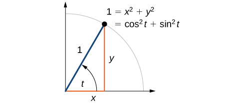{: #Figure_07_03_007}

We can use the Pythagorean Identity to find the cosine of an angle if we know the sine, or vice versa. However, because the equation yields two solutions, we need additional knowledge of the angle to choose the solution with the correct sign. If we know the quadrant where the angle is, we can easily choose the correct solution.

Pythagorean Identity

The **Pythagorean Identity**{: data-type="term"} states that, for any real number<math xmlns="http://www.w3.org/1998/Math/MathML"> <mrow> <mtext> </mtext><mi>t</mi><mo>,</mo> </mrow> </math>

<math xmlns="http://www.w3.org/1998/Math/MathML"> <mrow> <msup> <mrow> <mi>cos</mi> </mrow> <mn>2</mn> </msup> <mi>t</mi><mo>+</mo><msup> <mrow> <mi>sin</mi> </mrow> <mn>2</mn> </msup> <mi>t</mi><mo>=</mo><mn>1</mn> </mrow> </math>

<strong>Given the sine of some angle<math xmlns="http://www.w3.org/1998/Math/MathML">
<mrow>
<mtext> </mtext><mi>t</mi><mtext> </mtext>
</mrow>
</math>and its quadrant location, find the cosine of<math xmlns="http://www.w3.org/1998/Math/MathML">
<mrow>
<mtext> </mtext><mi>t</mi><mo>.</mo>
</mrow>
</math> </strong>

1.  Substitute the known value of
    <math xmlns="http://www.w3.org/1998/Math/MathML"> <mrow> <mtext> </mtext><mi>sin</mi><mtext> </mtext><mi>t</mi><mtext> </mtext> </mrow> </math>
    
    into the Pythagorean Identity.
2.  Solve for
    <math xmlns="http://www.w3.org/1998/Math/MathML"> <mrow> <mtext> </mtext><mi>cos</mi><mtext> </mtext><mi>t</mi><mo>.</mo> </mrow> </math>

3.  Choose the solution with the appropriate sign for the *x*-values in the quadrant where
    <math xmlns="http://www.w3.org/1998/Math/MathML"> <mrow> <mtext> </mtext><mi>t</mi><mtext> </mtext> </mrow> </math>
    
    is located.
{: type="1"}

Finding a Cosine from a Sine or a Sine from a Cosine

If<math xmlns="http://www.w3.org/1998/Math/MathML"> <mrow> <mtext> </mtext><mi>sin</mi><mo stretchy="false">(</mo><mi>t</mi><mo stretchy="false">)</mo><mo>=</mo><mfrac> <mn>3</mn> <mn>7</mn> </mfrac> <mtext> </mtext> </mrow> </math>

and<math xmlns="http://www.w3.org/1998/Math/MathML"> <mrow> <mtext> </mtext><mi>t</mi><mtext> </mtext> </mrow> </math>

is in the second quadrant, find<math xmlns="http://www.w3.org/1998/Math/MathML"> <mrow> <mtext> </mtext><mi>cos</mi><mo stretchy="false">(</mo><mi>t</mi><mo stretchy="false">)</mo><mo>.</mo> </mrow> </math>

If we drop a vertical line from the point on the unit circle corresponding to<math xmlns="http://www.w3.org/1998/Math/MathML"> <mrow> <mtext> </mtext><mi>t</mi><mo>,</mo> </mrow> </math>

we create a right triangle, from which we can see that the Pythagorean Identity is simply one case of the Pythagorean Theorem. See [[link]](#Figure_07_03_008).

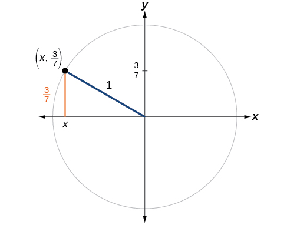{: #Figure_07_03_008}

Substituting the known value for sine into the Pythagorean Identity,

<math xmlns="http://www.w3.org/1998/Math/MathML"> <mrow> <mtable> <mtr> <mtd columnalign="right"> <mrow> <msup> <mrow> <mtext>cos</mtext></mrow> <mn>2</mn> </msup> <mo stretchy="false">(</mo><mi>t</mi><mo stretchy="false">)</mo><mo>+</mo><msup> <mrow> <mi>sin</mi></mrow> <mn>2</mn> </msup> <mo stretchy="false">(</mo><mi>t</mi><mo stretchy="false">)</mo></mrow> </mtd> <mtd> <mo>=</mo> </mtd> <mtd columnalign="left"> <mn>1</mn> </mtd> </mtr> <mtr> <mtd columnalign="right"> <mrow> <msup> <mrow> <mtext>cos</mtext></mrow> <mn>2</mn> </msup> <mo stretchy="false">(</mo><mi>t</mi><mo stretchy="false">)</mo><mo>+</mo><mfrac> <mn>9</mn> <mrow> <mn>49</mn></mrow> </mfrac> </mrow> </mtd> <mtd> <mo>=</mo> </mtd> <mtd columnalign="left"> <mn>1</mn> </mtd> </mtr> <mtr> <mtd columnalign="right"> <mrow> <msup> <mrow> <mtext>cos</mtext></mrow> <mn>2</mn> </msup> <mo stretchy="false">(</mo><mi>t</mi><mo stretchy="false">)</mo></mrow> </mtd> <mtd> <mo>=</mo> </mtd> <mtd columnalign="left"> <mrow> <mfrac> <mrow> <mn>40</mn></mrow> <mrow> <mn>49</mn></mrow> </mfrac> </mrow> </mtd> </mtr> <mtr> <mtd columnalign="right"> <mrow> <mtext>cos</mtext><mo stretchy="false">(</mo><mi>t</mi><mo stretchy="false">)</mo></mrow> </mtd> <mtd> <mo>=</mo> </mtd> <mtd columnalign="left"> <mrow> <mo>±</mo><msqrt> <mrow> <mfrac> <mrow> <mn>40</mn></mrow> <mrow> <mn>49</mn></mrow> </mfrac> </mrow> </msqrt> <mo>=</mo><mo>±</mo><mfrac> <mrow> <msqrt> <mrow> <mn>40</mn></mrow> </msqrt> </mrow> <mn>7</mn> </mfrac> <mo>=</mo><mo>±</mo><mfrac> <mrow> <mn>2</mn><msqrt> <mrow> <mn>10</mn></mrow> </msqrt> </mrow> <mn>7</mn> </mfrac> </mrow> </mtd> </mtr> </mtable></mrow> </math>

Because the angle is in the second quadrant, we know the *x-*value is a negative real number, so the cosine is also negative.

<math xmlns="http://www.w3.org/1998/Math/MathML"> <mrow> <mtext>cos</mtext><mo stretchy="false">(</mo><mi>t</mi><mo stretchy="false">)</mo><mo>=</mo><mo>−</mo><mfrac> <mrow> <mn>2</mn><msqrt> <mrow> <mn>10</mn> </mrow> </msqrt> </mrow> <mn>7</mn> </mfrac> </mrow> </math>

If<math xmlns="http://www.w3.org/1998/Math/MathML"> <mrow> <mtext> </mtext><mi>cos</mi><mo stretchy="false">(</mo><mi>t</mi><mo stretchy="false">)</mo><mo>=</mo><mfrac> <mrow> <mn>24</mn> </mrow> <mrow> <mn>25</mn> </mrow> </mfrac> <mtext> </mtext> </mrow> </math>

and<math xmlns="http://www.w3.org/1998/Math/MathML"> <mrow> <mtext> </mtext><mi>t</mi><mtext> </mtext> </mrow> </math>

is in the fourth quadrant, find<math xmlns="http://www.w3.org/1998/Math/MathML"> <mrow> <mtext> </mtext><mtext>sin</mtext><mo stretchy="false">(</mo><mi>t</mi><mo stretchy="false">)</mo><mo>.</mo> </mrow> </math>

<math xmlns="http://www.w3.org/1998/Math/MathML"> <mrow> <mi>sin</mi><mo stretchy="false">(</mo><mi>t</mi><mo stretchy="false">)</mo><mo>=</mo><mo>−</mo><mfrac> <mn>7</mn> <mrow> <mn>25</mn> </mrow> </mfrac> </mrow> </math>

### Finding Sines and Cosines of Special Angles

We have already learned some properties of the special angles, such as the conversion from radians to degrees, and we found their sines and cosines using right triangles. We can also calculate sines and cosines of the special angles using the Pythagorean Identity.

#### Finding Sines and Cosines of<math xmlns="http://www.w3.org/1998/Math/MathML"> <mrow> <mtext> </mtext><mn>45°</mn><mtext> </mtext> </mrow> </math>

Angles

First, we will look at angles of<math xmlns="http://www.w3.org/1998/Math/MathML"> <mrow> <mtext> </mtext><mn>45°</mn><mtext> </mtext> </mrow> </math>

or<math xmlns="http://www.w3.org/1998/Math/MathML"> <mrow> <mtext> </mtext><mfrac> <mi>π</mi> <mn>4</mn> </mfrac> <mo>,</mo> </mrow> </math>

as shown in [\[link\]](#Figure_07_03_009). A<math xmlns="http://www.w3.org/1998/Math/MathML"> <mrow> <mtext> </mtext><mn>45°</mn><mo>–</mo><mn>45°</mn><mo>–</mo><mn>90°</mn><mtext> </mtext> </mrow> </math>

triangle is an isosceles triangle, so the *x-* and *y*-coordinates of the corresponding point on the circle are the same. Because the *x-* and *y*-values are the same, the sine and cosine values will also be equal.

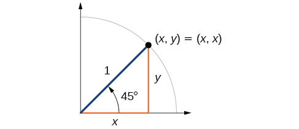{: #Figure_07_03_009}

At<math xmlns="http://www.w3.org/1998/Math/MathML"> <mrow> <mtext> </mtext><mi>t</mi><mo>=</mo><mfrac> <mi>π</mi> <mn>4</mn> </mfrac> <mo>,</mo> </mrow> </math>

which is 45 degrees, the radius of the unit circle bisects the first quadrantal angle. This means the radius lies along the line<math xmlns="http://www.w3.org/1998/Math/MathML"> <mrow> <mtext> </mtext><mi>y</mi><mo>=</mo><mi>x</mi><mo>.</mo><mtext> </mtext> </mrow> </math>

A unit circle has a radius equal to 1 so the right triangle formed below the line<math xmlns="http://www.w3.org/1998/Math/MathML"> <mrow> <mtext> </mtext><mi>y</mi><mo>=</mo><mi>x</mi><mtext> </mtext> </mrow> </math>

has sides<math xmlns="http://www.w3.org/1998/Math/MathML"> <mrow> <mtext> </mtext><mi>x</mi><mtext> </mtext> </mrow> </math>

and<math xmlns="http://www.w3.org/1998/Math/MathML"> <mrow> <mtext> </mtext><mi>y</mi><mtext> </mtext><mo stretchy="false">(</mo><mi>y</mi><mo>=</mo><mi>x</mi><mo stretchy="false">)</mo><mo>,</mo> </mrow> </math>

and radius = 1. See [\[link\]](#Figure_07_03_018).

 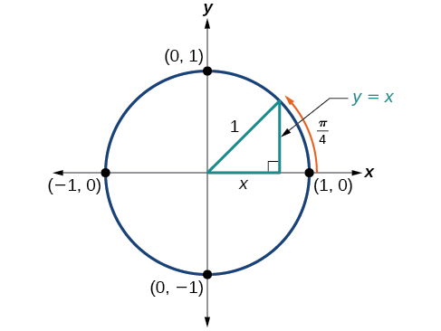{: #Figure_07_03_018}

From the Pythagorean Theorem we get

<math xmlns="http://www.w3.org/1998/Math/MathML"> <mrow> <msup> <mi>x</mi> <mn>2</mn> </msup> <mo>+</mo><msup> <mi>y</mi> <mn>2</mn> </msup> <mo>=</mo><mn>1</mn> </mrow> </math>

We can then substitute<math xmlns="http://www.w3.org/1998/Math/MathML"> <mrow> <mtext> </mtext><mi>y</mi><mo>=</mo><mi>x</mi><mo>.</mo> </mrow> </math>

<math xmlns="http://www.w3.org/1998/Math/MathML"> <mrow> <msup> <mi>x</mi> <mn>2</mn> </msup> <mo>+</mo><msup> <mi>x</mi> <mn>2</mn> </msup> <mo>=</mo><mn>1</mn> </mrow> </math>

Next we combine like terms.

<math xmlns="http://www.w3.org/1998/Math/MathML"> <mrow> <mn>2</mn><msup> <mi>x</mi> <mn>2</mn> </msup> <mo>=</mo><mn>1</mn> </mrow> </math>

And solving for<math xmlns="http://www.w3.org/1998/Math/MathML"> <mrow> <mtext> </mtext><mi>x</mi><mo>,</mo> </mrow> </math>

we get

<math xmlns="http://www.w3.org/1998/Math/MathML"> <mrow> <mtable> <mtr> <mtd columnalign="right"> <mrow> <msup> <mi>x</mi> <mn>2</mn> </msup> </mrow> </mtd> <mtd> <mo>=</mo> </mtd> <mtd columnalign="left"> <mrow> <mfrac> <mn>1</mn> <mn>2</mn> </mfrac> </mrow> </mtd> </mtr> <mtr> <mtd columnalign="right"> <mi>x</mi> </mtd> <mtd> <mo>=</mo> </mtd> <mtd columnalign="left"> <mrow> <mo>±</mo><mfrac> <mn>1</mn> <mrow> <msqrt> <mn>2</mn> </msqrt> </mrow> </mfrac> </mrow> </mtd> </mtr> </mtable></mrow> </math>

In quadrant I,<math xmlns="http://www.w3.org/1998/Math/MathML"> <mrow> <mtext> </mtext><mi>x</mi><mo>=</mo><mfrac> <mn>1</mn> <mrow> <msqrt> <mn>2</mn> </msqrt> </mrow> </mfrac> <mo>.</mo> </mrow> </math>

At<math xmlns="http://www.w3.org/1998/Math/MathML"> <mrow> <mtext> </mtext><mi>t</mi><mo>=</mo><mfrac> <mi>π</mi> <mn>4</mn> </mfrac> <mtext> </mtext> </mrow> </math>

or 45 degrees,

<math xmlns="http://www.w3.org/1998/Math/MathML"> <mrow> <mtable> <mtr> <mtd columnalign="right"> <mrow> <mrow><mo>(</mo> <mrow> <mi>x</mi><mo>,</mo><mi>y</mi></mrow> <mo>)</mo></mrow></mrow> </mtd> <mtd> <mo>=</mo> </mtd> <mtd columnalign="left"> <mrow> <mrow><mo>(</mo> <mrow> <mi>x</mi><mo>,</mo><mi>x</mi></mrow> <mo>)</mo></mrow><mo>=</mo><mrow><mo>(</mo> <mrow> <mfrac> <mn>1</mn> <mrow> <msqrt> <mn>2</mn> </msqrt> </mrow> </mfrac> <mo>,</mo><mfrac> <mn>1</mn> <mrow> <msqrt> <mn>2</mn> </msqrt> </mrow> </mfrac> </mrow> <mo>)</mo></mrow></mrow> </mtd> </mtr> <mtr> <mtd columnalign="right"> <mi>x</mi> </mtd> <mtd> <mo>=</mo> </mtd> <mtd columnalign="left"> <mrow> <mfrac> <mn>1</mn> <mrow> <msqrt> <mn>2</mn> </msqrt> </mrow> </mfrac> <mo>,</mo><mi>y</mi><mo>=</mo><mfrac> <mn>1</mn> <mrow> <msqrt> <mn>2</mn> </msqrt> </mrow> </mfrac> </mrow> </mtd> </mtr> <mtr> <mtd columnalign="right"> <mrow> <mtext>cos </mtext><mi>t</mi></mrow> </mtd> <mtd> <mo>=</mo> </mtd> <mtd columnalign="left"> <mrow> <mfrac> <mn>1</mn> <mrow> <msqrt> <mn>2</mn> </msqrt> </mrow> </mfrac> <mo>,</mo><mtext>sin </mtext><mi>t</mi><mo>=</mo><mfrac> <mn>1</mn> <mrow> <msqrt> <mn>2</mn> </msqrt> </mrow> </mfrac> </mrow> </mtd> </mtr> </mtable></mrow> </math>

If we then rationalize the denominators, we get

<math xmlns="http://www.w3.org/1998/Math/MathML"> <mrow> <mtable> <mtr rowalign="center"> <mtd columnalign="right"> <mrow> <mtext>cos </mtext><mi>t</mi></mrow> </mtd> <mtd rowalign="center"> <mo>=</mo> </mtd> <mtd rowalign="center"> <mrow> <mfrac> <mn>1</mn> <mrow> <msqrt> <mn>2</mn> </msqrt> </mrow> </mfrac> <mfrac> <mrow> <msqrt> <mn>2</mn> </msqrt> </mrow> <mrow> <msqrt> <mn>2</mn> </msqrt> </mrow> </mfrac> </mrow> </mtd> </mtr> <mtr rowalign="center"> <mtd rowalign="center" /> <mtd rowalign="center"><mo>=</mo></mtd> <mtd rowalign="center" columnalign="left"> <mrow> <mfrac> <mrow> <msqrt> <mn>2</mn> </msqrt> </mrow> <mn>2</mn> </mfrac> </mrow> </mtd> </mtr> <mtr rowalign="center" columnalign="right"> <mtd> <mrow> <mtext>sin </mtext><mi>t</mi></mrow> </mtd> <mtd rowalign="center"> <mo>=</mo> </mtd> <mtd rowalign="center" columnalign="left"> <mrow> <mfrac> <mn>1</mn> <mrow> <msqrt> <mn>2</mn> </msqrt> </mrow> </mfrac> <mfrac> <mrow> <msqrt> <mn>2</mn> </msqrt> </mrow> <mrow> <msqrt> <mn>2</mn> </msqrt> </mrow> </mfrac> </mrow> </mtd> </mtr> <mtr rowalign="center"> <mtd rowalign="center" /> <mtd rowalign="center"><mo>=</mo></mtd> <mtd rowalign="center" columnalign="left"> <mrow> <mfrac> <mrow> <msqrt> <mn>2</mn> </msqrt> </mrow> <mn>2</mn> </mfrac> </mrow> </mtd> </mtr> </mtable></mrow> </math>

Therefore, the<math xmlns="http://www.w3.org/1998/Math/MathML"> <mrow> <mtext> </mtext><mo stretchy="false">(</mo><mi>x</mi><mo>,</mo><mi>y</mi><mo stretchy="false">)</mo><mtext> </mtext> </mrow> </math>

coordinates of a point on a circle of radius<math xmlns="http://www.w3.org/1998/Math/MathML"> <mrow> <mtext> </mtext><mn>1</mn><mtext> </mtext> </mrow> </math>

at an angle of<math xmlns="http://www.w3.org/1998/Math/MathML"> <mrow> <mtext> </mtext><mn>45°</mn><mtext> </mtext> </mrow> </math>

are<math xmlns="http://www.w3.org/1998/Math/MathML"> <mrow> <mtext> </mtext><mrow><mo>(</mo> <mrow> <mfrac> <mrow> <msqrt> <mn>2</mn> </msqrt> </mrow> <mn>2</mn> </mfrac> <mo>,</mo><mfrac> <mrow> <msqrt> <mn>2</mn> </msqrt> </mrow> <mn>2</mn> </mfrac> </mrow> <mo>)</mo></mrow><mo>.</mo> </mrow> </math>

#### Finding Sines and Cosines of<math xmlns="http://www.w3.org/1998/Math/MathML"> <mrow> <mtext> </mtext><mn>30°</mn><mtext> </mtext> </mrow> </math>

and<math xmlns="http://www.w3.org/1998/Math/MathML"> <mrow> <mtext> </mtext><mn>60°</mn><mtext> </mtext> </mrow> </math>

Angles 

Next, we will find the cosine and sine at an angle of<math xmlns="http://www.w3.org/1998/Math/MathML"> <mrow> <mtext> </mtext><mn>30°</mn><mo>,</mo> </mrow> </math>

or<math xmlns="http://www.w3.org/1998/Math/MathML"> <mrow> <mtext> </mtext><mfrac> <mi>π</mi> <mn>6</mn> </mfrac> <mo>.</mo><mtext> </mtext> </mrow> </math>

First, we will draw a triangle inside a circle with one side at an angle of<math xmlns="http://www.w3.org/1998/Math/MathML"> <mrow> <mtext> </mtext><mn>30°</mn><mo>,</mo> </mrow> </math>

and another at an angle of<math xmlns="http://www.w3.org/1998/Math/MathML"> <mrow> <mtext> </mtext><mn>−30°</mn><mo>,</mo> </mrow> </math>

as shown in [\[link\]](#Figure_07_03_010). If the resulting two right triangles are combined into one large triangle, notice that all three angles of this larger triangle will be<math xmlns="http://www.w3.org/1998/Math/MathML"> <mrow> <mtext> </mtext><mn>60°</mn><mo>,</mo> </mrow> </math>

as shown in [\[link\]](#Figure_07_03_011).

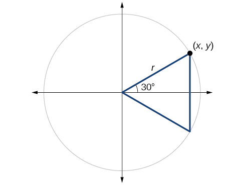{: #Figure_07_03_010}

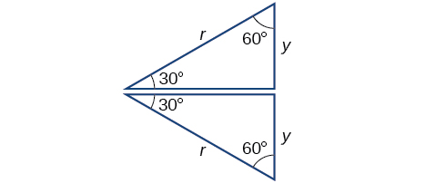{: #Figure_07_03_011}

Because all the angles are equal, the sides are also equal. The vertical line has length<math xmlns="http://www.w3.org/1998/Math/MathML"> <mrow> <mtext> </mtext><mn>2</mn><mi>y</mi><mo>,</mo> </mrow> </math>

and since the sides are all equal, we can also conclude that<math xmlns="http://www.w3.org/1998/Math/MathML"> <mrow> <mtext> </mtext><mi>r</mi><mo>=</mo><mn>2</mn><mi>y</mi><mtext> </mtext> </mrow> </math>

or<math xmlns="http://www.w3.org/1998/Math/MathML"> <mrow> <mtext> </mtext><mi>y</mi><mo>=</mo><mfrac> <mn>1</mn> <mn>2</mn> </mfrac> <mi>r</mi><mo>.</mo><mtext> </mtext> </mrow> </math>

Since<math xmlns="http://www.w3.org/1998/Math/MathML"> <mrow> <mtext> </mtext><mi>sin</mi><mtext> </mtext><mi>t</mi><mo>=</mo><mi>y</mi><mo>,</mo></mrow> </math>

<math xmlns="http://www.w3.org/1998/Math/MathML"> <mrow> <mi>sin</mi><mrow><mo>(</mo> <mrow> <mfrac> <mi>π</mi> <mn>6</mn> </mfrac> </mrow> <mo>)</mo></mrow><mo>=</mo><mfrac> <mn>1</mn> <mn>2</mn> </mfrac> <mi>r</mi> </mrow> </math>

And since<math xmlns="http://www.w3.org/1998/Math/MathML"> <mrow> <mtext> </mtext><mi>r</mi><mo>=</mo><mn>1</mn><mtext> </mtext> </mrow> </math>

in our unit circle,

<math xmlns="http://www.w3.org/1998/Math/MathML"> <mrow> <mtable> <mtr rowalign="center"> <mtd columnalign="right" rowalign="center"> <mrow> <mi>sin</mi><mrow><mo>(</mo> <mrow> <mfrac> <mi>π</mi> <mn>6</mn> </mfrac> </mrow> <mo>)</mo></mrow></mrow> </mtd> <mtd rowalign="center"> <mo>=</mo> </mtd> <mtd rowalign="center" columnalign="left"> <mrow> <mfrac> <mn>1</mn> <mn>2</mn> </mfrac> <mrow><mo>(</mo> <mn>1</mn> <mo>)</mo></mrow></mrow> </mtd> </mtr> <mtr rowalign="center"> <mtd rowalign="center" /> <mtd rowalign="center"><mo>=</mo></mtd> <mtd rowalign="center"> <mrow> <mfrac> <mn>1</mn> <mn>2</mn> </mfrac> </mrow> </mtd> </mtr> </mtable></mrow> </math>

Using the Pythagorean Identity, we can find the cosine value.

<math xmlns="http://www.w3.org/1998/Math/MathML"> <mrow> <mtable> <mtr rowalign="center"> <mtd rowalign="center" columnalign="right"> <mrow> <msup> <mrow> <mi>cos</mi></mrow> <mn>2</mn> </msup> <mrow><mo>(</mo> <mrow> <mfrac> <mi>π</mi> <mn>6</mn> </mfrac> </mrow> <mo>)</mo></mrow><mo>+</mo><msup> <mrow> <mi>sin</mi></mrow> <mn>2</mn> </msup> <mrow><mo>(</mo> <mrow> <mfrac> <mi>π</mi> <mn>6</mn> </mfrac> </mrow> <mo>)</mo></mrow></mrow> </mtd> <mtd rowalign="center"><mo>=</mo></mtd> <mtd rowalign="center" columnalign="left"><mn>1</mn></mtd> <mtd rowalign="center" /> </mtr> <mtr rowalign="center"> <mtd rowalign="center" columnalign="right"> <mrow> <msup> <mrow> <mi>cos</mi></mrow> <mn>2</mn> </msup> <mrow><mo>(</mo> <mrow> <mfrac> <mi>π</mi> <mn>6</mn> </mfrac> </mrow> <mo>)</mo></mrow><mo>+</mo><msup> <mrow> <mrow><mo>(</mo> <mrow> <mfrac> <mn>1</mn> <mn>2</mn> </mfrac> </mrow> <mo>)</mo></mrow></mrow> <mn>2</mn> </msup> </mrow> </mtd> <mtd rowalign="center"><mo>=</mo></mtd> <mtd rowalign="center" columnalign="left"><mn>1</mn></mtd> <mtd rowalign="center" /> </mtr> <mtr rowalign="center"> <mtd rowalign="center" columnalign="right"> <mrow> <msup> <mrow> <mi>cos</mi></mrow> <mn>2</mn> </msup> <mrow><mo>(</mo> <mrow> <mfrac> <mi>π</mi> <mn>6</mn> </mfrac> </mrow> <mo>)</mo></mrow></mrow> </mtd> <mtd rowalign="center"><mo>=</mo></mtd> <mtd rowalign="center" columnalign="left"> <mrow> <mfrac> <mn>3</mn> <mn>4</mn> </mfrac> </mrow> </mtd> <mtd rowalign="center" columnalign="left"> <mrow> <mspace width="1em" /><mtext>Use the square root property</mtext><mo>.</mo></mrow> </mtd> </mtr> <mtr rowalign="center"> <mtd rowalign="center" columnalign="right"> <mrow> <mi>cos</mi><mrow><mo>(</mo> <mrow> <mfrac> <mi>π</mi> <mn>6</mn> </mfrac> </mrow> <mo>)</mo></mrow></mrow> </mtd> <mtd rowalign="center"><mo>=</mo></mtd> <mtd rowalign="center" columnalign="left"> <mrow> <mfrac> <mrow> <mo>±</mo><msqrt> <mn>3</mn> </msqrt> </mrow> <mrow> <mo>±</mo><msqrt> <mn>4</mn> </msqrt> </mrow> </mfrac> <mo>=</mo><mfrac> <mrow> <msqrt> <mn>3</mn> </msqrt> </mrow> <mn>2</mn> </mfrac> </mrow> </mtd> <mtd rowalign="center" columnalign="left"> <mrow> <mspace width="1em" /><mtext>Since </mtext><mi>y</mi><mtext> is positive, choose the positive root</mtext><mo>.</mo></mrow> </mtd> </mtr> </mtable></mrow> </math>

The<math xmlns="http://www.w3.org/1998/Math/MathML"> <mrow> <mtext> </mtext><mo stretchy="false">(</mo><mi>x</mi><mo>,</mo><mi>y</mi><mo stretchy="false">)</mo><mtext> </mtext> </mrow> </math>

coordinates for the point on a circle of radius<math xmlns="http://www.w3.org/1998/Math/MathML"> <mrow> <mtext> </mtext><mn>1</mn><mtext> </mtext> </mrow> </math>

at an angle of<math xmlns="http://www.w3.org/1998/Math/MathML"> <mrow> <mtext> </mtext><mn>30°</mn><mtext> </mtext> </mrow> </math>

are<math xmlns="http://www.w3.org/1998/Math/MathML"> <mrow> <mtext> </mtext><mrow><mo>(</mo> <mrow> <mfrac> <mrow> <msqrt> <mn>3</mn> </msqrt> </mrow> <mn>2</mn> </mfrac> <mo>,</mo><mfrac> <mn>1</mn> <mn>2</mn> </mfrac> </mrow> <mo>)</mo></mrow><mo>.</mo><mtext> </mtext> </mrow> </math>

At<math xmlns="http://www.w3.org/1998/Math/MathML"> <mrow> <mtext> </mtext><mi>t</mi><mo>=</mo><mfrac> <mi>π</mi> <mn>3</mn> </mfrac> <mtext> (60°</mtext><mtext>),</mtext> </mrow> </math>

the radius of the unit circle, 1, serves as the hypotenuse of a 30-60-90 degree right triangle,<math xmlns="http://www.w3.org/1998/Math/MathML"> <mrow> <mtext> </mtext><mi>B</mi><mi>A</mi><mi>D</mi><mo>,</mo> </mrow> </math>

as shown in [\[link\]](#Figure_07_03_019). Angle<math xmlns="http://www.w3.org/1998/Math/MathML"> <mrow> <mtext> </mtext><mi>A</mi><mtext> </mtext> </mrow> </math>

has measure<math xmlns="http://www.w3.org/1998/Math/MathML"> <mrow> <mtext> </mtext><mn>60°</mn><mo>.</mo><mtext> </mtext> </mrow> </math>

At point<math xmlns="http://www.w3.org/1998/Math/MathML"> <mrow> <mtext> </mtext><mi>B</mi><mo>,</mo> </mrow> </math>

we draw an angle<math xmlns="http://www.w3.org/1998/Math/MathML"> <mrow> <mtext> </mtext><mi>A</mi><mi>B</mi><mi>C</mi><mtext> </mtext> </mrow> </math>

with measure of<math xmlns="http://www.w3.org/1998/Math/MathML"> <mrow> <mtext> </mtext><mn>60°</mn><mo>.</mo><mtext> </mtext> </mrow> </math>

We know the angles in a triangle sum to<math xmlns="http://www.w3.org/1998/Math/MathML"> <mrow> <mtext> </mtext><mn>180°</mn><mo>,</mo> </mrow> </math>

so the measure of angle<math xmlns="http://www.w3.org/1998/Math/MathML"> <mrow> <mtext> </mtext><mi>C</mi><mtext> </mtext> </mrow> </math>

is also<math xmlns="http://www.w3.org/1998/Math/MathML"> <mrow> <mtext> </mtext><mn>60°</mn><mo>.</mo><mtext> </mtext> </mrow> </math>

Now we have an equilateral triangle. Because each side of the equilateral triangle<math xmlns="http://www.w3.org/1998/Math/MathML"> <mrow> <mtext> </mtext><mi>A</mi><mi>B</mi><mi>C</mi><mtext> </mtext> </mrow> </math>

is the same length, and we know one side is the radius of the unit circle, all sides must be of length 1.

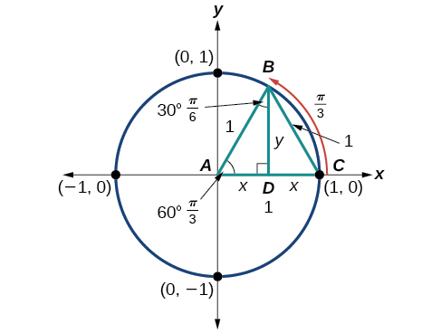{: #Figure_07_03_019}

The measure of angle<math xmlns="http://www.w3.org/1998/Math/MathML"> <mrow> <mtext> </mtext><mi>A</mi><mi>B</mi><mi>D</mi><mtext> </mtext> </mrow> </math>

is 30°. Angle<math xmlns="http://www.w3.org/1998/Math/MathML"> <mrow> <mtext> </mtext><mi>A</mi><mi>B</mi><mi>C</mi><mtext> </mtext> </mrow> </math>

is double angle<math xmlns="http://www.w3.org/1998/Math/MathML"> <mrow> <mtext> </mtext><mi>A</mi><mi>B</mi><mi>D</mi><mo>,</mo> </mrow> </math>

so its measure is 60°.<math xmlns="http://www.w3.org/1998/Math/MathML"> <mrow> <mtext> </mtext><mi>B</mi><mi>D</mi><mtext> </mtext> </mrow> </math>

is the perpendicular bisector of<math xmlns="http://www.w3.org/1998/Math/MathML"> <mrow> <mtext> </mtext><mi>A</mi><mi>C</mi><mo>,</mo> </mrow> </math>

so it cuts<math xmlns="http://www.w3.org/1998/Math/MathML"> <mrow> <mtext> </mtext><mi>A</mi><mi>C</mi><mtext> </mtext> </mrow> </math>

in half. This means that<math xmlns="http://www.w3.org/1998/Math/MathML"> <mrow> <mtext> </mtext><mi>A</mi><mi>D</mi><mtext> </mtext> </mrow> </math>

is<math xmlns="http://www.w3.org/1998/Math/MathML"> <mrow> <mtext> </mtext><mfrac> <mn>1</mn> <mn>2</mn> </mfrac> <mtext> </mtext> </mrow> </math>

the radius, or<math xmlns="http://www.w3.org/1998/Math/MathML"> <mrow> <mtext> </mtext><mfrac> <mn>1</mn> <mn>2</mn> </mfrac> <mo>.</mo><mtext> </mtext> </mrow> </math>

Notice that<math xmlns="http://www.w3.org/1998/Math/MathML"> <mrow> <mtext> </mtext><mi>A</mi><mi>D</mi><mtext> </mtext> </mrow> </math>

is the *x*-coordinate of point<math xmlns="http://www.w3.org/1998/Math/MathML"> <mrow> <mtext> </mtext><mi>B</mi><mo>,</mo> </mrow> </math>

which is at the intersection of the 60° angle and the unit circle. This gives us a triangle<math xmlns="http://www.w3.org/1998/Math/MathML"> <mrow> <mtext> </mtext><mi>B</mi><mi>A</mi><mi>D</mi><mtext> </mtext> </mrow> </math>

with hypotenuse of 1 and side<math xmlns="http://www.w3.org/1998/Math/MathML"> <mrow> <mtext> </mtext><mi>x</mi><mtext> </mtext> </mrow> </math>

of length<math xmlns="http://www.w3.org/1998/Math/MathML"> <mrow> <mtext> </mtext><mfrac> <mn>1</mn> <mn>2</mn> </mfrac> <mo>.</mo> </mrow> </math>

From the Pythagorean Theorem, we get

<math xmlns="http://www.w3.org/1998/Math/MathML"> <mrow> <msup> <mi>x</mi> <mn>2</mn> </msup> <mo>+</mo><msup> <mi>y</mi> <mn>2</mn> </msup> <mo>=</mo><mn>1</mn> </mrow> </math>

Substituting<math xmlns="http://www.w3.org/1998/Math/MathML"> <mrow> <mtext> </mtext><mi>x</mi><mo>=</mo><mfrac> <mn>1</mn> <mn>2</mn> </mfrac> <mo>,</mo> </mrow> </math>

we get

<math xmlns="http://www.w3.org/1998/Math/MathML"> <mrow> <msup> <mrow> <mrow><mo>(</mo> <mrow> <mfrac> <mn>1</mn> <mn>2</mn> </mfrac> </mrow> <mo>)</mo></mrow> </mrow> <mn>2</mn> </msup> <mo>+</mo><msup> <mi>y</mi> <mn>2</mn> </msup> <mo>=</mo><mn>1</mn> </mrow> </math>

Solving for<math xmlns="http://www.w3.org/1998/Math/MathML"> <mrow> <mtext> </mtext><mi>y</mi><mo>,</mo> </mrow> </math>

we get

<math xmlns="http://www.w3.org/1998/Math/MathML"> <mrow> <mtable> <mtr> <mtd columnalign="right"> <mrow> <mfrac> <mn>1</mn> <mn>4</mn> </mfrac> <mo>+</mo><msup> <mi>y</mi> <mn>2</mn> </msup> </mrow> </mtd> <mtd> <mo>=</mo> </mtd> <mtd columnalign="left"> <mn>1</mn> </mtd> </mtr> <mtr> <mtd columnalign="right"> <mrow> <msup> <mi>y</mi> <mn>2</mn> </msup> </mrow> </mtd> <mtd> <mo>=</mo> </mtd> <mtd columnalign="left"> <mrow> <mn>1</mn><mo>−</mo><mfrac> <mn>1</mn> <mn>4</mn> </mfrac> </mrow> </mtd> </mtr> <mtr> <mtd columnalign="right"> <mrow> <msup> <mi>y</mi> <mn>2</mn> </msup> </mrow> </mtd> <mtd> <mo>=</mo> </mtd> <mtd columnalign="left"> <mrow> <mfrac> <mn>3</mn> <mn>4</mn> </mfrac> </mrow> </mtd> </mtr> <mtr> <mtd columnalign="right"> <mi>y</mi> </mtd> <mtd> <mo>=</mo> </mtd> <mtd columnalign="left"> <mrow> <mo>±</mo><mfrac> <mrow> <msqrt> <mn>3</mn> </msqrt> </mrow> <mn>2</mn> </mfrac> </mrow> </mtd> </mtr> </mtable></mrow> </math>

Since<math xmlns="http://www.w3.org/1998/Math/MathML"> <mrow> <mtext> </mtext><mi>t</mi><mo>=</mo><mfrac> <mi>π</mi> <mn>3</mn> </mfrac> <mtext> </mtext> </mrow> </math>

has the terminal side in quadrant I where the *y-*coordinate is positive, we choose<math xmlns="http://www.w3.org/1998/Math/MathML"> <mrow> <mtext> </mtext><mi>y</mi><mo>=</mo><mfrac> <mrow> <msqrt> <mn>3</mn> </msqrt> </mrow> <mn>2</mn> </mfrac> <mo>,</mo> </mrow> </math>

the positive value.

At<math xmlns="http://www.w3.org/1998/Math/MathML"> <mrow> <mtext> </mtext><mi>t</mi><mo>=</mo><mfrac> <mi>π</mi> <mn>3</mn> </mfrac> <mtext> </mtext> </mrow> </math>

(60°), the<math xmlns="http://www.w3.org/1998/Math/MathML"> <mrow> <mtext> </mtext><mo stretchy="false">(</mo><mi>x</mi><mo>,</mo><mi>y</mi><mo stretchy="false">)</mo><mtext> </mtext> </mrow> </math>

coordinates for the point on a circle of radius<math xmlns="http://www.w3.org/1998/Math/MathML"> <mrow> <mtext> </mtext><mn>1</mn><mtext> </mtext> </mrow> </math>

at an angle of<math xmlns="http://www.w3.org/1998/Math/MathML"> <mrow> <mtext> </mtext><mn>60°</mn><mtext> </mtext> </mrow> </math>

are<math xmlns="http://www.w3.org/1998/Math/MathML"> <mrow> <mtext> </mtext><mrow><mo>(</mo> <mrow> <mfrac> <mn>1</mn> <mn>2</mn> </mfrac> <mo>,</mo><mfrac> <mrow> <msqrt> <mn>3</mn> </msqrt> </mrow> <mn>2</mn> </mfrac> </mrow> <mo>)</mo></mrow><mo>,</mo> </mrow> </math>

so we can find the sine and cosine.

<math xmlns="http://www.w3.org/1998/Math/MathML"> <mrow> <mtable> <mtr> <mtd columnalign="right"> <mrow> <mo stretchy="false">(</mo><mi>x</mi><mo>,</mo><mi>y</mi><mo stretchy="false">)</mo></mrow> </mtd> <mtd> <mo>=</mo> </mtd> <mtd columnalign="left"> <mrow> <mrow><mo>(</mo> <mrow> <mfrac> <mn>1</mn> <mn>2</mn> </mfrac> <mo>,</mo><mfrac> <mrow> <msqrt> <mn>3</mn> </msqrt> </mrow> <mn>2</mn> </mfrac> </mrow> <mo>)</mo></mrow></mrow> </mtd> </mtr> <mtr> <mtd columnalign="right"> <mi>x</mi> </mtd> <mtd> <mo>=</mo> </mtd> <mtd columnalign="left"> <mrow> <mfrac> <mn>1</mn> <mn>2</mn> </mfrac> <mo>,</mo><mi>y</mi><mo>=</mo><mfrac> <mrow> <msqrt> <mn>3</mn> </msqrt> </mrow> <mn>2</mn> </mfrac> </mrow> </mtd> </mtr> <mtr> <mtd columnalign="right"> <mrow> <mtext>cos </mtext><mi>t</mi></mrow> </mtd> <mtd> <mo>=</mo> </mtd> <mtd columnalign="left"> <mrow> <mfrac> <mn>1</mn> <mn>2</mn> </mfrac> <mo>,</mo><mtext>sin </mtext><mi>t</mi><mo>=</mo><mfrac> <mrow> <msqrt> <mn>3</mn> </msqrt> </mrow> <mn>2</mn> </mfrac> </mrow> </mtd> </mtr> </mtable></mrow> </math>

We have now found the cosine and sine values for all of the most commonly encountered angles in the first quadrant of the unit circle. [\[link\]](#Table_07_03_01) summarizes these values.

| **Angle** | <math xmlns="http://www.w3.org/1998/Math/MathML"> <mn>0</mn> </math>

 | <math xmlns="http://www.w3.org/1998/Math/MathML"> <mrow> <mfrac> <mi>π</mi> <mn>6</mn> </mfrac> <mo>,</mo> </mrow> </math>

or<math xmlns="http://www.w3.org/1998/Math/MathML"> <mrow> <mtext> </mtext><mn>30°</mn> </mrow> </math>

 | <math xmlns="http://www.w3.org/1998/Math/MathML"> <mrow> <mfrac> <mi>π</mi> <mn>4</mn> </mfrac> <mo>,</mo> </mrow> </math>

or<math xmlns="http://www.w3.org/1998/Math/MathML"> <mrow> <mtext> </mtext><mn>45°</mn> </mrow> </math>

 | <math xmlns="http://www.w3.org/1998/Math/MathML"> <mrow> <mfrac> <mi>π</mi> <mn>3</mn> </mfrac> <mo>,</mo> </mrow> </math>

or<math xmlns="http://www.w3.org/1998/Math/MathML"> <mrow> <mtext> </mtext><mn>60°</mn> </mrow> </math>

 | <math xmlns="http://www.w3.org/1998/Math/MathML"> <mrow> <mfrac> <mi>π</mi> <mn>2</mn> </mfrac> <mo>,</mo> </mrow> </math>

or<math xmlns="http://www.w3.org/1998/Math/MathML"> <mrow> <mtext> </mtext><mn>90°</mn> </mrow> </math>

 |
| **Cosine** | 1 | <math xmlns="http://www.w3.org/1998/Math/MathML"> <mrow> <mfrac> <mrow> <msqrt> <mn>3</mn> </msqrt> </mrow> <mn>2</mn> </mfrac> </mrow> </math>

 | <math xmlns="http://www.w3.org/1998/Math/MathML"> <mrow> <mfrac> <mrow> <msqrt> <mn>2</mn> </msqrt> </mrow> <mn>2</mn> </mfrac> </mrow> </math>

 | <math xmlns="http://www.w3.org/1998/Math/MathML"> <mrow> <mfrac> <mn>1</mn> <mn>2</mn> </mfrac> </mrow> </math>

 | 0 |
| **Sine** | 0 | <math xmlns="http://www.w3.org/1998/Math/MathML"> <mrow> <mfrac> <mn>1</mn> <mn>2</mn> </mfrac> </mrow> </math>

 | <math xmlns="http://www.w3.org/1998/Math/MathML"> <mrow> <mfrac> <mrow> <msqrt> <mn>2</mn> </msqrt> </mrow> <mn>2</mn> </mfrac> </mrow> </math>

 | <math xmlns="http://www.w3.org/1998/Math/MathML"> <mrow> <mfrac> <mrow> <msqrt> <mn>3</mn> </msqrt> </mrow> <mn>2</mn> </mfrac> </mrow> </math>

 | 1 |
{: #Table_07_03_01 summary="Three rows and six columns. First row shows angles of 0 degrees, 30 degrees or &#x3C0;/6, 45 degrees or &#x3C0;/4, 60 degrees or &#x3C0;/3, and 90 degrees or &#x3C0;/2. Second row is the cosine value for the degrees/radians in first row. Third row is sine values for degrees/radians in first row."}

[\[link\]](#Figure_07_03_021) shows the common angles in the first quadrant of the unit circle.

 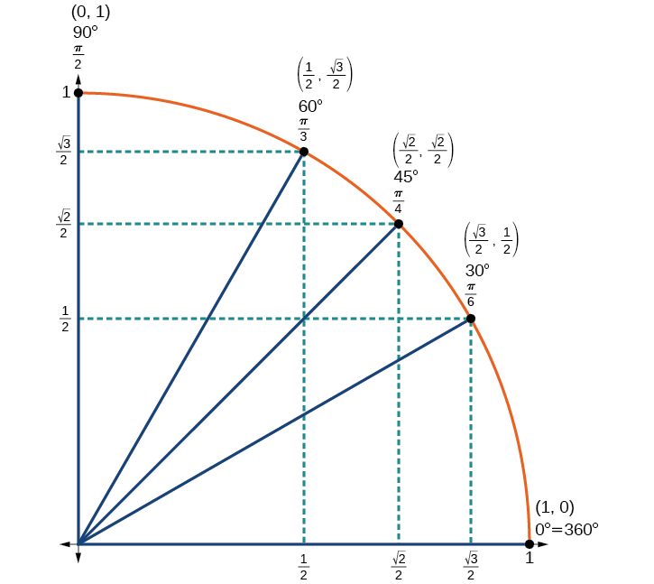{: #Figure_07_03_021}

#### Using a Calculator to Find Sine and Cosine

To find the cosine and sine of angles other than the special angles, we turn to a computer or calculator. **Be aware**\: Most calculators can be set into “degree” or “radian” mode, which tells the calculator the units for the input value. When we evaluate<math xmlns="http://www.w3.org/1998/Math/MathML"> <mrow> <mtext> </mtext><mi>cos</mi><mo stretchy="false">(</mo><mn>30</mn><mo stretchy="false">)</mo><mtext> </mtext> </mrow> </math>

on our calculator, it will evaluate it as the cosine of 30 degrees if the calculator is in degree mode, or the cosine of 30 radians if the calculator is in radian mode.

<strong>Given an angle in radians, use a graphing calculator to find the cosine. </strong>

1.  If the calculator has degree mode and radian mode, set it to radian mode.
2.  Press the COS key.
3.  Enter the radian value of the angle and press the close-parentheses key \")\".
4.  Press ENTER.
{: type="1"}

Using a Graphing Calculator to Find Sine and Cosine

Evaluate<math xmlns="http://www.w3.org/1998/Math/MathML"> <mrow> <mtext> </mtext><mi>cos</mi><mrow><mo>(</mo> <mrow> <mfrac> <mrow> <mn>5</mn><mi>π</mi> </mrow> <mn>3</mn> </mfrac> </mrow> <mo>)</mo></mrow><mtext> </mtext> </mrow> </math>

using a graphing calculator or computer.

Enter the following keystrokes:

<math xmlns="http://www.w3.org/1998/Math/MathML"> <mrow> <mtext>COS</mtext><mo stretchy="false">(</mo><mtext> </mtext><mn>5</mn><mtext> </mtext><mo>×</mo><mtext> </mtext><mi>π</mi><mtext> </mtext><mo>÷</mo><mtext> 3 ) ENTER</mtext> </mrow> </math>

<math xmlns="http://www.w3.org/1998/Math/MathML"> <mrow> <mi>cos</mi><mrow><mo>(</mo> <mrow> <mfrac> <mrow> <mn>5</mn><mi>π</mi> </mrow> <mn>3</mn> </mfrac> </mrow> <mo>)</mo></mrow><mo>=</mo><mn>0.5</mn> </mrow> </math>

Analysis

We can find the cosine or sine of an angle in degrees directly on a calculator with degree mode. For calculators or software that use only radian mode, we can find the sign of<math xmlns="http://www.w3.org/1998/Math/MathML"> <mrow> <mtext> </mtext><mn>20°</mn><mo>,</mo> </mrow> </math>

for example, by including the conversion factor to radians as part of the input:

<math xmlns="http://www.w3.org/1998/Math/MathML"> <mrow> <mtext>SIN</mtext><mo stretchy="false">(</mo><mtext> 20 </mtext><mo>×</mo><mtext> </mtext><mi>π</mi><mtext> </mtext><mo>÷</mo><mtext> 180 ) ENTER</mtext> </mrow> </math>

Evaluate<math xmlns="http://www.w3.org/1998/Math/MathML"> <mrow> <mtext> </mtext><mi>sin</mi><mrow><mo>(</mo> <mrow> <mfrac> <mi>π</mi> <mn>3</mn> </mfrac> </mrow> <mo>)</mo></mrow><mo>.</mo> </mrow> </math>

approximately 0.866025403

### Identifying the Domain and Range of Sine and Cosine Functions

Now that we can find the sine and cosine of an angle, we need to discuss their domains and ranges. What are the domains of the sine and cosine functions? That is, what are the smallest and largest numbers that can be inputs of the functions? Because angles smaller than<math xmlns="http://www.w3.org/1998/Math/MathML"> <mrow> <mtext> </mtext><mn>0</mn><mtext> </mtext> </mrow> </math>

and angles larger than<math xmlns="http://www.w3.org/1998/Math/MathML"> <mrow> <mtext> </mtext><mn>2</mn><mi>π</mi><mtext> </mtext> </mrow> </math>

can still be graphed on the unit circle and have real values of<math xmlns="http://www.w3.org/1998/Math/MathML"> <mrow> <mtext> </mtext><mi>x</mi><mo>,</mo><mi>y</mi><mo>,</mo><mtext>and</mtext><mtext> </mtext><mi>r</mi><mo>,</mo></mrow> </math>

there is no lower or upper limit to the angles that can be inputs to the sine and cosine functions. The input to the sine and cosine functions is the rotation from the positive *x*-axis, and that may be any real number.

What are the ranges of the sine and cosine functions? What are the least and greatest possible values for their output? We can see the answers by examining the unit circle, as shown in [\[link\]](#Figure_07_03_013). The bounds of the *x*-coordinate are<math xmlns="http://www.w3.org/1998/Math/MathML"> <mrow> <mtext> </mtext><mo stretchy="false">[</mo><mn>−1</mn><mo>,</mo><mn>1</mn><mo stretchy="false">]</mo><mo>.</mo><mtext> </mtext> </mrow> </math>

The bounds of the *y*-coordinate are also<math xmlns="http://www.w3.org/1998/Math/MathML"> <mrow> <mtext> </mtext><mo stretchy="false">[</mo><mn>−1</mn><mo>,</mo><mn>1</mn><mo stretchy="false">]</mo><mo>.</mo><mtext> </mtext> </mrow> </math>

Therefore, the range of both the sine and cosine functions is<math xmlns="http://www.w3.org/1998/Math/MathML"> <mrow> <mtext> </mtext><mo stretchy="false">[</mo><mn>−1</mn><mo>,</mo><mn>1</mn><mo stretchy="false">]</mo><mo>.</mo> </mrow> </math>

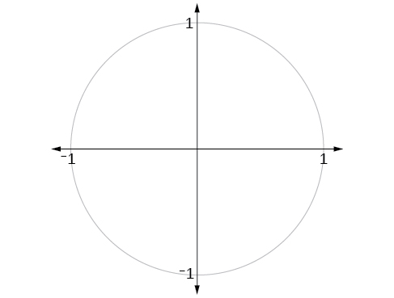{: #Figure_07_03_013}

### Finding Reference Angles

We have discussed finding the sine and cosine for angles in the first quadrant, but what if our angle is in another quadrant? For any given angle in the first quadrant, there is an angle in the second quadrant with the same sine value. Because the sine value is the *y*-coordinate on the unit circle, the other angle with the same sine will share the same *y*-value, but have the opposite *x*-value. Therefore, its cosine value will be the opposite of the first angle’s cosine value.

Likewise, there will be an angle in the fourth quadrant with the same cosine as the original angle. The angle with the same cosine will share the same *x*-value but will have the opposite *y*-value. Therefore, its sine value will be the opposite of the original angle’s sine value.

As shown in [\[link\]](#Figure_07_03_014), angle<math xmlns="http://www.w3.org/1998/Math/MathML"> <mrow> <mtext> </mtext><mi>α</mi><mtext> </mtext> </mrow> </math>

has the same sine value as angle<math xmlns="http://www.w3.org/1998/Math/MathML"> <mrow> <mtext> </mtext><mi>t</mi><mo>;</mo> </mrow> </math>

the cosine values are opposites. Angle<math xmlns="http://www.w3.org/1998/Math/MathML"> <mrow> <mtext> </mtext><mi>β</mi><mtext> </mtext> </mrow> </math>

has the same cosine value as angle<math xmlns="http://www.w3.org/1998/Math/MathML"> <mrow> <mtext> </mtext><mi>t</mi><mo>;</mo> </mrow> </math>

the sine values are opposites.

<math xmlns="http://www.w3.org/1998/Math/MathML"> <mrow> <mtable> <mtr> <mtd columnalign="left"> <mrow> <mi>sin</mi><mo stretchy="false">(</mo><mi>t</mi><mo stretchy="false">)</mo><mo>=</mo><mi>sin</mi><mo stretchy="false">(</mo><mi>α</mi><mo stretchy="false">)</mo></mrow> </mtd> <mtd> <mrow> <mspace width="1em" /><mtext>and</mtext><mspace width="1em" /></mrow> </mtd> <mtd columnalign="left"> <mrow> <mi>cos</mi><mo stretchy="false">(</mo><mi>t</mi><mo stretchy="false">)</mo><mo>=</mo><mo>−</mo><mi>cos</mi><mo stretchy="false">(</mo><mi>α</mi><mo stretchy="false">)</mo></mrow> </mtd> </mtr> <mtr> <mtd columnalign="left"> <mrow> <mi>sin</mi><mo stretchy="false">(</mo><mi>t</mi><mo stretchy="false">)</mo><mo>=</mo><mo>−</mo><mi>sin</mi><mo stretchy="false">(</mo><mi>β</mi><mo stretchy="false">)</mo></mrow> </mtd> <mtd> <mrow> <mspace width="1em" /><mtext>and</mtext><mspace width="1em" /></mrow> </mtd> <mtd columnalign="left"> <mrow> <mi>cos</mi><mo stretchy="false">(</mo><mi>t</mi><mo stretchy="false">)</mo><mo>=</mo><mi>cos</mi><mo stretchy="false">(</mo><mi>β</mi><mo stretchy="false">)</mo></mrow> </mtd> </mtr> </mtable></mrow> </math>

 {: #Figure_07_03_014}

Recall that an angle’s reference angle is the acute angle,<math xmlns="http://www.w3.org/1998/Math/MathML"> <mrow> <mtext> </mtext><mi>t</mi><mo>,</mo> </mrow> </math>

formed by the terminal side of the angle<math xmlns="http://www.w3.org/1998/Math/MathML"> <mrow> <mtext> </mtext><mi>t</mi><mtext> </mtext> </mrow> </math>

and the horizontal axis. A reference angle is always an angle between<math xmlns="http://www.w3.org/1998/Math/MathML"> <mrow> <mtext> </mtext><mn>0</mn><mtext> </mtext> </mrow> </math>

and<math xmlns="http://www.w3.org/1998/Math/MathML"> <mrow> <mtext> </mtext><mn>90°</mn><mo>,</mo> </mrow> </math>

or<math xmlns="http://www.w3.org/1998/Math/MathML"> <mrow> <mtext> </mtext><mn>0</mn><mtext> </mtext> </mrow> </math>

and<math xmlns="http://www.w3.org/1998/Math/MathML"> <mrow> <mtext> </mtext><mfrac> <mi>π</mi> <mn>2</mn> </mfrac> <mtext> </mtext> </mrow> </math>

radians. As we can see from [\[link\]](#Figure_07_03_020), for any angle in quadrants II, III, or IV, there is a reference angle in quadrant I.

{: #Figure_07_03_020}

**Given an angle between<math xmlns="http://www.w3.org/1998/Math/MathML"> <mrow> <mtext> </mtext><mn>0</mn><mtext> </mtext> </mrow> </math>

and<math xmlns="http://www.w3.org/1998/Math/MathML"> <mrow> <mtext> </mtext><mn>2</mn><mi>π</mi><mo>,</mo> </mrow> </math>

find its reference angle.**

1.  An angle in the first quadrant is its own reference angle.
2.  For an angle in the second or third quadrant, the reference angle is
    <math xmlns="http://www.w3.org/1998/Math/MathML"> <mrow> <mtext> </mtext><mrow><mo>\|</mo> <mrow> <mi>π</mi><mo>−</mo><mi>t</mi> </mrow> <mo>\|</mo></mrow><mtext> </mtext> </mrow> </math>
    
    or
    <math xmlns="http://www.w3.org/1998/Math/MathML"> <mrow> <mtext> </mtext><mrow><mo>\|</mo> <mrow> <mn>180°</mn><mo>−</mo><mi>t</mi> </mrow> <mo>\|</mo></mrow><mo>.</mo> </mrow> </math>

3.  For an angle in the fourth quadrant, the reference angle is
    <math xmlns="http://www.w3.org/1998/Math/MathML"> <mrow> <mtext> </mtext><mn>2</mn><mi>π</mi><mo>−</mo><mi>t</mi><mtext> </mtext> </mrow> </math>
    
    or
    <math xmlns="http://www.w3.org/1998/Math/MathML"> <mrow> <mtext> </mtext><mn>360°</mn><mo>−</mo><mi>t</mi><mo>.</mo> </mrow> </math>

4.  If an angle is less than
    <math xmlns="http://www.w3.org/1998/Math/MathML"> <mrow> <mtext> </mtext><mn>0</mn><mtext> </mtext> </mrow> </math>
    
    or greater than
    <math xmlns="http://www.w3.org/1998/Math/MathML"> <mrow> <mtext> </mtext><mn>2</mn><mi>π</mi><mo>,</mo> </mrow> </math>
    
    add or subtract
    <math xmlns="http://www.w3.org/1998/Math/MathML"> <mrow> <mtext> </mtext><mn>2</mn><mi>π</mi><mtext> </mtext> </mrow> </math>
    
    as many times as needed to find an equivalent angle between
    <math xmlns="http://www.w3.org/1998/Math/MathML"> <mrow> <mtext> </mtext><mn>0</mn><mtext> </mtext> </mrow> </math>
    
    and
    <math xmlns="http://www.w3.org/1998/Math/MathML"> <mrow> <mtext> </mtext><mn>2</mn><mi>π</mi><mo>.</mo> </mrow> </math>
{: type="1"}

Finding a Reference Angle

Find the reference angle of<math xmlns="http://www.w3.org/1998/Math/MathML"> <mrow> <mtext> </mtext><mn>225°</mn><mtext> </mtext> </mrow> </math>

as shown in [[link]](#Figure_07_03_016).

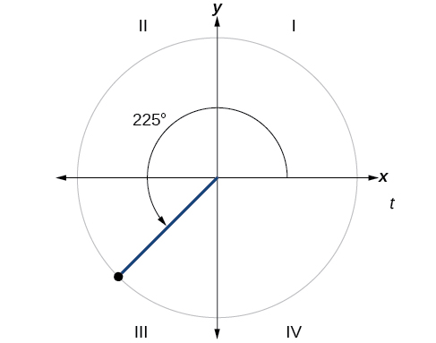{: #Figure_07_03_016}

Because<math xmlns="http://www.w3.org/1998/Math/MathML"> <mrow> <mtext> </mtext><mn>225°</mn><mtext> </mtext> </mrow> </math>

is in the third quadrant, the reference angle is

<math xmlns="http://www.w3.org/1998/Math/MathML"> <mrow> <mrow><mo>\|</mo> <mrow> <mrow><mo>(</mo> <mrow> <mn>180°</mn><mo>−</mo><mn>225°</mn> </mrow> <mo>)</mo></mrow> </mrow> <mo>\|</mo></mrow><mo>=</mo><mrow><mo>\|</mo> <mrow> <mo>−</mo><mn>45°</mn> </mrow> <mo>\|</mo></mrow><mo>=</mo><mn>45°</mn> </mrow> </math>

Find the reference angle of<math xmlns="http://www.w3.org/1998/Math/MathML"> <mrow> <mtext> </mtext><mfrac> <mrow> <mn>5</mn><mi>π</mi> </mrow> <mn>3</mn> </mfrac> <mo>.</mo> </mrow> </math>

<math xmlns="http://www.w3.org/1998/Math/MathML"> <mrow> <mfrac> <mi>π</mi> <mn>3</mn> </mfrac> </mrow> </math>

### Using Reference Angles 

Now let’s take a moment to reconsider the Ferris wheel introduced at the beginning of this section. Suppose a rider snaps a photograph while stopped twenty feet above ground level. The rider then rotates three-quarters of the way around the circle. What is the rider’s new elevation? To answer questions such as this one, we need to evaluate the sine or cosine functions at angles that are greater than 90 degrees or at a negative angle. Reference angles make it possible to evaluate trigonometric functions for angles outside the first quadrant. They can also be used to find<math xmlns="http://www.w3.org/1998/Math/MathML"> <mrow> <mtext> </mtext><mrow><mo>(</mo> <mrow> <mi>x</mi><mo>,</mo><mi>y</mi> </mrow> <mo>)</mo></mrow><mtext> </mtext> </mrow> </math>

coordinates for those angles. We will use the **reference angle**{: data-type="term" .no-emphasis} of the angle of rotation combined with the quadrant in which the terminal side of the angle lies.

#### Using Reference Angles to Evaluate Trigonometric Functions

We can find the cosine and sine of any angle in any quadrant if we know the cosine or sine of its reference angle. The absolute values of the cosine and sine of an angle are the same as those of the reference angle. The sign depends on the quadrant of the original angle. The cosine will be positive or negative depending on the sign of the *x*-values in that quadrant. The sine will be positive or negative depending on the sign of the *y*-values in that quadrant.

Using Reference Angles to Find Cosine and Sine

Angles have cosines and sines with the same absolute value as their reference angles. The sign (positive or negative) can be determined from the quadrant of the angle.

<strong>Given an angle in standard position, find the reference angle, and the cosine and sine of the original angle. </strong>

1.  Measure the angle between the terminal side of the given angle and the horizontal axis. That is the reference angle.
2.  Determine the values of the cosine and sine of the reference angle.
3.  Give the cosine the same sign as the *x*-values in the quadrant of the original angle.
4.  Give the sine the same sign as the *y*-values in the quadrant of the original angle.
{: type="1"}

Using Reference Angles to Find Sine and Cosine

1.  Using a reference angle, find the exact value of
    <math xmlns="http://www.w3.org/1998/Math/MathML"> <mrow> <mtext> </mtext><mi>cos</mi><mo stretchy="false">(</mo><mn>150°</mn><mo stretchy="false">)</mo><mtext> </mtext> </mrow> </math>
    
    and
    <math xmlns="http://www.w3.org/1998/Math/MathML"> <mrow> <mtext> </mtext><mtext>sin</mtext><mo stretchy="false">(</mo><mn>150°</mn><mo stretchy="false">)</mo><mo>.</mo> </mrow> </math>

2.  Using the reference angle, find
    <math xmlns="http://www.w3.org/1998/Math/MathML"> <mrow> <mtext> </mtext><mi>cos</mi><mtext> </mtext><mfrac> <mrow> <mn>5</mn><mi>π</mi></mrow> <mn>4</mn> </mfrac> <mtext> </mtext></mrow> </math>
    
    and
    <math xmlns="http://www.w3.org/1998/Math/MathML"> <mrow> <mtext> </mtext><mi>sin</mi><mtext> </mtext><mfrac> <mrow> <mn>5</mn><mi>π</mi></mrow> <mn>4</mn> </mfrac> <mo>.</mo></mrow> </math>
{: type="a"}

1.  <math xmlns="http://www.w3.org/1998/Math/MathML"> <mrow> <mn>150°</mn><mtext> </mtext> </mrow> </math>
    
    is located in the second quadrant. The angle it makes with the *x*-axis is
    <math xmlns="http://www.w3.org/1998/Math/MathML"> <mrow> <mtext> </mtext><mn>180°</mn><mo>−</mo><mn>150°</mn><mo>=</mo><mn>30°</mn><mo>,</mo> </mrow> </math>
    
    so the reference angle is
    <math xmlns="http://www.w3.org/1998/Math/MathML"> <mrow> <mtext> </mtext><mn>30°</mn><mo>.</mo> </mrow> </math>
    
    This tells us that<math xmlns="http://www.w3.org/1998/Math/MathML"> <mrow> <mtext> </mtext><mn>150°</mn><mtext> </mtext> </mrow> </math>
    
    has the same sine and cosine values as<math xmlns="http://www.w3.org/1998/Math/MathML"> <mrow> <mtext> </mtext><mn>30°</mn><mo>,</mo> </mrow> </math>
    
    except for the sign.
    
    

    <math xmlns="http://www.w3.org/1998/Math/MathML" display="block"> <mrow> <mtable> <mtr> <mtd> <mrow> <mi>cos</mi><mo stretchy="false">(</mo><mn>30°</mn><mo stretchy="false">)</mo><mo>=</mo><mfrac> <mrow> <msqrt> <mn>3</mn> </msqrt> </mrow> <mn>2</mn> </mfrac> </mrow> </mtd> <mtd> <mrow> <mspace width="1em" /><mtext>and</mtext><mspace width="1em" /></mrow> </mtd> <mtd> <mrow> <mi>sin</mi><mo stretchy="false">(</mo><mn>30°</mn><mo stretchy="false">)</mo><mo>=</mo><mfrac> <mn>1</mn> <mn>2</mn> </mfrac> </mrow> </mtd> </mtr> </mtable></mrow> </math>
    

    
    Since<math xmlns="http://www.w3.org/1998/Math/MathML"> <mrow> <mtext> </mtext><mn>150°</mn><mtext> </mtext> </mrow> </math>
    
    is in the second quadrant, the *x*-coordinate of the point on the circle is negative, so the cosine value is negative. The *y*-coordinate is positive, so the sine value is positive.
    
    

    <math xmlns="http://www.w3.org/1998/Math/MathML" display="block"> <mrow> <mtable> <mtr> <mtd> <mrow> <mi>cos</mi><mo stretchy="false">(</mo><mn>150°</mn><mo stretchy="false">)</mo><mo>=</mo><mo>−</mo><mfrac> <mrow> <msqrt> <mn>3</mn> </msqrt> </mrow> <mn>2</mn> </mfrac> </mrow> </mtd> <mtd> <mrow> <mspace width="1em" /><mtext>and</mtext><mspace width="1em" /></mrow> </mtd> <mtd> <mrow> <mi>sin</mi><mo stretchy="false">(</mo><mn>150°</mn><mo stretchy="false">)</mo><mo>=</mo><mfrac> <mn>1</mn> <mn>2</mn> </mfrac> </mrow> </mtd> </mtr> </mtable></mrow> </math>
    

2.  <math xmlns="http://www.w3.org/1998/Math/MathML"> <mrow> <mfrac> <mrow> <mn>5</mn><mi>π</mi> </mrow> <mn>4</mn> </mfrac> <mtext> </mtext> </mrow> </math>
    
    is in the third quadrant. Its reference angle is
    <math xmlns="http://www.w3.org/1998/Math/MathML"> <mrow> <mtext> </mtext><mfrac> <mrow> <mn>5</mn><mi>π</mi> </mrow> <mn>4</mn> </mfrac> <mo>−</mo><mi>π</mi><mo>=</mo><mfrac> <mi>π</mi> <mn>4</mn> </mfrac> <mo>.</mo><mtext> </mtext> </mrow> </math>
    
    The cosine and sine of
    <math xmlns="http://www.w3.org/1998/Math/MathML"> <mrow> <mtext> </mtext><mfrac> <mi>π</mi> <mn>4</mn> </mfrac> <mtext> </mtext> </mrow> </math>
    
    are both
    <math xmlns="http://www.w3.org/1998/Math/MathML"> <mrow> <mtext> </mtext><mfrac> <mrow> <msqrt> <mn>2</mn> </msqrt> </mrow> <mn>2</mn> </mfrac> <mo>.</mo><mtext> </mtext> </mrow> </math>
    
    In the third quadrant, both
    <math xmlns="http://www.w3.org/1998/Math/MathML"> <mrow> <mtext> </mtext><mi>x</mi><mtext> </mtext> </mrow> </math>
    
    and
    <math xmlns="http://www.w3.org/1998/Math/MathML"> <mrow> <mtext> </mtext><mi>y</mi><mtext> </mtext> </mrow> </math>
    
    are negative, so:
    

    <math xmlns="http://www.w3.org/1998/Math/MathML" display="block"> <mrow> <mtable> <mtr> <mtd> <mrow> <mi>cos</mi><mspace width="0.03em" /><mfrac> <mrow> <mn>5</mn><mi>π</mi></mrow> <mn>4</mn> </mfrac> <mo>=</mo><mo>−</mo><mfrac> <mrow> <msqrt> <mn>2</mn> </msqrt> </mrow> <mn>2</mn> </mfrac> </mrow> </mtd> <mtd> <mrow> <mspace width="1em" /><mtext>and</mtext><mspace width="1em" /></mrow> </mtd> <mtd> <mrow> <mi>sin</mi><mspace width="0.03em" /><mfrac> <mrow> <mn>5</mn><mi>π</mi></mrow> <mn>4</mn> </mfrac> <mo>=</mo><mo>−</mo><mfrac> <mrow> <msqrt> <mn>2</mn> </msqrt> </mrow> <mn>2</mn> </mfrac> </mrow> </mtd> </mtr> </mtable></mrow> </math>
    

{: type="a"}

1.  Use the reference angle of
    <math xmlns="http://www.w3.org/1998/Math/MathML"> <mrow> <mtext> </mtext><mn>315°</mn><mtext> </mtext> </mrow> </math>
    
    to find
    <math xmlns="http://www.w3.org/1998/Math/MathML"> <mrow> <mtext> </mtext><mi>cos</mi><mo stretchy="false">(</mo><mn>315°</mn><mo stretchy="false">)</mo><mtext> </mtext> </mrow> </math>
    
    and
    <math xmlns="http://www.w3.org/1998/Math/MathML"> <mrow> <mtext> </mtext><mi>sin</mi><mo stretchy="false">(</mo><mn>315°</mn><mo stretchy="false">)</mo><mo>.</mo> </mrow> </math>

2.  Use the reference angle of
    <math xmlns="http://www.w3.org/1998/Math/MathML"> <mrow> <mtext> </mtext><mo>−</mo><mfrac> <mi>π</mi> <mn>6</mn> </mfrac> <mtext> </mtext> </mrow> </math>
    
    to find
    <math xmlns="http://www.w3.org/1998/Math/MathML"> <mrow> <mtext> </mtext><mi>cos</mi><mrow><mo>(</mo> <mrow> <mo>−</mo><mfrac> <mi>π</mi> <mn>6</mn> </mfrac> </mrow> <mo>)</mo></mrow><mtext> </mtext> </mrow> </math>
    
    and
    <math xmlns="http://www.w3.org/1998/Math/MathML"> <mrow> <mtext> </mtext><mi>sin</mi><mrow><mo>(</mo> <mrow> <mo>−</mo><mfrac> <mi>π</mi> <mn>6</mn> </mfrac> </mrow> <mo>)</mo></mrow><mo>.</mo> </mrow> </math>
{: type="a"}

1.  <math xmlns="http://www.w3.org/1998/Math/MathML"> <mrow> <mtext>cos</mtext><mo stretchy="false">(</mo><mn>315°</mn><mo stretchy="false">)</mo><mo>=</mo><mfrac> <mrow> <msqrt> <mn>2</mn> </msqrt> </mrow> <mn>2</mn> </mfrac> <mo>,</mo><mo> </mo><mtext>sin</mtext><mo stretchy="false">(</mo><mn>315°</mn><mo stretchy="false">)</mo><mo>=</mo><mfrac> <mrow> <mo>–</mo><msqrt> <mn>2</mn> </msqrt> </mrow> <mn>2</mn> </mfrac> </mrow> </math>

2.  <math xmlns="http://www.w3.org/1998/Math/MathML"> <mrow> <mtext>cos</mtext><mrow><mo>(</mo> <mrow> <mo>−</mo><mfrac> <mi>π</mi> <mn>6</mn> </mfrac> </mrow> <mo>)</mo></mrow><mo>=</mo><mfrac> <mrow> <msqrt> <mn>3</mn> </msqrt> </mrow> <mn>2</mn> </mfrac> <mo>,</mo><mi>sin</mi><mrow><mo>(</mo> <mrow> <mo>−</mo><mfrac> <mi>π</mi> <mn>6</mn> </mfrac> </mrow> <mo>)</mo></mrow><mo>=</mo><mo>−</mo><mfrac> <mn>1</mn> <mn>2</mn> </mfrac> </mrow> </math>
{: type="a"}

#### Using Reference Angles to Find Coordinates

Now that we have learned how to find the cosine and sine values for special angles in the first quadrant, we can use symmetry and reference angles to fill in cosine and sine values for the rest of the special angles on the **unit circle**{: data-type="term" .no-emphasis}. They are shown in [\[link\]](#Figure_07_03_017). Take time to learn the<math xmlns="http://www.w3.org/1998/Math/MathML"> <mrow> <mtext> </mtext><mo stretchy="false">(</mo><mi>x</mi><mo>,</mo><mi>y</mi><mo stretchy="false">)</mo><mtext> </mtext> </mrow> </math>

 coordinates of all of the major angles in the first quadrant.

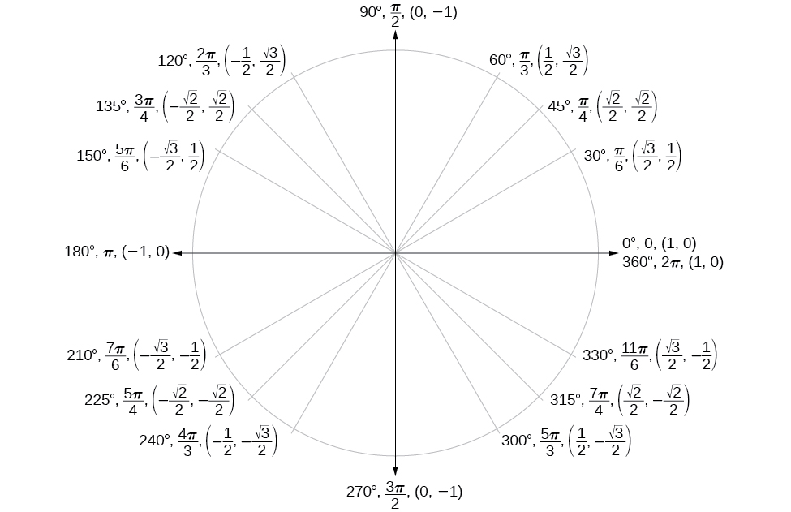{: #Figure_07_03_017}

In addition to learning the values for special angles, we can use reference angles to find<math xmlns="http://www.w3.org/1998/Math/MathML"> <mrow> <mtext> </mtext><mrow><mo>(</mo> <mrow> <mi>x</mi><mo>,</mo><mi>y</mi> </mrow> <mo>)</mo></mrow><mtext> </mtext> </mrow> </math>

coordinates of any point on the unit circle, using what we know of reference angles along with the identities

<math xmlns="http://www.w3.org/1998/Math/MathML"> <mrow> <mtable> <mtr> <mtd columnalign="left"> <mrow> <mi>x</mi><mo>=</mo><mtext>cos </mtext><mi>t</mi></mrow> </mtd> </mtr> <mtr> <mtd columnalign="left"> <mrow> <mi>y</mi><mo>=</mo><mtext>sin </mtext><mi>t</mi></mrow> </mtd> </mtr> </mtable></mrow> </math>

First we find the reference angle corresponding to the given angle. Then we take the sine and cosine values of the reference angle, and give them the signs corresponding to the *y*- and *x*-values of the quadrant.

**Given the angle of a point on a circle and the radius of the circle, find the<math xmlns="http://www.w3.org/1998/Math/MathML"> <mrow> <mtext> </mtext><mrow><mo>(</mo> <mrow> <mi>x</mi><mo>,</mo><mi>y</mi> </mrow> <mo>)</mo></mrow><mtext> </mtext> </mrow> </math>

coordinates of the point.**

1.  Find the reference angle by measuring the smallest angle to the *x*-axis.
2.  Find the cosine and sine of the reference angle.
3.  Determine the appropriate signs for
    <math xmlns="http://www.w3.org/1998/Math/MathML"> <mrow> <mtext> </mtext><mi>x</mi><mtext> </mtext> </mrow> </math>
    
    and
    <math xmlns="http://www.w3.org/1998/Math/MathML"> <mrow> <mtext> </mtext><mi>y</mi><mtext> </mtext> </mrow> </math>
    
    in the given quadrant.
{: type="1"}

Using the Unit Circle to Find Coordinates

Find the coordinates of the point on the unit circle at an angle of<math xmlns="http://www.w3.org/1998/Math/MathML"> <mrow> <mtext> </mtext><mfrac> <mrow> <mn>7</mn><mi>π</mi> </mrow> <mn>6</mn> </mfrac> <mo>.</mo> </mrow> </math>

We know that the angle<math xmlns="http://www.w3.org/1998/Math/MathML"> <mrow> <mtext> </mtext><mfrac> <mrow> <mn>7</mn><mi>π</mi> </mrow> <mn>6</mn> </mfrac> <mtext> </mtext> </mrow> </math>

is in the third quadrant.

First, let’s find the reference angle by measuring the angle to the *x*-axis. To find the reference angle of an angle whose terminal side is in quadrant III, we find the difference of the angle and<math xmlns="http://www.w3.org/1998/Math/MathML"> <mrow> <mtext> </mtext><mi>π</mi><mo>.</mo> </mrow> </math>

<math xmlns="http://www.w3.org/1998/Math/MathML"> <mrow> <mfrac> <mrow> <mn>7</mn><mi>π</mi> </mrow> <mn>6</mn> </mfrac> <mo>−</mo><mi>π</mi><mo>=</mo><mfrac> <mi>π</mi> <mn>6</mn> </mfrac> </mrow> </math>

Next, we will find the cosine and sine of the reference angle.

<math xmlns="http://www.w3.org/1998/Math/MathML" display="block"> <mrow> <mtable> <mtr> <mtd columnalign="left"> <mrow> <mi>cos</mi><mrow><mo>(</mo> <mrow> <mfrac> <mi>π</mi> <mn>6</mn> </mfrac> </mrow> <mo>)</mo></mrow><mo>=</mo><mfrac> <mrow> <msqrt> <mn>3</mn> </msqrt> </mrow> <mn>2</mn> </mfrac> </mrow> </mtd> <mtd columnalign="left"> <mrow> <mspace width="1em" /><mi>sin</mi><mrow><mo>(</mo> <mrow> <mfrac> <mi>π</mi> <mn>6</mn> </mfrac> </mrow> <mo>)</mo></mrow><mo>=</mo><mfrac> <mn>1</mn> <mn>2</mn> </mfrac> </mrow> </mtd> </mtr> </mtable></mrow> </math>

We must determine the appropriate signs for *x* and *y* in the given quadrant. Because our original angle is in the third quadrant, where both<math xmlns="http://www.w3.org/1998/Math/MathML"> <mrow> <mtext> </mtext><mi>x</mi><mtext> </mtext> </mrow> </math>

and<math xmlns="http://www.w3.org/1998/Math/MathML"> <mrow> <mtext> </mtext><mi>y</mi><mtext> </mtext> </mrow> </math>

are negative, both cosine and sine are negative.

<math xmlns="http://www.w3.org/1998/Math/MathML" display="block"> <mrow> <mtable> <mtr> <mtd columnalign="right"> <mrow> <mi>cos</mi><mrow><mo>(</mo> <mrow> <mfrac> <mrow> <mn>7</mn><mi>π</mi></mrow> <mn>6</mn> </mfrac> </mrow> <mo>)</mo></mrow></mrow> </mtd> <mtd> <mo>=</mo> </mtd> <mtd columnalign="left"> <mrow> <mo>−</mo><mfrac> <mrow> <msqrt> <mn>3</mn> </msqrt> </mrow> <mn>2</mn> </mfrac> </mrow> </mtd> </mtr> <mtr> <mtd columnalign="right"> <mrow> <mi>sin</mi><mrow><mo>(</mo> <mfrac><mrow> <mn>7</mn><mi>π</mi></mrow><mn>6</mn></mfrac> <mo>)</mo></mrow></mrow> </mtd> <mtd> <mo>=</mo> </mtd> <mtd columnalign="left"> <mrow> <mo>−</mo><mfrac> <mn>1</mn> <mn>2</mn> </mfrac> </mrow> </mtd> </mtr> </mtable></mrow> </math>

Now we can calculate the<math xmlns="http://www.w3.org/1998/Math/MathML"> <mrow> <mtext> </mtext><mrow><mo>(</mo> <mrow> <mi>x</mi><mo>,</mo><mi>y</mi> </mrow> <mo>)</mo></mrow><mtext> </mtext> </mrow> </math>

coordinates using the identities<math xmlns="http://www.w3.org/1998/Math/MathML"> <mrow> <mtext> </mtext><mi>x</mi><mo>=</mo><mi>cos</mi><mtext> </mtext><mi>θ</mi><mtext> </mtext></mrow> </math>

and<math xmlns="http://www.w3.org/1998/Math/MathML"> <mrow> <mtext> </mtext><mi>y</mi><mo>=</mo><mi>sin</mi><mtext> </mtext><mi>θ</mi><mo>.</mo></mrow> </math>

The coordinates of the point are<math xmlns="http://www.w3.org/1998/Math/MathML"> <mrow> <mtext> </mtext><mrow><mo>(</mo> <mrow> <mo>−</mo><mfrac> <mrow> <msqrt> <mn>3</mn> </msqrt> </mrow> <mn>2</mn> </mfrac> <mo>,</mo><mo>−</mo><mfrac> <mn>1</mn> <mn>2</mn> </mfrac> </mrow> <mo>)</mo></mrow><mtext> </mtext> </mrow> </math>

on the unit circle.

Find the coordinates of the point on the unit circle at an angle of<math xmlns="http://www.w3.org/1998/Math/MathML"> <mrow> <mtext> </mtext><mfrac> <mrow> <mn>5</mn><mi>π</mi> </mrow> <mn>3</mn> </mfrac> <mo>.</mo> </mrow> </math>

<math xmlns="http://www.w3.org/1998/Math/MathML"> <mrow> <mrow><mo>(</mo> <mrow> <mfrac> <mn>1</mn> <mn>2</mn> </mfrac> <mo>,</mo><mo>−</mo><mfrac> <mrow> <msqrt> <mn>3</mn> </msqrt> </mrow> <mn>2</mn> </mfrac> </mrow> <mo>)</mo></mrow> </mrow> </math>

Access these online resources for additional instruction and practice with sine and cosine functions.

* [Trigonometric Functions Using the Unit Circle][1]
* [Sine and Cosine from the Unit][2]
* [Sine and Cosine from the Unit Circle and Multiples of Pi Divided by Six][3]
* [Sine and Cosine from the Unit Circle and Multiples of Pi Divided by Four][4]
* [Trigonometric Functions Using Reference Angles][5]

### Key Equations

| Cosine | <math xmlns="http://www.w3.org/1998/Math/MathML"> <mrow> <mi>cos</mi><mtext> </mtext><mi>t</mi><mo>=</mo><mi>x</mi></mrow> </math>

 |
| Sine | <math xmlns="http://www.w3.org/1998/Math/MathML"> <mrow> <mi>sin</mi><mtext> </mtext><mi>t</mi><mo>=</mo><mi>y</mi></mrow> </math>

 |
| Pythagorean Identity | <math xmlns="http://www.w3.org/1998/Math/MathML"> <mrow> <msup> <mrow> <mi>cos</mi> </mrow> <mn>2</mn> </msup> <mi>t</mi><mo>+</mo><msup> <mrow> <mi>sin</mi> </mrow> <mn>2</mn> </msup> <mi>t</mi><mo>=</mo><mn>1</mn> </mrow> </math>

 |
{: summary=".."}

### Key Concepts

* Finding the function values for the sine and cosine begins with drawing a unit circle, which is centered at the origin and has a radius of 1 unit.
* Using the unit circle, the sine of an angle
  <math xmlns="http://www.w3.org/1998/Math/MathML"> <mrow> <mtext> </mtext><mi>t</mi><mtext> </mtext> </mrow> </math>
  
  equals the *y*-value of the endpoint on the unit circle of an arc of length
  <math xmlns="http://www.w3.org/1998/Math/MathML"> <mrow> <mtext> </mtext><mi>t</mi><mtext> </mtext> </mrow> </math>
  
  whereas the cosine of an angle
  <math xmlns="http://www.w3.org/1998/Math/MathML"> <mrow> <mtext> </mtext><mi>t</mi><mtext> </mtext> </mrow> </math>
  
  equals the *x*-value of the endpoint. See [\[link\]](#Example_07_03_01).
* The sine and cosine values are most directly determined when the corresponding point on the unit circle falls on an axis. See [\[link\]](#Example_07_03_02).
* When the sine or cosine is known, we can use the Pythagorean Identity to find the other. The Pythagorean Identity is also useful for determining the sines and cosines of special angles. See [\[link\]](#Example_07_03_03).
* Calculators and graphing software are helpful for finding sines and cosines if the proper procedure for entering information is known. See [\[link\]](#Example_07_03_04).
* The domain of the sine and cosine functions is all real numbers.
* The range of both the sine and cosine functions is
  <math xmlns="http://www.w3.org/1998/Math/MathML"> <mrow> <mtext> </mtext><mo stretchy="false">[</mo><mn>−1</mn><mo>,</mo><mn>1</mn><mo stretchy="false">]</mo><mo>.</mo> </mrow> </math>

* The sine and cosine of an angle have the same absolute value as the sine and cosine of its reference angle.
* The signs of the sine and cosine are determined from the *x*- and *y*-values in the quadrant of the original angle.
* An angle’s reference angle is the size angle,
  <math xmlns="http://www.w3.org/1998/Math/MathML"> <mrow> <mtext> </mtext><mi>t</mi><mo>,</mo> </mrow> </math>
  
  formed by the terminal side of the angle
  <math xmlns="http://www.w3.org/1998/Math/MathML"> <mrow> <mtext> </mtext><mi>t</mi><mtext> </mtext> </mrow> </math>
  
  and the horizontal axis. See [\[link\]](#Example_07_03_05).
* Reference angles can be used to find the sine and cosine of the original angle. See [\[link\]](#Example_07_03_06).
* Reference angles can also be used to find the coordinates of a point on a circle. See [\[link\]](#Example_07_03_07).

### Section Exercises

#### Verbal

Describe the unit circle.

The unit circle is a circle of radius 1 centered at the origin.

What do the *x-* and *y-*coordinates of the points on the unit circle represent?

Discuss the difference between a coterminal angle and a reference angle.

Coterminal angles are angles that share the same terminal side. A reference angle is the size of the smallest acute angle,<math xmlns="http://www.w3.org/1998/Math/MathML"> <mrow> <mtext> </mtext><mi>t</mi><mo>,</mo> </mrow> </math>

formed by the terminal side of the angle<math xmlns="http://www.w3.org/1998/Math/MathML"> <mrow> <mtext> </mtext><mi>t</mi><mtext> </mtext> </mrow> </math>

and the horizontal axis.

Explain how the cosine of an angle in the second quadrant differs from the cosine of its reference angle in the unit circle.

Explain how the sine of an angle in the second quadrant differs from the sine of its reference angle in the unit circle.

The sine values are equal.

#### Algebraic

For the following exercises, use the given sign of the sine and cosine functions to find the quadrant in which the terminal point determined by<math xmlns="http://www.w3.org/1998/Math/MathML"> <mrow> <mtext> </mtext><mi>t</mi><mtext> </mtext> </mrow> </math>

lies.

<math xmlns="http://www.w3.org/1998/Math/MathML"> <mrow> <mtext>sin</mtext><mo stretchy="false">(</mo><mi>t</mi><mo stretchy="false">)</mo><mo>&lt;</mo><mn>0</mn><mtext> </mtext> </mrow> </math>

and<math xmlns="http://www.w3.org/1998/Math/MathML"> <mrow> <mtext> </mtext><mtext>cos</mtext><mo stretchy="false">(</mo><mi>t</mi><mo stretchy="false">)</mo><mo>&lt;</mo><mn>0</mn> </mrow> </math>

<math xmlns="http://www.w3.org/1998/Math/MathML"> <mrow> <mtext>sin</mtext><mo stretchy="false">(</mo><mi>t</mi><mo stretchy="false">)</mo><mo>&gt;</mo><mn>0</mn><mtext> </mtext> </mrow> </math>

and<math xmlns="http://www.w3.org/1998/Math/MathML"> <mrow> <mtext> </mtext><mi>cos</mi><mo stretchy="false">(</mo><mi>t</mi><mo stretchy="false">)</mo><mo>&gt;</mo><mn>0</mn> </mrow> </math>

I

<math xmlns="http://www.w3.org/1998/Math/MathML"> <mrow> <mtext>sin</mtext><mo stretchy="false">(</mo><mi>t</mi><mo stretchy="false">)</mo><mo>&gt;</mo><mn>0</mn><mtext> </mtext> </mrow> </math>

and<math xmlns="http://www.w3.org/1998/Math/MathML"> <mrow> <mtext> </mtext><mi>cos</mi><mo stretchy="false">(</mo><mi>t</mi><mo stretchy="false">)</mo><mo>&lt;</mo><mn>0</mn> </mrow> </math>

<math xmlns="http://www.w3.org/1998/Math/MathML"> <mrow> <mtext>sin</mtext><mo stretchy="false">(</mo><mi>t</mi><mo stretchy="false">)</mo><mo>&gt;</mo><mn>0</mn><mtext> </mtext> </mrow> </math>

and<math xmlns="http://www.w3.org/1998/Math/MathML"> <mrow> <mtext> </mtext><mi>cos</mi><mo stretchy="false">(</mo><mi>t</mi><mo stretchy="false">)</mo><mo>&gt;</mo><mn>0</mn> </mrow> </math>

IV

For the following exercises, find the exact value of each trigonometric function.

<math xmlns="http://www.w3.org/1998/Math/MathML"> <mrow> <mi>sin</mi><mtext> </mtext><mfrac> <mi>π</mi> <mn>2</mn> </mfrac> </mrow> </math>

<math xmlns="http://www.w3.org/1998/Math/MathML"> <mrow> <mi>sin</mi><mtext> </mtext><mfrac> <mi>π</mi> <mn>3</mn> </mfrac> </mrow> </math>

<math xmlns="http://www.w3.org/1998/Math/MathML"> <mrow> <mfrac> <mrow> <msqrt> <mn>3</mn> </msqrt> </mrow> <mn>2</mn> </mfrac> </mrow> </math>

<math xmlns="http://www.w3.org/1998/Math/MathML"> <mrow> <mi>cos</mi><mtext> </mtext><mfrac> <mi>π</mi> <mn>2</mn> </mfrac> </mrow> </math>

<math xmlns="http://www.w3.org/1998/Math/MathML"> <mrow> <mi>cos</mi><mtext> </mtext><mfrac> <mi>π</mi> <mn>3</mn> </mfrac> </mrow> </math>

<math xmlns="http://www.w3.org/1998/Math/MathML"> <mrow> <mfrac> <mn>1</mn> <mn>2</mn> </mfrac> </mrow> </math>

<math xmlns="http://www.w3.org/1998/Math/MathML"> <mrow> <mi>sin</mi><mtext> </mtext><mfrac> <mi>π</mi> <mn>4</mn> </mfrac> </mrow> </math>

<math xmlns="http://www.w3.org/1998/Math/MathML"> <mrow> <mi>cos</mi><mtext> </mtext><mfrac> <mi>π</mi> <mn>4</mn> </mfrac> </mrow> </math>

<math xmlns="http://www.w3.org/1998/Math/MathML"> <mrow> <mfrac> <mrow> <msqrt> <mn>2</mn> </msqrt> </mrow> <mn>2</mn> </mfrac> </mrow> </math>

<math xmlns="http://www.w3.org/1998/Math/MathML"> <mrow> <mi>sin</mi><mtext> </mtext><mfrac> <mi>π</mi> <mn>6</mn> </mfrac> </mrow> </math>

<math xmlns="http://www.w3.org/1998/Math/MathML"> <mrow> <mi>sin</mi><mtext> </mtext><mi>π</mi></mrow> </math>

0

<math xmlns="http://www.w3.org/1998/Math/MathML"> <mrow> <mi>sin</mi><mtext> </mtext><mfrac> <mrow> <mn>3</mn><mi>π</mi></mrow> <mn>2</mn> </mfrac> </mrow> </math>

<math xmlns="http://www.w3.org/1998/Math/MathML"> <mrow> <mi>cos</mi><mtext> </mtext><mi>π</mi></mrow> </math>

-1

<math xmlns="http://www.w3.org/1998/Math/MathML"> <mrow> <mi>cos</mi><mtext> </mtext><mn>0</mn></mrow> </math>

<math xmlns="http://www.w3.org/1998/Math/MathML"> <mrow> <mi>cos</mi><mtext> </mtext><mfrac> <mi>π</mi> <mn>6</mn> </mfrac> </mrow> </math>

<math xmlns="http://www.w3.org/1998/Math/MathML"> <mrow> <mfrac> <mrow> <msqrt> <mn>3</mn> </msqrt> </mrow> <mn>2</mn> </mfrac> </mrow> </math>

<math xmlns="http://www.w3.org/1998/Math/MathML"> <mrow> <mi>sin</mi><mtext> </mtext><mn>0</mn></mrow> </math>

#### Numeric

For the following exercises, state the reference angle for the given angle.

<math xmlns="http://www.w3.org/1998/Math/MathML"> <mrow> <mn>240°</mn> </mrow> </math>

<math xmlns="http://www.w3.org/1998/Math/MathML"> <mrow> <mn>60°</mn> </mrow> </math>

<math xmlns="http://www.w3.org/1998/Math/MathML"> <mrow> <mn>−170°</mn> </mrow> </math>

<math xmlns="http://www.w3.org/1998/Math/MathML"> <mrow> <mn>100°</mn> </mrow> </math>

<math xmlns="http://www.w3.org/1998/Math/MathML"> <mrow> <mn>80</mn><mo>°</mo> </mrow> </math>

<math xmlns="http://www.w3.org/1998/Math/MathML"> <mrow> <mn>−315°</mn> </mrow> </math>

<math xmlns="http://www.w3.org/1998/Math/MathML"> <mrow> <mn>135°</mn> </mrow> </math>

<math xmlns="http://www.w3.org/1998/Math/MathML"> <mrow> <mn>45°</mn> </mrow> </math>

<math xmlns="http://www.w3.org/1998/Math/MathML"> <mrow> <mfrac> <mrow> <mn>5</mn><mi>π</mi> </mrow> <mn>4</mn> </mfrac> </mrow> </math>

<math xmlns="http://www.w3.org/1998/Math/MathML"> <mrow> <mfrac> <mrow> <mn>2</mn><mi>π</mi> </mrow> <mn>3</mn> </mfrac> </mrow> </math>

<math xmlns="http://www.w3.org/1998/Math/MathML"> <mrow> <mfrac> <mi>π</mi> <mn>3</mn> </mfrac> </mrow> </math>

<math xmlns="http://www.w3.org/1998/Math/MathML"> <mrow> <mfrac> <mrow> <mn>5</mn><mi>π</mi> </mrow> <mn>6</mn> </mfrac> </mrow> </math>

<math xmlns="http://www.w3.org/1998/Math/MathML"> <mrow> <mfrac> <mrow> <mo>−</mo><mn>11</mn><mi>π</mi> </mrow> <mn>3</mn> </mfrac> </mrow> </math>

<math xmlns="http://www.w3.org/1998/Math/MathML"> <mrow> <mfrac> <mi>π</mi> <mn>3</mn> </mfrac> </mrow> </math>

<math xmlns="http://www.w3.org/1998/Math/MathML"> <mrow> <mfrac> <mrow> <mn>−7</mn><mi>π</mi> </mrow> <mn>4</mn> </mfrac> </mrow> </math>

<math xmlns="http://www.w3.org/1998/Math/MathML"> <mrow> <mfrac> <mrow> <mo>−</mo><mi>π</mi> </mrow> <mn>8</mn> </mfrac> </mrow> </math>

<math xmlns="http://www.w3.org/1998/Math/MathML"> <mrow> <mfrac> <mi>π</mi> <mn>8</mn> </mfrac> </mrow> </math>

For the following exercises, find the reference angle, the quadrant of the terminal side, and the sine and cosine of each angle. If the angle is not one of the angles on the unit circle, use a calculator and round to three decimal places.

<math xmlns="http://www.w3.org/1998/Math/MathML"> <mrow> <mn>225°</mn> </mrow> </math>

<math xmlns="http://www.w3.org/1998/Math/MathML"> <mrow> <mn>300°</mn> </mrow> </math>

<math xmlns="http://www.w3.org/1998/Math/MathML"> <mrow> <mn>60°</mn><mo>,</mo> </mrow> </math>

Quadrant IV,<math xmlns="http://www.w3.org/1998/Math/MathML"> <mrow> <mtext> </mtext><mtext>sin</mtext><mo stretchy="false">(</mo><mn>300°</mn><mo stretchy="false">)</mo><mo>=</mo><mo>−</mo><mfrac> <mrow> <msqrt> <mn>3</mn> </msqrt> </mrow> <mn>2</mn> </mfrac> <mo>,</mo><mi>cos</mi><mo stretchy="false">(</mo><mn>300°</mn><mo stretchy="false">)</mo><mo>=</mo><mfrac> <mn>1</mn> <mn>2</mn> </mfrac> </mrow> </math>

<math xmlns="http://www.w3.org/1998/Math/MathML"> <mrow> <mn>320°</mn> </mrow> </math>

<math xmlns="http://www.w3.org/1998/Math/MathML"> <mrow> <mn>135°</mn> </mrow> </math>

<math xmlns="http://www.w3.org/1998/Math/MathML"> <mrow> <mn>45°</mn><mo>,</mo> </mrow> </math>

Quadrant II,<math xmlns="http://www.w3.org/1998/Math/MathML"> <mrow> <mtext>sin</mtext><mrow><mo>(</mo> <mrow> <mn>135°</mn> </mrow> <mo>)</mo></mrow><mo>=</mo><mfrac> <mrow> <msqrt> <mn>2</mn> </msqrt> </mrow> <mn>2</mn> </mfrac> <mo>,</mo><mi>cos</mi><mo stretchy="false">(</mo><mn>135°</mn><mo stretchy="false">)</mo><mo>=</mo><mo>−</mo><mfrac> <mrow> <msqrt> <mn>2</mn> </msqrt> </mrow> <mn>2</mn> </mfrac> </mrow> </math>

<math xmlns="http://www.w3.org/1998/Math/MathML"> <mrow> <mn>210°</mn> </mrow> </math>

<math xmlns="http://www.w3.org/1998/Math/MathML"> <mrow> <mn>120°</mn> </mrow> </math>

<math xmlns="http://www.w3.org/1998/Math/MathML"> <mrow> <mtext> </mtext><mn>60°</mn><mo>,</mo><mo> </mo> </mrow> </math>

Quadrant II,<math xmlns="http://www.w3.org/1998/Math/MathML"> <mrow> <mtext> </mtext><mtext>sin</mtext><mrow><mo>(</mo> <mrow> <mn>120°</mn> </mrow> <mo>)</mo></mrow><mo>=</mo><mfrac> <mrow> <msqrt> <mn>3</mn> </msqrt> </mrow> <mn>2</mn> </mfrac> <mo>,</mo><mi>cos</mi><mo stretchy="false">(</mo><mn>120°</mn><mo stretchy="false">)</mo><mo>=</mo><mo>−</mo><mfrac> <mn>1</mn> <mn>2</mn> </mfrac> </mrow> </math>

<math xmlns="http://www.w3.org/1998/Math/MathML"> <mrow> <mn>250°</mn> </mrow> </math>

<math xmlns="http://www.w3.org/1998/Math/MathML"> <mrow> <mn>150°</mn> </mrow> </math>

<math xmlns="http://www.w3.org/1998/Math/MathML"> <mrow> <mn>30°</mn><mo>,</mo> </mrow> </math>

Quadrant II,<math xmlns="http://www.w3.org/1998/Math/MathML"> <mrow> <mtext> </mtext><mtext>sin</mtext><mrow><mo>(</mo> <mrow> <mn>150°</mn> </mrow> <mo>)</mo></mrow><mo>=</mo><mfrac> <mn>1</mn> <mn>2</mn> </mfrac> <mo>,</mo><mi>cos</mi><mo stretchy="false">(</mo><mn>150°</mn><mo stretchy="false">)</mo><mo>=</mo><mo>−</mo><mfrac> <mrow> <msqrt> <mn>3</mn> </msqrt> </mrow> <mn>2</mn> </mfrac> </mrow> </math>

<math xmlns="http://www.w3.org/1998/Math/MathML"> <mrow> <mfrac> <mrow> <mn>5</mn><mi>π</mi> </mrow> <mn>4</mn> </mfrac> </mrow> </math>

<math xmlns="http://www.w3.org/1998/Math/MathML"> <mrow> <mfrac> <mrow> <mn>7</mn><mi>π</mi> </mrow> <mn>6</mn> </mfrac> </mrow> </math>

<math xmlns="http://www.w3.org/1998/Math/MathML"> <mrow> <mfrac> <mi>π</mi> <mn>6</mn> </mfrac> <mo>,</mo> </mrow> </math>

Quadrant III,<math xmlns="http://www.w3.org/1998/Math/MathML"> <mrow> <mtext> </mtext><mtext>sin</mtext><mrow><mo>(</mo> <mrow> <mfrac> <mrow> <mn>7</mn><mi>π</mi> </mrow> <mn>6</mn> </mfrac> </mrow> <mo>)</mo></mrow><mo>=</mo><mo>−</mo><mfrac> <mn>1</mn> <mn>2</mn> </mfrac> <mo>,</mo><mi>cos</mi><mrow><mo>(</mo> <mrow> <mfrac> <mrow> <mn>7</mn><mi>π</mi> </mrow> <mn>6</mn> </mfrac> </mrow> <mo>)</mo></mrow><mo>=</mo><mo>−</mo><mfrac> <mrow> <msqrt> <mn>3</mn> </msqrt> </mrow> <mn>2</mn> </mfrac> </mrow> </math>

<math xmlns="http://www.w3.org/1998/Math/MathML"> <mrow> <mfrac> <mrow> <mn>5</mn><mi>π</mi> </mrow> <mn>3</mn> </mfrac> </mrow> </math>

<math xmlns="http://www.w3.org/1998/Math/MathML"> <mrow> <mfrac> <mrow> <mn>3</mn><mi>π</mi> </mrow> <mn>4</mn> </mfrac> </mrow> </math>

<math xmlns="http://www.w3.org/1998/Math/MathML"> <mrow> <mfrac> <mi>π</mi> <mn>4</mn> </mfrac> <mo>,</mo> </mrow> </math>

Quadrant II,<math xmlns="http://www.w3.org/1998/Math/MathML"> <mrow> <mtext> </mtext><mtext>sin</mtext><mrow><mo>(</mo> <mrow> <mfrac> <mrow> <mn>3</mn><mi>π</mi> </mrow> <mn>4</mn> </mfrac> </mrow> <mo>)</mo></mrow><mo>=</mo><mfrac> <mrow> <msqrt> <mn>2</mn> </msqrt> </mrow> <mn>2</mn> </mfrac> <mo>,</mo><mi>cos</mi><mrow><mo>(</mo> <mrow> <mfrac> <mrow> <mn>4</mn><mi>π</mi> </mrow> <mn>3</mn> </mfrac> </mrow> <mo>)</mo></mrow><mo>=</mo><mo>−</mo><mfrac> <mrow> <mroot> <mn>2</mn> <mrow /> </mroot> </mrow> <mn>2</mn> </mfrac> </mrow> </math>

<math xmlns="http://www.w3.org/1998/Math/MathML"> <mrow> <mfrac> <mrow> <mn>4</mn><mi>π</mi> </mrow> <mn>3</mn> </mfrac> </mrow> </math>

<math xmlns="http://www.w3.org/1998/Math/MathML"> <mrow> <mfrac> <mrow> <mn>2</mn><mi>π</mi> </mrow> <mn>3</mn> </mfrac> </mrow> </math>

<math xmlns="http://www.w3.org/1998/Math/MathML"> <mrow> <mfrac> <mi>π</mi> <mn>3</mn> </mfrac> <mo>,</mo> </mrow> </math>

Quadrant II,<math xmlns="http://www.w3.org/1998/Math/MathML"> <mrow> <mtext> </mtext><mtext>sin</mtext><mrow><mo>(</mo> <mrow> <mfrac> <mrow> <mn>2</mn><mi>π</mi> </mrow> <mn>3</mn> </mfrac> </mrow> <mo>)</mo></mrow><mo>=</mo><mfrac> <mrow> <msqrt> <mn>3</mn> </msqrt> </mrow> <mn>2</mn> </mfrac> <mo>,</mo><mi>cos</mi><mrow><mo>(</mo> <mrow> <mfrac> <mrow> <mn>2</mn><mi>π</mi> </mrow> <mn>3</mn> </mfrac> </mrow> <mo>)</mo></mrow><mo>=</mo><mo>−</mo><mfrac> <mn>1</mn> <mn>2</mn> </mfrac> </mrow> </math>

<math xmlns="http://www.w3.org/1998/Math/MathML"> <mrow> <mfrac> <mrow> <mn>5</mn><mi>π</mi> </mrow> <mn>6</mn> </mfrac> </mrow> </math>

<math xmlns="http://www.w3.org/1998/Math/MathML"> <mrow> <mfrac> <mrow> <mn>7</mn><mi>π</mi> </mrow> <mn>4</mn> </mfrac> </mrow> </math>

<math xmlns="http://www.w3.org/1998/Math/MathML"> <mrow> <mfrac> <mi>π</mi> <mn>4</mn> </mfrac> <mo>,</mo> </mrow> </math>

Quadrant IV,<math xmlns="http://www.w3.org/1998/Math/MathML"> <mrow> <mtext> </mtext><mtext>sin</mtext><mrow><mo>(</mo> <mrow> <mfrac> <mrow> <mn>7</mn><mi>π</mi> </mrow> <mn>4</mn> </mfrac> </mrow> <mo>)</mo></mrow><mo>=</mo><mo>−</mo><mfrac> <mrow> <msqrt> <mn>2</mn> </msqrt> </mrow> <mn>2</mn> </mfrac> <mo>,</mo><mtext>cos</mtext><mrow><mo>(</mo> <mrow> <mfrac> <mrow> <mn>7</mn><mi>π</mi> </mrow> <mn>4</mn> </mfrac> </mrow> <mo>)</mo></mrow><mo>=</mo><mfrac> <mrow> <msqrt> <mn>2</mn> </msqrt> </mrow> <mn>2</mn> </mfrac> </mrow> </math>

For the following exercises, find the requested value.

If<math xmlns="http://www.w3.org/1998/Math/MathML"> <mrow> <mtext> </mtext><mtext>cos</mtext><mrow><mo>(</mo> <mi>t</mi> <mo>)</mo></mrow><mo>=</mo><mfrac> <mn>1</mn> <mn>7</mn> </mfrac> <mtext> </mtext> </mrow> </math>

and<math xmlns="http://www.w3.org/1998/Math/MathML"> <mrow> <mtext> </mtext><mi>t</mi><mtext> </mtext> </mrow> </math>

is in the fourth quadrant, find<math xmlns="http://www.w3.org/1998/Math/MathML"> <mrow> <mtext> </mtext><mtext>sin</mtext><mo stretchy="false">(</mo><mi>t</mi><mo stretchy="false">)</mo><mo>.</mo> </mrow> </math>

If<math xmlns="http://www.w3.org/1998/Math/MathML"> <mrow> <mtext> </mtext><mtext>cos</mtext><mrow><mo>(</mo> <mi>t</mi> <mo>)</mo></mrow><mo>=</mo><mfrac> <mn>2</mn> <mn>9</mn> </mfrac> <mtext> </mtext><mtext> </mtext> </mrow> </math>

and<math xmlns="http://www.w3.org/1998/Math/MathML"> <mrow> <mtext> </mtext><mi>t</mi><mtext> </mtext> </mrow> </math>

is in the first quadrant, find<math xmlns="http://www.w3.org/1998/Math/MathML"> <mrow> <mtext> </mtext><mtext>sin</mtext><mo stretchy="false">(</mo><mi>t</mi><mo stretchy="false">)</mo><mo>.</mo> </mrow> </math>

<math xmlns="http://www.w3.org/1998/Math/MathML"> <mrow> <mfrac> <mrow> <msqrt> <mrow> <mn>77</mn> </mrow> </msqrt> </mrow> <mn>9</mn> </mfrac> </mrow> </math>

If<math xmlns="http://www.w3.org/1998/Math/MathML"> <mrow> <mtext> </mtext><mtext>sin</mtext><mrow><mo>(</mo> <mi>t</mi> <mo>)</mo></mrow><mo>=</mo><mfrac> <mn>3</mn> <mn>8</mn> </mfrac> <mtext> </mtext> </mrow> </math>

and<math xmlns="http://www.w3.org/1998/Math/MathML"> <mrow> <mtext> </mtext><mi>t</mi><mtext> </mtext> </mrow> </math>

is in the second quadrant, find<math xmlns="http://www.w3.org/1998/Math/MathML"> <mrow> <mtext> </mtext><mtext>cos</mtext><mo stretchy="false">(</mo><mi>t</mi><mo stretchy="false">)</mo><mo>.</mo> </mrow> </math>

If<math xmlns="http://www.w3.org/1998/Math/MathML"> <mrow> <mtext> </mtext><mtext>sin</mtext><mrow><mo>(</mo> <mi>t</mi> <mo>)</mo></mrow><mo>=</mo><mo>−</mo><mfrac> <mn>1</mn> <mn>4</mn> </mfrac> <mtext> </mtext> </mrow> </math>

and<math xmlns="http://www.w3.org/1998/Math/MathML"> <mrow> <mtext> </mtext><mi>t</mi><mtext> </mtext> </mrow> </math>

is in the third quadrant, find<math xmlns="http://www.w3.org/1998/Math/MathML"> <mrow> <mtext> </mtext><mtext>cos</mtext><mo stretchy="false">(</mo><mi>t</mi><mo stretchy="false">)</mo><mo>.</mo> </mrow> </math>

<math xmlns="http://www.w3.org/1998/Math/MathML"> <mrow> <mo>−</mo><mfrac> <mrow> <msqrt> <mrow> <mn>15</mn> </mrow> </msqrt> </mrow> <mn>4</mn> </mfrac> </mrow> </math>

Find the coordinates of the point on a circle with radius 15 corresponding to an angle of<math xmlns="http://www.w3.org/1998/Math/MathML"> <mrow> <mtext> </mtext><mn>220°</mn><mo>.</mo> </mrow> </math>

Find the coordinates of the point on a circle with radius 20 corresponding to an angle of<math xmlns="http://www.w3.org/1998/Math/MathML"> <mrow> <mtext> </mtext><mn>120°</mn><mo>.</mo> </mrow> </math>

<math xmlns="http://www.w3.org/1998/Math/MathML"> <mrow> <mrow><mo>(</mo> <mrow> <mn>−10</mn><mo>,</mo><mo> </mo><mn>10</mn><msqrt> <mn>3</mn> </msqrt> </mrow> <mo>)</mo></mrow> </mrow> </math>

Find the coordinates of the point on a circle with radius 8 corresponding to an angle of<math xmlns="http://www.w3.org/1998/Math/MathML"> <mrow> <mtext> </mtext><mfrac> <mrow> <mn>7</mn><mi>π</mi> </mrow> <mn>4</mn> </mfrac> <mo>.</mo> </mrow> </math>

Find the coordinates of the point on a circle with radius 16 corresponding to an angle of<math xmlns="http://www.w3.org/1998/Math/MathML"> <mrow> <mtext> </mtext><mfrac> <mrow> <mn>5</mn><mi>π</mi> </mrow> <mn>9</mn> </mfrac> <mo>.</mo> </mrow> </math>

<math xmlns="http://www.w3.org/1998/Math/MathML"> <mrow> <mrow><mo>(</mo> <mrow> <mn>–2.778</mn><mo>,</mo><mtext> </mtext><mn>15.757</mn> </mrow> <mo>)</mo></mrow> </mrow> </math>

State the domain of the sine and cosine functions.

State the range of the sine and cosine functions.

<math xmlns="http://www.w3.org/1998/Math/MathML"> <mrow> <mrow><mo>[</mo> <mrow> <mn>–1</mn><mo>,</mo><mtext> </mtext><mn>1</mn> </mrow> <mo>]</mo></mrow> </mrow> </math>

#### Graphical

For the following exercises, use the given point on the unit circle to find the value of the sine and cosine of<math xmlns="http://www.w3.org/1998/Math/MathML"> <mrow> <mtext> </mtext><mi>t</mi><mo>.</mo> </mrow> </math>

 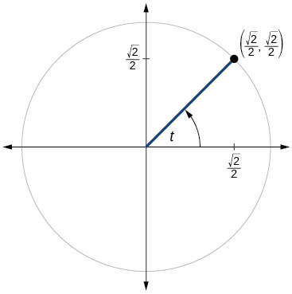 

  

<math xmlns="http://www.w3.org/1998/Math/MathML"> <mrow> <mi>sin</mi><mi>t</mi><mo>=</mo><mfrac> <mn>1</mn> <mn>2</mn> </mfrac> <mo>,</mo><mi>cos</mi><mi>t</mi><mo>=</mo><mo>−</mo><mfrac> <mrow> <msqrt> <mn>3</mn> </msqrt> </mrow> <mn>2</mn> </mfrac> </mrow> </math>

  

  

<math xmlns="http://www.w3.org/1998/Math/MathML"> <mrow> <mi>sin</mi><mi>t</mi><mo>=</mo><mo>−</mo><mfrac> <mrow> <msqrt> <mn>2</mn> </msqrt> </mrow> <mn>2</mn> </mfrac> <mo>,</mo><mi>cos</mi><mi>t</mi><mo>=</mo><mo>−</mo><mfrac> <mrow> <msqrt> <mn>2</mn> </msqrt> </mrow> <mn>2</mn> </mfrac> </mrow> </math>

 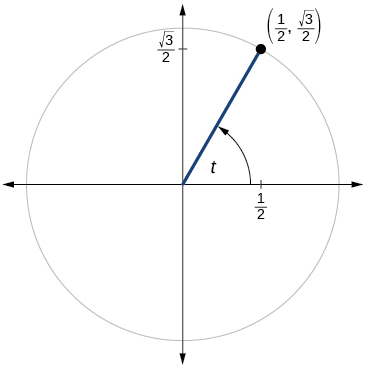 

  

<math xmlns="http://www.w3.org/1998/Math/MathML"> <mrow> <mi>sin</mi><mi>t</mi><mo>=</mo><mfrac> <mrow> <msqrt> <mn>3</mn> </msqrt> </mrow> <mn>2</mn> </mfrac> <mo>,</mo><mi>cos</mi><mi>t</mi><mo>=</mo><mo>−</mo><mfrac> <mn>1</mn> <mn>2</mn> </mfrac> </mrow> </math>

 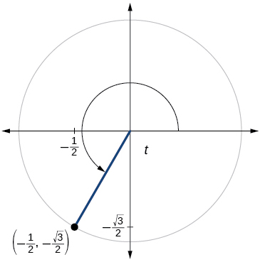 

  

<math xmlns="http://www.w3.org/1998/Math/MathML"> <mrow> <mi>sin</mi><mi>t</mi><mo>=</mo><mo>−</mo><mfrac> <mrow> <msqrt> <mn>2</mn> </msqrt> </mrow> <mn>2</mn> </mfrac> <mo>,</mo><mi>cos</mi><mi>t</mi><mo>=</mo><mfrac> <mrow> <msqrt> <mn>2</mn> </msqrt> </mrow> <mn>2</mn> </mfrac> </mrow> </math>

 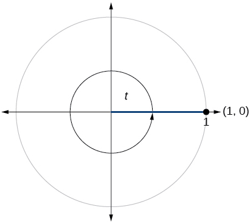 

  

<math xmlns="http://www.w3.org/1998/Math/MathML"> <mrow> <mi>sin</mi><mi>t</mi><mo>=</mo><mn>0</mn><mo>,</mo><mo> </mo><mi>cos</mi><mi>t</mi><mo>=</mo><mo>−</mo><mn>1</mn> </mrow> </math>

 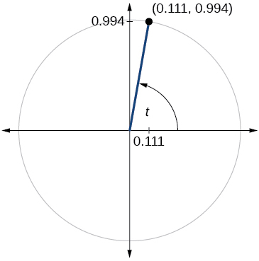 

 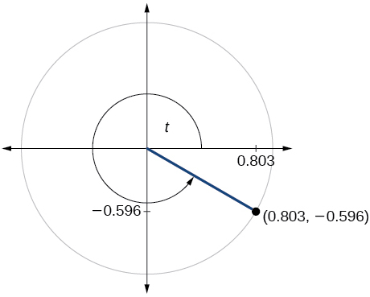 

<math xmlns="http://www.w3.org/1998/Math/MathML"> <mrow> <mi>sin</mi><mi>t</mi><mo>=</mo><mo>−</mo><mn>0.596</mn><mo>,</mo><mo> </mo><mi>cos</mi><mi>t</mi><mo>=</mo><mn>0.803</mn> </mrow> </math>

 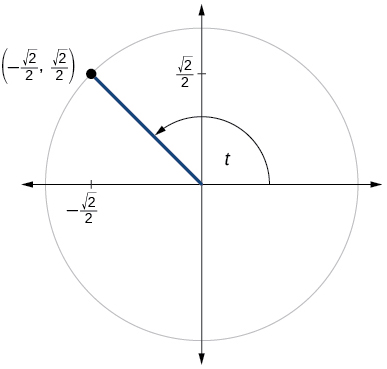 

 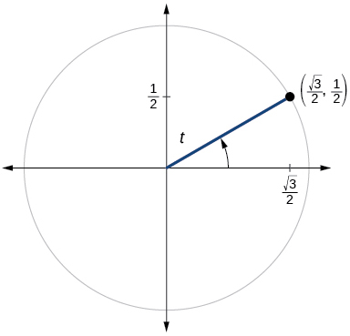 

<math xmlns="http://www.w3.org/1998/Math/MathML"> <mrow> <mi>sin</mi><mi>t</mi><mo>=</mo><mfrac> <mn>1</mn> <mn>2</mn> </mfrac> <mo>,</mo><mi>cos</mi><mi>t</mi><mo>=</mo><mfrac> <mrow> <msqrt> <mn>3</mn> </msqrt> </mrow> <mn>2</mn> </mfrac> </mrow> </math>

 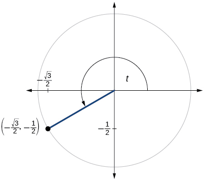 

 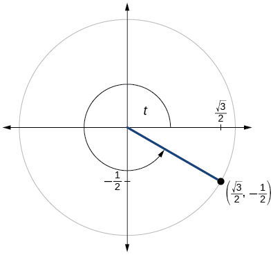 

<math xmlns="http://www.w3.org/1998/Math/MathML"> <mrow> <mi>sin</mi><mi>t</mi><mo>=</mo><mo>−</mo><mfrac> <mn>1</mn> <mn>2</mn> </mfrac> <mo>,</mo><mi>cos</mi><mi>t</mi><mo>=</mo><mfrac> <mrow> <msqrt> <mn>3</mn> </msqrt> </mrow> <mn>2</mn> </mfrac> </mrow> </math>

 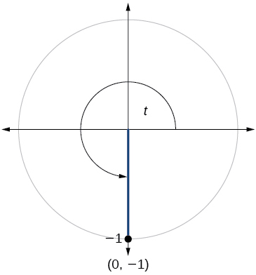 

 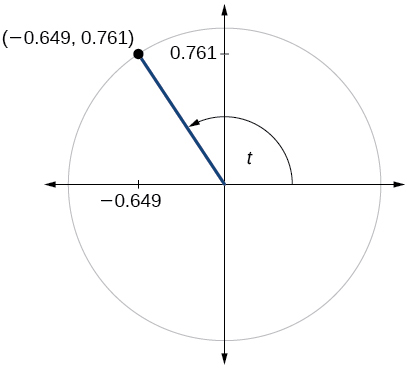 

<math xmlns="http://www.w3.org/1998/Math/MathML"> <mrow> <mi>sin</mi><mi>t</mi><mo>=</mo><mn>0.761</mn><mo>,</mo><mi>cos</mi><mi>t</mi><mo>=</mo><mo>−</mo><mn>0.649</mn> </mrow> </math>

  

 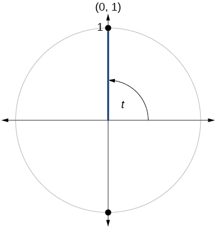 

<math xmlns="http://www.w3.org/1998/Math/MathML"> <mrow> <mi>sin</mi><mi>t</mi><mo>=</mo><mn>1</mn><mo>,</mo><mi>cos</mi><mi>t</mi><mo>=</mo><mn>0</mn> </mrow> </math>

#### Technology

For the following exercises, use a graphing calculator to evaluate.

<math xmlns="http://www.w3.org/1998/Math/MathML"> <mrow> <mi>sin</mi><mtext> </mtext><mfrac> <mrow> <mn>5</mn><mi>π</mi></mrow> <mn>9</mn> </mfrac> </mrow> </math>

<math xmlns="http://www.w3.org/1998/Math/MathML"> <mrow> <mi>cos</mi><mtext> </mtext><mfrac> <mrow> <mn>5</mn><mi>π</mi></mrow> <mn>9</mn> </mfrac> </mrow> </math>

−0.1736

<math xmlns="http://www.w3.org/1998/Math/MathML"> <mrow> <mi>sin</mi><mtext> </mtext><mfrac> <mi>π</mi> <mrow> <mn>10</mn></mrow> </mfrac> </mrow> </math>

<math xmlns="http://www.w3.org/1998/Math/MathML"> <mrow> <mi>cos</mi><mtext> </mtext><mfrac> <mi>π</mi> <mrow> <mn>10</mn></mrow> </mfrac> </mrow> </math>

0\.9511

<math xmlns="http://www.w3.org/1998/Math/MathML"> <mrow> <mi>sin</mi><mtext> </mtext><mfrac> <mrow> <mn>3</mn><mi>π</mi></mrow> <mn>4</mn> </mfrac> </mrow> </math>

<math xmlns="http://www.w3.org/1998/Math/MathML"> <mrow> <mi>cos</mi><mtext> </mtext><mfrac> <mrow> <mn>3</mn><mi>π</mi></mrow> <mn>4</mn> </mfrac> </mrow> </math>

−0.7071

<math xmlns="http://www.w3.org/1998/Math/MathML"> <mrow> <mi>sin</mi><mtext> </mtext><mn>98°</mn></mrow> </math>

<math xmlns="http://www.w3.org/1998/Math/MathML"> <mrow> <mi>cos</mi><mtext> </mtext><mn>98°</mn></mrow> </math>

−0.1392

<math xmlns="http://www.w3.org/1998/Math/MathML"> <mrow> <mi>cos</mi><mtext> </mtext><mn>310°</mn></mrow> </math>

<math xmlns="http://www.w3.org/1998/Math/MathML"> <mrow> <mi>sin</mi><mtext> </mtext><mn>310°</mn></mrow> </math>

−0.7660

#### Extensions

For the following exercises, evaluate.

<math xmlns="http://www.w3.org/1998/Math/MathML"> <mrow> <mi>sin</mi><mrow><mo>(</mo> <mrow> <mfrac> <mrow> <mn>11</mn><mi>π</mi></mrow> <mn>3</mn> </mfrac> </mrow> <mo>)</mo></mrow><mtext> </mtext><mi>cos</mi><mrow><mo>(</mo> <mrow> <mfrac> <mrow> <mo>−</mo><mn>5</mn><mi>π</mi></mrow> <mn>6</mn> </mfrac> </mrow> <mo>)</mo></mrow></mrow> </math>

<math xmlns="http://www.w3.org/1998/Math/MathML"> <mrow> <mi>sin</mi><mrow><mo>(</mo> <mrow> <mfrac> <mrow> <mn>3</mn><mi>π</mi></mrow> <mn>4</mn> </mfrac> </mrow> <mo>)</mo></mrow><mtext> </mtext><mi>cos</mi><mrow><mo>(</mo> <mrow> <mfrac> <mrow> <mn>5</mn><mi>π</mi></mrow> <mn>3</mn> </mfrac> </mrow> <mo>)</mo></mrow></mrow> </math>

<math xmlns="http://www.w3.org/1998/Math/MathML"> <mrow> <mfrac> <mrow> <msqrt> <mn>2</mn> </msqrt> </mrow> <mn>4</mn> </mfrac> </mrow> </math>

<math xmlns="http://www.w3.org/1998/Math/MathML"> <mrow> <mi>sin</mi><mrow><mo>(</mo> <mrow> <mo>−</mo><mfrac> <mrow> <mn>4</mn><mi>π</mi></mrow> <mn>3</mn> </mfrac> </mrow> <mo>)</mo></mrow><mtext> </mtext><mi>cos</mi><mrow><mo>(</mo> <mrow> <mfrac> <mi>π</mi> <mn>2</mn> </mfrac> </mrow> <mo>)</mo></mrow></mrow> </math>

<math xmlns="http://www.w3.org/1998/Math/MathML"> <mrow> <mi>sin</mi><mrow><mo>(</mo> <mrow> <mfrac> <mrow> <mo>−</mo><mn>9</mn><mi>π</mi></mrow> <mn>4</mn> </mfrac> </mrow> <mo>)</mo></mrow><mtext> </mtext><mi>cos</mi><mrow><mo>(</mo> <mrow> <mfrac> <mrow> <mo>−</mo><mi>π</mi></mrow> <mn>6</mn> </mfrac> </mrow> <mo>)</mo></mrow></mrow> </math>

<math xmlns="http://www.w3.org/1998/Math/MathML"> <mrow> <mo>−</mo><mfrac> <mrow> <msqrt> <mn>6</mn> </msqrt> </mrow> <mn>4</mn> </mfrac> </mrow> </math>

<math xmlns="http://www.w3.org/1998/Math/MathML"> <mrow> <mi>sin</mi><mrow><mo>(</mo> <mrow> <mfrac> <mi>π</mi> <mn>6</mn> </mfrac> </mrow> <mo>)</mo></mrow><mtext> </mtext><mi>cos</mi><mrow><mo>(</mo> <mrow> <mfrac> <mrow> <mo>−</mo><mi>π</mi></mrow> <mn>3</mn> </mfrac> </mrow> <mo>)</mo></mrow></mrow> </math>

<math xmlns="http://www.w3.org/1998/Math/MathML"> <mrow> <mi>sin</mi><mrow><mo>(</mo> <mrow> <mfrac> <mrow> <mn>7</mn><mi>π</mi></mrow> <mn>4</mn> </mfrac> </mrow> <mo>)</mo></mrow><mi>cos</mi><mrow><mo>(</mo> <mrow> <mfrac> <mrow> <mo>−</mo><mn>2</mn><mi>π</mi></mrow> <mn>3</mn> </mfrac> </mrow> <mo>)</mo></mrow></mrow> </math>

<math xmlns="http://www.w3.org/1998/Math/MathML"> <mrow> <mfrac> <mrow> <msqrt> <mn>2</mn> </msqrt> </mrow> <mn>4</mn> </mfrac> </mrow> </math>

<math xmlns="http://www.w3.org/1998/Math/MathML"> <mrow> <mi>cos</mi><mrow><mo>(</mo> <mrow> <mfrac> <mrow> <mn>5</mn><mi>π</mi></mrow> <mn>6</mn> </mfrac> </mrow> <mo>)</mo></mrow><mtext> </mtext><mi>cos</mi><mrow><mo>(</mo> <mrow> <mfrac> <mrow> <mn>2</mn><mi>π</mi></mrow> <mn>3</mn> </mfrac> </mrow> <mo>)</mo></mrow></mrow> </math>

<math xmlns="http://www.w3.org/1998/Math/MathML"> <mrow> <mi>cos</mi><mrow><mo>(</mo> <mrow> <mfrac> <mrow> <mo>−</mo><mi>π</mi></mrow> <mn>3</mn> </mfrac> </mrow> <mo>)</mo></mrow><mi>cos</mi><mrow><mo>(</mo> <mrow> <mfrac> <mi>π</mi> <mn>4</mn> </mfrac> </mrow> <mo>)</mo></mrow></mrow> </math>

<math xmlns="http://www.w3.org/1998/Math/MathML"> <mrow> <mfrac> <mrow> <msqrt> <mn>2</mn> </msqrt> </mrow> <mn>4</mn> </mfrac> </mrow> </math>

<math xmlns="http://www.w3.org/1998/Math/MathML"> <mrow> <mi>sin</mi><mrow><mo>(</mo> <mrow> <mfrac> <mrow> <mo>−</mo><mn>5</mn><mi>π</mi></mrow> <mn>4</mn> </mfrac> </mrow> <mo>)</mo></mrow><mtext> </mtext><mi>sin</mi><mrow><mo>(</mo> <mrow> <mfrac> <mrow> <mn>11</mn><mi>π</mi></mrow> <mn>6</mn> </mfrac> </mrow> <mo>)</mo></mrow></mrow> </math>

<math xmlns="http://www.w3.org/1998/Math/MathML"> <mrow> <mi>sin</mi><mrow><mo>(</mo> <mi>π</mi> <mo>)</mo></mrow><mi>sin</mi><mrow><mo>(</mo> <mrow> <mfrac> <mi>π</mi> <mn>6</mn> </mfrac> </mrow> <mo>)</mo></mrow></mrow> </math>

0

#### Real-World Applications

For the following exercises, use this scenario: A child enters a carousel that takes one minute to revolve once around. The child enters at the point<math xmlns="http://www.w3.org/1998/Math/MathML"> <mrow> <mtext> </mtext><mo stretchy="false">(</mo><mn>0</mn><mo>,</mo><mn>1</mn><mo stretchy="false">)</mo><mo>,</mo> </mrow> </math>

that is, on the due north position. Assume the carousel revolves counter clockwise.

What are the coordinates of the child after 45 seconds?

What are the coordinates of the child after 90 seconds?

<math xmlns="http://www.w3.org/1998/Math/MathML"> <mrow> <mrow><mo>(</mo> <mrow> <mn>0</mn><mo>,</mo><mn>–1</mn> </mrow> <mo>)</mo></mrow> </mrow> </math>

What are the coordinates of the child after 125 seconds?

When will the child have coordinates<math xmlns="http://www.w3.org/1998/Math/MathML"> <mrow> <mtext> </mtext><mo stretchy="false">(</mo><mn>0.707</mn><mo>,</mo><mn>–0.707</mn><mo stretchy="false">)</mo><mtext> </mtext> </mrow> </math>

if the ride lasts 6 minutes? (There are multiple answers.)

37\.5 seconds, 97.5 seconds, 157.5 seconds, 217.5 seconds, 277.5 seconds, 337.5 seconds

When will the child have coordinates<math xmlns="http://www.w3.org/1998/Math/MathML"> <mrow> <mtext> </mtext><mrow><mo>(</mo> <mrow> <mn>–0.866</mn><mo>,</mo><mn>–0.5</mn> </mrow> <mo>)</mo></mrow><mtext> </mtext> </mrow> </math>

if the ride lasts 6 minutes?

### Glossary
{: data-type="glossary-title"}

cosine function
: the *x*-value of the point on a unit circle corresponding to a given angle
^

Pythagorean Identity
: a corollary of the Pythagorean Theorem stating that the square of the cosine of a given angle plus the square of the sine of that angle equals 1
^

sine function
: the *y*-value of the point on a unit circle corresponding to a given angle

[1]: http://openstaxcollege.org/l/trigunitcir
[2]: http://openstaxcollege.org/l/sincosuc
[3]: http://openstaxcollege.org/l/sincosmult
[4]: http://openstaxcollege.org/l/sincosmult4
[5]: http://openstaxcollege.org/l/trigrefang
