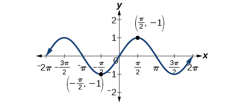
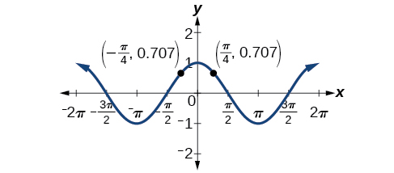
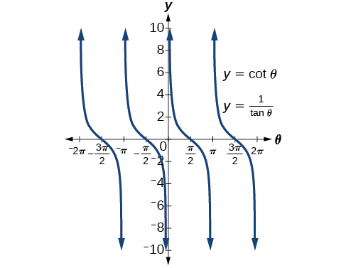

In this section, you will:
* Verify the fundamental trigonometric identities.
* Simplify trigonometric expressions using algebra and the identities.

 {: #Figure_07_01_006}

In espionage movies, we see international spies with multiple passports, each claiming a different identity. However, we know that each of those passports represents the same person. The trigonometric identities act in a similar manner to multiple passports—there are many ways to represent the same trigonometric expression. Just as a spy will choose an Italian passport when traveling to Italy, we choose the identity that applies to the given scenario when solving a trigonometric equation.

In this section, we will begin an examination of the fundamental trigonometric identities, including how we can verify them and how we can use them to simplify trigonometric expressions.

### Verifying the Fundamental Trigonometric Identities 

Identities enable us to simplify complicated expressions. They are the basic tools of trigonometry used in solving trigonometric equations, just as factoring, finding common denominators, and using special formulas are the basic tools of solving algebraic equations. In fact, we use algebraic techniques constantly to simplify trigonometric expressions. Basic properties and formulas of algebra, such as the difference of squares formula and the perfect squares formula, will simplify the work involved with trigonometric expressions and equations. We already know that all of the trigonometric functions are related because they all are defined in terms of the unit circle. Consequently, any trigonometric identity can be written in many ways.

To verify the trigonometric identities, we usually start with the more complicated side of the equation and essentially rewrite the expression until it has been transformed into the same expression as the other side of the equation. Sometimes we have to factor expressions, expand expressions, find common denominators, or use other algebraic strategies to obtain the desired result. In this first section, we will work with the fundamental identities: the **Pythagorean identities**{: data-type="term" .no-emphasis}, the even-odd identities, the reciprocal identities, and the quotient identities.

We will begin with the <strong>Pythagorean identities </strong>(see [\[link\]](#Table_07_01_01)), which are equations involving trigonometric functions based on the properties of a right triangle. We have already seen and used the first of these identifies, but now we will also use additional identities.

<table id="Table_07_01_01" summary="&quot;Pythagorean Identities&quot; with three cells. First: sin(theta)^2 + cos(theta)^2 = 1. Second: 1 + cot(theta)^2 = csc(theta)^2. Third: 1 + tan(theta)^2 = sec(theta)^2."><caption></caption><colgroup><col align="center" /><col align="center" /><col align="center" /></colgroup><thead>
<tr>
<th colspan="3">Pythagorean Identities
</th>
</tr>
</thead><tbody>
<tr>
<td><math xmlns="http://www.w3.org/1998/Math/MathML">
<mrow>
<msup>
<mrow>
<mi>sin</mi>
</mrow>
<mn>2</mn>
</msup>
<mi>θ</mi><mo>+</mo><msup>
<mrow>
<mi>cos</mi>
</mrow>
<mn>2</mn>
</msup>
<mi>θ</mi><mo>=</mo><mn>1</mn>
</mrow>
</math>
</td>
<td><math xmlns="http://www.w3.org/1998/Math/MathML">
<mrow>
<mn>1</mn><mo>+</mo><msup>
<mrow>
<mi>cot</mi>
</mrow>
<mn>2</mn>
</msup>
<mi>θ</mi><mo>=</mo><msup>
<mrow>
<mi>csc</mi>
</mrow>
<mn>2</mn>
</msup>
<mi>θ</mi>
</mrow>
</math>
</td>
<td><math xmlns="http://www.w3.org/1998/Math/MathML">
<mrow>
<mn>1</mn><mo>+</mo><msup>
<mrow>
<mi>tan</mi>
</mrow>
<mn>2</mn>
</msup>
<mi>θ</mi><mo>=</mo><msup>
<mrow>
<mi>sec</mi>
</mrow>
<mn>2</mn>
</msup>
<mi>θ</mi>
</mrow>
</math>
</td>
</tr>
</tbody></table>

The second and third identities can be obtained by manipulating the first. The identity<math xmlns="http://www.w3.org/1998/Math/MathML"> <mrow> <mtext> </mtext><mn>1</mn><mo>+</mo><msup> <mrow> <mi>cot</mi> </mrow> <mn>2</mn> </msup> <mi>θ</mi><mo>=</mo><msup> <mrow> <mi>csc</mi> </mrow> <mn>2</mn> </msup> <mi>θ</mi><mtext> </mtext> </mrow> </math>

is found by rewriting the left side of the equation in terms of sine and cosine.

Prove:<math xmlns="http://www.w3.org/1998/Math/MathML"> <mrow> <mtext> </mtext><mn>1</mn><mo>+</mo><msup> <mrow> <mi>cot</mi> </mrow> <mn>2</mn> </msup> <mi>θ</mi><mo>=</mo><msup> <mrow> <mi>csc</mi> </mrow> <mn>2</mn> </msup> <mi>θ</mi> </mrow> </math>

<math xmlns="http://www.w3.org/1998/Math/MathML" display="block"> <mrow> <mtable> <mtr rowalign="center"> <mtd columnalign="right" rowalign="center"> <mrow> <mn>1</mn><mo>+</mo><msup> <mrow> <mi>cot</mi> </mrow> <mn>2</mn> </msup> <mi>θ</mi> </mrow> </mtd> <mtd rowalign="center"> <mo>=</mo> </mtd> <mtd columnalign="left" rowalign="center"> <mrow> <mrow><mo>(</mo> <mrow> <mn>1</mn><mo>+</mo><mfrac> <mrow> <msup> <mrow> <mi>cos</mi> </mrow> <mn>2</mn> </msup> <mi>θ</mi> </mrow> <mrow> <msup> <mrow> <mi>sin</mi> </mrow> <mn>2</mn> </msup> <mi>θ</mi> </mrow> </mfrac> </mrow> <mo>)</mo></mrow> </mrow> </mtd> <mtd columnalign="left" rowalign="center"> <mrow><mspace width="2em" /> <mtext>Rewrite the left side</mtext><mo>.</mo> </mrow> </mtd> </mtr> <mtr rowalign="center"> <mtd rowalign="center" /> <mtd rowalign="center"> <mo>=</mo> </mtd> <mtd columnalign="left" rowalign="center"> <mrow> <mrow><mo>(</mo> <mrow> <mfrac> <mrow> <msup> <mrow> <mi>sin</mi> </mrow> <mn>2</mn> </msup> <mi>θ</mi> </mrow> <mrow> <msup> <mrow> <mi>sin</mi> </mrow> <mn>2</mn> </msup> <mi>θ</mi> </mrow> </mfrac> </mrow> <mo>)</mo></mrow><mo>+</mo><mrow><mo>(</mo> <mrow> <mfrac> <mrow> <msup> <mrow> <mi>cos</mi> </mrow> <mn>2</mn> </msup> <mi>θ</mi> </mrow> <mrow> <msup> <mrow> <mi>sin</mi> </mrow> <mn>2</mn> </msup> <mi>θ</mi> </mrow> </mfrac> </mrow> <mo>)</mo></mrow> </mrow> </mtd> <mtd columnalign="left" rowalign="center"> <mrow><mspace width="2em" /> <mtext>Write both terms with the common denominator</mtext><mo>.</mo> </mrow> </mtd> </mtr> <mtr rowalign="center"> <mtd rowalign="center" /> <mtd rowalign="center"> <mo>=</mo> </mtd> <mtd columnalign="left" rowalign="center"> <mrow> <mfrac> <mrow> <msup> <mrow> <mi>sin</mi> </mrow> <mn>2</mn> </msup> <mi>θ</mi><mo>+</mo><msup> <mrow> <mi>cos</mi> </mrow> <mn>2</mn> </msup> <mi>θ</mi> </mrow> <mrow> <msup> <mrow> <mi>sin</mi> </mrow> <mn>2</mn> </msup> <mi>θ</mi> </mrow> </mfrac> </mrow> </mtd> <mtd rowalign="center" /> </mtr> <mtr rowalign="center"> <mtd rowalign="center" /> <mtd rowalign="center"> <mo>=</mo> </mtd> <mtd columnalign="left" rowalign="center"> <mrow> <mfrac> <mn>1</mn> <mrow> <msup> <mrow> <mi>sin</mi> </mrow> <mn>2</mn> </msup> <mi>θ</mi> </mrow> </mfrac> </mrow> </mtd> <mtd rowalign="center" /> </mtr> <mtr rowalign="center"> <mtd rowalign="center" /> <mtd rowalign="center"> <mo>=</mo> </mtd> <mtd columnalign="left" rowalign="center"> <mrow> <msup> <mrow> <mi>csc</mi> </mrow> <mn>2</mn> </msup> <mi>θ</mi> </mrow> </mtd> <mtd rowalign="center" /> </mtr> </mtable> </mrow> </math>

Similarly,<math xmlns="http://www.w3.org/1998/Math/MathML"> <mrow> <mtext> </mtext><mn>1</mn><mo>+</mo><msup> <mrow> <mi>tan</mi> </mrow> <mn>2</mn> </msup> <mi>θ</mi><mo>=</mo><msup> <mrow> <mi>sec</mi> </mrow> <mn>2</mn> </msup> <mi>θ</mi><mtext> </mtext> </mrow> </math>

can be obtained by rewriting the left side of this identity in terms of sine and cosine. This gives

<math xmlns="http://www.w3.org/1998/Math/MathML" display="block"> <mrow> <mtable> <mtr rowalign="center"> <mtd columnalign="right" rowalign="center"> <mrow> <mn>1</mn><mo>+</mo><msup> <mrow> <mi>tan</mi> </mrow> <mn>2</mn> </msup> <mi>θ</mi> </mrow> </mtd> <mtd rowalign="center"> <mo>=</mo> </mtd> <mtd columnalign="left" rowalign="center"> <mrow> <mn>1</mn><mo>+</mo><msup> <mrow> <mrow><mo>(</mo> <mrow> <mfrac> <mrow> <mi>sin</mi><mtext> </mtext><mi>θ</mi> </mrow> <mrow> <mi>cos</mi><mtext> </mtext><mi>θ</mi> </mrow> </mfrac> </mrow> <mo>)</mo></mrow> </mrow> <mn>2</mn> </msup> </mrow> </mtd> <mtd columnalign="left" rowalign="center"> <mrow><mspace width="1em" /> <mtext>Rewrite left side</mtext><mo>.</mo> </mrow> </mtd> </mtr> <mtr rowalign="center"> <mtd rowalign="center" /> <mtd rowalign="center"> <mo>=</mo> </mtd> <mtd columnalign="left" rowalign="center"> <mrow> <msup> <mrow> <mrow><mo>(</mo> <mrow> <mfrac> <mrow> <mi>cos</mi><mtext> </mtext><mi>θ</mi> </mrow> <mrow> <mi>cos</mi><mtext> </mtext><mi>θ</mi> </mrow> </mfrac> </mrow> <mo>)</mo></mrow> </mrow> <mn>2</mn> </msup> <mo>+</mo><msup> <mrow> <mrow><mo>(</mo> <mrow> <mfrac> <mrow> <mi>sin</mi><mtext> </mtext><mi>θ</mi> </mrow> <mrow> <mi>cos</mi><mtext> </mtext><mi>θ</mi> </mrow> </mfrac> </mrow> <mo>)</mo></mrow> </mrow> <mn>2</mn> </msup> </mrow> </mtd> <mtd columnalign="left" rowalign="center"> <mrow><mspace width="1em" /> <mtext>Write both terms with the common denominator</mtext><mo>.</mo> </mrow> </mtd> </mtr> <mtr rowalign="center"> <mtd rowalign="center" /> <mtd rowalign="center"> <mo>=</mo> </mtd> <mtd columnalign="left" rowalign="center"> <mrow> <mfrac> <mrow> <msup> <mrow> <mi>cos</mi> </mrow> <mn>2</mn> </msup> <mtext> </mtext><mi>θ</mi><mo>+</mo><msup> <mrow> <mi>sin</mi> </mrow> <mn>2</mn> </msup> <mtext> </mtext><mi>θ</mi> </mrow> <mrow> <msup> <mrow> <mi>cos</mi> </mrow> <mn>2</mn> </msup> <mtext> </mtext><mi>θ</mi> </mrow> </mfrac> </mrow> </mtd> <mtd rowalign="center" /> </mtr> <mtr rowalign="center"> <mtd rowalign="center" /> <mtd rowalign="center"> <mo>=</mo> </mtd> <mtd columnalign="left" rowalign="center"> <mrow> <mfrac> <mn>1</mn> <mrow> <msup> <mrow> <mi>cos</mi> </mrow> <mn>2</mn> </msup> <mtext> </mtext><mi>θ</mi> </mrow> </mfrac> </mrow> </mtd> <mtd rowalign="center" /> </mtr> <mtr rowalign="center"> <mtd rowalign="center" /> <mtd rowalign="center"> <mo>=</mo> </mtd> <mtd columnalign="left" rowalign="center"> <mrow> <msup> <mrow> <mi>sec</mi> </mrow> <mn>2</mn> </msup> <mtext> </mtext><mi>θ</mi> </mrow> </mtd> <mtd rowalign="center" /> </mtr> </mtable> </mrow> </math>

Recall that we determined which trigonometric functions are odd and which are even. The next set of fundamental identities is the set of <strong>even-odd identities. </strong>The **even-odd identities**{: data-type="term" .no-emphasis} relate the value of a trigonometric function at a given angle to the value of the function at the opposite angle. (See [\[link\]](#Table_07_01_02)).

<table id="Table_07_01_02" summary="&quot;Even-Odd Identities&quot; with three cells. First: tan(-theta) = -tan(theta) and cot(-theta) = -cot(theta). Second: sin(-theta) = -sin(theta) and csc(-theta) = -csc(theta). Third: cos(-theta) = cos(theta) and sec(-theta) = sec(theta)."><thead>
<tr>
<th colspan="3" data-align="center">Even-Odd Identities</th>
</tr>
</thead><tbody>
<tr>

<td><math xmlns="http://www.w3.org/1998/Math/MathML">
<mrow>
<mtable columnalign="left">
<mtr columnalign="left">
<mtd columnalign="left">
<mrow>
<mi>tan</mi><mo stretchy="false">(</mo><mo>−</mo><mi>θ</mi><mo stretchy="false">)</mo><mo>=</mo><mo>−</mo><mi>tan</mi><mtext> </mtext><mi>θ</mi>
</mrow>
</mtd>
</mtr>
<mtr columnalign="left">
<mtd columnalign="left">
<mrow>
<mi>cot</mi><mo stretchy="false">(</mo><mo>−</mo><mi>θ</mi><mo stretchy="false">)</mo><mo>=</mo><mo>−</mo><mi>cot</mi><mtext> </mtext><mi>θ</mi>
</mrow>
</mtd>
</mtr>

</mtable>
</mrow>
</math>

</td>
<td><math xmlns="http://www.w3.org/1998/Math/MathML">
<mrow>
<mtable columnalign="left">
<mtr columnalign="left">
<mtd columnalign="left">
<mrow>
<mi>sin</mi><mo stretchy="false">(</mo><mo>−</mo><mi>θ</mi><mo stretchy="false">)</mo><mo>=</mo><mo>−</mo><mi>sin</mi><mtext> </mtext><mi>θ</mi>
</mrow>
</mtd>
</mtr>
<mtr columnalign="left">
<mtd columnalign="left">
<mrow>
<mi>csc</mi><mo stretchy="false">(</mo><mo>−</mo><mi>θ</mi><mo stretchy="false">)</mo><mo>=</mo><mo>−</mo><mi>csc</mi><mtext> </mtext><mi>θ</mi>
</mrow>
</mtd>
</mtr>

</mtable>
</mrow>
</math>

</td>
<td><math xmlns="http://www.w3.org/1998/Math/MathML">
<mrow>
<mtable columnalign="left">
<mtr columnalign="left">
<mtd columnalign="left">
<mrow>
<mi>cos</mi><mo stretchy="false">(</mo><mo>−</mo><mi>θ</mi><mo stretchy="false">)</mo><mo>=</mo><mi>cos</mi><mtext> </mtext><mi>θ</mi>
</mrow>
</mtd>
</mtr>
<mtr columnalign="left">
<mtd columnalign="left">
<mrow>
<mi>sec</mi><mo stretchy="false">(</mo><mo>−</mo><mi>θ</mi><mo stretchy="false">)</mo><mo>=</mo><mi>sec</mi><mtext> </mtext><mi>θ</mi>
</mrow>
</mtd>
</mtr>

</mtable>
</mrow>
</math>

</td>
</tr>
</tbody></table>

Recall that an **odd function**{: data-type="term" .no-emphasis} is one in which<math xmlns="http://www.w3.org/1998/Math/MathML"> <mrow> <mtext> </mtext><mi>f</mi><mrow><mo>(−</mo> <mrow> <mi>x</mi> </mrow> <mo>)</mo></mrow><mo>= −</mo><mi>f</mi><mrow><mo>(</mo> <mi>x</mi> <mo>)</mo></mrow><mtext> </mtext> </mrow> </math>

for all<math xmlns="http://www.w3.org/1998/Math/MathML"> <mrow> <mtext> </mtext><mi>x</mi><mtext> </mtext> </mrow> </math>

in the domain of<math xmlns="http://www.w3.org/1998/Math/MathML"> <mrow> <mtext> </mtext><mi>f</mi><mo>.</mo><mtext> </mtext> </mrow> </math>

The **sine**{: data-type="term" .no-emphasis} function is an odd function because<math xmlns="http://www.w3.org/1998/Math/MathML"> <mrow> <mtext> </mtext><mi>sin</mi><mrow><mo>(</mo> <mrow> <mo>−</mo><mi>θ</mi> </mrow> <mo>)</mo></mrow><mo>=</mo><mo>−</mo><mi>sin</mi><mtext> </mtext><mi>θ</mi><mo>.</mo><mtext> </mtext> </mrow> </math>

The graph of an odd function is symmetric about the origin. For example, consider corresponding inputs of<math xmlns="http://www.w3.org/1998/Math/MathML"> <mrow> <mtext> </mtext><mfrac> <mi>π</mi> <mn>2</mn> </mfrac> <mtext> </mtext> </mrow> </math>

and<math xmlns="http://www.w3.org/1998/Math/MathML"> <mrow> <mtext> </mtext><mo>−</mo><mfrac> <mi>π</mi> <mn>2</mn> </mfrac> <mo>.</mo><mtext> </mtext> </mrow> </math>

The output of<math xmlns="http://www.w3.org/1998/Math/MathML"> <mrow> <mtext> </mtext><mi>sin</mi><mrow><mo>(</mo> <mrow> <mfrac> <mi>π</mi> <mn>2</mn> </mfrac> </mrow> <mo>)</mo></mrow><mtext> </mtext> </mrow> </math>

is opposite the output of<math xmlns="http://www.w3.org/1998/Math/MathML"> <mrow> <mtext> </mtext><mi>sin</mi><mrow><mo>(</mo> <mrow> <mo>−</mo><mfrac> <mi>π</mi> <mn>2</mn> </mfrac> </mrow> <mo>)</mo></mrow><mo>.</mo><mtext> </mtext> </mrow> </math>

Thus,

<math xmlns="http://www.w3.org/1998/Math/MathML" display="block"> <mrow> <mtable> <mtr rowalign="center"> <mtd columnalign="right" rowalign="center"> <mrow> <mi>sin</mi><mrow><mo>(</mo> <mrow> <mfrac> <mi>π</mi> <mn>2</mn> </mfrac> </mrow> <mo>)</mo></mrow> </mrow> </mtd> <mtd rowalign="center"> <mo>=</mo> </mtd> <mtd columnalign="left" rowalign="center"> <mn>1</mn> </mtd> </mtr> <mtr rowalign="center"> <mtd rowalign="center" /> <mtd rowalign="center"> <mrow> <mtext>and</mtext> </mrow> </mtd> <mtd rowalign="center" /> </mtr> <mtr rowalign="center"> <mtd columnalign="right" rowalign="center"> <mrow> <mi>sin</mi><mrow><mo>(</mo> <mrow> <mo>−</mo><mfrac> <mi>π</mi> <mn>2</mn> </mfrac> </mrow> <mo>)</mo></mrow> </mrow> </mtd> <mtd rowalign="center"> <mo>=</mo> </mtd> <mtd columnalign="left" rowalign="center"> <mrow> <mo>−</mo><mi>sin</mi><mrow><mo>(</mo> <mrow> <mfrac> <mi>π</mi> <mn>2</mn> </mfrac> </mrow> <mo>)</mo></mrow> </mrow> </mtd> </mtr> <mtr rowalign="center"> <mtd rowalign="center" /> <mtd rowalign="center"> <mo>=</mo> </mtd> <mtd columnalign="left" rowalign="center"> <mrow> <mn>−1</mn> </mrow> </mtd> </mtr> </mtable> </mrow> </math>

This is shown in [\[link\]](#Figure_07_01_002).

 {: #Figure_07_01_002}

Recall that an **even function**{: data-type="term" .no-emphasis} is one in which

<math xmlns="http://www.w3.org/1998/Math/MathML" display="block"> <mrow> <mi>f</mi><mrow><mo>(</mo> <mrow> <mo>−</mo><mi>x</mi> </mrow> <mo>)</mo></mrow><mo>=</mo><mi>f</mi><mrow><mo>(</mo> <mi>x</mi> <mo>)</mo></mrow><mtext> for all </mtext><mi>x</mi><mtext> in the domain of </mtext><mi>f</mi> </mrow> </math>

The graph of an even function is symmetric about the *y-*axis. The cosine function is an even function because<math xmlns="http://www.w3.org/1998/Math/MathML"> <mrow> <mtext> </mtext><mi>cos</mi><mo stretchy="false">(</mo><mo>−</mo><mi>θ</mi><mo stretchy="false">)</mo><mo>=</mo><mi>cos</mi><mtext> </mtext><mi>θ</mi><mo>.</mo><mtext> </mtext> </mrow> </math>

 For example, consider corresponding inputs<math xmlns="http://www.w3.org/1998/Math/MathML"> <mrow> <mtext> </mtext><mfrac> <mi>π</mi> <mn>4</mn> </mfrac> <mtext> </mtext> </mrow> </math>

and<math xmlns="http://www.w3.org/1998/Math/MathML"> <mrow> <mtext> </mtext><mo>−</mo><mfrac> <mi>π</mi> <mn>4</mn> </mfrac> <mo>.</mo><mtext> </mtext> </mrow> </math>

The output of<math xmlns="http://www.w3.org/1998/Math/MathML"> <mrow> <mtext> </mtext><mi>cos</mi><mrow><mo>(</mo> <mrow> <mfrac> <mi>π</mi> <mn>4</mn> </mfrac> </mrow> <mo>)</mo></mrow><mtext> </mtext> </mrow> </math>

is the same as the output of<math xmlns="http://www.w3.org/1998/Math/MathML"> <mrow> <mtext> </mtext><mi>cos</mi><mrow><mo>(</mo> <mrow> <mo>−</mo><mfrac> <mi>π</mi> <mn>4</mn> </mfrac> </mrow> <mo>)</mo></mrow><mo>.</mo><mtext> </mtext> </mrow> </math>

Thus,

<math xmlns="http://www.w3.org/1998/Math/MathML" display="block"> <mrow> <mtable> <mtr rowalign="center"> <mtd columnalign="right" rowalign="center"> <mrow> <mi>cos</mi><mrow><mo>(</mo> <mrow> <mo>−</mo><mfrac> <mi>π</mi> <mn>4</mn> </mfrac> </mrow> <mo>)</mo></mrow> </mrow> </mtd> <mtd rowalign="center"> <mo>=</mo> </mtd> <mtd columnalign="left" rowalign="center"> <mrow> <mi>cos</mi><mrow><mo>(</mo> <mrow> <mfrac> <mi>π</mi> <mn>4</mn> </mfrac> </mrow> <mo>)</mo></mrow> </mrow> </mtd> </mtr> <mtr rowalign="center"> <mtd rowalign="center" /> <mtd rowalign="center"> <mo>≈</mo> </mtd> <mtd columnalign="left" rowalign="center"> <mrow> <mn>0.707</mn> </mrow> </mtd> </mtr> </mtable> </mrow> </math>

See [\[link\]](#Figure_07_01_003).

 {: #Figure_07_01_003}

For all<math xmlns="http://www.w3.org/1998/Math/MathML"> <mrow> <mtext> </mtext><mi>θ</mi><mtext> </mtext> </mrow> </math>

in the domain of the sine and cosine functions, respectively, we can state the following:

* Since
  <math xmlns="http://www.w3.org/1998/Math/MathML"> <mrow> <mtext> </mtext><mi>sin</mi><mrow><mo>(−</mo><mrow><mi>θ</mi></mrow> <mo>)</mo></mrow><mo>=</mo><mi>−</mi><mi>sin</mi><mtext> </mtext><mi>θ</mi><mo>,</mo></mrow></math>
  
  sine is an odd function.
* Since,
  <math xmlns="http://www.w3.org/1998/Math/MathML"> <mrow> <mtext> </mtext><mi>cos</mi><mrow><mo>(−</mo> <mrow> <mi>θ</mi> </mrow> <mo>)</mo></mrow><mo>=</mo><mi>cos</mi><mtext> </mtext><mi>θ</mi><mo>,</mo> </mrow> </math>
  
  cosine is an even function.

The other even-odd identities follow from the even and odd nature of the sine and cosine functions. For example, consider the tangent identity,<math xmlns="http://www.w3.org/1998/Math/MathML"> <mrow> <mtext> </mtext><mi>tan</mi><mrow><mo>(−</mo> <mrow> <mi>θ</mi> </mrow> <mo>)</mo></mrow><mo>=</mo><mi>−tan</mi><mtext> </mtext><mi>θ</mi><mo>.</mo><mtext> </mtext> </mrow> </math>

We can interpret the tangent of a negative angle as<math xmlns="http://www.w3.org/1998/Math/MathML"> <mrow> <mtext> </mtext><mi>tan</mi><mrow><mo>(−</mo> <mrow> <mi>θ</mi> </mrow> <mo>)</mo></mrow><mo>=</mo><mfrac> <mrow> <mi>sin</mi><mrow><mo>(</mo> <mrow> <mo>−</mo><mi>θ</mi> </mrow> <mo>)</mo></mrow> </mrow> <mrow> <mi>cos</mi><mrow><mo>(−</mo> <mrow> <mi>θ</mi> </mrow> <mo>)</mo></mrow> </mrow> </mfrac> <mo>=</mo><mfrac> <mrow> <mo>−</mo><mi>sin</mi><mtext> </mtext><mi>θ</mi> </mrow> <mrow> <mi>cos</mi><mtext> </mtext><mi>θ</mi> </mrow> </mfrac> <mo>=</mo><mo>−</mo><mi>tan</mi><mtext> </mtext><mi>θ</mi><mo>.</mo><mtext> </mtext> </mrow> </math>

Tangent is therefore an odd function, which means that<math xmlns="http://www.w3.org/1998/Math/MathML"> <mrow> <mtext> </mtext><mi>tan</mi><mrow><mo>(</mo> <mrow> <mo>−</mo><mi>θ</mi> </mrow> <mo>)</mo></mrow><mo>=</mo><mo>−</mo><mi>tan</mi><mrow><mo>(</mo> <mi>θ</mi> <mo>)</mo></mrow><mtext> </mtext> </mrow> </math>

for all<math xmlns="http://www.w3.org/1998/Math/MathML"> <mrow> <mtext> </mtext><mi>θ</mi><mtext> </mtext> </mrow> </math>

in the domain of the **tangent function**{: data-type="term" .no-emphasis}.

The cotangent identity,<math xmlns="http://www.w3.org/1998/Math/MathML"> <mrow> <mtext> </mtext><mi>cot</mi><mrow><mo>(</mo> <mrow> <mo>−</mo><mi>θ</mi> </mrow> <mo>)</mo></mrow><mo>=</mo><mo>−</mo><mi>cot</mi><mtext> </mtext><mi>θ</mi><mo>,</mo> </mrow> </math>

also follows from the sine and cosine identities. We can interpret the cotangent of a negative angle as<math xmlns="http://www.w3.org/1998/Math/MathML"> <mrow> <mtext> </mtext><mi>cot</mi><mrow><mo>(</mo> <mrow> <mo>−</mo><mi>θ</mi> </mrow> <mo>)</mo></mrow><mo>=</mo><mfrac> <mrow> <mi>cos</mi><mrow><mo>(</mo> <mrow> <mo>−</mo><mi>θ</mi> </mrow> <mo>)</mo></mrow> </mrow> <mrow> <mi>sin</mi><mrow><mo>(</mo> <mrow> <mo>−</mo><mi>θ</mi> </mrow> <mo>)</mo></mrow> </mrow> </mfrac> <mo>=</mo><mfrac> <mrow> <mi>cos</mi><mtext> </mtext><mi>θ</mi> </mrow> <mrow> <mo>−</mo><mi>sin</mi><mtext> </mtext><mi>θ</mi> </mrow> </mfrac> <mo>=</mo><mo>−</mo><mi>cot</mi><mtext> </mtext><mi>θ</mi><mo>.</mo><mtext> </mtext> </mrow> </math>

Cotangent is therefore an odd function, which means that<math xmlns="http://www.w3.org/1998/Math/MathML"> <mrow> <mtext> </mtext><mi>cot</mi><mrow><mo>(</mo> <mrow> <mo>−</mo><mi>θ</mi> </mrow> <mo>)</mo></mrow><mo>=</mo><mo>−</mo><mi>cot</mi><mrow><mo>(</mo> <mi>θ</mi> <mo>)</mo></mrow><mtext> </mtext> </mrow> </math>

for all<math xmlns="http://www.w3.org/1998/Math/MathML"> <mrow> <mtext> </mtext><mi>θ</mi><mtext> </mtext> </mrow> </math>

in the domain of the **cotangent function**{: data-type="term" .no-emphasis}.

The **cosecant function**{: data-type="term" .no-emphasis} is the reciprocal of the sine function, which means that the cosecant of a negative angle will be interpreted as<math xmlns="http://www.w3.org/1998/Math/MathML"> <mrow> <mtext> </mtext><mi>csc</mi><mrow><mo>(</mo> <mrow> <mo>−</mo><mi>θ</mi> </mrow> <mo>)</mo></mrow><mo>=</mo><mfrac> <mn>1</mn> <mrow> <mi>sin</mi><mrow><mo>(</mo> <mrow> <mo>−</mo><mi>θ</mi> </mrow> <mo>)</mo></mrow> </mrow> </mfrac> <mo>=</mo><mfrac> <mn>1</mn> <mrow> <mo>−</mo><mi>sin</mi><mtext> </mtext><mi>θ</mi> </mrow> </mfrac> <mo>=</mo><mo>−</mo><mi>csc</mi><mtext> </mtext><mi>θ</mi><mo>.</mo><mtext> </mtext> </mrow> </math>

The cosecant function is therefore odd.

Finally, the secant function is the reciprocal of the cosine function, and the secant of a negative angle is interpreted as<math xmlns="http://www.w3.org/1998/Math/MathML"> <mrow> <mtext> </mtext><mi>sec</mi><mrow><mo>(</mo> <mrow> <mo>−</mo><mi>θ</mi> </mrow> <mo>)</mo></mrow><mo>=</mo><mfrac> <mn>1</mn> <mrow> <mi>cos</mi><mrow><mo>(</mo> <mrow> <mo>−</mo><mi>θ</mi> </mrow> <mo>)</mo></mrow> </mrow> </mfrac> <mo>=</mo><mfrac> <mn>1</mn> <mrow> <mi>cos</mi><mtext> </mtext><mi>θ</mi> </mrow> </mfrac> <mo>=</mo><mi>sec</mi><mtext> </mtext><mi>θ</mi><mo>.</mo><mtext> </mtext> </mrow> </math>

The secant function is therefore even.

To sum up, only two of the trigonometric functions, cosine and secant, are even. The other four functions are odd, verifying the even-odd identities.

The next set of fundamental identities is the set of **reciprocal identities**{: data-type="term"}, which, as their name implies, relate trigonometric functions that are reciprocals of each other. See [\[link\]](#fs-id2031263). Recall that we first encountered these identities when defining trigonometric functions from right angles in [Right Angle Trigonometry](/m51284){: .target-chapter}.

<table summary="Table labeled &quot;Reciprocal Identities.&quot; Three rows, two columns. The table has ordered pairs of these row values: (sin(theta) = 1/csc(theta), csc(theta) = 1/sin(theta)), (cos(theta) = 1/sec(theta), sec(theta) = 1/cos(theta)), (tan(theta) = 1/cot(theta), cot(theta) = 1/tan(theta))."><colgroup><col align="center" /><col align="center" /></colgroup><thead>
<tr>
<th colspan="2">Reciprocal Identities</th>
</tr>
</thead><tbody>
<tr>

<td><math xmlns="http://www.w3.org/1998/Math/MathML">
<mrow>
<mi>sin</mi><mtext> </mtext><mi>θ</mi><mo>=</mo><mfrac>
<mn>1</mn>
<mrow>
<mi>csc</mi><mtext> </mtext><mi>θ</mi>
</mrow>
</mfrac>

</mrow>
</math>
</td>
<td><math xmlns="http://www.w3.org/1998/Math/MathML">
<mrow>
<mi>csc</mi><mtext> </mtext><mi>θ</mi><mo>=</mo><mfrac>
<mn>1</mn>
<mrow>
<mi>sin</mi><mtext> </mtext><mi>θ</mi>
</mrow>
</mfrac>

</mrow>
</math>
</td>
</tr>

<tr>
<td><math xmlns="http://www.w3.org/1998/Math/MathML">
<mrow>
<mi>cos</mi><mtext> </mtext><mi>θ</mi><mo>=</mo><mfrac>
<mn>1</mn>
<mrow>
<mi>sec</mi><mtext> </mtext><mi>θ</mi>
</mrow>
</mfrac>

</mrow>
</math>
</td>
<td><math xmlns="http://www.w3.org/1998/Math/MathML">
<mrow>
<mi>sec</mi><mtext> </mtext><mi>θ</mi><mo>=</mo><mfrac>
<mn>1</mn>
<mrow>
<mi>cos</mi><mtext> </mtext><mi>θ</mi>
</mrow>
</mfrac>

</mrow>
</math>
</td>
</tr>
<tr>
<td><math xmlns="http://www.w3.org/1998/Math/MathML">
<mrow>
<mi>tan</mi><mtext> </mtext><mi>θ</mi><mo>=</mo><mfrac>
<mn>1</mn>
<mrow>
<mi>cot</mi><mtext> </mtext><mi>θ</mi>
</mrow>
</mfrac>

</mrow>
</math>
</td>
<td><math xmlns="http://www.w3.org/1998/Math/MathML">
<mrow>
<mi>cot</mi><mtext> </mtext><mi>θ</mi><mo>=</mo><mfrac>
<mn>1</mn>
<mrow>
<mi>tan</mi><mtext> </mtext><mi>θ</mi>
</mrow>
</mfrac>

</mrow>
</math>
</td>
</tr>
</tbody></table>

The final set of identities is the set of **quotient identities**{: data-type="term" .no-emphasis}, which define relationships among certain trigonometric functions and can be very helpful in verifying other identities. See [\[link\]](#fs-id937819).

<table summary="Table labeled &quot;Quotient Identities.&quot; First cell: tan(theta) = sin(theta) / cos(theta). Second cell: cot(theta) = cos(theta) / sin(theta)."><caption></caption><colgroup><col align="center" /><col align="center" /></colgroup><thead>
<tr>
<th colspan="2">Quotient Identities
</th>
</tr>
</thead><tbody>
<tr>
<td><math xmlns="http://www.w3.org/1998/Math/MathML">
<mrow>
<mi>tan</mi><mtext> </mtext><mi>θ</mi><mo>=</mo><mfrac>
<mrow>
<mi>sin</mi><mtext> </mtext><mi>θ</mi>
</mrow>
<mrow>
<mi>cos</mi><mtext> </mtext><mi>θ</mi>
</mrow>
</mfrac>

</mrow>
</math>
</td>
<td><math xmlns="http://www.w3.org/1998/Math/MathML">
<mrow>
<mi>cot</mi><mtext> </mtext><mi>θ</mi><mo>=</mo><mfrac>
<mrow>
<mi>cos</mi><mtext> </mtext><mi>θ</mi>
</mrow>
<mrow>
<mi>sin</mi><mtext> </mtext><mi>θ</mi>
</mrow>
</mfrac>

</mrow>
</math>
</td>
</tr>
</tbody></table>

The reciprocal and quotient identities are derived from the definitions of the basic trigonometric functions.

Summarizing Trigonometric Identities

The **Pythagorean identities**{: data-type="term"} are based on the properties of a right triangle.

<math xmlns="http://www.w3.org/1998/Math/MathML"> <mrow> <msup> <mrow> <mi>cos</mi> </mrow> <mn>2</mn> </msup> <mi>θ</mi><mo>+</mo><msup> <mrow> <mi>sin</mi> </mrow> <mn>2</mn> </msup> <mi>θ</mi><mo>=</mo><mn>1</mn> </mrow> </math>

<math xmlns="http://www.w3.org/1998/Math/MathML"> <mrow> <mn>1</mn><mo>+</mo><msup> <mrow> <mi>cot</mi> </mrow> <mn>2</mn> </msup> <mi>θ</mi><mo>=</mo><msup> <mrow> <mi>csc</mi> </mrow> <mn>2</mn> </msup> <mi>θ</mi> </mrow> </math>

<math xmlns="http://www.w3.org/1998/Math/MathML"> <mrow> <mn>1</mn><mo>+</mo><msup> <mrow> <mi>tan</mi> </mrow> <mn>2</mn> </msup> <mi>θ</mi><mo>=</mo><msup> <mrow> <mi>sec</mi> </mrow> <mn>2</mn> </msup> <mi>θ</mi> </mrow> </math>

The **even-odd identities**{: data-type="term"} relate the value of a trigonometric function at a given angle to the value of the function at the opposite angle.

<math xmlns="http://www.w3.org/1998/Math/MathML"> <mrow> <mi>tan</mi><mrow><mo>(</mo> <mrow> <mo>−</mo><mi>θ</mi> </mrow> <mo>)</mo></mrow><mo>=</mo><mo>−</mo><mi>tan</mi><mtext> </mtext><mi>θ</mi> </mrow> </math>

<math xmlns="http://www.w3.org/1998/Math/MathML"> <mrow> <mi>cot</mi><mrow><mo>(</mo> <mrow> <mo>−</mo><mi>θ</mi> </mrow> <mo>)</mo></mrow><mo>=</mo><mo>−</mo><mi>cot</mi><mtext> </mtext><mi>θ</mi> </mrow> </math>

<math xmlns="http://www.w3.org/1998/Math/MathML"> <mrow> <mi>sin</mi><mrow><mo>(</mo> <mrow> <mo>−</mo><mi>θ</mi> </mrow> <mo>)</mo></mrow><mo>=</mo><mo>−</mo><mi>sin</mi><mtext> </mtext><mi>θ</mi> </mrow> </math>

<math xmlns="http://www.w3.org/1998/Math/MathML"> <mrow> <mi>csc</mi><mrow><mo>(</mo> <mrow> <mo>−</mo><mi>θ</mi> </mrow> <mo>)</mo></mrow><mo>=</mo><mo>−</mo><mi>csc</mi><mtext> </mtext><mi>θ</mi> </mrow> </math>

<math xmlns="http://www.w3.org/1998/Math/MathML"> <mrow> <mi>cos</mi><mrow><mo>(</mo> <mrow> <mo>−</mo><mi>θ</mi> </mrow> <mo>)</mo></mrow><mo>=</mo><mi>cos</mi><mtext> </mtext><mi>θ</mi> </mrow> </math>

<math xmlns="http://www.w3.org/1998/Math/MathML"> <mrow> <mi>sec</mi><mrow><mo>(</mo> <mrow> <mo>−</mo><mi>θ</mi> </mrow> <mo>)</mo></mrow><mo>=</mo><mi>sec</mi><mtext> </mtext><mi>θ</mi> </mrow> </math>

The **reciprocal identities**{: data-type="term"} define reciprocals of the trigonometric functions.

<math xmlns="http://www.w3.org/1998/Math/MathML"> <mrow> <mi>sin</mi><mtext> </mtext><mi>θ</mi><mo>=</mo><mfrac> <mn>1</mn> <mrow> <mi>csc</mi><mtext> </mtext><mi>θ</mi> </mrow> </mfrac> </mrow> </math>

<math xmlns="http://www.w3.org/1998/Math/MathML"> <mrow> <mi>cos</mi><mtext> </mtext><mi>θ</mi><mo>=</mo><mfrac> <mn>1</mn> <mrow> <mi>sec</mi><mtext> </mtext><mi>θ</mi> </mrow> </mfrac> </mrow> </math>

<math xmlns="http://www.w3.org/1998/Math/MathML" display="block"> <mrow> <mi>tan</mi><mtext> </mtext><mi>θ</mi><mo>=</mo><mfrac> <mn>1</mn> <mrow> <mi>cot</mi><mtext> </mtext><mi>θ</mi> </mrow> </mfrac> </mrow> </math>

<math xmlns="http://www.w3.org/1998/Math/MathML"> <mrow> <mi>csc</mi><mtext> </mtext><mi>θ</mi><mo>=</mo><mfrac> <mn>1</mn> <mrow> <mi>sin</mi><mtext> </mtext><mi>θ</mi> </mrow> </mfrac> </mrow> </math>

<math xmlns="http://www.w3.org/1998/Math/MathML"> <mrow> <mi>sec</mi><mtext> </mtext><mi>θ</mi><mo>=</mo><mfrac> <mn>1</mn> <mrow> <mi>cos</mi><mtext> </mtext><mi>θ</mi> </mrow> </mfrac> </mrow> </math>

<math xmlns="http://www.w3.org/1998/Math/MathML"> <mrow> <mi>cot</mi><mtext> </mtext><mi>θ</mi><mo>=</mo><mfrac> <mn>1</mn> <mrow> <mi>tan</mi><mtext> </mtext><mi>θ</mi> </mrow> </mfrac> </mrow> </math>

The **quotient identities**{: data-type="term"} define the relationship among the trigonometric functions.

<math xmlns="http://www.w3.org/1998/Math/MathML"> <mrow> <mi>tan</mi><mtext> </mtext><mi>θ</mi><mo>=</mo><mfrac> <mrow> <mi>sin</mi><mtext> </mtext><mi>θ</mi> </mrow> <mrow> <mi>cos</mi><mtext> </mtext><mi>θ</mi> </mrow> </mfrac> </mrow> </math>

<math xmlns="http://www.w3.org/1998/Math/MathML"> <mrow> <mi>cot</mi><mtext> </mtext><mi>θ</mi><mo>=</mo><mfrac> <mrow> <mi>cos</mi><mtext> </mtext><mi>θ</mi> </mrow> <mrow> <mi>sin</mi><mtext> </mtext><mi>θ</mi> </mrow> </mfrac> </mrow> </math>

Graphing the Equations of an Identity

Graph both sides of the identity<math xmlns="http://www.w3.org/1998/Math/MathML"> <mrow> <mtext> </mtext><mi>cot</mi><mtext> </mtext><mi>θ</mi><mo>=</mo><mfrac> <mn>1</mn> <mrow> <mi>tan</mi><mtext> </mtext><mi>θ</mi> </mrow> </mfrac> <mo>.</mo><mtext> </mtext> </mrow> </math>

In other words, on the graphing calculator, graph<math xmlns="http://www.w3.org/1998/Math/MathML"> <mrow> <mtext> </mtext><mi>y</mi><mo>=</mo><mi>cot</mi><mtext> </mtext><mi>θ</mi><mtext> </mtext> </mrow> </math>

and<math xmlns="http://www.w3.org/1998/Math/MathML"> <mrow> <mtext> </mtext><mi>y</mi><mo>=</mo><mfrac> <mn>1</mn> <mrow> <mi>tan</mi><mtext> </mtext><mi>θ</mi> </mrow> </mfrac> <mo>.</mo> </mrow> </math>

See [[link]](#Figure_07_01_007).

{: #Figure_07_01_007}

Analysis

We see only one graph because both expressions generate the same image. One is on top of the other. This is a good way to prove any identity. If both expressions give the same graph, then they must be identities.

<strong>Given a trigonometric identity, verify that it is true. </strong>

1.  Work on one side of the equation. It is usually better to start with the more complex side, as it is easier to simplify than to build.
2.  Look for opportunities to factor expressions, square a binomial, or add fractions.
3.  Noting which functions are in the final expression, look for opportunities to use the identities and make the proper substitutions.
4.  If these steps do not yield the desired result, try converting all terms to sines and cosines.
{: data-number-style="arabic"}

Verifying a Trigonometric Identity

Verify<math xmlns="http://www.w3.org/1998/Math/MathML"> <mrow> <mtext> </mtext><mi>tan</mi><mtext> </mtext><mi>θ</mi><mi>cos</mi><mtext> </mtext><mi>θ</mi><mo>=</mo><mi>sin</mi><mtext> </mtext><mi>θ</mi><mo>.</mo> </mrow> </math>

We will start on the left side, as it is the more complicated side:

<math xmlns="http://www.w3.org/1998/Math/MathML" display="block"> <mrow> <mtable> <mtr rowalign="center"> <mtd columnalign="right" rowalign="center"> <mrow> <mi>tan</mi><mtext> </mtext><mi>θ</mi><mtext> </mtext><mi>cos</mi><mtext> </mtext><mi>θ</mi> </mrow> </mtd> <mtd rowalign="center"> <mo>=</mo> </mtd> <mtd columnalign="left" rowalign="center"> <mrow> <mrow><mo>(</mo> <mrow> <mfrac> <mrow> <mi>sin</mi><mtext> </mtext><mi>θ</mi> </mrow> <mrow> <mi>cos</mi><mtext> </mtext><mi>θ</mi> </mrow> </mfrac> </mrow> <mo>)</mo></mrow><mi>cos</mi><mtext> </mtext><mi>θ</mi> </mrow> </mtd> </mtr> <mtr rowalign="center"> <mtd rowalign="center" /> <mtd rowalign="center"> <mo>=</mo> </mtd> <mtd columnalign="left" rowalign="center"> <mrow> <mrow><mo>(</mo> <mrow> <mfrac> <mrow> <mi>sin</mi><mtext> </mtext><mi>θ</mi> </mrow> <mrow> <menclose notation="updiagonalstrike"> <mrow> <mi>cos</mi><mtext> </mtext><mi>θ</mi> </mrow> </menclose> </mrow> </mfrac> </mrow> <mo>)</mo></mrow><menclose notation="updiagonalstrike"> <mrow> <mi>cos</mi><mtext> </mtext><mi>θ</mi> </mrow> </menclose> </mrow> </mtd> </mtr> <mtr rowalign="center"> <mtd rowalign="center" /> <mtd rowalign="center"> <mo>=</mo> </mtd> <mtd columnalign="left" rowalign="center"> <mrow> <mi>sin</mi><mtext> </mtext><mi>θ</mi> </mrow> </mtd> </mtr> </mtable> </mrow> </math>

Analysis

This identity was fairly simple to verify, as it only required writing<math xmlns="http://www.w3.org/1998/Math/MathML"> <mrow> <mtext> </mtext><mi>tan</mi><mtext> </mtext><mi>θ</mi><mtext> </mtext> </mrow> </math>

in terms of<math xmlns="http://www.w3.org/1998/Math/MathML"> <mrow> <mtext> </mtext><mi>sin</mi><mtext> </mtext><mi>θ</mi><mtext> </mtext> </mrow> </math>

and<math xmlns="http://www.w3.org/1998/Math/MathML"> <mrow> <mtext> </mtext><mi>cos</mi><mtext> </mtext><mi>θ</mi><mo>.</mo> </mrow> </math>

Verify the identity<math xmlns="http://www.w3.org/1998/Math/MathML"> <mrow> <mtext> </mtext><mi>csc</mi><mtext> </mtext><mi>θ</mi><mtext> </mtext><mi>cos</mi><mtext> </mtext><mi>θ</mi><mtext> </mtext><mi>tan</mi><mtext> </mtext><mi>θ</mi><mo>=</mo><mn>1.</mn> </mrow> </math>

<math xmlns="http://www.w3.org/1998/Math/MathML" display="block"> <mrow> <mtable> <mtr rowalign="center"> <mtd columnalign="right" rowalign="center"> <mrow> <mi>csc</mi><mtext> </mtext><mi>θ</mi><mi>cos</mi><mtext> </mtext><mi>θ</mi><mi>tan</mi><mtext> </mtext><mi>θ</mi> </mrow> </mtd> <mtd rowalign="center"> <mo>=</mo> </mtd> <mtd columnalign="left" rowalign="center"> <mrow> <mrow><mo>(</mo> <mrow> <mfrac> <mn>1</mn> <mrow> <mi>sin</mi><mtext> </mtext><mi>θ</mi> </mrow> </mfrac> </mrow> <mo>)</mo></mrow><mi>cos</mi><mtext> </mtext><mi>θ</mi><mrow><mo>(</mo> <mrow> <mfrac> <mrow> <mi>sin</mi><mtext> </mtext><mi>θ</mi> </mrow> <mrow> <mi>cos</mi><mtext> </mtext><mi>θ</mi> </mrow> </mfrac> </mrow> <mo>)</mo></mrow> </mrow> </mtd> </mtr> <mtr rowalign="center"> <mtd rowalign="center" /> <mtd rowalign="center"> <mo>=</mo> </mtd> <mtd columnalign="left" rowalign="center"> <mrow> <mfrac> <mrow> <mi>cos</mi><mtext> </mtext><mi>θ</mi> </mrow> <mrow> <mi>sin</mi><mtext> </mtext><mi>θ</mi> </mrow> </mfrac> <mrow><mo>(</mo> <mrow> <mfrac> <mrow> <mi>sin</mi><mtext> </mtext><mi>θ</mi> </mrow> <mrow> <mi>cos</mi><mtext> </mtext><mi>θ</mi> </mrow> </mfrac> </mrow> <mo>)</mo></mrow> </mrow> </mtd> </mtr> <mtr rowalign="center"> <mtd rowalign="center" /> <mtd rowalign="center"> <mo>=</mo> </mtd> <mtd columnalign="left" rowalign="center"> <mrow> <mfrac> <mrow> <mi>sin</mi><mtext> </mtext><mi>θ</mi><mi>cos</mi><mtext> </mtext><mi>θ</mi> </mrow> <mrow> <mi>sin</mi><mtext> </mtext><mi>θ</mi><mi>cos</mi><mtext> </mtext><mi>θ</mi> </mrow> </mfrac> </mrow> </mtd> </mtr> <mtr rowalign="center"> <mtd rowalign="center" /> <mtd rowalign="center"> <mo>=</mo> </mtd> <mtd columnalign="left" rowalign="center"> <mn>1</mn> </mtd> </mtr> </mtable> </mrow> </math>

Verifying the Equivalency Using the Even-Odd Identities

Verify the following equivalency using the even-odd identities:

<math xmlns="http://www.w3.org/1998/Math/MathML" display="block"> <mrow> <mrow><mo>(</mo> <mrow> <mn>1</mn><mo>+</mo><mi>sin</mi><mtext> </mtext><mi>x</mi> </mrow> <mo>)</mo></mrow><mrow><mo>[</mo> <mrow> <mn>1</mn><mo>+</mo><mi>sin</mi><mrow><mo>(</mo> <mrow> <mo>−</mo><mi>x</mi> </mrow> <mo>)</mo></mrow> </mrow> <mo>]</mo></mrow><mo>=</mo><msup> <mrow> <mi>cos</mi> </mrow> <mn>2</mn> </msup> <mi>x</mi> </mrow> </math>

Working on the left side of the equation, we have

<math xmlns="http://www.w3.org/1998/Math/MathML" display="block"> <mrow> <mtable> <mtr rowalign="center"> <mtd columnalign="right" rowalign="center"> <mrow> <mo stretchy="false">(</mo><mn>1</mn><mo>+</mo><mi>sin</mi><mtext> </mtext><mi>x</mi><mo stretchy="false">)</mo><mo stretchy="false">[</mo><mn>1</mn><mo>+</mo><mi>sin</mi><mo stretchy="false">(</mo><mi>−</mi><mi>x</mi><mo stretchy="false">)</mo><mo stretchy="false">]</mo> </mrow> </mtd> <mtd rowalign="center"> <mo>=</mo> </mtd> <mtd columnalign="left" rowalign="center"> <mrow> <mo stretchy="false">(</mo><mn>1</mn><mo>+</mo><mi>sin</mi><mtext> </mtext><mi>x</mi><mo stretchy="false">)</mo><mo stretchy="false">(</mo><mn>1</mn><mo>−</mo><mi>sin</mi><mtext> </mtext><mi>x</mi><mo stretchy="false">)</mo> </mrow> </mtd> <mtd columnalign="left" rowalign="center"> <mrow><mspace width="1em" /> <mtext>Since sin(−</mtext><mi>x</mi><mtext>)=</mtext><mi>−</mi><mi>sin</mi><mtext> </mtext><mi>x</mi> </mrow> </mtd> </mtr> <mtr rowalign="center"> <mtd rowalign="center" /> <mtd rowalign="center"> <mo>=</mo> </mtd> <mtd columnalign="left" rowalign="center"> <mrow> <mn>1</mn><mo>−</mo><msup> <mrow> <mi>sin</mi> </mrow> <mn>2</mn> </msup> <mi>x</mi> </mrow> </mtd> <mtd columnalign="left" rowalign="center"> <mrow><mspace width="1em" /> <mtext>Difference of squares</mtext> </mrow> </mtd> </mtr> <mtr rowalign="center"> <mtd rowalign="center" /> <mtd rowalign="center"> <mo>=</mo> </mtd> <mtd columnalign="left" rowalign="center"> <mrow> <msup> <mrow> <mi>cos</mi> </mrow> <mn>2</mn> </msup> <mi>x</mi> </mrow> </mtd> <mtd columnalign="left" rowalign="center"> <mrow> <msup> <mrow><mspace width="1em" /> <mtext>cos</mtext> </mrow> <mn>2</mn> </msup> <mi>x</mi><mo>=</mo><mn>1</mn><mo>−</mo><msup> <mrow> <mi>sin</mi> </mrow> <mn>2</mn> </msup> <mi>x</mi> </mrow> </mtd> </mtr> </mtable> </mrow> </math>

Verifying a Trigonometric Identity Involving *sec2θ*

Verify the identity<math xmlns="http://www.w3.org/1998/Math/MathML"> <mrow> <mtext> </mtext><mfrac> <mrow> <msup> <mrow> <mi>sec</mi> </mrow> <mn>2</mn> </msup> <mi>θ</mi><mo>−</mo><mn>1</mn> </mrow> <mrow> <msup> <mrow> <mi>sec</mi> </mrow> <mn>2</mn> </msup> <mi>θ</mi> </mrow> </mfrac> <mo>=</mo><msup> <mrow> <mi>sin</mi> </mrow> <mn>2</mn> </msup> <mi>θ</mi> </mrow> </math>

As the left side is more complicated, let’s begin there.

<math xmlns="http://www.w3.org/1998/Math/MathML" display="block"> <mrow> <mtable> <mtr rowalign="center"> <mtd columnalign="right" rowalign="center"> <mrow> <mfrac> <mrow> <msup> <mrow> <mi>sec</mi> </mrow> <mn>2</mn> </msup> <mi>θ</mi><mo>−</mo><mn>1</mn> </mrow> <mrow> <msup> <mrow> <mi>sec</mi> </mrow> <mn>2</mn> </msup> <mi>θ</mi> </mrow> </mfrac> </mrow> </mtd> <mtd rowalign="center"> <mo>=</mo> </mtd> <mtd columnalign="left" rowalign="center"> <mrow> <mfrac> <mrow> <mrow><mo>(</mo> <mrow> <msup> <mrow> <mi>tan</mi> </mrow> <mn>2</mn> </msup> <mi>θ</mi><mo>+</mo><mn>1</mn> </mrow> <mo>)</mo></mrow><mo>−</mo><mn>1</mn> </mrow> <mrow> <msup> <mrow> <mi>sec</mi> </mrow> <mn>2</mn> </msup> <mi>θ</mi> </mrow> </mfrac> </mrow> </mtd> <mtd columnalign="left" rowalign="center"> <mrow> <msup> <mrow><mspace width="2em" /> <mtext>sec</mtext> </mrow> <mn>2</mn> </msup> <mi>θ</mi><mo>=</mo><msup> <mrow> <mi>tan</mi> </mrow> <mn>2</mn> </msup> <mi>θ</mi><mo>+</mo><mn>1</mn> </mrow> </mtd> </mtr> <mtr rowalign="center"> <mtd rowalign="center" /> <mtd rowalign="center"> <mo>=</mo> </mtd> <mtd columnalign="left" rowalign="center"> <mrow> <mfrac> <mrow> <msup> <mrow> <mi>tan</mi> </mrow> <mn>2</mn> </msup> <mi>θ</mi> </mrow> <mrow> <msup> <mrow> <mi>sec</mi> </mrow> <mn>2</mn> </msup> <mi>θ</mi> </mrow> </mfrac> </mrow> </mtd> <mtd rowalign="center" /> </mtr> <mtr rowalign="center"> <mtd rowalign="center" /> <mtd rowalign="center"> <mo>=</mo> </mtd> <mtd rowalign="center"> <mrow> <msup> <mrow> <mi>tan</mi> </mrow> <mn>2</mn> </msup> <mi>θ</mi><mrow><mo>(</mo> <mrow> <mfrac> <mn>1</mn> <mrow> <msup> <mrow> <mi>sec</mi> </mrow> <mn>2</mn> </msup> <mi>θ</mi> </mrow> </mfrac> </mrow> <mo>)</mo></mrow> </mrow> </mtd> <mtd rowalign="center" /> </mtr> <mtr rowalign="center"> <mtd rowalign="center" /> <mtd rowalign="center"> <mo>=</mo> </mtd> <mtd columnalign="left" rowalign="center"> <mrow> <msup> <mrow> <mi>tan</mi> </mrow> <mn>2</mn> </msup> <mi>θ</mi><mrow><mo>(</mo> <mrow> <msup> <mrow> <mi>cos</mi> </mrow> <mn>2</mn> </msup> <mi>θ</mi> </mrow> <mo>)</mo></mrow> </mrow> </mtd> <mtd columnalign="left" rowalign="center"> <mrow><mspace width="2em" /> <msup> <mrow> <mi>cos</mi> </mrow> <mn>2</mn> </msup> <mi>θ</mi><mo>=</mo><mfrac> <mn>1</mn> <mrow> <msup> <mrow> <mi>sec</mi> </mrow> <mn>2</mn> </msup> <mi>θ</mi> </mrow> </mfrac> </mrow> </mtd> </mtr> <mtr rowalign="center"> <mtd rowalign="center" /> <mtd rowalign="center"> <mo>=</mo> </mtd> <mtd columnalign="left" rowalign="center"> <mrow> <mrow><mo>(</mo> <mrow> <mfrac> <mrow> <msup> <mrow> <mi>sin</mi> </mrow> <mn>2</mn> </msup> <mi>θ</mi> </mrow> <mrow> <msup> <mrow> <mi>cos</mi> </mrow> <mn>2</mn> </msup> <mi>θ</mi> </mrow> </mfrac> </mrow> <mo>)</mo></mrow><mrow><mo>(</mo> <mrow> <msup> <mrow> <mi>cos</mi> </mrow> <mn>2</mn> </msup> <mi>θ</mi> </mrow> <mo>)</mo></mrow> </mrow> </mtd> <mtd columnalign="left" rowalign="center"> <mrow> <msup> <mrow><mspace width="2em" /> <mtext>tan</mtext> </mrow> <mn>2</mn> </msup> <mi>θ</mi><mo>=</mo><mfrac> <mrow> <msup> <mrow> <mi>sin</mi> </mrow> <mn>2</mn> </msup> <mi>θ</mi> </mrow> <mrow> <msup> <mrow> <mi>cos</mi> </mrow> <mn>2</mn> </msup> <mi>θ</mi> </mrow> </mfrac> </mrow> </mtd> </mtr> <mtr rowalign="center"> <mtd rowalign="center" /> <mtd rowalign="center"> <mo>=</mo> </mtd> <mtd columnalign="left" rowalign="center"> <mrow> <mrow><mo>(</mo> <mrow> <mfrac> <mrow> <msup> <mrow> <mi>sin</mi> </mrow> <mn>2</mn> </msup> <mi>θ</mi> </mrow> <mrow> <menclose notation="updiagonalstrike"> <mrow> <msup> <mrow> <mi>cos</mi> </mrow> <mn>2</mn> </msup> <mi>θ</mi> </mrow> </menclose> </mrow> </mfrac> </mrow> <mo>)</mo></mrow><mrow><mo>(</mo> <mrow> <menclose notation="updiagonalstrike"> <mrow> <msup> <mrow> <mi>cos</mi> </mrow> <mn>2</mn> </msup> <mi>θ</mi> </mrow> </menclose> </mrow> <mo>)</mo></mrow> </mrow> </mtd> <mtd rowalign="center" /> </mtr> <mtr rowalign="center"> <mtd rowalign="center" /> <mtd rowalign="center"> <mo>=</mo> </mtd> <mtd columnalign="left" rowalign="center"> <mrow> <msup> <mrow> <mi>sin</mi> </mrow> <mn>2</mn> </msup> <mi>θ</mi> </mrow> </mtd> <mtd rowalign="center" /> </mtr> </mtable> </mrow> </math>

There is more than one way to verify an identity. Here is another possibility. Again, we can start with the left side.

<math xmlns="http://www.w3.org/1998/Math/MathML" display="block"> <mrow> <mtable> <mtr rowalign="center"> <mtd columnalign="right" rowalign="center"> <mrow> <mfrac> <mrow> <msup> <mrow> <mi>sec</mi> </mrow> <mn>2</mn> </msup> <mi>θ</mi><mo>−</mo><mn>1</mn> </mrow> <mrow> <msup> <mrow> <mi>sec</mi> </mrow> <mn>2</mn> </msup> <mi>θ</mi> </mrow> </mfrac> </mrow> </mtd> <mtd rowalign="center"> <mo>=</mo> </mtd> <mtd columnalign="left" rowalign="center"> <mrow> <mfrac> <mrow> <msup> <mrow> <mi>sec</mi> </mrow> <mn>2</mn> </msup> <mi>θ</mi> </mrow> <mrow> <msup> <mrow> <mi>sec</mi> </mrow> <mn>2</mn> </msup> <mi>θ</mi> </mrow> </mfrac> <mo>−</mo><mfrac> <mn>1</mn> <mrow> <msup> <mrow> <mi>sec</mi> </mrow> <mn>2</mn> </msup> <mi>θ</mi> </mrow> </mfrac> </mrow> </mtd> </mtr> <mtr rowalign="center"> <mtd rowalign="center" /> <mtd rowalign="center"> <mo>=</mo> </mtd> <mtd columnalign="left" rowalign="center"> <mrow> <mn>1</mn><mo>−</mo><msup> <mrow> <mi>cos</mi> </mrow> <mn>2</mn> </msup> <mi>θ</mi> </mrow> </mtd> </mtr> <mtr rowalign="center"> <mtd rowalign="center" /> <mtd rowalign="center"> <mo>=</mo> </mtd> <mtd columnalign="left" rowalign="center"> <mrow> <msup> <mrow> <mi>sin</mi> </mrow> <mn>2</mn> </msup> <mi>θ</mi> </mrow> </mtd> </mtr> </mtable> </mrow> </math>

Analysis

In the first method, we used the identity<math xmlns="http://www.w3.org/1998/Math/MathML"> <mrow> <mtext> </mtext><msup> <mrow> <mi>sec</mi> </mrow> <mn>2</mn> </msup> <mi>θ</mi><mo>=</mo><msup> <mrow> <mi>tan</mi> </mrow> <mn>2</mn> </msup> <mi>θ</mi><mo>+</mo><mn>1</mn><mtext> </mtext> </mrow> </math>

and continued to simplify. In the second method, we split the fraction, putting both terms in the numerator over the common denominator. This problem illustrates that there are multiple ways we can verify an identity. Employing some creativity can sometimes simplify a procedure. As long as the substitutions are correct, the answer will be the same.

Show that<math xmlns="http://www.w3.org/1998/Math/MathML"> <mrow> <mtext> </mtext><mfrac> <mrow> <mi>cot</mi><mtext> </mtext><mi>θ</mi> </mrow> <mrow> <mi>csc</mi><mtext> </mtext><mi>θ</mi> </mrow> </mfrac> <mo>=</mo><mi>cos</mi><mtext> </mtext><mi>θ</mi><mo>.</mo> </mrow> </math>

<math xmlns="http://www.w3.org/1998/Math/MathML" display="block"> <mrow> <mtable> <mtr rowalign="center"> <mtd columnalign="right" rowalign="center"> <mrow> <mfrac> <mrow> <mi>cot</mi><mtext> </mtext><mi>θ</mi> </mrow> <mrow> <mi>csc</mi><mtext> </mtext><mi>θ</mi> </mrow> </mfrac> </mrow> </mtd> <mtd rowalign="center"> <mo>=</mo> </mtd> <mtd columnalign="left" rowalign="center"> <mrow> <mfrac> <mrow> <mfrac> <mrow> <mi>cos</mi><mtext> </mtext><mi>θ</mi> </mrow> <mrow> <mi>sin</mi><mtext> </mtext><mi>θ</mi> </mrow> </mfrac> </mrow> <mrow> <mfrac> <mn>1</mn> <mrow> <mi>sin</mi><mtext> </mtext><mi>θ</mi> </mrow> </mfrac> </mrow> </mfrac> </mrow> </mtd> </mtr> <mtr rowalign="center"> <mtd rowalign="center" /> <mtd rowalign="center"> <mo>=</mo> </mtd> <mtd columnalign="left" rowalign="center"> <mrow> <mfrac> <mrow> <mi>cos</mi><mtext> </mtext><mi>θ</mi> </mrow> <mrow> <mi>sin</mi><mtext> </mtext><mi>θ</mi> </mrow> </mfrac> <mo>⋅</mo><mfrac> <mrow> <mi>sin</mi><mtext> </mtext><mi>θ</mi> </mrow> <mn>1</mn> </mfrac> </mrow> </mtd> </mtr> <mtr rowalign="center"> <mtd rowalign="center" /> <mtd rowalign="center"> <mo>=</mo> </mtd> <mtd columnalign="left" rowalign="center"> <mrow> <mi>cos</mi><mtext> </mtext><mi>θ</mi> </mrow> </mtd> </mtr> </mtable> </mrow> </math>

Creating and Verifying an Identity

Create an identity for the expression<math xmlns="http://www.w3.org/1998/Math/MathML"> <mrow> <mtext> </mtext><mn>2</mn><mtext> </mtext><mi>tan</mi><mtext> </mtext><mi>θ</mi><mtext> </mtext><mi>sec</mi><mtext> </mtext><mi>θ</mi><mtext> </mtext> </mrow> </math>

by rewriting strictly in terms of sine.

There are a number of ways to begin, but here we will use the quotient and reciprocal identities to rewrite the expression:

<math xmlns="http://www.w3.org/1998/Math/MathML" display="block"> <mrow> <mtable> <mtr rowalign="center"> <mtd columnalign="right" rowalign="center"> <mrow> <mn>2</mn><mtext> </mtext><mi>tan</mi><mtext> </mtext><mi>θ</mi><mtext> </mtext><mi>sec</mi><mtext> </mtext><mi>θ</mi> </mrow> </mtd> <mtd rowalign="center"> <mo>=</mo> </mtd> <mtd columnalign="left" rowalign="center"> <mrow> <mn>2</mn><mrow><mo>(</mo> <mrow> <mfrac> <mrow> <mi>sin</mi><mtext> </mtext><mi>θ</mi> </mrow> <mrow> <mi>cos</mi><mtext> </mtext><mi>θ</mi> </mrow> </mfrac> </mrow> <mo>)</mo></mrow><mrow><mo>(</mo> <mrow> <mfrac> <mn>1</mn> <mrow> <mi>cos</mi><mtext> </mtext><mi>θ</mi> </mrow> </mfrac> </mrow> <mo>)</mo></mrow> </mrow> </mtd> <mtd rowalign="center" /> </mtr> <mtr rowalign="center"> <mtd rowalign="center" /> <mtd rowalign="center"> <mo>=</mo> </mtd> <mtd columnalign="left" rowalign="center"> <mrow> <mfrac> <mrow> <mn>2</mn><mtext> </mtext><mi>sin</mi><mtext> </mtext><mi>θ</mi> </mrow> <mrow> <msup> <mrow> <mi>cos</mi> </mrow> <mn>2</mn> </msup> <mi>θ</mi> </mrow> </mfrac> </mrow> </mtd> <mtd rowalign="center" /> </mtr> <mtr rowalign="center"> <mtd rowalign="center" /> <mtd rowalign="center"> <mo>=</mo> </mtd> <mtd columnalign="left" rowalign="center"> <mrow> <mfrac> <mrow> <mn>2</mn><mtext> </mtext><mi>sin</mi><mtext> </mtext><mi>θ</mi> </mrow> <mrow> <mn>1</mn><mo>−</mo><msup> <mrow> <mi>sin</mi> </mrow> <mn>2</mn> </msup> <mi>θ</mi> </mrow> </mfrac> </mrow> </mtd> <mtd columnalign="left" rowalign="center"> <mrow> <mtext>Substitute </mtext><mn>1</mn><mo>−</mo><msup> <mrow> <mi>sin</mi> </mrow> <mn>2</mn> </msup> <mtext> </mtext><mi>θ</mi><mtext> for </mtext><msup> <mrow> <mi>cos</mi> </mrow> <mn>2</mn> </msup> <mtext> </mtext><mi>θ</mi><mo>.</mo> </mrow> </mtd> </mtr> </mtable> </mrow> </math>

Thus,

<math xmlns="http://www.w3.org/1998/Math/MathML" display="block"> <mrow> <mn>2</mn><mtext> </mtext><mi>tan</mi><mtext> </mtext><mi>θ</mi><mtext> </mtext><mi>sec</mi><mtext> </mtext><mi>θ</mi><mo>=</mo><mfrac> <mrow> <mn>2</mn><mtext> </mtext><mi>sin</mi><mtext> </mtext><mi>θ</mi> </mrow> <mrow> <mn>1</mn><mo>−</mo><msup> <mrow> <mi>sin</mi> </mrow> <mn>2</mn> </msup> <mtext> </mtext><mi>θ</mi> </mrow> </mfrac> </mrow> </math>

Verifying an Identity Using Algebra and Even/Odd Identities

Verify the identity:

<math xmlns="http://www.w3.org/1998/Math/MathML" display="block"> <mrow> <mfrac> <mrow> <msup> <mrow> <mi>sin</mi> </mrow> <mn>2</mn> </msup> <mrow><mo>(</mo> <mrow> <mo>−</mo><mi>θ</mi> </mrow> <mo>)</mo></mrow><mo>−</mo><msup> <mrow> <mi>cos</mi> </mrow> <mn>2</mn> </msup> <mrow><mo>(</mo> <mrow> <mo>−</mo><mi>θ</mi> </mrow> <mo>)</mo></mrow> </mrow> <mrow> <mi>sin</mi><mrow><mo>(</mo> <mrow> <mo>−</mo><mi>θ</mi> </mrow> <mo>)</mo></mrow><mo>−</mo><mi>cos</mi><mrow><mo>(</mo> <mrow> <mo>−</mo><mi>θ</mi> </mrow> <mo>)</mo></mrow> </mrow> </mfrac> <mo>=</mo><mi>cos</mi><mtext> </mtext><mi>θ</mi><mo>−</mo><mi>sin</mi><mtext> </mtext><mi>θ</mi> </mrow> </math>

Let’s start with the left side and simplify:

<math xmlns="http://www.w3.org/1998/Math/MathML" display="block"> <mrow> <mtable> <mtr rowalign="center"> <mtd columnalign="right" rowalign="center"> <mrow> <mfrac> <mrow> <msup> <mrow> <mi>sin</mi> </mrow> <mn>2</mn> </msup> <mo stretchy="false">(</mo><mi>−</mi><mi>θ</mi><mo stretchy="false">)</mo><mo>−</mo><msup> <mrow> <mi>cos</mi> </mrow> <mn>2</mn> </msup> <mo stretchy="false">(</mo><mi>−</mi><mi>θ</mi><mo stretchy="false">)</mo> </mrow> <mrow> <mi>sin</mi><mo stretchy="false">(</mo><mi>−</mi><mi>θ</mi><mo stretchy="false">)</mo><mo>−</mo><mi>cos</mi><mo stretchy="false">(</mo><mi>−</mi><mi>θ</mi><mo stretchy="false">)</mo> </mrow> </mfrac> </mrow> </mtd> <mtd rowalign="center"> <mo>=</mo> </mtd> <mtd columnalign="left" rowalign="center"> <mrow> <mfrac> <mrow> <msup> <mrow> <mo stretchy="false">[</mo><mi>sin</mi><mo stretchy="false">(</mo><mi>−</mi><mi>θ</mi><mo stretchy="false">)</mo><mo stretchy="false">]</mo> </mrow> <mn>2</mn> </msup> <mo>−</mo><msup> <mrow> <mo stretchy="false">[</mo><mi>cos</mi><mo stretchy="false">(</mo><mi>−</mi><mi>θ</mi><mo stretchy="false">)</mo><mo stretchy="false">]</mo> </mrow> <mn>2</mn> </msup> </mrow> <mrow> <mi>sin</mi><mo stretchy="false">(</mo><mi>−</mi><mi>θ</mi><mo stretchy="false">)</mo><mo>−</mo><mi>cos</mi><mo stretchy="false">(</mo><mi>−</mi><mi>θ</mi><mo stretchy="false">)</mo> </mrow> </mfrac> </mrow> </mtd> <mtd rowalign="center" /> </mtr> <mtr rowalign="center"> <mtd rowalign="center" /> <mtd rowalign="center"> <mo>=</mo> </mtd> <mtd columnalign="left" rowalign="center"> <mrow> <mfrac> <mrow> <msup> <mrow> <mo stretchy="false">(</mo><mi>−</mi><mi>sin</mi><mtext> </mtext><mi>θ</mi><mo stretchy="false">)</mo> </mrow> <mn>2</mn> </msup> <mo>−</mo><msup> <mrow> <mo stretchy="false">(</mo><mi>cos</mi><mtext> </mtext><mi>θ</mi><mo stretchy="false">)</mo> </mrow> <mn>2</mn> </msup> </mrow> <mrow> <mi>−</mi><mi>sin</mi><mtext> </mtext><mi>θ</mi><mo>−</mo><mi>cos</mi><mtext> </mtext><mi>θ</mi> </mrow> </mfrac> </mrow> </mtd> <mtd columnalign="left" rowalign="center"> <mrow><mspace width="1em" /> <mi>sin</mi><mo stretchy="false">(</mo><mi>−</mi><mi>x</mi><mo stretchy="false">)</mo><mo>=</mo><mi>−</mi><mi>sin</mi><mtext> </mtext><mi>x</mi><mtext> </mtext><mtext>and</mtext><mtext> </mtext><mi>cos</mi><mo stretchy="false">(</mo><mi>−</mi><mi>x</mi><mo stretchy="false">)</mo><mo>=</mo><mi>cos</mi><mtext> </mtext><mi>x</mi> </mrow> </mtd> </mtr> <mtr rowalign="center"> <mtd rowalign="center" /> <mtd rowalign="center"> <mo>=</mo> </mtd> <mtd columnalign="left" rowalign="center"> <mrow> <mfrac> <mrow> <msup> <mrow> <mo stretchy="false">(</mo><mi>sin</mi><mtext> </mtext><mi>θ</mi><mo stretchy="false">)</mo> </mrow> <mn>2</mn> </msup> <mo>−</mo><msup> <mrow> <mo stretchy="false">(</mo><mi>cos</mi><mtext> </mtext><mi>θ</mi><mo stretchy="false">)</mo> </mrow> <mn>2</mn> </msup> </mrow> <mrow> <mi>−</mi><mi>sin</mi><mtext> </mtext><mi>θ</mi><mo>−</mo><mi>cos</mi><mtext> </mtext><mi>θ</mi> </mrow> </mfrac> </mrow> </mtd> <mtd columnalign="left" rowalign="center"> <mrow><mspace width="1em" /> <mtext>Difference of squares</mtext> </mrow> </mtd> </mtr> <mtr rowalign="center"> <mtd rowalign="center" /> <mtd rowalign="center"> <mo>=</mo> </mtd> <mtd columnalign="left" rowalign="center"> <mrow> <mfrac> <mrow> <mo stretchy="false">(</mo><mi>sin</mi><mtext> </mtext><mi>θ</mi><mo>−</mo><mi>cos</mi><mtext> </mtext><mi>θ</mi><mo stretchy="false">)</mo><mo stretchy="false">(</mo><mi>sin</mi><mtext> </mtext><mi>θ</mi><mo>+</mo><mi>cos</mi><mtext> </mtext><mi>θ</mi><mo stretchy="false">)</mo> </mrow> <mrow> <mo>−</mo><mo stretchy="false">(</mo><mi>sin</mi><mtext> </mtext><mi>θ</mi><mo>+</mo><mi>cos</mi><mtext> </mtext><mi>θ</mi><mo stretchy="false">)</mo> </mrow> </mfrac> </mrow> </mtd> <mtd rowalign="center" /> </mtr> <mtr rowalign="center"> <mtd rowalign="center" /> <mtd rowalign="center"> <mo>=</mo> </mtd> <mtd columnalign="left" rowalign="center"> <mrow> <mfrac> <mrow> <mo stretchy="false">(</mo><mi>sin</mi><mtext> </mtext><mi>θ</mi><mo>−</mo><mi>cos</mi><mtext> </mtext><mi>θ</mi><mo stretchy="false">)</mo><mo stretchy="false">(</mo><menclose notation="updiagonalstrike"> <mrow> <mi>sin</mi><mtext> </mtext><mi>θ</mi><mo>+</mo><mi>cos</mi><mtext> </mtext><mi>θ</mi> </mrow> </menclose> <mo stretchy="false">)</mo> </mrow> <mrow> <mo>−</mo><mo stretchy="false">(</mo><menclose notation="updiagonalstrike"> <mrow> <mi>sin</mi><mtext> </mtext><mi>θ</mi><mo>+</mo><mi>cos</mi><mtext> </mtext><mi>θ</mi> </mrow> </menclose> <mo stretchy="false">)</mo> </mrow> </mfrac> </mrow> </mtd> <mtd rowalign="center" /> </mtr> <mtr rowalign="center"> <mtd rowalign="center" /> <mtd rowalign="center"> <mo>=</mo> </mtd> <mtd columnalign="left" rowalign="center"> <mrow> <mi>cos</mi><mtext> </mtext><mi>θ</mi><mo>−</mo><mi>sin</mi><mtext> </mtext><mi>θ</mi> </mrow> </mtd> <mtd rowalign="center" /> </mtr> </mtable> </mrow> </math>

Verify the identity<math xmlns="http://www.w3.org/1998/Math/MathML"> <mrow> <mtext> </mtext><mfrac> <mrow> <msup> <mrow> <mi>sin</mi> </mrow> <mn>2</mn> </msup> <mi>θ</mi><mo>−</mo><mn>1</mn> </mrow> <mrow> <mi>tan</mi><mtext> </mtext><mi>θ</mi><mtext> </mtext><mi>sin</mi><mtext> </mtext><mi>θ</mi><mo>−</mo><mi>tan</mi><mtext> </mtext><mi>θ</mi> </mrow> </mfrac> <mo>=</mo><mfrac> <mrow> <mi>sin</mi><mtext> </mtext><mi>θ</mi><mo>+</mo><mn>1</mn> </mrow> <mrow> <mi>tan</mi><mtext> </mtext><mi>θ</mi> </mrow> </mfrac> <mo>.</mo> </mrow> </math>

<math xmlns="http://www.w3.org/1998/Math/MathML"> <mrow> <mtable> <mtr rowalign="center"> <mtd columnalign="right" rowalign="center"> <mrow> <mfrac> <mrow> <msup> <mrow> <mi>sin</mi> </mrow> <mn>2</mn> </msup> <mi>θ</mi><mo>−</mo><mn>1</mn> </mrow> <mrow> <mi>tan</mi><mtext> </mtext><mi>θ</mi><mi>sin</mi><mtext> </mtext><mi>θ</mi><mo>−</mo><mi>tan</mi><mtext> </mtext><mi>θ</mi> </mrow> </mfrac> </mrow> </mtd> <mtd rowalign="center"> <mo>=</mo> </mtd> <mtd columnalign="left" rowalign="center"> <mrow> <mfrac> <mrow> <mo stretchy="false">(</mo><mi>sin</mi><mtext> </mtext><mi>θ</mi><mo>+</mo><mn>1</mn><mo stretchy="false">)</mo><mo stretchy="false">(</mo><mi>sin</mi><mtext> </mtext><mi>θ</mi><mo>−</mo><mn>1</mn><mo stretchy="false">)</mo> </mrow> <mrow> <mi>tan</mi><mtext> </mtext><mi>θ</mi><mo stretchy="false">(</mo><mi>sin</mi><mtext> </mtext><mi>θ</mi><mo>−</mo><mn>1</mn><mo stretchy="false">)</mo> </mrow> </mfrac> </mrow> </mtd> </mtr> <mtr rowalign="center"> <mtd rowalign="center" /> <mtd rowalign="center"> <mo>=</mo> </mtd> <mtd columnalign="left" rowalign="center"> <mrow> <mfrac> <mrow> <mi>sin</mi><mtext> </mtext><mi>θ</mi><mo>+</mo><mn>1</mn> </mrow> <mrow> <mi>tan</mi><mtext> </mtext><mi>θ</mi> </mrow> </mfrac> </mrow> </mtd> </mtr> </mtable> </mrow> </math>

Verifying an Identity Involving Cosines and Cotangents

Verify the identity:<math xmlns="http://www.w3.org/1998/Math/MathML"> <mrow> <mtext> </mtext><mrow><mo>(</mo> <mrow> <mn>1</mn><mo>−</mo><msup> <mrow> <mi>cos</mi> </mrow> <mn>2</mn> </msup> <mi>x</mi> </mrow> <mo>)</mo></mrow><mrow><mo>(</mo> <mrow> <mn>1</mn><mo>+</mo><msup> <mrow> <mi>cot</mi> </mrow> <mn>2</mn> </msup> <mi>x</mi> </mrow> <mo>)</mo></mrow><mo>=</mo><mn>1.</mn> </mrow> </math>

We will work on the left side of the equation.

<math xmlns="http://www.w3.org/1998/Math/MathML" display="block"> <mrow> <mtable> <mtr rowalign="center"> <mtd columnalign="right" rowalign="center"> <mrow> <mrow><mo>(</mo> <mrow> <mn>1</mn><mo>−</mo><msup> <mrow> <mi>cos</mi> </mrow> <mn>2</mn> </msup> <mi>x</mi> </mrow> <mo>)</mo></mrow><mrow><mo>(</mo> <mrow> <mn>1</mn><mo>+</mo><msup> <mrow> <mi>cot</mi> </mrow> <mn>2</mn> </msup> <mi>x</mi> </mrow> <mo>)</mo></mrow> </mrow> </mtd> <mtd rowalign="center"> <mo>=</mo> </mtd> <mtd columnalign="left" rowalign="center"> <mrow> <mrow><mo>(</mo> <mrow> <mn>1</mn><mo>−</mo><msup> <mrow> <mi>cos</mi> </mrow> <mn>2</mn> </msup> <mi>x</mi> </mrow> <mo>)</mo></mrow><mrow><mo>(</mo> <mrow> <mn>1</mn><mo>+</mo><mfrac> <mrow> <msup> <mrow> <mi>cos</mi> </mrow> <mn>2</mn> </msup> <mi>x</mi> </mrow> <mrow> <msup> <mrow> <mi>sin</mi> </mrow> <mn>2</mn> </msup> <mi>x</mi> </mrow> </mfrac> </mrow> <mo>)</mo></mrow> </mrow> </mtd> <mtd rowalign="center" /> </mtr> <mtr rowalign="center"> <mtd rowalign="center" /> <mtd rowalign="center"> <mo>=</mo> </mtd> <mtd columnalign="left" rowalign="center"> <mrow> <mrow><mo>(</mo> <mrow> <mn>1</mn><mo>−</mo><msup> <mrow> <mi>cos</mi> </mrow> <mn>2</mn> </msup> <mi>x</mi> </mrow> <mo>)</mo></mrow><mrow><mo>(</mo> <mrow> <mfrac> <mrow> <msup> <mrow> <mi>sin</mi> </mrow> <mn>2</mn> </msup> <mi>x</mi> </mrow> <mrow> <msup> <mrow> <mi>sin</mi> </mrow> <mn>2</mn> </msup> <mi>x</mi> </mrow> </mfrac> <mo>+</mo><mfrac> <mrow> <msup> <mrow> <mi>cos</mi> </mrow> <mn>2</mn> </msup> <mi>x</mi> </mrow> <mrow> <msup> <mrow> <mi>sin</mi> </mrow> <mn>2</mn> </msup> <mi>x</mi> </mrow> </mfrac> </mrow> <mo>)</mo></mrow> </mrow> </mtd> <mtd columnalign="left" rowalign="center"> <mrow><mspace width="1em" /> <mtext> </mtext><mtext>Find the common denominator</mtext><mo>.</mo> </mrow> </mtd> </mtr> <mtr rowalign="center"> <mtd rowalign="center" /> <mtd rowalign="center"> <mo>=</mo> </mtd> <mtd columnalign="left" rowalign="center"> <mrow> <mrow><mo>(</mo> <mrow> <mn>1</mn><mo>−</mo><msup> <mrow> <mi>cos</mi> </mrow> <mn>2</mn> </msup> <mi>x</mi> </mrow> <mo>)</mo></mrow><mrow><mo>(</mo> <mrow> <mfrac> <mrow> <msup> <mrow> <mi>sin</mi> </mrow> <mn>2</mn> </msup> <mi>x</mi><mo>+</mo><msup> <mrow> <mi>cos</mi> </mrow> <mn>2</mn> </msup> <mi>x</mi> </mrow> <mrow> <msup> <mrow> <mi>sin</mi> </mrow> <mn>2</mn> </msup> <mi>x</mi> </mrow> </mfrac> </mrow> <mo>)</mo></mrow> </mrow> </mtd> <mtd rowalign="center" /> </mtr> <mtr rowalign="center"> <mtd rowalign="center" /> <mtd rowalign="center"> <mo>=</mo> </mtd> <mtd columnalign="left" rowalign="center"> <mrow> <mrow><mo>(</mo> <mrow> <msup> <mrow> <mi>sin</mi> </mrow> <mn>2</mn> </msup> <mi>x</mi> </mrow> <mo>)</mo></mrow><mrow><mo>(</mo> <mrow> <mfrac> <mn>1</mn> <mrow> <msup> <mrow> <mi>sin</mi> </mrow> <mn>2</mn> </msup> <mi>x</mi> </mrow> </mfrac> </mrow> <mo>)</mo></mrow> </mrow> </mtd> <mtd rowalign="center" /> </mtr> <mtr rowalign="center"> <mtd rowalign="center" /> <mtd rowalign="center"> <mo>=</mo> </mtd> <mtd columnalign="left" rowalign="center"> <mn>1</mn> </mtd> <mtd rowalign="center" /> </mtr> </mtable> </mrow> </math>

### Using Algebra to Simplify Trigonometric Expressions

We have seen that algebra is very important in verifying trigonometric identities, but it is just as critical in simplifying trigonometric expressions before solving. Being familiar with the basic properties and formulas of algebra, such as the difference of squares formula, the perfect square formula, or substitution, will simplify the work involved with trigonometric expressions and equations.

For example, the equation<math xmlns="http://www.w3.org/1998/Math/MathML"> <mrow> <mtext> </mtext><mrow><mo>(</mo> <mrow> <mi>sin</mi><mtext> </mtext><mi>x</mi><mo>+</mo><mn>1</mn> </mrow> <mo>)</mo></mrow><mrow><mo>(</mo> <mrow> <mi>sin</mi><mtext> </mtext><mi>x</mi><mo>−</mo><mn>1</mn> </mrow> <mo>)</mo></mrow><mo>=</mo><mn>0</mn><mtext> </mtext> </mrow> </math>

resembles the equation<math xmlns="http://www.w3.org/1998/Math/MathML"> <mrow> <mtext> </mtext><mrow><mo>(</mo> <mrow> <mi>x</mi><mo>+</mo><mn>1</mn> </mrow> <mo>)</mo></mrow><mrow><mo>(</mo> <mrow> <mi>x</mi><mo>−</mo><mn>1</mn> </mrow> <mo>)</mo></mrow><mo>=</mo><mn>0</mn><mo>,</mo> </mrow> </math>

which uses the factored form of the difference of squares. Using algebra makes finding a solution straightforward and familiar. We can set each factor equal to zero and solve. This is one example of recognizing algebraic patterns in trigonometric expressions or equations.

Another example is the difference of squares formula,<math xmlns="http://www.w3.org/1998/Math/MathML"> <mrow> <mtext> </mtext><msup> <mi>a</mi> <mn>2</mn> </msup> <mo>−</mo><msup> <mi>b</mi> <mn>2</mn> </msup> <mo>=</mo><mrow><mo>(</mo> <mrow> <mi>a</mi><mo>−</mo><mi>b</mi> </mrow> <mo>)</mo></mrow><mrow><mo>(</mo> <mrow> <mi>a</mi><mo>+</mo><mi>b</mi> </mrow> <mo>)</mo></mrow><mo>,</mo> </mrow> </math>

which is widely used in many areas other than mathematics, such as engineering, architecture, and physics. We can also create our own identities by continually expanding an expression and making the appropriate substitutions. Using algebraic properties and formulas makes many trigonometric equations easier to understand and solve.

Writing the Trigonometric Expression as an Algebraic Expression

Write the following trigonometric expression as an algebraic expression:<math xmlns="http://www.w3.org/1998/Math/MathML"> <mrow> <mtext> </mtext><mn>2</mn><msup> <mrow> <mi>cos</mi> </mrow> <mn>2</mn> </msup> <mi>θ</mi><mo>+</mo><mi>cos</mi><mtext> </mtext><mi>θ</mi><mo>−</mo><mn>1.</mn> </mrow> </math>

Notice that the pattern displayed has the same form as a standard quadratic expression,<math xmlns="http://www.w3.org/1998/Math/MathML"> <mrow> <mtext> </mtext><mi>a</mi><msup> <mi>x</mi> <mn>2</mn> </msup> <mo>+</mo><mi>b</mi><mi>x</mi><mo>+</mo><mi>c</mi><mo>.</mo><mtext> </mtext> </mrow> </math>

Letting<math xmlns="http://www.w3.org/1998/Math/MathML"> <mrow> <mtext> </mtext><mi>cos</mi><mtext> </mtext><mi>θ</mi><mo>=</mo><mi>x</mi><mo>,</mo> </mrow> </math>

we can rewrite the expression as follows:

<math xmlns="http://www.w3.org/1998/Math/MathML"> <mrow> <mn>2</mn><msup> <mi>x</mi> <mn>2</mn> </msup> <mo>+</mo><mi>x</mi><mo>−</mo><mn>1</mn> </mrow> </math>

This expression can be factored as<math xmlns="http://www.w3.org/1998/Math/MathML"> <mrow> <mtext> </mtext><mrow><mo>(</mo> <mrow> <mn>2</mn><mi>x</mi><mo>+</mo><mn>1</mn> </mrow> <mo>)</mo></mrow><mrow><mo>(</mo> <mrow> <mi>x</mi><mo>−</mo><mn>1</mn> </mrow> <mo>)</mo></mrow><mo>.</mo><mtext> </mtext> </mrow> </math>

If it were set equal to zero and we wanted to solve the equation, we would use the zero factor property and solve each factor for<math xmlns="http://www.w3.org/1998/Math/MathML"> <mrow> <mtext> </mtext><mi>x</mi><mo>.</mo><mtext> </mtext> </mrow> </math>

At this point, we would replace<math xmlns="http://www.w3.org/1998/Math/MathML"> <mrow> <mtext> </mtext><mi>x</mi><mtext> </mtext> </mrow> </math>

with<math xmlns="http://www.w3.org/1998/Math/MathML"> <mrow> <mtext> </mtext><mi>cos</mi><mtext> </mtext><mi>θ</mi><mtext> </mtext> </mrow> </math>

and solve for<math xmlns="http://www.w3.org/1998/Math/MathML"> <mrow> <mtext> </mtext><mi>θ</mi><mo>.</mo> </mrow> </math>

Rewriting a Trigonometric Expression Using the Difference of Squares

Rewrite the trigonometric expression using the difference of squares:<math xmlns="http://www.w3.org/1998/Math/MathML"> <mrow> <mtext> </mtext><mn>4</mn><mtext> </mtext><msup> <mrow> <mi>cos</mi> </mrow> <mn>2</mn> </msup> <mi>θ</mi><mo>−</mo><mn>1.</mn> </mrow> </math>

Notice that both the coefficient and the trigonometric expression in the first term are squared, and the square of the number 1 is 1. This is the difference of squares.

<math xmlns="http://www.w3.org/1998/Math/MathML" display="block"> <mrow> <mtable> <mtr> <mtd columnalign="right" rowalign="center"> <mrow> <mn>4</mn><mtext> </mtext><msup> <mrow> <mi>cos</mi> </mrow> <mn>2</mn> </msup> <mi>θ</mi><mo>−</mo><mn>1</mn> </mrow> </mtd> <mtd rowalign="center"> <mo>=</mo> </mtd> <mtd columnalign="left" rowalign="center"> <mrow> <msup> <mrow> <mo stretchy="false">(</mo><mn>2</mn><mtext> </mtext><mi>cos</mi><mtext> </mtext><mi>θ</mi><mo stretchy="false">)</mo> </mrow> <mn>2</mn> </msup> <mo>−</mo><mn>1</mn> </mrow> </mtd> </mtr> <mtr> <mtd rowalign="center" /> <mtd rowalign="center"> <mo>=</mo> </mtd> <mtd columnalign="left" rowalign="center"> <mrow> <mo stretchy="false">(</mo><mn>2</mn><mtext> </mtext><mi>cos</mi><mtext> </mtext><mi>θ</mi><mo>−</mo><mn>1</mn><mo stretchy="false">)</mo><mo stretchy="false">(</mo><mn>2</mn><mtext> </mtext><mi>cos</mi><mtext> </mtext><mi>θ</mi><mo>+</mo><mn>1</mn><mo stretchy="false">)</mo> </mrow> </mtd> </mtr> </mtable> </mrow> </math>

Analysis

If this expression were written in the form of an equation set equal to zero, we could solve each factor using the zero factor property. We could also use substitution like we did in the previous problem and let<math xmlns="http://www.w3.org/1998/Math/MathML"> <mrow> <mtext> </mtext><mi>cos</mi><mtext> </mtext><mi>θ</mi><mo>=</mo><mi>x</mi><mo>,</mo> </mrow> </math>

rewrite the expression as<math xmlns="http://www.w3.org/1998/Math/MathML"> <mrow> <mtext> </mtext><mn>4</mn><msup> <mi>x</mi> <mn>2</mn> </msup> <mo>−</mo><mn>1</mn><mo>,</mo> </mrow> </math>

and factor<math xmlns="http://www.w3.org/1998/Math/MathML"> <mrow> <mtext> </mtext><mrow><mo>(</mo> <mrow> <mn>2</mn><mi>x</mi><mo>−</mo><mn>1</mn> </mrow> <mo>)</mo></mrow><mrow><mo>(</mo> <mrow> <mn>2</mn><mi>x</mi><mo>+</mo><mn>1</mn> </mrow> <mo>)</mo></mrow><mo>.</mo><mtext> </mtext> </mrow> </math>

Then replace<math xmlns="http://www.w3.org/1998/Math/MathML"> <mrow> <mtext> </mtext><mi>x</mi><mtext> </mtext> </mrow> </math>

with<math xmlns="http://www.w3.org/1998/Math/MathML"> <mrow> <mtext> </mtext><mi>cos</mi><mtext> </mtext><mi>θ</mi> </mrow> </math>

and solve for the angle.

Rewrite the trigonometric expression using the difference of squares:<math xmlns="http://www.w3.org/1998/Math/MathML"> <mrow> <mtext> </mtext><mn>25</mn><mo>−</mo><mn>9</mn><mtext> </mtext><msup> <mrow> <mi>sin</mi> </mrow> <mn>2</mn> </msup> <mtext> </mtext><mi>θ</mi><mo>.</mo> </mrow> </math>

This is a difference of squares formula:<math xmlns="http://www.w3.org/1998/Math/MathML"> <mrow> <mtext> </mtext><mn>25</mn><mo>−</mo><mn>9</mn><mtext> </mtext><msup> <mrow> <mi>sin</mi> </mrow> <mn>2</mn> </msup> <mtext> </mtext><mi>θ</mi><mo>=</mo><mo stretchy="false">(</mo><mn>5</mn><mo>−</mo><mn>3</mn><mtext> </mtext><mi>sin</mi><mtext> </mtext><mi>θ</mi><mo stretchy="false">)</mo><mo stretchy="false">(</mo><mn>5</mn><mo>+</mo><mn>3</mn><mtext> </mtext><mi>sin</mi><mtext> </mtext><mi>θ</mi><mo stretchy="false">)</mo><mo>.</mo> </mrow> </math>

Simplify by Rewriting and Using Substitution

Simplify the expression by rewriting and using identities:

<math xmlns="http://www.w3.org/1998/Math/MathML" display="block"> <mrow> <msup> <mrow> <mi>csc</mi> </mrow> <mn>2</mn> </msup> <mi>θ</mi><mo>−</mo><msup> <mrow> <mi>cot</mi> </mrow> <mn>2</mn> </msup> <mi>θ</mi> </mrow> </math>

We can start with the Pythagorean identity.

<math xmlns="http://www.w3.org/1998/Math/MathML" display="block"> <mrow> <mn>1</mn><mo>+</mo><msup> <mrow> <mi>cot</mi> </mrow> <mn>2</mn> </msup> <mi>θ</mi><mo>=</mo><msup> <mrow> <mi>csc</mi> </mrow> <mn>2</mn> </msup> <mi>θ</mi> </mrow> </math>

Now we can simplify by substituting<math xmlns="http://www.w3.org/1998/Math/MathML"> <mrow> <mtext> </mtext><mn>1</mn><mo>+</mo><msup> <mrow> <mi>cot</mi> </mrow> <mn>2</mn> </msup> <mi>θ</mi><mtext> </mtext> </mrow> </math>

for<math xmlns="http://www.w3.org/1998/Math/MathML"> <mrow> <mtext> </mtext><msup> <mrow> <mi>csc</mi> </mrow> <mn>2</mn> </msup> <mi>θ</mi><mo>.</mo><mtext> </mtext> </mrow> </math>

We have

<math xmlns="http://www.w3.org/1998/Math/MathML" display="block"> <mrow> <mtable> <mtr rowalign="center"> <mtd columnalign="right" rowalign="center"> <mrow> <msup> <mrow> <mi>csc</mi> </mrow> <mn>2</mn> </msup> <mi>θ</mi><mo>−</mo><msup> <mrow> <mi>cot</mi> </mrow> <mn>2</mn> </msup> <mi>θ</mi> </mrow> </mtd> <mtd rowalign="center"> <mo>=</mo> </mtd> <mtd columnalign="left" rowalign="center"> <mrow> <mn>1</mn><mo>+</mo><msup> <mrow> <mi>cot</mi> </mrow> <mn>2</mn> </msup> <mi>θ</mi><mo>−</mo><msup> <mrow> <mi>cot</mi> </mrow> <mn>2</mn> </msup> <mi>θ</mi> </mrow> </mtd> </mtr> <mtr rowalign="center"> <mtd rowalign="center" /> <mtd rowalign="center"> <mo>=</mo> </mtd> <mtd columnalign="left" rowalign="center"> <mn>1</mn> </mtd> </mtr> </mtable> </mrow> </math>

Use algebraic techniques to verify the identity:<math xmlns="http://www.w3.org/1998/Math/MathML"> <mrow> <mtext> </mtext><mfrac> <mrow> <mi>cos</mi><mtext> </mtext><mi>θ</mi> </mrow> <mrow> <mn>1</mn><mo>+</mo><mi>sin</mi><mtext> </mtext><mi>θ</mi> </mrow> </mfrac> <mo>=</mo><mfrac> <mrow> <mn>1</mn><mo>−</mo><mi>sin</mi><mtext> </mtext><mi>θ</mi> </mrow> <mrow> <mi>cos</mi><mtext> </mtext><mi>θ</mi> </mrow> </mfrac> <mo>.</mo> </mrow> </math>

(Hint: Multiply the numerator and denominator on the left side by<math xmlns="http://www.w3.org/1998/Math/MathML"> <mrow> <mtext> </mtext><mn>1</mn><mo>−</mo><mi>sin</mi><mtext> </mtext><mi>θ</mi><mo>.</mo><mo stretchy="false">)</mo> </mrow> </math>

<math xmlns="http://www.w3.org/1998/Math/MathML" display="block"> <mrow> <mtable> <mtr rowalign="center"> <mtd columnalign="right" rowalign="center"> <mrow> <mfrac> <mrow> <mi>cos</mi><mtext> </mtext><mi>θ</mi> </mrow> <mrow> <mn>1</mn><mo>+</mo><mi>sin</mi><mtext> </mtext><mi>θ</mi> </mrow> </mfrac> <mrow><mo>(</mo> <mrow> <mfrac> <mrow> <mn>1</mn><mo>−</mo><mi>sin</mi><mtext> </mtext><mi>θ</mi> </mrow> <mrow> <mn>1</mn><mo>−</mo><mi>sin</mi><mtext> </mtext><mi>θ</mi> </mrow> </mfrac> </mrow> <mo>)</mo></mrow> </mrow> </mtd> <mtd rowalign="center"> <mo>=</mo> </mtd> <mtd columnalign="left" rowalign="center"> <mrow> <mfrac> <mrow> <mi>cos</mi><mtext> </mtext><mi>θ</mi><mo stretchy="false">(</mo><mn>1</mn><mo>−</mo><mi>sin</mi><mtext> </mtext><mi>θ</mi><mo stretchy="false">)</mo> </mrow> <mrow> <mn>1</mn><mo>−</mo><msup> <mrow> <mi>sin</mi> </mrow> <mn>2</mn> </msup> <mi>θ</mi> </mrow> </mfrac> </mrow> </mtd> </mtr> <mtr rowalign="center"> <mtd rowalign="center" /> <mtd rowalign="center"> <mo>=</mo> </mtd> <mtd columnalign="left" rowalign="center"> <mrow> <mfrac> <mrow> <mi>cos</mi><mtext> </mtext><mi>θ</mi><mo stretchy="false">(</mo><mn>1</mn><mo>−</mo><mi>sin</mi><mtext> </mtext><mi>θ</mi><mo stretchy="false">)</mo> </mrow> <mrow> <msup> <mrow> <mi>cos</mi> </mrow> <mn>2</mn> </msup> <mi>θ</mi> </mrow> </mfrac> </mrow> </mtd> </mtr> <mtr rowalign="center"> <mtd rowalign="center" /> <mtd rowalign="center"> <mo>=</mo> </mtd> <mtd columnalign="left" rowalign="center"> <mrow> <mfrac> <mrow> <mn>1</mn><mo>−</mo><mi>sin</mi><mtext> </mtext><mi>θ</mi> </mrow> <mrow> <mi>cos</mi><mtext> </mtext><mi>θ</mi> </mrow> </mfrac> </mrow> </mtd> </mtr> </mtable> </mrow> </math>

Access these online resources for additional instruction and practice with the fundamental trigonometric identities.

* [Fundamental Trigonometric Identities][1]
* [Verifying Trigonometric Identities][2]

### Key Equations

| Pythagorean identities | <math xmlns="http://www.w3.org/1998/Math/MathML"> <mtable columnalign="left"> <mtr> <mtd> <msup> <mi>cos</mi> <mn>2</mn> </msup> <mi>θ</mi><mo>+</mo><msup> <mi>sin</mi> <mn>2</mn> </msup> <mi>θ</mi><mo>=</mo><mn>1</mn> </mtd> </mtr> <mtr> <mtd> <mn>1</mn><mo>+</mo><msup> <mi>cot</mi> <mn>2</mn> </msup> <mi>θ</mi><mo>=</mo><msup> <mi>csc</mi> <mn>2</mn> </msup> <mi>θ</mi> </mtd> </mtr> <mtr> <mtd> <mn>1</mn><mo>+</mo><msup> <mi>tan</mi> <mn>2</mn> </msup> <mi>θ</mi><mo>=</mo><msup> <mi>sec</mi> <mn>2</mn> </msup> <mi>θ</mi> </mtd> </mtr> </mtable> </math>

 |
| Even-odd identities | <math xmlns="http://www.w3.org/1998/Math/MathML"> <mrow> <mtable> <mtr> <mtd> <mrow> <mi>tan</mi><mo stretchy="false">(</mo><mo>−</mo><mi>θ</mi><mo stretchy="false">)</mo> </mrow> </mtd> <mtd> <mo>=</mo> </mtd> <mtd> <mrow> <mo>−</mo><mi>tan</mi><mtext> </mtext><mi>θ</mi> </mrow> </mtd> </mtr> <mtr> <mtd> <mrow> <mi>cot</mi><mo stretchy="false">(</mo><mo>−</mo><mi>θ</mi><mo stretchy="false">)</mo> </mrow> </mtd> <mtd> <mo>=</mo> </mtd> <mtd> <mrow> <mo>−</mo><mi>cot</mi><mtext> </mtext><mi>θ</mi> </mrow> </mtd> </mtr> <mtr> <mtd> <mrow> <mi>sin</mi><mo stretchy="false">(</mo><mo>−</mo><mi>θ</mi><mo stretchy="false">)</mo> </mrow> </mtd> <mtd> <mo>=</mo> </mtd> <mtd> <mrow> <mo>−</mo><mi>sin</mi><mtext> </mtext><mi>θ</mi> </mrow> </mtd> </mtr> <mtr> <mtd> <mrow> <mi>csc</mi><mo stretchy="false">(</mo><mo>−</mo><mi>θ</mi><mo stretchy="false">)</mo> </mrow> </mtd> <mtd> <mo>=</mo> </mtd> <mtd> <mrow> <mo>−</mo><mi>csc</mi><mtext> </mtext><mi>θ</mi> </mrow> </mtd> </mtr> <mtr> <mtd> <mrow> <mi>cos</mi><mo stretchy="false">(</mo><mo>−</mo><mi>θ</mi><mo stretchy="false">)</mo> </mrow> </mtd> <mtd> <mo>=</mo> </mtd> <mtd> <mrow> <mi>cos</mi><mtext> </mtext><mi>θ</mi> </mrow> </mtd> </mtr> <mtr> <mtd> <mrow> <mi>sec</mi><mo stretchy="false">(</mo><mo>−</mo><mi>θ</mi><mo stretchy="false">)</mo> </mrow> </mtd> <mtd> <mo>=</mo> </mtd> <mtd> <mrow> <mi>sec</mi><mtext> </mtext><mi>θ</mi> </mrow> </mtd> </mtr> </mtable> </mrow> </math>

 |
| Reciprocal identities | <math xmlns="http://www.w3.org/1998/Math/MathML"> <mrow> <mtable> <mtr> <mtd> <mrow> <mi>sin</mi><mtext> </mtext><mi>θ</mi> </mrow> </mtd> <mtd> <mo>=</mo> </mtd> <mtd> <mrow> <mfrac> <mn>1</mn> <mrow> <mi>csc</mi><mtext> </mtext><mi>θ</mi> </mrow> </mfrac> </mrow> </mtd> </mtr> <mtr> <mtd> <mrow> <mi>cos</mi><mtext> </mtext><mi>θ</mi> </mrow> </mtd> <mtd> <mo>=</mo> </mtd> <mtd> <mrow> <mfrac> <mn>1</mn> <mrow> <mi>sec</mi><mtext> </mtext><mi>θ</mi> </mrow> </mfrac> </mrow> </mtd> </mtr> <mtr> <mtd> <mrow> <mi>tan</mi><mtext> </mtext><mi>θ</mi> </mrow> </mtd> <mtd> <mo>=</mo> </mtd> <mtd> <mrow> <mfrac> <mn>1</mn> <mrow> <mi>cot</mi><mtext> </mtext><mi>θ</mi> </mrow> </mfrac> </mrow> </mtd> </mtr> <mtr> <mtd> <mrow> <mi>csc</mi><mtext> </mtext><mi>θ</mi> </mrow> </mtd> <mtd> <mo>=</mo> </mtd> <mtd> <mrow> <mfrac> <mn>1</mn> <mrow> <mi>sin</mi><mtext> </mtext><mi>θ</mi> </mrow> </mfrac> </mrow> </mtd> </mtr> <mtr> <mtd> <mrow> <mi>sec</mi><mtext> </mtext><mi>θ</mi> </mrow> </mtd> <mtd> <mo>=</mo> </mtd> <mtd> <mrow> <mfrac> <mn>1</mn> <mrow> <mi>cos</mi><mtext> </mtext><mi>θ</mi> </mrow> </mfrac> </mrow> </mtd> </mtr> <mtr> <mtd> <mrow> <mi>cot</mi><mtext> </mtext><mi>θ</mi> </mrow> </mtd> <mtd> <mo>=</mo> </mtd> <mtd> <mrow> <mfrac> <mn>1</mn> <mrow> <mi>tan</mi><mtext> </mtext><mi>θ</mi> </mrow> </mfrac> </mrow> </mtd> </mtr> </mtable> </mrow> </math>

 |
| Quotient identities | <math xmlns="http://www.w3.org/1998/Math/MathML"> <mrow> <mtable> <mtr> <mtd> <mrow> <mi>tan</mi><mtext> </mtext><mi>θ</mi> </mrow> </mtd> <mtd> <mo>=</mo> </mtd> <mtd> <mrow> <mfrac> <mrow> <mi>sin</mi><mtext> </mtext><mi>θ</mi> </mrow> <mrow> <mi>cos</mi><mtext> </mtext><mi>θ</mi> </mrow> </mfrac> </mrow> </mtd> </mtr> <mtr> <mtd> <mrow> <mi>cot</mi><mtext> </mtext><mi>θ</mi> </mrow> </mtd> <mtd> <mo>=</mo> </mtd> <mtd> <mrow> <mfrac> <mrow> <mi>cos</mi><mtext> </mtext><mi>θ</mi> </mrow> <mrow> <mi>sin</mi><mtext> </mtext><mi>θ</mi> </mrow> </mfrac> </mrow> </mtd> </mtr> </mtable> </mrow> </math>

 |
{: summary=".."}

### Key Concepts

* There are multiple ways to represent a trigonometric expression. Verifying the identities illustrates how expressions can be rewritten to simplify a problem.
* Graphing both sides of an identity will verify it. See [\[link\]](#Example_07_01_01).
* Simplifying one side of the equation to equal the other side is another method for verifying an identity. See [\[link\]](#Example_07_01_02) and [\[link\]](#Example_07_01_03).
* The approach to verifying an identity depends on the nature of the identity. It is often useful to begin on the more complex side of the equation. See [\[link\]](#Example_07_01_04).
* We can create an identity and then verify it. See [\[link\]](#Example_07_01_05).
* Verifying an identity may involve algebra with the fundamental identities. See [\[link\]](#Example_07_01_06) and [\[link\]](#Example_07_01_07).
* Algebraic techniques can be used to simplify trigonometric expressions. We use algebraic techniques throughout this text, as they consist of the fundamental rules of mathematics. See [\[link\]](#Example_07_01_08), [\[link\]](#Example_07_05_09), and [\[link\]](#Example_07_01_10).

### Section Exercises

#### Verbal

We know<math xmlns="http://www.w3.org/1998/Math/MathML"> <mrow> <mtext> </mtext><mi>g</mi><mo stretchy="false">(</mo><mi>x</mi><mo stretchy="false">)</mo><mo>=</mo><mi>cos</mi><mtext> </mtext><mi>x</mi><mtext> </mtext> </mrow> </math>

is an even function, and<math xmlns="http://www.w3.org/1998/Math/MathML"> <mrow> <mtext> </mtext><mi>f</mi><mo stretchy="false">(</mo><mi>x</mi><mo stretchy="false">)</mo><mo>=</mo><mi>sin</mi><mtext> </mtext><mi>x</mi><mtext> </mtext> </mrow> </math>

and<math xmlns="http://www.w3.org/1998/Math/MathML"> <mrow> <mtext> </mtext><mi>h</mi><mo stretchy="false">(</mo><mi>x</mi><mo stretchy="false">)</mo><mo>=</mo><mi>tan</mi><mtext> </mtext><mi>x</mi><mtext> </mtext> </mrow> </math>

are odd functions. What about<math xmlns="http://www.w3.org/1998/Math/MathML"> <mrow> <mtext> </mtext><mi>G</mi><mo stretchy="false">(</mo><mi>x</mi><mo stretchy="false">)</mo><mo>=</mo><msup> <mrow> <mi>cos</mi> </mrow> <mn>2</mn> </msup> <mi>x</mi><mo>,</mo><mi>F</mi><mo stretchy="false">(</mo><mi>x</mi><mo stretchy="false">)</mo><mo>=</mo><msup> <mrow> <mi>sin</mi> </mrow> <mn>2</mn> </msup> <mi>x</mi><mo>,</mo> </mrow> </math>

and<math xmlns="http://www.w3.org/1998/Math/MathML"> <mrow> <mtext> </mtext><mi>H</mi><mo stretchy="false">(</mo><mi>x</mi><mo stretchy="false">)</mo><mo>=</mo><msup> <mrow> <mi>tan</mi> </mrow> <mn>2</mn> </msup> <mi>x</mi><mo>?</mo><mtext> </mtext> </mrow> </math>

Are they even, odd, or neither? Why?

All three functions,<math xmlns="http://www.w3.org/1998/Math/MathML"> <mrow> <mtext>  </mtext><mi>F</mi><mo>,</mo><mi>G</mi><mo>,</mo> </mrow> </math>

and<math xmlns="http://www.w3.org/1998/Math/MathML"> <mrow> <mi>H</mi><mo>,</mo> </mrow> </math>

are even.

This is because<math xmlns="http://www.w3.org/1998/Math/MathML"> <mrow> <mtext> </mtext><mi>F</mi><mrow><mo>(</mo> <mrow> <mo>−</mo><mi>x</mi> </mrow> <mo>)</mo></mrow><mo>=</mo><mi>sin</mi><mrow><mo>(</mo> <mrow> <mo>−</mo><mi>x</mi> </mrow> <mo>)</mo></mrow><mi>sin</mi><mrow><mo>(</mo> <mrow> <mo>−</mo><mi>x</mi> </mrow> <mo>)</mo></mrow><mo>=</mo><mrow><mo>(</mo> <mrow> <mo>−</mo><mi>sin</mi><mtext> </mtext><mi>x</mi> </mrow> <mo>)</mo></mrow><mrow><mo>(</mo> <mrow> <mo>−</mo><mi>sin</mi><mtext> </mtext><mi>x</mi> </mrow> <mo>)</mo></mrow><mo>=</mo><msup> <mrow> <mi>sin</mi> </mrow> <mn>2</mn> </msup> <mi>x</mi><mo>=</mo><mi>F</mi><mrow><mo>(</mo> <mi>x</mi> <mo>)</mo></mrow><mo>,</mo><mi>G</mi><mrow><mo>(</mo> <mrow> <mo>−</mo><mi>x</mi> </mrow> <mo>)</mo></mrow><mo>=</mo><mi>cos</mi><mrow><mo>(</mo> <mrow> <mo>−</mo><mi>x</mi> </mrow> <mo>)</mo></mrow><mi>cos</mi><mrow><mo>(</mo> <mrow> <mo>−</mo><mi>x</mi> </mrow> <mo>)</mo></mrow><mo>=</mo><mi>cos</mi><mtext> </mtext><mi>x</mi><mi>cos</mi><mtext> </mtext><mi>x</mi><mo>=</mo><msup> <mrow> <mi>cos</mi> </mrow> <mn>2</mn> </msup> <mi>x</mi><mo>=</mo><mi>G</mi><mrow><mo>(</mo> <mi>x</mi> <mo>)</mo></mrow><mtext> </mtext> </mrow> </math>

and<math xmlns="http://www.w3.org/1998/Math/MathML"> <mrow> <mtext> </mtext><mi>H</mi><mrow><mo>(</mo> <mrow> <mo>−</mo><mi>x</mi> </mrow> <mo>)</mo></mrow><mo>=</mo><mi>tan</mi><mrow><mo>(</mo> <mrow> <mo>−</mo><mi>x</mi> </mrow> <mo>)</mo></mrow><mi>tan</mi><mrow><mo>(</mo> <mrow> <mo>−</mo><mi>x</mi> </mrow> <mo>)</mo></mrow><mo>=</mo><mrow><mo>(</mo> <mrow> <mo>−</mo><mi>tan</mi><mtext> </mtext><mi>x</mi> </mrow> <mo>)</mo></mrow><mrow><mo>(</mo> <mrow> <mo>−</mo><mi>tan</mi><mtext> </mtext><mi>x</mi> </mrow> <mo>)</mo></mrow><mo>=</mo><msup> <mrow> <mi>tan</mi> </mrow> <mn>2</mn> </msup> <mi>x</mi><mo>=</mo><mi>H</mi><mrow><mo>(</mo> <mi>x</mi> <mo>)</mo></mrow><mo>.</mo> </mrow> </math>

Examine the graph of<math xmlns="http://www.w3.org/1998/Math/MathML"> <mrow> <mtext> </mtext><mi>f</mi><mo stretchy="false">(</mo><mi>x</mi><mo stretchy="false">)</mo><mo>=</mo><mi>sec</mi><mtext> </mtext><mi>x</mi><mtext> </mtext> </mrow> </math>

on the interval<math xmlns="http://www.w3.org/1998/Math/MathML"> <mrow> <mtext> </mtext><mo stretchy="false">[</mo><mo>−</mo><mi>π</mi><mo>,</mo><mi>π</mi><mo stretchy="false">]</mo><mo>.</mo><mtext> </mtext> </mrow> </math>

How can we tell whether the function is even or odd by only observing the graph of<math xmlns="http://www.w3.org/1998/Math/MathML"> <mrow> <mtext> </mtext><mi>f</mi><mo stretchy="false">(</mo><mi>x</mi><mo stretchy="false">)</mo><mo>=</mo><mi>sec</mi><mtext> </mtext><mi>x</mi><mo>?</mo> </mrow> </math>

After examining the reciprocal identity for<math xmlns="http://www.w3.org/1998/Math/MathML"> <mrow> <mtext> </mtext><mi>sec</mi><mtext> </mtext><mi>t</mi><mo>,</mo> </mrow> </math>

explain why the function is undefined at certain points.

When<math xmlns="http://www.w3.org/1998/Math/MathML"> <mrow> <mtext> </mtext><mi>cos</mi><mtext> </mtext><mi>t</mi><mo>=</mo><mn>0</mn><mo>,</mo> </mrow> </math>

then<math xmlns="http://www.w3.org/1998/Math/MathML"> <mrow> <mtext> </mtext><mi>sec</mi><mtext> </mtext><mi>t</mi><mo>=</mo><mfrac> <mn>1</mn> <mn>0</mn> </mfrac> <mo>,</mo> </mrow> </math>

which is undefined.

All of the Pythagorean identities are related. Describe how to manipulate the equations to get from<math xmlns="http://www.w3.org/1998/Math/MathML"> <mrow> <mtext> </mtext><msup> <mrow> <mi>sin</mi> </mrow> <mn>2</mn> </msup> <mi>t</mi><mo>+</mo><msup> <mrow> <mi>cos</mi> </mrow> <mn>2</mn> </msup> <mi>t</mi><mo>=</mo><mn>1</mn><mtext> </mtext> </mrow> </math>

to the other forms.

#### Algebraic

For the following exercises, use the fundamental identities to fully simplify the expression.

<math xmlns="http://www.w3.org/1998/Math/MathML"> <mrow> <mi>sin</mi><mtext> </mtext><mi>x</mi><mtext> </mtext><mi>cos</mi><mtext> </mtext><mi>x</mi><mtext> </mtext><mi>sec</mi><mtext> </mtext><mi>x</mi> </mrow> </math>

<math xmlns="http://www.w3.org/1998/Math/MathML"> <mrow> <mi>sin</mi><mtext> </mtext><mi>x</mi> </mrow> </math>

<math xmlns="http://www.w3.org/1998/Math/MathML"> <mrow> <mi>sin</mi><mo stretchy="false">(</mo><mi>−</mi><mi>x</mi><mo stretchy="false">)</mo><mtext> </mtext><mi>cos</mi><mo stretchy="false">(</mo><mi>−</mi><mi>x</mi><mo stretchy="false">)</mo><mtext> </mtext><mi>csc</mi><mo stretchy="false">(</mo><mi>−</mi><mi>x</mi><mo stretchy="false">)</mo> </mrow> </math>

<math xmlns="http://www.w3.org/1998/Math/MathML"> <mrow> <mi>tan</mi><mtext> </mtext><mi>x</mi><mtext> </mtext><mi>sin</mi><mtext> </mtext><mi>x</mi><mo>+</mo><mi>sec</mi><mtext> </mtext><mi>x</mi><mtext> </mtext><msup> <mrow> <mi>cos</mi> </mrow> <mn>2</mn> </msup> <mi>x</mi> </mrow> </math>

<math xmlns="http://www.w3.org/1998/Math/MathML"> <mrow> <mi>sec</mi><mtext> </mtext><mi>x</mi> </mrow> </math>

<math xmlns="http://www.w3.org/1998/Math/MathML"> <mrow> <mi>csc</mi><mtext> </mtext><mi>x</mi><mo>+</mo><mi>cos</mi><mtext> </mtext><mi>x</mi><mtext> </mtext><mi>cot</mi><mo stretchy="false">(</mo><mi>−</mi><mi>x</mi><mo stretchy="false">)</mo> </mrow> </math>

<math xmlns="http://www.w3.org/1998/Math/MathML"> <mrow> <mfrac> <mrow> <mi>cot</mi><mtext> </mtext><mi>t</mi><mo>+</mo><mi>tan</mi><mtext> </mtext><mi>t</mi> </mrow> <mrow> <mi>sec</mi><mo stretchy="false">(</mo><mo>−</mo><mi>t</mi><mo stretchy="false">)</mo> </mrow> </mfrac> </mrow> </math>

<math xmlns="http://www.w3.org/1998/Math/MathML"> <mrow> <mi>csc</mi><mtext> </mtext><mi>t</mi> </mrow> </math>

<math xmlns="http://www.w3.org/1998/Math/MathML"> <mrow> <mn>3</mn><mtext> </mtext><msup> <mrow> <mi>sin</mi> </mrow> <mn>3</mn> </msup> <mtext> </mtext><mi>t</mi><mtext> </mtext><mi>csc</mi><mtext> </mtext><mi>t</mi><mo>+</mo><msup> <mrow> <mi>cos</mi> </mrow> <mn>2</mn> </msup> <mtext> </mtext><mi>t</mi><mo>+</mo><mn>2</mn><mtext> </mtext><mi>cos</mi><mo stretchy="false">(</mo><mo>−</mo><mi>t</mi><mo stretchy="false">)</mo><mi>cos</mi><mtext> </mtext><mi>t</mi> </mrow> </math>

<math xmlns="http://www.w3.org/1998/Math/MathML"> <mrow> <mi>−</mi><mi>tan</mi><mo stretchy="false">(</mo><mi>−</mi><mi>x</mi><mo stretchy="false">)</mo><mi>cot</mi><mo stretchy="false">(</mo><mi>−</mi><mi>x</mi><mo stretchy="false">)</mo> </mrow> </math>

<math xmlns="http://www.w3.org/1998/Math/MathML"> <mrow> <mn>−1</mn> </mrow> </math>

<math xmlns="http://www.w3.org/1998/Math/MathML"> <mrow> <mfrac> <mrow> <mi>−</mi><mi>sin</mi><mo stretchy="false">(</mo><mi>−</mi><mi>x</mi><mo stretchy="false">)</mo><mi>cos</mi><mtext> </mtext><mi>x</mi><mtext> </mtext><mi>sec</mi><mtext> </mtext><mi>x</mi><mtext> </mtext><mi>csc</mi><mtext> </mtext><mi>x</mi><mtext> </mtext><mi>tan</mi><mtext> </mtext><mi>x</mi> </mrow> <mrow> <mi>cot</mi><mtext> </mtext><mi>x</mi> </mrow> </mfrac> </mrow> </math>

<math xmlns="http://www.w3.org/1998/Math/MathML"> <mrow> <mfrac> <mrow> <mn>1</mn><mo>+</mo><msup> <mrow> <mi>tan</mi> </mrow> <mn>2</mn> </msup> <mi>θ</mi> </mrow> <mrow> <msup> <mrow> <mi>csc</mi> </mrow> <mn>2</mn> </msup> <mi>θ</mi> </mrow> </mfrac> <mo>+</mo><msup> <mrow> <mi>sin</mi> </mrow> <mn>2</mn> </msup> <mi>θ</mi><mo>+</mo><mfrac> <mn>1</mn> <mrow> <msup> <mrow> <mi>sec</mi> </mrow> <mn>2</mn> </msup> <mi>θ</mi> </mrow> </mfrac> </mrow> </math>

<math xmlns="http://www.w3.org/1998/Math/MathML"> <mrow> <msup> <mrow> <mi>sec</mi> </mrow> <mn>2</mn> </msup> <mi>x</mi> </mrow> </math>

<math xmlns="http://www.w3.org/1998/Math/MathML"> <mrow> <mrow><mo>(</mo> <mrow> <mfrac> <mrow> <mi>tan</mi><mtext> </mtext><mi>x</mi> </mrow> <mrow> <msup> <mrow> <mi>csc</mi> </mrow> <mn>2</mn> </msup> <mi>x</mi> </mrow> </mfrac> <mo>+</mo><mfrac> <mrow> <mi>tan</mi><mtext> </mtext><mi>x</mi> </mrow> <mrow> <msup> <mrow> <mi>sec</mi> </mrow> <mn>2</mn> </msup> <mi>x</mi> </mrow> </mfrac> </mrow> <mo>)</mo></mrow><mrow><mo>(</mo> <mrow> <mfrac> <mrow> <mn>1</mn><mo>+</mo><mi>tan</mi><mtext> </mtext><mi>x</mi> </mrow> <mrow> <mn>1</mn><mo>+</mo><mi>cot</mi><mtext> </mtext><mi>x</mi> </mrow> </mfrac> </mrow> <mo>)</mo></mrow><mo>−</mo><mfrac> <mn>1</mn> <mrow> <msup> <mrow> <mi>cos</mi> </mrow> <mn>2</mn> </msup> <mi>x</mi> </mrow> </mfrac> </mrow> </math>

<math xmlns="http://www.w3.org/1998/Math/MathML"> <mrow> <mfrac> <mrow> <mn>1</mn><mo>−</mo><msup> <mrow> <mi>cos</mi> </mrow> <mn>2</mn> </msup> <mtext> </mtext><mi>x</mi> </mrow> <mrow> <msup> <mrow> <mi>tan</mi> </mrow> <mn>2</mn> </msup> <mtext> </mtext><mi>x</mi> </mrow> </mfrac> <mo>+</mo><mn>2</mn><mtext> </mtext><msup> <mrow> <mi>sin</mi> </mrow> <mn>2</mn> </msup> <mtext> </mtext><mi>x</mi> </mrow> </math>

<math xmlns="http://www.w3.org/1998/Math/MathML"> <mrow> <msup> <mrow> <mi>sin</mi> </mrow> <mn>2</mn> </msup> <mi>x</mi><mo>+</mo><mn>1</mn> </mrow> </math>

For the following exercises, simplify the first trigonometric expression by writing the simplified form in terms of the second expression.

<math xmlns="http://www.w3.org/1998/Math/MathML"> <mrow> <mfrac> <mrow> <mi>tan</mi><mtext> </mtext><mi>x</mi><mo>+</mo><mi>cot</mi><mtext> </mtext><mi>x</mi> </mrow> <mrow> <mi>csc</mi><mtext> </mtext><mi>x</mi> </mrow> </mfrac> <mo>;</mo><mtext> </mtext><mi>cos</mi><mtext> </mtext><mi>x</mi> </mrow> </math>

<math xmlns="http://www.w3.org/1998/Math/MathML"> <mrow> <mfrac> <mrow> <mi>sec</mi><mtext> </mtext><mi>x</mi><mo>+</mo><mi>csc</mi><mtext> </mtext><mi>x</mi> </mrow> <mrow> <mn>1</mn><mo>+</mo><mi>tan</mi><mtext> </mtext><mi>x</mi> </mrow> </mfrac> <mo>;</mo><mtext> </mtext><mi>sin</mi><mtext> </mtext><mi>x</mi> </mrow> </math>

<math xmlns="http://www.w3.org/1998/Math/MathML"> <mrow> <mfrac> <mn>1</mn> <mrow> <mi>sin</mi><mtext> </mtext><mi>x</mi> </mrow> </mfrac> </mrow> </math>

<math xmlns="http://www.w3.org/1998/Math/MathML"> <mrow> <mfrac> <mrow> <mi>cos</mi><mtext> </mtext><mi>x</mi> </mrow> <mrow> <mn>1</mn><mo>+</mo><mi>sin</mi><mtext> </mtext><mi>x</mi> </mrow> </mfrac> <mo>+</mo><mi>tan</mi><mtext> </mtext><mi>x</mi><mo>;</mo><mtext> </mtext><mi>cos</mi><mtext> </mtext><mi>x</mi> </mrow> </math>

<math xmlns="http://www.w3.org/1998/Math/MathML"> <mrow> <mfrac> <mn>1</mn> <mrow> <mi>sin</mi><mtext> </mtext><mi>x</mi><mi>cos</mi><mtext> </mtext><mi>x</mi> </mrow> </mfrac> <mo>−</mo><mi>cot</mi><mtext> </mtext><mi>x</mi><mo>;</mo><mtext> </mtext><mi>cot</mi><mtext> </mtext><mi>x</mi> </mrow> </math>

<math xmlns="http://www.w3.org/1998/Math/MathML"> <mrow> <mfrac> <mn>1</mn> <mrow> <mi>cot</mi><mtext> </mtext><mi>x</mi> </mrow> </mfrac> </mrow> </math>

<math xmlns="http://www.w3.org/1998/Math/MathML"> <mrow> <mfrac> <mn>1</mn> <mrow> <mn>1</mn><mo>−</mo><mi>cos</mi><mtext> </mtext><mi>x</mi> </mrow> </mfrac> <mo>−</mo><mfrac> <mrow> <mi>cos</mi><mtext> </mtext><mi>x</mi> </mrow> <mrow> <mn>1</mn><mo>+</mo><mi>cos</mi><mtext> </mtext><mi>x</mi> </mrow> </mfrac> <mo>;</mo><mtext> </mtext><mi>csc</mi><mtext> </mtext><mi>x</mi> </mrow> </math>

<math xmlns="http://www.w3.org/1998/Math/MathML"> <mrow> <mrow><mo>(</mo> <mrow> <mi>sec</mi><mtext> </mtext><mi>x</mi><mo>+</mo><mi>csc</mi><mtext> </mtext><mi>x</mi> </mrow> <mo>)</mo></mrow><mrow><mo>(</mo> <mrow> <mi>sin</mi><mtext> </mtext><mi>x</mi><mo>+</mo><mi>cos</mi><mtext> </mtext><mi>x</mi> </mrow> <mo>)</mo></mrow><mo>−</mo><mn>2</mn><mo>−</mo><mi>cot</mi><mtext> </mtext><mi>x</mi><mo>;</mo><mtext> </mtext><mi>tan</mi><mtext> </mtext><mi>x</mi> </mrow> </math>

<math xmlns="http://www.w3.org/1998/Math/MathML"> <mrow> <mi>tan</mi><mtext> </mtext><mi>x</mi> </mrow> </math>

<math xmlns="http://www.w3.org/1998/Math/MathML"> <mrow> <mfrac> <mn>1</mn> <mrow> <mi>csc</mi><mtext> </mtext><mi>x</mi><mo>−</mo><mi>sin</mi><mtext> </mtext><mi>x</mi> </mrow> </mfrac> <mo>;</mo><mtext> </mtext><mi>sec</mi><mtext> </mtext><mi>x</mi><mtext> and </mtext><mi>tan</mi><mtext> </mtext><mi>x</mi> </mrow> </math>

<math xmlns="http://www.w3.org/1998/Math/MathML"> <mrow> <mfrac> <mrow> <mn>1</mn><mo>−</mo><mi>sin</mi><mtext> </mtext><mi>x</mi> </mrow> <mrow> <mn>1</mn><mo>+</mo><mi>sin</mi><mtext> </mtext><mi>x</mi> </mrow> </mfrac> <mo>−</mo><mfrac> <mrow> <mn>1</mn><mo>+</mo><mi>sin</mi><mtext> </mtext><mi>x</mi> </mrow> <mrow> <mn>1</mn><mo>−</mo><mi>sin</mi><mtext> </mtext><mi>x</mi> </mrow> </mfrac> <mo>;</mo><mtext> </mtext><mi>sec</mi><mtext> </mtext><mi>x</mi><mtext> and </mtext><mi>tan</mi><mtext> </mtext><mi>x</mi> </mrow> </math>

<math xmlns="http://www.w3.org/1998/Math/MathML"> <mrow> <mo>−</mo><mn>4</mn><mi>sec</mi><mtext> </mtext><mi>x</mi><mi>tan</mi><mtext> </mtext><mi>x</mi> </mrow> </math>

<math xmlns="http://www.w3.org/1998/Math/MathML"> <mrow> <mi>tan</mi><mtext> </mtext><mi>x</mi><mo>;</mo><mtext> </mtext><mi>sec</mi><mtext> </mtext><mi>x</mi> </mrow> </math>

<math xmlns="http://www.w3.org/1998/Math/MathML"> <mrow> <mi>sec</mi><mtext> </mtext><mi>x</mi><mo>;</mo><mtext> </mtext><mi>cot</mi><mtext> </mtext><mi>x</mi> </mrow> </math>

<math xmlns="http://www.w3.org/1998/Math/MathML"> <mrow> <mo>±</mo><msqrt> <mrow> <mfrac> <mn>1</mn> <mrow> <msup> <mrow> <mi>cot</mi> </mrow> <mn>2</mn> </msup> <mi>x</mi> </mrow> </mfrac> <mo>+</mo><mn>1</mn> </mrow> </msqrt> </mrow> </math>

<math xmlns="http://www.w3.org/1998/Math/MathML"> <mrow> <mi>sec</mi><mtext> </mtext><mi>x</mi><mo>;</mo><mtext> </mtext><mi>sin</mi><mtext> </mtext><mi>x</mi> </mrow> </math>

<math xmlns="http://www.w3.org/1998/Math/MathML"> <mrow> <mi>cot</mi><mtext> </mtext><mi>x</mi><mo>;</mo><mtext> </mtext><mi>sin</mi><mtext> </mtext><mi>x</mi> </mrow> </math>

<math xmlns="http://www.w3.org/1998/Math/MathML"> <mrow> <mfrac> <mrow> <mo>±</mo><msqrt> <mrow> <mn>1</mn><mo>−</mo><msup> <mrow> <mi>sin</mi> </mrow> <mn>2</mn> </msup> <mi>x</mi> </mrow> </msqrt> </mrow> <mrow> <mi>sin</mi><mtext> </mtext><mi>x</mi> </mrow> </mfrac> </mrow> </math>

<math xmlns="http://www.w3.org/1998/Math/MathML"> <mrow> <mi>cot</mi><mtext> </mtext><mi>x</mi><mo>;</mo><mtext> </mtext><mi>csc</mi><mtext> </mtext><mi>x</mi> </mrow> </math>

For the following exercises, verify the identity.

<math xmlns="http://www.w3.org/1998/Math/MathML"> <mrow> <mi>cos</mi><mtext> </mtext><mi>x</mi><mo>−</mo><msup> <mrow> <mi>cos</mi> </mrow> <mn>3</mn> </msup> <mi>x</mi><mo>=</mo><mi>cos</mi><mtext> </mtext><mi>x</mi><mtext> </mtext><msup> <mrow> <mi>sin</mi> </mrow> <mn>2</mn> </msup> <mtext> </mtext><mi>x</mi> </mrow> </math>

Answers will vary. Sample proof:

<math xmlns="http://www.w3.org/1998/Math/MathML"> <mrow> <mtable> <mtr rowalign="center"> <mtd columnalign="right" rowalign="center"> <mrow> <mi>cos</mi><mtext> </mtext><mi>x</mi><mo>−</mo><msup> <mrow> <mi>cos</mi> </mrow> <mn>3</mn> </msup> <mi>x</mi> </mrow> </mtd> <mtd rowalign="center"> <mo>=</mo> </mtd> <mtd columnalign="left" rowalign="center"> <mrow> <mi>cos</mi><mtext> </mtext><mi>x</mi><mo>(</mo><mn>1</mn><mo>−</mo><msup> <mrow> <mi>cos</mi> </mrow> <mn>2</mn> </msup> <mi>x</mi><mo>)</mo> </mrow> </mtd> </mtr> <mtr rowalign="center"> <mtd rowalign="center" /> <mtd rowalign="center"> <mo>=</mo> </mtd> <mtd columnalign="left" rowalign="center"> <mrow> <mi>cos</mi><mtext> </mtext><mi>x</mi><msup> <mrow> <mi>sin</mi> </mrow> <mn>2</mn> </msup> <mi>x</mi> </mrow> </mtd> </mtr> </mtable> </mrow> </math>

<math xmlns="http://www.w3.org/1998/Math/MathML"> <mrow> <mi>cos</mi><mtext> </mtext><mi>x</mi><mrow><mo>(</mo> <mrow> <mi>tan</mi><mtext> </mtext><mi>x</mi><mo>−</mo><mi>sec</mi><mrow><mo>(</mo> <mrow> <mo>−</mo><mi>x</mi> </mrow> <mo>)</mo></mrow> </mrow> <mo>)</mo></mrow><mo>=</mo><mi>sin</mi><mtext> </mtext><mi>x</mi><mo>−</mo><mn>1</mn> </mrow> </math>

<math xmlns="http://www.w3.org/1998/Math/MathML"> <mrow> <mfrac> <mrow> <mn>1</mn><mo>+</mo><msup> <mrow> <mi>sin</mi> </mrow> <mn>2</mn> </msup> <mi>x</mi> </mrow> <mrow> <msup> <mrow> <mi>cos</mi> </mrow> <mn>2</mn> </msup> <mi>x</mi> </mrow> </mfrac> <mo>=</mo><mfrac> <mn>1</mn> <mrow> <msup> <mrow> <mi>cos</mi> </mrow> <mn>2</mn> </msup> <mi>x</mi> </mrow> </mfrac> <mo>+</mo><mfrac> <mrow> <msup> <mrow> <mi>sin</mi> </mrow> <mn>2</mn> </msup> <mi>x</mi> </mrow> <mrow> <msup> <mrow> <mi>cos</mi> </mrow> <mn>2</mn> </msup> <mi>x</mi> </mrow> </mfrac> <mo>=</mo><mn>1</mn><mo>+</mo><mn>2</mn><mtext> </mtext><msup> <mrow> <mi>tan</mi> </mrow> <mn>2</mn> </msup> <mi>x</mi> </mrow> </math>

Answers will vary. Sample proof:* * *
{: data-type="newline"}

<math xmlns="http://www.w3.org/1998/Math/MathML"> <mrow> <mfrac> <mrow> <mn>1</mn><mo>+</mo><msup> <mrow> <mi>sin</mi> </mrow> <mn>2</mn> </msup> <mi>x</mi> </mrow> <mrow> <msup> <mrow> <mi>cos</mi> </mrow> <mn>2</mn> </msup> <mi>x</mi> </mrow> </mfrac> <mo>=</mo><mfrac> <mn>1</mn> <mrow> <msup> <mrow> <mi>cos</mi> </mrow> <mn>2</mn> </msup> <mi>x</mi> </mrow> </mfrac> <mo>+</mo><mfrac> <mrow> <msup> <mrow> <mi>sin</mi> </mrow> <mn>2</mn> </msup> <mi>x</mi> </mrow> <mrow> <msup> <mrow> <mi>cos</mi> </mrow> <mn>2</mn> </msup> <mi>x</mi> </mrow> </mfrac> <mo>=</mo><msup> <mrow> <mi>sec</mi> </mrow> <mn>2</mn> </msup> <mi>x</mi><mo>+</mo><msup> <mrow> <mi>tan</mi> </mrow> <mn>2</mn> </msup> <mi>x</mi><mo>=</mo><msup> <mrow> <mi>tan</mi> </mrow> <mn>2</mn> </msup> <mi>x</mi><mo>+</mo><mn>1</mn><mo>+</mo><msup> <mrow> <mi>tan</mi> </mrow> <mn>2</mn> </msup> <mi>x</mi><mo>=</mo><mn>1</mn><mo>+</mo><mn>2</mn><msup> <mrow> <mi>tan</mi> </mrow> <mn>2</mn> </msup> <mi>x</mi> </mrow> </math>

<math xmlns="http://www.w3.org/1998/Math/MathML"> <mrow> <msup> <mrow> <mrow><mo>(</mo> <mrow> <mi>sin</mi><mtext> </mtext><mi>x</mi><mo>+</mo><mi>cos</mi><mtext> </mtext><mi>x</mi> </mrow> <mo>)</mo></mrow> </mrow> <mn>2</mn> </msup> <mo>=</mo><mn>1</mn><mo>+</mo><mn>2</mn><mtext> </mtext><mi>sin</mi><mtext> </mtext><mi>x</mi><mi>cos</mi><mtext> </mtext><mi>x</mi> </mrow> </math>

<math xmlns="http://www.w3.org/1998/Math/MathML"> <mrow> <msup> <mrow> <mi>cos</mi> </mrow> <mn>2</mn> </msup> <mi>x</mi><mo>−</mo><msup> <mrow> <mi>tan</mi> </mrow> <mn>2</mn> </msup> <mi>x</mi><mo>=</mo><mn>2</mn><mo>−</mo><msup> <mrow> <mi>sin</mi> </mrow> <mn>2</mn> </msup> <mi>x</mi><mo>−</mo><msup> <mrow> <mi>sec</mi> </mrow> <mn>2</mn> </msup> <mi>x</mi> </mrow> </math>

Answers will vary. Sample proof:* * *
{: data-type="newline"}

 <math xmlns="http://www.w3.org/1998/Math/MathML"> <mrow> <msup> <mrow> <mi>cos</mi> </mrow> <mn>2</mn> </msup> <mi>x</mi><mo>−</mo><msup> <mrow> <mi>tan</mi> </mrow> <mn>2</mn> </msup> <mi>x</mi><mo>=</mo><mn>1</mn><mo>−</mo><msup> <mrow> <mi>sin</mi> </mrow> <mn>2</mn> </msup> <mi>x</mi><mo>−</mo><mrow><mo>(</mo> <mrow> <msup> <mrow> <mi>sec</mi> </mrow> <mn>2</mn> </msup> <mi>x</mi><mo>−</mo><mn>1</mn> </mrow> <mo>)</mo></mrow><mo>=</mo><mn>1</mn><mo>−</mo><msup> <mrow> <mi>sin</mi> </mrow> <mn>2</mn> </msup> <mi>x</mi><mo>−</mo><msup> <mrow> <mi>sec</mi> </mrow> <mn>2</mn> </msup> <mi>x</mi><mo>+</mo><mn>1</mn><mo>=</mo><mn>2</mn><mo>−</mo><msup> <mrow> <mi>sin</mi> </mrow> <mn>2</mn> </msup> <mi>x</mi><mo>−</mo><msup> <mrow> <mi>sec</mi> </mrow> <mn>2</mn> </msup> <mi>x</mi> </mrow> </math>

#### Extensions

For the following exercises, prove or disprove the identity.

<math xmlns="http://www.w3.org/1998/Math/MathML"> <mrow> <mfrac> <mn>1</mn> <mrow> <mn>1</mn><mo>+</mo><mi>cos</mi><mtext> </mtext><mi>x</mi> </mrow> </mfrac> <mo>−</mo><mfrac> <mn>1</mn> <mrow> <mn>1</mn><mo>−</mo><mi>cos</mi><mo stretchy="false">(</mo><mo>−</mo><mi>x</mi><mo stretchy="false">)</mo> </mrow> </mfrac> <mo>=</mo><mo>−</mo><mn>2</mn><mtext> </mtext><mi>cot</mi><mtext> </mtext><mi>x</mi><mtext> </mtext><mi>csc</mi><mtext> </mtext><mi>x</mi> </mrow> </math>

<math xmlns="http://www.w3.org/1998/Math/MathML"> <mrow> <msup> <mrow> <mi>csc</mi> </mrow> <mn>2</mn> </msup> <mi>x</mi><mrow><mo>(</mo> <mrow> <mn>1</mn><mo>+</mo><msup> <mrow> <mi>sin</mi> </mrow> <mn>2</mn> </msup> <mi>x</mi> </mrow> <mo>)</mo></mrow><mo>=</mo><msup> <mrow> <mi>cot</mi> </mrow> <mn>2</mn> </msup> <mi>x</mi> </mrow> </math>

False

<math xmlns="http://www.w3.org/1998/Math/MathML"> <mrow> <mrow><mo>(</mo> <mrow> <mfrac> <mrow> <msup> <mrow> <mi>sec</mi> </mrow> <mn>2</mn> </msup> <mo stretchy="false">(</mo><mo>−</mo><mi>x</mi><mo stretchy="false">)</mo><mo>−</mo><msup> <mrow> <mi>tan</mi> </mrow> <mn>2</mn> </msup> <mi>x</mi> </mrow> <mrow> <mi>tan</mi><mtext> </mtext><mi>x</mi> </mrow> </mfrac> </mrow> <mo>)</mo></mrow><mrow><mo>(</mo> <mrow> <mfrac> <mrow> <mn>2</mn><mo>+</mo><mn>2</mn><mtext> </mtext><mi>tan</mi><mtext> </mtext><mi>x</mi> </mrow> <mrow> <mn>2</mn><mo>+</mo><mn>2</mn><mtext> </mtext><mi>cot</mi><mtext> </mtext><mi>x</mi> </mrow> </mfrac> </mrow> <mo>)</mo></mrow><mo>−</mo><mn>2</mn><mtext> </mtext><msup> <mrow> <mi>sin</mi> </mrow> <mn>2</mn> </msup> <mi>x</mi><mo>=</mo><mi>cos</mi><mtext> </mtext><mn>2</mn><mi>x</mi> </mrow> </math>

<math xmlns="http://www.w3.org/1998/Math/MathML"> <mrow> <mfrac> <mrow> <mi>tan</mi><mtext> </mtext><mi>x</mi> </mrow> <mrow> <mi>sec</mi><mtext> </mtext><mi>x</mi> </mrow> </mfrac> <mi>sin</mi><mrow><mo>(</mo> <mrow> <mo>−</mo><mi>x</mi> </mrow> <mo>)</mo></mrow><mo>=</mo><msup> <mrow> <mi>cos</mi> </mrow> <mn>2</mn> </msup> <mi>x</mi> </mrow> </math>

False

<math xmlns="http://www.w3.org/1998/Math/MathML"> <mrow> <mfrac> <mrow> <mi>sec</mi><mrow><mo>(</mo> <mrow> <mo>−</mo><mi>x</mi> </mrow> <mo>)</mo></mrow> </mrow> <mrow> <mi>tan</mi><mtext> </mtext><mi>x</mi><mo>+</mo><mi>cot</mi><mtext> </mtext><mi>x</mi> </mrow> </mfrac> <mo>=</mo><mo>−</mo><mi>sin</mi><mrow><mo>(</mo> <mrow> <mo>−</mo><mi>x</mi> </mrow> <mo>)</mo></mrow> </mrow> </math>

<math xmlns="http://www.w3.org/1998/Math/MathML"> <mrow> <mfrac> <mrow> <mn>1</mn><mo>+</mo><mi>sin</mi><mtext> </mtext><mi>x</mi> </mrow> <mrow> <mi>cos</mi><mtext> </mtext><mi>x</mi> </mrow> </mfrac> <mo>=</mo><mfrac> <mrow> <mi>cos</mi><mtext> </mtext><mi>x</mi> </mrow> <mrow> <mn>1</mn><mo>+</mo><mi>sin</mi><mrow><mo>(</mo> <mrow> <mo>−</mo><mi>x</mi> </mrow> <mo>)</mo></mrow> </mrow> </mfrac> </mrow> </math>

Proved with negative and Pythagorean identities

For the following exercises, determine whether the identity is true or false. If false, find an appropriate equivalent expression.

<math xmlns="http://www.w3.org/1998/Math/MathML"> <mrow> <mfrac> <mrow> <msup> <mrow> <mi>cos</mi> </mrow> <mn>2</mn> </msup> <mi>θ</mi><mo>−</mo><msup> <mrow> <mi>sin</mi> </mrow> <mn>2</mn> </msup> <mi>θ</mi> </mrow> <mrow> <mn>1</mn><mo>−</mo><msup> <mrow> <mi>tan</mi> </mrow> <mn>2</mn> </msup> <mi>θ</mi> </mrow> </mfrac> <mo>=</mo><msup> <mrow> <mi>sin</mi> </mrow> <mn>2</mn> </msup> <mi>θ</mi> </mrow> </math>

<math xmlns="http://www.w3.org/1998/Math/MathML"> <mrow> <mn>3</mn><mtext> </mtext><msup> <mrow> <mi>sin</mi> </mrow> <mn>2</mn> </msup> <mi>θ</mi><mo>+</mo><mn>4</mn><mtext> </mtext><msup> <mrow> <mi>cos</mi> </mrow> <mn>2</mn> </msup> <mi>θ</mi><mo>=</mo><mn>3</mn><mo>+</mo><msup> <mrow> <mi>cos</mi> </mrow> <mn>2</mn> </msup> <mi>θ</mi> </mrow> </math>

True<math xmlns="http://www.w3.org/1998/Math/MathML"> <mrow> <mtext> </mtext><mn>3</mn><mtext> </mtext><msup> <mrow> <mi>sin</mi> </mrow> <mn>2</mn> </msup> <mi>θ</mi><mo>+</mo><mn>4</mn><mtext> </mtext><msup> <mrow> <mi>cos</mi> </mrow> <mn>2</mn> </msup> <mi>θ</mi><mo>=</mo><mn>3</mn><mtext> </mtext><msup> <mrow> <mi>sin</mi> </mrow> <mn>2</mn> </msup> <mi>θ</mi><mo>+</mo><mn>3</mn><mtext> </mtext><msup> <mrow> <mi>cos</mi> </mrow> <mn>2</mn> </msup> <mi>θ</mi><mo>+</mo><msup> <mrow> <mi>cos</mi> </mrow> <mn>2</mn> </msup> <mi>θ</mi><mo>=</mo><mn>3</mn><mrow><mo>(</mo> <mrow> <msup> <mrow> <mi>sin</mi> </mrow> <mn>2</mn> </msup> <mi>θ</mi><mo>+</mo><msup> <mrow> <mi>cos</mi> </mrow> <mn>2</mn> </msup> <mi>θ</mi> </mrow> <mo>)</mo></mrow><mo>+</mo><msup> <mrow> <mi>cos</mi> </mrow> <mn>2</mn> </msup> <mi>θ</mi><mo>=</mo><mn>3</mn><mo>+</mo><msup> <mrow> <mi>cos</mi> </mrow> <mn>2</mn> </msup> <mi>θ</mi> </mrow> </math>

<math xmlns="http://www.w3.org/1998/Math/MathML"> <mrow> <mfrac> <mrow> <mi>sec</mi><mtext> </mtext><mi>θ</mi><mo>+</mo><mi>tan</mi><mtext> </mtext><mi>θ</mi> </mrow> <mrow> <mi>cot</mi><mtext> </mtext><mi>θ</mi><mo>+</mo><mi>cos</mi><mtext> </mtext><mi>θ</mi> </mrow> </mfrac> <mo>=</mo><msup> <mrow> <mi>sec</mi> </mrow> <mn>2</mn> </msup> <mi>θ</mi> </mrow> </math>

### Glossary
{: data-type="glossary-title"}

even-odd identities
: set of equations involving trigonometric functions such that if
  <math xmlns="http://www.w3.org/1998/Math/MathML"> <mrow> <mtext> </mtext><mi>f</mi><mrow><mo>(</mo> <mrow> <mo>−</mo><mi>x</mi> </mrow> <mo>)</mo></mrow><mo>=</mo><mo>−</mo><mi>f</mi><mrow><mo>(</mo> <mi>x</mi> <mo>)</mo></mrow><mo>,</mo> </mrow> </math>
  
  the identity is odd, and if
  <math xmlns="http://www.w3.org/1998/Math/MathML"> <mrow> <mtext> </mtext><mi>f</mi><mrow><mo>(</mo> <mrow> <mo>−</mo><mi>x</mi> </mrow> <mo>)</mo></mrow><mo>=</mo><mi>f</mi><mrow><mo>(</mo> <mi>x</mi> <mo>)</mo></mrow><mo>,</mo> </mrow> </math>
  
  the identity is even
^

Pythagorean identities
: set of equations involving trigonometric functions based on the right triangle properties
^

quotient identities
: pair of identities based on the fact that tangent is the ratio of sine and cosine, and cotangent is the ratio of cosine and sine
^

reciprocal identities
: set of equations involving the reciprocals of basic trigonometric definitions

[1]: http://openstaxcollege.org/l/funtrigiden
[2]: http://openstaxcollege.org/l/verifytrigiden
