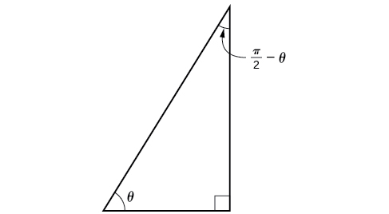
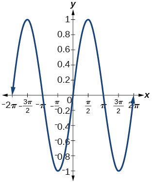
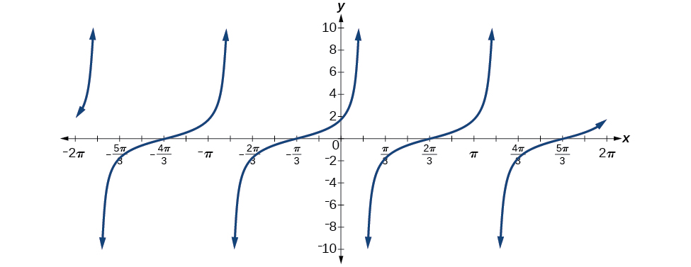
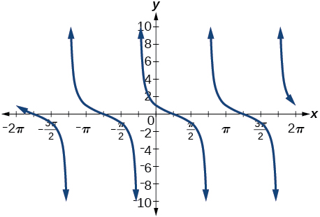
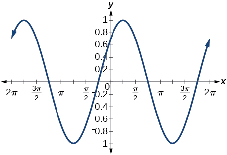

In this section, you will:
* Use sum and difference formulas for cosine.
* Use sum and difference formulas for sine.
* Use sum and difference formulas for tangent.
* Use sum and difference formulas for cofunctions.
* Use sum and difference formulas to verify identities.

  above sea level. It is the highest peak in North America. (credit: Daniel A. Leifheit, Flickr)"){: #Figure_07_02_001}

How can the height of a mountain be measured? What about the distance from Earth to the sun? Like many seemingly impossible problems, we rely on mathematical formulas to find the answers. The trigonometric identities, commonly used in mathematical proofs, have had real-world applications for centuries, including their use in calculating long distances.

The trigonometric identities we will examine in this section can be traced to a Persian astronomer who lived around 950 AD, but the ancient Greeks discovered these same formulas much earlier and stated them in terms of chords. These are special equations or postulates, true for all values input to the equations, and with innumerable applications.

In this section, we will learn techniques that will enable us to solve problems such as the ones presented above. The formulas that follow will simplify many trigonometric expressions and equations. Keep in mind that, throughout this section, the term *formula* is used synonymously with the word *identity*.

### Using the Sum and Difference Formulas for Cosine

Finding the exact value of the sine, cosine, or tangent of an angle is often easier if we can rewrite the given angle in terms of two angles that have known trigonometric values. We can use the **special angles**{: data-type="term" .no-emphasis}, which we can review in the unit circle shown in [\[link\]](#Figure_07_02_008).

 ![Diagram of the unit circle with points labeled on its edge. P point is at an angle a from the positive x axis with coordinates (cosa, sina). Point Q is at an angle of B from the positive x axis with coordinates (cosb, sinb). Angle POQ is a - B degrees. Point A is at an angle of (a-B) from the x axis with coordinates (cos(a-B), sin(a-B)). Point B is just at point (1,0). Angle AOB is also a - B degrees. Radii PO, AO, QO, and BO are all 1 unit long and are the legs of triangles POQ and AOB. Triangle POQ is a rotation of triangle AOB, so the distance from P to Q is the same as the distance from A to B. ](../resources/CNX_Precalc_Figure_07_01_004.jpg "The Unit Circle"){: #Figure_07_02_008}

We will begin with the **sum and difference formulas for cosine**{: data-type="term" .no-emphasis}, so that we can find the cosine of a given angle if we can break it up into the sum or difference of two of the special angles. See [\[link\]](#Table_07_02_01).

| **Sum formula for cosine** | <math xmlns="http://www.w3.org/1998/Math/MathML"> <mrow> <mi>cos</mi><mrow><mo>(</mo> <mrow> <mi>α</mi><mo>+</mo><mi>β</mi> </mrow> <mo>)</mo></mrow><mo>=</mo><mi>cos</mi><mtext> </mtext><mi>α</mi><mtext> </mtext><mi>cos</mi><mtext> </mtext><mi>β</mi><mo>−</mo><mi>sin</mi><mtext> </mtext><mi>α</mi><mtext> </mtext><mi>sin</mi><mtext> </mtext><mi>β</mi> </mrow> </math>

 |
| **Difference formula for cosine** | <math xmlns="http://www.w3.org/1998/Math/MathML"> <mrow> <mi>cos</mi><mrow><mo>(</mo> <mrow> <mi>α</mi><mo>−</mo><mi>β</mi> </mrow> <mo>)</mo></mrow><mo>=</mo><mi>cos</mi><mtext> </mtext><mi>α</mi><mtext> </mtext><mi>cos</mi><mtext> </mtext><mi>β</mi><mo>+</mo><mi>sin</mi><mtext> </mtext><mi>α</mi><mtext> </mtext><mi>sin</mi><mtext> </mtext><mi>β</mi> </mrow> </math>

 |
{: #Table_07_02_01 summary="Two rows, two columns. The table has ordered pairs of these row values: (Sum formula for cosine, cos(a+B) = cos(a)cos(B) - sin(a)sin(B)) and (Difference formula for cosine, cos(a-B) = cos(a)cos(B) + sin(a)sin(B))."}

First, we will prove the difference formula for cosines. Let’s consider two points on the unit circle. See [\[link\]](#Figure_07_02_002). Point<math xmlns="http://www.w3.org/1998/Math/MathML"> <mrow> <mtext> </mtext><mi>P</mi><mtext> </mtext> </mrow> </math>

is at an angle<math xmlns="http://www.w3.org/1998/Math/MathML"> <mrow> <mtext> </mtext><mi>α</mi><mtext> </mtext> </mrow> </math>

from the positive *x-*axis with coordinates<math xmlns="http://www.w3.org/1998/Math/MathML"> <mrow> <mtext> </mtext><mrow><mo>(</mo> <mrow> <mi>cos</mi><mtext> </mtext><mi>α</mi><mo>,</mo><mi>sin</mi><mtext> </mtext><mi>α</mi> </mrow> <mo>)</mo></mrow><mtext> </mtext> </mrow> </math>

and point<math xmlns="http://www.w3.org/1998/Math/MathML"> <mrow> <mtext> </mtext><mi>Q</mi><mtext> </mtext> </mrow> </math>

is at an angle of<math xmlns="http://www.w3.org/1998/Math/MathML"> <mrow> <mtext> </mtext><mi>β</mi><mtext> </mtext> </mrow> </math>

from the positive *x-*axis with coordinates<math xmlns="http://www.w3.org/1998/Math/MathML"> <mrow> <mtext> </mtext><mrow><mo>(</mo> <mrow> <mi>cos</mi><mtext> </mtext><mi>β</mi><mo>,</mo><mi>sin</mi><mtext> </mtext><mi>β</mi> </mrow> <mo>)</mo></mrow><mo>.</mo><mtext> </mtext> </mrow> </math>

Note the measure of angle<math xmlns="http://www.w3.org/1998/Math/MathML"> <mrow> <mtext> </mtext><mi>P</mi><mi>O</mi><mi>Q</mi><mtext> </mtext> </mrow> </math>

is<math xmlns="http://www.w3.org/1998/Math/MathML"> <mrow> <mtext> </mtext><mi>α</mi><mo>−</mo><mi>β</mi><mo>.</mo><mtext> </mtext> </mrow> </math>

Label two more points:<math xmlns="http://www.w3.org/1998/Math/MathML"> <mrow> <mtext> </mtext><mi>A</mi><mtext> </mtext> </mrow> </math>

at an angle of<math xmlns="http://www.w3.org/1998/Math/MathML"> <mrow> <mtext> </mtext><mrow><mo>(</mo> <mrow> <mi>α</mi><mo>−</mo><mi>β</mi> </mrow> <mo>)</mo></mrow><mtext> </mtext> </mrow> </math>

from the positive *x-*axis with coordinates<math xmlns="http://www.w3.org/1998/Math/MathML"> <mrow> <mtext> </mtext><mrow><mo>(</mo> <mrow> <mi>cos</mi><mrow><mo>(</mo> <mrow> <mi>α</mi><mo>−</mo><mi>β</mi> </mrow> <mo>)</mo></mrow><mo>,</mo><mi>sin</mi><mrow><mo>(</mo> <mrow> <mi>α</mi><mo>−</mo><mi>β</mi> </mrow> <mo>)</mo></mrow> </mrow> <mo>)</mo></mrow><mo>;</mo><mtext> </mtext> </mrow> </math>

and point<math xmlns="http://www.w3.org/1998/Math/MathML"> <mrow> <mtext> </mtext><mi>B</mi><mtext> </mtext> </mrow> </math>

with coordinates<math xmlns="http://www.w3.org/1998/Math/MathML"> <mrow> <mtext> </mtext><mrow><mo>(</mo> <mrow> <mn>1</mn><mo>,</mo><mn>0</mn> </mrow> <mo>)</mo></mrow><mo>.</mo><mtext> </mtext> </mrow> </math>

Triangle<math xmlns="http://www.w3.org/1998/Math/MathML"> <mrow> <mtext> </mtext><mi>P</mi><mi>O</mi><mi>Q</mi><mtext> </mtext> </mrow> </math>

is a rotation of triangle<math xmlns="http://www.w3.org/1998/Math/MathML"> <mrow> <mtext> </mtext><mi>A</mi><mi>O</mi><mi>B</mi><mtext> </mtext> </mrow> </math>

and thus the distance from<math xmlns="http://www.w3.org/1998/Math/MathML"> <mrow> <mtext> </mtext><mi>P</mi><mtext> </mtext> </mrow> </math>

to<math xmlns="http://www.w3.org/1998/Math/MathML"> <mrow> <mtext> </mtext><mi>Q</mi><mtext> </mtext> </mrow> </math>

is the same as the distance from<math xmlns="http://www.w3.org/1998/Math/MathML"> <mrow> <mtext> </mtext><mi>A</mi><mtext> </mtext> </mrow> </math>

to<math xmlns="http://www.w3.org/1998/Math/MathML"> <mrow> <mtext> </mtext><mi>B</mi><mo>.</mo> </mrow> </math>

 ![Diagram of the unit circle with points labeled on its edge. P point is at an angle a from the positive x axis with coordinates (cosa, sina). Point Q is at an angle of B from the positive x axis with coordinates (cosb, sinb). Angle POQ is a - B degrees. Point A is at an angle of (a-B) from the x axis with coordinates (cos(a-B), sin(a-B)). Point B is just at point (1,0). Angle AOB is also a - B degrees. Radii PO, AO, QO, and BO are all 1 unit long and are the legs of triangles POQ and AOB. Triangle POQ is a rotation of triangle AOB, so the distance from P to Q is the same as the distance from A to B.](../resources/CNX_Precalc_Figure_07_02_002.jpg){: #Figure_07_02_002}

We can find the distance from<math xmlns="http://www.w3.org/1998/Math/MathML"> <mrow> <mtext> </mtext><mi>P</mi><mtext> </mtext> </mrow> </math>

to<math xmlns="http://www.w3.org/1998/Math/MathML"> <mrow> <mtext> </mtext><mi>Q</mi><mtext> </mtext> </mrow> </math>

using the **distance formula**{: data-type="term" .no-emphasis}.* * *
{: data-type="newline"}

<math xmlns="http://www.w3.org/1998/Math/MathML" display="block"> <mrow> <mtable> <mtr rowalign="center"> <mtd columnalign="right" rowalign="center"> <mrow> <msub> <mi>d</mi> <mrow> <mi>P</mi><mi>Q</mi> </mrow> </msub> </mrow> </mtd> <mtd rowalign="center"> <mo>=</mo> </mtd> <mtd columnalign="left" rowalign="center"> <mrow> <msqrt> <mrow> <msup> <mrow> <mo stretchy="false">(</mo><mi>cos</mi><mtext> </mtext><mi>α</mi><mo>−</mo><mi>cos</mi><mtext> </mtext><mi>β</mi><mo stretchy="false">)</mo> </mrow> <mn>2</mn> </msup> <mo>+</mo><msup> <mrow> <mo stretchy="false">(</mo><mi>sin</mi><mtext> </mtext><mi>α</mi><mo>−</mo><mi>sin</mi><mtext> </mtext><mi>β</mi><mo stretchy="false">)</mo> </mrow> <mn>2</mn> </msup> </mrow> </msqrt> </mrow> </mtd> </mtr> <mtr rowalign="center"> <mtd rowalign="center" /> <mtd rowalign="center"> <mo>=</mo> </mtd> <mtd columnalign="left" rowalign="center"> <mrow> <msqrt> <mrow> <msup> <mrow> <mi>cos</mi> </mrow> <mn>2</mn> </msup> <mi>α</mi><mo>−</mo><mn>2</mn><mtext> </mtext><mi>cos</mi><mtext> </mtext><mi>α</mi><mtext> </mtext><mi>cos</mi><mtext> </mtext><mi>β</mi><mo>+</mo><msup> <mrow> <mi>cos</mi> </mrow> <mn>2</mn> </msup> <mi>β</mi><mo>+</mo><msup> <mrow> <mi>sin</mi> </mrow> <mn>2</mn> </msup> <mi>α</mi><mo>−</mo><mn>2</mn><mtext> </mtext><mi>sin</mi><mtext> </mtext><mi>α</mi><mtext> </mtext><mi>sin</mi><mtext> </mtext><mi>β</mi><mo>+</mo><msup> <mrow> <mi>sin</mi> </mrow> <mn>2</mn> </msup> <mi>β</mi> </mrow> </msqrt> </mrow> </mtd> </mtr> </mtable> </mrow> </math>

Then we apply the **Pythagorean identity**{: data-type="term" .no-emphasis} and simplify.

<math xmlns="http://www.w3.org/1998/Math/MathML" display="block"> <mrow> <mtable> <mtr> <mtd> <mo>=</mo> </mtd> <mtd columnalign="left"> <mrow> <msqrt> <mrow> <mrow><mo>(</mo> <mrow> <msup> <mrow> <mi>cos</mi> </mrow> <mn>2</mn> </msup> <mi>α</mi><mo>+</mo><msup> <mrow> <mi>sin</mi> </mrow> <mn>2</mn> </msup> <mi>α</mi> </mrow> <mo>)</mo></mrow><mo>+</mo><mrow><mo>(</mo> <mrow> <msup> <mrow> <mi>cos</mi> </mrow> <mn>2</mn> </msup> <mi>β</mi><mo>+</mo><msup> <mrow> <mi>sin</mi> </mrow> <mn>2</mn> </msup> <mi>β</mi> </mrow> <mo>)</mo></mrow><mo>−</mo><mn>2</mn><mtext> </mtext><mi>cos</mi><mtext> </mtext><mi>α</mi><mtext> </mtext><mi>cos</mi><mtext> </mtext><mi>β</mi><mo>−</mo><mn>2</mn><mtext> </mtext><mi>sin</mi><mtext> </mtext><mi>α</mi><mtext> </mtext><mi>sin</mi><mtext> </mtext><mi>β</mi> </mrow> </msqrt> </mrow> </mtd> </mtr> <mtr> <mtd> <mo>=</mo> </mtd> <mtd columnalign="left"> <mrow> <msqrt> <mrow> <mn>1</mn><mo>+</mo><mn>1</mn><mo>−</mo><mn>2</mn><mtext> </mtext><mi>cos</mi><mtext> </mtext><mi>α</mi><mtext> </mtext><mi>cos</mi><mtext> </mtext><mi>β</mi><mo>−</mo><mn>2</mn><mtext> </mtext><mi>sin</mi><mtext> </mtext><mi>α</mi><mtext> </mtext><mi>sin</mi><mtext> </mtext><mi>β</mi> </mrow> </msqrt> </mrow> </mtd> </mtr> <mtr> <mtd> <mo>=</mo> </mtd> <mtd columnalign="left"> <mrow> <msqrt> <mrow> <mn>2</mn><mo>−</mo><mn>2</mn><mtext> </mtext><mi>cos</mi><mtext> </mtext><mi>α</mi><mtext> </mtext><mi>cos</mi><mtext> </mtext><mi>β</mi><mo>−</mo><mn>2</mn><mtext> </mtext><mi>sin</mi><mtext> </mtext><mi>α</mi><mtext> </mtext><mi>sin</mi><mtext> </mtext><mi>β</mi> </mrow> </msqrt> </mrow> </mtd> </mtr> </mtable> </mrow> </math>

Similarly, using the distance formula we can find the distance from<math xmlns="http://www.w3.org/1998/Math/MathML"> <mrow> <mtext> </mtext><mi>A</mi><mtext> </mtext> </mrow> </math>

to<math xmlns="http://www.w3.org/1998/Math/MathML"> <mrow> <mtext> </mtext><mi>B</mi><mo>.</mo> </mrow> </math>

<math xmlns="http://www.w3.org/1998/Math/MathML" display="block"> <mrow> <mtable> <mtr rowalign="center"> <mtd columnalign="right" rowalign="center"> <mrow> <msub> <mi>d</mi> <mrow> <mi>A</mi><mi>B</mi> </mrow> </msub> </mrow> </mtd> <mtd rowalign="center"> <mo>=</mo> </mtd> <mtd columnalign="left" rowalign="center"> <mrow> <msqrt> <mrow> <msup> <mrow> <mo stretchy="false">(</mo><mi>cos</mi><mo stretchy="false">(</mo><mi>α</mi><mo>−</mo><mi>β</mi><mo stretchy="false">)</mo><mo>−</mo><mn>1</mn><mo stretchy="false">)</mo> </mrow> <mn>2</mn> </msup> <mo>+</mo><msup> <mrow> <mo stretchy="false">(</mo><mi>sin</mi><mo stretchy="false">(</mo><mi>α</mi><mo>−</mo><mi>β</mi><mo stretchy="false">)</mo><mo>−</mo><mn>0</mn><mo stretchy="false">)</mo> </mrow> <mn>2</mn> </msup> </mrow> </msqrt> </mrow> </mtd> </mtr> <mtr rowalign="center"> <mtd rowalign="center" /> <mtd rowalign="center"> <mo>=</mo> </mtd> <mtd columnalign="left" rowalign="center"> <mrow> <msqrt> <mrow> <msup> <mrow> <mi>cos</mi> </mrow> <mn>2</mn> </msup> <mo stretchy="false">(</mo><mi>α</mi><mo>−</mo><mi>β</mi><mo stretchy="false">)</mo><mo>−</mo><mn>2</mn><mtext> </mtext><mi>cos</mi><mo stretchy="false">(</mo><mi>α</mi><mo>−</mo><mi>β</mi><mo stretchy="false">)</mo><mo>+</mo><mn>1</mn><mo>+</mo><msup> <mrow> <mi>sin</mi> </mrow> <mn>2</mn> </msup> <mo stretchy="false">(</mo><mi>α</mi><mo>−</mo><mi>β</mi><mo stretchy="false">)</mo> </mrow> </msqrt> </mrow> </mtd> </mtr> </mtable> </mrow> </math>

Applying the Pythagorean identity and simplifying we get:

<math xmlns="http://www.w3.org/1998/Math/MathML" display="block"> <mrow> <mtable> <mtr> <mtd> <mo>=</mo> </mtd> <mtd columnalign="left"> <mrow> <msqrt> <mrow> <mrow><mo>(</mo> <mrow> <msup> <mrow> <mi>cos</mi> </mrow> <mn>2</mn> </msup> <mo stretchy="false">(</mo><mi>α</mi><mo>−</mo><mi>β</mi><mo stretchy="false">)</mo><mo>+</mo><msup> <mrow> <mi>sin</mi> </mrow> <mn>2</mn> </msup> <mo stretchy="false">(</mo><mi>α</mi><mo>−</mo><mi>β</mi><mo stretchy="false">)</mo> </mrow> <mo>)</mo></mrow><mo>−</mo><mn>2</mn><mtext> </mtext><mi>cos</mi><mo stretchy="false">(</mo><mi>α</mi><mo>−</mo><mi>β</mi><mo stretchy="false">)</mo><mo>+</mo><mn>1</mn> </mrow> </msqrt> </mrow> </mtd> </mtr> <mtr> <mtd> <mo>=</mo> </mtd> <mtd columnalign="left"> <mrow> <msqrt> <mrow> <mn>1</mn><mo>−</mo><mn>2</mn><mtext> </mtext><mi>cos</mi><mo stretchy="false">(</mo><mi>α</mi><mo>−</mo><mi>β</mi><mo stretchy="false">)</mo><mo>+</mo><mn>1</mn> </mrow> </msqrt> </mrow> </mtd> </mtr> <mtr> <mtd> <mo>=</mo> </mtd> <mtd columnalign="left"> <mrow> <msqrt> <mrow> <mn>2</mn><mo>−</mo><mn>2</mn><mtext> </mtext><mi>cos</mi><mo stretchy="false">(</mo><mi>α</mi><mo>−</mo><mi>β</mi><mo stretchy="false">)</mo> </mrow> </msqrt> </mrow> </mtd> </mtr> </mtable> </mrow> </math>

Because the two distances are the same, we set them equal to each other and simplify.

<math xmlns="http://www.w3.org/1998/Math/MathML" display="block"> <mrow> <mtable> <mtr> <mtd columnalign="right"> <mrow> <msqrt> <mrow> <mn>2</mn><mo>−</mo><mn>2</mn><mtext> </mtext><mi>cos</mi><mtext> </mtext><mi>α</mi><mtext> </mtext><mi>cos</mi><mtext> </mtext><mi>β</mi><mo>−</mo><mn>2</mn><mtext> </mtext><mi>sin</mi><mtext> </mtext><mi>α</mi><mtext> </mtext><mi>sin</mi><mtext> </mtext><mi>β</mi> </mrow> </msqrt> </mrow> </mtd> <mtd> <mo>=</mo> </mtd> <mtd columnalign="left"> <mrow> <msqrt> <mrow> <mn>2</mn><mo>−</mo><mn>2</mn><mtext> </mtext><mi>cos</mi><mo stretchy="false">(</mo><mi>α</mi><mo>−</mo><mi>β</mi><mo stretchy="false">)</mo> </mrow> </msqrt> </mrow> </mtd> </mtr> <mtr> <mtd columnalign="right"> <mrow> <mn>2</mn><mo>−</mo><mn>2</mn><mtext> </mtext><mi>cos</mi><mtext> </mtext><mi>α</mi><mtext> </mtext><mi>cos</mi><mtext> </mtext><mi>β</mi><mo>−</mo><mn>2</mn><mtext> </mtext><mi>sin</mi><mtext> </mtext><mi>α</mi><mtext> </mtext><mi>sin</mi><mtext> </mtext><mi>β</mi> </mrow> </mtd> <mtd> <mo>=</mo> </mtd> <mtd columnalign="left"> <mrow> <mn>2</mn><mo>−</mo><mn>2</mn><mtext> </mtext><mi>cos</mi><mo stretchy="false">(</mo><mi>α</mi><mo>−</mo><mi>β</mi><mo stretchy="false">)</mo> </mrow> </mtd> </mtr> </mtable> </mrow> </math>

Finally we subtract<math xmlns="http://www.w3.org/1998/Math/MathML"> <mrow> <mtext> </mtext><mn>2</mn><mtext> </mtext> </mrow> </math>

from both sides and divide both sides by<math xmlns="http://www.w3.org/1998/Math/MathML"> <mrow> <mtext> </mtext><mn>−2.</mn> </mrow> </math>

<math xmlns="http://www.w3.org/1998/Math/MathML"> <mrow> <mi>cos</mi><mtext> </mtext><mi>α</mi><mtext> </mtext><mi>cos</mi><mtext> </mtext><mi>β</mi><mo>+</mo><mi>sin</mi><mtext> </mtext><mi>α</mi><mtext> </mtext><mi>sin</mi><mtext> </mtext><mi>β</mi><mo>=</mo><mi>cos</mi><mo stretchy="false">(</mo><mi>α</mi><mo>−</mo><mi>β</mi><mo stretchy="false">)</mo><mtext>  </mtext> </mrow> </math>

Thus, we have the difference formula for cosine. We can use similar methods to derive the cosine of the sum of two angles.

Sum and Difference Formulas for Cosine

These formulas can be used to calculate the cosine of sums and differences of angles.

<math xmlns="http://www.w3.org/1998/Math/MathML"> <mrow> <mi>cos</mi><mo stretchy="false">(</mo><mi>α</mi><mo>+</mo><mi>β</mi><mo stretchy="false">)</mo><mo>=</mo><mi>cos</mi><mtext> </mtext><mi>α</mi><mtext> </mtext><mi>cos</mi><mtext> </mtext><mi>β</mi><mo>−</mo><mi>sin</mi><mtext> </mtext><mi>α</mi><mtext> </mtext><mi>sin</mi><mtext> </mtext><mi>β</mi> </mrow> </math>

<math xmlns="http://www.w3.org/1998/Math/MathML"> <mrow> <mi>cos</mi><mo stretchy="false">(</mo><mi>α</mi><mo>−</mo><mi>β</mi><mo stretchy="false">)</mo><mo>=</mo><mi>cos</mi><mtext> </mtext><mi>α</mi><mtext> </mtext><mi>cos</mi><mtext> </mtext><mi>β</mi><mo>+</mo><mi>sin</mi><mtext> </mtext><mi>α</mi><mtext> </mtext><mi>sin</mi><mtext> </mtext><mi>β</mi> </mrow> </math>

<strong>Given two angles, find the cosine of the difference between the angles. </strong>

1.  Write the difference formula for cosine.
2.  Substitute the values of the given angles into the formula.
3.  Simplify.
{: data-number-style="arabic"}

Finding the Exact Value Using the Formula for the Cosine of the Difference of Two Angles

Using the formula for the cosine of the difference of two angles, find the exact value of<math xmlns="http://www.w3.org/1998/Math/MathML"> <mrow> <mtext> </mtext><mi>cos</mi><mrow><mo>(</mo> <mrow> <mfrac> <mrow> <mn>5</mn><mi>π</mi> </mrow> <mn>4</mn> </mfrac> <mo>−</mo><mfrac> <mi>π</mi> <mn>6</mn> </mfrac> </mrow> <mo>)</mo></mrow><mo>.</mo> </mrow> </math>

Begin by writing the formula for the cosine of the difference of two angles. Then substitute the given values.

<math xmlns="http://www.w3.org/1998/Math/MathML" display="block"> <mrow> <mtable> <mtr rowalign="center"> <mtd columnalign="right" rowalign="center"> <mrow> <mi>cos</mi><mo stretchy="false">(</mo><mi>α</mi><mo>−</mo><mi>β</mi><mo stretchy="false">)</mo> </mrow> </mtd> <mtd rowalign="center"> <mo>=</mo> </mtd> <mtd columnalign="left" rowalign="center"> <mrow> <mi>cos</mi><mtext> </mtext><mi>α</mi><mtext> </mtext><mi>cos</mi><mtext> </mtext><mi>β</mi><mo>+</mo><mi>sin</mi><mtext> </mtext><mi>α</mi><mtext> </mtext><mi>sin</mi><mtext> </mtext><mi>β</mi> </mrow> </mtd> </mtr> <mtr rowalign="center"> <mtd columnalign="right" rowalign="center"> <mrow> <mi>cos</mi><mrow><mo>(</mo> <mrow> <mfrac> <mrow> <mn>5</mn><mi>π</mi> </mrow> <mn>4</mn> </mfrac> <mo>−</mo><mfrac> <mi>π</mi> <mn>6</mn> </mfrac> </mrow> <mo>)</mo></mrow> </mrow> </mtd> <mtd rowalign="center"> <mo>=</mo> </mtd> <mtd columnalign="left" rowalign="center"> <mrow> <mi>cos</mi><mrow><mo>(</mo> <mrow> <mfrac> <mrow> <mn>5</mn><mi>π</mi> </mrow> <mn>4</mn> </mfrac> </mrow> <mo>)</mo></mrow><mi>cos</mi><mrow><mo>(</mo> <mrow> <mfrac> <mi>π</mi> <mn>6</mn> </mfrac> </mrow> <mo>)</mo></mrow><mo>+</mo><mi>sin</mi><mrow><mo>(</mo> <mrow> <mfrac> <mrow> <mn>5</mn><mi>π</mi> </mrow> <mn>4</mn> </mfrac> </mrow> <mo>)</mo></mrow><mi>sin</mi><mrow><mo>(</mo> <mrow> <mfrac> <mi>π</mi> <mn>6</mn> </mfrac> </mrow> <mo>)</mo></mrow> </mrow> </mtd> </mtr> <mtr rowalign="center"> <mtd rowalign="center" /> <mtd rowalign="center"> <mo>=</mo> </mtd> <mtd columnalign="left" rowalign="center"> <mrow> <mrow><mo>(</mo> <mrow> <mo>−</mo><mfrac> <mrow> <msqrt> <mn>2</mn> </msqrt> </mrow> <mn>2</mn> </mfrac> </mrow> <mo>)</mo></mrow><mrow><mo>(</mo> <mrow> <mfrac> <mrow> <msqrt> <mn>3</mn> </msqrt> </mrow> <mn>2</mn> </mfrac> </mrow> <mo>)</mo></mrow><mo>−</mo><mrow><mo>(</mo> <mrow> <mfrac> <mrow> <msqrt> <mn>2</mn> </msqrt> </mrow> <mn>2</mn> </mfrac> </mrow> <mo>)</mo></mrow><mrow><mo>(</mo> <mrow> <mfrac> <mn>1</mn> <mn>2</mn> </mfrac> </mrow> <mo>)</mo></mrow> </mrow> </mtd> </mtr> <mtr rowalign="center"> <mtd rowalign="center" /> <mtd rowalign="center"> <mo>=</mo> </mtd> <mtd columnalign="left" rowalign="center"> <mrow> <mo>−</mo><mfrac> <mrow> <msqrt> <mn>6</mn> </msqrt> </mrow> <mn>4</mn> </mfrac> <mo>−</mo><mfrac> <mrow> <msqrt> <mn>2</mn> </msqrt> </mrow> <mn>4</mn> </mfrac> </mrow> </mtd> </mtr> <mtr rowalign="center"> <mtd rowalign="center" /> <mtd rowalign="center"> <mo>=</mo> </mtd> <mtd columnalign="left" rowalign="center"> <mrow> <mfrac> <mrow> <mo>−</mo><msqrt> <mn>6</mn> </msqrt> <mo>−</mo><msqrt> <mn>2</mn> </msqrt> </mrow> <mn>4</mn> </mfrac> </mrow> </mtd> </mtr> </mtable> </mrow> </math>

Keep in mind that we can always check the answer using a graphing calculator in radian mode.

Find the exact value of<math xmlns="http://www.w3.org/1998/Math/MathML"> <mrow> <mtext> </mtext><mi>cos</mi><mrow><mo>(</mo> <mrow> <mfrac> <mi>π</mi> <mn>3</mn> </mfrac> <mo>−</mo><mfrac> <mi>π</mi> <mn>4</mn> </mfrac> </mrow> <mo>)</mo></mrow><mo>.</mo> </mrow> </math>

<math xmlns="http://www.w3.org/1998/Math/MathML"> <mrow> <mfrac> <mrow> <msqrt> <mn>2</mn> </msqrt> <mo>+</mo><msqrt> <mn>6</mn> </msqrt> </mrow> <mn>4</mn> </mfrac> </mrow> </math>

Finding the Exact Value Using the Formula for the Sum of Two Angles for Cosine

Find the exact value of<math xmlns="http://www.w3.org/1998/Math/MathML"> <mrow> <mtext> </mtext><mi>cos</mi><mo stretchy="false">(</mo><mn>75°</mn><mo stretchy="false">)</mo><mo>.</mo> </mrow> </math>

As<math xmlns="http://www.w3.org/1998/Math/MathML"> <mrow> <mtext> </mtext><mn>75°</mn><mo>=</mo><mn>45°</mn><mo>+</mo><mn>30°</mn><mo>,</mo> </mrow> </math>

we can evaluate<math xmlns="http://www.w3.org/1998/Math/MathML"> <mrow> <mtext> </mtext><mi>cos</mi><mo stretchy="false">(</mo><mn>75°</mn><mo stretchy="false">)</mo><mtext> </mtext> </mrow> </math>

as<math xmlns="http://www.w3.org/1998/Math/MathML"> <mrow> <mtext> </mtext><mi>cos</mi><mo stretchy="false">(</mo><mn>45°</mn><mo>+</mo><mn>30°</mn><mo stretchy="false">)</mo><mo>.</mo><mtext> </mtext> </mrow> </math>

<math xmlns="http://www.w3.org/1998/Math/MathML" display="block"> <mrow> <mtable> <mtr rowalign="center"> <mtd columnalign="right" rowalign="center"> <mrow> <mi>cos</mi><mo stretchy="false">(</mo><mi>α</mi><mo>+</mo><mi>β</mi><mo stretchy="false">)</mo> </mrow> </mtd> <mtd rowalign="center"> <mo>=</mo> </mtd> <mtd columnalign="left" rowalign="center"> <mrow> <mi>cos</mi><mtext> </mtext><mi>α</mi><mtext> </mtext><mi>cos</mi><mtext> </mtext><mi>β</mi><mo>−</mo><mi>sin</mi><mtext> </mtext><mi>α</mi><mtext> </mtext><mi>sin</mi><mtext> </mtext><mi>β</mi> </mrow> </mtd> </mtr> <mtr rowalign="center"> <mtd columnalign="right" rowalign="center"> <mrow> <mi>cos</mi><mo stretchy="false">(</mo><mn>45°</mn><mo>+</mo><mn>30°</mn><mo stretchy="false">)</mo> </mrow> </mtd> <mtd rowalign="center"> <mo>=</mo> </mtd> <mtd columnalign="left" rowalign="center"> <mrow> <mi>cos</mi><mo stretchy="false">(</mo><mn>45°</mn><mo stretchy="false">)</mo><mi>cos</mi><mo stretchy="false">(</mo><mn>30°</mn><mo stretchy="false">)</mo><mo>−</mo><mi>sin</mi><mo stretchy="false">(</mo><mn>45°</mn><mo stretchy="false">)</mo><mi>sin</mi><mo stretchy="false">(</mo><mn>30°</mn><mo stretchy="false">)</mo> </mrow> </mtd> </mtr> <mtr rowalign="center"> <mtd rowalign="center" /> <mtd rowalign="center"> <mo>=</mo> </mtd> <mtd columnalign="left" rowalign="center"> <mrow> <mfrac> <mrow> <msqrt> <mn>2</mn> </msqrt> </mrow> <mn>2</mn> </mfrac> <mrow><mo>(</mo> <mrow> <mfrac> <mrow> <msqrt> <mn>3</mn> </msqrt> </mrow> <mn>2</mn> </mfrac> </mrow> <mo>)</mo></mrow><mo>−</mo><mfrac> <mrow> <msqrt> <mn>2</mn> </msqrt> </mrow> <mn>2</mn> </mfrac> <mrow><mo>(</mo> <mrow> <mfrac> <mn>1</mn> <mn>2</mn> </mfrac> </mrow> <mo>)</mo></mrow> </mrow> </mtd> </mtr> <mtr rowalign="center"> <mtd rowalign="center" /> <mtd rowalign="center"> <mo>=</mo> </mtd> <mtd columnalign="left" rowalign="center"> <mrow> <mfrac> <mrow> <msqrt> <mn>6</mn> </msqrt> </mrow> <mn>4</mn> </mfrac> <mo>−</mo><mfrac> <mrow> <msqrt> <mn>2</mn> </msqrt> </mrow> <mn>4</mn> </mfrac> </mrow> </mtd> </mtr> <mtr rowalign="center"> <mtd rowalign="center" /> <mtd rowalign="center"> <mo>=</mo> </mtd> <mtd columnalign="left" rowalign="center"> <mrow> <mfrac> <mrow> <msqrt> <mn>6</mn> </msqrt> <mo>−</mo><msqrt> <mn>2</mn> </msqrt> </mrow> <mn>4</mn> </mfrac> </mrow> </mtd> </mtr> </mtable> </mrow> </math>

Keep in mind that we can always check the answer using a graphing calculator in degree mode.

Analysis

Note that we could have also solved this problem using the fact that<math xmlns="http://www.w3.org/1998/Math/MathML"> <mrow> <mtext> </mtext><mn>75°</mn><mo>=</mo><mn>135°</mn><mo>−</mo><mn>60°</mn><mo>.</mo> </mrow> </math>

<math xmlns="http://www.w3.org/1998/Math/MathML" display="block"> <mrow> <mtable> <mtr rowalign="center"> <mtd columnalign="right" rowalign="center"> <mrow> <mi>cos</mi><mo stretchy="false">(</mo><mi>α</mi><mo>−</mo><mi>β</mi><mo stretchy="false">)</mo> </mrow> </mtd> <mtd rowalign="center"> <mo>=</mo> </mtd> <mtd columnalign="left" rowalign="center"> <mrow> <mi>cos</mi><mtext> </mtext><mi>α</mi><mtext> </mtext><mi>cos</mi><mtext> </mtext><mi>β</mi><mo>+</mo><mi>sin</mi><mtext> </mtext><mi>α</mi><mtext> </mtext><mi>sin</mi><mtext> </mtext><mi>β</mi> </mrow> </mtd> </mtr> <mtr rowalign="center"> <mtd columnalign="right" rowalign="center"> <mrow> <mi>cos</mi><mo stretchy="false">(</mo><mn>135°</mn><mo>−</mo><mn>60°</mn><mo stretchy="false">)</mo> </mrow> </mtd> <mtd rowalign="center"> <mo>=</mo> </mtd> <mtd columnalign="left" rowalign="center"> <mrow> <mi>cos</mi><mo stretchy="false">(</mo><mn>135°</mn><mo stretchy="false">)</mo><mi>cos</mi><mo stretchy="false">(</mo><mn>60°</mn><mo stretchy="false">)</mo><mo>+</mo><mi>sin</mi><mo stretchy="false">(</mo><mn>135°</mn><mo stretchy="false">)</mo><mi>sin</mi><mo stretchy="false">(</mo><mn>60°</mn><mo stretchy="false">)</mo> </mrow> </mtd> </mtr> <mtr rowalign="center"> <mtd rowalign="center" /> <mtd rowalign="center"> <mo>=</mo> </mtd> <mtd columnalign="left" rowalign="center"> <mrow> <mrow><mo>(</mo> <mrow> <mo>−</mo><mfrac> <mrow> <msqrt> <mn>2</mn> </msqrt> </mrow> <mn>2</mn> </mfrac> </mrow> <mo>)</mo></mrow><mrow><mo>(</mo> <mrow> <mfrac> <mn>1</mn> <mn>2</mn> </mfrac> </mrow> <mo>)</mo></mrow><mo>+</mo><mrow><mo>(</mo> <mrow> <mfrac> <mrow> <msqrt> <mn>2</mn> </msqrt> </mrow> <mn>2</mn> </mfrac> </mrow> <mo>)</mo></mrow><mrow><mo>(</mo> <mrow> <mfrac> <mrow> <msqrt> <mn>3</mn> </msqrt> </mrow> <mn>2</mn> </mfrac> </mrow> <mo>)</mo></mrow> </mrow> </mtd> </mtr> <mtr rowalign="center"> <mtd rowalign="center" /> <mtd rowalign="center"> <mo>=</mo> </mtd> <mtd columnalign="left" rowalign="center"> <mrow> <mrow><mo>(</mo> <mrow> <mo>−</mo><mfrac> <mrow> <msqrt> <mn>2</mn> </msqrt> </mrow> <mn>4</mn> </mfrac> </mrow> <mo>)</mo></mrow><mo>+</mo><mrow><mo>(</mo> <mrow> <mfrac> <mrow> <msqrt> <mn>6</mn> </msqrt> </mrow> <mn>4</mn> </mfrac> </mrow> <mo>)</mo></mrow> </mrow> </mtd> </mtr> <mtr rowalign="center"> <mtd rowalign="center" /> <mtd rowalign="center"> <mo>=</mo> </mtd> <mtd columnalign="left" rowalign="center"> <mrow> <mrow><mo>(</mo> <mrow> <mfrac> <mrow> <msqrt> <mn>6</mn> </msqrt> <mo>−</mo><msqrt> <mn>2</mn> </msqrt> </mrow> <mn>4</mn> </mfrac> </mrow> <mo>)</mo></mrow> </mrow> </mtd> </mtr> </mtable> </mrow> </math>

Find the exact value of<math xmlns="http://www.w3.org/1998/Math/MathML"> <mrow> <mtext> </mtext><mi>cos</mi><mo stretchy="false">(</mo><mn>105°</mn><mo stretchy="false">)</mo><mo>.</mo> </mrow> </math>

<math xmlns="http://www.w3.org/1998/Math/MathML"> <mrow> <mfrac> <mrow> <msqrt> <mn>2</mn> </msqrt> <mo>−</mo><msqrt> <mn>6</mn> </msqrt> </mrow> <mn>4</mn> </mfrac> </mrow> </math>

### Using the Sum and Difference Formulas for Sine

The **sum and difference formulas for sine**{: data-type="term" .no-emphasis} can be derived in the same manner as those for cosine, and they resemble the cosine formulas.

Sum and Difference Formulas for Sine

These formulas can be used to calculate the sines of sums and differences of angles.

<math xmlns="http://www.w3.org/1998/Math/MathML"> <mrow> <mi>sin</mi><mrow><mo>(</mo> <mrow> <mi>α</mi><mo>+</mo><mi>β</mi> </mrow> <mo>)</mo></mrow><mo>=</mo><mi>sin</mi><mtext> </mtext><mi>α</mi><mtext> </mtext><mi>cos</mi><mtext> </mtext><mi>β</mi><mo>+</mo><mi>cos</mi><mtext> </mtext><mi>α</mi><mtext> </mtext><mi>sin</mi><mtext> </mtext><mi>β</mi> </mrow> </math>

<math xmlns="http://www.w3.org/1998/Math/MathML"> <mrow> <mi>sin</mi><mrow><mo>(</mo> <mrow> <mi>α</mi><mo>−</mo><mi>β</mi> </mrow> <mo>)</mo></mrow><mo>=</mo><mi>sin</mi><mtext> </mtext><mi>α</mi><mtext> </mtext><mi>cos</mi><mtext> </mtext><mi>β</mi><mo>−</mo><mi>cos</mi><mtext> </mtext><mi>α</mi><mtext> </mtext><mi>sin</mi><mtext> </mtext><mi>β</mi> </mrow> </math>

<strong>Given two angles, find the sine of the difference between the angles. </strong>

1.  Write the difference formula for sine.
2.  Substitute the given angles into the formula.
3.  Simplify.
{: data-number-style="arabic"}

Using Sum and Difference Identities to Evaluate the Difference of Angles

Use the sum and difference identities to evaluate the difference of the angles and show that part *a* equals part *b.*

1.  <math xmlns="http://www.w3.org/1998/Math/MathML"> <mrow> <mi>sin</mi><mo stretchy="false">(</mo><mn>45°</mn><mo>−</mo><mn>30°</mn><mo stretchy="false">)</mo> </mrow> </math>

2.  <math xmlns="http://www.w3.org/1998/Math/MathML"> <mrow> <mi>sin</mi><mo stretchy="false">(</mo><mn>135°</mn><mo>−</mo><mn>120°</mn><mo stretchy="false">)</mo> </mrow> </math>
{: data-number-style="lower-alpha"}

1.  Let’s begin by writing the formula and substitute the given angles.
    

    <math xmlns="http://www.w3.org/1998/Math/MathML" display="block"> <mrow> <mtable> <mtr> <mtd columnalign="right"> <mrow> <mi>sin</mi><mo stretchy="false">(</mo><mi>α</mi><mo>−</mo><mi>β</mi><mo stretchy="false">)</mo> </mrow> </mtd> <mtd> <mo>=</mo> </mtd> <mtd columnalign="left"> <mrow> <mi>sin</mi><mtext> </mtext><mi>α</mi><mtext> </mtext><mi>cos</mi><mtext> </mtext><mi>β</mi><mo>−</mo><mi>cos</mi><mtext> </mtext><mi>α</mi><mtext> </mtext><mi>sin</mi><mtext> </mtext><mi>β</mi> </mrow> </mtd> </mtr> <mtr> <mtd columnalign="right"> <mrow> <mi>sin</mi><mo stretchy="false">(</mo><mn>45°</mn><mo>−</mo><mn>30°</mn><mo stretchy="false">)</mo> </mrow> </mtd> <mtd> <mo>=</mo> </mtd> <mtd columnalign="left"> <mrow> <mi>sin</mi><mo stretchy="false">(</mo><mn>45°</mn><mo stretchy="false">)</mo><mi>cos</mi><mo stretchy="false">(</mo><mn>30°</mn><mo stretchy="false">)</mo><mo>−</mo><mi>cos</mi><mo stretchy="false">(</mo><mn>45°</mn><mo stretchy="false">)</mo><mi>sin</mi><mo stretchy="false">(</mo><mn>30°</mn><mo stretchy="false">)</mo> </mrow> </mtd> </mtr> </mtable> </mrow> </math>
    

    
    Next, we need to find the values of the trigonometric expressions.
    
    

    <math xmlns="http://www.w3.org/1998/Math/MathML"> <mrow> <mi>sin</mi><mo stretchy="false">(</mo><mn>45°</mn><mo stretchy="false">)</mo><mo>=</mo><mfrac> <mrow> <msqrt> <mn>2</mn> </msqrt> </mrow> <mn>2</mn> </mfrac> <mo>,</mo><mo> </mo><mi>cos</mi><mo stretchy="false">(</mo><mn>30°</mn><mo stretchy="false">)</mo><mo>=</mo><mfrac> <mrow> <msqrt> <mn>3</mn> </msqrt> </mrow> <mn>2</mn> </mfrac> <mo>,</mo><mo> </mo><mi>cos</mi><mo stretchy="false">(</mo><mn>45°</mn><mo stretchy="false">)</mo><mo>=</mo><mfrac> <mrow> <msqrt> <mn>2</mn> </msqrt> </mrow> <mn>2</mn> </mfrac> <mo>,</mo><mo> </mo><mi>sin</mi><mo stretchy="false">(</mo><mn>30°</mn><mo stretchy="false">)</mo><mo>=</mo><mfrac> <mn>1</mn> <mn>2</mn> </mfrac> </mrow> </math>
    

    
    Now we can substitute these values into the equation and simplify.
    
    

    <math xmlns="http://www.w3.org/1998/Math/MathML" display="block"> <mrow> <mtable> <mtr> <mtd columnalign="right" rowalign="center"> <mrow> <mi>sin</mi><mo stretchy="false">(</mo><mn>45°</mn><mo>−</mo><mn>30°</mn><mo stretchy="false">)</mo> </mrow> </mtd> <mtd rowalign="center"> <mo>=</mo> </mtd> <mtd columnalign="left" rowalign="center"> <mrow> <mfrac> <mrow> <msqrt> <mn>2</mn> </msqrt> </mrow> <mn>2</mn> </mfrac> <mrow><mo>(</mo> <mrow> <mfrac> <mrow> <msqrt> <mn>3</mn> </msqrt> </mrow> <mn>2</mn> </mfrac> </mrow> <mo>)</mo></mrow><mo>−</mo><mfrac> <mrow> <msqrt> <mn>2</mn> </msqrt> </mrow> <mn>2</mn> </mfrac> <mrow><mo>(</mo> <mrow> <mfrac> <mn>1</mn> <mn>2</mn> </mfrac> </mrow> <mo>)</mo></mrow> </mrow> </mtd> </mtr> <mtr> <mtd rowalign="center" /> <mtd rowalign="center"> <mo>=</mo> </mtd> <mtd columnalign="left" rowalign="center"> <mrow> <mfrac> <mrow> <msqrt> <mn>6</mn> </msqrt> <mo>−</mo><msqrt> <mn>2</mn> </msqrt> </mrow> <mn>4</mn> </mfrac> </mrow> </mtd> </mtr> </mtable> </mrow> </math>
    

2.  Again, we write the formula and substitute the given angles.
    

    <math xmlns="http://www.w3.org/1998/Math/MathML" display="block"> <mrow> <mtable> <mtr> <mtd columnalign="right"> <mrow> <mi>sin</mi><mo stretchy="false">(</mo><mi>α</mi><mo>−</mo><mi>β</mi><mo stretchy="false">)</mo> </mrow> </mtd> <mtd> <mo>=</mo> </mtd> <mtd columnalign="left"> <mrow> <mi>sin</mi><mtext> </mtext><mi>α</mi><mtext> </mtext><mi>cos</mi><mtext> </mtext><mi>β</mi><mo>−</mo><mi>cos</mi><mtext> </mtext><mi>α</mi><mtext> </mtext><mi>sin</mi><mtext> </mtext><mi>β</mi> </mrow> </mtd> </mtr> <mtr> <mtd columnalign="right"> <mrow> <mi>sin</mi><mo stretchy="false">(</mo><mn>135°</mn><mo>−</mo><mn>120°</mn><mo stretchy="false">)</mo> </mrow> </mtd> <mtd> <mo>=</mo> </mtd> <mtd columnalign="left"> <mrow> <mi>sin</mi><mo stretchy="false">(</mo><mn>135°</mn><mo stretchy="false">)</mo><mi>cos</mi><mo stretchy="false">(</mo><mn>120°</mn><mo stretchy="false">)</mo><mo>−</mo><mi>cos</mi><mo stretchy="false">(</mo><mn>135°</mn><mo stretchy="false">)</mo><mi>sin</mi><mo stretchy="false">(</mo><mn>120°</mn><mo stretchy="false">)</mo> </mrow> </mtd> </mtr> </mtable> </mrow> </math>
    

    
    Next, we find the values of the trigonometric expressions.
    
    

    <math xmlns="http://www.w3.org/1998/Math/MathML"> <mrow> <mi>sin</mi><mo stretchy="false">(</mo><mn>135°</mn><mo stretchy="false">)</mo><mo>=</mo><mfrac> <mrow> <msqrt> <mn>2</mn> </msqrt> </mrow> <mn>2</mn> </mfrac> <mo>,</mo><mi>cos</mi><mo stretchy="false">(</mo><mn>120°</mn><mo stretchy="false">)</mo><mo>=</mo><mo>−</mo><mfrac> <mn>1</mn> <mn>2</mn> </mfrac> <mo>,</mo><mi>cos</mi><mo stretchy="false">(</mo><mn>135°</mn><mo stretchy="false">)</mo><mo>=</mo><mfrac> <mrow> <msqrt> <mn>2</mn> </msqrt> </mrow> <mn>2</mn> </mfrac> <mo>,</mo><mi>sin</mi><mo stretchy="false">(</mo><mn>120°</mn><mo stretchy="false">)</mo><mo>=</mo><mfrac> <mrow> <msqrt> <mn>3</mn> </msqrt> </mrow> <mn>2</mn> </mfrac> </mrow> </math>
    

    
    Now we can substitute these values into the equation and simplify.
    
    

    <math xmlns="http://www.w3.org/1998/Math/MathML" display="block"> <mrow> <mtable> <mtr rowalign="center"> <mtd columnalign="right" rowalign="center"> <mrow> <mi>sin</mi><mo stretchy="false">(</mo><mn>135°</mn><mo>−</mo><mn>120°</mn><mo stretchy="false">)</mo> </mrow> </mtd> <mtd rowalign="center"> <mo>=</mo> </mtd> <mtd columnalign="left" rowalign="center"> <mrow> <mfrac> <mrow> <msqrt> <mn>2</mn> </msqrt> </mrow> <mn>2</mn> </mfrac> <mrow><mo>(</mo> <mrow> <mo>−</mo><mfrac> <mn>1</mn> <mn>2</mn> </mfrac> </mrow> <mo>)</mo></mrow><mo>−</mo><mrow><mo>(</mo> <mrow> <mo>−</mo><mfrac> <mrow> <msqrt> <mn>2</mn> </msqrt> </mrow> <mn>2</mn> </mfrac> </mrow> <mo>)</mo></mrow><mrow><mo>(</mo> <mrow> <mfrac> <mrow> <msqrt> <mn>3</mn> </msqrt> </mrow> <mn>2</mn> </mfrac> </mrow> <mo>)</mo></mrow> </mrow> </mtd> </mtr> <mtr rowalign="center"> <mtd rowalign="center" /> <mtd rowalign="center"> <mo>=</mo> </mtd> <mtd columnalign="left" rowalign="center"> <mrow> <mfrac> <mrow> <mo>−</mo><msqrt> <mn>2</mn> </msqrt> <mo>+</mo><msqrt> <mn>6</mn> </msqrt> </mrow> <mn>4</mn> </mfrac> </mrow> </mtd> </mtr> <mtr rowalign="center"> <mtd rowalign="center" /> <mtd rowalign="center"> <mo>=</mo> </mtd> <mtd columnalign="left" rowalign="center"> <mrow> <mfrac> <mrow> <msqrt> <mn>6</mn> </msqrt> <mo>−</mo><msqrt> <mn>2</mn> </msqrt> </mrow> <mn>4</mn> </mfrac> </mrow> </mtd> </mtr> <mspace width="4em" /> <mtr rowalign="center"> <mtd columnalign="left" rowalign="center"> <mrow> <mi>sin</mi><mo stretchy="false">(</mo><mn>135°</mn><mo>−</mo><mn>120°</mn><mo stretchy="false">)</mo> </mrow> </mtd> <mtd rowalign="center"> <mo>=</mo> </mtd> <mtd columnalign="left" rowalign="center"> <mrow> <mfrac> <mrow> <msqrt> <mn>2</mn> </msqrt> </mrow> <mn>2</mn> </mfrac> <mrow><mo>(</mo> <mrow> <mo>−</mo><mfrac> <mn>1</mn> <mn>2</mn> </mfrac> </mrow> <mo>)</mo></mrow><mo>−</mo><mrow><mo>(</mo> <mrow> <mo>−</mo><mfrac> <mrow> <msqrt> <mn>2</mn> </msqrt> </mrow> <mn>2</mn> </mfrac> </mrow> <mo>)</mo></mrow><mrow><mo>(</mo> <mrow> <mfrac> <mrow> <msqrt> <mn>3</mn> </msqrt> </mrow> <mn>2</mn> </mfrac> </mrow> <mo>)</mo></mrow> </mrow> </mtd> </mtr> <mtr rowalign="center"> <mtd rowalign="center" /> <mtd rowalign="center"> <mo>=</mo> </mtd> <mtd columnalign="left" rowalign="center"> <mrow> <mfrac> <mrow> <mo>−</mo><msqrt> <mn>2</mn> </msqrt> <mo>+</mo><msqrt> <mn>6</mn> </msqrt> </mrow> <mn>4</mn> </mfrac> </mrow> </mtd> </mtr> <mtr rowalign="center"> <mtd rowalign="center" /> <mtd rowalign="center"> <mo>=</mo> </mtd> <mtd columnalign="left" rowalign="center"> <mrow> <mfrac> <mrow> <msqrt> <mn>6</mn> </msqrt> <mo>−</mo><msqrt> <mn>2</mn> </msqrt> </mrow> <mn>4</mn> </mfrac> </mrow> </mtd> </mtr> </mtable> </mrow> </math>
    

{: data-number-style="lower-alpha"}

Finding the Exact Value of an Expression Involving an Inverse Trigonometric Function

Find the exact value of<math xmlns="http://www.w3.org/1998/Math/MathML"> <mrow> <mtext> </mtext><mi>sin</mi><mrow><mo>(</mo> <mrow> <msup> <mrow> <mi>cos</mi> </mrow> <mrow> <mn>−1</mn> </mrow> </msup> <mfrac> <mn>1</mn> <mn>2</mn> </mfrac> <mo>+</mo><msup> <mrow> <mi>sin</mi> </mrow> <mrow> <mn>−1</mn> </mrow> </msup> <mfrac> <mn>3</mn> <mn>5</mn> </mfrac> </mrow> <mo>)</mo></mrow><mo>.</mo><mtext> </mtext> </mrow> </math>

Then check the answer with a graphing calculator.

The pattern displayed in this problem is<math xmlns="http://www.w3.org/1998/Math/MathML"> <mrow> <mtext> </mtext><mi>sin</mi><mrow><mo>(</mo> <mrow> <mi>α</mi><mo>+</mo><mi>β</mi> </mrow> <mo>)</mo></mrow><mo>.</mo><mtext> </mtext> </mrow> </math>

Let<math xmlns="http://www.w3.org/1998/Math/MathML"> <mrow> <mtext> </mtext><mi>α</mi><mo>=</mo><msup> <mrow> <mi>cos</mi> </mrow> <mrow> <mn>−1</mn> </mrow> </msup> <mfrac> <mn>1</mn> <mn>2</mn> </mfrac> <mtext> </mtext> </mrow> </math>

and<math xmlns="http://www.w3.org/1998/Math/MathML"> <mrow> <mtext> </mtext><mi>β</mi><mo>=</mo><msup> <mrow> <mi>sin</mi> </mrow> <mrow> <mn>−1</mn> </mrow> </msup> <mfrac> <mn>3</mn> <mn>5</mn> </mfrac> <mo>.</mo><mtext> </mtext> </mrow> </math>

Then we can write

<math xmlns="http://www.w3.org/1998/Math/MathML" display="block"> <mrow> <mtable> <mtr> <mtd columnalign="right"> <mrow> <mi>cos</mi><mtext> </mtext><mi>α</mi> </mrow> </mtd> <mtd> <mo>=</mo> </mtd> <mtd columnalign="left"> <mrow> <mfrac> <mn>1</mn> <mn>2</mn> </mfrac> <mo>,</mo><mn>0</mn><mo>≤</mo><mi>α</mi><mo>≤</mo><mi>π</mi> </mrow> </mtd> </mtr> <mtr> <mtd columnalign="right"> <mrow> <mi>sin</mi><mtext> </mtext><mi>β</mi> </mrow> </mtd> <mtd> <mo>=</mo> </mtd> <mtd columnalign="left"> <mrow> <mfrac> <mn>3</mn> <mn>5</mn> </mfrac> <mo>,</mo><mo>−</mo><mfrac> <mi>π</mi> <mn>2</mn> </mfrac> <mo>≤</mo><mi>β</mi><mo>≤</mo><mfrac> <mi>π</mi> <mn>2</mn> </mfrac> </mrow> </mtd> </mtr> </mtable> </mrow> </math>

We will use the Pythagorean identities to find<math xmlns="http://www.w3.org/1998/Math/MathML"> <mrow> <mtext> </mtext><mi>sin</mi><mtext> </mtext><mi>α</mi><mtext> </mtext> </mrow> </math>

and<math xmlns="http://www.w3.org/1998/Math/MathML"> <mrow> <mtext> </mtext><mi>cos</mi><mtext> </mtext><mi>β</mi><mo>.</mo> </mrow> </math>

<math xmlns="http://www.w3.org/1998/Math/MathML" display="block"> <mrow> <mtable> <mtr rowalign="center"> <mtd columnalign="right" rowalign="center"> <mrow> <mi>sin</mi><mtext> </mtext><mi>α</mi> </mrow> </mtd> <mtd rowalign="center"> <mo>=</mo> </mtd> <mtd columnalign="left" rowalign="center"> <mrow> <msqrt> <mrow> <mn>1</mn><mo>−</mo><msup> <mrow> <mi>cos</mi> </mrow> <mn>2</mn> </msup> <mi>α</mi> </mrow> </msqrt> </mrow> </mtd> </mtr> <mtr rowalign="center"> <mtd rowalign="center" /> <mtd rowalign="center"> <mo>=</mo> </mtd> <mtd columnalign="left" rowalign="center"> <mrow> <msqrt> <mrow> <mn>1</mn><mo>−</mo><mfrac> <mn>1</mn> <mn>4</mn> </mfrac> </mrow> </msqrt> </mrow> </mtd> </mtr> <mtr rowalign="center"> <mtd rowalign="center" /> <mtd rowalign="center"> <mo>=</mo> </mtd> <mtd columnalign="left" rowalign="center"> <mrow> <msqrt> <mrow> <mfrac> <mn>3</mn> <mn>4</mn> </mfrac> </mrow> </msqrt> </mrow> </mtd> </mtr> <mtr rowalign="center"> <mtd rowalign="center" /> <mtd rowalign="center"> <mo>=</mo> </mtd> <mtd columnalign="left" rowalign="center"> <mrow> <mfrac> <mrow> <msqrt> <mn>3</mn> </msqrt> </mrow> <mn>2</mn> </mfrac> </mrow> </mtd> </mtr> <mtr rowalign="center"> <mtd columnalign="right" rowalign="center"> <mrow> <mi>cos</mi><mtext> </mtext><mi>β</mi> </mrow> </mtd> <mtd rowalign="center"> <mo>=</mo> </mtd> <mtd columnalign="left" rowalign="center"> <mrow> <msqrt> <mrow> <mn>1</mn><mo>−</mo><msup> <mrow> <mi>sin</mi> </mrow> <mn>2</mn> </msup> <mi>β</mi> </mrow> </msqrt> </mrow> </mtd> </mtr> <mtr rowalign="center"> <mtd rowalign="center" /> <mtd rowalign="center"> <mo>=</mo> </mtd> <mtd columnalign="left" rowalign="center"> <mrow> <msqrt> <mrow> <mn>1</mn><mo>−</mo><mfrac> <mn>9</mn> <mrow> <mn>25</mn> </mrow> </mfrac> </mrow> </msqrt> </mrow> </mtd> </mtr> <mtr rowalign="center"> <mtd rowalign="center" /> <mtd rowalign="center"> <mo>=</mo> </mtd> <mtd columnalign="left" rowalign="center"> <mrow> <msqrt> <mrow> <mfrac> <mrow> <mn>16</mn> </mrow> <mrow> <mn>25</mn> </mrow> </mfrac> </mrow> </msqrt> </mrow> </mtd> </mtr> <mtr rowalign="center"> <mtd rowalign="center" /> <mtd rowalign="center"> <mo>=</mo> </mtd> <mtd columnalign="left" rowalign="center"> <mrow> <mfrac> <mn>4</mn> <mn>5</mn> </mfrac> </mrow> </mtd> </mtr> </mtable> </mrow> </math>

Using the sum formula for sine,

<math xmlns="http://www.w3.org/1998/Math/MathML" display="block"> <mrow> <mtable> <mtr rowalign="center"> <mtd columnalign="right" rowalign="center"> <mrow> <mi>sin</mi><mrow><mo>(</mo> <mrow> <msup> <mrow> <mi>cos</mi> </mrow> <mrow> <mo>−</mo><mn>1</mn> </mrow> </msup> <mfrac> <mn>1</mn> <mn>2</mn> </mfrac> <mo>+</mo><msup> <mrow> <mi>sin</mi> </mrow> <mrow> <mo>−</mo><mn>1</mn> </mrow> </msup> <mfrac> <mn>3</mn> <mn>5</mn> </mfrac> </mrow> <mo>)</mo></mrow> </mrow> </mtd> <mtd rowalign="center"> <mo>=</mo> </mtd> <mtd columnalign="left" rowalign="center"> <mrow> <mi>sin</mi><mo stretchy="false">(</mo><mi>α</mi><mo>+</mo><mi>β</mi><mo stretchy="false">)</mo> </mrow> </mtd> </mtr> <mtr rowalign="center"> <mtd rowalign="center" /> <mtd rowalign="center"> <mo>=</mo> </mtd> <mtd columnalign="left" rowalign="center"> <mrow> <mi>sin</mi><mtext> </mtext><mi>α</mi><mtext> </mtext><mi>cos</mi><mtext> </mtext><mi>β</mi><mo>+</mo><mi>cos</mi><mtext> </mtext><mi>α</mi><mtext> </mtext><mi>sin</mi><mtext> </mtext><mi>β</mi> </mrow> </mtd> </mtr> <mtr rowalign="center"> <mtd rowalign="center" /> <mtd rowalign="center"> <mo>=</mo> </mtd> <mtd columnalign="left" rowalign="center"> <mrow> <mfrac> <mrow> <msqrt> <mn>3</mn> </msqrt> </mrow> <mn>2</mn> </mfrac> <mo>⋅</mo><mfrac> <mn>4</mn> <mn>5</mn> </mfrac> <mo>+</mo><mfrac> <mn>1</mn> <mn>2</mn> </mfrac> <mo>⋅</mo><mfrac> <mn>3</mn> <mn>5</mn> </mfrac> </mrow> </mtd> </mtr> <mtr rowalign="center"> <mtd rowalign="center" /> <mtd rowalign="center"> <mo>=</mo> </mtd> <mtd columnalign="left" rowalign="center"> <mrow> <mfrac> <mrow> <mn>4</mn><msqrt> <mn>3</mn> </msqrt> <mo>+</mo><mn>3</mn> </mrow> <mrow> <mn>10</mn> </mrow> </mfrac> </mrow> </mtd> </mtr> </mtable> </mrow> </math>

### Using the Sum and Difference Formulas for Tangent

Finding exact values for the tangent of the sum or difference of two angles is a little more complicated, but again, it is a matter of recognizing the pattern.

Finding the sum of two angles formula for tangent involves taking quotient of the sum formulas for sine and cosine and simplifying. Recall,<math xmlns="http://www.w3.org/1998/Math/MathML"> <mrow> <mtext> </mtext><mi>tan</mi><mtext> </mtext><mi>x</mi><mo>=</mo><mfrac> <mrow> <mi>sin</mi><mtext> </mtext><mi>x</mi> </mrow> <mrow> <mi>cos</mi><mtext> </mtext><mi>x</mi> </mrow> </mfrac> <mo>,</mo><mi>cos</mi><mtext> </mtext><mi>x</mi><mo>≠</mo><mn>0.</mn> </mrow> </math>

Let’s derive the sum formula for tangent.

<math xmlns="http://www.w3.org/1998/Math/MathML" display="block"> <mrow> <mtable> <mtr rowalign="center"> <mtd columnalign="right" rowalign="center"> <mrow> <mi>tan</mi><mo stretchy="false">(</mo><mi>α</mi><mo>+</mo><mi>β</mi><mo stretchy="false">)</mo> </mrow> </mtd> <mtd rowalign="center"> <mo>=</mo> </mtd> <mtd columnalign="left" rowalign="center"> <mrow> <mfrac> <mrow> <mi>sin</mi><mo stretchy="false">(</mo><mi>α</mi><mo>+</mo><mi>β</mi><mo stretchy="false">)</mo> </mrow> <mrow> <mi>cos</mi><mo stretchy="false">(</mo><mi>α</mi><mo>+</mo><mi>β</mi><mo stretchy="false">)</mo> </mrow> </mfrac> </mrow> </mtd> <mtd rowalign="center" /> </mtr> <mtr rowalign="center"> <mtd rowalign="center" /> <mtd rowalign="center"> <mo>=</mo> </mtd> <mtd columnalign="left" rowalign="center"> <mrow> <mfrac> <mrow> <mi>sin</mi><mtext> </mtext><mi>α</mi><mtext> </mtext><mi>cos</mi><mtext> </mtext><mi>β</mi><mo>+</mo><mi>cos</mi><mtext> </mtext><mi>α</mi><mtext> </mtext><mi>sin</mi><mtext> </mtext><mi>β</mi> </mrow> <mrow> <mi>cos</mi><mtext> </mtext><mi>α</mi><mtext> </mtext><mi>cos</mi><mtext> </mtext><mi>β</mi><mo>−</mo><mi>sin</mi><mtext> </mtext><mi>α</mi><mtext> </mtext><mi>sin</mi><mtext> </mtext><mi>β</mi> </mrow> </mfrac> </mrow> </mtd> <mtd rowalign="center" /> </mtr> <mtr rowalign="center"> <mtd rowalign="center" /> <mtd rowalign="center"> <mo>=</mo> </mtd> <mtd columnalign="left" rowalign="center"> <mrow> <mfrac> <mrow> <mfrac> <mrow> <mi>sin</mi><mtext> </mtext><mi>α</mi><mtext> </mtext><mi>cos</mi><mtext> </mtext><mi>β</mi><mo>+</mo><mi>cos</mi><mtext> </mtext><mi>α</mi><mtext> </mtext><mi>sin</mi><mtext> </mtext><mi>β</mi> </mrow> <mrow> <mi>cos</mi><mtext> </mtext><mi>α</mi><mtext> </mtext><mi>cos</mi><mtext> </mtext><mi>β</mi> </mrow> </mfrac> </mrow> <mrow> <mfrac> <mrow> <mi>cos</mi><mtext> </mtext><mi>α</mi><mtext> </mtext><mi>cos</mi><mtext> </mtext><mi>β</mi><mo>−</mo><mi>sin</mi><mtext> </mtext><mi>α</mi><mtext> </mtext><mi>sin</mi><mtext> </mtext><mi>β</mi> </mrow> <mrow> <mi>cos</mi><mtext> </mtext><mi>α</mi><mtext> </mtext><mi>cos</mi><mtext> </mtext><mi>β</mi> </mrow> </mfrac> </mrow> </mfrac> </mrow> </mtd> <mtd columnalign="left" rowalign="center"> <mrow> <mtext>Divide the numerator and denominator by cos</mtext><mtext> </mtext><mi>α</mi><mtext> </mtext><mtext>cos</mtext><mtext> </mtext><mi>β</mi><mo>.</mo> </mrow> </mtd> </mtr> <mtr rowalign="center"> <mtd rowalign="center" /> <mtd rowalign="center"> <mo>=</mo> </mtd> <mtd columnalign="left" rowalign="center"> <mrow> <mfrac> <mrow> <mfrac> <mrow> <mi>sin</mi><mtext> </mtext><mi>α</mi><menclose notation="updiagonalstrike"> <mrow> <mtext> </mtext><mi>cos</mi><mtext> </mtext><mi>β</mi> </mrow> </menclose> </mrow> <mrow> <mi>cos</mi><mtext> </mtext><mi>α</mi><menclose notation="updiagonalstrike"> <mrow> <mtext> </mtext><mi>cos</mi><mtext> </mtext><mi>β</mi> </mrow> </menclose> </mrow> </mfrac> <mo>+</mo><mfrac> <mrow> <menclose notation="updiagonalstrike"> <mrow> <mi>cos</mi><mtext> </mtext><mi>α</mi> </mrow> </menclose> <mtext> </mtext><mi>sin</mi><mtext> </mtext><mi>β</mi> </mrow> <mrow> <menclose notation="updiagonalstrike"> <mrow> <mi>cos</mi><mtext> </mtext><mi>α</mi> </mrow> </menclose> <mtext> </mtext><mi>cos</mi><mtext> </mtext><mi>β</mi> </mrow> </mfrac> </mrow> <mrow> <mfrac> <mrow> <menclose notation="updiagonalstrike"> <mrow> <mi>cos</mi><mtext> </mtext><mi>α</mi> </mrow> </menclose> <menclose notation="updiagonalstrike"> <mrow> <mtext> </mtext><mi>cos</mi><mtext> </mtext><mi>β</mi> </mrow> </menclose> </mrow> <mrow> <menclose notation="updiagonalstrike"> <mrow> <mi>cos</mi><mtext> </mtext><mi>α</mi> </mrow> </menclose> <mtext> </mtext><menclose notation="updiagonalstrike"> <mrow> <mi>cos</mi><mtext> </mtext><mi>β</mi> </mrow> </menclose> </mrow> </mfrac> <mo>−</mo><mfrac> <mrow> <mi>sin</mi><mtext> </mtext><mi>α</mi><mtext> </mtext><mi>sin</mi><mtext> </mtext><mi>β</mi> </mrow> <mrow> <mi>cos</mi><mtext> </mtext><mi>α</mi><mtext> </mtext><mi>cos</mi><mtext> </mtext><mi>β</mi> </mrow> </mfrac> </mrow> </mfrac> </mrow> </mtd> <mtd rowalign="center" /> </mtr> <mtr rowalign="center"> <mtd rowalign="center" /> <mtd rowalign="center"> <mo>=</mo> </mtd> <mtd columnalign="left" rowalign="center"> <mrow> <mfrac> <mrow> <mfrac> <mrow> <mi>sin</mi><mtext> </mtext><mi>α</mi> </mrow> <mrow> <mi>cos</mi><mtext> </mtext><mi>α</mi> </mrow> </mfrac> <mo>+</mo><mfrac> <mrow> <mi>sin</mi><mtext> </mtext><mi>β</mi> </mrow> <mrow> <mi>cos</mi><mtext> </mtext><mi>β</mi> </mrow> </mfrac> </mrow> <mrow> <mn>1</mn><mo>−</mo><mfrac> <mrow> <mi>sin</mi><mtext> </mtext><mi>α</mi><mtext> </mtext><mi>sin</mi><mtext> </mtext><mi>β</mi> </mrow> <mrow> <mi>cos</mi><mtext> </mtext><mi>α</mi><mtext> </mtext><mi>cos</mi><mtext> </mtext><mi>β</mi> </mrow> </mfrac> </mrow> </mfrac> </mrow> </mtd> <mtd rowalign="center" /> </mtr> <mtr rowalign="center"> <mtd rowalign="center" /> <mtd rowalign="center"> <mo>=</mo> </mtd> <mtd columnalign="left" rowalign="center"> <mrow> <mfrac> <mrow> <mi>tan</mi><mtext> </mtext><mi>α</mi><mo>+</mo><mi>tan</mi><mtext> </mtext><mi>β</mi> </mrow> <mrow> <mn>1</mn><mo>−</mo><mi>tan</mi><mtext> </mtext><mi>α</mi><mtext> </mtext><mi>tan</mi><mtext> </mtext><mi>β</mi> </mrow> </mfrac> </mrow> </mtd> <mtd rowalign="center" /> </mtr> </mtable> </mrow> </math>

We can derive the difference formula for tangent in a similar way.

Sum and Difference Formulas for Tangent

The **sum and difference formulas for tangent**{: data-type="term" .no-emphasis} are:

<math xmlns="http://www.w3.org/1998/Math/MathML"> <mrow> <mi>tan</mi><mrow><mo>(</mo> <mrow> <mi>α</mi><mo>+</mo><mi>β</mi> </mrow> <mo>)</mo></mrow><mo>=</mo><mfrac> <mrow> <mi>tan</mi><mtext> </mtext><mi>α</mi><mo>+</mo><mi>tan</mi><mtext> </mtext><mi>β</mi> </mrow> <mrow> <mn>1</mn><mo>−</mo><mi>tan</mi><mtext> </mtext><mi>α</mi><mtext> </mtext><mi>tan</mi><mtext> </mtext><mi>β</mi> </mrow> </mfrac> </mrow> </math>

<math xmlns="http://www.w3.org/1998/Math/MathML"> <mrow> <mi>tan</mi><mrow><mo>(</mo> <mrow> <mi>α</mi><mo>−</mo><mi>β</mi> </mrow> <mo>)</mo></mrow><mo>=</mo><mfrac> <mrow> <mi>tan</mi><mtext> </mtext><mi>α</mi><mo>−</mo><mi>tan</mi><mtext> </mtext><mi>β</mi> </mrow> <mrow> <mn>1</mn><mo>+</mo><mi>tan</mi><mtext> </mtext><mi>α</mi><mtext> </mtext><mi>tan</mi><mtext> </mtext><mi>β</mi> </mrow> </mfrac> </mrow> </math>

<strong>Given two angles, find the tangent of the sum of the angles. </strong>

1.  Write the sum formula for tangent.
2.  Substitute the given angles into the formula.
3.  Simplify.
{: data-number-style="arabic"}

Finding the Exact Value of an Expression Involving Tangent

Find the exact value of<math xmlns="http://www.w3.org/1998/Math/MathML"> <mrow> <mtext> </mtext><mi>tan</mi><mrow><mo>(</mo> <mrow> <mfrac> <mi>π</mi> <mn>6</mn> </mfrac> <mo>+</mo><mfrac> <mi>π</mi> <mn>4</mn> </mfrac> </mrow> <mo>)</mo></mrow><mo>.</mo> </mrow> </math>

Let’s first write the sum formula for tangent and then substitute the given angles into the formula.

<math xmlns="http://www.w3.org/1998/Math/MathML" display="block"> <mrow> <mtable> <mtr> <mtd columnalign="right"> <mrow> <mi>tan</mi><mo stretchy="false">(</mo><mi>α</mi><mo>+</mo><mi>β</mi><mo stretchy="false">)</mo> </mrow> </mtd> <mtd> <mo>=</mo> </mtd> <mtd columnalign="left"> <mrow> <mfrac> <mrow> <mi>tan</mi><mtext> </mtext><mi>α</mi><mo>+</mo><mi>tan</mi><mtext> </mtext><mi>β</mi> </mrow> <mrow> <mn>1</mn><mo>−</mo><mi>tan</mi><mtext> </mtext><mi>α</mi><mtext> </mtext><mi>tan</mi><mtext> </mtext><mi>β</mi> </mrow> </mfrac> </mrow> </mtd> </mtr> <mtr> <mtd columnalign="right"> <mrow> <mi>tan</mi><mrow><mo>(</mo> <mrow> <mfrac> <mi>π</mi> <mn>6</mn> </mfrac> <mo>+</mo><mfrac> <mi>π</mi> <mn>4</mn> </mfrac> </mrow> <mo>)</mo></mrow> </mrow> </mtd> <mtd> <mo>=</mo> </mtd> <mtd columnalign="left"> <mrow> <mfrac> <mrow> <mi>tan</mi><mrow><mo>(</mo> <mrow> <mfrac> <mi>π</mi> <mn>6</mn> </mfrac> </mrow> <mo>)</mo></mrow><mo>+</mo><mi>tan</mi><mrow><mo>(</mo> <mrow> <mfrac> <mi>π</mi> <mn>4</mn> </mfrac> </mrow> <mo>)</mo></mrow> </mrow> <mrow> <mn>1</mn><mo>−</mo><mrow><mo>(</mo> <mrow> <mi>tan</mi><mrow><mo>(</mo> <mrow> <mfrac> <mi>π</mi> <mn>6</mn> </mfrac> </mrow> <mo>)</mo></mrow> </mrow> <mo>)</mo></mrow><mrow><mo>(</mo> <mrow> <mi>tan</mi><mrow><mo>(</mo> <mrow> <mfrac> <mi>π</mi> <mn>4</mn> </mfrac> </mrow> <mo>)</mo></mrow> </mrow> <mo>)</mo></mrow> </mrow> </mfrac> </mrow> </mtd> </mtr> </mtable> </mrow> </math>

Next, we determine the individual function values within the formula:

<math xmlns="http://www.w3.org/1998/Math/MathML" display="block"> <mrow> <mi>tan</mi><mrow><mo>(</mo> <mrow> <mfrac> <mi>π</mi> <mn>6</mn> </mfrac> </mrow> <mo>)</mo></mrow><mo>=</mo><mfrac> <mn>1</mn> <mrow> <msqrt> <mn>3</mn> </msqrt> </mrow> </mfrac> <mo>,</mo><mi>tan</mi><mrow><mo>(</mo> <mrow> <mfrac> <mi>π</mi> <mn>4</mn> </mfrac> </mrow> <mo>)</mo></mrow><mo>=</mo><mn>1</mn> </mrow> </math>

So we have

<math xmlns="http://www.w3.org/1998/Math/MathML" display="block"> <mrow> <mtable> <mtr rowalign="center"> <mtd columnalign="right" rowalign="center"> <mrow> <mi>tan</mi><mrow><mo>(</mo> <mrow> <mfrac> <mi>π</mi> <mn>6</mn> </mfrac> <mo>+</mo><mfrac> <mi>π</mi> <mn>4</mn> </mfrac> </mrow> <mo>)</mo></mrow> </mrow> </mtd> <mtd rowalign="center"> <mo>=</mo> </mtd> <mtd columnalign="left" rowalign="center"> <mrow> <mfrac> <mrow> <mfrac> <mn>1</mn> <mrow> <msqrt> <mn>3</mn> </msqrt> </mrow> </mfrac> <mo>+</mo><mn>1</mn> </mrow> <mrow> <mn>1</mn><mo>−</mo><mrow><mo>(</mo> <mrow> <mfrac> <mn>1</mn> <mrow> <msqrt> <mn>3</mn> </msqrt> </mrow> </mfrac> </mrow> <mo>)</mo></mrow><mo stretchy="false">(</mo><mn>1</mn><mo stretchy="false">)</mo> </mrow> </mfrac> </mrow> </mtd> </mtr> <mtr rowalign="center"> <mtd rowalign="center" /> <mtd rowalign="center"> <mo>=</mo> </mtd> <mtd columnalign="left" rowalign="center"> <mrow> <mfrac> <mrow> <mfrac> <mrow> <mn>1</mn><mo>+</mo><msqrt> <mn>3</mn> </msqrt> </mrow> <mrow> <msqrt> <mn>3</mn> </msqrt> </mrow> </mfrac> </mrow> <mrow> <mfrac> <mrow> <msqrt> <mn>3</mn> </msqrt> <mo>−</mo><mn>1</mn> </mrow> <mrow> <msqrt> <mn>3</mn> </msqrt> </mrow> </mfrac> </mrow> </mfrac> </mrow> </mtd> </mtr> <mtr rowalign="center"> <mtd rowalign="center" /> <mtd rowalign="center"> <mo>=</mo> </mtd> <mtd columnalign="left" rowalign="center"> <mrow> <mfrac> <mrow> <mn>1</mn><mo>+</mo><msqrt> <mn>3</mn> </msqrt> </mrow> <mrow> <msqrt> <mn>3</mn> </msqrt> </mrow> </mfrac> <mrow><mo>(</mo> <mrow> <mfrac> <mrow> <msqrt> <mn>3</mn> </msqrt> </mrow> <mrow> <msqrt> <mn>3</mn> </msqrt> <mo>−</mo><mn>1</mn> </mrow> </mfrac> </mrow> <mo>)</mo></mrow> </mrow> </mtd> </mtr> <mtr rowalign="center"> <mtd rowalign="center" /> <mtd rowalign="center"> <mo>=</mo> </mtd> <mtd columnalign="left" rowalign="center"> <mrow> <mfrac> <mrow> <msqrt> <mn>3</mn> </msqrt> <mo>+</mo><mn>1</mn> </mrow> <mrow> <msqrt> <mn>3</mn> </msqrt> <mo>−</mo><mn>1</mn> </mrow> </mfrac> </mrow> </mtd> </mtr> </mtable> </mrow> </math>

Find the exact value of<math xmlns="http://www.w3.org/1998/Math/MathML"> <mrow> <mtext> </mtext><mi>tan</mi><mrow><mo>(</mo> <mrow> <mfrac> <mrow> <mn>2</mn><mi>π</mi> </mrow> <mn>3</mn> </mfrac> <mo>+</mo><mfrac> <mi>π</mi> <mn>4</mn> </mfrac> </mrow> <mo>)</mo></mrow><mo>.</mo> </mrow> </math>

<math xmlns="http://www.w3.org/1998/Math/MathML"> <mrow> <mfrac> <mrow> <mn>1</mn><mo>−</mo><msqrt> <mn>3</mn> </msqrt> </mrow> <mrow> <mn>1</mn><mo>+</mo><msqrt> <mn>3</mn> </msqrt> </mrow> </mfrac> </mrow> </math>

Finding Multiple Sums and Differences of Angles

Given<math xmlns="http://www.w3.org/1998/Math/MathML"> <mrow> <mtext> </mtext><mi>sin</mi><mtext> </mtext><mi>α</mi><mo>=</mo><mfrac> <mn>3</mn> <mn>5</mn> </mfrac> <mo>,</mo><mn>0</mn><mo>&lt;</mo><mi>α</mi><mo>&lt;</mo><mfrac> <mi>π</mi> <mn>2</mn> </mfrac> <mo>,</mo><mi>cos</mi><mtext> </mtext><mi>β</mi><mo>=</mo><mo>−</mo><mfrac> <mn>5</mn> <mrow> <mn>13</mn> </mrow> </mfrac> <mo>,</mo><mi>π</mi><mo>&lt;</mo><mi>β</mi><mo>&lt;</mo><mfrac> <mrow> <mn>3</mn><mi>π</mi> </mrow> <mn>2</mn> </mfrac> <mo>,</mo> </mrow> </math>

find

1.  <math xmlns="http://www.w3.org/1998/Math/MathML"> <mrow> <mi>sin</mi><mrow><mo>(</mo> <mrow> <mi>α</mi><mo>+</mo><mi>β</mi> </mrow> <mo>)</mo></mrow> </mrow> </math>

2.  <math xmlns="http://www.w3.org/1998/Math/MathML"> <mrow> <mi>cos</mi><mrow><mo>(</mo> <mrow> <mi>α</mi><mo>+</mo><mi>β</mi> </mrow> <mo>)</mo></mrow> </mrow> </math>

3.  <math xmlns="http://www.w3.org/1998/Math/MathML"> <mrow> <mi>tan</mi><mrow><mo>(</mo> <mrow> <mi>α</mi><mo>+</mo><mi>β</mi> </mrow> <mo>)</mo></mrow> </mrow> </math>

4.  <math xmlns="http://www.w3.org/1998/Math/MathML"> <mrow> <mi>tan</mi><mrow><mo>(</mo> <mrow> <mi>α</mi><mo>−</mo><mi>β</mi> </mrow> <mo>)</mo></mrow> </mrow> </math>
{: data-number-style="lower-alpha"}

We can use the sum and difference formulas to identify the sum or difference of angles when the ratio of sine, cosine, or tangent is provided for each of the individual angles. To do so, we construct what is called a reference triangle to help find each component of the sum and difference formulas.

1.  To find
    <math xmlns="http://www.w3.org/1998/Math/MathML"> <mrow> <mtext> </mtext><mi>sin</mi><mrow><mo>(</mo> <mrow> <mi>α</mi><mo>+</mo><mi>β</mi> </mrow> <mo>)</mo></mrow><mo>,</mo> </mrow> </math>
    
    we begin with
    <math xmlns="http://www.w3.org/1998/Math/MathML"> <mrow> <mtext> </mtext><mi>sin</mi><mtext> </mtext><mi>α</mi><mo>=</mo><mfrac> <mn>3</mn> <mn>5</mn> </mfrac> <mtext> </mtext> </mrow> </math>
    
    and
    <math xmlns="http://www.w3.org/1998/Math/MathML"> <mrow> <mtext> </mtext><mn>0</mn><mo>&lt;</mo><mi>α</mi><mo>&lt;</mo><mfrac> <mi>π</mi> <mn>2</mn> </mfrac> <mo>.</mo><mtext> </mtext> </mrow> </math>
    
    The side opposite
    <math xmlns="http://www.w3.org/1998/Math/MathML"> <mrow> <mtext> </mtext><mi>α</mi><mtext> </mtext> </mrow> </math>
    
    has length 3, the hypotenuse has length 5, and
    <math xmlns="http://www.w3.org/1998/Math/MathML"> <mrow> <mtext> </mtext><mi>α</mi><mtext> </mtext> </mrow> </math>
    
    is in the first quadrant. See [[link]](#Figure_07_02_003). Using the Pythagorean Theorem, we can find the length of side
    <math xmlns="http://www.w3.org/1998/Math/MathML"> <mrow> <mtext> </mtext><mi>a</mi><mtext>:</mtext> </mrow> </math>
    
    

    <math xmlns="http://www.w3.org/1998/Math/MathML" display="block"> <mrow> <mtable> <mtr> <mtd columnalign="right"> <mrow> <msup> <mi>a</mi> <mn>2</mn> </msup> <mo>+</mo><msup> <mn>3</mn> <mn>2</mn> </msup> </mrow> </mtd> <mtd> <mo>=</mo> </mtd> <mtd columnalign="left"> <mrow> <msup> <mn>5</mn> <mn>2</mn> </msup> </mrow> </mtd> </mtr> <mtr> <mtd columnalign="right"> <mrow> <msup> <mi>a</mi> <mn>2</mn> </msup> </mrow> </mtd> <mtd> <mo>=</mo> </mtd> <mtd columnalign="left"> <mrow> <mn>16</mn> </mrow> </mtd> </mtr> <mtr> <mtd columnalign="right"> <mi>a</mi> </mtd> <mtd> <mo>=</mo> </mtd> <mtd columnalign="left"> <mn>4</mn> </mtd> </mtr> </mtable> </mrow> </math>
    

    
    {: #Figure_07_02_003}

    Since<math xmlns="http://www.w3.org/1998/Math/MathML"> <mrow> <mtext> </mtext><mi>cos</mi><mtext> </mtext><mi>β</mi><mo>=</mo><mo>−</mo><mfrac> <mn>5</mn> <mrow> <mn>13</mn> </mrow> </mfrac> <mtext> </mtext> </mrow> </math>
    
    and<math xmlns="http://www.w3.org/1998/Math/MathML"> <mrow> <mtext> </mtext><mi>π</mi><mo>&lt;</mo><mi>β</mi><mo>&lt;</mo><mfrac> <mrow> <mn>3</mn><mi>π</mi> </mrow> <mn>2</mn> </mfrac> <mo>,</mo> </mrow> </math>
    
    the side adjacent to<math xmlns="http://www.w3.org/1998/Math/MathML"> <mrow> <mtext> </mtext><mi>β</mi><mtext> </mtext> </mrow> </math>
    
    is<math xmlns="http://www.w3.org/1998/Math/MathML"> <mrow> <mtext> </mtext><mn>−5</mn><mo>,</mo> </mrow> </math>
    
    the hypotenuse is 13, and<math xmlns="http://www.w3.org/1998/Math/MathML"> <mrow> <mtext> </mtext><mi>β</mi><mtext> </mtext> </mrow> </math>
    
    is in the third quadrant. See [[link]](#Figure_07_02_004). Again, using the Pythagorean Theorem, we have
    
    

    <math xmlns="http://www.w3.org/1998/Math/MathML" display="block"> <mrow> <mtable> <mtr> <mtd columnalign="right"> <mrow> <msup> <mrow> <mo stretchy="false">(</mo><mn>−5</mn><mo stretchy="false">)</mo> </mrow> <mn>2</mn> </msup> <mo>+</mo><msup> <mi>a</mi> <mn>2</mn> </msup> </mrow> </mtd> <mtd> <mo>=</mo> </mtd> <mtd columnalign="left"> <mrow> <msup> <mrow> <mn>13</mn> </mrow> <mn>2</mn> </msup> </mrow> </mtd> </mtr> <mtr> <mtd columnalign="right"> <mrow> <mn>25</mn><mo>+</mo><msup> <mi>a</mi> <mn>2</mn> </msup> </mrow> </mtd> <mtd> <mo>=</mo> </mtd> <mtd columnalign="left"> <mrow> <mn>169</mn> </mrow> </mtd> </mtr> <mtr> <mtd columnalign="right"> <mrow> <msup> <mi>a</mi> <mn>2</mn> </msup> </mrow> </mtd> <mtd> <mo>=</mo> </mtd> <mtd columnalign="left"> <mrow> <mn>144</mn> </mrow> </mtd> </mtr> <mtr> <mtd columnalign="right"> <mi>a</mi> </mtd> <mtd> <mo>=</mo> </mtd> <mtd columnalign="left"> <mrow> <mo>±</mo><mn>12</mn> </mrow> </mtd> </mtr> </mtable> </mrow> </math>
    

    
    Since<math xmlns="http://www.w3.org/1998/Math/MathML"> <mrow> <mtext> </mtext><mi>β</mi><mtext> </mtext> </mrow> </math>
    
    is in the third quadrant,<math xmlns="http://www.w3.org/1998/Math/MathML"> <mrow> <mtext> </mtext><mi>a</mi><mo>=</mo><mn>–12.</mn> </mrow> </math>
    
    {: #Figure_07_02_004}

    The next step is finding the cosine of<math xmlns="http://www.w3.org/1998/Math/MathML"> <mrow> <mtext> </mtext><mi>α</mi><mtext> </mtext> </mrow> </math>
    
    and the sine of<math xmlns="http://www.w3.org/1998/Math/MathML"> <mrow> <mtext> </mtext><mi>β</mi><mo>.</mo><mtext> </mtext> </mrow> </math>
    
    The cosine of<math xmlns="http://www.w3.org/1998/Math/MathML"> <mrow> <mtext> </mtext><mi>α</mi><mtext> </mtext> </mrow> </math>
    
    is the adjacent side over the hypotenuse. We can find it from the triangle in [[link]](#Figure_07_02_004):<math xmlns="http://www.w3.org/1998/Math/MathML"> <mrow> <mtext> </mtext><mi>cos</mi><mtext> </mtext><mi>α</mi><mo>=</mo><mfrac> <mn>4</mn> <mn>5</mn> </mfrac> <mo>.</mo><mtext> </mtext> </mrow> </math>
    
    We can also find the sine of<math xmlns="http://www.w3.org/1998/Math/MathML"> <mrow> <mtext> </mtext><mi>β</mi><mtext> </mtext> </mrow> </math>
    
    from the triangle in [[link]](#Figure_07_02_004), as opposite side over the hypotenuse:<math xmlns="http://www.w3.org/1998/Math/MathML"> <mrow> <mtext> </mtext><mi>sin</mi><mtext> </mtext><mi>β</mi><mo>=</mo><mo>−</mo><mfrac> <mrow> <mn>12</mn> </mrow> <mrow> <mn>13</mn> </mrow> </mfrac> <mo>.</mo><mtext> </mtext> </mrow> </math>
    
    Now we are ready to evaluate<math xmlns="http://www.w3.org/1998/Math/MathML"> <mrow> <mtext> </mtext><mi>sin</mi><mrow><mo>(</mo> <mrow> <mi>α</mi><mo>+</mo><mi>β</mi> </mrow> <mo>)</mo></mrow><mo>.</mo> </mrow> </math>
    
    

    <math xmlns="http://www.w3.org/1998/Math/MathML" display="block"> <mrow> <mtable> <mtr rowalign="center"> <mtd columnalign="right" rowalign="center"> <mrow> <mi>sin</mi><mo stretchy="false">(</mo><mi>α</mi><mo>+</mo><mi>β</mi><mo stretchy="false">)</mo> </mrow> </mtd> <mtd rowalign="center"> <mo>=</mo> </mtd> <mtd columnalign="left" rowalign="center"> <mrow> <mi>sin</mi><mtext> </mtext><mi>α</mi><mtext> </mtext><mi>cos</mi><mtext> </mtext><mi>β</mi><mo>+</mo><mi>cos</mi><mtext> </mtext><mi>α</mi><mtext> </mtext><mi>sin</mi><mtext> </mtext><mi>β</mi> </mrow> </mtd> </mtr> <mtr rowalign="center"> <mtd rowalign="center" /> <mtd rowalign="center"> <mo>=</mo> </mtd> <mtd columnalign="left" rowalign="center"> <mrow> <mrow><mo>(</mo> <mrow> <mfrac> <mn>3</mn> <mn>5</mn> </mfrac> </mrow> <mo>)</mo></mrow><mrow><mo>(</mo> <mrow> <mo>−</mo><mfrac> <mn>5</mn> <mrow> <mn>13</mn> </mrow> </mfrac> </mrow> <mo>)</mo></mrow><mo>+</mo><mrow><mo>(</mo> <mrow> <mfrac> <mn>4</mn> <mn>5</mn> </mfrac> </mrow> <mo>)</mo></mrow><mrow><mo>(</mo> <mrow> <mo>−</mo><mfrac> <mrow> <mn>12</mn> </mrow> <mrow> <mn>13</mn> </mrow> </mfrac> </mrow> <mo>)</mo></mrow> </mrow> </mtd> </mtr> <mtr rowalign="center"> <mtd rowalign="center" /> <mtd rowalign="center"> <mo>=</mo> </mtd> <mtd columnalign="left" rowalign="center"> <mrow> <mo>−</mo><mfrac> <mrow> <mn>15</mn> </mrow> <mrow> <mn>65</mn> </mrow> </mfrac> <mo>−</mo><mfrac> <mrow> <mn>48</mn> </mrow> <mrow> <mn>65</mn> </mrow> </mfrac> </mrow> </mtd> </mtr> <mtr rowalign="center"> <mtd rowalign="center" /> <mtd rowalign="center"> <mo>=</mo> </mtd> <mtd columnalign="left" rowalign="center"> <mrow> <mo>−</mo><mfrac> <mrow> <mn>63</mn> </mrow> <mrow> <mn>65</mn> </mrow> </mfrac> </mrow> </mtd> </mtr> </mtable> </mrow> </math>
    

2.  We can find
    <math xmlns="http://www.w3.org/1998/Math/MathML"> <mrow> <mtext> </mtext><mi>cos</mi><mrow><mo>(</mo> <mrow> <mi>α</mi><mo>+</mo><mi>β</mi> </mrow> <mo>)</mo></mrow><mtext>  </mtext> </mrow> </math>
    
    in a similar manner. We substitute the values according to the formula.
    

    <math xmlns="http://www.w3.org/1998/Math/MathML" display="block"> <mrow> <mtable> <mtr rowalign="center"> <mtd columnalign="right" rowalign="center"> <mrow> <mi>cos</mi><mo stretchy="false">(</mo><mi>α</mi><mo>+</mo><mi>β</mi><mo stretchy="false">)</mo> </mrow> </mtd> <mtd rowalign="center"> <mo>=</mo> </mtd> <mtd columnalign="left" rowalign="center"> <mrow> <mi>cos</mi><mtext> </mtext><mi>α</mi><mtext> </mtext><mi>cos</mi><mtext> </mtext><mi>β</mi><mo>−</mo><mi>sin</mi><mtext> </mtext><mi>α</mi><mtext> </mtext><mi>sin</mi><mtext> </mtext><mi>β</mi> </mrow> </mtd> </mtr> <mtr rowalign="center"> <mtd rowalign="center" /> <mtd rowalign="center"> <mo>=</mo> </mtd> <mtd columnalign="left" rowalign="center"> <mrow> <mrow><mo>(</mo> <mrow> <mfrac> <mn>4</mn> <mn>5</mn> </mfrac> </mrow> <mo>)</mo></mrow><mrow><mo>(</mo> <mrow> <mo>−</mo><mfrac> <mn>5</mn> <mrow> <mn>13</mn> </mrow> </mfrac> </mrow> <mo>)</mo></mrow><mo>−</mo><mrow><mo>(</mo> <mrow> <mfrac> <mn>3</mn> <mn>5</mn> </mfrac> </mrow> <mo>)</mo></mrow><mrow><mo>(</mo> <mrow> <mo>−</mo><mfrac> <mrow> <mn>12</mn> </mrow> <mrow> <mn>13</mn> </mrow> </mfrac> </mrow> <mo>)</mo></mrow> </mrow> </mtd> </mtr> <mtr rowalign="center"> <mtd rowalign="center" /> <mtd rowalign="center"> <mo>=</mo> </mtd> <mtd columnalign="left" rowalign="center"> <mrow> <mo>−</mo><mfrac> <mrow> <mn>20</mn> </mrow> <mrow> <mn>65</mn> </mrow> </mfrac> <mo>+</mo><mfrac> <mrow> <mn>36</mn> </mrow> <mrow> <mn>65</mn> </mrow> </mfrac> </mrow> </mtd> </mtr> <mtr rowalign="center"> <mtd rowalign="center" /> <mtd rowalign="center"> <mo>=</mo> </mtd> <mtd columnalign="left" rowalign="center"> <mrow> <mfrac> <mrow> <mn>16</mn> </mrow> <mrow> <mn>65</mn> </mrow> </mfrac> </mrow> </mtd> </mtr> </mtable> </mrow> </math>
    

3.  For
    <math xmlns="http://www.w3.org/1998/Math/MathML"> <mrow> <mtext> </mtext><mi>tan</mi><mrow><mo>(</mo> <mrow> <mi>α</mi><mo>+</mo><mi>β</mi> </mrow> <mo>)</mo></mrow><mo>,</mo> </mrow> </math>
    
    if
    <math xmlns="http://www.w3.org/1998/Math/MathML"> <mrow> <mtext>  </mtext><mi>sin</mi><mtext> </mtext><mi>α</mi><mo>=</mo><mfrac> <mn>3</mn> <mn>5</mn> </mfrac> <mtext> </mtext> </mrow> </math>
    
    and
    <math xmlns="http://www.w3.org/1998/Math/MathML"> <mrow> <mtext> </mtext><mi>cos</mi><mtext> </mtext><mi>α</mi><mo>=</mo><mfrac> <mn>4</mn> <mn>5</mn> </mfrac> <mo>,</mo> </mrow> </math>
    
    then
    

    <math xmlns="http://www.w3.org/1998/Math/MathML" display="block"> <mrow> <mi>tan</mi><mtext> </mtext><mi>α</mi><mo>=</mo><mfrac> <mrow> <mfrac> <mn>3</mn> <mn>5</mn> </mfrac> </mrow> <mrow> <mfrac> <mn>4</mn> <mn>5</mn> </mfrac> </mrow> </mfrac> <mo>=</mo><mfrac> <mn>3</mn> <mn>4</mn> </mfrac> </mrow> </math>
    

    
    If<math xmlns="http://www.w3.org/1998/Math/MathML"> <mrow> <mtext> </mtext><mi>sin</mi><mtext> </mtext><mi>β</mi><mo>=</mo><mo>−</mo><mfrac> <mrow> <mn>12</mn> </mrow> <mrow> <mn>13</mn> </mrow> </mfrac> <mtext> </mtext> </mrow> </math>
    
    and<math xmlns="http://www.w3.org/1998/Math/MathML"> <mrow> <mtext> </mtext><mi>cos</mi><mtext> </mtext><mi>β</mi><mo>=</mo><mo>−</mo><mfrac> <mn>5</mn> <mrow> <mn>13</mn> </mrow> </mfrac> <mo>,</mo> </mrow> </math>
    
     then
    
    

    <math xmlns="http://www.w3.org/1998/Math/MathML" display="block"> <mrow> <mi>tan</mi><mtext> </mtext><mi>β</mi><mo>=</mo><mfrac> <mrow> <mfrac> <mrow> <mo>−</mo><mn>12</mn> </mrow> <mrow> <mn>13</mn> </mrow> </mfrac> </mrow> <mrow> <mfrac> <mrow> <mo>−</mo><mn>5</mn> </mrow> <mrow> <mn>13</mn> </mrow> </mfrac> </mrow> </mfrac> <mo>=</mo><mfrac> <mrow> <mn>12</mn> </mrow> <mn>5</mn> </mfrac> </mrow> </math>
    

    
    Then,
    
    

    <math xmlns="http://www.w3.org/1998/Math/MathML" display="block"> <mrow> <mtable> <mtr rowalign="center"> <mtd columnalign="right" rowalign="center"> <mrow> <mi>tan</mi><mo stretchy="false">(</mo><mi>α</mi><mo>+</mo><mi>β</mi><mo stretchy="false">)</mo> </mrow> </mtd> <mtd rowalign="center"> <mo>=</mo> </mtd> <mtd columnalign="left" rowalign="center"> <mrow> <mfrac> <mrow> <mi>tan</mi><mtext> </mtext><mi>α</mi><mo>+</mo><mi>tan</mi><mtext> </mtext><mi>β</mi> </mrow> <mrow> <mn>1</mn><mo>−</mo><mi>tan</mi><mtext> </mtext><mi>α</mi><mtext> </mtext><mi>tan</mi><mtext> </mtext><mi>β</mi> </mrow> </mfrac> </mrow> </mtd> </mtr> <mtr rowalign="center"> <mtd rowalign="center" /> <mtd rowalign="center"> <mo>=</mo> </mtd> <mtd columnalign="left" rowalign="center"> <mrow> <mfrac> <mrow> <mfrac> <mn>3</mn> <mn>4</mn> </mfrac> <mo>+</mo><mfrac> <mrow> <mn>12</mn> </mrow> <mn>5</mn> </mfrac> </mrow> <mrow> <mn>1</mn><mo>−</mo><mfrac> <mn>3</mn> <mn>4</mn> </mfrac> <mrow><mo>(</mo> <mrow> <mfrac> <mrow> <mn>12</mn> </mrow> <mn>5</mn> </mfrac> </mrow> <mo>)</mo></mrow> </mrow> </mfrac> </mrow> </mtd> </mtr> <mtr rowalign="center"> <mtd rowalign="center" /> <mtd rowalign="center"> <mo>=</mo> </mtd> <mtd columnalign="left" rowalign="center"> <mrow> <mfrac> <mrow> <mtext>  </mtext><mfrac> <mrow> <mn>63</mn> </mrow> <mrow> <mn>20</mn> </mrow> </mfrac> </mrow> <mrow> <mo>−</mo><mfrac> <mrow> <mn>16</mn> </mrow> <mrow> <mn>20</mn> </mrow> </mfrac> </mrow> </mfrac> </mrow> </mtd> </mtr> <mtr rowalign="center"> <mtd rowalign="center" /> <mtd rowalign="center"> <mo>=</mo> </mtd> <mtd columnalign="left" rowalign="center"> <mrow> <mo>−</mo><mfrac> <mrow> <mn>63</mn> </mrow> <mrow> <mn>16</mn> </mrow> </mfrac> </mrow> </mtd> </mtr> </mtable> </mrow> </math>
    

4.  To find
    <math xmlns="http://www.w3.org/1998/Math/MathML"> <mrow> <mtext> </mtext><mi>tan</mi><mrow><mo>(</mo> <mrow> <mi>α</mi><mo>−</mo><mi>β</mi> </mrow> <mo>)</mo></mrow><mo>,</mo> </mrow> </math>
    
    we have the values we need. We can substitute them in and evaluate.
    

    <math xmlns="http://www.w3.org/1998/Math/MathML" display="block"> <mrow> <mtable> <mtr rowalign="center"> <mtd columnalign="right" rowalign="center"> <mrow> <mi>tan</mi><mo stretchy="false">(</mo><mi>α</mi><mo>−</mo><mi>β</mi><mo stretchy="false">)</mo> </mrow> </mtd> <mtd rowalign="center"> <mo>=</mo> </mtd> <mtd columnalign="left" rowalign="center"> <mrow> <mfrac> <mrow> <mi>tan</mi><mtext> </mtext><mi>α</mi><mo>−</mo><mi>tan</mi><mtext> </mtext><mi>β</mi> </mrow> <mrow> <mn>1</mn><mo>+</mo><mi>tan</mi><mtext> </mtext><mi>α</mi><mtext> </mtext><mi>tan</mi><mtext> </mtext><mi>β</mi> </mrow> </mfrac> </mrow> </mtd> </mtr> <mtr rowalign="center"> <mtd rowalign="center" /> <mtd rowalign="center"> <mo>=</mo> </mtd> <mtd columnalign="left" rowalign="center"> <mrow> <mfrac> <mrow> <mfrac> <mn>3</mn> <mn>4</mn> </mfrac> <mo>−</mo><mfrac> <mrow> <mn>12</mn> </mrow> <mn>5</mn> </mfrac> </mrow> <mrow> <mn>1</mn><mo>+</mo><mfrac> <mn>3</mn> <mn>4</mn> </mfrac> <mrow><mo>(</mo> <mrow> <mfrac> <mrow> <mn>12</mn> </mrow> <mn>5</mn> </mfrac> </mrow> <mo>)</mo></mrow> </mrow> </mfrac> </mrow> </mtd> </mtr> <mtr rowalign="center"> <mtd rowalign="center" /> <mtd rowalign="center"> <mo>=</mo> </mtd> <mtd columnalign="left" rowalign="center"> <mrow> <mfrac> <mrow> <mo>−</mo><mfrac> <mrow> <mn>33</mn> </mrow> <mrow> <mn>20</mn> </mrow> </mfrac> </mrow> <mrow> <mfrac> <mrow> <mn>56</mn> </mrow> <mrow> <mn>20</mn> </mrow> </mfrac> </mrow> </mfrac> </mrow> </mtd> </mtr> <mtr rowalign="center"> <mtd rowalign="center" /> <mtd rowalign="center"> <mo>=</mo> </mtd> <mtd columnalign="left" rowalign="center"> <mrow> <mo>−</mo><mfrac> <mrow> <mn>33</mn> </mrow> <mrow> <mn>56</mn> </mrow> </mfrac> </mrow> </mtd> </mtr> </mtable> </mrow> </math>
    

{: data-number-style="lower-alpha"}

Analysis

A common mistake when addressing problems such as this one is that we may be tempted to think that<math xmlns="http://www.w3.org/1998/Math/MathML"> <mrow> <mtext> </mtext><mi>α</mi><mtext> </mtext> </mrow> </math>

and<math xmlns="http://www.w3.org/1998/Math/MathML"> <mrow> <mtext> </mtext><mi>β</mi><mtext> </mtext> </mrow> </math>

are angles in the same triangle, which of course, they are not. Also note that

<math xmlns="http://www.w3.org/1998/Math/MathML"> <mrow> <mi>tan</mi><mrow><mo>(</mo> <mrow> <mi>α</mi><mo>+</mo><mi>β</mi> </mrow> <mo>)</mo></mrow><mo>=</mo><mfrac> <mrow> <mi>sin</mi><mrow><mo>(</mo> <mrow> <mi>α</mi><mo>+</mo><mi>β</mi> </mrow> <mo>)</mo></mrow> </mrow> <mrow> <mi>cos</mi><mrow><mo>(</mo> <mrow> <mi>α</mi><mo>+</mo><mi>β</mi> </mrow> <mo>)</mo></mrow> </mrow> </mfrac> </mrow> </math>

### Using Sum and Difference Formulas for Cofunctions

Now that we can find the sine, cosine, and tangent functions for the sums and differences of angles, we can use them to do the same for their cofunctions. You may recall from [Right Triangle Trigonometry](/m51284){: .target-chapter} that, if the sum of two positive angles is<math xmlns="http://www.w3.org/1998/Math/MathML"> <mrow> <mtext> </mtext><mfrac> <mi>π</mi> <mn>2</mn> </mfrac> <mo>,</mo> </mrow> </math>

those two angles are complements, and the sum of the two acute angles in a right triangle is<math xmlns="http://www.w3.org/1998/Math/MathML"> <mrow> <mtext> </mtext><mfrac> <mi>π</mi> <mn>2</mn> </mfrac> <mo>,</mo> </mrow> </math>

so they are also complements. In [\[link\]](#Figure_07_02_007), notice that if one of the acute angles is labeled as<math xmlns="http://www.w3.org/1998/Math/MathML"> <mrow> <mtext> </mtext><mi>θ</mi><mo>,</mo> </mrow> </math>

then the other acute angle must be labeled<math xmlns="http://www.w3.org/1998/Math/MathML"> <mrow> <mtext> </mtext><mrow><mo>(</mo> <mrow> <mfrac> <mi>π</mi> <mn>2</mn> </mfrac> <mo>−</mo><mi>θ</mi> </mrow> <mo>)</mo></mrow><mo>.</mo> </mrow> </math>

Notice also that<math xmlns="http://www.w3.org/1998/Math/MathML"> <mrow> <mtext> </mtext><mi>sin</mi><mtext> </mtext><mi>θ</mi><mo>=</mo><mi>cos</mi><mrow><mo>(</mo> <mrow> <mfrac> <mi>π</mi> <mn>2</mn> </mfrac> <mo>−</mo><mi>θ</mi> </mrow> <mo>)</mo></mrow><mo>,</mo> </mrow> </math>

which is opposite over hypotenuse. Thus, when two angles are complementary, we can say that the sine of<math xmlns="http://www.w3.org/1998/Math/MathML"> <mrow> <mtext> </mtext><mi>θ</mi><mtext> </mtext> </mrow> </math>

equals the **cofunction**{: data-type="term" .no-emphasis} of the complement of<math xmlns="http://www.w3.org/1998/Math/MathML"> <mrow> <mtext> </mtext><mi>θ</mi><mo>.</mo><mtext> </mtext> </mrow> </math>

Similarly, tangent and cotangent are cofunctions, and secant and cosecant are cofunctions.

{: #Figure_07_02_007}

From these relationships, the **cofunction identities**{: data-type="term" .no-emphasis} are formed. Recall that you first encountered these identities in [The Unit Circle: Sine and Cosine Functions](/m51282){: .target-chapter}.

Cofunction Identities

The cofunction identities are summarized in [\[link\]](#Table_07_02_02).

<table id="Table_07_02_02" summary="Three rows, two columns/ The table has ordered pairs of these row values: (sin(theta) = cos(pi/2 - theta), cos(theta) = sin(pi/2 - theta)), (tan(theta) = cot(pi/2 - theta), cot(theta) = tan(pi/2 - theta)), and (sec(theta) = csc(pi/2 - theta), csc(theta) = sec(pi/2 - theta))."><colgroup><col align="center" /><col align="center" /></colgroup><tbody>
            <tr>
              <td><math xmlns="http://www.w3.org/1998/Math/MathML">
                <mrow>
                  <mi>sin</mi><mtext> </mtext><mi>θ</mi><mo>=</mo><mi>cos</mi><mrow><mo>(</mo>
                    <mrow>
                      <mfrac>
                        <mi>π</mi>
                        <mn>2</mn>
                      </mfrac>
                      <mo>−</mo><mi>θ</mi>
                    </mrow>
                    <mo>)</mo></mrow>
                </mrow>
              </math>
              </td>
              <td><math xmlns="http://www.w3.org/1998/Math/MathML">
                <mrow>
                  <mi>cos</mi><mtext> </mtext><mi>θ</mi><mo>=</mo><mi>sin</mi><mrow><mo>(</mo>
                    <mrow>
                      <mfrac>
                        <mi>π</mi>
                        <mn>2</mn>
                      </mfrac>
                      <mo>−</mo><mi>θ</mi>
                    </mrow>
                    <mo>)</mo></mrow>
                </mrow>
              </math>
              </td>
            </tr>
            <tr>
              <td><math xmlns="http://www.w3.org/1998/Math/MathML">
                <mrow>
                  <mi>tan</mi><mtext> </mtext><mi>θ</mi><mo>=</mo><mi>cot</mi><mrow><mo>(</mo>
                    <mrow>
                      <mfrac>
                        <mi>π</mi>
                        <mn>2</mn>
                      </mfrac>
                      <mo>−</mo><mi>θ</mi>
                    </mrow>
                    <mo>)</mo></mrow>
                </mrow>
              </math>
              </td>
              <td><math xmlns="http://www.w3.org/1998/Math/MathML">
                <mrow>
                  <mi>cot</mi><mtext> </mtext><mi>θ</mi><mo>=</mo><mi>tan</mi><mrow><mo>(</mo>
                    <mrow>
                      <mfrac>
                        <mi>π</mi>
                        <mn>2</mn>
                      </mfrac>
                      <mo>−</mo><mi>θ</mi>
                    </mrow>
                    <mo>)</mo></mrow>
                </mrow>
              </math>
              </td>
            </tr>
            <tr>
              <td><math xmlns="http://www.w3.org/1998/Math/MathML">
                <mrow>
                  <mi>sec</mi><mtext> </mtext><mi>θ</mi><mo>=</mo><mi>csc</mi><mrow><mo>(</mo>
                    <mrow>
                      <mfrac>
                        <mi>π</mi>
                        <mn>2</mn>
                      </mfrac>
                      <mo>−</mo><mi>θ</mi>
                    </mrow>
                    <mo>)</mo></mrow>
                </mrow>
              </math>
              </td>
              <td><math xmlns="http://www.w3.org/1998/Math/MathML">
                <mrow>
                  <mi>csc</mi><mtext> </mtext><mi>θ</mi><mo>=</mo><mi>sec</mi><mrow><mo>(</mo>
                    <mrow>
                      <mfrac>
                        <mi>π</mi>
                        <mn>2</mn>
                      </mfrac>
                      <mo>−</mo><mi>θ</mi>
                    </mrow>
                    <mo>)</mo></mrow>
                </mrow>
              </math>
              </td>
            </tr>
          </tbody></table>

Notice that the formulas in the table may also justified algebraically using the sum and difference formulas. For example, using

<math xmlns="http://www.w3.org/1998/Math/MathML" display="block"> <mrow> <mi>cos</mi><mrow><mo>(</mo> <mrow> <mi>α</mi><mo>−</mo><mi>β</mi> </mrow> <mo>)</mo></mrow><mo>=</mo><mi>cos</mi><mtext> </mtext><mi>α</mi><mi>cos</mi><mtext> </mtext><mi>β</mi><mo>+</mo><mi>sin</mi><mtext> </mtext><mi>α</mi><mi>sin</mi><mtext> </mtext><mi>β</mi><mo>,</mo> </mrow> </math>

we can write

<math xmlns="http://www.w3.org/1998/Math/MathML" display="block"> <mrow> <mtable> <mtr rowalign="center"> <mtd columnalign="right" rowalign="center"> <mrow> <mi>cos</mi><mrow><mo>(</mo> <mrow> <mfrac> <mi>π</mi> <mn>2</mn> </mfrac> <mo>−</mo><mi>θ</mi> </mrow> <mo>)</mo></mrow> </mrow> </mtd> <mtd rowalign="center"> <mo>=</mo> </mtd> <mtd columnalign="left" rowalign="center"> <mrow> <mi>cos</mi><mtext> </mtext><mfrac> <mi>π</mi> <mn>2</mn> </mfrac> <mtext> </mtext><mi>cos</mi><mtext> </mtext><mi>θ</mi><mo>+</mo><mi>sin</mi><mtext> </mtext><mfrac> <mi>π</mi> <mn>2</mn> </mfrac> <mtext> </mtext><mi>sin</mi><mtext> </mtext><mi>θ</mi> </mrow> </mtd> </mtr> <mtr rowalign="center"> <mtd rowalign="center" /> <mtd rowalign="center"> <mo>=</mo> </mtd> <mtd columnalign="left" rowalign="center"> <mrow> <mo stretchy="false">(</mo><mn>0</mn><mo stretchy="false">)</mo><mi>cos</mi><mtext> </mtext><mi>θ</mi><mo>+</mo><mo stretchy="false">(</mo><mn>1</mn><mo stretchy="false">)</mo><mi>sin</mi><mtext> </mtext><mi>θ</mi> </mrow> </mtd> </mtr> <mtr rowalign="center"> <mtd rowalign="center" /> <mtd rowalign="center"> <mo>=</mo> </mtd> <mtd columnalign="left" rowalign="center"> <mrow> <mi>sin</mi><mtext> </mtext><mi>θ</mi> </mrow> </mtd> </mtr> </mtable> </mrow> </math>

Finding a Cofunction with the Same Value as the Given Expression

Write<math xmlns="http://www.w3.org/1998/Math/MathML"> <mrow> <mtext> </mtext><mi>tan</mi><mtext> </mtext><mfrac> <mi>π</mi> <mn>9</mn> </mfrac> <mtext> </mtext> </mrow> </math>

in terms of its cofunction.

The cofunction of<math xmlns="http://www.w3.org/1998/Math/MathML"> <mrow> <mtext> </mtext><mi>tan</mi><mtext> </mtext><mi>θ</mi><mo>=</mo><mi>cot</mi><mrow><mo>(</mo> <mrow> <mfrac> <mi>π</mi> <mn>2</mn> </mfrac> <mo>−</mo><mi>θ</mi> </mrow> <mo>)</mo></mrow><mo>.</mo><mtext> </mtext> </mrow> </math>

Thus,

<math xmlns="http://www.w3.org/1998/Math/MathML" display="block"> <mrow> <mtable> <mtr rowalign="center"> <mtd columnalign="right" rowalign="center"> <mrow> <mi>tan</mi><mrow><mo>(</mo> <mrow> <mfrac> <mi>π</mi> <mn>9</mn> </mfrac> </mrow> <mo>)</mo></mrow> </mrow> </mtd> <mtd rowalign="center"> <mo>=</mo> </mtd> <mtd columnalign="left" rowalign="center"> <mrow> <mi>cot</mi><mrow><mo>(</mo> <mrow> <mfrac> <mi>π</mi> <mn>2</mn> </mfrac> <mo>−</mo><mfrac> <mi>π</mi> <mn>9</mn> </mfrac> </mrow> <mo>)</mo></mrow> </mrow> </mtd> </mtr> <mtr rowalign="center"> <mtd rowalign="center" /> <mtd rowalign="center"> <mo>=</mo> </mtd> <mtd columnalign="left" rowalign="center"> <mrow> <mi>cot</mi><mrow><mo>(</mo> <mrow> <mfrac> <mrow> <mn>9</mn><mi>π</mi> </mrow> <mrow> <mn>18</mn> </mrow> </mfrac> <mo>−</mo><mfrac> <mrow> <mn>2</mn><mi>π</mi> </mrow> <mrow> <mn>18</mn> </mrow> </mfrac> </mrow> <mo>)</mo></mrow> </mrow> </mtd> </mtr> <mtr rowalign="center"> <mtd rowalign="center" /> <mtd rowalign="center"> <mo>=</mo> </mtd> <mtd columnalign="left" rowalign="center"> <mrow> <mi>cot</mi><mrow><mo>(</mo> <mrow> <mfrac> <mrow> <mn>7</mn><mi>π</mi> </mrow> <mrow> <mn>18</mn> </mrow> </mfrac> </mrow> <mo>)</mo></mrow> </mrow> </mtd> </mtr> </mtable> </mrow> </math>

Write<math xmlns="http://www.w3.org/1998/Math/MathML"> <mrow> <mtext> </mtext><mi>sin</mi><mtext> </mtext><mfrac> <mi>π</mi> <mn>7</mn> </mfrac> <mtext> </mtext> </mrow> </math>

in terms of its cofunction.

<math xmlns="http://www.w3.org/1998/Math/MathML"> <mrow> <mi>cos</mi><mrow><mo>(</mo> <mrow> <mfrac> <mrow> <mn>5</mn><mi>π</mi> </mrow> <mrow> <mn>14</mn> </mrow> </mfrac> </mrow> <mo>)</mo></mrow> </mrow> </math>

### Using the Sum and Difference Formulas to Verify Identities

Verifying an identity means demonstrating that the equation holds for all values of the variable. It helps to be very familiar with the identities or to have a list of them accessible while working the problems. Reviewing the general rules presented earlier may help simplify the process of verifying an identity.

**Given an identity, verify using sum and difference formulas.**

1.  Begin with the expression on the side of the equal sign that appears most complex. Rewrite that expression until it matches the other side of the equal sign. Occasionally, we might have to alter both sides, but working on only one side is the most efficient.
2.  Look for opportunities to use the sum and difference formulas.
3.  Rewrite sums or differences of quotients as single quotients.
4.  If the process becomes cumbersome, rewrite the expression in terms of sines and cosines.
{: data-number-style="arabic"}

Verifying an Identity Involving Sine

Verify the identity<math xmlns="http://www.w3.org/1998/Math/MathML"> <mrow> <mtext> </mtext><mi>sin</mi><mo stretchy="false">(</mo><mi>α</mi><mo>+</mo><mi>β</mi><mo stretchy="false">)</mo><mo>+</mo><mi>sin</mi><mo stretchy="false">(</mo><mi>α</mi><mo>−</mo><mi>β</mi><mo stretchy="false">)</mo><mo>=</mo><mn>2</mn><mtext> </mtext><mi>sin</mi><mtext> </mtext><mi>α</mi><mtext> </mtext><mi>cos</mi><mtext> </mtext><mi>β</mi><mo>.</mo> </mrow> </math>

We see that the left side of the equation includes the sines of the sum and the difference of angles.

<math xmlns="http://www.w3.org/1998/Math/MathML" display="block"> <mrow> <mtable> <mtr> <mtd columnalign="right"> <mrow> <mi>sin</mi><mo stretchy="false">(</mo><mi>α</mi><mo>+</mo><mi>β</mi><mo stretchy="false">)</mo> </mrow> </mtd> <mtd> <mo>=</mo> </mtd> <mtd columnalign="left"> <mrow> <mi>sin</mi><mtext> </mtext><mi>α</mi><mtext> </mtext><mi>cos</mi><mtext> </mtext><mi>β</mi><mo>+</mo><mi>cos</mi><mtext> </mtext><mi>α</mi><mtext> </mtext><mi>sin</mi><mtext> </mtext><mi>β</mi> </mrow> </mtd> </mtr> <mtr> <mtd columnalign="right"> <mrow> <mi>sin</mi><mo stretchy="false">(</mo><mi>α</mi><mo>−</mo><mi>β</mi><mo stretchy="false">)</mo> </mrow> </mtd> <mtd> <mo>=</mo> </mtd> <mtd columnalign="left"> <mrow> <mi>sin</mi><mtext> </mtext><mi>α</mi><mtext> </mtext><mi>cos</mi><mtext> </mtext><mi>β</mi><mo>−</mo><mi>cos</mi><mtext> </mtext><mi>α</mi><mtext> </mtext><mi>sin</mi><mtext> </mtext><mi>β</mi> </mrow> </mtd> </mtr> </mtable> </mrow> </math>

We can rewrite each using the sum and difference formulas.

<math xmlns="http://www.w3.org/1998/Math/MathML" display="block"> <mrow> <mtable> <mtr rowalign="center"> <mtd columnalign="right" rowalign="center"> <mrow> <mi>sin</mi><mo stretchy="false">(</mo><mi>α</mi><mo>+</mo><mi>β</mi><mo stretchy="false">)</mo><mo>+</mo><mi>sin</mi><mo stretchy="false">(</mo><mi>α</mi><mo>−</mo><mi>β</mi><mo stretchy="false">)</mo> </mrow> </mtd> <mtd rowalign="center"> <mo>=</mo> </mtd> <mtd columnalign="left" rowalign="center"> <mrow> <mi>sin</mi><mtext> </mtext><mi>α</mi><mtext> </mtext><mi>cos</mi><mtext> </mtext><mi>β</mi><mo>+</mo><mi>cos</mi><mtext> </mtext><mi>α</mi><mtext> </mtext><mi>sin</mi><mtext> </mtext><mi>β</mi><mo>+</mo><mi>sin</mi><mtext> </mtext><mi>α</mi><mtext> </mtext><mi>cos</mi><mtext> </mtext><mi>β</mi><mo>−</mo><mi>cos</mi><mtext> </mtext><mi>α</mi><mtext> </mtext><mi>sin</mi><mtext> </mtext><mi>β</mi> </mrow> </mtd> </mtr> <mtr rowalign="center"> <mtd rowalign="center" /> <mtd rowalign="center"> <mo>=</mo> </mtd> <mtd columnalign="left" rowalign="center"> <mrow> <mn>2</mn><mtext> </mtext><mi>sin</mi><mtext> </mtext><mi>α</mi><mtext> </mtext><mi>cos</mi><mtext> </mtext><mi>β</mi> </mrow> </mtd> </mtr> </mtable> </mrow> </math>

We see that the identity is verified.

Verifying an Identity Involving Tangent

Verify the following identity.

<math xmlns="http://www.w3.org/1998/Math/MathML" display="block"> <mrow> <mfrac> <mrow> <mi>sin</mi><mo stretchy="false">(</mo><mi>α</mi><mo>−</mo><mi>β</mi><mo stretchy="false">)</mo> </mrow> <mrow> <mi>cos</mi><mtext> </mtext><mi>α</mi><mtext> </mtext><mi>cos</mi><mtext> </mtext><mi>β</mi> </mrow> </mfrac> <mo>=</mo><mi>tan</mi><mtext> </mtext><mi>α</mi><mo>−</mo><mi>tan</mi><mtext> </mtext><mi>β</mi> </mrow> </math>

We can begin by rewriting the numerator on the left side of the equation.

<math xmlns="http://www.w3.org/1998/Math/MathML" display="block"> <mrow> <mtable> <mtr rowalign="center"> <mtd columnalign="right" rowalign="center"> <mrow> <mfrac> <mrow> <mi>sin</mi><mo stretchy="false">(</mo><mi>α</mi><mo>−</mo><mi>β</mi><mo stretchy="false">)</mo> </mrow> <mrow> <mi>cos</mi><mtext> </mtext><mi>α</mi><mtext> </mtext><mi>cos</mi><mtext> </mtext><mi>β</mi> </mrow> </mfrac> </mrow> </mtd> <mtd rowalign="center"> <mo>=</mo> </mtd> <mtd columnalign="left" rowalign="center"> <mrow> <mfrac> <mrow> <mi>sin</mi><mtext> </mtext><mi>α</mi><mtext> </mtext><mi>cos</mi><mtext> </mtext><mi>β</mi><mo>−</mo><mi>cos</mi><mtext> </mtext><mi>α</mi><mi>sin</mi><mtext> </mtext><mi>β</mi> </mrow> <mrow> <mi>cos</mi><mtext> </mtext><mi>α</mi><mi>cos</mi><mtext> </mtext><mi>β</mi> </mrow> </mfrac> </mrow> </mtd> <mtd rowalign="center" /> </mtr> <mtr rowalign="center"> <mtd rowalign="center" /> <mtd rowalign="center"> <mo>=</mo> </mtd> <mtd columnalign="left" rowalign="center"> <mrow> <mfrac> <mrow> <mi>sin</mi><mtext> </mtext><mi>α</mi><menclose notation="updiagonalstrike"> <mrow> <mtext> </mtext><mi>cos</mi><mtext> </mtext><mi>β</mi> </mrow> </menclose> </mrow> <mrow> <mi>cos</mi><mtext> </mtext><mi>α</mi><menclose notation="updiagonalstrike"> <mrow> <mtext> </mtext><mi>cos</mi><mtext> </mtext><mi>β</mi> </mrow> </menclose> </mrow> </mfrac> <mo>−</mo><mfrac> <mrow> <menclose notation="updiagonalstrike"> <mrow> <mi>cos</mi><mtext> </mtext><mi>α</mi> </mrow> </menclose> <mtext> </mtext><mi>sin</mi><mtext> </mtext><mi>β</mi> </mrow> <mrow> <menclose notation="updiagonalstrike"> <mrow> <mi>cos</mi><mtext> </mtext><mi>α</mi> </mrow> </menclose> <mtext> </mtext><mi>cos</mi><mtext> </mtext><mi>β</mi> </mrow> </mfrac> </mrow> </mtd> <mtd columnalign="left" rowalign="center"> <mrow><mspace width="2em" /> <mtext>Rewrite using a common denominator</mtext><mo>.</mo> </mrow> </mtd> </mtr> <mtr rowalign="center"> <mtd rowalign="center" /> <mtd rowalign="center"> <mo>=</mo> </mtd> <mtd columnalign="left" rowalign="center"> <mrow> <mfrac> <mrow> <mi>sin</mi><mtext> </mtext><mi>α</mi> </mrow> <mrow> <mi>cos</mi><mtext> </mtext><mi>α</mi> </mrow> </mfrac> <mo>−</mo><mfrac> <mrow> <mi>sin</mi><mtext> </mtext><mi>β</mi> </mrow> <mrow> <mi>cos</mi><mtext> </mtext><mi>β</mi> </mrow> </mfrac> </mrow> </mtd> <mtd columnalign="left" rowalign="center"> <mrow><mspace width="2em" /> <mtext>Cancel</mtext><mo>.</mo> </mrow> </mtd> </mtr> <mtr rowalign="center"> <mtd rowalign="center" /> <mtd rowalign="center"> <mo>=</mo> </mtd> <mtd columnalign="left" rowalign="center"> <mrow> <mi>tan</mi><mtext> </mtext><mi>α</mi><mo>−</mo><mi>tan</mi><mtext> </mtext><mi>β</mi> </mrow> </mtd> <mtd columnalign="left" rowalign="center"> <mrow><mspace width="2em" /> <mtext>Rewrite in terms of tangent</mtext><mo>.</mo> </mrow> </mtd> </mtr> </mtable> </mrow> </math>

We see that the identity is verified. In many cases, verifying tangent identities can successfully be accomplished by writing the tangent in terms of sine and cosine.

Verify the identity:<math xmlns="http://www.w3.org/1998/Math/MathML"> <mrow> <mtext> </mtext><mi>tan</mi><mrow><mo>(</mo> <mrow> <mi>π</mi><mo>−</mo><mi>θ</mi> </mrow> <mo>)</mo></mrow><mo>=</mo><mo>−</mo><mi>tan</mi><mtext> </mtext><mi>θ</mi><mo>.</mo> </mrow> </math>

<math xmlns="http://www.w3.org/1998/Math/MathML" display="block"> <mrow> <mtable> <mtr rowalign="center"> <mtd columnalign="right" rowalign="center"> <mrow> <mi>tan</mi><mo stretchy="false">(</mo><mi>π</mi><mo>−</mo><mi>θ</mi><mo stretchy="false">)</mo> </mrow> </mtd> <mtd rowalign="center"> <mo>=</mo> </mtd> <mtd columnalign="left" rowalign="center"> <mrow> <mfrac> <mrow> <mi>tan</mi><mo stretchy="false">(</mo><mi>π</mi><mo stretchy="false">)</mo><mo>−</mo><mi>tan</mi><mtext> </mtext><mi>θ</mi> </mrow> <mrow> <mn>1</mn><mo>+</mo><mi>tan</mi><mo stretchy="false">(</mo><mi>π</mi><mo stretchy="false">)</mo><mi>tan</mi><mi>θ</mi> </mrow> </mfrac> </mrow> </mtd> </mtr> <mtr rowalign="center"> <mtd rowalign="center" /> <mtd rowalign="center"> <mo>=</mo> </mtd> <mtd columnalign="left" rowalign="center"> <mrow> <mfrac> <mrow> <mn>0</mn><mo>−</mo><mi>tan</mi><mtext> </mtext><mi>θ</mi> </mrow> <mrow> <mn>1</mn><mo>+</mo><mn>0</mn><mo>⋅</mo><mi>tan</mi><mtext> </mtext><mi>θ</mi> </mrow> </mfrac> </mrow> </mtd> </mtr> <mtr rowalign="center"> <mtd rowalign="center" /> <mtd rowalign="center"> <mo>=</mo> </mtd> <mtd columnalign="left" rowalign="center"> <mrow> <mo>−</mo><mi>tan</mi><mtext> </mtext><mi>θ</mi> </mrow> </mtd> </mtr> </mtable> </mrow> </math>

Using Sum and Difference Formulas to Solve an Application Problem

Let<math xmlns="http://www.w3.org/1998/Math/MathML"> <mrow> <mtext> </mtext><msub> <mi>L</mi> <mn>1</mn> </msub> <mtext> </mtext> </mrow> </math>

and<math xmlns="http://www.w3.org/1998/Math/MathML"> <mrow> <mtext> </mtext><msub> <mi>L</mi> <mn>2</mn> </msub> <mtext> </mtext> </mrow> </math>

denote two non-vertical intersecting lines, and let<math xmlns="http://www.w3.org/1998/Math/MathML"> <mrow> <mtext> </mtext><mi>θ</mi><mtext> </mtext> </mrow> </math>

denote the acute angle between<math xmlns="http://www.w3.org/1998/Math/MathML"> <mrow> <mtext> </mtext><msub> <mi>L</mi> <mn>1</mn> </msub> <mtext> </mtext> </mrow> </math>

and<math xmlns="http://www.w3.org/1998/Math/MathML"> <mrow> <mtext> </mtext><msub> <mi>L</mi> <mn>2</mn> </msub> <mo>.</mo><mtext> </mtext> </mrow> </math>

See [[link]](#Figure_07_02_005). Show that

<math xmlns="http://www.w3.org/1998/Math/MathML" display="block"> <mrow> <mi>tan</mi><mtext> </mtext><mi>θ</mi><mo>=</mo><mfrac> <mrow> <msub> <mi>m</mi> <mn>2</mn> </msub> <mo>−</mo><msub> <mi>m</mi> <mn>1</mn> </msub> </mrow> <mrow> <mn>1</mn><mo>+</mo><msub> <mi>m</mi> <mn>1</mn> </msub> <msub> <mi>m</mi> <mn>2</mn> </msub> </mrow> </mfrac> </mrow> </math>

where<math xmlns="http://www.w3.org/1998/Math/MathML"> <mrow> <mtext> </mtext><msub> <mi>m</mi> <mn>1</mn> </msub> <mtext> </mtext> </mrow> </math>

and<math xmlns="http://www.w3.org/1998/Math/MathML"> <mrow> <mtext> </mtext><msub> <mi>m</mi> <mn>2</mn> </msub> <mtext> </mtext> </mrow> </math>

are the slopes of<math xmlns="http://www.w3.org/1998/Math/MathML"> <mrow> <mtext> </mtext><msub> <mi>L</mi> <mn>1</mn> </msub> <mtext> </mtext> </mrow> </math>

and<math xmlns="http://www.w3.org/1998/Math/MathML"> <mrow> <mtext> </mtext><msub> <mi>L</mi> <mn>2</mn> </msub> <mtext> </mtext> </mrow> </math>

respectively. (**Hint:** Use the fact that<math xmlns="http://www.w3.org/1998/Math/MathML"> <mrow> <mtext> </mtext><mi>tan</mi><mtext> </mtext><msub> <mi>θ</mi> <mn>1</mn> </msub> <mo>=</mo><msub> <mi>m</mi> <mn>1</mn> </msub> <mtext> </mtext> </mrow> </math>

and<math xmlns="http://www.w3.org/1998/Math/MathML"> <mrow> <mtext> </mtext><mi>tan</mi><mtext> </mtext><msub> <mi>θ</mi> <mn>2</mn> </msub> <mo>=</mo><msub> <mi>m</mi> <mn>2</mn> </msub> <mo>.</mo> </mrow> </math>

)

{: #Figure_07_02_005}

Using the difference formula for tangent, this problem does not seem as daunting as it might.

<math xmlns="http://www.w3.org/1998/Math/MathML" display="block"> <mrow> <mtable> <mtr rowalign="center"> <mtd columnalign="right" rowalign="center"> <mrow> <mi>tan</mi><mtext> </mtext><mi>θ</mi> </mrow> </mtd> <mtd rowalign="center"> <mo>=</mo> </mtd> <mtd columnalign="left" rowalign="center"> <mrow> <mi>tan</mi><mrow><mo>(</mo> <mrow> <msub> <mi>θ</mi> <mn>2</mn> </msub> <mo>−</mo><msub> <mi>θ</mi> <mn>1</mn> </msub> </mrow> <mo>)</mo></mrow> </mrow> </mtd> </mtr> <mtr rowalign="center"> <mtd rowalign="center" /> <mtd rowalign="center"> <mo>=</mo> </mtd> <mtd columnalign="left" rowalign="center"> <mrow> <mfrac> <mrow> <mi>tan</mi><mtext> </mtext><msub> <mi>θ</mi> <mn>2</mn> </msub> <mo>−</mo><mi>tan</mi><mtext> </mtext><msub> <mi>θ</mi> <mn>1</mn> </msub> </mrow> <mrow> <mn>1</mn><mo>+</mo><mi>tan</mi><mtext> </mtext><msub> <mi>θ</mi> <mn>1</mn> </msub> <mi>tan</mi><mtext> </mtext><msub> <mi>θ</mi> <mn>2</mn> </msub> </mrow> </mfrac> </mrow> </mtd> </mtr> <mtr rowalign="center"> <mtd rowalign="center" /> <mtd rowalign="center"> <mo>=</mo> </mtd> <mtd columnalign="left" rowalign="center"> <mrow> <mfrac> <mrow> <msub> <mi>m</mi> <mn>2</mn> </msub> <mo>−</mo><msub> <mi>m</mi> <mn>1</mn> </msub> </mrow> <mrow> <mn>1</mn><mo>+</mo><msub> <mi>m</mi> <mn>1</mn> </msub> <msub> <mi>m</mi> <mn>2</mn> </msub> </mrow> </mfrac> </mrow> </mtd> </mtr> </mtable> </mrow> </math>

Investigating a Guy-wire Problem

For a climbing wall, a guy-wire<math xmlns="http://www.w3.org/1998/Math/MathML"> <mrow> <mtext> </mtext><mi>R</mi><mtext> </mtext> </mrow> </math>

is attached 47 feet high on a vertical pole. Added support is provided by another guy-wire<math xmlns="http://www.w3.org/1998/Math/MathML"> <mrow> <mtext> </mtext><mi>S</mi><mtext> </mtext> </mrow> </math>

attached 40 feet above ground on the same pole. If the wires are attached to the ground 50 feet from the pole, find the angle<math xmlns="http://www.w3.org/1998/Math/MathML"> <mrow> <mtext> </mtext><mi>α</mi><mtext> </mtext> </mrow> </math>

between the wires. See [[link]](#Figure_07_02_006).

{: #Figure_07_02_006}

Let’s first summarize the information we can gather from the diagram. As only the sides adjacent to the right angle are known, we can use the tangent function. Notice that<math xmlns="http://www.w3.org/1998/Math/MathML"> <mrow> <mtext> </mtext><mi>tan</mi><mtext> </mtext><mi>β</mi><mo>=</mo><mfrac> <mrow> <mn>47</mn> </mrow> <mrow> <mn>50</mn> </mrow> </mfrac> <mo>,</mo> </mrow> </math>

and<math xmlns="http://www.w3.org/1998/Math/MathML"> <mrow> <mtext> </mtext><mi>tan</mi><mrow><mo>(</mo> <mrow> <mi>β</mi><mo>−</mo><mi>α</mi> </mrow> <mo>)</mo></mrow><mo>=</mo><mfrac> <mrow> <mn>40</mn> </mrow> <mrow> <mn>50</mn> </mrow> </mfrac> <mo>=</mo><mfrac> <mn>4</mn> <mn>5</mn> </mfrac> <mo>.</mo><mtext> </mtext> </mrow> </math>

We can then use difference formula for tangent.

<math xmlns="http://www.w3.org/1998/Math/MathML" display="block"> <mrow> <mi>tan</mi><mrow><mo>(</mo> <mrow> <mi>β</mi><mo>−</mo><mi>α</mi> </mrow> <mo>)</mo></mrow><mo>=</mo><mfrac> <mrow> <mi>tan</mi><mtext> </mtext><mi>β</mi><mo>−</mo><mi>tan</mi><mtext> </mtext><mi>α</mi> </mrow> <mrow> <mn>1</mn><mo>+</mo><mi>tan</mi><mtext> </mtext><mi>β</mi><mi>tan</mi><mtext> </mtext><mi>α</mi> </mrow> </mfrac> </mrow> </math>

Now, substituting the values we know into the formula, we have

<math xmlns="http://www.w3.org/1998/Math/MathML" display="block"> <mrow> <mtable> <mtr> <mtd columnalign="right"> <mrow> <mfrac> <mn>4</mn> <mn>5</mn> </mfrac> </mrow> </mtd> <mtd> <mo>=</mo> </mtd> <mtd columnalign="left"> <mrow> <mfrac> <mrow> <mfrac> <mrow> <mn>47</mn> </mrow> <mrow> <mn>50</mn> </mrow> </mfrac> <mo>−</mo><mi>tan</mi><mtext> </mtext><mi>α</mi> </mrow> <mrow> <mn>1</mn><mo>+</mo><mfrac> <mrow> <mn>47</mn> </mrow> <mrow> <mn>50</mn> </mrow> </mfrac> <mi>tan</mi><mtext> </mtext><mi>α</mi> </mrow> </mfrac> </mrow> </mtd> </mtr> <mtr> <mtd columnalign="right"> <mrow> <mn>4</mn><mrow><mo>(</mo> <mrow> <mn>1</mn><mo>+</mo><mfrac> <mrow> <mn>47</mn> </mrow> <mrow> <mn>50</mn> </mrow> </mfrac> <mi>tan</mi><mtext> </mtext><mi>α</mi> </mrow> <mo>)</mo></mrow> </mrow> </mtd> <mtd> <mo>=</mo> </mtd> <mtd columnalign="left"> <mrow> <mn>5</mn><mrow><mo>(</mo> <mrow> <mfrac> <mrow> <mn>47</mn> </mrow> <mrow> <mn>50</mn> </mrow> </mfrac> <mo>−</mo><mi>tan</mi><mtext> </mtext><mi>α</mi> </mrow> <mo>)</mo></mrow> </mrow> </mtd> </mtr> </mtable> </mrow> </math>

Use the distributive property, and then simplify the functions.

<math xmlns="http://www.w3.org/1998/Math/MathML" display="block"> <mrow> <mtable> <mtr> <mtd columnalign="right"> <mrow> <mn>4</mn><mo stretchy="false">(</mo><mn>1</mn><mo stretchy="false">)</mo><mo>+</mo><mn>4</mn><mrow><mo>(</mo> <mrow> <mfrac> <mrow> <mn>47</mn> </mrow> <mrow> <mn>50</mn> </mrow> </mfrac> </mrow> <mo>)</mo></mrow><mi>tan</mi><mtext> </mtext><mi>α</mi> </mrow> </mtd> <mtd> <mo>=</mo> </mtd> <mtd columnalign="left"> <mrow> <mn>5</mn><mrow><mo>(</mo> <mrow> <mfrac> <mrow> <mn>47</mn> </mrow> <mrow> <mn>50</mn> </mrow> </mfrac> </mrow> <mo>)</mo></mrow><mo>−</mo><mn>5</mn><mtext> </mtext><mi>tan</mi><mtext> </mtext><mi>α</mi> </mrow> </mtd> </mtr> <mtr> <mtd columnalign="right"> <mrow> <mn>4</mn><mo>+</mo><mn>3.76</mn><mtext> </mtext><mi>tan</mi><mtext> </mtext><mi>α</mi> </mrow> </mtd> <mtd> <mo>=</mo> </mtd> <mtd columnalign="left"> <mrow> <mn>4.7</mn><mo>−</mo><mn>5</mn><mtext> </mtext><mi>tan</mi><mtext> </mtext><mi>α</mi> </mrow> </mtd> </mtr> <mtr> <mtd columnalign="right"> <mrow> <mn>5</mn><mtext> </mtext><mi>tan</mi><mtext> </mtext><mi>α</mi><mo>+</mo><mn>3.76</mn><mtext> </mtext><mi>tan</mi><mtext> </mtext><mi>α</mi> </mrow> </mtd> <mtd> <mo>=</mo> </mtd> <mtd columnalign="left"> <mrow> <mn>0.7</mn> </mrow> </mtd> </mtr> <mtr> <mtd columnalign="right"> <mrow> <mn>8.76</mn><mtext> </mtext><mi>tan</mi><mtext> </mtext><mi>α</mi> </mrow> </mtd> <mtd> <mo>=</mo> </mtd> <mtd columnalign="left"> <mrow> <mn>0.7</mn> </mrow> </mtd> </mtr> <mtr> <mtd columnalign="right"> <mrow> <mi>tan</mi><mtext> </mtext><mi>α</mi> </mrow> </mtd> <mtd> <mo>≈</mo> </mtd> <mtd columnalign="left"> <mrow> <mn>0.07991</mn> </mrow> </mtd> </mtr> <mtr> <mtd columnalign="right"> <mrow> <msup> <mrow> <mi>tan</mi> </mrow> <mrow> <mo>−</mo><mn>1</mn> </mrow> </msup> <mo stretchy="false">(</mo><mn>0.07991</mn><mo stretchy="false">)</mo> </mrow> </mtd> <mtd> <mo>≈</mo> </mtd> <mtd columnalign="left"> <mrow> <mn>.079741</mn> </mrow> </mtd> </mtr> </mtable> </mrow> </math>

Now we can calculate the angle in degrees.

<math xmlns="http://www.w3.org/1998/Math/MathML" display="block"> <mrow> <mi>α</mi><mo>≈</mo><mn>0.079741</mn><mrow><mo>(</mo> <mrow> <mfrac> <mrow> <mn>180</mn> </mrow> <mi>π</mi> </mfrac> </mrow> <mo>)</mo></mrow><mo>≈</mo><mn>4.57°</mn> </mrow> </math>

Analysis

Occasionally, when an application appears that includes a right triangle, we may think that solving is a matter of applying the Pythagorean Theorem. That may be partially true, but it depends on what the problem is asking and what information is given.

Access these online resources for additional instruction and practice with sum and difference identities.

* [Sum and Difference Identities for Cosine][1]
* [Sum and Difference Identities for Sine][2]
* [Sum and Difference Identities for Tangent][3]

### Key Equations

| Sum Formula for Cosine | <math xmlns="http://www.w3.org/1998/Math/MathML"> <mrow> <mi>cos</mi><mrow><mo>(</mo> <mrow> <mi>α</mi><mo>+</mo><mi>β</mi> </mrow> <mo>)</mo></mrow><mo>=</mo><mi>cos</mi><mtext> </mtext><mi>α</mi><mtext> </mtext><mi>cos</mi><mtext> </mtext><mi>β</mi><mo>−</mo><mi>sin</mi><mtext> </mtext><mi>α</mi><mi>sin</mi><mtext> </mtext><mi>β</mi> </mrow> </math>

 |
| Difference Formula for Cosine | <math xmlns="http://www.w3.org/1998/Math/MathML"> <mrow> <mi>cos</mi><mrow><mo>(</mo> <mrow> <mi>α</mi><mo>−</mo><mi>β</mi> </mrow> <mo>)</mo></mrow><mo>=</mo><mi>cos</mi><mtext> </mtext><mi>α</mi><mtext> </mtext><mi>cos</mi><mtext> </mtext><mi>β</mi><mo>+</mo><mi>sin</mi><mtext> </mtext><mi>α</mi><mtext> </mtext><mi>sin</mi><mtext> </mtext><mi>β</mi> </mrow> </math>

 |
| Sum Formula for Sine | <math xmlns="http://www.w3.org/1998/Math/MathML"> <mrow> <mi>sin</mi><mrow><mo>(</mo> <mrow> <mi>α</mi><mo>+</mo><mi>β</mi> </mrow> <mo>)</mo></mrow><mo>=</mo><mi>sin</mi><mtext> </mtext><mi>α</mi><mtext> </mtext><mi>cos</mi><mtext> </mtext><mi>β</mi><mo>+</mo><mi>cos</mi><mtext> </mtext><mi>α</mi><mtext> </mtext><mi>sin</mi><mtext> </mtext><mi>β</mi> </mrow> </math>

 |
| Difference Formula for Sine | <math xmlns="http://www.w3.org/1998/Math/MathML"> <mrow> <mi>sin</mi><mrow><mo>(</mo> <mrow> <mi>α</mi><mo>−</mo><mi>β</mi> </mrow> <mo>)</mo></mrow><mo>=</mo><mi>sin</mi><mtext> </mtext><mi>α</mi><mtext> </mtext><mi>cos</mi><mtext> </mtext><mi>β</mi><mo>−</mo><mi>cos</mi><mtext> </mtext><mi>α</mi><mtext> </mtext><mi>sin</mi><mtext> </mtext><mi>β</mi> </mrow> </math>

 |
| Sum Formula for Tangent | <math xmlns="http://www.w3.org/1998/Math/MathML"> <mrow> <mi>tan</mi><mrow><mo>(</mo> <mrow> <mi>α</mi><mo>+</mo><mi>β</mi> </mrow> <mo>)</mo></mrow><mo>=</mo><mfrac> <mrow> <mi>tan</mi><mtext> </mtext><mi>α</mi><mo>+</mo><mi>tan</mi><mtext> </mtext><mi>β</mi> </mrow> <mrow> <mn>1</mn><mo>−</mo><mi>tan</mi><mtext> </mtext><mi>α</mi><mtext> </mtext><mi>tan</mi><mtext> </mtext><mi>β</mi> </mrow> </mfrac> </mrow> </math>

 |
| Difference Formula for Tangent | <math xmlns="http://www.w3.org/1998/Math/MathML"> <mrow> <mi>tan</mi><mrow><mo>(</mo> <mrow> <mi>α</mi><mo>−</mo><mi>β</mi> </mrow> <mo>)</mo></mrow><mo>=</mo><mfrac> <mrow> <mi>tan</mi><mtext> </mtext><mi>α</mi><mo>−</mo><mi>tan</mi><mtext> </mtext><mi>β</mi> </mrow> <mrow> <mn>1</mn><mo>+</mo><mi>tan</mi><mtext> </mtext><mi>α</mi><mtext> </mtext><mi>tan</mi><mtext> </mtext><mi>β</mi> </mrow> </mfrac> </mrow> </math>

 |
| Cofunction identities | <math xmlns="http://www.w3.org/1998/Math/MathML"> <mrow> <mtable> <mtr> <mtd columnalign="right"> <mrow> <mi>sin</mi><mtext> </mtext><mi>θ</mi> </mrow> </mtd> <mtd> <mo>=</mo> </mtd> <mtd columnalign="left"> <mrow> <mi>cos</mi><mrow><mo>(</mo> <mrow> <mfrac> <mi>π</mi> <mn>2</mn> </mfrac> <mo>−</mo><mi>θ</mi> </mrow> <mo>)</mo></mrow> </mrow> </mtd> </mtr> <mtr> <mtd columnalign="right"> <mrow> <mi>cos</mi><mtext> </mtext><mi>θ</mi> </mrow> </mtd> <mtd> <mo>=</mo> </mtd> <mtd columnalign="left"> <mrow> <mi>sin</mi><mrow><mo>(</mo> <mrow> <mfrac> <mi>π</mi> <mn>2</mn> </mfrac> <mo>−</mo><mi>θ</mi> </mrow> <mo>)</mo></mrow> </mrow> </mtd> </mtr> <mtr> <mtd columnalign="right"> <mrow> <mi>tan</mi><mtext> </mtext><mi>θ</mi> </mrow> </mtd> <mtd> <mo>=</mo> </mtd> <mtd columnalign="left"> <mrow> <mi>cot</mi><mrow><mo>(</mo> <mrow> <mfrac> <mi>π</mi> <mn>2</mn> </mfrac> <mo>−</mo><mi>θ</mi> </mrow> <mo>)</mo></mrow> </mrow> </mtd> </mtr> <mtr> <mtd columnalign="right"> <mrow> <mi>cot</mi><mtext> </mtext><mi>θ</mi> </mrow> </mtd> <mtd> <mo>=</mo> </mtd> <mtd columnalign="left"> <mrow> <mi>tan</mi><mrow><mo>(</mo> <mrow> <mfrac> <mi>π</mi> <mn>2</mn> </mfrac> <mo>−</mo><mi>θ</mi> </mrow> <mo>)</mo></mrow> </mrow> </mtd> </mtr> <mtr> <mtd columnalign="right"> <mrow> <mi>sec</mi><mtext> </mtext><mi>θ</mi> </mrow> </mtd> <mtd> <mo>=</mo> </mtd> <mtd columnalign="left"> <mrow> <mi>csc</mi><mrow><mo>(</mo> <mrow> <mfrac> <mi>π</mi> <mn>2</mn> </mfrac> <mo>−</mo><mi>θ</mi> </mrow> <mo>)</mo></mrow> </mrow> </mtd> </mtr> <mtr> <mtd columnalign="right"> <mrow> <mi>csc</mi><mtext> </mtext><mi>θ</mi> </mrow> </mtd> <mtd> <mo>=</mo> </mtd> <mtd columnalign="left"> <mrow> <mi>sec</mi><mrow><mo>(</mo> <mrow> <mfrac> <mi>π</mi> <mn>2</mn> </mfrac> <mo>−</mo><mi>θ</mi> </mrow> <mo>)</mo></mrow> </mrow> </mtd> </mtr> </mtable> </mrow> </math>

 |
{: summary=".."}

### Key Concepts

* The sum formula for cosines states that the cosine of the sum of two angles equals the product of the cosines of the angles minus the product of the sines of the angles. The difference formula for cosines states that the cosine of the difference of two angles equals the product of the cosines of the angles plus the product of the sines of the angles.
* The sum and difference formulas can be used to find the exact values of the sine, cosine, or tangent of an angle. See [\[link\]](#Example_07_02_01) and [\[link\]](#Example_07_02_02).
* The sum formula for sines states that the sine of the sum of two angles equals the product of the sine of the first angle and cosine of the second angle plus the product of the cosine of the first angle and the sine of the second angle. The difference formula for sines states that the sine of the difference of two angles equals the product of the sine of the first angle and cosine of the second angle minus the product of the cosine of the first angle and the sine of the second angle. See [\[link\]](#Example_07_02_03).
* The sum and difference formulas for sine and cosine can also be used for inverse trigonometric functions. See [\[link\]](#Example_07_02_04).
* The sum formula for tangent states that the tangent of the sum of two angles equals the sum of the tangents of the angles divided by 1 minus the product of the tangents of the angles. The difference formula for tangent states that the tangent of the difference of two angles equals the difference of the tangents of the angles divided by 1 plus the product of the tangents of the angles. See [\[link\]](#Example_07_02_05).
* The Pythagorean Theorem along with the sum and difference formulas can be used to find multiple sums and differences of angles. See [\[link\]](#Example_07_02_06).
* The cofunction identities apply to complementary angles and pairs of reciprocal functions. See [\[link\]](#Example_07_02_07).
* Sum and difference formulas are useful in verifying identities. See [\[link\]](#Example_07_02_08) and [\[link\]](#Example_07_02_09).
* Application problems are often easier to solve by using sum and difference formulas. See [\[link\]](#Example_07_02_10) and [\[link\]](#Example_07_02_10).

### Section Exercises

#### Verbal

Explain the basis for the cofunction identities and when they apply.

The cofunction identities apply to complementary angles. Viewing the two acute angles of a right triangle, if one of those angles measures<math xmlns="http://www.w3.org/1998/Math/MathML"> <mrow> <mtext> </mtext><mi>x</mi><mo>,</mo> </mrow> </math>

the second angle measures<math xmlns="http://www.w3.org/1998/Math/MathML"> <mrow> <mtext> </mtext><mfrac> <mi>π</mi> <mn>2</mn> </mfrac> <mo>−</mo><mi>x</mi><mo>.</mo><mtext> </mtext> </mrow> </math>

Then<math xmlns="http://www.w3.org/1998/Math/MathML"> <mrow> <mtext> </mtext><mi>sin</mi><mi>x</mi><mo>=</mo><mi>cos</mi><mrow><mo>(</mo> <mrow> <mfrac> <mi>π</mi> <mn>2</mn> </mfrac> <mo>−</mo><mi>x</mi> </mrow> <mo>)</mo></mrow><mo>.</mo><mtext>  </mtext> </mrow> </math>

The same holds for the other cofunction identities. The key is that the angles are complementary.

Is there only one way to evaluate<math xmlns="http://www.w3.org/1998/Math/MathML"> <mrow> <mtext> </mtext><mi>cos</mi><mrow><mo>(</mo> <mrow> <mfrac> <mrow> <mn>5</mn><mi>π</mi> </mrow> <mn>4</mn> </mfrac> </mrow> <mo>)</mo></mrow><mo>?</mo><mtext> </mtext> </mrow> </math>

Explain how to set up the solution in two different ways, and then compute to make sure they give the same answer.

Explain to someone who has forgotten the even-odd properties of sinusoidal functions how the addition and subtraction formulas can determine this characteristic for<math xmlns="http://www.w3.org/1998/Math/MathML"> <mrow> <mtext> </mtext><mi>f</mi><mo stretchy="false">(</mo><mi>x</mi><mo stretchy="false">)</mo><mo>=</mo><mi>sin</mi><mo stretchy="false">(</mo><mi>x</mi><mo stretchy="false">)</mo><mtext> </mtext> </mrow> </math>

and<math xmlns="http://www.w3.org/1998/Math/MathML"> <mrow> <mtext> </mtext><mi>g</mi><mo stretchy="false">(</mo><mi>x</mi><mo stretchy="false">)</mo><mo>=</mo><mi>cos</mi><mo stretchy="false">(</mo><mi>x</mi><mo stretchy="false">)</mo><mo>.</mo><mtext> </mtext> </mrow> </math>

(Hint:<math xmlns="http://www.w3.org/1998/Math/MathML"> <mrow> <mtext> </mtext><mn>0</mn><mo>−</mo><mi>x</mi><mo>=</mo><mo>−</mo><mi>x</mi> </mrow> </math>

)

<math xmlns="http://www.w3.org/1998/Math/MathML"> <mrow> <mi>sin</mi><mrow><mo>(</mo> <mrow> <mo>−</mo><mi>x</mi> </mrow> <mo>)</mo></mrow><mo>=</mo><mo>−</mo><mi>sin</mi><mi>x</mi><mo>,</mo> </mrow> </math>

so<math xmlns="http://www.w3.org/1998/Math/MathML"> <mrow> <mtext> </mtext><mi>sin</mi><mi>x</mi><mtext> </mtext> </mrow> </math>

 is odd.<math xmlns="http://www.w3.org/1998/Math/MathML"> <mrow> <mtext> </mtext><mi>cos</mi><mrow><mo>(</mo> <mrow> <mo>−</mo><mi>x</mi> </mrow> <mo>)</mo></mrow><mo>=</mo><mi>cos</mi><mrow><mo>(</mo> <mrow> <mn>0</mn><mo>−</mo><mi>x</mi> </mrow> <mo>)</mo></mrow><mo>=</mo><mi>cos</mi><mi>x</mi><mo>,</mo> </mrow> </math>

so<math xmlns="http://www.w3.org/1998/Math/MathML"> <mrow> <mtext> </mtext><mi>cos</mi><mi>x</mi><mtext> </mtext> </mrow> </math>

is even.

#### Algebraic

For the following exercises, find the exact value.

<math xmlns="http://www.w3.org/1998/Math/MathML"> <mrow> <mi>cos</mi><mrow><mo>(</mo> <mrow> <mfrac> <mrow> <mn>7</mn><mi>π</mi> </mrow> <mrow> <mn>12</mn> </mrow> </mfrac> </mrow> <mo>)</mo></mrow> </mrow> </math>

<math xmlns="http://www.w3.org/1998/Math/MathML"> <mrow> <mi>cos</mi><mrow><mo>(</mo> <mrow> <mfrac> <mi>π</mi> <mrow> <mn>12</mn> </mrow> </mfrac> </mrow> <mo>)</mo></mrow> </mrow> </math>

<math xmlns="http://www.w3.org/1998/Math/MathML"> <mrow> <mfrac> <mrow> <msqrt> <mn>2</mn> </msqrt> <mo>+</mo><msqrt> <mn>6</mn> </msqrt> </mrow> <mn>4</mn> </mfrac> </mrow> </math>

<math xmlns="http://www.w3.org/1998/Math/MathML"> <mrow> <mi>sin</mi><mrow><mo>(</mo> <mrow> <mfrac> <mrow> <mn>5</mn><mi>π</mi> </mrow> <mrow> <mn>12</mn> </mrow> </mfrac> </mrow> <mo>)</mo></mrow> </mrow> </math>

<math xmlns="http://www.w3.org/1998/Math/MathML"> <mrow> <mi>sin</mi><mrow><mo>(</mo> <mrow> <mfrac> <mrow> <mn>11</mn><mi>π</mi> </mrow> <mrow> <mn>12</mn> </mrow> </mfrac> </mrow> <mo>)</mo></mrow> </mrow> </math>

<math xmlns="http://www.w3.org/1998/Math/MathML"> <mrow> <mfrac> <mrow> <msqrt> <mn>6</mn> </msqrt> <mo>−</mo><msqrt> <mn>2</mn> </msqrt> </mrow> <mn>4</mn> </mfrac> </mrow> </math>

<math xmlns="http://www.w3.org/1998/Math/MathML"> <mrow> <mi>tan</mi><mrow><mo>(</mo> <mrow> <mo>−</mo><mfrac> <mi>π</mi> <mrow> <mn>12</mn> </mrow> </mfrac> </mrow> <mo>)</mo></mrow> </mrow> </math>

<math xmlns="http://www.w3.org/1998/Math/MathML"> <mrow> <mi>tan</mi><mrow><mo>(</mo> <mrow> <mfrac> <mrow> <mn>19</mn><mi>π</mi> </mrow> <mrow> <mn>12</mn> </mrow> </mfrac> </mrow> <mo>)</mo></mrow> </mrow> </math>

<math xmlns="http://www.w3.org/1998/Math/MathML"> <mrow> <mo>−</mo><mn>2</mn><mo>−</mo><msqrt> <mn>3</mn> </msqrt> </mrow> </math>

For the following exercises, rewrite in terms of<math xmlns="http://www.w3.org/1998/Math/MathML"> <mrow> <mtext> </mtext><mi>sin</mi><mtext> </mtext><mi>x</mi><mtext> </mtext> </mrow> </math>

and<math xmlns="http://www.w3.org/1998/Math/MathML"> <mrow> <mtext> </mtext><mi>cos</mi><mtext> </mtext><mi>x</mi><mo>.</mo> </mrow> </math>

<math xmlns="http://www.w3.org/1998/Math/MathML"> <mrow> <mi>sin</mi><mrow><mo>(</mo> <mrow> <mi>x</mi><mo>+</mo><mfrac> <mrow> <mn>11</mn><mi>π</mi> </mrow> <mn>6</mn> </mfrac> </mrow> <mo>)</mo></mrow> </mrow> </math>

<math xmlns="http://www.w3.org/1998/Math/MathML"> <mrow> <mi>sin</mi><mrow><mo>(</mo> <mrow> <mi>x</mi><mo>−</mo><mfrac> <mrow> <mn>3</mn><mi>π</mi> </mrow> <mn>4</mn> </mfrac> </mrow> <mo>)</mo></mrow> </mrow> </math>

<math xmlns="http://www.w3.org/1998/Math/MathML"> <mrow> <mo>−</mo><mfrac> <mrow> <msqrt> <mn>2</mn> </msqrt> </mrow> <mn>2</mn> </mfrac> <mi>sin</mi><mi>x</mi><mo>−</mo><mfrac> <mrow> <msqrt> <mn>2</mn> </msqrt> </mrow> <mn>2</mn> </mfrac> <mi>cos</mi><mi>x</mi> </mrow> </math>

<math xmlns="http://www.w3.org/1998/Math/MathML"> <mrow> <mi>cos</mi><mrow><mo>(</mo> <mrow> <mi>x</mi><mo>−</mo><mfrac> <mrow> <mn>5</mn><mi>π</mi> </mrow> <mn>6</mn> </mfrac> </mrow> <mo>)</mo></mrow> </mrow> </math>

<math xmlns="http://www.w3.org/1998/Math/MathML"> <mrow> <mi>cos</mi><mrow><mo>(</mo> <mrow> <mi>x</mi><mo>+</mo><mfrac> <mrow> <mn>2</mn><mi>π</mi> </mrow> <mn>3</mn> </mfrac> </mrow> <mo>)</mo></mrow> </mrow> </math>

<math xmlns="http://www.w3.org/1998/Math/MathML"> <mrow> <mo>−</mo><mfrac> <mn>1</mn> <mn>2</mn> </mfrac> <mi>cos</mi><mi>x</mi><mo>−</mo><mfrac> <mrow> <msqrt> <mn>3</mn> </msqrt> </mrow> <mn>2</mn> </mfrac> <mi>sin</mi><mi>x</mi> </mrow> </math>

For the following exercises, simplify the given expression.

<math xmlns="http://www.w3.org/1998/Math/MathML"> <mrow> <mi>csc</mi><mrow><mo>(</mo> <mrow> <mfrac> <mi>π</mi> <mn>2</mn> </mfrac> <mo>−</mo><mi>t</mi> </mrow> <mo>)</mo></mrow> </mrow> </math>

<math xmlns="http://www.w3.org/1998/Math/MathML"> <mrow> <mi>sec</mi><mrow><mo>(</mo> <mrow> <mfrac> <mi>π</mi> <mn>2</mn> </mfrac> <mo>−</mo><mi>θ</mi> </mrow> <mo>)</mo></mrow> </mrow> </math>

<math xmlns="http://www.w3.org/1998/Math/MathML"> <mrow> <mi>csc</mi><mi>θ</mi> </mrow> </math>

<math xmlns="http://www.w3.org/1998/Math/MathML"> <mrow> <mi>cot</mi><mrow><mo>(</mo> <mrow> <mfrac> <mi>π</mi> <mn>2</mn> </mfrac> <mo>−</mo><mi>x</mi> </mrow> <mo>)</mo></mrow> </mrow> </math>

<math xmlns="http://www.w3.org/1998/Math/MathML"> <mrow> <mi>tan</mi><mrow><mo>(</mo> <mrow> <mfrac> <mi>π</mi> <mn>2</mn> </mfrac> <mo>−</mo><mi>x</mi> </mrow> <mo>)</mo></mrow> </mrow> </math>

<math xmlns="http://www.w3.org/1998/Math/MathML"> <mrow> <mi>cot</mi><mi>x</mi> </mrow> </math>

<math xmlns="http://www.w3.org/1998/Math/MathML"> <mrow> <mi>sin</mi><mo stretchy="false">(</mo><mn>2</mn><mi>x</mi><mo stretchy="false">)</mo><mtext> </mtext><mi>cos</mi><mo stretchy="false">(</mo><mn>5</mn><mi>x</mi><mo stretchy="false">)</mo><mo>−</mo><mi>sin</mi><mo stretchy="false">(</mo><mn>5</mn><mi>x</mi><mo stretchy="false">)</mo><mtext> </mtext><mi>cos</mi><mo stretchy="false">(</mo><mn>2</mn><mi>x</mi><mo stretchy="false">)</mo> </mrow> </math>

<math xmlns="http://www.w3.org/1998/Math/MathML"> <mrow> <mfrac> <mrow> <mi>tan</mi><mrow><mo>(</mo> <mrow> <mfrac> <mn>3</mn> <mn>2</mn> </mfrac> <mi>x</mi> </mrow> <mo>)</mo></mrow><mo>−</mo><mi>tan</mi><mrow><mo>(</mo> <mrow> <mfrac> <mn>7</mn> <mn>5</mn> </mfrac> <mi>x</mi> </mrow> <mo>)</mo></mrow> </mrow> <mrow> <mn>1</mn><mo>+</mo><mi>tan</mi><mrow><mo>(</mo> <mrow> <mfrac> <mn>3</mn> <mn>2</mn> </mfrac> <mi>x</mi> </mrow> <mo>)</mo></mrow><mi>tan</mi><mrow><mo>(</mo> <mrow> <mfrac> <mn>7</mn> <mn>5</mn> </mfrac> <mi>x</mi> </mrow> <mo>)</mo></mrow> </mrow> </mfrac> </mrow> </math>

<math xmlns="http://www.w3.org/1998/Math/MathML"> <mrow> <mi>tan</mi><mrow><mo>(</mo> <mrow> <mfrac> <mi>x</mi> <mrow> <mn>10</mn> </mrow> </mfrac> </mrow> <mo>)</mo></mrow> </mrow> </math>

For the following exercises, find the requested information.

Given that<math xmlns="http://www.w3.org/1998/Math/MathML"> <mrow> <mtext> </mtext><mi>sin</mi><mtext> </mtext><mi>a</mi><mo>=</mo><mfrac> <mn>2</mn> <mn>3</mn> </mfrac> <mtext> </mtext> </mrow> </math>

and<math xmlns="http://www.w3.org/1998/Math/MathML"> <mrow> <mtext> </mtext><mi>cos</mi><mtext> </mtext><mi>b</mi><mo>=</mo><mo>−</mo><mfrac> <mn>1</mn> <mn>4</mn> </mfrac> <mo>,</mo> </mrow> </math>

with<math xmlns="http://www.w3.org/1998/Math/MathML"> <mrow> <mtext> </mtext><mi>a</mi><mtext> </mtext> </mrow> </math>

and<math xmlns="http://www.w3.org/1998/Math/MathML"> <mrow> <mtext> </mtext><mi>b</mi><mtext> </mtext> </mrow> </math>

both in the interval<math xmlns="http://www.w3.org/1998/Math/MathML"> <mrow> <mtext> </mtext><mrow><mo>[</mo> <mrow> <mfrac> <mi>π</mi> <mn>2</mn> </mfrac> <mo>,</mo><mi>π</mi> </mrow> <mo>)</mo></mrow><mo>,</mo> </mrow> </math>

find<math xmlns="http://www.w3.org/1998/Math/MathML"> <mrow> <mtext> </mtext><mi>sin</mi><mo stretchy="false">(</mo><mi>a</mi><mo>+</mo><mi>b</mi><mo stretchy="false">)</mo><mtext> </mtext> </mrow> </math>

and<math xmlns="http://www.w3.org/1998/Math/MathML"> <mrow> <mtext> </mtext><mi>cos</mi><mo stretchy="false">(</mo><mi>a</mi><mo>−</mo><mi>b</mi><mo stretchy="false">)</mo><mo>.</mo> </mrow> </math>

Given that<math xmlns="http://www.w3.org/1998/Math/MathML"> <mrow> <mtext> </mtext><mi>sin</mi><mtext> </mtext><mi>a</mi><mo>=</mo><mfrac> <mn>4</mn> <mn>5</mn> </mfrac> <mo>,</mo> </mrow> </math>

and<math xmlns="http://www.w3.org/1998/Math/MathML"> <mrow> <mtext> </mtext><mi>cos</mi><mtext> </mtext><mi>b</mi><mo>=</mo><mfrac> <mn>1</mn> <mn>3</mn> </mfrac> <mo>,</mo> </mrow> </math>

with<math xmlns="http://www.w3.org/1998/Math/MathML"> <mrow> <mtext> </mtext><mi>a</mi><mtext> </mtext> </mrow> </math>

and<math xmlns="http://www.w3.org/1998/Math/MathML"> <mrow> <mtext> </mtext><mi>b</mi><mtext> </mtext> </mrow> </math>

both in the interval<math xmlns="http://www.w3.org/1998/Math/MathML"> <mrow> <mtext> </mtext><mrow><mo>[</mo> <mrow> <mn>0</mn><mo>,</mo><mfrac> <mi>π</mi> <mn>2</mn> </mfrac> </mrow> <mo>)</mo></mrow><mo>,</mo> </mrow> </math>

find<math xmlns="http://www.w3.org/1998/Math/MathML"> <mrow> <mtext> </mtext><mi>sin</mi><mo stretchy="false">(</mo><mi>a</mi><mo>−</mo><mi>b</mi><mo stretchy="false">)</mo><mtext> </mtext> </mrow> </math>

and<math xmlns="http://www.w3.org/1998/Math/MathML"> <mrow> <mtext> </mtext><mi>cos</mi><mo stretchy="false">(</mo><mi>a</mi><mo>+</mo><mi>b</mi><mo stretchy="false">)</mo><mo>.</mo> </mrow> </math>

<math xmlns="http://www.w3.org/1998/Math/MathML"> <mrow> <mtable> <mtr> <mtd columnalign="right"> <mrow> <mi>sin</mi><mo stretchy="false">(</mo><mi>a</mi><mo>−</mo><mi>b</mi><mo stretchy="false">)</mo> </mrow> </mtd> <mtd> <mo>=</mo> </mtd> <mtd columnalign="left"> <mrow> <mrow><mo>(</mo> <mrow> <mfrac> <mn>4</mn> <mn>5</mn> </mfrac> </mrow> <mo>)</mo></mrow><mrow><mo>(</mo> <mrow> <mfrac> <mn>1</mn> <mn>3</mn> </mfrac> </mrow> <mo>)</mo></mrow><mo>−</mo><mrow><mo>(</mo> <mrow> <mfrac> <mn>3</mn> <mn>5</mn> </mfrac> </mrow> <mo>)</mo></mrow><mrow><mo>(</mo> <mrow> <mfrac> <mrow> <mn>2</mn><msqrt> <mn>2</mn> </msqrt> </mrow> <mn>3</mn> </mfrac> </mrow> <mo>)</mo></mrow> </mrow> </mtd> <mtd> <mo>=</mo> </mtd> <mtd columnalign="left"> <mrow> <mfrac> <mrow> <mn>4</mn><mo>−</mo><mn>6</mn><msqrt> <mn>2</mn> </msqrt> </mrow> <mrow> <mn>15</mn> </mrow> </mfrac> </mrow> </mtd> </mtr> <mtr> <mtd columnalign="right"> <mrow> <mi>cos</mi><mo stretchy="false">(</mo><mi>a</mi><mo>+</mo><mi>b</mi><mo stretchy="false">)</mo> </mrow> </mtd> <mtd> <mo>=</mo> </mtd> <mtd columnalign="left"> <mrow> <mrow><mo>(</mo> <mrow> <mfrac> <mn>3</mn> <mn>5</mn> </mfrac> </mrow> <mo>)</mo></mrow><mrow><mo>(</mo> <mrow> <mfrac> <mn>1</mn> <mn>3</mn> </mfrac> </mrow> <mo>)</mo></mrow><mo>−</mo><mrow><mo>(</mo> <mrow> <mfrac> <mn>4</mn> <mn>5</mn> </mfrac> </mrow> <mo>)</mo></mrow><mrow><mo>(</mo> <mrow> <mfrac> <mrow> <mn>2</mn><msqrt> <mn>2</mn> </msqrt> </mrow> <mn>3</mn> </mfrac> </mrow> <mo>)</mo></mrow> </mrow> </mtd> <mtd> <mo>=</mo> </mtd> <mtd columnalign="left"> <mrow> <mfrac> <mrow> <mn>3</mn><mo>−</mo><mn>8</mn><msqrt> <mn>2</mn> </msqrt> </mrow> <mrow> <mn>15</mn> </mrow> </mfrac> </mrow> </mtd> </mtr> </mtable> </mrow> </math>

For the following exercises, find the exact value of each expression.

<math xmlns="http://www.w3.org/1998/Math/MathML"> <mrow> <mi>sin</mi><mrow><mo>(</mo> <mrow> <msup> <mrow> <mi>cos</mi> </mrow> <mrow> <mo>−</mo><mn>1</mn> </mrow> </msup> <mo stretchy="false">(</mo><mn>0</mn><mo stretchy="false">)</mo><mo>−</mo><msup> <mrow> <mi>cos</mi> </mrow> <mrow> <mo>−</mo><mn>1</mn> </mrow> </msup> <mrow><mo>(</mo> <mrow> <mfrac> <mn>1</mn> <mn>2</mn> </mfrac> </mrow> <mo>)</mo></mrow> </mrow> <mo>)</mo></mrow> </mrow> </math>

<math xmlns="http://www.w3.org/1998/Math/MathML"> <mrow> <mi>cos</mi><mrow><mo>(</mo> <mrow> <msup> <mrow> <mi>cos</mi> </mrow> <mrow> <mo>−</mo><mn>1</mn> </mrow> </msup> <mrow><mo>(</mo> <mrow> <mfrac> <mrow> <msqrt> <mn>2</mn> </msqrt> </mrow> <mn>2</mn> </mfrac> </mrow> <mo>)</mo></mrow><mo>+</mo><msup> <mrow> <mi>sin</mi> </mrow> <mrow> <mo>−</mo><mn>1</mn> </mrow> </msup> <mrow><mo>(</mo> <mrow> <mfrac> <mrow> <msqrt> <mn>3</mn> </msqrt> </mrow> <mn>2</mn> </mfrac> </mrow> <mo>)</mo></mrow> </mrow> <mo>)</mo></mrow> </mrow> </math>

<math xmlns="http://www.w3.org/1998/Math/MathML"> <mrow> <mfrac> <mrow> <msqrt> <mn>2</mn> </msqrt> <mo>−</mo><msqrt> <mn>6</mn> </msqrt> </mrow> <mn>4</mn> </mfrac> </mrow> </math>

<math xmlns="http://www.w3.org/1998/Math/MathML"> <mrow> <mi>tan</mi><mrow><mo>(</mo> <mrow> <msup> <mrow> <mi>sin</mi> </mrow> <mrow> <mo>−</mo><mn>1</mn> </mrow> </msup> <mrow><mo>(</mo> <mrow> <mfrac> <mn>1</mn> <mn>2</mn> </mfrac> </mrow> <mo>)</mo></mrow><mo>−</mo><msup> <mrow> <mi>cos</mi> </mrow> <mrow> <mo>−</mo><mn>1</mn> </mrow> </msup> <mrow><mo>(</mo> <mrow> <mfrac> <mn>1</mn> <mn>2</mn> </mfrac> </mrow> <mo>)</mo></mrow> </mrow> <mo>)</mo></mrow> </mrow> </math>

#### Graphical

For the following exercises, simplify the expression, and then graph both expressions as functions to verify the graphs are identical. Confirm your answer using a graphing calculator.

<math xmlns="http://www.w3.org/1998/Math/MathML"> <mrow> <mi>cos</mi><mrow><mo>(</mo> <mrow> <mfrac> <mi>π</mi> <mn>2</mn> </mfrac> <mo>−</mo><mi>x</mi> </mrow> <mo>)</mo></mrow> </mrow> </math>

<math xmlns="http://www.w3.org/1998/Math/MathML"> <mrow> <mi>sin</mi><mi>x</mi> </mrow> </math>

<math xmlns="http://www.w3.org/1998/Math/MathML"> <mrow> <mi>sin</mi><mo stretchy="false">(</mo><mi>π</mi><mo>−</mo><mi>x</mi><mo stretchy="false">)</mo> </mrow> </math>

<math xmlns="http://www.w3.org/1998/Math/MathML"> <mrow> <mi>tan</mi><mrow><mo>(</mo> <mrow> <mfrac> <mi>π</mi> <mn>3</mn> </mfrac> <mo>+</mo><mi>x</mi> </mrow> <mo>)</mo></mrow> </mrow> </math>

<math xmlns="http://www.w3.org/1998/Math/MathML"> <mrow> <mi>cot</mi><mrow><mo>(</mo> <mrow> <mfrac> <mi>π</mi> <mn>6</mn> </mfrac> <mo>−</mo><mi>x</mi> </mrow> <mo>)</mo></mrow> </mrow> </math>

<math xmlns="http://www.w3.org/1998/Math/MathML"> <mrow> <mi>sin</mi><mrow><mo>(</mo> <mrow> <mfrac> <mi>π</mi> <mn>3</mn> </mfrac> <mo>+</mo><mi>x</mi> </mrow> <mo>)</mo></mrow> </mrow> </math>

<math xmlns="http://www.w3.org/1998/Math/MathML"> <mrow> <mi>tan</mi><mrow><mo>(</mo> <mrow> <mfrac> <mi>π</mi> <mn>4</mn> </mfrac> <mo>−</mo><mi>x</mi> </mrow> <mo>)</mo></mrow> </mrow> </math>

<math xmlns="http://www.w3.org/1998/Math/MathML"> <mrow> <mi>cot</mi><mrow><mo>(</mo> <mrow> <mfrac> <mi>π</mi> <mn>4</mn> </mfrac> <mo>+</mo><mi>x</mi> </mrow> <mo>)</mo></mrow> </mrow> </math>

<math xmlns="http://www.w3.org/1998/Math/MathML"> <mrow> <mi>cos</mi><mrow><mo>(</mo> <mrow> <mfrac> <mrow> <mn>7</mn><mi>π</mi> </mrow> <mn>6</mn> </mfrac> <mo>+</mo><mi>x</mi> </mrow> <mo>)</mo></mrow> </mrow> </math>

<math xmlns="http://www.w3.org/1998/Math/MathML"> <mrow> <mi>sin</mi><mrow><mo>(</mo> <mrow> <mfrac> <mi>π</mi> <mn>4</mn> </mfrac> <mo>+</mo><mi>x</mi> </mrow> <mo>)</mo></mrow> </mrow> </math>

<math xmlns="http://www.w3.org/1998/Math/MathML"> <mrow> <mfrac> <mrow> <mi>sin</mi><mi>x</mi> </mrow> <mrow> <msqrt> <mn>2</mn> </msqrt> </mrow> </mfrac> <mo>+</mo><mfrac> <mrow> <mi>cos</mi><mi>x</mi> </mrow> <mrow> <msqrt> <mn>2</mn> </msqrt> </mrow> </mfrac> </mrow> </math>

<math xmlns="http://www.w3.org/1998/Math/MathML"> <mrow> <mi>cos</mi><mrow><mo>(</mo> <mrow> <mfrac> <mrow> <mn>5</mn><mi>π</mi> </mrow> <mn>4</mn> </mfrac> <mo>+</mo><mi>x</mi> </mrow> <mo>)</mo></mrow> </mrow> </math>

For the following exercises, use a graph to determine whether the functions are the same or different. If they are the same, show why. If they are different, replace the second function with one that is identical to the first. (Hint: think<math xmlns="http://www.w3.org/1998/Math/MathML"> <mrow> <mtext> </mtext><mn>2</mn><mi>x</mi><mo>=</mo><mi>x</mi><mo>+</mo><mi>x</mi><mo>.</mo> </mrow> </math>

 )

<math xmlns="http://www.w3.org/1998/Math/MathML"> <mrow> <mi>f</mi><mrow><mo>(</mo> <mi>x</mi> <mo>)</mo></mrow><mo>=</mo><mi>sin</mi><mrow><mo>(</mo> <mrow> <mn>4</mn><mi>x</mi> </mrow> <mo>)</mo></mrow><mo>−</mo><mi>sin</mi><mrow><mo>(</mo> <mrow> <mn>3</mn><mi>x</mi> </mrow> <mo>)</mo></mrow><mi>cos</mi><mtext> </mtext><mi>x</mi><mo>,</mo><mi>g</mi><mrow><mo>(</mo> <mi>x</mi> <mo>)</mo></mrow><mo>=</mo><mi>sin</mi><mtext> </mtext><mi>x</mi><mtext> </mtext><mi>cos</mi><mrow><mo>(</mo> <mrow> <mn>3</mn><mi>x</mi> </mrow> <mo>)</mo></mrow> </mrow> </math>

They are the same.

<math xmlns="http://www.w3.org/1998/Math/MathML"> <mrow> <mi>f</mi><mrow><mo>(</mo> <mi>x</mi> <mo>)</mo></mrow><mo>=</mo><mi>cos</mi><mrow><mo>(</mo> <mrow> <mn>4</mn><mi>x</mi> </mrow> <mo>)</mo></mrow><mo>+</mo><mi>sin</mi><mtext> </mtext><mi>x</mi><mtext> </mtext><mi>sin</mi><mrow><mo>(</mo> <mrow> <mn>3</mn><mi>x</mi> </mrow> <mo>)</mo></mrow><mo>,</mo><mi>g</mi><mrow><mo>(</mo> <mi>x</mi> <mo>)</mo></mrow><mo>=</mo><mo>−</mo><mi>cos</mi><mtext> </mtext><mi>x</mi><mtext> </mtext><mi>cos</mi><mrow><mo>(</mo> <mrow> <mn>3</mn><mi>x</mi> </mrow> <mo>)</mo></mrow> </mrow> </math>

<math xmlns="http://www.w3.org/1998/Math/MathML"> <mrow> <mi>f</mi><mrow><mo>(</mo> <mi>x</mi> <mo>)</mo></mrow><mo>=</mo><mi>sin</mi><mrow><mo>(</mo> <mrow> <mn>3</mn><mi>x</mi> </mrow> <mo>)</mo></mrow><mi>cos</mi><mrow><mo>(</mo> <mrow> <mn>6</mn><mi>x</mi> </mrow> <mo>)</mo></mrow><mo>,</mo><mi>g</mi><mrow><mo>(</mo> <mi>x</mi> <mo>)</mo></mrow><mo>=</mo><mo>−</mo><mi>sin</mi><mrow><mo>(</mo> <mrow> <mn>3</mn><mi>x</mi> </mrow> <mo>)</mo></mrow><mi>cos</mi><mrow><mo>(</mo> <mrow> <mn>6</mn><mi>x</mi> </mrow> <mo>)</mo></mrow> </mrow> </math>

They are the different, try<math xmlns="http://www.w3.org/1998/Math/MathML"> <mrow> <mtext> </mtext><mi>g</mi><mrow><mo>(</mo> <mi>x</mi> <mo>)</mo></mrow><mo>=</mo><mi>sin</mi><mrow><mo>(</mo> <mrow> <mn>9</mn><mi>x</mi> </mrow> <mo>)</mo></mrow><mo>−</mo><mi>cos</mi><mrow><mo>(</mo> <mrow> <mn>3</mn><mi>x</mi> </mrow> <mo>)</mo></mrow><mi>sin</mi><mrow><mo>(</mo> <mrow> <mn>6</mn><mi>x</mi> </mrow> <mo>)</mo></mrow><mo>.</mo> </mrow> </math>

<math xmlns="http://www.w3.org/1998/Math/MathML"> <mrow> <mi>f</mi><mo stretchy="false">(</mo><mi>x</mi><mo stretchy="false">)</mo><mo>=</mo><mi>sin</mi><mo stretchy="false">(</mo><mn>4</mn><mi>x</mi><mo stretchy="false">)</mo><mo>,</mo><mi>g</mi><mo stretchy="false">(</mo><mi>x</mi><mo stretchy="false">)</mo><mo>=</mo><mi>sin</mi><mo stretchy="false">(</mo><mn>5</mn><mi>x</mi><mo stretchy="false">)</mo><mi>cos</mi><mtext> </mtext><mi>x</mi><mo>−</mo><mi>cos</mi><mo stretchy="false">(</mo><mn>5</mn><mi>x</mi><mo stretchy="false">)</mo><mi>sin</mi><mtext> </mtext><mi>x</mi> </mrow> </math>

<math xmlns="http://www.w3.org/1998/Math/MathML"> <mrow> <mi>f</mi><mo stretchy="false">(</mo><mi>x</mi><mo stretchy="false">)</mo><mo>=</mo><mi>sin</mi><mo stretchy="false">(</mo><mn>2</mn><mi>x</mi><mo stretchy="false">)</mo><mo>,</mo><mi>g</mi><mo stretchy="false">(</mo><mi>x</mi><mo stretchy="false">)</mo><mo>=</mo><mn>2</mn><mtext> </mtext><mi>sin</mi><mtext> </mtext><mi>x</mi><mtext> </mtext><mi>cos</mi><mtext> </mtext><mi>x</mi> </mrow> </math>

They are the same.

<math xmlns="http://www.w3.org/1998/Math/MathML"> <mrow> <mi>f</mi><mrow><mo>(</mo> <mi>θ</mi> <mo>)</mo></mrow><mo>=</mo><mi>cos</mi><mrow><mo>(</mo> <mrow> <mn>2</mn><mi>θ</mi> </mrow> <mo>)</mo></mrow><mo>,</mo><mi>g</mi><mrow><mo>(</mo> <mi>θ</mi> <mo>)</mo></mrow><mo>=</mo><msup> <mrow> <mi>cos</mi> </mrow> <mn>2</mn> </msup> <mi>θ</mi><mo>−</mo><msup> <mrow> <mi>sin</mi> </mrow> <mn>2</mn> </msup> <mi>θ</mi> </mrow> </math>

<math xmlns="http://www.w3.org/1998/Math/MathML"> <mrow> <mi>f</mi><mo stretchy="false">(</mo><mi>θ</mi><mo stretchy="false">)</mo><mo>=</mo><mi>tan</mi><mo stretchy="false">(</mo><mn>2</mn><mi>θ</mi><mo stretchy="false">)</mo><mo>,</mo><mi>g</mi><mo stretchy="false">(</mo><mi>θ</mi><mo stretchy="false">)</mo><mo>=</mo><mfrac> <mrow> <mi>tan</mi><mtext> </mtext><mi>θ</mi> </mrow> <mrow> <mn>1</mn><mo>+</mo><msup> <mrow> <mi>tan</mi> </mrow> <mn>2</mn> </msup> <mi>θ</mi> </mrow> </mfrac> </mrow> </math>

They are the different, try<math xmlns="http://www.w3.org/1998/Math/MathML"> <mrow> <mtext> </mtext><mi>g</mi><mrow><mo>(</mo> <mi>θ</mi> <mo>)</mo></mrow><mo>=</mo><mfrac> <mrow> <mn>2</mn><mtext> </mtext><mi>tan</mi><mi>θ</mi> </mrow> <mrow> <mn>1</mn><mo>−</mo><msup> <mrow> <mi>tan</mi> </mrow> <mn>2</mn> </msup> <mi>θ</mi> </mrow> </mfrac> <mo>.</mo> </mrow> </math>

<math xmlns="http://www.w3.org/1998/Math/MathML"> <mrow> <mi>f</mi><mo stretchy="false">(</mo><mi>x</mi><mo stretchy="false">)</mo><mo>=</mo><mi>sin</mi><mo stretchy="false">(</mo><mn>3</mn><mi>x</mi><mo stretchy="false">)</mo><mi>sin</mi><mtext> </mtext><mi>x</mi><mo>,</mo><mi>g</mi><mo stretchy="false">(</mo><mi>x</mi><mo stretchy="false">)</mo><mo>=</mo><msup> <mrow> <mi>sin</mi> </mrow> <mn>2</mn> </msup> <mo stretchy="false">(</mo><mn>2</mn><mi>x</mi><mo stretchy="false">)</mo><msup> <mrow> <mi>cos</mi> </mrow> <mn>2</mn> </msup> <mi>x</mi><mo>−</mo><msup> <mrow> <mi>cos</mi> </mrow> <mn>2</mn> </msup> <mo stretchy="false">(</mo><mn>2</mn><mi>x</mi><mo stretchy="false">)</mo><msup> <mrow> <mi>sin</mi> </mrow> <mn>2</mn> </msup> <mi>x</mi> </mrow> </math>

<math xmlns="http://www.w3.org/1998/Math/MathML"> <mrow> <mi>f</mi><mo stretchy="false">(</mo><mi>x</mi><mo stretchy="false">)</mo><mo>=</mo><mi>tan</mi><mo stretchy="false">(</mo><mo>−</mo><mi>x</mi><mo stretchy="false">)</mo><mo>,</mo><mi>g</mi><mo stretchy="false">(</mo><mi>x</mi><mo stretchy="false">)</mo><mo>=</mo><mfrac> <mrow> <mi>tan</mi><mtext> </mtext><mi>x</mi><mo>−</mo><mi>tan</mi><mo stretchy="false">(</mo><mn>2</mn><mi>x</mi><mo stretchy="false">)</mo> </mrow> <mrow> <mn>1</mn><mo>−</mo><mi>tan</mi><mtext> </mtext><mi>x</mi><mtext> </mtext><mi>tan</mi><mo stretchy="false">(</mo><mn>2</mn><mi>x</mi><mo stretchy="false">)</mo> </mrow> </mfrac> </mrow> </math>

They are different, try<math xmlns="http://www.w3.org/1998/Math/MathML"> <mrow> <mtext> </mtext><mi>g</mi><mrow><mo>(</mo> <mi>x</mi> <mo>)</mo></mrow><mo>=</mo><mfrac> <mrow> <mi>tan</mi><mi>x</mi><mo>−</mo><mi>tan</mi><mrow><mo>(</mo> <mrow> <mn>2</mn><mi>x</mi> </mrow> <mo>)</mo></mrow> </mrow> <mrow> <mn>1</mn><mo>+</mo><mi>tan</mi><mi>x</mi><mi>tan</mi><mrow><mo>(</mo> <mrow> <mn>2</mn><mi>x</mi> </mrow> <mo>)</mo></mrow> </mrow> </mfrac> <mo>.</mo> </mrow> </math>

#### Technology

For the following exercises, find the exact value algebraically, and then confirm the answer with a calculator to the fourth decimal point.

<math xmlns="http://www.w3.org/1998/Math/MathML"> <mrow> <mi>sin</mi><mo stretchy="false">(</mo><mn>75°</mn><mo stretchy="false">)</mo> </mrow> </math>

<math xmlns="http://www.w3.org/1998/Math/MathML"> <mrow> <mi>sin</mi><mo stretchy="false">(</mo><mn>195°</mn><mo stretchy="false">)</mo> </mrow> </math>

<math xmlns="http://www.w3.org/1998/Math/MathML"> <mrow> <mo>−</mo><mfrac> <mrow> <msqrt> <mn>3</mn> </msqrt> <mo>−</mo><mn>1</mn> </mrow> <mrow> <mn>2</mn><msqrt> <mn>2</mn> </msqrt> </mrow> </mfrac> <mo>,</mo><mtext>or </mtext><mo>−</mo><mn>0.2588</mn> </mrow> </math>

<math xmlns="http://www.w3.org/1998/Math/MathML"> <mrow> <mi>cos</mi><mo stretchy="false">(</mo><mn>165°</mn><mo stretchy="false">)</mo> </mrow> </math>

<math xmlns="http://www.w3.org/1998/Math/MathML"> <mrow> <mi>cos</mi><mo stretchy="false">(</mo><mn>345°</mn><mo stretchy="false">)</mo> </mrow> </math>

<math xmlns="http://www.w3.org/1998/Math/MathML"> <mrow> <mfrac> <mrow> <mn>1</mn><mo>+</mo><msqrt> <mn>3</mn> </msqrt> </mrow> <mrow> <mn>2</mn><msqrt> <mn>2</mn> </msqrt> </mrow> </mfrac> <mo>,</mo> </mrow> </math>

or 0.9659

<math xmlns="http://www.w3.org/1998/Math/MathML"> <mrow> <mi>tan</mi><mo stretchy="false">(</mo><mn>−15°</mn><mo stretchy="false">)</mo> </mrow> </math>

#### Extensions

For the following exercises, prove the identities provided.

<math xmlns="http://www.w3.org/1998/Math/MathML"> <mrow> <mi>tan</mi><mo stretchy="false">(</mo><mi>x</mi><mo>+</mo><mfrac> <mi>π</mi> <mn>4</mn> </mfrac> <mo stretchy="false">)</mo><mo>=</mo><mfrac> <mrow> <mi>tan</mi><mtext> </mtext><mi>x</mi><mo>+</mo><mn>1</mn> </mrow> <mrow> <mn>1</mn><mo>−</mo><mi>tan</mi><mtext> </mtext><mi>x</mi> </mrow> </mfrac> </mrow> </math>

<math xmlns="http://www.w3.org/1998/Math/MathML"> <mrow> <mtable> <mtr rowalign="center"> <mtd columnalign="right" rowalign="center"> <mrow> <mi>tan</mi><mrow><mo>(</mo> <mrow> <mi>x</mi><mo>+</mo><mfrac> <mi>π</mi> <mn>4</mn> </mfrac> </mrow> <mo>)</mo></mrow> </mrow> </mtd> <mtd rowalign="center"> <mo>=</mo> </mtd> <mtd rowalign="center" /> </mtr> <mtr rowalign="center"> <mtd columnalign="right" rowalign="center"> <mrow> <mfrac> <mrow> <mi>tan</mi><mi>x</mi><mo>+</mo><mi>tan</mi><mrow><mo>(</mo> <mrow> <mfrac> <mi>π</mi> <mn>4</mn> </mfrac> </mrow> <mo>)</mo></mrow> </mrow> <mrow> <mn>1</mn><mo>−</mo><mi>tan</mi><mi>x</mi><mi>tan</mi><mrow><mo>(</mo> <mrow> <mfrac> <mi>π</mi> <mn>4</mn> </mfrac> </mrow> <mo>)</mo></mrow> </mrow> </mfrac> </mrow> </mtd> <mtd rowalign="center"> <mo>=</mo> </mtd> <mtd rowalign="center" /> </mtr> <mtr rowalign="center"> <mtd columnalign="right" rowalign="center"> <mrow> <mfrac> <mrow> <mi>tan</mi><mi>x</mi><mo>+</mo><mn>1</mn> </mrow> <mrow> <mn>1</mn><mo>−</mo><mi>tan</mi><mi>x</mi><mo stretchy="false">(</mo><mn>1</mn><mo stretchy="false">)</mo> </mrow> </mfrac> </mrow> </mtd> <mtd rowalign="center"> <mo>=</mo> </mtd> <mtd columnalign="left" rowalign="center"> <mrow> <mfrac> <mrow> <mi>tan</mi><mi>x</mi><mo>+</mo><mn>1</mn> </mrow> <mrow> <mn>1</mn><mo>−</mo><mi>tan</mi><mi>x</mi> </mrow> </mfrac> </mrow> </mtd> </mtr> </mtable> </mrow> </math>

<math xmlns="http://www.w3.org/1998/Math/MathML"> <mrow> <mfrac> <mrow> <mi>tan</mi><mo stretchy="false">(</mo><mi>a</mi><mo>+</mo><mi>b</mi><mo stretchy="false">)</mo> </mrow> <mrow> <mi>tan</mi><mo stretchy="false">(</mo><mi>a</mi><mo>−</mo><mi>b</mi><mo stretchy="false">)</mo> </mrow> </mfrac> <mo>=</mo><mfrac> <mrow> <mi>sin</mi><mtext> </mtext><mi>a</mi><mtext> </mtext><mi>cos</mi><mtext> </mtext><mi>a</mi><mo>+</mo><mi>sin</mi><mtext> </mtext><mi>b</mi><mtext> </mtext><mi>cos</mi><mtext> </mtext><mi>b</mi> </mrow> <mrow> <mi>sin</mi><mtext> </mtext><mi>a</mi><mtext> </mtext><mi>cos</mi><mtext> </mtext><mi>a</mi><mo>−</mo><mi>sin</mi><mtext> </mtext><mi>b</mi><mtext> </mtext><mi>cos</mi><mtext> </mtext><mi>b</mi> </mrow> </mfrac> </mrow> </math>

<math xmlns="http://www.w3.org/1998/Math/MathML"> <mrow> <mfrac> <mrow> <mi>cos</mi><mo stretchy="false">(</mo><mi>a</mi><mo>+</mo><mi>b</mi><mo stretchy="false">)</mo> </mrow> <mrow> <mi>cos</mi><mtext> </mtext><mi>a</mi><mtext> </mtext><mi>cos</mi><mtext> </mtext><mi>b</mi> </mrow> </mfrac> <mo>=</mo><mn>1</mn><mo>−</mo><mi>tan</mi><mtext> </mtext><mi>a</mi><mtext> </mtext><mi>tan</mi><mtext> </mtext><mi>b</mi> </mrow> </math>

<math xmlns="http://www.w3.org/1998/Math/MathML"> <mrow> <mtable> <mtr rowalign="center"> <mtd columnalign="right" rowalign="center"> <mrow> <mfrac> <mrow> <mi>cos</mi><mo stretchy="false">(</mo><mi>a</mi><mo>+</mo><mi>b</mi><mo stretchy="false">)</mo> </mrow> <mrow> <mi>cos</mi><mi>a</mi><mi>cos</mi><mi>b</mi> </mrow> </mfrac> </mrow> </mtd> <mtd rowalign="center"> <mo>=</mo> </mtd> <mtd rowalign="center" /> </mtr> <mtr rowalign="center"> <mtd columnalign="right" rowalign="center"> <mrow> <mfrac> <mrow> <mi>cos</mi><mi>a</mi><mi>cos</mi><mi>b</mi> </mrow> <mrow> <mi>cos</mi><mi>a</mi><mi>cos</mi><mi>b</mi> </mrow> </mfrac> <mo>−</mo><mfrac> <mrow> <mi>sin</mi><mi>a</mi><mi>sin</mi><mi>b</mi> </mrow> <mrow> <mi>cos</mi><mi>a</mi><mi>cos</mi><mi>b</mi> </mrow> </mfrac> </mrow> </mtd> <mtd rowalign="center"> <mo>=</mo> </mtd> <mtd columnalign="left" rowalign="center"> <mrow> <mn>1</mn><mo>−</mo><mi>tan</mi><mi>a</mi><mi>tan</mi><mi>b</mi> </mrow> </mtd> </mtr> </mtable> </mrow> </math>

<math xmlns="http://www.w3.org/1998/Math/MathML"> <mrow> <mi>cos</mi><mrow><mo>(</mo> <mrow> <mi>x</mi><mo>+</mo><mi>y</mi> </mrow> <mo>)</mo></mrow><mi>cos</mi><mrow><mo>(</mo> <mrow> <mi>x</mi><mo>−</mo><mi>y</mi> </mrow> <mo>)</mo></mrow><mo>=</mo><msup> <mrow> <mi>cos</mi> </mrow> <mn>2</mn> </msup> <mi>x</mi><mo>−</mo><msup> <mrow> <mi>sin</mi> </mrow> <mn>2</mn> </msup> <mi>y</mi> </mrow> </math>

<math xmlns="http://www.w3.org/1998/Math/MathML"> <mrow> <mfrac> <mrow> <mi>cos</mi><mo stretchy="false">(</mo><mi>x</mi><mo>+</mo><mi>h</mi><mo stretchy="false">)</mo><mo>−</mo><mi>cos</mi><mtext> </mtext><mi>x</mi> </mrow> <mi>h</mi> </mfrac> <mo>=</mo><mi>cos</mi><mtext> </mtext><mi>x</mi><mfrac> <mrow> <mi>cos</mi><mtext> </mtext><mi>h</mi><mo>−</mo><mn>1</mn> </mrow> <mi>h</mi> </mfrac> <mo>−</mo><mi>sin</mi><mtext> </mtext><mi>x</mi><mfrac> <mrow> <mi>sin</mi><mtext> </mtext><mi>h</mi> </mrow> <mi>h</mi> </mfrac> </mrow> </math>

<math xmlns="http://www.w3.org/1998/Math/MathML"> <mrow> <mtable> <mtr rowalign="center"> <mtd columnalign="right" rowalign="center"> <mrow> <mfrac> <mrow> <mi>cos</mi><mo stretchy="false">(</mo><mi>x</mi><mo>+</mo><mi>h</mi><mo stretchy="false">)</mo><mo>−</mo><mi>cos</mi><mi>x</mi> </mrow> <mi>h</mi> </mfrac> </mrow> </mtd> <mtd rowalign="center"> <mo>=</mo> </mtd> <mtd rowalign="center" /> </mtr> <mtr rowalign="center"> <mtd columnalign="right" rowalign="center"> <mrow> <mfrac> <mrow> <mi>cos</mi><mi>x</mi><mi>cosh</mi><mo>−</mo><mi>sin</mi><mi>x</mi><mi>sinh</mi><mo>−</mo><mi>cos</mi><mi>x</mi> </mrow> <mi>h</mi> </mfrac> </mrow> </mtd> <mtd rowalign="center"> <mo>=</mo> </mtd> <mtd rowalign="center" /> </mtr> <mtr rowalign="center"> <mtd columnalign="right" rowalign="center"> <mrow> <mfrac> <mrow> <mi>cos</mi><mi>x</mi><mo stretchy="false">(</mo><mi>cosh</mi><mo>−</mo><mn>1</mn><mo stretchy="false">)</mo><mo>−</mo><mi>sin</mi><mi>x</mi><mi>sinh</mi> </mrow> <mi>h</mi> </mfrac> </mrow> </mtd> <mtd rowalign="center"> <mo>=</mo> </mtd> <mtd columnalign="left" rowalign="center"> <mrow> <mi>cos</mi><mi>x</mi><mfrac> <mrow> <mi>cos</mi><mi>h</mi><mo>−</mo><mn>1</mn> </mrow> <mi>h</mi> </mfrac> <mo>−</mo><mi>sin</mi><mi>x</mi><mfrac> <mrow> <mi>sin</mi><mi>h</mi> </mrow> <mi>h</mi> </mfrac> </mrow> </mtd> </mtr> </mtable> </mrow> </math>

For the following exercises, prove or disprove the statements.

<math xmlns="http://www.w3.org/1998/Math/MathML"> <mrow> <mi>tan</mi><mo stretchy="false">(</mo><mi>u</mi><mo>+</mo><mi>v</mi><mo stretchy="false">)</mo><mo>=</mo><mfrac> <mrow> <mi>tan</mi><mtext> </mtext><mi>u</mi><mo>+</mo><mi>tan</mi><mtext> </mtext><mi>v</mi> </mrow> <mrow> <mn>1</mn><mo>−</mo><mi>tan</mi><mtext> </mtext><mi>u</mi><mtext> </mtext><mi>tan</mi><mtext> </mtext><mi>v</mi> </mrow> </mfrac> </mrow> </math>

<math xmlns="http://www.w3.org/1998/Math/MathML"> <mrow> <mi>tan</mi><mo stretchy="false">(</mo><mi>u</mi><mo>−</mo><mi>v</mi><mo stretchy="false">)</mo><mo>=</mo><mfrac> <mrow> <mi>tan</mi><mtext> </mtext><mi>u</mi><mo>−</mo><mi>tan</mi><mtext> </mtext><mi>v</mi> </mrow> <mrow> <mn>1</mn><mo>+</mo><mi>tan</mi><mtext> </mtext><mi>u</mi><mtext> </mtext><mi>tan</mi><mtext> </mtext><mi>v</mi> </mrow> </mfrac> </mrow> </math>

True

<math xmlns="http://www.w3.org/1998/Math/MathML"> <mrow> <mfrac> <mrow> <mi>tan</mi><mrow><mo>(</mo> <mrow> <mi>x</mi><mo>+</mo><mi>y</mi> </mrow> <mo>)</mo></mrow> </mrow> <mrow> <mn>1</mn><mo>+</mo><mi>tan</mi><mtext> </mtext><mi>x</mi><mtext> </mtext><mi>tan</mi><mtext> </mtext><mi>x</mi> </mrow> </mfrac> <mo>=</mo><mfrac> <mrow> <mi>tan</mi><mtext> </mtext><mi>x</mi><mo>+</mo><mi>tan</mi><mtext> </mtext><mi>y</mi> </mrow> <mrow> <mn>1</mn><mo>−</mo><msup> <mrow> <mi>tan</mi> </mrow> <mn>2</mn> </msup> <mi>x</mi><mtext> </mtext><msup> <mrow> <mi>tan</mi> </mrow> <mn>2</mn> </msup> <mi>y</mi> </mrow> </mfrac> </mrow> </math>

If<math xmlns="http://www.w3.org/1998/Math/MathML"> <mrow> <mtext>  </mtext><mi>α</mi><mo>, </mo><mi>β</mi><mo>,</mo> </mrow> </math>

and<math xmlns="http://www.w3.org/1998/Math/MathML"> <mrow> <mtext> </mtext><mi>γ</mi><mtext> </mtext> </mrow> </math>

are angles in the same triangle, then prove or disprove<math xmlns="http://www.w3.org/1998/Math/MathML"> <mrow> <mtext> </mtext><mi>sin</mi><mrow><mo>(</mo> <mrow> <mi>α</mi><mo>+</mo><mi>β</mi> </mrow> <mo>)</mo></mrow><mo>=</mo><mi>sin</mi><mtext> </mtext><mi>γ</mi><mo>.</mo> </mrow> </math>

True. Note that<math xmlns="http://www.w3.org/1998/Math/MathML"> <mrow> <mtext>  </mtext><mi>sin</mi><mrow><mo>(</mo> <mrow> <mi>α</mi><mo>+</mo><mi>β</mi> </mrow> <mo>)</mo></mrow><mo>=</mo><mi>sin</mi><mrow><mo>(</mo> <mrow> <mi>π</mi><mo>−</mo><mi>γ</mi> </mrow> <mo>)</mo></mrow><mtext>  </mtext> </mrow> </math>

and expand the right hand side.

If<math xmlns="http://www.w3.org/1998/Math/MathML"> <mrow> <mtext> </mtext><mi>α</mi><mo>,</mo><mi>β</mi><mo>,</mo> </mrow> </math>

and<math xmlns="http://www.w3.org/1998/Math/MathML"> <mrow> <mtext> </mtext><mi>y</mi><mtext> </mtext> </mrow> </math>

are angles in the same triangle, then prove or disprove<math xmlns="http://www.w3.org/1998/Math/MathML"> <mrow> <mtext> </mtext><mi>tan</mi><mtext> </mtext><mi>α</mi><mo>+</mo><mi>tan</mi><mtext> </mtext><mi>β</mi><mo>+</mo><mi>tan</mi><mtext> </mtext><mi>γ</mi><mo>=</mo><mi>tan</mi><mtext> </mtext><mi>α</mi><mtext> </mtext><mi>tan</mi><mtext> </mtext><mi>β</mi><mtext> </mtext><mi>tan</mi><mtext> </mtext><mi>γ</mi> </mrow> </math>

[1]: http://openstaxcollege.org/l/sumdifcos
[2]: http://openstaxcollege.org/l/sumdifsin
[3]: http://openstaxcollege.org/l/sumdiftan
