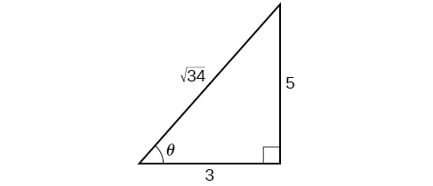

In this section, you will:
* Use double-angle formulas to find exact values.
* Use double-angle formulas to verify identities.
* Use reduction formulas to simplify an expression.
* Use half-angle formulas to find exact values.

 {: #Figure_07_03_001}

Bicycle ramps made for competition (see [\[link\]](#Figure_07_03_001)) must vary in height depending on the skill level of the competitors. For advanced competitors, the angle formed by the ramp and the ground should be<math xmlns="http://www.w3.org/1998/Math/MathML"> <mrow> <mtext> </mtext><mi>θ</mi><mtext> </mtext> </mrow> </math>

such that<math xmlns="http://www.w3.org/1998/Math/MathML"> <mrow> <mtext> </mtext><mi>tan</mi><mtext> </mtext><mi>θ</mi><mo>=</mo><mfrac> <mn>5</mn> <mn>3</mn> </mfrac> <mo>.</mo><mtext> </mtext> </mrow> </math>

The angle is divided in half for novices. What is the steepness of the ramp for novices? In this section, we will investigate three additional categories of identities that we can use to answer questions such as this one.

# Using Double-Angle Formulas to Find Exact Values

In the previous section, we used addition and subtraction formulas for trigonometric functions. Now, we take another look at those same formulas. The **double-angle formulas**{: data-type="term" .no-emphasis} are a special case of the sum formulas, where<math xmlns="http://www.w3.org/1998/Math/MathML"> <mrow> <mtext> </mtext><mi>α</mi><mo>=</mo><mi>β</mi><mo>.</mo><mtext> </mtext> </mrow> </math>

Deriving the double-angle formula for sine begins with the sum formula,

<math xmlns="http://www.w3.org/1998/Math/MathML"> <mrow> <mi>sin</mi><mrow><mo>(</mo> <mrow> <mi>α</mi><mo>+</mo><mi>β</mi> </mrow> <mo>)</mo></mrow><mo>=</mo><mi>sin</mi><mtext> </mtext><mi>α</mi><mtext> </mtext><mi>cos</mi><mtext> </mtext><mi>β</mi><mo>+</mo><mi>cos</mi><mtext> </mtext><mi>α</mi><mtext> </mtext><mi>sin</mi><mtext> </mtext><mi>β</mi> </mrow> </math>

If we let<math xmlns="http://www.w3.org/1998/Math/MathML"> <mrow> <mtext> </mtext><mi>α</mi><mo>=</mo><mi>β</mi><mo>=</mo><mi>θ</mi><mo>,</mo> </mrow> </math>

then we have

<math xmlns="http://www.w3.org/1998/Math/MathML" display="block"> <mrow> <mtable> <mtr> <mtd columnalign="right"> <mrow> <mi>sin</mi><mo stretchy="false">(</mo><mi>θ</mi><mo>+</mo><mi>θ</mi><mo stretchy="false">)</mo> </mrow> </mtd> <mtd> <mo>=</mo> </mtd> <mtd columnalign="left"> <mrow> <mi>sin</mi><mtext> </mtext><mi>θ</mi><mtext> </mtext><mi>cos</mi><mtext> </mtext><mi>θ</mi><mo>+</mo><mi>cos</mi><mtext> </mtext><mi>θ</mi><mtext> </mtext><mi>sin</mi><mtext> </mtext><mi>θ</mi> </mrow> </mtd> </mtr> <mtr> <mtd columnalign="right"> <mrow> <mi>sin</mi><mo stretchy="false">(</mo><mn>2</mn><mi>θ</mi><mo stretchy="false">)</mo> </mrow> </mtd> <mtd> <mo>=</mo> </mtd> <mtd columnalign="left"> <mrow> <mn>2</mn><mi>sin</mi><mtext> </mtext><mi>θ</mi><mtext> </mtext><mi>cos</mi><mtext> </mtext><mi>θ</mi> </mrow> </mtd> </mtr> </mtable> </mrow> </math>

Deriving the double-angle for cosine gives us three options. First, starting from the sum formula,<math xmlns="http://www.w3.org/1998/Math/MathML"> <mrow> <mtext> </mtext><mi>cos</mi><mrow><mo>(</mo> <mrow> <mi>α</mi><mo>+</mo><mi>β</mi> </mrow> <mo>)</mo></mrow><mo>=</mo><mi>cos</mi><mtext> </mtext><mi>α</mi><mtext> </mtext><mi>cos</mi><mtext> </mtext><mi>β</mi><mo>−</mo><mi>sin</mi><mtext> </mtext><mi>α</mi><mtext> </mtext><mi>sin</mi><mtext> </mtext><mi>β</mi><mo>,</mo> </mrow> </math>

and letting<math xmlns="http://www.w3.org/1998/Math/MathML"> <mrow> <mtext> </mtext><mi>α</mi><mo>=</mo><mi>β</mi><mo>=</mo><mi>θ</mi><mo>,</mo> </mrow> </math>

we have

<math xmlns="http://www.w3.org/1998/Math/MathML" display="block"> <mrow> <mtable> <mtr> <mtd columnalign="right"> <mrow> <mi>cos</mi><mo stretchy="false">(</mo><mi>θ</mi><mo>+</mo><mi>θ</mi><mo stretchy="false">)</mo> </mrow> </mtd> <mtd> <mo>=</mo> </mtd> <mtd columnalign="left"> <mrow> <mi>cos</mi><mtext> </mtext><mi>θ</mi><mtext> </mtext><mi>cos</mi><mtext> </mtext><mi>θ</mi><mo>−</mo><mi>sin</mi><mtext> </mtext><mi>θ</mi><mtext> </mtext><mi>sin</mi><mtext> </mtext><mi>θ</mi> </mrow> </mtd> </mtr> <mtr> <mtd columnalign="right"> <mrow> <mi>cos</mi><mo stretchy="false">(</mo><mn>2</mn><mi>θ</mi><mo stretchy="false">)</mo> </mrow> </mtd> <mtd> <mo>=</mo> </mtd> <mtd columnalign="left"> <mrow> <msup> <mrow> <mi>cos</mi> </mrow> <mn>2</mn> </msup> <mi>θ</mi><mo>−</mo><msup> <mrow> <mi>sin</mi> </mrow> <mn>2</mn> </msup> <mi>θ</mi> </mrow> </mtd> </mtr> </mtable> </mrow> </math>

Using the Pythagorean properties, we can expand this double-angle formula for cosine and get two more variations. The first variation is:

<math xmlns="http://www.w3.org/1998/Math/MathML" display="block"> <mrow> <mtable> <mtr rowalign="center"> <mtd columnalign="right" rowalign="center"> <mrow> <mi>cos</mi><mo stretchy="false">(</mo><mn>2</mn><mi>θ</mi><mo stretchy="false">)</mo> </mrow> </mtd> <mtd rowalign="center"> <mo>=</mo> </mtd> <mtd columnalign="left" rowalign="center"> <mrow> <msup> <mrow> <mi>cos</mi> </mrow> <mn>2</mn> </msup> <mi>θ</mi><mo>−</mo><msup> <mrow> <mi>sin</mi> </mrow> <mn>2</mn> </msup> <mi>θ</mi> </mrow> </mtd> </mtr> <mtr rowalign="center"> <mtd rowalign="center" /> <mtd rowalign="center"> <mo>=</mo> </mtd> <mtd columnalign="left" rowalign="center"> <mrow> <mrow><mo>(</mo> <mrow> <mn>1</mn><mo>−</mo><msup> <mrow> <mi>sin</mi> </mrow> <mn>2</mn> </msup> <mi>θ</mi> </mrow> <mo>)</mo></mrow><mo>−</mo><msup> <mrow> <mi>sin</mi> </mrow> <mn>2</mn> </msup> <mi>θ</mi> </mrow> </mtd> </mtr> <mtr rowalign="center"> <mtd rowalign="center" /> <mtd rowalign="center"> <mo>=</mo> </mtd> <mtd columnalign="left" rowalign="center"> <mrow> <mn>1</mn><mo>−</mo><mn>2</mn><msup> <mrow> <mi>sin</mi> </mrow> <mn>2</mn> </msup> <mi>θ</mi> </mrow> </mtd> </mtr> </mtable> </mrow> </math>

The second variation is:

<math xmlns="http://www.w3.org/1998/Math/MathML" display="block"> <mrow> <mtable> <mtr rowalign="center"> <mtd columnalign="right" rowalign="center"> <mrow> <mi>cos</mi><mo stretchy="false">(</mo><mn>2</mn><mi>θ</mi><mo stretchy="false">)</mo> </mrow> </mtd> <mtd rowalign="center"> <mo>=</mo> </mtd> <mtd columnalign="left" rowalign="center"> <mrow> <msup> <mrow> <mi>cos</mi> </mrow> <mn>2</mn> </msup> <mi>θ</mi><mo>−</mo><msup> <mrow> <mi>sin</mi> </mrow> <mn>2</mn> </msup> <mi>θ</mi> </mrow> </mtd> </mtr> <mtr rowalign="center"> <mtd rowalign="center" /> <mtd rowalign="center"> <mo>=</mo> </mtd> <mtd columnalign="left" rowalign="center"> <mrow> <msup> <mrow> <mi>cos</mi> </mrow> <mn>2</mn> </msup> <mi>θ</mi><mo>−</mo><mrow><mo>(</mo> <mrow> <mn>1</mn><mo>−</mo><msup> <mrow> <mi>cos</mi> </mrow> <mn>2</mn> </msup> <mi>θ</mi> </mrow> <mo>)</mo></mrow> </mrow> </mtd> </mtr> <mtr rowalign="center"> <mtd rowalign="center" /> <mtd rowalign="center"> <mo>=</mo> </mtd> <mtd columnalign="left" rowalign="center"> <mrow> <mn>2</mn><mtext> </mtext><msup> <mrow> <mi>cos</mi> </mrow> <mn>2</mn> </msup> <mi>θ</mi><mo>−</mo><mn>1</mn> </mrow> </mtd> </mtr> </mtable> </mrow> </math>

Similarly, to derive the double-angle formula for tangent, replacing<math xmlns="http://www.w3.org/1998/Math/MathML"> <mrow> <mtext> </mtext><mi>α</mi><mo>=</mo><mi>β</mi><mo>=</mo><mi>θ</mi><mtext> </mtext> </mrow> </math>

in the sum formula gives

<math xmlns="http://www.w3.org/1998/Math/MathML" display="block"> <mrow> <mtable> <mtr> <mtd columnalign="right"> <mrow> <mi>tan</mi><mo stretchy="false">(</mo><mi>α</mi><mo>+</mo><mi>β</mi><mo stretchy="false">)</mo> </mrow> </mtd> <mtd> <mo>=</mo> </mtd> <mtd columnalign="left"> <mrow> <mfrac> <mrow> <mi>tan</mi><mtext> </mtext><mi>α</mi><mo>+</mo><mi>tan</mi><mtext> </mtext><mi>β</mi> </mrow> <mrow> <mn>1</mn><mo>−</mo><mi>tan</mi><mtext> </mtext><mi>α</mi><mtext> </mtext><mi>tan</mi><mtext> </mtext><mi>β</mi> </mrow> </mfrac> </mrow> </mtd> </mtr> <mtr> <mtd columnalign="right"> <mrow> <mi>tan</mi><mo stretchy="false">(</mo><mi>θ</mi><mo>+</mo><mi>θ</mi><mo stretchy="false">)</mo> </mrow> </mtd> <mtd> <mo>=</mo> </mtd> <mtd columnalign="left"> <mrow> <mfrac> <mrow> <mi>tan</mi><mtext> </mtext><mi>θ</mi><mo>+</mo><mi>tan</mi><mtext> </mtext><mi>θ</mi> </mrow> <mrow> <mn>1</mn><mo>−</mo><mi>tan</mi><mtext> </mtext><mi>θ</mi><mtext> </mtext><mi>tan</mi><mtext> </mtext><mi>θ</mi> </mrow> </mfrac> </mrow> </mtd> </mtr> <mtr> <mtd columnalign="right"> <mrow> <mi>tan</mi><mo stretchy="false">(</mo><mn>2</mn><mi>θ</mi><mo stretchy="false">)</mo> </mrow> </mtd> <mtd> <mo>=</mo> </mtd> <mtd columnalign="left"> <mrow> <mfrac> <mrow> <mn>2</mn><mi>tan</mi><mtext> </mtext><mi>θ</mi> </mrow> <mrow> <mn>1</mn><mo>−</mo><msup> <mrow> <mi>tan</mi> </mrow> <mn>2</mn> </msup> <mi>θ</mi> </mrow> </mfrac> </mrow> </mtd> </mtr> </mtable> </mrow> </math>

Double-Angle Formulas

The **double-angle formulas**{: data-type="term"} are summarized as follows:

<math xmlns="http://www.w3.org/1998/Math/MathML"> <mrow> <mtable> <mtr> <mtd columnalign="right"> <mrow><mspace width=".45em" /> <mi>sin</mi><mo stretchy="false">(</mo><mn>2</mn><mi>θ</mi><mo stretchy="false">)</mo> </mrow> </mtd> <mtd> <mo>=</mo> </mtd> <mtd columnalign="left"> <mrow> <mn>2</mn><mtext> </mtext><mi>sin</mi><mtext> </mtext><mi>θ</mi><mtext> </mtext><mi>cos</mi><mtext> </mtext><mi>θ</mi> </mrow> </mtd> </mtr> </mtable> </mrow> </math>

* * *
{: data-type="newline"}

<math xmlns="http://www.w3.org/1998/Math/MathML"> <mrow> <mtable> <mtr rowalign="center"> <mtd columnalign="right" rowalign="center"> <mrow><mspace width="1.5em" /> <mi>cos</mi><mo stretchy="false">(</mo><mn>2</mn><mi>θ</mi><mo stretchy="false">)</mo> </mrow> </mtd> <mtd rowalign="center"> <mo>=</mo> </mtd> <mtd columnalign="left" rowalign="center"> <mrow> <msup> <mrow> <mi>cos</mi> </mrow> <mn>2</mn> </msup> <mi>θ</mi><mo>−</mo><msup> <mrow> <mi>sin</mi> </mrow> <mn>2</mn> </msup> <mi>θ</mi> </mrow> </mtd> </mtr> <mtr rowalign="center"> <mtd rowalign="center" /> <mtd rowalign="center"> <mo>=</mo> </mtd> <mtd columnalign="left" rowalign="center"> <mrow> <mn>1</mn><mo>−</mo><mn>2</mn><mtext> </mtext><msup> <mrow> <mi>sin</mi> </mrow> <mn>2</mn> </msup> <mi>θ</mi> </mrow> </mtd> </mtr> <mtr rowalign="center"> <mtd rowalign="center" /> <mtd rowalign="center"> <mo>=</mo> </mtd> <mtd columnalign="left" rowalign="center"> <mrow> <mn>2</mn><mtext> </mtext><msup> <mrow> <mi>cos</mi> </mrow> <mn>2</mn> </msup> <mi>θ</mi><mo>−</mo><mn>1</mn> </mrow> </mtd> </mtr> </mtable> </mrow> </math>

* * *
{: data-type="newline"}

<math xmlns="http://www.w3.org/1998/Math/MathML"> <mrow> <mtable> <mtr> <mtd columnalign="right"> <mrow> <mi>tan</mi><mo stretchy="false">(</mo><mn>2</mn><mi>θ</mi><mo stretchy="false">)</mo> </mrow> </mtd> <mtd> <mo>=</mo> </mtd> <mtd columnalign="left"> <mrow> <mfrac> <mrow> <mn>2</mn><mtext> </mtext><mi>tan</mi><mtext> </mtext><mi>θ</mi> </mrow> <mrow> <mn>1</mn><mo>−</mo><msup> <mrow> <mi>tan</mi> </mrow> <mn>2</mn> </msup> <mi>θ</mi> </mrow> </mfrac> </mrow> </mtd> </mtr> </mtable> </mrow> </math>

<strong>Given the tangent of an angle and the quadrant in which it is located, use the double-angle formulas to find the exact value. </strong>

1.  Draw a triangle to reflect the given information.
2.  Determine the correct double-angle formula.
3.  Substitute values into the formula based on the triangle.
4.  Simplify.
{: data-number-style="arabic"}

Using a Double-Angle Formula to Find the Exact Value Involving Tangent

Given that<math xmlns="http://www.w3.org/1998/Math/MathML"> <mrow> <mtext> </mtext><mi>tan</mi><mtext> </mtext><mi>θ</mi><mo>=</mo><mo>−</mo><mfrac> <mn>3</mn> <mn>4</mn> </mfrac> <mtext> </mtext> </mrow> </math>

and<math xmlns="http://www.w3.org/1998/Math/MathML"> <mrow> <mtext> </mtext><mi>θ</mi><mtext> </mtext> </mrow> </math>

is in quadrant II, find the following:

1.  <math xmlns="http://www.w3.org/1998/Math/MathML"> <mrow> <mi>sin</mi><mrow><mo>(</mo> <mrow> <mn>2</mn><mi>θ</mi> </mrow> <mo>)</mo></mrow> </mrow> </math>

2.  <math xmlns="http://www.w3.org/1998/Math/MathML"> <mrow> <mi>cos</mi><mrow><mo>(</mo> <mrow> <mn>2</mn><mi>θ</mi> </mrow> <mo>)</mo></mrow> </mrow> </math>

3.  <math xmlns="http://www.w3.org/1998/Math/MathML"> <mrow> <mi>tan</mi><mrow><mo>(</mo> <mrow> <mn>2</mn><mi>θ</mi> </mrow> <mo>)</mo></mrow> </mrow> </math>
{: data-number-style="lower-alpha"}

If we draw a triangle to reflect the information given, we can find the values needed to solve the problems on the image. We are given<math xmlns="http://www.w3.org/1998/Math/MathML"> <mrow> <mtext> </mtext><mi>tan</mi><mtext> </mtext><mi>θ</mi><mo>=</mo><mo>−</mo><mfrac> <mn>3</mn> <mn>4</mn> </mfrac> <mo>,</mo> </mrow> </math>

such that<math xmlns="http://www.w3.org/1998/Math/MathML"> <mrow> <mtext> </mtext><mi>θ</mi><mtext> </mtext> </mrow> </math>

is in quadrant II. The tangent of an angle is equal to the opposite side over the adjacent side, and because<math xmlns="http://www.w3.org/1998/Math/MathML"> <mrow> <mtext> </mtext><mi>θ</mi><mtext> </mtext> </mrow> </math>

is in the second quadrant, the adjacent side is on the *x*-axis and is negative. Use the **Pythagorean Theorem**{: data-type="term" .no-emphasis} to find the length of the hypotenuse:

<math xmlns="http://www.w3.org/1998/Math/MathML" display="block"> <mrow> <mtable> <mtr> <mtd columnalign="right"> <mrow> <msup> <mrow> <mo stretchy="false">(</mo><mn>−4</mn><mo stretchy="false">)</mo> </mrow> <mn>2</mn> </msup> <mo>+</mo><msup> <mrow> <mo stretchy="false">(</mo><mn>3</mn><mo stretchy="false">)</mo> </mrow> <mn>2</mn> </msup> </mrow> </mtd> <mtd> <mo>=</mo> </mtd> <mtd columnalign="left"> <mrow> <msup> <mi>c</mi> <mn>2</mn> </msup> </mrow> </mtd> </mtr> <mtr> <mtd columnalign="right"> <mrow> <mn>16</mn><mo>+</mo><mn>9</mn> </mrow> </mtd> <mtd> <mo>=</mo> </mtd> <mtd columnalign="left"> <mrow> <msup> <mi>c</mi> <mn>2</mn> </msup> </mrow> </mtd> </mtr> <mtr> <mtd columnalign="right"> <mrow> <mn>25</mn> </mrow> </mtd> <mtd> <mo>=</mo> </mtd> <mtd columnalign="left"> <mrow> <msup> <mi>c</mi> <mn>2</mn> </msup> </mrow> </mtd> </mtr> <mtr> <mtd columnalign="right"> <mi>c</mi> </mtd> <mtd> <mo>=</mo> </mtd> <mtd columnalign="left"> <mn>5</mn> </mtd> </mtr> </mtable> </mrow> </math>

Now we can draw a triangle similar to the one shown in [[link]](#Figure_07_03_02).

{: #Figure_07_03_02}

1.  Let’s begin by writing the double-angle formula for sine.
    

    <math xmlns="http://www.w3.org/1998/Math/MathML" display="block"> <mrow> <mi>sin</mi><mo stretchy="false">(</mo><mn>2</mn><mi>θ</mi><mo stretchy="false">)</mo><mo>=</mo><mn>2</mn><mtext> </mtext><mi>sin</mi><mtext> </mtext><mi>θ</mi><mtext> </mtext><mi>cos</mi><mtext> </mtext><mi>θ</mi> </mrow> </math>
    

    
    We see that we to need to find<math xmlns="http://www.w3.org/1998/Math/MathML"> <mrow> <mtext> </mtext><mi>sin</mi><mtext> </mtext><mi>θ</mi><mtext> </mtext> </mrow> </math>
    
    and<math xmlns="http://www.w3.org/1998/Math/MathML"> <mrow> <mtext> </mtext><mi>cos</mi><mtext> </mtext><mi>θ</mi><mo>.</mo><mtext> </mtext> </mrow> </math>
    
    Based on [[link]](#Figure_07_03_02), we see that the hypotenuse equals 5, so<math xmlns="http://www.w3.org/1998/Math/MathML"> <mrow> <mtext> </mtext><mi>sin</mi><mtext> </mtext><mi>θ</mi><mo>=</mo><mfrac> <mn>3</mn> <mn>5</mn> </mfrac> <mo>,</mo> </mrow> </math>
    
    and<math xmlns="http://www.w3.org/1998/Math/MathML"> <mrow> <mtext> </mtext><mi>cos</mi><mtext> </mtext><mi>θ</mi><mo>=</mo><mo>−</mo><mfrac> <mn>4</mn> <mn>5</mn> </mfrac> <mo>.</mo><mtext>  </mtext> </mrow> </math>
    
    Substitute these values into the equation, and simplify.
    
    Thus,
    
    

    <math xmlns="http://www.w3.org/1998/Math/MathML" display="block"> <mrow> <mtable> <mtr rowalign="center"> <mtd columnalign="right" rowalign="center"> <mrow> <mi>sin</mi><mo stretchy="false">(</mo><mn>2</mn><mi>θ</mi><mo stretchy="false">)</mo> </mrow> </mtd> <mtd rowalign="center"> <mo>=</mo> </mtd> <mtd columnalign="left" rowalign="center"> <mrow> <mn>2</mn><mrow><mo>(</mo> <mrow> <mfrac> <mn>3</mn> <mn>5</mn> </mfrac> </mrow> <mo>)</mo></mrow><mrow><mo>(</mo> <mrow> <mo>−</mo><mfrac> <mn>4</mn> <mn>5</mn> </mfrac> </mrow> <mo>)</mo></mrow> </mrow> </mtd> </mtr> <mtr rowalign="center"> <mtd rowalign="center" /> <mtd rowalign="center"> <mo>=</mo> </mtd> <mtd columnalign="left" rowalign="center"> <mrow> <mo>−</mo><mfrac> <mrow> <mn>24</mn> </mrow> <mrow> <mn>25</mn> </mrow> </mfrac> </mrow> </mtd> </mtr> </mtable> </mrow> </math>
    

2.  Write the double-angle formula for cosine.
    

    <math xmlns="http://www.w3.org/1998/Math/MathML" display="block"> <mrow> <mi>cos</mi><mrow><mo>(</mo> <mrow> <mn>2</mn><mi>θ</mi> </mrow> <mo>)</mo></mrow><mo>=</mo><msup> <mrow> <mi>cos</mi> </mrow> <mn>2</mn> </msup> <mi>θ</mi><mo>−</mo><msup> <mrow> <mi>sin</mi> </mrow> <mn>2</mn> </msup> <mi>θ</mi> </mrow> </math>
    

    
    Again, substitute the values of the sine and cosine into the equation, and simplify.
    
    

    <math xmlns="http://www.w3.org/1998/Math/MathML" display="block"> <mrow> <mtable> <mtr rowalign="center"> <mtd columnalign="right" rowalign="center"> <mrow> <mi>cos</mi><mo stretchy="false">(</mo><mn>2</mn><mi>θ</mi><mo stretchy="false">)</mo> </mrow> </mtd> <mtd rowalign="center"> <mo>=</mo> </mtd> <mtd columnalign="left" rowalign="center"> <mrow> <msup> <mrow> <mrow><mo>(</mo> <mrow> <mo>−</mo><mfrac> <mn>4</mn> <mn>5</mn> </mfrac> </mrow> <mo>)</mo></mrow> </mrow> <mn>2</mn> </msup> <mo>−</mo><msup> <mrow> <mrow><mo>(</mo> <mrow> <mfrac> <mn>3</mn> <mn>5</mn> </mfrac> </mrow> <mo>)</mo></mrow> </mrow> <mn>2</mn> </msup> </mrow> </mtd> </mtr> <mtr rowalign="center"> <mtd rowalign="center" /> <mtd rowalign="center"> <mo>=</mo> </mtd> <mtd columnalign="left" rowalign="center"> <mrow> <mfrac> <mrow> <mn>16</mn> </mrow> <mrow> <mn>25</mn> </mrow> </mfrac> <mo>−</mo><mfrac> <mn>9</mn> <mrow> <mn>25</mn> </mrow> </mfrac> </mrow> </mtd> </mtr> <mtr rowalign="center"> <mtd rowalign="center" /> <mtd rowalign="center"> <mo>=</mo> </mtd> <mtd columnalign="left" rowalign="center"> <mrow> <mfrac> <mn>7</mn> <mrow> <mn>25</mn> </mrow> </mfrac> </mrow> </mtd> </mtr> </mtable> </mrow> </math>
    

3.  Write the double-angle formula for tangent.
    

    <math xmlns="http://www.w3.org/1998/Math/MathML" display="block"> <mrow> <mi>tan</mi><mo stretchy="false">(</mo><mn>2</mn><mi>θ</mi><mo stretchy="false">)</mo><mo>=</mo><mfrac> <mrow> <mn>2</mn><mtext> </mtext><mi>tan</mi><mtext> </mtext><mi>θ</mi> </mrow> <mrow> <mn>1</mn><mo>−</mo><msup> <mrow> <mi>tan</mi> </mrow> <mn>2</mn> </msup> <mi>θ</mi> </mrow> </mfrac> </mrow> </math>
    

    
    In this formula, we need the tangent, which we were given as<math xmlns="http://www.w3.org/1998/Math/MathML"> <mrow> <mtext> </mtext><mi>tan</mi><mtext> </mtext><mi>θ</mi><mo>=</mo><mo>−</mo><mfrac> <mn>3</mn> <mn>4</mn> </mfrac> <mo>.</mo><mtext>  </mtext> </mrow> </math>
    
    Substitute this value into the equation, and simplify.
    
    

    <math xmlns="http://www.w3.org/1998/Math/MathML" display="block"> <mrow> <mtable> <mtr rowalign="center"> <mtd columnalign="right" rowalign="center"> <mrow> <mi>tan</mi><mo stretchy="false">(</mo><mn>2</mn><mi>θ</mi><mo stretchy="false">)</mo> </mrow> </mtd> <mtd rowalign="center"> <mo>=</mo> </mtd> <mtd columnalign="left" rowalign="center"> <mrow> <mfrac> <mrow> <mn>2</mn><mrow><mo>(</mo> <mrow> <mo>−</mo><mfrac> <mn>3</mn> <mn>4</mn> </mfrac> </mrow> <mo>)</mo></mrow> </mrow> <mrow> <mn>1</mn><mo>−</mo><msup> <mrow> <mrow><mo>(</mo> <mrow> <mo>−</mo><mfrac> <mn>3</mn> <mn>4</mn> </mfrac> </mrow> <mo>)</mo></mrow> </mrow> <mn>2</mn> </msup> </mrow> </mfrac> </mrow> </mtd> </mtr> <mtr rowalign="center"> <mtd rowalign="center" /> <mtd rowalign="center"> <mo>=</mo> </mtd> <mtd columnalign="left" rowalign="center"> <mrow> <mfrac> <mrow> <mo>−</mo><mfrac> <mn>3</mn> <mn>2</mn> </mfrac> </mrow> <mrow> <mn>1</mn><mo>−</mo><mfrac> <mn>9</mn> <mrow> <mn>16</mn> </mrow> </mfrac> </mrow> </mfrac> </mrow> </mtd> </mtr> <mtr rowalign="center"> <mtd rowalign="center" /> <mtd rowalign="center"> <mo>=</mo> </mtd> <mtd columnalign="left" rowalign="center"> <mrow> <mo>−</mo><mfrac> <mn>3</mn> <mn>2</mn> </mfrac> <mrow><mo>(</mo> <mrow> <mfrac> <mrow> <mn>16</mn> </mrow> <mn>7</mn> </mfrac> </mrow> <mo>)</mo></mrow> </mrow> </mtd> </mtr> <mtr rowalign="center"> <mtd rowalign="center" /> <mtd rowalign="center"> <mo>=</mo> </mtd> <mtd columnalign="left" rowalign="center"> <mrow> <mo>−</mo><mfrac> <mrow> <mn>24</mn> </mrow> <mn>7</mn> </mfrac> </mrow> </mtd> </mtr> </mtable> </mrow> </math>
    

{: data-number-style="lower-alpha"}

Given<math xmlns="http://www.w3.org/1998/Math/MathML"> <mrow> <mtext> </mtext><mi>sin</mi><mtext> </mtext><mi>α</mi><mo>=</mo><mfrac> <mn>5</mn> <mn>8</mn> </mfrac> <mo>,</mo> </mrow> </math>

with<math xmlns="http://www.w3.org/1998/Math/MathML"> <mrow> <mtext> </mtext><mi>θ</mi><mtext> </mtext> </mrow> </math>

in quadrant I, find<math xmlns="http://www.w3.org/1998/Math/MathML"> <mrow> <mtext> </mtext><mi>cos</mi><mrow><mo>(</mo> <mrow> <mn>2</mn><mi>α</mi> </mrow> <mo>)</mo></mrow><mo>.</mo> </mrow> </math>

<math xmlns="http://www.w3.org/1998/Math/MathML"> <mrow> <mi>cos</mi><mrow><mo>(</mo> <mrow> <mn>2</mn><mi>α</mi> </mrow> <mo>)</mo></mrow><mo>=</mo><mfrac> <mn>7</mn> <mrow> <mn>32</mn> </mrow> </mfrac> </mrow> </math>

Using the Double-Angle Formula for Cosine without Exact Values

Use the double-angle formula for cosine to write<math xmlns="http://www.w3.org/1998/Math/MathML"> <mrow> <mtext> </mtext><mi>cos</mi><mrow><mo>(</mo> <mrow> <mn>6</mn><mi>x</mi> </mrow> <mo>)</mo></mrow><mtext> </mtext> </mrow> </math>

in terms of<math xmlns="http://www.w3.org/1998/Math/MathML"> <mrow> <mtext> </mtext><mi>cos</mi><mrow><mo>(</mo> <mrow> <mn>3</mn><mi>x</mi> </mrow> <mo>)</mo></mrow><mo>.</mo> </mrow> </math>

<math xmlns="http://www.w3.org/1998/Math/MathML" display="block"> <mrow> <mtable> <mtr rowalign="center"> <mtd columnalign="right" rowalign="center"> <mrow> <mi>cos</mi><mo stretchy="false">(</mo><mn>6</mn><mi>x</mi><mo stretchy="false">)</mo> </mrow> </mtd> <mtd rowalign="center"> <mo>=</mo> </mtd> <mtd columnalign="left" rowalign="center"> <mrow> <mi>cos</mi><mo stretchy="false">(</mo><mn>3</mn><mi>x</mi><mo>+</mo><mn>3</mn><mi>x</mi><mo stretchy="false">)</mo> </mrow> </mtd> </mtr> <mtr rowalign="center"> <mtd rowalign="center" /> <mtd rowalign="center"> <mo>=</mo> </mtd> <mtd columnalign="left" rowalign="center"> <mrow> <mi>cos</mi><mtext> </mtext><mn>3</mn><mi>x</mi><mtext> </mtext><mi>cos</mi><mtext> </mtext><mn>3</mn><mi>x</mi><mo>−</mo><mi>sin</mi><mtext> </mtext><mn>3</mn><mi>x</mi><mtext> </mtext><mi>sin</mi><mtext> </mtext><mn>3</mn><mi>x</mi> </mrow> </mtd> </mtr> <mtr rowalign="center"> <mtd rowalign="center" /> <mtd rowalign="center"> <mo>=</mo> </mtd> <mtd columnalign="left" rowalign="center"> <mrow> <msup> <mrow> <mi>cos</mi> </mrow> <mn>2</mn> </msup> <mn>3</mn><mi>x</mi><mo>−</mo><msup> <mrow> <mi>sin</mi> </mrow> <mn>2</mn> </msup> <mn>3</mn><mi>x</mi> </mrow> </mtd> </mtr> </mtable> </mrow> </math>

Analysis

This example illustrates that we can use the double-angle formula without having exact values. It emphasizes that the pattern is what we need to remember and that identities are true for all values in the domain of the trigonometric function.

# Using Double-Angle Formulas to Verify Identities

Establishing identities using the double-angle formulas is performed using the same steps we used to derive the sum and difference formulas. Choose the more complicated side of the equation and rewrite it until it matches the other side.

Using the Double-Angle Formulas to Verify an Identity

Verify the following identity using double-angle formulas:

<math xmlns="http://www.w3.org/1998/Math/MathML" display="block"> <mrow> <mn>1</mn><mo>+</mo><mi>sin</mi><mrow><mo>(</mo> <mrow> <mn>2</mn><mi>θ</mi> </mrow> <mo>)</mo></mrow><mo>=</mo><msup> <mrow> <mrow><mo>(</mo> <mrow> <mi>sin</mi><mtext> </mtext><mi>θ</mi><mo>+</mo><mi>cos</mi><mtext> </mtext><mi>θ</mi> </mrow> <mo>)</mo></mrow> </mrow> <mn>2</mn> </msup> </mrow> </math>

We will work on the right side of the equal sign and rewrite the expression until it matches the left side.

<math xmlns="http://www.w3.org/1998/Math/MathML" display="block"> <mrow> <mtable> <mtr rowalign="center"> <mtd columnalign="right" rowalign="center"> <mrow> <msup> <mrow> <mo stretchy="false">(</mo><mi>sin</mi><mtext> </mtext><mi>θ</mi><mo>+</mo><mi>cos</mi><mtext> </mtext><mi>θ</mi><mo stretchy="false">)</mo> </mrow> <mn>2</mn> </msup> </mrow> </mtd> <mtd rowalign="center"> <mo>=</mo> </mtd> <mtd columnalign="left" rowalign="center"> <mrow> <msup> <mrow> <mi>sin</mi> </mrow> <mn>2</mn> </msup> <mi>θ</mi><mo>+</mo><mn>2</mn><mtext> </mtext><mi>sin</mi><mtext> </mtext><mi>θ</mi><mtext> </mtext><mi>cos</mi><mtext> </mtext><mi>θ</mi><mo>+</mo><msup> <mrow> <mi>cos</mi> </mrow> <mn>2</mn> </msup> <mi>θ</mi> </mrow> </mtd> </mtr> <mtr rowalign="center"> <mtd rowalign="center" /> <mtd rowalign="center"> <mo>=</mo> </mtd> <mtd columnalign="left" rowalign="center"> <mrow> <mrow><mo>(</mo> <mrow> <msup> <mrow> <mi>sin</mi> </mrow> <mn>2</mn> </msup> <mi>θ</mi><mo>+</mo><msup> <mrow> <mi>cos</mi> </mrow> <mn>2</mn> </msup> <mi>θ</mi> </mrow> <mo>)</mo></mrow><mo>+</mo><mn>2</mn><mtext> </mtext><mi>sin</mi><mtext> </mtext><mi>θ</mi><mtext> </mtext><mi>cos</mi><mtext> </mtext><mi>θ</mi> </mrow> </mtd> </mtr> <mtr rowalign="center"> <mtd rowalign="center" /> <mtd rowalign="center"> <mo>=</mo> </mtd> <mtd columnalign="left" rowalign="center"> <mrow> <mn>1</mn><mo>+</mo><mn>2</mn><mtext> </mtext><mi>sin</mi><mtext> </mtext><mi>θ</mi><mtext> </mtext><mi>cos</mi><mtext> </mtext><mi>θ</mi> </mrow> </mtd> </mtr> <mtr rowalign="center"> <mtd rowalign="center" /> <mtd rowalign="center"> <mo>=</mo> </mtd> <mtd columnalign="left" rowalign="center"> <mrow> <mn>1</mn><mo>+</mo><mi>sin</mi><mo stretchy="false">(</mo><mn>2</mn><mi>θ</mi><mo stretchy="false">)</mo> </mrow> </mtd> </mtr> </mtable> </mrow> </math>

Analysis

This process is not complicated, as long as we recall the perfect square formula from algebra:

<math xmlns="http://www.w3.org/1998/Math/MathML" display="block"> <mrow> <msup> <mrow> <mrow><mo>(</mo> <mrow> <mi>a</mi><mo>±</mo><mi>b</mi> </mrow> <mo>)</mo></mrow> </mrow> <mn>2</mn> </msup> <mo>=</mo><msup> <mi>a</mi> <mn>2</mn> </msup> <mo>±</mo><mn>2</mn><mi>a</mi><mi>b</mi><mo>+</mo><msup> <mi>b</mi> <mn>2</mn> </msup> </mrow> </math>

where<math xmlns="http://www.w3.org/1998/Math/MathML"> <mrow> <mtext> </mtext><mi>a</mi><mo>=</mo><mi>sin</mi><mtext> </mtext><mi>θ</mi><mtext> </mtext> </mrow> </math>

and<math xmlns="http://www.w3.org/1998/Math/MathML"> <mrow> <mtext> </mtext><mi>b</mi><mo>=</mo><mi>cos</mi><mtext> </mtext><mi>θ</mi><mo>.</mo><mtext> </mtext> </mrow> </math>

Part of being successful in mathematics is the ability to recognize patterns. While the terms or symbols may change, the algebra remains consistent.

Verify the identity:<math xmlns="http://www.w3.org/1998/Math/MathML"> <mrow> <mtext> </mtext><msup> <mrow> <mi>cos</mi> </mrow> <mn>4</mn> </msup> <mi>θ</mi><mo>−</mo><msup> <mrow> <mi>sin</mi> </mrow> <mn>4</mn> </msup> <mi>θ</mi><mo>=</mo><mi>cos</mi><mrow><mo>(</mo> <mrow> <mn>2</mn><mi>θ</mi> </mrow> <mo>)</mo></mrow><mo>.</mo> </mrow> </math>

<math xmlns="http://www.w3.org/1998/Math/MathML"> <mrow> <msup> <mrow> <mi>cos</mi> </mrow> <mn>4</mn> </msup> <mi>θ</mi><mo>−</mo><msup> <mrow> <mi>sin</mi> </mrow> <mn>4</mn> </msup> <mi>θ</mi><mo>=</mo><mrow><mo>(</mo> <mrow> <msup> <mrow> <mi>cos</mi> </mrow> <mn>2</mn> </msup> <mi>θ</mi><mo>+</mo><msup> <mrow> <mi>sin</mi> </mrow> <mn>2</mn> </msup> <mi>θ</mi> </mrow> <mo>)</mo></mrow><mrow><mo>(</mo> <mrow> <msup> <mrow> <mi>cos</mi> </mrow> <mn>2</mn> </msup> <mi>θ</mi><mo>−</mo><msup> <mrow> <mi>sin</mi> </mrow> <mn>2</mn> </msup> <mi>θ</mi> </mrow> <mo>)</mo></mrow><mo>=</mo><mi>cos</mi><mrow><mo>(</mo> <mrow> <mn>2</mn><mi>θ</mi> </mrow> <mo>)</mo></mrow> </mrow> </math>

Verifying a Double-Angle Identity for Tangent

Verify the identity:

<math xmlns="http://www.w3.org/1998/Math/MathML" display="block"> <mrow> <mi>tan</mi><mrow><mo>(</mo> <mrow> <mn>2</mn><mi>θ</mi> </mrow> <mo>)</mo></mrow><mo>=</mo><mfrac> <mn>2</mn> <mrow> <mi>cot</mi><mtext> </mtext><mi>θ</mi><mo>−</mo><mi>tan</mi><mtext> </mtext><mi>θ</mi> </mrow> </mfrac> </mrow> </math>

In this case, we will work with the left side of the equation and simplify or rewrite until it equals the right side of the equation.

<math xmlns="http://www.w3.org/1998/Math/MathML" display="block"> <mrow> <mtable> <mtr rowalign="center"> <mtd columnalign="right" rowalign="center"> <mrow> <mi>tan</mi><mo stretchy="false">(</mo><mn>2</mn><mi>θ</mi><mo stretchy="false">)</mo> </mrow> </mtd> <mtd rowalign="center"> <mo>=</mo> </mtd> <mtd columnalign="left" rowalign="center"> <mrow> <mfrac> <mrow> <mn>2</mn><mtext> </mtext><mi>tan</mi><mtext> </mtext><mi>θ</mi> </mrow> <mrow> <mn>1</mn><mo>−</mo><msup> <mrow> <mi>tan</mi> </mrow> <mn>2</mn> </msup> <mi>θ</mi> </mrow> </mfrac> </mrow> </mtd> <mtd columnalign="left" rowalign="center"> <mrow><mspace width="2em" /> <mtext>Double-angle formula</mtext> </mrow> </mtd> </mtr> <mtr rowalign="center"> <mtd rowalign="center" /> <mtd rowalign="center"> <mo>=</mo> </mtd> <mtd columnalign="left" rowalign="center"> <mrow> <mfrac> <mrow> <mn>2</mn><mtext> </mtext><mi>tan</mi><mtext> </mtext><mi>θ</mi><mrow><mo>(</mo> <mrow> <mfrac> <mn>1</mn> <mrow> <mi>tan</mi><mtext> </mtext><mi>θ</mi> </mrow> </mfrac> </mrow> <mo>)</mo></mrow> </mrow> <mrow> <mo stretchy="false">(</mo><mn>1</mn><mo>−</mo><msup> <mrow> <mi>tan</mi> </mrow> <mn>2</mn> </msup> <mi>θ</mi><mo stretchy="false">)</mo><mrow><mo>(</mo> <mrow> <mfrac> <mn>1</mn> <mrow> <mi>tan</mi><mtext> </mtext><mi>θ</mi> </mrow> </mfrac> </mrow> <mo>)</mo></mrow> </mrow> </mfrac> </mrow> </mtd> <mtd columnalign="left" rowalign="center"> <mrow><mspace width="2em" /> <mtext>Multiply by a term that results in desired numerator</mtext><mo>.</mo> </mrow> </mtd> </mtr> <mtr rowalign="center"> <mtd rowalign="center" /> <mtd rowalign="center"> <mo>=</mo> </mtd> <mtd columnalign="left" rowalign="center"> <mrow> <mfrac> <mn>2</mn> <mrow> <mfrac> <mn>1</mn> <mrow> <mi>tan</mi><mtext> </mtext><mi>θ</mi> </mrow> </mfrac> <mo>−</mo><mfrac> <mrow> <msup> <mrow> <mi>tan</mi> </mrow> <mn>2</mn> </msup> <mi>θ</mi> </mrow> <mrow> <mi>tan</mi><mtext> </mtext><mi>θ</mi> </mrow> </mfrac> </mrow> </mfrac> </mrow> </mtd> <mtd rowalign="center" /> </mtr> <mtr rowalign="center"> <mtd rowalign="center" /> <mtd rowalign="center"> <mo>=</mo> </mtd> <mtd columnalign="left" rowalign="center"> <mrow> <mfrac> <mn>2</mn> <mrow> <mi>cot</mi><mtext> </mtext><mi>θ</mi><mo>−</mo><mi>tan</mi><mtext> </mtext><mi>θ</mi> </mrow> </mfrac> </mrow> </mtd> <mtd columnalign="left" rowalign="center"> <mrow><mspace width="2em" /> <mtext>Use reciprocal identity for  </mtext><mfrac> <mn>1</mn> <mrow> <mi>tan</mi><mtext> </mtext><mi>θ</mi> </mrow> </mfrac> <mo>.</mo> </mrow> </mtd> </mtr> </mtable> </mrow> </math>

Analysis

Here is a case where the more complicated side of the initial equation appeared on the right, but we chose to work the left side. However, if we had chosen the left side to rewrite, we would have been working backwards to arrive at the equivalency. For example, suppose that we wanted to show

<math xmlns="http://www.w3.org/1998/Math/MathML"> <mrow> <mfrac> <mrow> <mn>2</mn><mi>tan</mi><mtext> </mtext><mi>θ</mi> </mrow> <mrow> <mn>1</mn><mo>−</mo><msup> <mrow> <mi>tan</mi> </mrow> <mn>2</mn> </msup> <mi>θ</mi> </mrow> </mfrac> <mo>=</mo><mfrac> <mn>2</mn> <mrow> <mi>cot</mi><mtext> </mtext><mi>θ</mi><mo>−</mo><mi>tan</mi><mtext> </mtext><mi>θ</mi> </mrow> </mfrac> </mrow> </math>

Let’s work on the right side.

<math xmlns="http://www.w3.org/1998/Math/MathML" display="block"> <mrow> <mtable> <mtr rowalign="center"> <mtd columnalign="right" rowalign="center"> <mrow> <mfrac> <mn>2</mn> <mrow> <mi>cot</mi><mtext> </mtext><mi>θ</mi><mo>−</mo><mi>tan</mi><mtext> </mtext><mi>θ</mi> </mrow> </mfrac> </mrow> </mtd> <mtd rowalign="center"> <mo>=</mo> </mtd> <mtd columnalign="left" rowalign="center"> <mrow> <mfrac> <mn>2</mn> <mrow> <mfrac> <mn>1</mn> <mrow> <mi>tan</mi><mtext> </mtext><mi>θ</mi> </mrow> </mfrac> <mo>−</mo><mi>tan</mi><mtext> </mtext><mi>θ</mi> </mrow> </mfrac> <mrow><mo>(</mo> <mrow> <mfrac> <mrow> <mi>tan</mi><mtext> </mtext><mi>θ</mi> </mrow> <mrow> <mi>tan</mi><mtext> </mtext><mi>θ</mi> </mrow> </mfrac> </mrow> <mo>)</mo></mrow> </mrow> </mtd> </mtr> <mtr rowalign="center"> <mtd rowalign="center" /> <mtd rowalign="center"> <mo>=</mo> </mtd> <mtd columnalign="left" rowalign="center"> <mrow> <mfrac> <mrow> <mn>2</mn><mtext> </mtext><mi>tan</mi><mtext> </mtext><mi>θ</mi> </mrow> <mrow> <mfrac> <mn>1</mn> <mrow> <menclose notation="updiagonalstrike"> <mrow> <mi>tan</mi><mtext> </mtext><mi>θ</mi> </mrow> </menclose> </mrow> </mfrac> <mo stretchy="false">(</mo><menclose notation="updiagonalstrike"> <mrow> <mi>tan</mi><mtext> </mtext><mi>θ</mi> </mrow> </menclose> <mo stretchy="false">)</mo><mo>−</mo><mi>tan</mi><mtext> </mtext><mi>θ</mi><mo stretchy="false">(</mo><mi>tan</mi><mtext> </mtext><mi>θ</mi><mo stretchy="false">)</mo> </mrow> </mfrac> </mrow> </mtd> </mtr> <mtr rowalign="center"> <mtd rowalign="center" /> <mtd rowalign="center"> <mo>=</mo> </mtd> <mtd columnalign="left" rowalign="center"> <mrow> <mfrac> <mrow> <mn>2</mn><mtext> </mtext><mi>tan</mi><mtext> </mtext><mi>θ</mi> </mrow> <mrow> <mn>1</mn><mo>−</mo><msup> <mrow> <mi>tan</mi> </mrow> <mn>2</mn> </msup> <mi>θ</mi> </mrow> </mfrac> </mrow> </mtd> </mtr> </mtable> </mrow> </math>

When using the identities to simplify a trigonometric expression or solve a trigonometric equation, there are usually several paths to a desired result. There is no set rule as to what side should be manipulated. However, we should begin with the guidelines set forth earlier.

Verify the identity:<math xmlns="http://www.w3.org/1998/Math/MathML"> <mrow> <mtext> </mtext><mi>cos</mi><mo stretchy="false">(</mo><mn>2</mn><mi>θ</mi><mo stretchy="false">)</mo><mi>cos</mi><mtext> </mtext><mi>θ</mi><mo>=</mo><msup> <mrow> <mi>cos</mi> </mrow> <mn>3</mn> </msup> <mi>θ</mi><mo>−</mo><mi>cos</mi><mtext> </mtext><mi>θ</mi><mtext> </mtext><msup> <mrow> <mi>sin</mi> </mrow> <mn>2</mn> </msup> <mi>θ</mi><mo>.</mo> </mrow> </math>

<math xmlns="http://www.w3.org/1998/Math/MathML"> <mrow> <mi>cos</mi><mrow><mo>(</mo> <mrow> <mn>2</mn><mi>θ</mi> </mrow> <mo>)</mo></mrow><mi>cos</mi><mtext> </mtext><mi>θ</mi><mo>=</mo><mrow><mo>(</mo> <mrow> <msup> <mrow> <mi>cos</mi> </mrow> <mn>2</mn> </msup> <mi>θ</mi><mo>−</mo><msup> <mrow> <mi>sin</mi> </mrow> <mn>2</mn> </msup> <mi>θ</mi> </mrow> <mo>)</mo></mrow><mi>cos</mi><mtext> </mtext><mi>θ</mi><mo>=</mo><msup> <mrow> <mi>cos</mi> </mrow> <mn>3</mn> </msup> <mi>θ</mi><mo>−</mo><mi>cos</mi><mtext> </mtext><mi>θ</mi><msup> <mrow> <mi>sin</mi> </mrow> <mn>2</mn> </msup> <mi>θ</mi> </mrow> </math>

# Use Reduction Formulas to Simplify an Expression

The double-angle formulas can be used to derive the **reduction formulas**{: data-type="term" .no-emphasis}, which are formulas we can use to reduce the power of a given expression involving even powers of sine or cosine. They allow us to rewrite the even powers of sine or cosine in terms of the first power of cosine. These formulas are especially important in higher-level math courses, calculus in particular. Also called the power-reducing formulas, three identities are included and are easily derived from the double-angle formulas.

We can use two of the three double-angle formulas for cosine to derive the reduction formulas for sine and cosine. Let’s begin with<math xmlns="http://www.w3.org/1998/Math/MathML"> <mrow> <mtext> </mtext><mi>cos</mi><mrow><mo>(</mo> <mrow> <mn>2</mn><mi>θ</mi> </mrow> <mo>)</mo></mrow><mo>=</mo><mn>1</mn><mo>−</mo><mn>2</mn><mtext> </mtext><msup> <mrow> <mi>sin</mi> </mrow> <mn>2</mn> </msup> <mi>θ</mi><mo>.</mo><mtext> </mtext> </mrow> </math>

Solve for<math xmlns="http://www.w3.org/1998/Math/MathML"> <mrow> <mtext> </mtext><msup> <mrow> <mi>sin</mi> </mrow> <mn>2</mn> </msup> <mi>θ</mi><mo>:</mo> </mrow> </math>

<math xmlns="http://www.w3.org/1998/Math/MathML" display="block"> <mrow> <mtable> <mtr> <mtd columnalign="right"> <mrow> <mi>cos</mi><mo stretchy="false">(</mo><mn>2</mn><mi>θ</mi><mo stretchy="false">)</mo> </mrow> </mtd> <mtd> <mo>=</mo> </mtd> <mtd columnalign="left"> <mrow> <mn>1</mn><mo>−</mo><mn>2</mn><mtext> </mtext><msup> <mrow> <mi>sin</mi> </mrow> <mn>2</mn> </msup> <mi>θ</mi> </mrow> </mtd> </mtr> <mtr> <mtd columnalign="right"> <mrow> <mn>2</mn><mtext> </mtext><msup> <mrow> <mi>sin</mi> </mrow> <mn>2</mn> </msup> <mi>θ</mi> </mrow> </mtd> <mtd> <mo>=</mo> </mtd> <mtd columnalign="left"> <mrow> <mn>1</mn><mo>−</mo><mi>cos</mi><mo stretchy="false">(</mo><mn>2</mn><mi>θ</mi><mo stretchy="false">)</mo> </mrow> </mtd> </mtr> <mtr> <mtd columnalign="right"> <mrow> <msup> <mrow> <mi>sin</mi> </mrow> <mn>2</mn> </msup> <mi>θ</mi> </mrow> </mtd> <mtd> <mo>=</mo> </mtd> <mtd columnalign="left"> <mrow> <mfrac> <mrow> <mn>1</mn><mo>−</mo><mi>cos</mi><mo stretchy="false">(</mo><mn>2</mn><mi>θ</mi><mo stretchy="false">)</mo> </mrow> <mn>2</mn> </mfrac> </mrow> </mtd> </mtr> </mtable> </mrow> </math>

Next, we use the formula<math xmlns="http://www.w3.org/1998/Math/MathML"> <mrow> <mtext> </mtext><mi>cos</mi><mrow><mo>(</mo> <mrow> <mn>2</mn><mi>θ</mi> </mrow> <mo>)</mo></mrow><mo>=</mo><mn>2</mn><mtext> </mtext><msup> <mrow> <mi>cos</mi> </mrow> <mn>2</mn> </msup> <mi>θ</mi><mo>−</mo><mn>1.</mn><mtext> </mtext> </mrow> </math>

Solve for<math xmlns="http://www.w3.org/1998/Math/MathML"> <mrow> <mtext> </mtext><msup> <mrow> <mi>cos</mi> </mrow> <mn>2</mn> </msup> <mi>θ</mi><mo>:</mo> </mrow> </math>

<math xmlns="http://www.w3.org/1998/Math/MathML" display="block"> <mrow> <mtable> <mtr> <mtd columnalign="right"> <mrow> <mi>cos</mi><mo stretchy="false">(</mo><mn>2</mn><mi>θ</mi><mo stretchy="false">)</mo> </mrow> </mtd> <mtd> <mo>=</mo> </mtd> <mtd columnalign="left"> <mrow> <mtext> </mtext><mn>2</mn><mtext> </mtext><msup> <mrow> <mi>cos</mi> </mrow> <mn>2</mn> </msup> <mi>θ</mi><mo>−</mo><mn>1</mn> </mrow> </mtd> </mtr> <mtr> <mtd columnalign="right"> <mrow> <mn>1</mn><mo>+</mo><mi>cos</mi><mo stretchy="false">(</mo><mn>2</mn><mi>θ</mi><mo stretchy="false">)</mo> </mrow> </mtd> <mtd> <mo>=</mo> </mtd> <mtd columnalign="left"> <mrow> <mn>2</mn><mtext> </mtext><msup> <mrow> <mi>cos</mi> </mrow> <mn>2</mn> </msup> <mi>θ</mi> </mrow> </mtd> </mtr> <mtr> <mtd columnalign="right"> <mrow> <mfrac> <mrow> <mn>1</mn><mo>+</mo><mi>cos</mi><mo stretchy="false">(</mo><mn>2</mn><mi>θ</mi><mo stretchy="false">)</mo> </mrow> <mn>2</mn> </mfrac> </mrow> </mtd> <mtd> <mo>=</mo> </mtd> <mtd columnalign="left"> <mrow> <msup> <mrow> <mi>cos</mi> </mrow> <mn>2</mn> </msup> <mi>θ</mi> </mrow> </mtd> </mtr> </mtable> </mrow> </math>

The last reduction formula is derived by writing tangent in terms of sine and cosine:

<math xmlns="http://www.w3.org/1998/Math/MathML" display="block"> <mrow> <mtable> <mtr rowalign="center"> <mtd columnalign="right" rowalign="center"> <mrow> <msup> <mrow> <mi>tan</mi> </mrow> <mn>2</mn> </msup> <mi>θ</mi> </mrow> </mtd> <mtd rowalign="center"> <mo>=</mo> </mtd> <mtd columnalign="left" rowalign="center"> <mrow> <mfrac> <mrow> <msup> <mrow> <mi>sin</mi> </mrow> <mn>2</mn> </msup> <mi>θ</mi> </mrow> <mrow> <msup> <mrow> <mi>cos</mi> </mrow> <mn>2</mn> </msup> <mi>θ</mi> </mrow> </mfrac> </mrow> </mtd> <mtd rowalign="center" /> </mtr> <mtr rowalign="center"> <mtd rowalign="center" /> <mtd rowalign="center"> <mo>=</mo> </mtd> <mtd columnalign="left" rowalign="center"> <mrow> <mfrac> <mrow> <mfrac> <mrow> <mn>1</mn><mo>−</mo><mi>cos</mi><mo stretchy="false">(</mo><mn>2</mn><mi>θ</mi><mo stretchy="false">)</mo> </mrow> <mn>2</mn> </mfrac> </mrow> <mrow> <mfrac> <mrow> <mn>1</mn><mo>+</mo><mi>cos</mi><mo stretchy="false">(</mo><mn>2</mn><mi>θ</mi><mo stretchy="false">)</mo> </mrow> <mn>2</mn> </mfrac> </mrow> </mfrac> </mrow> </mtd> <mtd columnalign="left" rowalign="center"> <mrow><mspace width="2em" /> <mtext>Substitute the reduction formulas</mtext><mtext>.</mtext> </mrow> </mtd> </mtr> <mtr rowalign="center"> <mtd rowalign="center" /> <mtd rowalign="center"> <mo>=</mo> </mtd> <mtd columnalign="left" rowalign="center"> <mrow> <mrow><mo>(</mo> <mrow> <mfrac> <mrow> <mn>1</mn><mo>−</mo><mi>cos</mi><mo stretchy="false">(</mo><mn>2</mn><mi>θ</mi><mo stretchy="false">)</mo> </mrow> <mn>2</mn> </mfrac> </mrow> <mo>)</mo></mrow><mrow><mo>(</mo> <mrow> <mfrac> <mn>2</mn> <mrow> <mn>1</mn><mo>+</mo><mi>cos</mi><mo stretchy="false">(</mo><mn>2</mn><mi>θ</mi><mo stretchy="false">)</mo> </mrow> </mfrac> </mrow> <mo>)</mo></mrow> </mrow> </mtd> <mtd rowalign="center" /> </mtr> <mtr rowalign="center"> <mtd rowalign="center" /> <mtd rowalign="center"> <mo>=</mo> </mtd> <mtd columnalign="left" rowalign="center"> <mrow> <mfrac> <mrow> <mn>1</mn><mo>−</mo><mi>cos</mi><mo stretchy="false">(</mo><mn>2</mn><mi>θ</mi><mo stretchy="false">)</mo> </mrow> <mrow> <mn>1</mn><mo>+</mo><mi>cos</mi><mo stretchy="false">(</mo><mn>2</mn><mi>θ</mi><mo stretchy="false">)</mo> </mrow> </mfrac> </mrow> </mtd> <mtd rowalign="center" /> </mtr> </mtable> </mrow> </math>

Reduction Formulas

The **reduction formulas**{: data-type="term"} are summarized as follows:

<math xmlns="http://www.w3.org/1998/Math/MathML"> <mrow> <msup> <mrow> <mi>sin</mi> </mrow> <mn>2</mn> </msup> <mi>θ</mi><mo>=</mo><mfrac> <mrow> <mn>1</mn><mo>−</mo><mi>cos</mi><mrow><mo>(</mo> <mrow> <mn>2</mn><mi>θ</mi> </mrow> <mo>)</mo></mrow> </mrow> <mn>2</mn> </mfrac> </mrow> </math>

<math xmlns="http://www.w3.org/1998/Math/MathML"> <mrow> <msup> <mrow> <mi>cos</mi> </mrow> <mn>2</mn> </msup> <mi>θ</mi><mo>=</mo><mfrac> <mrow> <mn>1</mn><mo>+</mo><mi>cos</mi><mrow><mo>(</mo> <mrow> <mn>2</mn><mi>θ</mi> </mrow> <mo>)</mo></mrow> </mrow> <mn>2</mn> </mfrac> </mrow> </math>

<math xmlns="http://www.w3.org/1998/Math/MathML"> <mrow> <msup> <mrow> <mi>tan</mi> </mrow> <mn>2</mn> </msup> <mi>θ</mi><mo>=</mo><mfrac> <mrow> <mn>1</mn><mo>−</mo><mi>cos</mi><mrow><mo>(</mo> <mrow> <mn>2</mn><mi>θ</mi> </mrow> <mo>)</mo></mrow> </mrow> <mrow> <mn>1</mn><mo>+</mo><mi>cos</mi><mrow><mo>(</mo> <mrow> <mn>2</mn><mi>θ</mi> </mrow> <mo>)</mo></mrow> </mrow> </mfrac> </mrow> </math>

Writing an Equivalent Expression Not Containing Powers Greater Than 1

Write an equivalent expression for<math xmlns="http://www.w3.org/1998/Math/MathML"> <mrow> <mtext> </mtext><msup> <mrow> <mi>cos</mi> </mrow> <mn>4</mn> </msup> <mi>x</mi><mtext> </mtext> </mrow> </math>

that does not involve any powers of sine or cosine greater than 1.

We will apply the reduction formula for cosine twice.

<math xmlns="http://www.w3.org/1998/Math/MathML" display="block"> <mrow> <mtable> <mtr rowalign="center"> <mtd columnalign="right" rowalign="center"> <mrow> <msup> <mrow> <mi>cos</mi> </mrow> <mn>4</mn> </msup> <mi>x</mi> </mrow> </mtd> <mtd rowalign="center"> <mo>=</mo> </mtd> <mtd columnalign="left" rowalign="center"> <mrow> <msup> <mrow> <mrow><mo>(</mo> <mrow> <msup> <mrow> <mi>cos</mi> </mrow> <mn>2</mn> </msup> <mi>x</mi> </mrow> <mo>)</mo></mrow> </mrow> <mn>2</mn> </msup> </mrow> </mtd> <mtd rowalign="center" /> </mtr> <mtr rowalign="center"> <mtd rowalign="center" /> <mtd rowalign="center"> <mo>=</mo> </mtd> <mtd columnalign="left" rowalign="center"> <mrow> <msup> <mrow> <mrow><mo>(</mo> <mrow> <mfrac> <mrow> <mn>1</mn><mo>+</mo><mi>cos</mi><mo stretchy="false">(</mo><mn>2</mn><mi>x</mi><mo stretchy="false">)</mo> </mrow> <mn>2</mn> </mfrac> </mrow> <mo>)</mo></mrow> </mrow> <mn>2</mn> </msup> </mrow> </mtd> <mtd columnalign="left" rowalign="center"> <mrow> <msup> <mrow><mspace width="2em" /> <mtext>Substitute reduction formula for cos</mtext> </mrow> <mn>2</mn> </msup> <mi>x</mi><mo>.</mo> </mrow> </mtd> </mtr> <mtr rowalign="center"> <mtd rowalign="center" /> <mtd rowalign="center"> <mo>=</mo> </mtd> <mtd columnalign="left" rowalign="center"> <mrow> <mfrac> <mn>1</mn> <mn>4</mn> </mfrac> <mrow><mo>(</mo> <mrow> <mn>1</mn><mo>+</mo><mn>2</mn><mi>cos</mi><mo stretchy="false">(</mo><mn>2</mn><mi>x</mi><mo stretchy="false">)</mo><mo>+</mo><msup> <mrow> <mi>cos</mi> </mrow> <mn>2</mn> </msup> <mo stretchy="false">(</mo><mn>2</mn><mi>x</mi><mo stretchy="false">)</mo> </mrow> <mo>)</mo></mrow> </mrow> </mtd> <mtd rowalign="center" /> </mtr> <mtr rowalign="center"> <mtd rowalign="center" /> <mtd rowalign="center"> <mo>=</mo> </mtd> <mtd columnalign="left" rowalign="center"> <mrow> <mfrac> <mn>1</mn> <mn>4</mn> </mfrac> <mo>+</mo><mfrac> <mn>1</mn> <mn>2</mn> </mfrac> <mtext> </mtext><mi>cos</mi><mo stretchy="false">(</mo><mn>2</mn><mi>x</mi><mo stretchy="false">)</mo><mo>+</mo><mfrac> <mn>1</mn> <mn>4</mn> </mfrac> <mrow><mo>(</mo> <mrow> <mfrac> <mrow> <mn>1</mn><mo>+</mo><mi>cos</mi><mn>2</mn><mo stretchy="false">(</mo><mn>2</mn><mi>x</mi><mo stretchy="false">)</mo> </mrow> <mn>2</mn> </mfrac> </mrow> <mo>)</mo></mrow> </mrow> </mtd> <mtd columnalign="left" rowalign="center"> <mrow> <msup> <mrow><mspace width="2em" /> <mtext>Substitute reduction formula for cos</mtext> </mrow> <mn>2</mn> </msup> <mi>x</mi><mo>.</mo> </mrow> </mtd> </mtr> <mtr rowalign="center"> <mtd rowalign="center" /> <mtd rowalign="center"> <mo>=</mo> </mtd> <mtd columnalign="left" rowalign="center"> <mrow> <mfrac> <mn>1</mn> <mn>4</mn> </mfrac> <mo>+</mo><mfrac> <mn>1</mn> <mn>2</mn> </mfrac> <mtext> </mtext><mi>cos</mi><mo stretchy="false">(</mo><mn>2</mn><mi>x</mi><mo stretchy="false">)</mo><mo>+</mo><mfrac> <mn>1</mn> <mn>8</mn> </mfrac> <mo>+</mo><mfrac> <mn>1</mn> <mn>8</mn> </mfrac> <mtext> </mtext><mi>cos</mi><mo stretchy="false">(</mo><mn>4</mn><mi>x</mi><mo stretchy="false">)</mo> </mrow> </mtd> <mtd rowalign="center" /> </mtr> <mtr rowalign="center"> <mtd rowalign="center" /> <mtd rowalign="center"> <mo>=</mo> </mtd> <mtd columnalign="left" rowalign="center"> <mrow> <mfrac> <mn>3</mn> <mn>8</mn> </mfrac> <mo>+</mo><mfrac> <mn>1</mn> <mn>2</mn> </mfrac> <mtext> </mtext><mi>cos</mi><mo stretchy="false">(</mo><mn>2</mn><mi>x</mi><mo stretchy="false">)</mo><mo>+</mo><mfrac> <mn>1</mn> <mn>8</mn> </mfrac> <mtext> </mtext><mi>cos</mi><mo stretchy="false">(</mo><mn>4</mn><mi>x</mi><mo stretchy="false">)</mo> </mrow> </mtd> <mtd rowalign="center" /> </mtr> </mtable> </mrow> </math>

Analysis

The solution is found by using the reduction formula twice, as noted, and the perfect square formula from algebra.

Using the Power-Reducing Formulas to Prove an Identity

Use the power-reducing formulas to prove

<math xmlns="http://www.w3.org/1998/Math/MathML" display="block"> <mrow> <msup> <mrow> <mi>sin</mi> </mrow> <mn>3</mn> </msup> <mrow><mo>(</mo> <mrow> <mn>2</mn><mi>x</mi> </mrow> <mo>)</mo></mrow><mo>=</mo><mrow><mo>[</mo> <mrow> <mfrac> <mn>1</mn> <mn>2</mn> </mfrac> <mtext> </mtext><mi>sin</mi><mrow><mo>(</mo> <mrow> <mn>2</mn><mi>x</mi> </mrow> <mo>)</mo></mrow> </mrow> <mo>]</mo></mrow><mtext> </mtext><mrow><mo>[</mo> <mrow> <mn>1</mn><mo>−</mo><mi>cos</mi><mrow><mo>(</mo> <mrow> <mn>4</mn><mi>x</mi> </mrow> <mo>)</mo></mrow> </mrow> <mo>]</mo></mrow> </mrow> </math>

We will work on simplifying the left side of the equation:

<math xmlns="http://www.w3.org/1998/Math/MathML" display="block"> <mrow> <mtable> <mtr rowalign="center"> <mtd columnalign="right" rowalign="center"> <mrow> <msup> <mrow> <mi>sin</mi> </mrow> <mn>3</mn> </msup> <mo stretchy="false">(</mo><mn>2</mn><mi>x</mi><mo stretchy="false">)</mo> </mrow> </mtd> <mtd rowalign="center"> <mo>=</mo> </mtd> <mtd columnalign="left" rowalign="center"> <mrow> <mo stretchy="false">[</mo><mi>sin</mi><mo stretchy="false">(</mo><mn>2</mn><mi>x</mi><mo stretchy="false">)</mo><mo stretchy="false">]</mo><mo>[</mo><msup> <mrow> <mi>sin</mi> </mrow> <mn>2</mn> </msup> <mo stretchy="false">(</mo><mn>2</mn><mi>x</mi><mo stretchy="false">)</mo><mo>]</mo> </mrow> </mtd> <mtd rowalign="center" /> </mtr> <mtr rowalign="center"> <mtd rowalign="center" /> <mtd rowalign="center"> <mo>=</mo> </mtd> <mtd columnalign="left" rowalign="center"> <mrow> <mi>sin</mi><mo stretchy="false">(</mo><mn>2</mn><mi>x</mi><mo stretchy="false">)</mo><mrow><mo>[</mo> <mrow> <mfrac> <mrow> <mn>1</mn><mo>−</mo><mi>cos</mi><mo stretchy="false">(</mo><mn>4</mn><mi>x</mi><mo stretchy="false">)</mo> </mrow> <mn>2</mn> </mfrac> </mrow> <mo>]</mo></mrow> </mrow> </mtd> <mtd columnalign="left" rowalign="center"> <mrow> <mtext>Substitute the power-reduction formula</mtext><mo>.</mo> </mrow> </mtd> </mtr> <mtr rowalign="center"> <mtd rowalign="center" /> <mtd rowalign="center"> <mo>=</mo> </mtd> <mtd columnalign="left" rowalign="center"> <mrow> <mi>sin</mi><mo stretchy="false">(</mo><mn>2</mn><mi>x</mi><mo stretchy="false">)</mo><mrow><mo>(</mo> <mrow> <mfrac> <mn>1</mn> <mn>2</mn> </mfrac> </mrow> <mo>)</mo></mrow><mo stretchy="false">[</mo><mn>1</mn><mo>−</mo><mi>cos</mi><mo stretchy="false">(</mo><mn>4</mn><mi>x</mi><mo stretchy="false">)</mo><mo stretchy="false">]</mo> </mrow> </mtd> <mtd rowalign="center" /> </mtr> <mtr rowalign="center"> <mtd rowalign="center" /> <mtd rowalign="center"> <mo>=</mo> </mtd> <mtd columnalign="left" rowalign="center"> <mrow> <mfrac> <mn>1</mn> <mn>2</mn> </mfrac> <mo stretchy="false">[</mo><mi>sin</mi><mo stretchy="false">(</mo><mn>2</mn><mi>x</mi><mo stretchy="false">)</mo><mo stretchy="false">]</mo><mo stretchy="false">[</mo><mn>1</mn><mo>−</mo><mi>cos</mi><mo stretchy="false">(</mo><mn>4</mn><mi>x</mi><mo stretchy="false">)</mo><mo stretchy="false">]</mo> </mrow> </mtd> <mtd rowalign="center" /> </mtr> </mtable> </mrow> </math>

Analysis

Note that in this example, we substituted

<math xmlns="http://www.w3.org/1998/Math/MathML" display="block"> <mrow> <mfrac> <mrow> <mn>1</mn><mo>−</mo><mi>cos</mi><mrow><mo>(</mo> <mrow> <mn>4</mn><mi>x</mi> </mrow> <mo>)</mo></mrow> </mrow> <mn>2</mn> </mfrac> </mrow> </math>

for<math xmlns="http://www.w3.org/1998/Math/MathML"> <mrow> <mtext> </mtext><msup> <mrow> <mi>sin</mi> </mrow> <mn>2</mn> </msup> <mrow><mo>(</mo> <mrow> <mn>2</mn><mi>x</mi> </mrow> <mo>)</mo></mrow><mo>.</mo><mtext> </mtext> </mrow> </math>

The formula states

<math xmlns="http://www.w3.org/1998/Math/MathML"> <mrow> <msup> <mrow> <mi>sin</mi> </mrow> <mn>2</mn> </msup> <mi>θ</mi><mo>=</mo><mfrac> <mrow> <mn>1</mn><mo>−</mo><mi>cos</mi><mrow><mo>(</mo> <mrow> <mn>2</mn><mi>θ</mi> </mrow> <mo>)</mo></mrow> </mrow> <mn>2</mn> </mfrac> </mrow> </math>

We let<math xmlns="http://www.w3.org/1998/Math/MathML"> <mrow> <mtext> </mtext><mi>θ</mi><mo>=</mo><mn>2</mn><mi>x</mi><mo>,</mo> </mrow> </math>

so<math xmlns="http://www.w3.org/1998/Math/MathML"> <mrow> <mtext> </mtext><mn>2</mn><mi>θ</mi><mo>=</mo><mn>4</mn><mi>x</mi><mo>.</mo> </mrow> </math>

Use the power-reducing formulas to prove that<math xmlns="http://www.w3.org/1998/Math/MathML"> <mrow> <mtext> </mtext><mn>10</mn><mtext> </mtext><msup> <mrow> <mi>cos</mi> </mrow> <mn>4</mn> </msup> <mi>x</mi><mo>=</mo><mfrac> <mrow> <mn>15</mn> </mrow> <mn>4</mn> </mfrac> <mo>+</mo><mn>5</mn><mtext> </mtext><mi>cos</mi><mrow><mo>(</mo> <mrow> <mn>2</mn><mi>x</mi> </mrow> <mo>)</mo></mrow><mo>+</mo><mfrac> <mn>5</mn> <mn>4</mn> </mfrac> <mtext> </mtext><mi>cos</mi><mrow><mo>(</mo> <mrow> <mn>4</mn><mi>x</mi> </mrow> <mo>)</mo><mo>.</mo></mrow> </mrow> </math>

<math xmlns="http://www.w3.org/1998/Math/MathML"> <mrow> <mtable> <mtr rowalign="center"> <mtd columnalign="right" rowalign="center"> <mrow> <mn>10</mn><msup> <mrow> <mi>cos</mi> </mrow> <mn>4</mn> </msup> <mi>x</mi> </mrow> </mtd> <mtd rowalign="center"> <mo>=</mo> </mtd> <mtd columnalign="left" rowalign="center"> <mrow> <mn>10</mn><msup> <mrow> <mrow><mo>(</mo> <mrow> <msup> <mrow> <mi>cos</mi> </mrow> <mn>2</mn> </msup> <mi>x</mi> </mrow> <mo>)</mo></mrow> </mrow> <mn>2</mn> </msup> </mrow> </mtd> <mtd rowalign="center" /> </mtr> <mtr rowalign="center"> <mtd rowalign="center" /> <mtd rowalign="center"> <mo>=</mo> </mtd> <mtd columnalign="left" rowalign="center"> <mrow> <mn>10</mn><msup> <mrow> <mrow><mo>[</mo> <mrow> <mfrac> <mrow> <mn>1</mn><mo>+</mo><mi>cos</mi><mo stretchy="false">(</mo><mn>2</mn><mi>x</mi><mo stretchy="false">)</mo> </mrow> <mn>2</mn> </mfrac> </mrow> <mo>]</mo></mrow> </mrow> <mn>2</mn> </msup> </mrow> </mtd> <mtd columnalign="left" rowalign="center"> <mrow> <msup> <mrow><mspace width="1em" /> <mtext>Substitute reduction formula for cos</mtext> </mrow> <mn>2</mn> </msup> <mi>x</mi><mo>.</mo> </mrow> </mtd> </mtr> <mtr rowalign="center"> <mtd rowalign="center" /> <mtd rowalign="center"> <mo>=</mo> </mtd> <mtd columnalign="left" rowalign="center"> <mrow> <mfrac> <mrow> <mn>10</mn> </mrow> <mn>4</mn> </mfrac> <mo>[</mo><mn>1</mn><mo>+</mo><mn>2</mn><mi>cos</mi><mo stretchy="false">(</mo><mn>2</mn><mi>x</mi><mo stretchy="false">)</mo><mo>+</mo><msup> <mrow> <mi>cos</mi> </mrow> <mn>2</mn> </msup> <mo stretchy="false">(</mo><mn>2</mn><mi>x</mi><mo stretchy="false">)</mo><mo>]</mo> </mrow> </mtd> <mtd rowalign="center" /> </mtr> <mtr rowalign="center"> <mtd rowalign="center" /> <mtd rowalign="center"> <mo>=</mo> </mtd> <mtd columnalign="left" rowalign="center"> <mrow> <mfrac> <mrow> <mn>10</mn> </mrow> <mn>4</mn> </mfrac> <mo>+</mo><mfrac> <mrow> <mn>10</mn> </mrow> <mn>2</mn> </mfrac> <mi>cos</mi><mo stretchy="false">(</mo><mn>2</mn><mi>x</mi><mo stretchy="false">)</mo><mo>+</mo><mfrac> <mrow> <mn>10</mn> </mrow> <mn>4</mn> </mfrac> <mrow><mo>(</mo> <mrow> <mfrac> <mrow> <mn>1</mn><mo>+</mo><mi>cos</mi><mn>2</mn><mo stretchy="false">(</mo><mn>2</mn><mi>x</mi><mo stretchy="false">)</mo> </mrow> <mn>2</mn> </mfrac> </mrow> <mo>)</mo></mrow> </mrow> </mtd> <mtd columnalign="left" rowalign="center"> <mrow> <msup> <mrow><mspace width="1em" /> <mtext>Substitute reduction formula for cos</mtext> </mrow> <mn>2</mn> </msup> <mi>x</mi><mo>.</mo> </mrow> </mtd> </mtr> <mtr rowalign="center"> <mtd rowalign="center" /> <mtd rowalign="center"> <mo>=</mo> </mtd> <mtd columnalign="left" rowalign="center"> <mrow> <mfrac> <mrow> <mn>10</mn> </mrow> <mn>4</mn> </mfrac> <mo>+</mo><mfrac> <mrow> <mn>10</mn> </mrow> <mn>2</mn> </mfrac> <mi>cos</mi><mo stretchy="false">(</mo><mn>2</mn><mi>x</mi><mo stretchy="false">)</mo><mo>+</mo><mfrac> <mrow> <mn>10</mn> </mrow> <mn>8</mn> </mfrac> <mo>+</mo><mfrac> <mrow> <mn>10</mn> </mrow> <mn>8</mn> </mfrac> <mi>cos</mi><mo stretchy="false">(</mo><mn>4</mn><mi>x</mi><mo stretchy="false">)</mo> </mrow> </mtd> <mtd rowalign="center" /> </mtr> <mtr rowalign="center"> <mtd rowalign="center" /> <mtd rowalign="center"> <mo>=</mo> </mtd> <mtd columnalign="left" rowalign="center"> <mrow> <mfrac> <mrow> <mn>30</mn> </mrow> <mn>8</mn> </mfrac> <mo>+</mo><mn>5</mn><mi>cos</mi><mo stretchy="false">(</mo><mn>2</mn><mi>x</mi><mo stretchy="false">)</mo><mo>+</mo><mfrac> <mrow> <mn>10</mn> </mrow> <mn>8</mn> </mfrac> <mi>cos</mi><mo stretchy="false">(</mo><mn>4</mn><mi>x</mi><mo stretchy="false">)</mo> </mrow> </mtd> <mtd rowalign="center" /> </mtr> <mtr rowalign="center"> <mtd rowalign="center" /> <mtd rowalign="center"> <mo>=</mo> </mtd> <mtd columnalign="left" rowalign="center"> <mrow> <mfrac> <mrow> <mn>15</mn> </mrow> <mn>4</mn> </mfrac> <mo>+</mo><mn>5</mn><mi>cos</mi><mo stretchy="false">(</mo><mn>2</mn><mi>x</mi><mo stretchy="false">)</mo><mo>+</mo><mfrac> <mn>5</mn> <mn>4</mn> </mfrac> <mi>cos</mi><mo stretchy="false">(</mo><mn>4</mn><mi>x</mi><mo stretchy="false">)</mo> </mrow> </mtd> <mtd rowalign="center" /> </mtr> </mtable> </mrow> </math>

#  Using Half-Angle Formulas to Find Exact Values 

The next set of identities is the set of **half-angle formulas**{: data-type="term"}, which can be derived from the reduction formulas and we can use when we have an angle that is half the size of a special angle. If we replace<math xmlns="http://www.w3.org/1998/Math/MathML"> <mrow> <mtext> </mtext><mi>θ</mi><mtext> </mtext> </mrow> </math>

with<math xmlns="http://www.w3.org/1998/Math/MathML"> <mrow> <mtext> </mtext><mfrac> <mi>α</mi> <mn>2</mn> </mfrac> <mo>,</mo> </mrow> </math>

the half-angle formula for sine is found by simplifying the equation and solving for<math xmlns="http://www.w3.org/1998/Math/MathML"> <mrow> <mtext> </mtext><mi>sin</mi><mrow><mo>(</mo> <mrow> <mfrac> <mi>α</mi> <mn>2</mn> </mfrac> </mrow> <mo>)</mo></mrow><mo>.</mo><mtext> </mtext> </mrow> </math>

Note that the half-angle formulas are preceded by a<math xmlns="http://www.w3.org/1998/Math/MathML"> <mrow> <mtext> </mtext><mo>±</mo><mtext> </mtext> </mrow> </math>

sign. This does not mean that both the positive and negative expressions are valid. Rather, it depends on the quadrant in which<math xmlns="http://www.w3.org/1998/Math/MathML"> <mrow> <mtext> </mtext><mfrac> <mi>α</mi> <mn>2</mn> </mfrac> <mtext> </mtext> </mrow> </math>

terminates.

The half-angle formula for sine is derived as follows:

<math xmlns="http://www.w3.org/1998/Math/MathML" display="block"> <mrow> <mtable> <mtr rowalign="center"> <mtd columnalign="right" rowalign="center"> <mrow> <msup> <mrow> <mi>sin</mi> </mrow> <mn>2</mn> </msup> <mi>θ</mi> </mrow> </mtd> <mtd rowalign="center"> <mo>=</mo> </mtd> <mtd columnalign="left" rowalign="center"> <mrow> <mfrac> <mrow> <mn>1</mn><mo>−</mo><mi>cos</mi><mo stretchy="false">(</mo><mn>2</mn><mi>θ</mi><mo stretchy="false">)</mo> </mrow> <mn>2</mn> </mfrac> </mrow> </mtd> </mtr> <mtr rowalign="center"> <mtd columnalign="right" rowalign="center"> <mrow> <msup> <mrow> <mi>sin</mi> </mrow> <mn>2</mn> </msup> <mrow><mo>(</mo> <mrow> <mfrac> <mi>α</mi> <mn>2</mn> </mfrac> </mrow> <mo>)</mo></mrow> </mrow> </mtd> <mtd rowalign="center"> <mo>=</mo> </mtd> <mtd columnalign="left" rowalign="center"> <mrow> <mfrac> <mrow> <mn>1</mn><mo>−</mo><mrow><mo>(</mo> <mrow> <mi>cos</mi><mn>2</mn><mo>⋅</mo><mfrac> <mi>α</mi> <mn>2</mn> </mfrac> </mrow> <mo>)</mo></mrow> </mrow> <mn>2</mn> </mfrac> </mrow> </mtd> </mtr> <mtr rowalign="center"> <mtd rowalign="center" /> <mtd rowalign="center"> <mo>=</mo> </mtd> <mtd columnalign="left" rowalign="center"> <mrow> <mfrac> <mrow> <mn>1</mn><mo>−</mo><mi>cos</mi><mtext> </mtext><mi>α</mi> </mrow> <mn>2</mn> </mfrac> </mrow> </mtd> </mtr> <mtr rowalign="center"> <mtd columnalign="right" rowalign="center"> <mrow> <mi>sin</mi><mrow><mo>(</mo> <mrow> <mfrac> <mi>α</mi> <mn>2</mn> </mfrac> </mrow> <mo>)</mo></mrow> </mrow> </mtd> <mtd rowalign="center"> <mo>=</mo> </mtd> <mtd columnalign="left" rowalign="center"> <mrow> <mo>±</mo><msqrt> <mrow> <mfrac> <mrow> <mn>1</mn><mo>−</mo><mi>cos</mi><mtext> </mtext><mi>α</mi> </mrow> <mn>2</mn> </mfrac> </mrow> </msqrt> </mrow> </mtd> </mtr> </mtable> </mrow> </math>

To derive the half-angle formula for cosine, we have

<math xmlns="http://www.w3.org/1998/Math/MathML" display="block"> <mrow> <mtable> <mtr rowalign="center"> <mtd columnalign="right" rowalign="center"> <mrow> <msup> <mrow> <mi>cos</mi> </mrow> <mn>2</mn> </msup> <mi>θ</mi> </mrow> </mtd> <mtd rowalign="center"> <mo>=</mo> </mtd> <mtd columnalign="left" rowalign="center"> <mrow> <mfrac> <mrow> <mn>1</mn><mo>+</mo><mi>cos</mi><mo stretchy="false">(</mo><mn>2</mn><mi>θ</mi><mo stretchy="false">)</mo> </mrow> <mn>2</mn> </mfrac> </mrow> </mtd> </mtr> <mtr rowalign="center"> <mtd columnalign="right" rowalign="center"> <mrow> <msup> <mrow> <mi>cos</mi> </mrow> <mn>2</mn> </msup> <mrow><mo>(</mo> <mrow> <mfrac> <mi>α</mi> <mn>2</mn> </mfrac> </mrow> <mo>)</mo></mrow> </mrow> </mtd> <mtd rowalign="center"> <mo>=</mo> </mtd> <mtd columnalign="left" rowalign="center"> <mrow> <mfrac> <mrow> <mn>1</mn><mo>+</mo><mi>cos</mi><mrow><mo>(</mo> <mrow> <mn>2</mn><mo>⋅</mo><mfrac> <mi>α</mi> <mn>2</mn> </mfrac> </mrow> <mo>)</mo></mrow> </mrow> <mn>2</mn> </mfrac> </mrow> </mtd> </mtr> <mtr rowalign="center"> <mtd rowalign="center" /> <mtd rowalign="center"> <mo>=</mo> </mtd> <mtd columnalign="left" rowalign="center"> <mrow> <mfrac> <mrow> <mn>1</mn><mo>+</mo><mi>cos</mi><mtext> </mtext><mi>α</mi> </mrow> <mn>2</mn> </mfrac> </mrow> </mtd> </mtr> <mtr rowalign="center"> <mtd columnalign="right" rowalign="center"> <mrow> <mi>cos</mi><mrow><mo>(</mo> <mrow> <mfrac> <mi>α</mi> <mn>2</mn> </mfrac> </mrow> <mo>)</mo></mrow> </mrow> </mtd> <mtd rowalign="center"> <mo>=</mo> </mtd> <mtd columnalign="left" rowalign="center"> <mrow> <mo>±</mo><msqrt> <mrow> <mfrac> <mrow> <mn>1</mn><mo>+</mo><mi>cos</mi><mtext> </mtext><mi>α</mi> </mrow> <mn>2</mn> </mfrac> </mrow> </msqrt> </mrow> </mtd> </mtr> </mtable> </mrow> </math>

For the tangent identity, we have

<math xmlns="http://www.w3.org/1998/Math/MathML" display="block"> <mrow> <mtable> <mtr rowalign="center"> <mtd columnalign="right" rowalign="center"> <mrow> <msup> <mrow> <mi>tan</mi> </mrow> <mn>2</mn> </msup> <mi>θ</mi> </mrow> </mtd> <mtd rowalign="center"> <mo>=</mo> </mtd> <mtd columnalign="left" rowalign="center"> <mrow> <mfrac> <mrow> <mn>1</mn><mo>−</mo><mi>cos</mi><mo stretchy="false">(</mo><mn>2</mn><mi>θ</mi><mo stretchy="false">)</mo> </mrow> <mrow> <mn>1</mn><mo>+</mo><mi>cos</mi><mo stretchy="false">(</mo><mn>2</mn><mi>θ</mi><mo stretchy="false">)</mo> </mrow> </mfrac> </mrow> </mtd> </mtr> <mtr rowalign="center"> <mtd columnalign="right" rowalign="center"> <mrow> <msup> <mrow> <mi>tan</mi> </mrow> <mn>2</mn> </msup> <mo>(</mo><mfrac> <mi>α</mi> <mn>2</mn> </mfrac> <mo>)</mo> </mrow> </mtd> <mtd rowalign="center"> <mo>=</mo> </mtd> <mtd columnalign="left" rowalign="center"> <mrow> <mfrac> <mrow> <mn>1</mn><mo>−</mo><mi>cos</mi><mo>(</mo><mn>2</mn><mo>⋅</mo><mfrac> <mi>α</mi> <mn>2</mn> </mfrac> <mo>)</mo> </mrow> <mrow> <mn>1</mn><mo>+</mo><mi>cos</mi><mo>(</mo><mn>2</mn><mo>⋅</mo><mfrac> <mi>α</mi> <mn>2</mn> </mfrac> <mo>)</mo> </mrow> </mfrac> </mrow> </mtd> </mtr> <mtr rowalign="center"> <mtd rowalign="center" /> <mtd rowalign="center"> <mo>=</mo> </mtd> <mtd columnalign="left" rowalign="center"> <mrow> <mfrac> <mrow> <mn>1</mn><mo>−</mo><mi>cos</mi><mtext> </mtext><mi>α</mi> </mrow> <mrow> <mn>1</mn><mo>+</mo><mi>cos</mi><mtext> </mtext><mi>α</mi> </mrow> </mfrac> </mrow> </mtd> </mtr> <mtr rowalign="center"> <mtd columnalign="right" rowalign="center"> <mrow> <mi>tan</mi><mo>(</mo><mfrac> <mi>α</mi> <mn>2</mn> </mfrac> <mo>)</mo> </mrow> </mtd> <mtd rowalign="center"> <mo>=</mo> </mtd> <mtd columnalign="left" rowalign="center"> <mrow> <mo>±</mo><msqrt> <mrow> <mfrac> <mrow> <mn>1</mn><mo>−</mo><mi>cos</mi><mtext> </mtext><mi>α</mi> </mrow> <mrow> <mn>1</mn><mo>+</mo><mi>cos</mi><mtext> </mtext><mi>α</mi> </mrow> </mfrac> </mrow> </msqrt> </mrow> </mtd> </mtr> </mtable> </mrow> </math>

Half-Angle Formulas

The **half-angle formulas**{: data-type="term"} are as follows:

<math xmlns="http://www.w3.org/1998/Math/MathML" display="block"> <mrow> <mi>sin</mi><mrow><mo>(</mo> <mrow> <mfrac> <mi>α</mi> <mn>2</mn> </mfrac> </mrow> <mo>)</mo></mrow><mo>=</mo><mo>±</mo><msqrt> <mrow> <mfrac> <mrow> <mn>1</mn><mo>−</mo><mi>cos</mi><mtext> </mtext><mi>α</mi> </mrow> <mn>2</mn> </mfrac> </mrow> </msqrt> </mrow> </math>

<math xmlns="http://www.w3.org/1998/Math/MathML" display="block"> <mrow> <mi>cos</mi><mrow><mo>(</mo> <mrow> <mfrac> <mi>α</mi> <mn>2</mn> </mfrac> </mrow> <mo>)</mo></mrow><mo>=</mo><mo>±</mo><msqrt> <mrow> <mfrac> <mrow> <mn>1</mn><mo>+</mo><mi>cos</mi><mtext> </mtext><mi>α</mi> </mrow> <mn>2</mn> </mfrac> </mrow> </msqrt> </mrow> </math>

<math xmlns="http://www.w3.org/1998/Math/MathML" display="block"> <mrow> <mtable columnalign="left"> <mtr columnalign="left"> <mtd columnalign="left"> <mrow> <mi>tan</mi><mrow><mo>(</mo> <mrow> <mfrac> <mi>α</mi> <mn>2</mn> </mfrac> </mrow> <mo>)</mo></mrow><mo>=</mo><mo>±</mo><msqrt> <mrow> <mfrac> <mrow> <mn>1</mn><mo>−</mo><mi>cos</mi><mtext> </mtext><mi>α</mi> </mrow> <mrow> <mn>1</mn><mo>+</mo><mi>cos</mi><mtext> </mtext><mi>α</mi> </mrow> </mfrac> </mrow> </msqrt> </mrow> </mtd> </mtr> <mtr columnalign="left"> <mtd columnalign="left"> <mrow> <mtext> </mtext><mtext> </mtext><mtext> </mtext><mtext> </mtext><mtext> </mtext><mtext> </mtext><mtext> </mtext><mtext> </mtext><mtext> </mtext><mtext> </mtext><mtext> </mtext><mtext> </mtext><mtext> </mtext><mtext> </mtext><mtext> </mtext><mtext> </mtext><mtext> </mtext><mtext> </mtext><mtext> </mtext><mtext> </mtext><mtext> </mtext><mtext> </mtext><mtext> </mtext><mo>=</mo><mfrac> <mrow> <mi>sin</mi><mtext> </mtext><mi>α</mi> </mrow> <mrow> <mn>1</mn><mo>+</mo><mi>cos</mi><mtext> </mtext><mi>α</mi> </mrow> </mfrac> </mrow> </mtd> </mtr> <mtr columnalign="left"> <mtd columnalign="left"> <mrow> <mtext> </mtext><mtext> </mtext><mtext> </mtext><mtext> </mtext><mtext> </mtext><mtext> </mtext><mtext> </mtext><mtext> </mtext><mtext> </mtext><mtext> </mtext><mtext> </mtext><mtext> </mtext><mtext> </mtext><mtext> </mtext><mtext> </mtext><mtext> </mtext><mtext> </mtext><mtext> </mtext><mtext> </mtext><mtext> </mtext><mtext> </mtext><mtext> </mtext><mtext> </mtext><mo>=</mo><mfrac> <mrow> <mn>1</mn><mo>−</mo><mi>cos</mi><mtext> </mtext><mi>α</mi> </mrow> <mrow> <mi>sin</mi><mtext> </mtext><mi>α</mi> </mrow> </mfrac> </mrow> </mtd> </mtr> </mtable> </mrow> </math>

Using a Half-Angle Formula to Find the Exact Value of a Sine Function

Find<math xmlns="http://www.w3.org/1998/Math/MathML"> <mrow> <mtext> </mtext><mi>sin</mi><mo stretchy="false">(</mo><mn>15°</mn><mo stretchy="false">)</mo><mtext> </mtext> </mrow> </math>

using a half-angle formula.

Since<math xmlns="http://www.w3.org/1998/Math/MathML"> <mrow> <mtext> </mtext><mn>15°</mn><mo>=</mo><mfrac> <mrow> <mn>30°</mn> </mrow> <mn>2</mn> </mfrac> <mo>,</mo> </mrow> </math>

we use the half-angle formula for sine:

<math xmlns="http://www.w3.org/1998/Math/MathML" display="block"> <mrow> <mtable> <mtr rowalign="center"> <mtd columnalign="right" rowalign="center"> <mrow> <mi>sin</mi><mtext> </mtext><mfrac> <mrow> <mn>30°</mn> </mrow> <mn>2</mn> </mfrac> </mrow> </mtd> <mtd rowalign="center"> <mo>=</mo> </mtd> <mtd columnalign="left" rowalign="center"> <mrow> <msqrt> <mrow> <mfrac> <mrow> <mn>1</mn><mo>−</mo><mi>cos</mi><mn>30°</mn> </mrow> <mn>2</mn> </mfrac> </mrow> </msqrt> </mrow> </mtd> </mtr> <mtr rowalign="center"> <mtd rowalign="center" /> <mtd rowalign="center"> <mo>=</mo> </mtd> <mtd columnalign="left" rowalign="center"> <mrow> <msqrt> <mrow> <mfrac> <mrow> <mn>1</mn><mo>−</mo><mfrac> <mrow> <msqrt> <mn>3</mn> </msqrt> </mrow> <mn>2</mn> </mfrac> </mrow> <mn>2</mn> </mfrac> </mrow> </msqrt> </mrow> </mtd> </mtr> <mtr rowalign="center"> <mtd rowalign="center" /> <mtd rowalign="center"> <mo>=</mo> </mtd> <mtd columnalign="left" rowalign="center"> <mrow> <msqrt> <mrow> <mfrac> <mrow> <mfrac> <mrow> <mn>2</mn><mo>−</mo><msqrt> <mn>3</mn> </msqrt> </mrow> <mn>2</mn> </mfrac> </mrow> <mn>2</mn> </mfrac> </mrow> </msqrt> </mrow> </mtd> </mtr> <mtr rowalign="center"> <mtd rowalign="center" /> <mtd rowalign="center"> <mo>=</mo> </mtd> <mtd columnalign="left" rowalign="center"> <mrow> <msqrt> <mrow> <mfrac> <mrow> <mn>2</mn><mo>−</mo><msqrt> <mn>3</mn> </msqrt> </mrow> <mn>4</mn> </mfrac> </mrow> </msqrt> </mrow> </mtd> </mtr> <mtr rowalign="center"> <mtd rowalign="center" /> <mtd rowalign="center"> <mo>=</mo> </mtd> <mtd columnalign="left" rowalign="center"> <mrow> <mfrac> <mrow> <msqrt> <mrow> <mn>2</mn><mo>−</mo><msqrt> <mn>3</mn> </msqrt> </mrow> </msqrt> </mrow> <mn>2</mn> </mfrac> </mrow> </mtd> </mtr> </mtable> </mrow> </math>

Remember that we can check the answer with a graphing calculator.

Analysis

Notice that we used only the positive root because<math xmlns="http://www.w3.org/1998/Math/MathML"> <mrow> <mtext> </mtext><mi>sin</mi><mo stretchy="false">(</mo><mn>15°</mn><mo stretchy="false">)</mo><mtext> </mtext> </mrow> </math>

is positive.

**Given the tangent of an angle and the quadrant in which the angle lies, find the exact values of trigonometric functions of half of the angle.**

1.  Draw a triangle to represent the given information.
2.  Determine the correct half-angle formula.
3.  Substitute values into the formula based on the triangle.
4.  Simplify.
{: data-number-style="arabic"}

Finding Exact Values Using Half-Angle Identities

Given that<math xmlns="http://www.w3.org/1998/Math/MathML"> <mrow> <mtext> </mtext><mi>tan</mi><mtext> </mtext><mi>α</mi><mo>=</mo><mfrac> <mn>8</mn> <mrow> <mn>15</mn> </mrow> </mfrac> </mrow> </math>

 and<math xmlns="http://www.w3.org/1998/Math/MathML"> <mrow> <mtext>  </mtext><mi>α</mi><mtext>  </mtext> </mrow> </math>

lies in quadrant III, find the exact value of the following:

1.  <math xmlns="http://www.w3.org/1998/Math/MathML"> <mrow> <mi>sin</mi><mrow><mo>(</mo> <mrow> <mfrac> <mi>α</mi> <mn>2</mn> </mfrac> </mrow> <mo>)</mo></mrow> </mrow> </math>

2.  <math xmlns="http://www.w3.org/1998/Math/MathML"> <mrow> <mi>cos</mi><mrow><mo>(</mo> <mrow> <mfrac> <mi>α</mi> <mn>2</mn> </mfrac> </mrow> <mo>)</mo></mrow> </mrow> </math>

3.  <math xmlns="http://www.w3.org/1998/Math/MathML"> <mrow> <mi>tan</mi><mrow><mo>(</mo> <mrow> <mfrac> <mi>α</mi> <mn>2</mn> </mfrac> </mrow> <mo>)</mo></mrow> </mrow> </math>
{: data-number-style="lower-alpha"}

Using the given information, we can draw the triangle shown in [[link]](#Figure_07_03_003). Using the Pythagorean Theorem, we find the hypotenuse to be 17. Therefore, we can calculate<math xmlns="http://www.w3.org/1998/Math/MathML"> <mrow> <mtext> </mtext><mi>sin</mi><mtext> </mtext><mi>α</mi><mo>=</mo><mo>−</mo><mfrac> <mn>8</mn> <mrow> <mn>17</mn> </mrow> </mfrac> <mtext> </mtext> </mrow> </math>

and<math xmlns="http://www.w3.org/1998/Math/MathML"> <mrow> <mtext> </mtext><mi>cos</mi><mtext> </mtext><mi>α</mi><mo>=</mo><mo>−</mo><mfrac> <mrow> <mn>15</mn> </mrow> <mrow> <mn>17</mn> </mrow> </mfrac> <mo>.</mo> </mrow> </math>

{: #Figure_07_03_003}

1.  Before we start, we must remember that if
    <math xmlns="http://www.w3.org/1998/Math/MathML"> <mrow> <mtext> </mtext><mi>α</mi><mtext> </mtext> </mrow> </math>
    
    is in quadrant III, then
    <math xmlns="http://www.w3.org/1998/Math/MathML"> <mrow> <mtext> </mtext><mn>180°</mn><mo>&lt;</mo><mi>α</mi><mo>&lt;</mo><mn>270°</mn><mo>,</mo> </mrow> </math>
    
    so
    <math xmlns="http://www.w3.org/1998/Math/MathML"> <mrow> <mtext> </mtext><mfrac> <mrow> <mn>180°</mn><mo /> </mrow> <mn>2</mn> </mfrac> <mo>&lt;</mo><mfrac> <mi>α</mi> <mn>2</mn> </mfrac> <mo>&lt;</mo><mfrac> <mrow> <mn>270°</mn> </mrow> <mn>2</mn> </mfrac> <mo>.</mo><mtext> </mtext> </mrow> </math>
    
    This means that the terminal side of
    <math xmlns="http://www.w3.org/1998/Math/MathML"> <mrow> <mtext> </mtext><mfrac> <mi>α</mi> <mn>2</mn> </mfrac> <mtext> </mtext> </mrow> </math>
    
    is in quadrant II, since
    <math xmlns="http://www.w3.org/1998/Math/MathML"> <mrow> <mtext> </mtext><mn>90°</mn><mo>&lt;</mo><mfrac> <mi>α</mi> <mn>2</mn> </mfrac> <mo>&lt;</mo><mn>135°</mn><mo>.</mo> </mrow> </math>
    
    To find<math xmlns="http://www.w3.org/1998/Math/MathML"> <mrow> <mtext> </mtext><mi>sin</mi><mtext> </mtext><mfrac> <mi>α</mi> <mn>2</mn> </mfrac> <mo>,</mo> </mrow> </math>
    
    we begin by writing the half-angle formula for sine. Then we substitute the value of the cosine we found from the triangle in [[link]](#Figure_07_03_003) and simplify.
    
    

    <math xmlns="http://www.w3.org/1998/Math/MathML" display="block"> <mrow> <mtable> <mtr rowalign="center"> <mtd columnalign="right" rowalign="center"> <mrow> <mi>sin</mi><mtext> </mtext><mfrac> <mi>α</mi> <mn>2</mn> </mfrac> </mrow> </mtd> <mtd rowalign="center"> <mo>=</mo> </mtd> <mtd columnalign="left" rowalign="center"> <mrow> <mo>±</mo><msqrt> <mrow> <mfrac> <mrow> <mn>1</mn><mo>−</mo><mi>cos</mi><mtext> </mtext><mi>α</mi> </mrow> <mn>2</mn> </mfrac> </mrow> </msqrt> </mrow> </mtd> </mtr> <mtr rowalign="center"> <mtd rowalign="center" /> <mtd rowalign="center"> <mo>=</mo> </mtd> <mtd columnalign="left" rowalign="center"> <mrow> <mo>±</mo><msqrt> <mrow> <mfrac> <mrow> <mn>1</mn><mo>−</mo><mrow><mo>(</mo> <mrow> <mo>−</mo><mfrac> <mrow> <mn>15</mn> </mrow> <mrow> <mn>17</mn> </mrow> </mfrac> </mrow> <mo>)</mo></mrow> </mrow> <mn>2</mn> </mfrac> </mrow> </msqrt> </mrow> </mtd> </mtr> <mtr rowalign="center"> <mtd rowalign="center" /> <mtd rowalign="center"> <mo>=</mo> </mtd> <mtd columnalign="left" rowalign="center"> <mrow> <mo>±</mo><msqrt> <mrow> <mfrac> <mrow> <mfrac> <mrow> <mn>32</mn> </mrow> <mrow> <mn>17</mn> </mrow> </mfrac> </mrow> <mn>2</mn> </mfrac> </mrow> </msqrt> </mrow> </mtd> </mtr> <mtr rowalign="center"> <mtd rowalign="center" /> <mtd rowalign="center"> <mo>=</mo> </mtd> <mtd columnalign="left" rowalign="center"> <mrow> <mo>±</mo><msqrt> <mrow> <mfrac> <mrow> <mn>32</mn> </mrow> <mrow> <mn>17</mn> </mrow> </mfrac> <mo>⋅</mo><mfrac> <mn>1</mn> <mn>2</mn> </mfrac> </mrow> </msqrt> </mrow> </mtd> </mtr> <mtr rowalign="center"> <mtd rowalign="center" /> <mtd rowalign="center"> <mo>=</mo> </mtd> <mtd columnalign="left" rowalign="center"> <mrow> <mo>±</mo><msqrt> <mrow> <mfrac> <mrow> <mn>16</mn> </mrow> <mrow> <mn>17</mn> </mrow> </mfrac> </mrow> </msqrt> </mrow> </mtd> </mtr> <mtr rowalign="center"> <mtd rowalign="center" /> <mtd rowalign="center"> <mo>=</mo> </mtd> <mtd columnalign="left" rowalign="center"> <mrow> <mo>±</mo><mfrac> <mn>4</mn> <mrow> <msqrt> <mrow> <mn>17</mn> </mrow> </msqrt> </mrow> </mfrac> </mrow> </mtd> </mtr> <mtr rowalign="center"> <mtd rowalign="center" /> <mtd rowalign="center"> <mo>=</mo> </mtd> <mtd columnalign="left" rowalign="center"> <mrow> <mfrac> <mrow> <mn>4</mn><msqrt> <mrow> <mn>17</mn> </mrow> </msqrt> </mrow> <mrow> <mn>17</mn> </mrow> </mfrac> </mrow> </mtd> </mtr> </mtable> </mrow> </math>
    

    
    We choose the positive value of<math xmlns="http://www.w3.org/1998/Math/MathML"> <mrow> <mtext> </mtext><mi>sin</mi><mtext> </mtext><mfrac> <mi>α</mi> <mn>2</mn> </mfrac> <mtext> </mtext> </mrow> </math>
    
    because the angle terminates in quadrant II and sine is positive in quadrant II.

2.  To find
    <math xmlns="http://www.w3.org/1998/Math/MathML"> <mrow> <mtext> </mtext><mi>cos</mi><mtext> </mtext><mfrac> <mi>α</mi> <mn>2</mn> </mfrac> <mo>,</mo> </mrow> </math>
    
    we will write the half-angle formula for cosine, substitute the value of the cosine we found from the triangle in [[link]](#Figure_07_03_003), and simplify.
    

    <math xmlns="http://www.w3.org/1998/Math/MathML" display="block"> <mrow> <mtable> <mtr rowalign="center"> <mtd columnalign="right" rowalign="center"> <mrow> <mi>cos</mi><mtext> </mtext><mfrac> <mi>α</mi> <mn>2</mn> </mfrac> </mrow> </mtd> <mtd rowalign="center"> <mo>=</mo> </mtd> <mtd columnalign="left" rowalign="center"> <mrow> <mo>±</mo><msqrt> <mrow> <mfrac> <mrow> <mn>1</mn><mo>+</mo><mi>cos</mi><mtext> </mtext><mi>α</mi> </mrow> <mn>2</mn> </mfrac> </mrow> </msqrt> </mrow> </mtd> </mtr> <mtr rowalign="center"> <mtd rowalign="center" /> <mtd rowalign="center"> <mo>=</mo> </mtd> <mtd columnalign="left" rowalign="center"> <mrow> <mo>±</mo><msqrt> <mrow> <mfrac> <mrow> <mn>1</mn><mo>+</mo><mrow><mo>(</mo> <mrow> <mo>−</mo><mfrac> <mrow> <mn>15</mn> </mrow> <mrow> <mn>17</mn> </mrow> </mfrac> </mrow> <mo>)</mo></mrow> </mrow> <mn>2</mn> </mfrac> </mrow> </msqrt> </mrow> </mtd> </mtr> <mtr rowalign="center"> <mtd rowalign="center" /> <mtd rowalign="center"> <mo>=</mo> </mtd> <mtd columnalign="left" rowalign="center"> <mrow> <mo>±</mo><msqrt> <mrow> <mfrac> <mrow> <mfrac> <mn>2</mn> <mrow> <mn>17</mn> </mrow> </mfrac> </mrow> <mn>2</mn> </mfrac> </mrow> </msqrt> </mrow> </mtd> </mtr> <mtr rowalign="center"> <mtd rowalign="center" /> <mtd rowalign="center"> <mo>=</mo> </mtd> <mtd columnalign="left" rowalign="center"> <mrow> <mo>±</mo><msqrt> <mrow> <mfrac> <mn>2</mn> <mrow> <mn>17</mn> </mrow> </mfrac> <mo>⋅</mo><mfrac> <mn>1</mn> <mn>2</mn> </mfrac> </mrow> </msqrt> </mrow> </mtd> </mtr> <mtr rowalign="center"> <mtd rowalign="center" /> <mtd rowalign="center"> <mo>=</mo> </mtd> <mtd columnalign="left" rowalign="center"> <mrow> <mo>±</mo><msqrt> <mrow> <mfrac> <mn>1</mn> <mrow> <mn>17</mn> </mrow> </mfrac> </mrow> </msqrt> </mrow> </mtd> </mtr> <mtr rowalign="center"> <mtd rowalign="center" /> <mtd rowalign="center"> <mo>=</mo> </mtd> <mtd columnalign="left" rowalign="center"> <mrow> <mo>−</mo><mfrac> <mrow> <msqrt> <mrow> <mn>17</mn> </mrow> </msqrt> </mrow> <mrow> <mn>17</mn> </mrow> </mfrac> </mrow> </mtd> </mtr> </mtable> </mrow> </math>
    

    
    We choose the negative value of<math xmlns="http://www.w3.org/1998/Math/MathML"> <mrow> <mtext> </mtext><mi>cos</mi><mtext> </mtext><mfrac> <mi>α</mi> <mn>2</mn> </mfrac> <mtext> </mtext> </mrow> </math>
    
    because the angle is in quadrant II because cosine is negative in quadrant II.

3.  To find
    <math xmlns="http://www.w3.org/1998/Math/MathML"> <mrow> <mtext> </mtext><mi>tan</mi><mtext> </mtext><mfrac> <mi>α</mi> <mn>2</mn> </mfrac> <mo>,</mo> </mrow> </math>
    
    we write the half-angle formula for tangent. Again, we substitute the value of the cosine we found from the triangle in [[link]](#Figure_07_03_003) and simplify.
    

    <math xmlns="http://www.w3.org/1998/Math/MathML" display="block"> <mrow> <mtable> <mtr rowalign="center"> <mtd columnalign="right" rowalign="center"> <mrow> <mi>tan</mi><mtext> </mtext><mfrac> <mi>α</mi> <mn>2</mn> </mfrac> </mrow> </mtd> <mtd rowalign="center"> <mo>=</mo> </mtd> <mtd columnalign="left" rowalign="center"> <mrow> <mo>±</mo><msqrt> <mrow> <mfrac> <mrow> <mn>1</mn><mo>−</mo><mi>cos</mi><mtext> </mtext><mi>α</mi> </mrow> <mrow> <mn>1</mn><mo>+</mo><mi>cos</mi><mtext> </mtext><mi>α</mi> </mrow> </mfrac> </mrow> </msqrt> </mrow> </mtd> </mtr> <mtr rowalign="center"> <mtd rowalign="center" /> <mtd rowalign="center"> <mo>=</mo> </mtd> <mtd columnalign="left" rowalign="center"> <mrow> <mo>±</mo><msqrt> <mrow> <mfrac> <mrow> <mn>1</mn><mo>−</mo><mo stretchy="false">(</mo><mo>−</mo><mfrac> <mrow> <mn>15</mn> </mrow> <mrow> <mn>17</mn> </mrow> </mfrac> <mo stretchy="false">)</mo> </mrow> <mrow> <mn>1</mn><mo>+</mo><mo stretchy="false">(</mo><mo>−</mo><mfrac> <mrow> <mn>15</mn> </mrow> <mrow> <mn>17</mn> </mrow> </mfrac> <mo stretchy="false">)</mo> </mrow> </mfrac> </mrow> </msqrt> </mrow> </mtd> </mtr> <mtr rowalign="center"> <mtd rowalign="center" /> <mtd rowalign="center"> <mo>=</mo> </mtd> <mtd columnalign="left" rowalign="center"> <mrow> <mo>±</mo><msqrt> <mrow> <mfrac> <mrow> <mfrac> <mrow> <mn>32</mn> </mrow> <mrow> <mn>17</mn> </mrow> </mfrac> </mrow> <mrow> <mfrac> <mn>2</mn> <mrow> <mn>17</mn> </mrow> </mfrac> </mrow> </mfrac> </mrow> </msqrt> </mrow> </mtd> </mtr> <mtr rowalign="center"> <mtd rowalign="center" /> <mtd rowalign="center"> <mo>=</mo> </mtd> <mtd columnalign="left" rowalign="center"> <mrow> <mo>±</mo><msqrt> <mrow> <mfrac> <mrow> <mn>32</mn> </mrow> <mn>2</mn> </mfrac> </mrow> </msqrt> </mrow> </mtd> </mtr> <mtr rowalign="center"> <mtd rowalign="center" /> <mtd rowalign="center"> <mo>=</mo> </mtd> <mtd columnalign="left" rowalign="center"> <mrow> <mo>−</mo><msqrt> <mrow> <mn>16</mn> </mrow> </msqrt> </mrow> </mtd> </mtr> <mtr rowalign="center"> <mtd rowalign="center" /> <mtd rowalign="center"> <mo>=</mo> </mtd> <mtd columnalign="left" rowalign="center"> <mrow> <mn>−4</mn> </mrow> </mtd> </mtr> </mtable> </mrow> </math>
    

    
    We choose the negative value of<math xmlns="http://www.w3.org/1998/Math/MathML"> <mrow> <mtext> </mtext><mi>tan</mi><mtext> </mtext><mfrac> <mi>α</mi> <mn>2</mn> </mfrac> <mtext> </mtext> </mrow> </math>
    
    because<math xmlns="http://www.w3.org/1998/Math/MathML"> <mrow> <mtext> </mtext><mfrac> <mi>α</mi> <mn>2</mn> </mfrac> <mtext> </mtext> </mrow> </math>
    
    lies in quadrant II, and tangent is negative in quadrant II.
{: data-number-style="lower-alpha"}

Given that<math xmlns="http://www.w3.org/1998/Math/MathML"> <mrow> <mtext> </mtext><mi>sin</mi><mtext> </mtext><mi>α</mi><mo>=</mo><mo>−</mo><mfrac> <mn>4</mn> <mn>5</mn> </mfrac> <mtext> </mtext> </mrow> </math>

and<math xmlns="http://www.w3.org/1998/Math/MathML"> <mrow> <mtext> </mtext><mi>α</mi><mtext> </mtext> </mrow> </math>

lies in quadrant IV, find the exact value of<math xmlns="http://www.w3.org/1998/Math/MathML"> <mrow> <mtext> </mtext><mi>cos</mi><mtext> </mtext><mrow><mo>(</mo> <mrow> <mfrac> <mi>α</mi> <mn>2</mn> </mfrac> </mrow> <mo>)</mo></mrow><mo>.</mo> </mrow> </math>

<math xmlns="http://www.w3.org/1998/Math/MathML"> <mrow> <mo>−</mo><mfrac> <mn>2</mn> <mrow> <msqrt> <mn>5</mn> </msqrt> </mrow> </mfrac> </mrow> </math>

Finding the Measurement of a Half Angle

Now, we will return to the problem posed at the beginning of the section. A bicycle ramp is constructed for high-level competition with an angle of<math xmlns="http://www.w3.org/1998/Math/MathML"> <mrow> <mtext> </mtext><mi>θ</mi><mtext> </mtext> </mrow> </math>

formed by the ramp and the ground. Another ramp is to be constructed half as steep for novice competition. If<math xmlns="http://www.w3.org/1998/Math/MathML"> <mrow> <mtext> </mtext><mi>tan</mi><mtext> </mtext><mi>θ</mi><mo>=</mo><mfrac> <mn>5</mn> <mn>3</mn> </mfrac> <mtext> </mtext> </mrow> </math>

for higher-level competition, what is the measurement of the angle for novice competition?

Since the angle for novice competition measures half the steepness of the angle for the high level competition, and<math xmlns="http://www.w3.org/1998/Math/MathML"> <mrow> <mtext> </mtext><mi>tan</mi><mtext> </mtext><mi>θ</mi><mo>=</mo><mfrac> <mn>5</mn> <mn>3</mn> </mfrac> <mtext> </mtext> </mrow> </math>

for high competition, we can find<math xmlns="http://www.w3.org/1998/Math/MathML"> <mrow> <mtext> </mtext><mi>cos</mi><mtext> </mtext><mi>θ</mi><mtext> </mtext> </mrow> </math>

from the right triangle and the Pythagorean theorem so that we can use the half-angle identities. See [[link]](#Figure_07_03_004).

<math xmlns="http://www.w3.org/1998/Math/MathML" display="block"> <mrow> <mtable> <mtr> <mtd columnalign="right"> <mrow> <msup> <mn>3</mn> <mn>2</mn> </msup> <mo>+</mo><msup> <mn>5</mn> <mn>2</mn> </msup> </mrow> </mtd> <mtd> <mo>=</mo> </mtd> <mtd columnalign="left"> <mrow> <mn>34</mn> </mrow> </mtd> </mtr> <mtr> <mtd columnalign="right"> <mi>c</mi> </mtd> <mtd> <mo>=</mo> </mtd> <mtd columnalign="left"> <mrow> <msqrt> <mrow> <mn>34</mn> </mrow> </msqrt> </mrow> </mtd> </mtr> </mtable> </mrow> </math>

{: #Figure_07_03_004}

We see that<math xmlns="http://www.w3.org/1998/Math/MathML"> <mrow> <mtext> </mtext><mi>cos</mi><mtext> </mtext><mi>θ</mi><mo>=</mo><mfrac> <mn>3</mn> <mrow> <msqrt> <mrow> <mn>34</mn> </mrow> </msqrt> </mrow> </mfrac> <mo>=</mo><mfrac> <mrow> <mn>3</mn><msqrt> <mrow> <mn>34</mn> </mrow> </msqrt> </mrow> <mrow> <mn>34</mn> </mrow> </mfrac> <mo>.</mo><mtext> </mtext> </mrow> </math>

We can use the half-angle formula for tangent:<math xmlns="http://www.w3.org/1998/Math/MathML"> <mrow> <mtext> </mtext><mi>tan</mi><mtext> </mtext><mfrac> <mi>θ</mi> <mn>2</mn> </mfrac> <mo>=</mo><msqrt> <mrow> <mfrac> <mrow> <mn>1</mn><mo>−</mo><mi>cos</mi><mtext> </mtext><mi>θ</mi> </mrow> <mrow> <mn>1</mn><mo>+</mo><mi>cos</mi><mtext> </mtext><mi>θ</mi> </mrow> </mfrac> </mrow> </msqrt> <mo>.</mo><mtext> </mtext> </mrow> </math>

Since<math xmlns="http://www.w3.org/1998/Math/MathML"> <mrow> <mtext> </mtext><mi>tan</mi><mtext> </mtext><mi>θ</mi><mtext> </mtext> </mrow> </math>

is in the first quadrant, so is<math xmlns="http://www.w3.org/1998/Math/MathML"> <mrow> <mtext> </mtext><mi>tan</mi><mtext> </mtext><mfrac> <mi>θ</mi> <mn>2</mn> </mfrac> <mo>.</mo><mtext> </mtext> </mrow> </math>

<math xmlns="http://www.w3.org/1998/Math/MathML" display="block"> <mrow> <mtable> <mtr rowalign="center"> <mtd columnalign="right" rowalign="center"> <mrow> <mi>tan</mi><mtext> </mtext><mfrac> <mi>θ</mi> <mn>2</mn> </mfrac> </mrow> </mtd> <mtd rowalign="center"> <mo>=</mo> </mtd> <mtd columnalign="left" rowalign="center"> <mrow> <msqrt> <mrow> <mfrac> <mrow> <mn>1</mn><mo>−</mo><mfrac> <mrow> <mn>3</mn><msqrt> <mrow> <mn>34</mn> </mrow> </msqrt> </mrow> <mrow> <mn>34</mn> </mrow> </mfrac> </mrow> <mrow> <mn>1</mn><mo>+</mo><mfrac> <mrow> <mn>3</mn><msqrt> <mrow> <mn>34</mn> </mrow> </msqrt> </mrow> <mrow> <mn>34</mn> </mrow> </mfrac> </mrow> </mfrac> </mrow> </msqrt> </mrow> </mtd> </mtr> <mtr rowalign="center"> <mtd rowalign="center" /> <mtd rowalign="center"> <mo>=</mo> </mtd> <mtd columnalign="left" rowalign="center"> <mrow> <msqrt> <mrow> <mfrac> <mrow> <mfrac> <mrow> <mn>34</mn><mo>−</mo><mn>3</mn><msqrt> <mrow> <mn>34</mn> </mrow> </msqrt> </mrow> <mrow> <mn>34</mn> </mrow> </mfrac> </mrow> <mrow> <mfrac> <mrow> <mn>34</mn><mo>+</mo><mn>3</mn><msqrt> <mrow> <mn>34</mn> </mrow> </msqrt> </mrow> <mrow> <mn>34</mn> </mrow> </mfrac> </mrow> </mfrac> </mrow> </msqrt> </mrow> </mtd> </mtr> <mtr rowalign="center"> <mtd rowalign="center" /> <mtd rowalign="center"> <mo>=</mo> </mtd> <mtd columnalign="left" rowalign="center"> <mrow> <msqrt> <mrow> <mfrac> <mrow> <mn>34</mn><mo>−</mo><mn>3</mn><msqrt> <mrow> <mn>34</mn> </mrow> </msqrt> </mrow> <mrow> <mn>34</mn><mo>+</mo><mn>3</mn><msqrt> <mrow> <mn>34</mn> </mrow> </msqrt> </mrow> </mfrac> </mrow> </msqrt> </mrow> </mtd> </mtr> <mtr rowalign="center"> <mtd rowalign="center" /> <mtd rowalign="center"> <mo>≈</mo> </mtd> <mtd columnalign="left" rowalign="center"> <mrow> <mn>0.57</mn> </mrow> </mtd> </mtr> </mtable> </mrow> </math>

We can take the inverse tangent to find the angle:<math xmlns="http://www.w3.org/1998/Math/MathML"> <mrow> <mtext> </mtext><msup> <mrow> <mi>tan</mi> </mrow> <mrow> <mo>−</mo><mn>1</mn> </mrow> </msup> <mo stretchy="false">(</mo><mn>0.57</mn><mo stretchy="false">)</mo><mo>≈</mo><mn>29.7°</mn><mo>.</mo><mtext> </mtext> </mrow> </math>

So the angle of the ramp for novice competition is<math xmlns="http://www.w3.org/1998/Math/MathML"> <mrow> <mtext> </mtext><mo>≈</mo><mn>29.7°</mn><mo>.</mo> </mrow> </math>

Access these online resources for additional instruction and practice with double-angle, half-angle, and reduction formulas.

* [Double-Angle Identities][1]
* [Half-Angle Identities][2]

# Key Equations

| Double-angle formulas | <math xmlns="http://www.w3.org/1998/Math/MathML"> <mrow> <mtable> <mtr rowalign="center"> <mtd columnalign="right" rowalign="center"> <mrow> <mi>sin</mi><mo stretchy="false">(</mo><mn>2</mn><mi>θ</mi><mo stretchy="false">)</mo> </mrow> </mtd> <mtd rowalign="center"> <mo>=</mo> </mtd> <mtd columnalign="left" rowalign="center"> <mrow> <mn>2</mn><mi>sin</mi><mtext> </mtext><mi>θ</mi><mtext> </mtext><mi>cos</mi><mtext> </mtext><mi>θ</mi> </mrow> </mtd> </mtr> <mtr rowalign="center"> <mtd columnalign="right" rowalign="center"> <mrow> <mi>cos</mi><mo stretchy="false">(</mo><mn>2</mn><mi>θ</mi><mo stretchy="false">)</mo> </mrow> </mtd> <mtd rowalign="center"> <mo>=</mo> </mtd> <mtd columnalign="left" rowalign="center"> <mrow> <msup> <mrow> <mi>cos</mi> </mrow> <mn>2</mn> </msup> <mi>θ</mi><mo>−</mo><msup> <mrow> <mi>sin</mi> </mrow> <mn>2</mn> </msup> <mi>θ</mi> </mrow> </mtd> </mtr> <mtr rowalign="center"> <mtd rowalign="center" /> <mtd rowalign="center"> <mo>=</mo> </mtd> <mtd columnalign="left" rowalign="center"> <mrow> <mn>1</mn><mo>−</mo><mn>2</mn><msup> <mrow> <mi>sin</mi> </mrow> <mn>2</mn> </msup> <mi>θ</mi> </mrow> </mtd> </mtr> <mtr rowalign="center"> <mtd rowalign="center" /> <mtd rowalign="center"> <mo>=</mo> </mtd> <mtd columnalign="left" rowalign="center"> <mrow> <mn>2</mn><msup> <mrow> <mi>cos</mi> </mrow> <mn>2</mn> </msup> <mi>θ</mi><mo>−</mo><mn>1</mn> </mrow> </mtd> </mtr> <mtr rowalign="center"> <mtd columnalign="right" rowalign="center"> <mrow> <mi>tan</mi><mo stretchy="false">(</mo><mn>2</mn><mi>θ</mi><mo stretchy="false">)</mo> </mrow> </mtd> <mtd rowalign="center"> <mo>=</mo> </mtd> <mtd columnalign="left" rowalign="center"> <mrow> <mfrac> <mrow> <mn>2</mn><mi>tan</mi><mtext> </mtext><mi>θ</mi> </mrow> <mrow> <mn>1</mn><mo>−</mo><msup> <mrow> <mi>tan</mi> </mrow> <mn>2</mn> </msup> <mi>θ</mi> </mrow> </mfrac> </mrow> </mtd> </mtr> </mtable> </mrow> </math>

 |
| Reduction formulas | <math xmlns="http://www.w3.org/1998/Math/MathML"> <mrow> <mtable> <mtr> <mtd columnalign="right"> <mrow> <msup> <mrow> <mi>sin</mi> </mrow> <mn>2</mn> </msup> <mi>θ</mi> </mrow> </mtd> <mtd> <mo>=</mo> </mtd> <mtd columnalign="left"> <mrow> <mfrac> <mrow> <mn>1</mn><mo>−</mo><mi>cos</mi><mo stretchy="false">(</mo><mn>2</mn><mi>θ</mi><mo stretchy="false">)</mo> </mrow> <mn>2</mn> </mfrac> </mrow> </mtd> </mtr> <mtr> <mtd columnalign="right"> <mrow> <msup> <mrow> <mi>cos</mi> </mrow> <mn>2</mn> </msup> <mi>θ</mi> </mrow> </mtd> <mtd> <mo>=</mo> </mtd> <mtd columnalign="left"> <mrow> <mfrac> <mrow> <mn>1</mn><mo>+</mo><mi>cos</mi><mo stretchy="false">(</mo><mn>2</mn><mi>θ</mi><mo stretchy="false">)</mo> </mrow> <mn>2</mn> </mfrac> </mrow> </mtd> </mtr> <mtr> <mtd columnalign="right"> <mrow> <msup> <mrow> <mi>tan</mi> </mrow> <mn>2</mn> </msup> <mi>θ</mi> </mrow> </mtd> <mtd> <mo>=</mo> </mtd> <mtd columnalign="left"> <mrow> <mfrac> <mrow> <mn>1</mn><mo>−</mo><mi>cos</mi><mo stretchy="false">(</mo><mn>2</mn><mi>θ</mi><mo stretchy="false">)</mo> </mrow> <mrow> <mn>1</mn><mo>+</mo><mi>cos</mi><mo stretchy="false">(</mo><mn>2</mn><mi>θ</mi><mo stretchy="false">)</mo> </mrow> </mfrac> </mrow> </mtd> </mtr> </mtable> </mrow> </math>

 |
| Half-angle formulas | <math xmlns="http://www.w3.org/1998/Math/MathML"> <mrow> <mtable> <mtr rowalign="center"> <mtd columnalign="right" rowalign="center"> <mrow> <mi>sin</mi><mtext> </mtext><mfrac> <mi>α</mi> <mn>2</mn> </mfrac> </mrow> </mtd> <mtd rowalign="center"> <mo>=</mo> </mtd> <mtd columnalign="left" rowalign="center"> <mrow> <mo>±</mo><msqrt> <mrow> <mfrac> <mrow> <mn>1</mn><mo>−</mo><mi>cos</mi><mtext> </mtext><mi>α</mi> </mrow> <mn>2</mn> </mfrac> </mrow> </msqrt> </mrow> </mtd> </mtr> <mtr rowalign="center"> <mtd columnalign="right" rowalign="center"> <mrow> <mi>cos</mi><mtext> </mtext><mfrac> <mi>α</mi> <mn>2</mn> </mfrac> </mrow> </mtd> <mtd rowalign="center"> <mo>=</mo> </mtd> <mtd columnalign="left" rowalign="center"> <mrow> <mo>±</mo><msqrt> <mrow> <mfrac> <mrow> <mn>1</mn><mo>+</mo><mi>cos</mi><mtext> </mtext><mi>α</mi> </mrow> <mn>2</mn> </mfrac> </mrow> </msqrt> </mrow> </mtd> </mtr> <mtr rowalign="center"> <mtd columnalign="right" rowalign="center"> <mrow> <mi>tan</mi><mtext> </mtext><mfrac> <mi>α</mi> <mn>2</mn> </mfrac> </mrow> </mtd> <mtd rowalign="center"> <mo>=</mo> </mtd> <mtd columnalign="left" rowalign="center"> <mrow> <mo>±</mo><msqrt> <mrow> <mfrac> <mrow> <mn>1</mn><mo>−</mo><mi>cos</mi><mtext> </mtext><mi>α</mi> </mrow> <mrow> <mn>1</mn><mo>+</mo><mi>cos</mi><mtext> </mtext><mi>α</mi> </mrow> </mfrac> </mrow> </msqrt> </mrow> </mtd> </mtr> <mtr rowalign="center"> <mtd rowalign="center" /> <mtd rowalign="center"> <mo>=</mo> </mtd> <mtd columnalign="left" rowalign="center"> <mrow> <mfrac> <mrow> <mi>sin</mi><mtext> </mtext><mi>α</mi> </mrow> <mrow> <mn>1</mn><mo>+</mo><mi>cos</mi><mtext> </mtext><mi>α</mi> </mrow> </mfrac> </mrow> </mtd> </mtr> <mtr rowalign="center"> <mtd rowalign="center" /> <mtd rowalign="center"> <mo>=</mo> </mtd> <mtd columnalign="left" rowalign="center"> <mrow> <mfrac> <mrow> <mn>1</mn><mo>−</mo><mi>cos</mi><mtext> </mtext><mi>α</mi> </mrow> <mrow> <mi>sin</mi><mtext> </mtext><mi>α</mi> </mrow> </mfrac> </mrow> </mtd> </mtr> </mtable> </mrow> </math>

 |
{: summary=".."}

# Key Concepts

* Double-angle identities are derived from the sum formulas of the fundamental trigonometric functions: sine, cosine, and tangent. See [\[link\]](#Example_07_03_01), [\[link\]](#Example_07_03_02), [\[link\]](#Example_07_03_03), and [\[link\]](#Example_07_03_04).
* Reduction formulas are especially useful in calculus, as they allow us to reduce the power of the trigonometric term. See [\[link\]](#Example_07_03_05) and [\[link\]](#Example_07_03_06).
* Half-angle formulas allow us to find the value of trigonometric functions involving half-angles, whether the original angle is known or not. See [\[link\]](#Example_07_03_07), [\[link\]](#Example_07_03_08), and [\[link\]](#Example_07_05_09).

# Section Exercises

## Verbal

Explain how to determine the reduction identities from the double-angle identity<math xmlns="http://www.w3.org/1998/Math/MathML"> <mrow> <mtext> </mtext><mi>cos</mi><mrow><mo>(</mo> <mrow> <mn>2</mn><mi>x</mi> </mrow> <mo>)</mo></mrow><mo>=</mo><msup> <mrow> <mi>cos</mi> </mrow> <mn>2</mn> </msup> <mi>x</mi><mo>−</mo><msup> <mrow> <mi>sin</mi> </mrow> <mn>2</mn> </msup> <mi>x</mi><mo>.</mo> </mrow> </math>

Use the Pythagorean identities and isolate the squared term.

Explain how to determine the double-angle formula for<math xmlns="http://www.w3.org/1998/Math/MathML"> <mrow> <mtext> </mtext><mi>tan</mi><mo stretchy="false">(</mo><mn>2</mn><mi>x</mi><mo stretchy="false">)</mo><mtext> </mtext> </mrow> </math>

using the double-angle formulas for<math xmlns="http://www.w3.org/1998/Math/MathML"> <mrow> <mtext> </mtext><mi>cos</mi><mo stretchy="false">(</mo><mn>2</mn><mi>x</mi><mo stretchy="false">)</mo><mtext> </mtext> </mrow> </math>

and<math xmlns="http://www.w3.org/1998/Math/MathML"> <mrow> <mtext> </mtext><mi>sin</mi><mo stretchy="false">(</mo><mn>2</mn><mi>x</mi><mo stretchy="false">)</mo><mo>.</mo> </mrow> </math>

We can determine the half-angle formula for<math xmlns="http://www.w3.org/1998/Math/MathML"> <mrow> <mtext> </mtext><mi>tan</mi><mrow><mo>(</mo> <mrow> <mfrac> <mi>x</mi> <mn>2</mn> </mfrac> </mrow> <mo>)</mo></mrow><mo>=</mo><mfrac> <mrow> <msqrt> <mrow> <mn>1</mn><mo>−</mo><mi>cos</mi><mtext> </mtext><mi>x</mi> </mrow> </msqrt> </mrow> <mrow> <msqrt> <mrow> <mn>1</mn><mo>+</mo><mi>cos</mi><mtext> </mtext><mi>x</mi> </mrow> </msqrt> </mrow> </mfrac> <mtext> </mtext> </mrow> </math>

by dividing the formula for<math xmlns="http://www.w3.org/1998/Math/MathML"> <mrow> <mtext> </mtext><mi>sin</mi><mrow><mo>(</mo> <mrow> <mfrac> <mi>x</mi> <mn>2</mn> </mfrac> </mrow> <mo>)</mo></mrow><mtext> </mtext> </mrow> </math>

by<math xmlns="http://www.w3.org/1998/Math/MathML"> <mrow> <mtext> </mtext><mi>cos</mi><mrow><mo>(</mo> <mrow> <mfrac> <mi>x</mi> <mn>2</mn> </mfrac> </mrow> <mo>)</mo></mrow><mo>.</mo><mtext> </mtext> </mrow> </math>

Explain how to determine two formulas for<math xmlns="http://www.w3.org/1998/Math/MathML"> <mrow> <mtext> </mtext><mi>tan</mi><mrow><mo>(</mo> <mrow> <mfrac> <mi>x</mi> <mn>2</mn> </mfrac> </mrow> <mo>)</mo></mrow><mtext> </mtext> </mrow> </math>

 that do not involve any square roots.

<math xmlns="http://www.w3.org/1998/Math/MathML"> <mrow> <mtext> </mtext><mfrac> <mrow> <mn>1</mn><mo>−</mo><mi>cos</mi><mtext> </mtext><mi>x</mi> </mrow> <mrow> <mi>sin</mi><mtext> </mtext><mi>x</mi> </mrow> </mfrac> <mo>,</mo><mfrac> <mrow> <mi>sin</mi><mtext> </mtext><mi>x</mi> </mrow> <mrow> <mn>1</mn><mo>+</mo><mi>cos</mi><mtext> </mtext><mi>x</mi> </mrow> </mfrac> <mo>,</mo> </mrow> </math>

multiplying the top and bottom by<math xmlns="http://www.w3.org/1998/Math/MathML"> <mrow> <mtext> </mtext><msqrt> <mrow> <mn>1</mn><mo>−</mo><mi>cos</mi><mtext> </mtext><mi>x</mi> </mrow> </msqrt> <mtext> </mtext> </mrow> </math>

and<math xmlns="http://www.w3.org/1998/Math/MathML"> <mrow> <mtext> </mtext><msqrt> <mrow> <mn>1</mn><mo>+</mo><mi>cos</mi><mtext> </mtext><mi>x</mi> </mrow> </msqrt> <mo>,</mo> </mrow> </math>

respectively.

For the half-angle formula given in the previous exercise for<math xmlns="http://www.w3.org/1998/Math/MathML"> <mrow> <mtext> </mtext><mi>tan</mi><mrow><mo>(</mo> <mrow> <mfrac> <mi>x</mi> <mn>2</mn> </mfrac> </mrow> <mo>)</mo></mrow><mo>,</mo> </mrow> </math>

explain why dividing by 0 is not a concern. (Hint: examine the values of<math xmlns="http://www.w3.org/1998/Math/MathML"> <mrow> <mtext> </mtext><mi>cos</mi><mtext> </mtext><mi>x</mi><mtext> </mtext> </mrow> </math>

necessary for the denominator to be 0.)

## Algebraic

For the following exercises, find the exact values of a)<math xmlns="http://www.w3.org/1998/Math/MathML"> <mrow> <mtext> </mtext><mi>sin</mi><mrow><mo>(</mo> <mrow> <mn>2</mn><mi>x</mi> </mrow> <mo>)</mo></mrow><mo>,</mo> </mrow> </math>

 b)<math xmlns="http://www.w3.org/1998/Math/MathML"> <mrow> <mtext> </mtext><mi>cos</mi><mrow><mo>(</mo> <mrow> <mn>2</mn><mi>x</mi> </mrow> <mo>)</mo></mrow><mo>,</mo> </mrow> </math>

 and c)<math xmlns="http://www.w3.org/1998/Math/MathML"> <mrow> <mtext> </mtext><mi>tan</mi><mrow><mo>(</mo> <mrow> <mn>2</mn><mi>x</mi> </mrow> <mo>)</mo></mrow><mtext> </mtext> </mrow> </math>

without solving for<math xmlns="http://www.w3.org/1998/Math/MathML"> <mrow> <mtext> </mtext><mi>x</mi><mo>.</mo> </mrow> </math>

If<math xmlns="http://www.w3.org/1998/Math/MathML"> <mrow> <mtext> </mtext><mi>sin</mi><mtext> </mtext><mi>x</mi><mo>=</mo><mfrac> <mn>1</mn> <mn>8</mn> </mfrac> <mo>,</mo> </mrow> </math>

and<math xmlns="http://www.w3.org/1998/Math/MathML"> <mrow> <mtext> </mtext><mi>x</mi><mtext> </mtext> </mrow> </math>

is in quadrant I.

a)<math xmlns="http://www.w3.org/1998/Math/MathML"> <mrow> <mtext> </mtext><mfrac> <mrow> <mn>3</mn><msqrt> <mn>7</mn> </msqrt> </mrow> <mrow> <mn>32</mn> </mrow> </mfrac> <mtext> </mtext> </mrow> </math>

b)<math xmlns="http://www.w3.org/1998/Math/MathML"> <mrow> <mtext> </mtext><mfrac> <mrow> <mn>31</mn> </mrow> <mrow> <mn>32</mn> </mrow> </mfrac> <mtext> </mtext> </mrow> </math>

c)<math xmlns="http://www.w3.org/1998/Math/MathML"> <mrow> <mtext> </mtext><mfrac> <mrow> <mn>3</mn><msqrt> <mn>7</mn> </msqrt> </mrow> <mrow> <mn>31</mn> </mrow> </mfrac> </mrow> </math>

If<math xmlns="http://www.w3.org/1998/Math/MathML"> <mrow> <mtext> </mtext><mi>cos</mi><mtext> </mtext><mi>x</mi><mo>=</mo><mfrac> <mn>2</mn> <mn>3</mn> </mfrac> <mo>,</mo> </mrow> </math>

and<math xmlns="http://www.w3.org/1998/Math/MathML"> <mrow> <mtext>  </mtext><mi>x</mi><mtext>  </mtext> </mrow> </math>

is in quadrant I.

If<math xmlns="http://www.w3.org/1998/Math/MathML"> <mrow> <mtext> </mtext><mi>cos</mi><mtext> </mtext><mi>x</mi><mo>=</mo><mo>−</mo><mfrac> <mn>1</mn> <mn>2</mn> </mfrac> <mo>,</mo> </mrow> </math>

and<math xmlns="http://www.w3.org/1998/Math/MathML"> <mrow> <mtext>  </mtext><mi>x</mi><mtext>  </mtext> </mrow> </math>

is in quadrant III.

a)<math xmlns="http://www.w3.org/1998/Math/MathML"> <mrow> <mtext> </mtext><mfrac> <mrow> <msqrt> <mn>3</mn> </msqrt> </mrow> <mn>2</mn> </mfrac> <mtext> </mtext> </mrow> </math>

b)<math xmlns="http://www.w3.org/1998/Math/MathML"> <mrow> <mtext> </mtext><mo>−</mo><mfrac> <mn>1</mn> <mn>2</mn> </mfrac> <mtext> </mtext> </mrow> </math>

c)<math xmlns="http://www.w3.org/1998/Math/MathML"> <mrow> <mtext> </mtext><mo>−</mo><msqrt> <mn>3</mn> </msqrt> <mtext> </mtext> </mrow> </math>

If<math xmlns="http://www.w3.org/1998/Math/MathML"> <mrow> <mtext> </mtext><mi>tan</mi><mtext> </mtext><mi>x</mi><mo>=</mo><mn>−8</mn><mo>,</mo> </mrow> </math>

and<math xmlns="http://www.w3.org/1998/Math/MathML"> <mrow> <mtext>  </mtext><mi>x</mi><mtext>  </mtext> </mrow> </math>

is in quadrant IV.

For the following exercises, find the values of the six trigonometric functions if the conditions provided hold.

<math xmlns="http://www.w3.org/1998/Math/MathML"> <mrow> <mi>cos</mi><mo stretchy="false">(</mo><mn>2</mn><mi>θ</mi><mo stretchy="false">)</mo><mo>=</mo><mfrac> <mn>3</mn> <mn>5</mn> </mfrac> <mtext> </mtext> </mrow> </math>

and<math xmlns="http://www.w3.org/1998/Math/MathML"> <mrow> <mtext> </mtext><mn>90°</mn><mo>≤</mo><mi>θ</mi><mo>≤</mo><mn>180°</mn> </mrow> </math>

<math xmlns="http://www.w3.org/1998/Math/MathML"> <mrow> <mi>cos</mi><mtext> </mtext><mi>θ</mi><mo>=</mo><mo>−</mo><mfrac> <mrow> <mn>2</mn><msqrt> <mn>5</mn> </msqrt> </mrow> <mn>5</mn> </mfrac> <mo>,</mo><mi>sin</mi><mtext> </mtext><mi>θ</mi><mo>=</mo><mfrac> <mrow> <msqrt> <mn>5</mn> </msqrt> </mrow> <mn>5</mn> </mfrac> <mo>,</mo><mi>tan</mi><mtext> </mtext><mi>θ</mi><mo>=</mo><mo>−</mo><mfrac> <mn>1</mn> <mn>2</mn> </mfrac> <mo>,</mo><mi>csc</mi><mtext> </mtext><mi>θ</mi><mo>=</mo><msqrt> <mn>5</mn> </msqrt> <mo>,</mo><mi>sec</mi><mtext> </mtext><mi>θ</mi><mo>=</mo><mo>−</mo><mfrac> <mrow> <msqrt> <mn>5</mn> </msqrt> </mrow> <mn>2</mn> </mfrac> <mo>,</mo><mi>cot</mi><mtext> </mtext><mi>θ</mi><mo>=</mo><mo>−</mo><mn>2</mn> </mrow> </math>

<math xmlns="http://www.w3.org/1998/Math/MathML"> <mrow> <mi>cos</mi><mo stretchy="false">(</mo><mn>2</mn><mi>θ</mi><mo stretchy="false">)</mo><mo>=</mo><mfrac> <mn>1</mn> <mrow> <msqrt> <mn>2</mn> </msqrt> </mrow> </mfrac> <mtext> </mtext> </mrow> </math>

and<math xmlns="http://www.w3.org/1998/Math/MathML"> <mrow> <mtext> </mtext><mn>180°</mn><mo>≤</mo><mi>θ</mi><mo>≤</mo><mn>270°</mn> </mrow> </math>

For the following exercises, simplify to one trigonometric expression.

<math xmlns="http://www.w3.org/1998/Math/MathML"> <mrow> <mn>2</mn><mtext> </mtext><mi>sin</mi><mrow><mo>(</mo> <mrow> <mfrac> <mi>π</mi> <mn>4</mn> </mfrac> </mrow> <mo>)</mo></mrow><mtext> </mtext><mn>2</mn><mtext> </mtext><mi>cos</mi><mrow><mo>(</mo> <mrow> <mfrac> <mi>π</mi> <mn>4</mn> </mfrac> </mrow> <mo>)</mo></mrow> </mrow> </math>

<math xmlns="http://www.w3.org/1998/Math/MathML"> <mrow> <mn>2</mn><mtext> </mtext><mi>sin</mi><mrow><mo>(</mo> <mrow> <mfrac> <mi>π</mi> <mn>2</mn> </mfrac> </mrow> <mo>)</mo></mrow> </mrow> </math>

<math xmlns="http://www.w3.org/1998/Math/MathML"> <mrow> <mn>4</mn><mtext> </mtext><mi>sin</mi><mrow><mo>(</mo> <mrow> <mfrac> <mi>π</mi> <mn>8</mn> </mfrac> </mrow> <mo>)</mo></mrow><mtext> </mtext><mi>cos</mi><mrow><mo>(</mo> <mrow> <mfrac> <mi>π</mi> <mn>8</mn> </mfrac> </mrow> <mo>)</mo></mrow> </mrow> </math>

For the following exercises, find the exact value using half-angle formulas.

<math xmlns="http://www.w3.org/1998/Math/MathML"> <mrow> <mtext> </mtext><mi>sin</mi><mrow><mo>(</mo> <mrow> <mfrac> <mi>π</mi> <mn>8</mn> </mfrac> </mrow> <mo>)</mo></mrow><mtext> </mtext> </mrow> </math>

<math xmlns="http://www.w3.org/1998/Math/MathML"> <mrow> <mfrac> <mrow> <msqrt> <mrow> <mn>2</mn><mo>−</mo><msqrt> <mn>2</mn> </msqrt> </mrow> </msqrt> </mrow> <mn>2</mn> </mfrac> </mrow> </math>

<math xmlns="http://www.w3.org/1998/Math/MathML"> <mrow> <mi>cos</mi><mrow><mo>(</mo> <mrow> <mo>−</mo><mfrac> <mrow> <mn>11</mn><mi>π</mi> </mrow> <mrow> <mn>12</mn> </mrow> </mfrac> </mrow> <mo>)</mo></mrow> </mrow> </math>

<math xmlns="http://www.w3.org/1998/Math/MathML"> <mrow> <mi>sin</mi><mrow><mo>(</mo> <mrow> <mfrac> <mrow> <mn>11</mn><mi>π</mi> </mrow> <mrow> <mn>12</mn> </mrow> </mfrac> </mrow> <mo>)</mo></mrow> </mrow> </math>

<math xmlns="http://www.w3.org/1998/Math/MathML"> <mrow> <mfrac> <mrow> <msqrt> <mrow> <mn>2</mn><mo>−</mo><msqrt> <mn>3</mn> </msqrt> </mrow> </msqrt> </mrow> <mn>2</mn> </mfrac> </mrow> </math>

<math xmlns="http://www.w3.org/1998/Math/MathML"> <mrow> <mi>cos</mi><mrow><mo>(</mo> <mrow> <mfrac> <mrow> <mn>7</mn><mi>π</mi> </mrow> <mn>8</mn> </mfrac> </mrow> <mo>)</mo></mrow> </mrow> </math>

<math xmlns="http://www.w3.org/1998/Math/MathML"> <mrow> <mi>tan</mi><mrow><mo>(</mo> <mrow> <mfrac> <mrow> <mn>5</mn><mi>π</mi> </mrow> <mrow> <mn>12</mn> </mrow> </mfrac> </mrow> <mo>)</mo></mrow> </mrow> </math>

<math xmlns="http://www.w3.org/1998/Math/MathML"> <mrow> <mn>2</mn><mo>+</mo><msqrt> <mn>3</mn> </msqrt> </mrow> </math>

<math xmlns="http://www.w3.org/1998/Math/MathML"> <mrow> <mi>tan</mi><mrow><mo>(</mo> <mrow> <mo>−</mo><mfrac> <mrow> <mn>3</mn><mi>π</mi> </mrow> <mrow> <mn>12</mn> </mrow> </mfrac> </mrow> <mo>)</mo></mrow> </mrow> </math>

<math xmlns="http://www.w3.org/1998/Math/MathML"> <mrow> <mi>tan</mi><mrow><mo>(</mo> <mrow> <mo>−</mo><mfrac> <mrow> <mn>3</mn><mi>π</mi> </mrow> <mn>8</mn> </mfrac> </mrow> <mo>)</mo></mrow> </mrow> </math>

<math xmlns="http://www.w3.org/1998/Math/MathML"> <mrow> <mo>−</mo><mn>1</mn><mo>−</mo><msqrt> <mn>2</mn> </msqrt> </mrow> </math>

For the following exercises, find the exact values of a)<math xmlns="http://www.w3.org/1998/Math/MathML"> <mrow> <mtext> </mtext><mi>sin</mi><mrow><mo>(</mo> <mrow> <mfrac> <mi>x</mi> <mn>2</mn> </mfrac> </mrow> <mo>)</mo></mrow><mo>,</mo> </mrow> </math>

 b)<math xmlns="http://www.w3.org/1998/Math/MathML"> <mrow> <mtext> </mtext><mi>cos</mi><mrow><mo>(</mo> <mrow> <mfrac> <mi>x</mi> <mn>2</mn> </mfrac> </mrow> <mo>)</mo></mrow><mo>,</mo> </mrow> </math>

 and c)<math xmlns="http://www.w3.org/1998/Math/MathML"> <mrow> <mtext> </mtext><mi>tan</mi><mrow><mo>(</mo> <mrow> <mfrac> <mi>x</mi> <mn>2</mn> </mfrac> </mrow> <mo>)</mo></mrow> </mrow> </math>

without solving for<math xmlns="http://www.w3.org/1998/Math/MathML"> <mrow> <mtext> </mtext><mi>x</mi><mo>.</mo> </mrow> </math>

If<math xmlns="http://www.w3.org/1998/Math/MathML"> <mrow> <mtext> </mtext><mi>tan</mi><mtext> </mtext><mi>x</mi><mo>=</mo><mo>−</mo><mfrac> <mn>4</mn> <mn>3</mn> </mfrac> <mo>,</mo> </mrow> </math>

and<math xmlns="http://www.w3.org/1998/Math/MathML"> <mrow> <mtext>  </mtext><mi>x</mi><mtext>  </mtext> </mrow> </math>

is in quadrant IV.

If<math xmlns="http://www.w3.org/1998/Math/MathML"> <mrow> <mtext> </mtext><mi>sin</mi><mtext> </mtext><mi>x</mi><mo>=</mo><mo>−</mo><mfrac> <mrow> <mn>12</mn> </mrow> <mrow> <mn>13</mn> </mrow> </mfrac> <mo>,</mo> </mrow> </math>

and<math xmlns="http://www.w3.org/1998/Math/MathML"> <mrow> <mtext>  </mtext><mi>x</mi><mtext>  </mtext> </mrow> </math>

is in quadrant III.

a)<math xmlns="http://www.w3.org/1998/Math/MathML"> <mrow> <mtext> </mtext><mfrac> <mrow> <mn>3</mn><msqrt> <mrow> <mn>13</mn> </mrow> </msqrt> </mrow> <mrow> <mn>13</mn> </mrow> </mfrac> <mtext> </mtext> </mrow> </math>

b)<math xmlns="http://www.w3.org/1998/Math/MathML"> <mrow> <mtext> </mtext><mo>−</mo><mfrac> <mrow> <mn>2</mn><msqrt> <mrow> <mn>13</mn> </mrow> </msqrt> </mrow> <mrow> <mn>13</mn> </mrow> </mfrac> <mtext> </mtext> </mrow> </math>

c)<math xmlns="http://www.w3.org/1998/Math/MathML"> <mrow> <mtext> </mtext><mo>−</mo><mfrac> <mn>3</mn> <mn>2</mn> </mfrac> <mtext> </mtext> </mrow> </math>

If<math xmlns="http://www.w3.org/1998/Math/MathML"> <mrow> <mtext> </mtext><mi>csc</mi><mtext> </mtext><mi>x</mi><mo>=</mo><mn>7</mn><mo>,</mo> </mrow> </math>

and<math xmlns="http://www.w3.org/1998/Math/MathML"> <mrow> <mtext>  </mtext><mi>x</mi><mtext>  </mtext> </mrow> </math>

is in quadrant II.

If<math xmlns="http://www.w3.org/1998/Math/MathML"> <mrow> <mtext> </mtext><mi>sec</mi><mtext> </mtext><mi>x</mi><mo>=</mo><mo>−</mo><mn>4</mn><mo>,</mo> </mrow> </math>

and<math xmlns="http://www.w3.org/1998/Math/MathML"> <mrow> <mtext>  </mtext><mi>x</mi><mtext>  </mtext> </mrow> </math>

is in quadrant II.

a)<math xmlns="http://www.w3.org/1998/Math/MathML"> <mrow> <mtext> </mtext><mfrac> <mrow> <msqrt> <mrow> <mn>10</mn> </mrow> </msqrt> </mrow> <mn>4</mn> </mfrac> <mtext> </mtext> </mrow> </math>

b)<math xmlns="http://www.w3.org/1998/Math/MathML"> <mrow> <mtext> </mtext><mfrac> <mrow> <msqrt> <mn>6</mn> </msqrt> </mrow> <mn>4</mn> </mfrac> <mtext> </mtext> </mrow> </math>

c)<math xmlns="http://www.w3.org/1998/Math/MathML"> <mrow> <mtext> </mtext><mfrac> <mrow> <msqrt> <mrow> <mn>15</mn> </mrow> </msqrt> </mrow> <mn>3</mn> </mfrac> <mtext> </mtext> </mrow> </math>

For the following exercises, use [\[link\]](#Figure_07_03_201) to find the requested half and double angles.

 {: #Figure_07_03_201}

Find<math xmlns="http://www.w3.org/1998/Math/MathML"> <mrow> <mtext> </mtext><mi>sin</mi><mrow><mo>(</mo> <mrow> <mn>2</mn><mi>θ</mi> </mrow> <mo>)</mo></mrow><mo>,</mo><mi>cos</mi><mo stretchy="false">(</mo><mn>2</mn><mi>θ</mi><mo stretchy="false">)</mo><mo>,</mo> </mrow> </math>

and<math xmlns="http://www.w3.org/1998/Math/MathML"> <mrow> <mtext> </mtext><mi>tan</mi><mo stretchy="false">(</mo><mn>2</mn><mi>θ</mi><mo stretchy="false">).</mo> </mrow> </math>

Find<math xmlns="http://www.w3.org/1998/Math/MathML"> <mrow> <mtext> </mtext><mi>sin</mi><mo stretchy="false">(</mo><mn>2</mn><mi>α</mi><mo stretchy="false">)</mo><mo>,</mo><mi>cos</mi><mo stretchy="false">(</mo><mn>2</mn><mi>α</mi><mo stretchy="false">)</mo><mo>,</mo> </mrow> </math>

and<math xmlns="http://www.w3.org/1998/Math/MathML"> <mrow> <mtext> </mtext><mi>tan</mi><mo stretchy="false">(</mo><mn>2</mn><mi>α</mi><mo stretchy="false">).</mo> </mrow> </math>

<math xmlns="http://www.w3.org/1998/Math/MathML"> <mrow> <mfrac> <mrow> <mn>120</mn> </mrow> <mrow> <mn>169</mn> </mrow> </mfrac> <mo>,</mo><mo>–</mo><mfrac> <mrow> <mn>119</mn> </mrow> <mrow> <mn>169</mn> </mrow> </mfrac> <mo>,</mo><mo>–</mo><mfrac> <mrow> <mn>120</mn> </mrow> <mrow> <mn>119</mn> </mrow> </mfrac> </mrow> </math>

Find<math xmlns="http://www.w3.org/1998/Math/MathML"> <mrow> <mtext> </mtext><mi>sin</mi><mrow><mo>(</mo> <mrow> <mfrac> <mi>θ</mi> <mn>2</mn> </mfrac> </mrow> <mo>)</mo></mrow><mo>,</mo><mi>cos</mi><mrow><mo>(</mo> <mrow> <mfrac> <mi>θ</mi> <mn>2</mn> </mfrac> </mrow> <mo>)</mo></mrow><mo>,</mo> </mrow> </math>

and<math xmlns="http://www.w3.org/1998/Math/MathML"> <mrow> <mtext> </mtext><mi>tan</mi><mrow><mo>(</mo> <mrow> <mfrac> <mi>θ</mi> <mn>2</mn> </mfrac> </mrow> <mo>)</mo><mo>.</mo></mrow> </mrow> </math>

Find<math xmlns="http://www.w3.org/1998/Math/MathML"> <mrow> <mtext> </mtext><mi>sin</mi><mrow><mo>(</mo> <mrow> <mfrac> <mi>α</mi> <mn>2</mn> </mfrac> </mrow> <mo>)</mo></mrow><mo>,</mo><mi>cos</mi><mrow><mo>(</mo> <mrow> <mfrac> <mi>α</mi> <mn>2</mn> </mfrac> </mrow> <mo>)</mo></mrow><mo>,</mo> </mrow> </math>

and<math xmlns="http://www.w3.org/1998/Math/MathML"> <mrow> <mtext> </mtext><mi>tan</mi><mrow><mo>(</mo> <mrow> <mfrac> <mi>α</mi> <mn>2</mn> </mfrac> </mrow> <mo>)</mo><mo>.</mo></mrow> </mrow> </math>

<math xmlns="http://www.w3.org/1998/Math/MathML"> <mrow> <mfrac> <mrow> <mn>2</mn><msqrt> <mrow> <mn>13</mn> </mrow> </msqrt> </mrow> <mrow> <mn>13</mn> </mrow> </mfrac> <mo>,</mo><mfrac> <mrow> <mn>3</mn><msqrt> <mrow> <mn>13</mn> </mrow> </msqrt> </mrow> <mrow> <mn>13</mn> </mrow> </mfrac> <mo>,</mo><mfrac> <mn>2</mn> <mn>3</mn> </mfrac> </mrow> </math>

For the following exercises, simplify each expression. Do not evaluate.

<math xmlns="http://www.w3.org/1998/Math/MathML"> <mrow> <msup> <mrow> <mi>cos</mi> </mrow> <mn>2</mn> </msup> <mo stretchy="false">(</mo><mn>28°</mn><mo stretchy="false">)</mo><mo>−</mo><msup> <mrow> <mi>sin</mi> </mrow> <mn>2</mn> </msup> <mo stretchy="false">(</mo><mn>28°</mn><mo stretchy="false">)</mo> </mrow> </math>

<math xmlns="http://www.w3.org/1998/Math/MathML"> <mrow> <mn>2</mn><msup> <mrow> <mi>cos</mi> </mrow> <mn>2</mn> </msup> <mo stretchy="false">(</mo><mn>37°</mn><mo stretchy="false">)</mo><mo>−</mo><mn>1</mn> </mrow> </math>

<math xmlns="http://www.w3.org/1998/Math/MathML"> <mrow> <mi>cos</mi><mo stretchy="false">(</mo><mn>74°</mn><mo stretchy="false">)</mo> </mrow> </math>

<math xmlns="http://www.w3.org/1998/Math/MathML"> <mrow> <mn>1</mn><mo>−</mo><mn>2</mn><mtext> </mtext><msup> <mrow> <mi>sin</mi> </mrow> <mn>2</mn> </msup> <mo stretchy="false">(</mo><mn>17°</mn><mo stretchy="false">)</mo> </mrow> </math>

<math xmlns="http://www.w3.org/1998/Math/MathML"> <mrow> <msup> <mrow> <mi>cos</mi> </mrow> <mn>2</mn> </msup> <mo stretchy="false">(</mo><mn>9</mn><mi>x</mi><mo stretchy="false">)</mo><mo>−</mo><msup> <mrow> <mi>sin</mi> </mrow> <mn>2</mn> </msup> <mo stretchy="false">(</mo><mn>9</mn><mi>x</mi><mo stretchy="false">)</mo> </mrow> </math>

<math xmlns="http://www.w3.org/1998/Math/MathML"> <mrow> <mi>cos</mi><mo stretchy="false">(</mo><mn>18</mn><mi>x</mi><mo stretchy="false">)</mo> </mrow> </math>

<math xmlns="http://www.w3.org/1998/Math/MathML"> <mrow> <mn>4</mn><mtext> </mtext><mi>sin</mi><mo stretchy="false">(</mo><mn>8</mn><mi>x</mi><mo stretchy="false">)</mo><mtext> </mtext><mi>cos</mi><mo stretchy="false">(</mo><mn>8</mn><mi>x</mi><mo stretchy="false">)</mo> </mrow> </math>

<math xmlns="http://www.w3.org/1998/Math/MathML"> <mrow> <mn>6</mn><mtext> </mtext><mi>sin</mi><mo stretchy="false">(</mo><mn>5</mn><mi>x</mi><mo stretchy="false">)</mo><mtext> </mtext><mi>cos</mi><mo stretchy="false">(</mo><mn>5</mn><mi>x</mi><mo stretchy="false">)</mo> </mrow> </math>

<math xmlns="http://www.w3.org/1998/Math/MathML"> <mrow> <mn>3</mn><mi>sin</mi><mo stretchy="false">(</mo><mn>10</mn><mi>x</mi><mo stretchy="false">)</mo> </mrow> </math>

For the following exercises, prove the given identity.

<math xmlns="http://www.w3.org/1998/Math/MathML"> <mrow> <msup> <mrow> <mrow><mo>(</mo> <mrow> <mi>sin</mi><mtext> </mtext><mi>t</mi><mo>−</mo><mi>cos</mi><mtext> </mtext><mi>t</mi> </mrow> <mo>)</mo></mrow> </mrow> <mn>2</mn> </msup> <mo>=</mo><mn>1</mn><mo>−</mo><mi>sin</mi><mrow><mo>(</mo> <mrow> <mn>2</mn><mi>t</mi> </mrow> <mo>)</mo></mrow> </mrow> </math>

<math xmlns="http://www.w3.org/1998/Math/MathML"> <mrow> <mi>sin</mi><mrow><mo>(</mo> <mrow> <mn>2</mn><mi>x</mi> </mrow> <mo>)</mo></mrow><mo>=</mo><mo>−</mo><mn>2</mn><mtext> </mtext><mi>sin</mi><mrow><mo>(</mo> <mrow> <mo>−</mo><mi>x</mi> </mrow> <mo>)</mo></mrow><mtext> </mtext><mi>cos</mi><mrow><mo>(</mo> <mrow> <mo>−</mo><mi>x</mi> </mrow> <mo>)</mo></mrow> </mrow> </math>

<math xmlns="http://www.w3.org/1998/Math/MathML"> <mrow> <mo>−</mo><mn>2</mn><mtext> </mtext><mi>sin</mi><mrow><mo>(</mo> <mrow> <mo>−</mo><mi>x</mi> </mrow> <mo>)</mo></mrow><mi>cos</mi><mrow><mo>(</mo> <mrow> <mo>−</mo><mi>x</mi> </mrow> <mo>)</mo></mrow><mo>=</mo><mo>−</mo><mn>2</mn><mo stretchy="false">(</mo><mo>−</mo><mi>sin</mi><mrow><mo>(</mo> <mi>x</mi> <mo>)</mo></mrow><mi>cos</mi><mrow><mo>(</mo> <mi>x</mi> <mo>)</mo></mrow><mo stretchy="false">)</mo><mo>=</mo><mi>sin</mi><mrow><mo>(</mo> <mrow> <mn>2</mn><mi>x</mi> </mrow> <mo>)</mo></mrow> </mrow> </math>

<math xmlns="http://www.w3.org/1998/Math/MathML"> <mrow> <mi>cot</mi><mtext> </mtext><mi>x</mi><mo>−</mo><mi>tan</mi><mtext> </mtext><mi>x</mi><mo>=</mo><mn>2</mn><mtext> </mtext><mi>cot</mi><mrow><mo>(</mo> <mrow> <mn>2</mn><mi>x</mi> </mrow> <mo>)</mo></mrow> </mrow> </math>

<math xmlns="http://www.w3.org/1998/Math/MathML"> <mrow> <mfrac> <mrow> <mi>sin</mi><mrow><mo>(</mo> <mrow> <mn>2</mn><mi>θ</mi> </mrow> <mo>)</mo></mrow> </mrow> <mrow> <mn>1</mn><mo>+</mo><mi>cos</mi><mrow><mo>(</mo> <mrow> <mn>2</mn><mi>θ</mi> </mrow> <mo>)</mo></mrow> </mrow> </mfrac> <msup> <mrow> <mi>tan</mi> </mrow> <mn>2</mn> </msup> <mi>θ</mi><mo>=</mo><mi>tan</mi><mtext> </mtext><mi>θ</mi> </mrow> </math>

<math xmlns="http://www.w3.org/1998/Math/MathML"> <mrow> <mtable> <mtr> <mtd columnalign="right"> <mrow> <mfrac> <mrow> <mi>sin</mi><mo stretchy="false">(</mo><mn>2</mn><mi>θ</mi><mo stretchy="false">)</mo> </mrow> <mrow> <mn>1</mn><mo>+</mo><mi>cos</mi><mo stretchy="false">(</mo><mn>2</mn><mi>θ</mi><mo stretchy="false">)</mo> </mrow> </mfrac> <msup> <mrow> <mi>tan</mi> </mrow> <mn>2</mn> </msup> <mi>θ</mi> </mrow> </mtd> <mtd> <mo>=</mo> </mtd> <mtd columnalign="left"> <mrow> <mfrac> <mrow> <mn>2</mn><mi>sin</mi><mo stretchy="false">(</mo><mi>θ</mi><mo stretchy="false">)</mo><mi>cos</mi><mo stretchy="false">(</mo><mi>θ</mi><mo stretchy="false">)</mo> </mrow> <mrow> <mn>1</mn><mo>+</mo><msup> <mrow> <mi>cos</mi> </mrow> <mn>2</mn> </msup> <mi>θ</mi><mo>−</mo><msup> <mrow> <mi>sin</mi> </mrow> <mn>2</mn> </msup> <mi>θ</mi> </mrow> </mfrac> <msup> <mrow> <mi>tan</mi> </mrow> <mn>2</mn> </msup> <mi>θ</mi><mo>=</mo> </mrow> </mtd> </mtr> <mtr> <mtd columnalign="right"> <mrow> <mfrac> <mrow> <mn>2</mn><mi>sin</mi><mo stretchy="false">(</mo><mi>θ</mi><mo stretchy="false">)</mo><mi>cos</mi><mo stretchy="false">(</mo><mi>θ</mi><mo stretchy="false">)</mo> </mrow> <mrow> <mn>2</mn><msup> <mrow> <mi>cos</mi> </mrow> <mn>2</mn> </msup> <mi>θ</mi> </mrow> </mfrac> <msup> <mrow> <mi>tan</mi> </mrow> <mn>2</mn> </msup> <mi>θ</mi> </mrow> </mtd> <mtd> <mo>=</mo> </mtd> <mtd columnalign="left"> <mrow> <mfrac> <mrow> <mi>sin</mi><mo stretchy="false">(</mo><mi>θ</mi><mo stretchy="false">)</mo> </mrow> <mrow> <mi>cos</mi><mtext> </mtext><mi>θ</mi> </mrow> </mfrac> <msup> <mrow> <mi>tan</mi> </mrow> <mn>2</mn> </msup> <mi>θ</mi><mo>=</mo> </mrow> </mtd> </mtr> <mtr> <mtd columnalign="right"> <mrow> <mi>cot</mi><mo stretchy="false">(</mo><mi>θ</mi><mo stretchy="false">)</mo><msup> <mrow> <mi>tan</mi> </mrow> <mn>2</mn> </msup> <mi>θ</mi> </mrow> </mtd> <mtd> <mo>=</mo> </mtd> <mtd columnalign="left"> <mrow> <mi>tan</mi><mtext> </mtext><mi>θ</mi> </mrow> </mtd> </mtr> </mtable> </mrow> </math>

For the following exercises, rewrite the expression with an exponent no higher than 1.

<math xmlns="http://www.w3.org/1998/Math/MathML"> <mrow> <msup> <mrow> <mi>cos</mi> </mrow> <mn>2</mn> </msup> <mo stretchy="false">(</mo><mn>5</mn><mi>x</mi><mo stretchy="false">)</mo> </mrow> </math>

<math xmlns="http://www.w3.org/1998/Math/MathML"> <mrow> <msup> <mrow> <mi>cos</mi> </mrow> <mn>2</mn> </msup> <mo stretchy="false">(</mo><mn>6</mn><mi>x</mi><mo stretchy="false">)</mo> </mrow> </math>

<math xmlns="http://www.w3.org/1998/Math/MathML"> <mrow> <mfrac> <mrow> <mn>1</mn><mo>+</mo><mi>cos</mi><mo stretchy="false">(</mo><mn>12</mn><mi>x</mi><mo stretchy="false">)</mo> </mrow> <mn>2</mn> </mfrac> </mrow> </math>

<math xmlns="http://www.w3.org/1998/Math/MathML"> <mrow> <msup> <mrow> <mi>sin</mi> </mrow> <mn>4</mn> </msup> <mo stretchy="false">(</mo><mn>8</mn><mi>x</mi><mo stretchy="false">)</mo> </mrow> </math>

<math xmlns="http://www.w3.org/1998/Math/MathML"> <mrow> <msup> <mrow> <mi>sin</mi> </mrow> <mn>4</mn> </msup> <mo stretchy="false">(</mo><mn>3</mn><mi>x</mi><mo stretchy="false">)</mo> </mrow> </math>

<math xmlns="http://www.w3.org/1998/Math/MathML"> <mrow> <mfrac> <mrow> <mn>3</mn><mo>+</mo><mi>cos</mi><mo stretchy="false">(</mo><mn>12</mn><mi>x</mi><mo stretchy="false">)</mo><mo>−</mo><mn>4</mn><mi>cos</mi><mo stretchy="false">(</mo><mn>6</mn><mi>x</mi><mo stretchy="false">)</mo> </mrow> <mn>8</mn> </mfrac> </mrow> </math>

<math xmlns="http://www.w3.org/1998/Math/MathML"> <mrow> <msup> <mrow> <mi>cos</mi> </mrow> <mn>2</mn> </msup> <mi>x</mi><msup> <mrow> <mtext> </mtext><mi>sin</mi> </mrow> <mn>4</mn> </msup> <mi>x</mi> </mrow> </math>

<math xmlns="http://www.w3.org/1998/Math/MathML"> <mrow> <msup> <mrow> <mi>cos</mi> </mrow> <mn>4</mn> </msup> <mi>x</mi><msup> <mrow> <mtext> </mtext><mi>sin</mi> </mrow> <mn>2</mn> </msup> <mi>x</mi> </mrow> </math>

<math xmlns="http://www.w3.org/1998/Math/MathML"> <mrow> <mfrac> <mrow> <mn>2</mn><mo>+</mo><mi>cos</mi><mo stretchy="false">(</mo><mn>2</mn><mi>x</mi><mo stretchy="false">)</mo><mo>−</mo><mn>2</mn><mi>cos</mi><mo stretchy="false">(</mo><mn>4</mn><mi>x</mi><mo stretchy="false">)</mo><mo>−</mo><mi>cos</mi><mo stretchy="false">(</mo><mn>6</mn><mi>x</mi><mo stretchy="false">)</mo> </mrow> <mrow> <mn>32</mn> </mrow> </mfrac> </mrow> </math>

<math xmlns="http://www.w3.org/1998/Math/MathML"> <mrow> <msup> <mrow> <mi>tan</mi> </mrow> <mn>2</mn> </msup> <mi>x</mi><msup> <mrow> <mtext> </mtext><mi>sin</mi> </mrow> <mn>2</mn> </msup> <mi>x</mi> </mrow> </math>

## Technology

For the following exercises, reduce the equations to powers of one, and then check the answer graphically.

<math xmlns="http://www.w3.org/1998/Math/MathML"> <mrow> <msup> <mrow> <mi>tan</mi> </mrow> <mn>4</mn> </msup> <mi>x</mi> </mrow> </math>

<math xmlns="http://www.w3.org/1998/Math/MathML"> <mrow> <mfrac> <mrow> <mn>3</mn><mo>+</mo><mi>cos</mi><mo stretchy="false">(</mo><mn>4</mn><mi>x</mi><mo stretchy="false">)</mo><mo>−</mo><mn>4</mn><mi>cos</mi><mo stretchy="false">(</mo><mn>2</mn><mi>x</mi><mo stretchy="false">)</mo> </mrow> <mrow> <mn>3</mn><mo>+</mo><mi>cos</mi><mo stretchy="false">(</mo><mn>4</mn><mi>x</mi><mo stretchy="false">)</mo><mo>+</mo><mn>4</mn><mi>cos</mi><mo stretchy="false">(</mo><mn>2</mn><mi>x</mi><mo stretchy="false">)</mo> </mrow> </mfrac> </mrow> </math>

<math xmlns="http://www.w3.org/1998/Math/MathML"> <mrow> <msup> <mrow> <mi>sin</mi> </mrow> <mn>2</mn> </msup> <mo stretchy="false">(</mo><mn>2</mn><mi>x</mi><mo stretchy="false">)</mo> </mrow> </math>

<math xmlns="http://www.w3.org/1998/Math/MathML"> <mrow> <msup> <mrow> <mi>sin</mi> </mrow> <mn>2</mn> </msup> <mi>x</mi><msup> <mrow> <mtext> </mtext><mi>cos</mi> </mrow> <mn>2</mn> </msup> <mi>x</mi> </mrow> </math>

<math xmlns="http://www.w3.org/1998/Math/MathML"> <mrow> <mfrac> <mrow> <mn>1</mn><mo>−</mo><mi>cos</mi><mo stretchy="false">(</mo><mn>4</mn><mi>x</mi><mo stretchy="false">)</mo> </mrow> <mn>8</mn> </mfrac> </mrow> </math>

<math xmlns="http://www.w3.org/1998/Math/MathML"> <mrow> <msup> <mrow> <mi>tan</mi> </mrow> <mn>2</mn> </msup> <mi>x</mi><mtext> </mtext><mi>sin</mi><mtext> </mtext><mi>x</mi> </mrow> </math>

<math xmlns="http://www.w3.org/1998/Math/MathML"> <mrow> <msup> <mrow> <mi>tan</mi> </mrow> <mn>4</mn> </msup> <mi>x</mi><msup> <mrow> <mtext> </mtext><mi>cos</mi> </mrow> <mn>2</mn> </msup> <mi>x</mi> </mrow> </math>

<math xmlns="http://www.w3.org/1998/Math/MathML"> <mrow> <mfrac> <mrow> <mn>3</mn><mo>+</mo><mi>cos</mi><mo stretchy="false">(</mo><mn>4</mn><mi>x</mi><mo stretchy="false">)</mo><mo>−</mo><mn>4</mn><mi>cos</mi><mo stretchy="false">(</mo><mn>2</mn><mi>x</mi><mo stretchy="false">)</mo> </mrow> <mrow> <mn>4</mn><mo stretchy="false">(</mo><mi>cos</mi><mo stretchy="false">(</mo><mn>2</mn><mi>x</mi><mo stretchy="false">)</mo><mo>+</mo><mn>1</mn><mo stretchy="false">)</mo> </mrow> </mfrac> </mrow> </math>

<math xmlns="http://www.w3.org/1998/Math/MathML"> <mrow> <msup> <mrow> <mi>cos</mi> </mrow> <mn>2</mn> </msup> <mi>x</mi><mtext> </mtext><mi>sin</mi><mrow><mo>(</mo> <mrow> <mn>2</mn><mi>x</mi> </mrow> <mo>)</mo></mrow> </mrow> </math>

<math xmlns="http://www.w3.org/1998/Math/MathML"> <mrow> <msup> <mrow> <mi>cos</mi> </mrow> <mn>2</mn> </msup> <mrow><mo>(</mo> <mrow> <mn>2</mn><mi>x</mi> </mrow> <mo>)</mo></mrow><mi>sin</mi><mtext> </mtext><mi>x</mi> </mrow> </math>

<math xmlns="http://www.w3.org/1998/Math/MathML"> <mrow> <mfrac> <mrow> <mrow><mo>(</mo> <mrow> <mn>1</mn><mo>+</mo><mi>cos</mi><mrow><mo>(</mo> <mrow> <mn>4</mn><mi>x</mi> </mrow> <mo>)</mo></mrow> </mrow> <mo>)</mo></mrow><mi>sin</mi><mtext> </mtext><mi>x</mi> </mrow> <mn>2</mn> </mfrac> </mrow> </math>

<math xmlns="http://www.w3.org/1998/Math/MathML"> <mrow> <msup> <mrow> <mi>tan</mi> </mrow> <mn>2</mn> </msup> <mrow><mo>(</mo> <mrow> <mfrac> <mi>x</mi> <mn>2</mn> </mfrac> </mrow> <mo>)</mo></mrow><mtext> </mtext><mi>sin</mi><mtext> </mtext><mi>x</mi> </mrow> </math>

For the following exercises, algebraically find an equivalent function, only in terms of<math xmlns="http://www.w3.org/1998/Math/MathML"> <mrow> <mtext> </mtext><mi>sin</mi><mtext> </mtext><mi>x</mi><mtext> </mtext> </mrow> </math>

and/or<math xmlns="http://www.w3.org/1998/Math/MathML"> <mrow> <mtext> </mtext><mi>cos</mi><mtext> </mtext><mi>x</mi><mo>,</mo> </mrow> </math>

and then check the answer by graphing both functions.

<math xmlns="http://www.w3.org/1998/Math/MathML"> <mrow> <mi>sin</mi><mo stretchy="false">(</mo><mn>4</mn><mi>x</mi><mo stretchy="false">)</mo> </mrow> </math>

<math xmlns="http://www.w3.org/1998/Math/MathML"> <mrow> <mn>4</mn><mi>sin</mi><mtext> </mtext><mi>x</mi><mi>cos</mi><mtext> </mtext><mi>x</mi><mrow><mo>(</mo> <mrow> <msup> <mrow> <mi>cos</mi> </mrow> <mn>2</mn> </msup> <mi>x</mi><mo>−</mo><msup> <mrow> <mi>sin</mi> </mrow> <mn>2</mn> </msup> <mi>x</mi> </mrow> <mo>)</mo></mrow> </mrow> </math>

<math xmlns="http://www.w3.org/1998/Math/MathML"> <mrow> <mi>cos</mi><mo stretchy="false">(</mo><mn>4</mn><mi>x</mi><mo stretchy="false">)</mo> </mrow> </math>

## Extensions

For the following exercises, prove the identities.

<math xmlns="http://www.w3.org/1998/Math/MathML"> <mrow> <mi>sin</mi><mrow><mo>(</mo> <mrow> <mn>2</mn><mi>x</mi> </mrow> <mo>)</mo></mrow><mo>=</mo><mfrac> <mrow> <mn>2</mn><mtext> </mtext><mi>tan</mi><mtext> </mtext><mi>x</mi> </mrow> <mrow> <mn>1</mn><mo>+</mo><msup> <mrow> <mi>tan</mi> </mrow> <mn>2</mn> </msup> <mi>x</mi> </mrow> </mfrac> </mrow> </math>

<math xmlns="http://www.w3.org/1998/Math/MathML"> <mtable columnalign="left"> <mtr> <mtd> <mfrac> <mrow> <mn>2</mn><mi>tan</mi><mtext> </mtext><mi>x</mi> </mrow> <mrow> <mn>1</mn><mo>+</mo><msup> <mrow> <mi>tan</mi> </mrow> <mn>2</mn> </msup> <mi>x</mi> </mrow> </mfrac> <mo>=</mo><mfrac> <mrow> <mfrac> <mrow> <mn>2</mn><mi>sin</mi><mtext> </mtext><mi>x</mi> </mrow> <mrow> <mi>cos</mi><mtext> </mtext><mi>x</mi> </mrow> </mfrac> </mrow> <mrow> <mn>1</mn><mo>+</mo><mfrac> <mrow> <msup> <mrow> <mi>sin</mi> </mrow> <mn>2</mn> </msup> <mi>x</mi> </mrow> <mrow> <msup> <mrow> <mi>cos</mi> </mrow> <mn>2</mn> </msup> <mi>x</mi> </mrow> </mfrac> </mrow> </mfrac> <mo>=</mo><mfrac> <mrow> <mfrac> <mrow> <mn>2</mn><mi>sin</mi><mtext> </mtext><mi>x</mi> </mrow> <mrow> <mi>cos</mi><mtext> </mtext><mi>x</mi> </mrow> </mfrac> </mrow> <mrow> <mfrac> <mrow> <msup> <mrow> <mi>cos</mi> </mrow> <mn>2</mn> </msup> <mi>x</mi><mo>+</mo><msup> <mrow> <mi>sin</mi> </mrow> <mn>2</mn> </msup> <mi>x</mi> </mrow> <mrow> <msup> <mrow> <mi>cos</mi> </mrow> <mn>2</mn> </msup> <mi>x</mi> </mrow> </mfrac> </mrow> </mfrac> <mo>=</mo> </mtd> </mtr> <mtr> <mtd> <mfrac> <mrow> <mn>2</mn><mi>sin</mi><mtext> </mtext><mi>x</mi> </mrow> <mrow> <mi>cos</mi><mtext> </mtext><mi>x</mi> </mrow> </mfrac> <mo>.</mo><mfrac> <mrow> <msup> <mrow> <mi>cos</mi> </mrow> <mn>2</mn> </msup> <mi>x</mi> </mrow> <mn>1</mn> </mfrac> <mo>=</mo><mn>2</mn><mi>sin</mi><mtext> </mtext><mi>x</mi><mi>cos</mi><mtext> </mtext><mi>x</mi><mo>=</mo><mi>sin</mi><mo stretchy="false">(</mo><mn>2</mn><mi>x</mi><mo stretchy="false">)</mo> </mtd> </mtr> </mtable> </math>

<math xmlns="http://www.w3.org/1998/Math/MathML"> <mrow> <mi>cos</mi><mo stretchy="false">(</mo><mn>2</mn><mi>α</mi><mo stretchy="false">)</mo><mo>=</mo><mfrac> <mrow> <mn>1</mn><mo>−</mo><msup> <mrow> <mi>tan</mi> </mrow> <mn>2</mn> </msup> <mi>α</mi> </mrow> <mrow> <mn>1</mn><mo>+</mo><msup> <mrow> <mi>tan</mi> </mrow> <mn>2</mn> </msup> <mi>α</mi> </mrow> </mfrac> </mrow> </math>

<math xmlns="http://www.w3.org/1998/Math/MathML"> <mrow> <mi>tan</mi><mo stretchy="false">(</mo><mn>2</mn><mi>x</mi><mo stretchy="false">)</mo><mo>=</mo><mfrac> <mrow> <mn>2</mn><mtext> </mtext><mi>sin</mi><mtext> </mtext><mi>x</mi><mtext> </mtext><mi>cos</mi><mtext> </mtext><mi>x</mi> </mrow> <mrow> <mn>2</mn><msup> <mrow> <mi>cos</mi> </mrow> <mn>2</mn> </msup> <mi>x</mi><mo>−</mo><mn>1</mn> </mrow> </mfrac> </mrow> </math>

<math xmlns="http://www.w3.org/1998/Math/MathML"> <mrow> <mfrac> <mrow> <mn>2</mn><mi>sin</mi><mtext> </mtext><mi>x</mi><mi>cos</mi><mtext> </mtext><mi>x</mi> </mrow> <mrow> <mn>2</mn><msup> <mrow> <mi>cos</mi> </mrow> <mn>2</mn> </msup> <mi>x</mi><mo>−</mo><mn>1</mn> </mrow> </mfrac> <mo>=</mo><mfrac> <mrow> <mi>sin</mi><mo stretchy="false">(</mo><mn>2</mn><mi>x</mi><mo stretchy="false">)</mo> </mrow> <mrow> <mi>cos</mi><mo stretchy="false">(</mo><mn>2</mn><mi>x</mi><mo stretchy="false">)</mo> </mrow> </mfrac> <mo>=</mo><mi>tan</mi><mo stretchy="false">(</mo><mn>2</mn><mi>x</mi><mo stretchy="false">)</mo> </mrow> </math>

<math xmlns="http://www.w3.org/1998/Math/MathML"> <mrow> <msup> <mrow> <mrow><mo>(</mo> <mrow> <msup> <mrow> <mi>sin</mi> </mrow> <mn>2</mn> </msup> <mi>x</mi><mo>−</mo><mn>1</mn> </mrow> <mo>)</mo></mrow> </mrow> <mn>2</mn> </msup> <mo>=</mo><mi>cos</mi><mrow><mo>(</mo> <mrow> <mn>2</mn><mi>x</mi> </mrow> <mo>)</mo></mrow><mo>+</mo><msup> <mrow> <mi>sin</mi> </mrow> <mn>4</mn> </msup> <mi>x</mi> </mrow> </math>

<math xmlns="http://www.w3.org/1998/Math/MathML"> <mrow> <mi>sin</mi><mrow><mo>(</mo> <mrow> <mn>3</mn><mi>x</mi> </mrow> <mo>)</mo></mrow><mo>=</mo><mn>3</mn><mtext> </mtext><mi>sin</mi><mtext> </mtext><mi>x</mi><mtext> </mtext><msup> <mrow> <mi>cos</mi> </mrow> <mn>2</mn> </msup> <mi>x</mi><mo>−</mo><msup> <mrow> <mi>sin</mi> </mrow> <mn>3</mn> </msup> <mi>x</mi> </mrow> </math>

<math xmlns="http://www.w3.org/1998/Math/MathML"> <mrow> <mtable> <mtr rowalign="center"> <mtd columnalign="right" rowalign="center"> <mrow> <mi>sin</mi><mo stretchy="false">(</mo><mi>x</mi><mo>+</mo><mn>2</mn><mi>x</mi><mo stretchy="false">)</mo> </mrow> </mtd> <mtd rowalign="center"> <mo>=</mo> </mtd> <mtd columnalign="left" rowalign="center"> <mrow> <mi>sin</mi><mtext> </mtext><mi>x</mi><mi>cos</mi><mo stretchy="false">(</mo><mn>2</mn><mi>x</mi><mo stretchy="false">)</mo><mo>+</mo><mi>sin</mi><mo stretchy="false">(</mo><mn>2</mn><mi>x</mi><mo stretchy="false">)</mo><mi>cos</mi><mtext> </mtext><mi>x</mi> </mrow> </mtd> </mtr> <mtr rowalign="center"> <mtd rowalign="center" /> <mtd rowalign="center"> <mo>=</mo> </mtd> <mtd columnalign="left" rowalign="center"> <mrow> <mi>sin</mi><mtext> </mtext><mi>x</mi><mrow><mo>(</mo> <mrow> <msup> <mrow> <mi>cos</mi> </mrow> <mn>2</mn> </msup> <mi>x</mi><mo>−</mo><msup> <mrow> <mi>sin</mi> </mrow> <mn>2</mn> </msup> <mi>x</mi> </mrow> <mo>)</mo></mrow><mo>+</mo><mn>2</mn><mi>sin</mi><mtext> </mtext><mi>x</mi><mi>cos</mi><mtext> </mtext><mi>x</mi><mi>cos</mi><mtext> </mtext><mi>x</mi> </mrow> </mtd> </mtr> <mtr rowalign="center"> <mtd rowalign="center" /> <mtd rowalign="center"> <mo>=</mo> </mtd> <mtd columnalign="left" rowalign="center"> <mrow> <mi>sin</mi><mtext> </mtext><mi>x</mi><msup> <mrow> <mi>cos</mi> </mrow> <mn>2</mn> </msup> <mi>x</mi><mo>−</mo><msup> <mrow> <mi>sin</mi> </mrow> <mn>3</mn> </msup> <mi>x</mi><mo>+</mo><mn>2</mn><mi>sin</mi><mtext> </mtext><mi>x</mi><msup> <mrow> <mi>cos</mi> </mrow> <mn>2</mn> </msup> <mi>x</mi> </mrow> </mtd> </mtr> <mtr rowalign="center"> <mtd rowalign="center" /> <mtd rowalign="center"> <mo>=</mo> </mtd> <mtd columnalign="left" rowalign="center"> <mrow> <mn>3</mn><mi>sin</mi><mtext> </mtext><mi>x</mi><msup> <mrow> <mi>cos</mi> </mrow> <mn>2</mn> </msup> <mi>x</mi><mo>−</mo><msup> <mrow> <mi>sin</mi> </mrow> <mn>3</mn> </msup> <mi>x</mi> </mrow> </mtd> </mtr> </mtable> </mrow> </math>

<math xmlns="http://www.w3.org/1998/Math/MathML"> <mrow> <mi>cos</mi><mrow><mo>(</mo> <mrow> <mn>3</mn><mi>x</mi> </mrow> <mo>)</mo></mrow><mo>=</mo><msup> <mrow> <mi>cos</mi> </mrow> <mn>3</mn> </msup> <mi>x</mi><mo>−</mo><mn>3</mn><msup> <mrow> <mi>sin</mi> </mrow> <mn>2</mn> </msup> <mi>x</mi><mtext> </mtext><mi>cos</mi><mtext> </mtext><mi>x</mi> </mrow> </math>

<math xmlns="http://www.w3.org/1998/Math/MathML"> <mrow> <mfrac> <mrow> <mn>1</mn><mo>+</mo><mi>cos</mi><mrow><mo>(</mo> <mrow> <mn>2</mn><mi>t</mi> </mrow> <mo>)</mo></mrow> </mrow> <mrow> <mi>sin</mi><mrow><mo>(</mo> <mrow> <mn>2</mn><mi>t</mi> </mrow> <mo>)</mo></mrow><mo>−</mo><mi>cos</mi><mtext> </mtext><mi>t</mi> </mrow> </mfrac> <mo>=</mo><mfrac> <mrow> <mn>2</mn><mtext> </mtext><mi>cos</mi><mtext> </mtext><mi>t</mi> </mrow> <mrow> <mn>2</mn><mtext> </mtext><mi>sin</mi><mtext> </mtext><mi>t</mi><mo>−</mo><mn>1</mn> </mrow> </mfrac> </mrow> </math>

<math xmlns="http://www.w3.org/1998/Math/MathML"> <mrow> <mtable> <mtr rowalign="center"> <mtd columnalign="right" rowalign="center"> <mrow> <mfrac> <mrow> <mn>1</mn><mo>+</mo><mi>cos</mi><mo stretchy="false">(</mo><mn>2</mn><mi>t</mi><mo stretchy="false">)</mo> </mrow> <mrow> <mi>sin</mi><mo stretchy="false">(</mo><mn>2</mn><mi>t</mi><mo stretchy="false">)</mo><mo>−</mo><mi>cos</mi><mi>t</mi> </mrow> </mfrac> </mrow> </mtd> <mtd rowalign="center"> <mo>=</mo> </mtd> <mtd columnalign="left" rowalign="center"> <mrow> <mfrac> <mrow> <mn>1</mn><mo>+</mo><mn>2</mn><msup> <mrow> <mi>cos</mi> </mrow> <mn>2</mn> </msup> <mi>t</mi><mo>−</mo><mn>1</mn> </mrow> <mrow> <mn>2</mn><mi>sin</mi><mi>t</mi><mi>cos</mi><mi>t</mi><mo>−</mo><mi>cos</mi><mi>t</mi> </mrow> </mfrac> </mrow> </mtd> </mtr> <mtr rowalign="center"> <mtd rowalign="center" /> <mtd rowalign="center"> <mo>=</mo> </mtd> <mtd columnalign="left" rowalign="center"> <mrow> <mfrac> <mrow> <mn>2</mn><msup> <mrow> <mi>cos</mi> </mrow> <mn>2</mn> </msup> <mi>t</mi> </mrow> <mrow> <mi>cos</mi><mi>t</mi><mo stretchy="false">(</mo><mn>2</mn><mi>sin</mi><mi>t</mi><mo>−</mo><mn>1</mn><mo stretchy="false">)</mo> </mrow> </mfrac> </mrow> </mtd> </mtr> <mtr rowalign="center"> <mtd rowalign="center" /> <mtd rowalign="center"> <mo>=</mo> </mtd> <mtd columnalign="left" rowalign="center"> <mrow> <mfrac> <mrow> <mn>2</mn><mi>cos</mi><mi>t</mi> </mrow> <mrow> <mn>2</mn><mi>sin</mi><mi>t</mi><mo>−</mo><mn>1</mn> </mrow> </mfrac> </mrow> </mtd> </mtr> </mtable> </mrow> </math>

<math xmlns="http://www.w3.org/1998/Math/MathML"> <mrow> <mi>sin</mi><mrow><mo>(</mo> <mrow> <mn>16</mn><mi>x</mi> </mrow> <mo>)</mo></mrow><mo>=</mo><mn>16</mn><mtext> </mtext><mi>sin</mi><mtext> </mtext><mi>x</mi><mtext> </mtext><mi>cos</mi><mtext> </mtext><mi>x</mi><mtext> </mtext><mi>cos</mi><mrow><mo>(</mo> <mrow> <mn>2</mn><mi>x</mi> </mrow> <mo>)</mo></mrow><mi>cos</mi><mrow><mo>(</mo> <mrow> <mn>4</mn><mi>x</mi> </mrow> <mo>)</mo></mrow><mi>cos</mi><mrow><mo>(</mo> <mrow> <mn>8</mn><mi>x</mi> </mrow> <mo>)</mo></mrow> </mrow> </math>

<math xmlns="http://www.w3.org/1998/Math/MathML"> <mrow> <mi>cos</mi><mrow><mo>(</mo> <mrow> <mn>16</mn><mi>x</mi> </mrow> <mo>)</mo></mrow><mo>=</mo><mrow><mo>(</mo> <mrow> <msup> <mrow> <mi>cos</mi> </mrow> <mn>2</mn> </msup> <mrow><mo>(</mo> <mrow> <mn>4</mn><mi>x</mi> </mrow> <mo>)</mo></mrow><mo>−</mo><msup> <mrow> <mi>sin</mi> </mrow> <mn>2</mn> </msup> <mrow><mo>(</mo> <mrow> <mn>4</mn><mi>x</mi> </mrow> <mo>)</mo></mrow><mo>−</mo><mi>sin</mi><mrow><mo>(</mo> <mrow> <mn>8</mn><mi>x</mi> </mrow> <mo>)</mo></mrow> </mrow> <mo>)</mo></mrow><mrow><mo>(</mo> <mrow> <msup> <mrow> <mi>cos</mi> </mrow> <mn>2</mn> </msup> <mrow><mo>(</mo> <mrow> <mn>4</mn><mi>x</mi> </mrow> <mo>)</mo></mrow><mo>−</mo><msup> <mrow> <mi>sin</mi> </mrow> <mn>2</mn> </msup> <mrow><mo>(</mo> <mrow> <mn>4</mn><mi>x</mi> </mrow> <mo>)</mo></mrow><mo>+</mo><mi>sin</mi><mrow><mo>(</mo> <mrow> <mn>8</mn><mi>x</mi> </mrow> <mo>)</mo></mrow> </mrow> <mo>)</mo></mrow> </mrow> </math>

<math xmlns="http://www.w3.org/1998/Math/MathML"> <mrow> <mtable> <mtr rowalign="center"> <mtd columnalign="right" rowalign="center"> <mrow> <mrow><mo>(</mo> <mrow> <msup> <mrow> <mi>cos</mi> </mrow> <mn>2</mn> </msup> <mo stretchy="false">(</mo><mn>4</mn><mi>x</mi><mo stretchy="false">)</mo><mo>−</mo><msup> <mrow> <mi>sin</mi> </mrow> <mn>2</mn> </msup> <mo stretchy="false">(</mo><mn>4</mn><mi>x</mi><mo stretchy="false">)</mo><mo>−</mo><mi>sin</mi><mo stretchy="false">(</mo><mn>8</mn><mi>x</mi><mo stretchy="false">)</mo><mo stretchy="false">)</mo><mo stretchy="false">(</mo><msup> <mrow> <mi>cos</mi> </mrow> <mn>2</mn> </msup> <mo stretchy="false">(</mo><mn>4</mn><mi>x</mi><mo stretchy="false">)</mo><mo>−</mo><msup> <mrow> <mi>sin</mi> </mrow> <mn>2</mn> </msup> <mo stretchy="false">(</mo><mn>4</mn><mi>x</mi><mo stretchy="false">)</mo><mo>+</mo><mi>sin</mi><mo stretchy="false">(</mo><mn>8</mn><mi>x</mi><mo stretchy="false">)</mo> </mrow> <mo>)</mo></mrow> </mrow> </mtd> <mtd rowalign="center"> <mo>=</mo> </mtd> <mtd rowalign="center" /> </mtr> <mtr rowalign="center"> <mtd rowalign="center" /> <mtd rowalign="center"> <mo>=</mo> </mtd> <mtd columnalign="left" rowalign="center"> <mrow> <mo stretchy="false">(</mo><mi>cos</mi><mo stretchy="false">(</mo><mn>8</mn><mi>x</mi><mo stretchy="false">)</mo><mo>−</mo><mi>sin</mi><mo stretchy="false">(</mo><mn>8</mn><mi>x</mi><mo stretchy="false">)</mo><mo stretchy="false">)</mo><mo stretchy="false">(</mo><mi>cos</mi><mo stretchy="false">(</mo><mn>8</mn><mi>x</mi><mo stretchy="false">)</mo><mo>+</mo><mi>sin</mi><mo stretchy="false">(</mo><mn>8</mn><mi>x</mi><mo stretchy="false">)</mo><mo stretchy="false">)</mo> </mrow> </mtd> </mtr> <mtr rowalign="center"> <mtd rowalign="center" /> <mtd rowalign="center"> <mo>=</mo> </mtd> <mtd columnalign="left" rowalign="center"> <mrow> <msup> <mrow> <mi>cos</mi> </mrow> <mn>2</mn> </msup> <mo stretchy="false">(</mo><mn>8</mn><mi>x</mi><mo stretchy="false">)</mo><mo>−</mo><msup> <mrow> <mi>sin</mi> </mrow> <mn>2</mn> </msup> <mo stretchy="false">(</mo><mn>8</mn><mi>x</mi><mo stretchy="false">)</mo> </mrow> </mtd> </mtr> <mtr rowalign="center"> <mtd rowalign="center" /> <mtd rowalign="center"> <mo>=</mo> </mtd> <mtd columnalign="left" rowalign="center"> <mrow> <mi>cos</mi><mo stretchy="false">(</mo><mn>16</mn><mi>x</mi><mo stretchy="false">)</mo> </mrow> </mtd> </mtr> </mtable> </mrow> </math>

[1]: http://openstaxcollege.org/l/doubleangiden
[2]: http://openstaxcollege.org/l/halfangleident
