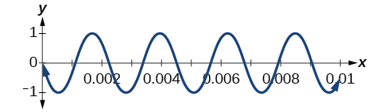

In this section, you will:
* Express products as sums.
* Express sums as products.

 . "){: #Figure_07_04_002}

A band marches down the field creating an amazing sound that bolsters the crowd. That sound travels as a wave that can be interpreted using trigonometric functions. For example, [\[link\]](#Figure_07_04_001) represents a sound wave for the musical note A. In this section, we will investigate trigonometric identities that are the foundation of everyday phenomena such as sound waves.

 {: #Figure_07_04_001}

### Expressing Products as Sums

We have already learned a number of formulas useful for expanding or simplifying trigonometric expressions, but sometimes we may need to express the product of cosine and sine as a sum. We can use the **product-to-sum formulas**{: data-type="term" .no-emphasis}, which express products of trigonometric functions as sums. Let’s investigate the cosine identity first and then the sine identity.

#### Expressing Products as Sums for Cosine

We can derive the product-to-sum formula from the sum and difference identities for **cosine**{: data-type="term" .no-emphasis}. If we add the two equations, we get:

<math xmlns="http://www.w3.org/1998/Math/MathML" display="block"> <mtable columnalign="left"> <mtr> <mtd> <munder accentunder="true"> <mrow> <mtable> <mtr> <mtd columnalign="right"> <mrow> <mi>cos</mi><mtext> </mtext><mi>α</mi><mtext> </mtext><mi>cos</mi><mtext> </mtext><mi>β</mi><mo>+</mo><mi>sin</mi><mtext> </mtext><mi>α</mi><mtext> </mtext><mi>sin</mi><mtext> </mtext><mi>β</mi> </mrow> </mtd> <mtd> <mo>=</mo> </mtd> <mtd columnalign="left"> <mrow> <mi>cos</mi><mo stretchy="false">(</mo><mi>α</mi><mo>−</mo><mi>β</mi><mo stretchy="false">)</mo> </mrow> </mtd> </mtr> <mtr> <mtd columnalign="right"> <mrow> <mo>+</mo><mtext> </mtext><mtext> </mtext><mi>cos</mi><mtext> </mtext><mi>α</mi><mtext> </mtext><mi>cos</mi><mtext> </mtext><mi>β</mi><mo>−</mo><mi>sin</mi><mtext> </mtext><mi>α</mi><mtext> </mtext><mi>sin</mi><mtext> </mtext><mi>β</mi> </mrow> </mtd> <mtd> <mo>=</mo> </mtd> <mtd columnalign="left"> <mrow> <mi>cos</mi><mo stretchy="false">(</mo><mi>α</mi><mo>+</mo><mi>β</mi><mo stretchy="false">)</mo> </mrow> </mtd> </mtr> </mtable> </mrow> <mo stretchy="true">\_\_\_\_\_\_\_\_\_\_\_\_\_\_\_\_\_\_\_\_\_\_\_\_\_\_\_\_\_\_\_\_\_\_\_</mo> </munder> </mtd> </mtr> <mtr> <mtd> <mtable> <mtr> <mtd columnalign="right"> <mrow><mspace width="5.7em" /> <mn>2</mn><mtext> </mtext><mi>cos</mi><mtext> </mtext><mi>α</mi><mtext> </mtext><mi>cos</mi><mtext> </mtext><mi>β</mi> </mrow> </mtd> <mtd> <mo>=</mo> </mtd> <mtd columnalign="left"> <mrow> <mi>cos</mi><mo stretchy="false">(</mo><mi>α</mi><mo>−</mo><mi>β</mi><mo stretchy="false">)</mo><mo>+</mo><mi>cos</mi><mo stretchy="false">(</mo><mi>α</mi><mo>+</mo><mi>β</mi><mo stretchy="false">)</mo> </mrow> </mtd> </mtr> </mtable> </mtd> </mtr> </mtable> </math>

Then, we divide by<math xmlns="http://www.w3.org/1998/Math/MathML"> <mrow> <mtext> </mtext><mn>2</mn><mtext> </mtext> </mrow> </math>

to isolate the product of cosines:

<math xmlns="http://www.w3.org/1998/Math/MathML" display="block"> <mrow> <mi>cos</mi><mtext> </mtext><mi>α</mi><mtext> </mtext><mi>cos</mi><mtext> </mtext><mi>β</mi><mo>=</mo><mfrac> <mn>1</mn> <mn>2</mn> </mfrac> <mo stretchy="false">[</mo><mi>cos</mi><mo stretchy="false">(</mo><mi>α</mi><mo>−</mo><mi>β</mi><mo stretchy="false">)</mo><mo>+</mo><mi>cos</mi><mo stretchy="false">(</mo><mi>α</mi><mo>+</mo><mi>β</mi><mo stretchy="false">)</mo><mo stretchy="false">]</mo> </mrow> </math>

<strong>Given a product of cosines, express as a sum. </strong>

1.  Write the formula for the product of cosines.
2.  Substitute the given angles into the formula.
3.  Simplify.
{: data-number-style="arabic"}

Writing the Product as a Sum Using the Product-to-Sum Formula for Cosine

Write the following product of cosines as a sum:<math xmlns="http://www.w3.org/1998/Math/MathML"> <mrow> <mtext> </mtext><mn>2</mn><mtext> </mtext><mi>cos</mi><mrow><mo>(</mo> <mrow> <mfrac> <mrow> <mn>7</mn><mi>x</mi> </mrow> <mn>2</mn> </mfrac> </mrow> <mo>)</mo></mrow><mtext> </mtext><mi>cos</mi><mtext> </mtext><mfrac> <mrow> <mn>3</mn><mi>x</mi> </mrow> <mn>2</mn> </mfrac> <mo>.</mo> </mrow> </math>

We begin by writing the formula for the product of cosines:

<math xmlns="http://www.w3.org/1998/Math/MathML"> <mrow> <mi>cos</mi><mtext> </mtext><mi>α</mi><mtext> </mtext><mi>cos</mi><mtext> </mtext><mi>β</mi><mo>=</mo><mfrac> <mn>1</mn> <mn>2</mn> </mfrac> <mrow><mo>[</mo> <mrow> <mi>cos</mi><mrow><mo>(</mo> <mrow> <mi>α</mi><mo>−</mo><mi>β</mi> </mrow> <mo>)</mo></mrow><mo>+</mo><mi>cos</mi><mrow><mo>(</mo> <mrow> <mi>α</mi><mo>+</mo><mi>β</mi> </mrow> <mo>)</mo></mrow> </mrow> <mo>]</mo></mrow> </mrow> </math>

We can then substitute the given angles into the formula and simplify.

<math xmlns="http://www.w3.org/1998/Math/MathML" display="block"> <mrow> <mtable> <mtr rowalign="center"> <mtd columnalign="right" rowalign="center"> <mrow> <mn>2</mn><mtext> </mtext><mi>cos</mi><mrow><mo>(</mo> <mrow> <mfrac> <mrow> <mn>7</mn><mi>x</mi> </mrow> <mn>2</mn> </mfrac> </mrow> <mo>)</mo></mrow><mi>cos</mi><mrow><mo>(</mo> <mrow> <mfrac> <mrow> <mn>3</mn><mi>x</mi> </mrow> <mn>2</mn> </mfrac> </mrow> <mo>)</mo></mrow> </mrow> </mtd> <mtd rowalign="center"> <mo>=</mo> </mtd> <mtd columnalign="left" rowalign="center"> <mrow> <mo stretchy="false">(</mo><mn>2</mn><mo stretchy="false">)</mo><mrow><mo>(</mo> <mrow> <mfrac> <mn>1</mn> <mn>2</mn> </mfrac> </mrow> <mo>)</mo></mrow><mrow><mo>[</mo> <mrow> <mi>cos</mi><mrow><mo>(</mo> <mrow> <mfrac> <mrow> <mn>7</mn><mi>x</mi> </mrow> <mn>2</mn> </mfrac> <mo>−</mo><mfrac> <mrow> <mn>3</mn><mi>x</mi> </mrow> <mn>2</mn> </mfrac> </mrow> <mo>)</mo></mrow><mo stretchy="false">)</mo><mo>+</mo><mi>cos</mi><mrow><mo>(</mo> <mrow> <mfrac> <mrow> <mn>7</mn><mi>x</mi> </mrow> <mn>2</mn> </mfrac> <mo>+</mo><mfrac> <mrow> <mn>3</mn><mi>x</mi> </mrow> <mn>2</mn> </mfrac> </mrow> <mo>)</mo></mrow> </mrow> <mo>]</mo></mrow> </mrow> </mtd> </mtr> <mtr rowalign="center"> <mtd rowalign="center" /> <mtd rowalign="center"> <mo>=</mo> </mtd> <mtd columnalign="left" rowalign="center"> <mrow> <mrow><mo>[</mo> <mrow> <mi>cos</mi><mrow><mo>(</mo> <mrow> <mfrac> <mrow> <mn>4</mn><mi>x</mi> </mrow> <mn>2</mn> </mfrac> </mrow> <mo>)</mo></mrow><mo>+</mo><mi>cos</mi><mrow><mo>(</mo> <mrow> <mfrac> <mrow> <mn>10</mn><mi>x</mi> </mrow> <mn>2</mn> </mfrac> </mrow> <mo>)</mo></mrow> </mrow> <mo>]</mo></mrow> </mrow> </mtd> </mtr> <mtr rowalign="center"> <mtd rowalign="center" /> <mtd rowalign="center"> <mo>=</mo> </mtd> <mtd columnalign="left" rowalign="center"> <mrow> <mi>cos</mi><mtext> </mtext><mn>2</mn><mi>x</mi><mo>+</mo><mi>cos</mi><mtext> </mtext><mn>5</mn><mi>x</mi> </mrow> </mtd> </mtr> </mtable> </mrow> </math>

Use the product-to-sum formula to write the product as a sum or difference:<math xmlns="http://www.w3.org/1998/Math/MathML"> <mrow> <mtext> </mtext><mi>cos</mi><mrow><mo>(</mo> <mrow> <mn>2</mn><mi>θ</mi> </mrow> <mo>)</mo></mrow><mi>cos</mi><mrow><mo>(</mo> <mrow> <mn>4</mn><mi>θ</mi> </mrow> <mo>)</mo><mo>.</mo></mrow> </mrow> </math>

<math xmlns="http://www.w3.org/1998/Math/MathML"> <mrow> <mfrac> <mn>1</mn> <mn>2</mn> </mfrac> <mrow><mo>(</mo> <mrow> <mi>cos</mi><mn>6</mn><mi>θ</mi><mo>+</mo><mi>cos</mi><mn>2</mn><mi>θ</mi> </mrow> <mo>)</mo></mrow> </mrow> </math>

#### Expressing the Product of Sine and Cosine as a Sum

Next, we will derive the product-to-sum formula for sine and cosine from the sum and difference formulas for **sine**{: data-type="term" .no-emphasis}. If we add the sum and difference identities, we get:

<math xmlns="http://www.w3.org/1998/Math/MathML" display="block"> <mtable columnalign="left"> <mtr rowalign="center"> <mtd rowalign="center"> <munder accentunder="true"> <mrow> <mtable> <mtr rowalign="center"> <mtd rowalign="center" /> <mtd columnalign="right" rowalign="center"> <mrow> <mtext> </mtext><mi>sin</mi><mo stretchy="false">(</mo><mi>α</mi><mo>+</mo><mi>β</mi><mo stretchy="false">)</mo> </mrow> </mtd> <mtd rowalign="center"> <mo>=</mo> </mtd> <mtd columnalign="left" rowalign="center"> <mrow> <mi>sin</mi><mtext> </mtext><mi>α</mi><mtext> </mtext><mi>cos</mi><mtext> </mtext><mi>β</mi><mo>+</mo><mi>cos</mi><mtext> </mtext><mi>α</mi><mtext> </mtext><mi>sin</mi><mtext> </mtext><mi>β</mi> </mrow> </mtd> </mtr> <mtr rowalign="center"> <mtd columnalign="right" rowalign="center"> <mo>+</mo> </mtd> <mtd columnalign="right"> <mspace width="3.90em" /> <mrow> <mi>sin</mi><mo stretchy="false">(</mo><mi>α</mi><mo>−</mo><mi>β</mi><mo stretchy="false">)</mo> </mrow> </mtd> <mtd> <mo>=</mo> </mtd> <mtd columnalign="left"> <mrow> <mi>sin</mi><mtext> </mtext><mi>α</mi><mtext> </mtext><mi>cos</mi><mtext> </mtext><mi>β</mi><mo>−</mo><mi>cos</mi><mtext> </mtext><mi>α</mi><mtext> </mtext><mi>sin</mi><mtext> </mtext><mi>β</mi> </mrow> </mtd> </mtr> </mtable> </mrow> <mo stretchy="true">\_\_\_\_\_\_\_\_\_\_\_\_\_\_\_\_\_\_\_\_\_\_\_\_\_\_\_\_\_\_\_\_\_\_\_\_\_\_\_\_\_</mo> </munder> </mtd> </mtr> <mtr rowalign="center"> <mtd rowalign="center"> <mtable> <mtr> <mtd columnalign="right" rowalign="center"> <mrow> <mspace width=".50em" /><mi>sin</mi><mo stretchy="false">(</mo><mi>α</mi><mo>+</mo><mi>β</mi><mo stretchy="false">)</mo><mo>+</mo><mi>sin</mi><mo stretchy="false">(</mo><mi>α</mi><mo>−</mo><mi>β</mi><mo stretchy="false">)</mo> </mrow> </mtd> <mtd rowalign="center"> <mo>=</mo> </mtd> <mtd columnalign="left" rowalign="center"> <mrow> <mn>2</mn><mtext> </mtext><mi>sin</mi><mtext> </mtext><mi>α</mi><mtext> </mtext><mi>cos</mi><mtext> </mtext><mi>β</mi> </mrow> </mtd> </mtr> </mtable> </mtd> </mtr> </mtable> </math>

Then, we divide by 2 to isolate the product of cosine and sine:

<math xmlns="http://www.w3.org/1998/Math/MathML" display="block"> <mrow> <mi>sin</mi><mtext> </mtext><mi>α</mi><mtext> </mtext><mi>cos</mi><mtext> </mtext><mi>β</mi><mo>=</mo><mfrac> <mn>1</mn> <mn>2</mn> </mfrac> <mrow><mo>[</mo> <mrow> <mi>sin</mi><mrow><mo>(</mo> <mrow> <mi>α</mi><mo>+</mo><mi>β</mi> </mrow> <mo>)</mo></mrow><mo>+</mo><mi>sin</mi><mrow><mo>(</mo> <mrow> <mi>α</mi><mo>−</mo><mi>β</mi> </mrow> <mo>)</mo></mrow> </mrow> <mo>]</mo></mrow> </mrow> </math>

Writing the Product as a Sum Containing only Sine or Cosine

Express the following product as a sum containing only sine or cosine and no products:<math xmlns="http://www.w3.org/1998/Math/MathML"> <mrow> <mtext> </mtext><mi>sin</mi><mrow><mo>(</mo> <mrow> <mn>4</mn><mi>θ</mi> </mrow> <mo>)</mo></mrow><mi>cos</mi><mrow><mo>(</mo> <mrow> <mn>2</mn><mi>θ</mi> </mrow> <mo>)</mo></mrow><mo>.</mo> </mrow> </math>

Write the formula for the product of sine and cosine. Then substitute the given values into the formula and simplify.

<math xmlns="http://www.w3.org/1998/Math/MathML" display="block"> <mrow> <mtable> <mtr rowalign="center"> <mtd columnalign="right" rowalign="center"> <mrow> <mi>sin</mi><mtext> </mtext><mi>α</mi><mtext> </mtext><mi>cos</mi><mtext> </mtext><mi>β</mi> </mrow> </mtd> <mtd rowalign="center"> <mo>=</mo> </mtd> <mtd columnalign="left" rowalign="center"> <mrow> <mfrac> <mn>1</mn> <mn>2</mn> </mfrac> <mo stretchy="false">[</mo><mi>sin</mi><mo stretchy="false">(</mo><mi>α</mi><mo>+</mo><mi>β</mi><mo stretchy="false">)</mo><mo>+</mo><mi>sin</mi><mo stretchy="false">(</mo><mi>α</mi><mo>−</mo><mi>β</mi><mo stretchy="false">)</mo><mo stretchy="false">]</mo> </mrow> </mtd> </mtr> <mtr rowalign="center"> <mtd columnalign="right" rowalign="center"> <mrow> <mi>sin</mi><mo stretchy="false">(</mo><mn>4</mn><mi>θ</mi><mo stretchy="false">)</mo><mi>cos</mi><mo stretchy="false">(</mo><mn>2</mn><mi>θ</mi><mo stretchy="false">)</mo> </mrow> </mtd> <mtd rowalign="center"> <mo>=</mo> </mtd> <mtd columnalign="left" rowalign="center"> <mrow> <mfrac> <mn>1</mn> <mn>2</mn> </mfrac> <mo stretchy="false">[</mo><mi>sin</mi><mo stretchy="false">(</mo><mn>4</mn><mi>θ</mi><mo>+</mo><mn>2</mn><mi>θ</mi><mo stretchy="false">)</mo><mo>+</mo><mi>sin</mi><mo stretchy="false">(</mo><mn>4</mn><mi>θ</mi><mo>−</mo><mn>2</mn><mi>θ</mi><mo stretchy="false">)</mo><mo stretchy="false">]</mo> </mrow> </mtd> </mtr> <mtr rowalign="center"> <mtd rowalign="center" /> <mtd rowalign="center"> <mo>=</mo> </mtd> <mtd columnalign="left" rowalign="center"> <mrow> <mfrac> <mn>1</mn> <mn>2</mn> </mfrac> <mo stretchy="false">[</mo><mi>sin</mi><mo stretchy="false">(</mo><mn>6</mn><mi>θ</mi><mo stretchy="false">)</mo><mo>+</mo><mi>sin</mi><mo stretchy="false">(</mo><mn>2</mn><mi>θ</mi><mo stretchy="false">)</mo><mo stretchy="false">]</mo> </mrow> </mtd> </mtr> </mtable> </mrow> </math>

Use the product-to-sum formula to write the product as a sum:<math xmlns="http://www.w3.org/1998/Math/MathML"> <mrow> <mtext> </mtext><mi>sin</mi><mrow><mo>(</mo> <mrow> <mi>x</mi><mo>+</mo><mi>y</mi> </mrow> <mo>)</mo></mrow><mi>cos</mi><mrow><mo>(</mo> <mrow> <mi>x</mi><mo>−</mo><mi>y</mi> </mrow> <mo>)</mo></mrow><mo>.</mo> </mrow> </math>

<math xmlns="http://www.w3.org/1998/Math/MathML"> <mrow> <mfrac> <mn>1</mn> <mn>2</mn> </mfrac> <mrow><mo>(</mo> <mrow> <mi>sin</mi><mn>2</mn><mi>x</mi><mo>+</mo><mi>sin</mi><mn>2</mn><mi>y</mi> </mrow> <mo>)</mo></mrow> </mrow> </math>

#### Expressing Products of Sines in Terms of Cosine

Expressing the product of sines in terms of **cosine**{: data-type="term" .no-emphasis} is also derived from the sum and difference identities for cosine. In this case, we will first subtract the two cosine formulas:

<math xmlns="http://www.w3.org/1998/Math/MathML" display="block"> <mrow> <mtable columnalign="left"> <mtr columnalign="left"> <mtd columnalign="left"> <mrow> <munder> <mrow> <mtable columnalign="left"> <mtr columnalign="left"> <mtd columnalign="left"> <mrow> <mtable columnalign="left"> <mtr columnalign="left"> <mtd columnalign="left"> <mrow /> </mtd> </mtr> <mtr columnalign="left"> <mtd columnalign="left"> <mrow> <mtext>                    </mtext><mtext> </mtext><mi>cos</mi><mrow><mo>(</mo> <mrow> <mi>α</mi><mo>−</mo><mi>β</mi> </mrow> <mo>)</mo></mrow><mo>=</mo><mi>cos</mi><mtext> </mtext><mi>α</mi><mtext> </mtext><mi>cos</mi><mtext> </mtext><mi>β</mi><mo>+</mo><mi>sin</mi><mtext> </mtext><mi>α</mi><mtext> </mtext><mi>sin</mi><mtext> </mtext><mi>β</mi> </mrow> </mtd> </mtr> </mtable> </mrow> </mtd> </mtr> <mtr columnalign="left"> <mtd columnalign="left"> <mrow> <mo>−</mo><mtext>                 </mtext><mtext> </mtext><mtext> </mtext><mi>cos</mi><mrow><mo>(</mo> <mrow> <mi>α</mi><mo>+</mo><mi>β</mi> </mrow> <mo>)</mo></mrow><mo>=</mo><mo>−</mo><mrow><mo>(</mo> <mrow> <mi>cos</mi><mtext> </mtext><mi>α</mi><mtext> </mtext><mi>cos</mi><mtext> </mtext><mi>β</mi><mo>−</mo><mi>sin</mi><mtext> </mtext><mi>α</mi><mtext> </mtext><mi>sin</mi><mtext> </mtext><mi>β</mi> </mrow> <mo>)</mo></mrow> </mrow> </mtd> </mtr> </mtable> </mrow> <mrow> <mo stretchy="true">\_\_\_\_\_\_\_\_\_\_\_\_\_\_\_\_\_\_\_\_\_\_\_\_\_\_\_\_\_\_\_\_\_\_\_\_\_\_\_\_\_\_\_\_\_\_\_\_\_\_\_\_</mo> </mrow> </munder> </mrow> </mtd> </mtr> <mtr columnalign="left"> <mtd columnalign="left"> <mrow> <mtext> </mtext><mtext> </mtext><mi>cos</mi><mrow><mo>(</mo> <mrow> <mi>α</mi><mo>−</mo><mi>β</mi> </mrow> <mo>)</mo></mrow><mo>−</mo><mi>cos</mi><mrow><mo>(</mo> <mrow> <mi>α</mi><mo>+</mo><mi>β</mi> </mrow> <mo>)</mo></mrow><mo>=</mo><mn>2</mn><mtext> </mtext><mi>sin</mi><mtext> </mtext><mi>α</mi><mtext> </mtext><mi>sin</mi><mtext> </mtext><mi>β</mi> </mrow> </mtd> </mtr> </mtable> </mrow> </math>

Then, we divide by 2 to isolate the product of sines:

<math xmlns="http://www.w3.org/1998/Math/MathML" display="block"> <mrow> <mi>sin</mi><mtext> </mtext><mi>α</mi><mtext> </mtext><mi>sin</mi><mtext> </mtext><mi>β</mi><mo>=</mo><mfrac> <mn>1</mn> <mn>2</mn> </mfrac> <mrow><mo>[</mo> <mrow> <mi>cos</mi><mrow><mo>(</mo> <mrow> <mi>α</mi><mo>−</mo><mi>β</mi> </mrow> <mo>)</mo></mrow><mo>−</mo><mi>cos</mi><mrow><mo>(</mo> <mrow> <mi>α</mi><mo>+</mo><mi>β</mi> </mrow> <mo>)</mo></mrow> </mrow> <mo>]</mo></mrow> </mrow> </math>

Similarly we could express the product of cosines in terms of sine or derive other product-to-sum formulas.

The Product-to-Sum Formulas

The **product-to-sum formulas**{: data-type="term"} are as follows:

<math xmlns="http://www.w3.org/1998/Math/MathML"> <mrow> <mtable> <mtr> <mtd columnalign="right"> <mrow><mspace width="0.45em" /> <mi>cos</mi><mtext> </mtext><mi>α</mi><mtext> </mtext><mi>cos</mi><mtext> </mtext><mi>β</mi> </mrow> </mtd> <mtd> <mo>=</mo> </mtd> <mtd columnalign="left"> <mrow> <mfrac> <mn>1</mn> <mn>2</mn> </mfrac> <mo stretchy="false">[</mo><mi>cos</mi><mo stretchy="false">(</mo><mi>α</mi><mo>−</mo><mi>β</mi><mo stretchy="false">)</mo><mo>+</mo><mi>cos</mi><mo stretchy="false">(</mo><mi>α</mi><mo>+</mo><mi>β</mi><mo stretchy="false">)</mo><mo stretchy="false">]</mo> </mrow> </mtd> </mtr> </mtable> </mrow> </math>

<math xmlns="http://www.w3.org/1998/Math/MathML"> <mrow> <mtable> <mtr> <mtd columnalign="right"> <mrow> <mi>sin</mi><mtext> </mtext><mi>α</mi><mtext> </mtext><mi>cos</mi><mtext> </mtext><mi>β</mi> </mrow> </mtd> <mtd> <mo>=</mo> </mtd> <mtd columnalign="left"> <mrow> <mfrac> <mn>1</mn> <mn>2</mn> </mfrac> <mo stretchy="false">[</mo><mi>sin</mi><mo stretchy="false">(</mo><mi>α</mi><mo>+</mo><mi>β</mi><mo stretchy="false">)</mo><mo>+</mo><mi>sin</mi><mo stretchy="false">(</mo><mi>α</mi><mo>−</mo><mi>β</mi><mo stretchy="false">)</mo><mo stretchy="false">]</mo> </mrow> </mtd> </mtr> </mtable> </mrow> </math>

<math xmlns="http://www.w3.org/1998/Math/MathML"> <mrow> <mtable> <mtr> <mtd columnalign="right"> <mrow><mspace width="0.5em" /> <mi>sin</mi><mtext> </mtext><mi>α</mi><mtext> </mtext><mi>sin</mi><mtext> </mtext><mi>β</mi> </mrow> </mtd> <mtd> <mo>=</mo> </mtd> <mtd columnalign="left"> <mrow> <mfrac> <mn>1</mn> <mn>2</mn> </mfrac> <mo stretchy="false">[</mo><mi>cos</mi><mo stretchy="false">(</mo><mi>α</mi><mo>−</mo><mi>β</mi><mo stretchy="false">)</mo><mo>−</mo><mi>cos</mi><mo stretchy="false">(</mo><mi>α</mi><mo>+</mo><mi>β</mi><mo stretchy="false">)</mo><mo stretchy="false">]</mo> </mrow> </mtd> </mtr> </mtable> </mrow> </math>

<math xmlns="http://www.w3.org/1998/Math/MathML"> <mrow> <mtable> <mtr> <mtd columnalign="right"> <mrow> <mi>cos</mi><mtext> </mtext><mi>α</mi><mtext> </mtext><mi>sin</mi><mtext> </mtext><mi>β</mi> </mrow> </mtd> <mtd> <mo>=</mo> </mtd> <mtd columnalign="left"> <mrow> <mfrac> <mn>1</mn> <mn>2</mn> </mfrac> <mo stretchy="false">[</mo><mi>sin</mi><mo stretchy="false">(</mo><mi>α</mi><mo>+</mo><mi>β</mi><mo stretchy="false">)</mo><mo>−</mo><mi>sin</mi><mo stretchy="false">(</mo><mi>α</mi><mo>−</mo><mi>β</mi><mo stretchy="false">)</mo><mo stretchy="false">]</mo> </mrow> </mtd> </mtr> </mtable> </mrow> </math>

Express the Product as a Sum or Difference

Write<math xmlns="http://www.w3.org/1998/Math/MathML"> <mrow> <mtext> </mtext><mi>cos</mi><mo stretchy="false">(</mo><mn>3</mn><mi>θ</mi><mo stretchy="false">)</mo><mtext> </mtext><mi>cos</mi><mo stretchy="false">(</mo><mn>5</mn><mi>θ</mi><mo stretchy="false">)</mo><mtext> </mtext> </mrow> </math>

as a sum or difference.

We have the product of cosines, so we begin by writing the related formula. Then we substitute the given angles and simplify.

<math xmlns="http://www.w3.org/1998/Math/MathML" display="block"> <mrow> <mtable> <mtr rowalign="center"> <mtd columnalign="right" rowalign="center"> <mrow> <mi>cos</mi><mtext> </mtext><mi>α</mi><mtext> </mtext><mi>cos</mi><mtext> </mtext><mi>β</mi> </mrow> </mtd> <mtd rowalign="center"> <mo>=</mo> </mtd> <mtd columnalign="left" rowalign="center"> <mrow> <mfrac> <mn>1</mn> <mn>2</mn> </mfrac> <mo stretchy="false">[</mo><mi>cos</mi><mo stretchy="false">(</mo><mi>α</mi><mo>−</mo><mi>β</mi><mo stretchy="false">)</mo><mo>+</mo><mi>cos</mi><mo stretchy="false">(</mo><mi>α</mi><mo>+</mo><mi>β</mi><mo stretchy="false">)</mo><mo stretchy="false">]</mo> </mrow> </mtd> <mtd rowalign="center" /> </mtr> <mtr rowalign="center"> <mtd columnalign="right" rowalign="center"> <mrow> <mi>cos</mi><mo stretchy="false">(</mo><mn>3</mn><mi>θ</mi><mo stretchy="false">)</mo><mi>cos</mi><mo stretchy="false">(</mo><mn>5</mn><mi>θ</mi><mo stretchy="false">)</mo> </mrow> </mtd> <mtd rowalign="center"> <mo>=</mo> </mtd> <mtd columnalign="left" rowalign="center"> <mrow> <mfrac> <mn>1</mn> <mn>2</mn> </mfrac> <mo stretchy="false">[</mo><mi>cos</mi><mo stretchy="false">(</mo><mn>3</mn><mi>θ</mi><mo>−</mo><mn>5</mn><mi>θ</mi><mo stretchy="false">)</mo><mo>+</mo><mi>cos</mi><mo stretchy="false">(</mo><mn>3</mn><mi>θ</mi><mo>+</mo><mn>5</mn><mi>θ</mi><mo stretchy="false">)</mo><mo stretchy="false">]</mo> </mrow> </mtd> <mtd rowalign="center" /> </mtr> <mtr rowalign="center"> <mtd rowalign="center" /> <mtd rowalign="center"> <mo>=</mo> </mtd> <mtd columnalign="left" rowalign="center"> <mrow> <mfrac> <mn>1</mn> <mn>2</mn> </mfrac> <mo stretchy="false">[</mo><mi>cos</mi><mo stretchy="false">(</mo><mn>2</mn><mi>θ</mi><mo stretchy="false">)</mo><mo>+</mo><mi>cos</mi><mo stretchy="false">(</mo><mn>8</mn><mi>θ</mi><mo stretchy="false">)</mo><mo stretchy="false">]</mo> </mrow> </mtd> <mtd columnalign="left" rowalign="center"> <mrow> <mtext>Use even-odd identity</mtext><mo>.</mo> </mrow> </mtd> </mtr> </mtable> </mrow> </math>

Use the product-to-sum formula to evaluate<math xmlns="http://www.w3.org/1998/Math/MathML"> <mrow> <mtext> </mtext><mi>cos</mi><mtext> </mtext><mfrac> <mrow> <mn>11</mn><mi>π</mi> </mrow> <mrow> <mn>12</mn> </mrow> </mfrac><mtext> </mtext> <mi>cos</mi><mtext> </mtext><mfrac> <mi>π</mi> <mrow> <mn>12</mn> </mrow> </mfrac> <mo>.</mo> </mrow> </math>

<math xmlns="http://www.w3.org/1998/Math/MathML"> <mrow> <mfrac> <mrow> <mo>−</mo><mn>2</mn><mo>−</mo><msqrt> <mn>3</mn> </msqrt> </mrow> <mn>4</mn> </mfrac> </mrow> </math>

### Expressing Sums as Products

Some problems require the reverse of the process we just used. The **sum-to-product formulas**{: data-type="term" .no-emphasis} allow us to express sums of sine or cosine as products. These formulas can be derived from the product-to-sum identities. For example, with a few substitutions, we can derive the sum-to-product identity for **sine**{: data-type="term" .no-emphasis}. Let<math xmlns="http://www.w3.org/1998/Math/MathML"> <mrow> <mtext> </mtext><mfrac> <mrow> <mi>u</mi><mo>+</mo><mi>v</mi> </mrow> <mn>2</mn> </mfrac> <mo>=</mo><mi>α</mi><mtext> </mtext> </mrow> </math>

and<math xmlns="http://www.w3.org/1998/Math/MathML"> <mrow> <mtext> </mtext><mfrac> <mrow> <mi>u</mi><mo>−</mo><mi>v</mi> </mrow> <mn>2</mn> </mfrac> <mo>=</mo><mi>β</mi><mo>.</mo> </mrow> </math>

Then,

<math xmlns="http://www.w3.org/1998/Math/MathML" display="block"> <mrow> <mtable> <mtr rowalign="center"> <mtd columnalign="right" rowalign="center"> <mrow> <mi>α</mi><mo>+</mo><mi>β</mi> </mrow> </mtd> <mtd rowalign="center"> <mo>=</mo> </mtd> <mtd columnalign="left" rowalign="center"> <mrow> <mfrac> <mrow> <mi>u</mi><mo>+</mo><mi>v</mi> </mrow> <mn>2</mn> </mfrac> <mo>+</mo><mfrac> <mrow> <mi>u</mi><mo>−</mo><mi>v</mi> </mrow> <mn>2</mn> </mfrac> </mrow> </mtd> </mtr> <mtr rowalign="center"> <mtd rowalign="center" /> <mtd rowalign="center"> <mo>=</mo> </mtd> <mtd columnalign="left" rowalign="center"> <mrow> <mfrac> <mrow> <mn>2</mn><mi>u</mi> </mrow> <mn>2</mn> </mfrac> </mrow> </mtd> </mtr> <mtr rowalign="center"> <mtd rowalign="center" /> <mtd rowalign="center"> <mo>=</mo> </mtd> <mtd columnalign="left" rowalign="center"> <mi>u</mi> </mtd> </mtr> <mspace width="3em" /> <mtr rowalign="center"> <mtd columnalign="right" rowalign="center"> <mrow> <mi>α</mi><mo>−</mo><mi>β</mi> </mrow> </mtd> <mtd rowalign="center"> <mo>=</mo> </mtd> <mtd columnalign="left" rowalign="center"> <mrow> <mfrac> <mrow> <mi>u</mi><mo>+</mo><mi>v</mi> </mrow> <mn>2</mn> </mfrac> <mo>−</mo><mfrac> <mrow> <mi>u</mi><mo>−</mo><mi>v</mi> </mrow> <mn>2</mn> </mfrac> </mrow> </mtd> </mtr> <mtr rowalign="center"> <mtd rowalign="center" /> <mtd rowalign="center"> <mo>=</mo> </mtd> <mtd columnalign="left" rowalign="center"> <mrow> <mfrac> <mrow> <mn>2</mn><mi>v</mi> </mrow> <mn>2</mn> </mfrac> </mrow> </mtd> </mtr> <mtr rowalign="center"> <mtd rowalign="center" /> <mtd rowalign="center"> <mo>=</mo> </mtd> <mtd columnalign="left" rowalign="center"> <mi>v</mi> </mtd> </mtr> </mtable> </mrow> </math>

Thus, replacing<math xmlns="http://www.w3.org/1998/Math/MathML"> <mrow> <mtext> </mtext><mi>α</mi><mtext> </mtext> </mrow> </math>

and<math xmlns="http://www.w3.org/1998/Math/MathML"> <mrow> <mtext> </mtext><mi>β</mi><mtext> </mtext> </mrow> </math>

in the product-to-sum formula with the substitute expressions, we have

<math xmlns="http://www.w3.org/1998/Math/MathML" display="block"> <mrow> <mtable> <mtr rowalign="center"> <mtd columnalign="right" rowalign="center"> <mrow> <mi>sin</mi><mtext> </mtext><mi>α</mi><mtext> </mtext><mi>cos</mi><mtext> </mtext><mi>β</mi> </mrow> </mtd> <mtd rowalign="center"> <mo>=</mo> </mtd> <mtd columnalign="left" rowalign="center"> <mrow> <mfrac> <mn>1</mn> <mn>2</mn> </mfrac> <mo stretchy="false">[</mo><mi>sin</mi><mo stretchy="false">(</mo><mi>α</mi><mo>+</mo><mi>β</mi><mo stretchy="false">)</mo><mo>+</mo><mi>sin</mi><mo stretchy="false">(</mo><mi>α</mi><mo>−</mo><mi>β</mi><mo stretchy="false">)</mo><mo stretchy="false">]</mo> </mrow> </mtd> <mtd rowalign="center" /> </mtr> <mtr rowalign="center"> <mtd columnalign="right" rowalign="center"> <mrow> <mi>sin</mi><mrow><mo>(</mo> <mrow> <mfrac> <mrow> <mi>u</mi><mo>+</mo><mi>v</mi> </mrow> <mn>2</mn> </mfrac> </mrow> <mo>)</mo></mrow><mi>cos</mi><mrow><mo>(</mo> <mrow> <mfrac> <mrow> <mi>u</mi><mo>−</mo><mi>v</mi> </mrow> <mn>2</mn> </mfrac> </mrow> <mo>)</mo></mrow> </mrow> </mtd> <mtd rowalign="center"> <mo>=</mo> </mtd> <mtd columnalign="left" rowalign="center"> <mrow> <mfrac> <mn>1</mn> <mn>2</mn> </mfrac> <mo stretchy="false">[</mo><mi>sin</mi><mtext> </mtext><mi>u</mi><mo>+</mo><mi>sin</mi><mtext> </mtext><mi>v</mi><mo stretchy="false">]</mo> </mrow> </mtd> <mtd columnalign="left" rowalign="center"> <mrow> <mtext>Substitute for</mtext><mo stretchy="false">(</mo><mi>α</mi><mo>+</mo><mi>β</mi><mo stretchy="false">)</mo><mtext> and </mtext><mo stretchy="false">(</mo><mi>α</mi><mo>−</mo><mi>β</mi><mo stretchy="false">)</mo> </mrow> </mtd> </mtr> <mtr rowalign="center"> <mtd columnalign="right" rowalign="center"> <mrow> <mn>2</mn><mtext> </mtext><mi>sin</mi><mrow><mo>(</mo> <mrow> <mfrac> <mrow> <mi>u</mi><mo>+</mo><mi>v</mi> </mrow> <mn>2</mn> </mfrac> </mrow> <mo>)</mo></mrow><mi>cos</mi><mrow><mo>(</mo> <mrow> <mfrac> <mrow> <mi>u</mi><mo>−</mo><mi>v</mi> </mrow> <mn>2</mn> </mfrac> </mrow> <mo>)</mo></mrow> </mrow> </mtd> <mtd rowalign="center"> <mo>=</mo> </mtd> <mtd columnalign="left" rowalign="center"> <mrow> <mi>sin</mi><mtext> </mtext><mi>u</mi><mo>+</mo><mi>sin</mi><mtext> </mtext><mi>v</mi> </mrow> </mtd> <mtd rowalign="center" /> </mtr> </mtable> </mrow> </math>

The other sum-to-product identities are derived similarly.

Sum-to-Product Formulas

The **sum-to-product formulas**{: data-type="term"} are as follows:

<math xmlns="http://www.w3.org/1998/Math/MathML"> <mrow> <mtable> <mtr> <mtd columnalign="right"> <mrow><mspace width="0.4em" /> <mi>sin</mi><mtext> </mtext><mi>α</mi><mo>+</mo><mi>sin</mi><mtext> </mtext><mi>β</mi> </mrow> </mtd> <mtd> <mo>=</mo> </mtd> <mtd columnalign="left"> <mrow> <mn>2</mn><mi>sin</mi><mrow><mo>(</mo> <mrow> <mfrac> <mrow> <mi>α</mi><mo>+</mo><mi>β</mi> </mrow> <mn>2</mn> </mfrac> </mrow> <mo>)</mo></mrow><mi>cos</mi><mrow><mo>(</mo> <mrow> <mfrac> <mrow> <mi>α</mi><mo>−</mo><mi>β</mi> </mrow> <mn>2</mn> </mfrac> </mrow> <mo>)</mo></mrow> </mrow> </mtd> </mtr> </mtable> </mrow> </math>

<math xmlns="http://www.w3.org/1998/Math/MathML"> <mrow> <mtable> <mtr> <mtd columnalign="right"> <mrow><mspace width="0.3em" /> <mi>sin</mi><mtext> </mtext><mi>α</mi><mo>−</mo><mi>sin</mi><mtext> </mtext><mi>β</mi> </mrow> </mtd> <mtd> <mo>=</mo> </mtd> <mtd columnalign="left"> <mrow> <mn>2</mn><mi>sin</mi><mrow><mo>(</mo> <mrow> <mfrac> <mrow> <mi>α</mi><mo>−</mo><mi>β</mi> </mrow> <mn>2</mn> </mfrac> </mrow> <mo>)</mo></mrow><mi>cos</mi><mrow><mo>(</mo> <mrow> <mfrac> <mrow> <mi>α</mi><mo>+</mo><mi>β</mi> </mrow> <mn>2</mn> </mfrac> </mrow> <mo>)</mo></mrow> </mrow> </mtd> </mtr> </mtable> </mrow> </math>

<math xmlns="http://www.w3.org/1998/Math/MathML"> <mrow> <mtable> <mtr> <mtd columnalign="right"> <mrow><mspace width="0.4em" /> <mi>cos</mi><mtext> </mtext><mi>α</mi><mo>−</mo><mi>cos</mi><mtext> </mtext><mi>β</mi> </mrow> </mtd> <mtd> <mo>=</mo> </mtd> <mtd columnalign="left"> <mrow> <mn>−2</mn><mi>sin</mi><mrow><mo>(</mo> <mrow> <mfrac> <mrow> <mi>α</mi><mo>+</mo><mi>β</mi> </mrow> <mn>2</mn> </mfrac> </mrow> <mo>)</mo></mrow><mi>sin</mi><mrow><mo>(</mo> <mrow> <mfrac> <mrow> <mi>α</mi><mo>−</mo><mi>β</mi> </mrow> <mn>2</mn> </mfrac> </mrow> <mo>)</mo></mrow> </mrow> </mtd> </mtr> </mtable> </mrow> </math>

<math xmlns="http://www.w3.org/1998/Math/MathML"> <mrow> <mtable> <mtr> <mtd columnalign="right"> <mrow> <mi>cos</mi><mtext> </mtext><mi>α</mi><mo>+</mo><mi>cos</mi><mtext> </mtext><mi>β</mi> </mrow> </mtd> <mtd> <mo>=</mo> </mtd> <mtd columnalign="left"> <mrow> <mn>2</mn><mi>cos</mi><mrow><mo>(</mo> <mrow> <mfrac> <mrow> <mi>α</mi><mo>+</mo><mi>β</mi> </mrow> <mn>2</mn> </mfrac> </mrow> <mo>)</mo></mrow><mi>cos</mi><mrow><mo>(</mo> <mrow> <mfrac> <mrow> <mi>α</mi><mo>−</mo><mi>β</mi> </mrow> <mn>2</mn> </mfrac> </mrow> <mo>)</mo></mrow> </mrow> </mtd> </mtr> </mtable> </mrow> </math>

Writing the Difference of Sines as a Product

Write the following difference of sines expression as a product:<math xmlns="http://www.w3.org/1998/Math/MathML"> <mrow> <mtext> </mtext><mi>sin</mi><mrow><mo>(</mo> <mrow> <mn>4</mn><mi>θ</mi> </mrow> <mo>)</mo></mrow><mo>−</mo><mi>sin</mi><mrow><mo>(</mo> <mrow> <mn>2</mn><mi>θ</mi> </mrow> <mo>)</mo></mrow><mo>.</mo> </mrow> </math>

We begin by writing the formula for the difference of sines.

<math xmlns="http://www.w3.org/1998/Math/MathML"> <mrow> <mi>sin</mi><mtext> </mtext><mi>α</mi><mo>−</mo><mi>sin</mi><mtext> </mtext><mi>β</mi><mo>=</mo><mn>2</mn><mi>sin</mi><mrow><mo>(</mo> <mrow> <mfrac> <mrow> <mi>α</mi><mo>−</mo><mi>β</mi> </mrow> <mn>2</mn> </mfrac> </mrow> <mo>)</mo></mrow><mi>cos</mi><mrow><mo>(</mo> <mrow> <mfrac> <mrow> <mi>α</mi><mo>+</mo><mi>β</mi> </mrow> <mn>2</mn> </mfrac> </mrow> <mo>)</mo></mrow> </mrow> </math>

Substitute the values into the formula, and simplify.

<math xmlns="http://www.w3.org/1998/Math/MathML" display="block"> <mrow> <mtable> <mtr rowalign="center"> <mtd columnalign="right" rowalign="center"> <mrow> <mi>sin</mi><mo stretchy="false">(</mo><mn>4</mn><mi>θ</mi><mo stretchy="false">)</mo><mo>−</mo><mi>sin</mi><mo stretchy="false">(</mo><mn>2</mn><mi>θ</mi><mo stretchy="false">)</mo> </mrow> </mtd> <mtd rowalign="center"> <mo>=</mo> </mtd> <mtd columnalign="left" rowalign="center"> <mrow> <mn>2</mn><mi>sin</mi><mrow><mo>(</mo> <mrow> <mfrac> <mrow> <mn>4</mn><mi>θ</mi><mo>−</mo><mn>2</mn><mi>θ</mi> </mrow> <mn>2</mn> </mfrac> </mrow> <mo>)</mo></mrow><mtext> </mtext><mi>cos</mi><mrow><mo>(</mo> <mrow> <mfrac> <mrow> <mn>4</mn><mi>θ</mi><mo>+</mo><mn>2</mn><mi>θ</mi> </mrow> <mn>2</mn> </mfrac> </mrow> <mo>)</mo></mrow> </mrow> </mtd> </mtr> <mtr rowalign="center"> <mtd rowalign="center" /> <mtd rowalign="center"> <mo>=</mo> </mtd> <mtd columnalign="left" rowalign="center"> <mrow> <mn>2</mn><mi>sin</mi><mrow><mo>(</mo> <mrow> <mfrac> <mrow> <mn>2</mn><mi>θ</mi> </mrow> <mn>2</mn> </mfrac> </mrow> <mo>)</mo></mrow><mtext> </mtext><mi>cos</mi><mrow><mo>(</mo> <mrow> <mfrac> <mrow> <mn>6</mn><mi>θ</mi> </mrow> <mn>2</mn> </mfrac> </mrow> <mo>)</mo></mrow> </mrow> </mtd> </mtr> <mtr rowalign="center"> <mtd rowalign="center" /> <mtd rowalign="center"> <mo>=</mo> </mtd> <mtd columnalign="left" rowalign="center"> <mrow> <mn>2</mn><mtext> </mtext><mi>sin</mi><mtext> </mtext><mi>θ</mi><mtext> </mtext><mi>cos</mi><mo stretchy="false">(</mo><mn>3</mn><mi>θ</mi><mo stretchy="false">)</mo> </mrow> </mtd> </mtr> </mtable> </mrow> </math>

Use the sum-to-product formula to write the sum as a product:<math xmlns="http://www.w3.org/1998/Math/MathML"> <mrow> <mtext> </mtext><mi>sin</mi><mrow><mo>(</mo> <mrow> <mn>3</mn><mi>θ</mi> </mrow> <mo>)</mo></mrow><mo>+</mo><mi>sin</mi><mrow><mo>(</mo> <mi>θ</mi> <mo>)</mo></mrow><mo>.</mo> </mrow> </math>

<math xmlns="http://www.w3.org/1998/Math/MathML"> <mrow> <mn>2</mn><mi>sin</mi><mrow><mo>(</mo> <mrow> <mn>2</mn><mi>θ</mi> </mrow> <mo>)</mo></mrow><mi>cos</mi><mrow><mo>(</mo> <mi>θ</mi> <mo>)</mo></mrow> </mrow> </math>

Evaluating Using the Sum-to-Product Formula

Evaluate<math xmlns="http://www.w3.org/1998/Math/MathML"> <mrow> <mtext> </mtext><mi>cos</mi><mo stretchy="false">(</mo><mn>15°</mn><mo stretchy="false">)</mo><mo>−</mo><mi>cos</mi><mo stretchy="false">(</mo><mn>75°</mn><mo stretchy="false">)</mo><mo>.</mo><mtext> </mtext> </mrow> </math>

Check the answer with a graphing calculator.

We begin by writing the formula for the difference of cosines.

<math xmlns="http://www.w3.org/1998/Math/MathML"> <mrow> <mi>cos</mi><mtext> </mtext><mi>α</mi><mo>−</mo><mi>cos</mi><mtext> </mtext><mi>β</mi><mo>=</mo><mo>−</mo><mn>2</mn><mtext> </mtext><mi>sin</mi><mrow><mo>(</mo> <mrow> <mfrac> <mrow> <mi>α</mi><mo>+</mo><mi>β</mi> </mrow> <mn>2</mn> </mfrac> </mrow> <mo>)</mo></mrow><mtext> </mtext><mi>sin</mi><mrow><mo>(</mo> <mrow> <mfrac> <mrow> <mi>α</mi><mo>−</mo><mi>β</mi> </mrow> <mn>2</mn> </mfrac> </mrow> <mo>)</mo></mrow> </mrow> </math>

Then we substitute the given angles and simplify.

<math xmlns="http://www.w3.org/1998/Math/MathML" display="block"> <mrow> <mtable> <mtr rowalign="center"> <mtd columnalign="right" rowalign="center"> <mrow> <mi>cos</mi><mo stretchy="false">(</mo><mn>15°</mn><mo stretchy="false">)</mo><mo>−</mo><mi>cos</mi><mo stretchy="false">(</mo><mn>75°</mn><mo stretchy="false">)</mo> </mrow> </mtd> <mtd rowalign="center"> <mo>=</mo> </mtd> <mtd columnalign="left" rowalign="center"> <mrow> <mn>−2</mn><mi>sin</mi><mrow><mo>(</mo> <mrow> <mfrac> <mrow> <mn>15°</mn><mo>+</mo><mn>75°</mn> </mrow> <mn>2</mn> </mfrac> </mrow> <mo>)</mo></mrow><mtext> </mtext><mi>sin</mi><mrow><mo>(</mo> <mrow> <mfrac> <mrow> <mn>15°</mn><mo>−</mo><mn>75°</mn> </mrow> <mn>2</mn> </mfrac> </mrow> <mo>)</mo></mrow> </mrow> </mtd> </mtr> <mtr rowalign="center"> <mtd rowalign="center" /> <mtd rowalign="center"> <mo>=</mo> </mtd> <mtd columnalign="left" rowalign="center"> <mrow> <mn>−2</mn><mi>sin</mi><mo stretchy="false">(</mo><mn>45°</mn><mo stretchy="false">)</mo><mtext> </mtext><mi>sin</mi><mo stretchy="false">(</mo><mn>−30°</mn><mo stretchy="false">)</mo> </mrow> </mtd> </mtr> <mtr rowalign="center"> <mtd rowalign="center" /> <mtd rowalign="center"> <mo>=</mo> </mtd> <mtd columnalign="left" rowalign="center"> <mrow> <mn>−2</mn><mrow><mo>(</mo> <mrow> <mfrac> <mrow> <msqrt> <mn>2</mn> </msqrt> </mrow> <mn>2</mn> </mfrac> </mrow> <mo>)</mo></mrow><mrow><mo>(</mo> <mrow> <mo>−</mo><mfrac> <mn>1</mn> <mn>2</mn> </mfrac> </mrow> <mo>)</mo></mrow> </mrow> </mtd> </mtr> <mtr rowalign="center"> <mtd rowalign="center" /> <mtd rowalign="center"> <mo>=</mo> </mtd> <mtd columnalign="left" rowalign="center"> <mrow> <mfrac> <mrow> <msqrt> <mn>2</mn> </msqrt> </mrow> <mn>2</mn> </mfrac> </mrow> </mtd> </mtr> </mtable> </mrow> </math>

Proving an Identity

Prove the identity:

<math xmlns="http://www.w3.org/1998/Math/MathML" display="block"> <mrow> <mfrac> <mrow> <mi>cos</mi><mrow><mo>(</mo> <mrow> <mn>4</mn><mi>t</mi> </mrow> <mo>)</mo></mrow><mo>−</mo><mi>cos</mi><mrow><mo>(</mo> <mrow> <mn>2</mn><mi>t</mi> </mrow> <mo>)</mo></mrow> </mrow> <mrow> <mi>sin</mi><mrow><mo>(</mo> <mrow> <mn>4</mn><mi>t</mi> </mrow> <mo>)</mo></mrow><mo>+</mo><mi>sin</mi><mrow><mo>(</mo> <mrow> <mn>2</mn><mi>t</mi> </mrow> <mo>)</mo></mrow> </mrow> </mfrac> <mo>=</mo><mo>−</mo><mi>tan</mi><mtext> </mtext><mi>t</mi> </mrow> </math>

We will start with the left side, the more complicated side of the equation, and rewrite the expression until it matches the right side.

<math xmlns="http://www.w3.org/1998/Math/MathML" display="block"> <mrow> <mtable> <mtr rowalign="center"> <mtd columnalign="right" rowalign="center"> <mrow> <mfrac> <mrow> <mi>cos</mi><mo stretchy="false">(</mo><mn>4</mn><mi>t</mi><mo stretchy="false">)</mo><mo>−</mo><mi>cos</mi><mo stretchy="false">(</mo><mn>2</mn><mi>t</mi><mo stretchy="false">)</mo> </mrow> <mrow> <mi>sin</mi><mo stretchy="false">(</mo><mn>4</mn><mi>t</mi><mo stretchy="false">)</mo><mo>+</mo><mi>sin</mi><mo stretchy="false">(</mo><mn>2</mn><mi>t</mi><mo stretchy="false">)</mo> </mrow> </mfrac> </mrow> </mtd> <mtd rowalign="center"> <mo>=</mo> </mtd> <mtd columnalign="left" rowalign="center"> <mrow> <mfrac> <mrow> <mo>−</mo><mn>2</mn><mtext> </mtext><mi>sin</mi><mrow><mo>(</mo> <mrow> <mfrac> <mrow> <mn>4</mn><mi>t</mi><mo>+</mo><mn>2</mn><mi>t</mi> </mrow> <mn>2</mn> </mfrac> </mrow> <mo>)</mo></mrow><mtext> </mtext><mi>sin</mi><mrow><mo>(</mo> <mrow> <mfrac> <mrow> <mn>4</mn><mi>t</mi><mo>−</mo><mn>2</mn><mi>t</mi> </mrow> <mn>2</mn> </mfrac> </mrow> <mo>)</mo></mrow> </mrow> <mrow> <mn>2</mn><mtext> </mtext><mi>sin</mi><mrow><mo>(</mo> <mrow> <mfrac> <mrow> <mn>4</mn><mi>t</mi><mo>+</mo><mn>2</mn><mi>t</mi> </mrow> <mn>2</mn> </mfrac> </mrow> <mo>)</mo></mrow><mtext> </mtext><mi>cos</mi><mrow><mo>(</mo> <mrow> <mfrac> <mrow> <mn>4</mn><mi>t</mi><mo>−</mo><mn>2</mn><mi>t</mi> </mrow> <mn>2</mn> </mfrac> </mrow> <mo>)</mo></mrow> </mrow> </mfrac> </mrow> </mtd> </mtr> <mtr rowalign="center"> <mtd rowalign="center" /> <mtd rowalign="center"> <mo>=</mo> </mtd> <mtd columnalign="left" rowalign="center"> <mrow> <mfrac> <mrow> <mo>−</mo><mn>2</mn><mtext> </mtext><mi>sin</mi><mo stretchy="false">(</mo><mn>3</mn><mi>t</mi><mo stretchy="false">)</mo><mi>sin</mi><mtext> </mtext><mi>t</mi> </mrow> <mrow> <mn>2</mn><mtext> </mtext><mi>sin</mi><mo stretchy="false">(</mo><mn>3</mn><mi>t</mi><mo stretchy="false">)</mo><mi>cos</mi><mtext> </mtext><mi>t</mi> </mrow> </mfrac> </mrow> </mtd> </mtr> <mtr rowalign="center"> <mtd rowalign="center" /> <mtd rowalign="center"> <mo>=</mo> </mtd> <mtd columnalign="left" rowalign="center"> <mrow> <mfrac> <mrow> <mo>−</mo><menclose notation="updiagonalstrike"> <mn>2</mn> </menclose> <menclose notation="updiagonalstrike"> <mrow> <mi>sin</mi><mo stretchy="false">(</mo><mn>3</mn><mi>t</mi><mo stretchy="false">)</mo> </mrow> </menclose> <mi>sin</mi><mtext> </mtext><mi>t</mi> </mrow> <mrow> <menclose notation="updiagonalstrike"> <mn>2</mn> </menclose> <menclose notation="updiagonalstrike"> <mrow> <mi>sin</mi><mo stretchy="false">(</mo><mn>3</mn><mi>t</mi><mo stretchy="false">)</mo> </mrow> </menclose> <mi>cos</mi><mtext> </mtext><mi>t</mi> </mrow> </mfrac> </mrow> </mtd> </mtr> <mtr rowalign="center"> <mtd rowalign="center" /> <mtd rowalign="center"> <mo>=</mo> </mtd> <mtd columnalign="left" rowalign="center"> <mrow> <mo>−</mo><mfrac> <mrow> <mi>sin</mi><mtext> </mtext><mi>t</mi> </mrow> <mrow> <mi>cos</mi><mtext> </mtext><mi>t</mi> </mrow> </mfrac> </mrow> </mtd> </mtr> <mtr rowalign="center"> <mtd rowalign="center" /> <mtd rowalign="center"> <mo>=</mo> </mtd> <mtd columnalign="left" rowalign="center"> <mrow> <mo>−</mo><mi>tan</mi><mtext> </mtext><mi>t</mi> </mrow> </mtd> </mtr> </mtable> </mrow> </math>

Analysis

Recall that verifying trigonometric identities has its own set of rules. The procedures for solving an equation are not the same as the procedures for verifying an identity. When we prove an identity, we pick one side to work on and make substitutions until that side is transformed into the other side.

Verifying the Identity Using Double-Angle Formulas and Reciprocal Identities

Verify the identity<math xmlns="http://www.w3.org/1998/Math/MathML"> <mrow> <mtext> </mtext><msup> <mrow> <mi>csc</mi> </mrow> <mn>2</mn> </msup> <mi>θ</mi><mo>−</mo><mn>2</mn><mo>=</mo><mfrac> <mrow> <mi>cos</mi><mo stretchy="false">(</mo><mn>2</mn><mi>θ</mi><mo stretchy="false">)</mo> </mrow> <mrow> <msup> <mrow> <mi>sin</mi> </mrow> <mn>2</mn> </msup> <mi>θ</mi> </mrow> </mfrac> <mo>.</mo> </mrow> </math>

For verifying this equation, we are bringing together several of the identities. We will use the double-angle formula and the reciprocal identities. We will work with the right side of the equation and rewrite it until it matches the left side.

<math xmlns="http://www.w3.org/1998/Math/MathML" display="block"> <mrow> <mtable> <mtr rowalign="center"> <mtd columnalign="right" rowalign="center"> <mrow> <mfrac> <mrow> <mi>cos</mi><mo stretchy="false">(</mo><mn>2</mn><mi>θ</mi><mo stretchy="false">)</mo> </mrow> <mrow> <msup> <mrow> <mi>sin</mi> </mrow> <mn>2</mn> </msup> <mi>θ</mi> </mrow> </mfrac> </mrow> </mtd> <mtd rowalign="center"> <mo>=</mo> </mtd> <mtd columnalign="left" rowalign="center"> <mrow> <mfrac> <mrow> <mn>1</mn><mo>−</mo><mn>2</mn><mtext> </mtext><msup> <mrow> <mi>sin</mi> </mrow> <mn>2</mn> </msup> <mi>θ</mi> </mrow> <mrow> <msup> <mrow> <mi>sin</mi> </mrow> <mn>2</mn> </msup> <mi>θ</mi> </mrow> </mfrac> </mrow> </mtd> </mtr> <mtr rowalign="center"> <mtd rowalign="center" /> <mtd rowalign="center"> <mo>=</mo> </mtd> <mtd columnalign="left" rowalign="center"> <mrow> <mfrac> <mn>1</mn> <mrow> <msup> <mrow> <mi>sin</mi> </mrow> <mn>2</mn> </msup> <mi>θ</mi> </mrow> </mfrac> <mo>−</mo><mfrac> <mrow> <mn>2</mn><mtext> </mtext><msup> <mrow> <mi>sin</mi> </mrow> <mn>2</mn> </msup> <mi>θ</mi> </mrow> <mrow> <msup> <mrow> <mi>sin</mi> </mrow> <mn>2</mn> </msup> <mi>θ</mi> </mrow> </mfrac> </mrow> </mtd> </mtr> <mtr rowalign="center"> <mtd rowalign="center" /> <mtd rowalign="center"> <mo>=</mo> </mtd> <mtd columnalign="left" rowalign="center"> <mrow> <msup> <mrow> <mi>csc</mi> </mrow> <mn>2</mn> </msup> <mi>θ</mi><mo>−</mo><mn>2</mn> </mrow> </mtd> </mtr> </mtable> </mrow> </math>

Verify the identity<math xmlns="http://www.w3.org/1998/Math/MathML"> <mrow> <mtext> </mtext><mi>tan</mi><mtext> </mtext><mi>θ</mi><mtext> </mtext><mi>cot</mi><mtext> </mtext><mi>θ</mi><mo>−</mo><msup> <mrow> <mi>cos</mi> </mrow> <mn>2</mn> </msup> <mi>θ</mi><mo>=</mo><msup> <mrow> <mi>sin</mi> </mrow> <mn>2</mn> </msup> <mi>θ</mi><mo>.</mo> </mrow> </math>

<math xmlns="http://www.w3.org/1998/Math/MathML" display="block"> <mrow> <mtable> <mtr rowalign="center"> <mtd columnalign="right" rowalign="center"> <mrow> <mi>tan</mi><mtext> </mtext><mi>θ</mi><mtext> </mtext><mi>cot</mi><mtext> </mtext><mi>θ</mi><mo>−</mo><msup> <mrow> <mi>cos</mi> </mrow> <mn>2</mn> </msup> <mi>θ</mi> </mrow> </mtd> <mtd rowalign="center"> <mo>=</mo> </mtd> <mtd columnalign="left" rowalign="center"> <mrow> <mrow><mo>(</mo> <mrow> <mfrac> <mrow> <mi>sin</mi><mtext> </mtext><mi>θ</mi> </mrow> <mrow> <mi>cos</mi><mtext> </mtext><mi>θ</mi> </mrow> </mfrac> </mrow> <mo>)</mo></mrow><mrow><mo>(</mo> <mrow> <mfrac> <mrow> <mi>cos</mi><mtext> </mtext><mi>θ</mi> </mrow> <mrow> <mi>sin</mi><mtext> </mtext><mi>θ</mi> </mrow> </mfrac> </mrow> <mo>)</mo></mrow><mo>−</mo><msup> <mrow> <mi>cos</mi> </mrow> <mn>2</mn> </msup> <mi>θ</mi> </mrow> </mtd> </mtr> <mtr rowalign="center"> <mtd rowalign="center" /> <mtd rowalign="center"> <mo>=</mo> </mtd> <mtd columnalign="left" rowalign="center"> <mrow> <mn>1</mn><mo>−</mo><msup> <mrow> <mi>cos</mi> </mrow> <mn>2</mn> </msup> <mi>θ</mi> </mrow> </mtd> </mtr> <mtr rowalign="center"> <mtd rowalign="center" /> <mtd rowalign="center"> <mo>=</mo> </mtd> <mtd columnalign="left" rowalign="center"> <mrow> <msup> <mrow> <mi>sin</mi> </mrow> <mn>2</mn> </msup> <mi>θ</mi> </mrow> </mtd> </mtr> </mtable> </mrow> </math>

Access these online resources for additional instruction and practice with the product-to-sum and sum-to-product identities.

* [Sum to Product Identities][1]
* [Sum to Product and Product to Sum Identities][2]

### Key Equations

<table summary=".."><colgroup><col align="left" /><col /></colgroup><tbody>
          <tr>
            <td>Product-to-sum Formulas</td>
            <td><math xmlns="http://www.w3.org/1998/Math/MathML">
 <mrow>
  <mtable>
   <mtr>
    <mtd columnalign="right">
     <mrow>
      <mi>cos</mi><mtext> </mtext><mi>α</mi><mtext> </mtext><mi>cos</mi><mtext> </mtext><mi>β</mi>
     </mrow>
    </mtd>
    <mtd>
     <mo>=</mo>
    </mtd>
    <mtd columnalign="left">
     <mrow>
      <mfrac>
       <mn>1</mn>
       <mn>2</mn>
      </mfrac>
      <mo stretchy="false">[</mo><mi>cos</mi><mo stretchy="false">(</mo><mi>α</mi><mo>−</mo><mi>β</mi><mo stretchy="false">)</mo><mo>+</mo><mi>cos</mi><mo stretchy="false">(</mo><mi>α</mi><mo>+</mo><mi>β</mi><mo stretchy="false">)</mo><mo stretchy="false">]</mo>
     </mrow>
    </mtd>
   </mtr>
   <mtr>
    <mtd columnalign="right">
     <mrow>
      <mi>sin</mi><mtext> </mtext><mi>α</mi><mtext> </mtext><mi>cos</mi><mtext> </mtext><mi>β</mi>
     </mrow>
    </mtd>
    <mtd>
     <mo>=</mo>
    </mtd>
    <mtd columnalign="left">
     <mrow>
      <mfrac>
       <mn>1</mn>
       <mn>2</mn>
      </mfrac>
      <mo stretchy="false">[</mo><mi>sin</mi><mo stretchy="false">(</mo><mi>α</mi><mo>+</mo><mi>β</mi><mo stretchy="false">)</mo><mo>+</mo><mi>sin</mi><mo stretchy="false">(</mo><mi>α</mi><mo>−</mo><mi>β</mi><mo stretchy="false">)</mo><mo stretchy="false">]</mo>
     </mrow>
    </mtd>
   </mtr>
   <mtr>
    <mtd columnalign="right">
     <mrow>
      <mi>sin</mi><mtext> </mtext><mi>α</mi><mtext> </mtext><mi>sin</mi><mtext> </mtext><mi>β</mi>
     </mrow>
    </mtd>
    <mtd>
     <mo>=</mo>
    </mtd>
    <mtd columnalign="left">
     <mrow>
      <mfrac>
       <mn>1</mn>
       <mn>2</mn>
      </mfrac>
      <mo stretchy="false">[</mo><mi>cos</mi><mo stretchy="false">(</mo><mi>α</mi><mo>−</mo><mi>β</mi><mo stretchy="false">)</mo><mo>−</mo><mi>cos</mi><mo stretchy="false">(</mo><mi>α</mi><mo>+</mo><mi>β</mi><mo stretchy="false">)</mo><mo stretchy="false">]</mo>
     </mrow>
    </mtd>
   </mtr>
   <mtr>
    <mtd columnalign="right">
     <mrow>
      <mi>cos</mi><mtext> </mtext><mi>α</mi><mtext> </mtext><mi>sin</mi><mtext> </mtext><mi>β</mi>
     </mrow>
    </mtd>
    <mtd>
     <mo>=</mo>
    </mtd>
    <mtd columnalign="left">
     <mrow>
      <mfrac>
       <mn>1</mn>
       <mn>2</mn>
      </mfrac>
      <mo stretchy="false">[</mo><mi>sin</mi><mo stretchy="false">(</mo><mi>α</mi><mo>+</mo><mi>β</mi><mo stretchy="false">)</mo><mo>−</mo><mi>sin</mi><mo stretchy="false">(</mo><mi>α</mi><mo>−</mo><mi>β</mi><mo stretchy="false">)</mo><mo stretchy="false">]</mo>
     </mrow>
    </mtd>
   </mtr>
   
  </mtable>
 </mrow>
</math>

            </td>
          </tr>
          <tr>
            <td>Sum-to-product Formulas</td>
            <td><math xmlns="http://www.w3.org/1998/Math/MathML">
 <mrow>
  <mtable>
   <mtr>
    <mtd columnalign="right">
     <mrow>
      <mi>sin</mi><mtext> </mtext><mi>α</mi><mo>+</mo><mi>sin</mi><mtext> </mtext><mi>β</mi>
     </mrow>
    </mtd>
    <mtd>
     <mo>=</mo>
    </mtd>
    <mtd columnalign="left">
     <mrow>
      <mn>2</mn><mtext> </mtext><mi>sin</mi><mrow><mo>(</mo>
       <mrow>
        <mfrac>
         <mrow>
          <mi>α</mi><mo>+</mo><mi>β</mi>
         </mrow>
         <mn>2</mn>
        </mfrac>
        
       </mrow>
      <mo>)</mo></mrow><mi>cos</mi><mrow><mo>(</mo>
       <mrow>
        <mfrac>
         <mrow>
          <mi>α</mi><mo>−</mo><mi>β</mi>
         </mrow>
         <mn>2</mn>
        </mfrac>
        
       </mrow>
      <mo>)</mo></mrow>
     </mrow>
    </mtd>
   </mtr>
   <mtr>
    <mtd columnalign="right">
     <mrow>
      <mi>sin</mi><mtext> </mtext><mi>α</mi><mo>−</mo><mi>sin</mi><mtext> </mtext><mi>β</mi>
     </mrow>
    </mtd>
    <mtd>
     <mo>=</mo>
    </mtd>
    <mtd columnalign="left">
     <mrow>
      <mn>2</mn><mtext> </mtext><mi>sin</mi><mrow><mo>(</mo>
       <mrow>
        <mfrac>
         <mrow>
          <mi>α</mi><mo>−</mo><mi>β</mi>
         </mrow>
         <mn>2</mn>
        </mfrac>
        
       </mrow>
      <mo>)</mo></mrow><mi>cos</mi><mrow><mo>(</mo>
       <mrow>
        <mfrac>
         <mrow>
          <mi>α</mi><mo>+</mo><mi>β</mi>
         </mrow>
         <mn>2</mn>
        </mfrac>
        
       </mrow>
      <mo>)</mo></mrow>
     </mrow>
    </mtd>
   </mtr>
   <mtr>
    <mtd columnalign="right">
     <mrow>
      <mi>cos</mi><mtext> </mtext><mi>α</mi><mo>−</mo><mi>cos</mi><mtext> </mtext><mi>β</mi>
     </mrow>
    </mtd>
    <mtd>
     <mo>=</mo>
    </mtd>
    <mtd columnalign="left">
     <mrow>
      <mo>−</mo><mn>2</mn><mtext> </mtext><mi>sin</mi><mrow><mo>(</mo>
       <mrow>
        <mfrac>
         <mrow>
          <mi>α</mi><mo>+</mo><mi>β</mi>
         </mrow>
         <mn>2</mn>
        </mfrac>
        
       </mrow>
      <mo>)</mo></mrow><mi>sin</mi><mrow><mo>(</mo>
       <mrow>
        <mfrac>
         <mrow>
          <mi>α</mi><mo>−</mo><mi>β</mi>
         </mrow>
         <mn>2</mn>
        </mfrac>
        
       </mrow>
      <mo>)</mo></mrow>
     </mrow>
    </mtd>
   </mtr>
   <mtr>
    <mtd columnalign="right">
     <mrow>
      <mi>cos</mi><mtext> </mtext><mi>α</mi><mo>+</mo><mi>cos</mi><mtext> </mtext><mi>β</mi>
     </mrow>
    </mtd>
    <mtd>
     <mo>=</mo>
    </mtd>
    <mtd columnalign="left">
     <mrow>
      <mn>2</mn><mtext> </mtext><mi>cos</mi><mrow><mo>(</mo>
       <mrow>
        <mfrac>
         <mrow>
          <mi>α</mi><mo>+</mo><mi>β</mi>
         </mrow>
         <mn>2</mn>
        </mfrac>
        
       </mrow>
      <mo>)</mo></mrow><mi>cos</mi><mrow><mo>(</mo>
       <mrow>
        <mfrac>
         <mrow>
          <mi>α</mi><mo>−</mo><mi>β</mi>
         </mrow>
         <mn>2</mn>
        </mfrac>
        
       </mrow>
      <mo>)</mo></mrow>
     </mrow>
    </mtd>
   </mtr>
   
  </mtable>
 </mrow>
</math>

            </td>
          </tr>
        </tbody></table>

### Key Concepts

* From the sum and difference identities, we can derive the product-to-sum formulas and the sum-to-product formulas for sine and cosine.
* We can use the product-to-sum formulas to rewrite products of sines, products of cosines, and products of sine and cosine as sums or differences of sines and cosines. See [\[link\]](#Example_07_04_01), [\[link\]](#Example_07_04_02), and [\[link\]](#Example_07_04_03).
* We can also derive the sum-to-product identities from the product-to-sum identities using substitution.
* We can use the sum-to-product formulas to rewrite sum or difference of sines, cosines, or products sine and cosine as products of sines and cosines. See [\[link\]](#Example_07_04_04).
* Trigonometric expressions are often simpler to evaluate using the formulas. See [\[link\]](#Example_07_04_05).
* The identities can be verified using other formulas or by converting the expressions to sines and cosines. To verify an identity, we choose the more complicated side of the equals sign and rewrite it until it is transformed into the other side. See [\[link\]](#Example_07_04_06) and [\[link\]](#Example_07_04_07).

### Section Exercises

#### Verbal

Starting with the product to sum formula<math xmlns="http://www.w3.org/1998/Math/MathML"> <mrow> <mtext> </mtext><mi>sin</mi><mtext> </mtext><mi>α</mi><mtext> </mtext><mi>cos</mi><mtext> </mtext><mi>β</mi><mo>=</mo><mfrac> <mn>1</mn> <mn>2</mn> </mfrac> <mo stretchy="false">[</mo><mi>sin</mi><mo stretchy="false">(</mo><mi>α</mi><mo>+</mo><mi>β</mi><mo stretchy="false">)</mo><mo>+</mo><mi>sin</mi><mo stretchy="false">(</mo><mi>α</mi><mo>−</mo><mi>β</mi><mo stretchy="false">)</mo><mo stretchy="false">]</mo><mo>,</mo> </mrow> </math>

explain how to determine the formula for<math xmlns="http://www.w3.org/1998/Math/MathML"> <mrow> <mtext> </mtext><mi>cos</mi><mtext> </mtext><mi>α</mi><mtext> </mtext><mi>sin</mi><mtext> </mtext><mi>β</mi><mo>.</mo> </mrow> </math>

Substitute<math xmlns="http://www.w3.org/1998/Math/MathML"> <mrow> <mtext>  </mtext><mi>α</mi><mtext>  </mtext> </mrow> </math>

into cosine and<math xmlns="http://www.w3.org/1998/Math/MathML"> <mrow> <mtext>  </mtext><mi>β</mi><mtext>  </mtext> </mrow> </math>

into sine and evaluate.

Provide two different methods of calculating<math xmlns="http://www.w3.org/1998/Math/MathML"> <mrow> <mtext> </mtext><mi>cos</mi><mo stretchy="false">(</mo><mn>195°</mn><mo stretchy="false">)</mo><mi>cos</mi><mo stretchy="false">(</mo><mn>105°</mn><mo stretchy="false">)</mo><mo>,</mo> </mrow> </math>

one of which uses the product to sum. Which method is easier?

Describe a situation where we would convert an equation from a sum to a product and give an example.

Answers will vary. There are some equations that involve a sum of two trig expressions where when converted to a product are easier to solve. For example:<math xmlns="http://www.w3.org/1998/Math/MathML"> <mrow> <mtext> </mtext><mfrac> <mrow> <mi>sin</mi><mo stretchy="false">(</mo><mn>3</mn><mi>x</mi><mo stretchy="false">)</mo><mo>+</mo><mi>sin</mi><mtext> </mtext><mi>x</mi> </mrow> <mrow> <mi>cos</mi><mtext> </mtext><mi>x</mi> </mrow> </mfrac> <mo>=</mo><mn>1.</mn><mtext>  </mtext> </mrow> </math>

When converting the numerator to a product the equation becomes:<math xmlns="http://www.w3.org/1998/Math/MathML"> <mrow> <mtext> </mtext><mfrac> <mrow> <mn>2</mn><mtext> </mtext><mi>sin</mi><mo stretchy="false">(</mo><mn>2</mn><mi>x</mi><mo stretchy="false">)</mo><mi>cos</mi><mtext> </mtext><mi>x</mi> </mrow> <mrow> <mi>cos</mi><mtext> </mtext><mi>x</mi> </mrow> </mfrac> <mo>=</mo><mn>1</mn> </mrow> </math>

Describe a situation where we would convert an equation from a product to a sum, and give an example.

#### Algebraic

For the following exercises, rewrite the product as a sum or difference.

<math xmlns="http://www.w3.org/1998/Math/MathML"> <mrow> <mn>16</mn><mtext> </mtext><mi>sin</mi><mo stretchy="false">(</mo><mn>16</mn><mi>x</mi><mo stretchy="false">)</mo><mi>sin</mi><mo stretchy="false">(</mo><mn>11</mn><mi>x</mi><mo stretchy="false">)</mo> </mrow> </math>

<math xmlns="http://www.w3.org/1998/Math/MathML"> <mrow> <mn>8</mn><mrow><mo>(</mo> <mrow> <mi>cos</mi><mrow><mo>(</mo> <mrow> <mn>5</mn><mi>x</mi> </mrow> <mo>)</mo></mrow><mo>−</mo><mi>cos</mi><mrow><mo>(</mo> <mrow> <mn>27</mn><mi>x</mi> </mrow> <mo>)</mo></mrow> </mrow> <mo>)</mo></mrow> </mrow> </math>

<math xmlns="http://www.w3.org/1998/Math/MathML"> <mrow> <mn>20</mn><mtext> </mtext><mi>cos</mi><mrow><mo>(</mo> <mrow> <mn>36</mn><mi>t</mi> </mrow> <mo>)</mo></mrow><mi>cos</mi><mrow><mo>(</mo> <mrow> <mn>6</mn><mi>t</mi> </mrow> <mo>)</mo></mrow> </mrow> </math>

<math xmlns="http://www.w3.org/1998/Math/MathML"> <mrow> <mn>2</mn><mtext> </mtext><mi>sin</mi><mrow><mo>(</mo> <mrow> <mn>5</mn><mi>x</mi> </mrow> <mo>)</mo></mrow><mi>cos</mi><mrow><mo>(</mo> <mrow> <mn>3</mn><mi>x</mi> </mrow> <mo>)</mo></mrow> </mrow> </math>

<math xmlns="http://www.w3.org/1998/Math/MathML"> <mrow> <mi>sin</mi><mrow><mo>(</mo> <mrow> <mn>2</mn><mi>x</mi> </mrow> <mo>)</mo></mrow><mo>+</mo><mi>sin</mi><mrow><mo>(</mo> <mrow> <mn>8</mn><mi>x</mi> </mrow> <mo>)</mo></mrow> </mrow> </math>

<math xmlns="http://www.w3.org/1998/Math/MathML"> <mrow> <mn>10</mn><mtext> </mtext><mi>cos</mi><mrow><mo>(</mo> <mrow> <mn>5</mn><mi>x</mi> </mrow> <mo>)</mo></mrow><mi>sin</mi><mrow><mo>(</mo> <mrow> <mn>10</mn><mi>x</mi> </mrow> <mo>)</mo></mrow> </mrow> </math>

<math xmlns="http://www.w3.org/1998/Math/MathML"> <mrow> <mi>sin</mi><mrow><mo>(</mo> <mrow> <mo>−</mo><mi>x</mi> </mrow> <mo>)</mo></mrow><mi>sin</mi><mrow><mo>(</mo> <mrow> <mn>5</mn><mi>x</mi> </mrow> <mo>)</mo></mrow> </mrow> </math>

<math xmlns="http://www.w3.org/1998/Math/MathML"> <mrow> <mfrac> <mn>1</mn> <mn>2</mn> </mfrac> <mrow><mo>(</mo> <mrow> <mi>cos</mi><mrow><mo>(</mo> <mrow> <mn>6</mn><mi>x</mi> </mrow> <mo>)</mo></mrow><mo>−</mo><mi>cos</mi><mrow><mo>(</mo> <mrow> <mn>4</mn><mi>x</mi> </mrow> <mo>)</mo></mrow> </mrow> <mo>)</mo></mrow> </mrow> </math>

<math xmlns="http://www.w3.org/1998/Math/MathML"> <mrow> <mi>sin</mi><mrow><mo>(</mo> <mrow> <mn>3</mn><mi>x</mi> </mrow> <mo>)</mo></mrow><mi>cos</mi><mrow><mo>(</mo> <mrow> <mn>5</mn><mi>x</mi> </mrow> <mo>)</mo></mrow> </mrow> </math>

For the following exercises, rewrite the sum or difference as a product.

<math xmlns="http://www.w3.org/1998/Math/MathML"> <mrow> <mi>cos</mi><mrow><mo>(</mo> <mrow> <mn>6</mn><mi>t</mi> </mrow> <mo>)</mo></mrow><mo>+</mo><mi>cos</mi><mrow><mo>(</mo> <mrow> <mn>4</mn><mi>t</mi> </mrow> <mo>)</mo></mrow> </mrow> </math>

<math xmlns="http://www.w3.org/1998/Math/MathML"> <mrow> <mn>2</mn><mtext> </mtext><mi>cos</mi><mrow><mo>(</mo> <mrow> <mn>5</mn><mi>t</mi> </mrow> <mo>)</mo></mrow><mi>cos</mi><mtext> </mtext><mi>t</mi> </mrow> </math>

<math xmlns="http://www.w3.org/1998/Math/MathML"> <mrow> <mi>sin</mi><mrow><mo>(</mo> <mrow> <mn>3</mn><mi>x</mi> </mrow> <mo>)</mo></mrow><mo>+</mo><mi>sin</mi><mrow><mo>(</mo> <mrow> <mn>7</mn><mi>x</mi> </mrow> <mo>)</mo></mrow> </mrow> </math>

<math xmlns="http://www.w3.org/1998/Math/MathML"> <mrow> <mi>cos</mi><mrow><mo>(</mo> <mrow> <mn>7</mn><mi>x</mi> </mrow> <mo>)</mo></mrow><mo>+</mo><mi>cos</mi><mrow><mo>(</mo> <mrow> <mo>−</mo><mn>7</mn><mi>x</mi> </mrow> <mo>)</mo></mrow> </mrow> </math>

<math xmlns="http://www.w3.org/1998/Math/MathML"> <mrow> <mn>2</mn><mtext> </mtext><mi>cos</mi><mrow><mo>(</mo> <mrow> <mn>7</mn><mi>x</mi> </mrow> <mo>)</mo></mrow> </mrow> </math>

<math xmlns="http://www.w3.org/1998/Math/MathML"> <mrow> <mi>sin</mi><mrow><mo>(</mo> <mrow> <mn>3</mn><mi>x</mi> </mrow> <mo>)</mo></mrow><mo>−</mo><mi>sin</mi><mrow><mo>(</mo> <mrow> <mo>−</mo><mn>3</mn><mi>x</mi> </mrow> <mo>)</mo></mrow> </mrow> </math>

<math xmlns="http://www.w3.org/1998/Math/MathML"> <mrow> <mi>cos</mi><mrow><mo>(</mo> <mrow> <mn>3</mn><mi>x</mi> </mrow> <mo>)</mo></mrow><mo>+</mo><mi>cos</mi><mrow><mo>(</mo> <mrow> <mn>9</mn><mi>x</mi> </mrow> <mo>)</mo></mrow> </mrow> </math>

<math xmlns="http://www.w3.org/1998/Math/MathML"> <mrow> <mn>2</mn><mtext> </mtext><mi>cos</mi><mrow><mo>(</mo> <mrow> <mn>6</mn><mi>x</mi> </mrow> <mo>)</mo></mrow><mi>cos</mi><mrow><mo>(</mo> <mrow> <mn>3</mn><mi>x</mi> </mrow> <mo>)</mo></mrow> </mrow> </math>

<math xmlns="http://www.w3.org/1998/Math/MathML"> <mrow> <mi>sin</mi><mtext> </mtext><mi>h</mi><mo>−</mo><mi>sin</mi><mrow><mo>(</mo> <mrow> <mn>3</mn><mi>h</mi> </mrow> <mo>)</mo></mrow> </mrow> </math>

For the following exercises, evaluate the product for the following using a sum or difference of two functions. Evaluate exactly.

<math xmlns="http://www.w3.org/1998/Math/MathML"> <mrow> <mi>cos</mi><mrow><mo>(</mo> <mrow> <mn>45°</mn> </mrow> <mo>)</mo></mrow><mi>cos</mi><mrow><mo>(</mo> <mrow> <mn>15°</mn> </mrow> <mo>)</mo></mrow> </mrow> </math>

<math xmlns="http://www.w3.org/1998/Math/MathML"> <mrow> <mfrac> <mn>1</mn> <mn>4</mn> </mfrac> <mrow><mo>(</mo> <mrow> <mn>1</mn><mo>+</mo><msqrt> <mn>3</mn> </msqrt> </mrow> <mo>)</mo></mrow> </mrow> </math>

<math xmlns="http://www.w3.org/1998/Math/MathML"> <mrow> <mi>cos</mi><mrow><mo>(</mo> <mrow> <mn>45°</mn> </mrow> <mo>)</mo></mrow><mi>sin</mi><mrow><mo>(</mo> <mrow> <mn>15°</mn> </mrow> <mo>)</mo></mrow> </mrow> </math>

<math xmlns="http://www.w3.org/1998/Math/MathML"> <mrow> <mi>sin</mi><mrow><mo>(</mo> <mrow> <mn>−345°</mn> </mrow> <mo>)</mo></mrow><mi>sin</mi><mrow><mo>(</mo> <mrow> <mn>−15°</mn> </mrow> <mo>)</mo></mrow> </mrow> </math>

<math xmlns="http://www.w3.org/1998/Math/MathML"> <mrow> <mfrac> <mn>1</mn> <mn>4</mn> </mfrac> <mrow><mo>(</mo> <mrow> <msqrt> <mn>3</mn> </msqrt> <mo>−</mo><mn>2</mn> </mrow> <mo>)</mo></mrow> </mrow> </math>

<math xmlns="http://www.w3.org/1998/Math/MathML"> <mrow> <mi>sin</mi><mrow><mo>(</mo> <mrow> <mn>195°</mn> </mrow> <mo>)</mo></mrow><mi>cos</mi><mrow><mo>(</mo> <mrow> <mn>15°</mn> </mrow> <mo>)</mo></mrow> </mrow> </math>

<math xmlns="http://www.w3.org/1998/Math/MathML"> <mrow> <mi>sin</mi><mrow><mo>(</mo> <mrow> <mn>−45°</mn> </mrow> <mo>)</mo></mrow><mi>sin</mi><mrow><mo>(</mo> <mrow> <mn>−15°</mn> </mrow> <mo>)</mo></mrow> </mrow> </math>

<math xmlns="http://www.w3.org/1998/Math/MathML"> <mrow> <mfrac> <mn>1</mn> <mn>4</mn> </mfrac> <mrow><mo>(</mo> <mrow> <msqrt> <mn>3</mn> </msqrt> <mo>−</mo><mn>1</mn> </mrow> <mo>)</mo></mrow> </mrow> </math>

For the following exercises, evaluate the product using a sum or difference of two functions. Leave in terms of sine and cosine.

<math xmlns="http://www.w3.org/1998/Math/MathML"> <mrow> <mi>cos</mi><mrow><mo>(</mo> <mrow> <mn>23°</mn> </mrow> <mo>)</mo></mrow><mi>sin</mi><mrow><mo>(</mo> <mrow> <mn>17°</mn> </mrow> <mo>)</mo></mrow> </mrow> </math>

<math xmlns="http://www.w3.org/1998/Math/MathML"> <mrow> <mn>2</mn><mtext> </mtext><mi>sin</mi><mrow><mo>(</mo> <mrow> <mn>100°</mn> </mrow> <mo>)</mo></mrow><mi>sin</mi><mrow><mo>(</mo> <mrow> <mn>20°</mn> </mrow> <mo>)</mo></mrow> </mrow> </math>

<math xmlns="http://www.w3.org/1998/Math/MathML"> <mrow> <mi>cos</mi><mrow><mo>(</mo> <mrow> <mn>80°</mn> </mrow> <mo>)</mo></mrow><mo>−</mo><mi>cos</mi><mrow><mo>(</mo> <mrow> <mn>120°</mn> </mrow> <mo>)</mo></mrow> </mrow> </math>

<math xmlns="http://www.w3.org/1998/Math/MathML"> <mrow> <mn>2</mn><mtext> </mtext><mi>sin</mi><mo stretchy="false">(</mo><mn>−100°</mn><mo stretchy="false">)</mo><mi>sin</mi><mo stretchy="false">(</mo><mn>−20°</mn><mo stretchy="false">)</mo> </mrow> </math>

<math xmlns="http://www.w3.org/1998/Math/MathML"> <mrow> <mi>sin</mi><mrow><mo>(</mo> <mrow> <mn>213°</mn> </mrow> <mo>)</mo></mrow><mi>cos</mi><mrow><mo>(</mo> <mrow> <mn>8°</mn> </mrow> <mo>)</mo></mrow> </mrow> </math>

<math xmlns="http://www.w3.org/1998/Math/MathML"> <mrow> <mfrac> <mn>1</mn> <mn>2</mn> </mfrac> <mo stretchy="false">(</mo><mi>sin</mi><mo stretchy="false">(</mo><mn>221°</mn><mo stretchy="false">)</mo><mo>+</mo><mi>sin</mi><mo stretchy="false">(</mo><mn>205°</mn><mo stretchy="false">)</mo><mo stretchy="false">)</mo> </mrow> </math>

<math xmlns="http://www.w3.org/1998/Math/MathML"> <mrow> <mn>2</mn><mtext> </mtext><mi>cos</mi><mo stretchy="false">(</mo><mn>56°</mn><mo stretchy="false">)</mo><mi>cos</mi><mo stretchy="false">(</mo><mn>47°</mn><mo stretchy="false">)</mo> </mrow> </math>

For the following exercises, rewrite the sum as a product of two functions. Leave in terms of sine and cosine.

<math xmlns="http://www.w3.org/1998/Math/MathML"> <mrow> <mi>sin</mi><mo stretchy="false">(</mo><mn>76°</mn><mo stretchy="false">)</mo><mo>+</mo><mi>sin</mi><mo stretchy="false">(</mo><mn>14°</mn><mo stretchy="false">)</mo> </mrow> </math>

<math xmlns="http://www.w3.org/1998/Math/MathML"> <mrow> <msqrt> <mn>2</mn> </msqrt> <mtext> </mtext><mi>cos</mi><mrow><mo>(</mo> <mrow> <mn>31°</mn> </mrow> <mo>)</mo></mrow> </mrow> </math>

<math xmlns="http://www.w3.org/1998/Math/MathML"> <mrow> <mi>cos</mi><mrow><mo>(</mo> <mrow> <mn>58°</mn> </mrow> <mo>)</mo></mrow><mo>−</mo><mi>cos</mi><mrow><mo>(</mo> <mrow> <mn>12°</mn> </mrow> <mo>)</mo></mrow> </mrow> </math>

<math xmlns="http://www.w3.org/1998/Math/MathML"> <mrow> <mi>sin</mi><mo stretchy="false">(</mo><mn>101°</mn><mo stretchy="false">)</mo><mo>−</mo><mi>sin</mi><mo stretchy="false">(</mo><mn>32°</mn><mo stretchy="false">)</mo> </mrow> </math>

<math xmlns="http://www.w3.org/1998/Math/MathML"> <mrow> <mn>2</mn><mtext> </mtext><mi>cos</mi><mo stretchy="false">(</mo><mn>66.5°</mn><mo stretchy="false">)</mo><mi>sin</mi><mo stretchy="false">(</mo><mn>34.5°</mn><mo stretchy="false">)</mo> </mrow> </math>

<math xmlns="http://www.w3.org/1998/Math/MathML"> <mrow> <mi>cos</mi><mrow><mo>(</mo> <mrow> <mn>100°</mn> </mrow> <mo>)</mo></mrow><mo>+</mo><mi>cos</mi><mrow><mo>(</mo> <mrow> <mn>200°</mn> </mrow> <mo>)</mo></mrow> </mrow> </math>

<math xmlns="http://www.w3.org/1998/Math/MathML"> <mrow> <mi>sin</mi><mo stretchy="false">(</mo><mn>−1°</mn><mo stretchy="false">)</mo><mo>+</mo><mi>sin</mi><mo stretchy="false">(</mo><mn>−2°</mn><mo stretchy="false">)</mo> </mrow> </math>

<math xmlns="http://www.w3.org/1998/Math/MathML"> <mrow> <mn>2</mn><mtext> </mtext><mi>sin</mi><mrow><mo>(</mo> <mrow> <mn>−1.5°</mn><mo /> </mrow> <mo>)</mo></mrow><mi>cos</mi><mrow><mo>(</mo> <mrow> <mn>0.5°</mn> </mrow> <mo>)</mo></mrow> </mrow> </math>

For the following exercises, prove the identity.

<math xmlns="http://www.w3.org/1998/Math/MathML"> <mrow> <mfrac> <mrow> <mi>cos</mi><mo stretchy="false">(</mo><mi>a</mi><mo>+</mo><mi>b</mi><mo stretchy="false">)</mo> </mrow> <mrow> <mi>cos</mi><mo stretchy="false">(</mo><mi>a</mi><mo>−</mo><mi>b</mi><mo stretchy="false">)</mo> </mrow> </mfrac> <mo>=</mo><mfrac> <mrow> <mn>1</mn><mo>−</mo><mi>tan</mi><mtext> </mtext><mi>a</mi><mtext> </mtext><mi>tan</mi><mtext> </mtext><mi>b</mi> </mrow> <mrow> <mn>1</mn><mo>+</mo><mi>tan</mi><mtext> </mtext><mi>a</mi><mtext> </mtext><mi>tan</mi><mtext> </mtext><mi>b</mi> </mrow> </mfrac> </mrow> </math>

<math xmlns="http://www.w3.org/1998/Math/MathML"> <mrow> <mn>4</mn><mtext> </mtext><mi>sin</mi><mrow><mo>(</mo> <mrow> <mn>3</mn><mi>x</mi> </mrow> <mo>)</mo></mrow><mi>cos</mi><mrow><mo>(</mo> <mrow> <mn>4</mn><mi>x</mi> </mrow> <mo>)</mo></mrow><mo>=</mo><mn>2</mn><mtext> </mtext><mi>sin</mi><mrow><mo>(</mo> <mrow> <mn>7</mn><mi>x</mi> </mrow> <mo>)</mo></mrow><mo>−</mo><mn>2</mn><mtext> </mtext><mi>sin</mi><mi>x</mi> </mrow> </math>

<math xmlns="http://www.w3.org/1998/Math/MathML" display="block"> <mrow> <mtext> </mtext><mtable columnalign="left"> <mtr columnalign="left"> <mtd columnalign="left"> <mrow> <mn>2</mn><mtext> </mtext><mi>sin</mi><mo stretchy="false">(</mo><mn>7</mn><mi>x</mi><mo stretchy="false">)</mo><mo>−</mo><mn>2</mn><mtext> </mtext><mi>sin</mi><mi>x</mi><mo>=</mo><mn>2</mn><mtext> </mtext><mi>sin</mi><mo stretchy="false">(</mo><mn>4</mn><mi>x</mi><mo>+</mo><mn>3</mn><mi>x</mi><mo stretchy="false">)</mo><mo>−</mo><mn>2</mn><mtext> </mtext><mi>sin</mi><mo stretchy="false">(</mo><mn>4</mn><mi>x</mi><mo>−</mo><mn>3</mn><mi>x</mi><mo stretchy="false">)</mo><mo>=</mo> </mrow> </mtd> </mtr> <mtr columnalign="left"> <mtd columnalign="left"> <mrow> <mn>2</mn><mo stretchy="false">(</mo><mi>sin</mi><mo stretchy="false">(</mo><mn>4</mn><mi>x</mi><mo stretchy="false">)</mo><mi>cos</mi><mo stretchy="false">(</mo><mn>3</mn><mi>x</mi><mo stretchy="false">)</mo><mo>+</mo><mi>sin</mi><mo stretchy="false">(</mo><mn>3</mn><mi>x</mi><mo stretchy="false">)</mo><mi>cos</mi><mo stretchy="false">(</mo><mn>4</mn><mi>x</mi><mo stretchy="false">)</mo><mo stretchy="false">)</mo><mo>−</mo><mn>2</mn><mo stretchy="false">(</mo><mi>sin</mi><mo stretchy="false">(</mo><mn>4</mn><mi>x</mi><mo stretchy="false">)</mo><mi>cos</mi><mo stretchy="false">(</mo><mn>3</mn><mi>x</mi><mo stretchy="false">)</mo><mo>−</mo><mi>sin</mi><mo stretchy="false">(</mo><mn>3</mn><mi>x</mi><mo stretchy="false">)</mo><mi>cos</mi><mo stretchy="false">(</mo><mn>4</mn><mi>x</mi><mo stretchy="false">)</mo><mo stretchy="false">)</mo><mo>=</mo> </mrow> </mtd> </mtr> <mtr columnalign="left"> <mtd columnalign="left"> <mrow> <mn>2</mn><mtext> </mtext><mi>sin</mi><mo stretchy="false">(</mo><mn>4</mn><mi>x</mi><mo stretchy="false">)</mo><mi>cos</mi><mo stretchy="false">(</mo><mn>3</mn><mi>x</mi><mo stretchy="false">)</mo><mo>+</mo><mn>2</mn><mtext> </mtext><mi>sin</mi><mo stretchy="false">(</mo><mn>3</mn><mi>x</mi><mo stretchy="false">)</mo><mi>cos</mi><mo stretchy="false">(</mo><mn>4</mn><mi>x</mi><mo stretchy="false">)</mo><mo stretchy="false">)</mo><mo>−</mo><mn>2</mn><mtext> </mtext><mi>sin</mi><mo stretchy="false">(</mo><mn>4</mn><mi>x</mi><mo stretchy="false">)</mo><mi>cos</mi><mo stretchy="false">(</mo><mn>3</mn><mi>x</mi><mo stretchy="false">)</mo><mo>+</mo><mn>2</mn><mtext> </mtext><mi>sin</mi><mo stretchy="false">(</mo><mn>3</mn><mi>x</mi><mo stretchy="false">)</mo><mi>cos</mi><mo stretchy="false">(</mo><mn>4</mn><mi>x</mi><mo stretchy="false">)</mo><mo stretchy="false">)</mo><mo>=</mo> </mrow> </mtd> </mtr> <mtr columnalign="left"> <mtd columnalign="left"> <mrow> <mn>4</mn><mtext> </mtext><mi>sin</mi><mo stretchy="false">(</mo><mn>3</mn><mi>x</mi><mo stretchy="false">)</mo><mi>cos</mi><mo stretchy="false">(</mo><mn>4</mn><mi>x</mi><mo stretchy="false">)</mo> </mrow> </mtd> </mtr> <mtr columnalign="left"> <mtd columnalign="left"> <mrow /> </mtd> </mtr> </mtable> </mrow> </math>

<math xmlns="http://www.w3.org/1998/Math/MathML"> <mrow> <mfrac> <mrow> <mn>6</mn><mtext> </mtext><mi>cos</mi><mrow><mo>(</mo> <mrow> <mn>8</mn><mi>x</mi> </mrow> <mo>)</mo></mrow><mi>sin</mi><mrow><mo>(</mo> <mrow> <mn>2</mn><mi>x</mi> </mrow> <mo>)</mo></mrow> </mrow> <mrow> <mi>sin</mi><mrow><mo>(</mo> <mrow> <mo>−</mo><mn>6</mn><mi>x</mi> </mrow> <mo>)</mo></mrow> </mrow> </mfrac> <mo>=</mo><mn>−3</mn><mtext> </mtext><mi>sin</mi><mrow><mo>(</mo> <mrow> <mn>10</mn><mi>x</mi> </mrow> <mo>)</mo></mrow><mi>csc</mi><mrow><mo>(</mo> <mrow> <mn>6</mn><mi>x</mi> </mrow> <mo>)</mo></mrow><mo>+</mo><mn>3</mn> </mrow> </math>

<math xmlns="http://www.w3.org/1998/Math/MathML"> <mrow> <mi>sin</mi><mtext> </mtext><mi>x</mi><mo>+</mo><mi>sin</mi><mrow><mo>(</mo> <mrow> <mn>3</mn><mi>x</mi> </mrow> <mo>)</mo></mrow><mo>=</mo><mn>4</mn><mtext> </mtext><mi>sin</mi><mtext> </mtext><mi>x</mi><mtext> </mtext><msup> <mrow> <mi>cos</mi> </mrow> <mn>2</mn> </msup> <mi>x</mi> </mrow> </math>

<math xmlns="http://www.w3.org/1998/Math/MathML"> <mrow> <mtable> <mtr rowalign="center"> <mtd columnalign="right" rowalign="center"> <mrow> <mi>sin</mi><mtext> </mtext><mi>x</mi><mo>+</mo><mi>sin</mi><mo stretchy="false">(</mo><mn>3</mn><mi>x</mi><mo stretchy="false">)</mo> </mrow> </mtd> <mtd rowalign="center"> <mo>=</mo> </mtd> <mtd columnalign="left" rowalign="center"> <mrow> <mn>2</mn><mtext> </mtext><mi>sin</mi><mrow><mo>(</mo> <mrow> <mfrac> <mrow> <mn>4</mn><mi>x</mi> </mrow> <mn>2</mn> </mfrac> </mrow> <mo>)</mo></mrow><mi>cos</mi><mrow><mo>(</mo> <mrow> <mfrac> <mrow> <mo>−</mo><mn>2</mn><mi>x</mi> </mrow> <mn>2</mn> </mfrac> </mrow> <mo>)</mo></mrow><mo>=</mo> </mrow> </mtd> </mtr> <mtr rowalign="center"> <mtd columnalign="right" rowalign="center"> <mrow> <mn>2</mn><mtext> </mtext><mi>sin</mi><mo stretchy="false">(</mo><mn>2</mn><mi>x</mi><mo stretchy="false">)</mo><mi>cos</mi><mtext> </mtext><mi>x</mi> </mrow> </mtd> <mtd rowalign="center"> <mo>=</mo> </mtd> <mtd columnalign="left" rowalign="center"> <mrow> <mn>2</mn><mo stretchy="false">(</mo><mn>2</mn><mtext> </mtext><mi>sin</mi><mtext> </mtext><mi>x</mi><mtext> </mtext><mi>cos</mi><mtext> </mtext><mi>x</mi><mo stretchy="false">)</mo><mi>cos</mi><mtext> </mtext><mi>x</mi><mo>=</mo> </mrow> </mtd> </mtr> <mtr rowalign="center"> <mtd rowalign="center"> <mrow> <mn>4</mn><mtext> </mtext><mi>sin</mi><mtext> </mtext><mi>x</mi><mtext> </mtext><msup> <mrow> <mi>cos</mi> </mrow> <mn>2</mn> </msup> <mtext> </mtext><mi>x</mi> </mrow> </mtd> <mtd rowalign="center" /> <mtd rowalign="center" /> </mtr> </mtable> </mrow> </math>

<math xmlns="http://www.w3.org/1998/Math/MathML"> <mrow> <mn>2</mn><mrow><mo>(</mo> <mrow> <msup> <mrow> <mi>cos</mi> </mrow> <mn>3</mn> </msup> <mi>x</mi><mo>−</mo><mi>cos</mi><mtext> </mtext><mi>x</mi><mtext> </mtext><msup> <mrow> <mi>sin</mi> </mrow> <mn>2</mn> </msup> <mi>x</mi> </mrow> <mo>)</mo></mrow><mo>=</mo><mi>cos</mi><mrow><mo>(</mo> <mrow> <mn>3</mn><mi>x</mi> </mrow> <mo>)</mo></mrow><mo>+</mo><mi>cos</mi><mtext> </mtext><mi>x</mi> </mrow> </math>

<math xmlns="http://www.w3.org/1998/Math/MathML"> <mrow> <mn>2</mn><mtext> </mtext><mi>tan</mi><mtext> </mtext><mi>x</mi><mtext> </mtext><mi>cos</mi><mrow><mo>(</mo> <mrow> <mn>3</mn><mi>x</mi> </mrow> <mo>)</mo></mrow><mo>=</mo><mi>sec</mi><mtext> </mtext><mi>x</mi><mrow><mo>(</mo> <mrow> <mi>sin</mi><mrow><mo>(</mo> <mrow> <mn>4</mn><mi>x</mi> </mrow> <mo>)</mo></mrow><mo>−</mo><mi>sin</mi><mrow><mo>(</mo> <mrow> <mn>2</mn><mi>x</mi> </mrow> <mo>)</mo></mrow> </mrow> <mo>)</mo></mrow> </mrow> </math>

<math xmlns="http://www.w3.org/1998/Math/MathML"> <mtable columnalign="left"> <mtr> <mtd> <mn>2</mn><mtext> </mtext><mi>tan</mi><mtext> </mtext><mi>x</mi><mtext> </mtext><mi>cos</mi><mrow><mo>(</mo> <mrow> <mn>3</mn><mi>x</mi> </mrow> <mo>)</mo></mrow><mo>=</mo><mfrac> <mrow> <mn>2</mn><mtext> </mtext><mi>sin</mi><mtext> </mtext><mi>x</mi><mtext> </mtext><mi>cos</mi><mo stretchy="false">(</mo><mn>3</mn><mi>x</mi><mo stretchy="false">)</mo> </mrow> <mrow> <mi>cos</mi><mtext> </mtext><mi>x</mi> </mrow> </mfrac> <mo>=</mo><mfrac> <mrow> <mn>2</mn><mo stretchy="false">(</mo><mn>.5</mn><mo stretchy="false">(</mo><mi>sin</mi><mo stretchy="false">(</mo><mn>4</mn><mi>x</mi><mo stretchy="false">)</mo><mo>−</mo><mi>sin</mi><mo stretchy="false">(</mo><mn>2</mn><mi>x</mi><mo stretchy="false">)</mo><mo stretchy="false">)</mo><mo stretchy="false">)</mo> </mrow> <mrow> <mi>cos</mi><mtext> </mtext><mi>x</mi> </mrow> </mfrac> <mo>=</mo> </mtd> </mtr> <mtr> <mtd> <mfrac> <mn>1</mn> <mrow> <mi>cos</mi><mtext> </mtext><mi>x</mi> </mrow> </mfrac> <mrow><mo>(</mo> <mrow> <mi>sin</mi><mo stretchy="false">(</mo><mn>4</mn><mi>x</mi><mo stretchy="false">)</mo><mo>−</mo><mi>sin</mi><mo stretchy="false">(</mo><mn>2</mn><mi>x</mi><mo stretchy="false">)</mo> </mrow> <mo>)</mo></mrow><mo>=</mo><mi>sec</mi><mtext> </mtext><mi>x</mi><mrow><mo>(</mo> <mrow> <mi>sin</mi><mrow><mo>(</mo> <mrow> <mn>4</mn><mi>x</mi> </mrow> <mo>)</mo></mrow><mo>−</mo><mi>sin</mi><mrow><mo>(</mo> <mrow> <mn>2</mn><mi>x</mi> </mrow> <mo>)</mo></mrow> </mrow> <mo>)</mo></mrow> </mtd> </mtr> </mtable> </math>

<math xmlns="http://www.w3.org/1998/Math/MathML"> <mrow> <mi>cos</mi><mrow><mo>(</mo> <mrow> <mi>a</mi><mo>+</mo><mi>b</mi> </mrow> <mo>)</mo></mrow><mo>+</mo><mi>cos</mi><mrow><mo>(</mo> <mrow> <mi>a</mi><mo>−</mo><mi>b</mi> </mrow> <mo>)</mo></mrow><mo>=</mo><mn>2</mn><mtext> </mtext><mi>cos</mi><mtext> </mtext><mi>a</mi><mtext> </mtext><mi>cos</mi><mtext> </mtext><mi>b</mi> </mrow> </math>

#### Numeric

For the following exercises, rewrite the sum as a product of two functions or the product as a sum of two functions. Give your answer in terms of sines and cosines. Then evaluate the final answer numerically, rounded to four decimal places.

<math xmlns="http://www.w3.org/1998/Math/MathML"> <mrow> <mi>cos</mi><mo stretchy="false">(</mo><mn>58°</mn><mo stretchy="false">)</mo><mo>+</mo><mi>cos</mi><mo stretchy="false">(</mo><mn>12°</mn><mo stretchy="false">)</mo> </mrow> </math>

<math xmlns="http://www.w3.org/1998/Math/MathML"> <mrow> <mn>2</mn><mtext> </mtext><mi>cos</mi><mo stretchy="false">(</mo><mn>35°</mn><mo stretchy="false">)</mo><mi>cos</mi><mo stretchy="false">(</mo><mn>23°</mn><mo stretchy="false">)</mo><mo>,</mo><mtext>1.5081</mtext> </mrow> </math>

<math xmlns="http://www.w3.org/1998/Math/MathML"> <mrow> <mi>sin</mi><mo stretchy="false">(</mo><mn>2°</mn><mo stretchy="false">)</mo><mo>−</mo><mi>sin</mi><mo stretchy="false">(</mo><mn>3°</mn><mo stretchy="false">)</mo> </mrow> </math>

<math xmlns="http://www.w3.org/1998/Math/MathML"> <mrow> <mi>cos</mi><mo stretchy="false">(</mo><mn>44°</mn><mo stretchy="false">)</mo><mo>−</mo><mi>cos</mi><mo stretchy="false">(</mo><mn>22°</mn><mo stretchy="false">)</mo> </mrow> </math>

<math xmlns="http://www.w3.org/1998/Math/MathML"> <mrow> <mo>−</mo><mn>2</mn><mtext> </mtext><mi>sin</mi><mo stretchy="false">(</mo><mn>33°</mn><mo stretchy="false">)</mo><mi>sin</mi><mo stretchy="false">(</mo><mn>11°</mn><mo stretchy="false">)</mo><mo>,</mo><mo>−</mo><mn>0.2078</mn> </mrow> </math>

<math xmlns="http://www.w3.org/1998/Math/MathML"> <mrow> <mi>cos</mi><mo stretchy="false">(</mo><mn>176°</mn><mo stretchy="false">)</mo><mi>sin</mi><mo stretchy="false">(</mo><mn>9°</mn><mo stretchy="false">)</mo> </mrow> </math>

<math xmlns="http://www.w3.org/1998/Math/MathML"> <mrow> <mi>sin</mi><mo stretchy="false">(</mo><mn>−14°</mn><mo /><mo stretchy="false">)</mo><mi>sin</mi><mo stretchy="false">(</mo><mn>85°</mn><mo stretchy="false">)</mo> </mrow> </math>

<math xmlns="http://www.w3.org/1998/Math/MathML"> <mrow> <mfrac> <mn>1</mn> <mn>2</mn> </mfrac> <mo stretchy="false">(</mo><mi>cos</mi><mo stretchy="false">(</mo><mn>99°</mn><mo stretchy="false">)</mo><mo>−</mo><mi>cos</mi><mo stretchy="false">(</mo><mn>71°</mn><mo stretchy="false">)</mo><mo stretchy="false">)</mo><mo>,</mo><mn>−0.2410</mn> </mrow> </math>

#### Technology

For the following exercises, algebraically determine whether each of the given equation is an identity. If it is not an identity, replace the right-hand side with an expression equivalent to the left side. Verify the results by graphing both expressions on a calculator.

<math xmlns="http://www.w3.org/1998/Math/MathML"> <mrow> <mn>2</mn><mtext> </mtext><mi>sin</mi><mo stretchy="false">(</mo><mn>2</mn><mi>x</mi><mo stretchy="false">)</mo><mi>sin</mi><mo stretchy="false">(</mo><mn>3</mn><mi>x</mi><mo stretchy="false">)</mo><mo>=</mo><mi>cos</mi><mtext> </mtext><mi>x</mi><mo>−</mo><mi>cos</mi><mo stretchy="false">(</mo><mn>5</mn><mi>x</mi><mo stretchy="false">)</mo> </mrow> </math>

<math xmlns="http://www.w3.org/1998/Math/MathML"> <mrow> <mfrac> <mrow> <mi>cos</mi><mrow><mo>(</mo> <mrow> <mn>10</mn><mi>θ</mi> </mrow> <mo>)</mo></mrow><mo>+</mo><mi>cos</mi><mrow><mo>(</mo> <mrow> <mn>6</mn><mi>θ</mi> </mrow> <mo>)</mo></mrow> </mrow> <mrow> <mi>cos</mi><mrow><mo>(</mo> <mrow> <mn>6</mn><mi>θ</mi> </mrow> <mo>)</mo></mrow><mo>−</mo><mi>cos</mi><mrow><mo>(</mo> <mrow> <mn>10</mn><mi>θ</mi> </mrow> <mo>)</mo></mrow> </mrow> </mfrac> <mo>=</mo><mi>cot</mi><mrow><mo>(</mo> <mrow> <mn>2</mn><mi>θ</mi> </mrow> <mo>)</mo></mrow><mi>cot</mi><mrow><mo>(</mo> <mrow> <mn>8</mn><mi>θ</mi> </mrow> <mo>)</mo></mrow> </mrow> </math>

It is an identity.

<math xmlns="http://www.w3.org/1998/Math/MathML"> <mrow> <mfrac> <mrow> <mi>sin</mi><mrow><mo>(</mo> <mrow> <mn>3</mn><mi>x</mi> </mrow> <mo>)</mo></mrow><mo>−</mo><mi>sin</mi><mrow><mo>(</mo> <mrow> <mn>5</mn><mi>x</mi> </mrow> <mo>)</mo></mrow> </mrow> <mrow> <mi>cos</mi><mrow><mo>(</mo> <mrow> <mn>3</mn><mi>x</mi> </mrow> <mo>)</mo></mrow><mo>+</mo><mi>cos</mi><mrow><mo>(</mo> <mrow> <mn>5</mn><mi>x</mi> </mrow> <mo>)</mo></mrow> </mrow> </mfrac> <mo>=</mo><mi>tan</mi><mtext> </mtext><mi>x</mi> </mrow> </math>

<math xmlns="http://www.w3.org/1998/Math/MathML"> <mrow> <mn>2</mn><mtext> </mtext><mi>cos</mi><mo stretchy="false">(</mo><mn>2</mn><mi>x</mi><mo stretchy="false">)</mo><mi>cos</mi><mtext> </mtext><mi>x</mi><mo>+</mo><mi>sin</mi><mo stretchy="false">(</mo><mn>2</mn><mi>x</mi><mo stretchy="false">)</mo><mi>sin</mi><mtext> </mtext><mi>x</mi><mo>=</mo><mn>2</mn><mtext> </mtext><mi>sin</mi><mtext> </mtext><mi>x</mi> </mrow> </math>

It is not an identity, but<math xmlns="http://www.w3.org/1998/Math/MathML"> <mrow> <mtext> </mtext><mn>2</mn><mtext> </mtext><msup> <mrow> <mi>cos</mi> </mrow> <mn>3</mn> </msup> <mi>x</mi><mtext> </mtext> </mrow> </math>

is.

<math xmlns="http://www.w3.org/1998/Math/MathML"> <mrow> <mfrac> <mrow> <mi>sin</mi><mrow><mo>(</mo> <mrow> <mn>2</mn><mi>x</mi> </mrow> <mo>)</mo></mrow><mo>+</mo><mi>sin</mi><mrow><mo>(</mo> <mrow> <mn>4</mn><mi>x</mi> </mrow> <mo>)</mo></mrow> </mrow> <mrow> <mi>sin</mi><mrow><mo>(</mo> <mrow> <mn>2</mn><mi>x</mi> </mrow> <mo>)</mo></mrow><mo>−</mo><mi>sin</mi><mrow><mo>(</mo> <mrow> <mn>4</mn><mi>x</mi> </mrow> <mo>)</mo></mrow> </mrow> </mfrac> <mo>=</mo><mo>−</mo><mi>tan</mi><mrow><mo>(</mo> <mrow> <mn>3</mn><mi>x</mi> </mrow> <mo>)</mo></mrow><mi>cot</mi><mtext> </mtext><mi>x</mi> </mrow> </math>

For the following exercises, simplify the expression to one term, then graph the original function and your simplified version to verify they are identical.

<math xmlns="http://www.w3.org/1998/Math/MathML"> <mrow> <mfrac> <mrow> <mi>sin</mi><mrow><mo>(</mo> <mrow> <mn>9</mn><mi>t</mi> </mrow> <mo>)</mo></mrow><mo>−</mo><mi>sin</mi><mrow><mo>(</mo> <mrow> <mn>3</mn><mi>t</mi> </mrow> <mo>)</mo></mrow> </mrow> <mrow> <mi>cos</mi><mrow><mo>(</mo> <mrow> <mn>9</mn><mi>t</mi> </mrow> <mo>)</mo></mrow><mo>+</mo><mi>cos</mi><mrow><mo>(</mo> <mrow> <mn>3</mn><mi>t</mi> </mrow> <mo>)</mo></mrow> </mrow> </mfrac> </mrow> </math>

<math xmlns="http://www.w3.org/1998/Math/MathML"> <mrow> <mi>tan</mi><mrow><mo>(</mo> <mrow> <mn>3</mn><mi>t</mi> </mrow> <mo>)</mo></mrow> </mrow> </math>

<math xmlns="http://www.w3.org/1998/Math/MathML"> <mrow> <mn>2</mn><mtext> </mtext><mi>sin</mi><mrow><mo>(</mo> <mrow> <mn>8</mn><mi>x</mi> </mrow> <mo>)</mo></mrow><mi>cos</mi><mrow><mo>(</mo> <mrow> <mn>6</mn><mi>x</mi> </mrow> <mo>)</mo></mrow><mo>−</mo><mi>sin</mi><mrow><mo>(</mo> <mrow> <mn>2</mn><mi>x</mi> </mrow> <mo>)</mo></mrow> </mrow> </math>

<math xmlns="http://www.w3.org/1998/Math/MathML"> <mrow> <mfrac> <mrow> <mi>sin</mi><mrow><mo>(</mo> <mrow> <mn>3</mn><mi>x</mi> </mrow> <mo>)</mo></mrow><mo>−</mo><mi>sin</mi><mtext> </mtext><mi>x</mi> </mrow> <mrow> <mi>sin</mi><mtext> </mtext><mi>x</mi> </mrow> </mfrac> </mrow> </math>

<math xmlns="http://www.w3.org/1998/Math/MathML"> <mrow> <mn>2</mn><mtext> </mtext><mi>cos</mi><mrow><mo>(</mo> <mrow> <mn>2</mn><mi>x</mi> </mrow> <mo>)</mo></mrow> </mrow> </math>

<math xmlns="http://www.w3.org/1998/Math/MathML"> <mrow> <mfrac> <mrow> <mi>cos</mi><mrow><mo>(</mo> <mrow> <mn>5</mn><mi>x</mi> </mrow> <mo>)</mo></mrow><mo>+</mo><mi>cos</mi><mrow><mo>(</mo> <mrow> <mn>3</mn><mi>x</mi> </mrow> <mo>)</mo></mrow> </mrow> <mrow> <mi>sin</mi><mrow><mo>(</mo> <mrow> <mn>5</mn><mi>x</mi> </mrow> <mo>)</mo></mrow><mo>+</mo><mi>sin</mi><mrow><mo>(</mo> <mrow> <mn>3</mn><mi>x</mi> </mrow> <mo>)</mo></mrow> </mrow> </mfrac> </mrow> </math>

<math xmlns="http://www.w3.org/1998/Math/MathML"> <mrow> <mi>sin</mi><mtext> </mtext><mi>x</mi><mtext> </mtext><mi>cos</mi><mrow><mo>(</mo> <mrow> <mn>15</mn><mi>x</mi> </mrow> <mo>)</mo></mrow><mo>−</mo><mi>cos</mi><mtext> </mtext><mi>x</mi><mtext> </mtext><mi>sin</mi><mrow><mo>(</mo> <mrow> <mn>15</mn><mi>x</mi> </mrow> <mo>)</mo></mrow> </mrow> </math>

<math xmlns="http://www.w3.org/1998/Math/MathML"> <mrow> <mo>−</mo><mi>sin</mi><mo stretchy="false">(</mo><mn>14</mn><mi>x</mi><mo stretchy="false">)</mo> </mrow> </math>

#### Extensions

For the following exercises, prove the following sum-to-product formulas.

<math xmlns="http://www.w3.org/1998/Math/MathML"> <mrow> <mi>sin</mi><mtext> </mtext><mi>x</mi><mo>−</mo><mi>sin</mi><mtext> </mtext><mi>y</mi><mo>=</mo><mn>2</mn><mtext> </mtext><mi>sin</mi><mrow><mo>(</mo> <mrow> <mfrac> <mrow> <mi>x</mi><mo>−</mo><mi>y</mi> </mrow> <mn>2</mn> </mfrac> </mrow> <mo>)</mo></mrow><mi>cos</mi><mrow><mo>(</mo> <mrow> <mfrac> <mrow> <mi>x</mi><mo>+</mo><mi>y</mi> </mrow> <mn>2</mn> </mfrac> </mrow> <mo>)</mo></mrow> </mrow> </math>

<math xmlns="http://www.w3.org/1998/Math/MathML"> <mrow> <mi>cos</mi><mtext> </mtext><mi>x</mi><mo>+</mo><mi>cos</mi><mtext> </mtext><mi>y</mi><mo>=</mo><mn>2</mn><mtext> </mtext><mi>cos</mi><mrow><mo>(</mo> <mrow> <mfrac> <mrow> <mi>x</mi><mo>+</mo><mi>y</mi> </mrow> <mn>2</mn> </mfrac> </mrow> <mo>)</mo></mrow><mi>cos</mi><mrow><mo>(</mo> <mrow> <mfrac> <mrow> <mi>x</mi><mo>−</mo><mi>y</mi> </mrow> <mn>2</mn> </mfrac> </mrow> <mo>)</mo></mrow> </mrow> </math>

Start with<math xmlns="http://www.w3.org/1998/Math/MathML"> <mrow> <mtext> </mtext><mi>cos</mi><mtext> </mtext><mi>x</mi><mo>+</mo><mi>cos</mi><mtext> </mtext><mi>y</mi><mo>.</mo><mtext> </mtext> </mrow> </math>

Make a substitution and let<math xmlns="http://www.w3.org/1998/Math/MathML"> <mrow> <mtext> </mtext><mi>x</mi><mo>=</mo><mi>α</mi><mo>+</mo><mi>β</mi><mtext> </mtext> </mrow> </math>

and let<math xmlns="http://www.w3.org/1998/Math/MathML"> <mrow> <mtext> </mtext><mi>y</mi><mo>=</mo><mi>α</mi><mo>−</mo><mi>β</mi><mo>,</mo> </mrow> </math>

 so <math xmlns="http://www.w3.org/1998/Math/MathML"> <mrow> <mi>cos</mi><mtext> </mtext><mi>x</mi><mo>+</mo><mi>cos</mi><mtext> </mtext><mi>y</mi> </mrow> </math>

 becomes <math xmlns="http://www.w3.org/1998/Math/MathML"> <mtable columnalign="left"> <mtr /> <mtr> <mtd> <mi>cos</mi><mo stretchy="false">(</mo><mi>α</mi><mo>+</mo><mi>β</mi><mo stretchy="false">)</mo><mo>+</mo><mi>cos</mi><mo stretchy="false">(</mo><mi>α</mi><mo>−</mo><mi>β</mi><mo stretchy="false">)</mo><mo>=</mo><mi>cos</mi><mi>α</mi><mi>cos</mi><mi>β</mi><mo>−</mo><mi>sin</mi><mi>α</mi><mi>sin</mi><mi>β</mi><mo>+</mo><mi>cos</mi><mi>α</mi><mi>cos</mi><mi>β</mi><mo>+</mo><mi>sin</mi><mi>α</mi><mi>sin</mi><mi>β</mi><mo>=</mo> </mtd> </mtr> <mtr> <mtd> <mn>2</mn><mi>cos</mi><mspace width="0.2em" /><mi>α</mi><mi>cos</mi><mspace width="0.2em" /><mi>β</mi> </mtd> </mtr> </mtable> </math>

Since<math xmlns="http://www.w3.org/1998/Math/MathML"> <mrow> <mtext> </mtext><mi>x</mi><mo>=</mo><mi>α</mi><mo>+</mo><mi>β</mi><mtext> </mtext> </mrow> </math>

and<math xmlns="http://www.w3.org/1998/Math/MathML"> <mrow> <mtext> </mtext><mi>y</mi><mo>=</mo><mi>α</mi><mo>−</mo><mi>β</mi><mo>,</mo> </mrow> </math>

we can solve for<math xmlns="http://www.w3.org/1998/Math/MathML"> <mrow> <mtext> </mtext><mi>α</mi> </mrow> </math>

 and <math xmlns="http://www.w3.org/1998/Math/MathML"> <mrow> <mi>β</mi> </mrow> </math>

 in terms of *x* and *y* and substitute in for <math xmlns="http://www.w3.org/1998/Math/MathML"> <mrow> <mn>2</mn><mi>cos</mi><mi>α</mi><mi>cos</mi><mi>β</mi> </mrow> </math>

 and get <math xmlns="http://www.w3.org/1998/Math/MathML"> <mrow> <mn>2</mn><mi>cos</mi><mrow><mo>(</mo> <mrow> <mfrac> <mrow> <mi>x</mi><mo>+</mo><mi>y</mi> </mrow> <mn>2</mn> </mfrac> </mrow> <mo>)</mo></mrow><mi>cos</mi><mrow><mo>(</mo> <mrow> <mfrac> <mrow> <mi>x</mi><mo>−</mo><mi>y</mi> </mrow> <mn>2</mn> </mfrac> </mrow> <mo>)</mo></mrow><mo>.</mo> </mrow> </math>

For the following exercises, prove the identity.

<math xmlns="http://www.w3.org/1998/Math/MathML"> <mrow> <mfrac> <mrow> <mi>sin</mi><mo stretchy="false">(</mo><mn>6</mn><mi>x</mi><mo stretchy="false">)</mo><mo>+</mo><mi>sin</mi><mo stretchy="false">(</mo><mn>4</mn><mi>x</mi><mo stretchy="false">)</mo> </mrow> <mrow> <mi>sin</mi><mo stretchy="false">(</mo><mn>6</mn><mi>x</mi><mo stretchy="false">)</mo><mo>−</mo><mi>sin</mi><mo stretchy="false">(</mo><mn>4</mn><mi>x</mi><mo stretchy="false">)</mo> </mrow> </mfrac> <mo>=</mo><mi>tan</mi><mtext> </mtext><mo stretchy="false">(</mo><mn>5</mn><mi>x</mi><mo stretchy="false">)</mo><mi>cot</mi><mtext> </mtext><mi>x</mi> </mrow> </math>

<math xmlns="http://www.w3.org/1998/Math/MathML"> <mrow> <mfrac> <mrow> <mi>cos</mi><mo stretchy="false">(</mo><mn>3</mn><mi>x</mi><mo stretchy="false">)</mo><mo>+</mo><mi>cos</mi><mtext> </mtext><mi>x</mi> </mrow> <mrow> <mi>cos</mi><mo stretchy="false">(</mo><mn>3</mn><mi>x</mi><mo stretchy="false">)</mo><mo>−</mo><mi>cos</mi><mtext> </mtext><mi>x</mi> </mrow> </mfrac> <mo>=</mo><mo>−</mo><mi>cot</mi><mtext> </mtext><mo stretchy="false">(</mo><mn>2</mn><mi>x</mi><mo stretchy="false">)</mo><mi>cot</mi><mtext> </mtext><mi>x</mi> </mrow> </math>

<math xmlns="http://www.w3.org/1998/Math/MathML"> <mrow> <mfrac> <mrow> <mi>cos</mi><mrow><mo>(</mo> <mrow> <mn>3</mn><mi>x</mi> </mrow> <mo>)</mo></mrow><mo>+</mo><mi>cos</mi><mtext> </mtext><mi>x</mi> </mrow> <mrow> <mi>cos</mi><mrow><mo>(</mo> <mrow> <mn>3</mn><mi>x</mi> </mrow> <mo>)</mo></mrow><mo>−</mo><mi>cos</mi><mtext> </mtext><mi>x</mi> </mrow> </mfrac> <mo>=</mo><mfrac> <mrow> <mn>2</mn><mtext> </mtext><mi>cos</mi><mrow><mo>(</mo> <mrow> <mn>2</mn><mi>x</mi> </mrow> <mo>)</mo></mrow><mi>cos</mi><mtext> </mtext><mi>x</mi> </mrow> <mrow> <mo>−</mo><mn>2</mn><mtext> </mtext><mi>sin</mi><mrow><mo>(</mo> <mrow> <mn>2</mn><mi>x</mi> </mrow> <mo>)</mo></mrow><mi>sin</mi><mtext> </mtext><mi>x</mi> </mrow> </mfrac> <mo>=</mo><mo>−</mo><mi>cot</mi><mrow><mo>(</mo> <mrow> <mn>2</mn><mi>x</mi> </mrow> <mo>)</mo></mrow><mi>cot</mi><mtext> </mtext><mi>x</mi> </mrow> </math>

<math xmlns="http://www.w3.org/1998/Math/MathML"> <mrow> <mfrac> <mrow> <mi>cos</mi><mo stretchy="false">(</mo><mn>6</mn><mi>y</mi><mo stretchy="false">)</mo><mo>+</mo><mi>cos</mi><mo stretchy="false">(</mo><mn>8</mn><mi>y</mi><mo stretchy="false">)</mo> </mrow> <mrow> <mi>sin</mi><mo stretchy="false">(</mo><mn>6</mn><mi>y</mi><mo stretchy="false">)</mo><mo>−</mo><mi>sin</mi><mo stretchy="false">(</mo><mn>4</mn><mi>y</mi><mo stretchy="false">)</mo> </mrow> </mfrac> <mo>=</mo><mi>cot</mi><mtext> </mtext><mi>y</mi><mtext> </mtext><mi>cos</mi><mtext> </mtext><mo stretchy="false">(</mo><mn>7</mn><mi>y</mi><mo stretchy="false">)</mo><mi>sec</mi><mtext> </mtext><mo stretchy="false">(</mo><mn>5</mn><mi>y</mi><mo stretchy="false">)</mo> </mrow> </math>

<math xmlns="http://www.w3.org/1998/Math/MathML"> <mrow> <mfrac> <mrow> <mi>cos</mi><mrow><mo>(</mo> <mrow> <mn>2</mn><mi>y</mi> </mrow> <mo>)</mo></mrow><mo>−</mo><mi>cos</mi><mrow><mo>(</mo> <mrow> <mn>4</mn><mi>y</mi> </mrow> <mo>)</mo></mrow> </mrow> <mrow> <mi>sin</mi><mrow><mo>(</mo> <mrow> <mn>2</mn><mi>y</mi> </mrow> <mo>)</mo></mrow><mo>+</mo><mi>sin</mi><mrow><mo>(</mo> <mrow> <mn>4</mn><mi>y</mi> </mrow> <mo>)</mo></mrow> </mrow> </mfrac> <mo>=</mo><mi>tan</mi><mtext> </mtext><mi>y</mi> </mrow> </math>

<math xmlns="http://www.w3.org/1998/Math/MathML"> <mrow> <mtable> <mtr> <mtd columnalign="right"> <mrow> <mfrac> <mrow> <mi>cos</mi><mo stretchy="false">(</mo><mn>2</mn><mi>y</mi><mo stretchy="false">)</mo><mo>−</mo><mi>cos</mi><mo stretchy="false">(</mo><mn>4</mn><mi>y</mi><mo stretchy="false">)</mo> </mrow> <mrow> <mi>sin</mi><mo stretchy="false">(</mo><mn>2</mn><mi>y</mi><mo stretchy="false">)</mo><mo>+</mo><mi>sin</mi><mo stretchy="false">(</mo><mn>4</mn><mi>y</mi><mo stretchy="false">)</mo> </mrow> </mfrac> </mrow> </mtd> <mtd> <mo>=</mo> </mtd> <mtd columnalign="left"> <mrow> <mfrac> <mrow> <mo>−</mo><mn>2</mn><mtext> </mtext><mi>sin</mi><mo stretchy="false">(</mo><mn>3</mn><mi>y</mi><mo stretchy="false">)</mo><mi>sin</mi><mo stretchy="false">(</mo><mo>−</mo><mi>y</mi><mo stretchy="false">)</mo> </mrow> <mrow> <mn>2</mn><mtext> </mtext><mi>sin</mi><mo stretchy="false">(</mo><mn>3</mn><mi>y</mi><mo stretchy="false">)</mo><mi>cos</mi><mtext> </mtext><mi>y</mi> </mrow> </mfrac> <mo>=</mo> </mrow> </mtd> </mtr> <mtr> <mtd columnalign="right"> <mrow> <mfrac> <mrow> <mn>2</mn><mtext> </mtext><mi>sin</mi><mo stretchy="false">(</mo><mn>3</mn><mi>y</mi><mo stretchy="false">)</mo><mi>sin</mi><mo stretchy="false">(</mo><mi>y</mi><mo stretchy="false">)</mo> </mrow> <mrow> <mn>2</mn><mtext> </mtext><mi>sin</mi><mo stretchy="false">(</mo><mn>3</mn><mi>y</mi><mo stretchy="false">)</mo><mi>cos</mi><mtext> </mtext><mi>y</mi> </mrow> </mfrac> </mrow> </mtd> <mtd> <mo>=</mo> </mtd> <mtd columnalign="left"> <mrow> <mi>tan</mi><mtext> </mtext><mi>y</mi> </mrow> </mtd> </mtr> </mtable> </mrow> </math>

<math xmlns="http://www.w3.org/1998/Math/MathML"> <mrow> <mfrac> <mrow> <mi>sin</mi><mrow><mo>(</mo> <mrow> <mn>10</mn><mi>x</mi> </mrow> <mo>)</mo></mrow><mo>−</mo><mi>sin</mi><mrow><mo>(</mo> <mrow> <mn>2</mn><mi>x</mi> </mrow> <mo>)</mo></mrow> </mrow> <mrow> <mi>cos</mi><mrow><mo>(</mo> <mrow> <mn>10</mn><mi>x</mi> </mrow> <mo>)</mo></mrow><mo>+</mo><mi>cos</mi><mrow><mo>(</mo> <mrow> <mn>2</mn><mi>x</mi> </mrow> <mo>)</mo></mrow> </mrow> </mfrac> <mo>=</mo><mi>tan</mi><mrow><mo>(</mo> <mrow> <mn>4</mn><mi>x</mi> </mrow> <mo>)</mo></mrow> </mrow> </math>

<math xmlns="http://www.w3.org/1998/Math/MathML"> <mrow> <mi>cos</mi><mtext> </mtext><mi>x</mi><mo>−</mo><mi>cos</mi><mo stretchy="false">(</mo><mn>3</mn><mi>x</mi><mo stretchy="false">)</mo><mo>=</mo><mn>4</mn><mtext> </mtext><msup> <mrow> <mi>sin</mi> </mrow> <mn>2</mn> </msup> <mi>x</mi><mi>cos</mi><mtext> </mtext><mi>x</mi> </mrow> </math>

<math xmlns="http://www.w3.org/1998/Math/MathML"> <mtable columnalign="left"> <mtr> <mtd> <mi>cos</mi><mtext> </mtext><mi>x</mi><mo>−</mo><mi>cos</mi><mrow><mo>(</mo> <mrow> <mn>3</mn><mi>x</mi> </mrow> <mo>)</mo></mrow><mo>=</mo><mo>−</mo><mn>2</mn><mtext> </mtext><mi>sin</mi><mo stretchy="false">(</mo><mn>2</mn><mi>x</mi><mo stretchy="false">)</mo><mi>sin</mi><mo stretchy="false">(</mo><mo>−</mo><mi>x</mi><mo stretchy="false">)</mo><mo>=</mo> </mtd> </mtr> <mtr> <mtd> <mn>2</mn><mo stretchy="false">(</mo><mn>2</mn><mtext> </mtext><mi>sin</mi><mtext> </mtext><mi>x</mi><mtext> </mtext><mi>cos</mi><mtext> </mtext><mi>x</mi><mo stretchy="false">)</mo><mi>sin</mi><mtext> </mtext><mi>x</mi><mo>=</mo><mn>4</mn><mtext> </mtext><msup> <mi>sin</mi> <mn>2</mn> </msup> <mtext> </mtext><mi>x</mi><mtext> </mtext><mi>cos</mi><mtext> </mtext><mi>x</mi> </mtd> </mtr> </mtable> </math>

<math xmlns="http://www.w3.org/1998/Math/MathML"> <mrow> <msup> <mrow> <mo stretchy="false">(</mo><mi>cos</mi><mo stretchy="false">(</mo><mn>2</mn><mi>x</mi><mo stretchy="false">)</mo><mo>−</mo><mi>cos</mi><mo stretchy="false">(</mo><mn>4</mn><mi>x</mi><mo stretchy="false">)</mo><mo stretchy="false">)</mo> </mrow> <mn>2</mn> </msup> <mo>+</mo><msup> <mrow> <mo stretchy="false">(</mo><mi>sin</mi><mo stretchy="false">(</mo><mn>4</mn><mi>x</mi><mo stretchy="false">)</mo><mo>+</mo><mi>sin</mi><mo stretchy="false">(</mo><mn>2</mn><mi>x</mi><mo stretchy="false">)</mo><mo stretchy="false">)</mo> </mrow> <mn>2</mn> </msup> <mo>=</mo><mn>4</mn><mtext> </mtext><msup> <mrow> <mi>sin</mi> </mrow> <mn>2</mn> </msup> <mo stretchy="false">(</mo><mn>3</mn><mi>x</mi><mo stretchy="false">)</mo> </mrow> </math>

<math xmlns="http://www.w3.org/1998/Math/MathML"> <mrow> <mi>tan</mi><mrow><mo>(</mo> <mrow> <mfrac> <mi>π</mi> <mn>4</mn> </mfrac> <mo>−</mo><mi>t</mi> </mrow> <mo>)</mo></mrow><mo>=</mo><mfrac> <mrow> <mn>1</mn><mo>−</mo><mi>tan</mi><mtext> </mtext><mi>t</mi> </mrow> <mrow> <mn>1</mn><mo>+</mo><mi>tan</mi><mtext> </mtext><mi>t</mi> </mrow> </mfrac> </mrow> </math>

<math xmlns="http://www.w3.org/1998/Math/MathML"> <mrow> <mi>tan</mi><mrow><mo>(</mo> <mrow> <mfrac> <mi>π</mi> <mn>4</mn> </mfrac> <mo>−</mo><mi>t</mi> </mrow> <mo>)</mo></mrow><mo>=</mo><mfrac> <mrow> <mi>tan</mi><mrow><mo>(</mo> <mrow> <mfrac> <mi>π</mi> <mn>4</mn> </mfrac> </mrow> <mo>)</mo></mrow><mo>−</mo><mi>tan</mi><mi>t</mi> </mrow> <mrow> <mn>1</mn><mo>+</mo><mi>tan</mi><mrow><mo>(</mo> <mrow> <mfrac> <mi>π</mi> <mn>4</mn> </mfrac> </mrow> <mo>)</mo></mrow><mi>tan</mi><mo stretchy="false">(</mo><mi>t</mi><mo stretchy="false">)</mo> </mrow> </mfrac> <mo>=</mo><mfrac> <mrow> <mn>1</mn><mo>−</mo><mi>tan</mi><mi>t</mi> </mrow> <mrow> <mn>1</mn><mo>+</mo><mi>tan</mi><mi>t</mi> </mrow> </mfrac> </mrow> </math>

### Glossary
{: data-type="glossary-title"}

product-to-sum formula
: a trigonometric identity that allows the writing of a product of trigonometric functions as a sum or difference of trigonometric functions
^

sum-to-product formula
: a trigonometric identity that allows, by using substitution, the writing of a sum of trigonometric functions as a product of trigonometric functions

[1]: http://openstaxcollege.org/l/sumtoprod
[2]: http://openstaxcollege.org/l/sumtpptsum
