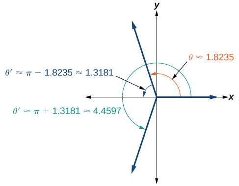
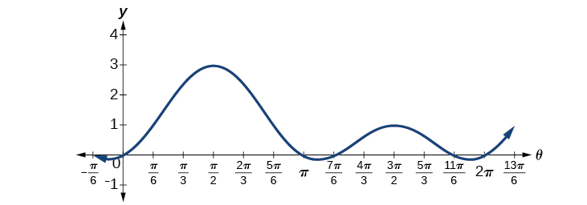
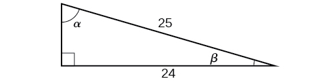

In this section, you will:
* Solve linear trigonometric equations in sine and cosine.
* Solve equations involving a single trigonometric function.
* Solve trigonometric equations using a calculator.
* Solve trigonometric equations that are quadratic in form.
* Solve trigonometric equations using fundamental identities.
* Solve trigonometric equations with multiple angles.
* Solve right triangle problems.

 "){: #Figure_07_05_001}

Thales of Miletus (circa 625–547 BC) is known as the founder of geometry. The legend is that he calculated the height of the Great Pyramid of Giza in Egypt using the theory of *similar triangles*, which he developed by measuring the shadow of his staff. Based on proportions, this theory has applications in a number of areas, including fractal geometry, engineering, and architecture. Often, the angle of elevation and the angle of depression are found using similar triangles.

In earlier sections of this chapter, we looked at trigonometric identities. Identities are true for all values in the domain of the variable. In this section, we begin our study of trigonometric equations to study real-world scenarios such as the finding the dimensions of the pyramids.

# Solving Linear Trigonometric Equations in Sine and Cosine

Trigonometric equations are, as the name implies, equations that involve trigonometric functions. Similar in many ways to solving polynomial equations or rational equations, only specific values of the variable will be solutions, if there are solutions at all. Often we will solve a trigonometric equation over a specified interval. However, just as often, we will be asked to find all possible solutions, and as trigonometric functions are periodic, solutions are repeated within each period. In other words, trigonometric equations may have an infinite number of solutions. Additionally, like rational equations, the domain of the function must be considered before we assume that any solution is valid. The **period**{: data-type="term" .no-emphasis} of both the sine function and the cosine function is<math xmlns="http://www.w3.org/1998/Math/MathML"> <mrow> <mtext> </mtext><mn>2</mn><mi>π</mi><mo>.</mo> </mrow> </math>

 In other words, every<math xmlns="http://www.w3.org/1998/Math/MathML"> <mrow> <mtext> </mtext><mn>2</mn><mi>π</mi><mtext> </mtext> </mrow> </math>

units, the *y-*values repeat. If we need to find all possible solutions, then we must add<math xmlns="http://www.w3.org/1998/Math/MathML"> <mrow> <mtext>  </mtext><mn>2</mn><mi>π</mi><mi>k</mi><mo>,</mo> </mrow> </math>

where<math xmlns="http://www.w3.org/1998/Math/MathML"> <mrow> <mtext>  </mtext><mi>k</mi><mtext>  </mtext> </mrow> </math>

is an integer, to the initial solution. Recall the rule that gives the format for stating all possible solutions for a function where the period is<math xmlns="http://www.w3.org/1998/Math/MathML"> <mrow> <mtext> </mtext><mn>2</mn><mi>π</mi><mtext>:</mtext> </mrow> </math>

<math xmlns="http://www.w3.org/1998/Math/MathML"> <mrow> <mi>sin</mi><mtext> </mtext><mi>θ</mi><mo>=</mo><mi>sin</mi><mo stretchy="false">(</mo><mi>θ</mi><mo>±</mo><mn>2</mn><mi>k</mi><mi>π</mi><mo stretchy="false">)</mo> </mrow> </math>

There are similar rules for indicating all possible solutions for the other trigonometric functions. Solving trigonometric equations requires the same techniques as solving algebraic equations. We read the equation from left to right, horizontally, like a sentence. We look for known patterns, factor, find common denominators, and substitute certain expressions with a variable to make solving a more straightforward process. However, with trigonometric equations, we also have the advantage of using the identities we developed in the previous sections.

Solving a Linear Trigonometric Equation Involving the Cosine Function

Find all possible exact solutions for the equation<math xmlns="http://www.w3.org/1998/Math/MathML"> <mrow> <mtext> </mtext><mi>cos</mi><mtext> </mtext><mi>θ</mi><mo>=</mo><mfrac> <mn>1</mn> <mn>2</mn> </mfrac> <mo>.</mo> </mrow> </math>

From the **unit circle**{: data-type="term" .no-emphasis}, we know that

<math xmlns="http://www.w3.org/1998/Math/MathML" display="block"> <mrow> <mtable> <mtr> <mtd columnalign="right"> <mrow> <mi>cos</mi><mtext> </mtext><mi>θ</mi> </mrow> </mtd> <mtd> <mo>=</mo> </mtd> <mtd columnalign="left"> <mrow> <mfrac> <mn>1</mn> <mn>2</mn> </mfrac> </mrow> </mtd> </mtr> <mtr> <mtd columnalign="right"> <mi>θ</mi> </mtd> <mtd> <mo>=</mo> </mtd> <mtd columnalign="left"> <mrow> <mfrac> <mi>π</mi> <mn>3</mn> </mfrac> <mo>,</mo><mfrac> <mrow> <mn>5</mn><mi>π</mi> </mrow> <mn>3</mn> </mfrac> </mrow> </mtd> </mtr> </mtable> </mrow> </math>

These are the solutions in the interval<math xmlns="http://www.w3.org/1998/Math/MathML"> <mrow> <mtext> </mtext><mrow><mo>[</mo> <mrow> <mn>0</mn><mo>,</mo><mn>2</mn><mi>π</mi> </mrow> <mo>]</mo></mrow><mo>.</mo><mtext> </mtext> </mrow> </math>

All possible solutions are given by

<math xmlns="http://www.w3.org/1998/Math/MathML" display="block"> <mrow> <mi>θ</mi><mo>=</mo><mfrac> <mi>π</mi> <mn>3</mn> </mfrac> <mo>±</mo><mn>2</mn><mi>k</mi><mi>π</mi><mtext>  and  </mtext><mi>θ</mi><mo>=</mo><mfrac> <mrow> <mn>5</mn><mi>π</mi> </mrow> <mn>3</mn> </mfrac> <mo>±</mo><mn>2</mn><mi>k</mi><mi>π</mi> </mrow> </math>

where<math xmlns="http://www.w3.org/1998/Math/MathML"> <mrow> <mtext> </mtext><mi>k</mi><mtext> </mtext> </mrow> </math>

is an integer.

Solving a Linear Equation Involving the Sine Function

Find all possible exact solutions for the equation<math xmlns="http://www.w3.org/1998/Math/MathML"> <mrow> <mtext> </mtext><mi>sin</mi><mtext> </mtext><mi>t</mi><mo>=</mo><mfrac> <mn>1</mn> <mn>2</mn> </mfrac> <mo>.</mo> </mrow> </math>

Solving for all possible values of *t* means that solutions include angles beyond the period of<math xmlns="http://www.w3.org/1998/Math/MathML"> <mrow> <mtext> </mtext><mn>2</mn><mi>π</mi><mo>.</mo><mtext> </mtext> </mrow> </math>

From [[link]](/m51289#Figure_07_02_008), we can see that the solutions are<math xmlns="http://www.w3.org/1998/Math/MathML"> <mrow> <mtext> </mtext><mi>t</mi><mo>=</mo><mfrac> <mi>π</mi> <mn>6</mn> </mfrac> <mtext> </mtext> </mrow> </math>

and<math xmlns="http://www.w3.org/1998/Math/MathML"> <mrow> <mtext> </mtext><mi>t</mi><mo>=</mo><mfrac> <mrow> <mn>5</mn><mi>π</mi> </mrow> <mn>6</mn> </mfrac> <mo>.</mo><mtext> </mtext> </mrow> </math>

But the problem is asking for all possible values that solve the equation. Therefore, the answer is

<math xmlns="http://www.w3.org/1998/Math/MathML" display="block"> <mrow> <mi>t</mi><mo>=</mo><mfrac> <mi>π</mi> <mn>6</mn> </mfrac> <mo>±</mo><mn>2</mn><mi>π</mi><mi>k</mi><mtext>  and  </mtext><mi>t</mi><mo>=</mo><mfrac> <mrow> <mn>5</mn><mi>π</mi> </mrow> <mn>6</mn> </mfrac> <mo>±</mo><mn>2</mn><mi>π</mi><mi>k</mi> </mrow> </math>

where<math xmlns="http://www.w3.org/1998/Math/MathML"> <mrow> <mtext> </mtext><mi>k</mi><mtext> </mtext> </mrow> </math>

is an integer.

**Given a trigonometric equation, solve using algebra**.

1.  Look for a pattern that suggests an algebraic property, such as the difference of squares or a factoring opportunity.
2.  Substitute the trigonometric expression with a single variable, such as
    <math xmlns="http://www.w3.org/1998/Math/MathML"> <mrow> <mtext> </mtext><mi>x</mi><mtext> </mtext> </mrow> </math>
    
    or
    <math xmlns="http://www.w3.org/1998/Math/MathML"> <mrow> <mtext> </mtext><mi>u</mi><mo>.</mo> </mrow> </math>

3.  Solve the equation the same way an algebraic equation would be solved.
4.  Substitute the trigonometric expression back in for the variable in the resulting expressions.
5.  Solve for the angle.
{: data-number-style="arabic"}

Solve the Linear Trigonometric Equation

Solve the equation exactly:<math xmlns="http://www.w3.org/1998/Math/MathML"> <mrow> <mtext> </mtext><mn>2</mn><mtext> </mtext><mi>cos</mi><mtext> </mtext><mi>θ</mi><mo>−</mo><mn>3</mn><mo>=</mo><mo>−</mo><mn>5</mn><mo>,</mo><mn>0</mn><mo>≤</mo><mi>θ</mi><mo>&lt;</mo><mn>2</mn><mi>π</mi><mo>.</mo> </mrow> </math>

Use algebraic techniques to solve the equation.

<math xmlns="http://www.w3.org/1998/Math/MathML" display="block"> <mrow> <mtable> <mtr> <mtd columnalign="right"> <mrow> <mn>2</mn><mtext> </mtext><mi>cos</mi><mtext> </mtext><mi>θ</mi><mo>−</mo><mn>3</mn> </mrow> </mtd> <mtd> <mo>=</mo> </mtd> <mtd columnalign="left"> <mrow> <mo>−</mo><mn>5</mn> </mrow> </mtd> </mtr> <mtr> <mtd columnalign="right"> <mrow> <mn>2</mn><mtext> </mtext><mi>cos</mi><mtext> </mtext><mi>θ</mi> </mrow> </mtd> <mtd> <mo>=</mo> </mtd> <mtd columnalign="left"> <mrow> <mo>−</mo><mn>2</mn> </mrow> </mtd> </mtr> <mtr> <mtd columnalign="right"> <mrow> <mi>cos</mi><mtext> </mtext><mi>θ</mi> </mrow> </mtd> <mtd> <mo>=</mo> </mtd> <mtd columnalign="left"> <mrow> <mo>−</mo><mn>1</mn> </mrow> </mtd> </mtr> <mtr> <mtd columnalign="right"> <mi>θ</mi> </mtd> <mtd> <mo>=</mo> </mtd> <mtd columnalign="left"> <mi>π</mi> </mtd> </mtr> </mtable> </mrow> </math>

Solve exactly the following linear equation on the interval<math xmlns="http://www.w3.org/1998/Math/MathML"> <mrow> <mtext> </mtext><mo stretchy="false">[</mo><mn>0</mn><mo>,</mo><mn>2</mn><mi>π</mi><mo stretchy="false">)</mo><mo>:</mo><mtext> </mtext><mn>2</mn><mtext> </mtext><mi>sin</mi><mtext> </mtext><mi>x</mi><mo>+</mo><mn>1</mn><mo>=</mo><mn>0.</mn> </mrow> </math>

<math xmlns="http://www.w3.org/1998/Math/MathML"> <mrow> <mi>x</mi><mo>=</mo><mfrac> <mrow> <mn>7</mn><mi>π</mi> </mrow> <mn>6</mn> </mfrac> <mo>,</mo><mfrac> <mrow> <mn>11</mn><mi>π</mi> </mrow> <mn>6</mn> </mfrac> </mrow> </math>

# Solving Equations Involving a Single Trigonometric Function

When we are given equations that involve only one of the six trigonometric functions, their solutions involve using algebraic techniques and the unit circle (see [\[link\]](/m51289#Figure_07_02_008)). We need to make several considerations when the equation involves trigonometric functions other than sine and cosine. Problems involving the reciprocals of the primary trigonometric functions need to be viewed from an algebraic perspective. In other words, we will write the reciprocal function, and solve for the angles using the function. Also, an equation involving the tangent function is slightly different from one containing a sine or cosine function. First, as we know, the period of tangent is<math xmlns="http://www.w3.org/1998/Math/MathML"> <mrow> <mtext>  </mtext><mi>π</mi><mo>,</mo> </mrow> </math>

not<math xmlns="http://www.w3.org/1998/Math/MathML"> <mrow> <mtext>  </mtext><mn>2</mn><mi>π</mi><mo>.</mo><mtext>  </mtext> </mrow> </math>

Further, the domain of tangent is all real numbers with the exception of odd integer multiples of<math xmlns="http://www.w3.org/1998/Math/MathML"> <mrow> <mtext> </mtext><mfrac> <mi>π</mi> <mn>2</mn> </mfrac> <mo>,</mo> </mrow> </math>

unless, of course, a problem places its own restrictions on the domain.

Solving a Problem Involving a Single Trigonometric Function

Solve the problem exactly:<math xmlns="http://www.w3.org/1998/Math/MathML"> <mrow> <mtext> </mtext><mn>2</mn><mtext> </mtext><msup> <mrow> <mi>sin</mi> </mrow> <mn>2</mn> </msup> <mi>θ</mi><mo>−</mo><mn>1</mn><mo>=</mo><mn>0</mn><mo>,</mo><mn>0</mn><mo>≤</mo><mi>θ</mi><mo>&lt;</mo><mn>2</mn><mi>π</mi><mo>.</mo> </mrow> </math>

As this problem is not easily factored, we will solve using the square root property. First, we use algebra to isolate<math xmlns="http://www.w3.org/1998/Math/MathML"> <mrow> <mtext> </mtext><mi>sin</mi><mtext> </mtext><mi>θ</mi><mo>.</mo><mtext> </mtext> </mrow> </math>

Then we will find the angles.

<math xmlns="http://www.w3.org/1998/Math/MathML" display="block"> <mrow> <mtable> <mtr> <mtd columnalign="right"> <mrow> <mn>2</mn><mtext> </mtext><msup> <mrow> <mi>sin</mi> </mrow> <mn>2</mn> </msup> <mi>θ</mi><mo>−</mo><mn>1</mn> </mrow> </mtd> <mtd> <mo>=</mo> </mtd> <mtd columnalign="left"> <mn>0</mn> </mtd> </mtr> <mtr> <mtd columnalign="right"> <mrow> <mtext> </mtext><mn>2</mn><mtext> </mtext><msup> <mrow> <mi>sin</mi> </mrow> <mn>2</mn> </msup> <mi>θ</mi> </mrow> </mtd> <mtd> <mo>=</mo> </mtd> <mtd columnalign="left"> <mn>1</mn> </mtd> </mtr> <mtr> <mtd columnalign="right"> <mrow> <msup> <mrow> <mi>sin</mi> </mrow> <mn>2</mn> </msup> <mi>θ</mi> </mrow> </mtd> <mtd> <mo>=</mo> </mtd> <mtd columnalign="left"> <mrow> <mfrac> <mn>1</mn> <mn>2</mn> </mfrac> </mrow> </mtd> </mtr> <mtr> <mtd columnalign="right"> <mrow> <msqrt> <mrow> <msup> <mrow> <mi>sin</mi> </mrow> <mn>2</mn> </msup> <mi>θ</mi> </mrow> </msqrt> </mrow> </mtd> <mtd> <mo>=</mo> </mtd> <mtd columnalign="left"> <mrow> <mo>±</mo><msqrt> <mrow> <mfrac> <mn>1</mn> <mn>2</mn> </mfrac> </mrow> </msqrt> </mrow> </mtd> </mtr> <mtr> <mtd columnalign="right"> <mrow> <mi>sin</mi><mtext> </mtext><mi>θ</mi> </mrow> </mtd> <mtd> <mo>=</mo> </mtd> <mtd columnalign="left"> <mrow> <mo>±</mo><mfrac> <mn>1</mn> <mrow> <msqrt> <mn>2</mn> </msqrt> </mrow> </mfrac> <mo>=</mo><mo>±</mo><mfrac> <mrow> <msqrt> <mn>2</mn> </msqrt> </mrow> <mn>2</mn> </mfrac> </mrow> </mtd> </mtr> <mtr> <mtd columnalign="right"> <mi>θ</mi> </mtd> <mtd> <mo>=</mo> </mtd> <mtd columnalign="left"> <mrow> <mfrac> <mi>π</mi> <mn>4</mn> </mfrac> <mo>,</mo><mfrac> <mrow> <mn>3</mn><mi>π</mi> </mrow> <mn>4</mn> </mfrac> <mo>,</mo><mfrac> <mrow> <mn>5</mn><mi>π</mi> </mrow> <mn>4</mn> </mfrac> <mo>,</mo><mfrac> <mrow> <mn>7</mn><mi>π</mi> </mrow> <mn>4</mn> </mfrac> </mrow> </mtd> </mtr> </mtable> </mrow> </math>

Solving a Trigonometric Equation Involving Cosecant

Solve the following equation exactly:<math xmlns="http://www.w3.org/1998/Math/MathML"> <mrow> <mtext> </mtext><mi>csc</mi><mtext> </mtext><mi>θ</mi><mo>=</mo><mo>−</mo><mn>2</mn><mo>,</mo><mn>0</mn><mo>≤</mo><mi>θ</mi><mo>&lt;</mo><mn>4</mn><mi>π</mi><mo>.</mo> </mrow> </math>

We want all values of<math xmlns="http://www.w3.org/1998/Math/MathML"> <mrow> <mtext> </mtext><mi>θ</mi><mtext> </mtext> </mrow> </math>

for which<math xmlns="http://www.w3.org/1998/Math/MathML"> <mrow> <mtext> </mtext><mi>csc</mi><mtext> </mtext><mi>θ</mi><mo>=</mo><mo>−</mo><mn>2</mn><mtext> </mtext> </mrow> </math>

over the interval<math xmlns="http://www.w3.org/1998/Math/MathML"> <mrow> <mtext> </mtext><mn>0</mn><mo>≤</mo><mi>θ</mi><mo>&lt;</mo><mn>4</mn><mi>π</mi><mo>.</mo> </mrow> </math>

<math xmlns="http://www.w3.org/1998/Math/MathML" display="block"> <mrow> <mtable> <mtr> <mtd columnalign="right"> <mrow> <mi>csc</mi><mtext> </mtext><mi>θ</mi> </mrow> </mtd> <mtd> <mo>=</mo> </mtd> <mtd columnalign="left"> <mrow> <mo>−</mo><mn>2</mn> </mrow> </mtd> </mtr> <mtr> <mtd columnalign="right"> <mrow> <mfrac> <mn>1</mn> <mrow> <mi>sin</mi><mtext> </mtext><mi>θ</mi> </mrow> </mfrac> </mrow> </mtd> <mtd> <mo>=</mo> </mtd> <mtd columnalign="left"> <mrow> <mo>−</mo><mn>2</mn> </mrow> </mtd> </mtr> <mtr> <mtd columnalign="right"> <mrow> <mi>sin</mi><mtext> </mtext><mi>θ</mi> </mrow> </mtd> <mtd> <mo>=</mo> </mtd> <mtd columnalign="left"> <mrow> <mo>−</mo><mfrac> <mn>1</mn> <mn>2</mn> </mfrac> </mrow> </mtd> </mtr> <mtr> <mtd columnalign="right"> <mi>θ</mi> </mtd> <mtd> <mo>=</mo> </mtd> <mtd columnalign="left"> <mrow> <mfrac> <mrow> <mn>7</mn><mi>π</mi> </mrow> <mn>6</mn> </mfrac> <mo>,</mo><mfrac> <mrow> <mn>11</mn><mi>π</mi> </mrow> <mn>6</mn> </mfrac> <mo>,</mo><mfrac> <mrow> <mn>19</mn><mi>π</mi> </mrow> <mn>6</mn> </mfrac> <mo>,</mo><mfrac> <mrow> <mn>23</mn><mi>π</mi> </mrow> <mn>6</mn> </mfrac> </mrow> </mtd> </mtr> </mtable> </mrow> </math>

Analysis

As<math xmlns="http://www.w3.org/1998/Math/MathML"> <mrow> <mtext> </mtext><mi>sin</mi><mtext> </mtext><mi>θ</mi><mo>=</mo><mo>−</mo><mfrac> <mn>1</mn> <mn>2</mn> </mfrac> <mo>,</mo> </mrow> </math>

notice that all four solutions are in the third and fourth quadrants.

Solving an Equation Involving Tangent

Solve the equation exactly:<math xmlns="http://www.w3.org/1998/Math/MathML"> <mrow> <mtext> </mtext><mi>tan</mi><mrow><mo>(</mo> <mrow> <mi>θ</mi><mo>−</mo><mfrac> <mi>π</mi> <mn>2</mn> </mfrac> </mrow> <mo>)</mo></mrow><mo>=</mo><mn>1</mn><mo>,</mo><mn>0</mn><mo>≤</mo><mi>θ</mi><mo>&lt;</mo><mn>2</mn><mi>π</mi><mo>.</mo> </mrow> </math>

Recall that the tangent function has a period of<math xmlns="http://www.w3.org/1998/Math/MathML"> <mrow> <mtext> </mtext><mi>π</mi><mo>.</mo><mtext> </mtext> </mrow> </math>

On the interval<math xmlns="http://www.w3.org/1998/Math/MathML"> <mrow> <mtext> </mtext><mrow><mo>[</mo> <mrow> <mn>0</mn><mo>,</mo><mi>π</mi> </mrow> <mo>)</mo></mrow><mo>,</mo> </mrow> </math>

and at the angle of<math xmlns="http://www.w3.org/1998/Math/MathML"> <mrow> <mtext> </mtext><mfrac> <mi>π</mi> <mn>4</mn> </mfrac> <mo>,</mo> </mrow> </math>

the tangent has a value of 1. However, the angle we want is<math xmlns="http://www.w3.org/1998/Math/MathML"> <mrow> <mtext> </mtext><mrow><mo>(</mo> <mrow> <mi>θ</mi><mo>−</mo><mfrac> <mi>π</mi> <mn>2</mn> </mfrac> </mrow> <mo>)</mo></mrow><mo>.</mo><mtext> </mtext> </mrow> </math>

Thus, if<math xmlns="http://www.w3.org/1998/Math/MathML"> <mrow> <mtext> </mtext><mi>tan</mi><mrow><mo>(</mo> <mrow> <mfrac> <mi>π</mi> <mn>4</mn> </mfrac> </mrow> <mo>)</mo></mrow><mo>=</mo><mn>1</mn><mo>,</mo> </mrow> </math>

then

<math xmlns="http://www.w3.org/1998/Math/MathML" display="block"> <mrow> <mtable> <mtr> <mtd columnalign="right"> <mrow> <mi>θ</mi><mo>−</mo><mfrac> <mi>π</mi> <mn>2</mn> </mfrac> </mrow> </mtd> <mtd> <mo>=</mo> </mtd> <mtd columnalign="left"> <mrow> <mfrac> <mi>π</mi> <mn>4</mn> </mfrac> </mrow> </mtd> </mtr> <mtr> <mtd columnalign="right"> <mi>θ</mi> </mtd> <mtd> <mo>=</mo> </mtd> <mtd columnalign="left"> <mrow> <mfrac> <mrow> <mn>3</mn><mi>π</mi> </mrow> <mn>4</mn> </mfrac> <mo>±</mo><mi>k</mi><mi>π</mi> </mrow> </mtd> </mtr> </mtable> </mrow> </math>

Over the interval<math xmlns="http://www.w3.org/1998/Math/MathML"> <mrow> <mtext> </mtext><mrow><mo>[</mo> <mrow> <mn>0</mn><mo>,</mo><mn>2</mn><mi>π</mi> </mrow> <mo>)</mo></mrow><mo>,</mo> </mrow> </math>

we have two solutions:

<math xmlns="http://www.w3.org/1998/Math/MathML"> <mrow> <mi>θ</mi><mo>=</mo><mfrac> <mrow> <mn>3</mn><mi>π</mi> </mrow> <mn>4</mn> </mfrac> <mtext>  and </mtext><mi>θ</mi><mo>=</mo><mfrac> <mrow> <mn>3</mn><mi>π</mi> </mrow> <mn>4</mn> </mfrac> <mo>+</mo><mi>π</mi><mo>=</mo><mfrac> <mrow> <mn>7</mn><mi>π</mi> </mrow> <mn>4</mn> </mfrac> </mrow> </math>

Find all solutions for<math xmlns="http://www.w3.org/1998/Math/MathML"> <mrow> <mtext> </mtext><mi>tan</mi><mtext> </mtext><mi>x</mi><mo>=</mo><msqrt> <mn>3</mn> </msqrt> <mo>.</mo> </mrow> </math>

<math xmlns="http://www.w3.org/1998/Math/MathML"> <mrow> <mfrac> <mi>π</mi> <mn>3</mn> </mfrac> <mo>±</mo><mi>π</mi><mi>k</mi> </mrow> </math>

Identify all Solutions to the Equation Involving Tangent

Identify all exact solutions to the equation<math xmlns="http://www.w3.org/1998/Math/MathML"> <mrow> <mtext> </mtext><mn>2</mn><mrow><mo>(</mo> <mrow> <mi>tan</mi><mtext> </mtext><mi>x</mi><mo>+</mo><mn>3</mn> </mrow> <mo>)</mo></mrow><mo>=</mo><mn>5</mn><mo>+</mo><mi>tan</mi><mtext> </mtext><mi>x</mi><mo>,</mo><mn>0</mn><mo>≤</mo><mi>x</mi><mo>&lt;</mo><mn>2</mn><mi>π</mi><mo>.</mo> </mrow> </math>

We can solve this equation using only algebra. Isolate the expression<math xmlns="http://www.w3.org/1998/Math/MathML"> <mrow> <mtext> </mtext><mi>tan</mi><mtext> </mtext><mi>x</mi><mtext> </mtext> </mrow> </math>

on the left side of the equals sign.

<math xmlns="http://www.w3.org/1998/Math/MathML" display="block"> <mrow> <mtable> <mtr> <mtd columnalign="right"> <mrow> <mn>2</mn><mo stretchy="false">(</mo><mi>tan</mi><mtext> </mtext><mi>x</mi><mo stretchy="false">)</mo><mo>+</mo><mn>2</mn><mo stretchy="false">(</mo><mn>3</mn><mo stretchy="false">)</mo> </mrow> </mtd> <mtd> <mo>=</mo> </mtd> <mtd columnalign="left"> <mrow> <mn>5</mn><mo>+</mo><mi>tan</mi><mtext> </mtext><mi>x</mi> </mrow> </mtd> </mtr> <mtr> <mtd columnalign="right"> <mrow> <mn>2</mn><mi>tan</mi><mtext> </mtext><mi>x</mi><mo>+</mo><mn>6</mn> </mrow> </mtd> <mtd> <mo>=</mo> </mtd> <mtd columnalign="left"> <mrow> <mn>5</mn><mo>+</mo><mi>tan</mi><mtext> </mtext><mi>x</mi> </mrow> </mtd> </mtr> <mtr> <mtd columnalign="right"> <mrow> <mtext> </mtext><mn>2</mn><mi>tan</mi><mtext> </mtext><mi>x</mi><mo>−</mo><mi>tan</mi><mtext> </mtext><mi>x</mi> </mrow> </mtd> <mtd> <mo>=</mo> </mtd> <mtd columnalign="left"> <mrow> <mn>5</mn><mo>−</mo><mn>6</mn> </mrow> </mtd> </mtr> <mtr> <mtd columnalign="right"> <mrow> <mi>tan</mi><mtext> </mtext><mi>x</mi> </mrow> </mtd> <mtd> <mo>=</mo> </mtd> <mtd columnalign="left"> <mrow> <mo>−</mo><mn>1</mn> </mrow> </mtd> </mtr> </mtable> </mrow> </math>

There are two angles on the unit circle that have a tangent value of<math xmlns="http://www.w3.org/1998/Math/MathML"> <mrow> <mtext> </mtext><mn>−1</mn><mtext>: </mtext><mi>θ</mi><mo>=</mo><mfrac> <mrow> <mn>3</mn><mi>π</mi> </mrow> <mn>4</mn> </mfrac> <mtext> </mtext> </mrow> </math>

and<math xmlns="http://www.w3.org/1998/Math/MathML"> <mrow> <mtext> </mtext><mi>θ</mi><mo>=</mo><mfrac> <mrow> <mn>7</mn><mi>π</mi> </mrow> <mn>4</mn> </mfrac> <mo>.</mo> </mrow> </math>

# Solve Trigonometric Equations Using a Calculator

Not all functions can be solved exactly using only the unit circle. When we must solve an equation involving an angle other than one of the special angles, we will need to use a calculator. Make sure it is set to the proper mode, either degrees or radians, depending on the criteria of the given problem.

Using a Calculator to Solve a Trigonometric Equation Involving Sine

Use a calculator to solve the equation<math xmlns="http://www.w3.org/1998/Math/MathML"> <mrow> <mtext> </mtext><mi>sin</mi><mtext> </mtext><mi>θ</mi><mo>=</mo><mn>0.8</mn><mo>,</mo> </mrow> </math>

where<math xmlns="http://www.w3.org/1998/Math/MathML"> <mrow> <mtext>  </mtext><mi>θ</mi><mtext>  </mtext> </mrow> </math>

is in radians.

Make sure mode is set to radians. To find<math xmlns="http://www.w3.org/1998/Math/MathML"> <mrow> <mtext> </mtext><mi>θ</mi><mo>,</mo> </mrow> </math>

 use the inverse sine function. On most calculators, you will need to push the 2ND button and then the SIN button to bring up the<math xmlns="http://www.w3.org/1998/Math/MathML"> <mrow> <mtext> </mtext><msup> <mrow> <mi>sin</mi> </mrow> <mrow> <mo>−</mo><mn>1</mn> </mrow> </msup> <mtext> </mtext> </mrow> </math>

function. What is shown on the screen is<math xmlns="http://www.w3.org/1998/Math/MathML"> <mrow> <msup> <mrow> <mi>sin</mi> </mrow> <mrow> <mo>−</mo><mn>1</mn> </mrow> </msup> <mo stretchy="false">(</mo><mtext> </mtext><mo>.</mo> </mrow> </math>

The calculator is ready for the input within the parentheses. For this problem, we enter<math xmlns="http://www.w3.org/1998/Math/MathML"> <mrow> <mtext> </mtext><msup> <mrow> <mi>sin</mi> </mrow> <mrow> <mo>−</mo><mn>1</mn> </mrow> </msup> <mrow><mo>(</mo> <mrow> <mn>0.8</mn> </mrow> <mo>)</mo></mrow><mo>,</mo> </mrow> </math>

and press ENTER. Thus, to four decimals places,

<math xmlns="http://www.w3.org/1998/Math/MathML" display="block"> <mrow> <msup> <mrow> <mi>sin</mi> </mrow> <mrow> <mo>−</mo><mn>1</mn> </mrow> </msup> <mo stretchy="false">(</mo><mn>0.8</mn><mo stretchy="false">)</mo><mo>≈</mo><mn>0.9273</mn> </mrow> </math>

The solution is

<math xmlns="http://www.w3.org/1998/Math/MathML" display="block"> <mrow> <mi>θ</mi><mo>≈</mo><mn>0.9273</mn><mo>±</mo><mn>2</mn><mi>π</mi><mi>k</mi> </mrow> </math>

The angle measurement in degrees is

<math xmlns="http://www.w3.org/1998/Math/MathML" display="block"> <mrow> <mtable> <mtr rowalign="center"> <mtd columnalign="right" rowalign="center"> <mi>θ</mi> </mtd> <mtd rowalign="center"> <mo>≈</mo> </mtd> <mtd columnalign="left" rowalign="center"> <mrow> <mn>53.1°</mn> </mrow> </mtd> </mtr> <mtr rowalign="center"> <mtd columnalign="right" rowalign="center"> <mi>θ</mi> </mtd> <mtd rowalign="center"> <mo>≈</mo> </mtd> <mtd columnalign="left" rowalign="center"> <mrow> <mn>180°</mn><mo>−</mo><mn>53.1°</mn> </mrow> </mtd> </mtr> <mtr rowalign="center"> <mtd rowalign="center" /> <mtd rowalign="center"> <mo>≈</mo> </mtd> <mtd columnalign="left" rowalign="center"> <mrow> <mn>126.9°</mn> </mrow> </mtd> </mtr> </mtable> </mrow> </math>

Analysis

Note that a calculator will only return an angle in quadrants I or IV for the sine function, since that is the range of the inverse sine. The other angle is obtained by using<math xmlns="http://www.w3.org/1998/Math/MathML"> <mrow> <mtext> </mtext><mi>π</mi><mo>−</mo><mi>θ</mi><mo>.</mo> </mrow> </math>

Using a Calculator to Solve a Trigonometric Equation Involving Secant

Use a calculator to solve the equation<math xmlns="http://www.w3.org/1998/Math/MathML"> <mrow> <mtext> </mtext><mi>sec</mi><mtext> </mtext><mi>θ</mi><mo>=</mo><mn>−4</mn><mo>,</mo> </mrow> </math>

giving your answer in radians.

We can begin with some algebra.

<math xmlns="http://www.w3.org/1998/Math/MathML" display="block"> <mrow> <mtable> <mtr> <mtd columnalign="right"> <mrow> <mi>sec</mi><mtext> </mtext><mi>θ</mi> </mrow> </mtd> <mtd> <mo>=</mo> </mtd> <mtd columnalign="left"> <mrow> <mo>−</mo><mn>4</mn> </mrow> </mtd> </mtr> <mtr> <mtd columnalign="right"> <mrow> <mfrac> <mn>1</mn> <mrow> <mi>cos</mi><mtext> </mtext><mi>θ</mi> </mrow> </mfrac> </mrow> </mtd> <mtd> <mo>=</mo> </mtd> <mtd columnalign="left"> <mrow> <mo>−</mo><mn>4</mn> </mrow> </mtd> </mtr> <mtr> <mtd columnalign="right"> <mrow> <mi>cos</mi><mtext> </mtext><mi>θ</mi> </mrow> </mtd> <mtd> <mo>=</mo> </mtd> <mtd columnalign="left"> <mrow> <mo>−</mo><mfrac> <mn>1</mn> <mn>4</mn> </mfrac> </mrow> </mtd> </mtr> </mtable> </mrow> </math>

Check that the MODE is in radians. Now use the inverse cosine function.

<math xmlns="http://www.w3.org/1998/Math/MathML" display="block"> <mrow> <mtable> <mtr> <mtd columnalign="right"> <mrow> <msup> <mrow> <mi>cos</mi> </mrow> <mrow> <mo>−</mo><mn>1</mn> </mrow> </msup> <mrow><mo>(</mo> <mrow> <mo>−</mo><mfrac> <mn>1</mn> <mn>4</mn> </mfrac> </mrow> <mo>)</mo></mrow> </mrow> </mtd> <mtd> <mo>≈</mo> </mtd> <mtd columnalign="left"> <mrow> <mn>1.8235</mn> </mrow> </mtd> </mtr> <mtr> <mtd columnalign="right"> <mi>θ</mi> </mtd> <mtd> <mo>≈</mo> </mtd> <mtd columnalign="left"> <mrow> <mn>1.8235</mn><mo>+</mo><mn>2</mn><mi>π</mi><mi>k</mi> </mrow> </mtd> </mtr> </mtable> </mrow> </math>

Since<math xmlns="http://www.w3.org/1998/Math/MathML"> <mrow> <mtext> </mtext><mfrac> <mi>π</mi> <mn>2</mn> </mfrac> <mo>≈</mo><mn>1.57</mn><mtext> </mtext> </mrow> </math>

and<math xmlns="http://www.w3.org/1998/Math/MathML"> <mrow> <mtext> </mtext><mi>π</mi><mo>≈</mo><mn>3.14</mn><mo>,</mo> </mrow> </math>

1.8235 is between these two numbers, thus<math xmlns="http://www.w3.org/1998/Math/MathML"> <mrow> <mtext> </mtext><mi>θ</mi><mo>≈</mo><mtext>1</mtext><mtext>.8235</mtext><mtext>  </mtext> </mrow> </math>

is in quadrant II. Cosine is also negative in quadrant III. Note that a calculator will only return an angle in quadrants I or II for the cosine function, since that is the range of the inverse cosine. See [[link]](#Figure_07_05_005).

{: #Figure_07_05_005}

So, we also need to find the measure of the angle in quadrant III. In quadrant III, the reference angle is<math xmlns="http://www.w3.org/1998/Math/MathML"> <mrow> <mtext> </mtext><mi>θ</mi><mi> </mi><mtext>​</mtext><mtext>​</mtext><mo>'</mo><mo>≈</mo><mi>π</mi><mo>−</mo><mtext>1</mtext><mtext>.8235</mtext><mo>≈</mo><mtext>1</mtext><mtext>.3181</mtext><mtext>.</mtext><mtext>  </mtext> </mrow> </math>

The other solution in quadrant III is<math xmlns="http://www.w3.org/1998/Math/MathML"> <mrow> <mtext> </mtext><mi>θ</mi><mi> </mi><mtext>​</mtext><mtext>​</mtext><mo>'</mo><mo>≈</mo><mi>π</mi><mo>+</mo><mtext>1</mtext><mtext>.3181</mtext><mo>≈</mo><mtext>4</mtext><mtext>.4597</mtext><mtext>.</mtext> </mrow> </math>

The solutions are<math xmlns="http://www.w3.org/1998/Math/MathML"> <mrow> <mtext> </mtext><mi>θ</mi><mo>≈</mo><mn>1.8235</mn><mo>±</mo><mn>2</mn><mi>π</mi><mi>k</mi><mtext> </mtext> </mrow> </math>

 and <math xmlns="http://www.w3.org/1998/Math/MathML"> <mrow> <mtext> </mtext><mi>θ</mi><mo>≈</mo><mn>4.4597</mn><mo>±</mo><mn>2</mn><mi>π</mi><mi>k</mi><mo>.</mo> </mrow> </math>

Solve<math xmlns="http://www.w3.org/1998/Math/MathML"> <mrow> <mtext> </mtext><mi>cos</mi><mtext> </mtext><mi>θ</mi><mo>=</mo><mo>−</mo><mn>0.2.</mn> </mrow> </math>

<math xmlns="http://www.w3.org/1998/Math/MathML"> <mrow> <mi>θ</mi><mo>≈</mo><mn>1.7722</mn><mo>±</mo><mn>2</mn><mi>π</mi><mi>k</mi><mtext> </mtext> </mrow> </math>

 and <math xmlns="http://www.w3.org/1998/Math/MathML"> <mrow> <mtext> </mtext><mi>θ</mi><mo>≈</mo><mn>4.5110</mn><mo>±</mo><mn>2</mn><mi>π</mi><mi>k</mi> </mrow> </math>

# Solving Trigonometric Equations in Quadratic Form

Solving a **quadratic equation**{: data-type="term" .no-emphasis} may be more complicated, but once again, we can use algebra as we would for any quadratic equation. Look at the pattern of the equation. Is there more than one trigonometric function in the equation, or is there only one? Which trigonometric function is squared? If there is only one function represented and one of the terms is squared, think about the standard form of a quadratic. Replace the trigonometric function with a variable such as<math xmlns="http://www.w3.org/1998/Math/MathML"> <mrow> <mtext> </mtext><mi>x</mi><mtext> </mtext> </mrow> </math>

or<math xmlns="http://www.w3.org/1998/Math/MathML"> <mrow> <mtext> </mtext><mi>u</mi><mo>.</mo><mtext> </mtext> </mrow> </math>

If substitution makes the equation look like a quadratic equation, then we can use the same methods for solving quadratics to solve the trigonometric equations.

Solving a Trigonometric Equation in Quadratic Form

Solve the equation exactly:<math xmlns="http://www.w3.org/1998/Math/MathML"> <mrow> <mtext> </mtext><msup> <mrow> <mi>cos</mi> </mrow> <mn>2</mn> </msup> <mi>θ</mi><mo>+</mo><mn>3</mn><mtext> </mtext><mi>cos</mi><mtext> </mtext><mi>θ</mi><mo>−</mo><mn>1</mn><mo>=</mo><mn>0</mn><mo>,</mo><mn>0</mn><mo>≤</mo><mi>θ</mi><mo>&lt;</mo><mn>2</mn><mi>π</mi><mo>.</mo> </mrow> </math>

We begin by using substitution and replacing cos<math xmlns="http://www.w3.org/1998/Math/MathML"> <mrow> <mi>θ</mi><mtext> </mtext> </mrow> </math>

with<math xmlns="http://www.w3.org/1998/Math/MathML"> <mrow> <mtext> </mtext><mi>x</mi><mo>.</mo><mtext> </mtext> </mrow> </math>

It is not necessary to use substitution, but it may make the problem easier to solve visually. Let<math xmlns="http://www.w3.org/1998/Math/MathML"> <mrow> <mtext> </mtext><mi>cos</mi><mtext> </mtext><mi>θ</mi><mo>=</mo><mi>x</mi><mo>.</mo><mtext> </mtext> </mrow> </math>

We have

<math xmlns="http://www.w3.org/1998/Math/MathML" display="block"> <mrow> <msup> <mi>x</mi> <mn>2</mn> </msup> <mo>+</mo><mn>3</mn><mi>x</mi><mo>−</mo><mn>1</mn><mo>=</mo><mn>0</mn> </mrow> </math>

The equation cannot be factored, so we will use the **quadratic formula**{: data-type="term" .no-emphasis}<math xmlns="http://www.w3.org/1998/Math/MathML"> <mrow> <mtext> </mtext><mi>x</mi><mo>=</mo><mfrac> <mrow> <mo>−</mo><mi>b</mi><mo>±</mo><msqrt> <mrow> <msup> <mi>b</mi> <mn>2</mn> </msup> <mo>−</mo><mn>4</mn><mi>a</mi><mi>c</mi> </mrow> </msqrt> </mrow> <mrow> <mn>2</mn><mi>a</mi> </mrow> </mfrac> <mo>.</mo> </mrow> </math>

<math xmlns="http://www.w3.org/1998/Math/MathML" display="block"> <mrow> <mtable> <mtr rowalign="center"> <mtd columnalign="right" rowalign="center"> <mi>x</mi> </mtd> <mtd rowalign="center"> <mo>=</mo> </mtd> <mtd columnalign="left" rowalign="center"> <mrow> <mfrac> <mrow> <mo>−</mo><mn>3</mn><mo>±</mo><msqrt> <mrow> <msup> <mrow> <mo stretchy="false">(</mo><mo>−</mo><mn>3</mn><mo stretchy="false">)</mo> </mrow> <mn>2</mn> </msup> <mo>−</mo><mn>4</mn><mo stretchy="false">(</mo><mn>1</mn><mo stretchy="false">)</mo><mo stretchy="false">(</mo><mo>−</mo><mn>1</mn><mo stretchy="false">)</mo> </mrow> </msqrt> </mrow> <mn>2</mn> </mfrac> </mrow> </mtd> </mtr> <mtr rowalign="center"> <mtd rowalign="center" /> <mtd rowalign="center"> <mo>=</mo> </mtd> <mtd columnalign="left" rowalign="center"> <mrow> <mfrac> <mrow> <mo>−</mo><mn>3</mn><mo>±</mo><msqrt> <mrow> <mn>13</mn> </mrow> </msqrt> </mrow> <mn>2</mn> </mfrac> </mrow> </mtd> </mtr> </mtable> </mrow> </math>

Replace<math xmlns="http://www.w3.org/1998/Math/MathML"> <mrow> <mtext> </mtext><mi>x</mi><mtext> </mtext> </mrow> </math>

with<math xmlns="http://www.w3.org/1998/Math/MathML"> <mrow> <mtext> </mtext><mi>cos</mi><mtext> </mtext><mi>θ</mi><mo>,</mo> </mrow> </math>

and solve.

<math xmlns="http://www.w3.org/1998/Math/MathML" display="block"> <mrow> <mtable> <mtr> <mtd columnalign="right"> <mrow> <mi>cos</mi><mtext> </mtext><mi>θ</mi> </mrow> </mtd> <mtd> <mo>=</mo> </mtd> <mtd columnalign="left"> <mrow> <mfrac> <mrow> <mo>−</mo><mn>3</mn><mo>±</mo><msqrt> <mrow> <mn>13</mn> </mrow> </msqrt> </mrow> <mn>2</mn> </mfrac> </mrow> </mtd> </mtr> <mtr> <mtd columnalign="right"> <mi>θ</mi> </mtd> <mtd> <mo>=</mo> </mtd> <mtd columnalign="left"> <mrow> <msup> <mrow> <mi>cos</mi> </mrow> <mrow> <mo>−</mo><mn>1</mn> </mrow> </msup> <mrow><mo>(</mo> <mrow> <mfrac> <mrow> <mo>−</mo><mn>3</mn><mo>+</mo><msqrt> <mrow> <mn>13</mn> </mrow> </msqrt> </mrow> <mn>2</mn> </mfrac> </mrow> <mo>)</mo></mrow> </mrow> </mtd> </mtr> </mtable> </mrow> </math>

Note that only the + sign is used. This is because we get an error when we solve<math xmlns="http://www.w3.org/1998/Math/MathML"> <mrow> <mtext> </mtext><mi>θ</mi><mo>=</mo><msup> <mrow> <mi>cos</mi> </mrow> <mrow> <mo>−</mo><mn>1</mn> </mrow> </msup> <mrow><mo>(</mo> <mrow> <mfrac> <mrow> <mo>−</mo><mn>3</mn><mo>−</mo><msqrt> <mrow> <mn>13</mn> </mrow> </msqrt> </mrow> <mn>2</mn> </mfrac> </mrow> <mo>)</mo></mrow><mtext> </mtext> </mrow> </math>

on a calculator, since the domain of the inverse cosine function is<math xmlns="http://www.w3.org/1998/Math/MathML"> <mrow> <mtext> </mtext><mrow><mo>[</mo> <mrow> <mo>−</mo><mn>1</mn><mo>,</mo><mn>1</mn> </mrow> <mo>]</mo></mrow><mo>.</mo><mtext> </mtext> </mrow> </math>

However, there is a second solution:

<math xmlns="http://www.w3.org/1998/Math/MathML" display="block"> <mrow> <mtable> <mtr rowalign="center"> <mtd columnalign="right" rowalign="center"> <mi>θ</mi> </mtd> <mtd rowalign="center"> <mo>=</mo> </mtd> <mtd columnalign="left" rowalign="center"> <mrow> <msup> <mrow> <mi>cos</mi> </mrow> <mrow> <mo>−</mo><mn>1</mn> </mrow> </msup> <mrow><mo>(</mo> <mrow> <mfrac> <mrow> <mo>−</mo><mn>3</mn><mo>+</mo><msqrt> <mrow> <mn>13</mn> </mrow> </msqrt> </mrow> <mn>2</mn> </mfrac> </mrow> <mo>)</mo></mrow> </mrow> </mtd> </mtr> <mtr rowalign="center"> <mtd rowalign="center" /> <mtd rowalign="center"> <mo>≈</mo> </mtd> <mtd columnalign="left" rowalign="center"> <mrow> <mn>1.26</mn> </mrow> </mtd> </mtr> </mtable> </mrow> </math>

This terminal side of the angle lies in quadrant I. Since cosine is also positive in quadrant IV, the second solution is

<math xmlns="http://www.w3.org/1998/Math/MathML" display="block"> <mrow> <mtable> <mtr rowalign="center"> <mtd columnalign="right" rowalign="center"> <mi>θ</mi> </mtd> <mtd rowalign="center"> <mo>=</mo> </mtd> <mtd columnalign="left" rowalign="center"> <mrow> <mn>2</mn><mi>π</mi><mo>−</mo><msup> <mrow> <mi>cos</mi> </mrow> <mrow> <mo>−</mo><mn>1</mn> </mrow> </msup> <mrow><mo>(</mo> <mrow> <mfrac> <mrow> <mo>−</mo><mn>3</mn><mo>+</mo><msqrt> <mrow> <mn>13</mn> </mrow> </msqrt> </mrow> <mn>2</mn> </mfrac> </mrow> <mo>)</mo></mrow> </mrow> </mtd> </mtr> <mtr rowalign="center"> <mtd rowalign="center" /> <mtd rowalign="center"> <mo>≈</mo> </mtd> <mtd columnalign="left" rowalign="center"> <mrow> <mtext> </mtext><mn>5.02</mn> </mrow> </mtd> </mtr> </mtable> </mrow> </math>

Solving a Trigonometric Equation in Quadratic Form by Factoring

Solve the equation exactly:<math xmlns="http://www.w3.org/1998/Math/MathML"> <mrow> <mtext> </mtext><mn>2</mn><mtext> </mtext><msup> <mrow> <mi>sin</mi> </mrow> <mn>2</mn> </msup> <mi>θ</mi><mo>−</mo><mn>5</mn><mtext> </mtext><mi>sin</mi><mtext> </mtext><mi>θ</mi><mo>+</mo><mn>3</mn><mo>=</mo><mn>0</mn><mo>,</mo><mn>0</mn><mo>≤</mo><mi>θ</mi><mo>≤</mo><mn>2</mn><mi>π</mi><mo>.</mo> </mrow> </math>

Using grouping, this quadratic can be factored. Either make the real substitution,<math xmlns="http://www.w3.org/1998/Math/MathML"> <mrow> <mtext> </mtext><mi>sin</mi><mtext> </mtext><mi>θ</mi><mo>=</mo><mi>u</mi><mo>,</mo> </mrow> </math>

or imagine it, as we factor:

<math xmlns="http://www.w3.org/1998/Math/MathML" display="block"> <mrow> <mtable> <mtr> <mtd> <mrow> <mtext> </mtext><mn>2</mn><mtext> </mtext><msup> <mrow> <mi>sin</mi> </mrow> <mn>2</mn> </msup> <mi>θ</mi><mo>−</mo><mn>5</mn><mtext> </mtext><mi>sin</mi><mtext> </mtext><mi>θ</mi><mo>+</mo><mn>3</mn> </mrow> </mtd> <mtd> <mo>=</mo> </mtd> <mtd> <mn>0</mn> </mtd> </mtr> <mtr> <mtd> <mrow> <mo stretchy="false">(</mo><mn>2</mn><mtext> </mtext><mi>sin</mi><mtext> </mtext><mi>θ</mi><mo>−</mo><mn>3</mn><mo stretchy="false">)</mo><mo stretchy="false">(</mo><mi>sin</mi><mtext> </mtext><mi>θ</mi><mo>−</mo><mn>1</mn><mo stretchy="false">)</mo> </mrow> </mtd> <mtd> <mo>=</mo> </mtd> <mtd> <mn>0</mn> </mtd> </mtr> </mtable> </mrow> </math>

Now set each factor equal to zero.

<math xmlns="http://www.w3.org/1998/Math/MathML" display="block"> <mrow> <mtable> <mtr rowalign="center"> <mtd rowalign="center" columnalign="right"> <mrow> <mn>2</mn><mtext> </mtext><mi>sin</mi><mtext> </mtext><mi>θ</mi><mo>−</mo><mn>3</mn> </mrow> </mtd> <mtd rowalign="center"> <mo>=</mo> </mtd> <mtd rowalign="center" columnalign="left"> <mn>0</mn> </mtd> </mtr> <mtr rowalign="center"> <mtd rowalign="center" columnalign="right"> <mrow> <mn>2</mn><mtext> </mtext><mi>sin</mi><mtext> </mtext><mi>θ</mi> </mrow> </mtd> <mtd rowalign="center"> <mo>=</mo> </mtd> <mtd rowalign="center" columnalign="left"> <mn>3</mn> </mtd> </mtr> <mtr rowalign="center"> <mtd rowalign="center" columnalign="right"> <mrow> <mi>sin</mi><mtext> </mtext><mi>θ</mi> </mrow> </mtd> <mtd rowalign="center"> <mo>=</mo> </mtd> <mtd rowalign="center" columnalign="left"> <mrow> <mfrac> <mn>3</mn> <mn>2</mn> </mfrac> </mrow> </mtd> </mtr> <mtr rowalign="center"> <mtd rowalign="center" /> <mtd rowalign="center" /> <mtd rowalign="center" /> </mtr> <mtr rowalign="center"> <mtd rowalign="center" /> <mtd rowalign="center" /> <mtd rowalign="center" /> </mtr> <mtr rowalign="center"> <mtd rowalign="center" columnalign="right"> <mrow> <mi>sin</mi><mtext> </mtext><mi>θ</mi><mo>−</mo><mn>1</mn> </mrow> </mtd> <mtd rowalign="center"> <mo>=</mo> </mtd> <mtd rowalign="center" columnalign="left"> <mn>0</mn> </mtd> </mtr> <mtr rowalign="center"> <mtd rowalign="center" columnalign="right"> <mrow> <mi>sin</mi><mtext> </mtext><mi>θ</mi> </mrow> </mtd> <mtd rowalign="center"> <mo>=</mo> </mtd> <mtd rowalign="center" columnalign="left"> <mn>1</mn> </mtd> </mtr> </mtable> </mrow> </math>

Next solve for<math xmlns="http://www.w3.org/1998/Math/MathML"> <mrow> <mtext> </mtext><mi>θ</mi><mo>:</mo><mi>sin</mi><mtext> </mtext><mi>θ</mi><mo>≠</mo><mfrac> <mn>3</mn> <mn>2</mn> </mfrac> <mo>,</mo> </mrow> </math>

as the range of the sine function is<math xmlns="http://www.w3.org/1998/Math/MathML"> <mrow> <mtext> </mtext><mrow><mo>[</mo> <mrow> <mn>−1</mn><mo>,</mo><mn>1</mn> </mrow> <mo>]</mo></mrow><mo>.</mo><mtext> </mtext> </mrow> </math>

However,<math xmlns="http://www.w3.org/1998/Math/MathML"> <mrow> <mtext> </mtext><mi>sin</mi><mtext> </mtext><mi>θ</mi><mo>=</mo><mn>1</mn><mo>,</mo> </mrow> </math>

 giving the solution<math xmlns="http://www.w3.org/1998/Math/MathML"> <mrow> <mtext> </mtext><mi>θ</mi><mo>=</mo><mfrac> <mi>π</mi> <mn>2</mn> </mfrac> <mo>.</mo> </mrow> </math>

Analysis

Make sure to check all solutions on the given domain as some factors have no solution.

Solve<math xmlns="http://www.w3.org/1998/Math/MathML"> <mrow> <mtext> </mtext><msup> <mrow> <mi>sin</mi> </mrow> <mn>2</mn> </msup> <mi>θ</mi><mo>=</mo><mn>2</mn><mtext> </mtext><mi>cos</mi><mtext> </mtext><mi>θ</mi><mo>+</mo><mn>2</mn><mo>,</mo><mn>0</mn><mo>≤</mo><mi>θ</mi><mo>≤</mo><mn>2</mn><mi>π</mi><mo>.</mo><mtext> </mtext> </mrow> </math>

[Hint: Make a substitution to express the equation only in terms of cosine.]

<math xmlns="http://www.w3.org/1998/Math/MathML"> <mrow> <mi>cos</mi><mtext> </mtext><mi>θ</mi><mo>=</mo><mo>−</mo><mn>1</mn><mo>,</mo><mi>θ</mi><mo>=</mo><mi>π</mi> </mrow> </math>

Solving a Trigonometric Equation Using Algebra

Solve exactly:

<math xmlns="http://www.w3.org/1998/Math/MathML"> <mrow> <mn>2</mn><mtext> </mtext><msup> <mrow> <mi>sin</mi> </mrow> <mn>2</mn> </msup> <mi>θ</mi><mo>+</mo><mi>sin</mi><mtext> </mtext><mi>θ</mi><mo>=</mo><mn>0</mn><mo>;</mo><mn>0</mn><mo>≤</mo><mi>θ</mi><mo>&lt;</mo><mn>2</mn><mi>π</mi> </mrow> </math>

This problem should appear familiar as it is similar to a quadratic. Let<math xmlns="http://www.w3.org/1998/Math/MathML"> <mrow> <mtext> </mtext><mi>sin</mi><mtext> </mtext><mi>θ</mi><mo>=</mo><mi>x</mi><mo>.</mo><mtext> </mtext> </mrow> </math>

The equation becomes<math xmlns="http://www.w3.org/1998/Math/MathML"> <mrow> <mtext> </mtext><mn>2</mn><msup> <mi>x</mi> <mn>2</mn> </msup> <mo>+</mo><mi>x</mi><mo>=</mo><mn>0.</mn><mtext> </mtext> </mrow> </math>

We begin by factoring:

<math xmlns="http://www.w3.org/1998/Math/MathML" display="block"> <mrow> <mtable> <mtr> <mtd columnalign="right"> <mrow> <mn>2</mn><msup> <mi>x</mi> <mn>2</mn> </msup> <mo>+</mo><mi>x</mi> </mrow> </mtd> <mtd> <mo>=</mo> </mtd> <mtd columnalign="left"> <mn>0</mn> </mtd> </mtr> <mtr> <mtd columnalign="right"> <mrow> <mi>x</mi><mo stretchy="false">(</mo><mn>2</mn><mi>x</mi><mo>+</mo><mn>1</mn><mo stretchy="false">)</mo> </mrow> </mtd> <mtd> <mo>=</mo> </mtd> <mtd columnalign="left"> <mn>0</mn> </mtd> </mtr> </mtable> </mrow> </math>

Set each factor equal to zero.

<math xmlns="http://www.w3.org/1998/Math/MathML" display="block"> <mrow> <mtable> <mtr> <mtd columnalign="right"> <mi>x</mi> </mtd> <mtd> <mo>=</mo> </mtd> <mtd columnalign="left"> <mn>0</mn> </mtd> </mtr> <mtr> <mtd columnalign="right"> <mrow> <mo stretchy="false">(</mo><mn>2</mn><mi>x</mi><mo>+</mo><mn>1</mn><mo stretchy="false">)</mo> </mrow> </mtd> <mtd> <mo>=</mo> </mtd> <mtd columnalign="left"> <mn>0</mn> </mtd> </mtr> <mtr> <mtd columnalign="right"> <mi>x</mi> </mtd> <mtd> <mo>=</mo> </mtd> <mtd columnalign="left"> <mrow> <mo>−</mo><mfrac> <mn>1</mn> <mn>2</mn> </mfrac> </mrow> </mtd> </mtr> </mtable> </mrow> </math>

Then, substitute back into the equation the original expression<math xmlns="http://www.w3.org/1998/Math/MathML"> <mrow> <mtext> </mtext><mi>sin</mi><mtext> </mtext><mi>θ</mi><mtext> </mtext> </mrow> </math>

for<math xmlns="http://www.w3.org/1998/Math/MathML"> <mrow> <mtext> </mtext><mi>x</mi><mo>.</mo><mtext> </mtext> </mrow> </math>

Thus,

<math xmlns="http://www.w3.org/1998/Math/MathML" display="block"> <mrow> <mtable> <mtr> <mtd columnalign="right"> <mrow> <mi>sin</mi><mtext> </mtext><mi>θ</mi> </mrow> </mtd> <mtd> <mo>=</mo> </mtd> <mtd columnalign="left"> <mn>0</mn> </mtd> </mtr> <mspace width="1em" /> <mtr> <mtd columnalign="right"> <mi>θ</mi> </mtd> <mtd> <mo>=</mo> </mtd> <mtd columnalign="left"> <mrow> <mn>0</mn><mo>,</mo><mi>π</mi> </mrow> </mtd> </mtr> <mtr> <mtd columnalign="right"> <mrow> <mi>sin</mi><mtext> </mtext><mi>θ</mi> </mrow> </mtd> <mtd> <mo>=</mo> </mtd> <mtd columnalign="left"> <mrow> <mo>−</mo><mfrac> <mn>1</mn> <mn>2</mn> </mfrac> </mrow> </mtd> </mtr> <mtr> <mtd columnalign="right"> <mi>θ</mi> </mtd> <mtd> <mo>=</mo> </mtd> <mtd columnalign="left"> <mrow> <mfrac> <mrow> <mn>7</mn><mi>π</mi> </mrow> <mn>6</mn> </mfrac> <mo>,</mo><mfrac> <mrow> <mn>11</mn><mi>π</mi> </mrow> <mn>6</mn> </mfrac> </mrow> </mtd> </mtr> </mtable> </mrow> </math>

The solutions within the domain<math xmlns="http://www.w3.org/1998/Math/MathML"> <mrow> <mtext> </mtext><mn>0</mn><mo>≤</mo><mi>θ</mi><mo>&lt;</mo><mn>2</mn><mi>π</mi><mtext> </mtext> </mrow> </math>

are<math xmlns="http://www.w3.org/1998/Math/MathML"> <mrow> <mtext> </mtext><mi>θ</mi><mo>=</mo><mn>0</mn><mo>,</mo><mi>π</mi><mo>,</mo><mfrac> <mrow> <mn>7</mn><mi>π</mi> </mrow> <mn>6</mn> </mfrac> <mo>,</mo><mfrac> <mrow> <mn>11</mn><mi>π</mi> </mrow> <mn>6</mn> </mfrac> <mo>.</mo> </mrow> </math>

If we prefer not to substitute, we can solve the equation by following the same pattern of factoring and setting each factor equal to zero.

<math xmlns="http://www.w3.org/1998/Math/MathML" display="block"> <mrow> <mtable> <mtr rowalign="center"> <mtd rowalign="center" columnalign="right"> <mrow> <mn>2</mn><mtext> </mtext><msup> <mrow> <mi>sin</mi> </mrow> <mn>2</mn> </msup> <mi>θ</mi><mo>+</mo><mi>sin</mi><mtext> </mtext><mi>θ</mi> </mrow> </mtd> <mtd rowalign="center"> <mo>=</mo> </mtd> <mtd rowalign="center" columnalign="left"> <mn>0</mn> </mtd> </mtr> <mtr rowalign="center"> <mtd rowalign="center" columnalign="right"> <mrow> <mi>sin</mi><mtext> </mtext><mi>θ</mi><mo stretchy="false">(</mo><mn>2</mn><mi>sin</mi><mtext> </mtext><mi>θ</mi><mo>+</mo><mn>1</mn><mo stretchy="false">)</mo> </mrow> </mtd> <mtd rowalign="center"> <mo>=</mo> </mtd> <mtd rowalign="center" columnalign="left"> <mn>0</mn> </mtd> </mtr> <mtr rowalign="center"> <mtd rowalign="center" columnalign="right"> <mrow> <mi>sin</mi><mtext> </mtext><mi>θ</mi> </mrow> </mtd> <mtd rowalign="center"> <mo>=</mo> </mtd> <mtd rowalign="center" columnalign="left"> <mn>0</mn> </mtd> </mtr> <mtr rowalign="center"> <mtd rowalign="center" columnalign="right"> <mi>θ</mi> </mtd> <mtd rowalign="center"> <mo>=</mo> </mtd> <mtd rowalign="center" columnalign="left"> <mrow> <mn>0</mn><mo>,</mo><mi>π</mi> </mrow> </mtd> </mtr> <mtr rowalign="center"> <mtd rowalign="center" /> <mtd rowalign="center" /> <mtd rowalign="center" /> </mtr> <mtr rowalign="center"> <mtd rowalign="center" columnalign="right"> <mrow> <mo> </mo><mn>2</mn><mtext> </mtext><mi>sin</mi><mtext> </mtext><mi>θ</mi><mo>+</mo><mn>1</mn> </mrow> </mtd> <mtd rowalign="center"> <mo>=</mo> </mtd> <mtd rowalign="center" columnalign="left"> <mn>0</mn> </mtd> </mtr> <mtr rowalign="center"> <mtd rowalign="center" columnalign="right"> <mrow> <mn>2</mn><mi>sin</mi><mtext> </mtext><mi>θ</mi> </mrow> </mtd> <mtd rowalign="center"> <mo>=</mo> </mtd> <mtd rowalign="center" columnalign="left"> <mrow> <mo>−</mo><mn>1</mn> </mrow> </mtd> </mtr> <mtr rowalign="center"> <mtd rowalign="center" columnalign="right"> <mrow> <mi>sin</mi><mtext> </mtext><mi>θ</mi> </mrow> </mtd> <mtd rowalign="center"> <mo>=</mo> </mtd> <mtd rowalign="center" columnalign="left"> <mrow> <mo>−</mo><mfrac> <mn>1</mn> <mn>2</mn> </mfrac> </mrow> </mtd> </mtr> <mtr rowalign="center"> <mtd rowalign="center" columnalign="right"> <mi>θ</mi> </mtd> <mtd rowalign="center"> <mo>=</mo> </mtd> <mtd rowalign="center" columnalign="left"> <mrow> <mfrac> <mrow> <mn>7</mn><mi>π</mi> </mrow> <mn>6</mn> </mfrac> <mo>,</mo><mfrac> <mrow> <mn>11</mn><mi>π</mi> </mrow> <mn>6</mn> </mfrac> </mrow> </mtd> </mtr> </mtable> </mrow> </math>

Analysis

We can see the solutions on the graph in [[link]](#Figure_07_05_004). On the interval<math xmlns="http://www.w3.org/1998/Math/MathML"> <mrow> <mtext> </mtext><mn>0</mn><mo>≤</mo><mi>θ</mi><mo>&lt;</mo><mn>2</mn><mi>π</mi><mo>,</mo> </mrow> </math>

the graph crosses the *x-*axis four times, at the solutions noted. Notice that trigonometric equations that are in quadratic form can yield up to four solutions instead of the expected two that are found with quadratic equations. In this example, each solution (angle) corresponding to a positive sine value will yield two angles that would result in that value.

{: #Figure_07_05_004}

We can verify the solutions on the unit circle in [[link]](/m51289#Figure_07_02_008) as well.

Solving a Trigonometric Equation Quadratic in Form

Solve the equation quadratic in form exactly:<math xmlns="http://www.w3.org/1998/Math/MathML"> <mrow> <mtext> </mtext><mn>2</mn><mtext> </mtext><msup> <mrow> <mi>sin</mi> </mrow> <mn>2</mn> </msup> <mi>θ</mi><mo>−</mo><mn>3</mn><mtext> </mtext><mi>sin</mi><mtext> </mtext><mi>θ</mi><mo>+</mo><mn>1</mn><mo>=</mo><mn>0</mn><mo>,</mo><mn>0</mn><mo>≤</mo><mi>θ</mi><mo>&lt;</mo><mn>2</mn><mi>π</mi><mo>.</mo> </mrow> </math>

We can factor using grouping. Solution values of<math xmlns="http://www.w3.org/1998/Math/MathML"> <mrow> <mtext> </mtext><mi>θ</mi><mtext> </mtext> </mrow> </math>

can be found on the unit circle.

<math xmlns="http://www.w3.org/1998/Math/MathML" display="block"> <mrow> <mtable> <mtr rowalign="center"> <mtd rowalign="center" columnalign="right"> <mrow> <mo stretchy="false">(</mo><mn>2</mn><mtext> </mtext><mi>sin</mi><mtext> </mtext><mi>θ</mi><mo>−</mo><mn>1</mn><mo stretchy="false">)</mo><mo stretchy="false">(</mo><mi>sin</mi><mtext> </mtext><mi>θ</mi><mo>−</mo><mn>1</mn><mo stretchy="false">)</mo> </mrow> </mtd> <mtd rowalign="center"> <mo>=</mo> </mtd> <mtd rowalign="center" columnalign="left"> <mn>0</mn> </mtd> </mtr> <mtr rowalign="center"> <mtd rowalign="center" columnalign="right"> <mrow> <mtext> </mtext><mn>2</mn><mtext> </mtext><mi>sin</mi><mtext> </mtext><mi>θ</mi><mo>−</mo><mn>1</mn> </mrow> </mtd> <mtd rowalign="center"> <mo>=</mo> </mtd> <mtd rowalign="center" columnalign="left"> <mn>0</mn> </mtd> </mtr> <mtr rowalign="center"> <mtd rowalign="center" columnalign="right"> <mrow> <mi>sin</mi><mtext> </mtext><mi>θ</mi> </mrow> </mtd> <mtd rowalign="center"> <mo>=</mo> </mtd> <mtd rowalign="center" columnalign="left"> <mrow> <mfrac> <mn>1</mn> <mn>2</mn> </mfrac> </mrow> </mtd> </mtr> <mtr rowalign="center"> <mtd rowalign="center" columnalign="right"> <mi>θ</mi> </mtd> <mtd rowalign="center"> <mo>=</mo> </mtd> <mtd rowalign="center" columnalign="left"> <mrow> <mfrac> <mi>π</mi> <mn>6</mn> </mfrac> <mo>,</mo><mfrac> <mrow> <mn>5</mn><mi>π</mi> </mrow> <mn>6</mn> </mfrac> </mrow> </mtd> </mtr> <mtr rowalign="center"> <mtd rowalign="center" /> <mtd rowalign="center" /> <mtd rowalign="center" /> </mtr> <mtr rowalign="center"> <mtd rowalign="center" columnalign="right"> <mrow> <mi>sin</mi><mtext> </mtext><mi>θ</mi> </mrow> </mtd> <mtd rowalign="center"> <mo>=</mo> </mtd> <mtd rowalign="center" columnalign="left"> <mn>1</mn> </mtd> </mtr> <mtr rowalign="center"> <mtd rowalign="center" columnalign="right"> <mi>θ</mi> </mtd> <mtd rowalign="center"> <mo>=</mo> </mtd> <mtd rowalign="center" columnalign="left"> <mrow> <mfrac> <mi>π</mi> <mn>2</mn> </mfrac> </mrow> </mtd> </mtr> </mtable> </mrow> </math>

Solve the quadratic equation<math xmlns="http://www.w3.org/1998/Math/MathML"> <mrow> <mtext> </mtext><mn>2</mn><mtext> </mtext><msup> <mrow> <mi>cos</mi> </mrow> <mn>2</mn> </msup> <mi>θ</mi><mo>+</mo><mi>cos</mi><mtext> </mtext><mi>θ</mi><mo>=</mo><mn>0.</mn> </mrow> </math>

<math xmlns="http://www.w3.org/1998/Math/MathML"> <mrow> <mfrac> <mi>π</mi> <mn>2</mn> </mfrac> <mo>,</mo><mfrac> <mrow> <mn>2</mn><mi>π</mi> </mrow> <mn>3</mn> </mfrac> <mo>,</mo><mfrac> <mrow> <mn>4</mn><mi>π</mi> </mrow> <mn>3</mn> </mfrac> <mo>,</mo><mfrac> <mrow> <mn>3</mn><mi>π</mi> </mrow> <mn>2</mn> </mfrac> </mrow> </math>

# Solving Trigonometric Equations Using Fundamental Identities

While algebra can be used to solve a number of trigonometric equations, we can also use the fundamental identities because they make solving equations simpler. Remember that the techniques we use for solving are not the same as those for verifying identities. The basic rules of algebra apply here, as opposed to rewriting one side of the identity to match the other side. In the next example, we use two identities to simplify the equation.

Use Identities to Solve an Equation

Use identities to solve exactly the trigonometric equation over the interval<math xmlns="http://www.w3.org/1998/Math/MathML"> <mrow> <mtext> </mtext><mn>0</mn><mo>≤</mo><mi>x</mi><mo>&lt;</mo><mn>2</mn><mi>π</mi><mo>.</mo> </mrow> </math>

<math xmlns="http://www.w3.org/1998/Math/MathML" display="block"> <mrow> <mi>cos</mi><mtext> </mtext><mi>x</mi><mtext> </mtext><mi>cos</mi><mo stretchy="false">(</mo><mn>2</mn><mi>x</mi><mo stretchy="false">)</mo><mo>+</mo><mi>sin</mi><mtext> </mtext><mi>x</mi><mtext> </mtext><mi>sin</mi><mo stretchy="false">(</mo><mn>2</mn><mi>x</mi><mo stretchy="false">)</mo><mo>=</mo><mfrac> <mrow> <msqrt> <mn>3</mn> </msqrt> </mrow> <mn>2</mn> </mfrac> </mrow> </math>

Notice that the left side of the equation is the difference formula for cosine.

<math xmlns="http://www.w3.org/1998/Math/MathML" display="block"> <mrow> <mtable> <mtr rowalign="center"> <mtd columnalign="right" rowalign="center"> <mrow> <mi>cos</mi><mtext> </mtext><mi>x</mi><mtext> </mtext><mi>cos</mi><mo stretchy="false">(</mo><mn>2</mn><mi>x</mi><mo stretchy="false">)</mo><mo>+</mo><mi>sin</mi><mtext> </mtext><mi>x</mi><mtext> </mtext><mi>sin</mi><mo stretchy="false">(</mo><mn>2</mn><mi>x</mi><mo stretchy="false">)</mo> </mrow> </mtd> <mtd rowalign="center"> <mo>=</mo> </mtd> <mtd columnalign="left" rowalign="center"> <mrow> <mfrac> <mrow> <msqrt> <mn>3</mn> </msqrt> </mrow> <mn>2</mn> </mfrac> </mrow> </mtd> <mtd rowalign="center" /> </mtr> <mtr rowalign="center"> <mtd columnalign="right" rowalign="center"> <mrow> <mi>cos</mi><mo stretchy="false">(</mo><mi>x</mi><mo>−</mo><mn>2</mn><mi>x</mi><mo stretchy="false">)</mo> </mrow> </mtd> <mtd rowalign="center"> <mo>=</mo> </mtd> <mtd columnalign="left" rowalign="center"> <mrow> <mfrac> <mrow> <msqrt> <mn>3</mn> </msqrt> </mrow> <mn>2</mn> </mfrac> </mrow> </mtd> <mtd columnalign="left" rowalign="center"> <mrow><mspace width="2em" /> <mtext>Difference formula for cosine</mtext> </mrow> </mtd> </mtr> <mtr rowalign="center"> <mtd columnalign="right" rowalign="center"> <mrow> <mi>cos</mi><mo stretchy="false">(</mo><mo>−</mo><mi>x</mi><mo stretchy="false">)</mo> </mrow> </mtd> <mtd rowalign="center"> <mo>=</mo> </mtd> <mtd columnalign="left" rowalign="center"> <mrow> <mfrac> <mrow> <msqrt> <mn>3</mn> </msqrt> </mrow> <mn>2</mn> </mfrac> </mrow> </mtd> <mtd columnalign="left" rowalign="center"> <mrow><mspace width="2em" /> <mtext>Use the negative angle identity</mtext><mo>.</mo> </mrow> </mtd> </mtr> <mtr rowalign="center"> <mtd columnalign="right" rowalign="center"> <mrow> <mi>cos</mi><mtext> </mtext><mi>x</mi> </mrow> </mtd> <mtd rowalign="center"> <mo>=</mo> </mtd> <mtd columnalign="left" rowalign="center"> <mrow> <mfrac> <mrow> <msqrt> <mn>3</mn> </msqrt> </mrow> <mn>2</mn> </mfrac> </mrow> </mtd> <mtd rowalign="center" /> </mtr> </mtable> </mrow> </math>

From the unit circle in [[link]](/m51289#Figure_07_02_008), we see that<math xmlns="http://www.w3.org/1998/Math/MathML"> <mrow> <mtext> </mtext><mi>cos</mi><mtext> </mtext><mi>x</mi><mo>=</mo><mfrac> <mrow> <msqrt> <mn>3</mn> </msqrt> </mrow> <mn>2</mn> </mfrac> <mtext> </mtext> </mrow> </math>

when<math xmlns="http://www.w3.org/1998/Math/MathML"> <mrow> <mtext> </mtext><mi>x</mi><mo>=</mo><mfrac> <mi>π</mi> <mn>6</mn> </mfrac> <mo>,</mo><mfrac> <mrow> <mn>11</mn><mi>π</mi> </mrow> <mn>6</mn> </mfrac> <mo>.</mo> </mrow> </math>

Solving the Equation Using a Double-Angle Formula

Solve the equation exactly using a double-angle formula:<math xmlns="http://www.w3.org/1998/Math/MathML"> <mrow> <mtext> </mtext><mi>cos</mi><mrow><mo>(</mo> <mrow> <mn>2</mn><mtext> </mtext><mi>θ</mi> </mrow> <mo>)</mo></mrow><mo>=</mo><mi>cos</mi><mtext> </mtext><mi>θ</mi><mo>.</mo> </mrow> </math>

We have three choices of expressions to substitute for the double-angle of cosine. As it is simpler to solve for one trigonometric function at a time, we will choose the double-angle identity involving only cosine:

<math xmlns="http://www.w3.org/1998/Math/MathML" display="block"> <mrow> <mtable> <mtr rowalign="center"> <mtd rowalign="center" columnalign="right"> <mrow> <mi>cos</mi><mo stretchy="false">(</mo><mn>2</mn><mi>θ</mi><mo stretchy="false">)</mo> </mrow> </mtd> <mtd rowalign="center"> <mo>=</mo> </mtd> <mtd rowalign="center" columnalign="left"> <mrow> <mi>cos</mi><mtext> </mtext><mi>θ</mi> </mrow> </mtd> </mtr> <mtr rowalign="center"> <mtd rowalign="center" columnalign="right"> <mrow> <mn>2</mn><msup> <mrow> <mi>cos</mi> </mrow> <mn>2</mn> </msup> <mi>θ</mi><mo>−</mo><mn>1</mn> </mrow> </mtd> <mtd rowalign="center"> <mo>=</mo> </mtd> <mtd rowalign="center" columnalign="left"> <mrow> <mi>cos</mi><mtext> </mtext><mi>θ</mi> </mrow> </mtd> </mtr> <mtr rowalign="center"> <mtd rowalign="center" columnalign="right"> <mrow> <mn>2</mn><mtext> </mtext><msup> <mrow> <mi>cos</mi> </mrow> <mn>2</mn> </msup> <mi>θ</mi><mo>−</mo><mi>cos</mi><mtext> </mtext><mi>θ</mi><mo>−</mo><mn>1</mn> </mrow> </mtd> <mtd rowalign="center"> <mo>=</mo> </mtd> <mtd rowalign="center" columnalign="left"> <mn>0</mn> </mtd> </mtr> <mtr rowalign="center"> <mtd rowalign="center" columnalign="right"> <mrow> <mo stretchy="false">(</mo><mn>2</mn><mtext> </mtext><mi>cos</mi><mtext> </mtext><mi>θ</mi><mo>+</mo><mn>1</mn><mo stretchy="false">)</mo><mo stretchy="false">(</mo><mi>cos</mi><mtext> </mtext><mi>θ</mi><mo>−</mo><mn>1</mn><mo stretchy="false">)</mo> </mrow> </mtd> <mtd rowalign="center"> <mo>=</mo> </mtd> <mtd rowalign="center" columnalign="left"> <mn>0</mn> </mtd> </mtr> <mtr rowalign="center"> <mtd rowalign="center" columnalign="right"> <mrow> <mn>2</mn><mtext> </mtext><mi>cos</mi><mtext> </mtext><mi>θ</mi><mo>+</mo><mn>1</mn> </mrow> </mtd> <mtd rowalign="center"> <mo>=</mo> </mtd> <mtd rowalign="center" columnalign="left"> <mn>0</mn> </mtd> </mtr> <mtr rowalign="center"> <mtd rowalign="center" columnalign="right"> <mrow> <mi>cos</mi><mtext> </mtext><mi>θ</mi> </mrow> </mtd> <mtd rowalign="center"> <mo>=</mo> </mtd> <mtd rowalign="center" columnalign="left"> <mrow> <mo>−</mo><mfrac> <mn>1</mn> <mn>2</mn> </mfrac> </mrow> </mtd> </mtr> <mtr rowalign="center"> <mtd rowalign="center" /> <mtd rowalign="center" /> <mtd rowalign="center" /> </mtr> <mtr rowalign="center"> <mtd rowalign="center" columnalign="right"> <mrow> <mi>cos</mi><mtext> </mtext><mi>θ</mi><mo>−</mo><mn>1</mn> </mrow> </mtd> <mtd rowalign="center"> <mo>=</mo> </mtd> <mtd rowalign="center" columnalign="left"> <mn>0</mn> </mtd> </mtr> <mtr rowalign="center"> <mtd rowalign="center" columnalign="right"> <mrow> <mi>cos</mi><mtext> </mtext><mi>θ</mi> </mrow> </mtd> <mtd rowalign="center"> <mo>=</mo> </mtd> <mtd rowalign="center" columnalign="left"> <mn>1</mn> </mtd> </mtr> </mtable> </mrow> </math>

So, if<math xmlns="http://www.w3.org/1998/Math/MathML"> <mrow> <mtext> </mtext><mi>cos</mi><mtext> </mtext><mi>θ</mi><mo>=</mo><mo>−</mo><mfrac> <mn>1</mn> <mn>2</mn> </mfrac> <mo>,</mo> </mrow> </math>

then<math xmlns="http://www.w3.org/1998/Math/MathML"> <mrow> <mtext> </mtext><mi>θ</mi><mo>=</mo><mfrac> <mrow> <mn>2</mn><mi>π</mi> </mrow> <mn>3</mn> </mfrac> <mo>±</mo><mn>2</mn><mi>π</mi><mi>k</mi><mtext> </mtext> </mrow> </math>

 and <math xmlns="http://www.w3.org/1998/Math/MathML"> <mrow> <mtext> </mtext><mi>θ</mi><mo>=</mo><mfrac> <mrow> <mn>4</mn><mi>π</mi> </mrow> <mn>3</mn> </mfrac> <mo>±</mo><mn>2</mn><mi>π</mi><mi>k</mi><mo>;</mo><mtext> </mtext> </mrow> </math>

if<math xmlns="http://www.w3.org/1998/Math/MathML"> <mrow> <mtext> </mtext><mi>cos</mi><mtext> </mtext><mi>θ</mi><mo>=</mo><mn>1</mn><mo>,</mo> </mrow> </math>

then<math xmlns="http://www.w3.org/1998/Math/MathML"> <mrow> <mtext> </mtext><mi>θ</mi><mo>=</mo><mn>0</mn><mo>±</mo><mn>2</mn><mi>π</mi><mi>k</mi><mo>.</mo> </mrow> </math>

Solving an Equation Using an Identity

Solve the equation exactly using an identity:<math xmlns="http://www.w3.org/1998/Math/MathML"> <mrow> <mtext> </mtext><mn>3</mn><mtext> </mtext><mi>cos</mi><mtext> </mtext><mi>θ</mi><mo>+</mo><mn>3</mn><mo>=</mo><mn>2</mn><mtext> </mtext><msup> <mrow> <mi>sin</mi> </mrow> <mn>2</mn> </msup> <mi>θ</mi><mo>,</mo><mn>0</mn><mo>≤</mo><mi>θ</mi><mo>&lt;</mo><mn>2</mn><mi>π</mi><mo>.</mo> </mrow> </math>

If we rewrite the right side, we can write the equation in terms of cosine:

<math xmlns="http://www.w3.org/1998/Math/MathML" display="block"> <mrow> <mtable> <mtr> <mtd columnalign="right"> <mrow> <mn>3</mn><mtext> </mtext><mi>cos</mi><mtext> </mtext><mi>θ</mi><mo>+</mo><mn>3</mn> </mrow> </mtd> <mtd> <mo>=</mo> </mtd> <mtd columnalign="left"> <mrow> <mn>2</mn><msup> <mrow> <mi>sin</mi> </mrow> <mn>2</mn> </msup> <mi>θ</mi> </mrow> </mtd> </mtr> <mtr> <mtd columnalign="right"> <mrow> <mn>3</mn><mtext> </mtext><mi>cos</mi><mtext> </mtext><mi>θ</mi><mo>+</mo><mn>3</mn> </mrow> </mtd> <mtd> <mo>=</mo> </mtd> <mtd columnalign="left"> <mrow> <mn>2</mn><mo>(</mo><mn>1</mn><mo>−</mo><msup> <mrow> <mi>cos</mi> </mrow> <mn>2</mn> </msup> <mi>θ</mi><mo>)</mo> </mrow> </mtd> </mtr> <mtr> <mtd columnalign="right"> <mrow> <mn>3</mn><mtext> </mtext><mi>cos</mi><mtext> </mtext><mi>θ</mi><mo>+</mo><mn>3</mn> </mrow> </mtd> <mtd> <mo>=</mo> </mtd> <mtd columnalign="left"> <mrow> <mn>2</mn><mo>−</mo><mn>2</mn><msup> <mrow> <mi>cos</mi> </mrow> <mn>2</mn> </msup> <mi>θ</mi> </mrow> </mtd> </mtr> <mtr> <mtd columnalign="right"> <mrow> <mn>2</mn><mtext> </mtext><msup> <mrow> <mi>cos</mi> </mrow> <mn>2</mn> </msup> <mi>θ</mi><mo>+</mo><mn>3</mn><mtext> </mtext><mi>cos</mi><mtext> </mtext><mi>θ</mi><mo>+</mo><mn>1</mn> </mrow> </mtd> <mtd> <mo>=</mo> </mtd> <mtd columnalign="left"> <mn>0</mn> </mtd> </mtr> <mtr> <mtd columnalign="right"> <mrow> <mo stretchy="false">(</mo><mn>2</mn><mtext> </mtext><mi>cos</mi><mtext> </mtext><mi>θ</mi><mo>+</mo><mn>1</mn><mo stretchy="false">)</mo><mo stretchy="false">(</mo><mi>cos</mi><mtext> </mtext><mi>θ</mi><mo>+</mo><mn>1</mn><mo stretchy="false">)</mo> </mrow> </mtd> <mtd> <mo>=</mo> </mtd> <mtd columnalign="left"> <mn>0</mn> </mtd> </mtr> <mtr> <mtd columnalign="right"> <mrow> <mn>2</mn><mtext> </mtext><mi>cos</mi><mtext> </mtext><mi>θ</mi><mo>+</mo><mn>1</mn> </mrow> </mtd> <mtd> <mo>=</mo> </mtd> <mtd columnalign="left"> <mn>0</mn> </mtd> </mtr> <mtr> <mtd columnalign="right"> <mrow> <mi>cos</mi><mtext> </mtext><mi>θ</mi> </mrow> </mtd> <mtd> <mo>=</mo> </mtd> <mtd columnalign="left"> <mrow> <mo>−</mo><mfrac> <mn>1</mn> <mn>2</mn> </mfrac> </mrow> </mtd> </mtr> <mtr> <mtd columnalign="right"> <mi>θ</mi> </mtd> <mtd> <mo>=</mo> </mtd> <mtd columnalign="left"> <mrow> <mfrac> <mrow> <mn>2</mn><mi>π</mi> </mrow> <mn>3</mn> </mfrac> <mo>,</mo><mfrac> <mrow> <mn>4</mn><mi>π</mi> </mrow> <mn>3</mn> </mfrac> </mrow> </mtd> </mtr> <mtr> <mtd columnalign="right"> <mrow> <mi>cos</mi><mtext> </mtext><mi>θ</mi><mo>+</mo><mn>1</mn> </mrow> </mtd> <mtd> <mo>=</mo> </mtd> <mtd columnalign="left"> <mn>0</mn> </mtd> </mtr> <mtr> <mtd columnalign="right"> <mrow> <mi>cos</mi><mtext> </mtext><mi>θ</mi> </mrow> </mtd> <mtd> <mo>=</mo> </mtd> <mtd columnalign="left"> <mrow> <mo>−</mo><mn>1</mn> </mrow> </mtd> </mtr> <mtr> <mtd columnalign="right"> <mi>θ</mi> </mtd> <mtd> <mo>=</mo> </mtd> <mtd columnalign="left"> <mi>π</mi> </mtd> </mtr> </mtable> </mrow> </math>

Our solutions are<math xmlns="http://www.w3.org/1998/Math/MathML"> <mrow> <mtext> </mtext><mi>θ</mi><mo>=</mo><mfrac> <mrow> <mn>2</mn><mi>π</mi> </mrow> <mn>3</mn> </mfrac> <mo>,</mo><mfrac> <mrow> <mn>4</mn><mi>π</mi> </mrow> <mn>3</mn> </mfrac> <mo>,</mo><mi>π</mi><mo>.</mo> </mrow> </math>

# Solving Trigonometric Equations with Multiple Angles

Sometimes it is not possible to solve a trigonometric equation with identities that have a multiple angle, such as<math xmlns="http://www.w3.org/1998/Math/MathML"> <mrow> <mtext> </mtext><mi>sin</mi><mrow><mo>(</mo> <mrow> <mn>2</mn><mi>x</mi> </mrow> <mo>)</mo></mrow><mtext> </mtext> </mrow> </math>

or<math xmlns="http://www.w3.org/1998/Math/MathML"> <mrow> <mtext> </mtext><mi>cos</mi><mrow><mo>(</mo> <mrow> <mn>3</mn><mi>x</mi> </mrow> <mo>)</mo></mrow><mo>.</mo><mtext> </mtext> </mrow> </math>

When confronted with these equations, recall that<math xmlns="http://www.w3.org/1998/Math/MathML"> <mrow> <mtext> </mtext><mi>y</mi><mo>=</mo><mi>sin</mi><mrow><mo>(</mo> <mrow> <mn>2</mn><mi>x</mi> </mrow> <mo>)</mo></mrow><mtext> </mtext> </mrow> </math>

is a **horizontal compression**{: data-type="term" .no-emphasis} by a factor of 2 of the function<math xmlns="http://www.w3.org/1998/Math/MathML"> <mrow> <mtext> </mtext><mi>y</mi><mo>=</mo><mi>sin</mi><mtext> </mtext><mi>x</mi><mo>.</mo><mtext> </mtext> </mrow> </math>

On an interval of<math xmlns="http://www.w3.org/1998/Math/MathML"> <mrow> <mtext> </mtext><mn>2</mn><mi>π</mi><mo>,</mo> </mrow> </math>

we can graph two periods of<math xmlns="http://www.w3.org/1998/Math/MathML"> <mrow> <mtext> </mtext><mi>y</mi><mo>=</mo><mi>sin</mi><mrow><mo>(</mo> <mrow> <mn>2</mn><mi>x</mi> </mrow> <mo>)</mo></mrow><mo>,</mo> </mrow> </math>

as opposed to one cycle of<math xmlns="http://www.w3.org/1998/Math/MathML"> <mrow> <mtext> </mtext><mi>y</mi><mo>=</mo><mi>sin</mi><mtext> </mtext><mi>x</mi><mo>.</mo><mtext> </mtext> </mrow> </math>

This compression of the graph leads us to believe there may be twice as many *x*-intercepts or solutions to<math xmlns="http://www.w3.org/1998/Math/MathML"> <mrow> <mtext> </mtext><mi>sin</mi><mrow><mo>(</mo> <mrow> <mn>2</mn><mi>x</mi> </mrow> <mo>)</mo></mrow><mo>=</mo><mn>0</mn><mtext> </mtext> </mrow> </math>

compared to<math xmlns="http://www.w3.org/1998/Math/MathML"> <mrow> <mtext> </mtext><mi>sin</mi><mtext> </mtext><mi>x</mi><mo>=</mo><mn>0.</mn><mtext> </mtext> </mrow> </math>

This information will help us solve the equation.

Solving a Multiple Angle Trigonometric Equation

Solve exactly:<math xmlns="http://www.w3.org/1998/Math/MathML"> <mrow> <mtext> </mtext><mi>cos</mi><mrow><mo>(</mo> <mrow> <mn>2</mn><mi>x</mi> </mrow> <mo>)</mo></mrow><mo>=</mo><mfrac> <mn>1</mn> <mn>2</mn> </mfrac> <mtext> </mtext> </mrow> </math>

on<math xmlns="http://www.w3.org/1998/Math/MathML"> <mrow> <mtext> </mtext><mrow><mo>[</mo> <mrow> <mn>0</mn><mo>,</mo><mn>2</mn><mi>π</mi> </mrow> <mo>)</mo></mrow><mo>.</mo> </mrow> </math>

We can see that this equation is the standard equation with a multiple of an angle. If<math xmlns="http://www.w3.org/1998/Math/MathML"> <mrow> <mtext> </mtext><mi>cos</mi><mrow><mo>(</mo> <mi>α</mi> <mo>)</mo></mrow><mo>=</mo><mfrac> <mn>1</mn> <mn>2</mn> </mfrac> <mo>,</mo> </mrow> </math>

we know<math xmlns="http://www.w3.org/1998/Math/MathML"> <mrow> <mtext> </mtext><mi>α</mi><mtext> </mtext> </mrow> </math>

is in quadrants I and IV. While<math xmlns="http://www.w3.org/1998/Math/MathML"> <mrow> <mtext> </mtext><mi>θ</mi><mo>=</mo><msup> <mrow> <mi>cos</mi> </mrow> <mrow> <mo>−</mo><mn>1</mn> </mrow> </msup> <mfrac> <mn>1</mn> <mn>2</mn> </mfrac> <mtext> </mtext> </mrow> </math>

will only yield solutions in quadrants I and II, we recognize that the solutions to the equation<math xmlns="http://www.w3.org/1998/Math/MathML"> <mrow> <mtext> </mtext><mi>cos</mi><mtext> </mtext><mi>θ</mi><mo>=</mo><mfrac> <mn>1</mn> <mn>2</mn> </mfrac> <mtext> </mtext> </mrow> </math>

will be in quadrants I and IV.

Therefore, the possible angles are<math xmlns="http://www.w3.org/1998/Math/MathML"> <mrow> <mtext> </mtext><mi>θ</mi><mo>=</mo><mfrac> <mi>π</mi> <mn>3</mn> </mfrac> <mtext> </mtext> </mrow> </math>

and<math xmlns="http://www.w3.org/1998/Math/MathML"> <mrow> <mtext> </mtext><mi>θ</mi><mo>=</mo><mfrac> <mrow> <mn>5</mn><mi>π</mi> </mrow> <mn>3</mn> </mfrac> <mo>.</mo><mtext> </mtext> </mrow> </math>

So,<math xmlns="http://www.w3.org/1998/Math/MathML"> <mrow> <mn>2</mn><mi>x</mi><mo>=</mo><mfrac> <mi>π</mi> <mn>3</mn> </mfrac> <mtext> </mtext> </mrow> </math>

or<math xmlns="http://www.w3.org/1998/Math/MathML"> <mrow> <mtext> </mtext><mn>2</mn><mi>x</mi><mo>=</mo><mfrac> <mrow> <mn>5</mn><mi>π</mi> </mrow> <mn>3</mn> </mfrac> <mo>,</mo> </mrow> </math>

 which means that<math xmlns="http://www.w3.org/1998/Math/MathML"> <mrow> <mtext> </mtext><mi>x</mi><mo>=</mo><mfrac> <mi>π</mi> <mn>6</mn> </mfrac> <mtext> </mtext> </mrow> </math>

or<math xmlns="http://www.w3.org/1998/Math/MathML"> <mrow> <mtext> </mtext><mi>x</mi><mo>=</mo><mfrac> <mrow> <mn>5</mn><mi>π</mi> </mrow> <mn>6</mn> </mfrac> <mo>.</mo><mtext> </mtext> </mrow> </math>

Does this make sense? Yes, because<math xmlns="http://www.w3.org/1998/Math/MathML"> <mrow> <mtext> </mtext><mi>cos</mi><mrow><mo>(</mo> <mrow> <mn>2</mn><mrow><mo>(</mo> <mrow> <mfrac> <mi>π</mi> <mn>6</mn> </mfrac> </mrow> <mo>)</mo></mrow> </mrow> <mo>)</mo></mrow><mo>=</mo><mi>cos</mi><mrow><mo>(</mo> <mrow> <mfrac> <mi>π</mi> <mn>3</mn> </mfrac> </mrow> <mo>)</mo></mrow><mo>=</mo><mfrac> <mn>1</mn> <mn>2</mn> </mfrac> <mo>.</mo> </mrow> </math>

Are there any other possible answers? Let us return to our first step.

In quadrant I,<math xmlns="http://www.w3.org/1998/Math/MathML"> <mrow> <mtext> </mtext><mn>2</mn><mi>x</mi><mo>=</mo><mfrac> <mi>π</mi> <mn>3</mn> </mfrac> <mo>,</mo> </mrow> </math>

so<math xmlns="http://www.w3.org/1998/Math/MathML"> <mrow> <mtext> </mtext><mi>x</mi><mo>=</mo><mfrac> <mi>π</mi> <mn>6</mn> </mfrac> <mtext> </mtext> </mrow> </math>

as noted. Let us revolve around the circle again:

<math xmlns="http://www.w3.org/1998/Math/MathML" display="block"> <mrow> <mtable> <mtr rowalign="center"> <mtd columnalign="right" rowalign="center"> <mrow> <mn>2</mn><mi>x</mi> </mrow> </mtd> <mtd rowalign="center"> <mo>=</mo> </mtd> <mtd columnalign="left" rowalign="center"> <mrow> <mfrac> <mi>π</mi> <mn>3</mn> </mfrac> <mo>+</mo><mn>2</mn><mi>π</mi> </mrow> </mtd> </mtr> <mtr rowalign="center"> <mtd rowalign="center" /> <mtd rowalign="center"> <mo>=</mo> </mtd> <mtd columnalign="left" rowalign="center"> <mrow> <mfrac> <mi>π</mi> <mn>3</mn> </mfrac> <mo>+</mo><mfrac> <mrow> <mn>6</mn><mi>π</mi> </mrow> <mn>3</mn> </mfrac> </mrow> </mtd> </mtr> <mtr rowalign="center"> <mtd rowalign="center" /> <mtd rowalign="center"> <mo>=</mo> </mtd> <mtd columnalign="left" rowalign="center"> <mrow> <mfrac> <mrow> <mn>7</mn><mi>π</mi> </mrow> <mn>3</mn> </mfrac> </mrow> </mtd> </mtr> </mtable> </mrow> </math>

so<math xmlns="http://www.w3.org/1998/Math/MathML"> <mrow> <mtext> </mtext><mi>x</mi><mo>=</mo><mfrac> <mrow> <mn>7</mn><mi>π</mi> </mrow> <mn>6</mn> </mfrac> <mo>.</mo> </mrow> </math>

One more rotation yields

<math xmlns="http://www.w3.org/1998/Math/MathML" display="block"> <mrow> <mtable> <mtr rowalign="center"> <mtd columnalign="right" rowalign="center"> <mrow> <mn>2</mn><mi>x</mi> </mrow> </mtd> <mtd rowalign="center"> <mo>=</mo> </mtd> <mtd columnalign="left" rowalign="center"> <mrow> <mfrac> <mi>π</mi> <mn>3</mn> </mfrac> <mo>+</mo><mn>4</mn><mi>π</mi> </mrow> </mtd> </mtr> <mtr rowalign="center"> <mtd rowalign="center" /> <mtd rowalign="center"> <mo>=</mo> </mtd> <mtd columnalign="left" rowalign="center"> <mrow> <mfrac> <mi>π</mi> <mn>3</mn> </mfrac> <mo>+</mo><mfrac> <mrow> <mn>12</mn><mi>π</mi> </mrow> <mn>3</mn> </mfrac> </mrow> </mtd> </mtr> <mtr rowalign="center"> <mtd rowalign="center" /> <mtd rowalign="center"> <mo>=</mo> </mtd> <mtd columnalign="left" rowalign="center"> <mrow> <mfrac> <mrow> <mn>13</mn><mi>π</mi> </mrow> <mn>3</mn> </mfrac> </mrow> </mtd> </mtr> </mtable> </mrow> </math>

<math xmlns="http://www.w3.org/1998/Math/MathML"> <mrow> <mi>x</mi><mo>=</mo><mfrac> <mrow> <mn>13</mn><mi>π</mi> </mrow> <mn>6</mn> </mfrac> <mo>&gt;</mo><mn>2</mn><mi>π</mi><mo>,</mo> </mrow> </math>

so this value for<math xmlns="http://www.w3.org/1998/Math/MathML"> <mrow> <mtext> </mtext><mi>x</mi><mtext> </mtext> </mrow> </math>

is larger than<math xmlns="http://www.w3.org/1998/Math/MathML"> <mrow> <mtext> </mtext><mn>2</mn><mi>π</mi><mo>,</mo> </mrow> </math>

so it is not a solution on<math xmlns="http://www.w3.org/1998/Math/MathML"> <mrow> <mtext> </mtext><mrow><mo>[</mo> <mrow> <mn>0</mn><mo>,</mo><mn>2</mn><mi>π</mi> </mrow> <mo>)</mo></mrow><mo>.</mo> </mrow> </math>

In quadrant IV,<math xmlns="http://www.w3.org/1998/Math/MathML"> <mrow> <mtext> </mtext><mn>2</mn><mi>x</mi><mo>=</mo><mfrac> <mrow> <mn>5</mn><mi>π</mi> </mrow> <mn>3</mn> </mfrac> <mo>,</mo> </mrow> </math>

so<math xmlns="http://www.w3.org/1998/Math/MathML"> <mrow> <mtext> </mtext><mi>x</mi><mo>=</mo><mfrac> <mrow> <mn>5</mn><mi>π</mi> </mrow> <mn>6</mn> </mfrac> <mtext> </mtext> </mrow> </math>

as noted. Let us revolve around the circle again:

<math xmlns="http://www.w3.org/1998/Math/MathML" display="block"> <mrow> <mtable> <mtr rowalign="center"> <mtd columnalign="right" rowalign="center"> <mrow> <mn>2</mn><mi>x</mi> </mrow> </mtd> <mtd rowalign="center"> <mo>=</mo> </mtd> <mtd columnalign="left" rowalign="center"> <mrow> <mfrac> <mrow> <mn>5</mn><mi>π</mi> </mrow> <mn>3</mn> </mfrac> <mo>+</mo><mn>2</mn><mi>π</mi> </mrow> </mtd> </mtr> <mtr rowalign="center"> <mtd rowalign="center" /> <mtd rowalign="center"> <mo>=</mo> </mtd> <mtd columnalign="left" rowalign="center"> <mrow> <mfrac> <mrow> <mn>5</mn><mi>π</mi> </mrow> <mn>3</mn> </mfrac> <mo>+</mo><mfrac> <mrow> <mn>6</mn><mi>π</mi> </mrow> <mn>3</mn> </mfrac> </mrow> </mtd> </mtr> <mtr rowalign="center"> <mtd rowalign="center" /> <mtd rowalign="center"> <mo>=</mo> </mtd> <mtd columnalign="left" rowalign="center"> <mrow> <mfrac> <mrow> <mn>11</mn><mi>π</mi> </mrow> <mn>3</mn> </mfrac> </mrow> </mtd> </mtr> </mtable> </mrow> </math>

so<math xmlns="http://www.w3.org/1998/Math/MathML"> <mrow> <mtext> </mtext><mi>x</mi><mo>=</mo><mfrac> <mrow> <mn>11</mn><mi>π</mi> </mrow> <mn>6</mn> </mfrac> <mo>.</mo> </mrow> </math>

One more rotation yields

<math xmlns="http://www.w3.org/1998/Math/MathML" display="block"> <mrow> <mtable> <mtr rowalign="center"> <mtd columnalign="right" rowalign="center"> <mrow> <mn>2</mn><mi>x</mi> </mrow> </mtd> <mtd rowalign="center"> <mo>=</mo> </mtd> <mtd columnalign="left" rowalign="center"> <mrow> <mfrac> <mrow> <mn>5</mn><mi>π</mi> </mrow> <mn>3</mn> </mfrac> <mo>+</mo><mn>4</mn><mi>π</mi> </mrow> </mtd> </mtr> <mtr rowalign="center"> <mtd rowalign="center" /> <mtd rowalign="center"> <mo>=</mo> </mtd> <mtd columnalign="left" rowalign="center"> <mrow> <mfrac> <mrow> <mn>5</mn><mi>π</mi> </mrow> <mn>3</mn> </mfrac> <mo>+</mo><mfrac> <mrow> <mn>12</mn><mi>π</mi> </mrow> <mn>3</mn> </mfrac> </mrow> </mtd> </mtr> <mtr rowalign="center"> <mtd rowalign="center" /> <mtd rowalign="center"> <mo>=</mo> </mtd> <mtd columnalign="left" rowalign="center"> <mrow> <mfrac> <mrow> <mn>17</mn><mi>π</mi> </mrow> <mn>3</mn> </mfrac> </mrow> </mtd> </mtr> </mtable> </mrow> </math>

<math xmlns="http://www.w3.org/1998/Math/MathML"> <mrow> <mi>x</mi><mo>=</mo><mfrac> <mrow> <mn>17</mn><mi>π</mi> </mrow> <mn>6</mn> </mfrac> <mo>&gt;</mo><mn>2</mn><mi>π</mi><mo>,</mo> </mrow> </math>

so this value for<math xmlns="http://www.w3.org/1998/Math/MathML"> <mrow> <mtext> </mtext><mi>x</mi><mtext> </mtext> </mrow> </math>

is larger than<math xmlns="http://www.w3.org/1998/Math/MathML"> <mrow> <mtext> </mtext><mn>2</mn><mi>π</mi><mo>,</mo> </mrow> </math>

so it is not a solution on<math xmlns="http://www.w3.org/1998/Math/MathML"> <mrow> <mtext> </mtext><mrow><mo>[</mo> <mrow> <mn>0</mn><mo>,</mo><mn>2</mn><mi>π</mi> </mrow> <mo>)</mo></mrow><mo>.</mo> </mrow> </math>

Our solutions are<math xmlns="http://www.w3.org/1998/Math/MathML"> <mrow> <mtext> </mtext><mi>x</mi><mo>=</mo><mfrac> <mi>π</mi> <mn>6</mn> </mfrac> <mo>,</mo><mfrac> <mrow> <mn>5</mn><mi>π</mi> </mrow> <mn>6</mn> </mfrac> <mo>,</mo><mfrac> <mrow> <mn>7</mn><mi>π</mi> </mrow> <mn>6</mn> </mfrac> <mo>,</mo><mtext>and </mtext><mfrac> <mrow> <mn>11</mn><mi>π</mi> </mrow> <mn>6</mn> </mfrac> <mo>.</mo><mtext>  </mtext> </mrow> </math>

Note that whenever we solve a problem in the form of<math xmlns="http://www.w3.org/1998/Math/MathML"> <mrow> <mtext> </mtext><mi>sin</mi><mrow><mo>(</mo> <mrow> <mi>n</mi><mi>x</mi> </mrow> <mo>)</mo></mrow><mo>=</mo><mi>c</mi><mo>,</mo> </mrow> </math>

we must go around the unit circle<math xmlns="http://www.w3.org/1998/Math/MathML"> <mrow> <mtext> </mtext><mi>n</mi><mtext> </mtext> </mrow> </math>

times.

# Solving Right Triangle Problems

We can now use all of the methods we have learned to solve problems that involve applying the properties of right triangles and the **Pythagorean Theorem**{: data-type="term" .no-emphasis}. We begin with the familiar Pythagorean Theorem,<math xmlns="http://www.w3.org/1998/Math/MathML"> <mrow> <mtext> </mtext><msup> <mi>a</mi> <mn>2</mn> </msup> <mo>+</mo><msup> <mi>b</mi> <mn>2</mn> </msup> <mo>=</mo><msup> <mi>c</mi> <mn>2</mn> </msup> <mo>,</mo> </mrow> </math>

and model an equation to fit a situation.

Using the Pythagorean Theorem to Model an Equation

Use the Pythagorean Theorem, and the properties of right triangles to model an equation that fits the problem.

One of the cables that anchors the center of the London Eye Ferris wheel to the ground must be replaced. The center of the Ferris wheel is 69.5 meters above the ground, and the second anchor on the ground is 23 meters from the base of the Ferris wheel. Approximately how long is the cable, and what is the angle of elevation (from ground up to the center of the Ferris wheel)? See [[link]](#Figure_07_05_002).

![Basic diagram of a ferris wheel (circle) and its support cables (form a right triangle). One cable runs from the center of the circle to the ground (outside the circle), is perpendicular to the ground, and has length 69.5. Another cable of unknown length (the hypotenuse) runs from the center of the circle to the ground 23 feet away from the other cable at an angle of theta degrees with the ground. So, in closing, there is a right triangle with base 23, height 69.5, hypotenuse unknown, and angle between base and hypotenuse of theta degrees.](../resources/CNX_Precalc_Figure_07_05_002.jpg){: #Figure_07_05_002}

Using the information given, we can draw a right triangle. We can find the length of the cable with the Pythagorean Theorem.

<math xmlns="http://www.w3.org/1998/Math/MathML" display="block"> <mrow> <mtable> <mtr> <mtd columnalign="right"> <mrow> <msup> <mi>a</mi> <mn>2</mn> </msup> <mo>+</mo><msup> <mi>b</mi> <mn>2</mn> </msup> </mrow> </mtd> <mtd> <mo>=</mo> </mtd> <mtd columnalign="left"> <mrow> <msup> <mi>c</mi> <mn>2</mn> </msup> </mrow> </mtd> </mtr> <mtr> <mtd columnalign="right"> <mrow> <msup> <mrow> <mo stretchy="false">(</mo><mn>23</mn><mo stretchy="false">)</mo> </mrow> <mn>2</mn> </msup> <mo>+</mo><msup> <mrow> <mo stretchy="false">(</mo><mn>69.5</mn><mo stretchy="false">)</mo> </mrow> <mn>2</mn> </msup> </mrow> </mtd> <mtd> <mo>≈</mo> </mtd> <mtd columnalign="left"> <mrow> <mn>5359</mn> </mrow> </mtd> </mtr> <mtr> <mtd columnalign="right"> <mrow> <msqrt> <mrow> <mn>5359</mn> </mrow> </msqrt> </mrow> </mtd> <mtd> <mo>≈</mo> </mtd> <mtd columnalign="left"> <mrow> <mn>73.2</mn><mtext> m</mtext> </mrow> </mtd> </mtr> </mtable> </mrow> </math>

The angle of elevation is<math xmlns="http://www.w3.org/1998/Math/MathML"> <mrow> <mtext> </mtext><mi>θ</mi><mo>,</mo> </mrow> </math>

formed by the second anchor on the ground and the cable reaching to the center of the wheel. We can use the tangent function to find its measure. Round to two decimal places.

<math xmlns="http://www.w3.org/1998/Math/MathML" display="block"> <mrow> <mtable> <mtr rowalign="center"> <mtd columnalign="right" rowalign="center"> <mrow> <mi>tan</mi><mtext> </mtext><mi>θ</mi> </mrow> </mtd> <mtd rowalign="center"> <mo>=</mo> </mtd> <mtd columnalign="left" rowalign="center"> <mrow> <mfrac> <mrow> <mn>69.5</mn> </mrow> <mrow> <mn>23</mn> </mrow> </mfrac> </mrow> </mtd> </mtr> <mtr rowalign="center"> <mtd rowalign="center" /> <mtd rowalign="center" /> <mtd rowalign="center" /> </mtr> <mtr rowalign="center"> <mtd rowalign="center" /> <mtd rowalign="center" /> <mtd rowalign="center" /> </mtr> <mtr rowalign="center"> <mtd columnalign="right" rowalign="center"> <mrow> <msup> <mrow> <mi>tan</mi> </mrow> <mrow> <mn>−1</mn> </mrow> </msup> <mrow><mo>(</mo> <mrow> <mfrac> <mrow> <mn>69.5</mn> </mrow> <mrow> <mn>23</mn> </mrow> </mfrac> </mrow> <mo>)</mo></mrow> </mrow> </mtd> <mtd rowalign="center"> <mo>≈</mo> </mtd> <mtd columnalign="left" rowalign="center"> <mrow> <mn>1.2522</mn> </mrow> </mtd> </mtr> <mtr rowalign="center"> <mtd rowalign="center" /> <mtd rowalign="center"> <mo>≈</mo> </mtd> <mtd columnalign="left" rowalign="center"> <mrow> <mn>71.69°</mn><mo /> </mrow> </mtd> </mtr> </mtable> </mrow> </math>

The angle of elevation is approximately<math xmlns="http://www.w3.org/1998/Math/MathML"> <mrow> <mtext> </mtext><mn>71.7°</mn><mo>,</mo> </mrow> </math>

and the length of the cable is 73.2 meters.

Using the Pythagorean Theorem to Model an Abstract Problem

OSHA safety regulations require that the base of a ladder be placed 1 foot from the wall for every 4 feet of ladder length. Find the angle that a ladder of any length forms with the ground and the height at which the ladder touches the wall.

For any length of ladder, the base needs to be a distance from the wall equal to one fourth of the ladder’s length. Equivalently, if the base of the ladder is “*a”* feet from the wall, the length of the ladder will be 4*a* feet. See [[link]](#Figure_07_05_003).

{: #Figure_07_05_003}

The side adjacent to<math xmlns="http://www.w3.org/1998/Math/MathML"> <mrow> <mtext> </mtext><mi>θ</mi><mtext> </mtext> </mrow> </math>

is <em>a </em>and the hypotenuse is<math xmlns="http://www.w3.org/1998/Math/MathML"> <mrow> <mtext> </mtext><mn>4</mn><mi>a</mi><mo>.</mo><mtext> </mtext> </mrow> </math>

Thus,

<math xmlns="http://www.w3.org/1998/Math/MathML" display="block"> <mrow> <mtable> <mtr> <mtd columnalign="right"> <mrow> <mi>cos</mi><mtext> </mtext><mi>θ</mi> </mrow> </mtd> <mtd> <mo>=</mo> </mtd> <mtd columnalign="left"> <mrow> <mfrac> <mi>a</mi> <mrow> <mn>4</mn><mi>a</mi> </mrow> </mfrac> <mo>=</mo><mfrac> <mn>1</mn> <mn>4</mn> </mfrac> </mrow> </mtd> </mtr> <mtr> <mtd columnalign="right"> <mrow> <msup> <mrow> <mi>cos</mi> </mrow> <mrow> <mn>−1</mn> </mrow> </msup> <mrow><mo>(</mo> <mrow> <mfrac> <mn>1</mn> <mn>4</mn> </mfrac> </mrow> <mo>)</mo></mrow> </mrow> </mtd> <mtd> <mo>≈</mo> </mtd> <mtd columnalign="left"> <mrow> <mn>75.5°</mn> </mrow> </mtd> </mtr> </mtable> </mrow> </math>

The elevation of the ladder forms an angle of<math xmlns="http://www.w3.org/1998/Math/MathML"> <mrow> <mtext> </mtext><mn>75.5°</mn><mtext> </mtext> </mrow> </math>

with the ground. The height at which the ladder touches the wall can be found using the Pythagorean Theorem:

<math xmlns="http://www.w3.org/1998/Math/MathML" display="block"> <mrow> <mtable> <mtr> <mtd columnalign="right"> <mrow> <msup> <mi>a</mi> <mn>2</mn> </msup> <mo>+</mo><msup> <mi>b</mi> <mn>2</mn> </msup> </mrow> </mtd> <mtd> <mo>=</mo> </mtd> <mtd columnalign="left"> <mrow> <msup> <mrow> <mo stretchy="false">(</mo><mn>4</mn><mi>a</mi><mo stretchy="false">)</mo> </mrow> <mn>2</mn> </msup> </mrow> </mtd> </mtr> <mtr> <mtd columnalign="right"> <mrow> <msup> <mi>b</mi> <mn>2</mn> </msup> </mrow> </mtd> <mtd> <mo>=</mo> </mtd> <mtd columnalign="left"> <mrow> <msup> <mrow> <mo stretchy="false">(</mo><mn>4</mn><mi>a</mi><mo stretchy="false">)</mo> </mrow> <mn>2</mn> </msup> <mo>−</mo><msup> <mi>a</mi> <mn>2</mn> </msup> </mrow> </mtd> </mtr> <mtr> <mtd columnalign="right"> <mrow> <msup> <mi>b</mi> <mn>2</mn> </msup> </mrow> </mtd> <mtd> <mo>=</mo> </mtd> <mtd columnalign="left"> <mrow> <mn>16</mn><msup> <mi>a</mi> <mn>2</mn> </msup> <mo>−</mo><msup> <mi>a</mi> <mn>2</mn> </msup> </mrow> </mtd> </mtr> <mtr> <mtd columnalign="right"> <mrow> <msup> <mi>b</mi> <mn>2</mn> </msup> </mrow> </mtd> <mtd> <mo>=</mo> </mtd> <mtd columnalign="left"> <mrow> <mn>15</mn><msup> <mi>a</mi> <mn>2</mn> </msup> </mrow> </mtd> </mtr> <mtr> <mtd columnalign="right"> <mi>b</mi> </mtd> <mtd> <mo>=</mo> </mtd> <mtd columnalign="left"> <mrow> <mi>a</mi><msqrt> <mrow> <mn>15</mn> </mrow> </msqrt> </mrow> </mtd> </mtr> </mtable> </mrow> </math>

Thus, the ladder touches the wall at<math xmlns="http://www.w3.org/1998/Math/MathML"> <mrow> <mtext> </mtext><mi>a</mi><msqrt> <mrow> <mn>15</mn> </mrow> </msqrt> <mtext> </mtext> </mrow> </math>

feet from the ground.

Access these online resources for additional instruction and practice with solving trigonometric equations.

* [Solving Trigonometric Equations I][1]
* [Solving Trigonometric Equations II][2]
* [Solving Trigonometric Equations III][3]
* [Solving Trigonometric Equations IV][4]
* [Solving Trigonometric Equations V][5]
* [Solving Trigonometric Equations VI][6]

# Key Concepts

* When solving linear trigonometric equations, we can use algebraic techniques just as we do solving algebraic equations. Look for patterns, like the difference of squares, quadratic form, or an expression that lends itself well to substitution. See [\[link\]](#Example_07_05_01), [\[link\]](#Example_07_05_02), and [\[link\]](#Example_07_05_03).
* Equations involving a single trigonometric function can be solved or verified using the unit circle. See [\[link\]](#Example_07_05_04), [\[link\]](#Example_07_05_05), and [\[link\]](#Example_07_05_06), and [\[link\]](#Example_07_05_07).
* We can also solve trigonometric equations using a graphing calculator. See [\[link\]](#Example_07_05_08) and [\[link\]](#Example_07_05_09).
* Many equations appear quadratic in form. We can use substitution to make the equation appear simpler, and then use the same techniques we use solving an algebraic quadratic: factoring, the quadratic formula, etc. See [\[link\]](#Example_07_05_10), [\[link\]](#Example_07_05_11), [\[link\]](#Example_07_05_12), and [\[link\]](#Example_07_05_13).
* We can also use the identities to solve trigonometric equation. See [\[link\]](#Example_07_05_14), [\[link\]](#Example_07_05_15), and [\[link\]](#Example_07_05_16).
* We can use substitution to solve a multiple-angle trigonometric equation, which is a compression of a standard trigonometric function. We will need to take the compression into account and verify that we have found all solutions on the given interval. See [\[link\]](#Example_07_05_17).
* Real-world scenarios can be modeled and solved using the Pythagorean Theorem and trigonometric functions. See [\[link\]](#Example_07_05_18).

# Section Exercises

## Verbal

Will there always be solutions to trigonometric function equations? If not, describe an equation that would not have a solution. Explain why or why not.

There will not always be solutions to trigonometric function equations. For a basic example,<math xmlns="http://www.w3.org/1998/Math/MathML"> <mrow> <mtext> </mtext><mi>cos</mi><mo stretchy="false">(</mo><mi>x</mi><mo stretchy="false">)</mo><mo>=</mo><mn>−5.</mn> </mrow> </math>

When solving a trigonometric equation involving more than one trig function, do we always want to try to rewrite the equation so it is expressed in terms of one trigonometric function? Why or why not?

When solving linear trig equations in terms of only sine or cosine, how do we know whether there will be solutions?

If the sine or cosine function has a coefficient of one, isolate the term on one side of the equals sign. If the number it is set equal to has an absolute value less than or equal to one, the equation has solutions, otherwise it does not. If the sine or cosine does not have a coefficient equal to one, still isolate the term but then divide both sides of the equation by the leading coefficient. Then, if the number it is set equal to has an absolute value greater than one, the equation has no solution.

## Algebraic

For the following exercises, find all solutions exactly on the interval<math xmlns="http://www.w3.org/1998/Math/MathML"> <mrow> <mtext> </mtext><mn>0</mn><mo>≤</mo><mi>θ</mi><mo>&lt;</mo><mn>2</mn><mi>π</mi><mo>.</mo> </mrow> </math>

<math xmlns="http://www.w3.org/1998/Math/MathML"> <mrow> <mn>2</mn><mtext> </mtext><mi>sin</mi><mtext> </mtext><mi>θ</mi><mo>=</mo><mn>−</mn><msqrt> <mn>2</mn> </msqrt> </mrow> </math>

<math xmlns="http://www.w3.org/1998/Math/MathML"> <mrow> <mn>2</mn><mtext> </mtext><mi>sin</mi><mtext> </mtext><mi>θ</mi><mo>=</mo><msqrt> <mn>3</mn> </msqrt> </mrow> </math>

<math xmlns="http://www.w3.org/1998/Math/MathML"> <mrow> <mfrac> <mi>π</mi> <mn>3</mn> </mfrac> <mo>,</mo><mfrac> <mrow> <mn>2</mn><mi>π</mi> </mrow> <mn>3</mn> </mfrac> </mrow> </math>

<math xmlns="http://www.w3.org/1998/Math/MathML"> <mrow> <mn>2</mn><mtext> </mtext><mi>cos</mi><mtext> </mtext><mi>θ</mi><mo>=</mo><mn>1</mn> </mrow> </math>

<math xmlns="http://www.w3.org/1998/Math/MathML"> <mrow> <mn>2</mn><mtext> </mtext><mi>cos</mi><mtext> </mtext><mi>θ</mi><mo>=</mo><mn>−</mn><msqrt> <mn>2</mn> </msqrt> </mrow> </math>

<math xmlns="http://www.w3.org/1998/Math/MathML"> <mrow> <mfrac> <mrow> <mn>3</mn><mi>π</mi> </mrow> <mn>4</mn> </mfrac> <mo>,</mo><mfrac> <mrow> <mn>5</mn><mi>π</mi> </mrow> <mn>4</mn> </mfrac> </mrow> </math>

<math xmlns="http://www.w3.org/1998/Math/MathML"> <mrow> <mi>tan</mi><mtext> </mtext><mi>θ</mi><mo>=</mo><mn>−1</mn> </mrow> </math>

<math xmlns="http://www.w3.org/1998/Math/MathML"> <mrow> <mi>tan</mi><mtext> </mtext><mi>x</mi><mo>=</mo><mn>1</mn> </mrow> </math>

<math xmlns="http://www.w3.org/1998/Math/MathML"> <mrow> <mfrac> <mi>π</mi> <mn>4</mn> </mfrac> <mo>,</mo><mfrac> <mrow> <mn>5</mn><mi>π</mi> </mrow> <mn>4</mn> </mfrac> </mrow> </math>

<math xmlns="http://www.w3.org/1998/Math/MathML"> <mrow> <mi>cot</mi><mtext> </mtext><mi>x</mi><mo>+</mo><mn>1</mn><mo>=</mo><mn>0</mn> </mrow> </math>

<math xmlns="http://www.w3.org/1998/Math/MathML"> <mrow> <mn>4</mn><mtext> </mtext><msup> <mrow> <mi>sin</mi> </mrow> <mn>2</mn> </msup> <mi>x</mi><mo>−</mo><mn>2</mn><mo>=</mo><mn>0</mn> </mrow> </math>

<math xmlns="http://www.w3.org/1998/Math/MathML"> <mrow> <mfrac> <mi>π</mi> <mn>4</mn> </mfrac> <mo>,</mo><mfrac> <mrow> <mn>3</mn><mi>π</mi> </mrow> <mn>4</mn> </mfrac> <mo>,</mo><mfrac> <mrow> <mn>5</mn><mi>π</mi> </mrow> <mn>4</mn> </mfrac> <mo>,</mo><mfrac> <mrow> <mn>7</mn><mi>π</mi> </mrow> <mn>4</mn> </mfrac> </mrow> </math>

<math xmlns="http://www.w3.org/1998/Math/MathML"> <mrow> <msup> <mrow> <mi>csc</mi> </mrow> <mn>2</mn> </msup> <mi>x</mi><mo>−</mo><mn>4</mn><mo>=</mo><mn>0</mn> </mrow> </math>

For the following exercises, solve exactly on<math xmlns="http://www.w3.org/1998/Math/MathML"> <mrow> <mtext> </mtext><mo stretchy="false">[</mo><mn>0</mn><mo>,</mo><mn>2</mn><mi>π</mi><mo stretchy="false">)</mo><mo>.</mo> </mrow> </math>

<math xmlns="http://www.w3.org/1998/Math/MathML"> <mrow> <mn>2</mn><mtext> </mtext><mi>cos</mi><mtext> </mtext><mi>θ</mi><mo>=</mo><msqrt> <mn>2</mn> </msqrt> </mrow> </math>

<math xmlns="http://www.w3.org/1998/Math/MathML"> <mrow> <mfrac> <mi>π</mi> <mn>4</mn> </mfrac> <mo>,</mo><mfrac> <mrow> <mn>7</mn><mi>π</mi> </mrow> <mn>4</mn> </mfrac> </mrow> </math>

<math xmlns="http://www.w3.org/1998/Math/MathML"> <mrow> <mn>2</mn><mtext> </mtext><mi>cos</mi><mtext> </mtext><mi>θ</mi><mo>=</mo><mn>−1</mn> </mrow> </math>

<math xmlns="http://www.w3.org/1998/Math/MathML"> <mrow> <mn>2</mn><mtext> </mtext><mi>sin</mi><mtext> </mtext><mi>θ</mi><mo>=</mo><mn>−1</mn> </mrow> </math>

<math xmlns="http://www.w3.org/1998/Math/MathML"> <mrow> <mfrac> <mrow> <mn>7</mn><mi>π</mi> </mrow> <mn>6</mn> </mfrac> <mo>,</mo><mfrac> <mrow> <mn>11</mn><mi>π</mi> </mrow> <mn>6</mn> </mfrac> </mrow> </math>

<math xmlns="http://www.w3.org/1998/Math/MathML"> <mrow> <mn>2</mn><mtext> </mtext><mi>sin</mi><mtext> </mtext><mi>θ</mi><mo>=</mo><mn>−</mn><msqrt> <mn>3</mn> </msqrt> </mrow> </math>

<math xmlns="http://www.w3.org/1998/Math/MathML"> <mrow> <mn>2</mn><mtext> </mtext><mi>sin</mi><mrow><mo>(</mo> <mrow> <mn>3</mn><mi>θ</mi> </mrow> <mo>)</mo></mrow><mo>=</mo><mn>1</mn> </mrow> </math>

<math xmlns="http://www.w3.org/1998/Math/MathML"> <mrow> <mfrac> <mi>π</mi> <mrow> <mn>18</mn> </mrow> </mfrac> <mo>,</mo><mfrac> <mrow> <mn>5</mn><mi>π</mi> </mrow> <mrow> <mn>18</mn> </mrow> </mfrac> <mo>,</mo><mfrac> <mrow> <mn>13</mn><mi>π</mi> </mrow> <mrow> <mn>18</mn> </mrow> </mfrac> <mo>,</mo><mfrac> <mrow> <mn>17</mn><mi>π</mi> </mrow> <mrow> <mn>18</mn> </mrow> </mfrac> <mo>,</mo><mfrac> <mrow> <mn>25</mn><mi>π</mi> </mrow> <mrow> <mn>18</mn> </mrow> </mfrac> <mo>,</mo><mfrac> <mrow> <mn>29</mn><mi>π</mi> </mrow> <mrow> <mn>18</mn> </mrow> </mfrac> </mrow> </math>

<math xmlns="http://www.w3.org/1998/Math/MathML"> <mrow> <mn>2</mn><mtext> </mtext><mi>sin</mi><mrow><mo>(</mo> <mrow> <mn>2</mn><mi>θ</mi> </mrow> <mo>)</mo></mrow><mo>=</mo><msqrt> <mn>3</mn> </msqrt> </mrow> </math>

<math xmlns="http://www.w3.org/1998/Math/MathML"> <mrow> <mn>2</mn><mtext> </mtext><mi>cos</mi><mrow><mo>(</mo> <mrow> <mn>3</mn><mi>θ</mi> </mrow> <mo>)</mo></mrow><mo>=</mo><mo>−</mo><msqrt> <mn>2</mn> </msqrt> </mrow> </math>

<math xmlns="http://www.w3.org/1998/Math/MathML"> <mrow> <mfrac> <mrow> <mn>3</mn><mi>π</mi> </mrow> <mrow> <mn>12</mn> </mrow> </mfrac> <mo>,</mo><mfrac> <mrow> <mn>5</mn><mi>π</mi> </mrow> <mrow> <mn>12</mn> </mrow> </mfrac> <mo>,</mo><mfrac> <mrow> <mn>11</mn><mi>π</mi> </mrow> <mrow> <mn>12</mn> </mrow> </mfrac> <mo>,</mo><mfrac> <mrow> <mn>13</mn><mi>π</mi> </mrow> <mrow> <mn>12</mn> </mrow> </mfrac> <mo>,</mo><mfrac> <mrow> <mn>19</mn><mi>π</mi> </mrow> <mrow> <mn>12</mn> </mrow> </mfrac> <mo>,</mo><mfrac> <mrow> <mn>21</mn><mi>π</mi> </mrow> <mrow> <mn>12</mn> </mrow> </mfrac> </mrow> </math>

<math xmlns="http://www.w3.org/1998/Math/MathML"> <mrow> <mi>cos</mi><mrow><mo>(</mo> <mrow> <mn>2</mn><mi>θ</mi> </mrow> <mo>)</mo></mrow><mo>=</mo><mo>−</mo><mfrac> <mrow> <msqrt> <mn>3</mn> </msqrt> </mrow> <mn>2</mn> </mfrac> </mrow> </math>

<math xmlns="http://www.w3.org/1998/Math/MathML"> <mrow> <mn>2</mn><mtext> </mtext><mi>sin</mi><mrow><mo>(</mo> <mrow> <mi>π</mi><mi>θ</mi> </mrow> <mo>)</mo></mrow><mo>=</mo><mn>1</mn> </mrow> </math>

<math xmlns="http://www.w3.org/1998/Math/MathML"> <mrow> <mfrac> <mn>1</mn> <mn>6</mn> </mfrac> <mo>,</mo><mfrac> <mn>5</mn> <mn>6</mn> </mfrac> <mo>,</mo><mfrac> <mrow> <mn>13</mn> </mrow> <mn>6</mn> </mfrac> <mo>,</mo><mfrac> <mrow> <mn>17</mn> </mrow> <mn>6</mn> </mfrac> <mo>,</mo><mfrac> <mrow> <mn>25</mn> </mrow> <mn>6</mn> </mfrac> <mo>,</mo><mfrac> <mrow> <mn>29</mn> </mrow> <mn>6</mn> </mfrac> <mo>,</mo><mfrac> <mrow> <mn>37</mn> </mrow> <mn>6</mn> </mfrac> </mrow> </math>

<math xmlns="http://www.w3.org/1998/Math/MathML"> <mrow> <mn>2</mn><mtext> </mtext><mi>cos</mi><mrow><mo>(</mo> <mrow> <mfrac> <mi>π</mi> <mn>5</mn> </mfrac> <mi>θ</mi> </mrow> <mo>)</mo></mrow><mo>=</mo><msqrt> <mn>3</mn> </msqrt> </mrow> </math>

For the following exercises, find all exact solutions on<math xmlns="http://www.w3.org/1998/Math/MathML"> <mrow> <mtext> </mtext><mrow><mo>[</mo> <mrow> <mn>0</mn><mo>,</mo><mn>2</mn><mi>π</mi> </mrow> <mo>)</mo></mrow><mo>.</mo> </mrow> </math>

<math xmlns="http://www.w3.org/1998/Math/MathML"> <mrow> <mi>sec</mi><mo stretchy="false">(</mo><mi>x</mi><mo stretchy="false">)</mo><mi>sin</mi><mo stretchy="false">(</mo><mi>x</mi><mo stretchy="false">)</mo><mo>−</mo><mn>2</mn><mtext> </mtext><mi>sin</mi><mo stretchy="false">(</mo><mi>x</mi><mo stretchy="false">)</mo><mo>=</mo><mn>0</mn> </mrow> </math>

<math xmlns="http://www.w3.org/1998/Math/MathML"> <mrow> <mn>0</mn><mo>,</mo><mfrac> <mi>π</mi> <mn>3</mn> </mfrac> <mo>,</mo><mi>π</mi><mo>,</mo><mfrac> <mrow> <mn>5</mn><mi>π</mi> </mrow> <mn>3</mn> </mfrac> </mrow> </math>

<math xmlns="http://www.w3.org/1998/Math/MathML"> <mrow> <mi>tan</mi><mo stretchy="false">(</mo><mi>x</mi><mo stretchy="false">)</mo><mo>−</mo><mn>2</mn><mtext> </mtext><mi>sin</mi><mo stretchy="false">(</mo><mi>x</mi><mo stretchy="false">)</mo><mi>tan</mi><mo stretchy="false">(</mo><mi>x</mi><mo stretchy="false">)</mo><mo>=</mo><mn>0</mn> </mrow> </math>

<math xmlns="http://www.w3.org/1998/Math/MathML"> <mrow> <mn>2</mn><mtext> </mtext><msup> <mrow> <mi>cos</mi> </mrow> <mn>2</mn> </msup> <mi>t</mi><mo>+</mo><mi>cos</mi><mrow><mo>(</mo> <mi>t</mi> <mo>)</mo></mrow><mo>=</mo><mn>1</mn> </mrow> </math>

<math xmlns="http://www.w3.org/1998/Math/MathML"> <mrow> <mfrac> <mi>π</mi> <mn>3</mn> </mfrac> <mo>,</mo><mi>π</mi><mo>,</mo><mfrac> <mrow> <mn>5</mn><mi>π</mi> </mrow> <mn>3</mn> </mfrac> </mrow> </math>

<math xmlns="http://www.w3.org/1998/Math/MathML"> <mrow> <mn>2</mn><mtext> </mtext><msup> <mrow> <mi>tan</mi> </mrow> <mn>2</mn> </msup> <mo stretchy="false">(</mo><mi>t</mi><mo stretchy="false">)</mo><mo>=</mo><mn>3</mn><mtext> </mtext><mi>sec</mi><mo stretchy="false">(</mo><mi>t</mi><mo stretchy="false">)</mo> </mrow> </math>

<math xmlns="http://www.w3.org/1998/Math/MathML"> <mrow> <mn>2</mn><mtext> </mtext><mi>sin</mi><mo stretchy="false">(</mo><mi>x</mi><mo stretchy="false">)</mo><mi>cos</mi><mo stretchy="false">(</mo><mi>x</mi><mo stretchy="false">)</mo><mo>−</mo><mi>sin</mi><mo stretchy="false">(</mo><mi>x</mi><mo stretchy="false">)</mo><mo>+</mo><mn>2</mn><mtext> </mtext><mi>cos</mi><mo stretchy="false">(</mo><mi>x</mi><mo stretchy="false">)</mo><mo>−</mo><mn>1</mn><mo>=</mo><mn>0</mn> </mrow> </math>

<math xmlns="http://www.w3.org/1998/Math/MathML"> <mrow> <mfrac> <mi>π</mi> <mn>3</mn> </mfrac> <mo>,</mo><mfrac> <mrow> <mn>3</mn><mi>π</mi> </mrow> <mn>2</mn> </mfrac> <mo>,</mo><mfrac> <mrow> <mn>5</mn><mi>π</mi> </mrow> <mn>3</mn> </mfrac> </mrow> </math>

<math xmlns="http://www.w3.org/1998/Math/MathML"> <mrow> <msup> <mrow> <mi>cos</mi> </mrow> <mn>2</mn> </msup> <mi>θ</mi><mo>=</mo><mfrac> <mn>1</mn> <mn>2</mn> </mfrac> </mrow> </math>

<math xmlns="http://www.w3.org/1998/Math/MathML"> <mrow> <msup> <mrow> <mi>sec</mi> </mrow> <mn>2</mn> </msup> <mi>x</mi><mo>=</mo><mn>1</mn> </mrow> </math>

<math xmlns="http://www.w3.org/1998/Math/MathML"> <mrow> <mn>0</mn><mo>,</mo><mi>π</mi> </mrow> </math>

<math xmlns="http://www.w3.org/1998/Math/MathML"> <mrow> <msup> <mrow> <mi>tan</mi> </mrow> <mn>2</mn> </msup> <mrow><mo>(</mo> <mi>x</mi> <mo>)</mo></mrow><mo>=</mo><mn>−1</mn><mo>+</mo><mn>2</mn><mtext> </mtext><mi>tan</mi><mrow><mo>(</mo> <mrow> <mo>−</mo><mi>x</mi> </mrow> <mo>)</mo></mrow> </mrow> </math>

<math xmlns="http://www.w3.org/1998/Math/MathML"> <mrow> <mn>8</mn><mtext> </mtext><msup> <mrow> <mi>sin</mi> </mrow> <mn>2</mn> </msup> <mo stretchy="false">(</mo><mi>x</mi><mo stretchy="false">)</mo><mo>+</mo><mn>6</mn><mtext> </mtext><mi>sin</mi><mo stretchy="false">(</mo><mi>x</mi><mo stretchy="false">)</mo><mo>+</mo><mn>1</mn><mo>=</mo><mn>0</mn> </mrow> </math>

<math xmlns="http://www.w3.org/1998/Math/MathML"> <mrow> <mi>π</mi><mo>−</mo><msup> <mrow> <mi>sin</mi> </mrow> <mrow> <mo>−</mo><mn>1</mn> </mrow> </msup> <mrow><mo>(</mo> <mrow> <mo>−</mo><mfrac> <mn>1</mn> <mn>4</mn> </mfrac> </mrow> <mo>)</mo></mrow><mo>,</mo><mfrac> <mrow> <mn>7</mn><mi>π</mi> </mrow> <mn>6</mn> </mfrac> <mo>,</mo><mfrac> <mrow> <mn>11</mn><mi>π</mi> </mrow> <mn>6</mn> </mfrac> <mo>,</mo><mn>2</mn><mi>π</mi><mo>+</mo><msup> <mrow> <mi>sin</mi> </mrow> <mrow> <mo>−</mo><mn>1</mn> </mrow> </msup> <mrow><mo>(</mo> <mrow> <mo>−</mo><mfrac> <mn>1</mn> <mn>4</mn> </mfrac> </mrow> <mo>)</mo></mrow> </mrow> </math>

<math xmlns="http://www.w3.org/1998/Math/MathML"> <mrow> <msup> <mrow> <mi>tan</mi> </mrow> <mn>5</mn> </msup> <mo stretchy="false">(</mo><mi>x</mi><mo stretchy="false">)</mo><mo>=</mo><mi>tan</mi><mo stretchy="false">(</mo><mi>x</mi><mo stretchy="false">)</mo> </mrow> </math>

For the following exercises, solve with the methods shown in this section exactly on the interval<math xmlns="http://www.w3.org/1998/Math/MathML"> <mrow> <mtext> </mtext><mo stretchy="false">[</mo><mn>0</mn><mo>,</mo><mn>2</mn><mi>π</mi><mo stretchy="false">)</mo><mo>.</mo> </mrow> </math>

<math xmlns="http://www.w3.org/1998/Math/MathML"> <mrow> <mi>sin</mi><mo stretchy="false">(</mo><mn>3</mn><mi>x</mi><mo stretchy="false">)</mo><mi>cos</mi><mo stretchy="false">(</mo><mn>6</mn><mi>x</mi><mo stretchy="false">)</mo><mo>−</mo><mi>cos</mi><mo stretchy="false">(</mo><mn>3</mn><mi>x</mi><mo stretchy="false">)</mo><mi>sin</mi><mo stretchy="false">(</mo><mn>6</mn><mi>x</mi><mo stretchy="false">)</mo><mo>=</mo><mn>−0.9</mn> </mrow> </math>

<math xmlns="http://www.w3.org/1998/Math/MathML" display="block"> <mrow> <mfrac> <mn>1</mn> <mn>3</mn> </mfrac> <mrow><mo>(</mo> <mrow> <msup> <mrow> <mi>sin</mi> </mrow> <mrow> <mo>−</mo><mn>1</mn> </mrow> </msup> <mrow><mo>(</mo> <mrow> <mfrac> <mn>9</mn> <mrow> <mn>10</mn> </mrow> </mfrac> </mrow> <mo>)</mo></mrow> </mrow> <mo>)</mo></mrow><mo>,</mo><mfrac> <mi>π</mi> <mn>3</mn> </mfrac> <mo>−</mo><mfrac> <mn>1</mn> <mn>3</mn> </mfrac> <mrow><mo>(</mo> <mrow> <msup> <mrow> <mi>sin</mi> </mrow> <mrow> <mo>−</mo><mn>1</mn> </mrow> </msup> <mrow><mo>(</mo> <mrow> <mfrac> <mn>9</mn> <mrow> <mn>10</mn> </mrow> </mfrac> </mrow> <mo>)</mo></mrow> </mrow> <mo>)</mo></mrow><mo>,</mo><mfrac> <mrow> <mn>2</mn><mi>π</mi> </mrow> <mn>3</mn> </mfrac> <mo>+</mo><mfrac> <mn>1</mn> <mn>3</mn> </mfrac> <mrow><mo>(</mo> <mrow> <msup> <mrow> <mi>sin</mi> </mrow> <mrow> <mo>−</mo><mn>1</mn> </mrow> </msup> <mrow><mo>(</mo> <mrow> <mfrac> <mn>9</mn> <mrow> <mn>10</mn> </mrow> </mfrac> </mrow> <mo>)</mo></mrow> </mrow> <mo>)</mo></mrow><mo>,</mo><mi>π</mi><mo>−</mo><mfrac> <mn>1</mn> <mn>3</mn> </mfrac> <mrow><mo>(</mo> <mrow> <msup> <mrow> <mi>sin</mi> </mrow> <mrow> <mo>−</mo><mn>1</mn> </mrow> </msup> <mrow><mo>(</mo> <mrow> <mfrac> <mn>9</mn> <mrow> <mn>10</mn> </mrow> </mfrac> </mrow> <mo>)</mo></mrow> </mrow> <mo>)</mo></mrow><mo>,</mo><mfrac> <mrow> <mn>4</mn><mi>π</mi> </mrow> <mn>3</mn> </mfrac> <mo>+</mo><mfrac> <mn>1</mn> <mn>3</mn> </mfrac> <mrow><mo>(</mo> <mrow> <msup> <mrow> <mi>sin</mi> </mrow> <mrow> <mo>−</mo><mn>1</mn> </mrow> </msup> <mrow><mo>(</mo> <mrow> <mfrac> <mn>9</mn> <mrow> <mn>10</mn> </mrow> </mfrac> </mrow> <mo>)</mo></mrow> </mrow> <mo>)</mo></mrow><mo>,</mo><mfrac> <mrow> <mn>5</mn><mi>π</mi> </mrow> <mn>3</mn> </mfrac> <mo>−</mo><mfrac> <mn>1</mn> <mn>3</mn> </mfrac> <mrow><mo>(</mo> <mrow> <msup> <mrow> <mi>sin</mi> </mrow> <mrow> <mo>−</mo><mn>1</mn> </mrow> </msup> <mrow><mo>(</mo> <mrow> <mfrac> <mn>9</mn> <mrow> <mn>10</mn> </mrow> </mfrac> </mrow> <mo>)</mo></mrow> </mrow> <mo>)</mo></mrow> </mrow> </math>

<math xmlns="http://www.w3.org/1998/Math/MathML"> <mrow> <mi>sin</mi><mo stretchy="false">(</mo><mn>6</mn><mi>x</mi><mo stretchy="false">)</mo><mi>cos</mi><mo stretchy="false">(</mo><mn>11</mn><mi>x</mi><mo stretchy="false">)</mo><mo>−</mo><mi>cos</mi><mo stretchy="false">(</mo><mn>6</mn><mi>x</mi><mo stretchy="false">)</mo><mi>sin</mi><mo stretchy="false">(</mo><mn>11</mn><mi>x</mi><mo stretchy="false">)</mo><mo>=</mo><mn>−0.1</mn> </mrow> </math>

<math xmlns="http://www.w3.org/1998/Math/MathML"> <mrow> <mi>cos</mi><mrow><mo>(</mo> <mrow> <mn>2</mn><mi>x</mi> </mrow> <mo>)</mo></mrow><mi>cos</mi><mtext> </mtext><mi>x</mi><mo>+</mo><mi>sin</mi><mrow><mo>(</mo> <mrow> <mn>2</mn><mi>x</mi> </mrow> <mo>)</mo></mrow><mi>sin</mi><mtext> </mtext><mi>x</mi><mo>=</mo><mn>1</mn> </mrow> </math>

<math xmlns="http://www.w3.org/1998/Math/MathML"> <mn>0</mn> </math>

<math xmlns="http://www.w3.org/1998/Math/MathML"> <mrow> <mn>6</mn><mtext> </mtext><mi>sin</mi><mrow><mo>(</mo> <mrow> <mn>2</mn><mi>t</mi> </mrow> <mo>)</mo></mrow><mo>+</mo><mn>9</mn><mtext> </mtext><mi>sin</mi><mtext> </mtext><mi>t</mi><mo>=</mo><mn>0</mn> </mrow> </math>

<math xmlns="http://www.w3.org/1998/Math/MathML"> <mrow> <mn>9</mn><mtext> </mtext><mi>cos</mi><mrow><mo>(</mo> <mrow> <mn>2</mn><mi>θ</mi> </mrow> <mo>)</mo></mrow><mo>=</mo><mn>9</mn><mtext> </mtext><msup> <mrow> <mi>cos</mi> </mrow> <mn>2</mn> </msup> <mi>θ</mi><mo>−</mo><mn>4</mn> </mrow> </math>

<math xmlns="http://www.w3.org/1998/Math/MathML"> <mrow> <mfrac> <mi>π</mi> <mn>6</mn> </mfrac> <mo>,</mo><mfrac> <mrow> <mn>5</mn><mi>π</mi> </mrow> <mn>6</mn> </mfrac> <mo>,</mo><mfrac> <mrow> <mn>7</mn><mi>π</mi> </mrow> <mn>6</mn> </mfrac> <mo>,</mo><mfrac> <mrow> <mn>11</mn><mi>π</mi> </mrow> <mn>6</mn> </mfrac> </mrow> </math>

<math xmlns="http://www.w3.org/1998/Math/MathML"> <mrow> <mi>sin</mi><mrow><mo>(</mo> <mrow> <mn>2</mn><mi>t</mi> </mrow> <mo>)</mo></mrow><mo>=</mo><mi>cos</mi><mtext> </mtext><mi>t</mi> </mrow> </math>

<math xmlns="http://www.w3.org/1998/Math/MathML"> <mrow> <mi>cos</mi><mrow><mo>(</mo> <mrow> <mn>2</mn><mi>t</mi> </mrow> <mo>)</mo></mrow><mo>=</mo><mi>sin</mi><mtext> </mtext><mi>t</mi> </mrow> </math>

<math xmlns="http://www.w3.org/1998/Math/MathML"> <mrow> <mfrac> <mrow> <mn>3</mn><mi>π</mi> </mrow> <mn>2</mn> </mfrac> <mo>,</mo><mfrac> <mi>π</mi> <mn>6</mn> </mfrac> <mo>,</mo><mfrac> <mrow> <mn>5</mn><mi>π</mi> </mrow> <mn>6</mn> </mfrac> </mrow> </math>

<math xmlns="http://www.w3.org/1998/Math/MathML"> <mrow> <mi>cos</mi><mo stretchy="false">(</mo><mn>6</mn><mi>x</mi><mo stretchy="false">)</mo><mo>−</mo><mi>cos</mi><mo stretchy="false">(</mo><mn>3</mn><mi>x</mi><mo stretchy="false">)</mo><mo>=</mo><mn>0</mn> </mrow> </math>

For the following exercises, solve exactly on the interval<math xmlns="http://www.w3.org/1998/Math/MathML"> <mrow> <mtext> </mtext><mrow><mo>[</mo> <mrow> <mn>0</mn><mo>,</mo><mn>2</mn><mi>π</mi> </mrow> <mo>)</mo></mrow><mo>.</mo><mtext> </mtext> </mrow> </math>

Use the quadratic formula if the equations do not factor.

<math xmlns="http://www.w3.org/1998/Math/MathML"> <mrow> <msup> <mrow> <mi>tan</mi> </mrow> <mn>2</mn> </msup> <mi>x</mi><mo>−</mo><msqrt> <mn>3</mn> </msqrt> <mtext> </mtext><mi>tan</mi><mtext> </mtext><mi>x</mi><mo>=</mo><mn>0</mn> </mrow> </math>

<math xmlns="http://www.w3.org/1998/Math/MathML"> <mrow> <mn>0</mn><mo>,</mo><mfrac> <mi>π</mi> <mn>3</mn> </mfrac> <mo>,</mo><mi>π</mi><mo>,</mo><mfrac> <mrow> <mn>4</mn><mi>π</mi> </mrow> <mn>3</mn> </mfrac> </mrow> </math>

<math xmlns="http://www.w3.org/1998/Math/MathML"> <mrow> <msup> <mrow> <mi>sin</mi> </mrow> <mn>2</mn> </msup> <mi>x</mi><mo>+</mo><mi>sin</mi><mtext> </mtext><mi>x</mi><mo>−</mo><mn>2</mn><mo>=</mo><mn>0</mn> </mrow> </math>

<math xmlns="http://www.w3.org/1998/Math/MathML"> <mrow> <msup> <mrow> <mi>sin</mi> </mrow> <mn>2</mn> </msup> <mi>x</mi><mo>−</mo><mn>2</mn><mtext> </mtext><mi>sin</mi><mtext> </mtext><mi>x</mi><mo>−</mo><mn>4</mn><mo>=</mo><mn>0</mn> </mrow> </math>

There are no solutions.

<math xmlns="http://www.w3.org/1998/Math/MathML"> <mrow> <mn>5</mn><mtext> </mtext><msup> <mrow> <mi>cos</mi> </mrow> <mn>2</mn> </msup> <mi>x</mi><mo>+</mo><mn>3</mn><mtext> </mtext><mi>cos</mi><mtext> </mtext><mi>x</mi><mo>−</mo><mn>1</mn><mo>=</mo><mn>0</mn> </mrow> </math>

<math xmlns="http://www.w3.org/1998/Math/MathML"> <mrow> <mn>3</mn><mtext> </mtext><msup> <mrow> <mi>cos</mi> </mrow> <mn>2</mn> </msup> <mi>x</mi><mo>−</mo><mn>2</mn><mtext> </mtext><mi>cos</mi><mtext> </mtext><mi>x</mi><mo>−</mo><mn>2</mn><mo>=</mo><mn>0</mn> </mrow> </math>

<math xmlns="http://www.w3.org/1998/Math/MathML"> <mrow> <msup> <mrow> <mi>cos</mi> </mrow> <mrow> <mo>−</mo><mn>1</mn> </mrow> </msup> <mrow><mo>(</mo> <mrow> <mfrac> <mn>1</mn> <mn>3</mn> </mfrac> <mrow><mo>(</mo> <mrow> <mn>1</mn><mo>−</mo><msqrt> <mn>7</mn> </msqrt> </mrow> <mo>)</mo></mrow> </mrow> <mo>)</mo></mrow><mo>,</mo><mn>2</mn><mi>π</mi><mo>−</mo><msup> <mrow> <mi>cos</mi> </mrow> <mrow> <mo>−</mo><mn>1</mn> </mrow> </msup> <mrow><mo>(</mo> <mrow> <mfrac> <mn>1</mn> <mn>3</mn> </mfrac> <mrow><mo>(</mo> <mrow> <mn>1</mn><mo>−</mo><msqrt> <mn>7</mn> </msqrt> </mrow> <mo>)</mo></mrow> </mrow> <mo>)</mo></mrow> </mrow> </math>

<math xmlns="http://www.w3.org/1998/Math/MathML"> <mrow> <mn>5</mn><mtext> </mtext><msup> <mrow> <mi>sin</mi> </mrow> <mn>2</mn> </msup> <mi>x</mi><mo>+</mo><mn>2</mn><mtext> </mtext><mi>sin</mi><mtext> </mtext><mi>x</mi><mo>−</mo><mn>1</mn><mo>=</mo><mn>0</mn> </mrow> </math>

<math xmlns="http://www.w3.org/1998/Math/MathML"> <mrow> <msup> <mrow> <mi>tan</mi> </mrow> <mn>2</mn> </msup> <mi>x</mi><mo>+</mo><mn>5</mn><mi>tan</mi><mtext> </mtext><mi>x</mi><mo>−</mo><mn>1</mn><mo>=</mo><mn>0</mn> </mrow> </math>

<math xmlns="http://www.w3.org/1998/Math/MathML"> <mrow> <msup> <mrow> <mi>tan</mi> </mrow> <mrow> <mo>−</mo><mn>1</mn> </mrow> </msup> <mrow><mo>(</mo> <mrow> <mfrac> <mn>1</mn> <mn>2</mn> </mfrac> <mrow><mo>(</mo> <mrow> <msqrt> <mrow> <mn>29</mn> </mrow> </msqrt> <mo>−</mo><mn>5</mn> </mrow> <mo>)</mo></mrow> </mrow> <mo>)</mo></mrow><mo>,</mo><mi>π</mi><mo>+</mo><msup> <mrow> <mi>tan</mi> </mrow> <mrow> <mo>−</mo><mn>1</mn> </mrow> </msup> <mrow><mo>(</mo> <mrow> <mfrac> <mn>1</mn> <mn>2</mn> </mfrac> <mrow><mo>(</mo> <mrow> <mo>−</mo><msqrt> <mrow> <mn>29</mn> </mrow> </msqrt> <mo>−</mo><mn>5</mn> </mrow> <mo>)</mo></mrow> </mrow> <mo>)</mo></mrow><mo>,</mo><mi>π</mi><mo>+</mo><msup> <mrow> <mi>tan</mi> </mrow> <mrow> <mo>−</mo><mn>1</mn> </mrow> </msup> <mrow><mo>(</mo> <mrow> <mfrac> <mn>1</mn> <mn>2</mn> </mfrac> <mrow><mo>(</mo> <mrow> <msqrt> <mrow> <mn>29</mn> </mrow> </msqrt> <mo>−</mo><mn>5</mn> </mrow> <mo>)</mo></mrow> </mrow> <mo>)</mo></mrow><mo>,</mo><mn>2</mn><mi>π</mi><mo>+</mo><msup> <mrow> <mi>tan</mi> </mrow> <mrow> <mo>−</mo><mn>1</mn> </mrow> </msup> <mrow><mo>(</mo> <mrow> <mfrac> <mn>1</mn> <mn>2</mn> </mfrac> <mrow><mo>(</mo> <mrow> <mo>−</mo><msqrt> <mrow> <mn>29</mn> </mrow> </msqrt> <mo>−</mo><mn>5</mn> </mrow> <mo>)</mo></mrow> </mrow> <mo>)</mo></mrow> </mrow> </math>

<math xmlns="http://www.w3.org/1998/Math/MathML"> <mrow> <msup> <mrow> <mi>cot</mi> </mrow> <mn>2</mn> </msup> <mi>x</mi><mo>=</mo><mo>−</mo><mi>cot</mi><mtext> </mtext><mi>x</mi> </mrow> </math>

<math xmlns="http://www.w3.org/1998/Math/MathML"> <mrow> <mo>−</mo><msup> <mrow> <mi>tan</mi> </mrow> <mn>2</mn> </msup> <mi>x</mi><mo>−</mo><mi>tan</mi><mtext> </mtext><mi>x</mi><mo>−</mo><mn>2</mn><mo>=</mo><mn>0</mn> </mrow> </math>

There are no solutions.

For the following exercises, find exact solutions on the interval<math xmlns="http://www.w3.org/1998/Math/MathML"> <mrow> <mtext> </mtext><mo stretchy="false">[</mo><mn>0</mn><mo>,</mo><mn>2</mn><mi>π</mi><mo stretchy="false">)</mo><mo>.</mo><mtext> </mtext> </mrow> </math>

Look for opportunities to use trigonometric identities.

<math xmlns="http://www.w3.org/1998/Math/MathML"> <mrow> <msup> <mrow> <mi>sin</mi> </mrow> <mn>2</mn> </msup> <mi>x</mi><mo>−</mo><msup> <mrow> <mi>cos</mi> </mrow> <mn>2</mn> </msup> <mi>x</mi><mo>−</mo><mi>sin</mi><mtext> </mtext><mi>x</mi><mo>=</mo><mn>0</mn> </mrow> </math>

<math xmlns="http://www.w3.org/1998/Math/MathML"> <mrow> <msup> <mrow> <mi>sin</mi> </mrow> <mn>2</mn> </msup> <mi>x</mi><mo>+</mo><msup> <mrow> <mi>cos</mi> </mrow> <mn>2</mn> </msup> <mi>x</mi><mo>=</mo><mn>0</mn> </mrow> </math>

There are no solutions.

<math xmlns="http://www.w3.org/1998/Math/MathML"> <mrow> <mi>sin</mi><mrow><mo>(</mo> <mrow> <mn>2</mn><mi>x</mi> </mrow> <mo>)</mo></mrow><mo>−</mo><mi>sin</mi><mtext> </mtext><mi>x</mi><mo>=</mo><mn>0</mn> </mrow> </math>

<math xmlns="http://www.w3.org/1998/Math/MathML"> <mrow> <mi>cos</mi><mrow><mo>(</mo> <mrow> <mn>2</mn><mi>x</mi> </mrow> <mo>)</mo></mrow><mo>−</mo><mi>cos</mi><mtext> </mtext><mi>x</mi><mo>=</mo><mn>0</mn> </mrow> </math>

<math xmlns="http://www.w3.org/1998/Math/MathML"> <mrow> <mn>0</mn><mo>,</mo><mfrac> <mrow> <mn>2</mn><mi>π</mi> </mrow> <mn>3</mn> </mfrac> <mo>,</mo><mfrac> <mrow> <mn>4</mn><mi>π</mi> </mrow> <mn>3</mn> </mfrac> </mrow> </math>

<math xmlns="http://www.w3.org/1998/Math/MathML"> <mrow> <mfrac> <mrow> <mn>2</mn><mtext> </mtext><mi>tan</mi><mtext> </mtext><mi>x</mi> </mrow> <mrow> <mn>2</mn><mo>−</mo><msup> <mrow> <mi>sec</mi> </mrow> <mn>2</mn> </msup> <mi>x</mi> </mrow> </mfrac> <mo>−</mo><msup> <mrow> <mi>sin</mi> </mrow> <mn>2</mn> </msup> <mi>x</mi><mo>=</mo><msup> <mrow> <mi>cos</mi> </mrow> <mn>2</mn> </msup> <mi>x</mi> </mrow> </math>

<math xmlns="http://www.w3.org/1998/Math/MathML"> <mrow> <mn>1</mn><mo>−</mo><mi>cos</mi><mo stretchy="false">(</mo><mn>2</mn><mi>x</mi><mo stretchy="false">)</mo><mo>=</mo><mn>1</mn><mo>+</mo><mi>cos</mi><mo stretchy="false">(</mo><mn>2</mn><mi>x</mi><mo stretchy="false">)</mo> </mrow> </math>

<math xmlns="http://www.w3.org/1998/Math/MathML"> <mrow> <mfrac> <mi>π</mi> <mn>4</mn> </mfrac> <mo>,</mo><mfrac> <mrow> <mn>3</mn><mi>π</mi> </mrow> <mn>4</mn> </mfrac> <mo>,</mo><mfrac> <mrow> <mn>5</mn><mi>π</mi> </mrow> <mn>4</mn> </mfrac> <mo>,</mo><mfrac> <mrow> <mn>7</mn><mi>π</mi> </mrow> <mn>4</mn> </mfrac> </mrow> </math>

<math xmlns="http://www.w3.org/1998/Math/MathML"> <mrow> <msup> <mrow> <mi>sec</mi> </mrow> <mn>2</mn> </msup> <mi>x</mi><mo>=</mo><mn>7</mn> </mrow> </math>

<math xmlns="http://www.w3.org/1998/Math/MathML"> <mrow> <mn>10</mn><mtext> </mtext><mi>sin</mi><mtext> </mtext><mi>x</mi><mtext> </mtext><mi>cos</mi><mtext> </mtext><mi>x</mi><mo>=</mo><mn>6</mn><mtext> </mtext><mi>cos</mi><mtext> </mtext><mi>x</mi> </mrow> </math>

<math xmlns="http://www.w3.org/1998/Math/MathML"> <mrow> <msup> <mrow> <mi>sin</mi> </mrow> <mrow> <mo>−</mo><mn>1</mn> </mrow> </msup> <mrow><mo>(</mo> <mrow> <mfrac> <mn>3</mn> <mn>5</mn> </mfrac> </mrow> <mo>)</mo></mrow><mo>,</mo><mfrac> <mi>π</mi> <mn>2</mn> </mfrac> <mo>,</mo><mi>π</mi><mo>−</mo><msup> <mrow> <mi>sin</mi> </mrow> <mrow> <mo>−</mo><mn>1</mn> </mrow> </msup> <mrow><mo>(</mo> <mrow> <mfrac> <mn>3</mn> <mn>5</mn> </mfrac> </mrow> <mo>)</mo></mrow><mo>,</mo><mfrac> <mrow> <mn>3</mn><mi>π</mi> </mrow> <mn>2</mn> </mfrac> </mrow> </math>

<math xmlns="http://www.w3.org/1998/Math/MathML"> <mrow> <mn>−3</mn><mtext> </mtext><mi>sin</mi><mtext> </mtext><mi>t</mi><mo>=</mo><mn>15</mn><mtext> </mtext><mi>cos</mi><mtext> </mtext><mi>t</mi><mtext> </mtext><mi>sin</mi><mtext> </mtext><mi>t</mi> </mrow> </math>

<math xmlns="http://www.w3.org/1998/Math/MathML"> <mrow> <mn>4</mn><mtext> </mtext><msup> <mrow> <mi>cos</mi> </mrow> <mn>2</mn> </msup> <mi>x</mi><mo>−</mo><mn>4</mn><mo>=</mo><mn>15</mn><mtext> </mtext><mi>cos</mi><mtext> </mtext><mi>x</mi> </mrow> </math>

<math xmlns="http://www.w3.org/1998/Math/MathML"> <mrow> <msup> <mrow> <mi>cos</mi> </mrow> <mrow> <mo>−</mo><mn>1</mn> </mrow> </msup> <mrow><mo>(</mo> <mrow> <mo>−</mo><mfrac> <mn>1</mn> <mn>4</mn> </mfrac> </mrow> <mo>)</mo></mrow><mo>,</mo><mn>2</mn><mi>π</mi><mo>−</mo><msup> <mrow> <mi>cos</mi> </mrow> <mrow> <mo>−</mo><mn>1</mn> </mrow> </msup> <mrow><mo>(</mo> <mrow> <mo>−</mo><mfrac> <mn>1</mn> <mn>4</mn> </mfrac> </mrow> <mo>)</mo></mrow> </mrow> </math>

<math xmlns="http://www.w3.org/1998/Math/MathML"> <mrow> <mn>8</mn><mtext> </mtext><msup> <mrow> <mi>sin</mi> </mrow> <mn>2</mn> </msup> <mi>x</mi><mo>+</mo><mn>6</mn><mtext> </mtext><mi>sin</mi><mtext> </mtext><mi>x</mi><mo>+</mo><mn>1</mn><mo>=</mo><mn>0</mn> </mrow> </math>

<math xmlns="http://www.w3.org/1998/Math/MathML"> <mrow> <mn>8</mn><mtext> </mtext><msup> <mrow> <mi>cos</mi> </mrow> <mn>2</mn> </msup> <mi>θ</mi><mo>=</mo><mn>3</mn><mo>−</mo><mn>2</mn><mtext> </mtext><mi>cos</mi><mtext> </mtext><mi>θ</mi> </mrow> </math>

<math xmlns="http://www.w3.org/1998/Math/MathML"> <mrow> <mfrac> <mi>π</mi> <mn>3</mn> </mfrac> <mo>,</mo><msup> <mrow> <mi>cos</mi> </mrow> <mrow> <mo>−</mo><mn>1</mn> </mrow> </msup> <mrow><mo>(</mo> <mrow> <mo>−</mo><mfrac> <mn>3</mn> <mn>4</mn> </mfrac> </mrow> <mo>)</mo></mrow><mo>,</mo><mn>2</mn><mi>π</mi><mo>−</mo><msup> <mrow> <mi>cos</mi> </mrow> <mrow> <mo>−</mo><mn>1</mn> </mrow> </msup> <mrow><mo>(</mo> <mrow> <mo>−</mo><mfrac> <mn>3</mn> <mn>4</mn> </mfrac> </mrow> <mo>)</mo></mrow><mo>,</mo><mfrac> <mrow> <mn>5</mn><mi>π</mi> </mrow> <mn>3</mn> </mfrac> </mrow> </math>

<math xmlns="http://www.w3.org/1998/Math/MathML"> <mrow> <mn>6</mn><mtext> </mtext><msup> <mrow> <mi>cos</mi> </mrow> <mn>2</mn> </msup> <mi>x</mi><mo>+</mo><mn>7</mn><mtext> </mtext><mi>sin</mi><mtext> </mtext><mi>x</mi><mo>−</mo><mn>8</mn><mo>=</mo><mn>0</mn> </mrow> </math>

<math xmlns="http://www.w3.org/1998/Math/MathML"> <mrow> <mn>12</mn><mtext> </mtext><msup> <mrow> <mi>sin</mi> </mrow> <mn>2</mn> </msup> <mi>t</mi><mo>+</mo><mi>cos</mi><mtext> </mtext><mi>t</mi><mo>−</mo><mn>6</mn><mo>=</mo><mn>0</mn> </mrow> </math>

<math xmlns="http://www.w3.org/1998/Math/MathML"> <mrow> <msup> <mrow> <mi>cos</mi> </mrow> <mrow> <mo>−</mo><mn>1</mn> </mrow> </msup> <mrow><mo>(</mo> <mrow> <mfrac> <mn>3</mn> <mn>4</mn> </mfrac> </mrow> <mo>)</mo></mrow><mo>,</mo><msup> <mrow> <mi>cos</mi> </mrow> <mrow> <mo>−</mo><mn>1</mn> </mrow> </msup> <mrow><mo>(</mo> <mrow> <mo>−</mo><mfrac> <mn>2</mn> <mn>3</mn> </mfrac> </mrow> <mo>)</mo></mrow><mo>,</mo><mn>2</mn><mi>π</mi><mo>−</mo><msup> <mrow> <mi>cos</mi> </mrow> <mrow> <mo>−</mo><mn>1</mn> </mrow> </msup> <mrow><mo>(</mo> <mrow> <mo>−</mo><mfrac> <mn>2</mn> <mn>3</mn> </mfrac> </mrow> <mo>)</mo></mrow><mo>,</mo><mn>2</mn><mi>π</mi><mo>−</mo><msup> <mrow> <mi>cos</mi> </mrow> <mrow> <mo>−</mo><mn>1</mn> </mrow> </msup> <mrow><mo>(</mo> <mrow> <mfrac> <mn>3</mn> <mn>4</mn> </mfrac> </mrow> <mo>)</mo></mrow> </mrow> </math>

<math xmlns="http://www.w3.org/1998/Math/MathML"> <mrow> <mi>tan</mi><mtext> </mtext><mi>x</mi><mo>=</mo><mn>3</mn><mtext> </mtext><mi>sin</mi><mtext> </mtext><mi>x</mi> </mrow> </math>

<math xmlns="http://www.w3.org/1998/Math/MathML"> <mrow> <msup> <mrow> <mi>cos</mi> </mrow> <mn>3</mn> </msup> <mi>t</mi><mo>=</mo><mi>cos</mi><mtext> </mtext><mi>t</mi> </mrow> </math>

<math xmlns="http://www.w3.org/1998/Math/MathML"> <mrow> <mn>0</mn><mo>,</mo><mfrac> <mi>π</mi> <mn>2</mn> </mfrac> <mo>,</mo><mi>π</mi><mo>,</mo><mfrac> <mrow> <mn>3</mn><mi>π</mi> </mrow> <mn>2</mn> </mfrac> </mrow> </math>

## Graphical

For the following exercises, algebraically determine all solutions of the trigonometric equation exactly, then verify the results by graphing the equation and finding the zeros.

<math xmlns="http://www.w3.org/1998/Math/MathML"> <mrow> <mn>6</mn><mtext> </mtext><msup> <mrow> <mi>sin</mi> </mrow> <mn>2</mn> </msup> <mi>x</mi><mo>−</mo><mn>5</mn><mtext> </mtext><mi>sin</mi><mtext> </mtext><mi>x</mi><mo>+</mo><mn>1</mn><mo>=</mo><mn>0</mn> </mrow> </math>

<math xmlns="http://www.w3.org/1998/Math/MathML"> <mrow> <mn>8</mn><mtext> </mtext><msup> <mrow> <mi>cos</mi> </mrow> <mn>2</mn> </msup> <mi>x</mi><mo>−</mo><mn>2</mn><mtext> </mtext><mi>cos</mi><mtext> </mtext><mi>x</mi><mo>−</mo><mn>1</mn><mo>=</mo><mn>0</mn> </mrow> </math>

<math xmlns="http://www.w3.org/1998/Math/MathML"> <mrow> <mfrac> <mi>π</mi> <mn>3</mn> </mfrac> <mo>,</mo><msup> <mrow> <mi>cos</mi> </mrow> <mrow> <mn>−1</mn> </mrow> </msup> <mrow><mo>(</mo> <mrow> <mo>−</mo><mfrac> <mn>1</mn> <mn>4</mn> </mfrac> </mrow> <mo>)</mo></mrow><mo>,</mo><mn>2</mn><mi>π</mi><mo>−</mo><msup> <mrow> <mi>cos</mi> </mrow> <mrow> <mn>−1</mn> </mrow> </msup> <mrow><mo>(</mo> <mrow> <mo>−</mo><mfrac> <mn>1</mn> <mn>4</mn> </mfrac> </mrow> <mo>)</mo></mrow><mo>,</mo><mfrac> <mrow> <mn>5</mn><mi>π</mi> </mrow> <mn>3</mn> </mfrac> </mrow> </math>

<math xmlns="http://www.w3.org/1998/Math/MathML"> <mrow> <mn>100</mn><mtext> </mtext><msup> <mrow> <mi>tan</mi> </mrow> <mn>2</mn> </msup> <mi>x</mi><mo>+</mo><mn>20</mn><mtext> </mtext><mi>tan</mi><mtext> </mtext><mi>x</mi><mo>−</mo><mn>3</mn><mo>=</mo><mn>0</mn> </mrow> </math>

<math xmlns="http://www.w3.org/1998/Math/MathML"> <mrow> <mn>2</mn><mtext> </mtext><msup> <mrow> <mi>cos</mi> </mrow> <mn>2</mn> </msup> <mi>x</mi><mo>−</mo><mi>cos</mi><mtext> </mtext><mi>x</mi><mo>+</mo><mn>15</mn><mo>=</mo><mn>0</mn> </mrow> </math>

There are no solutions.

<math xmlns="http://www.w3.org/1998/Math/MathML"> <mrow> <mn>20</mn><mtext> </mtext><msup> <mrow> <mi>sin</mi> </mrow> <mn>2</mn> </msup> <mi>x</mi><mo>−</mo><mn>27</mn><mtext> </mtext><mi>sin</mi><mtext> </mtext><mi>x</mi><mo>+</mo><mn>7</mn><mo>=</mo><mn>0</mn> </mrow> </math>

<math xmlns="http://www.w3.org/1998/Math/MathML"> <mrow> <mn>2</mn><mtext> </mtext><msup> <mrow> <mi>tan</mi> </mrow> <mn>2</mn> </msup> <mi>x</mi><mo>+</mo><mn>7</mn><mtext> </mtext><mi>tan</mi><mtext> </mtext><mi>x</mi><mo>+</mo><mn>6</mn><mo>=</mo><mn>0</mn> </mrow> </math>

<math xmlns="http://www.w3.org/1998/Math/MathML"> <mrow> <mi>π</mi><mo>+</mo><msup> <mrow> <mi>tan</mi> </mrow> <mrow> <mn>−1</mn> </mrow> </msup> <mrow><mo>(</mo> <mrow> <mn>−2</mn> </mrow> <mo>)</mo></mrow><mo>,</mo><mi>π</mi><mo>+</mo><msup> <mrow> <mi>tan</mi> </mrow> <mrow> <mn>−1</mn> </mrow> </msup> <mrow><mo>(</mo> <mrow> <mo>−</mo><mfrac> <mn>3</mn> <mn>2</mn> </mfrac> </mrow> <mo>)</mo></mrow><mo>,</mo><mn>2</mn><mi>π</mi><mo>+</mo><msup> <mrow> <mi>tan</mi> </mrow> <mrow> <mn>−1</mn> </mrow> </msup> <mrow><mo>(</mo> <mrow> <mn>−2</mn> </mrow> <mo>)</mo></mrow><mo>,</mo><mn>2</mn><mi>π</mi><mo>+</mo><msup> <mrow> <mi>tan</mi> </mrow> <mrow> <mn>−1</mn> </mrow> </msup> <mrow><mo>(</mo> <mrow> <mo>−</mo><mfrac> <mn>3</mn> <mn>2</mn> </mfrac> </mrow> <mo>)</mo></mrow> </mrow> </math>

<math xmlns="http://www.w3.org/1998/Math/MathML"> <mrow> <mn>130</mn><mtext> </mtext><msup> <mrow> <mi>tan</mi> </mrow> <mn>2</mn> </msup> <mi>x</mi><mo>+</mo><mn>69</mn><mtext> </mtext><mi>tan</mi><mtext> </mtext><mi>x</mi><mo>−</mo><mn>130</mn><mo>=</mo><mn>0</mn> </mrow> </math>

## Technology

For the following exercises, use a calculator to find all solutions to four decimal places.

<math xmlns="http://www.w3.org/1998/Math/MathML"> <mrow> <mi>sin</mi><mtext> </mtext><mi>x</mi><mo>=</mo><mn>0.27</mn> </mrow> </math>

<math xmlns="http://www.w3.org/1998/Math/MathML"> <mrow> <mn>2</mn><mi>π</mi><mi>k</mi><mo>+</mo><mn>0.2734</mn><mo>,</mo><mn>2</mn><mi>π</mi><mi>k</mi><mo>+</mo><mn>2.8682</mn> </mrow> </math>

<math xmlns="http://www.w3.org/1998/Math/MathML"> <mrow> <mi>sin</mi><mtext> </mtext><mi>x</mi><mo>=</mo><mn>−0.55</mn> </mrow> </math>

<math xmlns="http://www.w3.org/1998/Math/MathML"> <mrow> <mi>tan</mi><mtext> </mtext><mi>x</mi><mo>=</mo><mn>−0.34</mn> </mrow> </math>

<math xmlns="http://www.w3.org/1998/Math/MathML"> <mrow> <mi>π</mi><mi>k</mi><mo>−</mo><mn>0.3277</mn> </mrow> </math>

<math xmlns="http://www.w3.org/1998/Math/MathML"> <mrow> <mi>cos</mi><mtext> </mtext><mi>x</mi><mo>=</mo><mn>0.71</mn> </mrow> </math>

For the following exercises, solve the equations algebraically, and then use a calculator to find the values on the interval<math xmlns="http://www.w3.org/1998/Math/MathML"> <mrow> <mtext> </mtext><mo stretchy="false">[</mo><mn>0</mn><mo>,</mo><mn>2</mn><mi>π</mi><mo stretchy="false">)</mo><mo>.</mo><mtext> </mtext> </mrow> </math>

Round to four decimal places.

<math xmlns="http://www.w3.org/1998/Math/MathML"> <mrow> <msup> <mrow> <mi>tan</mi> </mrow> <mn>2</mn> </msup> <mi>x</mi><mo>+</mo><mn>3</mn><mtext> </mtext><mi>tan</mi><mtext> </mtext><mi>x</mi><mo>−</mo><mn>3</mn><mo>=</mo><mn>0</mn> </mrow> </math>

<math xmlns="http://www.w3.org/1998/Math/MathML"> <mrow> <mn>0.6694</mn><mo>,</mo><mn>1.8287</mn><mo>,</mo><mn>3.8110</mn><mo>,</mo><mn>4.9703</mn> </mrow> </math>

<math xmlns="http://www.w3.org/1998/Math/MathML"> <mrow> <mn>6</mn><mtext> </mtext><msup> <mrow> <mi>tan</mi> </mrow> <mn>2</mn> </msup> <mi>x</mi><mo>+</mo><mn>13</mn><mtext> </mtext><mi>tan</mi><mtext> </mtext><mi>x</mi><mo>=</mo><mn>−6</mn> </mrow> </math>

<math xmlns="http://www.w3.org/1998/Math/MathML"> <mrow> <msup> <mrow> <mi>tan</mi> </mrow> <mn>2</mn> </msup> <mi>x</mi><mo>−</mo><mi>sec</mi><mtext> </mtext><mi>x</mi><mo>=</mo><mn>1</mn> </mrow> </math>

<math xmlns="http://www.w3.org/1998/Math/MathML"> <mrow> <mn>1.0472</mn><mo>,</mo><mn>3.1416</mn><mo>,</mo><mn>5.2360</mn> </mrow> </math>

<math xmlns="http://www.w3.org/1998/Math/MathML"> <mrow> <msup> <mrow> <mi>sin</mi> </mrow> <mn>2</mn> </msup> <mi>x</mi><mo>−</mo><mn>2</mn><mtext> </mtext><msup> <mrow> <mi>cos</mi> </mrow> <mn>2</mn> </msup> <mi>x</mi><mo>=</mo><mn>0</mn> </mrow> </math>

<math xmlns="http://www.w3.org/1998/Math/MathML"> <mrow> <mn>2</mn><mtext> </mtext><msup> <mrow> <mi>tan</mi> </mrow> <mn>2</mn> </msup> <mi>x</mi><mo>+</mo><mn>9</mn><mtext> </mtext><mi>tan</mi><mtext> </mtext><mi>x</mi><mo>−</mo><mn>6</mn><mo>=</mo><mn>0</mn> </mrow> </math>

<math xmlns="http://www.w3.org/1998/Math/MathML"> <mrow> <mn>0.5326</mn><mo>,</mo><mn>1.7648</mn><mo>,</mo><mn>3.6742</mn><mo>,</mo><mn>4.9064</mn> </mrow> </math>

<math xmlns="http://www.w3.org/1998/Math/MathML"> <mrow> <mn>4</mn><mtext> </mtext><msup> <mrow> <mi>sin</mi> </mrow> <mn>2</mn> </msup> <mi>x</mi><mo>+</mo><mi>sin</mi><mrow><mo>(</mo> <mrow> <mn>2</mn><mi>x</mi> </mrow> <mo>)</mo></mrow><mi>sec</mi><mtext> </mtext><mi>x</mi><mo>−</mo><mn>3</mn><mo>=</mo><mn>0</mn> </mrow> </math>

## Extensions

For the following exercises, find all solutions exactly to the equations on the interval<math xmlns="http://www.w3.org/1998/Math/MathML"> <mrow> <mtext> </mtext><mo stretchy="false">[</mo><mn>0</mn><mo>,</mo><mn>2</mn><mi>π</mi><mo stretchy="false">)</mo><mo>.</mo> </mrow> </math>

<math xmlns="http://www.w3.org/1998/Math/MathML"> <mrow> <msup> <mrow> <mi>csc</mi> </mrow> <mn>2</mn> </msup> <mi>x</mi><mo>−</mo><mn>3</mn><mtext> </mtext><mi>csc</mi><mtext> </mtext><mi>x</mi><mo>−</mo><mn>4</mn><mo>=</mo><mn>0</mn> </mrow> </math>

<math xmlns="http://www.w3.org/1998/Math/MathML"> <mrow> <msup> <mrow> <mi>sin</mi> </mrow> <mrow> <mo>−</mo><mn>1</mn> </mrow> </msup> <mrow><mo>(</mo> <mrow> <mfrac> <mn>1</mn> <mn>4</mn> </mfrac> </mrow> <mo>)</mo></mrow><mo>,</mo><mi>π</mi><mo>−</mo><msup> <mrow> <mi>sin</mi> </mrow> <mrow> <mo>−</mo><mn>1</mn> </mrow> </msup> <mrow><mo>(</mo> <mrow> <mfrac> <mn>1</mn> <mn>4</mn> </mfrac> </mrow> <mo>)</mo></mrow><mo>,</mo><mfrac> <mrow> <mn>3</mn><mi>π</mi> </mrow> <mn>2</mn> </mfrac> </mrow> </math>

<math xmlns="http://www.w3.org/1998/Math/MathML"> <mrow> <msup> <mrow> <mi>sin</mi> </mrow> <mn>2</mn> </msup> <mi>x</mi><mo>−</mo><msup> <mrow> <mi>cos</mi> </mrow> <mn>2</mn> </msup> <mi>x</mi><mo>−</mo><mn>1</mn><mo>=</mo><mn>0</mn> </mrow> </math>

<math xmlns="http://www.w3.org/1998/Math/MathML"> <mrow> <msup> <mrow> <mi>sin</mi> </mrow> <mn>2</mn> </msup> <mi>x</mi><mrow><mo>(</mo> <mrow> <mn>1</mn><mo>−</mo><msup> <mrow> <mi>sin</mi> </mrow> <mn>2</mn> </msup> <mi>x</mi> </mrow> <mo>)</mo></mrow><mo>+</mo><msup> <mrow> <mi>cos</mi> </mrow> <mn>2</mn> </msup> <mi>x</mi><mrow><mo>(</mo> <mrow> <mn>1</mn><mo>−</mo><msup> <mrow> <mi>sin</mi> </mrow> <mn>2</mn> </msup> <mi>x</mi> </mrow> <mo>)</mo></mrow><mo>=</mo><mn>0</mn> </mrow> </math>

<math xmlns="http://www.w3.org/1998/Math/MathML"> <mrow> <mfrac> <mi>π</mi> <mn>2</mn> </mfrac> <mo>,</mo><mfrac> <mrow> <mn>3</mn><mi>π</mi> </mrow> <mn>2</mn> </mfrac> </mrow> </math>

<math xmlns="http://www.w3.org/1998/Math/MathML"> <mrow> <mn>3</mn><mtext> </mtext><msup> <mrow> <mi>sec</mi> </mrow> <mn>2</mn> </msup> <mi>x</mi><mo>+</mo><mn>2</mn><mo>+</mo><msup> <mrow> <mi>sin</mi> </mrow> <mn>2</mn> </msup> <mi>x</mi><mo>−</mo><msup> <mrow> <mi>tan</mi> </mrow> <mn>2</mn> </msup> <mi>x</mi><mo>+</mo><msup> <mrow> <mi>cos</mi> </mrow> <mn>2</mn> </msup> <mi>x</mi><mo>=</mo><mn>0</mn> </mrow> </math>

<math xmlns="http://www.w3.org/1998/Math/MathML"> <mrow> <msup> <mrow> <mi>sin</mi> </mrow> <mn>2</mn> </msup> <mi>x</mi><mo>−</mo><mn>1</mn><mo>+</mo><mn>2</mn><mtext> </mtext><mi>cos</mi><mrow><mo>(</mo> <mrow> <mn>2</mn><mi>x</mi> </mrow> <mo>)</mo></mrow><mo>−</mo><msup> <mrow> <mi>cos</mi> </mrow> <mn>2</mn> </msup> <mi>x</mi><mo>=</mo><mn>1</mn> </mrow> </math>

There are no solutions.

<math xmlns="http://www.w3.org/1998/Math/MathML"> <mrow> <msup> <mrow> <mi>tan</mi> </mrow> <mn>2</mn> </msup> <mi>x</mi><mo>−</mo><mn>1</mn><mo>−</mo><msup> <mrow> <mi>sec</mi> </mrow> <mn>3</mn> </msup> <mi>x</mi><mtext> </mtext><mi>cos</mi><mtext> </mtext><mi>x</mi><mo>=</mo><mn>0</mn> </mrow> </math>

<math xmlns="http://www.w3.org/1998/Math/MathML"> <mrow> <mfrac> <mrow> <mi>sin</mi><mrow><mo>(</mo> <mrow> <mn>2</mn><mi>x</mi> </mrow> <mo>)</mo></mrow> </mrow> <mrow> <msup> <mrow> <mi>sec</mi> </mrow> <mn>2</mn> </msup> <mi>x</mi> </mrow> </mfrac> <mo>=</mo><mn>0</mn> </mrow> </math>

<math xmlns="http://www.w3.org/1998/Math/MathML"> <mrow> <mn>0</mn><mo>,</mo><mfrac> <mi>π</mi> <mn>2</mn> </mfrac> <mo>,</mo><mi>π</mi><mo>,</mo><mfrac> <mrow> <mn>3</mn><mi>π</mi> </mrow> <mn>2</mn> </mfrac> </mrow> </math>

<math xmlns="http://www.w3.org/1998/Math/MathML"> <mrow> <mfrac> <mrow> <mi>sin</mi><mrow><mo>(</mo> <mrow> <mn>2</mn><mi>x</mi> </mrow> <mo>)</mo></mrow> </mrow> <mrow> <mn>2</mn><msup> <mrow> <mi>csc</mi> </mrow> <mn>2</mn> </msup> <mi>x</mi> </mrow> </mfrac> <mo>=</mo><mn>0</mn> </mrow> </math>

<math xmlns="http://www.w3.org/1998/Math/MathML"> <mrow> <mn>2</mn><mtext> </mtext><msup> <mrow> <mi>cos</mi> </mrow> <mn>2</mn> </msup> <mi>x</mi><mo>−</mo><msup> <mrow> <mi>sin</mi> </mrow> <mn>2</mn> </msup> <mi>x</mi><mo>−</mo><mi>cos</mi><mtext> </mtext><mi>x</mi><mo>−</mo><mn>5</mn><mo>=</mo><mn>0</mn> </mrow> </math>

There are no solutions.

<math xmlns="http://www.w3.org/1998/Math/MathML"> <mrow> <mfrac> <mn>1</mn> <mrow> <msup> <mrow> <mi>sec</mi> </mrow> <mn>2</mn> </msup> <mi>x</mi> </mrow> </mfrac> <mo>+</mo><mn>2</mn><mo>+</mo><msup> <mrow> <mi>sin</mi> </mrow> <mn>2</mn> </msup> <mi>x</mi><mo>+</mo><mn>4</mn><mtext> </mtext><msup> <mrow> <mi>cos</mi> </mrow> <mn>2</mn> </msup> <mi>x</mi><mo>=</mo><mn>4</mn> </mrow> </math>

## Real-World Applications

An airplane has only enough gas to fly to a city 200 miles northeast of its current location. If the pilot knows that the city is 25 miles north, how many degrees north of east should the airplane fly?

<math xmlns="http://www.w3.org/1998/Math/MathML"> <mrow> <msup> <mrow> <mn>7.2</mn> </mrow> <mo>∘</mo> </msup> </mrow> </math>

If a loading ramp is placed next to a truck, at a height of 4 feet, and the ramp is 15 feet long, what angle does the ramp make with the ground?

If a loading ramp is placed next to a truck, at a height of 2 feet, and the ramp is 20 feet long, what angle does the ramp make with the ground?

<math xmlns="http://www.w3.org/1998/Math/MathML"> <mrow> <msup> <mrow> <mn>5.7</mn> </mrow> <mo>∘</mo> </msup> </mrow> </math>

A woman is watching a launched rocket currently 11 miles in altitude. If she is standing 4 miles from the launch pad, at what angle is she looking up from horizontal?

An astronaut is in a launched rocket currently 15 miles in altitude. If a man is standing 2 miles from the launch pad, at what angle is she looking down at him from horizontal? (Hint: this is called the angle of depression.)

<math xmlns="http://www.w3.org/1998/Math/MathML"> <mrow> <msup> <mrow> <mn>82.4</mn> </mrow> <mo>∘</mo> </msup> </mrow> </math>

A woman is standing 8 meters away from a 10-meter tall building. At what angle is she looking to the top of the building?

A man is standing 10 meters away from a 6-meter tall building. Someone at the top of the building is looking down at him. At what angle is the person looking at him?

<math xmlns="http://www.w3.org/1998/Math/MathML"> <mrow> <msup> <mrow> <mn>31.0</mn> </mrow> <mo>∘</mo> </msup> </mrow> </math>

A 20-foot tall building has a shadow that is 55 feet long. What is the angle of elevation of the sun?

A 90-foot tall building has a shadow that is 2 feet long. What is the angle of elevation of the sun?

<math xmlns="http://www.w3.org/1998/Math/MathML"> <mrow> <msup> <mrow> <mn>88.7</mn> </mrow> <mo>∘</mo> </msup> </mrow> </math>

A spotlight on the ground 3 meters from a 2-meter tall man casts a 6 meter shadow on a wall 6 meters from the man. At what angle is the light?

A spotlight on the ground 3 feet from a 5-foot tall woman casts a 15-foot tall shadow on a wall 6 feet from the woman. At what angle is the light?

<math xmlns="http://www.w3.org/1998/Math/MathML"> <mrow> <msup> <mrow> <mn>59.0</mn> </mrow> <mo>∘</mo> </msup> </mrow> </math>

For the following exercises, find a solution to the following word problem algebraically. Then use a calculator to verify the result. Round the answer to the nearest tenth of a degree.

A person does a handstand with his feet touching a wall and his hands 1.5 feet away from the wall. If the person is 6 feet tall, what angle do his feet make with the wall?

A person does a handstand with her feet touching a wall and her hands 3 feet away from the wall. If the person is 5 feet tall, what angle do her feet make with the wall?

<math xmlns="http://www.w3.org/1998/Math/MathML"> <mrow> <msup> <mrow> <mn>36.9</mn> </mrow> <mo>∘</mo> </msup> </mrow> </math>

A 23-foot ladder is positioned next to a house. If the ladder slips at 7 feet from the house when there is not enough traction, what angle should the ladder make with the ground to avoid slipping?

# Chapter Review Exercises

## [Solving Trigonometric Equations with Identities](/m51288){: .target-chapter}

For the following exercises, find all solutions exactly that exist on the interval<math xmlns="http://www.w3.org/1998/Math/MathML"> <mrow> <mtext> </mtext><mrow><mo>[</mo> <mrow> <mn>0</mn><mo>,</mo><mn>2</mn><mi>π</mi> </mrow> <mo>)</mo></mrow><mo>.</mo> </mrow> </math>

<math xmlns="http://www.w3.org/1998/Math/MathML"> <mrow> <msup> <mrow> <mi>csc</mi> </mrow> <mn>2</mn> </msup> <mi>t</mi><mo>=</mo><mn>3</mn> </mrow> </math>

<math xmlns="http://www.w3.org/1998/Math/MathML"> <mrow> <msup> <mrow> <mi>sin</mi> </mrow> <mrow> <mo>−</mo><mn>1</mn> </mrow> </msup> <mrow><mo>(</mo> <mrow> <mfrac> <mrow> <msqrt> <mn>3</mn> </msqrt> </mrow> <mn>3</mn> </mfrac> </mrow> <mo>)</mo></mrow><mo>,</mo><mi>π</mi><mo>−</mo><msup> <mrow> <mi>sin</mi> </mrow> <mrow> <mo>−</mo><mn>1</mn> </mrow> </msup> <mrow><mo>(</mo> <mrow> <mfrac> <mrow> <msqrt> <mn>3</mn> </msqrt> </mrow> <mn>3</mn> </mfrac> </mrow> <mo>)</mo></mrow><mo>,</mo><mi>π</mi><mo>+</mo><msup> <mrow> <mi>sin</mi> </mrow> <mrow> <mo>−</mo><mn>1</mn> </mrow> </msup> <mrow><mo>(</mo> <mrow> <mfrac> <mrow> <msqrt> <mn>3</mn> </msqrt> </mrow> <mn>3</mn> </mfrac> </mrow> <mo>)</mo></mrow><mo>,</mo><mn>2</mn><mi>π</mi><mo>−</mo><msup> <mrow> <mi>sin</mi> </mrow> <mrow> <mo>−</mo><mn>1</mn> </mrow> </msup> <mrow><mo>(</mo> <mrow> <mfrac> <mrow> <msqrt> <mn>3</mn> </msqrt> </mrow> <mn>3</mn> </mfrac> </mrow> <mo>)</mo></mrow> </mrow> </math>

<math xmlns="http://www.w3.org/1998/Math/MathML"> <mrow> <msup> <mrow> <mi>cos</mi> </mrow> <mn>2</mn> </msup> <mi>x</mi><mo>=</mo><mfrac> <mn>1</mn> <mn>4</mn> </mfrac> </mrow> </math>

<math xmlns="http://www.w3.org/1998/Math/MathML"> <mrow> <mn>2</mn><mtext> </mtext><mi>sin</mi><mtext> </mtext><mi>θ</mi><mo>=</mo><mn>−1</mn> </mrow> </math>

<math xmlns="http://www.w3.org/1998/Math/MathML"> <mrow> <mfrac> <mrow> <mn>7</mn><mi>π</mi> </mrow> <mn>6</mn> </mfrac> <mo>,</mo><mfrac> <mrow> <mn>11</mn><mi>π</mi> </mrow> <mn>6</mn> </mfrac> </mrow> </math>

<math xmlns="http://www.w3.org/1998/Math/MathML"> <mrow> <mi>tan</mi><mtext> </mtext><mi>x</mi><mtext> </mtext><mi>sin</mi><mtext> </mtext><mi>x</mi><mo>+</mo><mi>sin</mi><mrow><mo>(</mo> <mrow> <mo>−</mo><mi>x</mi> </mrow> <mo>)</mo></mrow><mo>=</mo><mn>0</mn> </mrow> </math>

<math xmlns="http://www.w3.org/1998/Math/MathML"> <mrow> <mn>9</mn><mtext> </mtext><mi>sin</mi><mtext> </mtext><mi>ω</mi><mo>−</mo><mn>2</mn><mo>=</mo><mn>4</mn><mtext> </mtext><msup> <mrow> <mi>sin</mi> </mrow> <mn>2</mn> </msup> <mi>ω</mi> </mrow> </math>

<math xmlns="http://www.w3.org/1998/Math/MathML"> <mrow> <msup> <mrow> <mi>sin</mi> </mrow> <mrow> <mo>−</mo><mn>1</mn> </mrow> </msup> <mrow><mo>(</mo> <mrow> <mfrac> <mn>1</mn> <mn>4</mn> </mfrac> </mrow> <mo>)</mo></mrow><mo>,</mo><mi>π</mi><mo>−</mo><msup> <mrow> <mi>sin</mi> </mrow> <mrow> <mo>−</mo><mn>1</mn> </mrow> </msup> <mrow><mo>(</mo> <mrow> <mfrac> <mn>1</mn> <mn>4</mn> </mfrac> </mrow> <mo>)</mo></mrow> </mrow> </math>

<math xmlns="http://www.w3.org/1998/Math/MathML"> <mrow> <mn>1</mn><mo>−</mo><mn>2</mn><mtext> </mtext><mi>tan</mi><mo stretchy="false">(</mo><mi>ω</mi><mo stretchy="false">)</mo><mo>=</mo><msup> <mrow> <mi>tan</mi> </mrow> <mn>2</mn> </msup> <mo stretchy="false">(</mo><mi>ω</mi><mo stretchy="false">)</mo> </mrow> </math>

For the following exercises, use basic identities to simplify the expression.

<math xmlns="http://www.w3.org/1998/Math/MathML"> <mrow> <mi>sec</mi><mtext> </mtext><mi>x</mi><mtext> </mtext><mi>cos</mi><mtext> </mtext><mi>x</mi><mo>+</mo><mi>cos</mi><mtext> </mtext><mi>x</mi><mo>−</mo><mfrac> <mn>1</mn> <mrow> <mi>sec</mi><mtext> </mtext><mi>x</mi> </mrow> </mfrac> </mrow> </math>

<math xmlns="http://www.w3.org/1998/Math/MathML"> <mn>1</mn> </math>

<math xmlns="http://www.w3.org/1998/Math/MathML"> <mrow> <msup> <mrow> <mi>sin</mi> </mrow> <mn>3</mn> </msup> <mi>x</mi><mo>+</mo><msup> <mrow> <mi>cos</mi> </mrow> <mn>2</mn> </msup> <mi>x</mi><mtext> </mtext><mi>sin</mi><mtext> </mtext><mi>x</mi> </mrow> </math>

For the following exercises, determine if the given identities are equivalent.

<math xmlns="http://www.w3.org/1998/Math/MathML"> <mrow> <msup> <mrow> <mi>sin</mi> </mrow> <mn>2</mn> </msup> <mi>x</mi><mo>+</mo><msup> <mrow> <mi>sec</mi> </mrow> <mn>2</mn> </msup> <mi>x</mi><mo>−</mo><mn>1</mn><mo>=</mo><mfrac> <mrow> <mrow><mo>(</mo> <mrow> <mn>1</mn><mo>−</mo><msup> <mrow> <mi>cos</mi> </mrow> <mn>2</mn> </msup> <mi>x</mi> </mrow> <mo>)</mo></mrow><mrow><mo>(</mo> <mrow> <mn>1</mn><mo>+</mo><msup> <mrow> <mi>cos</mi> </mrow> <mn>2</mn> </msup> <mi>x</mi> </mrow> <mo>)</mo></mrow> </mrow> <mrow> <msup> <mrow> <mi>cos</mi> </mrow> <mn>2</mn> </msup> <mi>x</mi> </mrow> </mfrac> </mrow> </math>

Yes

<math xmlns="http://www.w3.org/1998/Math/MathML"> <mrow> <msup> <mrow> <mi>tan</mi> </mrow> <mn>3</mn> </msup> <mi>x</mi><mtext> </mtext><msup> <mrow> <mi>csc</mi> </mrow> <mn>2</mn> </msup> <mi>x</mi><mtext> </mtext><msup> <mrow> <mi>cot</mi> </mrow> <mn>2</mn> </msup> <mi>x</mi><mtext> </mtext><mi>cos</mi><mtext> </mtext><mi>x</mi><mtext> </mtext><mi>sin</mi><mtext> </mtext><mi>x</mi><mo>=</mo><mn>1</mn> </mrow> </math>

## [Sum and Difference Identities](/m51289){: .target-chapter}

For the following exercises, find the exact value.

<math xmlns="http://www.w3.org/1998/Math/MathML"> <mrow> <mi>tan</mi><mrow><mo>(</mo> <mrow> <mfrac> <mrow> <mn>7</mn><mi>π</mi> </mrow> <mrow> <mn>12</mn> </mrow> </mfrac> </mrow> <mo>)</mo></mrow> </mrow> </math>

<math xmlns="http://www.w3.org/1998/Math/MathML"> <mrow> <mo>−</mo><mn>2</mn><mo>−</mo><msqrt> <mn>3</mn> </msqrt> </mrow> </math>

<math xmlns="http://www.w3.org/1998/Math/MathML"> <mrow> <mi>cos</mi><mrow><mo>(</mo> <mrow> <mfrac> <mrow> <mn>25</mn><mi>π</mi> </mrow> <mrow> <mn>12</mn> </mrow> </mfrac> </mrow> <mo>)</mo></mrow> </mrow> </math>

<math xmlns="http://www.w3.org/1998/Math/MathML"> <mrow> <mi>sin</mi><mo stretchy="false">(</mo><mn>70°</mn><mo stretchy="false">)</mo><mi>cos</mi><mo stretchy="false">(</mo><mn>25°</mn><mo stretchy="false">)</mo><mo>−</mo><mi>cos</mi><mo stretchy="false">(</mo><mn>70°</mn><mo stretchy="false">)</mo><mi>sin</mi><mo stretchy="false">(</mo><mn>25°</mn><mo stretchy="false">)</mo> </mrow> </math>

<math xmlns="http://www.w3.org/1998/Math/MathML"> <mrow> <mfrac> <mrow> <msqrt> <mn>2</mn> </msqrt> </mrow> <mn>2</mn> </mfrac> </mrow> </math>

<math xmlns="http://www.w3.org/1998/Math/MathML"> <mrow> <mi>cos</mi><mo stretchy="false">(</mo><mn>83°</mn><mo stretchy="false">)</mo><mi>cos</mi><mo stretchy="false">(</mo><mn>23°</mn><mo stretchy="false">)</mo><mo>+</mo><mi>sin</mi><mo stretchy="false">(</mo><mn>83°</mn><mo stretchy="false">)</mo><mi>sin</mi><mo stretchy="false">(</mo><mn>23°</mn><mo stretchy="false">)</mo> </mrow> </math>

For the following exercises, prove the identity.

<math xmlns="http://www.w3.org/1998/Math/MathML"> <mrow> <mi>cos</mi><mrow><mo>(</mo> <mrow> <mn>4</mn><mi>x</mi> </mrow> <mo>)</mo></mrow><mo>−</mo><mi>cos</mi><mrow><mo>(</mo> <mrow> <mn>3</mn><mi>x</mi> </mrow> <mo>)</mo></mrow><mi>cos</mi><mi>x</mi><mo>=</mo><msup> <mrow> <mi>sin</mi> </mrow> <mn>2</mn> </msup> <mi>x</mi><mo>−</mo><mn>4</mn><mtext> </mtext><msup> <mrow> <mi>cos</mi> </mrow> <mn>2</mn> </msup> <mi>x</mi><mtext> </mtext><msup> <mrow> <mi>sin</mi> </mrow> <mn>2</mn> </msup> <mi>x</mi> </mrow> </math>

<math xmlns="http://www.w3.org/1998/Math/MathML" display="block"> <mrow> <mtable> <mtr rowalign="center"> <mtd columnalign="right" rowalign="center"> <mrow> <mi>cos</mi><mo stretchy="false">(</mo><mn>4</mn><mi>x</mi><mo stretchy="false">)</mo><mo>−</mo><mi>cos</mi><mo stretchy="false">(</mo><mn>3</mn><mi>x</mi><mo stretchy="false">)</mo><mi>cos</mi><mi>x</mi> </mrow> </mtd> <mtd rowalign="center"> <mo>=</mo> </mtd> <mtd columnalign="left" rowalign="center"> <mrow> <mi>cos</mi><mo stretchy="false">(</mo><mn>2</mn><mi>x</mi><mo>+</mo><mn>2</mn><mi>x</mi><mo stretchy="false">)</mo><mo>−</mo><mi>cos</mi><mo stretchy="false">(</mo><mi>x</mi><mo>+</mo><mn>2</mn><mi>x</mi><mo stretchy="false">)</mo><mi>cos</mi><mtext> </mtext><mi>x</mi> </mrow> </mtd> </mtr> <mtr rowalign="center"> <mtd rowalign="center" /> <mtd rowalign="center"> <mo>=</mo> </mtd> <mtd columnalign="left" rowalign="center"> <mrow> <mi>cos</mi><mo stretchy="false">(</mo><mn>2</mn><mi>x</mi><mo stretchy="false">)</mo><mi>cos</mi><mo stretchy="false">(</mo><mn>2</mn><mi>x</mi><mo stretchy="false">)</mo><mo>−</mo><mi>sin</mi><mo stretchy="false">(</mo><mn>2</mn><mi>x</mi><mo stretchy="false">)</mo><mi>sin</mi><mo stretchy="false">(</mo><mn>2</mn><mi>x</mi><mo stretchy="false">)</mo><mo>−</mo><mi>cos</mi><mtext> </mtext><mi>x</mi><mtext> </mtext><mi>cos</mi><mo stretchy="false">(</mo><mn>2</mn><mi>x</mi><mo stretchy="false">)</mo><mi>cos</mi><mtext> </mtext><mi>x</mi><mo>+</mo><mi>sin</mi><mtext> </mtext><mi>x</mi><mtext> </mtext><mi>sin</mi><mo stretchy="false">(</mo><mn>2</mn><mi>x</mi><mo stretchy="false">)</mo><mi>cos</mi><mtext> </mtext><mi>x</mi> </mrow> </mtd> </mtr> <mtr rowalign="center"> <mtd rowalign="center" /> <mtd rowalign="center"> <mo>=</mo> </mtd> <mtd columnalign="left" rowalign="center"> <mrow> <msup> <mrow> <mrow><mo>(</mo> <mrow> <msup> <mrow> <mi>cos</mi> </mrow> <mn>2</mn> </msup> <mi>x</mi><mo>−</mo><msup> <mrow> <mi>sin</mi> </mrow> <mn>2</mn> </msup> <mi>x</mi> </mrow> <mo>)</mo></mrow> </mrow> <mn>2</mn> </msup> <mo>−</mo><mn>4</mn><mtext> </mtext><msup> <mrow> <mi>cos</mi> </mrow> <mn>2</mn> </msup> <mi>x</mi><mtext> </mtext><msup> <mrow> <mi>sin</mi> </mrow> <mn>2</mn> </msup> <mi>x</mi><mo>−</mo><msup> <mrow> <mi>cos</mi> </mrow> <mn>2</mn> </msup> <mi>x</mi><mrow><mo>(</mo> <mrow> <msup> <mrow> <mi>cos</mi> </mrow> <mn>2</mn> </msup> <mi>x</mi><mo>−</mo><msup> <mrow> <mi>sin</mi> </mrow> <mn>2</mn> </msup> <mi>x</mi> </mrow> <mo>)</mo></mrow><mo>+</mo><mi>sin</mi><mtext> </mtext><mi>x</mi><mo stretchy="false">(</mo><mn>2</mn><mo stretchy="false">)</mo><mi>sin</mi><mtext> </mtext><mi>x</mi><mtext> </mtext><mi>cos</mi><mtext> </mtext><mi>x</mi><mtext> </mtext><mi>cos</mi><mtext> </mtext><mi>x</mi> </mrow> </mtd> </mtr> <mtr rowalign="center"> <mtd rowalign="center" /> <mtd rowalign="center"> <mo>=</mo> </mtd> <mtd columnalign="left" rowalign="center"> <mrow> <msup> <mrow> <mrow><mo>(</mo> <mrow> <msup> <mrow> <mi>cos</mi> </mrow> <mn>2</mn> </msup> <mi>x</mi><mo>−</mo><msup> <mrow> <mi>sin</mi> </mrow> <mn>2</mn> </msup> <mi>x</mi> </mrow> <mo>)</mo></mrow> </mrow> <mn>2</mn> </msup> <mo>−</mo><mn>4</mn><mtext> </mtext><msup> <mrow> <mi>cos</mi> </mrow> <mn>2</mn> </msup> <mi>x</mi><mtext> </mtext><msup> <mrow> <mi>sin</mi> </mrow> <mn>2</mn> </msup> <mi>x</mi><mo>−</mo><msup> <mrow> <mi>cos</mi> </mrow> <mn>2</mn> </msup> <mi>x</mi><mrow><mo>(</mo> <mrow> <msup> <mrow> <mi>cos</mi> </mrow> <mn>2</mn> </msup> <mi>x</mi><mo>−</mo><msup> <mrow> <mi>sin</mi> </mrow> <mn>2</mn> </msup> <mi>x</mi> </mrow> <mo>)</mo></mrow><mo>+</mo><mn>2</mn><mtext> </mtext><msup> <mrow> <mi>sin</mi> </mrow> <mn>2</mn> </msup> <mi>x</mi><mtext> </mtext><msup> <mrow> <mi>cos</mi> </mrow> <mn>2</mn> </msup> <mi>x</mi> </mrow> </mtd> </mtr> <mtr rowalign="center"> <mtd rowalign="center" /> <mtd rowalign="center"> <mo>=</mo> </mtd> <mtd columnalign="left" rowalign="center"> <mrow> <msup> <mrow> <mi>cos</mi> </mrow> <mn>4</mn> </msup> <mi>x</mi><mo>−</mo><mn>2</mn><mtext> </mtext><msup> <mrow> <mi>cos</mi> </mrow> <mn>2</mn> </msup> <mi>x</mi><mtext> </mtext><msup> <mrow> <mi>sin</mi> </mrow> <mn>2</mn> </msup> <mi>x</mi><mo>+</mo><msup> <mrow> <mi>sin</mi> </mrow> <mn>4</mn> </msup> <mi>x</mi><mo>−</mo><mn>4</mn><mtext> </mtext><msup> <mrow> <mi>cos</mi> </mrow> <mn>2</mn> </msup> <mi>x</mi><mtext> </mtext><msup> <mrow> <mi>sin</mi> </mrow> <mn>2</mn> </msup> <mi>x</mi><mo>−</mo><msup> <mrow> <mi>cos</mi> </mrow> <mn>4</mn> </msup> <mi>x</mi><mo>+</mo><msup> <mrow> <mi>cos</mi> </mrow> <mn>2</mn> </msup> <mi>x</mi><mtext> </mtext><msup> <mrow> <mi>sin</mi> </mrow> <mn>2</mn> </msup> <mi>x</mi><mo>+</mo><mn>2</mn><mtext> </mtext><msup> <mrow> <mi>sin</mi> </mrow> <mn>2</mn> </msup> <mi>x</mi><mtext> </mtext><msup> <mrow> <mi>cos</mi> </mrow> <mn>2</mn> </msup> <mi>x</mi> </mrow> </mtd> </mtr> <mtr rowalign="center"> <mtd rowalign="center" /> <mtd rowalign="center"> <mo>=</mo> </mtd> <mtd columnalign="left" rowalign="center"> <mrow> <msup> <mrow> <mi>sin</mi> </mrow> <mn>4</mn> </msup> <mi>x</mi><mo>−</mo><mn>4</mn><mtext> </mtext><msup> <mrow> <mi>cos</mi> </mrow> <mn>2</mn> </msup> <mi>x</mi><mtext> </mtext><msup> <mrow> <mi>sin</mi> </mrow> <mn>2</mn> </msup> <mi>x</mi><mo>+</mo><msup> <mrow> <mi>cos</mi> </mrow> <mn>2</mn> </msup> <mi>x</mi><mtext> </mtext><msup> <mrow> <mi>sin</mi> </mrow> <mn>2</mn> </msup> <mi>x</mi> </mrow> </mtd> </mtr> <mtr rowalign="center"> <mtd rowalign="center" /> <mtd rowalign="center"> <mo>=</mo> </mtd> <mtd columnalign="left" rowalign="center"> <mrow> <msup> <mrow> <mi>sin</mi> </mrow> <mn>2</mn> </msup> <mi>x</mi><mrow><mo>(</mo> <mrow> <msup> <mrow> <mi>sin</mi> </mrow> <mn>2</mn> </msup> <mi>x</mi><mo>+</mo><msup> <mrow> <mi>cos</mi> </mrow> <mn>2</mn> </msup> <mi>x</mi> </mrow> <mo>)</mo></mrow><mo>−</mo><mn>4</mn><mtext> </mtext><msup> <mrow> <mi>cos</mi> </mrow> <mn>2</mn> </msup> <mi>x</mi><mtext> </mtext><msup> <mrow> <mi>sin</mi> </mrow> <mn>2</mn> </msup> <mi>x</mi> </mrow> </mtd> </mtr> <mtr rowalign="center"> <mtd rowalign="center" /> <mtd rowalign="center"> <mo>=</mo> </mtd> <mtd columnalign="left" rowalign="center"> <mrow> <msup> <mrow> <mi>sin</mi> </mrow> <mn>2</mn> </msup> <mi>x</mi><mo>−</mo><mn>4</mn><mtext> </mtext><msup> <mrow> <mi>cos</mi> </mrow> <mn>2</mn> </msup> <mi>x</mi><msup> <mrow> <mi>sin</mi> </mrow> <mn>2</mn> </msup> <mi>x</mi> </mrow> </mtd> </mtr> </mtable> </mrow> </math>

<math xmlns="http://www.w3.org/1998/Math/MathML"> <mrow> <mi>cos</mi><mo stretchy="false">(</mo><mn>3</mn><mi>x</mi><mo stretchy="false">)</mo><mo>−</mo><msup> <mrow> <mi>cos</mi> </mrow> <mn>3</mn> </msup> <mi>x</mi><mo>=</mo><mo>−</mo><mi>cos</mi><mtext> </mtext><mi>x</mi><mtext> </mtext><msup> <mrow> <mi>sin</mi> </mrow> <mn>2</mn> </msup> <mi>x</mi><mo>−</mo><mi>sin</mi><mtext> </mtext><mi>x</mi><mtext> </mtext><mi>sin</mi><mo stretchy="false">(</mo><mn>2</mn><mi>x</mi><mo stretchy="false">)</mo> </mrow> </math>

For the following exercise, simplify the expression.

<math xmlns="http://www.w3.org/1998/Math/MathML"> <mrow> <mfrac> <mrow> <mi>tan</mi><mrow><mo>(</mo> <mrow> <mfrac> <mn>1</mn> <mn>2</mn> </mfrac> <mi>x</mi> </mrow> <mo>)</mo></mrow><mo>+</mo><mi>tan</mi><mrow><mo>(</mo> <mrow> <mfrac> <mn>1</mn> <mn>8</mn> </mfrac> <mi>x</mi> </mrow> <mo>)</mo></mrow> </mrow> <mrow> <mn>1</mn><mo>−</mo><mi>tan</mi><mrow><mo>(</mo> <mrow> <mfrac> <mn>1</mn> <mn>8</mn> </mfrac> <mi>x</mi> </mrow> <mo>)</mo></mrow><mi>tan</mi><mrow><mo>(</mo> <mrow> <mfrac> <mn>1</mn> <mn>2</mn> </mfrac> <mi>x</mi> </mrow> <mo>)</mo></mrow> </mrow> </mfrac> </mrow> </math>

<math xmlns="http://www.w3.org/1998/Math/MathML"> <mrow> <mi>tan</mi><mrow><mo>(</mo> <mrow> <mfrac> <mn>5</mn> <mn>8</mn> </mfrac> <mi>x</mi> </mrow> <mo>)</mo></mrow> </mrow> </math>

For the following exercises, find the exact value.

<math xmlns="http://www.w3.org/1998/Math/MathML"> <mrow> <mi>cos</mi><mrow><mo>(</mo> <mrow> <msup> <mrow> <mi>sin</mi> </mrow> <mrow> <mo>−</mo><mn>1</mn> </mrow> </msup> <mrow><mo>(</mo> <mn>0</mn> <mo>)</mo></mrow><mo>−</mo><msup> <mrow> <mi>cos</mi> </mrow> <mrow> <mo>−</mo><mn>1</mn> </mrow> </msup> <mrow><mo>(</mo> <mrow> <mfrac> <mn>1</mn> <mn>2</mn> </mfrac> </mrow> <mo>)</mo></mrow> </mrow> <mo>)</mo></mrow> </mrow> </math>

<math xmlns="http://www.w3.org/1998/Math/MathML"> <mrow> <mi>tan</mi><mrow><mo>(</mo> <mrow> <msup> <mrow> <mi>sin</mi> </mrow> <mrow> <mo>−</mo><mn>1</mn> </mrow> </msup> <mrow><mo>(</mo> <mn>0</mn> <mo>)</mo></mrow><mo>+</mo><msup> <mrow> <mi>sin</mi> </mrow> <mrow> <mo>−</mo><mn>1</mn> </mrow> </msup> <mrow><mo>(</mo> <mrow> <mfrac> <mn>1</mn> <mn>2</mn> </mfrac> </mrow> <mo>)</mo></mrow> </mrow> <mo>)</mo></mrow> </mrow> </math>

<math xmlns="http://www.w3.org/1998/Math/MathML"> <mrow> <mfrac> <mrow> <msqrt> <mn>3</mn> </msqrt> </mrow> <mn>3</mn> </mfrac> </mrow> </math>

## [Double-Angle, Half-Angle, and Reduction Formulas](/m51290){: .target-chapter}

For the following exercises, find the exact value.

Find<math xmlns="http://www.w3.org/1998/Math/MathML"> <mrow> <mtext> </mtext><mi>sin</mi><mrow><mo>(</mo> <mrow> <mn>2</mn><mi>θ</mi> </mrow> <mo>)</mo></mrow><mo>,</mo><mi>cos</mi><mrow><mo>(</mo> <mrow> <mn>2</mn><mi>θ</mi> </mrow> <mo>)</mo></mrow><mo>,</mo> </mrow> </math>

 and<math xmlns="http://www.w3.org/1998/Math/MathML"> <mrow> <mtext> </mtext><mi>tan</mi><mrow><mo>(</mo> <mrow> <mn>2</mn><mi>θ</mi> </mrow> <mo>)</mo></mrow><mtext> </mtext> </mrow> </math>

given<math xmlns="http://www.w3.org/1998/Math/MathML"> <mrow> <mtext> </mtext><mi>cos</mi><mtext> </mtext><mi>θ</mi><mo>=</mo><mo>−</mo><mfrac> <mn>1</mn> <mn>3</mn> </mfrac> <mtext> </mtext> </mrow> </math>

and<math xmlns="http://www.w3.org/1998/Math/MathML"> <mrow> <mtext> </mtext><mi>θ</mi><mtext> </mtext> </mrow> </math>

is in the interval<math xmlns="http://www.w3.org/1998/Math/MathML"> <mrow> <mtext> </mtext><mrow><mo>[</mo> <mrow> <mfrac> <mi>π</mi> <mn>2</mn> </mfrac> <mo>,</mo><mi>π</mi> </mrow> <mo>]</mo></mrow><mo>.</mo> </mrow> </math>

Find<math xmlns="http://www.w3.org/1998/Math/MathML"> <mrow> <mtext> </mtext><mi>sin</mi><mrow><mo>(</mo> <mrow> <mn>2</mn><mi>θ</mi> </mrow> <mo>)</mo></mrow><mo>,</mo><mi>cos</mi><mrow><mo>(</mo> <mrow> <mn>2</mn><mi>θ</mi> </mrow> <mo>)</mo></mrow><mo>,</mo> </mrow> </math>

and<math xmlns="http://www.w3.org/1998/Math/MathML"> <mrow> <mtext> </mtext><mi>tan</mi><mrow><mo>(</mo> <mrow> <mn>2</mn><mi>θ</mi> </mrow> <mo>)</mo></mrow><mtext> </mtext> </mrow> </math>

given<math xmlns="http://www.w3.org/1998/Math/MathML"> <mrow> <mtext> </mtext><mi>sec</mi><mtext> </mtext><mi>θ</mi><mo>=</mo><mo>−</mo><mfrac> <mn>5</mn> <mn>3</mn> </mfrac> <mtext> </mtext> </mrow> </math>

and<math xmlns="http://www.w3.org/1998/Math/MathML"> <mrow> <mtext> </mtext><mi>θ</mi><mtext> </mtext> </mrow> </math>

is in the interval<math xmlns="http://www.w3.org/1998/Math/MathML"> <mrow> <mtext> </mtext><mrow><mo>[</mo> <mrow> <mfrac> <mi>π</mi> <mn>2</mn> </mfrac> <mo>,</mo><mi>π</mi> </mrow> <mo>]</mo></mrow><mo>.</mo> </mrow> </math>

<math xmlns="http://www.w3.org/1998/Math/MathML"> <mrow> <mo>−</mo><mfrac> <mrow> <mn>24</mn> </mrow> <mrow> <mn>25</mn> </mrow> </mfrac> <mo>,</mo><mo>−</mo><mfrac> <mn>7</mn> <mrow> <mn>25</mn> </mrow> </mfrac> <mo>,</mo><mfrac> <mrow> <mn>24</mn> </mrow> <mn>7</mn> </mfrac> </mrow> </math>

<math xmlns="http://www.w3.org/1998/Math/MathML"> <mrow> <mi>sin</mi><mrow><mo>(</mo> <mrow> <mfrac> <mrow> <mn>7</mn><mi>π</mi> </mrow> <mn>8</mn> </mfrac> </mrow> <mo>)</mo></mrow> </mrow> </math>

<math xmlns="http://www.w3.org/1998/Math/MathML"> <mrow> <mi>sec</mi><mrow><mo>(</mo> <mrow> <mfrac> <mrow> <mn>3</mn><mi>π</mi> </mrow> <mn>8</mn> </mfrac> </mrow> <mo>)</mo></mrow> </mrow> </math>

<math xmlns="http://www.w3.org/1998/Math/MathML"> <mrow> <msqrt> <mrow> <mn>2</mn><mrow><mo>(</mo> <mrow> <mn>2</mn><mo>+</mo><msqrt> <mn>2</mn> </msqrt> </mrow> <mo>)</mo></mrow> </mrow> </msqrt> </mrow> </math>

For the following exercises, use [\[link\]](#Figure_07_07_201) to find the desired quantities.

{: #Figure_07_07_201}

<math xmlns="http://www.w3.org/1998/Math/MathML"> <mrow> <mi>sin</mi><mo stretchy="false">(</mo><mn>2</mn><mi>β</mi><mo stretchy="false">)</mo><mo>,</mo><mi>cos</mi><mo stretchy="false">(</mo><mn>2</mn><mi>β</mi><mo stretchy="false">)</mo><mo>,</mo><mi>tan</mi><mo stretchy="false">(</mo><mn>2</mn><mi>β</mi><mo stretchy="false">)</mo><mo>,</mo><mi>sin</mi><mo stretchy="false">(</mo><mn>2</mn><mi>α</mi><mo stretchy="false">)</mo><mo>,</mo><mi>cos</mi><mo stretchy="false">(</mo><mn>2</mn><mi>α</mi><mo stretchy="false">)</mo><mo>,</mo><mtext>and </mtext><mi>tan</mi><mo stretchy="false">(</mo><mn>2</mn><mi>α</mi><mo stretchy="false">)</mo> </mrow> </math>

<math xmlns="http://www.w3.org/1998/Math/MathML"> <mrow> <mi>sin</mi><mrow><mo>(</mo> <mrow> <mfrac> <mi>β</mi> <mn>2</mn> </mfrac> </mrow> <mo>)</mo></mrow><mo>,</mo><mi>cos</mi><mrow><mo>(</mo> <mrow> <mfrac> <mi>β</mi> <mn>2</mn> </mfrac> </mrow> <mo>)</mo></mrow><mo>,</mo><mi>tan</mi><mrow><mo>(</mo> <mrow> <mfrac> <mi>β</mi> <mn>2</mn> </mfrac> </mrow> <mo>)</mo></mrow><mo>,</mo><mi>sin</mi><mrow><mo>(</mo> <mrow> <mfrac> <mi>α</mi> <mn>2</mn> </mfrac> </mrow> <mo>)</mo></mrow><mo>,</mo><mi>cos</mi><mrow><mo>(</mo> <mrow> <mfrac> <mi>α</mi> <mn>2</mn> </mfrac> </mrow> <mo>)</mo></mrow><mo>,</mo><mtext>and </mtext><mi>tan</mi><mrow><mo>(</mo> <mrow> <mfrac> <mi>α</mi> <mn>2</mn> </mfrac> </mrow> <mo>)</mo></mrow> </mrow> </math>

<math xmlns="http://www.w3.org/1998/Math/MathML"> <mrow> <mfrac> <mrow> <msqrt> <mn>2</mn> </msqrt> </mrow> <mrow> <mn>10</mn> </mrow> </mfrac> <mo>,</mo><mfrac> <mrow> <mn>7</mn><msqrt> <mn>2</mn> </msqrt> </mrow> <mrow> <mn>10</mn> </mrow> </mfrac> <mo>,</mo><mfrac> <mn>1</mn> <mn>7</mn> </mfrac> <mo>,</mo><mfrac> <mn>3</mn> <mn>5</mn> </mfrac> <mo>,</mo><mfrac> <mn>4</mn> <mn>5</mn> </mfrac> <mo>,</mo><mfrac> <mn>3</mn> <mn>4</mn> </mfrac> </mrow> </math>

For the following exercises, prove the identity.

<math xmlns="http://www.w3.org/1998/Math/MathML"> <mrow> <mfrac> <mrow> <mn>2</mn><mi>cos</mi><mrow><mo>(</mo> <mrow> <mn>2</mn><mi>x</mi> </mrow> <mo>)</mo></mrow> </mrow> <mrow> <mi>sin</mi><mrow><mo>(</mo> <mrow> <mn>2</mn><mi>x</mi> </mrow> <mo>)</mo></mrow> </mrow> </mfrac> <mo>=</mo><mi>cot</mi><mtext> </mtext><mi>x</mi><mo>−</mo><mi>tan</mi><mtext> </mtext><mi>x</mi> </mrow> </math>

<math xmlns="http://www.w3.org/1998/Math/MathML"> <mrow> <mi>cot</mi><mtext> </mtext><mi>x</mi><mtext> </mtext><mi>cos</mi><mo stretchy="false">(</mo><mn>2</mn><mi>x</mi><mo stretchy="false">)</mo><mo>=</mo><mo>−</mo><mi>sin</mi><mo stretchy="false">(</mo><mn>2</mn><mi>x</mi><mo stretchy="false">)</mo><mo>+</mo><mi>cot</mi><mtext> </mtext><mi>x</mi> </mrow> </math>

<math xmlns="http://www.w3.org/1998/Math/MathML" display="block"> <mrow> <mtable> <mtr rowalign="center"> <mtd columnalign="right" rowalign="center"> <mrow> <mi>cot</mi><mi>x</mi><mi>cos</mi><mo stretchy="false">(</mo><mn>2</mn><mi>x</mi><mo stretchy="false">)</mo> </mrow> </mtd> <mtd rowalign="center"> <mo>=</mo> </mtd> <mtd columnalign="left" rowalign="center"> <mrow> <mi>cot</mi><mi>x</mi><mrow><mo>(</mo> <mrow> <mn>1</mn><mo>−</mo><mn>2</mn><msup> <mrow> <mi>sin</mi> </mrow> <mn>2</mn> </msup> <mi>x</mi> </mrow> <mo>)</mo></mrow> </mrow> </mtd> </mtr> <mtr rowalign="center"> <mtd rowalign="center" /> <mtd rowalign="center"> <mo>=</mo> </mtd> <mtd columnalign="left" rowalign="center"> <mrow> <mi>cot</mi><mi>x</mi><mo>−</mo><mfrac> <mrow> <mi>cos</mi><mi>x</mi> </mrow> <mrow> <mi>sin</mi><mi>x</mi> </mrow> </mfrac> <mo stretchy="false">(</mo><mn>2</mn><mo stretchy="false">)</mo><msup> <mrow> <mi>sin</mi> </mrow> <mn>2</mn> </msup> <mi>x</mi> </mrow> </mtd> </mtr> <mtr rowalign="center"> <mtd rowalign="center" /> <mtd rowalign="center"> <mo>=</mo> </mtd> <mtd columnalign="left" rowalign="center"> <mrow> <mo>−</mo><mn>2</mn><mi>sin</mi><mi>x</mi><mi>cos</mi><mi>x</mi><mo>+</mo><mi>cot</mi><mi>x</mi> </mrow> </mtd> </mtr> <mtr rowalign="center"> <mtd rowalign="center" /> <mtd rowalign="center"> <mo>=</mo> </mtd> <mtd columnalign="left" rowalign="center"> <mrow> <mo>−</mo><mi>sin</mi><mo stretchy="false">(</mo><mn>2</mn><mi>x</mi><mo stretchy="false">)</mo><mo>+</mo><mi>cot</mi><mi>x</mi> </mrow> </mtd> </mtr> </mtable> </mrow> </math>

For the following exercises, rewrite the expression with no powers.

<math xmlns="http://www.w3.org/1998/Math/MathML"> <mrow> <msup> <mrow> <mi>cos</mi> </mrow> <mn>2</mn> </msup> <mi>x</mi><mtext> </mtext><msup> <mrow> <mi>sin</mi> </mrow> <mn>4</mn> </msup> <mo stretchy="false">(</mo><mn>2</mn><mi>x</mi><mo stretchy="false">)</mo> </mrow> </math>

<math xmlns="http://www.w3.org/1998/Math/MathML"> <mrow> <msup> <mrow> <mi>tan</mi> </mrow> <mn>2</mn> </msup> <mi>x</mi><mtext> </mtext><msup> <mrow> <mi>sin</mi> </mrow> <mn>3</mn> </msup> <mi>x</mi> </mrow> </math>

<math xmlns="http://www.w3.org/1998/Math/MathML"> <mrow> <mfrac> <mrow> <mn>10</mn><mi>sin</mi><mi>x</mi><mo>−</mo><mn>5</mn><mi>sin</mi><mrow><mo>(</mo> <mrow> <mn>3</mn><mi>x</mi> </mrow> <mo>)</mo></mrow><mo>+</mo><mi>sin</mi><mrow><mo>(</mo> <mrow> <mn>5</mn><mi>x</mi> </mrow> <mo>)</mo></mrow> </mrow> <mrow> <mn>8</mn><mrow><mo>(</mo> <mrow> <mi>cos</mi><mrow><mo>(</mo> <mrow> <mn>2</mn><mi>x</mi> </mrow> <mo>)</mo></mrow><mo>+</mo><mn>1</mn> </mrow> <mo>)</mo></mrow> </mrow> </mfrac> </mrow> </math>

## [Sum-to-Product and Product-to-Sum Formulas](/m51291){: .target-chapter}

For the following exercises, evaluate the product for the given expression using a sum or difference of two functions. Write the exact answer.

<math xmlns="http://www.w3.org/1998/Math/MathML"> <mrow> <mi>cos</mi><mrow><mo>(</mo> <mrow> <mfrac> <mi>π</mi> <mn>3</mn> </mfrac> </mrow> <mo>)</mo></mrow><mtext> </mtext><mi>sin</mi><mrow><mo>(</mo> <mrow> <mfrac> <mi>π</mi> <mn>4</mn> </mfrac> </mrow> <mo>)</mo></mrow> </mrow> </math>

<math xmlns="http://www.w3.org/1998/Math/MathML"> <mrow> <mn>2</mn><mtext> </mtext><mi>sin</mi><mrow><mo>(</mo> <mrow> <mfrac> <mrow> <mn>2</mn><mi>π</mi> </mrow> <mn>3</mn> </mfrac> </mrow> <mo>)</mo></mrow><mtext> </mtext><mi>sin</mi><mrow><mo>(</mo> <mrow> <mfrac> <mrow> <mn>5</mn><mi>π</mi> </mrow> <mn>6</mn> </mfrac> </mrow> <mo>)</mo></mrow> </mrow> </math>

<math xmlns="http://www.w3.org/1998/Math/MathML"> <mrow> <mfrac> <mrow> <msqrt> <mn>3</mn> </msqrt> </mrow> <mn>2</mn> </mfrac> </mrow> </math>

<math xmlns="http://www.w3.org/1998/Math/MathML"> <mrow> <mn>2</mn><mtext> </mtext><mi>cos</mi><mrow><mo>(</mo> <mrow> <mfrac> <mi>π</mi> <mn>5</mn> </mfrac> </mrow> <mo>)</mo></mrow><mtext> </mtext><mi>cos</mi><mrow><mo>(</mo> <mrow> <mfrac> <mi>π</mi> <mn>3</mn> </mfrac> </mrow> <mo>)</mo></mrow> </mrow> </math>

For the following exercises, evaluate the sum by using a product formula. Write the exact answer.

<math xmlns="http://www.w3.org/1998/Math/MathML"> <mrow> <mi>sin</mi><mrow><mo>(</mo> <mrow> <mfrac> <mi>π</mi> <mrow> <mn>12</mn> </mrow> </mfrac> </mrow> <mo>)</mo></mrow><mo>−</mo><mi>sin</mi><mrow><mo>(</mo> <mrow> <mfrac> <mrow> <mn>7</mn><mi>π</mi> </mrow> <mrow> <mn>12</mn> </mrow> </mfrac> </mrow> <mo>)</mo></mrow> </mrow> </math>

<math xmlns="http://www.w3.org/1998/Math/MathML"> <mrow> <mo>−</mo><mfrac> <mrow> <msqrt> <mn>2</mn> </msqrt> </mrow> <mn>2</mn> </mfrac> </mrow> </math>

<math xmlns="http://www.w3.org/1998/Math/MathML"> <mrow> <mi>cos</mi><mrow><mo>(</mo> <mrow> <mfrac> <mrow> <mn>5</mn><mi>π</mi> </mrow> <mrow> <mn>12</mn> </mrow> </mfrac> </mrow> <mo>)</mo></mrow><mo>+</mo><mi>cos</mi><mrow><mo>(</mo> <mrow> <mfrac> <mrow> <mn>7</mn><mi>π</mi> </mrow> <mrow> <mn>12</mn> </mrow> </mfrac> </mrow> <mo>)</mo></mrow> </mrow> </math>

For the following exercises, change the functions from a product to a sum or a sum to a product.

<math xmlns="http://www.w3.org/1998/Math/MathML"> <mrow> <mi>sin</mi><mo stretchy="false">(</mo><mn>9</mn><mi>x</mi><mo stretchy="false">)</mo><mi>cos</mi><mo stretchy="false">(</mo><mn>3</mn><mi>x</mi><mo stretchy="false">)</mo> </mrow> </math>

<math xmlns="http://www.w3.org/1998/Math/MathML"> <mrow> <mfrac> <mn>1</mn> <mn>2</mn> </mfrac> <mrow><mo>(</mo> <mrow> <mi>sin</mi><mo stretchy="false">(</mo><mn>6</mn><mi>x</mi><mo stretchy="false">)</mo><mo>+</mo><mi>sin</mi><mo stretchy="false">(</mo><mn>12</mn><mi>x</mi><mo stretchy="false">)</mo> </mrow> <mo>)</mo></mrow> </mrow> </math>

<math xmlns="http://www.w3.org/1998/Math/MathML"> <mrow> <mi>cos</mi><mo stretchy="false">(</mo><mn>7</mn><mi>x</mi><mo stretchy="false">)</mo><mi>cos</mi><mo stretchy="false">(</mo><mn>12</mn><mi>x</mi><mo stretchy="false">)</mo> </mrow> </math>

<math xmlns="http://www.w3.org/1998/Math/MathML"> <mrow> <mi>sin</mi><mo stretchy="false">(</mo><mn>11</mn><mi>x</mi><mo stretchy="false">)</mo><mo>+</mo><mi>sin</mi><mo stretchy="false">(</mo><mn>2</mn><mi>x</mi><mo stretchy="false">)</mo> </mrow> </math>

<math xmlns="http://www.w3.org/1998/Math/MathML"> <mrow> <mn>2</mn><mi>sin</mi><mrow><mo>(</mo> <mrow> <mfrac> <mrow> <mn>13</mn> </mrow> <mn>2</mn> </mfrac> <mi>x</mi> </mrow> <mo>)</mo></mrow><mi>cos</mi><mrow><mo>(</mo> <mrow> <mfrac> <mn>9</mn> <mn>2</mn> </mfrac> <mi>x</mi> </mrow> <mo>)</mo></mrow> </mrow> </math>

<math xmlns="http://www.w3.org/1998/Math/MathML"> <mrow> <mi>cos</mi><mo stretchy="false">(</mo><mn>6</mn><mi>x</mi><mo stretchy="false">)</mo><mo>+</mo><mi>cos</mi><mo stretchy="false">(</mo><mn>5</mn><mi>x</mi><mo stretchy="false">)</mo> </mrow> </math>

## [Solving Trigonometric Equations](/m51292){: .target-chapter}

For the following exercises, find all exact solutions on the interval<math xmlns="http://www.w3.org/1998/Math/MathML"> <mrow> <mtext> </mtext><mrow><mo>[</mo> <mrow> <mn>0</mn><mo>,</mo><mn>2</mn><mi>π</mi> </mrow> <mo>)</mo></mrow><mo>.</mo> </mrow> </math>

<math xmlns="http://www.w3.org/1998/Math/MathML"> <mrow> <mi>tan</mi><mtext> </mtext><mi>x</mi><mo>+</mo><mn>1</mn><mo>=</mo><mn>0</mn> </mrow> </math>

<math xmlns="http://www.w3.org/1998/Math/MathML"> <mrow> <mfrac> <mrow> <mn>3</mn><mi>π</mi> </mrow> <mn>4</mn> </mfrac> <mo>,</mo><mfrac> <mrow> <mn>7</mn><mi>π</mi> </mrow> <mn>4</mn> </mfrac> </mrow> </math>

<math xmlns="http://www.w3.org/1998/Math/MathML"> <mrow> <mn>2</mn><mtext> </mtext><mi>sin</mi><mo stretchy="false">(</mo><mn>2</mn><mi>x</mi><mo stretchy="false">)</mo><mo>+</mo><msqrt> <mn>2</mn> </msqrt> <mo>=</mo><mn>0</mn> </mrow> </math>

For the following exercises, find all exact solutions on the interval<math xmlns="http://www.w3.org/1998/Math/MathML"> <mrow> <mtext> </mtext><mrow><mo>[</mo> <mrow> <mn>0</mn><mo>,</mo><mn>2</mn><mi>π</mi> </mrow> <mo>)</mo></mrow><mo>.</mo> </mrow> </math>

<math xmlns="http://www.w3.org/1998/Math/MathML"> <mrow> <mn>2</mn><mtext> </mtext><msup> <mrow> <mi>sin</mi> </mrow> <mn>2</mn> </msup> <mi>x</mi><mo>−</mo><mi>sin</mi><mtext> </mtext><mi>x</mi><mo>=</mo><mn>0</mn> </mrow> </math>

<math xmlns="http://www.w3.org/1998/Math/MathML"> <mrow> <mn>0</mn><mo>,</mo><mfrac> <mi>π</mi> <mn>6</mn> </mfrac> <mo>,</mo><mfrac> <mrow> <mn>5</mn><mi>π</mi> </mrow> <mn>6</mn> </mfrac> <mo>,</mo><mi>π</mi> </mrow> </math>

<math xmlns="http://www.w3.org/1998/Math/MathML"> <mrow> <msup> <mrow> <mi>cos</mi> </mrow> <mn>2</mn> </msup> <mi>x</mi><mo>−</mo><mi>cos</mi><mtext> </mtext><mi>x</mi><mo>−</mo><mn>1</mn><mo>=</mo><mn>0</mn> </mrow> </math>

<math xmlns="http://www.w3.org/1998/Math/MathML"> <mrow> <mn>2</mn><mtext> </mtext><msup> <mrow> <mi>sin</mi> </mrow> <mn>2</mn> </msup> <mi>x</mi><mo>+</mo><mn>5</mn><mtext> </mtext><mi>sin</mi><mtext> </mtext><mi>x</mi><mo>+</mo><mn>3</mn><mo>=</mo><mn>0</mn> </mrow> </math>

<math xmlns="http://www.w3.org/1998/Math/MathML"> <mrow> <mfrac> <mrow> <mn>3</mn><mi>π</mi> </mrow> <mn>2</mn> </mfrac> </mrow> </math>

<math xmlns="http://www.w3.org/1998/Math/MathML"> <mrow> <mi>cos</mi><mtext> </mtext><mi>x</mi><mo>−</mo><mn>5</mn><mtext> </mtext><mi>sin</mi><mrow><mo>(</mo> <mrow> <mn>2</mn><mi>x</mi> </mrow> <mo>)</mo></mrow><mo>=</mo><mn>0</mn> </mrow> </math>

<math xmlns="http://www.w3.org/1998/Math/MathML"> <mrow> <mfrac> <mn>1</mn> <mrow> <msup> <mrow> <mi>sec</mi> </mrow> <mn>2</mn> </msup> <mi>x</mi> </mrow> </mfrac> <mo>+</mo><mn>2</mn><mo>+</mo><msup> <mrow> <mi>sin</mi> </mrow> <mn>2</mn> </msup> <mi>x</mi><mo>+</mo><mn>4</mn><mtext> </mtext><msup> <mrow> <mi>cos</mi> </mrow> <mn>2</mn> </msup> <mi>x</mi><mo>=</mo><mn>0</mn> </mrow> </math>

No solution

For the following exercises, simplify the equation algebraically as much as possible. Then use a calculator to find the solutions on the interval<math xmlns="http://www.w3.org/1998/Math/MathML"> <mrow> <mtext> </mtext><mo stretchy="false">[</mo><mn>0</mn><mo>,</mo><mn>2</mn><mi>π</mi><mo stretchy="false">)</mo><mo>.</mo><mtext> </mtext> </mrow> </math>

Round to four decimal places.

<math xmlns="http://www.w3.org/1998/Math/MathML"> <mrow> <msqrt> <mn>3</mn> </msqrt><mtext> </mtext> <msup> <mrow> <mi>cot</mi> </mrow> <mn>2</mn> </msup> <mi>x</mi><mo>+</mo><mi>cot</mi><mtext> </mtext><mi>x</mi><mo>=</mo><mn>1</mn> </mrow> </math>

<math xmlns="http://www.w3.org/1998/Math/MathML"> <mrow> <msup> <mrow> <mi>csc</mi> </mrow> <mn>2</mn> </msup> <mi>x</mi><mo>−</mo><mn>3</mn><mtext> </mtext><mi>csc</mi><mtext> </mtext><mi>x</mi><mo>−</mo><mn>4</mn><mo>=</mo><mn>0</mn> </mrow> </math>

<math xmlns="http://www.w3.org/1998/Math/MathML"> <mrow> <mn>0.2527</mn><mo>,</mo><mn>2.8889</mn><mo>,</mo><mn>4.7124</mn> </mrow> </math>

For the following exercises, graph each side of the equation to find the approximate solutions on the interval<math xmlns="http://www.w3.org/1998/Math/MathML"> <mrow> <mtext> </mtext><mo stretchy="false">[</mo><mn>0</mn><mo>,</mo><mn>2</mn><mi>π</mi><mo stretchy="false">)</mo><mo>.</mo> </mrow> </math>

<math xmlns="http://www.w3.org/1998/Math/MathML"> <mrow> <mn>20</mn><mtext> </mtext><msup> <mrow> <mi>cos</mi> </mrow> <mn>2</mn> </msup> <mi>x</mi><mo>+</mo><mn>21</mn><mtext> </mtext><mi>cos</mi><mtext> </mtext><mi>x</mi><mo>+</mo><mn>1</mn><mo>=</mo><mn>0</mn> </mrow> </math>

<math xmlns="http://www.w3.org/1998/Math/MathML"> <mrow> <msup> <mrow> <mi>sec</mi> </mrow> <mn>2</mn> </msup> <mi>x</mi><mo>−</mo><mn>2</mn><mtext> </mtext><mi>sec</mi><mtext> </mtext><mi>x</mi><mo>=</mo><mn>15</mn> </mrow> </math>

<math xmlns="http://www.w3.org/1998/Math/MathML"> <mrow> <mn>1.3694</mn><mo>,</mo><mn>1.9106</mn><mo>,</mo><mn>4.3726</mn><mo>,</mo><mn>4.9137</mn> </mrow> </math>

# Practice Test

For the following exercises, simplify the given expression.

<math xmlns="http://www.w3.org/1998/Math/MathML"> <mrow> <mi>cos</mi><mrow><mo>(</mo> <mrow> <mi>−</mi><mi>x</mi> </mrow> <mo>)</mo></mrow><mi>sin</mi><mtext> </mtext><mi>x</mi><mtext> </mtext><mi>cot</mi><mtext> </mtext><mi>x</mi><mo>+</mo><msup> <mrow> <mi>sin</mi> </mrow> <mn>2</mn> </msup> <mi>x</mi> </mrow> </math>

1

<math xmlns="http://www.w3.org/1998/Math/MathML"> <mrow> <mi>sin</mi><mo stretchy="false">(</mo><mi>−</mi><mi>x</mi><mo stretchy="false">)</mo><mi>cos</mi><mo stretchy="false">(</mo><mi>−</mi><mn>2</mn><mi>x</mi><mo stretchy="false">)</mo><mi>−</mi><mi>sin</mi><mo stretchy="false">(</mo><mi>−</mi><mi>x</mi><mo stretchy="false">)</mo><mi>cos</mi><mo stretchy="false">(</mo><mi>−</mi><mn>2</mn><mi>x</mi><mo stretchy="false">)</mo> </mrow> </math>

<math xmlns="http://www.w3.org/1998/Math/MathML"> <mrow> <mi>c</mi><mi>s</mi><mi>c</mi><mrow><mo>(</mo> <mi>θ</mi> <mo>)</mo></mrow><mi>cot</mi><mrow><mo>(</mo> <mi>θ</mi> <mo>)</mo></mrow><mrow><mo>(</mo> <mrow> <msup> <mrow> <mi>sec</mi> </mrow> <mn>2</mn> </msup> <mi>θ</mi><mo>−</mo><mn>1</mn> </mrow> <mo>)</mo></mrow> </mrow> </math>

<math xmlns="http://www.w3.org/1998/Math/MathML"> <mrow> <mi>sec</mi><mrow><mo>(</mo> <mi>θ</mi> <mo>)</mo></mrow> </mrow> </math>

<math xmlns="http://www.w3.org/1998/Math/MathML" display="block"> <mrow> <msup> <mrow> <mi>cos</mi> </mrow> <mn>2</mn> </msup> <mrow><mo>(</mo> <mi>θ</mi> <mo>)</mo></mrow><msup> <mrow> <mi>sin</mi> </mrow> <mn>2</mn> </msup> <mrow><mo>(</mo> <mi>θ</mi> <mo>)</mo></mrow><mrow><mo>(</mo> <mrow> <mn>1</mn><mo>+</mo><msup> <mrow> <mi>cot</mi> </mrow> <mn>2</mn> </msup> <mrow><mo>(</mo> <mi>θ</mi> <mo>)</mo></mrow> </mrow> <mo>)</mo></mrow><mrow><mo>(</mo> <mrow> <mn>1</mn><mo>+</mo><msup> <mrow> <mi>tan</mi> </mrow> <mn>2</mn> </msup> <mrow><mo>(</mo> <mi>θ</mi> <mo>)</mo></mrow> </mrow> <mo>)</mo></mrow> </mrow> </math>

1

For the following exercises, find the exact value.

<math xmlns="http://www.w3.org/1998/Math/MathML"> <mrow> <mi>cos</mi><mrow><mo>(</mo> <mrow> <mfrac> <mrow> <mn>7</mn><mi>π</mi> </mrow> <mrow> <mn>12</mn> </mrow> </mfrac> </mrow> <mo>)</mo></mrow> </mrow> </math>

<math xmlns="http://www.w3.org/1998/Math/MathML"> <mrow> <mfrac> <mrow> <msqrt> <mn>2</mn> </msqrt> <mo>−</mo><msqrt> <mn>6</mn> </msqrt> </mrow> <mn>4</mn> </mfrac> </mrow> </math>

<math xmlns="http://www.w3.org/1998/Math/MathML"> <mrow> <mi>tan</mi><mrow><mo>(</mo> <mrow> <mfrac> <mrow> <mn>3</mn><mi>π</mi> </mrow> <mn>8</mn> </mfrac> </mrow> <mo>)</mo></mrow> </mrow> </math>

<math xmlns="http://www.w3.org/1998/Math/MathML"> <mrow> <mi>tan</mi><mrow><mo>(</mo> <mrow> <msup> <mrow> <mi>sin</mi> </mrow> <mrow> <mo>−</mo><mn>1</mn> </mrow> </msup> <mrow><mo>(</mo> <mrow> <mfrac> <mrow> <msqrt> <mn>2</mn> </msqrt> </mrow> <mn>2</mn> </mfrac> </mrow> <mo>)</mo></mrow><mo>+</mo><msup> <mrow> <mi>tan</mi> </mrow> <mrow> <mo>−</mo><mn>1</mn> </mrow> </msup> <msqrt> <mn>3</mn> </msqrt> </mrow> <mo>)</mo></mrow> </mrow> </math>

<math xmlns="http://www.w3.org/1998/Math/MathML"> <mrow> <mo>−</mo><msqrt> <mn>2</mn> </msqrt> <mo>−</mo><msqrt> <mn>3</mn> </msqrt> </mrow> </math>

<math xmlns="http://www.w3.org/1998/Math/MathML"> <mrow> <mn>2</mn><mi>sin</mi><mrow><mo>(</mo> <mrow> <mfrac> <mi>π</mi> <mn>4</mn> </mfrac> </mrow> <mo>)</mo></mrow><mi>sin</mi><mrow><mo>(</mo> <mrow> <mfrac> <mi>π</mi> <mn>6</mn> </mfrac> </mrow> <mo>)</mo></mrow> </mrow> </math>

<math xmlns="http://www.w3.org/1998/Math/MathML"> <mrow> <mi>cos</mi><mrow><mo>(</mo> <mrow> <mfrac> <mrow> <mn>4</mn><mi>π</mi> </mrow> <mn>3</mn> </mfrac> <mo>+</mo><mi>θ</mi> </mrow> <mo>)</mo></mrow> </mrow> </math>

<math xmlns="http://www.w3.org/1998/Math/MathML"> <mrow> <mo>−</mo><mfrac> <mn>1</mn> <mn>2</mn> </mfrac> <mi>cos</mi><mrow><mo>(</mo> <mi>θ</mi> <mo>)</mo></mrow><mo>−</mo><mfrac> <mrow> <msqrt> <mn>3</mn> </msqrt> </mrow> <mn>2</mn> </mfrac> <mi>sin</mi><mrow><mo>(</mo> <mi>θ</mi> <mo>)</mo></mrow> </mrow> </math>

<math xmlns="http://www.w3.org/1998/Math/MathML"> <mrow> <mi>tan</mi><mrow><mo>(</mo> <mrow> <mo>−</mo><mfrac> <mi>π</mi> <mn>4</mn> </mfrac> <mo>+</mo><mi>θ</mi> </mrow> <mo>)</mo></mrow> </mrow> </math>

<math xmlns="http://www.w3.org/1998/Math/MathML"> <mrow> <mfrac> <mrow> <mo>−</mo><mn>1</mn><mo>+</mo><mi>tan</mi><mrow><mo>(</mo> <mi>θ</mi> <mo>)</mo></mrow> </mrow> <mrow> <mn>1</mn><mo>+</mo><mi>tan</mi><mrow><mo>(</mo> <mi>θ</mi> <mo>)</mo></mrow> </mrow> </mfrac> </mrow> </math>

For the following exercises, simplify each expression. Do not evaluate.

<math xmlns="http://www.w3.org/1998/Math/MathML"> <mrow> <msup> <mrow> <mi>cos</mi> </mrow> <mn>2</mn> </msup> <mo stretchy="false">(</mo><mn>32°</mn><mo stretchy="false">)</mo><msup> <mrow> <mi>tan</mi> </mrow> <mn>2</mn> </msup> <mo stretchy="false">(</mo><mn>32°</mn><mo stretchy="false">)</mo> </mrow> </math>

<math xmlns="http://www.w3.org/1998/Math/MathML"> <mrow> <mfrac> <mrow> <mn>1</mn><mo>−</mo><mi>cos</mi><mrow><mo>(</mo> <mrow> <msup> <mrow> <mn>64</mn> </mrow> <mo>∘</mo> </msup> </mrow> <mo>)</mo></mrow> </mrow> <mn>2</mn> </mfrac> </mrow> </math>

<math xmlns="http://www.w3.org/1998/Math/MathML"> <mrow> <mi>cot</mi><mrow><mo>(</mo> <mrow> <mfrac> <mi>θ</mi> <mn>2</mn> </mfrac> </mrow> <mo>)</mo></mrow> </mrow> </math>

<math xmlns="http://www.w3.org/1998/Math/MathML"> <mrow> <mo>±</mo><msqrt> <mrow> <mfrac> <mrow> <mn>1</mn><mo>+</mo><mi>cos</mi><mrow><mo>(</mo> <mi>θ</mi> <mo>)</mo></mrow> </mrow> <mrow> <mn>1</mn><mo>−</mo><mi>cos</mi><mrow><mo>(</mo> <mi>θ</mi> <mo>)</mo></mrow> </mrow> </mfrac> </mrow> </msqrt> </mrow> </math>

For the following exercises, find all exact solutions to the equation on<math xmlns="http://www.w3.org/1998/Math/MathML"> <mrow> <mtext> </mtext><mo stretchy="false">[</mo><mn>0</mn><mo>,</mo><mn>2</mn><mi>π</mi><mo stretchy="false">)</mo><mo>.</mo> </mrow> </math>

<math xmlns="http://www.w3.org/1998/Math/MathML"> <mrow> <msup> <mrow> <mi>cos</mi> </mrow> <mn>2</mn> </msup> <mi>x</mi><mo>−</mo><msup> <mrow> <mi>sin</mi> </mrow> <mn>2</mn> </msup> <mi>x</mi><mo>−</mo><mn>1</mn><mo>=</mo><mn>0</mn> </mrow> </math>

<math xmlns="http://www.w3.org/1998/Math/MathML"> <mrow> <mn>0</mn><mo>,</mo><mi>π</mi> </mrow> </math>

<math xmlns="http://www.w3.org/1998/Math/MathML"> <mrow> <msup> <mrow> <mi>cos</mi> </mrow> <mn>2</mn> </msup> <mi>x</mi><mo>=</mo><mi>cos</mi><mtext> </mtext><mi>x</mi><mtext> </mtext><mn>4</mn><mtext> </mtext><msup> <mrow> <mi>sin</mi> </mrow> <mn>2</mn> </msup> <mi>x</mi><mo>+</mo><mn>2</mn><mtext> </mtext><mi>sin</mi><mtext> </mtext><mi>x</mi><mo>−</mo><mn>3</mn><mo>=</mo><mn>0</mn> </mrow> </math>

<math xmlns="http://www.w3.org/1998/Math/MathML"> <mrow> <msup> <mrow> <mi>sin</mi> </mrow> <mrow> <mo>−</mo><mn>1</mn> </mrow> </msup> <mrow><mo>(</mo> <mrow> <mfrac> <mn>1</mn> <mn>4</mn> </mfrac> <mrow><mo>(</mo> <mrow> <msqrt> <mrow> <mn>13</mn> </mrow> </msqrt> <mo>−</mo><mn>1</mn> </mrow> <mo>)</mo></mrow> </mrow> <mo>)</mo></mrow><mo>,</mo><mi>π</mi><mo>−</mo><msup> <mrow> <mi>sin</mi> </mrow> <mrow> <mo>−</mo><mn>1</mn> </mrow> </msup> <mrow><mo>(</mo> <mrow> <mfrac> <mn>1</mn> <mn>4</mn> </mfrac> <mrow><mo>(</mo> <mrow> <msqrt> <mrow> <mn>13</mn> </mrow> </msqrt> <mo>−</mo><mn>1</mn> </mrow> <mo>)</mo></mrow> </mrow> <mo>)</mo></mrow> </mrow> </math>

<math xmlns="http://www.w3.org/1998/Math/MathML"> <mrow> <mi>cos</mi><mrow><mo>(</mo> <mrow> <mn>2</mn><mi>x</mi> </mrow> <mo>)</mo></mrow><mo>+</mo><msup> <mrow> <mi>sin</mi> </mrow> <mn>2</mn> </msup> <mi>x</mi><mo>=</mo><mn>0</mn> </mrow> </math>

<math xmlns="http://www.w3.org/1998/Math/MathML"> <mrow> <mn>2</mn><mtext> </mtext><msup> <mrow> <mi>sin</mi> </mrow> <mn>2</mn> </msup> <mi>x</mi><mo>−</mo><mi>sin</mi><mtext> </mtext><mi>x</mi><mo>=</mo><mn>0</mn> </mrow> </math>

<math xmlns="http://www.w3.org/1998/Math/MathML"> <mrow> <mn>0</mn><mo>,</mo><mfrac> <mi>π</mi> <mn>6</mn> </mfrac> <mo>,</mo><mfrac> <mrow> <mn>5</mn><mi>π</mi> </mrow> <mn>6</mn> </mfrac> <mo>,</mo><mi>π</mi> </mrow> </math>

Rewrite the expression as a product instead of a sum:<math xmlns="http://www.w3.org/1998/Math/MathML"> <mrow> <mtext> </mtext><mi>cos</mi><mrow><mo>(</mo> <mrow> <mn>2</mn><mi>x</mi> </mrow> <mo>)</mo></mrow><mo>+</mo><mi>cos</mi><mrow><mo>(</mo> <mrow> <mo>−</mo><mn>8</mn><mi>x</mi> </mrow> <mo>)</mo></mrow><mo>.</mo> </mrow> </math>

For the following exercise, rewrite the product as a sum or difference.

<math xmlns="http://www.w3.org/1998/Math/MathML"> <mrow> <mn>8</mn><mi>cos</mi><mrow><mo>(</mo> <mrow> <mn>15</mn><mi>x</mi> </mrow> <mo>)</mo></mrow><mi>sin</mi><mrow><mo>(</mo> <mrow> <mn>3</mn><mi>x</mi> </mrow> <mo>)</mo></mrow> </mrow> </math>

<math xmlns="http://www.w3.org/1998/Math/MathML"> <mrow> <mn>4</mn><mrow><mo>[</mo> <mrow> <mi>sin</mi><mrow><mo>(</mo> <mrow> <mn>18</mn><mi>x</mi> </mrow> <mo>)</mo></mrow><mo>−</mo><mi>sin</mi><mrow><mo>(</mo> <mrow> <mn>12</mn><mi>x</mi> </mrow> <mo>)</mo></mrow> </mrow> <mo>]</mo></mrow> </mrow> </math>

For the following exercise, rewrite the sum or difference as a product.

<math xmlns="http://www.w3.org/1998/Math/MathML"> <mrow> <mn>2</mn><mrow><mo>(</mo> <mrow> <mi>sin</mi><mrow><mo>(</mo> <mrow> <mn>8</mn><mi>θ</mi> </mrow> <mo>)</mo></mrow><mo>−</mo><mi>sin</mi><mrow><mo>(</mo> <mrow> <mn>4</mn><mi>θ</mi> </mrow> <mo>)</mo></mrow> </mrow> <mo>)</mo></mrow> </mrow> </math>

<math xmlns="http://www.w3.org/1998/Math/MathML"> <mrow> <mn>4</mn><mi>sin</mi><mrow><mo>(</mo> <mrow> <mn>2</mn><mi>θ</mi> </mrow> <mo>)</mo></mrow><mi>cos</mi><mrow><mo>(</mo> <mrow> <mn>6</mn><mi>θ</mi> </mrow> <mo>)</mo></mrow> </mrow> </math>

Find all solutions of<math xmlns="http://www.w3.org/1998/Math/MathML"> <mrow> <mtext> </mtext><mi>tan</mi><mo stretchy="false">(</mo><mi>x</mi><mo stretchy="false">)</mo><mo>−</mo><msqrt> <mn>3</mn> </msqrt> <mo>=</mo><mn>0.</mn> </mrow> </math>

<math xmlns="http://www.w3.org/1998/Math/MathML"> <mrow> <mfrac> <mi>π</mi> <mn>3</mn> </mfrac> <mo>+</mo><mi>k</mi><mi>π</mi> </mrow> </math>

Find the solutions of<math xmlns="http://www.w3.org/1998/Math/MathML"> <mrow> <mtext> </mtext><msup> <mrow> <mi>sec</mi> </mrow> <mn>2</mn> </msup> <mi>x</mi><mo>−</mo><mn>2</mn><mtext> </mtext><mi>sec</mi><mtext> </mtext><mi>x</mi><mo>=</mo><mn>15</mn><mtext> </mtext> </mrow> </math>

on the interval<math xmlns="http://www.w3.org/1998/Math/MathML"> <mrow> <mtext> </mtext><mrow><mo>[</mo> <mrow> <mn>0</mn><mo>,</mo><mn>2</mn><mi>π</mi> </mrow> <mo>)</mo><mtext> </mtext></mrow> </mrow> </math>

algebraically; then graph both sides of the equation to determine the answer.

For the following exercises, find all solutions exactly on the interval<math xmlns="http://www.w3.org/1998/Math/MathML"> <mrow> <mtext> </mtext><mn>0</mn><mo>≤</mo><mi>θ</mi><mo>≤</mo><mi>π</mi> </mrow> </math>

<math xmlns="http://www.w3.org/1998/Math/MathML"> <mrow> <mn>2</mn><mtext /><mi>cos</mi><mrow><mo>(</mo> <mrow> <mfrac> <mi>θ</mi> <mn>2</mn> </mfrac> </mrow> <mo>)</mo></mrow><mo>=</mo><mn>1</mn> </mrow> </math>

<math xmlns="http://www.w3.org/1998/Math/MathML"> <mrow> <msup> <mrow> <mn>120</mn> </mrow> <mo>∘</mo> </msup> </mrow> </math>

<math xmlns="http://www.w3.org/1998/Math/MathML"> <mrow> <msqrt> <mn>3</mn> </msqrt><mtext /> <mi>cot</mi><mrow><mo>(</mo> <mi>y</mi> <mo>)</mo></mrow><mo>=</mo><mn>1</mn> </mrow> </math>

<math xmlns="http://www.w3.org/1998/Math/MathML"> <mrow> <msup> <mrow> <mn>60</mn> </mrow> <mo>∘</mo> </msup> </mrow> </math>

Find<math xmlns="http://www.w3.org/1998/Math/MathML"> <mrow> <mtext> </mtext><mi>sin</mi><mrow><mo>(</mo> <mrow> <mn>2</mn><mi>θ</mi> </mrow> <mo>)</mo></mrow><mo>,</mo><mi>cos</mi><mrow><mo>(</mo> <mrow> <mn>2</mn><mi>θ</mi> </mrow> <mo>)</mo></mrow><mo>,</mo> </mrow> </math>

and<math xmlns="http://www.w3.org/1998/Math/MathML"> <mrow> <mtext> </mtext><mi>tan</mi><mrow><mo>(</mo> <mrow> <mn>2</mn><mi>θ</mi> </mrow> <mo>)</mo></mrow><mtext> </mtext> </mrow> </math>

given<math xmlns="http://www.w3.org/1998/Math/MathML"> <mrow> <mtext> </mtext><mi>cot</mi><mtext> </mtext><mi>θ</mi><mo>=</mo><mo>−</mo><mfrac> <mn>3</mn> <mn>4</mn> </mfrac> <mtext> </mtext> </mrow> </math>

and<math xmlns="http://www.w3.org/1998/Math/MathML"> <mrow> <mtext> </mtext><mi>θ</mi><mtext> </mtext> </mrow> </math>

is on the interval<math xmlns="http://www.w3.org/1998/Math/MathML"> <mrow> <mtext> </mtext><mrow><mo>[</mo> <mrow> <mfrac> <mi>π</mi> <mn>2</mn> </mfrac> <mo>,</mo><mi>π</mi> </mrow> <mo>]</mo></mrow><mo>.</mo> </mrow> </math>

<math xmlns="http://www.w3.org/1998/Math/MathML"> <mrow> <mtext> </mtext><mo>−</mo><mfrac> <mrow> <mn>24</mn> </mrow> <mrow> <mn>25</mn> </mrow> </mfrac> <mo>,</mo><mo>−</mo><mfrac> <mn>7</mn> <mrow> <mn>25</mn> </mrow> </mfrac> <mo>,</mo><mfrac> <mrow> <mn>24</mn> </mrow> <mn>7</mn> </mfrac> </mrow> </math>

Find<math xmlns="http://www.w3.org/1998/Math/MathML"> <mrow> <mtext> </mtext><mi>sin</mi><mrow><mo>(</mo> <mrow> <mfrac> <mi>θ</mi> <mn>2</mn> </mfrac> </mrow> <mo>)</mo></mrow><mo>,</mo><mi>cos</mi><mrow><mo>(</mo> <mrow> <mfrac> <mi>θ</mi> <mn>2</mn> </mfrac> </mrow> <mo>)</mo></mrow><mo>,</mo> </mrow> </math>

and<math xmlns="http://www.w3.org/1998/Math/MathML"> <mrow> <mtext> </mtext><mi>tan</mi><mrow><mo>(</mo> <mrow> <mfrac> <mi>θ</mi> <mn>2</mn> </mfrac> </mrow> <mo>)</mo></mrow><mtext> </mtext> </mrow> </math>

given<math xmlns="http://www.w3.org/1998/Math/MathML"> <mrow> <mtext> </mtext><mi>cos</mi><mtext> </mtext><mi>θ</mi><mo>=</mo><mfrac> <mn>7</mn> <mrow> <mn>25</mn> </mrow> </mfrac> <mtext> </mtext> </mrow> </math>

and<math xmlns="http://www.w3.org/1998/Math/MathML"> <mrow> <mtext> </mtext><mi>θ</mi><mtext> </mtext> </mrow> </math>

is in quadrant IV.

Rewrite the expression<math xmlns="http://www.w3.org/1998/Math/MathML"> <mrow> <mtext> </mtext><msup> <mrow> <mi>sin</mi> </mrow> <mn>4</mn> </msup> <mi>x</mi><mtext> </mtext> </mrow> </math>

with no powers greater than 1.

<math xmlns="http://www.w3.org/1998/Math/MathML"> <mrow> <mfrac> <mn>1</mn> <mn>8</mn> </mfrac> <mrow><mo>(</mo> <mrow> <mn>3</mn><mo>+</mo><mi>cos</mi><mo stretchy="false">(</mo><mn>4</mn><mi>x</mi><mo stretchy="false">)</mo><mo>−</mo><mn>4</mn><mi>cos</mi><mo stretchy="false">(</mo><mn>2</mn><mi>x</mi><mo stretchy="false">)</mo> </mrow> <mo>)</mo></mrow> </mrow> </math>

For the following exercises, prove the identity.

<math xmlns="http://www.w3.org/1998/Math/MathML"> <mrow> <msup> <mrow> <mi>tan</mi> </mrow> <mn>3</mn> </msup> <mi>x</mi><mo>−</mo><mi>tan</mi><mtext> </mtext><mi>x</mi><mtext> </mtext><msup> <mrow> <mi>sec</mi> </mrow> <mn>2</mn> </msup> <mi>x</mi><mo>=</mo><mi>tan</mi><mrow><mo>(</mo> <mrow> <mo>−</mo><mi>x</mi> </mrow> <mo>)</mo></mrow> </mrow> </math>

<math xmlns="http://www.w3.org/1998/Math/MathML"> <mrow> <mi>sin</mi><mrow><mo>(</mo> <mrow> <mn>3</mn><mi>x</mi> </mrow> <mo>)</mo></mrow><mo>−</mo><mi>cos</mi><mtext> </mtext><mi>x</mi><mtext> </mtext><mi>sin</mi><mrow><mo>(</mo> <mrow> <mn>2</mn><mi>x</mi> </mrow> <mo>)</mo></mrow><mo>=</mo><msup> <mrow> <mi>cos</mi> </mrow> <mn>2</mn> </msup> <mi>x</mi><mtext> </mtext><mi>sin</mi><mtext> </mtext><mi>x</mi><mo>−</mo><msup> <mrow> <mi>sin</mi> </mrow> <mn>3</mn> </msup> <mi>x</mi> </mrow> </math>

<math xmlns="http://www.w3.org/1998/Math/MathML" display="block"> <mrow> <mtable> <mtr rowalign="center"> <mtd columnalign="right" rowalign="center"> <mrow> <mi>sin</mi><mo stretchy="false">(</mo><mn>3</mn><mi>x</mi><mo stretchy="false">)</mo><mo>−</mo><mi>cos</mi><mi>x</mi><mi>sin</mi><mo stretchy="false">(</mo><mn>2</mn><mi>x</mi><mo stretchy="false">)</mo> </mrow> </mtd> <mtd rowalign="center"> <mo>=</mo> </mtd> <mtd rowalign="center" /> </mtr> <mtr rowalign="center"> <mtd columnalign="right" rowalign="center"> <mrow> <mi>sin</mi><mo stretchy="false">(</mo><mi>x</mi><mo>+</mo><mn>2</mn><mi>x</mi><mo stretchy="false">)</mo><mo>−</mo><mi>cos</mi><mi>x</mi><mo stretchy="false">(</mo><mn>2</mn><mi>sin</mi><mi>x</mi><mi>cos</mi><mi>x</mi><mo stretchy="false">)</mo> </mrow> </mtd> <mtd rowalign="center"> <mo>=</mo> </mtd> <mtd rowalign="center" /> </mtr> <mtr rowalign="center"> <mtd columnalign="right" rowalign="center"> <mrow> <mi>sin</mi><mi>x</mi><mi>cos</mi><mo stretchy="false">(</mo><mn>2</mn><mi>x</mi><mo stretchy="false">)</mo><mo>+</mo><mi>sin</mi><mo stretchy="false">(</mo><mn>2</mn><mi>x</mi><mo stretchy="false">)</mo><mi>cos</mi><mi>x</mi><mo>−</mo><mn>2</mn><mi>sin</mi><mi>x</mi><msup> <mrow> <mi>cos</mi> </mrow> <mn>2</mn> </msup> <mi>x</mi> </mrow> </mtd> <mtd rowalign="center"> <mo>=</mo> </mtd> <mtd rowalign="center" /> </mtr> <mtr rowalign="center"> <mtd columnalign="right" rowalign="center"> <mrow> <mi>sin</mi><mi>x</mi><mo stretchy="false">(</mo><msup> <mrow> <mi>cos</mi> </mrow> <mn>2</mn> </msup> <mi>x</mi><mo>−</mo><msup> <mrow> <mi>sin</mi> </mrow> <mn>2</mn> </msup> <mi>x</mi><mo stretchy="false">)</mo><mo>+</mo><mn>2</mn><mi>sin</mi><mi>x</mi><mi>cos</mi><mi>x</mi><mi>cos</mi><mi>x</mi><mo>−</mo><mn>2</mn><mi>sin</mi><mi>x</mi><msup> <mrow> <mi>cos</mi> </mrow> <mn>2</mn> </msup> <mi>x</mi> </mrow> </mtd> <mtd rowalign="center"> <mo>=</mo> </mtd> <mtd rowalign="center" /> </mtr> <mtr rowalign="center"> <mtd columnalign="right" rowalign="center"> <mrow> <mi>sin</mi><mi>x</mi><msup> <mrow> <mi>cos</mi> </mrow> <mn>2</mn> </msup> <mi>x</mi><mo>−</mo><msup> <mrow> <mi>sin</mi> </mrow> <mn>3</mn> </msup> <mo>+</mo><mn>0</mn> </mrow> </mtd> <mtd rowalign="center"> <mo>=</mo> </mtd> <mtd rowalign="center" /> </mtr> <mtr rowalign="center"> <mtd columnalign="right" rowalign="center"> <mrow> <msup> <mrow> <mi>cos</mi> </mrow> <mn>2</mn> </msup> <mi>x</mi><mi>sin</mi><mi>x</mi><mo>−</mo><msup> <mrow> <mi>sin</mi> </mrow> <mn>3</mn> </msup> <mi>x</mi> </mrow> </mtd> <mtd rowalign="center"> <mo>=</mo> </mtd> <mtd columnalign="left" rowalign="center"> <mrow> <msup> <mrow> <mi>cos</mi> </mrow> <mn>2</mn> </msup> <mi>x</mi><mi>sin</mi><mi>x</mi><mo>−</mo><msup> <mrow> <mi>sin</mi> </mrow> <mn>3</mn> </msup> <mi>x</mi> </mrow> </mtd> </mtr> </mtable> </mrow> </math>

<math xmlns="http://www.w3.org/1998/Math/MathML"> <mrow> <mfrac> <mrow> <mi>sin</mi><mrow><mo>(</mo> <mrow> <mn>2</mn><mi>x</mi> </mrow> <mo>)</mo></mrow> </mrow> <mrow> <mi>sin</mi><mtext> </mtext><mi>x</mi> </mrow> </mfrac> <mo>−</mo><mfrac> <mrow> <mi>cos</mi><mrow><mo>(</mo> <mrow> <mn>2</mn><mi>x</mi> </mrow> <mo>)</mo></mrow> </mrow> <mrow> <mi>cos</mi><mtext> </mtext><mi>x</mi> </mrow> </mfrac> <mo>=</mo><mi>sec</mi><mtext> </mtext><mi>x</mi> </mrow> </math>

Plot the points and find a function of the form<math xmlns="http://www.w3.org/1998/Math/MathML"> <mrow> <mtext> </mtext><mi>y</mi><mo>=</mo><mi>A</mi><mi>cos</mi><mrow><mo>(</mo> <mrow> <mi>B</mi><mi>x</mi><mo>+</mo><mi>C</mi> </mrow> <mo>)</mo></mrow><mo>+</mo><mi>D</mi><mtext> </mtext> </mrow> </math>

that fits the given data.

<table summary="Two rows, seven columns. The table has ordered pairs of these column values: (x,y), (0,-2), (1,2), (2,-2), (3,2), (4,-2), (5,2)." class="unnumbered" data-label=""><caption></caption><tbody>
      <tr>
       <td><strong><math xmlns="http://www.w3.org/1998/Math/MathML">
        <mi>x</mi>
       </math>
       </strong></td>
       <td><math xmlns="http://www.w3.org/1998/Math/MathML">
        <mn>0</mn>
       </math>
       </td>
       <td><math xmlns="http://www.w3.org/1998/Math/MathML">
        <mn>1</mn>
       </math></td>
       <td><math xmlns="http://www.w3.org/1998/Math/MathML">
        <mn>2</mn>
       </math></td>
       <td><math xmlns="http://www.w3.org/1998/Math/MathML">
        <mn>3</mn>
       </math></td>
       <td><math xmlns="http://www.w3.org/1998/Math/MathML">
        <mn>4</mn>
       </math></td>
       <td><math xmlns="http://www.w3.org/1998/Math/MathML">
        <mn>5</mn>
       </math></td>
      </tr>
      
      
      <tr>
       <td><strong><math xmlns="http://www.w3.org/1998/Math/MathML">
        <mi>y</mi>
       </math></strong></td>
       <td><math xmlns="http://www.w3.org/1998/Math/MathML">
        <mn>−2</mn>
       </math></td>
       <td><math xmlns="http://www.w3.org/1998/Math/MathML">
        <mn>2</mn>
       </math></td>
       <td><math xmlns="http://www.w3.org/1998/Math/MathML">
        <mn>−2</mn>
       </math></td>
       <td><math xmlns="http://www.w3.org/1998/Math/MathML">
        <mn>2</mn>
       </math></td>
       <td><math xmlns="http://www.w3.org/1998/Math/MathML">
        <mn>−2</mn>
       </math></td>
       <td><math xmlns="http://www.w3.org/1998/Math/MathML">
        <mn>2</mn>
       </math></td>
      </tr>
     </tbody></table>

<math xmlns="http://www.w3.org/1998/Math/MathML"> <mrow> <mi>y</mi><mo>=</mo><mn>2</mn><mi>cos</mi><mrow><mo>(</mo> <mrow> <mi>π</mi><mi>x</mi><mo>+</mo><mi>π</mi> </mrow> <mo>)</mo></mrow> </mrow> </math>

The displacement<math xmlns="http://www.w3.org/1998/Math/MathML"> <mrow> <mtext> </mtext><mi>h</mi><mo stretchy="false">(</mo><mi>t</mi><mo stretchy="false">)</mo><mtext> </mtext> </mrow> </math>

in centimeters of a mass suspended by a spring is modeled by the function<math xmlns="http://www.w3.org/1998/Math/MathML"> <mrow> <mtext> </mtext><mi>h</mi><mo stretchy="false">(</mo><mi>t</mi><mo stretchy="false">)</mo><mo>=</mo><mfrac> <mn>1</mn> <mn>4</mn> </mfrac><mtext> </mtext> <mi>sin</mi><mo stretchy="false">(</mo><mn>120</mn><mi>π</mi><mi>t</mi><mo stretchy="false">)</mo><mo>,</mo> </mrow> </math>

where<math xmlns="http://www.w3.org/1998/Math/MathML"> <mrow> <mtext> </mtext><mi>t</mi><mtext> </mtext> </mrow> </math>

is measured in seconds. Find the amplitude, period, and frequency of this displacement.

A woman is standing 300 feet away from a 2000-foot building. If she looks to the top of the building, at what angle above horizontal is she looking? A bored worker looks down at her from the 15th floor (1500 feet above her). At what angle is he looking down at her? Round to the nearest tenth of a degree.

<math xmlns="http://www.w3.org/1998/Math/MathML"> <mrow> <mn>81.5°</mn><mo>,</mo><mn>78.7°</mn> </mrow> </math>

Two frequencies of sound are played on an instrument governed by the equation<math xmlns="http://www.w3.org/1998/Math/MathML"> <mrow> <mtext> </mtext><mi>n</mi><mo stretchy="false">(</mo><mi>t</mi><mo stretchy="false">)</mo><mo>=</mo><mn>8</mn><mtext> </mtext><mi>cos</mi><mo stretchy="false">(</mo><mn>20</mn><mi>π</mi><mi>t</mi><mo stretchy="false">)</mo><mi>cos</mi><mo stretchy="false">(</mo><mn>1000</mn><mi>π</mi><mi>t</mi><mo stretchy="false">)</mo><mo>.</mo><mtext> </mtext> </mrow> </math>

What are the period and frequency of the “fast” and “slow” oscillations? What is the amplitude?

The average monthly snowfall in a small village in the Himalayas is 6 inches, with the low of 1 inch occurring in July. Construct a function that models this behavior. During what period is there more than 10 inches of snowfall?

<math xmlns="http://www.w3.org/1998/Math/MathML"> <mrow> <mn>6</mn><mo>+</mo><mn>5</mn><mtext> </mtext><mi>cos</mi><mrow><mo>(</mo> <mrow> <mfrac> <mi>π</mi> <mn>6</mn> </mfrac> <mo stretchy="false">(</mo><mn>1</mn><mo>−</mo><mi>x</mi><mo stretchy="false">)</mo> </mrow> <mo>)</mo></mrow><mtext> </mtext> </mrow> </math>

. From November 23 to February 6.

A spring attached to a ceiling is pulled down 20 cm. After 3 seconds, wherein it completes 6 full periods, the amplitude is only 15 cm. Find the function modeling the position of the spring<math xmlns="http://www.w3.org/1998/Math/MathML"> <mrow> <mtext> </mtext><mi>t</mi><mtext> </mtext> </mrow> </math>

seconds after being released. At what time will the spring come to rest? In this case, use 1 cm amplitude as rest.

Water levels near a glacier currently average 9 feet, varying seasonally by 2 inches above and below the average and reaching their highest point in January. Due to global warming, the glacier has begun melting faster than normal. Every year, the water levels rise by a steady 3 inches. Find a function modeling the depth of the water<math xmlns="http://www.w3.org/1998/Math/MathML"> <mrow> <mtext> </mtext><mi>t</mi><mtext> </mtext> </mrow> </math>

months from now. If the docks are 2 feet above current water levels, at what point will the water first rise above the docks?

<math xmlns="http://www.w3.org/1998/Math/MathML"> <mrow> <mi>D</mi><mo stretchy="false">(</mo><mi>t</mi><mo stretchy="false">)</mo><mo>=</mo><mn>2</mn><mtext> </mtext><mi>cos</mi><mrow><mo>(</mo> <mrow> <mfrac> <mi>π</mi> <mn>6</mn> </mfrac> <mi>t</mi> </mrow> <mo>)</mo></mrow><mo>+</mo><mn>108</mn><mo>+</mo><mfrac> <mn>1</mn> <mn>4</mn> </mfrac> <mi>t</mi><mo>,</mo> </mrow> </math>

93.5855 months (or 7.8 years) from now

[1]: http://openstaxcollege.org/l/solvetrigeqI
[2]: http://openstaxcollege.org/l/solvetrigeqII
[3]: http://openstaxcollege.org/l/solvetrigeqIII
[4]: http://openstaxcollege.org/l/solvetrigeqIV
[5]: http://openstaxcollege.org/l/solvetrigeqV
[6]: http://openstaxcollege.org/l/solvetrigeqVI
