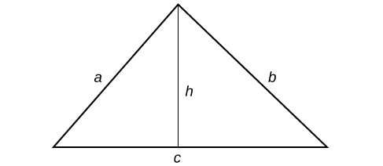
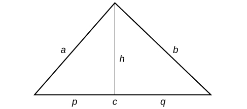
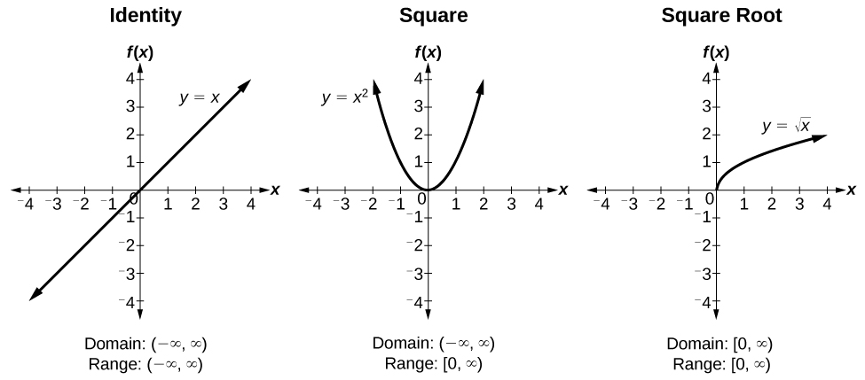
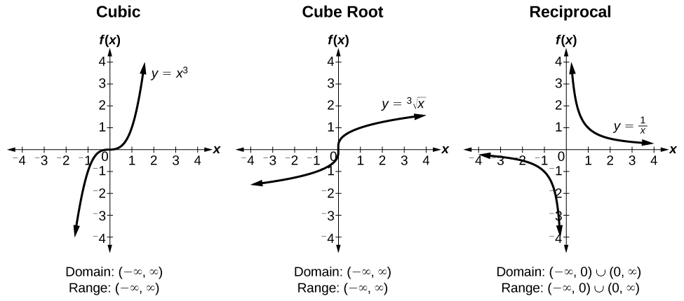
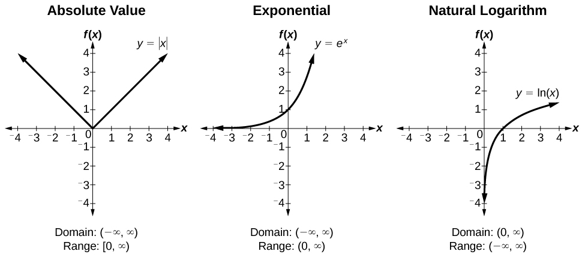

### Appendix

#### Important Proofs and Derivations

**Product Rule**

<math xmlns="http://www.w3.org/1998/Math/MathML"> <mrow> <msub> <mrow> <mi>log</mi> </mrow> <mi>a</mi> </msub> <mi>x</mi><mi>y</mi><mo>=</mo><msub> <mrow> <mi>log</mi> </mrow> <mi>a</mi> </msub> <mi>x</mi><mo>+</mo><msub> <mrow> <mi>log</mi> </mrow> <mi>a</mi> </msub> <mi>y</mi> </mrow> </math>

**Proof:**

Let<math xmlns="http://www.w3.org/1998/Math/MathML"> <mrow> <mtext> </mtext><mi>m</mi><mo>=</mo><msub> <mrow> <mi>log</mi> </mrow> <mi>a</mi> </msub> <mi>x</mi><mtext> </mtext> </mrow> </math>

and<math xmlns="http://www.w3.org/1998/Math/MathML"> <mrow> <mtext> </mtext><mi>n</mi><mo>=</mo><msub> <mrow> <mi>log</mi> </mrow> <mi>a</mi> </msub> <mi>y</mi><mo>.</mo> </mrow> </math>

Write in exponent form.

<math xmlns="http://www.w3.org/1998/Math/MathML"> <mrow> <mi>x</mi><mo>=</mo><msup> <mi>a</mi> <mi>m</mi> </msup> <mtext> </mtext> </mrow> </math>

and<math xmlns="http://www.w3.org/1998/Math/MathML"> <mrow> <mtext> </mtext><mi>y</mi><mo>=</mo><msup> <mi>a</mi> <mi>n</mi> </msup> <mo>.</mo> </mrow> </math>

Multiply.

<math xmlns="http://www.w3.org/1998/Math/MathML"> <mrow> <mi>x</mi><mi>y</mi><mo>=</mo><msup> <mi>a</mi> <mi>m</mi> </msup> <msup> <mi>a</mi> <mi>n</mi> </msup> <mo>=</mo><msup> <mi>a</mi> <mrow> <mi>m</mi><mo>+</mo><mi>n</mi> </mrow> </msup> </mrow> </math>

<math xmlns="http://www.w3.org/1998/Math/MathML"> <mrow> <mtable> <mtr> <mtd columnalign="right"> <mrow> <msup> <mi>a</mi> <mrow> <mi>m</mi><mo>+</mo><mi>n</mi></mrow> </msup> </mrow> </mtd> <mtd> <mo>=</mo> </mtd> <mtd columnalign="left"> <mrow> <mi>x</mi><mi>y</mi></mrow> </mtd> </mtr> <mtr> <mtd columnalign="right"> <mrow> <msub> <mrow> <mi>log</mi></mrow> <mi>a</mi> </msub> <mo stretchy="false">(</mo><mi>x</mi><mi>y</mi><mo stretchy="false">)</mo></mrow> </mtd> <mtd> <mo>=</mo> </mtd> <mtd columnalign="left"> <mrow> <mi>m</mi><mo>+</mo><mi>n</mi></mrow> </mtd> </mtr> <mtr rowalign="center"> <mtd rowalign="center" /> <mtd rowalign="center"> <mo>=</mo> </mtd> <mtd rowalign="center" columnalign="left"> <mrow> <msub> <mrow> <mi>log</mi></mrow> <mi>a</mi> </msub> <mi>x</mi><mo>+</mo><msub> <mrow> <mi>log</mi></mrow> <mi>b</mi> </msub> <mi>y</mi></mrow> </mtd> </mtr> </mtable></mrow> </math>

**Change of Base Rule**

<math xmlns="http://www.w3.org/1998/Math/MathML"> <mrow> <mtable columnalign="left"> <mtr columnalign="left"> <mtd columnalign="left"> <mrow /> </mtd> </mtr> <mtr columnalign="left"> <mtd columnalign="left"> <mrow> <msub> <mrow> <mi>log</mi></mrow> <mi>a</mi> </msub> <mi>b</mi><mo>=</mo><mfrac> <mrow> <msub> <mrow> <mi>log</mi></mrow> <mi>c</mi> </msub> <mi>b</mi></mrow> <mrow> <msub> <mrow> <mi>log</mi></mrow> <mi>c</mi> </msub> <mi>a</mi></mrow> </mfrac> </mrow> </mtd> </mtr> <mtr columnalign="left"> <mtd columnalign="left"> <mrow> <msub> <mrow> <mi>log</mi></mrow> <mi>a</mi> </msub> <mi>b</mi><mo>=</mo><mfrac> <mn>1</mn> <mrow> <msub> <mrow> <mi>log</mi></mrow> <mi>b</mi> </msub> <mi>a</mi></mrow> </mfrac> </mrow> </mtd> </mtr> </mtable></mrow> </math>

where<math xmlns="http://www.w3.org/1998/Math/MathML"> <mrow> <mtext> </mtext><mi>x</mi><mtext> </mtext> </mrow> </math>

and<math xmlns="http://www.w3.org/1998/Math/MathML"> <mrow> <mtext> </mtext><mi>y</mi><mtext> </mtext> </mrow> </math>

are positive, and<math xmlns="http://www.w3.org/1998/Math/MathML"> <mrow> <mtext> </mtext><mi>a</mi><mo>&gt;</mo><mn>0</mn><mo>,</mo><mi>a</mi><mo>≠</mo><mn>1.</mn> </mrow> </math>

**Proof:**

Let<math xmlns="http://www.w3.org/1998/Math/MathML"> <mrow> <mtext> </mtext><mi>x</mi><mo>=</mo><msub> <mrow> <mi>log</mi> </mrow> <mi>a</mi> </msub> <mi>b</mi><mo>.</mo> </mrow> </math>

Write in exponent form.

<math xmlns="http://www.w3.org/1998/Math/MathML"> <mrow> <msup> <mi>a</mi> <mi>x</mi> </msup> <mo>=</mo><mi>b</mi> </mrow> </math>

Take the<math xmlns="http://www.w3.org/1998/Math/MathML"> <mrow> <mtext> </mtext><msub> <mrow> <mi>log</mi> </mrow> <mi>c</mi> </msub> <mtext> </mtext> </mrow> </math>

of both sides.

<math xmlns="http://www.w3.org/1998/Math/MathML"> <mrow> <mtable> <mtr> <mtd columnalign="right"> <mrow> <msub> <mrow> <mi>log</mi></mrow> <mi>c</mi> </msub> <msup> <mi>a</mi> <mi>x</mi> </msup> </mrow> </mtd> <mtd> <mo>=</mo> </mtd> <mtd columnalign="left"> <mrow> <msub> <mrow> <mi>log</mi></mrow> <mi>c</mi> </msub> <mi>b</mi></mrow> </mtd> </mtr> <mtr> <mtd columnalign="right"> <mrow> <mi>x</mi><msub> <mrow> <mi>log</mi></mrow> <mi>c</mi> </msub> <mi>a</mi></mrow> </mtd> <mtd> <mo>=</mo> </mtd> <mtd columnalign="left"> <mrow> <msub> <mrow> <mi>log</mi></mrow> <mi>c</mi> </msub> <mi>b</mi></mrow> </mtd> </mtr> <mtr> <mtd columnalign="right"> <mi>x</mi> </mtd> <mtd> <mo>=</mo> </mtd> <mtd columnalign="left"> <mrow> <mfrac> <mrow> <msub> <mrow> <mi>log</mi></mrow> <mi>c</mi> </msub> <mi>b</mi></mrow> <mrow> <msub> <mrow> <mi>log</mi></mrow> <mi>c</mi> </msub> <mi>a</mi></mrow> </mfrac> </mrow> </mtd> </mtr> <mtr> <mtd columnalign="right"> <mrow> <msub> <mrow> <mi>log</mi></mrow> <mi>a</mi> </msub> <mi>b</mi></mrow> </mtd> <mtd> <mo>=</mo> </mtd> <mtd columnalign="left"> <mrow> <mfrac> <mrow> <msub> <mrow> <mi>log</mi></mrow> <mi>c</mi> </msub> <mi>b</mi></mrow> <mrow> <msub> <mrow> <mi>log</mi></mrow> <mi>a</mi> </msub> <mi>b</mi></mrow> </mfrac> </mrow> </mtd> </mtr> </mtable></mrow> </math>

When<math xmlns="http://www.w3.org/1998/Math/MathML"> <mrow> <mtext> </mtext><mi>c</mi><mo>=</mo><mi>b</mi><mo>,</mo> </mrow> </math>

<math xmlns="http://www.w3.org/1998/Math/MathML"> <mrow> <msub> <mrow> <mi>log</mi> </mrow> <mi>a</mi> </msub> <mi>b</mi><mo>=</mo><mfrac> <mrow> <msub> <mrow> <mi>log</mi> </mrow> <mi>b</mi> </msub> <mi>b</mi> </mrow> <mrow> <msub> <mrow> <mi>log</mi> </mrow> <mi>b</mi> </msub> <mi>a</mi> </mrow> </mfrac> <mo>=</mo><mfrac> <mn>1</mn> <mrow> <msub> <mrow> <mi>log</mi> </mrow> <mi>b</mi> </msub> <mi>a</mi> </mrow> </mfrac> </mrow> </math>

**Heron’s Formula**

<math xmlns="http://www.w3.org/1998/Math/MathML"> <mrow> <mi>A</mi><mo>=</mo><msqrt> <mrow> <mi>s</mi><mrow><mo>(</mo> <mrow> <mi>s</mi><mo>−</mo><mi>a</mi> </mrow> <mo>)</mo></mrow><mrow><mo>(</mo> <mrow> <mi>s</mi><mo>−</mo><mi>b</mi> </mrow> <mo>)</mo></mrow><mrow><mo>(</mo> <mrow> <mi>s</mi><mo>−</mo><mi>c</mi> </mrow> <mo>)</mo></mrow> </mrow> </msqrt> </mrow> </math>

where<math xmlns="http://www.w3.org/1998/Math/MathML"> <mrow> <mtext> </mtext><mi>s</mi><mo>=</mo><mfrac> <mrow> <mi>a</mi><mo>+</mo><mi>b</mi><mo>+</mo><mi>c</mi> </mrow> <mn>2</mn> </mfrac> </mrow> </math>

**Proof:**

Let<math xmlns="http://www.w3.org/1998/Math/MathML"> <mrow> <mtext> </mtext><mi>a</mi><mo>,</mo> </mrow> </math>

<math xmlns="http://www.w3.org/1998/Math/MathML"> <mrow> <mi>b</mi><mo>,</mo> </mrow> </math>

and<math xmlns="http://www.w3.org/1998/Math/MathML"> <mrow> <mtext> </mtext><mi>c</mi><mtext> </mtext> </mrow> </math>

be the sides of a triangle, and<math xmlns="http://www.w3.org/1998/Math/MathML"> <mrow> <mtext> </mtext><mi>h</mi><mtext> </mtext> </mrow> </math>

be the height.

 {: #CNX_CAT_Figure_APP_001}

So<math xmlns="http://www.w3.org/1998/Math/MathML"> <mrow> <mtext> </mtext><mi>s</mi><mo>=</mo><mfrac> <mrow> <mi>a</mi><mo>+</mo><mi>b</mi><mo>+</mo><mi>c</mi> </mrow> <mn>2</mn> </mfrac> </mrow> </math>

.

We can further name the parts of the base in each triangle established by the height such that<math xmlns="http://www.w3.org/1998/Math/MathML"> <mrow> <mtext> </mtext><mi>p</mi><mo>+</mo><mi>q</mi><mo>=</mo><mi>c</mi><mo>.</mo> </mrow> </math>

 {: #CNX_CAT_Figure_APP_002}

Using the Pythagorean Theorem,<math xmlns="http://www.w3.org/1998/Math/MathML"> <mrow> <mtext> </mtext><msup> <mi>h</mi> <mn>2</mn> </msup> <mo>+</mo><msup> <mi>p</mi> <mn>2</mn> </msup> <mo>=</mo><msup> <mi>a</mi> <mn>2</mn> </msup> <mtext> </mtext> </mrow> </math>

and<math xmlns="http://www.w3.org/1998/Math/MathML"> <mrow> <mtext> </mtext><msup> <mi>h</mi> <mn>2</mn> </msup> <mo>+</mo><msup> <mi>q</mi> <mn>2</mn> </msup> <mo>=</mo><msup> <mi>b</mi> <mn>2</mn> </msup> <mo>.</mo> </mrow> </math>

Since<math xmlns="http://www.w3.org/1998/Math/MathML"> <mrow> <mtext> </mtext><mi>q</mi><mo>=</mo><mi>c</mi><mo>−</mo><mi>p</mi><mo>,</mo> </mrow> </math>

then<math xmlns="http://www.w3.org/1998/Math/MathML"> <mrow> <mtext> </mtext><msup> <mi>q</mi> <mn>2</mn> </msup> <mo>=</mo><msup> <mrow> <mrow><mo>(</mo> <mrow> <mi>c</mi><mo>−</mo><mi>p</mi> </mrow> <mo>)</mo></mrow> </mrow> <mn>2</mn> </msup> <mo>.</mo><mtext> </mtext> </mrow> </math>

Expanding, we find that<math xmlns="http://www.w3.org/1998/Math/MathML"> <mrow> <mtext> </mtext><msup> <mi>q</mi> <mn>2</mn> </msup> <mo>=</mo><msup> <mi>c</mi> <mn>2</mn> </msup> <mo>−</mo><mn>2</mn><mi>c</mi><mi>p</mi><mo>+</mo><msup> <mi>p</mi> <mn>2</mn> </msup> <mo>.</mo> </mrow> </math>

We can then add<math xmlns="http://www.w3.org/1998/Math/MathML"> <mrow> <mtext> </mtext><msup> <mi>h</mi> <mn>2</mn> </msup> <mtext> </mtext> </mrow> </math>

to each side of the equation to get<math xmlns="http://www.w3.org/1998/Math/MathML"> <mrow> <mtext> </mtext><msup> <mi>h</mi> <mn>2</mn> </msup> <mo>+</mo><msup> <mi>q</mi> <mn>2</mn> </msup> <mo>=</mo><msup> <mi>h</mi> <mn>2</mn> </msup> <mo>+</mo><msup> <mi>c</mi> <mn>2</mn> </msup> <mo>−</mo><mn>2</mn><mi>c</mi><mi>p</mi><mo>+</mo><msup> <mi>p</mi> <mn>2</mn> </msup> <mo>.</mo> </mrow> </math>

Substitute this result into the equation<math xmlns="http://www.w3.org/1998/Math/MathML"> <mrow> <mtext> </mtext><msup> <mi>h</mi> <mn>2</mn> </msup> <mo>+</mo><msup> <mi>q</mi> <mn>2</mn> </msup> <mo>=</mo><msup> <mi>b</mi> <mn>2</mn> </msup> <mtext> </mtext> </mrow> </math>

yields<math xmlns="http://www.w3.org/1998/Math/MathML"> <mrow> <mtext> </mtext><msup> <mi>b</mi> <mn>2</mn> </msup> <mo>=</mo><msup> <mi>h</mi> <mn>2</mn> </msup> <mo>+</mo><msup> <mi>c</mi> <mn>2</mn> </msup> <mo>−</mo><mn>2</mn><mi>c</mi><mi>p</mi><mo>+</mo><msup> <mi>p</mi> <mn>2</mn> </msup> <mo>.</mo> </mrow> </math>

Then replacing<math xmlns="http://www.w3.org/1998/Math/MathML"> <mrow> <mtext> </mtext><msup> <mi>h</mi> <mn>2</mn> </msup> <mo>+</mo><msup> <mi>p</mi> <mn>2</mn> </msup> <mtext> </mtext> </mrow> </math>

with<math xmlns="http://www.w3.org/1998/Math/MathML"> <mrow> <mtext> </mtext><msup> <mi>a</mi> <mn>2</mn> </msup> <mtext> </mtext> </mrow> </math>

gives<math xmlns="http://www.w3.org/1998/Math/MathML"> <mrow> <mtext> </mtext><msup> <mi>b</mi> <mn>2</mn> </msup> <mo>=</mo><msup> <mi>a</mi> <mn>2</mn> </msup> <mo>−</mo><mn>2</mn><mi>c</mi><mi>p</mi><mo>+</mo><msup> <mi>c</mi> <mn>2</mn> </msup> <mo>.</mo> </mrow> </math>

Solve for<math xmlns="http://www.w3.org/1998/Math/MathML"> <mrow> <mtext> </mtext><mi>p</mi><mtext> </mtext> </mrow> </math>

to get

<math xmlns="http://www.w3.org/1998/Math/MathML"> <mrow> <mi>p</mi><mo>=</mo><mfrac> <mrow> <msup> <mi>a</mi> <mn>2</mn> </msup> <mo>+</mo><msup> <mi>b</mi> <mn>2</mn> </msup> <mo>−</mo><msup> <mi>c</mi> <mn>2</mn> </msup> </mrow> <mrow> <mn>2</mn><mi>c</mi> </mrow> </mfrac> </mrow> </math>

Since<math xmlns="http://www.w3.org/1998/Math/MathML"> <mrow> <mtext> </mtext><msup> <mi>h</mi> <mn>2</mn> </msup> <mo>=</mo><msup> <mi>a</mi> <mn>2</mn> </msup> <mo>−</mo><msup> <mi>p</mi> <mn>2</mn> </msup> <mo>,</mo> </mrow> </math>

we get an expression in terms of<math xmlns="http://www.w3.org/1998/Math/MathML"> <mrow> <mtext> </mtext><mi>a</mi><mo>,</mo> </mrow> </math>

<math xmlns="http://www.w3.org/1998/Math/MathML"> <mrow> <mi>b</mi><mo>,</mo> </mrow> </math>

and <math xmlns="http://www.w3.org/1998/Math/MathML"> <mrow> <mtext> </mtext><mi>c</mi><mo>.</mo> </mrow> </math>

<math xmlns="http://www.w3.org/1998/Math/MathML"> <mrow> <mtable> <mtr rowalign="center"> <mtd rowalign="center" columnalign="right"> <mrow> <msup> <mi>h</mi> <mn>2</mn> </msup> </mrow> </mtd> <mtd rowalign="center"> <mo>=</mo> </mtd> <mtd rowalign="center" columnalign="left"> <mrow> <msup> <mi>a</mi> <mn>2</mn> </msup> <mo>−</mo><msup> <mi>p</mi> <mn>2</mn> </msup> </mrow> </mtd> </mtr> <mtr rowalign="center"> <mtd rowalign="center" /> <mtd rowalign="center"> <mo>=</mo> </mtd> <mtd rowalign="center" columnalign="left"> <mrow> <mo stretchy="false">(</mo><mi>a</mi><mo>+</mo><mi>p</mi><mo stretchy="false">)</mo><mo stretchy="false">(</mo><mi>a</mi><mo>−</mo><mi>p</mi><mo stretchy="false">)</mo></mrow> </mtd> </mtr> <mtr rowalign="center"> <mtd rowalign="center" /> <mtd rowalign="center"> <mo>=</mo> </mtd> <mtd rowalign="center" columnalign="left"> <mrow> <mrow><mo>[</mo> <mrow> <mi>a</mi><mo>+</mo><mfrac> <mrow> <mrow><mo>(</mo> <mrow> <msup> <mi>a</mi> <mn>2</mn> </msup> <mo>+</mo><msup> <mi>c</mi> <mn>2</mn> </msup> <mo>−</mo><msup> <mi>b</mi> <mn>2</mn> </msup> </mrow> <mo>)</mo></mrow></mrow> <mrow> <mn>2</mn><mi>c</mi></mrow> </mfrac> </mrow> <mo>]</mo></mrow><mrow><mo>[</mo> <mrow> <mi>a</mi><mo>−</mo><mfrac> <mrow> <mrow><mo>(</mo> <mrow> <msup> <mi>a</mi> <mn>2</mn> </msup> <mo>+</mo><msup> <mi>c</mi> <mn>2</mn> </msup> <mo>−</mo><msup> <mi>b</mi> <mn>2</mn> </msup> </mrow> <mo>)</mo></mrow></mrow> <mrow> <mn>2</mn><mi>c</mi></mrow> </mfrac> </mrow> <mo>]</mo></mrow></mrow> </mtd> </mtr> <mtr rowalign="center"> <mtd rowalign="center" /> <mtd rowalign="center"> <mo>=</mo> </mtd> <mtd rowalign="center" columnalign="left"> <mrow> <mfrac> <mrow> <mrow><mo>(</mo> <mrow> <mn>2</mn><mi>a</mi><mi>c</mi><mo>+</mo><msup> <mi>a</mi> <mn>2</mn> </msup> <mo>+</mo><msup> <mi>c</mi> <mn>2</mn> </msup> <mo>−</mo><msup> <mi>b</mi> <mn>2</mn> </msup> </mrow> <mo>)</mo></mrow><mrow><mo>(</mo> <mrow> <mn>2</mn><mi>a</mi><mi>c</mi><mo>−</mo><msup> <mi>a</mi> <mn>2</mn> </msup> <mo>−</mo><msup> <mi>c</mi> <mn>2</mn> </msup> <mo>+</mo><msup> <mi>b</mi> <mn>2</mn> </msup> </mrow> <mo>)</mo></mrow></mrow> <mrow> <mn>4</mn><msup> <mi>c</mi> <mn>2</mn> </msup> </mrow> </mfrac> </mrow> </mtd> </mtr> <mtr rowalign="center"> <mtd rowalign="center" /> <mtd rowalign="center"><mo>=</mo></mtd> <mtd rowalign="center" columnalign="left"> <mrow> <mfrac> <mrow> <mrow><mo>(</mo> <mrow> <msup> <mrow> <mo stretchy="false">(</mo><mi>a</mi><mo>+</mo><mi>c</mi><mo stretchy="false">)</mo></mrow> <mn>2</mn> </msup> <mo>−</mo><msup> <mi>b</mi> <mn>2</mn> </msup> </mrow> <mo>)</mo></mrow><mrow><mo>(</mo> <mrow> <msup> <mi>b</mi> <mn>2</mn> </msup> <mo>−</mo><msup> <mrow> <mo stretchy="false">(</mo><mi>a</mi><mo>−</mo><mi>c</mi><mo stretchy="false">)</mo></mrow> <mn>2</mn> </msup> </mrow> <mo>)</mo></mrow></mrow> <mrow> <mn>4</mn><msup> <mi>c</mi> <mn>2</mn> </msup> </mrow> </mfrac> </mrow> </mtd> </mtr> <mtr rowalign="center"> <mtd rowalign="center" /> <mtd rowalign="center"><mo>=</mo></mtd> <mtd rowalign="center" columnalign="left"> <mrow> <mfrac> <mrow> <mo stretchy="false">(</mo><mi>a</mi><mo>+</mo><mi>b</mi><mo>+</mo><mi>c</mi><mo stretchy="false">)</mo><mo stretchy="false">(</mo><mi>a</mi><mo>+</mo><mi>c</mi><mo>−</mo><mi>b</mi><mo stretchy="false">)</mo><mo stretchy="false">(</mo><mi>b</mi><mo>+</mo><mi>a</mi><mo>−</mo><mi>c</mi><mo stretchy="false">)</mo><mo stretchy="false">(</mo><mi>b</mi><mo>−</mo><mi>a</mi><mo>+</mo><mi>c</mi><mo stretchy="false">)</mo></mrow> <mrow> <mn>4</mn><msup> <mi>c</mi> <mn>2</mn> </msup> </mrow> </mfrac> </mrow> </mtd> </mtr> <mtr rowalign="center"> <mtd rowalign="center" /> <mtd rowalign="center"><mo>=</mo></mtd> <mtd rowalign="center" columnalign="left"> <mrow> <mfrac> <mrow> <mo stretchy="false">(</mo><mi>a</mi><mo>+</mo><mi>b</mi><mo>+</mo><mi>c</mi><mo stretchy="false">)</mo><mo stretchy="false">(</mo><mo>−</mo><mi>a</mi><mo>+</mo><mi>b</mi><mo>+</mo><mi>c</mi><mo stretchy="false">)</mo><mo stretchy="false">(</mo><mi>a</mi><mo>−</mo><mi>b</mi><mo>+</mo><mi>c</mi><mo stretchy="false">)</mo><mo stretchy="false">(</mo><mi>a</mi><mo>+</mo><mi>b</mi><mo>−</mo><mi>c</mi><mo stretchy="false">)</mo></mrow> <mrow> <mn>4</mn><msup> <mi>c</mi> <mn>2</mn> </msup> </mrow> </mfrac> </mrow> </mtd> </mtr> <mtr rowalign="center"> <mtd rowalign="center" /> <mtd rowalign="center"> <mo>=</mo> </mtd> <mtd rowalign="center" columnalign="left"> <mrow> <mfrac> <mrow> <mn>2</mn><mi>s</mi><mo>⋅</mo><mo stretchy="false">(</mo><mn>2</mn><mi>s</mi><mo>−</mo><mi>a</mi><mo stretchy="false">)</mo><mo>⋅</mo><mo stretchy="false">(</mo><mn>2</mn><mi>s</mi><mo>−</mo><mi>b</mi><mo stretchy="false">)</mo><mo stretchy="false">(</mo><mn>2</mn><mi>s</mi><mo>−</mo><mi>c</mi><mo stretchy="false">)</mo></mrow> <mrow> <mn>4</mn><msup> <mi>c</mi> <mn>2</mn> </msup> </mrow> </mfrac> </mrow> </mtd> </mtr> </mtable></mrow> </math>

Therefore,

<math xmlns="http://www.w3.org/1998/Math/MathML"> <mrow> <mtable> <mtr> <mtd columnalign="right"> <mrow> <msup> <mi>h</mi> <mn>2</mn> </msup> </mrow> </mtd> <mtd> <mo>=</mo> </mtd> <mtd columnalign="left"> <mrow> <mfrac> <mrow> <mn>4</mn><mi>s</mi><mo stretchy="false">(</mo><mi>s</mi><mo>−</mo><mi>a</mi><mo stretchy="false">)</mo><mo stretchy="false">(</mo><mi>s</mi><mo>−</mo><mi>b</mi><mo stretchy="false">)</mo><mo stretchy="false">(</mo><mi>s</mi><mo>−</mo><mi>c</mi><mo stretchy="false">)</mo></mrow> <mrow> <msup> <mi>c</mi> <mn>2</mn> </msup> </mrow> </mfrac> </mrow> </mtd> </mtr> <mtr> <mtd columnalign="right"> <mi>h</mi> </mtd> <mtd> <mo>=</mo> </mtd> <mtd columnalign="left"> <mrow> <mfrac> <mrow> <mn>2</mn><msqrt> <mrow> <mi>s</mi><mo stretchy="false">(</mo><mi>s</mi><mo>−</mo><mi>a</mi><mo stretchy="false">)</mo><mo stretchy="false">(</mo><mi>s</mi><mo>−</mo><mi>b</mi><mo stretchy="false">)</mo><mo stretchy="false">(</mo><mi>s</mi><mo>−</mo><mi>c</mi><mo stretchy="false">)</mo></mrow> </msqrt> </mrow> <mi>c</mi> </mfrac> </mrow> </mtd> </mtr> </mtable></mrow> </math>

And since<math xmlns="http://www.w3.org/1998/Math/MathML"> <mrow> <mtext> </mtext><mi>A</mi><mo>=</mo><mfrac> <mn>1</mn> <mn>2</mn> </mfrac> <mi>c</mi><mi>h</mi><mo>,</mo> </mrow> </math>

then

<math xmlns="http://www.w3.org/1998/Math/MathML"> <mrow> <mtable> <mtr rowalign="center"> <mtd columnalign="right" rowalign="center"> <mi>A</mi> </mtd> <mtd rowalign="center"> <mo>=</mo> </mtd> <mtd rowalign="center" columnalign="left"> <mrow> <mfrac> <mn>1</mn> <mn>2</mn> </mfrac> <mi>c</mi><mfrac> <mrow> <mn>2</mn><msqrt> <mrow> <mi>s</mi><mo stretchy="false">(</mo><mi>s</mi><mo>−</mo><mi>a</mi><mo stretchy="false">)</mo><mo stretchy="false">(</mo><mi>s</mi><mo>−</mo><mi>b</mi><mo stretchy="false">)</mo><mo stretchy="false">(</mo><mi>s</mi><mo>−</mo><mi>c</mi><mo stretchy="false">)</mo></mrow> </msqrt> </mrow> <mi>c</mi> </mfrac> </mrow> </mtd> </mtr> <mtr rowalign="center"> <mtd rowalign="center" /> <mtd rowalign="center"> <mo>=</mo> </mtd> <mtd rowalign="center" columnalign="left"> <mrow> <msqrt> <mrow> <mi>s</mi><mo stretchy="false">(</mo><mi>s</mi><mo>−</mo><mi>a</mi><mo stretchy="false">)</mo><mo stretchy="false">(</mo><mi>s</mi><mo>−</mo><mi>b</mi><mo stretchy="false">)</mo><mo stretchy="false">(</mo><mi>s</mi><mo>−</mo><mi>c</mi><mo stretchy="false">)</mo></mrow> </msqrt> </mrow> </mtd> </mtr> </mtable></mrow> </math>

**Properties of the Dot Product**

<math xmlns="http://www.w3.org/1998/Math/MathML"> <mrow> <mi>u</mi><mo>·</mo><mi>v</mi><mo>=</mo><mi>v</mi><mo>·</mo><mi>u</mi> </mrow> </math>

**Proof:**

<math xmlns="http://www.w3.org/1998/Math/MathML"> <mrow> <mtable> <mtr> <mtd columnalign="right"> <mrow> <mi>u</mi><mo>·</mo><mi>v</mi></mrow> </mtd> <mtd columnalign="left"> <mrow> <mo>=</mo><mo>〈</mo><msub> <mi>u</mi> <mn>1</mn> </msub> <mo>,</mo><msub> <mi>u</mi> <mn>2</mn> </msub> <mo>,</mo><mn>...</mn><msub> <mi>u</mi> <mi>n</mi> </msub> <mo>〉</mo><mo>·</mo><mo>〈</mo><msub> <mi>v</mi> <mn>1</mn> </msub> <mo>,</mo><msub> <mi>v</mi> <mn>2</mn> </msub> <mo>,</mo><mn>...</mn><msub> <mi>v</mi> <mi>n</mi> </msub> <mo>〉</mo></mrow> </mtd> </mtr> <mtr> <mtd> <mrow /> </mtd> <mtd columnalign="left" rowalign="center"> <mrow> <mo>=</mo><msub> <mi>u</mi> <mn>1</mn> </msub> <msub> <mi>v</mi> <mn>1</mn> </msub> <mo>+</mo><msub> <mi>u</mi> <mn>2</mn> </msub> <msub> <mi>v</mi> <mn>2</mn> </msub> <mo>+</mo><mn>...</mn><mo>+</mo><msub> <mi>u</mi> <mi>n</mi> </msub> <msub> <mi>v</mi> <mi>n</mi> </msub> </mrow> </mtd> </mtr> <mtr> <mtd> <mrow /> </mtd> <mtd columnalign="left" rowalign="center"> <mrow> <mo>=</mo><msub> <mi>v</mi> <mn>1</mn> </msub> <msub> <mi>u</mi> <mn>1</mn> </msub> <mo>+</mo><msub> <mi>v</mi> <mn>2</mn> </msub> <msub> <mi>u</mi> <mn>2</mn> </msub> <mo>+</mo><mn>...</mn><mo>+</mo><msub> <mi>v</mi> <mi>n</mi> </msub> <msub> <mi>v</mi> <mi>n</mi> </msub> </mrow> </mtd> </mtr> <mtr> <mtd> <mrow /> </mtd> <mtd columnalign="left" rowalign="center"> <mrow> <mo>=</mo><mo>〈</mo><msub> <mi>v</mi> <mn>1</mn> </msub> <mo>,</mo><msub> <mi>v</mi> <mn>2</mn> </msub> <mo>,</mo><mn>...</mn><msub> <mi>v</mi> <mi>n</mi> </msub> <mo>〉</mo><mo>·</mo><mo>〈</mo><msub> <mi>u</mi> <mn>1</mn> </msub> <mo>,</mo><msub> <mi>u</mi> <mn>2</mn> </msub> <mo>,</mo><mn>...</mn><msub> <mi>u</mi> <mi>n</mi> </msub> <mo>〉</mo></mrow> </mtd> </mtr> <mtr> <mtd> <mrow /> </mtd> <mtd columnalign="left" rowalign="center"> <mrow> <mo>=</mo><mi>v</mi><mo>·</mo><mi>u</mi></mrow> </mtd> </mtr> </mtable></mrow> </math>

<math xmlns="http://www.w3.org/1998/Math/MathML"> <mrow> <mi>u</mi><mo>·</mo><mrow><mo>(</mo> <mrow> <mi>v</mi><mo>+</mo><mi>w</mi> </mrow> <mo>)</mo></mrow><mo>=</mo><mi>u</mi><mo>·</mo><mi>v</mi><mo>+</mo><mi>u</mi><mo>·</mo><mi>w</mi> </mrow> </math>

**Proof:**

<math xmlns="http://www.w3.org/1998/Math/MathML"> <mrow> <mtable> <mtr> <mtd columnalign="right"> <mrow> <mi>u</mi><mo>·</mo><mo stretchy="false">(</mo><mi>v</mi><mo>+</mo><mi>w</mi><mo stretchy="false">)</mo></mrow> </mtd> <mtd columnalign="left"> <mrow> <mo>=</mo><mo>〈</mo><msub> <mi>u</mi> <mn>1</mn> </msub> <mo>,</mo><msub> <mi>u</mi> <mn>2</mn> </msub> <mo>,</mo><mn>...</mn><msub> <mi>u</mi> <mi>n</mi> </msub> <mo>〉</mo><mo>·</mo><mrow><mo>(</mo> <mrow> <mo>〈</mo><msub> <mi>v</mi> <mn>1</mn> </msub> <mo>,</mo><msub> <mi>v</mi> <mn>2</mn> </msub> <mo>,</mo><mn>...</mn><msub> <mi>v</mi> <mi>n</mi> </msub> <mo>〉</mo><mo>+</mo><mo>〈</mo><msub> <mi>w</mi> <mn>1</mn> </msub> <mo>,</mo><msub> <mi>w</mi> <mn>2</mn> </msub> <mo>,</mo><mn>...</mn><msub> <mi>w</mi> <mi>n</mi> </msub> <mo>〉</mo></mrow> <mo>)</mo></mrow></mrow> </mtd> </mtr> <mtr> <mtd><mrow /></mtd> <mtd columnalign="left" rowalign="center"> <mrow> <mo>=</mo><mo>〈</mo><msub> <mi>u</mi> <mn>1</mn> </msub> <mo>,</mo><msub> <mi>u</mi> <mn>2</mn> </msub> <mo>,</mo><mn>...</mn><msub> <mi>u</mi> <mi>n</mi> </msub> <mo>〉</mo><mo>·</mo><mo>〈</mo><msub> <mi>v</mi> <mn>1</mn> </msub> <mo>+</mo><msub> <mi>w</mi> <mn>1</mn> </msub> <mo>,</mo><msub> <mi>v</mi> <mn>2</mn> </msub> <mo>+</mo><msub> <mi>w</mi> <mn>2</mn> </msub> <mo>,</mo><mn>...</mn><msub> <mi>v</mi> <mi>n</mi> </msub> <mo>+</mo><msub> <mi>w</mi> <mi>n</mi> </msub> <mo>〉</mo></mrow> </mtd> </mtr> <mtr> <mtd> <mrow /> </mtd> <mtd columnalign="left" rowalign="center"> <mrow> <mo>=</mo><mo>〈</mo><msub> <mi>u</mi> <mn>1</mn> </msub> <mo stretchy="false">(</mo><msub> <mi>v</mi> <mn>1</mn> </msub> <mo>+</mo><msub> <mi>w</mi> <mn>1</mn> </msub> <mo stretchy="false">)</mo><mo>,</mo><msub> <mi>u</mi> <mn>2</mn> </msub> <mo stretchy="false">(</mo><msub> <mi>v</mi> <mn>2</mn> </msub> <mo>+</mo><msub> <mi>w</mi> <mn>2</mn> </msub> <mo stretchy="false">)</mo><mo>,</mo><mn>...</mn><msub> <mi>u</mi> <mi>n</mi> </msub> <mo stretchy="false">(</mo><msub> <mi>v</mi> <mi>n</mi> </msub> <mo>+</mo><msub> <mi>w</mi> <mi>n</mi> </msub> <mo stretchy="false">)</mo><mo>〉</mo></mrow> </mtd> </mtr> <mtr> <mtd> <mrow /> </mtd> <mtd columnalign="left" rowalign="center"> <mrow> <mo>=</mo><mo>〈</mo><msub> <mi>u</mi> <mn>1</mn> </msub> <msub> <mi>v</mi> <mn>1</mn> </msub> <mo>+</mo><msub> <mi>u</mi> <mn>1</mn> </msub> <msub> <mi>w</mi> <mn>1</mn> </msub> <mo>,</mo><msub> <mi>u</mi> <mn>2</mn> </msub> <msub> <mi>v</mi> <mn>2</mn> </msub> <mo>+</mo><msub> <mi>u</mi> <mn>2</mn> </msub> <msub> <mi>w</mi> <mn>2</mn> </msub> <mo>,</mo><mn>...</mn><msub> <mi>u</mi> <mi>n</mi> </msub> <msub> <mi>v</mi> <mi>n</mi> </msub> <mo>+</mo><msub> <mi>u</mi> <mi>n</mi> </msub> <msub> <mi>w</mi> <mi>n</mi> </msub> <mo>〉</mo></mrow> </mtd> </mtr> <mtr> <mtd> <mrow /> </mtd> <mtd columnalign="left" rowalign="center"> <mrow> <mo>=</mo><mo>〈</mo><msub> <mi>u</mi> <mn>1</mn> </msub> <msub> <mi>v</mi> <mn>1</mn> </msub> <mo>,</mo><msub> <mi>u</mi> <mn>2</mn> </msub> <msub> <mi>v</mi> <mn>2</mn> </msub> <mo>,</mo><mn>...</mn><mo>,</mo><msub> <mi>u</mi> <mi>n</mi> </msub> <msub> <mi>v</mi> <mi>n</mi> </msub> <mo>〉</mo><mo>+</mo><mo>〈</mo><msub> <mi>u</mi> <mn>1</mn> </msub> <msub> <mi>w</mi> <mn>1</mn> </msub> <mo>,</mo><msub> <mi>u</mi> <mn>2</mn> </msub> <msub> <mi>w</mi> <mn>2</mn> </msub> <mo>,</mo><mn>...</mn><mo>,</mo><msub> <mi>u</mi> <mi>n</mi> </msub> <msub> <mi>w</mi> <mi>n</mi> </msub> <mo>〉</mo></mrow> </mtd> </mtr> <mtr> <mtd> <mrow /> </mtd> <mtd columnalign="left" rowalign="center"> <mrow> <mo>=</mo><mo>〈</mo><msub> <mi>u</mi> <mn>1</mn> </msub> <mo>,</mo><msub> <mi>u</mi> <mn>2</mn> </msub> <mo>,</mo><mn>...</mn><msub> <mi>u</mi> <mi>n</mi> </msub> <mo>〉</mo><mo>·</mo><mo>〈</mo><msub> <mi>v</mi> <mn>1</mn> </msub> <mo>,</mo><msub> <mi>v</mi> <mn>2</mn> </msub> <mo>,</mo><mn>...</mn><msub> <mi>v</mi> <mi>n</mi> </msub> <mo>〉</mo><mo>+</mo><mo>〈</mo><msub> <mi>u</mi> <mn>1</mn> </msub> <mo>,</mo><msub> <mi>u</mi> <mn>2</mn> </msub> <mo>,</mo><mn>...</mn><msub> <mi>u</mi> <mi>n</mi> </msub> <mo>〉</mo><mo>·</mo><mo>〈</mo><msub> <mi>w</mi> <mn>1</mn> </msub> <mo>,</mo><msub> <mi>w</mi> <mn>2</mn> </msub> <mo>,</mo><mn>...</mn><msub> <mi>w</mi> <mi>n</mi> </msub> <mo>〉</mo></mrow> </mtd> </mtr> <mtr> <mtd> <mrow /> </mtd> <mtd columnalign="left" rowalign="center"> <mrow> <mo>=</mo><mi>u</mi><mo>·</mo><mi>v</mi><mo>+</mo><mi>u</mi><mo>·</mo><mi>w</mi></mrow> </mtd> </mtr> </mtable></mrow> </math>

<math xmlns="http://www.w3.org/1998/Math/MathML"> <mrow> <mi>u</mi><mo>·</mo><mi>u</mi><mo>=</mo><msup> <mrow> <mrow><mo>\|</mo> <mi>u</mi> <mo>\|</mo></mrow> </mrow> <mn>2</mn> </msup> </mrow> </math>

**Proof:**

<math xmlns="http://www.w3.org/1998/Math/MathML"> <mrow> <mtable> <mtr> <mtd columnalign="right"> <mrow> <mi>u</mi><mo>·</mo><mi>u</mi></mrow> </mtd> <mtd columnalign="left"> <mrow> <mo>=</mo><mo>〈</mo><msub> <mi>u</mi> <mn>1</mn> </msub> <mo>,</mo><msub> <mi>u</mi> <mn>2</mn> </msub> <mo>,</mo><mn>...</mn><msub> <mi>u</mi> <mi>n</mi> </msub> <mo>〉</mo><mo>·</mo><mo>〈</mo><msub> <mi>u</mi> <mn>1</mn> </msub> <mo>,</mo><msub> <mi>u</mi> <mn>2</mn> </msub> <mo>,</mo><mn>...</mn><msub> <mi>u</mi> <mi>n</mi> </msub> <mo>〉</mo></mrow> </mtd> </mtr> <mtr> <mtd> <mrow /> </mtd> <mtd columnalign="left" rowalign="center"> <mrow> <mo>=</mo><msub> <mi>u</mi> <mn>1</mn> </msub> <msub> <mi>u</mi> <mn>1</mn> </msub> <mo>+</mo><msub> <mi>u</mi> <mn>2</mn> </msub> <msub> <mi>u</mi> <mn>2</mn> </msub> <mo>+</mo><mn>...</mn><mo>+</mo><msub> <mi>u</mi> <mi>n</mi> </msub> <msub> <mi>u</mi> <mi>n</mi> </msub> </mrow> </mtd> </mtr> <mtr> <mtd> <mrow /> </mtd> <mtd columnalign="left" rowalign="center"> <mrow> <mo>=</mo><msub> <mi>u</mi> <mn>1</mn> </msub> <msup> <mrow /> <mn>2</mn> </msup> <mo>+</mo><msub> <mi>u</mi> <mn>2</mn> </msub> <msup> <mrow /> <mn>2</mn> </msup> <mo>+</mo><mn>...</mn><mo>+</mo><msub> <mi>u</mi> <mi>n</mi> </msub> <msup> <mrow /> <mn>2</mn> </msup> </mrow> </mtd> </mtr> <mtr> <mtd> <mrow /> </mtd> <mtd columnalign="left" rowalign="center"> <mrow> <mo>=</mo><mo>\|</mo><mo>〈</mo><msub> <mi>u</mi> <mn>1</mn> </msub> <mo>,</mo><msub> <mi>u</mi> <mn>2</mn> </msub> <mo>,</mo><mn>...</mn><msub> <mi>u</mi> <mi>n</mi> </msub> <mo>〉</mo><msup> <mo>\|</mo> <mn>2</mn> </msup> </mrow> </mtd> </mtr> <mtr> <mtd> <mrow /> </mtd> <mtd columnalign="left" rowalign="center"> <mrow> <mo>=</mo><mi>v</mi><mo>·</mo><mi>u</mi></mrow> </mtd> </mtr> </mtable></mrow> </math>

**Standard Form of the Ellipse centered at the Origin**

<math xmlns="http://www.w3.org/1998/Math/MathML"> <mrow> <mn>1</mn><mo>=</mo><mfrac> <mrow> <msup> <mi>x</mi> <mn>2</mn> </msup> </mrow> <mrow> <msup> <mi>a</mi> <mn>2</mn> </msup> </mrow> </mfrac> <mo>+</mo><mfrac> <mrow> <msup> <mi>y</mi> <mn>2</mn> </msup> </mrow> <mrow> <msup> <mi>b</mi> <mn>2</mn> </msup> </mrow> </mfrac> </mrow> </math>

**Derivation**

An ellipse consists of all the points for which the sum of distances from two foci is constant:

<math xmlns="http://www.w3.org/1998/Math/MathML"> <mrow> <msqrt> <mrow> <msup> <mrow> <mrow><mo>(</mo> <mrow> <mi>x</mi><mo>−</mo><mrow><mo>(</mo> <mrow> <mo>−</mo><mi>c</mi> </mrow> <mo>)</mo></mrow> </mrow> <mo>)</mo></mrow> </mrow> <mn>2</mn> </msup> <mo>+</mo><msup> <mrow> <mrow><mo>(</mo> <mrow> <mi>y</mi><mo>−</mo><mn>0</mn> </mrow> <mo>)</mo></mrow> </mrow> <mn>2</mn> </msup> </mrow> </msqrt> <mo>+</mo><msqrt> <mrow> <msup> <mrow> <mrow><mo>(</mo> <mrow> <mi>x</mi><mo>−</mo><mi>c</mi> </mrow> <mo>)</mo></mrow> </mrow> <mn>2</mn> </msup> <mo>+</mo><msup> <mrow> <mrow><mo>(</mo> <mrow> <mi>y</mi><mo>−</mo><mn>0</mn> </mrow> <mo>)</mo></mrow> </mrow> <mn>2</mn> </msup> </mrow> </msqrt> <mo>=</mo><mtext>constant</mtext> </mrow> </math>

 ![An ellipse centered at the origin on an x, y-coordinate plane.  Points C1 and C2 are plotted at the points (0, b) and (0, -b) respectively; these points appear on the ellipse.  Points V1 and V2 are plotted at the points (-a, 0) and (a, 0) respectively; these points appear on the ellipse.  Points F1 and F2 are plotted at the points (-c, 0) and (c, 0) respectively; these points appear on the x-axis, but not the ellipse. The point (x, y) appears on the ellipse in the first quadrant.  Dotted lines extend from F1 and F2 to the point (x, y).](../resources/CNX_CAT_Figure_APP_003N.jpg){: #CNX_CAT_Figure_APP_003}

Consider a vertex.

 ![An ellipse centered at the origin.  The points C1 and C2 are plotted at the points (0, b) and (0, -b) respectively; these points are on the ellipse.  The points V1 and V2 are plotted at the points (-a, 0) and (a, 0) respectively; these points are on the ellipse.  The points F1 and F2 are plotted at the points (-c, 0) and (c, 0) respectively; these points are on the x-axis and not on the ellipse.  A line extends from the point F1 to a point (x, y) which is at the point (a, 0).  A line extends from the point F2 to the point (x, y) as well.](../resources/CNX_CAT_Figure_APP_004.jpg){: #CNX_CAT_Figure_APP_004}

Then,<math xmlns="http://www.w3.org/1998/Math/MathML"> <mrow> <mtext> </mtext><msqrt> <mrow> <msup> <mrow> <mrow><mo>(</mo> <mrow> <mi>x</mi><mo>−</mo><mrow><mo>(</mo> <mrow> <mo>−</mo><mi>c</mi> </mrow> <mo>)</mo></mrow> </mrow> <mo>)</mo></mrow> </mrow> <mn>2</mn> </msup> <mo>+</mo><msup> <mrow> <mrow><mo>(</mo> <mrow> <mi>y</mi><mo>−</mo><mn>0</mn> </mrow> <mo>)</mo></mrow> </mrow> <mn>2</mn> </msup> </mrow> </msqrt> <mo>+</mo><msqrt> <mrow> <msup> <mrow> <mrow><mo>(</mo> <mrow> <mi>x</mi><mo>−</mo><mi>c</mi> </mrow> <mo>)</mo></mrow> </mrow> <mn>2</mn> </msup> <mo>+</mo><msup> <mrow> <mrow><mo>(</mo> <mrow> <mi>y</mi><mo>−</mo><mn>0</mn> </mrow> <mo>)</mo></mrow> </mrow> <mn>2</mn> </msup> </mrow> </msqrt> <mo>=</mo><mn>2</mn><mi>a</mi> </mrow> </math>

Consider a covertex.

 ![An ellipse centered at the origin.  The points C1 and C2 are plotted at the points (0, b) and (0, -b) respectively; these points are on the ellipse.  The points V1 and V2 are plotted at the points (-a, 0) and (a, 0) respectively; these points are on the ellipse.  The points F1 and F2 are plotted at the points (-c, 0) and (c, 0) respectively; these points are on the x-axis and not on the ellipse.  There is a point (x, y) which is plotted at (0, b). A line extends from the origin to the point (c, 0), this line is labeled: c.  A line extends from the origin to the point (x, y), this line is labeled: b.  A line extends from the point (c, 0) to the point (x, y); this line is labeled: (1/2)(2a)=a.  A dotted line extends from the point (-c, 0) to the point (x, y); this line is labeled: (1/2)(2a)=a.](../resources/CNX_CAT_Figure_APP_005.jpg){: #CNX_CAT_Figure_APP_005}

Then<math xmlns="http://www.w3.org/1998/Math/MathML"> <mrow> <mtext> </mtext><msup> <mi>b</mi> <mn>2</mn> </msup> <mo>+</mo><msup> <mi>c</mi> <mn>2</mn> </msup> <mo>=</mo><msup> <mi>a</mi> <mn>2</mn> </msup> <mo>.</mo> </mrow> </math>

<math xmlns="http://www.w3.org/1998/Math/MathML" display="block"> <mrow> <mtable> <mtr> <mtd columnalign="right"> <mrow> <msqrt> <mrow> <msup> <mrow> <mo stretchy="false">(</mo><mi>x</mi><mo>−</mo><mo stretchy="false">(</mo><mo>−</mo><mi>c</mi><mo stretchy="false">)</mo><mo stretchy="false">)</mo></mrow> <mn>2</mn> </msup> <mo>+</mo><msup> <mrow> <mo stretchy="false">(</mo><mi>y</mi><mo>−</mo><mn>0</mn><mo stretchy="false">)</mo></mrow> <mn>2</mn> </msup> </mrow> </msqrt> <mo>+</mo><msqrt> <mrow> <msup> <mrow> <mo stretchy="false">(</mo><mi>x</mi><mo>−</mo><mi>c</mi><mo stretchy="false">)</mo></mrow> <mn>2</mn> </msup> <mo>+</mo><msup> <mrow> <mo stretchy="false">(</mo><mi>y</mi><mo>−</mo><mn>0</mn><mo stretchy="false">)</mo></mrow> <mn>2</mn> </msup> </mrow> </msqrt> </mrow> </mtd> <mtd> <mo>=</mo> </mtd> <mtd columnalign="left"> <mrow> <mn>2</mn><mi>a</mi></mrow> </mtd> </mtr> <mtr> <mtd columnalign="right"> <mrow> <msqrt> <mrow> <msup> <mrow> <mo stretchy="false">(</mo><mi>x</mi><mo>+</mo><mi>c</mi><mo stretchy="false">)</mo></mrow> <mn>2</mn> </msup> <mo>+</mo><msup> <mi>y</mi> <mn>2</mn> </msup> </mrow> </msqrt> </mrow> </mtd> <mtd> <mo>=</mo> </mtd> <mtd columnalign="left"> <mrow> <mn>2</mn><mi>a</mi><mo>−</mo><msqrt> <mrow> <msup> <mrow> <mo stretchy="false">(</mo><mi>x</mi><mo>−</mo><mi>c</mi><mo stretchy="false">)</mo></mrow> <mn>2</mn> </msup> <mo>+</mo><msup> <mi>y</mi> <mn>2</mn> </msup> </mrow> </msqrt> </mrow> </mtd> </mtr> <mtr> <mtd columnalign="right"> <mrow> <msup> <mrow> <mo stretchy="false">(</mo><mi>x</mi><mo>+</mo><mi>c</mi><mo stretchy="false">)</mo></mrow> <mn>2</mn> </msup> <mo>+</mo><msup> <mi>y</mi> <mn>2</mn> </msup> </mrow> </mtd> <mtd> <mo>=</mo> </mtd> <mtd columnalign="left"> <mrow> <msup> <mrow> <mrow><mo>(</mo> <mrow> <mn>2</mn><mi>a</mi><mo>−</mo><msqrt> <mrow> <msup> <mrow> <mo stretchy="false">(</mo><mi>x</mi><mo>−</mo><mi>c</mi><mo stretchy="false">)</mo></mrow> <mn>2</mn> </msup> <mo>+</mo><msup> <mi>y</mi> <mn>2</mn> </msup> </mrow> </msqrt> </mrow> <mo>)</mo></mrow></mrow> <mn>2</mn> </msup> </mrow> </mtd> </mtr> <mtr> <mtd columnalign="right"> <mrow> <msup> <mi>x</mi> <mn>2</mn> </msup> <mo>+</mo><mn>2</mn><mi>c</mi><mi>x</mi><mo>+</mo><msup> <mi>c</mi> <mn>2</mn> </msup> <mo>+</mo><msup> <mi>y</mi> <mn>2</mn> </msup> </mrow> </mtd> <mtd> <mo>=</mo> </mtd> <mtd columnalign="left"> <mrow> <mn>4</mn><msup> <mi>a</mi> <mn>2</mn> </msup> <mo>−</mo><mn>4</mn><mi>a</mi><msqrt> <mrow> <msup> <mrow> <mo stretchy="false">(</mo><mi>x</mi><mo>−</mo><mi>c</mi><mo stretchy="false">)</mo></mrow> <mn>2</mn> </msup> <mo>+</mo><msup> <mi>y</mi> <mn>2</mn> </msup> </mrow> </msqrt> <mo>+</mo><msup> <mrow> <mo stretchy="false">(</mo><mi>x</mi><mo>−</mo><mi>c</mi><mo stretchy="false">)</mo></mrow> <mn>2</mn> </msup> <mo>+</mo><msup> <mi>y</mi> <mn>2</mn> </msup> </mrow> </mtd> </mtr> <mtr> <mtd columnalign="right"> <mrow> <msup> <mi>x</mi> <mn>2</mn> </msup> <mo>+</mo><mn>2</mn><mi>c</mi><mi>x</mi><mo>+</mo><msup> <mi>c</mi> <mn>2</mn> </msup> <mo>+</mo><msup> <mi>y</mi> <mn>2</mn> </msup> </mrow> </mtd> <mtd> <mo>=</mo> </mtd> <mtd columnalign="left"> <mrow> <mn>4</mn><msup> <mi>a</mi> <mn>2</mn> </msup> <mo>−</mo><mn>4</mn><mi>a</mi><msqrt> <mrow> <msup> <mrow> <mo stretchy="false">(</mo><mi>x</mi><mo>−</mo><mi>c</mi><mo stretchy="false">)</mo></mrow> <mn>2</mn> </msup> <mo>+</mo><msup> <mi>y</mi> <mn>2</mn> </msup> </mrow> </msqrt> <mo>+</mo><msup> <mi>x</mi> <mn>2</mn> </msup> <mo>−</mo><mn>2</mn><mi>c</mi><mi>x</mi><mo>+</mo><msup> <mi>y</mi> <mn>2</mn> </msup> </mrow> </mtd> </mtr> <mtr> <mtd columnalign="right"> <mrow> <mn>2</mn><mi>c</mi><mi>x</mi></mrow> </mtd> <mtd> <mo>=</mo> </mtd> <mtd columnalign="left"> <mrow> <mn>4</mn><msup> <mi>a</mi> <mn>2</mn> </msup> <mo>−</mo><mn>4</mn><mi>a</mi><msqrt> <mrow> <msup> <mrow> <mo stretchy="false">(</mo><mi>x</mi><mo>−</mo><mi>c</mi><mo stretchy="false">)</mo></mrow> <mn>2</mn> </msup> <mo>+</mo><msup> <mi>y</mi> <mn>2</mn> </msup> </mrow> </msqrt> <mo>−</mo><mn>2</mn><mi>c</mi><mi>x</mi></mrow> </mtd> </mtr> <mtr> <mtd columnalign="right"> <mrow> <mn>4</mn><mi>c</mi><mi>x</mi><mo>−</mo><mn>4</mn><msup> <mi>a</mi> <mn>2</mn> </msup> </mrow> </mtd> <mtd> <mo>=</mo> </mtd> <mtd columnalign="left"> <mrow> <mn>4</mn><mi>a</mi><msqrt> <mrow> <msup> <mrow> <mo stretchy="false">(</mo><mi>x</mi><mo>−</mo><mi>c</mi><mo stretchy="false">)</mo></mrow> <mn>2</mn> </msup> <mo>+</mo><msup> <mi>y</mi> <mn>2</mn> </msup> </mrow> </msqrt> </mrow> </mtd> </mtr> <mtr> <mtd columnalign="right"> <mrow> <mo>−</mo><mfrac> <mn>1</mn> <mrow> <mn>4</mn><mi>a</mi></mrow> </mfrac> <mrow><mo>(</mo> <mrow> <mn>4</mn><mi>c</mi><mi>x</mi><mo>−</mo><mn>4</mn><msup> <mi>a</mi> <mn>2</mn> </msup> </mrow> <mo>)</mo></mrow></mrow> </mtd> <mtd> <mo>=</mo> </mtd> <mtd columnalign="left"> <mrow> <msqrt> <mrow> <msup> <mrow> <mo stretchy="false">(</mo><mi>x</mi><mo>−</mo><mi>c</mi><mo stretchy="false">)</mo></mrow> <mn>2</mn> </msup> <mo>+</mo><msup> <mi>y</mi> <mn>2</mn> </msup> </mrow> </msqrt> </mrow> </mtd> </mtr> <mtr> <mtd columnalign="right"> <mrow> <mi>a</mi><mo>−</mo><mfrac> <mi>c</mi> <mi>a</mi> </mfrac> <mi>x</mi></mrow> </mtd> <mtd> <mo>=</mo> </mtd> <mtd columnalign="left"> <mrow> <msqrt> <mrow> <msup> <mrow> <mo stretchy="false">(</mo><mi>x</mi><mo>−</mo><mi>c</mi><mo stretchy="false">)</mo></mrow> <mn>2</mn> </msup> <mo>+</mo><msup> <mi>y</mi> <mn>2</mn> </msup> </mrow> </msqrt> </mrow> </mtd> </mtr> <mtr> <mtd columnalign="right"> <mrow> <msup> <mi>a</mi> <mn>2</mn> </msup> <mo>−</mo><mn>2</mn><mi>x</mi><mi>c</mi><mo>+</mo><mfrac> <mrow> <msup> <mi>c</mi> <mn>2</mn> </msup> </mrow> <mrow> <msup> <mi>a</mi> <mn>2</mn> </msup> </mrow> </mfrac> <msup> <mi>x</mi> <mn>2</mn> </msup> </mrow> </mtd> <mtd> <mo>=</mo> </mtd> <mtd columnalign="left"> <mrow> <msup> <mrow> <mo stretchy="false">(</mo><mi>x</mi><mo>−</mo><mi>c</mi><mo stretchy="false">)</mo></mrow> <mn>2</mn> </msup> <mo>+</mo><msup> <mi>y</mi> <mn>2</mn> </msup> </mrow> </mtd> </mtr> <mtr> <mtd columnalign="right"> <mrow> <msup> <mi>a</mi> <mn>2</mn> </msup> <mo>−</mo><mn>2</mn><mi>x</mi><mi>c</mi><mo>+</mo><mfrac> <mrow> <msup> <mi>c</mi> <mn>2</mn> </msup> </mrow> <mrow> <msup> <mi>a</mi> <mn>2</mn> </msup> </mrow> </mfrac> <msup> <mi>x</mi> <mn>2</mn> </msup> </mrow> </mtd> <mtd> <mo>=</mo> </mtd> <mtd columnalign="left"> <mrow> <msup> <mi>x</mi> <mn>2</mn> </msup> <mo>−</mo><mn>2</mn><mi>x</mi><mi>c</mi><mo>+</mo><msup> <mi>c</mi> <mn>2</mn> </msup> <mo>+</mo><msup> <mi>y</mi> <mn>2</mn> </msup> </mrow> </mtd> </mtr> <mtr> <mtd columnalign="right"> <mrow> <msup> <mi>a</mi> <mn>2</mn> </msup> <mo>+</mo><mfrac> <mrow> <msup> <mi>c</mi> <mn>2</mn> </msup> </mrow> <mrow> <msup> <mi>a</mi> <mn>2</mn> </msup> </mrow> </mfrac> <msup> <mi>x</mi> <mn>2</mn> </msup> </mrow> </mtd> <mtd> <mo>=</mo> </mtd> <mtd columnalign="left"> <mrow> <msup> <mi>x</mi> <mn>2</mn> </msup> <mo>+</mo><msup> <mi>c</mi> <mn>2</mn> </msup> <mo>+</mo><msup> <mi>y</mi> <mn>2</mn> </msup> </mrow> </mtd> </mtr> <mtr> <mtd columnalign="right"> <mrow> <msup> <mi>a</mi> <mn>2</mn> </msup> <mo>+</mo><mfrac> <mrow> <msup> <mi>c</mi> <mn>2</mn> </msup> </mrow> <mrow> <msup> <mi>a</mi> <mn>2</mn> </msup> </mrow> </mfrac> <msup> <mi>x</mi> <mn>2</mn> </msup> </mrow> </mtd> <mtd> <mo>=</mo> </mtd> <mtd columnalign="left"> <mrow> <msup> <mi>x</mi> <mn>2</mn> </msup> <mo>+</mo><msup> <mi>c</mi> <mn>2</mn> </msup> <mo>+</mo><msup> <mi>y</mi> <mn>2</mn> </msup> </mrow> </mtd> </mtr> <mtr> <mtd columnalign="right"> <mrow> <msup> <mi>a</mi> <mn>2</mn> </msup> <mo>−</mo><msup> <mi>c</mi> <mn>2</mn> </msup> </mrow> </mtd> <mtd> <mo>=</mo> </mtd> <mtd columnalign="left"> <mrow> <msup> <mi>x</mi> <mn>2</mn> </msup> <mo>−</mo><mfrac> <mrow> <msup> <mi>c</mi> <mn>2</mn> </msup> </mrow> <mrow> <msup> <mi>a</mi> <mn>2</mn> </msup> </mrow> </mfrac> <msup> <mi>x</mi> <mn>2</mn> </msup> <mo>+</mo><msup> <mi>y</mi> <mn>2</mn> </msup> </mrow> </mtd> </mtr> <mtr> <mtd columnalign="right"> <mrow> <msup> <mi>a</mi> <mn>2</mn> </msup> <mo>−</mo><msup> <mi>c</mi> <mn>2</mn> </msup> </mrow> </mtd> <mtd> <mo>=</mo> </mtd> <mtd columnalign="left"> <mrow> <msup> <mi>x</mi> <mn>2</mn> </msup> <mrow><mo>(</mo> <mrow> <mn>1</mn><mo>−</mo><mfrac> <mrow> <msup> <mi>c</mi> <mn>2</mn> </msup> </mrow> <mrow> <msup> <mi>a</mi> <mn>2</mn> </msup> </mrow> </mfrac> </mrow> <mo>)</mo></mrow><mo>+</mo><msup> <mi>y</mi> <mn>2</mn> </msup> </mrow> </mtd> </mtr> </mtable></mrow> </math>

Let<math xmlns="http://www.w3.org/1998/Math/MathML"> <mrow> <mtext> </mtext><mn>1</mn><mo>=</mo><mfrac> <mrow> <msup> <mi>a</mi> <mn>2</mn> </msup> </mrow> <mrow> <msup> <mi>a</mi> <mn>2</mn> </msup> </mrow> </mfrac> <mo>.</mo> </mrow> </math>

<math xmlns="http://www.w3.org/1998/Math/MathML"> <mrow> <mtable> <mtr> <mtd columnalign="right"> <mrow> <msup> <mi>a</mi> <mn>2</mn> </msup> <mo>−</mo><msup> <mi>c</mi> <mn>2</mn> </msup> </mrow> </mtd> <mtd> <mo>=</mo> </mtd> <mtd columnalign="left"> <mrow> <msup> <mi>x</mi> <mn>2</mn> </msup> <mrow><mo>(</mo> <mrow> <mfrac> <mrow> <msup> <mi>a</mi> <mn>2</mn> </msup> <mo>−</mo><msup> <mi>c</mi> <mn>2</mn> </msup> </mrow> <mrow> <msup> <mi>a</mi> <mn>2</mn> </msup> </mrow> </mfrac> </mrow> <mo>)</mo></mrow><mo>+</mo><msup> <mi>y</mi> <mn>2</mn> </msup> </mrow> </mtd> </mtr> <mtr> <mtd columnalign="right"> <mn>1</mn> </mtd> <mtd> <mo>=</mo> </mtd> <mtd columnalign="left"> <mrow> <mfrac> <mrow> <msup> <mi>x</mi> <mn>2</mn> </msup> </mrow> <mrow> <msup> <mi>a</mi> <mn>2</mn> </msup> </mrow> </mfrac> <mo>+</mo><mfrac> <mrow> <msup> <mi>y</mi> <mn>2</mn> </msup> </mrow> <mrow> <msup> <mi>a</mi> <mn>2</mn> </msup> <mo>−</mo><msup> <mi>c</mi> <mn>2</mn> </msup> </mrow> </mfrac> </mrow> </mtd> </mtr> </mtable></mrow> </math>

Because<math xmlns="http://www.w3.org/1998/Math/MathML"> <mrow> <mtext> </mtext><msup> <mi>b</mi> <mn>2</mn> </msup> <mo>+</mo><msup> <mi>c</mi> <mn>2</mn> </msup> <mo>=</mo><msup> <mi>a</mi> <mn>2</mn> </msup> <mo>,</mo> </mrow> </math>

then<math xmlns="http://www.w3.org/1998/Math/MathML"> <mrow> <mtext> </mtext><msup> <mi>b</mi> <mn>2</mn> </msup> <mo>=</mo><msup> <mi>a</mi> <mn>2</mn> </msup> <mo>−</mo><msup> <mi>c</mi> <mn>2</mn> </msup> <mo>.</mo> </mrow> </math>

<math xmlns="http://www.w3.org/1998/Math/MathML"> <mrow> <mtable> <mtr> <mtd columnalign="right"> <mn>1</mn> </mtd> <mtd> <mo>=</mo> </mtd> <mtd columnalign="left"> <mrow> <mfrac> <mrow> <msup> <mi>x</mi> <mn>2</mn> </msup> </mrow> <mrow> <msup> <mi>a</mi> <mn>2</mn> </msup> </mrow> </mfrac> <mo>+</mo><mfrac> <mrow> <msup> <mi>y</mi> <mn>2</mn> </msup> </mrow> <mrow> <msup> <mi>a</mi> <mn>2</mn> </msup> <mo>−</mo><msup> <mi>c</mi> <mn>2</mn> </msup> </mrow> </mfrac> </mrow> </mtd> </mtr> <mtr> <mtd columnalign="right"> <mn>1</mn> </mtd> <mtd> <mo>=</mo> </mtd> <mtd columnalign="left"> <mrow> <mfrac> <mrow> <msup> <mi>x</mi> <mn>2</mn> </msup> </mrow> <mrow> <msup> <mi>a</mi> <mn>2</mn> </msup> </mrow> </mfrac> <mo>+</mo><mfrac> <mrow> <msup> <mi>y</mi> <mn>2</mn> </msup> </mrow> <mrow> <msup> <mi>b</mi> <mn>2</mn> </msup> </mrow> </mfrac> </mrow> </mtd> </mtr> </mtable></mrow> </math>

**Standard Form of the Hyperbola**

<math xmlns="http://www.w3.org/1998/Math/MathML"> <mrow> <mn>1</mn><mo>=</mo><mfrac> <mrow> <msup> <mi>x</mi> <mn>2</mn> </msup> </mrow> <mrow> <msup> <mi>a</mi> <mn>2</mn> </msup> </mrow> </mfrac> <mo>−</mo><mfrac> <mrow> <msup> <mi>y</mi> <mn>2</mn> </msup> </mrow> <mrow> <msup> <mi>b</mi> <mn>2</mn> </msup> </mrow> </mfrac> </mrow> </math>

**Derivation**

A hyperbola is the set of all points in a plane such that the absolute value of the difference of the distances between two fixed points is constant.

 ![Side-by-side graphs of hyperbole.  In Diagram 1: The foci F&#x2019; and F are labeled and can be found a little in front of the opening of the hyperbola.  A point P at (x,y) on the right curve is labeled.  A line extends from the F&#x2019; focus to the point P labeled: D1.  A line extends from the F focus to the point P labeled: D2.  In Diagram 2:  The foci F&#x2019; and F are labeled and can be found a little in front of the opening of the hyperbola.  A point V is labeled at the vertex of the right hyperbola.  A line extends from the F&#x2019; focus to the point V labeled: D1.  A line extends from the F focus to the point V labeled: D2.](../resources/CNX_CAT_Figure_APP_006N.jpg){: #CNX_CAT_Figure_APP_006}

Diagram 1: The difference of the distances from Point *P* to the foci is constant:

<math xmlns="http://www.w3.org/1998/Math/MathML"> <mrow> <msqrt> <mrow> <msup> <mrow> <mo stretchy="false">(</mo><mi>x</mi><mo>−</mo><mo stretchy="false">(</mo><mo>−</mo><mi>c</mi><mo stretchy="false">)</mo><mo stretchy="false">)</mo> </mrow> <mn>2</mn> </msup> <mo>+</mo><msup> <mrow> <mo stretchy="false">(</mo><mi>y</mi><mo>−</mo><mn>0</mn><mo stretchy="false">)</mo> </mrow> <mn>2</mn> </msup> </mrow> </msqrt> <mo>−</mo><msqrt> <mrow> <msup> <mrow> <mo stretchy="false">(</mo><mi>x</mi><mo>−</mo><mi>c</mi><mo stretchy="false">)</mo> </mrow> <mn>2</mn> </msup> <mo>+</mo><msup> <mrow> <mo stretchy="false">(</mo><mi>y</mi><mo>−</mo><mn>0</mn><mo stretchy="false">)</mo> </mrow> <mn>2</mn> </msup> </mrow> </msqrt> <mo>=</mo><mtext>constant</mtext> </mrow> </math>

Diagram 2: When the point is a vertex, the difference is<math xmlns="http://www.w3.org/1998/Math/MathML"> <mrow> <mtext> </mtext><mn>2</mn><mi>a</mi><mo>.</mo> </mrow> </math>

<math xmlns="http://www.w3.org/1998/Math/MathML"> <mrow> <msqrt> <mrow> <msup> <mrow> <mrow><mo>(</mo> <mrow> <mi>x</mi><mo>−</mo><mrow><mo>(</mo> <mrow> <mo>−</mo><mi>c</mi> </mrow> <mo>)</mo></mrow> </mrow> <mo>)</mo></mrow> </mrow> <mn>2</mn> </msup> <mo>+</mo><msup> <mrow> <mrow><mo>(</mo> <mrow> <mi>y</mi><mo>−</mo><mn>0</mn> </mrow> <mo>)</mo></mrow> </mrow> <mn>2</mn> </msup> </mrow> </msqrt> <mo>−</mo><msqrt> <mrow> <msup> <mrow> <mrow><mo>(</mo> <mrow> <mi>x</mi><mo>−</mo><mi>c</mi> </mrow> <mo>)</mo></mrow> </mrow> <mn>2</mn> </msup> <mo>+</mo><msup> <mrow> <mrow><mo>(</mo> <mrow> <mi>y</mi><mo>−</mo><mn>0</mn> </mrow> <mo>)</mo></mrow> </mrow> <mn>2</mn> </msup> </mrow> </msqrt> <mo>=</mo><mn>2</mn><mi>a</mi> </mrow> </math>

<math xmlns="http://www.w3.org/1998/Math/MathML" display="block"> <mrow> <mtable> <mtr> <mtd columnalign="right"> <mrow> <msqrt> <mrow> <msup> <mrow> <mo stretchy="false">(</mo><mi>x</mi><mo>−</mo><mo stretchy="false">(</mo><mo>−</mo><mi>c</mi><mo stretchy="false">)</mo><mo stretchy="false">)</mo></mrow> <mn>2</mn> </msup> <mo>+</mo><msup> <mrow> <mo stretchy="false">(</mo><mi>y</mi><mo>−</mo><mn>0</mn><mo stretchy="false">)</mo></mrow> <mn>2</mn> </msup> </mrow> </msqrt> <mo>−</mo><msqrt> <mrow> <msup> <mrow> <mo stretchy="false">(</mo><mi>x</mi><mo>−</mo><mi>c</mi><mo stretchy="false">)</mo></mrow> <mn>2</mn> </msup> <mo>+</mo><msup> <mrow> <mo stretchy="false">(</mo><mi>y</mi><mo>−</mo><mn>0</mn><mo stretchy="false">)</mo></mrow> <mn>2</mn> </msup> </mrow> </msqrt> </mrow> </mtd> <mtd> <mo>=</mo> </mtd> <mtd columnalign="left"> <mrow> <mn>2</mn><mi>a</mi></mrow> </mtd> </mtr> <mtr> <mtd columnalign="right"> <mrow> <msqrt> <mrow> <msup> <mrow> <mo stretchy="false">(</mo><mi>x</mi><mo>+</mo><mi>c</mi><mo stretchy="false">)</mo></mrow> <mn>2</mn> </msup> <mo>+</mo><msup> <mi>y</mi> <mn>2</mn> </msup> </mrow> </msqrt> <mo>−</mo><msqrt> <mrow> <msup> <mrow> <mo stretchy="false">(</mo><mi>x</mi><mo>−</mo><mi>c</mi><mo stretchy="false">)</mo></mrow> <mn>2</mn> </msup> <mo>+</mo><msup> <mi>y</mi> <mn>2</mn> </msup> </mrow> </msqrt> </mrow> </mtd> <mtd> <mo>=</mo> </mtd> <mtd columnalign="left"> <mrow> <mn>2</mn><mi>a</mi></mrow> </mtd> </mtr> <mtr> <mtd columnalign="right"> <mrow> <msqrt> <mrow> <msup> <mrow> <mo stretchy="false">(</mo><mi>x</mi><mo>+</mo><mi>c</mi><mo stretchy="false">)</mo></mrow> <mn>2</mn> </msup> <mo>+</mo><msup> <mi>y</mi> <mn>2</mn> </msup> </mrow> </msqrt> </mrow> </mtd> <mtd> <mo>=</mo> </mtd> <mtd columnalign="left"> <mrow> <mn>2</mn><mi>a</mi><mo>+</mo><msqrt> <mrow> <msup> <mrow> <mo stretchy="false">(</mo><mi>x</mi><mo>−</mo><mi>c</mi><mo stretchy="false">)</mo></mrow> <mn>2</mn> </msup> <mo>+</mo><msup> <mi>y</mi> <mn>2</mn> </msup> </mrow> </msqrt> </mrow> </mtd> </mtr> <mtr> <mtd columnalign="right"> <mrow> <msup> <mrow> <mo stretchy="false">(</mo><mi>x</mi><mo>+</mo><mi>c</mi><mo stretchy="false">)</mo></mrow> <mn>2</mn> </msup> <mo>+</mo><msup> <mi>y</mi> <mn>2</mn> </msup> </mrow> </mtd> <mtd> <mo>=</mo> </mtd> <mtd columnalign="left"> <mrow> <mrow><mo>(</mo> <mrow> <mn>2</mn><mi>a</mi><mo>+</mo><msqrt> <mrow> <msup> <mrow> <mo stretchy="false">(</mo><mi>x</mi><mo>−</mo><mi>c</mi><mo stretchy="false">)</mo></mrow> <mn>2</mn> </msup> <mo>+</mo><msup> <mi>y</mi> <mn>2</mn> </msup> </mrow> </msqrt> </mrow> <mo>)</mo></mrow></mrow> </mtd> </mtr> <mtr> <mtd columnalign="right"> <mrow> <msup> <mi>x</mi> <mn>2</mn> </msup> <mo>+</mo><mn>2</mn><mi>c</mi><mi>x</mi><mo>+</mo><msup> <mi>c</mi> <mn>2</mn> </msup> <mo>+</mo><msup> <mi>y</mi> <mn>2</mn> </msup> </mrow> </mtd> <mtd> <mo>=</mo> </mtd> <mtd columnalign="left"> <mrow> <mn>4</mn><msup> <mi>a</mi> <mn>2</mn> </msup> <mo>+</mo><mn>4</mn><mi>a</mi><msqrt> <mrow> <msup> <mrow> <mo stretchy="false">(</mo><mi>x</mi><mo>−</mo><mi>c</mi><mo stretchy="false">)</mo></mrow> <mn>2</mn> </msup> </mrow> </msqrt> <mo>+</mo><msup> <mi>y</mi> <mn>2</mn> </msup> </mrow> </mtd> </mtr> <mtr> <mtd columnalign="right"> <mrow> <msup> <mi>x</mi> <mn>2</mn> </msup> <mo>+</mo><mn>2</mn><mi>c</mi><mi>x</mi><mo>+</mo><msup> <mi>c</mi> <mn>2</mn> </msup> <mo>+</mo><msup> <mi>y</mi> <mn>2</mn> </msup> </mrow> </mtd> <mtd> <mo>=</mo> </mtd> <mtd columnalign="left"> <mrow> <mn>4</mn><msup> <mi>a</mi> <mn>2</mn> </msup> <mo>+</mo><mn>4</mn><mi>a</mi><msqrt> <mrow> <msup> <mrow> <mo stretchy="false">(</mo><mi>x</mi><mo>−</mo><mi>c</mi><mo stretchy="false">)</mo></mrow> <mn>2</mn> </msup> <mo>+</mo><msup> <mi>y</mi> <mn>2</mn> </msup> </mrow> </msqrt> <mo>+</mo><msup> <mi>x</mi> <mn>2</mn> </msup> <mo>−</mo><mn>2</mn><mi>c</mi><mi>x</mi><mo>+</mo><msup> <mi>y</mi> <mn>2</mn> </msup> </mrow> </mtd> </mtr> <mtr> <mtd columnalign="right"> <mrow> <mn>2</mn><mi>c</mi><mi>x</mi></mrow> </mtd> <mtd> <mo>=</mo> </mtd> <mtd columnalign="left"> <mrow> <mn>4</mn><msup> <mi>a</mi> <mn>2</mn> </msup> <mo>+</mo><mn>4</mn><mi>a</mi><msqrt> <mrow> <msup> <mrow> <mo stretchy="false">(</mo><mi>x</mi><mo>−</mo><mi>c</mi><mo stretchy="false">)</mo></mrow> <mn>2</mn> </msup> <mo>+</mo><msup> <mi>y</mi> <mn>2</mn> </msup> </mrow> </msqrt> <mo>−</mo><mn>2</mn><mi>c</mi><mi>x</mi></mrow> </mtd> </mtr> <mtr> <mtd columnalign="right"> <mrow> <mn>4</mn><mi>c</mi><mi>x</mi><mo>−</mo><mn>4</mn><msup> <mi>a</mi> <mn>2</mn> </msup> </mrow> </mtd> <mtd> <mo>=</mo> </mtd> <mtd columnalign="left"> <mrow> <mn>4</mn><mi>a</mi><msqrt> <mrow> <msup> <mrow> <mo stretchy="false">(</mo><mi>x</mi><mo>−</mo><mi>c</mi><mo stretchy="false">)</mo></mrow> <mn>2</mn> </msup> <mo>+</mo><msup> <mi>y</mi> <mn>2</mn> </msup> </mrow> </msqrt> </mrow> </mtd> </mtr> <mtr> <mtd columnalign="right"> <mrow> <mi>c</mi><mi>x</mi><mo>−</mo><msup> <mi>a</mi> <mn>2</mn> </msup> </mrow> </mtd> <mtd> <mo>=</mo> </mtd> <mtd columnalign="left"> <mrow> <mi>a</mi><msqrt> <mrow> <msup> <mrow> <mo stretchy="false">(</mo><mi>x</mi><mo>−</mo><mi>c</mi><mo stretchy="false">)</mo></mrow> <mn>2</mn> </msup> <mo>+</mo><msup> <mi>y</mi> <mn>2</mn> </msup> </mrow> </msqrt> </mrow> </mtd> </mtr> <mtr> <mtd columnalign="right"> <mrow> <msup> <mrow> <mrow><mo>(</mo> <mrow> <mi>c</mi><mi>x</mi><mo>−</mo><msup> <mi>a</mi> <mn>2</mn> </msup> </mrow> <mo>)</mo></mrow></mrow> <mn>2</mn> </msup> </mrow> </mtd> <mtd> <mo>=</mo> </mtd> <mtd columnalign="left"> <mrow> <msup> <mi>a</mi> <mn>2</mn> </msup> <mrow><mo>(</mo> <mrow> <msup> <mrow> <mo stretchy="false">(</mo><mi>x</mi><mo>−</mo><mi>c</mi><mo stretchy="false">)</mo></mrow> <mn>2</mn> </msup> <mo>+</mo><msup> <mi>y</mi> <mn>2</mn> </msup> </mrow> <mo>)</mo></mrow></mrow> </mtd> </mtr> <mtr> <mtd columnalign="right"> <mrow> <msup> <mi>c</mi> <mn>2</mn> </msup> <msup> <mi>x</mi> <mn>2</mn> </msup> <mo>−</mo><mn>2</mn><msup> <mi>a</mi> <mn>2</mn> </msup> <msup> <mi>c</mi> <mn>2</mn> </msup> <msup> <mi>x</mi> <mn>2</mn> </msup> <mo>+</mo><msup> <mi>a</mi> <mn>4</mn> </msup> </mrow> </mtd> <mtd> <mo>=</mo> </mtd> <mtd columnalign="left"> <mrow> <msup> <mi>a</mi> <mn>2</mn> </msup> <msup> <mi>x</mi> <mn>2</mn> </msup> <mo>−</mo><mn>2</mn><msup> <mi>a</mi> <mn>2</mn> </msup> <msup> <mi>c</mi> <mn>2</mn> </msup> <msup> <mi>x</mi> <mn>2</mn> </msup> <mo>+</mo><msup> <mi>a</mi> <mn>2</mn> </msup> <msup> <mi>c</mi> <mn>2</mn> </msup> <mo>+</mo><msup> <mi>a</mi> <mn>2</mn> </msup> <msup> <mi>y</mi> <mn>2</mn> </msup> </mrow> </mtd> </mtr> <mtr> <mtd columnalign="right"> <mrow> <msup> <mi>c</mi> <mn>2</mn> </msup> <msup> <mi>x</mi> <mn>2</mn> </msup> <mo>+</mo><msup> <mi>a</mi> <mn>4</mn> </msup> </mrow> </mtd> <mtd> <mo>=</mo> </mtd> <mtd columnalign="left"> <mrow> <msup> <mi>a</mi> <mn>2</mn> </msup> <msup> <mi>x</mi> <mn>2</mn> </msup> <mo>+</mo><msup> <mi>a</mi> <mn>2</mn> </msup> <msup> <mi>c</mi> <mn>2</mn> </msup> <mo>+</mo><msup> <mi>a</mi> <mn>2</mn> </msup> <msup> <mi>y</mi> <mn>2</mn> </msup> </mrow> </mtd> </mtr> <mtr> <mtd columnalign="right"> <mrow> <msup> <mi>a</mi> <mn>4</mn> </msup> <mo>−</mo><msup> <mi>a</mi> <mn>2</mn> </msup> <msup> <mi>c</mi> <mn>2</mn> </msup> </mrow> </mtd> <mtd> <mo>=</mo> </mtd> <mtd columnalign="left"> <mrow> <msup> <mi>a</mi> <mn>2</mn> </msup> <msup> <mi>x</mi> <mn>2</mn> </msup> <mo>−</mo><msup> <mi>c</mi> <mn>2</mn> </msup> <msup> <mi>x</mi> <mn>2</mn> </msup> <mo>+</mo><msup> <mi>a</mi> <mn>2</mn> </msup> <msup> <mi>y</mi> <mn>2</mn> </msup> </mrow> </mtd> </mtr> <mtr> <mtd columnalign="right"> <mrow> <msup> <mi>a</mi> <mn>2</mn> </msup> <mrow><mo>(</mo> <mrow> <msup> <mi>a</mi> <mn>2</mn> </msup> <mo>−</mo><msup> <mi>c</mi> <mn>2</mn> </msup> </mrow> <mo>)</mo></mrow></mrow> </mtd> <mtd> <mo>=</mo> </mtd> <mtd columnalign="left"> <mrow> <mrow><mo>(</mo> <mrow> <msup> <mi>a</mi> <mn>2</mn> </msup> <mo>−</mo><msup> <mi>c</mi> <mn>2</mn> </msup> </mrow> <mo>)</mo></mrow><msup> <mi>x</mi> <mn>2</mn> </msup> <mo>+</mo><msup> <mi>a</mi> <mn>2</mn> </msup> <msup> <mi>y</mi> <mn>2</mn> </msup> </mrow> </mtd> </mtr> <mtr> <mtd columnalign="right"> <mrow> <msup> <mi>a</mi> <mn>2</mn> </msup> <mrow><mo>(</mo> <mrow> <msup> <mi>a</mi> <mn>2</mn> </msup> <mo>−</mo><msup> <mi>c</mi> <mn>2</mn> </msup> </mrow> <mo>)</mo></mrow></mrow> </mtd> <mtd> <mo>=</mo> </mtd> <mtd columnalign="left"> <mrow> <mrow><mo>(</mo> <mrow> <msup> <mi>c</mi> <mn>2</mn> </msup> <mo>−</mo><msup> <mi>a</mi> <mn>2</mn> </msup> </mrow> <mo>)</mo></mrow><msup> <mi>x</mi> <mn>2</mn> </msup> <mo>−</mo><msup> <mi>a</mi> <mn>2</mn> </msup> <msup> <mi>y</mi> <mn>2</mn> </msup> </mrow> </mtd> </mtr> </mtable></mrow> </math>

Define<math xmlns="http://www.w3.org/1998/Math/MathML"> <mrow> <mtext> </mtext><mi>b</mi><mtext> </mtext> </mrow> </math>

as a positive number such that<math xmlns="http://www.w3.org/1998/Math/MathML"> <mrow> <mtext> </mtext><msup> <mi>b</mi> <mn>2</mn> </msup> <mo>=</mo><msup> <mi>c</mi> <mn>2</mn> </msup> <mo>−</mo><msup> <mi>a</mi> <mn>2</mn> </msup> <mo>.</mo> </mrow> </math>

<math xmlns="http://www.w3.org/1998/Math/MathML"> <mrow> <mtable> <mtr> <mtd columnalign="right"> <mrow> <msup> <mi>a</mi> <mn>2</mn> </msup> <msup> <mi>b</mi> <mn>2</mn> </msup> </mrow> </mtd> <mtd> <mo>=</mo> </mtd> <mtd columnalign="left"> <mrow> <msup> <mi>b</mi> <mn>2</mn> </msup> <msup> <mi>x</mi> <mn>2</mn> </msup> <mo>−</mo><msup> <mi>a</mi> <mn>2</mn> </msup> <msup> <mi>y</mi> <mn>2</mn> </msup> </mrow> </mtd> </mtr> <mtr> <mtd columnalign="right"> <mrow> <mfrac> <mrow> <msup> <mi>a</mi> <mn>2</mn> </msup> <msup> <mi>b</mi> <mn>2</mn> </msup> </mrow> <mrow> <msup> <mi>a</mi> <mn>2</mn> </msup> <msup> <mi>b</mi> <mn>2</mn> </msup> </mrow> </mfrac> </mrow> </mtd> <mtd> <mo>=</mo> </mtd> <mtd columnalign="left"> <mrow> <mfrac> <mrow> <msup> <mi>b</mi> <mn>2</mn> </msup> <msup> <mi>x</mi> <mn>2</mn> </msup> </mrow> <mrow> <msup> <mi>a</mi> <mn>2</mn> </msup> <msup> <mi>b</mi> <mn>2</mn> </msup> </mrow> </mfrac> <mo>−</mo><mfrac> <mrow> <msup> <mi>a</mi> <mn>2</mn> </msup> <msup> <mi>y</mi> <mn>2</mn> </msup> </mrow> <mrow> <msup> <mi>a</mi> <mn>2</mn> </msup> <msup> <mi>b</mi> <mn>2</mn> </msup> </mrow> </mfrac> </mrow> </mtd> </mtr> <mtr> <mtd columnalign="right"> <mn>1</mn> </mtd> <mtd> <mo>=</mo> </mtd> <mtd columnalign="left"> <mrow> <mfrac> <mrow> <msup> <mi>x</mi> <mn>2</mn> </msup> </mrow> <mrow> <msup> <mi>a</mi> <mn>2</mn> </msup> </mrow> </mfrac> <mo>−</mo><mfrac> <mrow> <msup> <mi>y</mi> <mn>2</mn> </msup> </mrow> <mrow> <msup> <mi>b</mi> <mn>2</mn> </msup> </mrow> </mfrac> </mrow> </mtd> </mtr> </mtable></mrow> </math>

#### Trigonometric Identities

| Pythagorean Identity | <math xmlns="http://www.w3.org/1998/Math/MathML"> <mtable columnalign="left"> <mtr> <mtd> <msup> <mi>cos</mi> <mn>2</mn> </msup> <mi>t</mi><mo>+</mo><msup> <mi>sin</mi> <mn>2</mn> </msup> <mi>t</mi><mo>=</mo><mn>1</mn> </mtd> </mtr> <mtr> <mtd> <mn>1</mn><mo>+</mo><msup> <mi>tan</mi> <mn>2</mn> </msup> <mi>t</mi><mo>=</mo><msup> <mi>sec</mi> <mn>2</mn> </msup> <mi>t</mi> </mtd> </mtr> <mtr> <mtd> <mn>1</mn><mo>+</mo><msup> <mi>cot</mi> <mn>2</mn> </msup> <mi>t</mi><mo>=</mo><msup> <mi>csc</mi> <mn>2</mn> </msup> <mi>t</mi> </mtd> </mtr> </mtable> </math>

 |
| Even-Odd Identities | <math xmlns="http://www.w3.org/1998/Math/MathML"> <mrow> <mtable columnalign="left"> <mtr columnalign="left"> <mtd columnalign="left"> <mrow> <mi>cos</mi><mo stretchy="false">(</mo><mo>−</mo><mi>t</mi><mo stretchy="false">)</mo><mo>=</mo><mi>c</mi><mi>o</mi><mi>s</mi><mtext> </mtext><mi>t</mi></mrow> </mtd> </mtr> <mtr columnalign="left"> <mtd columnalign="left"> <mrow> <mi>sec</mi><mo stretchy="false">(</mo><mo>−</mo><mi>t</mi><mo stretchy="false">)</mo><mo>=</mo><mi>sec</mi><mtext> </mtext><mi>t</mi></mrow> </mtd> </mtr> <mtr columnalign="left"> <mtd columnalign="left"> <mrow> <mi>sin</mi><mo stretchy="false">(</mo><mo>−</mo><mi>t</mi><mo stretchy="false">)</mo><mo>=</mo><mo>−</mo><mi>sin</mi><mtext> </mtext><mi>t</mi></mrow> </mtd> </mtr> <mtr columnalign="left"> <mtd columnalign="left"> <mrow> <mi>tan</mi><mo stretchy="false">(</mo><mo>−</mo><mi>t</mi><mo stretchy="false">)</mo><mo>=</mo><mo>−</mo><mi>tan</mi><mtext> </mtext><mi>t</mi></mrow> </mtd> </mtr> <mtr columnalign="left"> <mtd columnalign="left"> <mrow> <mi>csc</mi><mo stretchy="false">(</mo><mo>−</mo><mi>t</mi><mo stretchy="false">)</mo><mo>=</mo><mo>−</mo><mi>csc</mi><mtext> </mtext><mi>t</mi></mrow> </mtd> </mtr> <mtr columnalign="left"> <mtd columnalign="left"> <mrow> <mi>cot</mi><mo stretchy="false">(</mo><mo>−</mo><mi>t</mi><mo stretchy="false">)</mo><mo>=</mo><mo>−</mo><mi>cot</mi><mtext> </mtext><mi>t</mi></mrow> </mtd> </mtr> </mtable></mrow> </math>

 |
| Cofunction Identities | <math xmlns="http://www.w3.org/1998/Math/MathML"> <mrow> <mtable columnalign="left"> <mtr columnalign="left"> <mtd columnalign="left"> <mrow /> </mtd> </mtr> <mtr columnalign="left"> <mtd columnalign="left"> <mrow> <mi>cos</mi><mtext> </mtext><mi>t</mi><mo>=</mo><mi>sin</mi><mrow><mo>(</mo> <mrow> <mfrac> <mi>π</mi> <mn>2</mn> </mfrac> <mo>−</mo><mi>t</mi></mrow> <mo>)</mo></mrow></mrow> </mtd> </mtr> <mtr columnalign="left"> <mtd columnalign="left"> <mrow> <mi>sin</mi><mtext> </mtext><mi>t</mi><mo>=</mo><mi>cos</mi><mrow><mo>(</mo> <mrow> <mfrac> <mi>π</mi> <mn>2</mn> </mfrac> <mo>−</mo><mi>t</mi></mrow> <mo>)</mo></mrow></mrow> </mtd> </mtr> <mtr columnalign="left"> <mtd columnalign="left"> <mrow> <mi>tan</mi><mtext> </mtext><mi>t</mi><mo>=</mo><mi>cot</mi><mrow><mo>(</mo> <mrow> <mfrac> <mi>π</mi> <mn>2</mn> </mfrac> <mo>−</mo><mi>t</mi></mrow> <mo>)</mo></mrow></mrow> </mtd> </mtr> <mtr columnalign="left"> <mtd columnalign="left"> <mrow> <mi>cot</mi><mtext> </mtext><mi>t</mi><mo>=</mo><mi>tan</mi><mrow><mo>(</mo> <mrow> <mfrac> <mi>π</mi> <mn>2</mn> </mfrac> <mo>−</mo><mi>t</mi></mrow> <mo>)</mo></mrow></mrow> </mtd> </mtr> <mtr columnalign="left"> <mtd columnalign="left"> <mrow> <mi>sec</mi><mtext> </mtext><mi>t</mi><mo>=</mo><mi>csc</mi><mrow><mo>(</mo> <mrow> <mfrac> <mi>π</mi> <mn>2</mn> </mfrac> <mo>−</mo><mi>t</mi></mrow> <mo>)</mo></mrow></mrow> </mtd> </mtr> <mtr columnalign="left"> <mtd columnalign="left"> <mrow> <mi>csc</mi><mtext> </mtext><mi>t</mi><mo>=</mo><mi>sec</mi><mrow><mo>(</mo> <mrow> <mfrac> <mi>π</mi> <mn>2</mn> </mfrac> <mo>−</mo><mi>t</mi></mrow> <mo>)</mo></mrow></mrow> </mtd> </mtr> </mtable></mrow> </math>

 |
| Fundamental Identities | <math xmlns="http://www.w3.org/1998/Math/MathML"> <mrow> <mtable columnalign="left"> <mtr columnalign="left"> <mtd columnalign="left"> <mrow> <mi>tan</mi><mtext> </mtext><mi>t</mi><mo>=</mo><mfrac> <mrow> <mi>sin</mi><mtext> </mtext><mi>t</mi></mrow> <mrow> <mi>cos</mi><mtext> </mtext><mi>t</mi></mrow> </mfrac> </mrow> </mtd> </mtr> <mtr columnalign="left"> <mtd columnalign="left"> <mrow> <mi>sec</mi><mtext> </mtext><mi>t</mi><mo>=</mo><mfrac> <mn>1</mn> <mrow> <mi>cos</mi><mtext> </mtext><mi>t</mi></mrow> </mfrac> </mrow> </mtd> </mtr> <mtr columnalign="left"> <mtd columnalign="left"> <mrow> <mi>csc</mi><mtext> </mtext><mi>t</mi><mo>=</mo><mfrac> <mn>1</mn> <mrow> <mi>sin</mi><mtext> </mtext><mi>t</mi></mrow> </mfrac> </mrow> </mtd> </mtr> <mtr columnalign="left"> <mtd columnalign="left"> <mrow> <mi>c</mi><mi>o</mi><mi>t</mi><mtext> </mtext><mi>t</mi><mo>=</mo><mfrac> <mn>1</mn> <mrow> <mtext>tan</mtext><mtext> </mtext><mi>t</mi></mrow> </mfrac> <mo>=</mo><mfrac> <mrow> <mtext>cos</mtext><mtext> </mtext><mi>t</mi></mrow> <mrow> <mtext>sin</mtext><mtext> </mtext><mi>t</mi></mrow> </mfrac> </mrow> </mtd> </mtr> </mtable></mrow> </math>

 |
| Sum and Difference Identities | <math xmlns="http://www.w3.org/1998/Math/MathML"> <mrow> <mtable columnalign="left"> <mtr columnalign="left"> <mtd columnalign="left"> <mrow> <mi>cos</mi><mo stretchy="false">(</mo><mi>α</mi><mo>+</mo><mi>β</mi><mo stretchy="false">)</mo><mo>=</mo><mi>cos</mi><mtext> </mtext><mi>α</mi><mtext> </mtext><mi>cos</mi><mtext> </mtext><mi>β</mi><mo>−</mo><mi>sin</mi><mtext> </mtext><mi>α</mi><mtext> </mtext><mi>sin</mi><mtext> </mtext><mi>β</mi> </mrow> </mtd> </mtr> <mtr columnalign="left"> <mtd columnalign="left"> <mrow> <mi>cos</mi><mo stretchy="false">(</mo><mi>α</mi><mo>−</mo><mi>β</mi><mo stretchy="false">)</mo><mo>=</mo><mi>cos</mi><mtext> </mtext><mi>α</mi><mtext> </mtext><mi>cos</mi><mtext> </mtext><mi>β</mi><mo>+</mo><mi>sin</mi><mtext> </mtext><mi>α</mi><mtext> </mtext><mi>sin</mi><mtext> </mtext><mi>β</mi> </mrow> </mtd> </mtr> <mtr columnalign="left"> <mtd columnalign="left"> <mrow> <mi>sin</mi><mo stretchy="false">(</mo><mi>α</mi><mo>+</mo><mi>β</mi><mo stretchy="false">)</mo><mo>=</mo><mi>sin</mi><mtext> </mtext><mi>α</mi><mtext> </mtext><mi>cos</mi><mtext> </mtext><mi>β</mi><mo>+</mo><mi>cos</mi><mtext> </mtext><mi>α</mi><mtext> </mtext><mi>sin</mi><mtext> </mtext><mi>β</mi> </mrow> </mtd> </mtr> <mtr columnalign="left"> <mtd columnalign="left"> <mrow> <mi>sin</mi><mo stretchy="false">(</mo><mi>α</mi><mo>−</mo><mi>β</mi><mo stretchy="false">)</mo><mo>=</mo><mi>sin</mi><mtext> </mtext><mi>α</mi><mtext> </mtext><mi>cos</mi><mtext> </mtext><mi>β</mi><mo>−</mo><mi>cos</mi><mtext> </mtext><mi>α</mi><mtext> </mtext><mi>sin</mi><mtext> </mtext><mi>β</mi> </mrow> </mtd> </mtr> <mtr columnalign="left"> <mtd columnalign="left"> <mrow> <mi>tan</mi><mo stretchy="false">(</mo><mi>α</mi><mo>+</mo><mi>β</mi><mo stretchy="false">)</mo><mo>=</mo><mfrac> <mrow> <mi>tan</mi><mtext> </mtext><mi>α</mi><mo>+</mo><mi>tan</mi><mtext> </mtext><mi>β</mi> </mrow> <mrow> <mn>1</mn><mo>−</mo><mi>tan</mi><mtext> </mtext><mi>α</mi><mtext> </mtext><mi>tan</mi><mtext> </mtext><mi>β</mi> </mrow> </mfrac> </mrow> </mtd> </mtr> <mtr columnalign="left"> <mtd columnalign="left"> <mrow> <mi>tan</mi><mo stretchy="false">(</mo><mi>α</mi><mo>−</mo><mi>β</mi><mo stretchy="false">)</mo><mo>=</mo><mfrac> <mrow> <mi>tan</mi><mtext> </mtext><mi>α</mi><mo>−</mo><mi>tan</mi><mtext> </mtext><mi>β</mi> </mrow> <mrow> <mn>1</mn><mo>+</mo><mi>tan</mi><mtext> </mtext><mi>α</mi><mtext> </mtext><mi>tan</mi><mtext> </mtext><mi>β</mi> </mrow> </mfrac> </mrow> </mtd> </mtr> </mtable> </mrow> </math>

 |
| Double-Angle Formulas | <math xmlns="http://www.w3.org/1998/Math/MathML"> <mrow> <mtable columnalign="left"> <mtr columnalign="left"> <mtd columnalign="left"> <mrow> <mi>sin</mi><mrow><mo>(</mo> <mrow> <mn>2</mn><mi>θ</mi></mrow> <mo>)</mo></mrow><mo>=</mo><mn>2</mn><mi>sin</mi><mtext> </mtext><mi>θ</mi><mtext> </mtext><mi>cos</mi><mtext> </mtext><mi>θ</mi></mrow> </mtd> </mtr> <mtr columnalign="left"> <mtd columnalign="left"> <mrow> <mi>cos</mi><mrow><mo>(</mo> <mrow> <mn>2</mn><mi>θ</mi></mrow> <mo>)</mo></mrow><mo>=</mo><msup> <mrow> <mi>cos</mi></mrow> <mn>2</mn> </msup> <mi>θ</mi><mo>−</mo><msup> <mrow> <mi>sin</mi></mrow> <mn>2</mn> </msup> <mi>θ</mi></mrow> </mtd> </mtr> <mtr columnalign="left"> <mtd columnalign="left"> <mrow> <mi>cos</mi><mrow><mo>(</mo> <mrow> <mn>2</mn><mi>θ</mi></mrow> <mo>)</mo></mrow><mo>=</mo><mn>1</mn><mo>−</mo><mn>2</mn><msup> <mrow> <mi>sin</mi></mrow> <mn>2</mn> </msup> <mi>θ</mi></mrow> </mtd> </mtr> <mtr columnalign="left"> <mtd columnalign="left"> <mrow> <mi>cos</mi><mrow><mo>(</mo> <mrow> <mn>2</mn><mi>θ</mi></mrow> <mo>)</mo></mrow><mo>=</mo><mn>2</mn><msup> <mrow> <mi>cos</mi></mrow> <mn>2</mn> </msup> <mi>θ</mi><mo>−</mo><mn>1</mn></mrow> </mtd> </mtr> <mtr columnalign="left"> <mtd columnalign="left"> <mrow> <mi>tan</mi><mrow><mo>(</mo> <mrow> <mn>2</mn><mi>θ</mi></mrow> <mo>)</mo></mrow><mo>=</mo><mfrac> <mrow> <mn>2</mn><mi>tan</mi><mtext> </mtext><mi>θ</mi></mrow> <mrow> <mn>1</mn><mo>−</mo><msup> <mrow> <mi>tan</mi></mrow> <mn>2</mn> </msup> <mi>θ</mi></mrow> </mfrac> </mrow> </mtd> </mtr> </mtable></mrow> </math>

 |
| Half-Angle Formulas | <math xmlns="http://www.w3.org/1998/Math/MathML"> <mrow> <mtable columnalign="left"> <mtr columnalign="left"> <mtd columnalign="left"> <mrow /> </mtd> </mtr> <mtr columnalign="left"> <mtd columnalign="left"> <mrow> <mi>sin</mi><mfrac> <mi>α</mi> <mn>2</mn> </mfrac> <mo>=</mo><mo>±</mo><msqrt> <mrow> <mfrac> <mrow> <mn>1</mn><mo>−</mo><mi>cos</mi><mtext> </mtext><mi>α</mi></mrow> <mn>2</mn> </mfrac> </mrow> </msqrt> </mrow> </mtd> </mtr> <mtr columnalign="left"> <mtd columnalign="left"> <mrow> <mi>cos</mi><mfrac> <mi>α</mi> <mn>2</mn> </mfrac> <mo>=</mo><mo>±</mo><msqrt> <mrow> <mfrac> <mrow> <mn>1</mn><mo>+</mo><mi>cos</mi><mtext> </mtext><mi>α</mi></mrow> <mn>2</mn> </mfrac> </mrow> </msqrt> </mrow> </mtd> </mtr> <mtr columnalign="left"> <mtd columnalign="left"> <mrow> <mi>tan</mi><mfrac> <mi>α</mi> <mn>2</mn> </mfrac> <mo>=</mo><mo>±</mo><msqrt> <mrow> <mfrac> <mrow> <mn>1</mn><mo>−</mo><mi>cos</mi><mtext> </mtext><mi>α</mi></mrow> <mrow> <mn>1</mn><mo>+</mo><mi>cos</mi><mtext> </mtext><mi>α</mi></mrow> </mfrac> </mrow> </msqrt> </mrow> </mtd> </mtr> <mtr columnalign="left"> <mtd columnalign="left"> <mrow> <mi>tan</mi><mfrac> <mi>α</mi> <mn>2</mn> </mfrac> <mo>=</mo><mfrac> <mrow> <mi>sin</mi><mtext> </mtext><mi>α</mi></mrow> <mrow> <mn>1</mn><mo>+</mo><mi>cos</mi><mtext> </mtext><mi>α</mi></mrow> </mfrac> </mrow> </mtd> </mtr> <mtr columnalign="left"> <mtd columnalign="left"> <mrow> <mi>tan</mi><mfrac> <mi>α</mi> <mn>2</mn> </mfrac> <mo>=</mo><mfrac> <mrow> <mn>1</mn><mo>−</mo><mi>cos</mi><mtext> </mtext><mi>α</mi></mrow> <mrow> <mi>sin</mi><mtext> </mtext><mi>α</mi></mrow> </mfrac> </mrow> </mtd> </mtr> </mtable></mrow> </math>

 |
| Reduction Formulas | <math xmlns="http://www.w3.org/1998/Math/MathML" display="block"> <mrow> <mtable columnalign="left"> <mtr columnalign="left"> <mtd columnalign="left"> <mrow /> </mtd> </mtr> <mtr columnalign="left"> <mtd columnalign="left"> <mrow> <msup> <mrow> <mi>sin</mi></mrow> <mn>2</mn> </msup> <mi>θ</mi><mo>=</mo><mfrac> <mrow> <mn>1</mn><mo>−</mo><mi>cos</mi><mrow><mo>(</mo> <mrow> <mn>2</mn><mi>θ</mi></mrow> <mo>)</mo></mrow></mrow> <mn>2</mn> </mfrac> </mrow> </mtd> </mtr> <mtr columnalign="left"> <mtd columnalign="left"> <mrow> <msup> <mrow> <mi>cos</mi></mrow> <mn>2</mn> </msup> <mi>θ</mi><mo>=</mo><mfrac> <mrow> <mn>1</mn><mo>+</mo><mi>cos</mi><mrow><mo>(</mo> <mrow> <mn>2</mn><mi>θ</mi></mrow> <mo>)</mo></mrow></mrow> <mn>2</mn> </mfrac> </mrow> </mtd> </mtr> <mtr columnalign="left"> <mtd columnalign="left"> <mrow> <msup> <mrow> <mi>tan</mi></mrow> <mn>2</mn> </msup> <mi>θ</mi><mo>=</mo><mfrac> <mrow> <mn>1</mn><mo>−</mo><mi>cos</mi><mrow><mo>(</mo> <mrow> <mn>2</mn><mi>θ</mi></mrow> <mo>)</mo></mrow></mrow> <mrow> <mn>1</mn><mo>+</mo><mi>cos</mi><mrow><mo>(</mo> <mrow> <mn>2</mn><mi>θ</mi></mrow> <mo>)</mo></mrow></mrow> </mfrac> </mrow> </mtd> </mtr> </mtable></mrow> </math>

 |
| Product-to-Sum Formulas | <math xmlns="http://www.w3.org/1998/Math/MathML"> <mrow> <mtable columnalign="left"> <mtr columnalign="left"> <mtd columnalign="left"> <mrow /> </mtd> </mtr> <mtr columnalign="left"> <mtd columnalign="left"> <mrow> <mi>cos</mi><mi>α</mi><mi>cos</mi><mi>β</mi><mo>=</mo><mfrac> <mn>1</mn> <mn>2</mn> </mfrac> <mrow><mo>[</mo> <mrow> <mi>cos</mi><mrow><mo>(</mo> <mrow> <mi>α</mi><mo>−</mo><mi>β</mi></mrow> <mo>)</mo></mrow><mo>+</mo><mi>cos</mi><mrow><mo>(</mo> <mrow> <mi>α</mi><mo>+</mo><mi>β</mi></mrow> <mo>)</mo></mrow></mrow> <mo>]</mo></mrow></mrow> </mtd> </mtr> <mtr columnalign="left"> <mtd columnalign="left"> <mrow> <mi>sin</mi><mi>α</mi><mi>cos</mi><mi>β</mi><mo>=</mo><mfrac> <mn>1</mn> <mn>2</mn> </mfrac> <mrow><mo>[</mo> <mrow> <mi>sin</mi><mrow><mo>(</mo> <mrow> <mi>α</mi><mo>+</mo><mi>β</mi></mrow> <mo>)</mo></mrow><mo>+</mo><mi>sin</mi><mrow><mo>(</mo> <mrow> <mi>α</mi><mo>−</mo><mi>β</mi></mrow> <mo>)</mo></mrow></mrow> <mo>]</mo></mrow></mrow> </mtd> </mtr> <mtr columnalign="left"> <mtd columnalign="left"> <mrow> <mi>sin</mi><mi>α</mi><mi>sin</mi><mi>β</mi><mo>=</mo><mfrac> <mn>1</mn> <mn>2</mn> </mfrac> <mrow><mo>[</mo> <mrow> <mi>cos</mi><mrow><mo>(</mo> <mrow> <mi>α</mi><mo>−</mo><mi>β</mi></mrow> <mo>)</mo></mrow><mo>−</mo><mi>cos</mi><mrow><mo>(</mo> <mrow> <mi>α</mi><mo>+</mo><mi>β</mi></mrow> <mo>)</mo></mrow></mrow> <mo>]</mo></mrow></mrow> </mtd> </mtr> <mtr columnalign="left"> <mtd columnalign="left"> <mrow> <mi>cos</mi><mi>α</mi><mi>sin</mi><mi>β</mi><mo>=</mo><mfrac> <mn>1</mn> <mn>2</mn> </mfrac> <mrow><mo>[</mo> <mrow> <mi>sin</mi><mrow><mo>(</mo> <mrow> <mi>α</mi><mo>+</mo><mi>β</mi></mrow> <mo>)</mo></mrow><mo>−</mo><mi>sin</mi><mrow><mo>(</mo> <mrow> <mi>α</mi><mo>−</mo><mi>β</mi></mrow> <mo>)</mo></mrow></mrow> <mo>]</mo></mrow></mrow> </mtd> </mtr> </mtable></mrow> </math>

 |
| Sum-to-Product Formulas | <math xmlns="http://www.w3.org/1998/Math/MathML"> <mrow> <mtable columnalign="left"> <mtr columnalign="left"> <mtd columnalign="left"> <mrow /> </mtd> </mtr> <mtr columnalign="left"> <mtd columnalign="left"> <mrow> <mi>sin</mi><mi>α</mi><mo>+</mo><mi>sin</mi><mi>β</mi><mo>=</mo><mn>2</mn><mi>sin</mi><mrow><mo>(</mo> <mrow> <mfrac> <mrow> <mi>α</mi><mo>+</mo><mi>β</mi></mrow> <mn>2</mn> </mfrac> </mrow> <mo>)</mo></mrow><mi>cos</mi><mrow><mo>(</mo> <mrow> <mfrac> <mrow> <mi>α</mi><mo>−</mo><mi>β</mi></mrow> <mn>2</mn> </mfrac> </mrow> <mo>)</mo></mrow></mrow> </mtd> </mtr> <mtr columnalign="left"> <mtd columnalign="left"> <mrow> <mi>sin</mi><mi>α</mi><mo>−</mo><mi>sin</mi><mi>β</mi><mo>=</mo><mn>2</mn><mi>sin</mi><mrow><mo>(</mo> <mrow> <mfrac> <mrow> <mi>α</mi><mo>−</mo><mi>β</mi></mrow> <mn>2</mn> </mfrac> </mrow> <mo>)</mo></mrow><mi>cos</mi><mrow><mo>(</mo> <mrow> <mfrac> <mrow> <mi>α</mi><mo>+</mo><mi>β</mi></mrow> <mn>2</mn> </mfrac> </mrow> <mo>)</mo></mrow></mrow> </mtd> </mtr> <mtr columnalign="left"> <mtd columnalign="left"> <mrow> <mi>cos</mi><mi>α</mi><mo>−</mo><mi>cos</mi><mi>β</mi><mo>=</mo><mo>−</mo><mn>2</mn><mi>sin</mi><mrow><mo>(</mo> <mrow> <mfrac> <mrow> <mi>α</mi><mo>+</mo><mi>β</mi></mrow> <mn>2</mn> </mfrac> </mrow> <mo>)</mo></mrow><mi>sin</mi><mrow><mo>(</mo> <mrow> <mfrac> <mrow> <mi>α</mi><mo>−</mo><mi>β</mi></mrow> <mn>2</mn> </mfrac> </mrow> <mo>)</mo></mrow></mrow> </mtd> </mtr> <mtr columnalign="left"> <mtd columnalign="left"> <mrow> <mi>cos</mi><mi>α</mi><mo>+</mo><mi>cos</mi><mi>β</mi><mo>=</mo><mn>2</mn><mi>cos</mi><mrow><mo>(</mo> <mrow> <mfrac> <mrow> <mi>α</mi><mo>+</mo><mi>β</mi></mrow> <mn>2</mn> </mfrac> </mrow> <mo>)</mo></mrow><mi>cos</mi><mrow><mo>(</mo> <mrow> <mfrac> <mrow> <mi>α</mi><mo>−</mo><mi>β</mi></mrow> <mn>2</mn> </mfrac> </mrow> <mo>)</mo></mrow></mrow> </mtd> </mtr> </mtable></mrow> </math>

 |
| Law of Sines | <math xmlns="http://www.w3.org/1998/Math/MathML"> <mrow> <mtable columnalign="left"> <mtr columnalign="left"> <mtd columnalign="left"> <mrow> <mfrac> <mrow> <mi>sin</mi><mtext> </mtext><mi>α</mi></mrow> <mi>a</mi> </mfrac> <mo>=</mo><mfrac> <mrow> <mi>sin</mi><mtext> </mtext><mi>β</mi></mrow> <mi>b</mi> </mfrac> <mo>=</mo><mfrac> <mrow> <mi>sin</mi><mtext> </mtext><mi>γ</mi></mrow> <mi>c</mi> </mfrac> </mrow> </mtd> </mtr> <mtr columnalign="left"> <mtd columnalign="left"> <mrow> <mfrac> <mi>a</mi> <mrow> <mi>sin</mi><mtext> </mtext><mi>α</mi></mrow> </mfrac> <mo>=</mo><mfrac> <mi>b</mi> <mrow> <mi>sin</mi><mtext> </mtext><mi>β</mi></mrow> </mfrac> <mo>=</mo><mfrac> <mi>c</mi> <mrow> <mi>sin</mi><mtext> </mtext><mi>γ</mi></mrow> </mfrac> </mrow> </mtd> </mtr> </mtable></mrow> </math>

 |
| Law of Cosines | <math xmlns="http://www.w3.org/1998/Math/MathML"> <mrow> <mtable> <mtr> <mtd> <mrow> <msup> <mi>a</mi> <mn>2</mn> </msup> <mo>=</mo><msup> <mi>b</mi> <mn>2</mn> </msup> <mo>+</mo><msup> <mi>c</mi> <mn>2</mn> </msup> <mo>−</mo><mn>2</mn><mi>b</mi><mi>c</mi><mtext> </mtext><mi>cos</mi><mtext> </mtext><mi>α</mi></mrow> </mtd> </mtr> <mtr> <mtd> <mrow> <msup> <mi>b</mi> <mn>2</mn> </msup> <mo>=</mo><msup> <mi>a</mi> <mn>2</mn> </msup> <mo>+</mo><msup> <mi>c</mi> <mn>2</mn> </msup> <mo>−</mo><mn>2</mn><mi>a</mi><mi>c</mi><mtext> </mtext><mi>cos</mi><mtext> </mtext><mi>β</mi></mrow> </mtd> </mtr> <mtr> <mtd> <mrow> <msup> <mi>c</mi> <mn>2</mn> </msup> <mo>=</mo><msup> <mi>a</mi> <mn>2</mn> </msup> <mo>+</mo><msup> <mi>b</mi> <mn>2</mn> </msup> <mo>−</mo><mn>2</mn><mi>a</mi><mi>b</mi><mtext> </mtext><mtext>cos</mtext><mtext> </mtext><mi>γ</mi></mrow> </mtd> </mtr> </mtable></mrow> </math>

 |
{: summary="Twelve rows and two columns. First row are formulas for pythagorean identity. Second row are even-odd identities. Third row is cofunction identities. Fourth row is fundamental identities. Fifth row are sum and difference identities. Sixth row is double angle formulas. Seventh row is half-angle formulas. Eighth row are reduction formulas. Ninth row are prodct to sum formulas. Tenth row are sum to product formulas. Eleventh row are law of sines formulas. Twelfth row is Law of cosines formulas."}

#### ToolKit Functions

 {: #CNX_CAT_Figure_APP_007}

{: #CNX_CAT_Figure_APP_008}

{: #CNX_CAT_Figure_APP_009}

#### Trigonometric Functions

**Unit Circle**

{: #CNX_CAT_Figure_APP_010}

| Angle | <math xmlns="http://www.w3.org/1998/Math/MathML"> <mn>0</mn> </math>

 | <math xmlns="http://www.w3.org/1998/Math/MathML"> <mrow> <mfrac> <mi>π</mi> <mn>6</mn> </mfrac> <mo>,</mo><mtext>or 30</mtext><mo>°</mo> </mrow> </math>

 | <math xmlns="http://www.w3.org/1998/Math/MathML"> <mrow> <mfrac> <mi>π</mi> <mn>4</mn> </mfrac> <mo>,</mo><mtext>or 45</mtext><mo>°</mo> </mrow> </math>

 | <math xmlns="http://www.w3.org/1998/Math/MathML"> <mrow> <mfrac> <mi>π</mi> <mn>3</mn> </mfrac> <mo>,</mo><mtext>or 60</mtext><mo>°</mo> </mrow> </math>

 | <math xmlns="http://www.w3.org/1998/Math/MathML"> <mrow> <mfrac> <mi>π</mi> <mn>2</mn> </mfrac> <mo>,</mo><mtext>or 90</mtext><mo>°</mo> </mrow> </math>

 |
|----------
| **Cosine** | 1 | <math xmlns="http://www.w3.org/1998/Math/MathML"> <mrow> <mfrac> <mrow> <msqrt> <mn>3</mn> </msqrt> </mrow> <mn>2</mn> </mfrac> </mrow> </math>

 | <math xmlns="http://www.w3.org/1998/Math/MathML"> <mrow> <mfrac> <mrow> <msqrt> <mn>2</mn> </msqrt> </mrow> <mn>2</mn> </mfrac> </mrow> </math>

 | <math xmlns="http://www.w3.org/1998/Math/MathML"> <mrow> <mfrac> <mn>1</mn> <mn>2</mn> </mfrac> </mrow> </math>

 | 0 |
| **Sine** | 0 | <math xmlns="http://www.w3.org/1998/Math/MathML"> <mrow> <mfrac> <mn>1</mn> <mn>2</mn> </mfrac> </mrow> </math>

 | <math xmlns="http://www.w3.org/1998/Math/MathML"> <mrow> <mfrac> <mrow> <msqrt> <mn>2</mn> </msqrt> </mrow> <mn>2</mn> </mfrac> </mrow> </math>

 | <math xmlns="http://www.w3.org/1998/Math/MathML"> <mrow> <mfrac> <mrow> <msqrt> <mn>3</mn> </msqrt> </mrow> <mn>2</mn> </mfrac> </mrow> </math>

 | 1 |
| **Tangent** | 0 | <math xmlns="http://www.w3.org/1998/Math/MathML"> <mrow> <mfrac> <mrow> <msqrt> <mn>3</mn> </msqrt> </mrow> <mn>3</mn> </mfrac> </mrow> </math>

 | 1 | <math xmlns="http://www.w3.org/1998/Math/MathML"> <mrow> <msqrt> <mn>3</mn> </msqrt> </mrow> </math>

 | Undefined |
| **Secant** | 1 | <math xmlns="http://www.w3.org/1998/Math/MathML"> <mrow> <mfrac> <mrow> <mn>2</mn><msqrt> <mn>3</mn> </msqrt> </mrow> <mn>3</mn> </mfrac> </mrow> </math>

 | <math xmlns="http://www.w3.org/1998/Math/MathML"> <mrow> <msqrt> <mn>2</mn> </msqrt> </mrow> </math>

 | 2 | Undefined |
| **Cosecant** | Undefined | 2 | <math xmlns="http://www.w3.org/1998/Math/MathML"> <mrow> <msqrt> <mn>2</mn> </msqrt> </mrow> </math>

 | <math xmlns="http://www.w3.org/1998/Math/MathML"> <mrow> <mfrac> <mrow> <mn>2</mn><msqrt> <mn>3</mn> </msqrt> </mrow> <mn>3</mn> </mfrac> </mrow> </math>

 | 1 |
| **Cotangent** | Undefined | <math xmlns="http://www.w3.org/1998/Math/MathML"> <mrow> <msqrt> <mn>3</mn> </msqrt> </mrow> </math>

 | 1 | <math xmlns="http://www.w3.org/1998/Math/MathML"> <mrow> <mfrac> <mrow> <msqrt> <mn>3</mn> </msqrt> </mrow> <mn>3</mn> </mfrac> </mrow> </math>

 | 0 |
{: #Table_07_04_01 summary="This table shows seven rows and six columns. First row shows angles of 0 degrees, 30 degrees or &#x3C0;/6, 45 degrees or &#x3C0;/4, 60 degrees or &#x3C0;/3, and 90 degrees or &#x3C0;/2. Second row is the cosine value for the degrees/radians in first row which are, in order: 1, &#x221A;3/2, &#x221A;2/2, &#xBD;, and 0. Third row is sine values for degrees/radians in first row which are, in order: 0, 1/2, &#x221A;2/2, &#x221A;3/2, and 1. Fourth row is tangent values for degrees/radians in first row which are, in order: 0, &#x221A;3/3, 1,&#x221A;3, and undefined. Fifth row is secant values for degrees/radians in first row which are, in order: 1, 2&#x221A;3/3, &#x221A;2, 2 and undefined. Sixth row is cosecant values for degrees/radians in first row which are, in order: undefined, 2, &#x221A;2, 2&#x221A;3/3, and 1. Seventh row is cotangent values for degrees/radians in first row which are, in order: undefined, &#x221A;3, 1, &#x221A;3/3, and 0."}

