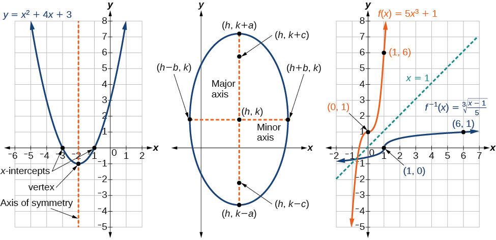

Welcome to *Algebra and Trigonometry*, an OpenStax resource. This textbook was written to increase student access to high-quality learning materials, maintaining highest standards of academic rigor at little to no cost.

### About OpenStax   {#eip-29}

OpenStax is a nonprofit based at Rice University, and it’s our mission to improve student access to education. Our first openly licensed college textbook was published in 2012, and our library has since scaled to over 20 books for college and AP courses used by hundreds of thousands of students. Our adaptive learning technology, designed to improve learning outcomes through personalized educational paths, is being piloted in college courses throughout the country. Through our partnerships with philanthropic foundations and our alliance with other educational resource organizations, OpenStax is breaking down the most common barriers to learning and empowering students and instructors to succeed.

### About OpenStax Resources   {#eip-714}

### Customization   {#eip-406}

*Algebra and Trigonometry* is licensed under a Creative Commons Attribution 4.0 International (CC BY) license, which means that you can distribute, remix, and build upon the content, as long as you provide attribution to OpenStax and its content contributors.

Because our books are openly licensed, you are free to use the entire book or pick and choose the sections that are most relevant to the needs of your course. Feel free to remix the content by assigning your students certain chapters and sections in your syllabus, in the order that you prefer. You can even provide a direct link in your syllabus to the sections in the web view of your book.

Instructors also have the option of creating a customized version of their OpenStax book. The custom version can be made available to students in low-cost print or digital form through their campus bookstore. Visit your book page on openstax.org for more information.

### Errata   {#eip-270}

All OpenStax textbooks undergo a rigorous review process. However, like any professional-grade textbook, errors sometimes occur. Since our books are web based, we can make updates periodically when deemed pedagogically necessary. If you have a correction to suggest, submit it through the link on your book page on openstax.org. Subject matter experts review all errata suggestions. OpenStax is committed to remaining transparent about all updates, so you will also find a list of past errata changes on your book page on openstax.org.

### Format   {#eip-626}

You can access this textbook for free in web view or PDF through openstax.org, and for a low cost in print.

### Coverage and Scope   {#eip-250}

In determining the concepts, skills, and topics to cover, we engaged dozens of highly experienced instructors with a range of student audiences. The resulting scope and sequence proceeds logically while allowing for a significant amount of flexibility in instruction.

Chapters 1 and 2 provide both a review and foundation for study of functions that begins in Chapter 3. The authors recognize that while some institutions may find this material a prerequisite, other institutions have told us that they have a cohort that needs the prerequisite skills built into the course.

Chapter 1: Prerequisites

Chapter 2: Equations and Inequalities

Chapters 3-6: The Algebraic Functions

Chapter 3: Functions

Chapter 4: Linear Functions

Chapter 5: Polynomial and Rational Functions

Chapter 6: Exponential and Logarithm Functions

Chapters 7-10: A Study of Trigonometry

Chapter 7: The Unit Circle: Sine and Cosine Functions

Chapter 8: Periodic Functions

Chapter 9: Trigonometric Identities and Equations

Chapter 10: Further Applications of Trigonometry

Chapters 11-13: Further Study in Algebra and Trigonometry

Chapter 11: Systems of Equations and Inequalities

Chapter 12: Analytic Geometry

Chapter 13: Sequences, Probability, and Counting Theory

All chapters are broken down into multiple sections, the titles of which can be viewed in the Table of Contents.

### Development Overview   {#eip-350}

OpenStax *Algebra and Trigonometry* is the product of a collaborative effort by a group of dedicated authors, editors, and instructors whose collective passion for this project has resulted in a text that is remarkably unified in purpose and voice. Special thanks is due to our Lead Author, Jay Abramson of Arizona State University, who provided the overall vision for the book and oversaw the development of each and every chapter, drawing up the initial blueprint, reading numerous drafts, and assimilating field reviews into actionable revision plans for our authors and editors.

The collective experience of our author team allowed us to pinpoint the subtopics, exceptions, and individual connections that give students the most trouble. The textbook is therefore replete with well-designed features and highlights which help students overcome these barriers. As the students read and practice, they are coached in methods of thinking through problems and internalizing mathematical processes.

### Accuracy of the Content   {#eip-42}

We understand that precision and accuracy are imperatives in mathematics, and undertook a dedicated accuracy program led by experienced faculty.

1.  Each chapter’s manuscript underwent rounds of review and revision by a panel of active instructors.
2.  Then, prior to publication, a separate team of experts checked all text, examples, and graphics for mathematical accuracy; multiple reviewers were assigned to each chapter to minimize the chances of any error escaping notice.
3.  A third team of experts was responsible for the accuracy of the Answer Key, dutifully re-working every solution to eradicate any lingering errors. Finally, the editorial team conducted a multi-round post-production review to ensure the integrity of the content in its final form.
{: data-number-style="arabic"}

### Pedagogical Foundations and Features   {#eip-563}

#### Learning Objectives   {#eip-61}

Each chapter is divided into multiple sections (or modules), each of which is organized around a set of learning objectives. The learning objectives are listed explicitly at the beginning of each section and are the focal point of every instructional element

#### Narrative text   {#eip-719}

Narrative text is used to introduce key concepts, terms, and definitions, to provide real-world context, and to provide transitions between topics and examples. Throughout this book, we rely on a few basic conventions to highlight the most important ideas:

Key terms are boldfaced, typically when first introduced and/or when formally defined.

Key concepts and definitions are called out in a blue box for easy reference.

#### Examples   {#eip-802}

Each learning objective is supported by one or more worked examples, that demonstrate the problem-solving approaches that students must master. The multiple Examples model different approaches to the same type of problem, or introduce similar problems of increasing complexity.

All Examples follow a simple two- or three-part format. The question clearly lays out a mathematical problem to solve. The Solution walks through the steps, usually providing context for the approach—in other words, why the instructor is solving the problem in a specific manner. Finally, the Analysis (for select Examples) reflects on the broader implications of the Solution just shown. Examples are followed by a Try It question, as explained below.

#### Figures   {#eip-236}

*Algebra and Trigonometry* contains figures and illustrations, the vast majority of which are graphs and diagrams. Art throughout the text adheres to a clear, understated style, drawing the eye to the most important information in each figure while minimizing visual distractions. Color contrast is employed with discretion to distinguish between the different functions or features of a graph.

#### Supporting Features   {#eip-22}

Four unobtrusive but important features contribute to and check understanding.

* 

  
  

  
  A **“How To”** is a list of steps necessary to solve a certain type of problem. A How To typically precedes an Example that proceeds to demonstrate the steps in action.
* 

  
  

  
  A **“Try It”** exercise immediately follows an Example or a set of related Examples, providing the student with an immediate opportunity to solve a similar problem. In the Web View version of the text, students can click an Answer link directly below the question to check their understanding. In the PDF, answers to the Try-It exercises are located in the Answer Key.
* 

  
  

  
  A **Q&amp;A** may appear at any point in the narrative, but most often follows an Example. This feature pre-empts misconceptions by posing a commonly asked yes/no question, followed by a detailed answer and explanation.
* 

  
  

  
  The **“Media”** icon appears at the conclusion of each section, just prior to the Section Exercises. This icon marks a list of links to online video tutorials that reinforce the concepts and skills introduced in the section.

While we have selected tutorials that closely align to our learning objectives, we did not produce these tutorials, nor were they specifically produced or tailored to accompany *Algebra and Trigonometry*.

#### Section Exercises   {#eip-166}

Each section of every chapter concludes with a well-rounded set of exercises that can be assigned as homework or used selectively for guided practice. With over 6300 exercises across the 13 chapters, instructors should have plenty from which to choose[1](#footnote1){: data-type="footnote-link"}.

Section Exercises are organized by question type, and generally appear in the following order:

**Verbal** questions assess conceptual understanding of key terms and concepts.

**Algebraic** problems require students to apply algebraic manipulations demonstrated in the section.

**Graphical** problems assess students’ ability to interpret or produce a graph.

**Numeric** problems require the student to perform calculations or computations.

**Technology** problems encourage exploration through use of a graphing utility, either to visualize or verify algebraic results or to solve problems via an alternative to the methods demonstrated in the section.

**Extensions** pose problems more challenging than the Examples demonstrated in the section. They require students to synthesize multiple learning objectives or apply critical thinking to solve complex problems.

**Real-World Applications** present realistic problem scenarios from fields such as physics, geology, biology, finance, and the social sciences.

#### Chapter Review Features   {#eip-82}

Each chapter concludes with a review of the most important takeaways, as well as additional practice problems that students can use to prepare for exams.

**Key Terms** provides a formal definition for each bold-faced term in the chapter.

**Key Equations** presents a compilation of formulas, theorems, and standard-form equations.

**Key Concepts** summarizes the most important ideas introduced in each section, linking back to the relevant Example(s) in case students need to review.

**Chapter Review Exercises** include 40-80 practice problems that recall the most important concepts from each section.

**Practice Test** includes 25-50 problems assessing the most important learning objectives from the chapter. Note that the practice test is not organized by section, and may be more heavily weighted toward cumulative objectives as opposed to the foundational objectives covered in the opening sections.

#### Additional Resources   {#eip-299}

##### Student and Instructor Resources   {#eip-656}

We’ve compiled additional resources for both students and instructors, including Getting Started Guides, instructor solution manual, and PowerPoint slides. Instructor resources require a verified instructor account, which can be requested on your openstax.org log-in. Take advantage of these resources to supplement your OpenStax book.

##### Partner Resources   {#eip-883}

OpenStax Partners are our allies in the mission to make high-quality learning materials affordable and accessible to students and instructors everywhere. Their tools integrate seamlessly with our OpenStax titles at a low cost. To access the partner resources for your text, visit your book page on openstax.org.

### About the Authors   {#eip-45}

#### Senior Contributing Authors   {#eip-679}

**Jay Abramson, Arizona State University*** * *
{: data-type="newline"}

 Jay Abramson has been teaching Precalculus for 33 years, the last 14 at Arizona State University, where he is a principal lecturer in the School of Mathematics and Statistics. His accomplishments at ASU include co-developing the university’s first hybrid and online math courses as well as an extensive library of video lectures and tutorials. In addition, he has served as a contributing author for two of Pearson Education’s math programs, NovaNet Precalculus and Trigonometry. Prior to coming to ASU, Jay taught at Texas State Technical College and Amarillo College. He received Teacher of the Year awards at both institutions.

#### Contributing Authors    {#eip-528}

Valeree Falduto, Palm Beach State College* * *
{: data-type="newline"}

 Rachael Gross, Towson University* * *
{: data-type="newline"}

 David Lippman, Pierce College* * *
{: data-type="newline"}

 Melonie Rasmussen, Pierce College* * *
{: data-type="newline"}

 Rick Norwood, East Tennessee State University* * *
{: data-type="newline"}

 Nicholas Belloit, Florida State College Jacksonville* * *
{: data-type="newline"}

 Jean-Marie Magnier, Springfield Technical Community College* * *
{: data-type="newline"}

 Harold Whipple* * *
{: data-type="newline"}

 Christina Fernandez

#### Reviewers   {#eip-956}

Phil Clark, Scottsdale Community College* * *
{: data-type="newline"}

 Michael Cohen, Hofstra University* * *
{: data-type="newline"}

 Charles Conrad, Volunteer State Community College* * *
{: data-type="newline"}

 David French, Tidewater Community College* * *
{: data-type="newline"}

 Matthew Goodell, SUNY Ulster* * *
{: data-type="newline"}

 Lance Hemlow, Raritan Valley Community College* * *
{: data-type="newline"}

 Dongrin Kim, Arizona State University* * *
{: data-type="newline"}

 Cynthia Landrigan, Eerie Community College* * *
{: data-type="newline"}

 Wendy Lightheart, Lane Community College* * *
{: data-type="newline"}

 Chinenye Ofodile, Albany State University* * *
{: data-type="newline"}

 Carl Penziul, Tompkins-Cortland Community College* * *
{: data-type="newline"}

 Sandra Nite, Texas A&amp;M University* * *
{: data-type="newline"}

 Eugenia Peterson, Richard J. Daley College* * *
{: data-type="newline"}

 Rhonda Porter, Albany State University* * *
{: data-type="newline"}

 Michael Price, University of Oregon* * *
{: data-type="newline"}

 Steven Purtee, Valencia College* * *
{: data-type="newline"}

 William Radulovich, Florida State College Jacksonville* * *
{: data-type="newline"}

 Camelia Salajean, City Colleges of Chicago* * *
{: data-type="newline"}

 Katy Shields, Oakland Community College* * *
{: data-type="newline"}

 Nathan Schrenk, ECPI University* * *
{: data-type="newline"}

 Pablo Suarez, Delaware State University* * *
{: data-type="newline"}

 Allen Wolmer, Atlanta Jewish Academy* * *
{: data-type="newline"}

The following faculty contributed to the development of OpenStax *Precalculus*, the text from which this product was updated and derived.* * *
{: data-type="newline"}

 **Precalculus Reviewers*** * *
{: data-type="newline"}

 Nina Alketa, Cecil College* * *
{: data-type="newline"}

 Kiran Bhutani, Catholic University of America* * *
{: data-type="newline"}

 Brandie Biddy, Cecil College* * *
{: data-type="newline"}

 Lisa Blank, Lyme Central School* * *
{: data-type="newline"}

 Bryan Blount, Kentucky Wesleyan College* * *
{: data-type="newline"}

 Jessica Bolz, The Bryn Mawr School* * *
{: data-type="newline"}

 Sheri Boyd, Rollins College* * *
{: data-type="newline"}

 Sarah Brewer, Alabama School of Math and Science* * *
{: data-type="newline"}

 Charles Buckley, St. Gregory\'s University* * *
{: data-type="newline"}

 Michael Cohen, Hofstra University* * *
{: data-type="newline"}

 Kenneth Crane, Texarkana College* * *
{: data-type="newline"}

 Rachel Cywinski, Alamo Colleges* * *
{: data-type="newline"}

 Nathan Czuba* * *
{: data-type="newline"}

 Srabasti Dutta, Ashford University* * *
{: data-type="newline"}

 Kristy Erickson, Cecil College* * *
{: data-type="newline"}

 Nicole Fernandez, Georgetown University / Kent State University* * *
{: data-type="newline"}

 David French, Tidewater Community College* * *
{: data-type="newline"}

 Douglas Furman, SUNY Ulster* * *
{: data-type="newline"}

 Lance Hemlow, Raritan Valley Community College* * *
{: data-type="newline"}

 Erinn Izzo, Nicaragua Christian Academy* * *
{: data-type="newline"}

 John Jaffe* * *
{: data-type="newline"}

 Jerry Jared, Blue Ridge School* * *
{: data-type="newline"}

 Stan Kopec, Mount Wachusett Community College* * *
{: data-type="newline"}

 Kathy Kovacs* * *
{: data-type="newline"}

 Cynthia Landrigan, Erie Community College* * *
{: data-type="newline"}

 Sara Lenhart, Christopher Newport University* * *
{: data-type="newline"}

 Wendy Lightheart, Lane Community College* * *
{: data-type="newline"}

 Joanne Manville, Bunker Hill Community College* * *
{: data-type="newline"}

 Karla McCavit, Albion College* * *
{: data-type="newline"}

 Cynthia McGinnis, Northwest Florida State College* * *
{: data-type="newline"}

 Lana Neal, University of Texas at Austin* * *
{: data-type="newline"}

 Rhonda Porter, Albany State University* * *
{: data-type="newline"}

 Steven Purtee, Valencia College* * *
{: data-type="newline"}

 William Radulovich, Florida State College Jacksonville* * *
{: data-type="newline"}

 Alice Ramos, Bethel College* * *
{: data-type="newline"}

 Nick Reynolds, Montgomery Community College* * *
{: data-type="newline"}

 Amanda Ross, A. A. Ross Consulting and Research, LLC* * *
{: data-type="newline"}

 Erica Rutter, Arizona State University* * *
{: data-type="newline"}

 Sutandra Sarkar, Georgia State University* * *
{: data-type="newline"}

 Willy Schild, Wentworth Institute of Technology* * *
{: data-type="newline"}

 Todd Stephen, Cleveland State University* * *
{: data-type="newline"}

 Scott Sykes, University of West Georgia* * *
{: data-type="newline"}

 Linda Tansil, Southeast Missouri State University* * *
{: data-type="newline"}

 John Thomas, College of Lake County* * *
{: data-type="newline"}

 Diane Valade, Piedmont Virginia Community College* * *
{: data-type="newline"}

 Allen Wolmer, Atlanta Jewish Academy

### Footnotes
{: data-type="footnote-refs-title"}

* {: data-type="footnote-ref" #footnote1} [1](#footnote-ref1){: data-type="footnote-ref-link"} 6,367 total exercises. Includes Chapter Reviews and Practice Tests.
{: data-list-type="bulleted" data-bullet-style="none"}

